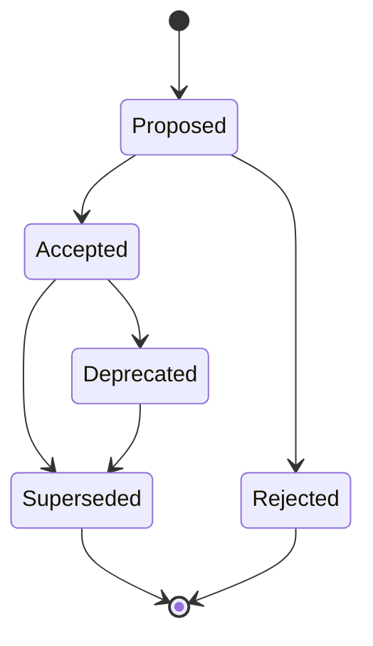
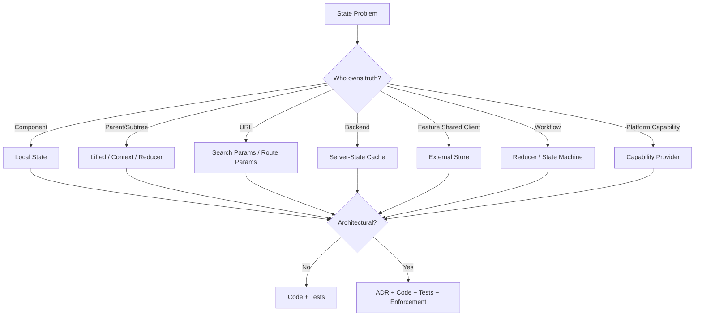

# Part 104 — Architecture Decision Records for React State

A React state decision becomes architectural when it changes how engineers reason about ownership, lifecycle, mutation, performance, correctness, or release safety.

An Architecture Decision Record, or ADR, captures that decision with context and consequences. It prevents the most expensive form of frontend knowledge loss:

```txt
“We use this store/provider/cache because someone chose it two years ago, but nobody remembers why.”
```

This part gives you a practical ADR system specifically for React state, Hooks, Context, external stores, server-state cache, workflow machines, and microfrontend boundaries.

---

## 1. Why React State Needs ADRs

React state decisions are deceptively local.

A small choice like this:

```tsx
const [selectedCaseId, setSelectedCaseId] = useState<string | null>(null);
```

can later become:

- lifted state
- URL state
- context state
- external store state
- server query parameter
- workflow machine context
- microfrontend event payload

If the transition is not recorded, the codebase accumulates implicit architecture.

ADR-worthy state decisions usually affect one or more of these:

| Dimension | Example |
|---|---|
| Ownership | Who owns selected case state? |
| Lifecycle | Does state survive reload/navigation/session? |
| Authority | Is this client-owned or server-owned? |
| Sharing radius | Is state local, subtree, route-wide, app-wide, or cross-app? |
| Mutation policy | Are updates setters, reducer events, commands, or server mutations? |
| Performance | Does this create provider fan-out or store over-subscription? |
| Testing | Can the state transition be tested independently? |
| Release safety | Can two features/remotes evolve independently? |
| Auditability | Can we explain why user action was enabled/blocked? |

---

## 2. ADRs Are Not Documentation Theater

Bad ADR:

```txt
We decided to use Zustand because it is simple.
```

Good ADR:

```txt
We decided to use a feature-scoped Zustand store for the case workbench selection model because:
- selection is shared across toolbar, table, keyboard shortcuts, and side panel
- update frequency is moderate but affects many non-parent/child components
- URL should contain only committed filter/search state, not volatile selection
- Context caused unnecessary rerender fan-out during keyboard navigation
- Redux Toolkit is not needed because transitions are feature-local and do not require organization-wide middleware/governance
```

A useful ADR explains:

- the force acting on the system
- the options considered
- the chosen trade-off
- the consequences
- the failure mode it accepts
- the future migration path

---

## 3. When to Write a React State ADR

Write an ADR when the decision would be expensive to reverse or likely to be argued again.

### Write ADRs for these

```txt
[ ] Choosing Context vs Zustand vs Redux Toolkit
[ ] Introducing TanStack Query / RTK Query / custom server-state cache
[ ] Moving route filters into URL state
[ ] Creating a shared provider used by many features
[ ] Creating a global overlay/modal orchestration layer
[ ] Introducing a state machine for a workflow
[ ] Persisting client state in localStorage/IndexedDB
[ ] Sharing state across microfrontends
[ ] Introducing React Compiler constraints
[ ] Changing component library controlled/uncontrolled policy
[ ] Centralizing permission-aware UI behavior
[ ] Normalizing client-side entity state
[ ] Creating a cross-feature event bus
```

### Usually no ADR needed

```txt
[ ] Local input state inside one component
[ ] useState vs useReducer for a tiny isolated component
[ ] Internal ref for focus or timer
[ ] One-off memoization after profiler finding
[ ] Component-specific derived value
```

Exception: a small local choice may need an ADR if it establishes a reusable pattern.

---

## 4. React State ADR Template

Use this template for frontend state decisions.

```mdx
# ADR-XXXX: <Decision Title>

## Status

Proposed | Accepted | Superseded | Deprecated | Rejected

## Date

YYYY-MM-DD

## Decision Drivers

- <force 1>
- <force 2>
- <force 3>

## Context

What problem are we solving?
What state exists?
Who reads it?
Who mutates it?
What are the failure modes today?

## State Classification

- State kind: local | lifted | context | URL | server | external store | workflow | persistent | capability
- Owner:
- Mutators:
- Observers:
- Lifecycle:
- Authority:
- Reset boundary:
- Serialization requirement:
- Performance sensitivity:

## Options Considered

### Option A — <name>

Pros:
- ...

Cons:
- ...

Failure modes:
- ...

### Option B — <name>

Pros:
- ...

Cons:
- ...

Failure modes:
- ...

## Decision

We will ...

## Consequences

Positive:
- ...

Negative:
- ...

Neutral / accepted trade-offs:
- ...

## Implementation Rules

- ...

## Migration Plan

1. ...
2. ...
3. ...

## Enforcement

- tests
- lint rules
- code owners
- package boundaries
- review checklist

## Review Date

YYYY-MM-DD or condition

## References

- ...
```

This template is intentionally state-specific. Generic ADRs often miss owner, lifecycle, authority, and reset boundary—the exact things that make frontend state hard.

---

## 5. State Classification Block

The most important section is state classification.

```txt
State kind:
Owner:
Mutators:
Observers:
Lifecycle:
Authority:
Reset boundary:
Serialization:
Performance sensitivity:
Concurrency risk:
Persistence/privacy risk:
```

Example:

```txt
State kind: URL state + server state
Owner: route/search params own committed filters; backend owns result data
Mutators: filter form submit, saved view selection, back/forward navigation
Observers: search page, export button, dashboard breadcrumb
Lifecycle: survives reload and can be shared
Authority: URL for filter intent, backend for data
Reset boundary: route change or clear filters action
Serialization: required, compact, non-sensitive
Performance sensitivity: medium; query key changes trigger fetch
Concurrency risk: low
Persistence/privacy risk: avoid personal notes and raw free-text if logging policy disallows it
```

This block forces precision before tooling arguments begin.

---

## 6. Decision Drivers for React State

A decision driver is a pressure that makes one option better than another.

Common drivers:

### Driver: Locality

State should stay near the component that owns it unless another owner has a real reason to read or mutate it.

### Driver: Shareability

If users expect bookmark, reload, share, or browser back support, the state probably belongs in the URL.

### Driver: Authority

If backend owns the truth, the frontend should model cache, not canonical state.

### Driver: Volatility

High-frequency state is dangerous in Context because provider changes fan out to consumers.

### Driver: Invariants

If updates must obey transition rules, raw setters are insufficient. Use reducer or state machine.

### Driver: Governance

If many teams mutate a shared state model, Redux Toolkit-style conventions or strict external store API may be justified.

### Driver: Release Independence

If a boundary crosses microfrontends, avoid shared mutable memory unless explicitly versioned and governed.

### Driver: Auditability

Permission, workflow, and destructive action state need decision objects and traceability.

---

## 7. Example ADR — Use URL State for Case Search Filters

```mdx
# ADR-0017: Store committed case search filters in URL search params

## Status

Accepted

## Date

2026-07-08

## Decision Drivers

- Search results must be shareable between investigators.
- Browser back/forward must restore filter state.
- Reload should not lose committed search state.
- Draft input while typing should not trigger every query.
- Filters must become part of TanStack Query key.

## Context

The case search page currently keeps filters in component state. Users copy links but recipients see default filters. Back/forward navigation also loses intent. Several components need to observe committed filters: results table, export button, saved-search indicator, and breadcrumb.

## State Classification

- State kind: URL state for committed filters, local state for draft inputs
- Owner: router/search params
- Mutators: submit filter form, clear filters, saved-search load, browser navigation
- Observers: table query hook, export action, breadcrumb, saved-search indicator
- Lifecycle: survives reload/share/back-forward
- Authority: URL owns filter intent; backend owns result data
- Reset boundary: clear filters or route change
- Serialization requirement: compact query params
- Performance sensitivity: medium; committed change triggers query refetch

## Options Considered

### Option A — Keep filters in local component state

Pros:
- Simple
- No serialization

Cons:
- Not shareable
- Back/forward broken
- Export button needs prop threading

Failure modes:
- User thinks link includes filters but it does not

### Option B — Store filters in Context

Pros:
- Easy subtree sharing

Cons:
- Not shareable
- Still not reload-safe
- Provider lifetime unclear

Failure modes:
- Context becomes page-global dumping ground

### Option C — Store committed filters in URL; keep draft local

Pros:
- Shareable
- Back/forward works
- Query key is deterministic
- Draft typing does not refetch

Cons:
- Requires parse/serialize schema
- URL privacy rules required

Failure modes:
- Poor canonicalization can create duplicate URLs

## Decision

We will store committed case search filters in URL search params. Draft filter input remains local until the user submits or applies filters.

## Consequences

Positive:
- Search links become reproducible
- Query key can derive from canonical filters
- Export and breadcrumb can read committed state

Negative:
- Need parser/canonicalizer
- Need URL privacy policy

## Implementation Rules

- Use `parseCaseSearchParams(searchParams)`.
- Use `serializeCaseSearchParams(filters)`.
- Unknown values are ignored or canonicalized.
- Free-text filters are included only if allowed by privacy policy.
- Query keys must use parsed canonical filter object.

## Enforcement

- Unit tests for parser/serializer round trip
- E2E test for back/forward navigation
- Review checklist for new filters
```

---

## 8. Example ADR — Use TanStack Query for Server State

```mdx
# ADR-0021: Use TanStack Query for case-management server state

## Status

Accepted

## Decision Drivers

- Multiple pages fetch overlapping server resources.
- Manual `useEffect` fetch logic creates duplicate request, race, and stale UI bugs.
- Mutations need invalidation and optimistic update patterns.
- Loading/error state must be consistent across product surfaces.

## Context

Case detail, task list, comments, penalties, and activity timeline are server-owned resources. Current pages fetch with local Effects and store results in component state. There is no shared invalidation model after mutation.

## State Classification

- State kind: server state cache
- Owner: backend owns truth; QueryClient owns cache
- Mutators: mutations through domain API hooks
- Observers: route-level pages and feature components
- Lifecycle: cache lifetime controlled by query config
- Authority: backend
- Reset boundary: query invalidation, logout, tenant change
- Serialization requirement: query keys must be serializable
- Performance sensitivity: high on case detail pages

## Options Considered

### Option A — Continue fetching in `useEffect`

Pros:
- No new library

Cons:
- Manual race handling
- No global invalidation
- Repeated boilerplate
- SSR/preload harder

### Option B — Store server data in Redux/Zustand

Pros:
- One familiar shared store

Cons:
- Requires custom cache lifecycle
- Server freshness/invalidation becomes hand-rolled
- High risk of treating cache as authority

### Option C — Use TanStack Query

Pros:
- Query key model
- Cache lifecycle
- Invalidation
- Mutations
- Optimistic update support
- Devtools and ecosystem

Cons:
- Requires query key governance
- Requires clear distinction between server state and client state

## Decision

We will use TanStack Query for server-owned state. Client workflow state remains in local reducers/state machines or feature stores.

## Implementation Rules

- Every query uses a query key factory.
- Query hooks live in feature/domain API layer.
- Mutations must define invalidation or direct cache update policy.
- Do not copy query data into client store unless creating a deliberate draft.
- Logout clears sensitive query cache.

## Enforcement

- ESLint/review rule against new `useEffect` data fetching in pages without justification
- Query key factory tests
- Mutation impact map in feature docs
```

---

## 9. Example ADR — Do Not Use Context for High-Frequency Selection State

```mdx
# ADR-0028: Use selector-based feature store for workbench selection state

## Status

Accepted

## Decision Drivers

- Selection changes frequently via mouse and keyboard.
- Toolbar, side panel, table rows, shortcut manager, and bulk action bar need selection state.
- Context caused broad rerenders on every selection change.
- State is not shareable/bookmarkable and should not be in URL.

## Context

The enforcement workbench needs row selection state across non-parent/child components. Initial implementation used Context with `{ selectedIds, setSelectedIds }`. Profiling showed wide rerender fan-out during keyboard selection.

## State Classification

- State kind: shared client state, feature-scoped external store
- Owner: workbench feature
- Mutators: row selection commands, keyboard shortcuts, clear action
- Observers: toolbar, row checkbox, bulk panel, side panel
- Lifecycle: route/page lifetime
- Authority: client
- Reset boundary: route leave, dataset change, explicit clear
- Serialization: not required
- Performance sensitivity: high

## Options Considered

### Option A — Keep Context

Pros:
- Simple
- No external dependency

Cons:
- Provider value changes rerender broad subtree
- Needs heavy component splitting/memoization

### Option B — Lift state to page and prop drill

Pros:
- Explicit

Cons:
- Prop threading through unrelated layers
- Still broad render radius

### Option C — Feature-scoped selector store

Pros:
- Fine-grained subscription
- Feature-owned
- No URL leakage
- Better keyboard performance

Cons:
- More abstraction
- Requires store lifecycle discipline

## Decision

Use a feature-scoped selector-based store for workbench selection state.

## Implementation Rules

- Store is created per workbench route instance.
- Expose hooks such as `useIsCaseSelected(caseId)` and commands such as `toggleCaseSelection(caseId)`.
- Do not expose raw root state.
- Reset when dataset identity changes.

## Enforcement

- Performance regression test for large selection list
- Unit tests for selection invariants
- Public API exports only from `features/workbench-selection`
```

---

## 10. Example ADR — State Machine for Approval Workflow

```mdx
# ADR-0034: Model approval submission as a finite state machine

## Status

Accepted

## Decision Drivers

- Approval workflow has mutually exclusive states.
- Several invalid transitions currently occur in edge cases.
- Async server validation can complete after user cancels.
- Audit and permission decisions must be explainable.

## Context

Approval UI currently uses booleans: `isSubmitting`, `isConfirmOpen`, `hasError`, `isSuccess`, `isValidating`. Bug reports show impossible states such as success banner while confirmation modal remains open.

## State Classification

- State kind: workflow state
- Owner: approval feature
- Mutators: workflow events
- Observers: approval panel, confirmation modal, audit note, submit button
- Lifecycle: case detail route lifetime
- Authority: client owns UI phase; backend owns final approval state
- Reset boundary: case change or completed action
- Serialization: no, except audit command payload
- Performance sensitivity: low
- Concurrency risk: high due to async validation/submit

## Options Considered

### Option A — Continue with booleans

Pros:
- Minimal rewrite

Cons:
- Impossible states remain possible
- Edge transitions spread across handlers

### Option B — `useReducer` transition model

Pros:
- Consolidates transitions
- Easy to test

Cons:
- Invoked async lifecycle still manual

### Option C — State machine with invoked services

Pros:
- Explicit states/transitions
- Guards/actions separated
- Async service cancellation model
- Better visualization/testing

Cons:
- New mental model for some engineers

## Decision

Use a finite state machine for approval submission workflow.

## Implementation Rules

- Machine states must be named by product phase, not booleans.
- Backend mutation remains in service/action boundary.
- Every async response must match current request id or actor lifecycle.
- Permission denial is an expected transition, not generic error.

## Enforcement

- Transition table tests
- Storybook stories for every state
- E2E test for cancel-while-submitting
```

---

## 11. Example ADR — No Cross-Microfrontend Shared Domain Store

```mdx
# ADR-0042: Do not share a mutable domain store across microfrontends

## Status

Accepted

## Decision Drivers

- Microfrontends are independently deployed.
- Shared mutable store creates release coupling.
- Backend owns case lifecycle authority.
- Cross-MFE coordination should be explicit and versioned.

## Context

Several remotes need to react when a case is updated. A proposal suggested a shared `caseStore` utility module imported by every remote.

## State Classification

- State kind: server state + cross-app notification event
- Owner: backend owns case state; shell owns event bridge
- Mutators: API mutations through feature remotes
- Observers: other remotes via invalidation/refetch
- Lifecycle: entity lifecycle is server-owned
- Authority: backend
- Reset boundary: logout/tenant switch/cache invalidation
- Serialization: event payload must be versioned
- Release risk: high

## Options Considered

### Option A — Shared mutable case store

Pros:
- Immediate in-browser synchronization

Cons:
- Hidden coupling
- Version drift risk
- Cache becomes mistaken for authority
- Hard to audit mutation source

### Option B — Each remote fetches independently, no coordination

Pros:
- Strong isolation

Cons:
- Stale UI after mutation
- Poor UX consistency

### Option C — Versioned invalidation events + server refetch

Pros:
- Explicit contract
- Backend remains authority
- Remotes stay independently deployable
- Event payload stays small

Cons:
- Requires event schema and invalidation handling

## Decision

Use versioned invalidation events and server refetch. Do not share mutable domain store across remotes.

## Implementation Rules

- Mutation remote publishes `case.updated` with `{ caseId, reason }`.
- Receiving remotes invalidate/refetch their own query cache.
- Event payload does not carry full canonical entity.
- Event schema includes `version`.

## Enforcement

- Package boundary rule preventing import of remote internals
- Contract tests for event schema
- Shell integration test for mutation/refetch flow
```

---

## 12. Consequences Section: The Most Important Part

Every decision has costs. A weak ADR hides them.

Bad:

```txt
Consequences: cleaner state management.
```

Good:

```txt
Positive:
- Query invalidation becomes consistent.
- Fetch race handling moves out of components.
- Loading/error states become easier to standardize.

Negative:
- Engineers must learn query key design.
- Cache lifetime decisions need review.
- Tests need QueryClient harness.

Accepted risks:
- Some mutation flows may initially over-invalidate.
- Query key namespace may need refactoring as API grows.
```

Architecture is trade-off accounting.

---

## 13. How to Compare Options

Use this matrix.

| Option | Locality | Correctness | Performance | Testability | Team Governance | Migration Cost | Reversal Cost |
|---|---:|---:|---:|---:|---:|---:|---:|
| Local state | high | medium | high | high | high | low | low |
| Lifted state | medium | medium | medium | medium | high | low-medium | medium |
| Context | medium | medium | low-medium | medium | medium | medium | medium |
| Reducer + Context | medium | high | medium | high | medium | medium | medium |
| External store | medium | high | high | high | medium | medium-high | high |
| Redux Toolkit | medium | high | high | high | high | high | high |
| URL state | high for navigation | high | medium | high | high | medium | medium |
| TanStack Query | high for server state | high | high | high | medium | medium | medium-high |
| State machine | high for workflow | very high | medium | very high | medium | medium-high | medium-high |

Do not treat the scores as universal. Use them as prompts.

---

## 14. ADR Enforcement

A decision that is not enforced becomes trivia.

Enforcement options:

### Code boundaries

```txt
features/case-search/
  model/
  api/
  ui/
  index.ts   <-- public API only
```

Prevent imports from internal folders.

### Lint rules

Examples:

- disallow importing global store from feature internals
- disallow `useEffect` fetch in route components without allowlist
- disallow raw context usage outside custom hook
- disallow direct localStorage access outside persistence adapter

### Tests

- reducer transition tests
- query key factory tests
- URL parser round-trip tests
- event contract tests
- machine transition tests
- permission decision tests

### Runtime guards

- strict context hook
- event payload validation
- schema version checks
- provider presence checks
- feature flag fallback

### Review checklists

Every PR touching state boundary should answer:

```txt
What state kind is this?
Who owns it?
Who mutates it?
What resets it?
Could it be derived?
Does it need persistence?
Does it need URL/shareability?
Does it duplicate server state?
Does it widen render radius?
Does it need an ADR update?
```

---

## 15. ADR Lifecycle

ADRs are not eternal laws. They are historical decisions with status.



### Status meanings

| Status | Meaning |
|---|---|
| Proposed | Under review; do not implement broadly yet |
| Accepted | Current decision |
| Rejected | Considered but not chosen |
| Deprecated | Still exists but should not be used for new work |
| Superseded | Replaced by another ADR |

Every superseded ADR should link to the replacement.

---

## 16. ADR Naming Convention

Use names that describe the decision, not the tool.

Weak:

```txt
ADR-0010-zustand.md
```

Better:

```txt
ADR-0010-use-feature-scoped-selector-store-for-workbench-selection.md
```

Weak:

```txt
ADR-0011-tanstack-query.md
```

Better:

```txt
ADR-0011-use-server-state-cache-for-case-api-resources.md
```

Tool names can change. Decision intent should remain understandable.

---

## 17. ADR Folder Structure

Simple structure:

```txt
docs/
  adr/
    0001-use-url-state-for-case-search-filters.md
    0002-use-server-state-cache-for-case-api-resources.md
    0003-use-state-machine-for-approval-submission.md
    index.md
```

For large organizations:

```txt
docs/
  adr/
    frontend/
      state/
      routing/
      design-system/
      microfrontend/
    backend/
    platform/
```

Do not over-structure too early. A searchable flat directory is often enough.

---

## 18. ADR Index

Maintain a small index.

```mdx
# Architecture Decision Records

| ADR | Title | Status | Owner | Date |
|---|---|---|---|---|
| 0017 | Store committed case search filters in URL search params | Accepted | Case Platform | 2026-07-08 |
| 0021 | Use server-state cache for case API resources | Accepted | Frontend Platform | 2026-07-08 |
| 0034 | Model approval submission as a finite state machine | Accepted | Enforcement Workflow | 2026-07-08 |
| 0042 | Do not share mutable domain store across microfrontends | Accepted | Frontend Architecture | 2026-07-08 |
```

The index helps onboarding and prevents repeated arguments.

---

## 19. Linking ADRs to Code

ADR is useful only if code points back to it.

Example:

```ts
// ADR-0021: server-owned case resources use TanStack Query.
export function useCaseDetail(caseId: string) {
  return useQuery({
    queryKey: caseKeys.detail(caseId),
    queryFn: () => caseApi.getCase(caseId),
  });
}
```

But do not litter every line. Link at boundary files:

- provider module
- store factory
- query key factory
- state machine definition
- route parser
- event contract
- package boundary config

---

## 20. ADRs and Refactoring

A good ADR includes migration path.

Example migration from Context to selector store:

```txt
1. Keep existing Provider API.
2. Introduce internal feature store behind Provider.
3. Replace broad `useWorkbenchContext()` reads with selector hooks.
4. Measure render radius.
5. Deprecate raw context export.
6. Remove old provider value shape after two releases.
```

This avoids rewrite-driven architecture.

---

## 21. ADRs and Performance

Do not write performance ADRs without measurement.

Include:

```txt
- symptom
- profiler evidence
- current actualDuration/baseDuration if available
- interaction affected
- target behavior
- options considered
- expected blast radius
- validation plan after implementation
```

Example:

```txt
Profiling keyboard row selection showed that selecting one row re-rendered the entire workbench subtree. The broad render radius came from Context value identity changes. We will replace selection Context with a feature-scoped selector store and validate with React Profiler on a 5,000-row virtualized list fixture.
```

---

## 22. ADRs and Permissions

Permission state almost always deserves explicit documentation.

Questions:

```txt
Is frontend permission only UX guard?
Where is final authorization enforced?
What does disabled vs hidden mean?
How is denial reason represented?
How are stale permission decisions handled?
What is logged/audited?
```

Example decision:

```txt
Frontend permission gates may hide navigation affordances for unavailable capabilities, but destructive action buttons remain visible as disabled with reason tooltip when the user can see the resource but lacks action permission. Backend remains final enforcement point. Permission API returns structured decision objects.
```

This prevents inconsistent UX and dangerous security assumptions.

---

## 23. ADRs and Component Library Contracts

Component library state policies should be documented.

ADR-worthy examples:

- all input-like components support controlled and uncontrolled modes
- compound components use strict context hooks
- polymorphic components restrict dangerous host elements
- modal close events include close reason
- headless primitives own accessibility behavior but not visual styling
- design-system state uses CSS variables for theme/density

Example:

```txt
ADR-0050: Modal components emit structured close reasons

Decision:
All modal-like primitives emit `onOpenChange(nextOpen, meta)` where `meta.reason` is one of `escape`, `backdrop`, `close-button`, `programmatic`, or `submit-success`.

Consequence:
Consumers can distinguish accidental dismissal from successful completion without reverse-engineering DOM events.
```

---

## 24. Common ADR Anti-Patterns

### Anti-pattern 1 — Tool-first ADR

```txt
We chose Redux because it is scalable.
```

Fix:

```txt
We chose Redux Toolkit because this state is mutated by six teams, needs action logging, middleware-based workflow integration, normalized entity storage, and stronger governance than feature-scoped stores.
```

### Anti-pattern 2 — No rejected options

If the ADR does not show rejected options, it cannot prevent future relitigation.

### Anti-pattern 3 — No consequences

Every decision has negative consequences. Hiding them reduces trust.

### Anti-pattern 4 — ADR after implementation only

Post-hoc ADRs often rationalize instead of decide. Write before broad rollout.

### Anti-pattern 5 — Too much prose, no rule

An ADR should produce actionable rules.

Bad:

```txt
Use Context carefully.
```

Good:

```txt
Context may be used for low-frequency subtree dependencies. High-frequency interaction state must use local state, selector store, or reducer boundary. Provider values containing objects/functions must be memoized or split.
```

### Anti-pattern 6 — Never revisited

Old ADRs become dangerous when React, the framework, routing model, or org topology changes.

---

## 25. ADR Review Checklist

Before accepting a React state ADR:

```txt
[ ] Does it classify the state kind?
[ ] Does it name the owner?
[ ] Does it name mutators and observers?
[ ] Does it define lifecycle and reset boundary?
[ ] Does it distinguish client-owned from server-owned state?
[ ] Does it explain why simpler options were rejected?
[ ] Does it include negative consequences?
[ ] Does it define implementation rules?
[ ] Does it define enforcement?
[ ] Does it mention migration/reversal path?
[ ] Does it include tests or observability impact?
[ ] Does it have a review/supersession condition?
```

---

## 26. How ADRs Improve Engineering Speed

ADRs look like overhead. In a serious codebase, they reduce repeated debate.

They help engineers answer:

```txt
Should this state be in URL?
Should this use Context?
Why do we use TanStack Query here?
Why not put this in Redux?
Why is this workflow a state machine?
Why can't this remote import that store?
Why does this component expose close reason?
```

Without ADRs, every engineer rediscovers architecture through code archaeology.

With ADRs, architecture becomes searchable memory.

---

## 27. Final Mental Model

React state architecture is a series of ownership decisions.



Use ADRs when the decision shapes how other engineers must build.

Not every state choice deserves an ADR.

But every state architecture needs memory.

---

## References

- React — Managing State: https://react.dev/learn/managing-state
- React — Sharing State Between Components: https://react.dev/learn/sharing-state-between-components
- React — Scaling Up with Reducer and Context: https://react.dev/learn/scaling-up-with-reducer-and-context
- React — useSyncExternalStore: https://react.dev/reference/react/useSyncExternalStore
- Architecture Decision Records: https://adr.github.io/
- Decision Record Template by Michael Nygard: https://github.com/joelparkerhenderson/architecture-decision-record/blob/main/locales/en/templates/decision-record-template-by-michael-nygard/index.md
- TanStack Query — Query Invalidation: https://tanstack.com/query/latest/docs/framework/react/guides/query-invalidation
- Redux Toolkit: https://redux-toolkit.js.org/
