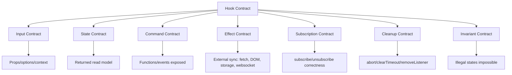
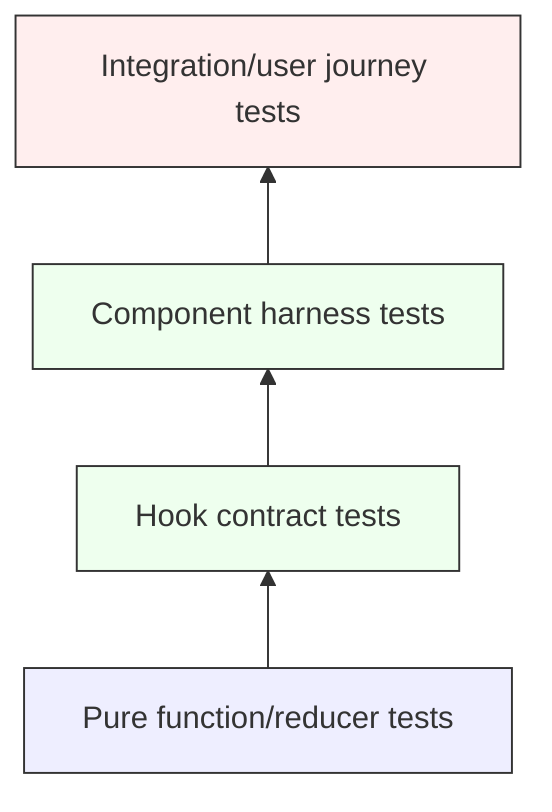

# Part 105 — Testing Hooks

Hook test yang bagus tidak bertanya:

> “Apakah `useEffect` dipanggil?”

Hook test yang bagus bertanya:

> “Jika consumer menggunakan protocol hook ini dengan event, dependency, provider, dan external system tertentu, apakah output, command, cleanup, dan invariant-nya benar?”

Custom hook bukan sekadar function helper. Custom hook adalah **stateful protocol boundary**. Ia bisa punya input, output, command, lifecycle, subscription, async request, cleanup, cache, timer, dan dependency injection. Karena itu, testing hook harus lebih dekat ke testing **contract** daripada testing implementation detail.

Kita tidak mengetes Hook karena Hook itu “keren”. Kita mengetes Hook karena Hook sering menjadi tempat tersembunyi untuk bug yang sulit dilihat dari snapshot UI:

- stale closure;
- dependency effect salah;
- cleanup bocor;
- duplicate request karena Strict Mode;
- race condition response lama mengalahkan response baru;
- external store snapshot tidak stabil;
- provider wrapper salah;
- callback command bocor sebagai raw setter;
- optimistic state tidak rollback;
- reducer menerima event ilegal;
- timer tidak dibersihkan saat unmount.

Bagian ini membahas cara mengetes Hook sebagai **behavioral unit** yang tetap sesuai mental model React modern.

---

## 1. Testing Hook: Apa Yang Sebenarnya Diuji?

Sebuah Hook bisa memiliki beberapa jenis kontrak.



Contoh Hook kecil:

```tsx
function useDisclosure(initialOpen = false) {
  const [open, setOpen] = React.useState(initialOpen);

  return {
    open,
    openPanel: () => setOpen(true),
    closePanel: () => setOpen(false),
    togglePanel: () => setOpen((v) => !v),
  };
}
```

Yang perlu diuji bukan “dia memakai `useState`”. Yang perlu diuji:

- initial state benar;
- `openPanel` menghasilkan `open=true`;
- `closePanel` menghasilkan `open=false`;
- `togglePanel` memakai updater function sehingga aman dari stale snapshot;
- API tidak membocorkan raw setter kalau consumer tidak boleh set sembarang nilai;
- state tiap pemanggilan Hook terisolasi.

Testing Hook berarti mengetes **behavior yang dijanjikan Hook kepada consumer**.

---

## 2. Test Pyramid Untuk Hooks

Jangan semua hal dites lewat `renderHook`. Banyak logic Hook bisa dan harus dipecah ke pure function/reducer agar lebih deterministik.



### Level 1 — Pure reducer/function tests

Paling murah, cepat, dan stabil.

Cocok untuk:

- transition logic;
- validation logic;
- selector logic;
- state machine resolver;
- query key factory;
- normalization helper;
- permission decision;
- serializer/deserializer.

### Level 2 — Hook contract tests

Cocok untuk memastikan Hook wiring benar:

- initial state;
- command function;
- rerender dengan input baru;
- provider wrapper;
- effect cleanup;
- subscription;
- timer;
- async result;
- external system adapter.

### Level 3 — Component harness tests

Lebih representatif daripada `renderHook` ketika Hook sebenarnya adalah interaction protocol.

Cocok untuk:

- Hook dipakai oleh button/input/list;
- Hook mengatur focus;
- Hook bergantung pada DOM event;
- Hook mengatur accessibility attribute;
- Hook memakai transition/Suspense/form.

### Level 4 — Integration/user journey tests

Cocok untuk workflow lintas Hook, provider, cache, route, dan component.

Rule praktis:

> Test pure logic sebagai pure logic. Test Hook wiring sebagai Hook. Test user behavior sebagai component. Jangan memaksa semua hal masuk satu level.

---

## 3. Setup Minimal Testing Stack

Contoh dengan Vitest + React Testing Library.

```tsx
// test/setup.ts
import '@testing-library/jest-dom/vitest';
import { afterEach } from 'vitest';
import { cleanup } from '@testing-library/react';

afterEach(() => {
  cleanup();
});
```

```ts
// vitest.config.ts
import { defineConfig } from 'vitest/config';
import react from '@vitejs/plugin-react';

export default defineConfig({
  plugins: [react()],
  test: {
    environment: 'jsdom',
    setupFiles: ['./test/setup.ts'],
    globals: true,
  },
});
```

`jsdom` cukup untuk banyak test behavior. Tetapi untuk layout real, pointer behavior kompleks, browser APIs tertentu, dan CSS-dependent interaction, gunakan browser-based test seperti Playwright, Vitest Browser Mode, atau Storybook interaction tests.

Jangan keliru:

- `jsdom` bukan browser lengkap;
- ukuran layout bisa tidak realistis;
- focus behavior bisa berbeda;
- scroll/measurement test perlu hati-hati;
- animation/transition CSS sebaiknya tidak menjadi dasar correctness unit test.

---

## 4. `act`: Boundary Untuk Flush Update React

Ketika test memicu update React, assertion harus dilakukan setelah React selesai memproses update tersebut. Testing Library biasanya membungkus event utility dengan `act`, tetapi ada kasus yang tetap perlu eksplisit:

- memanggil command langsung dari result Hook;
- menyelesaikan Promise manual;
- menjalankan fake timers;
- memicu event external store;
- memicu callback non-React.

Contoh:

```tsx
import { renderHook, act } from '@testing-library/react';
import { expect, test } from 'vitest';

test('togglePanel toggles disclosure state', () => {
  const { result } = renderHook(() => useDisclosure(false));

  expect(result.current.open).toBe(false);

  act(() => {
    result.current.togglePanel();
  });

  expect(result.current.open).toBe(true);
});
```

Jika test berinteraksi lewat UI dengan `userEvent`, biasanya tidak perlu memanggil `act` manual:

```tsx
import { render, screen } from '@testing-library/react';
import userEvent from '@testing-library/user-event';

test('user can open panel', async () => {
  const user = userEvent.setup();

  render(<DisclosureExample />);

  await user.click(screen.getByRole('button', { name: /open/i }));

  expect(screen.getByText(/panel content/i)).toBeVisible();
});
```

Rule:

> Kalau consumer normalnya memicu behavior lewat UI, test lewat UI. Kalau Hook adalah library-level API, `renderHook` boleh dipakai.

---

## 5. `renderHook` vs Harness Component

`renderHook` cocok ketika Hook expose API yang jelas dan tidak bergantung pada DOM semantics.

```tsx
const { result, rerender, unmount } = renderHook(
  ({ initial }) => useDisclosure(initial),
  { initialProps: { initial: false } }
);
```

Tetapi harness component sering lebih kuat.

Misalnya Hook:

```tsx
function useCounter() {
  const [count, setCount] = React.useState(0);

  return {
    count,
    increment: () => setCount((v) => v + 1),
    decrement: () => setCount((v) => Math.max(0, v - 1)),
  };
}
```

Harness:

```tsx
function CounterHarness() {
  const counter = useCounter();

  return (
    <section>
      <output aria-label="count">{counter.count}</output>
      <button onClick={counter.increment}>Increment</button>
      <button onClick={counter.decrement}>Decrement</button>
    </section>
  );
}
```

Test:

```tsx
test('counter cannot go below zero', async () => {
  const user = userEvent.setup();

  render(<CounterHarness />);

  await user.click(screen.getByRole('button', { name: /decrement/i }));

  expect(screen.getByLabelText('count')).toHaveTextContent('0');
});
```

Keuntungan harness:

- lebih dekat ke cara Hook dipakai;
- dapat memakai accessibility query;
- menguji event wiring;
- mengurangi over-coupling ke shape internal return value;
- lebih mudah direfactor.

Gunakan `renderHook` untuk Hook library/protocol. Gunakan harness untuk Hook yang maknanya baru terlihat lewat UI.

---

## 6. Testing Pure Reducer Sebelum Hook

Misal Hook selection:

```tsx
type SelectionState = {
  selectedIds: Set<string>;
};

type SelectionEvent =
  | { type: 'toggle'; id: string }
  | { type: 'clear' }
  | { type: 'selectMany'; ids: string[] };

function selectionReducer(
  state: SelectionState,
  event: SelectionEvent
): SelectionState {
  switch (event.type) {
    case 'toggle': {
      const next = new Set(state.selectedIds);
      if (next.has(event.id)) next.delete(event.id);
      else next.add(event.id);
      return { selectedIds: next };
    }
    case 'clear':
      return { selectedIds: new Set() };
    case 'selectMany':
      return { selectedIds: new Set(event.ids) };
  }
}
```

Reducer test:

```tsx
import { describe, expect, test } from 'vitest';

describe('selectionReducer', () => {
  test('toggle selects missing id', () => {
    const next = selectionReducer(
      { selectedIds: new Set() },
      { type: 'toggle', id: 'a' }
    );

    expect(next.selectedIds.has('a')).toBe(true);
  });

  test('toggle deselects existing id', () => {
    const next = selectionReducer(
      { selectedIds: new Set(['a']) },
      { type: 'toggle', id: 'a' }
    );

    expect(next.selectedIds.has('a')).toBe(false);
  });

  test('does not mutate previous state', () => {
    const previous = { selectedIds: new Set(['a']) };

    const next = selectionReducer(previous, { type: 'toggle', id: 'b' });

    expect(previous.selectedIds.has('b')).toBe(false);
    expect(next.selectedIds.has('b')).toBe(true);
  });
});
```

Hook test setelah reducer benar:

```tsx
function useSelection(initialIds: string[] = []) {
  const [state, dispatch] = React.useReducer(selectionReducer, {
    selectedIds: new Set(initialIds),
  });

  return {
    selectedIds: state.selectedIds,
    selectedCount: state.selectedIds.size,
    toggle: (id: string) => dispatch({ type: 'toggle', id }),
    clear: () => dispatch({ type: 'clear' }),
  };
}

test('useSelection exposes selection commands', () => {
  const { result } = renderHook(() => useSelection(['a']));

  expect(result.current.selectedCount).toBe(1);

  act(() => {
    result.current.toggle('b');
  });

  expect(result.current.selectedIds.has('b')).toBe(true);
  expect(result.current.selectedCount).toBe(2);
});
```

Perhatikan: reducer test menguji transition detail. Hook test menguji wiring dan public API.

---

## 7. Testing Controllable Hooks

Banyak Hook production mendukung controlled dan uncontrolled mode.

```tsx
type UseControllableStateOptions<T> = {
  value?: T;
  defaultValue: T;
  onChange?: (next: T) => void;
};

function useControllableState<T>({
  value,
  defaultValue,
  onChange,
}: UseControllableStateOptions<T>) {
  const controlled = value !== undefined;
  const [internalValue, setInternalValue] = React.useState(defaultValue);

  const currentValue = controlled ? value : internalValue;

  const setValue = React.useCallback(
    (next: T | ((previous: T) => T)) => {
      const resolved =
        typeof next === 'function'
          ? (next as (previous: T) => T)(currentValue)
          : next;

      if (!controlled) {
        setInternalValue(resolved);
      }

      onChange?.(resolved);
    },
    [controlled, currentValue, onChange]
  );

  return [currentValue, setValue] as const;
}
```

Uncontrolled test:

```tsx
test('updates internal state in uncontrolled mode', () => {
  const onChange = vi.fn();

  const { result } = renderHook(() =>
    useControllableState({ defaultValue: 1, onChange })
  );

  act(() => {
    result.current[1](2);
  });

  expect(result.current[0]).toBe(2);
  expect(onChange).toHaveBeenCalledWith(2);
});
```

Controlled test:

```tsx
test('does not mutate internal state in controlled mode', () => {
  const onChange = vi.fn();

  const { result, rerender } = renderHook(
    ({ value }) =>
      useControllableState({ value, defaultValue: 1, onChange }),
    { initialProps: { value: 10 } }
  );

  act(() => {
    result.current[1](20);
  });

  expect(result.current[0]).toBe(10);
  expect(onChange).toHaveBeenCalledWith(20);

  rerender({ value: 20 });

  expect(result.current[0]).toBe(20);
});
```

Invariant:

> Controlled Hook tidak boleh diam-diam menyimpan source of truth kedua.

---

## 8. Testing Hooks With Providers

Hook yang membaca context harus dites dengan provider wrapper.

```tsx
const PermissionContext = React.createContext<PermissionService | null>(null);

function usePermission(action: string, resource: string) {
  const service = React.useContext(PermissionContext);
  if (!service) {
    throw new Error('usePermission must be used inside PermissionProvider');
  }

  return service.can(action, resource);
}
```

Wrapper factory:

```tsx
function createPermissionWrapper(service: PermissionService) {
  return function PermissionWrapper({ children }: { children: React.ReactNode }) {
    return (
      <PermissionContext.Provider value={service}>
        {children}
      </PermissionContext.Provider>
    );
  };
}
```

Test:

```tsx
test('returns permission decision from provider service', () => {
  const service = {
    can: vi.fn((action: string) => action === 'approve'),
  };

  const { result } = renderHook(() => usePermission('approve', 'case'), {
    wrapper: createPermissionWrapper(service),
  });

  expect(result.current).toBe(true);
  expect(service.can).toHaveBeenCalledWith('approve', 'case');
});
```

Provider-missing test:

```tsx
test('throws when provider is missing', () => {
  expect(() => {
    renderHook(() => usePermission('approve', 'case'));
  }).toThrow(/PermissionProvider/);
});
```

Catatan: error boundary behavior kadang lebih tepat dites dengan component harness daripada langsung expect renderHook throw, tergantung versi runner dan renderer.

---

## 9. Testing Effectful Hooks

Effectful Hook harus diuji dari observable interaction dengan external system.

Contoh online status Hook:

```tsx
function getOnlineSnapshot() {
  return navigator.onLine;
}

function subscribeOnline(callback: () => void) {
  window.addEventListener('online', callback);
  window.addEventListener('offline', callback);

  return () => {
    window.removeEventListener('online', callback);
    window.removeEventListener('offline', callback);
  };
}

function useOnlineStatus() {
  return React.useSyncExternalStore(
    subscribeOnline,
    getOnlineSnapshot,
    () => true
  );
}
```

Test dengan mock snapshot:

```tsx
function setNavigatorOnline(value: boolean) {
  Object.defineProperty(navigator, 'onLine', {
    configurable: true,
    value,
  });
}

test('updates when browser online status changes', () => {
  setNavigatorOnline(true);

  const { result } = renderHook(() => useOnlineStatus());

  expect(result.current).toBe(true);

  act(() => {
    setNavigatorOnline(false);
    window.dispatchEvent(new Event('offline'));
  });

  expect(result.current).toBe(false);
});
```

Hal yang harus diuji:

- initial snapshot;
- update ketika external event terjadi;
- unsubscribe saat unmount;
- snapshot stability;
- server snapshot bila SSR relevan.

---

## 10. Testing Cleanup

Leak sering terjadi karena cleanup tidak berjalan atau callback identity tidak sama.

Contoh Hook:

```tsx
function useWindowEvent<K extends keyof WindowEventMap>(
  type: K,
  handler: (event: WindowEventMap[K]) => void
) {
  const handlerRef = React.useRef(handler);

  React.useEffect(() => {
    handlerRef.current = handler;
  }, [handler]);

  React.useEffect(() => {
    const listener = (event: WindowEventMap[K]) => {
      handlerRef.current(event);
    };

    window.addEventListener(type, listener);
    return () => window.removeEventListener(type, listener);
  }, [type]);
}
```

Test cleanup:

```tsx
test('removes event listener on unmount', () => {
  const addSpy = vi.spyOn(window, 'addEventListener');
  const removeSpy = vi.spyOn(window, 'removeEventListener');

  const { unmount } = renderHook(() =>
    useWindowEvent('resize', () => undefined)
  );

  expect(addSpy).toHaveBeenCalledWith('resize', expect.any(Function));

  unmount();

  expect(removeSpy).toHaveBeenCalledWith('resize', expect.any(Function));
});
```

Lebih kuat: assert listener benar-benar tidak memanggil handler setelah unmount.

```tsx
test('does not call handler after unmount', () => {
  const handler = vi.fn();

  const { unmount } = renderHook(() => useWindowEvent('resize', handler));

  unmount();

  act(() => {
    window.dispatchEvent(new Event('resize'));
  });

  expect(handler).not.toHaveBeenCalled();
});
```

---

## 11. Testing Timers

Timer Hook harus dites dengan fake timers agar deterministik.

```tsx
function useDebouncedValue<T>(value: T, delayMs: number) {
  const [debouncedValue, setDebouncedValue] = React.useState(value);

  React.useEffect(() => {
    const id = window.setTimeout(() => {
      setDebouncedValue(value);
    }, delayMs);

    return () => window.clearTimeout(id);
  }, [value, delayMs]);

  return debouncedValue;
}
```

Test:

```tsx
test('returns debounced value after delay', () => {
  vi.useFakeTimers();

  const { result, rerender } = renderHook(
    ({ value }) => useDebouncedValue(value, 300),
    { initialProps: { value: 'a' } }
  );

  expect(result.current).toBe('a');

  rerender({ value: 'ab' });
  expect(result.current).toBe('a');

  act(() => {
    vi.advanceTimersByTime(299);
  });
  expect(result.current).toBe('a');

  act(() => {
    vi.advanceTimersByTime(1);
  });
  expect(result.current).toBe('ab');

  vi.useRealTimers();
});
```

Cleanup test:

```tsx
test('clears previous timeout when value changes quickly', () => {
  vi.useFakeTimers();
  const clearSpy = vi.spyOn(window, 'clearTimeout');

  const { rerender } = renderHook(
    ({ value }) => useDebouncedValue(value, 300),
    { initialProps: { value: 'a' } }
  );

  rerender({ value: 'ab' });
  rerender({ value: 'abc' });

  expect(clearSpy).toHaveBeenCalled();

  vi.useRealTimers();
});
```

Rule:

> Timer test harus mengontrol waktu. Jangan tidur real-time di test.

---

## 12. Testing Async Race Conditions

Bug async paling berbahaya: response lama menimpa response baru.

Hook dengan request identity guard:

```tsx
function useUserProfile(userId: string, fetchUser: (id: string) => Promise<User>) {
  const requestIdRef = React.useRef(0);
  const [state, setState] = React.useState<
    | { status: 'idle' }
    | { status: 'loading'; userId: string }
    | { status: 'success'; user: User }
    | { status: 'error'; error: Error }
  >({ status: 'idle' });

  React.useEffect(() => {
    const requestId = ++requestIdRef.current;
    let cancelled = false;

    setState({ status: 'loading', userId });

    fetchUser(userId)
      .then((user) => {
        if (cancelled || requestId !== requestIdRef.current) return;
        setState({ status: 'success', user });
      })
      .catch((error) => {
        if (cancelled || requestId !== requestIdRef.current) return;
        setState({ status: 'error', error });
      });

    return () => {
      cancelled = true;
    };
  }, [userId, fetchUser]);

  return state;
}
```

Manual deferred helper:

```tsx
function createDeferred<T>() {
  let resolve!: (value: T) => void;
  let reject!: (error: unknown) => void;

  const promise = new Promise<T>((res, rej) => {
    resolve = res;
    reject = rej;
  });

  return { promise, resolve, reject };
}
```

Race test:

```tsx
test('ignores stale response when userId changes', async () => {
  const first = createDeferred<User>();
  const second = createDeferred<User>();

  const fetchUser = vi
    .fn()
    .mockReturnValueOnce(first.promise)
    .mockReturnValueOnce(second.promise);

  const { result, rerender } = renderHook(
    ({ userId }) => useUserProfile(userId, fetchUser),
    { initialProps: { userId: 'u1' } }
  );

  expect(result.current).toMatchObject({ status: 'loading', userId: 'u1' });

  rerender({ userId: 'u2' });

  await act(async () => {
    second.resolve({ id: 'u2', name: 'Second' });
    await second.promise;
  });

  expect(result.current).toMatchObject({
    status: 'success',
    user: { id: 'u2' },
  });

  await act(async () => {
    first.resolve({ id: 'u1', name: 'First' });
    await first.promise;
  });

  expect(result.current).toMatchObject({
    status: 'success',
    user: { id: 'u2' },
  });
});
```

Test seperti ini jauh lebih bernilai daripada hanya assert “fetchUser called once”.

---

## 13. Testing AbortController Boundary

Jika Hook membuat fetch, cancellation harus jelas.

```tsx
function useAbortableUser(userId: string, fetchUser: FetchUserWithSignal) {
  const [state, setState] = React.useState<UserState>({ status: 'loading' });

  React.useEffect(() => {
    const controller = new AbortController();

    fetchUser(userId, controller.signal)
      .then((user) => setState({ status: 'success', user }))
      .catch((error) => {
        if (controller.signal.aborted) return;
        setState({ status: 'error', error });
      });

    return () => controller.abort();
  }, [userId, fetchUser]);

  return state;
}
```

Test:

```tsx
test('aborts previous request on userId change', () => {
  const signals: AbortSignal[] = [];

  const fetchUser = vi.fn((_id: string, signal: AbortSignal) => {
    signals.push(signal);
    return new Promise<User>(() => undefined);
  });

  const { rerender, unmount } = renderHook(
    ({ userId }) => useAbortableUser(userId, fetchUser),
    { initialProps: { userId: 'u1' } }
  );

  rerender({ userId: 'u2' });

  expect(signals[0].aborted).toBe(true);
  expect(signals[1].aborted).toBe(false);

  unmount();

  expect(signals[1].aborted).toBe(true);
});
```

Abort test menguji lifecycle contract, bukan implementasi detail yang kebetulan.

---

## 14. Testing Strict Mode Resistance

React Strict Mode di development dapat menjalankan setup/cleanup effect ekstra untuk membantu mendeteksi cleanup yang salah. Production tidak double-run dengan cara yang sama, tetapi test bisa memakai Strict Mode untuk menangkap leak.

Wrapper:

```tsx
function StrictWrapper({ children }: { children: React.ReactNode }) {
  return <React.StrictMode>{children}</React.StrictMode>;
}
```

Test:

```tsx
test('subscription remains balanced under StrictMode', () => {
  const subscribe = vi.fn(() => vi.fn());
  const getSnapshot = vi.fn(() => 1);

  const { unmount } = renderHook(
    () => React.useSyncExternalStore(subscribe, getSnapshot),
    { wrapper: StrictWrapper }
  );

  unmount();

  expect(subscribe).toHaveBeenCalled();
});
```

Lebih baik lagi: buat fake store dan assert jumlah listener kembali nol setelah unmount.

```tsx
function createTestStore<T>(initial: T) {
  let value = initial;
  const listeners = new Set<() => void>();

  return {
    getSnapshot: () => value,
    subscribe: (listener: () => void) => {
      listeners.add(listener);
      return () => listeners.delete(listener);
    },
    set(next: T) {
      value = next;
      listeners.forEach((listener) => listener());
    },
    listenerCount: () => listeners.size,
  };
}

test('external store adapter does not leak listeners', () => {
  const store = createTestStore(0);

  const { unmount } = renderHook(
    () => React.useSyncExternalStore(store.subscribe, store.getSnapshot),
    { wrapper: StrictWrapper }
  );

  unmount();

  expect(store.listenerCount()).toBe(0);
});
```

---

## 15. Testing External Store Snapshot Stability

`useSyncExternalStore` mengharuskan snapshot stabil jika data tidak berubah. Test ini sering menyelamatkan store custom dari infinite render.

Bad store:

```tsx
const badStore = {
  subscribe: () => () => undefined,
  getSnapshot: () => ({ value: 1 }), // object baru setiap panggilan
};
```

Better store:

```tsx
function createStableObjectStore(initial: { value: number }) {
  let snapshot = initial;
  const listeners = new Set<() => void>();

  return {
    getSnapshot: () => snapshot,
    subscribe: (listener: () => void) => {
      listeners.add(listener);
      return () => listeners.delete(listener);
    },
    setValue(value: number) {
      if (snapshot.value === value) return;
      snapshot = { value };
      listeners.forEach((listener) => listener());
    },
  };
}
```

Test:

```tsx
test('returns same snapshot reference when store does not change', () => {
  const store = createStableObjectStore({ value: 1 });

  expect(store.getSnapshot()).toBe(store.getSnapshot());
});

test('returns new snapshot reference when store changes', () => {
  const store = createStableObjectStore({ value: 1 });
  const before = store.getSnapshot();

  store.setValue(2);

  expect(store.getSnapshot()).not.toBe(before);
  expect(store.getSnapshot()).toEqual({ value: 2 });
});
```

Testing ini lebih murah daripada menemukan infinite re-render di production.

---

## 16. Testing Selector Hooks

Selector Hook harus menjamin update hanya saat selected value berubah.

```tsx
function useStoreSelector<T>(
  selector: (state: StoreState) => T,
  isEqual: (a: T, b: T) => boolean = Object.is
) {
  // Implementation detail omitted.
}
```

Test dengan render counter:

```tsx
function createRenderCounter() {
  let count = 0;
  return {
    increment: () => ++count,
    get: () => count,
  };
}

test('selector subscriber does not rerender for unrelated changes', () => {
  const counter = createRenderCounter();
  const store = createCaseStore({
    selectedCaseId: 'c1',
    sidebarOpen: false,
  });

  function Harness() {
    counter.increment();
    const selectedCaseId = useCaseStoreSelector((s) => s.selectedCaseId);
    return <output>{selectedCaseId}</output>;
  }

  render(<Harness />);
  const initialRenderCount = counter.get();

  act(() => {
    store.setState({ sidebarOpen: true });
  });

  expect(counter.get()).toBe(initialRenderCount);
});
```

Catatan: detail implementasi store perlu injectable agar test mengontrol instance store. Singleton global membuat test saling bocor.

---

## 17. Testing Hooks That Expose Commands

Command Hook harus dites sebagai command protocol.

```tsx
type ApproveCaseCommand = {
  caseId: string;
  reason: string;
};

function useApproveCase({ approveCase, audit }: Dependencies) {
  const [state, setState] = React.useState<CommandState>({ status: 'idle' });

  const approve = React.useCallback(
    async (command: ApproveCaseCommand) => {
      setState({ status: 'pending', command });

      try {
        const result = await approveCase(command);
        audit.record('case.approved', { caseId: command.caseId });
        setState({ status: 'success', result });
        return result;
      } catch (error) {
        setState({ status: 'error', error });
        throw error;
      }
    },
    [approveCase, audit]
  );

  return { ...state, approve };
}
```

Test success:

```tsx
test('approve command updates state and records audit event', async () => {
  const approveCase = vi.fn().mockResolvedValue({ approvedAt: '2026-07-08' });
  const audit = { record: vi.fn() };

  const { result } = renderHook(() => useApproveCase({ approveCase, audit }));

  await act(async () => {
    await result.current.approve({ caseId: 'c1', reason: 'valid' });
  });

  expect(approveCase).toHaveBeenCalledWith({ caseId: 'c1', reason: 'valid' });
  expect(audit.record).toHaveBeenCalledWith('case.approved', { caseId: 'c1' });
  expect(result.current.status).toBe('success');
});
```

Test failure:

```tsx
test('approve command exposes error state and rethrows', async () => {
  const error = new Error('Forbidden');
  const approveCase = vi.fn().mockRejectedValue(error);
  const audit = { record: vi.fn() };

  const { result } = renderHook(() => useApproveCase({ approveCase, audit }));

  await expect(
    act(async () => {
      await result.current.approve({ caseId: 'c1', reason: 'valid' });
    })
  ).rejects.toThrow('Forbidden');

  expect(result.current).toMatchObject({ status: 'error', error });
  expect(audit.record).not.toHaveBeenCalled();
});
```

Command Hook test harus menjawab:

- apakah command dipanggil dengan payload benar;
- apakah pending/success/error lifecycle benar;
- apakah side effect tambahan berada di timing benar;
- apakah error di-swallow atau dilempar sesuai contract;
- apakah duplicate command dicegah bila contract mensyaratkan.

---

## 18. Testing `useTransition` and Concurrent Semantics

Jangan mengetes scheduler internal React. Test yang observable:

- urgent input tetap berubah;
- expensive/deferred/transition UI boleh tertinggal;
- pending indicator muncul;
- state akhir benar.

Contoh harness:

```tsx
function SearchHarness({ search }: { search: (q: string) => Promise<string[]> }) {
  const [query, setQuery] = React.useState('');
  const [results, setResults] = React.useState<string[]>([]);
  const [isPending, startTransition] = React.useTransition();

  async function handleChange(nextQuery: string) {
    setQuery(nextQuery);

    startTransition(async () => {
      const nextResults = await search(nextQuery);
      setResults(nextResults);
    });
  }

  return (
    <section>
      <input
        aria-label="search"
        value={query}
        onChange={(event) => void handleChange(event.target.value)}
      />
      {isPending ? <p>Loading</p> : null}
      <ul>{results.map((item) => <li key={item}>{item}</li>)}</ul>
    </section>
  );
}
```

Test:

```tsx
test('input remains responsive while transition updates results', async () => {
  const user = userEvent.setup();
  const search = vi.fn().mockResolvedValue(['case-1']);

  render(<SearchHarness search={search} />);

  await user.type(screen.getByLabelText('search'), 'case');

  expect(screen.getByLabelText('search')).toHaveValue('case');
  expect(await screen.findByText('case-1')).toBeInTheDocument();
});
```

Jangan assert terlalu spesifik bahwa pending pasti terlihat dalam setiap environment. Untuk pending state yang cepat selesai, test bisa flake. Gunakan deferred promise jika pending visibility adalah contract.

---

## 19. Testing React 19 Form Action Hooks

Untuk Hook yang membungkus `useActionState`, biasanya lebih baik pakai component harness karena action terikat ke form semantics.

```tsx
function ApproveForm({ action }: { action: ApproveAction }) {
  const [state, formAction, pending] = React.useActionState(action, {
    status: 'idle',
  });

  return (
    <form action={formAction}>
      <input name="reason" aria-label="reason" />
      <button disabled={pending}>Approve</button>
      {state.status === 'error' ? <p role="alert">{state.message}</p> : null}
    </form>
  );
}
```

Test:

```tsx
test('shows server validation error from action state', async () => {
  const user = userEvent.setup();

  const action = vi.fn(async (_previousState, formData: FormData) => {
    const reason = String(formData.get('reason') ?? '');
    if (!reason) return { status: 'error', message: 'Reason is required' };
    return { status: 'success' };
  });

  render(<ApproveForm action={action} />);

  await user.click(screen.getByRole('button', { name: /approve/i }));

  expect(await screen.findByRole('alert')).toHaveTextContent('Reason is required');
});
```

Testing form action dari UI menjaga semantics submit, disabled state, validation output, dan accessibility.

---

## 20. Testing Hook Invariants

Hook invariant adalah aturan yang harus selalu benar.

Contoh selection Hook:

- `selectedCount === selectedIds.size`;
- cannot select disabled item;
- clear always results empty selection;
- selection keys by ID, not array index;
- toggling same ID twice returns to previous state.

Invariant test:

```tsx
test('toggle same id twice returns to original selection', () => {
  const { result } = renderHook(() => useSelection());

  act(() => {
    result.current.toggle('a');
    result.current.toggle('a');
  });

  expect(result.current.selectedCount).toBe(0);
  expect(result.current.selectedIds.has('a')).toBe(false);
});
```

Lebih advanced: table-driven tests.

```tsx
type Scenario = {
  name: string;
  initial: string[];
  events: Array<{ type: 'toggle' | 'clear'; id?: string }>;
  expected: string[];
};

const scenarios: Scenario[] = [
  {
    name: 'select one item',
    initial: [],
    events: [{ type: 'toggle', id: 'a' }],
    expected: ['a'],
  },
  {
    name: 'clear selected items',
    initial: ['a', 'b'],
    events: [{ type: 'clear' }],
    expected: [],
  },
];

scenarios.forEach((scenario) => {
  test(scenario.name, () => {
    const { result } = renderHook(() => useSelection(scenario.initial));

    act(() => {
      scenario.events.forEach((event) => {
        if (event.type === 'toggle') result.current.toggle(event.id!);
        if (event.type === 'clear') result.current.clear();
      });
    });

    expect([...result.current.selectedIds].sort()).toEqual(scenario.expected.sort());
  });
});
```

Table-driven test sangat cocok untuk reducer, workflow, permission, validation, dan state machine.

---

## 21. Testing Dependency Injection, Not Mocks Everywhere

Hook production sebaiknya menerima dependency eksplisit untuk hal yang sulit dites:

- API client;
- clock;
- ID generator;
- logger;
- analytics;
- permission service;
- storage adapter;
- event bus;
- query client.

Bad:

```tsx
function useCreateDraft() {
  async function createDraft(input: DraftInput) {
    const id = crypto.randomUUID();
    const createdAt = new Date().toISOString();
    return api.post('/drafts', { ...input, id, createdAt });
  }

  return { createDraft };
}
```

Better:

```tsx
type CreateDraftDeps = {
  createId: () => string;
  now: () => Date;
  postDraft: (input: DraftPayload) => Promise<Draft>;
};

function useCreateDraft(deps: CreateDraftDeps) {
  async function createDraft(input: DraftInput) {
    const payload = {
      ...input,
      id: deps.createId(),
      createdAt: deps.now().toISOString(),
    };

    return deps.postDraft(payload);
  }

  return { createDraft };
}
```

Test:

```tsx
test('creates draft with deterministic id and timestamp', async () => {
  const postDraft = vi.fn().mockResolvedValue({ id: 'draft-1' });

  const { result } = renderHook(() =>
    useCreateDraft({
      createId: () => 'draft-1',
      now: () => new Date('2026-07-08T00:00:00.000Z'),
      postDraft,
    })
  );

  await act(async () => {
    await result.current.createDraft({ title: 'Case note' });
  });

  expect(postDraft).toHaveBeenCalledWith({
    title: 'Case note',
    id: 'draft-1',
    createdAt: '2026-07-08T00:00:00.000Z',
  });
});
```

Dependency injection membuat Hook lebih testable dan lebih jujur terhadap external systems.

---

## 22. Anti-Patterns Dalam Testing Hooks

### Anti-pattern 1 — Testing internal Hook calls

Salah:

```tsx
expect(useEffect).toHaveBeenCalled();
```

Benar:

```tsx
expect(subscription.listenerCount()).toBe(1);
unmount();
expect(subscription.listenerCount()).toBe(0);
```

### Anti-pattern 2 — Testing exact render count as correctness

Render count boleh dipakai untuk performance diagnosis, bukan correctness umum. React Compiler, Strict Mode, concurrent rendering, dan batching bisa mengubah ekspektasi yang terlalu sempit.

### Anti-pattern 3 — Mock terlalu banyak sampai behavior hilang

Kalau semua dependency dimock sampai Hook tidak lagi melakukan workflow nyata, test hanya menguji mock configuration.

### Anti-pattern 4 — Tidak mengetes cleanup

Hook dengan event listener/timer/subscription/fetch tanpa cleanup test adalah bug yang menunggu waktu.

### Anti-pattern 5 — Tidak mengetes rerender dengan input baru

Banyak Hook benar pada initial render tetapi salah saat props/options berubah.

```tsx
const { rerender } = renderHook(
  ({ id }) => useThing(id),
  { initialProps: { id: 'a' } }
);

rerender({ id: 'b' });
```

### Anti-pattern 6 — Menyembunyikan source of truth ganda

Controlled Hook harus dites berbeda dari uncontrolled Hook.

### Anti-pattern 7 — Snapshot test untuk stateful protocol

Snapshot jarang cukup untuk Hook. Gunakan event/command/assertion.

---

## 23. Hook Testing Checklist

Sebelum menganggap Hook selesai, jawab:

```txt
[ ] Apa public contract Hook ini?
[ ] Apa input-nya?
[ ] Apa read model yang dikembalikan?
[ ] Apa command yang diekspos?
[ ] Apakah command memakai payload yang jelas?
[ ] Apa invariant state-nya?
[ ] Apa lifecycle external system-nya?
[ ] Apa cleanup yang wajib terjadi?
[ ] Apa yang terjadi saat props/options berubah?
[ ] Apa yang terjadi saat unmount saat async work masih berjalan?
[ ] Apa yang terjadi saat response datang out-of-order?
[ ] Apakah controlled dan uncontrolled mode sudah dites?
[ ] Apakah provider missing/override sudah dites?
[ ] Apakah timer memakai fake timers?
[ ] Apakah external store snapshot stabil?
[ ] Apakah Strict Mode membuka leak?
[ ] Apakah error path dites?
[ ] Apakah duplicate submit/duplicate command dicegah jika perlu?
[ ] Apakah test menguji behavior, bukan implementation detail?
```

---

## 24. Minimal Reference Architecture For Hook Tests

```txt
src/
  features/
    cases/
      model/
        caseSelection.reducer.ts
        caseSelection.reducer.test.ts
        useCaseSelection.ts
        useCaseSelection.test.tsx
      api/
        useCaseQuery.ts
        useApproveCase.ts
        useApproveCase.test.tsx
      ui/
        CaseSelectionHarness.test.tsx

test/
  setup.ts
  factories/
    createDeferred.ts
    createTestStore.ts
    createPermissionWrapper.tsx
  fixtures/
    cases.ts
```

Rule struktur:

- reducer/selector pure test dekat dengan file pure logic;
- Hook test dekat dengan Hook;
- harness test dekat dengan UI consumer;
- reusable test factory masuk `test/factories`;
- fixture domain harus kecil dan eksplisit.

---

## 25. Final Mental Model

Hook testing production-grade bukan tentang mengejar coverage angka tinggi. Coverage angka bisa tinggi walau contract masih kosong.

Target sebenarnya:

```txt
For every hook:
  identify the protocol
  isolate pure transitions
  test commands and read model
  test rerender and cleanup
  test async race and error paths
  test provider/external system boundary
  protect invariants
```

Atau lebih pendek:

> Hook adalah protocol. Test protocol-nya, bukan kebetulan implementasinya.

Kalau Hook adalah stateful protocol penting, test harus menjawab: “Apa yang boleh terjadi, apa yang tidak boleh terjadi, dan apa yang harus tetap benar saat React merender ulang, membatalkan, membersihkan, atau menjalankan efek lagi?”
