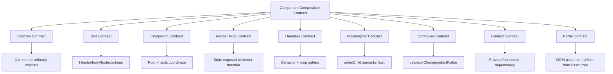

# Part 106 — Testing Component Composition

Composition test yang buruk bertanya:

> “Apakah component ini merender child component X?”

Composition test yang bagus bertanya:

> “Jika consumer menyusun component ini dengan slot, child, context, controlled state, polymorphic host, portal, dan interaction tertentu, apakah public behavior-nya tetap benar?”

Component composition adalah API design. Maka testing composition harus memperlakukan component seperti public API:

- apa yang boleh dikomposisikan;
- apa yang dijanjikan ke consumer;
- apa yang observable oleh user;
- apa contract accessibility-nya;
- apa behavior saat controlled/uncontrolled;
- apa yang terjadi saat children berubah;
- apa yang terjadi saat component dipakai dalam provider berbeda;
- apa failure mode yang harus dicegah.

Di codebase besar, composition bug sering bukan syntax bug. Ia muncul sebagai:

- slot salah tempat;
- hidden dependency dari context;
- compound child dipakai di luar root;
- callback dipanggil dua kali;
- component remount karena key salah;
- accessible role hilang karena `as` prop;
- modal close reason tidak jelas;
- controlled state dan internal state berkonflik;
- render prop memanggil Hook secara ilegal;
- focus trap rusak karena portal;
- wrapper component memakan props/ref;
- polymorphic component menghasilkan semantic HTML salah.

Testing composition harus menangkap bug semacam itu.

---

## 1. Prinsip Utama: Test Dari Contract, Bukan Struktur Internal

React component adalah fungsi dari props, state, dan context. Tetapi user tidak melihat function call. User melihat UI, role, text, focus, form state, keyboard behavior, dan side effect yang memang observable.

Testing Library mengarahkan test untuk menyerupai cara user memakai UI. Ini cocok untuk composition karena composition biasanya baru bermakna saat beberapa bagian dipakai bersama.

Bad:

```tsx
expect(wrapper.find(Header).exists()).toBe(true);
expect(wrapper.find(Button).prop('variant')).toBe('primary');
```

Better:

```tsx
expect(screen.getByRole('heading', { name: /case details/i })).toBeVisible();
expect(screen.getByRole('button', { name: /approve/i })).toBeEnabled();
```

Component internals boleh berubah dari:

```tsx
<Card.Header />
```

menjadi:

```tsx
<SectionHeader />
```

Test contract seharusnya tetap pass kalau behavior dan accessibility tetap sama.

---

## 2. Composition Contract Taxonomy

Sebelum menulis test, identifikasi jenis composition contract.



Setiap contract punya test style berbeda.

---

## 3. Testing Simple Children Composition

Component:

```tsx
type CardProps = {
  title: string;
  children: React.ReactNode;
  actions?: React.ReactNode;
};

function Card({ title, children, actions }: CardProps) {
  return (
    <section aria-labelledby="card-title">
      <header>
        <h2 id="card-title">{title}</h2>
        {actions ? <div aria-label="card actions">{actions}</div> : null}
      </header>
      <div>{children}</div>
    </section>
  );
}
```

Test:

```tsx
test('renders title, body, and actions', () => {
  render(
    <Card
      title="Case details"
      actions={<button>Approve</button>}
    >
      <p>High priority enforcement case</p>
    </Card>
  );

  expect(
    screen.getByRole('heading', { name: /case details/i })
  ).toBeVisible();

  expect(screen.getByText(/high priority/i)).toBeVisible();

  expect(
    screen.getByRole('button', { name: /approve/i })
  ).toBeVisible();
});
```

Yang diuji:

- title masuk heading;
- body children muncul;
- actions bisa diisi arbitrary node;
- role/name tetap accessible.

Yang tidak diuji:

- apakah internal element persis `header > div`;
- class name internal;
- nama child component internal.

---

## 4. Testing Named Slot Contract

Slot contract harus diuji sebagai API.

```tsx
type PageLayoutProps = {
  header: React.ReactNode;
  sidebar?: React.ReactNode;
  children: React.ReactNode;
  footer?: React.ReactNode;
};

function PageLayout({ header, sidebar, children, footer }: PageLayoutProps) {
  return (
    <div>
      <header>{header}</header>
      <main>{children}</main>
      {sidebar ? <aside>{sidebar}</aside> : null}
      {footer ? <footer>{footer}</footer> : null}
    </div>
  );
}
```

Test:

```tsx
test('places slot content into semantic regions', () => {
  render(
    <PageLayout
      header={<h1>Cases</h1>}
      sidebar={<nav aria-label="case filters">Filters</nav>}
      footer={<p>Last updated today</p>}
    >
      <p>Case table</p>
    </PageLayout>
  );

  expect(screen.getByRole('banner')).toHaveTextContent('Cases');
  expect(screen.getByRole('main')).toHaveTextContent('Case table');
  expect(screen.getByRole('complementary')).toHaveTextContent('Filters');
  expect(screen.getByRole('contentinfo')).toHaveTextContent('Last updated today');
});
```

Slot test penting karena slot refactor sering merusak semantic region.

---

## 5. Testing Compound Components

Compound component punya contract antara Root dan Parts.

Contoh Tabs:

```tsx
<Tabs defaultValue="overview">
  <Tabs.List aria-label="Case sections">
    <Tabs.Trigger value="overview">Overview</Tabs.Trigger>
    <Tabs.Trigger value="history">History</Tabs.Trigger>
  </Tabs.List>
  <Tabs.Content value="overview">Overview content</Tabs.Content>
  <Tabs.Content value="history">History content</Tabs.Content>
</Tabs>
```

Test behavior:

```tsx
test('activates tab content when trigger is clicked', async () => {
  const user = userEvent.setup();

  render(
    <Tabs defaultValue="overview">
      <Tabs.List aria-label="Case sections">
        <Tabs.Trigger value="overview">Overview</Tabs.Trigger>
        <Tabs.Trigger value="history">History</Tabs.Trigger>
      </Tabs.List>
      <Tabs.Content value="overview">Overview content</Tabs.Content>
      <Tabs.Content value="history">History content</Tabs.Content>
    </Tabs>
  );

  expect(screen.getByRole('tab', { name: /overview/i })).toHaveAttribute(
    'aria-selected',
    'true'
  );
  expect(screen.getByRole('tabpanel')).toHaveTextContent('Overview content');

  await user.click(screen.getByRole('tab', { name: /history/i }));

  expect(screen.getByRole('tab', { name: /history/i })).toHaveAttribute(
    'aria-selected',
    'true'
  );
  expect(screen.getByRole('tabpanel')).toHaveTextContent('History content');
});
```

Keyboard behavior:

```tsx
test('moves focus between tabs with arrow keys', async () => {
  const user = userEvent.setup();

  render(<CaseTabs />);

  const overview = screen.getByRole('tab', { name: /overview/i });
  const history = screen.getByRole('tab', { name: /history/i });

  overview.focus();
  expect(overview).toHaveFocus();

  await user.keyboard('{ArrowRight}');

  expect(history).toHaveFocus();
});
```

Compound invariant tests:

```tsx
test('throws useful error when Trigger is used outside Tabs root', () => {
  expect(() => {
    render(<Tabs.Trigger value="x">Broken</Tabs.Trigger>);
  }).toThrow(/Tabs\.Trigger must be used inside Tabs/);
});
```

Yang penting:

- test visible behavior;
- test ARIA role/attribute;
- test keyboard contract;
- test misuse error;
- test controlled/uncontrolled mode bila didukung.

---

## 6. Testing Controlled and Uncontrolled Composition

Compound Tabs production biasanya mendukung dua mode.

Uncontrolled:

```tsx
test('uncontrolled tabs update internal value', async () => {
  const user = userEvent.setup();

  render(<CaseTabs defaultValue="overview" />);

  await user.click(screen.getByRole('tab', { name: /history/i }));

  expect(screen.getByRole('tabpanel')).toHaveTextContent('History content');
});
```

Controlled:

```tsx
function ControlledTabsHarness() {
  const [value, setValue] = React.useState('overview');

  return (
    <>
      <output aria-label="selected tab">{value}</output>
      <CaseTabs value={value} onValueChange={setValue} />
    </>
  );
}

test('controlled tabs call onValueChange and reflect owner state', async () => {
  const user = userEvent.setup();

  render(<ControlledTabsHarness />);

  await user.click(screen.getByRole('tab', { name: /history/i }));

  expect(screen.getByLabelText('selected tab')).toHaveTextContent('history');
  expect(screen.getByRole('tabpanel')).toHaveTextContent('History content');
});
```

Controlled-no-owner-update test:

```tsx
test('controlled tabs do not change visible value unless owner updates value', async () => {
  const user = userEvent.setup();
  const onValueChange = vi.fn();

  render(<CaseTabs value="overview" onValueChange={onValueChange} />);

  await user.click(screen.getByRole('tab', { name: /history/i }));

  expect(onValueChange).toHaveBeenCalledWith('history');
  expect(screen.getByRole('tabpanel')).toHaveTextContent('Overview content');
});
```

Invariant:

> Controlled component requests change. Owner applies change.

Jika component controlled langsung mengubah internal visible state tanpa owner value berubah, ia punya source of truth ganda.

---

## 7. Testing Headless Components

Headless component/pattern mengembalikan behavior API, bukan markup final.

Contoh prop getter:

```tsx
function useToggleGroup() {
  const [value, setValue] = React.useState<string | null>(null);

  function getItemProps(itemValue: string) {
    const selected = value === itemValue;

    return {
      role: 'radio',
      'aria-checked': selected,
      tabIndex: selected || value === null ? 0 : -1,
      onClick: () => setValue(itemValue),
    } as const;
  }

  return { value, getItemProps };
}
```

Harness:

```tsx
function ToggleGroupHarness() {
  const group = useToggleGroup();

  return (
    <div role="radiogroup" aria-label="Priority">
      <button {...group.getItemProps('low')}>Low</button>
      <button {...group.getItemProps('high')}>High</button>
      <output aria-label="selected priority">{group.value ?? 'none'}</output>
    </div>
  );
}
```

Test:

```tsx
test('headless toggle group wires ARIA and interaction props', async () => {
  const user = userEvent.setup();

  render(<ToggleGroupHarness />);

  const high = screen.getByRole('radio', { name: /high/i });

  expect(high).toHaveAttribute('aria-checked', 'false');

  await user.click(high);

  expect(high).toHaveAttribute('aria-checked', 'true');
  expect(screen.getByLabelText('selected priority')).toHaveTextContent('high');
});
```

Headless test harus menguji:

- prop getter menghasilkan role/aria/event yang benar;
- consumer bisa menyebarkan props ke host element;
- event handler consumer dan internal handler tidak saling menimpa;
- ref composition bila ada;
- keyboard behavior;
- disabled state;
- controlled mode;
- accessibility contract.

---

## 8. Testing Prop Merging and Event Composition

Slot/`asChild`/prop getter sering perlu merge props.

Bug umum:

- internal `onClick` menimpa user `onClick`;
- user `onClick` menimpa internal `onClick`;
- `event.preventDefault()` tidak dihormati;
- `className` hilang;
- `aria-*` hilang;
- ref tidak digabung.

Helper:

```tsx
function composeEventHandlers<E extends React.SyntheticEvent>(
  userHandler: ((event: E) => void) | undefined,
  internalHandler: (event: E) => void
) {
  return (event: E) => {
    userHandler?.(event);
    if (!event.defaultPrevented) {
      internalHandler(event);
    }
  };
}
```

Test:

```tsx
test('calls user handler before internal handler', async () => {
  const user = userEvent.setup();
  const calls: string[] = [];

  render(
    <ToggleButton
      onClick={() => calls.push('user')}
      onToggle={() => calls.push('internal')}
    >
      Toggle
    </ToggleButton>
  );

  await user.click(screen.getByRole('button', { name: /toggle/i }));

  expect(calls).toEqual(['user', 'internal']);
});

test('does not call internal handler when user prevents default', async () => {
  const user = userEvent.setup();
  const onToggle = vi.fn();

  render(
    <ToggleButton
      onClick={(event) => event.preventDefault()}
      onToggle={onToggle}
    >
      Toggle
    </ToggleButton>
  );

  await user.click(screen.getByRole('button', { name: /toggle/i }));

  expect(onToggle).not.toHaveBeenCalled();
});
```

Composition quality sering terlihat dari detail prop merging ini.

---

## 9. Testing Polymorphic Components

Polymorphic component punya semantic contract.

```tsx
<Button as="a" href="/cases/c1">Open case</Button>
```

Test:

```tsx
test('renders as a link when as="a"', () => {
  render(
    <Button as="a" href="/cases/c1">
      Open case
    </Button>
  );

  const link = screen.getByRole('link', { name: /open case/i });

  expect(link).toHaveAttribute('href', '/cases/c1');
});
```

Disabled semantics differ by host.

```tsx
test('native button disabled uses disabled attribute', () => {
  render(<Button disabled>Approve</Button>);

  expect(screen.getByRole('button', { name: /approve/i })).toBeDisabled();
});

test('anchor disabled uses aria-disabled and prevents navigation command', async () => {
  const user = userEvent.setup();
  const onClick = vi.fn();

  render(
    <Button as="a" href="/approve" disabled onClick={onClick}>
      Approve
    </Button>
  );

  const link = screen.getByRole('link', { name: /approve/i });

  expect(link).toHaveAttribute('aria-disabled', 'true');

  await user.click(link);

  expect(onClick).not.toHaveBeenCalled();
});
```

Polymorphic test harus memeriksa:

- role berubah sesuai host;
- required props diteruskan;
- disabled semantics tidak disamakan buta;
- ref diteruskan ke host benar;
- event contract tetap aman;
- semantic HTML tidak rusak oleh styling abstraction.

---

## 10. Testing Context-Based Composition

Context composition biasanya muncul pada design system, compound components, permission gates, form fields, dan overlay managers.

Provider harness:

```tsx
function renderWithTheme(ui: React.ReactElement, theme: Theme = defaultTheme) {
  return render(<ThemeProvider value={theme}>{ui}</ThemeProvider>);
}
```

Test:

```tsx
test('uses nearest theme provider', () => {
  render(
    <ThemeProvider value={{ density: 'comfortable' }}>
      <Button>Outer</Button>
      <ThemeProvider value={{ density: 'compact' }}>
        <Button>Inner</Button>
      </ThemeProvider>
    </ThemeProvider>
  );

  expect(screen.getByRole('button', { name: /outer/i })).toHaveAttribute(
    'data-density',
    'comfortable'
  );

  expect(screen.getByRole('button', { name: /inner/i })).toHaveAttribute(
    'data-density',
    'compact'
  );
});
```

Provider missing:

```tsx
test('field label throws useful error when field provider is missing', () => {
  expect(() => render(<FieldLabel>Name</FieldLabel>)).toThrow(/Field/);
});
```

Context composition test harus menutupi:

- nearest provider behavior;
- nested override;
- provider missing error;
- stable behavior saat provider value berubah;
- performance-sensitive consumer bila perlu;
- test wrapper untuk app-level provider.

---

## 11. Testing Render Props and Function-as-Child

Render prop exposes state to consumer.

```tsx
<Disclosure>
  {({ open, toggle }) => (
    <>
      <button onClick={toggle}>{open ? 'Close' : 'Open'}</button>
      {open ? <p>Panel</p> : null}
    </>
  )}
</Disclosure>
```

Test:

```tsx
test('render prop receives state and commands', async () => {
  const user = userEvent.setup();

  render(
    <Disclosure>
      {({ open, toggle }) => (
        <>
          <button onClick={toggle}>{open ? 'Close' : 'Open'}</button>
          {open ? <p>Panel</p> : null}
        </>
      )}
    </Disclosure>
  );

  expect(screen.queryByText('Panel')).not.toBeInTheDocument();

  await user.click(screen.getByRole('button', { name: /open/i }));

  expect(screen.getByText('Panel')).toBeVisible();
});
```

Misuse yang harus dicegah lewat lint, documentation, dan review:

```tsx
<Disclosure>
  {() => {
    // Invalid: render prop callback is not a component.
    const [x] = React.useState(0);
    return <div>{x}</div>;
  }}
</Disclosure>
```

Test runtime bukan mekanisme utama untuk Hook rule violation. Pakai ESLint Rules of Hooks.

---

## 12. Testing Portal and Overlay Composition

Portal membuat DOM placement berbeda dari React tree. Test harus tetap berbasis behavior.

```tsx
test('opens modal in portal and closes with Escape', async () => {
  const user = userEvent.setup();

  render(<CasePage />);

  await user.click(screen.getByRole('button', { name: /delete case/i }));

  const dialog = screen.getByRole('dialog', { name: /confirm delete/i });
  expect(dialog).toBeVisible();

  await user.keyboard('{Escape}');

  expect(dialog).not.toBeInTheDocument();
});
```

Focus test:

```tsx
test('returns focus to opener when modal closes', async () => {
  const user = userEvent.setup();

  render(<CasePage />);

  const opener = screen.getByRole('button', { name: /delete case/i });

  await user.click(opener);
  expect(screen.getByRole('dialog')).toBeVisible();

  await user.keyboard('{Escape}');

  expect(opener).toHaveFocus();
});
```

Close reason test:

```tsx
test('reports close reason', async () => {
  const user = userEvent.setup();
  const onClose = vi.fn();

  render(<ConfirmDialog open onClose={onClose} />);

  await user.keyboard('{Escape}');

  expect(onClose).toHaveBeenCalledWith({ reason: 'escapeKey' });
});
```

Overlay composition test harus memeriksa:

- role `dialog`/`alertdialog`;
- accessible name;
- initial focus;
- focus trap;
- focus return;
- Escape/backdrop policy;
- close reason;
- nested overlay behavior;
- scroll lock cleanup;
- body/inert cleanup;
- portal cleanup after unmount.

Untuk focus trap yang rumit, browser test bisa lebih akurat daripada jsdom.

---

## 13. Testing Component Composition With Server State

Composition sering menggabungkan query state dengan UI parts.

Bad test:

```tsx
expect(useQuery).toHaveBeenCalledWith(...);
```

Better:

```tsx
test('shows loading, data, and retry behavior', async () => {
  const user = userEvent.setup();
  const server = setupCaseServer();

  server.failOnce('/cases/c1');

  renderWithQueryClient(<CaseDetailsPage caseId="c1" />);

  expect(screen.getByText(/loading/i)).toBeVisible();

  expect(await screen.findByRole('alert')).toHaveTextContent(/failed/i);

  server.succeed('/cases/c1', { id: 'c1', title: 'Case 1' });

  await user.click(screen.getByRole('button', { name: /retry/i }));

  expect(await screen.findByRole('heading', { name: /case 1/i })).toBeVisible();
});
```

Jika memakai TanStack Query, buat `QueryClient` baru per test.

```tsx
function createTestQueryClient() {
  return new QueryClient({
    defaultOptions: {
      queries: { retry: false },
      mutations: { retry: false },
    },
  });
}

function renderWithQueryClient(ui: React.ReactElement) {
  const queryClient = createTestQueryClient();

  return render(
    <QueryClientProvider client={queryClient}>{ui}</QueryClientProvider>
  );
}
```

Jangan share query client antar test kecuali memang sedang mengetes persistence/cross-test behavior. Shared cache membuat test order-dependent.

---

## 14. Testing Permission-Aware Composition

Permission-aware component harus jelas: apakah disembunyikan, disabled, readonly, atau diganti explanatory state.

```tsx
test('hides destructive action when user lacks permission', () => {
  renderWithPermissions(<CaseActions caseId="c1" />, {
    canDeleteCase: false,
  });

  expect(
    screen.queryByRole('button', { name: /delete case/i })
  ).not.toBeInTheDocument();
});

test('shows disabled approve button with reason when precondition fails', () => {
  renderWithPermissions(<CaseActions caseId="c1" />, {
    canApproveCase: true,
    approveDisabledReason: 'Case has unresolved evidence',
  });

  const button = screen.getByRole('button', { name: /approve/i });

  expect(button).toBeDisabled();
  expect(screen.getByText(/unresolved evidence/i)).toBeVisible();
});
```

Security reminder:

> Frontend permission test hanya membuktikan UX guard. Ia tidak membuktikan authorization security. Backend/API authorization tetap harus dites terpisah.

---

## 15. Testing Form Composition

Form composition menggabungkan field, label, error, validation, submit lifecycle, dan server result.

Field composition:

```tsx
<Field name="reason" error="Reason is required">
  <Field.Label>Reason</Field.Label>
  <Field.Textarea />
  <Field.Error />
</Field>
```

Test:

```tsx
test('field wires label, control, and error accessibly', () => {
  render(
    <Field name="reason" error="Reason is required">
      <Field.Label>Reason</Field.Label>
      <Field.Textarea />
      <Field.Error />
    </Field>
  );

  const textarea = screen.getByRole('textbox', { name: /reason/i });

  expect(textarea).toHaveAccessibleDescription('Reason is required');
  expect(screen.getByText('Reason is required')).toBeVisible();
});
```

Submit flow:

```tsx
test('submits form and displays server validation errors', async () => {
  const user = userEvent.setup();
  const submit = vi.fn(async () => ({
    status: 'error',
    fieldErrors: { reason: 'Reason is required' },
  }));

  render(<ApprovalForm onSubmit={submit} />);

  await user.click(screen.getByRole('button', { name: /submit/i }));

  expect(await screen.findByText('Reason is required')).toBeVisible();
});
```

Form composition test harus menguji:

- label-control association;
- error announcement;
- required/invalid state;
- keyboard submit;
- disabled/pending state;
- server validation mapping;
- reset semantics;
- dynamic field add/remove;
- draft persistence bila ada.

---

## 16. Testing Composition Without Over-Mocking Children

Kadang kita ingin mengetes parent composition dengan fake child. Hati-hati: fake child yang terlalu sederhana bisa menyembunyikan real contract.

Bad:

```tsx
vi.mock('./CaseTable', () => ({
  CaseTable: () => <div>CaseTable</div>,
}));
```

Ini tidak menguji callback payload, selection, sorting, atau accessible table semantics.

Better fake child jika memang perlu isolate:

```tsx
function FakeCaseTable({ cases, onSelectCase }: CaseTableProps) {
  return (
    <table>
      <tbody>
        {cases.map((item) => (
          <tr key={item.id}>
            <td>
              <button onClick={() => onSelectCase(item.id)}>{item.title}</button>
            </td>
          </tr>
        ))}
      </tbody>
    </table>
  );
}
```

Fake child masih mempertahankan contract:

- menerima `cases`;
- memanggil `onSelectCase(id)`;
- menghasilkan UI yang bisa diklik user.

Rule:

> Mock child hanya kalau boundary-nya jelas. Jangan mock behavior yang justru sedang diuji.

---

## 17. Storybook As Composition Test Surface

Storybook bukan hanya katalog visual. Untuk component composition, Story adalah scenario matrix.

Contoh stories:

```tsx
export const Default: Story = {
  args: {
    defaultValue: 'overview',
  },
};

export const Controlled: Story = {
  render: () => <ControlledTabsHarness />,
};

export const KeyboardNavigation: Story = {
  render: () => <CaseTabs defaultValue="overview" />,
  play: async ({ canvas, userEvent }) => {
    const overview = canvas.getByRole('tab', { name: /overview/i });
    const history = canvas.getByRole('tab', { name: /history/i });

    overview.focus();
    await userEvent.keyboard('{ArrowRight}');

    await expect(history).toHaveFocus();
  },
};
```

Story matrix untuk compound component:

```txt
Default
Controlled
Disabled item
Overflow items
Keyboard navigation
Nested in modal
RTL direction
Compact density
High contrast theme
Error state
Async loading state
Permission hidden action
```

Interaction test di Storybook berguna untuk:

- design system primitives;
- compound components;
- accessibility behavior;
- visual states;
- regression scenario yang mudah dilihat;
- collaboration antara engineer/design/QA.

Tetapi jangan mengganti seluruh test suite dengan Storybook. Gunakan Storybook untuk scenario-rich component surface, bukan pure reducer/Hook logic.

---

## 18. Testing Accessibility As Part of Composition Contract

Accessibility bukan layer tambahan. Dalam component composition, accessibility adalah bagian dari API.

Contoh query prioritas:

```tsx
screen.getByRole('button', { name: /approve/i });
screen.getByLabelText(/reason/i);
screen.getByRole('dialog', { name: /confirm delete/i });
screen.getByRole('tab', { name: /history/i });
screen.getByRole('alert');
```

Lebih lemah:

```tsx
screen.getByTestId('approve-button');
```

`data-testid` tidak salah, tetapi harus menjadi fallback untuk hal yang memang tidak punya semantic role/name, misalnya invisible measurement anchor atau virtualized sentinel.

Composition test harus menangkap:

- role benar;
- accessible name benar;
- label-control relationship;
- error description;
- disabled/readonly semantics;
- focus management;
- keyboard interaction;
- ARIA state seperti `aria-expanded`, `aria-selected`, `aria-checked`, `aria-invalid`;
- landmark/region semantics.

Jika test sulit men-query component secara accessible, kemungkinan component API atau markup-nya juga buruk untuk user.

---

## 19. Testing Key and Remount Semantics

Composition sering rusak karena key salah atau state tidak reset.

Contoh intended reset:

```tsx
function CaseEditorShell({ caseId }: { caseId: string }) {
  return <CaseEditor key={caseId} caseId={caseId} />;
}
```

Test:

```tsx
test('resets editor draft when caseId changes', async () => {
  const user = userEvent.setup();

  const { rerender } = render(<CaseEditorShell caseId="c1" />);

  await user.type(screen.getByLabelText(/note/i), 'draft for c1');
  expect(screen.getByLabelText(/note/i)).toHaveValue('draft for c1');

  rerender(<CaseEditorShell caseId="c2" />);

  expect(screen.getByLabelText(/note/i)).toHaveValue('');
});
```

Preserve state test:

```tsx
test('preserves filter draft when list refreshes', async () => {
  const user = userEvent.setup();

  const { rerender } = render(<CaseSearchPage cases={initialCases} />);

  await user.type(screen.getByLabelText(/filter/i), 'fraud');

  rerender(<CaseSearchPage cases={refreshedCases} />);

  expect(screen.getByLabelText(/filter/i)).toHaveValue('fraud');
});
```

State reset/preserve adalah explicit contract. Test harus membuatnya visible.

---

## 20. Testing Composition Failure Modes

### Failure mode 1 — Slot swallowed props

Symptom: user passes `aria-label`, `className`, `onClick`, or `ref`, but component drops it.

Test:

```tsx
test('forwards aria-label and click handler to action slot', async () => {
  const user = userEvent.setup();
  const onClick = vi.fn();

  render(
    <IconButton aria-label="Refresh cases" onClick={onClick}>
      <RefreshIcon />
    </IconButton>
  );

  await user.click(screen.getByRole('button', { name: /refresh cases/i }));

  expect(onClick).toHaveBeenCalled();
});
```

### Failure mode 2 — Context hidden dependency

Symptom: component silently renders wrong fallback without provider.

Test provider missing error or explicit fallback.

```tsx
expect(() => render(<Menu.Item>Open</Menu.Item>)).toThrow(/Menu/);
```

### Failure mode 3 — Compound part order assumption

Symptom: component only works if parts appear in exact internal order.

Test different valid order if API allows it.

```tsx
test('tabs work even when content is declared before list', async () => {
  render(
    <Tabs defaultValue="overview">
      <Tabs.Content value="overview">Overview content</Tabs.Content>
      <Tabs.List aria-label="Case sections">
        <Tabs.Trigger value="overview">Overview</Tabs.Trigger>
      </Tabs.List>
    </Tabs>
  );

  expect(screen.getByRole('tabpanel')).toHaveTextContent('Overview content');
});
```

If order is required, document it and test useful error.

### Failure mode 4 — `as` prop breaks semantics

Test role/name per host.

### Failure mode 5 — Controlled component mutates internal state

Test owner-not-updated scenario.

### Failure mode 6 — Portal cleanup leak

Test body class, inert attribute, scroll lock, listeners, and portal node cleanup after unmount.

---

## 21. Test Data Builders For Composition

Avoid massive fixtures. Composition tests need focused domain data.

```tsx
function buildCase(overrides: Partial<Case> = {}): Case {
  return {
    id: 'case-1',
    title: 'Suspicious transaction',
    status: 'open',
    priority: 'high',
    assignee: null,
    ...overrides,
  };
}
```

Usage:

```tsx
render(<CaseCard case={buildCase({ status: 'closed' })} />);
```

Bad fixture:

```tsx
import hugeCaseFixtureFromProduction from './fixtures/case-full.json';
```

Large fixtures hide what matters. Builder makes intent visible.

---

## 22. Recommended File Structure

```txt
src/
  shared/
    ui/
      tabs/
        Tabs.tsx
        Tabs.test.tsx
        Tabs.stories.tsx
      button/
        Button.tsx
        Button.test.tsx
        Button.stories.tsx
  features/
    case-approval/
      ui/
        ApprovalForm.tsx
        ApprovalForm.test.tsx
        ApprovalForm.stories.tsx
      model/
        approvalWorkflow.reducer.ts
        approvalWorkflow.reducer.test.ts

test/
  setup.ts
  render/
    renderWithProviders.tsx
    renderWithQueryClient.tsx
    renderWithPermissions.tsx
  factories/
    buildCase.ts
    createDeferred.ts
```

Rule:

- reusable primitive tests dekat primitive;
- feature composition tests dekat feature;
- provider render helpers centralized;
- Storybook stories dekat component untuk documentation dan interaction scenarios;
- pure model tests dekat model.

---

## 23. Composition Testing Checklist

```txt
[ ] Apa public composition contract component ini?
[ ] Apakah children/slot muncul di semantic region yang benar?
[ ] Apakah accessible role/name benar?
[ ] Apakah callback payload benar?
[ ] Apakah controlled dan uncontrolled mode sudah dites?
[ ] Apakah component tidak punya double source of truth?
[ ] Apakah compound parts bekerja melalui Root provider yang benar?
[ ] Apakah compound parts memberi error berguna jika dipakai di luar Root?
[ ] Apakah keyboard behavior sesuai contract?
[ ] Apakah focus behavior benar?
[ ] Apakah prop merging tidak menimpa user handler?
[ ] Apakah ref forwarding/merging benar bila bagian dari API?
[ ] Apakah `as`/polymorphic host menjaga semantic HTML?
[ ] Apakah context nested override benar?
[ ] Apakah portal cleanup benar?
[ ] Apakah state reset/preserve sesuai key contract?
[ ] Apakah server-state cache/provider dibuat fresh per test?
[ ] Apakah permission-aware behavior explicit: hidden/disabled/readonly?
[ ] Apakah test memakai user-observable queries terlebih dahulu?
[ ] Apakah `data-testid` hanya fallback?
[ ] Apakah test tetap valid jika internal component dipecah/refactor?
```

---

## 24. Final Mental Model

Component composition adalah public API yang dirakit dari props, children, context, events, refs, DOM semantics, accessibility, dan state ownership.

Testing composition berarti menjaga agar API itu tetap benar saat component berkembang.

```txt
For every composed component:
  identify the contract
  test observable behavior
  test accessibility semantics
  test state ownership modes
  test event payloads
  test misuse boundaries
  test focus and keyboard behavior
  test cleanup and remount semantics
```

Atau versi pendek:

> Jangan test pohon implementasi. Test kontrak komposisi yang dilihat dan dipakai consumer.

Kalau test masih terlalu rapuh setelah refactor internal, kemungkinan test sedang mengikat detail yang salah. Kalau component sulit dites dari role, label, event, dan behavior, kemungkinan component contract-nya juga belum cukup jelas.
