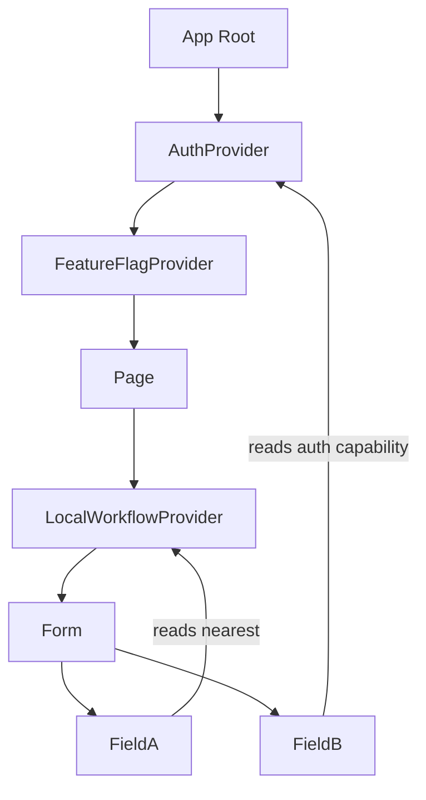
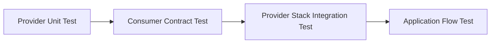
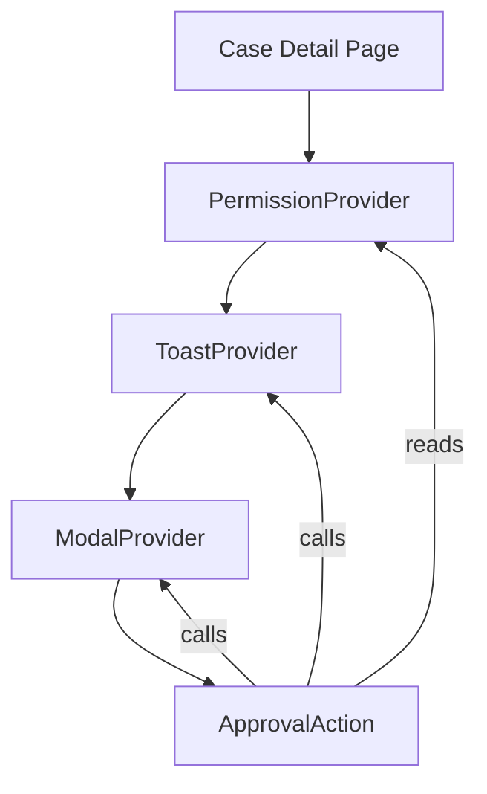

# Part 107 — Testing Context and Providers

Context test yang baik tidak bertanya:

> “Apakah provider ini dipakai?”

Pertanyaan yang lebih kuat:

> “Apakah subtree menerima capability, state, dan command yang benar dalam scope yang benar?”

Context bukan global variable yang kebetulan bisa dibaca dari mana saja. Context adalah **scoped dependency channel**. Provider adalah boundary. Consumer adalah subscriber. Test harus membuktikan contract boundary itu.

Kalau context salah dites, codebase biasanya jatuh ke dua ekstrem:

1. semua provider dimock sehingga test tidak lagi mewakili wiring real application;
2. semua test memakai `AppProviders` penuh sehingga test lambat, rapuh, dan sulit mengisolasi sebab kegagalan.

Target part ini: membangun testing strategy yang cukup realistis untuk menangkap bug wiring, tetapi cukup sempit agar test tetap cepat dan bisa menjelaskan failure.

---

## 1. Mental Model: Provider Is a Scope, Not Just a Wrapper

Provider memberi value kepada subtree. Consumer membaca provider terdekat di atasnya. Artinya, bug context sering bukan bug di consumer, tetapi bug di **scope**:

- provider salah ditempatkan;
- provider terlalu tinggi;
- provider terlalu rendah;
- provider override tidak sengaja;
- default value menyembunyikan missing provider;
- value identity tidak stabil;
- command/state context tercampur;
- test memakai provider palsu yang tidak punya invariant production.



Provider test bukan sekadar membungkus component agar tidak error. Provider test adalah cara menyatakan:

```txt
For this scenario, what is the context scope?
What value/capability is available?
Which provider owns mutation?
Which provider should be real, fake, or omitted?
```

---

## 2. Kategori Context yang Butuh Cara Test Berbeda

Tidak semua context sama. Testing strategy harus mengikuti jenis context-nya.

| Context type | Contoh | Risiko utama | Cara test utama |
|---|---|---|---|
| Read-only value context | theme, locale, density | missing provider, wrong override | consumer behavior + provider override |
| Capability context | toast, modal, analytics, permission checker | mock terlalu longgar, hidden dependency | fake capability dengan call assertion |
| State context | selected tab, wizard state | rerender fan-out, stale value | user interaction + observable UI |
| Dispatch/command context | `dispatch`, `submit`, `openModal` | raw setter leakage, wrong payload | command spy atau real reducer |
| Reducer provider | cart, workflow, form aggregate | illegal transition | transition/integration test |
| External adapter provider | query client, store, router | cross-test leakage | fresh instance per test |
| Design-system context | field, tabs, menu, accordion | nested provider collision | compound behavior test |

Satu kesalahan umum: semua context dites dengan “mock value object”. Itu terlalu sempit. Reducer provider perlu dites sebagai transition system. Capability provider boleh dites dengan fake. External adapter provider perlu fresh instance.

---

## 3. Test Boundary: Apa yang Sebenarnya Diuji?

Ada empat boundary yang berbeda.



### 3.1 Provider Unit Test

Menguji provider logic sendiri.

Cocok untuk:

- reducer provider;
- provider dengan command logic;
- provider dengan derived context value;
- provider yang punya lifecycle external subscription.

Tidak cocok untuk:

- theme provider tipis;
- provider yang hanya meneruskan value.

### 3.2 Consumer Contract Test

Menguji component/hook consumer dengan provider minimal.

Cocok untuk:

- component yang harus berubah berdasarkan permission;
- component yang membaca theme/density;
- component yang memanggil modal/toast capability.

### 3.3 Provider Stack Integration Test

Menguji beberapa provider bekerja bersama.

Cocok untuk:

- page yang butuh router + auth + query client;
- form yang butuh field provider + validation provider + permission provider;
- modal yang butuh overlay manager + focus boundary.

### 3.4 Application Flow Test

Menguji user journey besar.

Cocok untuk:

- login flow;
- approval flow;
- checkout flow;
- complex multi-step form.

Jangan pakai application flow test untuk membuktikan setiap branch kecil. Pakai sebagai smoke/regression untuk wiring besar.

---

## 4. Strict Context: Test Harus Gagal Saat Provider Hilang

Default value yang “terlihat valid” sering membuat bug provider tidak ketahuan.

Anti-pattern:

```tsx
const PermissionContext = createContext({
  can: () => true,
});
```

Ini berbahaya. Component tetap jalan walau provider lupa dipasang. Dalam production, user bisa melihat action yang tidak seharusnya.

Pattern yang lebih kuat:

```tsx
import { createContext, useContext } from 'react';

type PermissionContextValue = {
  can(action: string, resource: string): boolean;
};

const PermissionContext = createContext<PermissionContextValue | null>(null);

export function usePermission() {
  const value = useContext(PermissionContext);

  if (value === null) {
    throw new Error('usePermission must be used within PermissionProvider');
  }

  return value;
}

export function PermissionProvider({
  value,
  children,
}: {
  value: PermissionContextValue;
  children: React.ReactNode;
}) {
  return (
    <PermissionContext.Provider value={value}>
      {children}
    </PermissionContext.Provider>
  );
}
```

Test-nya:

```tsx
import { render } from '@testing-library/react';
import { describe, expect, it } from 'vitest';

function DeleteButton() {
  const permission = usePermission();

  if (!permission.can('delete', 'case')) return null;

  return <button>Delete</button>;
}

describe('DeleteButton provider contract', () => {
  it('fails loudly when PermissionProvider is missing', () => {
    expect(() => render(<DeleteButton />)).toThrow(
      'usePermission must be used within PermissionProvider',
    );
  });
});
```

Ini bukan test “implementation detail”. Ini test contract. Component memang tidak valid tanpa provider.

---

## 5. Custom Render: Provider Harness yang Terkontrol

Testing Library lazim memakai custom render untuk memasang provider. Namun provider harness harus tetap eksplisit.

Bad harness:

```tsx
function renderWithEverything(ui: React.ReactElement) {
  return render(
    <AppProviders>
      {ui}
    </AppProviders>,
  );
}
```

Masalah:

- test kecil ikut membawa router/query/auth/theme/modal/store semua;
- hidden coupling meningkat;
- sulit override state tertentu;
- cross-test leakage lebih mungkin;
- kegagalan sulit dilacak.

Better harness:

```tsx
import { render, type RenderOptions } from '@testing-library/react';

function createPermission(overrides?: Partial<PermissionContextValue>): PermissionContextValue {
  return {
    can: () => false,
    ...overrides,
  };
}

type RenderWithPermissionOptions = RenderOptions & {
  permission?: Partial<PermissionContextValue>;
};

export function renderWithPermission(
  ui: React.ReactElement,
  { permission, ...options }: RenderWithPermissionOptions = {},
) {
  const value = createPermission(permission);

  return render(
    <PermissionProvider value={value}>
      {ui}
    </PermissionProvider>,
    options,
  );
}
```

Test scenario menjadi jelas:

```tsx
it('hides delete action when user cannot delete case', () => {
  renderWithPermission(<DeleteButton />, {
    permission: {
      can: () => false,
    },
  });

  expect(screen.queryByRole('button', { name: /delete/i })).not.toBeInTheDocument();
});

it('shows delete action when user can delete case', () => {
  renderWithPermission(<DeleteButton />, {
    permission: {
      can: (action, resource) => action === 'delete' && resource === 'case',
    },
  });

  expect(screen.getByRole('button', { name: /delete/i })).toBeInTheDocument();
});
```

Harness yang baik membuat dependency eksplisit tetapi tidak noisy.

---

## 6. Provider Override Strategy

Provider override penting untuk scenario matrix.

Contoh: UI bergantung pada theme, locale, permission, dan feature flag.

Jangan membuat satu test untuk semua kombinasi. Buat minimal matrix yang menguji perbedaan behavior.

```tsx
type AppTestProvidersOptions = {
  permissions?: PermissionContextValue;
  flags?: Partial<Record<string, boolean>>;
  locale?: string;
  theme?: 'light' | 'dark';
};

export function renderWithAppProviders(
  ui: React.ReactElement,
  options: AppTestProvidersOptions = {},
) {
  return render(
    <ThemeProvider value={options.theme ?? 'light'}>
      <LocaleProvider value={options.locale ?? 'en'}>
        <FeatureFlagProvider flags={options.flags ?? {}}>
          <PermissionProvider value={options.permissions ?? denyAllPermission()}>
            {ui}
          </PermissionProvider>
        </FeatureFlagProvider>
      </LocaleProvider>
    </ThemeProvider>,
  );
}
```

Guideline:

```txt
Default test provider value should be safe, boring, and restrictive.
```

Untuk permission, default sebaiknya deny, bukan allow.

Untuk feature flag, default sebaiknya off, bukan on.

Untuk locale/theme, default boleh production default.

Untuk router/query/store, default sebaiknya fresh instance per test.

---

## 7. Testing Read-Only Context

Read-only context biasanya mudah dites. Fokusnya bukan “apakah context value dibaca”, tetapi “apakah behavior berubah sesuai scope”.

Contoh density context:

```tsx
type Density = 'compact' | 'comfortable';

const DensityContext = createContext<Density>('comfortable');

function useDensity() {
  return useContext(DensityContext);
}

function DataRow({ label }: { label: string }) {
  const density = useDensity();

  return (
    <div data-density={density}>
      {label}
    </div>
  );
}
```

Test:

```tsx
it('renders row with compact density inside compact provider', () => {
  render(
    <DensityContext.Provider value="compact">
      <DataRow label="Case 123" />
    </DensityContext.Provider>,
  );

  expect(screen.getByText('Case 123')).toHaveAttribute('data-density', 'compact');
});
```

Ini cukup. Tidak perlu mock `useDensity`. Mocking hook context sering justru memutus test dari scope behavior yang ingin dibuktikan.

---

## 8. Testing Capability Context

Capability context menyediakan kemampuan, bukan state utama.

Contoh:

- `toast.show(...)`;
- `modal.confirm(...)`;
- `analytics.track(...)`;
- `permission.can(...)`;
- `clock.now()`;
- `idGenerator.next()`.

Capability context paling baik dites dengan fake object yang observable.

```tsx
type ToastApi = {
  success(message: string): void;
  error(message: string): void;
};

const ToastContext = createContext<ToastApi | null>(null);

function useToast() {
  const value = useContext(ToastContext);
  if (!value) throw new Error('useToast must be used within ToastProvider');
  return value;
}

function SaveButton() {
  const toast = useToast();

  return (
    <button onClick={() => toast.success('Saved')}>
      Save
    </button>
  );
}
```

Test:

```tsx
it('notifies success after save click', async () => {
  const user = userEvent.setup();
  const toast: ToastApi = {
    success: vi.fn(),
    error: vi.fn(),
  };

  render(
    <ToastContext.Provider value={toast}>
      <SaveButton />
    </ToastContext.Provider>,
  );

  await user.click(screen.getByRole('button', { name: /save/i }));

  expect(toast.success).toHaveBeenCalledWith('Saved');
});
```

Perhatikan: kita tidak memverifikasi internal `onClick`. Kita verifikasi observable capability call.

---

## 9. Testing Provider with Reducer

Reducer provider punya dua level test:

1. reducer transition test;
2. provider integration test.

Reducer:

```tsx
type CartItem = {
  id: string;
  quantity: number;
};

type CartState = {
  items: CartItem[];
};

type CartEvent =
  | { type: 'item.added'; itemId: string }
  | { type: 'item.removed'; itemId: string }
  | { type: 'item.quantityChanged'; itemId: string; quantity: number };

function cartReducer(state: CartState, event: CartEvent): CartState {
  switch (event.type) {
    case 'item.added': {
      const existing = state.items.find((item) => item.id === event.itemId);

      if (existing) {
        return {
          items: state.items.map((item) =>
            item.id === event.itemId
              ? { ...item, quantity: item.quantity + 1 }
              : item,
          ),
        };
      }

      return {
        items: [...state.items, { id: event.itemId, quantity: 1 }],
      };
    }

    case 'item.removed':
      return {
        items: state.items.filter((item) => item.id !== event.itemId),
      };

    case 'item.quantityChanged': {
      if (event.quantity <= 0) {
        return {
          items: state.items.filter((item) => item.id !== event.itemId),
        };
      }

      return {
        items: state.items.map((item) =>
          item.id === event.itemId
            ? { ...item, quantity: event.quantity }
            : item,
        ),
      };
    }
  }
}
```

Reducer tests:

```tsx
describe('cartReducer', () => {
  it('adds a new item with quantity 1', () => {
    expect(
      cartReducer({ items: [] }, { type: 'item.added', itemId: 'book' }),
    ).toEqual({
      items: [{ id: 'book', quantity: 1 }],
    });
  });

  it('increments existing item instead of duplicating entity', () => {
    expect(
      cartReducer(
        { items: [{ id: 'book', quantity: 1 }] },
        { type: 'item.added', itemId: 'book' },
      ),
    ).toEqual({
      items: [{ id: 'book', quantity: 2 }],
    });
  });

  it('removes item when quantity becomes zero', () => {
    expect(
      cartReducer(
        { items: [{ id: 'book', quantity: 1 }] },
        { type: 'item.quantityChanged', itemId: 'book', quantity: 0 },
      ),
    ).toEqual({ items: [] });
  });
});
```

Provider integration:

```tsx
const CartStateContext = createContext<CartState | null>(null);
const CartDispatchContext = createContext<React.Dispatch<CartEvent> | null>(null);

function CartProvider({ children }: { children: React.ReactNode }) {
  const [state, dispatch] = useReducer(cartReducer, { items: [] });

  return (
    <CartDispatchContext.Provider value={dispatch}>
      <CartStateContext.Provider value={state}>
        {children}
      </CartStateContext.Provider>
    </CartDispatchContext.Provider>
  );
}
```

Consumer flow test:

```tsx
it('updates cart count through provider dispatch', async () => {
  const user = userEvent.setup();

  render(
    <CartProvider>
      <ProductCard id="book" />
      <CartBadge />
    </CartProvider>,
  );

  await user.click(screen.getByRole('button', { name: /add book/i }));

  expect(screen.getByText('1 item')).toBeInTheDocument();
});
```

Rule:

```txt
Reducer correctness belongs in reducer tests.
Provider wiring belongs in integration tests.
Consumer rendering belongs in behavior tests.
```

---

## 10. Testing Split State/Dispatch Context

Split context sering dipakai untuk mengurangi rerender dan memperjelas contract.

Testing yang perlu dibuktikan:

1. state consumer menerima state;
2. dispatch consumer bisa mengirim event;
3. dispatch-only consumer tidak butuh state;
4. missing provider gagal jelas.

```tsx
function useCartState() {
  const value = useContext(CartStateContext);
  if (!value) throw new Error('useCartState must be used within CartProvider');
  return value;
}

function useCartDispatch() {
  const value = useContext(CartDispatchContext);
  if (!value) throw new Error('useCartDispatch must be used within CartProvider');
  return value;
}
```

Test missing provider masing-masing hook:

```tsx
function DispatchOnlyButton() {
  const dispatch = useCartDispatch();
  return <button onClick={() => dispatch({ type: 'item.added', itemId: 'book' })}>Add</button>;
}

it('fails clearly when dispatch provider is missing', () => {
  expect(() => render(<DispatchOnlyButton />)).toThrow(
    'useCartDispatch must be used within CartProvider',
  );
});
```

Ini menangkap bug yang sering terjadi ketika provider composition berubah.

---

## 11. Testing Async Provider

Provider kadang melakukan sinkronisasi external system:

- auth session subscription;
- feature flag client;
- websocket connection;
- browser storage;
- media query subscription;
- online/offline status;
- external store adapter.

Provider seperti ini harus dites sebagai external synchronization boundary.

Contoh online status provider:

```tsx
type OnlineStatus = 'online' | 'offline';

const OnlineStatusContext = createContext<OnlineStatus | null>(null);

function OnlineStatusProvider({ children }: { children: React.ReactNode }) {
  const [status, setStatus] = useState<OnlineStatus>(() =>
    navigator.onLine ? 'online' : 'offline',
  );

  useEffect(() => {
    function handleOnline() {
      setStatus('online');
    }

    function handleOffline() {
      setStatus('offline');
    }

    window.addEventListener('online', handleOnline);
    window.addEventListener('offline', handleOffline);

    return () => {
      window.removeEventListener('online', handleOnline);
      window.removeEventListener('offline', handleOffline);
    };
  }, []);

  return (
    <OnlineStatusContext.Provider value={status}>
      {children}
    </OnlineStatusContext.Provider>
  );
}
```

Test:

```tsx
function StatusLabel() {
  const status = useContext(OnlineStatusContext);
  return <span>{status}</span>;
}

it('updates status when browser offline event fires', async () => {
  render(
    <OnlineStatusProvider>
      <StatusLabel />
    </OnlineStatusProvider>,
  );

  act(() => {
    window.dispatchEvent(new Event('offline'));
  });

  expect(screen.getByText('offline')).toBeInTheDocument();
});
```

Test cleanup:

```tsx
it('unsubscribes browser listeners on unmount', () => {
  const addSpy = vi.spyOn(window, 'addEventListener');
  const removeSpy = vi.spyOn(window, 'removeEventListener');

  const { unmount } = render(
    <OnlineStatusProvider>
      <StatusLabel />
    </OnlineStatusProvider>,
  );

  unmount();

  expect(addSpy).toHaveBeenCalledWith('online', expect.any(Function));
  expect(removeSpy).toHaveBeenCalledWith('online', expect.any(Function));
});
```

Cleanup test jangan terlalu fragile terhadap function identity jika tidak perlu. Tujuan utamanya memastikan provider tidak leak subscription.

---

## 12. Testing Context + Portal

Portal memindahkan DOM placement, tetapi context tetap mengikuti React tree. Ini perlu dites ketika modal/overlay bergantung pada context.

```tsx
function ConfirmDeleteModal() {
  const permission = usePermission();

  return createPortal(
    <div role="dialog" aria-label="Confirm delete">
      {permission.can('delete', 'case') ? (
        <button>Confirm delete</button>
      ) : (
        <p>You are not allowed to delete this case.</p>
      )}
    </div>,
    document.body,
  );
}
```

Test:

```tsx
it('portal content still reads provider from React tree', () => {
  render(
    <PermissionProvider
      value={{ can: (action) => action === 'delete' }}
    >
      <ConfirmDeleteModal />
    </PermissionProvider>,
  );

  expect(screen.getByRole('dialog', { name: /confirm delete/i })).toBeInTheDocument();
  expect(screen.getByRole('button', { name: /confirm delete/i })).toBeInTheDocument();
});
```

Bug yang ditangkap: developer mengira portal keluar dari context scope, lalu membuat global singleton modal service yang bypass provider.

---

## 13. Testing Nested Providers and Overrides

Nested provider adalah fitur, bukan bug. Tetapi harus sengaja.

Contoh locale override:

```tsx
render(
  <LocaleProvider value="en">
    <Label />
    <LocaleProvider value="id">
      <Label />
    </LocaleProvider>
  </LocaleProvider>,
);
```

Test harus membuktikan nearest provider menang.

```tsx
it('uses nearest locale provider', () => {
  render(
    <LocaleProvider value="en">
      <span data-testid="outer"><TranslatedLabel /></span>
      <LocaleProvider value="id">
        <span data-testid="inner"><TranslatedLabel /></span>
      </LocaleProvider>
    </LocaleProvider>,
  );

  expect(screen.getByTestId('outer')).toHaveTextContent('Save');
  expect(screen.getByTestId('inner')).toHaveTextContent('Simpan');
});
```

Nested provider bug biasanya muncul di:

- form field context;
- tabs inside tabs;
- modal inside modal;
- theme/density override;
- permission override untuk delegated action;
- microfrontend boundary.

---

## 14. Testing Provider Composition Root

Provider composition root sering terlihat seperti ini:

```tsx
function AppProviders({ children }: { children: React.ReactNode }) {
  return (
    <RouterProvider>
      <QueryClientProvider client={queryClient}>
        <AuthProvider>
          <PermissionProvider>
            <FeatureFlagProvider>
              <ToastProvider>
                <ModalProvider>
                  {children}
                </ModalProvider>
              </ToastProvider>
            </FeatureFlagProvider>
          </PermissionProvider>
        </AuthProvider>
      </QueryClientProvider>
    </RouterProvider>
  );
}
```

Jangan mengetes semua provider stack lewat setiap component test. Buat satu atau beberapa smoke test untuk composition root.

```tsx
it('wires app providers for a simple authenticated page', async () => {
  render(
    <TestAppProviders authUser={userFixture}>
      <CaseListPage />
    </TestAppProviders>,
  );

  expect(await screen.findByRole('heading', { name: /cases/i })).toBeInTheDocument();
});
```

Untuk component kecil, gunakan provider minimal.

Decision rule:

```txt
Use AppProviders only when the behavior under test is provider composition itself.
```

---

## 15. Testing Provider Value Identity

Biasanya kita tidak perlu mengetes rerender count. Tetapi provider value identity bisa punya regression besar jika context punya fan-out tinggi.

Contoh provider salah:

```tsx
function BadProvider({ children }: { children: React.ReactNode }) {
  const [count, setCount] = useState(0);

  return (
    <CounterContext.Provider value={{ count, increment: () => setCount((n) => n + 1) }}>
      {children}
    </CounterContext.Provider>
  );
}
```

Object dan function baru dibuat setiap render. Consumer context akan melihat value berubah.

Provider lebih stabil:

```tsx
function CounterProvider({ children }: { children: React.ReactNode }) {
  const [count, setCount] = useState(0);

  const increment = useCallback(() => {
    setCount((n) => n + 1);
  }, []);

  const value = useMemo(
    () => ({ count, increment }),
    [count, increment],
  );

  return (
    <CounterContext.Provider value={value}>
      {children}
    </CounterContext.Provider>
  );
}
```

Test rerender count hanya jika performance contract penting.

```tsx
let renderCount = 0;

function DispatchOnlyConsumer() {
  renderCount += 1;
  const dispatch = useCartDispatch();

  return <button onClick={() => dispatch({ type: 'item.added', itemId: 'book' })}>Add</button>;
}
```

Namun hati-hati: Strict Mode dapat memengaruhi render count. Jangan jadikan render count sebagai test umum. Pakai profiling untuk investigasi, bukan setiap unit test.

---

## 16. Testing Context Without Mocking the Hook

Anti-pattern:

```tsx
vi.mock('../usePermission', () => ({
  usePermission: () => ({ can: () => true }),
}));
```

Kapan ini buruk?

- hook adalah cara consumer membaca context;
- bug bisa terjadi di provider missing/wrong scope;
- test jadi tidak membuktikan contract provider.

Better:

```tsx
render(
  <PermissionProvider value={allowAllPermission()}>
    <DeleteButton />
  </PermissionProvider>,
);
```

Kapan mocking hook boleh?

- hook mengakses external platform yang sulit disediakan di test;
- test benar-benar unit-level untuk rendering branch;
- integration test lain sudah membuktikan provider wiring.

Tetap lebih baik fake provider daripada mock hook jika memungkinkan.

---

## 17. Testing Permission Provider

Permission provider sering memiliki bug high-impact.

Decision object lebih mudah dites daripada boolean mentah.

```tsx
type PermissionDecision =
  | { allowed: true }
  | { allowed: false; reason: 'missing-role' | 'record-locked' | 'not-owner' };

type PermissionApi = {
  decide(action: string, resource: string): PermissionDecision;
};
```

Component:

```tsx
function DeleteCaseButton() {
  const permission = usePermission();
  const decision = permission.decide('delete', 'case');

  if (decision.allowed) {
    return <button>Delete case</button>;
  }

  if (decision.reason === 'record-locked') {
    return <button disabled>Delete case</button>;
  }

  return null;
}
```

Test matrix:

```tsx
it.each([
  [{ allowed: true } as const, 'enabled'],
  [{ allowed: false, reason: 'record-locked' } as const, 'disabled'],
  [{ allowed: false, reason: 'missing-role' } as const, 'hidden'],
])('renders delete action for decision %o', (decision, expected) => {
  render(
    <PermissionProvider value={{ decide: () => decision }}>
      <DeleteCaseButton />
    </PermissionProvider>,
  );

  if (expected === 'enabled') {
    expect(screen.getByRole('button', { name: /delete case/i })).toBeEnabled();
  }

  if (expected === 'disabled') {
    expect(screen.getByRole('button', { name: /delete case/i })).toBeDisabled();
  }

  if (expected === 'hidden') {
    expect(screen.queryByRole('button', { name: /delete case/i })).not.toBeInTheDocument();
  }
});
```

Permission test harus jelas membedakan:

```txt
hidden: user should not know or cannot access action
readonly: user can see data but cannot edit
aria-disabled/disabled: user sees unavailable action with reason
server denial: final enforcement still belongs to backend
```

---

## 18. Testing Feature Flag Provider

Feature flag provider harus dites terhadap:

- default off;
- explicit on;
- unknown flag;
- provider loading state;
- flag update if runtime client pushes changes;
- stale flags across tests.

```tsx
type FlagApi = {
  enabled(flag: string): boolean;
};

function createFlags(flags: Record<string, boolean>): FlagApi {
  return {
    enabled: (flag) => flags[flag] ?? false,
  };
}
```

Test:

```tsx
it('uses safe default for unknown flag', () => {
  render(
    <FeatureFlagProvider value={createFlags({})}>
      <ExperimentalPanel />
    </FeatureFlagProvider>,
  );

  expect(screen.queryByText(/experimental/i)).not.toBeInTheDocument();
});
```

Feature flag test anti-pattern:

```tsx
const flags = { newWorkflow: true };
```

Global mutable flags membuat test saling memengaruhi. Gunakan factory per test.

---

## 19. Testing Form Field Context

Form field context biasanya nested dan accessibility-sensitive.

Contoh:

```tsx
type FieldContextValue = {
  id: string;
  errorId?: string;
  invalid: boolean;
};

const FieldContext = createContext<FieldContextValue | null>(null);
```

Test contract:

- input mendapatkan `id`;
- label `htmlFor` sesuai;
- error terhubung lewat `aria-describedby`;
- nested field tidak mencuri context field lain;
- invalid state muncul sesuai provider.

```tsx
it('connects label, input, and error through field context', () => {
  render(
    <FieldProvider value={{ id: 'email', errorId: 'email-error', invalid: true }}>
      <FieldLabel>Email</FieldLabel>
      <FieldInput />
      <FieldError>Email is required</FieldError>
    </FieldProvider>,
  );

  const input = screen.getByLabelText('Email');

  expect(input).toHaveAttribute('id', 'email');
  expect(input).toHaveAttribute('aria-invalid', 'true');
  expect(input).toHaveAccessibleDescription('Email is required');
});
```

Ini jauh lebih bernilai daripada snapshot test terhadap markup.

---

## 20. Testing Theme/Design System Provider

Theme provider sebaiknya jarang dites melalui warna spesifik, kecuali token mapping adalah contract library.

Better:

- test semantic attribute/class/token presence;
- test CSS variable root if public contract;
- test nested override;
- test direction/locale affecting layout semantics;
- test accessibility unaffected.

```tsx
it('applies nested compact density only to nested subtree', () => {
  render(
    <DensityProvider value="comfortable">
      <Card title="Outer" />
      <DensityProvider value="compact">
        <Card title="Inner" />
      </DensityProvider>
    </DensityProvider>,
  );

  expect(screen.getByText('Outer').closest('[data-density]')).toHaveAttribute(
    'data-density',
    'comfortable',
  );
  expect(screen.getByText('Inner').closest('[data-density]')).toHaveAttribute(
    'data-density',
    'compact',
  );
});
```

---

## 21. Testing Context with Router and Query Client

Banyak provider stack butuh fresh infrastructure per test.

Pattern:

```tsx
function createTestQueryClient() {
  return new QueryClient({
    defaultOptions: {
      queries: {
        retry: false,
      },
    },
  });
}

function renderWithQueryClient(ui: React.ReactElement) {
  const queryClient = createTestQueryClient();

  return {
    queryClient,
    ...render(
      <QueryClientProvider client={queryClient}>
        {ui}
      </QueryClientProvider>,
    ),
  };
}
```

Kenapa fresh instance?

```txt
Query cache is state.
Router history is state.
Store is state.
Provider state must not leak between tests.
```

Jangan memakai singleton `queryClient` production di tests.

---

## 22. Testing Request-Scoped Providers in SSR/Framework Context

Dalam SSR atau framework seperti Remix/Next-style architecture, provider tertentu harus request-scoped:

- user session;
- permission snapshot;
- tenant config;
- locale;
- query cache;
- request id;
- logger/trace context.

Test target:

```txt
Two separate render requests must not share mutable provider state.
```

Pseudo-test:

```tsx
it('does not leak request-scoped provider state across renders', () => {
  const requestA = renderWithRequestProviders(<UserBadge />, {
    user: { id: 'u1', name: 'Alya' },
  });

  expect(requestA.getByText('Alya')).toBeInTheDocument();

  requestA.unmount();

  const requestB = renderWithRequestProviders(<UserBadge />, {
    user: { id: 'u2', name: 'Bima' },
  });

  expect(requestB.queryByText('Alya')).not.toBeInTheDocument();
  expect(requestB.getByText('Bima')).toBeInTheDocument();
});
```

Kalau provider menggunakan module-level mutable state, test seperti ini akan menangkap leakage.

---

## 23. Testing Provider Error Boundaries

Provider bisa gagal:

- auth client unavailable;
- malformed bootstrap config;
- permission snapshot missing;
- feature flag SDK error;
- storage parse error.

Jangan sembunyikan semua error. Bedakan recoverable vs programmer error.

```tsx
function BootstrapConfigProvider({ children }: { children: React.ReactNode }) {
  const config = readBootstrapConfig();

  if (!config.apiBaseUrl) {
    throw new Error('Invalid bootstrap config: apiBaseUrl is required');
  }

  return <ConfigContext.Provider value={config}>{children}</ConfigContext.Provider>;
}
```

Test:

```tsx
it('fails loudly for invalid bootstrap config', () => {
  mockBootstrapConfig({ apiBaseUrl: '' });

  expect(() =>
    render(
      <BootstrapConfigProvider>
        <App />
      </BootstrapConfigProvider>,
    ),
  ).toThrow('Invalid bootstrap config');
});
```

Error boundary test untuk recoverable failure:

```tsx
it('renders fallback when flag provider fails to initialize', async () => {
  render(
    <ErrorBoundary fallback={<p>Feature system unavailable</p>}>
      <FeatureFlagProvider client={failingFlagClient}>
        <FeatureDependentPanel />
      </FeatureFlagProvider>
    </ErrorBoundary>,
  );

  expect(await screen.findByText(/feature system unavailable/i)).toBeInTheDocument();
});
```

---

## 24. Test Data Builders for Providers

Provider fixture jangan tersebar sebagai object literal random.

Bad:

```tsx
<PermissionProvider value={{ canDelete: true, canApprove: false, canExport: true }}>
```

Better:

```tsx
function permissionFixture(overrides?: Partial<PermissionSnapshot>): PermissionSnapshot {
  return {
    roles: [],
    capabilities: [],
    lockedResources: [],
    ...overrides,
  };
}

function permissionApiFromSnapshot(snapshot: PermissionSnapshot): PermissionApi {
  return {
    decide(action, resource) {
      if (snapshot.lockedResources.includes(resource)) {
        return { allowed: false, reason: 'record-locked' };
      }

      if (snapshot.capabilities.includes(`${resource}:${action}`)) {
        return { allowed: true };
      }

      return { allowed: false, reason: 'missing-role' };
    },
  };
}
```

Benefit:

- test scenario readable;
- invariant centralized;
- change provider schema once;
- permission behavior realistic.

---

## 25. Testing Provider Migration

Provider API akan berubah. Misalnya dari raw boolean permission:

```tsx
const canDelete = useCanDeleteCase();
```

menjadi decision object:

```tsx
const decision = usePermissionDecision('delete', 'case');
```

Migration test strategy:

1. tambahkan provider API baru;
2. pertahankan adapter lama sementara;
3. test behavior consumer lama dan baru;
4. migrasi consumer;
5. hapus adapter lama setelah coverage cukup.

Adapter test:

```tsx
it('legacy useCanDeleteCase follows new permission decision', () => {
  render(
    <PermissionProvider value={permissionApiFromSnapshot(
      permissionFixture({ capabilities: ['case:delete'] }),
    )}>
      <LegacyDeleteConsumer />
    </PermissionProvider>,
  );

  expect(screen.getByRole('button', { name: /delete/i })).toBeEnabled();
});
```

Provider migration tanpa test sering menghasilkan subtle permission regression.

---

## 26. Provider Testing Failure Modes

| Failure mode | Gejala | Penyebab | Test yang menangkap |
|---|---|---|---|
| Missing provider hidden by default | Test pass, production wrong | Default value terlalu valid | strict context missing-provider test |
| Mocked hook masks wiring bug | Unit pass, page fail | Hook dimock langsung | provider harness test |
| Global singleton leak | Test order dependent | Store/client shared | fresh provider instance per test |
| Wrong provider scope | Component baca state lain | Provider terlalu tinggi/rendah | nested/override test |
| Provider pyramid noise | Test sulit dibaca | Semua pakai AppProviders | minimal harness |
| Value identity churn | Banyak rerender | Object/function inline | profiler/perf regression test |
| Raw setter leakage | Consumer mutate illegal transition | Context expose setter | command/reducer contract test |
| Async provider leak | Warning/update after unmount | cleanup hilang | unmount/subscription test |
| Permission over-allow | Action muncul salah | Default allow/mocked can true | restrictive default + matrix test |
| Feature flag leak | Flag on di test lain | Global mutable flags | flag factory per test |

---

## 27. Provider Test Decision Matrix

```txt
Need to test visual branch from context value?
→ Render with minimal provider value.

Need to test provider reducer/transition?
→ Test reducer directly + one provider integration test.

Need to test external subscription provider?
→ Fake external source, dispatch event, assert cleanup.

Need to test AppProviders wiring?
→ Use one integration smoke test, not every component test.

Need to test permission/feature flag scenario?
→ Use restrictive default + explicit scenario override.

Need to test server-state/query provider?
→ Fresh QueryClient per test.

Need to test router context?
→ Fresh memory router/history per test.

Need to test modal portal reading context?
→ Render portal and assert accessible output in document.body.
```

---

## 28. Practical Checklist

Before adding a context/provider test, ask:

```txt
1. What behavior changes because of this context?
2. Is this context value, capability, command, state, or external adapter?
3. Should provider be real, fake, or omitted?
4. Is missing provider a programmer error?
5. Does default context value hide bugs?
6. Does the provider own state that can leak across tests?
7. Does the provider subscribe to external systems and need cleanup test?
8. Is this better tested at reducer/store level instead of UI level?
9. Does the test use user-observable assertions?
10. Is AppProviders necessary, or would a minimal provider be clearer?
```

---

## 29. Mini Case Study: Approval Action Provider

Requirement:

- user can approve a case only if permission allows;
- locked case shows disabled button with reason;
- approved action opens confirmation modal;
- confirmation sends command;
- toast appears after success.

Provider topology:



Test can be split:

1. permission rendering matrix;
2. modal capability call;
3. command success toast;
4. page integration smoke.

```tsx
it('opens confirmation modal when approve is allowed', async () => {
  const user = userEvent.setup();
  const modal = {
    confirm: vi.fn().mockResolvedValue(true),
  };
  const toast = {
    success: vi.fn(),
    error: vi.fn(),
  };

  render(
    <PermissionProvider value={allow('case:approve')}>
      <ModalProvider value={modal}>
        <ToastProvider value={toast}>
          <ApproveCaseButton caseId="case-1" />
        </ToastProvider>
      </ModalProvider>
    </PermissionProvider>,
  );

  await user.click(screen.getByRole('button', { name: /approve/i }));

  expect(modal.confirm).toHaveBeenCalledWith(
    expect.objectContaining({ title: 'Approve case?' }),
  );
});
```

Integration test tidak harus memakai real modal UI jika behavior yang diuji adalah command call. Tetapi modal component sendiri harus punya test aksesibilitasnya.

---

## 30. Key Takeaways

Context testing bukan tentang wrapper. Context testing adalah tentang **scope correctness**.

Provider yang baik punya contract:

```txt
who provides value
who can read it
who can update it
what default means
what happens when provider is missing
what lifecycle state can leak
how override works
how async subscription cleans up
```

Testing strategy yang kuat:

- strict context untuk programmer error;
- minimal provider harness untuk consumer test;
- fresh external adapters per test;
- reducer/store test untuk transition correctness;
- provider integration test untuk wiring;
- application flow test hanya untuk journey penting;
- restrictive default untuk permission/feature flags;
- user-observable assertion, bukan implementation detail.

Context adalah salah satu alat paling kuat di React. Test yang buruk menjadikannya global variable tersembunyi. Test yang baik menjadikannya explicit architecture boundary.
