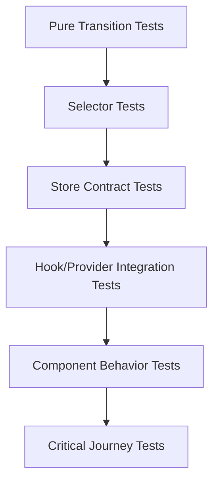
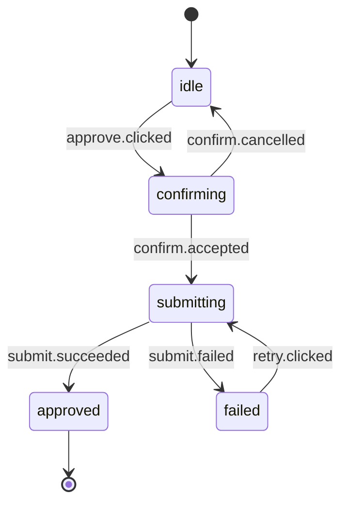
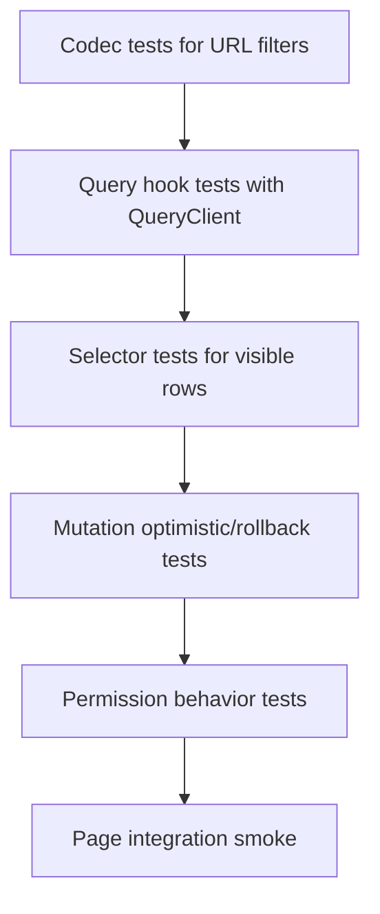

# Part 108 — Testing State Management

State management test yang buruk biasanya mengetes terlalu banyak UI dan terlalu sedikit invariant.

State management test yang kuat menjawab:

```txt
Can illegal states happen?
Can invalid transitions happen?
Does each command produce the right state change?
Do selectors expose the correct read model?
Does subscription update only when it should?
Does async state ignore stale responses?
Does cache invalidation preserve user-visible consistency?
Can tests run independently without leaked state?
```

Kalau Part 107 fokus pada provider/context scope, Part 108 fokus pada **state model**.

State model bisa berupa:

- local reducer;
- reducer + context store;
- external store;
- Zustand store;
- Redux Toolkit slice;
- TanStack Query cache;
- URL state;
- persisted browser state;
- workflow state machine;
- optimistic mutation graph.

Setiap jenis state punya testing contract yang berbeda.

---

## 1. Testing Pyramid untuk State Management

Jangan semua bug state dites lewat klik UI panjang. Itu lambat dan kurang diagnostik.



### Layer 1 — Pure Transition Tests

Untuk reducer/state machine.

Cepat, deterministik, sangat diagnostik.

### Layer 2 — Selector Tests

Untuk read model, derived data, normalization, permission projection.

### Layer 3 — Store Contract Tests

Untuk `getState`, `setState`, `subscribe`, external store, persistence, reset.

### Layer 4 — Hook/Provider Integration Tests

Untuk adapter React: `useStore`, `useSelector`, context provider, query client.

### Layer 5 — Component Behavior Tests

Untuk behavior yang terlihat user.

### Layer 6 — Critical Journey Tests

Untuk flow lintas boundary: route, query, mutation, modal, permission.

Rule praktis:

```txt
Test invariant as low as possible.
Test behavior as high as necessary.
```

---

## 2. State Test Taxonomy

| State kind | Primary risk | Best test level |
|---|---|---|
| Local `useState` | duplicated source of truth | component behavior |
| `useReducer` | illegal transition | pure reducer test |
| Reducer + Context | provider wiring, dispatch scope | reducer + provider integration |
| External store | stale snapshot, listener leak | store contract + hook test |
| Zustand | singleton leakage, selector issue | fresh/reset store + component behavior |
| Redux Toolkit | slice correctness, middleware behavior | reducer/selector + integration with real store |
| TanStack Query | stale cache, invalidation, retry, leak | query client per test + network mock |
| URL state | parse/serialize drift | codec test + router integration |
| Persistent state | schema/version leak | storage adapter test + hydration test |
| Workflow state | impossible state, race | machine/reducer transition tests |
| Optimistic state | rollback/reconciliation bug | mutation lifecycle + integration test |

---

## 3. Reducer Tests: Transition Table First

Reducer is a pure transition function:

```txt
current state + event → next state
```

Therefore reducer test should look like transition table, not UI script.

Example workflow reducer:

```tsx
type SaveState =
  | { status: 'idle'; draft: Draft }
  | { status: 'saving'; draft: Draft; requestId: string }
  | { status: 'saved'; draft: Draft; savedAt: string }
  | { status: 'failed'; draft: Draft; requestId: string; error: string };

type SaveEvent =
  | { type: 'draft.changed'; patch: Partial<Draft> }
  | { type: 'save.requested'; requestId: string }
  | { type: 'save.succeeded'; requestId: string; savedAt: string }
  | { type: 'save.failed'; requestId: string; error: string }
  | { type: 'retry.requested'; requestId: string };
```

Reducer:

```tsx
function saveReducer(state: SaveState, event: SaveEvent): SaveState {
  switch (event.type) {
    case 'draft.changed': {
      if (state.status === 'saving') return state;

      return {
        ...state,
        draft: { ...state.draft, ...event.patch },
      };
    }

    case 'save.requested':
      if (state.status === 'saving') return state;
      return {
        status: 'saving',
        draft: state.draft,
        requestId: event.requestId,
      };

    case 'save.succeeded':
      if (state.status !== 'saving') return state;
      if (state.requestId !== event.requestId) return state;

      return {
        status: 'saved',
        draft: state.draft,
        savedAt: event.savedAt,
      };

    case 'save.failed':
      if (state.status !== 'saving') return state;
      if (state.requestId !== event.requestId) return state;

      return {
        status: 'failed',
        draft: state.draft,
        requestId: event.requestId,
        error: event.error,
      };

    case 'retry.requested':
      if (state.status !== 'failed') return state;
      return {
        status: 'saving',
        draft: state.draft,
        requestId: event.requestId,
      };
  }
}
```

Tests:

```tsx
describe('saveReducer', () => {
  it('enters saving with request identity', () => {
    const state: SaveState = { status: 'idle', draft: { title: 'A' } };

    expect(
      saveReducer(state, { type: 'save.requested', requestId: 'r1' }),
    ).toEqual({
      status: 'saving',
      draft: { title: 'A' },
      requestId: 'r1',
    });
  });

  it('ignores stale success from old request', () => {
    const state: SaveState = {
      status: 'saving',
      draft: { title: 'A' },
      requestId: 'r2',
    };

    expect(
      saveReducer(state, {
        type: 'save.succeeded',
        requestId: 'r1',
        savedAt: '2026-07-08T00:00:00Z',
      }),
    ).toBe(state);
  });

  it('prevents draft mutation while saving', () => {
    const state: SaveState = {
      status: 'saving',
      draft: { title: 'A' },
      requestId: 'r1',
    };

    expect(
      saveReducer(state, { type: 'draft.changed', patch: { title: 'B' } }),
    ).toBe(state);
  });
});
```

Important: stale success test is a production bug test, not academic purity. It catches race conditions before they become user data corruption.

---

## 4. Testing Illegal States

A reducer should make illegal states unrepresentable when possible.

Bad state:

```tsx
type BadState = {
  isLoading: boolean;
  isSuccess: boolean;
  isError: boolean;
  error?: string;
  data?: CaseRecord;
};
```

This allows nonsense:

```tsx
{
  isLoading: true,
  isSuccess: true,
  isError: true,
  data: caseRecord,
  error: 'Failed'
}
```

Better:

```tsx
type LoadState =
  | { status: 'idle' }
  | { status: 'loading'; requestId: string }
  | { status: 'success'; data: CaseRecord }
  | { status: 'error'; error: string };
```

Tests should enforce no transition creates invalid shape.

```tsx
function expectValidLoadState(state: LoadState) {
  switch (state.status) {
    case 'idle':
      expect('data' in state).toBe(false);
      expect('error' in state).toBe(false);
      break;
    case 'loading':
      expect(state.requestId).toBeTruthy();
      break;
    case 'success':
      expect(state.data.id).toBeTruthy();
      break;
    case 'error':
      expect(state.error).toBeTruthy();
      break;
  }
}
```

Transition table with invariant check:

```tsx
it.each(events)('keeps load state valid after %o', (event) => {
  const next = loadReducer(initialState, event);
  expectValidLoadState(next);
});
```

---

## 5. Selector Tests: Read Model Contract

Selectors convert write model into read model.

Example normalized state:

```tsx
type CaseState = {
  ids: string[];
  entities: Record<string, CaseRecord>;
};

function selectOpenCases(state: CaseState) {
  return state.ids
    .map((id) => state.entities[id])
    .filter((caseRecord) => caseRecord.status === 'open');
}
```

Test:

```tsx
it('selects open cases in list order', () => {
  const state: CaseState = {
    ids: ['c2', 'c1', 'c3'],
    entities: {
      c1: { id: 'c1', status: 'closed' },
      c2: { id: 'c2', status: 'open' },
      c3: { id: 'c3', status: 'open' },
    },
  };

  expect(selectOpenCases(state).map((item) => item.id)).toEqual(['c2', 'c3']);
});
```

Selector tests are especially useful when:

- sort/filter/pagination rules matter;
- permission projection matters;
- entity relations are normalized;
- derived totals/badges affect UX;
- UI would be too noisy as test surface.

---

## 6. Memoized Selector Tests

Selector memoization should not be treated as correctness unless it is part of performance contract.

Correctness test:

```tsx
expect(selectVisibleCases(state, filters)).toEqual(expectedCases);
```

Performance/identity test only when necessary:

```tsx
it('returns same result reference when inputs are unchanged', () => {
  const first = selectVisibleCases(state, filters);
  const second = selectVisibleCases(state, filters);

  expect(second).toBe(first);
});
```

Use identity tests sparingly. They are valid for selector libraries where referential stability prevents rerender fan-out.

---

## 7. External Store Contract Tests

External store should obey:

```txt
getSnapshot returns current immutable snapshot
subscribe registers listener
setState changes state and notifies listeners
unchanged state should not notify unnecessarily if contract says so
unsubscribe removes listener
```

Minimal store:

```tsx
type Listener = () => void;

function createStore<T>(initialState: T) {
  let state = initialState;
  const listeners = new Set<Listener>();

  return {
    getState() {
      return state;
    },
    setState(next: T) {
      if (Object.is(state, next)) return;
      state = next;
      listeners.forEach((listener) => listener());
    },
    subscribe(listener: Listener) {
      listeners.add(listener);
      return () => listeners.delete(listener);
    },
  };
}
```

Store tests:

```tsx
describe('createStore', () => {
  it('returns initial state', () => {
    const store = createStore({ count: 0 });
    expect(store.getState()).toEqual({ count: 0 });
  });

  it('notifies subscribers after state change', () => {
    const store = createStore({ count: 0 });
    const listener = vi.fn();

    store.subscribe(listener);
    store.setState({ count: 1 });

    expect(listener).toHaveBeenCalledTimes(1);
  });

  it('does not notify after unsubscribe', () => {
    const store = createStore({ count: 0 });
    const listener = vi.fn();

    const unsubscribe = store.subscribe(listener);
    unsubscribe();

    store.setState({ count: 1 });

    expect(listener).not.toHaveBeenCalled();
  });
});
```

---

## 8. Testing React Adapter for External Store

Store contract alone is not enough. The React adapter must subscribe correctly.

```tsx
function useCounterStore(store: ReturnType<typeof createStore<{ count: number }>>) {
  return useSyncExternalStore(
    store.subscribe,
    store.getState,
    store.getState,
  );
}
```

Test with harness component:

```tsx
it('rerenders consumer when external store changes', () => {
  const store = createStore({ count: 0 });

  function Counter() {
    const state = useCounterStore(store);
    return <span>{state.count}</span>;
  }

  render(<Counter />);

  expect(screen.getByText('0')).toBeInTheDocument();

  act(() => {
    store.setState({ count: 1 });
  });

  expect(screen.getByText('1')).toBeInTheDocument();
});
```

If `getSnapshot` returns new object every call even when store did not change, React can warn or loop. Test that state is stable when unchanged.

```tsx
it('returns stable snapshot while state is unchanged', () => {
  const store = createStore({ count: 0 });

  expect(store.getState()).toBe(store.getState());
});
```

---

## 9. Testing Selector-Based Subscription

Selector store test needs two assertions:

1. selected value is correct;
2. unrelated updates do not rerender selected consumer if equality says unchanged.

```tsx
function useStoreSelector<TState, TSelected>(
  store: Store<TState>,
  selector: (state: TState) => TSelected,
  isEqual = Object.is,
): TSelected {
  const lastRef = useRef<TSelected>();

  return useSyncExternalStore(
    store.subscribe,
    () => {
      const selected = selector(store.getState());
      if (lastRef.current !== undefined && isEqual(lastRef.current, selected)) {
        return lastRef.current;
      }
      lastRef.current = selected;
      return selected;
    },
    () => selector(store.getState()),
  );
}
```

Rerender test:

```tsx
it('does not rerender when selected slice is unchanged', () => {
  const store = createStore({ count: 0, theme: 'light' });
  let renders = 0;

  function CountLabel() {
    renders += 1;
    const count = useStoreSelector(store, (state) => state.count);
    return <span>{count}</span>;
  }

  render(<CountLabel />);

  act(() => {
    store.setState({ count: 0, theme: 'dark' });
  });

  expect(screen.getByText('0')).toBeInTheDocument();
  expect(renders).toBe(1);
});
```

Caveat: render count tests can be affected by Strict Mode. Use them only for low-level store adapter tests, not broad component tests.

---

## 10. Testing Zustand

Zustand has two common testing concerns:

1. do not leak singleton store state between tests;
2. test components through real store interactions when possible.

A store factory is often easier to test than hard singleton.

```tsx
import { createStore } from 'zustand/vanilla';

type CounterState = {
  count: number;
  increment(): void;
  reset(): void;
};

function createCounterStore(initialCount = 0) {
  return createStore<CounterState>()((set) => ({
    count: initialCount,
    increment: () => set((state) => ({ count: state.count + 1 })),
    reset: () => set({ count: initialCount }),
  }));
}
```

Provider-scoped store:

```tsx
const CounterStoreContext = createContext<ReturnType<typeof createCounterStore> | null>(null);

function CounterStoreProvider({
  store = createCounterStore(),
  children,
}: {
  store?: ReturnType<typeof createCounterStore>;
  children: React.ReactNode;
}) {
  return (
    <CounterStoreContext.Provider value={store}>
      {children}
    </CounterStoreContext.Provider>
  );
}
```

Test:

```tsx
it('increments through Zustand store', async () => {
  const user = userEvent.setup();
  const store = createCounterStore(0);

  render(
    <CounterStoreProvider store={store}>
      <CounterWidget />
    </CounterStoreProvider>,
  );

  await user.click(screen.getByRole('button', { name: /increment/i }));

  expect(screen.getByText('1')).toBeInTheDocument();
});
```

If using singleton store, reset it in `afterEach`.

```tsx
afterEach(() => {
  useCounterStore.setState(useCounterStore.getInitialState(), true);
});
```

But for architecture, provider-scoped vanilla store gives better test isolation.

---

## 11. Testing Redux Toolkit

Redux tests should prefer integration with real store for connected components. Mocking `useSelector` and `useDispatch` usually hides wiring and selector bugs.

Test utility:

```tsx
import { configureStore } from '@reduxjs/toolkit';
import { Provider } from 'react-redux';
import { render } from '@testing-library/react';

export function setupStore(preloadedState?: Partial<RootState>) {
  return configureStore({
    reducer: rootReducer,
    preloadedState: preloadedState as RootState,
  });
}

export function renderWithRedux(
  ui: React.ReactElement,
  options: { preloadedState?: Partial<RootState>; store?: AppStore } = {},
) {
  const store = options.store ?? setupStore(options.preloadedState);

  return {
    store,
    ...render(<Provider store={store}>{ui}</Provider>),
  };
}
```

Slice reducer test:

```tsx
it('adds case to entity state', () => {
  const next = casesReducer(
    initialCasesState,
    caseAdded({ id: 'c1', status: 'open', title: 'Case 1' }),
  );

  expect(next.entities.c1?.title).toBe('Case 1');
  expect(next.ids).toContain('c1');
});
```

Component integration test:

```tsx
it('renders open case count from Redux state', () => {
  renderWithRedux(<OpenCaseBadge />, {
    preloadedState: {
      cases: casesStateFixture({ open: 3, closed: 2 }),
    },
  });

  expect(screen.getByText('3 open cases')).toBeInTheDocument();
});
```

Async thunk test can be done through store dispatch plus mocked network boundary.

```tsx
it('loads cases through thunk', async () => {
  server.use(
    http.get('/api/cases', () => HttpResponse.json([{ id: 'c1', status: 'open' }])),
  );

  const store = setupStore();

  await store.dispatch(fetchCases());

  expect(selectCaseById(store.getState(), 'c1')).toMatchObject({ status: 'open' });
});
```

---

## 12. Testing Redux Listener Middleware

Listener middleware is orchestration. Test it as command/event reaction.

Example:

```tsx
startAppListening({
  actionCreator: caseApproved,
  effect: async (action, listenerApi) => {
    listenerApi.dispatch(toastQueued({ message: 'Case approved' }));
    listenerApi.dispatch(casesApi.util.invalidateTags(['CaseList']));
  },
});
```

Test:

```tsx
it('queues toast after case approval', async () => {
  const store = setupStore();

  store.dispatch(caseApproved({ caseId: 'c1' }));

  await waitFor(() => {
    expect(selectToasts(store.getState())).toContainEqual(
      expect.objectContaining({ message: 'Case approved' }),
    );
  });
});
```

Do not assert every middleware internal call unless that call is the public contract. Assert resulting store behavior.

---

## 13. Testing TanStack Query

TanStack Query tests need fresh `QueryClient` per test.

```tsx
function createTestQueryClient() {
  return new QueryClient({
    defaultOptions: {
      queries: {
        retry: false,
      },
      mutations: {
        retry: false,
      },
    },
  });
}

function renderWithQueryClient(ui: React.ReactElement) {
  const queryClient = createTestQueryClient();

  return {
    queryClient,
    ...render(
      <QueryClientProvider client={queryClient}>
        {ui}
      </QueryClientProvider>,
    ),
  };
}
```

Query test:

```tsx
it('renders cases loaded from server state', async () => {
  server.use(
    http.get('/api/cases', () =>
      HttpResponse.json([{ id: 'c1', title: 'Case 1' }]),
    ),
  );

  renderWithQueryClient(<CaseList />);

  expect(await screen.findByText('Case 1')).toBeInTheDocument();
});
```

Cache-level test:

```tsx
it('invalidates case list after approving a case', async () => {
  const { queryClient } = renderWithQueryClient(<ApproveCaseButton caseId="c1" />);
  const invalidateSpy = vi.spyOn(queryClient, 'invalidateQueries');

  await userEvent.click(screen.getByRole('button', { name: /approve/i }));

  await waitFor(() => {
    expect(invalidateSpy).toHaveBeenCalledWith({ queryKey: ['cases'] });
  });
});
```

Prefer user-visible result when possible. Cache spy is acceptable when invalidation contract is the behavior under test and UI refetch would make the test overly broad.

---

## 14. Testing Optimistic Mutation

Optimistic state has three critical paths:

1. optimistic apply;
2. success reconciliation;
3. failure rollback/compensation.

TanStack Query-style optimistic test:

```tsx
it('optimistically marks case as approved then rolls back on failure', async () => {
  server.use(
    http.post('/api/cases/c1/approve', () =>
      HttpResponse.json({ message: 'Conflict' }, { status: 409 }),
    ),
  );

  const queryClient = createTestQueryClient();
  queryClient.setQueryData(['case', 'c1'], {
    id: 'c1',
    status: 'pending',
  });

  render(
    <QueryClientProvider client={queryClient}>
      <CaseStatus caseId="c1" />
      <ApproveCaseButton caseId="c1" />
    </QueryClientProvider>,
  );

  await userEvent.click(screen.getByRole('button', { name: /approve/i }));

  expect(screen.getByText(/approved/i)).toBeInTheDocument();

  await waitFor(() => {
    expect(screen.getByText(/pending/i)).toBeInTheDocument();
  });
});
```

Optimistic tests should not only test happy path. The failure path is where consistency bugs live.

---

## 15. Testing URL State

URL state has codec contract:

```txt
domain state ↔ URL string
```

Test codecs separately.

```tsx
type CaseFilter = {
  status: 'open' | 'closed' | 'all';
  page: number;
  search: string;
};

function parseCaseFilter(params: URLSearchParams): CaseFilter {
  const rawStatus = params.get('status');
  const status = rawStatus === 'open' || rawStatus === 'closed' ? rawStatus : 'all';

  const rawPage = Number(params.get('page'));
  const page = Number.isInteger(rawPage) && rawPage > 0 ? rawPage : 1;

  return {
    status,
    page,
    search: params.get('q') ?? '',
  };
}
```

Codec test:

```tsx
it('parses invalid URL filter into safe defaults', () => {
  const params = new URLSearchParams('status=deleted&page=-4&q=fraud');

  expect(parseCaseFilter(params)).toEqual({
    status: 'all',
    page: 1,
    search: 'fraud',
  });
});
```

Router integration test:

```tsx
it('updates query string when filter changes', async () => {
  const router = createMemoryRouter(routes, {
    initialEntries: ['/cases?status=open'],
  });

  render(<RouterProvider router={router} />);

  await userEvent.selectOptions(screen.getByLabelText(/status/i), 'closed');

  expect(router.state.location.search).toContain('status=closed');
});
```

URL state test must cover:

- invalid params;
- default params;
- canonicalization;
- back/forward behavior;
- query key integration;
- private data leakage.

---

## 16. Testing Persistent State

Persistent state needs schema test, not just storage mock.

```tsx
type PreferencesV2 = {
  version: 2;
  theme: 'light' | 'dark';
  density: 'compact' | 'comfortable';
};

function parsePreferences(raw: string | null): PreferencesV2 {
  if (!raw) return defaultPreferences();

  try {
    const parsed = JSON.parse(raw);

    if (parsed.version === 2) {
      return preferencesV2Schema.parse(parsed);
    }

    if (parsed.version === 1) {
      return migrateV1ToV2(parsed);
    }

    return defaultPreferences();
  } catch {
    return defaultPreferences();
  }
}
```

Tests:

```tsx
it('falls back to defaults for malformed storage', () => {
  expect(parsePreferences('{bad json')).toEqual(defaultPreferences());
});

it('migrates v1 preferences to v2', () => {
  expect(
    parsePreferences(JSON.stringify({ version: 1, theme: 'dark' })),
  ).toEqual({
    version: 2,
    theme: 'dark',
    density: 'comfortable',
  });
});
```

Provider integration:

```tsx
it('loads preferences from storage on initial render', () => {
  localStorage.setItem(
    'preferences',
    JSON.stringify({ version: 2, theme: 'dark', density: 'compact' }),
  );

  render(
    <PreferencesProvider>
      <PreferencesPanel />
    </PreferencesProvider>,
  );

  expect(screen.getByRole('combobox', { name: /theme/i })).toHaveValue('dark');
});
```

Persistent state must reset localStorage/sessionStorage between tests.

---

## 17. Testing Workflow State

Workflow state should be tested as transition graph.

Example approval workflow:



Transition tests:

```tsx
it('does not submit without confirmation', () => {
  const state: ApprovalState = { status: 'idle' };

  expect(
    approvalReducer(state, { type: 'confirm.accepted' }),
  ).toEqual({ status: 'idle' });
});

it('retries failed submission with new request id', () => {
  const state: ApprovalState = {
    status: 'failed',
    requestId: 'r1',
    error: 'Timeout',
  };

  expect(
    approvalReducer(state, { type: 'retry.clicked', requestId: 'r2' }),
  ).toEqual({
    status: 'submitting',
    requestId: 'r2',
  });
});
```

Workflow UI test should cover one happy path and key failure path, not every transition.

---

## 18. Testing State Machines / XState

For state machines, test the machine separate from React rendering when possible.

```tsx
it('moves from confirming to submitting after confirm', () => {
  const actor = createActor(approvalMachine).start();

  actor.send({ type: 'approve.clicked' });
  expect(actor.getSnapshot().value).toBe('confirming');

  actor.send({ type: 'confirm.accepted' });
  expect(actor.getSnapshot().value).toBe('submitting');
});
```

React integration test:

```tsx
it('renders confirmation dialog after approve click', async () => {
  render(<ApprovalWidget caseId="c1" />);

  await userEvent.click(screen.getByRole('button', { name: /approve/i }));

  expect(screen.getByRole('dialog', { name: /approve case/i })).toBeInTheDocument();
});
```

Keep machine tests exhaustive. Keep UI tests representative.

---

## 19. Testing Async Race Conditions

Async state bug often appears when response order differs from request order.

Test it deliberately.

```tsx
it('ignores stale search result when a newer request finishes first', async () => {
  const deferredA = createDeferred<SearchResult[]>();
  const deferredB = createDeferred<SearchResult[]>();

  searchApi.mockImplementation((query) => {
    if (query === 'a') return deferredA.promise;
    if (query === 'ab') return deferredB.promise;
    throw new Error('Unexpected query');
  });

  render(<SearchBox />);

  await userEvent.type(screen.getByRole('textbox', { name: /search/i }), 'a');
  await userEvent.type(screen.getByRole('textbox', { name: /search/i }), 'b');

  deferredB.resolve([{ id: '2', title: 'AB result' }]);
  expect(await screen.findByText('AB result')).toBeInTheDocument();

  deferredA.resolve([{ id: '1', title: 'A result' }]);

  await waitFor(() => {
    expect(screen.queryByText('A result')).not.toBeInTheDocument();
  });
});
```

This is one of the highest-value tests in stateful UI.

---

## 20. Testing State Reset Semantics

Reset is a state contract. Test it explicitly.

Common reset boundaries:

- route param changes;
- key remount;
- form submit success;
- modal close;
- logout;
- tenant switch;
- query key change;
- wizard restart.

Example:

```tsx
it('resets local draft when case id changes', async () => {
  const { rerender } = render(<CaseEditor caseId="c1" initialTitle="Alpha" />);

  await userEvent.clear(screen.getByLabelText(/title/i));
  await userEvent.type(screen.getByLabelText(/title/i), 'Changed');

  rerender(<CaseEditor caseId="c2" initialTitle="Beta" />);

  expect(screen.getByLabelText(/title/i)).toHaveValue('Beta');
});
```

This catches accidental preservation of state across entity changes.

---

## 21. Testing State Management Through Accessibility

State changes should usually be asserted through accessible output:

- role;
- label;
- text;
- disabled/enabled;
- checked/selected;
- expanded/collapsed;
- busy/pending;
- error message relationship;
- dialog presence;
- focus movement.

Example:

```tsx
expect(screen.getByRole('button', { name: /submit/i })).toBeDisabled();
expect(screen.getByRole('alert')).toHaveTextContent('Title is required');
expect(screen.getByRole('tab', { name: /details/i })).toHaveAttribute('aria-selected', 'true');
```

Avoid:

```tsx
expect(component.state()).toEqual(...)
expect(wrapper.find('.active')).toHaveLength(1)
expect(container.firstChild).toMatchSnapshot()
```

State is implementation. Behavior is contract.

---

## 22. Testing State Observability

In production, state bugs are often diagnosed with transition logs.

For complex reducers, you can test transition instrumentation.

```tsx
type TransitionLog = {
  previousStatus: string;
  eventType: string;
  nextStatus: string;
};

function instrumentReducer<S extends { status: string }, E extends { type: string }>(
  reducer: (state: S, event: E) => S,
  log: (entry: TransitionLog) => void,
) {
  return (state: S, event: E) => {
    const next = reducer(state, event);

    if (state.status !== next.status) {
      log({
        previousStatus: state.status,
        eventType: event.type,
        nextStatus: next.status,
      });
    }

    return next;
  };
}
```

Test:

```tsx
it('logs workflow status transitions', () => {
  const log = vi.fn();
  const reducer = instrumentReducer(approvalReducer, log);

  reducer({ status: 'idle' }, { type: 'approve.clicked' });

  expect(log).toHaveBeenCalledWith({
    previousStatus: 'idle',
    eventType: 'approve.clicked',
    nextStatus: 'confirming',
  });
});
```

Do not overdo this. Instrumentation tests are valuable for regulated or complex workflows where audit/debug trail is part of architecture.

---

## 23. State Test Anti-Patterns

| Anti-pattern | Why it fails | Better approach |
|---|---|---|
| Snapshot entire component tree | Brittle, low signal | Assert accessible behavior |
| Mock `useSelector` | Hides store wiring | Render with real test store |
| Mock `useQuery` everywhere | Hides cache/loading/error behavior | Use QueryClient + network mock |
| Singleton store across tests | Order-dependent failures | Store factory/reset after each |
| Testing every transition through UI | Slow, hard to diagnose | Reducer/machine transition tests |
| Testing implementation state | Refactor-hostile | Observable behavior + selectors |
| Missing stale response test | Race bugs survive | Deferred promise order test |
| No invalid URL test | Broken deep links | Codec validation tests |
| No rollback test | Optimistic drift | Mutation failure path test |
| Over-mocking providers | Wiring bugs hidden | Minimal real providers/fakes |

---

## 24. Practical State Testing Checklist

For any new stateful feature, add tests at the right level:

```txt
Pure model
□ Are reducers/state machines tested as transition tables?
□ Are illegal states impossible or explicitly guarded?
□ Are stale async results ignored?
□ Are reset semantics explicit?

Read model
□ Are selectors tested for sorting/filtering/derived totals?
□ Are memoized selectors tested only when identity matters?

Store
□ Is each test using a fresh store/query client/router where needed?
□ Does subscribe/unsubscribe work?
□ Does state leak between tests?

UI behavior
□ Are assertions user-observable and accessible?
□ Are loading, error, empty, success, and disabled states covered?
□ Are permission/feature flag branches covered?

Server state
□ Are query keys tested via behavior or cache setup?
□ Are invalidation and optimistic rollback tested?
□ Are retries disabled or controlled in test environment?

Persistence/URL
□ Are invalid/missing/old-version values handled?
□ Are private values excluded from URL/storage?
```

---

## 25. Mini Case Study: Case Review Queue

State requirements:

- queue filters live in URL;
- case list is server state;
- selected case ID is URL or local page state;
- reviewer assignment is mutation;
- optimistic assignment updates row immediately;
- failure rolls back;
- permission controls assignment button;
- selected row remains stable across refetch.

Testing plan:



### URL codec test

```tsx
it('normalizes invalid queue filter params', () => {
  expect(parseQueueParams(new URLSearchParams('status=bad&page=0'))).toEqual({
    status: 'all',
    page: 1,
  });
});
```

### Query component test

```tsx
it('renders queue rows from server state', async () => {
  server.use(
    http.get('/api/review-queue', () =>
      HttpResponse.json({ items: [{ id: 'c1', title: 'Case 1' }] }),
    ),
  );

  renderWithQueryClient(<ReviewQueuePage />);

  expect(await screen.findByText('Case 1')).toBeInTheDocument();
});
```

### Optimistic rollback test

```tsx
it('rolls back optimistic assignment on conflict', async () => {
  server.use(
    http.post('/api/cases/c1/assign', () =>
      HttpResponse.json({ message: 'Already assigned' }, { status: 409 }),
    ),
  );

  renderWithCaseQueueFixture({
    cases: [{ id: 'c1', title: 'Case 1', assignee: null }],
  });

  await userEvent.click(screen.getByRole('button', { name: /assign to me/i }));

  expect(screen.getByText(/assigned to you/i)).toBeInTheDocument();

  await waitFor(() => {
    expect(screen.getByText(/unassigned/i)).toBeInTheDocument();
  });
});
```

### Permission behavior test

```tsx
it('hides assignment action when reviewer lacks assignment permission', () => {
  renderWithCaseQueueFixture({
    permissions: deny('case:assign'),
    cases: [{ id: 'c1', title: 'Case 1', assignee: null }],
  });

  expect(screen.queryByRole('button', { name: /assign to me/i })).not.toBeInTheDocument();
});
```

This split gives high confidence without one huge brittle test.

---

## 26. Key Takeaways

State management testing is not library-specific first. It is **model-specific**.

Reducers need transition tests. Selectors need read-model tests. External stores need subscription contract tests. Zustand/Redux need isolation and real-store integration. TanStack Query needs fresh query clients and server-state lifecycle tests. URL/persistent state needs codec/schema tests. Workflows need state graph tests.

The best state test strategy follows one rule:

```txt
Put each assertion at the lowest level that can prove the invariant.
```

Then add a small number of high-level tests for wiring and user journey.

That is how you avoid both extremes:

- brittle UI tests that know too much;
- isolated unit tests that prove nothing about the real app.

In a serious React codebase, state tests are architecture tests. They preserve the promises your UI makes about ownership, transitions, consistency, and recovery.
