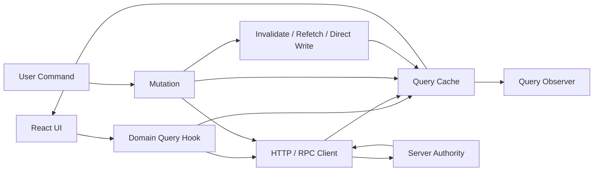
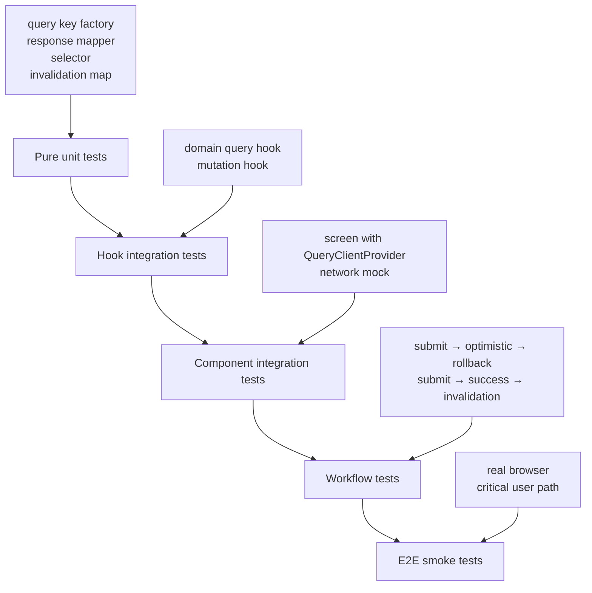
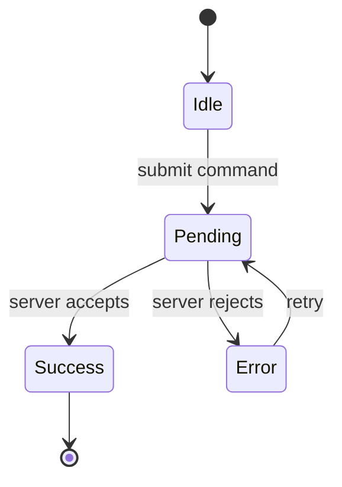

# Part 109 — Testing Server State

Server state tests are not tests for `useQuery` or `useMutation` themselves. Those libraries already have their own tests.

Your tests should prove this:

```txt
Given a user intent and a server response,
the UI reaches the correct observable state,
the cache is changed only through valid boundaries,
and stale, duplicate, failed, or out-of-order responses cannot corrupt the screen.
```

Server state is different from client state because the source of truth is outside the browser. The browser only owns a cached, possibly stale, partially synchronized projection.

That means server-state tests must cover more than success rendering:

```txt
fetch lifecycle
cache identity
query key correctness
staleness and refetch
mutation lifecycle
invalidation
optimistic update
rollback
request ordering
permission drift
network failure
hydration
cleanup
```

TanStack Query describes its core job as fetching, caching, synchronizing, and updating server state. Testing server state is therefore testing the correctness of that synchronization boundary, not just whether a spinner disappears.

---

## 1. The mental model

A server-state feature has four moving parts:



The bug usually lives in one of these edges:

| Edge | Common bug |
|---|---|
| UI → Hook | Wrong params, unstable query key, missing enabled guard |
| Hook → API | Wrong endpoint, missing tenant/auth scope, no abort/cancel support |
| API → Cache | Response shape mismatch, partial overwrite, stale data wins |
| Mutation → Cache | Optimistic update not rolled back, invalidation too broad/narrow |
| Cache → UI | Wrong stale state, duplicate loading model, stale permission display |
| Test → Feature | Shared query client hides bugs, retry makes tests flaky |

A production-grade test suite should not assert every internal cache operation. It should assert the observable contract and only inspect cache when cache behavior itself is the public contract under test.

---

## 2. What not to test

Do not waste tests on library internals:

```txt
Do not test that useQuery calls queryFn.
Do not test that TanStack Query stores data.
Do not test that isLoading is initially true unless your UI contract depends on it.
Do not mock useQuery unless you are deliberately unit-testing a pure view component.
Do not snapshot the entire DOM after every query state.
```

Bad test shape:

```tsx
vi.mock('@tanstack/react-query', () => ({
  useQuery: () => ({ data: [{ id: '1', name: 'A' }], isLoading: false }),
}))
```

This removes the thing you most need to test:

```txt
query key
cache reuse
network contract
loading/error behavior
invalidation
staleness
mutation interaction
```

Better shape:

```txt
Render the real component.
Use a real QueryClient.
Mock the network boundary.
Assert user-observable behavior.
```

---

## 3. Testing layers

Use layers. Do not make every test a full integration journey.



Recommended split:

| Layer | Test target | Mock boundary | Assertions |
|---|---|---|---|
| Pure unit | query-key factory, mapper, selector | None | deterministic return values |
| Hook integration | domain hook | network | status, data, cache behavior |
| Component integration | screen/component | network | visible UI, interactions |
| Workflow | mutation + query + UI state | network/time | lifecycle and failure paths |
| E2E | critical path | backend/staging/mock server | business outcome |

For most features, component integration tests give the best signal-to-cost ratio.

---

## 4. Test QueryClient isolation

Every server-state test needs an isolated query cache.

Shared cache across tests causes invisible coupling:

```txt
Test A fetches invoice 123.
Test B renders invoice 123.
Test B passes without making the expected request.
The test suite lies.
```

Create a fresh client per test render.

```tsx
import { QueryClient, QueryClientProvider } from '@tanstack/react-query'
import { render } from '@testing-library/react'
import type { ReactNode } from 'react'

export function createTestQueryClient() {
  return new QueryClient({
    defaultOptions: {
      queries: {
        retry: false,
        staleTime: 0,
      },
      mutations: {
        retry: false,
      },
    },
  })
}

export function renderWithQueryClient(ui: ReactNode) {
  const queryClient = createTestQueryClient()

  const result = render(
    <QueryClientProvider client={queryClient}>
      {ui}
    </QueryClientProvider>
  )

  return { ...result, queryClient }
}
```

Why `retry: false`?

Because retry is a production resilience policy, but in tests it often turns deterministic failure into timing-dependent flakiness.

You can still write explicit retry tests, but they should opt into retry intentionally.

---

## 5. Mock the network, not the hook

For server-state integration tests, the cleanest mock boundary is usually HTTP.

```txt
React component remains real.
Domain hook remains real.
QueryClient remains real.
API client remains mostly real.
Network response is controlled.
```

MSW is useful because it intercepts requests at the network level and can be reused across browser, Node, Storybook, and test environments.

Example handler shape:

```tsx
import { http, HttpResponse } from 'msw'

export const handlers = [
  http.get('/api/invoices', ({ request }) => {
    const url = new URL(request.url)
    const status = url.searchParams.get('status') ?? 'open'

    return HttpResponse.json({
      items: [
        { id: 'inv_1', number: 'INV-001', status },
        { id: 'inv_2', number: 'INV-002', status },
      ],
    })
  }),
]
```

Test server setup:

```tsx
import { setupServer } from 'msw/node'
import { afterAll, afterEach, beforeAll } from 'vitest'
import { handlers } from './handlers'

export const server = setupServer(...handlers)

beforeAll(() => server.listen({ onUnhandledRequest: 'error' }))
afterEach(() => server.resetHandlers())
afterAll(() => server.close())
```

`onUnhandledRequest: 'error'` is important. It converts accidental real network calls into test failures.

---

## 6. Domain query hook test

Domain query hooks should encode query identity, API call, and projection.

```tsx
export function invoiceListKey(params: { status: string }) {
  return ['invoices', 'list', params] as const
}

export function useInvoiceList(params: { status: string }) {
  return useQuery({
    queryKey: invoiceListKey(params),
    queryFn: () => invoiceApi.list(params),
  })
}
```

Test the observable behavior:

```tsx
import { renderHook, waitFor } from '@testing-library/react'

it('fetches invoices by status', async () => {
  const queryClient = createTestQueryClient()

  const wrapper = ({ children }: { children: React.ReactNode }) => (
    <QueryClientProvider client={queryClient}>{children}</QueryClientProvider>
  )

  const { result } = renderHook(
    () => useInvoiceList({ status: 'open' }),
    { wrapper }
  )

  await waitFor(() => expect(result.current.isSuccess).toBe(true))

  expect(result.current.data?.items).toEqual([
    expect.objectContaining({ id: 'inv_1', status: 'open' }),
    expect.objectContaining({ id: 'inv_2', status: 'open' }),
  ])
})
```

But do not stop here. Query hook tests should cover identity and boundary behavior when relevant.

---

## 7. Query key tests

Query key factories deserve unit tests because wrong keys create silent cache bugs.

```tsx
it('includes all variables that affect invoice list result', () => {
  expect(invoiceListKey({ status: 'open', page: 1, tenantId: 't1' })).toEqual([
    'tenants',
    't1',
    'invoices',
    'list',
    { status: 'open', page: 1 },
  ])
})
```

Bad key:

```tsx
['invoices']
```

Why bad?

```txt
open invoices and closed invoices share one cache slot
page 1 and page 2 overwrite each other
tenant A can see tenant B data if cache survives navigation/session
```

A query key must encode every variable that changes the result.

---

## 8. Component integration test

A component test should read like a user journey, not a hook implementation test.

```tsx
it('shows invoices returned by the server', async () => {
  renderWithQueryClient(<InvoiceListPage initialStatus="open" />)

  expect(screen.getByText(/loading/i)).toBeInTheDocument()

  expect(await screen.findByText('INV-001')).toBeInTheDocument()
  expect(screen.getByText('INV-002')).toBeInTheDocument()
})
```

Test error state:

```tsx
it('shows a useful error when invoices fail to load', async () => {
  server.use(
    http.get('/api/invoices', () => {
      return HttpResponse.json(
        { message: 'Database temporarily unavailable' },
        { status: 503 }
      )
    })
  )

  renderWithQueryClient(<InvoiceListPage initialStatus="open" />)

  expect(await screen.findByRole('alert')).toHaveTextContent(
    /temporarily unavailable|try again/i
  )
})
```

The assertion is not “`isError` is true”. The assertion is “the user sees a useful recovery surface”.

---

## 9. Dependent query tests

Dependent queries should not fire before their dependency is valid.

Example:

```tsx
function useInvoiceAuditTrail(invoiceId: string | null) {
  return useQuery({
    queryKey: ['invoiceAuditTrail', invoiceId],
    queryFn: () => invoiceApi.auditTrail(invoiceId!),
    enabled: invoiceId !== null,
  })
}
```

Test the guard:

```tsx
it('does not request audit trail before invoice id is known', async () => {
  const auditSpy = vi.fn()

  server.use(
    http.get('/api/invoices/null/audit-trail', () => {
      auditSpy()
      return HttpResponse.json({ items: [] })
    })
  )

  renderWithQueryClient(<InvoiceAuditPanel invoiceId={null} />)

  expect(screen.getByText(/select an invoice/i)).toBeInTheDocument()
  expect(auditSpy).not.toHaveBeenCalled()
})
```

This class of test prevents accidental `undefined`/`null` requests, which are common in page orchestration layers.

---

## 10. Mutation tests

A mutation test should cover the command lifecycle:



Example mutation hook:

```tsx
export function useApproveInvoice() {
  const queryClient = useQueryClient()

  return useMutation({
    mutationFn: invoiceApi.approve,
    onSuccess: (_result, variables) => {
      queryClient.invalidateQueries({ queryKey: ['invoices'] })
      queryClient.invalidateQueries({ queryKey: ['invoice', variables.invoiceId] })
    },
  })
}
```

Integration test:

```tsx
it('approves invoice and refreshes invoice status', async () => {
  const user = userEvent.setup()

  let approved = false

  server.use(
    http.get('/api/invoices/inv_1', () => {
      return HttpResponse.json({
        id: 'inv_1',
        number: 'INV-001',
        status: approved ? 'approved' : 'pending',
      })
    }),
    http.post('/api/invoices/inv_1/approve', () => {
      approved = true
      return HttpResponse.json({ ok: true })
    })
  )

  renderWithQueryClient(<InvoiceDetailPage invoiceId="inv_1" />)

  expect(await screen.findByText(/pending/i)).toBeInTheDocument()

  await user.click(screen.getByRole('button', { name: /approve/i }))

  expect(await screen.findByText(/approved/i)).toBeInTheDocument()
})
```

This verifies mutation + invalidation + refetch as a user-observable behavior.

---

## 11. Optimistic update test

Optimistic update tests need two paths:

```txt
success path: optimistic state is reconciled with server truth
failure path: optimistic state is rolled back or compensated
```

Example hook:

```tsx
export function useRenameInvoice() {
  const queryClient = useQueryClient()

  return useMutation({
    mutationFn: invoiceApi.rename,
    onMutate: async ({ invoiceId, name }) => {
      await queryClient.cancelQueries({ queryKey: ['invoice', invoiceId] })

      const previous = queryClient.getQueryData(['invoice', invoiceId])

      queryClient.setQueryData(['invoice', invoiceId], (old: any) => ({
        ...old,
        name,
      }))

      return { previous }
    },
    onError: (_error, variables, context) => {
      queryClient.setQueryData(['invoice', variables.invoiceId], context?.previous)
    },
    onSettled: (_data, _error, variables) => {
      queryClient.invalidateQueries({ queryKey: ['invoice', variables.invoiceId] })
    },
  })
}
```

Failure test:

```tsx
it('rolls back optimistic rename when server rejects it', async () => {
  const user = userEvent.setup()

  server.use(
    http.get('/api/invoices/inv_1', () => {
      return HttpResponse.json({ id: 'inv_1', name: 'Original Name' })
    }),
    http.patch('/api/invoices/inv_1', () => {
      return HttpResponse.json({ message: 'Name is locked' }, { status: 409 })
    })
  )

  renderWithQueryClient(<InvoiceNameEditor invoiceId="inv_1" />)

  expect(await screen.findByDisplayValue('Original Name')).toBeInTheDocument()

  await user.clear(screen.getByLabelText(/invoice name/i))
  await user.type(screen.getByLabelText(/invoice name/i), 'New Name')
  await user.click(screen.getByRole('button', { name: /save/i }))

  expect(screen.getByDisplayValue('New Name')).toBeInTheDocument()

  expect(await screen.findByText(/name is locked/i)).toBeInTheDocument()
  expect(screen.getByDisplayValue('Original Name')).toBeInTheDocument()
})
```

This test is valuable because optimistic UI bugs often pass happy-path tests.

---

## 12. Invalidation tests

Invalidation is not a ritual. It is a consistency policy.

Map mutation impact explicitly:

| Mutation | Must invalidate or update |
|---|---|
| approve invoice | invoice detail, invoice list, badge counts, audit trail |
| rename invoice | invoice detail, invoice list projection |
| add comment | comments list, activity feed, comment count |
| assign case owner | detail, list, assignee workload summary |

Test invalidation when stale data would create a user-visible lie.

```tsx
it('updates invoice count after approving an invoice', async () => {
  const user = userEvent.setup()
  let pendingCount = 1

  server.use(
    http.get('/api/invoices/counts', () => {
      return HttpResponse.json({ pending: pendingCount })
    }),
    http.post('/api/invoices/inv_1/approve', () => {
      pendingCount = 0
      return HttpResponse.json({ ok: true })
    })
  )

  renderWithQueryClient(<InvoiceDashboard />)

  expect(await screen.findByText('Pending: 1')).toBeInTheDocument()

  await user.click(screen.getByRole('button', { name: /approve inv-001/i }))

  expect(await screen.findByText('Pending: 0')).toBeInTheDocument()
})
```

This catches missing aggregate invalidation.

---

## 13. Cache seeding tests

Sometimes you intentionally seed cache to test behavior after prefetch, navigation, or SSR hydration.

```tsx
it('renders prefetched invoice without initial loading state', () => {
  const queryClient = createTestQueryClient()

  queryClient.setQueryData(['invoice', 'inv_1'], {
    id: 'inv_1',
    number: 'INV-001',
    status: 'open',
  })

  render(
    <QueryClientProvider client={queryClient}>
      <InvoiceDetailPage invoiceId="inv_1" />
    </QueryClientProvider>
  )

  expect(screen.getByText('INV-001')).toBeInTheDocument()
})
```

Use cache seeding sparingly. It is good for testing specific cache behavior, but bad as a default because it can bypass the network contract.

---

## 14. Race condition tests

The most dangerous server-state bugs are ordering bugs.

Example:

```txt
User opens invoice A.
Slow request A starts.
User quickly opens invoice B.
Fast request B resolves.
Slow request A resolves later.
UI must still show B.
```

Component-level test shape:

```tsx
it('does not show stale invoice when a slower previous request resolves later', async () => {
  const user = userEvent.setup()

  server.use(
    http.get('/api/invoices/inv_slow', async () => {
      await delay(100)
      return HttpResponse.json({ id: 'inv_slow', number: 'SLOW' })
    }),
    http.get('/api/invoices/inv_fast', () => {
      return HttpResponse.json({ id: 'inv_fast', number: 'FAST' })
    })
  )

  renderWithQueryClient(<InvoiceBrowser />)

  await user.click(screen.getByRole('button', { name: /open slow/i }))
  await user.click(screen.getByRole('button', { name: /open fast/i }))

  expect(await screen.findByText('FAST')).toBeInTheDocument()
  expect(screen.queryByText('SLOW')).not.toBeInTheDocument()
})
```

If your query key includes invoice ID, this usually works naturally because invoice A and invoice B occupy different cache addresses. If your code manually copies data into local state inside an effect, this is where stale response bugs appear.

---

## 15. Infinite query tests

Infinite query tests need to verify page identity and append behavior.

```tsx
it('loads next page and appends results without replacing previous page', async () => {
  const user = userEvent.setup()

  server.use(
    http.get('/api/invoices', ({ request }) => {
      const cursor = new URL(request.url).searchParams.get('cursor')

      if (cursor === 'page-2') {
        return HttpResponse.json({
          items: [{ id: 'inv_3', number: 'INV-003' }],
          nextCursor: null,
        })
      }

      return HttpResponse.json({
        items: [
          { id: 'inv_1', number: 'INV-001' },
          { id: 'inv_2', number: 'INV-002' },
        ],
        nextCursor: 'page-2',
      })
    })
  )

  renderWithQueryClient(<InfiniteInvoiceList />)

  expect(await screen.findByText('INV-001')).toBeInTheDocument()

  await user.click(screen.getByRole('button', { name: /load more/i }))

  expect(await screen.findByText('INV-003')).toBeInTheDocument()
  expect(screen.getByText('INV-001')).toBeInTheDocument()
})
```

Also test:

```txt
no next page disables load more
failed page fetch keeps previous pages
duplicate click does not duplicate pages
filter change resets pages
```

---

## 16. SSR and hydration tests

If your framework prefetches/dehydrates query data, test the contract at least once per architecture pattern.

Contract:

```txt
server prefetches using the same key factory
client hydrates using the same QueryClient setup
first paint uses hydrated data
client does not immediately flash wrong loading state
```

Minimal unit/integration target:

```tsx
it('uses the same query key for server prefetch and client read', () => {
  const params = { tenantId: 't1', status: 'open' }

  expect(serverInvoiceListKey(params)).toEqual(clientInvoiceListKey(params))
})
```

This seems small, but it prevents a real class of hydration bugs where server and client cache addresses diverge.

---

## 17. Testing stale time and refetch policy

Avoid tests that sleep arbitrary milliseconds.

Bad:

```tsx
await new Promise(resolve => setTimeout(resolve, 5000))
```

Better:

```txt
use fake timers only when testing timer semantics
use explicit refetch triggers when possible
assert observable result, not wall-clock implementation
```

Example:

```tsx
it('refetches when user clicks refresh', async () => {
  const user = userEvent.setup()
  let version = 1

  server.use(
    http.get('/api/report', () => {
      return HttpResponse.json({ version: version++ })
    })
  )

  renderWithQueryClient(<ReportPanel />)

  expect(await screen.findByText('Version 1')).toBeInTheDocument()

  await user.click(screen.getByRole('button', { name: /refresh/i }))

  expect(await screen.findByText('Version 2')).toBeInTheDocument()
})
```

---

## 18. Permission and tenant drift tests

Server state is often scoped by identity, tenant, role, or permission.

Bug:

```txt
queryKey = ['cases']
```

When it should be:

```txt
queryKey = ['tenants', tenantId, 'cases', filters]
```

Test:

```tsx
it('does not reuse tenant A cases for tenant B', async () => {
  const { rerenderWithTenant } = renderTenantAware(<CaseList />)

  expect(await screen.findByText('Tenant A Case')).toBeInTheDocument()

  rerenderWithTenant('tenant-b')

  expect(await screen.findByText('Tenant B Case')).toBeInTheDocument()
  expect(screen.queryByText('Tenant A Case')).not.toBeInTheDocument()
})
```

This is not only a UX test. In regulated systems, this is a defensibility boundary.

---

## 19. Testing cancellation and unmount

Server-state libraries prevent many unmounted setState bugs, but your surrounding code can still leak.

Test when your component owns additional subscriptions, timers, or workflow state around a query.

```tsx
it('does not show result after panel is closed before request resolves', async () => {
  const user = userEvent.setup()

  server.use(
    http.get('/api/slow-report', async () => {
      await delay(100)
      return HttpResponse.json({ title: 'Slow Report' })
    })
  )

  renderWithQueryClient(<ReportDrawer />)

  await user.click(screen.getByRole('button', { name: /open report/i }))
  await user.click(screen.getByRole('button', { name: /close/i }))

  expect(screen.queryByText('Slow Report')).not.toBeInTheDocument()
})
```

The invariant is not “request is aborted” unless aborting is part of the contract. The invariant is “closed UI is not resurrected by late data”.

---

## 20. Testing observability

For high-risk workflows, test emitted audit/analytics events separately from UI rendering.

Example:

```tsx
it('logs mutation failure with stable metadata', async () => {
  const audit = createAuditSpy()

  renderWithProviders(
    <InvoiceApprovalButton invoiceId="inv_1" />,
    { audit }
  )

  await user.click(screen.getByRole('button', { name: /approve/i }))

  expect(await screen.findByRole('alert')).toBeInTheDocument()

  expect(audit.events).toContainEqual({
    type: 'invoice.approval.failed',
    invoiceId: 'inv_1',
    reason: 'server-rejected',
  })
})
```

Keep this separate from snapshot logs. Test stable semantic metadata only.

---

## 21. Failure modes

### 21.1 Shared QueryClient between tests

Symptom:

```txt
Tests pass individually but fail or pass suspiciously in suite.
Requests not made when expected.
Data from previous tests appears.
```

Fix:

```txt
fresh QueryClient per test
clear cache between tests if reusing client is unavoidable
avoid parallel tests sharing one client
```

### 21.2 Retry flakiness

Symptom:

```txt
Error test takes too long.
Test sometimes times out.
Mock handler receives more calls than expected.
```

Fix:

```txt
default retry false in tests
write explicit retry tests separately
```

### 21.3 Mocking the hook instead of the boundary

Symptom:

```txt
UI tests pass but query key/invalidation bugs escape.
```

Fix:

```txt
mock network boundary
keep QueryClient and hooks real
```

### 21.4 Under-tested invalidation

Symptom:

```txt
Detail updates, list remains stale.
Badge count remains stale.
Aggregate remains stale.
```

Fix:

```txt
mutation impact map
integration test for affected projections
```

### 21.5 Query key collision

Symptom:

```txt
Different filters show same result.
Tenant switch leaks old data.
Pagination overwrites previous page.
```

Fix:

```txt
query key factory
unit tests for key shape
include all variables that affect data
```

### 21.6 Over-asserting loading implementation

Symptom:

```txt
Tests break when stale-while-revalidate policy changes.
```

Fix:

```txt
assert user-facing states, not exact internal status unless that status is the contract
```

---

## 22. Production checklist

Before merging server-state changes, ask:

```txt
Does every query have a stable key factory?
Does the key include tenant/auth/filter/page/sort variables?
Does each test get an isolated QueryClient?
Are retries disabled by default in tests?
Does the network mock fail on unhandled requests?
Are mutations tested for success and failure?
Is optimistic update tested for rollback or compensation?
Is invalidation tested for every user-visible affected projection?
Are race conditions covered for slow/fast responses?
Are dependent queries tested for enabled guard?
Are infinite queries tested for append/reset behavior?
Are permission and tenant drift tested?
Is hydration tested when SSR/dehydration is used?
Are tests asserting behavior instead of cache internals?
```

---

## 23. Decision rule

Use this rule:

```txt
If a bug would make the user see stale, wrong, unauthorized, duplicated, or missing server data,
there should be a test at the nearest layer that can observe that failure.
```

Server-state tests are not about coverage percentage. They are about protecting synchronization boundaries.

A strong React engineer treats server state as a distributed systems problem at UI scale:

```txt
identity
freshness
ordering
idempotency
invalidation
rollback
authority
observability
```

That is the level of testing that keeps large React systems stable.

---

## References

- React docs — `act`: https://react.dev/reference/react/act
- TanStack Query docs — Testing: https://tanstack.com/query/v5/docs/framework/react/guides/testing
- TanStack Query docs — Query invalidation: https://tanstack.com/query/latest/docs/framework/react/guides/query-invalidation
- TanStack Query docs — Mutations: https://tanstack.com/query/v5/docs/framework/react/guides/mutations
- Mock Service Worker: https://mswjs.io/
