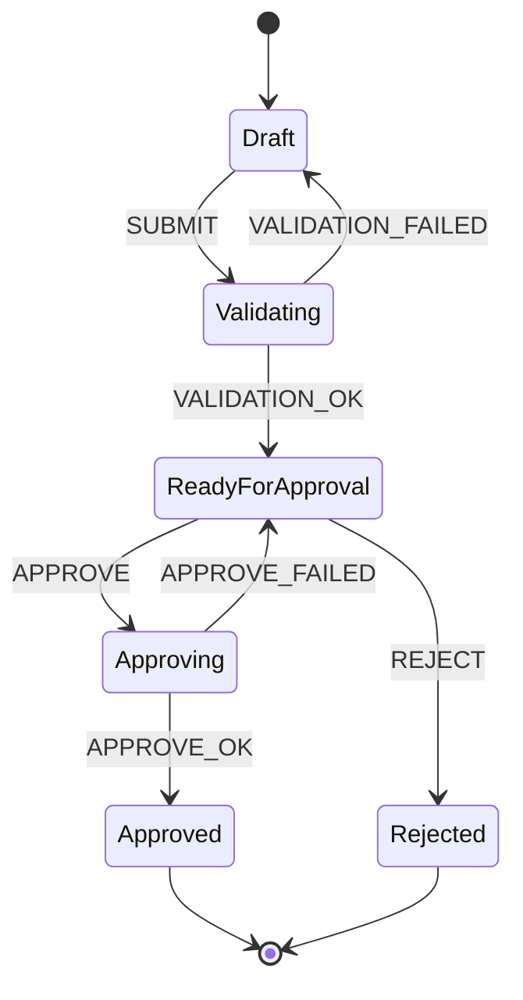
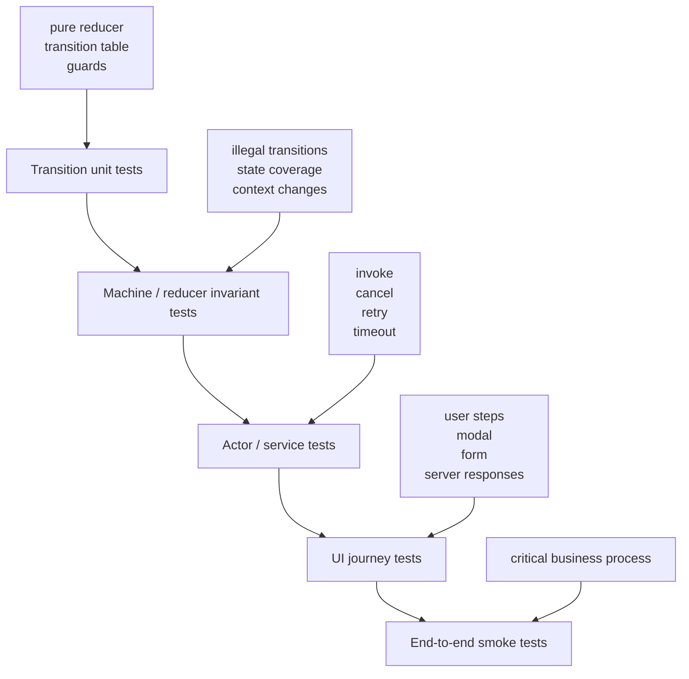
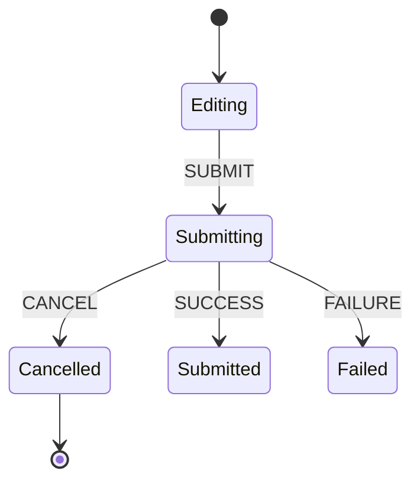

# Part 110 — Testing Workflow Orchestration

Workflow orchestration tests answer a different question from normal component tests.

Normal component test:

```txt
When user clicks Save, does the UI show Saved?
```

Workflow orchestration test:

```txt
Can the workflow reach every valid state through allowed events,
reject impossible transitions,
survive async races,
clean up external work,
and expose a coherent user journey under failure?
```

This is where reducers, state machines, actors, form steps, approval flows, uploads, modal confirmations, optimistic commands, and retry/cancel behavior become testable systems.

If server-state testing protects synchronization with external authority, workflow testing protects transition correctness inside the UI/application boundary.

---

## 1. Workflow state is not just component state

A workflow is a stateful process with rules.

Example approval workflow:



The important thing is not the labels. The important thing is the invariant:

```txt
You cannot approve before validation.
You cannot edit after approval unless reopen is allowed.
A failed approval returns to a recoverable state.
A late validation response cannot overwrite a newer draft.
```

These are not styling concerns. They are state transition concerns.

---

## 2. Test layers for workflow orchestration



Do not put everything into one huge browser test.

Recommended split:

| Layer | Target | Cost | Value |
|---|---|---:|---|
| Pure transition test | reducer/machine transition | low | high correctness signal |
| Guard/action test | validation and command decision | low | prevents illegal paths |
| Actor/service test | async lifecycle | medium | catches race/cancel bugs |
| UI journey test | rendered workflow | medium | proves integration |
| E2E smoke | deployed flow | high | proves environment wiring |

A mature workflow test suite has many cheap transition tests and a smaller number of end-to-end journey tests.

---

## 3. The core test question

For every workflow, define:

```txt
states
allowed events
forbidden events
guards
actions
effects
terminal states
recovery states
```

Then ask:

```txt
Can every allowed transition happen?
Can every illegal transition be rejected or ignored safely?
Can async work return late without corrupting state?
Can cleanup happen when workflow exits?
Can user recover from failure states?
```

This produces better tests than “click around until green”.

---

## 4. Reducer workflow example

Start with a reducer.

```tsx
type Status =
  | 'idle'
  | 'editing'
  | 'validating'
  | 'ready'
  | 'submitting'
  | 'submitted'
  | 'failed'

type State = {
  status: Status
  draft: { title: string }
  validationErrors: Record<string, string>
  requestId: string | null
}

type Event =
  | { type: 'EDIT'; title: string }
  | { type: 'SUBMIT'; requestId: string }
  | { type: 'VALIDATION_OK'; requestId: string }
  | { type: 'VALIDATION_FAILED'; requestId: string; errors: Record<string, string> }
  | { type: 'SAVE_OK'; requestId: string }
  | { type: 'SAVE_FAILED'; requestId: string; message: string }
  | { type: 'RESET' }

export function reducer(state: State, event: Event): State {
  switch (event.type) {
    case 'EDIT':
      if (state.status === 'submitted') return state
      return {
        ...state,
        status: 'editing',
        draft: { title: event.title },
        validationErrors: {},
      }

    case 'SUBMIT':
      if (state.status !== 'editing' && state.status !== 'failed') return state
      return {
        ...state,
        status: 'validating',
        requestId: event.requestId,
      }

    case 'VALIDATION_OK':
      if (state.status !== 'validating') return state
      if (state.requestId !== event.requestId) return state
      return { ...state, status: 'ready' }

    case 'VALIDATION_FAILED':
      if (state.status !== 'validating') return state
      if (state.requestId !== event.requestId) return state
      return {
        ...state,
        status: 'editing',
        validationErrors: event.errors,
      }

    case 'SAVE_OK':
      if (state.status !== 'submitting') return state
      if (state.requestId !== event.requestId) return state
      return { ...state, status: 'submitted' }

    case 'SAVE_FAILED':
      if (state.status !== 'submitting') return state
      if (state.requestId !== event.requestId) return state
      return { ...state, status: 'failed' }

    case 'RESET':
      return initialState
  }
}
```

The reducer is not enough to run effects. But it is enough to test transition correctness.

---

## 5. Transition tests

Transition tests should be table-driven.

```tsx
const editingState: State = {
  status: 'editing',
  draft: { title: 'A' },
  validationErrors: {},
  requestId: null,
}

it('moves editing to validating on submit', () => {
  const next = reducer(editingState, {
    type: 'SUBMIT',
    requestId: 'req_1',
  })

  expect(next).toEqual({
    ...editingState,
    status: 'validating',
    requestId: 'req_1',
  })
})
```

Illegal transition test:

```tsx
it('ignores submit after workflow is already submitted', () => {
  const submitted: State = {
    ...editingState,
    status: 'submitted',
  }

  const next = reducer(submitted, {
    type: 'SUBMIT',
    requestId: 'req_2',
  })

  expect(next).toBe(submitted)
})
```

Request identity test:

```tsx
it('ignores stale validation response from an older request', () => {
  const validating: State = {
    ...editingState,
    status: 'validating',
    requestId: 'newer_req',
  }

  const next = reducer(validating, {
    type: 'VALIDATION_FAILED',
    requestId: 'older_req',
    errors: { title: 'Too short' },
  })

  expect(next).toBe(validating)
})
```

This tiny test catches a large class of async race bugs.

---

## 6. Transition table coverage

Build a transition table for non-trivial workflows.

| Current state | Event | Expected next state | Notes |
|---|---|---|---|
| editing | SUBMIT | validating | assign requestId |
| validating | VALIDATION_OK matching req | ready | allow save |
| validating | VALIDATION_FAILED matching req | editing | show errors |
| validating | VALIDATION_FAILED stale req | validating | ignore |
| submitted | EDIT | submitted | immutable terminal |
| failed | SUBMIT | validating | retry |

Then automate the table:

```tsx
type Case = {
  name: string
  state: State
  event: Event
  expectedStatus: Status
}

const cases: Case[] = [
  {
    name: 'editing + submit => validating',
    state: editingState,
    event: { type: 'SUBMIT', requestId: 'req_1' },
    expectedStatus: 'validating',
  },
  {
    name: 'submitted + edit => submitted',
    state: { ...editingState, status: 'submitted' },
    event: { type: 'EDIT', title: 'Changed' },
    expectedStatus: 'submitted',
  },
]

test.each(cases)('$name', ({ state, event, expectedStatus }) => {
  expect(reducer(state, event).status).toBe(expectedStatus)
})
```

The table becomes living documentation.

---

## 7. Invariant tests

Some rules are broader than one transition.

Example invariant:

```txt
A submitted workflow must not have validation errors.
```

Test invariant across event sequences:

```tsx
function assertInvariants(state: State) {
  if (state.status === 'submitted') {
    expect(state.validationErrors).toEqual({})
  }

  if (state.status === 'validating' || state.status === 'submitting') {
    expect(state.requestId).not.toBeNull()
  }
}

it('preserves invariants through a valid journey', () => {
  let state = initialState

  const events: Event[] = [
    { type: 'EDIT', title: 'Valid Title' },
    { type: 'SUBMIT', requestId: 'req_1' },
    { type: 'VALIDATION_OK', requestId: 'req_1' },
  ]

  for (const event of events) {
    state = reducer(state, event)
    assertInvariants(state)
  }
})
```

For regulated workflows, invariants are more important than component snapshots.

---

## 8. Workflow hook tests

A workflow hook coordinates reducer + effects + commands.

```tsx
function useCaseSubmissionWorkflow(deps: {
  validate: (draft: Draft, requestId: string) => Promise<ValidationResult>
  save: (draft: Draft, requestId: string) => Promise<void>
  id: () => string
}) {
  const [state, dispatch] = useReducer(reducer, initialState)

  const submit = async () => {
    const requestId = deps.id()
    dispatch({ type: 'SUBMIT', requestId })

    const validation = await deps.validate(state.draft, requestId)

    if (!validation.ok) {
      dispatch({ type: 'VALIDATION_FAILED', requestId, errors: validation.errors })
      return
    }

    dispatch({ type: 'VALIDATION_OK', requestId })
    await deps.save(state.draft, requestId)
    dispatch({ type: 'SAVE_OK', requestId })
  }

  return { state, dispatch, submit }
}
```

This implementation has a subtle problem: `submit` reads `state.draft` from the render snapshot where the callback was created. If edits happen between callback creation and execution, stale state can appear.

Tests should catch that.

Better design often passes the draft into command explicitly or stores command logic in reducer/machine boundary.

Test hook commands with dependency injection:

```tsx
it('dispatches validation failure from injected service', async () => {
  const validate = vi.fn().mockResolvedValue({
    ok: false,
    errors: { title: 'Required' },
  })

  const save = vi.fn()

  const { result } = renderHook(
    () => useCaseSubmissionWorkflow({
      validate,
      save,
      id: () => 'req_1',
    })
  )

  act(() => {
    result.current.dispatch({ type: 'EDIT', title: '' })
  })

  await act(async () => {
    await result.current.submit()
  })

  expect(result.current.state.status).toBe('editing')
  expect(result.current.state.validationErrors).toEqual({ title: 'Required' })
  expect(save).not.toHaveBeenCalled()
})
```

Dependency injection turns workflow tests from fragile network tests into deterministic protocol tests.

---

## 9. UI journey tests

A UI journey test verifies the rendered workflow contract.

Example:

```tsx
it('validates, shows error, allows correction, then submits', async () => {
  const user = userEvent.setup()

  renderWithProviders(<CaseSubmissionPage />)

  await user.click(screen.getByRole('button', { name: /submit/i }))

  expect(await screen.findByText(/title is required/i)).toBeInTheDocument()

  await user.type(screen.getByLabelText(/title/i), 'Suspicious transaction')
  await user.click(screen.getByRole('button', { name: /submit/i }))

  expect(await screen.findByText(/case submitted/i)).toBeInTheDocument()
})
```

This test should not know whether implementation uses reducer, XState, Zustand, or plain hooks.

It asserts the contract:

```txt
invalid submit shows recoverable error
correction clears error
valid submit reaches terminal success
```

---

## 10. XState workflow tests

With XState v5, test the machine separately from the React component.

Example actor-level test:

```tsx
import { createActor } from 'xstate'
import { caseWorkflowMachine } from './caseWorkflowMachine'

it('moves from draft to validating on submit', () => {
  const actor = createActor(caseWorkflowMachine).start()

  expect(actor.getSnapshot().value).toBe('draft')

  actor.send({ type: 'SUBMIT' })

  expect(actor.getSnapshot().value).toBe('validating')
})
```

Test illegal events:

```tsx
it('does not approve before validation', () => {
  const actor = createActor(caseWorkflowMachine).start()

  actor.send({ type: 'APPROVE' })

  expect(actor.getSnapshot().value).toBe('draft')
})
```

Test invoked services by injecting deterministic actors/services through machine setup.

The rule is the same:

```txt
Pure machine behavior gets machine tests.
Rendered journey gets React Testing Library tests.
External integrations get boundary tests.
```

---

## 11. Actor tests

Actor-based workflows need tests for lifecycle.

Actor lifecycle questions:

```txt
When is child actor spawned?
When is it stopped?
Who owns its events?
What happens if parent exits while child is pending?
Can child response arrive after parent state changed?
```

Example invariant:

```txt
Upload actor must stop when user cancels upload workflow.
```

Test shape:

```tsx
it('stops upload actor when workflow is cancelled', () => {
  const events: string[] = []

  const actor = createActor(
    uploadWorkflowMachine.provide({
      actors: {
        uploadFile: fromPromise(async () => {
          events.push('upload-started')
          await never()
        }),
      },
      actions: {
        recordCancelled: () => events.push('upload-cancelled'),
      },
    })
  ).start()

  actor.send({ type: 'START_UPLOAD', fileId: 'file_1' })
  actor.send({ type: 'CANCEL' })

  expect(actor.getSnapshot().value).toBe('cancelled')
  expect(events).toContain('upload-cancelled')
})
```

The exact API may vary by your machine design, but the invariant does not:

```txt
cancel means no orphaned work can still commit result to UI
```

---

## 12. Async race tests

Workflow async work must be identity-aware.

Race:

```txt
request A starts
request B starts
request B succeeds
request A fails late
A must not overwrite B
```

Reducer test:

```tsx
it('ignores stale save failure after newer request is active', () => {
  const state: State = {
    ...editingState,
    status: 'submitting',
    requestId: 'req_new',
  }

  const next = reducer(state, {
    type: 'SAVE_FAILED',
    requestId: 'req_old',
    message: 'Old failure',
  })

  expect(next).toBe(state)
})
```

UI integration test:

```tsx
it('does not show stale validation error from previous draft', async () => {
  const user = userEvent.setup()

  renderWithProviders(<CaseForm />)

  await user.type(screen.getByLabelText(/title/i), 'A')
  await user.click(screen.getByRole('button', { name: /validate/i }))

  await user.clear(screen.getByLabelText(/title/i))
  await user.type(screen.getByLabelText(/title/i), 'Valid title')
  await user.click(screen.getByRole('button', { name: /validate/i }))

  expect(await screen.findByText(/looks good/i)).toBeInTheDocument()
  expect(screen.queryByText(/too short/i)).not.toBeInTheDocument()
})
```

If this test is flaky, your workflow likely lacks request identity or cancellation.

---

## 13. Retry tests

Retry is not just “call again”. It is a transition policy.

Questions:

```txt
Which states allow retry?
Does retry reuse same command or create a new request id?
Are stale errors cleared?
Is user prevented from double retry?
Is retry audit-visible?
```

Test:

```tsx
it('retries failed submission and reaches success', async () => {
  const user = userEvent.setup()
  let attempts = 0

  server.use(
    http.post('/api/cases', () => {
      attempts += 1
      if (attempts === 1) {
        return HttpResponse.json({ message: 'Temporary failure' }, { status: 503 })
      }
      return HttpResponse.json({ id: 'case_1' })
    })
  )

  renderWithProviders(<CaseSubmissionPage />)

  await user.type(screen.getByLabelText(/title/i), 'Case A')
  await user.click(screen.getByRole('button', { name: /submit/i }))

  expect(await screen.findByText(/temporary failure/i)).toBeInTheDocument()

  await user.click(screen.getByRole('button', { name: /retry/i }))

  expect(await screen.findByText(/case submitted/i)).toBeInTheDocument()
  expect(attempts).toBe(2)
})
```

---

## 14. Cancellation tests

Cancellation should be tested as a first-class transition.



Invariant:

```txt
After cancel, late success cannot transition to submitted.
```

Test:

```tsx
it('ignores late success after cancellation', () => {
  let state = reducer(editingState, {
    type: 'SUBMIT',
    requestId: 'req_1',
  })

  state = reducer(state, { type: 'CANCEL', requestId: 'req_1' } as Event)

  const afterLateSuccess = reducer(state, {
    type: 'SAVE_OK',
    requestId: 'req_1',
  })

  expect(afterLateSuccess.status).toBe('cancelled')
})
```

If your reducer does not model cancellation, this test forces the design question.

---

## 15. Modal workflow tests

Modal workflows often fail because close semantics are ambiguous.

Do not test only “modal closes”. Test close reason.

```txt
confirm
cancel
escape
backdrop
after-success
after-error
route-change
```

Example:

```tsx
it('does not execute destructive action when confirmation is cancelled', async () => {
  const user = userEvent.setup()
  const archive = vi.fn()

  renderWithProviders(<ArchiveCaseButton caseId="case_1" archive={archive} />)

  await user.click(screen.getByRole('button', { name: /archive/i }))
  await user.click(screen.getByRole('button', { name: /cancel/i }))

  expect(archive).not.toHaveBeenCalled()
  expect(screen.queryByRole('dialog')).not.toBeInTheDocument()
})
```

Confirm path:

```tsx
it('executes destructive action only after explicit confirmation', async () => {
  const user = userEvent.setup()
  const archive = vi.fn().mockResolvedValue(undefined)

  renderWithProviders(<ArchiveCaseButton caseId="case_1" archive={archive} />)

  await user.click(screen.getByRole('button', { name: /archive/i }))
  await user.click(screen.getByRole('button', { name: /confirm archive/i }))

  expect(archive).toHaveBeenCalledWith('case_1')
  expect(await screen.findByText(/archived/i)).toBeInTheDocument()
})
```

---

## 16. Multi-step form journey tests

Multi-step forms need graph coverage, not linear happy-path only.

Test matrix:

| Scenario | Expected |
|---|---|
| next with invalid current step | stay, show field errors |
| next with valid current step | move forward |
| back from step 2 | preserve step 1 draft |
| branching answer changes | remove invalid downstream state |
| server validation fails | stay on relevant step |
| reload with saved draft | restore valid draft only |
| submit success | terminal success |
| submit failure | recoverable retry |

Example:

```tsx
it('removes downstream state when branching answer changes', async () => {
  const user = userEvent.setup()

  renderWithProviders(<CaseWizard />)

  await user.click(screen.getByRole('radio', { name: /company/i }))
  await user.click(screen.getByRole('button', { name: /next/i }))
  await user.type(screen.getByLabelText(/company registration number/i), 'ABC-123')

  await user.click(screen.getByRole('button', { name: /back/i }))
  await user.click(screen.getByRole('radio', { name: /individual/i }))
  await user.click(screen.getByRole('button', { name: /next/i }))

  expect(screen.queryByLabelText(/company registration number/i)).not.toBeInTheDocument()
})
```

This protects state topology, not just rendering.

---

## 17. Optimistic workflow tests

Optimistic workflows need to cover:

```txt
optimistic apply
server success reconciliation
server failure rollback
server conflict compensation
multiple pending commands
undo window
```

Example invariant:

```txt
A rejected optimistic approval must restore previous status and expose recovery.
```

Test:

```tsx
it('rolls back optimistic approval when server rejects command', async () => {
  const user = userEvent.setup()

  server.use(
    http.post('/api/cases/case_1/approve', () => {
      return HttpResponse.json(
        { message: 'Case has unresolved findings' },
        { status: 409 }
      )
    })
  )

  renderWithProviders(<CaseApprovalPanel caseId="case_1" />)

  expect(await screen.findByText(/ready for approval/i)).toBeInTheDocument()

  await user.click(screen.getByRole('button', { name: /approve/i }))

  expect(screen.getByText(/approved/i)).toBeInTheDocument()

  expect(await screen.findByText(/unresolved findings/i)).toBeInTheDocument()
  expect(screen.getByText(/ready for approval/i)).toBeInTheDocument()
})
```

If optimistic failure is not tested, your UI may be fast but dishonest.

---

## 18. Journey script DSL

For complex workflows, define journey scripts.

```tsx
type Step =
  | { action: 'type'; label: RegExp; value: string }
  | { action: 'click'; name: RegExp }
  | { expect: 'visible'; text: RegExp }
  | { expect: 'not-visible'; text: RegExp }

async function runJourney(user: UserEvent, steps: Step[]) {
  for (const step of steps) {
    if ('action' in step && step.action === 'type') {
      await user.type(screen.getByLabelText(step.label), step.value)
    }

    if ('action' in step && step.action === 'click') {
      await user.click(screen.getByRole('button', { name: step.name }))
    }

    if ('expect' in step && step.expect === 'visible') {
      expect(await screen.findByText(step.text)).toBeInTheDocument()
    }

    if ('expect' in step && step.expect === 'not-visible') {
      expect(screen.queryByText(step.text)).not.toBeInTheDocument()
    }
  }
}
```

Usage:

```tsx
await runJourney(user, [
  { action: 'click', name: /submit/i },
  { expect: 'visible', text: /title is required/i },
  { action: 'type', label: /title/i, value: 'Case A' },
  { action: 'click', name: /submit/i },
  { expect: 'visible', text: /submitted/i },
])
```

This is useful when journeys are long and business-significant.

Do not over-engineer the DSL. It should clarify intent, not create a second programming language.

---

## 19. Model-based thinking without model-based tooling

You do not need a special library to adopt model-based thinking.

For each state, list events and expectations:

```txt
state: draft
  EDIT -> draft
  SUBMIT(valid) -> validating
  APPROVE -> draft or explicit error

state: validating
  CANCEL -> draft/cancelled
  VALIDATION_OK -> ready
  VALIDATION_FAILED -> draft
  EDIT -> validating? or draft? decide explicitly
```

Then convert critical rows into tests.

This is often enough.

For highly regulated workflows, model-based testing tools can generate paths from a machine model, but the main value is still the model:

```txt
explicit states
explicit transitions
explicit forbidden paths
```

---

## 20. Accessibility in workflow tests

Workflow tests should use accessibility-oriented queries:

```tsx
screen.getByRole('button', { name: /submit/i })
screen.getByRole('alert')
screen.getByRole('dialog', { name: /confirm archive/i })
screen.getByLabelText(/case title/i)
```

This ensures workflow state is visible through the same semantic surface users and assistive technologies rely on.

For example:

```tsx
it('moves focus to validation summary after failed submit', async () => {
  const user = userEvent.setup()

  renderWithProviders(<CaseSubmissionPage />)

  await user.click(screen.getByRole('button', { name: /submit/i }))

  const alert = await screen.findByRole('alert')
  expect(alert).toHaveFocus()
})
```

This is not cosmetic. In complex workflows, focus is part of orchestration correctness.

---

## 21. Observability tests for workflow

Workflow orchestration should produce stable semantic events, especially in regulated or high-risk systems.

Example:

```tsx
it('records approval failure with transition metadata', async () => {
  const audit = createAuditSpy()

  renderWithProviders(<ApprovalWorkflow caseId="case_1" />, { audit })

  await user.click(screen.getByRole('button', { name: /approve/i }))

  expect(await screen.findByText(/approval failed/i)).toBeInTheDocument()

  expect(audit.events).toContainEqual({
    type: 'workflow.transition.failed',
    workflow: 'caseApproval',
    from: 'approving',
    event: 'APPROVE_FAILED',
    caseId: 'case_1',
  })
})
```

Test the semantic event, not the log line string.

---

## 22. Failure modes

### 22.1 Testing only happy path

Symptom:

```txt
Submit success tested.
Validation failure, server failure, cancel, retry, and stale response untested.
```

Fix:

```txt
state graph coverage
failure path per async boundary
at least one illegal transition test per critical state
```

### 22.2 Boolean soup not testable

Symptom:

```tsx
isSubmitting && isSubmitted && hasError
```

Fix:

```txt
replace boolean soup with discriminated state/status
then test transitions
```

### 22.3 Effects drive workflow invisibly

Symptom:

```txt
Changing one flag triggers effect that changes another flag.
Tests require many await waitFor chains.
```

Fix:

```txt
centralize transitions in reducer/machine
keep effects as command execution boundary
```

### 22.4 Stale async response corrupts current state

Symptom:

```txt
Old validation error appears after user fixed field.
Old submit response navigates away from current screen.
```

Fix:

```txt
requestId/correlation id
abort/cancel where possible
ignore stale completion event
```

### 22.5 Modal close reason not modeled

Symptom:

```txt
Backdrop click accidentally confirms.
Escape triggers destructive action.
Cancel and confirm share same callback.
```

Fix:

```txt
close reason enum
confirm-only command execution
modal journey tests
```

### 22.6 Actor lifecycle leak

Symptom:

```txt
Child upload/subscription continues after parent workflow closed.
Late result resurrects closed UI.
```

Fix:

```txt
parent-owned actor lifecycle
exit/cancel transition
lifecycle tests
```

### 22.7 Tests assert implementation instead of contract

Symptom:

```txt
Changing reducer to XState breaks tests even though user behavior is same.
```

Fix:

```txt
pure transition tests for transition module
UI journey tests for user contract
avoid asserting internal hook call order
```

---

## 23. Workflow test checklist

Before merging workflow changes, ask:

```txt
Are all states explicitly named?
Are all allowed transitions tested?
Are important illegal transitions tested?
Are guards tested independently?
Are async success and failure paths tested?
Are stale response and request identity tested?
Is cancellation tested?
Is retry tested?
Are modal close reasons tested?
Are multi-step branch changes tested?
Are optimistic rollback/compensation paths tested?
Are terminal states protected from mutation?
Are focus and accessibility states tested for critical transitions?
Are audit/observability events tested when required?
Are UI tests written against user-observable behavior?
```

---

## 24. Decision rule

Use this rule:

```txt
If a workflow state transition has business meaning,
it deserves a direct test.

If an async result can arrive late,
it deserves a stale-response test.

If an event should be impossible,
it deserves an illegal-transition test.
```

Workflow bugs are expensive because they hide between UI, async work, and business rules.

Strong React engineers do not rely on clicking the happy path manually. They turn workflow behavior into explicit transition systems and test the graph.

That is how complex React applications stay understandable after the tenth feature, the third team, and the first production incident.

---

## References

- React docs — `useReducer`: https://react.dev/reference/react/useReducer
- React docs — Extracting state logic into a reducer: https://react.dev/learn/extracting-state-logic-into-a-reducer
- React docs — `act`: https://react.dev/reference/react/act
- XState docs: https://stately.ai/docs/xstate
- XState React docs: https://stately.ai/docs/xstate-react
- Testing Library React: https://testing-library.com/docs/react-testing-library/intro/
- Storybook interaction testing: https://storybook.js.org/docs/writing-tests/interaction-testing
