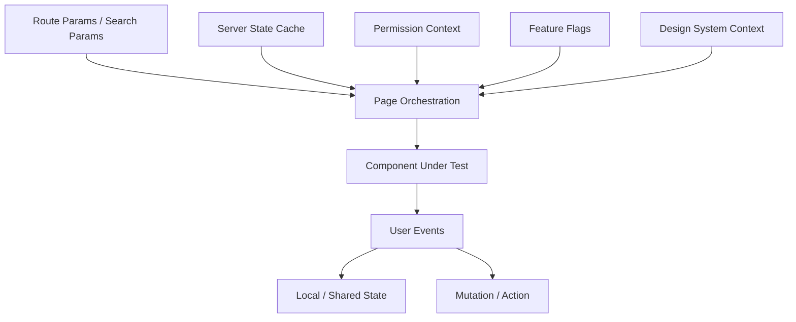
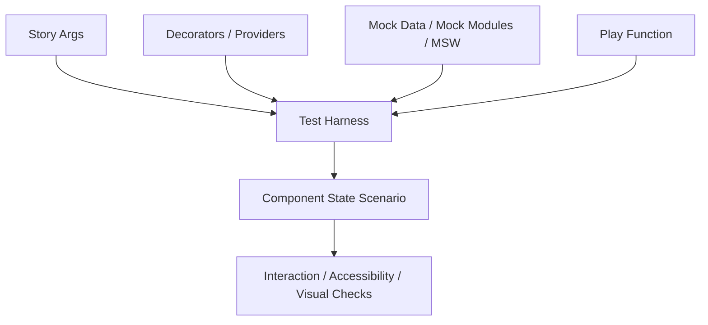

# Part 111 — Storybook as State Lab

Storybook bukan sekadar katalog komponen. Untuk engineer senior, Storybook adalah **laboratorium state**: tempat kita membekukan kombinasi props, context, permission, network state, form state, error state, loading state, optimistic state, dan workflow state menjadi skenario yang bisa dilihat, diuji, direview, dan didiskusikan.

Masalah di aplikasi React besar bukan hanya “komponen ini render atau tidak”. Masalahnya adalah:

```txt
Apakah semua state yang mungkin terjadi sudah punya representasi UI?
Apakah state yang berbahaya sudah dicegah?
Apakah loading/error/empty/permission/optimistic state punya desain yang konsisten?
Apakah bug bisa direproduksi tanpa menjalankan seluruh aplikasi?
Apakah reviewer bisa melihat behavior, bukan hanya membaca kode?
```

Storybook menjadi efektif kalau diperlakukan seperti **state simulator**. Setiap story bukan demo acak, melainkan satu titik dalam state space.

---

## 1. Mental Model: Story as Frozen State Scenario

Di aplikasi penuh, UI berada di tengah banyak dependency:



Di Storybook, kita memotong dependency itu dan membuat environment yang terkendali:



Satu story yang bagus menjawab:

```txt
Given environment X,
when component starts in state Y,
and user performs interaction Z,
then observable UI should become W.
```

Itu sama dengan test, tapi visual, debuggable, dan dokumentatif.

---

## 2. Apa yang Harus Masuk Storybook?

Tidak semua hal perlu story. Storybook paling bernilai untuk UI yang punya:

| Kandidat | Kenapa cocok untuk Storybook |
|---|---|
| Design-system primitive | Perlu memastikan variant, size, disabled, focus, accessibility |
| Headless/compound component | Banyak state koordinasi antar child |
| Form field | Error, touched, disabled, readonly, required, async validation |
| Data display | Loading, empty, error, partial, stale, optimistic |
| Modal/drawer/overlay | Open/close, focus, escape, backdrop, async confirm |
| Workflow component | Step, pending, retry, failed, completed, permission blocked |
| Permission-aware component | Hidden/disabled/readonly/denied-reason |
| Complex page fragment | Query state + filter state + action state |

Tidak semua page penuh harus masuk Storybook. Yang masuk adalah **stateful boundary** yang sulit dipercaya hanya dari unit test.

---

## 3. Story Taxonomy

Gunakan taxonomy yang konsisten agar story bukan folder sampah.

```txt
Component.stories.tsx
  ├─ Default
  ├─ Controlled
  ├─ Uncontrolled
  ├─ Loading
  ├─ Empty
  ├─ Error
  ├─ Disabled
  ├─ PermissionDenied
  ├─ Optimistic
  ├─ WithLongContent
  ├─ WithKeyboardNavigation
  ├─ InDarkTheme
  └─ Regression_<bug-id>
```

Untuk komponen stateful, story minimal biasanya:

| Story | Tujuan |
|---|---|
| `Default` | baseline behavior |
| `Controlled` | parent-owned state contract |
| `Uncontrolled` | internal-owned state contract |
| `Disabled` | no illegal interaction |
| `Error` | error presentation and recovery |
| `Loading` | pending UI |
| `Empty` | zero-data state |
| `LongContent` | overflow, wrapping, truncation |
| `Keyboard` | focus and keyboard semantics |
| `Regression_*` | bug yang pernah terjadi |

Regression stories sangat berharga. Kalau bug sudah pernah terjadi, story-nya harus hidup sebagai dokumentasi.

---

## 4. Args: Props as Scenario Parameters

Storybook `args` adalah cara membuat props menjadi parameter skenario.

```tsx
import type { Meta, StoryObj } from '@storybook/react';
import { StatusBadge } from './StatusBadge';

const meta = {
  title: 'Components/StatusBadge',
  component: StatusBadge,
  args: {
    status: 'pending',
  },
} satisfies Meta<typeof StatusBadge>;

export default meta;
type Story = StoryObj<typeof meta>;

export const Pending: Story = {
  args: { status: 'pending' },
};

export const Approved: Story = {
  args: { status: 'approved' },
};

export const Rejected: Story = {
  args: { status: 'rejected' },
};
```

Tetapi args bukan tempat untuk semua state. Gunakan args untuk **public component API**. Jangan menaruh seluruh fake application state di args kalau component seharusnya menerima view model sederhana.

Bad:

```tsx
export const Complex: Story = {
  args: {
    entireReduxState: hugeState,
    queryCache: hugeCache,
    routerState: hugeRouterState,
  },
};
```

Better:

```tsx
export const PermissionDenied: Story = {
  args: {
    decision: {
      allowed: false,
      reason: 'Only case supervisor can approve this escalation.',
    },
  },
};
```

Story args harus mendorong API komponen tetap eksplisit.

---

## 5. Decorators: Provider Harness, Not Global Magic

Decorators membungkus story dengan environment tambahan: theme, router, query client, permission, feature flags, layout, atau mock provider.

```tsx
import type { Decorator } from '@storybook/react';
import { ThemeProvider } from '../theme/ThemeProvider';
import { PermissionProvider } from '../permissions/PermissionProvider';

export const withAppProviders: Decorator = (Story, context) => {
  const role = context.parameters.role ?? 'case-worker';

  return (
    <ThemeProvider mode="light">
      <PermissionProvider role={role}>
        <Story />
      </PermissionProvider>
    </ThemeProvider>
  );
};
```

Gunakan decorator untuk dependency yang memang environment-level. Jangan gunakan decorator untuk menyembunyikan state penting yang seharusnya terlihat sebagai scenario.

```tsx
export const SupervisorCanApprove: Story = {
  parameters: {
    role: 'supervisor',
  },
};

export const WorkerCannotApprove: Story = {
  parameters: {
    role: 'case-worker',
  },
};
```

Prinsipnya:

```txt
Args menjelaskan input komponen.
Parameters menjelaskan environment story.
Decorators membangun environment itu.
Play function menjalankan interaksi.
```

---

## 6. Story Matrix: Jangan Hanya Happy Path

Untuk komponen production, story harus dibuat dari state matrix.

Contoh komponen `CaseActionPanel`:

| Axis | Values |
|---|---|
| Permission | allowed, denied, readonly |
| Server state | loading, loaded, error, stale |
| Workflow phase | idle, confirming, submitting, success, failed |
| Entity status | open, escalated, closed |
| Validation | valid, invalid, missing reason |
| Viewport | desktop, narrow |

Kalau semua dikalikan, jumlah scenario bisa meledak. Jangan buat semua kombinasi. Buat **representative coverage**:

```txt
1 baseline happy path
1 permission denied
1 loading skeleton
1 server error with retry
1 workflow submitting
1 workflow failed with recovery
1 closed entity where action unavailable
1 invalid form state
1 regression story for known bug
```

Storybook bukan brute-force combinatorial testing. Storybook adalah **curated state coverage**.

---

## 7. State Scenario Builder

Untuk domain UI, jangan menulis mock data manual berulang-ulang. Buat builder.

```tsx
export function buildCase(overrides: Partial<CaseViewModel> = {}): CaseViewModel {
  return {
    id: 'CASE-1001',
    title: 'Delayed reporting threshold breach',
    status: 'open',
    priority: 'medium',
    assignee: { id: 'u1', name: 'Rina' },
    permissions: {
      canApprove: true,
      canEscalate: true,
      canClose: false,
    },
    ...overrides,
  };
}
```

Gunakan builder untuk menjaga story tetap fokus:

```tsx
export const ClosedCase: Story = {
  args: {
    case: buildCase({
      status: 'closed',
      permissions: {
        canApprove: false,
        canEscalate: false,
        canClose: false,
      },
    }),
  },
};
```

Builder juga membuat data test dan story konsisten. Tapi builder jangan terlalu pintar. Kalau builder mengandung business rule kompleks, story bisa menipu karena data selalu “terlalu bersih”.

---

## 8. Storybook for Controlled and Uncontrolled Components

Komponen controllable harus punya story untuk dua mode.

```tsx
export const Controlled: Story = {
  render: function ControlledStory(args) {
    const [value, setValue] = React.useState('overview');

    return (
      <Tabs
        {...args}
        value={value}
        onValueChange={setValue}
      />
    );
  },
};

export const Uncontrolled: Story = {
  args: {
    defaultValue: 'overview',
  },
};
```

Test story yang harus ada:

```txt
controlled: user click calls onChange and parent updates value
controlled-readonly: user click calls onChange but value stays if parent refuses
uncontrolled: user click updates internal state
reset: changing key resets uncontrolled state
```

Kenapa ini penting? Karena banyak bug muncul ketika component mengira dirinya controlled, tetapi parent mengira component uncontrolled.

---

## 9. Storybook for Context and Providers

Context-heavy components harus punya provider harness yang jelas.

```tsx
function PermissionStoryHarness({
  role,
  children,
}: {
  role: Role;
  children: React.ReactNode;
}) {
  const permissions = createPermissionDecisionMap(role);

  return (
    <PermissionProvider value={permissions}>
      {children}
    </PermissionProvider>
  );
}
```

Story:

```tsx
export const AsSupervisor: Story = {
  decorators: [
    (Story) => (
      <PermissionStoryHarness role="supervisor">
        <Story />
      </PermissionStoryHarness>
    ),
  ],
};

export const AsReadOnlyAuditor: Story = {
  decorators: [
    (Story) => (
      <PermissionStoryHarness role="auditor">
        <Story />
      </PermissionStoryHarness>
    ),
  ],
};
```

Context story harus menjelaskan:

```txt
provider value apa yang dipakai?
role/capability apa yang sedang disimulasikan?
apakah consumer fallback/default value pernah terjadi?
apakah component harus fail fast kalau provider hilang?
```

Tambahkan story untuk missing provider jika komponen memakai strict context.

```tsx
export const MissingProvider: Story = {
  render: () => <PermissionAwareButton action="approve" />,
};
```

Jika strict context melempar error, story ini bisa dibungkus ErrorBoundary agar contract terlihat.

---

## 10. Storybook for Server State

Untuk server-state UI, jangan membuat story hanya dengan props kalau real component memang memakai query hook. Ada dua pendekatan:

### 10.1 Presentation Story

Pisahkan view component dari data hook.

```tsx
function CaseSummaryView({ state }: { state: CaseSummaryState }) {
  if (state.type === 'loading') return <Skeleton />;
  if (state.type === 'error') return <ErrorMessage error={state.error} />;
  if (state.type === 'empty') return <EmptyState />;
  return <CaseSummary data={state.data} />;
}
```

Story:

```tsx
export const Loading: Story = {
  args: {
    state: { type: 'loading' },
  },
};

export const Error: Story = {
  args: {
    state: {
      type: 'error',
      error: new Error('Network timeout'),
    },
  },
};
```

Ini cepat, stabil, dan bagus untuk UI state coverage.

### 10.2 Integration Story With Query Client

Untuk menguji hook/data boundary, gunakan harness.

```tsx
import { QueryClient, QueryClientProvider } from '@tanstack/react-query';

function createStoryQueryClient() {
  return new QueryClient({
    defaultOptions: {
      queries: {
        retry: false,
        staleTime: Infinity,
      },
    },
  });
}

export const WithQueryClient: Story = {
  decorators: [
    (Story) => {
      const [client] = React.useState(createStoryQueryClient);

      return (
        <QueryClientProvider client={client}>
          <Story />
        </QueryClientProvider>
      );
    },
  ],
};
```

Kalau story bergantung pada network, mock network dengan MSW atau module mocks. Jangan biarkan story memanggil backend production.

---

## 11. Play Function: User Journey Inside Story

Play function menjalankan interaksi setelah story render.

```tsx
import { expect, userEvent, within } from '@storybook/test';

export const ApproveHappyPath: Story = {
  args: {
    case: buildCase({ status: 'open' }),
  },
  play: async ({ canvasElement }) => {
    const canvas = within(canvasElement);

    await userEvent.click(canvas.getByRole('button', { name: /approve/i }));
    await userEvent.type(canvas.getByLabelText(/reason/i), 'Evidence verified.');
    await userEvent.click(canvas.getByRole('button', { name: /confirm/i }));

    await expect(canvas.getByText(/approval submitted/i)).toBeVisible();
  },
};
```

Play function cocok untuk:

```txt
keyboard navigation
open/close modal
form validation
happy-path workflow
error recovery
permission-blocked interaction
optimistic UI transition
regression reproduction
```

Jangan membuat play function sebagai E2E test penuh yang menavigasi seluruh aplikasi. Itu membuat story lambat dan rapuh.

---

## 12. Storybook as Accessibility State Lab

Accessibility sering gagal karena hanya dites pada happy state. Buat story untuk:

```txt
focus visible
keyboard only
screen-reader labels
error messages
aria-invalid
aria-describedby
disabled vs aria-disabled
modal focus trap
escape close policy
loading announcement
empty state landmark
```

Contoh form field:

```tsx
export const InvalidRequired: Story = {
  args: {
    label: 'Escalation reason',
    value: '',
    error: 'Reason is required before escalation.',
    required: true,
  },
};
```

Interaction story:

```tsx
export const KeyboardNavigation: Story = {
  play: async ({ canvasElement }) => {
    const canvas = within(canvasElement);

    await userEvent.tab();
    await expect(canvas.getByRole('tab', { name: /overview/i })).toHaveFocus();

    await userEvent.keyboard('{ArrowRight}');
    await expect(canvas.getByRole('tab', { name: /history/i })).toHaveFocus();
  },
};
```

Aksesibilitas bukan addon terakhir. Ia adalah bagian dari state contract.

---

## 13. Storybook for Workflow State

Workflow yang bagus punya state eksplisit:

```ts
type SubmitWorkflow =
  | { tag: 'idle' }
  | { tag: 'editing'; draft: Draft }
  | { tag: 'confirming'; draft: Draft }
  | { tag: 'submitting'; draft: Draft; requestId: string }
  | { tag: 'failed'; draft: Draft; error: string }
  | { tag: 'submitted'; confirmationId: string };
```

Story per state:

```tsx
export const Confirming: Story = {
  args: {
    workflow: {
      tag: 'confirming',
      draft: buildDraft({ reason: 'Evidence verified.' }),
    },
  },
};

export const Failed: Story = {
  args: {
    workflow: {
      tag: 'failed',
      draft: buildDraft({ reason: 'Evidence verified.' }),
      error: 'The case was already closed by another reviewer.',
    },
  },
};
```

Kalau workflow state tidak bisa dibuat sebagai story, biasanya model state-nya terlalu tersebar.

Signal buruk:

```txt
Tidak bisa menampilkan failed state tanpa memanggil API asli.
Tidak bisa menampilkan pending state tanpa timing hack.
Tidak bisa menampilkan permission denied tanpa login sebagai role tertentu.
Tidak bisa menampilkan stale data tanpa memodifikasi backend.
```

Solusinya bukan “Storybook tidak cocok”. Solusinya adalah memisahkan state model dan UI boundary.

---

## 14. Storybook for Regression Reproduction

Setiap bug state yang mahal harus punya regression story.

Contoh bug:

```txt
Ketika user membuka modal approve, lalu data case berubah menjadi closed, tombol confirm tetap enabled dan command tetap dikirim.
```

Regression story:

```tsx
export const Regression_CaseClosedWhileConfirming: Story = {
  args: {
    case: buildCase({ status: 'closed' }),
    initialWorkflow: {
      tag: 'confirming',
      draft: buildDraft({ reason: 'Evidence verified.' }),
    },
  },
  play: async ({ canvasElement }) => {
    const canvas = within(canvasElement);

    await expect(
      canvas.getByRole('button', { name: /confirm approval/i })
    ).toBeDisabled();

    await expect(
      canvas.getByText(/case is already closed/i)
    ).toBeVisible();
  },
};
```

Regression story harus diberi nama jelas. Jangan hanya `BugFix`.

Gunakan format:

```txt
Regression_<condition>_<expectedProtection>
Regression_ClosedCase_DisablesApprove
Regression_StaleMutation_ShowsRecovery
Regression_DuplicateSubmit_BlocksSecondCommand
```

---

## 15. Storybook for Design Review

Untuk reviewer desain, story harus menyediakan state yang biasanya sulit dicapai:

```txt
empty table with filters applied
error with retry
long translated label
RTL layout
dark mode
small viewport
readonly permission
validation error under focus
modal with nested scroll
optimistic row pending commit
```

Buat “review board” story:

```tsx
export const ReviewMatrix: Story = {
  render: () => (
    <div className="grid gap-6">
      <CaseCard case={buildCase({ status: 'open' })} />
      <CaseCard case={buildCase({ status: 'escalated' })} />
      <CaseCard case={buildCase({ status: 'closed' })} />
      <CaseCardSkeleton />
      <CaseCardError message="Cannot load case." />
    </div>
  ),
};
```

Matrix story bukan test utama. Ia adalah visual alignment tool.

---

## 16. Storybook as Architecture Pressure Test

Storybook sering mengungkap arsitektur yang buruk.

| Sulit dibuat story | Kemungkinan akar masalah |
|---|---|
| Komponen butuh seluruh app provider | Boundary terlalu leaky |
| Story harus login ke backend | Permission tidak injectable |
| Story harus menunggu timeout | Pending state tidak eksplisit |
| Error state tidak bisa dipaksa | Error handling tersembunyi di effect |
| Modal state tidak bisa diset | Workflow state tersebar |
| Data harus real API | View tidak terpisah dari data source |
| Banyak decorator global | Provider responsibility tidak terpisah |

Storybook bukan hanya output dokumentasi. Ia adalah test apakah boundary UI bisa diisolasi.

---

## 17. Storybook Anti-Patterns

### 17.1 Story as Screenshot Gallery

Story hanya menampilkan `Default`, tanpa state lain.

```txt
Default is not coverage.
```

### 17.2 Random Mock Data

Mock data tanpa invariant membuat story tampak valid, tetapi domain state tidak realistis.

### 17.3 Global Decorator Hell

Semua story dibungkus semua provider aplikasi.

Akibat:

```txt
story lambat
scenario tersembunyi
dependency tidak jelas
provider coupling tidak terlihat
```

### 17.4 Interaction Test That Tests Implementation

Bad:

```tsx
await expect(mockDispatch).toHaveBeenCalledWith({ type: 'SET_OPEN', value: true });
```

Better:

```tsx
await expect(canvas.getByRole('dialog')).toBeVisible();
```

Test observable behavior, bukan internal dispatch detail.

### 17.5 Story That Calls Production Backend

Story tidak boleh bergantung pada backend production, data real, atau tenant real.

### 17.6 One Mega Story

Satu story yang mencoba menunjukkan semua state akan sulit dibaca, sulit dites, dan sulit direview.

---

## 18. Recommended Folder Structure

Contoh struktur production:

```txt
src/features/case-approval/
  ui/
    CaseApprovalPanel.tsx
    CaseApprovalPanel.stories.tsx
    CaseApprovalPanel.test.tsx
  model/
    approvalWorkflow.ts
    approvalWorkflow.test.ts
  testing/
    builders.ts
    storyHarness.tsx
```

Untuk design system:

```txt
src/shared/ui/tabs/
  Tabs.tsx
  Tabs.stories.tsx
  Tabs.a11y.stories.tsx
  Tabs.test.tsx
  Tabs.contract.md
```

Story dekat dengan component agar story ikut berevolusi bersama API.

---

## 19. Story Review Checklist

Sebelum approve komponen stateful, cek:

```txt
[ ] Ada Default story.
[ ] Ada loading, empty, error jika data-driven.
[ ] Ada disabled/readonly/permission-denied jika action-driven.
[ ] Ada controlled dan uncontrolled story jika component controllable.
[ ] Ada keyboard interaction story jika interactive primitive.
[ ] Ada long content / overflow story.
[ ] Ada regression story untuk bug yang pernah terjadi.
[ ] Story tidak memanggil backend production.
[ ] Provider/decorator tidak menyembunyikan dependency penting.
[ ] Story menggunakan accessible queries dalam play function.
[ ] State yang ditampilkan sesuai invariant domain.
```

---

## 20. Minimal Production Pattern

Untuk komponen penting, gunakan paket minimal ini:

```txt
Component.tsx
Component.stories.tsx
Component.test.tsx
builders.ts
storyHarness.tsx
```

`builders.ts`:

```ts
export function buildUser(overrides: Partial<UserViewModel> = {}): UserViewModel {
  return {
    id: 'u1',
    name: 'Ayu Pratama',
    role: 'reviewer',
    status: 'active',
    ...overrides,
  };
}
```

`storyHarness.tsx`:

```tsx
export function StoryHarness({
  children,
  role = 'reviewer',
}: {
  children: React.ReactNode;
  role?: Role;
}) {
  return (
    <ThemeProvider mode="light">
      <PermissionProvider value={createPermissions(role)}>
        {children}
      </PermissionProvider>
    </ThemeProvider>
  );
}
```

`Component.stories.tsx`:

```tsx
const meta = {
  title: 'Features/User/UserSummaryCard',
  component: UserSummaryCard,
  decorators: [
    (Story) => (
      <StoryHarness>
        <Story />
      </StoryHarness>
    ),
  ],
} satisfies Meta<typeof UserSummaryCard>;
```

---

## 21. What Good Looks Like

Storybook sebagai state lab berhasil jika:

```txt
Engineer bisa mereproduksi bug state tanpa menjalankan seluruh aplikasi.
Designer bisa review edge state, bukan hanya happy path.
QA bisa memahami state matrix.
New engineer bisa belajar component contract dari story.
Regression state hidup sebagai artifact.
Provider dan state ownership terlihat.
Interaction tests memvalidasi behavior penting.
```

Dan yang paling penting:

```txt
Kalau state sulit dibuat story-nya, state model kemungkinan belum cukup eksplisit.
```

---

## 22. Practice

Ambil satu komponen workflow yang pernah sulit dites. Buat:

```txt
1 Default story
1 Loading story
1 Empty story
1 Error story
1 PermissionDenied story
1 Optimistic/Pending story
1 FailedRecovery story
1 Regression story dari bug nyata
1 Play function untuk happy path
1 Play function untuk error recovery
```

Lalu jawab:

```txt
State mana yang sulit diset?
Provider mana yang terlalu berat?
Dependency mana yang harus dibuat injectable?
Apakah public API komponen sudah benar?
Apakah story membuat invariant lebih jelas?
```

Kalau jawabannya menyakitkan, bagus. Storybook sedang melakukan tugasnya sebagai state lab.

---

## 23. References

- Storybook Docs — Play function: `https://storybook.js.org/docs/writing-stories/play-function`
- Storybook Docs — Interaction testing: `https://storybook.js.org/docs/writing-tests/interaction-testing`
- Storybook Docs — Args: `https://storybook.js.org/docs/writing-stories/args`
- Storybook Docs — Decorators: `https://storybook.js.org/docs/writing-stories/decorators`
- Storybook Docs — Mocking providers: `https://storybook.js.org/docs/writing-stories/mocking-data-and-modules/mocking-providers`
- React Docs — React Developer Tools: `https://react.dev/learn/react-developer-tools`
