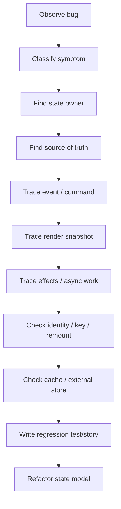
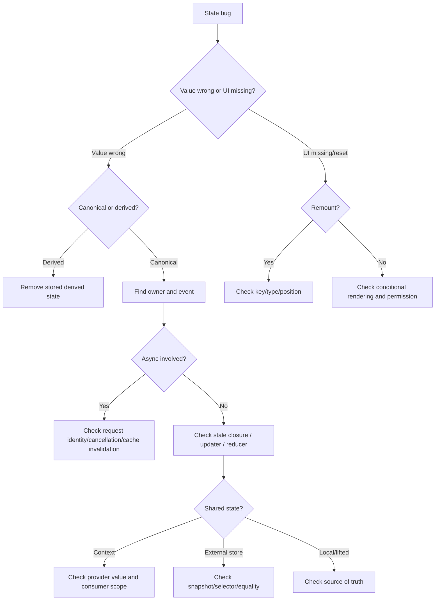

# Part 112 — Debugging React State Bugs

Bug state React jarang benar-benar acak. Biasanya ia muncul karena salah satu kontrak ini dilanggar:

```txt
state ownership tidak jelas
source of truth ganda
state dianggap mutable variable, padahal snapshot per render
effect dipakai untuk derivasi, bukan sinkronisasi
identity component berubah tanpa sadar
async result lama mengalahkan async result baru
cache server state tidak selaras dengan mutation
context terlalu luas atau terlalu tersembunyi
external store melanggar snapshot contract
workflow direpresentasikan sebagai boolean soup
```

Debugging React state bukan mencari baris ajaib. Debugging React state adalah mengembalikan sistem ke model yang benar.

---

## 1. Debugging Protocol

Jangan mulai dari `console.log` acak. Mulai dari pertanyaan struktural.



Minimal protocol:

```txt
1. Apa symptom observable-nya?
2. State mana yang salah?
3. Siapa pemilik state itu?
4. Dari mana state itu dihitung?
5. Event apa yang mengubahnya?
6. Apakah update terjadi di render, event, effect, mutation, atau external subscription?
7. Apakah component remount?
8. Apakah async result stale?
9. Apakah cache/server state sudah invalidated?
10. Bagaimana bug ini dicegah lewat invariant/test/story?
```

---

## 2. Bug Classifier

Gunakan classifier ini sebelum mencari solusi.

| Symptom | Kemungkinan akar masalah |
|---|---|
| UI menampilkan nilai lama | stale closure, stale cache, derived state tersimpan |
| Input berubah lalu balik | controlled/uncontrolled mismatch, parent refuses update, key remount |
| State hilang saat list berubah | unstable key, component position berubah |
| Infinite rerender | setState during render, effect dependency loop |
| Modal menutup sendiri | parent rerender remount, key change, shared open state collision |
| Action terkirim dua kali | duplicate submit, Strict Mode exposing side effect, missing in-flight guard |
| Error setelah pindah halaman | async result updates unmounted/obsolete workflow |
| List tidak update setelah mutation | query key mismatch, invalidation gap, direct cache write wrong |
| Banyak komponen rerender | context value identity, broad provider, external store root subscription |
| State antar tab tidak sinkron | persistence/external store lacks subscription or storage event handling |
| Permission UI salah | stale permission snapshot, frontend-only guard, missing revalidation |

Debugging yang baik mengurangi search space.

---

## 3. Stale Closure

Stale closure terjadi ketika function membaca nilai dari render lama.

```tsx
function Counter() {
  const [count, setCount] = React.useState(0);

  React.useEffect(() => {
    const id = setInterval(() => {
      setCount(count + 1); // stale: count berasal dari render pertama
    }, 1000);

    return () => clearInterval(id);
  }, []);

  return <div>{count}</div>;
}
```

Fix dengan updater function:

```tsx
function Counter() {
  const [count, setCount] = React.useState(0);

  React.useEffect(() => {
    const id = setInterval(() => {
      setCount((current) => current + 1);
    }, 1000);

    return () => clearInterval(id);
  }, []);

  return <div>{count}</div>;
}
```

Debugging question:

```txt
Function ini dibuat pada render ke berapa?
Nilai apa yang ia capture?
Apakah ia dipanggil jauh setelah render itu selesai?
Apakah update berikutnya bergantung pada state terkini?
```

Common stale closure locations:

```txt
setInterval / setTimeout
DOM event listener manual
WebSocket callback
Promise callback
mutation callback
memoized callback with wrong dependency
external store subscription
third-party imperative API
```

Fix options:

| Situation | Fix |
|---|---|
| next state depends on previous state | functional updater |
| callback must read latest value but not trigger rerender | ref latest pattern |
| effect callback depends on reactive value | include dependency |
| effect resubscription too expensive | split event logic from subscription or use stable event adapter |

Latest ref pattern:

```tsx
function useLatest<T>(value: T) {
  const ref = React.useRef(value);

  React.useEffect(() => {
    ref.current = value;
  }, [value]);

  return ref;
}
```

Use carefully. `ref` bypasses React reactivity; it is an escape hatch.

---

## 4. Duplicated Source of Truth

Bug ini muncul ketika state yang sama disimpan di dua tempat.

```tsx
function UserEditor({ user }: { user: User }) {
  const [name, setName] = React.useState(user.name);

  React.useEffect(() => {
    setName(user.name);
  }, [user.name]);

  return <input value={name} onChange={(e) => setName(e.target.value)} />;
}
```

Kode ini belum tentu salah, tapi kontraknya kabur:

```txt
Apakah name adalah draft lokal?
Apakah name harus selalu sinkron dengan prop?
Jika user berubah saat user sedang mengetik, apa yang benar?
```

Perbaiki dengan memilih model.

### Fully controlled

```tsx
function UserNameInput({
  value,
  onChange,
}: {
  value: string;
  onChange: (value: string) => void;
}) {
  return <input value={value} onChange={(event) => onChange(event.target.value)} />;
}
```

### Uncontrolled draft reset by key

```tsx
function UserEditor({ user }: { user: User }) {
  return <UserEditorDraft key={user.id} initialName={user.name} />;
}

function UserEditorDraft({ initialName }: { initialName: string }) {
  const [name, setName] = React.useState(initialName);
  return <input value={name} onChange={(e) => setName(e.target.value)} />;
}
```

### Explicit draft lifecycle

```ts
type EditorState =
  | { tag: 'clean'; user: User }
  | { tag: 'dirty'; user: User; draft: Draft }
  | { tag: 'saving'; user: User; draft: Draft; requestId: string }
  | { tag: 'failed'; user: User; draft: Draft; error: string };
```

Debugging question:

```txt
Apakah ini canonical state atau draft?
Kalau upstream berubah, apakah local state harus reset, merge, atau keep?
Kalau user edit lokal, apakah upstream boleh overwrite?
```

---

## 5. Accidental Remount and State Loss

React menyimpan state berdasarkan posisi component di tree, tipe component, dan key. Kalau salah satu berubah, state bisa reset.

Bug umum:

```tsx
function Page({ mode }: { mode: 'view' | 'edit' }) {
  const Form = mode === 'view' ? ReadOnlyForm : EditableForm;
  return <Form />;
}
```

Switch tipe component berarti state reset.

Bug lain:

```tsx
items.map((item, index) => (
  <Row key={index} item={item} />
));
```

Saat list reorder, state row bisa “pindah” ke item lain.

Fix:

```tsx
items.map((item) => (
  <Row key={item.id} item={item} />
));
```

Debugging technique:

```tsx
function useMountLogger(name: string) {
  React.useEffect(() => {
    console.log(`${name} mounted`);
    return () => console.log(`${name} unmounted`);
  }, [name]);
}
```

Jika state hilang, cari:

```txt
key berubah?
component type berubah?
conditional branch mengganti posisi?
parent memberi key baru?
list pakai index key?
inline component didefinisikan di dalam render?
```

Anti-pattern:

```tsx
function Parent() {
  function Child() {
    const [value, setValue] = React.useState('');
    return <input value={value} onChange={(e) => setValue(e.target.value)} />;
  }

  return <Child />;
}
```

`Child` dibuat ulang sebagai component type baru setiap render. Definisikan component di luar.

---

## 6. Effect Loop

Infinite loop sering muncul karena effect mengubah state yang menjadi dependency effect.

```tsx
function Search({ filters }: { filters: Filters }) {
  const [query, setQuery] = React.useState({ filters });

  React.useEffect(() => {
    setQuery({ filters });
  }, [filters, query]); // loop risk
}
```

Pertanyaan pertama:

```txt
Apakah effect ini sebenarnya diperlukan?
```

Jika state hanya derived dari props, hapus state.

```tsx
function Search({ filters }: { filters: Filters }) {
  const query = React.useMemo(() => buildQuery(filters), [filters]);
  return <Results query={query} />;
}
```

Jika effect sinkronisasi external system, dependency harus lengkap dan stabil.

```tsx
React.useEffect(() => {
  const connection = createConnection(serverUrl, roomId);
  connection.connect();
  return () => connection.disconnect();
}, [serverUrl, roomId]);
```

Debugging effect loop:

```txt
1. Apa yang effect sinkronkan?
2. Apakah effect menulis state React?
3. Apakah state itu dependency effect?
4. Apakah dependency object/function dibuat baru setiap render?
5. Bisakah calculation dipindah ke render?
6. Bisakah event-specific logic dipindah ke event handler?
```

---

## 7. Race Condition in Effects

Fetch di effect raw sering menyebabkan response lama menimpa response baru.

```tsx
function UserProfile({ userId }: { userId: string }) {
  const [user, setUser] = React.useState<User | null>(null);

  React.useEffect(() => {
    fetchUser(userId).then(setUser);
  }, [userId]);

  return <Profile user={user} />;
}
```

Jika `userId` berubah dari A ke B, response A bisa datang setelah response B.

Guard dengan ignore flag:

```tsx
React.useEffect(() => {
  let ignore = false;

  setUser(null);

  fetchUser(userId).then((result) => {
    if (!ignore) {
      setUser(result);
    }
  });

  return () => {
    ignore = true;
  };
}, [userId]);
```

Atau gunakan `AbortController` bila API mendukung:

```tsx
React.useEffect(() => {
  const controller = new AbortController();

  fetch(`/api/users/${userId}`, { signal: controller.signal })
    .then((r) => r.json())
    .then(setUser)
    .catch((error) => {
      if (error.name !== 'AbortError') {
        setError(error);
      }
    });

  return () => controller.abort();
}, [userId]);
```

Lebih baik untuk server-state: gunakan cache/query library yang punya query identity, cancellation, stale control, retry, dedupe, dan invalidation.

Debugging question:

```txt
Apakah hasil async punya identity?
Apakah result lama boleh diterima?
Apakah user sudah pindah entity/page?
Apakah command ini idempotent?
Apakah in-flight state disimpan eksplisit?
```

---

## 8. Controlled / Uncontrolled Mismatch

Bug:

```tsx
<input value={maybeUndefined} onChange={...} />
```

Jika `value` berubah antara `undefined` dan string, input bisa berpindah mode.

Fix:

```tsx
<input value={value ?? ''} onChange={...} />
```

Untuk custom component:

```tsx
function useControllableState<T>({
  value,
  defaultValue,
  onChange,
}: {
  value?: T;
  defaultValue: T;
  onChange?: (value: T) => void;
}) {
  const isControlled = value !== undefined;
  const [internal, setInternal] = React.useState(defaultValue);
  const current = isControlled ? value : internal;

  const set = React.useCallback(
    (next: T) => {
      if (!isControlled) setInternal(next);
      onChange?.(next);
    },
    [isControlled, onChange]
  );

  return [current, set] as const;
}
```

Debugging question:

```txt
Apakah value selalu didefinisikan dalam controlled mode?
Apakah defaultValue hanya dipakai saat mount?
Apakah parent benar-benar mengubah value setelah onChange?
Apakah child diam-diam menyimpan mirror dari prop?
```

---

## 9. Context Coupling and Rerender Bugs

Symptom:

```txt
Mengubah satu field kecil membuat seluruh halaman rerender.
```

Kemungkinan:

```tsx
<AuthContext.Provider value={{ user, permissions, updateProfile, logout }}>
  {children}
</AuthContext.Provider>
```

Object `value` baru setiap render. Semua consumer context berpotensi ikut update.

Fix dasar:

```tsx
const value = React.useMemo(
  () => ({ user, permissions, updateProfile, logout }),
  [user, permissions, updateProfile, logout]
);
```

Fix arsitektural:

```txt
split read context and command context
split high-volatility and low-volatility context
move high-frequency state to external store selector
move server state to query cache
move local-only state down
```

Debugging context:

```txt
Provider mana yang berubah?
Value identity berubah karena apa?
Consumer mana yang membaca context terlalu luas?
Apakah context membawa capability atau volatile state?
Apakah provider terlalu tinggi?
```

Tambahkan render counter lokal saat diagnosis:

```tsx
function useRenderCount(label: string) {
  const count = React.useRef(0);
  count.current += 1;
  console.log(`${label} render`, count.current);
}
```

Jangan tinggalkan logger ini di production path tanpa kebutuhan observability.

---

## 10. Server-State Cache Mismatch

Symptom:

```txt
Mutation berhasil, tapi list tidak berubah.
Detail berubah, tapi badge count lama.
Optimistic row muncul dua kali.
Pagination kacau setelah delete.
```

Checklist:

```txt
Apakah query key list/detail konsisten?
Apakah mutation invalidates key yang benar?
Apakah direct cache write preserve shape?
Apakah optimistic temp ID diganti canonical ID?
Apakah aggregate query ikut invalidated?
Apakah staleTime membuat refetch tidak terjadi sesuai harapan?
Apakah tenant/filter/sort/search params masuk query key?
```

Bad key:

```ts
['cases']
```

Better:

```ts
['tenant', tenantId, 'cases', { status, assigneeId, sort, page }]
```

Mutation impact map:

```ts
const caseMutationImpact = {
  approveCase: (caseId: string) => [
    ['case', caseId],
    ['cases'],
    ['case-counts'],
    ['dashboard'],
  ],
};
```

Debugging query cache:

```txt
1. Inspect query keys.
2. Inspect query data before mutation.
3. Inspect optimistic write.
4. Inspect rollback path.
5. Inspect invalidation path.
6. Inspect refetch result.
7. Inspect UI selector/view model.
```

---

## 11. External Store Snapshot Bug

`useSyncExternalStore` punya kontrak penting: `getSnapshot` harus mengembalikan nilai yang stabil jika store belum berubah.

Bug:

```ts
function getSnapshot() {
  return { ...store.state }; // object baru setiap call
}
```

Ini bisa menyebabkan rerender terus-menerus.

Fix:

```ts
let currentSnapshot = store.state;

function setState(next: State) {
  currentSnapshot = next;
  listeners.forEach((listener) => listener());
}

function getSnapshot() {
  return currentSnapshot;
}
```

Checklist external store:

```txt
subscribe mengembalikan cleanup?
getSnapshot stable?
state immutable atau snapshot cached?
server snapshot sama dengan initial client snapshot?
selector mengalokasikan object baru?
equality function benar?
listener leak terjadi?
```

---

## 12. Workflow Drift

Workflow drift muncul ketika beberapa boolean mencoba merepresentasikan state machine.

Bad:

```ts
const [isOpen, setOpen] = useState(false);
const [isSubmitting, setSubmitting] = useState(false);
const [isSuccess, setSuccess] = useState(false);
const [error, setError] = useState<string | null>(null);
```

State ilegal:

```txt
isSubmitting=true + isSuccess=true
isOpen=false + error visible
isSuccess=true + error != null
```

Better:

```ts
type ApprovalState =
  | { tag: 'closed' }
  | { tag: 'editing'; reason: string }
  | { tag: 'confirming'; reason: string }
  | { tag: 'submitting'; reason: string; requestId: string }
  | { tag: 'failed'; reason: string; error: string }
  | { tag: 'submitted'; confirmationId: string };
```

Debugging workflow:

```txt
Apa semua state valid bisa disebutkan?
Apa event yang boleh terjadi dari setiap state?
Apa transition ilegal yang sekarang mungkin terjadi?
Apa side effect yang harus pindah ke command/effect boundary?
Apa request identity yang dibutuhkan?
```

---

## 13. Strict Mode Signal

React Strict Mode di development dapat mengekspos impurity dan missing cleanup dengan menjalankan beberapa logic development-only secara ekstra. Jangan langsung “mematikan Strict Mode” ketika melihat double behavior. Tanya dulu:

```txt
Apakah effect cleanup benar?
Apakah subscription unsubscribe?
Apakah command dikirim dari render/effect yang tidak seharusnya?
Apakah network request seharusnya deduped/cached?
Apakah third-party init idempotent?
```

Side effect tidak boleh terjadi di render.

Bad:

```tsx
function Component() {
  analytics.track('viewed'); // side effect during render
  return <div />;
}
```

Better:

```tsx
function Component() {
  React.useEffect(() => {
    analytics.track('viewed');
  }, []);

  return <div />;
}
```

Tapi jangan asal pindahkan semua ke effect. Kalau event-specific, taruh di event handler.

```tsx
function SaveButton() {
  function handleClick() {
    analytics.track('save_clicked');
    save();
  }

  return <button onClick={handleClick}>Save</button>;
}
```

---

## 14. Instrumentation Tools

Gunakan alat sesuai pertanyaan.

| Pertanyaan | Tool |
|---|---|
| Component menerima props/state apa? | React DevTools Components tab |
| Apa yang rerender mahal? | React DevTools Profiler / `<Profiler>` |
| Apakah component remount? | mount logger / DevTools tree |
| Apakah query key salah? | TanStack Query Devtools |
| Apakah Redux action benar? | Redux DevTools |
| Apakah Zustand selector terlalu luas? | render count + selector inspection |
| Apakah network race? | browser Network tab + request IDs |
| Apakah story mereproduksi bug? | Storybook regression story |
| Apakah user journey gagal? | RTL/Storybook interaction test |

Jangan gunakan satu tool untuk semua masalah.

---

## 15. Debugging by Invariant

Untuk setiap bug, tulis invariant yang dilanggar.

Contoh:

```txt
Invariant: A closed case cannot show an enabled approve command.
Bug: Confirm button remains enabled after case status changes to closed.
```

Kode:

```ts
function canApprove(caseVm: CaseViewModel, actor: Actor): Decision {
  if (caseVm.status === 'closed') {
    return { allowed: false, reason: 'Case is already closed.' };
  }

  if (!actor.permissions.includes('case.approve')) {
    return { allowed: false, reason: 'Missing approval permission.' };
  }

  return { allowed: true };
}
```

Test:

```ts
it('forbids approving a closed case', () => {
  expect(canApprove(buildCase({ status: 'closed' }), supervisor)).toEqual({
    allowed: false,
    reason: 'Case is already closed.',
  });
});
```

UI test:

```tsx
render(<ApprovalPanel case={buildCase({ status: 'closed' })} actor={supervisor} />);
expect(screen.getByRole('button', { name: /approve/i })).toBeDisabled();
expect(screen.getByText(/already closed/i)).toBeVisible();
```

Story:

```tsx
export const ClosedCaseCannotApprove: Story = {
  args: {
    case: buildCase({ status: 'closed' }),
    actor: supervisor,
  },
};
```

Bug fixed tanpa invariant biasanya akan kembali.

---

## 16. Logging State Transitions

Untuk reducer/workflow debugging, log transition, bukan random value.

```ts
function withTransitionLogging<S, E extends { type: string }>(
  reducer: (state: S, event: E) => S,
  label: string
) {
  return (state: S, event: E) => {
    const next = reducer(state, event);

    console.groupCollapsed(`[${label}] ${event.type}`);
    console.log('prev', state);
    console.log('event', event);
    console.log('next', next);
    console.groupEnd();

    return next;
  };
}
```

Gunakan ini di development/testing, bukan production tanpa redaction dan sampling.

Untuk production observability, log event penting:

```txt
workflow_started
command_submitted
command_succeeded
command_failed
optimistic_applied
optimistic_rolled_back
permission_denied
stale_result_ignored
```

Jangan log PII atau data sensitif.

---

## 17. Debugging Decision Tree



---

## 18. Common Fix Patterns

| Bug | Prefer fix |
|---|---|
| stale increment | functional updater |
| stale subscription callback | latest ref or resubscribe with deps |
| prop mirror bug | controlled, uncontrolled with key, or explicit draft state |
| state lost in list | stable key by entity ID |
| effect loop | remove effect or stabilize dependency |
| data fetch race | query cache or request identity guard |
| duplicate submit | explicit in-flight state and idempotency |
| context fan-out | split context or selector store |
| external store rerender loop | cached immutable snapshot |
| optimistic drift | rollback/reconciliation policy |
| workflow impossible state | discriminated union / state machine |

---

## 19. Regression Artifact Rule

Setiap bug state yang lolos ke QA/production harus menghasilkan minimal satu artifact:

```txt
unit test for pure transition/invariant
component test for observable behavior
Storybook regression story for visual state
query/store test for cache behavior
workflow test for state machine transition
```

Pilih artifact yang paling dekat dengan akar masalah.

Jika bug adalah reducer transition, jangan hanya buat screenshot story.
Jika bug adalah UI regression edge state, jangan hanya buat reducer unit test.
Jika bug adalah cache invalidation, test mutation/query boundary.

---

## 20. Debugging Example: Approval Button Stays Enabled

Symptom:

```txt
User membuka modal approve.
Di tab lain, case ditutup.
Current tab masih bisa submit approval.
```

Classifier:

```txt
server-state drift + permission/precondition drift + workflow stale snapshot
```

Questions:

```txt
Apakah modal menyimpan case status lama?
Apakah query invalidated saat case berubah?
Apakah submit API melakukan final precondition check?
Apakah UI command membaca latest case status?
Apakah failed precondition ditampilkan sebagai recoverable error?
```

Fix layers:

```txt
1. Backend rejects approve if case closed.
2. Mutation handles 409/412 as precondition failed.
3. Query invalidates case detail/list/counts.
4. UI disables confirm if latest case status closed.
5. Workflow transitions from confirming → failed_precondition.
6. Regression story: closed while confirming.
7. Component test: confirm disabled for closed case.
```

State machine:

```ts
type ApprovalState =
  | { tag: 'closed' }
  | { tag: 'confirming'; caseVersion: number; reason: string }
  | { tag: 'submitting'; caseVersion: number; reason: string; requestId: string }
  | { tag: 'failedPrecondition'; reason: string; message: string }
  | { tag: 'submitted'; approvalId: string };
```

The point: solve the invariant, not the button.

---

## 21. What Good Debugging Looks Like

A senior debugging note should read like this:

```txt
Symptom:
  Confirm button remains enabled for closed cases.

Broken invariant:
  Closed case cannot expose approve command.

Root cause:
  Modal workflow copied case status into local state at open time and never revalidated against latest query data.

Fix:
  ApprovalPanel now derives command decision from latest case view model.
  Submit mutation handles precondition failure and invalidates case detail/list/counts.
  Workflow adds failedPrecondition state.

Regression:
  Added ClosedCaseCannotApprove story.
  Added reducer transition test for CASE_CLOSED while confirming.
  Added component test for disabled confirm button.
```

Bad debugging note:

```txt
Fixed disabled issue.
```

That note teaches nothing and prevents nothing.

---

## 22. Practice

Take one historical React bug from your codebase. Write:

```txt
1. Symptom
2. Broken invariant
3. State owner
4. Source of truth
5. Event/command path
6. Render snapshot involved
7. Effect/async/cache involved
8. Identity/key involved
9. Actual root cause
10. Regression artifact
11. Refactor needed to make bug impossible
```

Then create one of:

```txt
Storybook regression story
Reducer transition test
Component interaction test
Query/mutation cache test
Workflow state-machine test
```

A bug is not done when the symptom disappears. It is done when the state model makes the same bug hard to reintroduce.

---

## 23. References

- React Docs — State as a Snapshot: `https://react.dev/learn/state-as-a-snapshot`
- React Docs — Queueing a Series of State Updates: `https://react.dev/learn/queueing-a-series-of-state-updates`
- React Docs — Preserving and Resetting State: `https://react.dev/learn/preserving-and-resetting-state`
- React Docs — Synchronizing with Effects: `https://react.dev/learn/synchronizing-with-effects`
- React Docs — You Might Not Need an Effect: `https://react.dev/learn/you-might-not-need-an-effect`
- React Docs — React Developer Tools: `https://react.dev/learn/react-developer-tools`
- React Docs — `<Profiler>`: `https://react.dev/reference/react/Profiler`
- TanStack Query Docs — Query Invalidation: `https://tanstack.com/query/latest/docs/framework/react/guides/query-invalidation`
