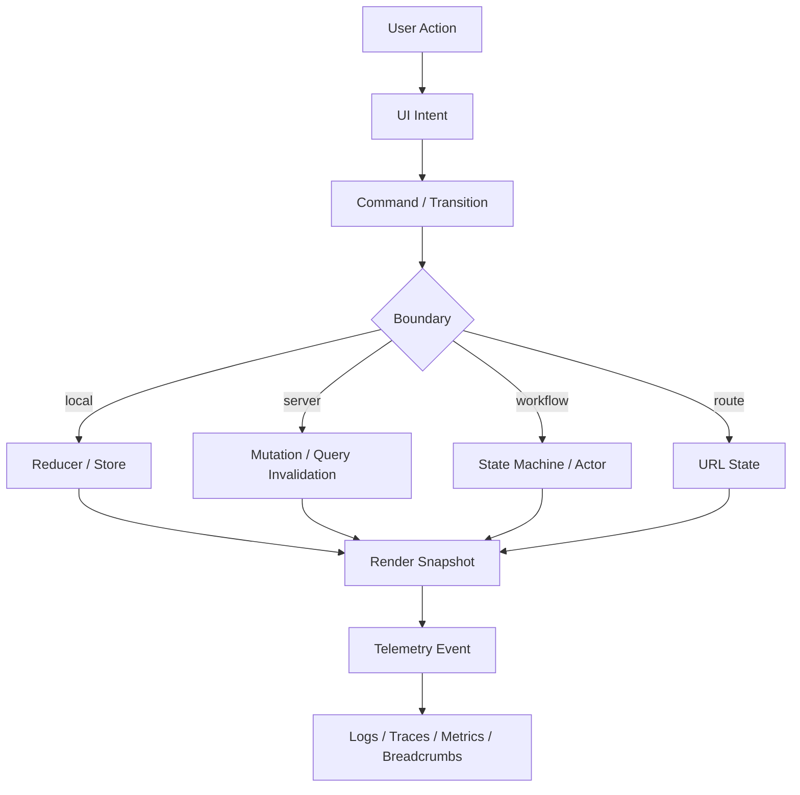
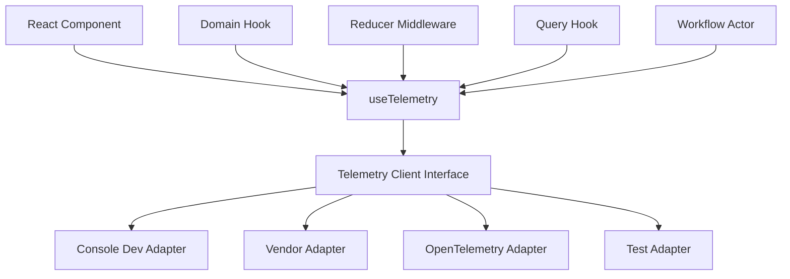
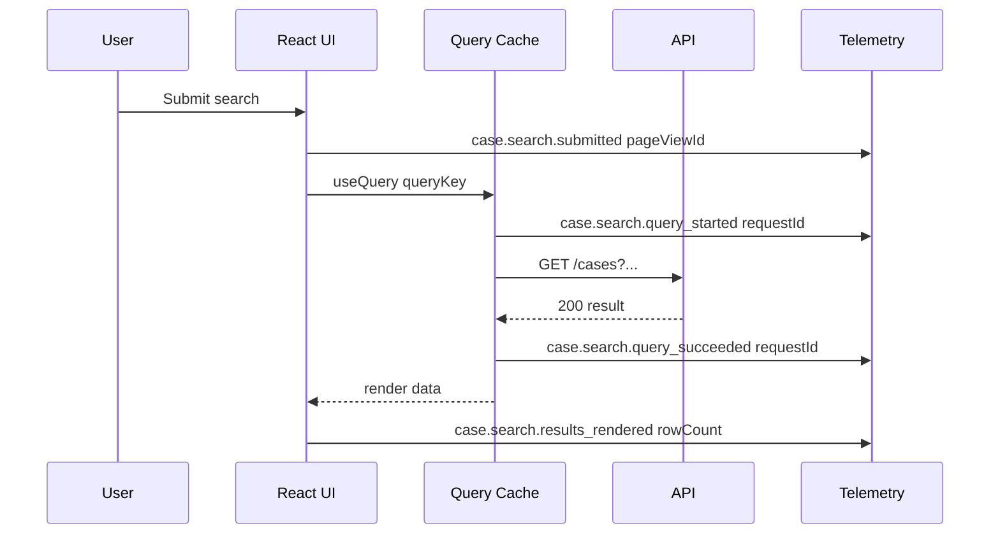
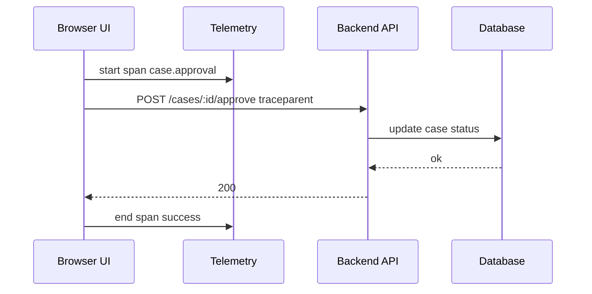
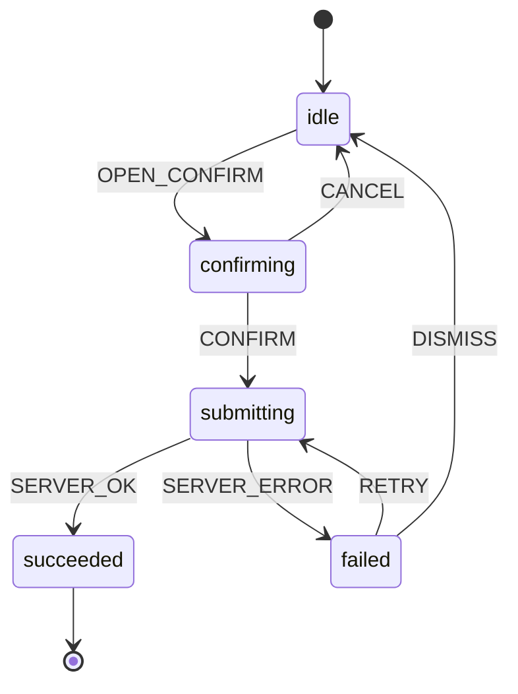

# Part 113 — Observability for Frontend State

Frontend state bug yang paling mahal biasanya bukan bug yang langsung crash.
Yang mahal adalah bug yang hanya terjadi pada kombinasi tertentu:

```txt
user role tertentu
filter tertentu
network lambat
mutation gagal lalu retry
tab lama masih terbuka
permission berubah di tengah session
query cache stale
component remount tanpa sadar
modal ditutup saat request masih pending
```

Tanpa observability, investigasinya berubah menjadi tebak-tebakan.
Dengan observability yang benar, kita bisa menjawab:

```txt
Apa yang user lakukan?
State transition apa yang terjadi?
Command apa yang dikirim?
Query cache mana yang dibaca?
Mutation mana yang gagal?
Route dan search params apa yang aktif?
Workflow sedang di state apa?
Render mana yang mahal?
Apakah state yang diamati aman dari PII?
```

Observability frontend bukan berarti dump seluruh Redux/Zustand/React state ke log.
Observability frontend adalah mencatat **event penting, transition penting, correlation ID, error context, dan performance signal** dengan batas privacy yang tegas.

---

## 1. Mental Model

State frontend adalah sistem event-driven.
Observability-nya harus mengikuti event-driven model juga.



Yang perlu diamati bukan semua render.
Yang perlu diamati adalah **perubahan makna**.

```txt
click button        -> belum tentu penting
submit approval    -> penting
query refetched    -> mungkin penting
query invalidated  -> penting bila memengaruhi user-visible data
modal opened       -> penting bila modal bagian dari workflow
state rerender     -> penting bila mahal atau abnormal
permission denied  -> penting untuk audit UX dan debugging
```

---

## 2. Observability vs Debugging

Debugging adalah aktivitas mencari penyebab bug.
Observability adalah desain sistem agar debugging bisa dilakukan setelah bug terjadi.

| Aspek | Debugging lokal | Observability produksi |
|---|---|---|
| Waktu | Saat developer menjalankan app | Saat user nyata mengalami flow |
| Data | Console, breakpoint, DevTools | Logs, traces, metrics, breadcrumbs |
| Scope | Session developer | Semua session yang diizinkan policy |
| Risiko | Rendah | Tinggi karena privacy/security |
| Tujuan | Memahami satu bug | Membuat sistem bisa diinvestigasi |

Prinsip production-grade:

```txt
Do not log everything.
Log the state machine, not the entire heap.
Log transition metadata, not sensitive payload.
Log identifiers and correlation, not full user data.
Log enough to reconstruct the path, not to clone the user's screen.
```

---

## 3. Telemetry Taxonomy

Observability frontend sebaiknya punya vocabulary.
Tanpa vocabulary, semua menjadi `console.log('clicked')`.

| Telemetry type | Contoh | Tujuan |
|---|---|---|
| User action | `search.submitted` | Mengetahui intent user |
| Component event | `modal.closed` | Mengetahui event UI reusable |
| Application command | `case.approve.requested` | Mengetahui command business |
| Workflow transition | `draft -> submitting` | Mengetahui state machine path |
| Query event | `caseSearch.refetched` | Mengetahui server-state lifecycle |
| Mutation event | `approval.failed` | Mengetahui command result |
| Route event | `/cases?status=open` | Mengetahui navigation context |
| Error event | `validation.server_error` | Mengetahui failure class |
| Performance event | `searchResults.render_slow` | Mengetahui user-visible slowness |
| Audit-adjacent event | `permission.denied.ui` | Mengetahui blocked user intent |

Bedakan telemetry event dari domain event.

```txt
Domain event:
  CaseApproved
  InvoiceRejected
  UserAssigned

Frontend telemetry event:
  approval_button.clicked
  approval_modal.confirmed
  approval_mutation.failed
  approval_ui.permission_denied
```

Domain event adalah fakta business.
Telemetry event adalah fakta observability.
Jangan campur keduanya tanpa sengaja.

---

## 4. Event Envelope

Semua event observability sebaiknya memakai envelope seragam.

```ts
export type TelemetryLevel = 'debug' | 'info' | 'warn' | 'error'

export type TelemetryEvent = {
  name: string
  level: TelemetryLevel
  timestamp: string
  correlationId: string
  route?: string
  screen?: string
  workflowId?: string
  actorId?: string
  queryKeyHash?: string
  mutationId?: string
  userRole?: string
  tenantId?: string
  attributes?: Record<string, string | number | boolean | null>
}
```

Field penting:

| Field | Kenapa penting |
|---|---|
| `name` | Nama event stabil untuk query dashboard |
| `correlationId` | Menghubungkan action, query, mutation, error |
| `route` | Mengetahui page context |
| `workflowId` | Menghubungkan modal/form/wizard dalam satu flow |
| `actorId` | Menghubungkan actor state machine |
| `queryKeyHash` | Menghubungkan cache/query lifecycle |
| `mutationId` | Menghubungkan optimistic update, result, rollback |
| `attributes` | Metadata aman yang menjelaskan event |

Jangan masukkan raw form values, access token, email lengkap, alamat, nomor identitas, atau payload besar ke telemetry default.

---

## 5. Naming Convention

Nama event harus stabil, queryable, dan tidak terlalu UI-specific.

```txt
<domain_or_area>.<object_or_flow>.<event>
```

Contoh baik:

```txt
case.search.submitted
case.search.query_failed
case.search.results_rendered
case.approval.confirm_opened
case.approval.command_started
case.approval.command_failed
case.approval.optimistic_rollback
permission.case_approve.denied
modal.close_requested
workflow.transitioned
```

Contoh buruk:

```txt
button_clicked
clicked
state changed
error happened
search page thing
submit2
```

Event name adalah API.
Kalau event name berubah sembarangan, dashboard dan alert ikut rusak.

---

## 6. What to Observe

### 6.1 User intent

Observasi intent, bukan sekadar DOM event.

```tsx
function ApproveButton({ caseId, onApprove }: Props) {
  const telemetry = useTelemetry()

  return (
    <button
      onClick={() => {
        telemetry.info('case.approval.intent', {
          caseId,
          source: 'toolbar',
        })
        onApprove(caseId)
      }}
    >
      Approve
    </button>
  )
}
```

Tetapi hati-hati: component reusable seperti `Button` tidak perlu otomatis log semua click.
Yang tahu makna click adalah boundary yang tahu domain intent.

```txt
Button tidak tahu click artinya approve.
ApprovalToolbar tahu click artinya approval intent.
```

---

### 6.2 State transition

Reducer/workflow transition adalah titik observability terbaik.

```ts
type TransitionLog<S, E> = {
  from: S
  event: E
  to: S
  allowed: boolean
}
```

Contoh:

```ts
function instrumentedReducer<S, E>(
  reducer: (state: S, event: E) => S,
  log: (entry: TransitionLog<S, E>) => void,
) {
  return (state: S, event: E) => {
    const next = reducer(state, event)

    log({
      from: state,
      event,
      to: next,
      allowed: next !== state,
    })

    return next
  }
}
```

Namun jangan log raw state besar.
Log state tag, event type, dan metadata aman.

```ts
log({
  from: state.status,
  event: event.type,
  to: next.status,
  allowed: next !== state,
})
```

---

### 6.3 Query lifecycle

Server state observability harus menjawab:

```txt
Query key apa yang aktif?
Apakah data fresh atau stale?
Mutation apa yang menginvalidasi query ini?
Apakah user melihat data lama saat refetch?
Apakah error berasal dari network, auth, validation, atau server?
```

Pada TanStack Query, observability sering diletakkan di domain hooks atau QueryClient boundary.

```ts
export function useCaseSearch(params: CaseSearchParams) {
  const telemetry = useTelemetry()

  return useQuery({
    queryKey: caseSearchKeys.list(params),
    queryFn: async ({ signal }) => {
      const started = performance.now()

      try {
        const result = await api.searchCases(params, { signal })

        telemetry.info('case.search.query_succeeded', {
          durationMs: Math.round(performance.now() - started),
          status: params.status ?? 'all',
          page: params.page,
        })

        return result
      } catch (error) {
        telemetry.error('case.search.query_failed', {
          durationMs: Math.round(performance.now() - started),
          errorClass: classifyError(error),
        })
        throw error
      }
    },
  })
}
```

Catatan penting:

```txt
Log query metadata.
Jangan log hasil query penuh.
```

---

### 6.4 Mutation lifecycle

Mutation adalah command.
Command harus observable.

```tsx
const approveCase = useMutation({
  mutationFn: api.approveCase,
  onMutate: async (input) => {
    const mutationId = crypto.randomUUID()

    telemetry.info('case.approval.command_started', {
      mutationId,
      caseId: input.caseId,
      optimistic: true,
    })

    return { mutationId }
  },
  onError: (error, input, context) => {
    telemetry.warn('case.approval.command_failed', {
      mutationId: context?.mutationId ?? 'unknown',
      caseId: input.caseId,
      errorClass: classifyError(error),
    })
  },
  onSuccess: (_data, input, context) => {
    telemetry.info('case.approval.command_succeeded', {
      mutationId: context?.mutationId ?? 'unknown',
      caseId: input.caseId,
    })
  },
})
```

Mutation telemetry harus mencakup:

```txt
command started
optimistic applied
server success
server failure
rollback/compensation
invalidation performed
navigation/result shown
```

---

### 6.5 Workflow transition

Workflow observability paling berguna bila memakai state tag.

```ts
telemetry.info('workflow.transitioned', {
  workflow: 'caseApproval',
  workflowId,
  from: 'confirming',
  event: 'CONFIRM',
  to: 'submitting',
})
```

Untuk flow panjang, correlation wajib.

```txt
approval flow id: approval-abc
  modal opened
  validation passed
  command started
  optimistic update applied
  server failed
  rollback applied
  error banner shown
```

Tanpa workflowId, event-event ini sulit digabungkan.

---

### 6.6 Render performance

React `<Profiler>` memberi metrik untuk subtree render.

```tsx
import { Profiler } from 'react'

function onRender(
  id: string,
  phase: 'mount' | 'update' | 'nested-update',
  actualDuration: number,
  baseDuration: number,
) {
  if (actualDuration > 16) {
    telemetry.warn('react.render.slow', {
      id,
      phase,
      actualDuration: Math.round(actualDuration),
      baseDuration: Math.round(baseDuration),
    })
  }
}

export function SearchPageProfiled() {
  return (
    <Profiler id="CaseSearchPage" onRender={onRender}>
      <CaseSearchPage />
    </Profiler>
  )
}
```

Interpretasi:

| Metric | Makna |
|---|---|
| `actualDuration` | Biaya render aktual update saat ini |
| `baseDuration` | Estimasi render seluruh subtree tanpa optimasi |
| `phase` | Mount, update, atau nested-update |

Jangan memasang Profiler ke seluruh app tanpa policy.
Pakai pada area mahal: search page, virtualized list, workflow page, dashboard, form builder.

---

## 7. What Not to Observe

Jangan observasi hal ini secara default:

```txt
raw form values
full server response
full external store snapshot
access token / refresh token
authorization header
PII / sensitive identifiers
password / secret / OTP
large arrays of rows
keystroke-by-keystroke without sampling
render event for every small component
```

Anti-pattern:

```ts
telemetry.info('form.changed', formState)
telemetry.info('query.result', data)
telemetry.info('redux.state', store.getState())
```

Lebih aman:

```ts
telemetry.info('form.changed', {
  dirtyFieldCount,
  hasValidationErrors,
})

telemetry.info('query.result_received', {
  rowCount: data.items.length,
  total: data.total,
})

telemetry.info('store.transitioned', {
  slice: 'caseSelection',
  from: previous.status,
  to: next.status,
})
```

---

## 8. Instrumentation Architecture

Jangan sebar vendor SDK ke semua component.
Buat capability boundary.



Interface minimal:

```ts
export type TelemetryClient = {
  debug(name: string, attributes?: TelemetryAttributes): void
  info(name: string, attributes?: TelemetryAttributes): void
  warn(name: string, attributes?: TelemetryAttributes): void
  error(name: string, attributes?: TelemetryAttributes): void
  span?<T>(name: string, fn: () => Promise<T>): Promise<T>
}
```

Provider:

```tsx
const TelemetryContext = createContext<TelemetryClient | null>(null)

export function TelemetryProvider({
  client,
  children,
}: {
  client: TelemetryClient
  children: React.ReactNode
}) {
  return (
    <TelemetryContext.Provider value={client}>
      {children}
    </TelemetryContext.Provider>
  )
}

export function useTelemetry() {
  const client = useContext(TelemetryContext)
  if (!client) {
    throw new Error('useTelemetry must be used inside TelemetryProvider')
  }
  return client
}
```

Dengan boundary ini:

```txt
component tidak tahu vendor observability
test bisa mengganti telemetry client
privacy filter bisa dipusatkan
sampling bisa dipusatkan
schema event bisa divalidasi
```

---

## 9. Sanitization Pipeline

Telemetry harus melewati sanitizer.

```ts
const SENSITIVE_KEYS = [
  'password',
  'token',
  'authorization',
  'email',
  'phone',
  'address',
  'nationalId',
]

function sanitizeAttributes(input: TelemetryAttributes = {}) {
  const output: TelemetryAttributes = {}

  for (const [key, value] of Object.entries(input)) {
    if (SENSITIVE_KEYS.some((sensitive) => key.toLowerCase().includes(sensitive))) {
      output[key] = '[redacted]'
    } else if (typeof value === 'string' && value.length > 256) {
      output[key] = value.slice(0, 256) + '…'
    } else {
      output[key] = value
    }
  }

  return output
}
```

Real system harus lebih kuat dari contoh ini:

```txt
schema allowlist per event
PII classification
field-level redaction
sampling policy
retention policy
environment-specific filtering
security review
```

---

## 10. Correlation ID Strategy

Correlation ID adalah tulang punggung investigasi.

| Scope | ID | Contoh |
|---|---|---|
| Page view | `pageViewId` | Search page opened |
| Workflow | `workflowId` | Approval modal flow |
| Command | `commandId` | Approve case request |
| Mutation | `mutationId` | Optimistic update lifecycle |
| Actor | `actorId` | Form step actor |
| Request | `requestId` | HTTP request |
| Trace | `traceId` | Distributed trace |

Diagram:



Tanpa correlation, log hanya menjadi noise.

---

## 11. Reducer Instrumentation

Reducer transition bisa diinstrumentasi di wrapper.

```ts
function useInstrumentedReducer<S, E extends { type: string }>(
  name: string,
  reducer: React.Reducer<S, E>,
  initialState: S,
  selectStateTag: (state: S) => string,
) {
  const telemetry = useTelemetry()

  return useReducer((state: S, event: E) => {
    const next = reducer(state, event)

    if (next !== state) {
      telemetry.info(`${name}.transitioned`, {
        from: selectStateTag(state),
        event: event.type,
        to: selectStateTag(next),
      })
    }

    return next
  }, initialState)
}
```

Aturan:

```txt
Reducer tetap pure.
Instrumentation wrapper berada di boundary React hook.
Log metadata, bukan seluruh state.
```

Namun wrapper di atas masih melakukan side effect di reducer wrapper.
Untuk strict purity, gunakan event dispatch wrapper atau effect-based transition observer.

Lebih aman:

```ts
function useTransitionObserver<S>(
  name: string,
  state: S,
  selectTag: (state: S) => string,
) {
  const telemetry = useTelemetry()
  const previousRef = useRef<string | null>(null)
  const current = selectTag(state)

  useEffect(() => {
    const previous = previousRef.current
    if (previous !== null && previous !== current) {
      telemetry.info(`${name}.state_changed`, {
        from: previous,
        to: current,
      })
    }
    previousRef.current = current
  }, [current, name, telemetry])
}
```

Trade-off:

| Approach | Kelebihan | Risiko |
|---|---|---|
| Log di dispatch wrapper | Mengetahui event yang memicu transition | Harus hati-hati agar tidak mengganggu purity |
| Log di effect observer | Aman setelah commit | Bisa kehilangan event detail jika state berubah beberapa kali sebelum commit |
| Log di state machine interpreter | Natural untuk workflow | Butuh machine boundary |

---

## 12. External Store Instrumentation

External store dapat diberi middleware.

```ts
type Store<State> = {
  getState(): State
  setState(updater: (state: State) => State, meta?: { event?: string }): void
  subscribe(listener: () => void): () => void
}

function withTelemetry<State>(
  store: Store<State>,
  telemetry: TelemetryClient,
  selectTag: (state: State) => string,
): Store<State> {
  return {
    ...store,
    setState(updater, meta) {
      const previous = store.getState()
      store.setState(updater, meta)
      const next = store.getState()

      telemetry.info('external_store.updated', {
        event: meta?.event ?? 'unknown',
        from: selectTag(previous),
        to: selectTag(next),
      })
    },
  }
}
```

Untuk Zustand, instrumentasi biasanya dilakukan melalui middleware atau action naming.
Untuk Redux Toolkit, action type sudah menjadi observability primitive yang baik.
Untuk custom store, metadata event harus dirancang sejak awal.

---

## 13. Query Cache Instrumentation

Query cache observability jangan diambil dari component render saja.
Component render tidak tahu seluruh lifecycle.

Gunakan domain hook untuk event domain, dan QueryClient/QueryCache untuk event sistem.

Pseudo-pattern:

```ts
const queryClient = new QueryClient({
  defaultOptions: {
    queries: {
      retry: 2,
    },
  },
})

queryClient.getQueryCache().subscribe((event) => {
  // vendor/library event shape bisa berubah; bungkus di adapter internal
  telemetry.debug('query_cache.event', {
    type: event.type,
  })
})
```

Untuk production, hindari log semua cache event tanpa sampling.
Query cache bisa sangat ramai.

Lebih berguna:

```txt
query failed
mutation failed
invalidated important query family
slow query
high retry count
unexpected stale data shown
```

---

## 14. Route and URL State Observability

URL adalah bagian dari state.
Search params yang salah bisa menyebabkan bug sulit dilacak.

Untuk search-heavy page, log canonical URL state:

```ts
telemetry.info('case.search.params_changed', {
  status: params.status ?? 'all',
  hasKeyword: params.q.trim().length > 0,
  page: params.page,
  sort: params.sort,
})
```

Jangan log query text penuh jika bisa mengandung PII.
Gunakan metadata:

```txt
hasKeyword: true
keywordLength: 12
keywordTokenCount: 2
```

---

## 15. Permission Observability

Permission-aware UI butuh observability khusus.

Contoh:

```ts
telemetry.info('permission.case_approve.evaluated', {
  allowed: decision.allowed,
  reason: decision.reason,
  role: currentRole,
})
```

Tetapi jangan expose policy internal terlalu detail ke client logs bila log dapat diakses luas.

Better:

```txt
allowed: false
reasonClass: missing_capability | resource_locked | state_not_allowed | unknown
```

Use case:

```txt
User melihat tombol disabled dan bertanya kenapa.
Support perlu tahu reason class.
Engineer perlu tahu apakah UI decision selaras dengan backend denial.
Security perlu memastikan frontend denial bukan satu-satunya enforcement.
```

---

## 16. Error Boundary Telemetry

Error boundary adalah crash observability point.

```tsx
class AppErrorBoundary extends React.Component<
  { children: React.ReactNode; telemetry: TelemetryClient },
  { hasError: boolean }
> {
  state = { hasError: false }

  static getDerivedStateFromError() {
    return { hasError: true }
  }

  componentDidCatch(error: Error, info: React.ErrorInfo) {
    this.props.telemetry.error('react.error_boundary.caught', {
      message: error.message,
      componentStack: info.componentStack.slice(0, 1000),
    })
  }

  render() {
    if (this.state.hasError) return <CrashFallback />
    return this.props.children
  }
}
```

Caveat:

```txt
componentStack bisa mengandung nama component internal
error.message bisa mengandung payload bila error dibangun sembarangan
sanitize tetap diperlukan
```

---

## 17. Breadcrumbs

Breadcrumb adalah event ringan sebelum error.

Contoh breadcrumb timeline:

```txt
route.changed /cases
case.search.params_changed status=open page=1
case.search.query_succeeded rowCount=25
case.approval.intent caseId=case-123
case.approval.command_started mutationId=m-1
case.approval.command_failed errorClass=conflict
toast.shown type=error
```

Saat error terjadi, breadcrumb membantu menjawab “apa yang terjadi sebelum crash?”

Breadcrumb sebaiknya:

```txt
ringkas
aman dari PII
punya timestamp
punya correlation ID
punya route/screen context
```

---

## 18. Metrics

Tidak semua observability harus berupa log/event.
Beberapa hal lebih cocok menjadi metrics.

| Metric | Contoh |
|---|---|
| Query latency | `case.search.query.duration_ms` |
| Mutation failure rate | `case.approval.failure_rate` |
| Render cost | `case.search.render.actual_duration_ms` |
| UI error count | `react.error_boundary.count` |
| Permission denial count | `permission.denied.count` |
| Retry count | `query.retry.count` |
| Workflow stuck count | `workflow.stuck.count` |
| Form validation failure | `form.validation.failure.count` |

Metrics harus bisa di-aggregate.
Jangan masukkan high-cardinality label sembarangan.

Bahaya high-cardinality:

```txt
caseId sebagai metric label
userId sebagai metric label
full URL sebagai metric label
search keyword sebagai metric label
```

Gunakan labels stabil:

```txt
screen
workflow
operation
statusClass
errorClass
roleClass
```

---

## 19. Traces

Trace berguna untuk menghubungkan frontend action dengan backend request.

Contoh conceptual flow:



Trace frontend harus memperhatikan:

```txt
sampling
trace context propagation
CORS/header policy
privacy
vendor cost
browser support
noise level
```

OpenTelemetry memberi API/SDK untuk membuat telemetry data seperti traces, metrics, dan logs pada JavaScript, termasuk browser, tetapi implementasi production tetap perlu policy yang matang.

---

## 20. Observability Placement by State Type

| State type | Best instrumentation point |
|---|---|
| Local state | Domain event / reducer transition |
| Derived state | Biasanya tidak dilog; log source state |
| Context capability | Provider command wrapper |
| URL state | Route/search-param adapter |
| Server state | Query/mutation hooks + QueryClient adapter |
| External store | Store middleware / action metadata |
| Workflow state | Machine/actor observer |
| Persistent state | Persistence adapter |
| Permission state | Decision adapter/provider |
| Modal/overlay state | Overlay manager |

Jangan instrumentasi di tempat yang tidak punya makna.

```txt
Low-level primitive <Button> biasanya tidak tahu makna event.
Page/use-case boundary tahu makna event.
Store/machine tahu transition.
Query hook tahu resource operation.
```

---

## 21. Case: Approval Workflow Observability

Workflow:



Telemetry sequence:

```txt
case.approval.confirm_opened
workflow.transitioned from=idle to=confirming event=OPEN_CONFIRM
case.approval.confirmed
workflow.transitioned from=confirming to=submitting event=CONFIRM
case.approval.command_started mutationId=m1
case.approval.command_failed mutationId=m1 errorClass=conflict
workflow.transitioned from=submitting to=failed event=SERVER_ERROR
case.approval.retry_clicked
workflow.transitioned from=failed to=submitting event=RETRY
case.approval.command_succeeded mutationId=m2
workflow.transitioned from=submitting to=succeeded event=SERVER_OK
```

Dengan event ini, engineer bisa tahu:

```txt
apakah user benar-benar confirm
berapa kali retry
apakah error conflict atau network
apakah rollback terjadi
apakah UI stuck di submitting
```

---

## 22. Case: Search Page Observability

Search page biasanya punya bug state karena URL, query cache, filter draft, pagination, dan stale response.

Telemetry penting:

```txt
search.params_changed
search.submitted
search.query_started
search.query_succeeded
search.query_failed
search.page_changed
search.sort_changed
search.filter_reset
search.results_rendered
search.empty_state_shown
search.stale_data_shown
search.export_started
```

Search telemetry safe attributes:

```ts
{
  status: params.status ?? 'all',
  page: params.page,
  sort: params.sort,
  hasKeyword: params.q.length > 0,
  keywordLength: params.q.length,
  activeFilterCount: countActiveFilters(params),
  resultCount: data.items.length,
  totalBucket: bucketTotal(data.total),
}
```

Avoid:

```txt
full keyword if sensitive
full row data
full response
user personal identifiers
```

---

## 23. Development vs Production Adapters

Development adapter:

```ts
export const consoleTelemetry: TelemetryClient = {
  debug(name, attrs) {
    console.debug(`[telemetry] ${name}`, attrs)
  },
  info(name, attrs) {
    console.info(`[telemetry] ${name}`, attrs)
  },
  warn(name, attrs) {
    console.warn(`[telemetry] ${name}`, attrs)
  },
  error(name, attrs) {
    console.error(`[telemetry] ${name}`, attrs)
  },
}
```

Production adapter:

```ts
export function createProductionTelemetry(config: TelemetryConfig): TelemetryClient {
  return {
    debug(name, attrs) {
      if (config.debugSamplingEnabled) send(name, 'debug', sanitizeAttributes(attrs))
    },
    info(name, attrs) {
      send(name, 'info', sanitizeAttributes(attrs))
    },
    warn(name, attrs) {
      send(name, 'warn', sanitizeAttributes(attrs))
    },
    error(name, attrs) {
      send(name, 'error', sanitizeAttributes(attrs))
    },
  }
}
```

Test adapter:

```ts
export function createMemoryTelemetry() {
  const events: Array<{ name: string; level: string; attrs?: TelemetryAttributes }> = []

  const client: TelemetryClient = {
    debug: (name, attrs) => events.push({ name, level: 'debug', attrs }),
    info: (name, attrs) => events.push({ name, level: 'info', attrs }),
    warn: (name, attrs) => events.push({ name, level: 'warn', attrs }),
    error: (name, attrs) => events.push({ name, level: 'error', attrs }),
  }

  return { client, events }
}
```

---

## 24. Testing Observability

Observability contract juga bisa dites.

```tsx
it('logs approval failure with safe metadata', async () => {
  const { client, events } = createMemoryTelemetry()

  render(
    <TelemetryProvider client={client}>
      <ApprovalFlow caseId="case-123" />
    </TelemetryProvider>,
  )

  await user.click(screen.getByRole('button', { name: /approve/i }))
  await user.click(screen.getByRole('button', { name: /confirm/i }))

  expect(events).toContainEqual(
    expect.objectContaining({
      name: 'case.approval.command_failed',
      level: 'warn',
      attrs: expect.objectContaining({
        caseId: 'case-123',
        errorClass: 'conflict',
      }),
    }),
  )
})
```

Jangan over-test every log.
Test event yang menjadi operational contract.

Contoh penting:

```txt
critical mutation failure logged
permission denial logged
workflow stuck prevention logged
PII redaction applied
error boundary emits crash event
```

---

## 25. Observability and Strict Mode

React Strict Mode bisa menjalankan beberapa lifecycle/effect check tambahan pada development untuk menemukan bug purity/cleanup.

Implikasi observability:

```txt
development logs bisa terlihat double
jangan anggap duplicate dev event selalu production bug
subscription cleanup harus benar
telemetry effect harus idempotent bila mungkin
```

Untuk event user seperti click, duplicate biasanya tidak datang dari Strict Mode.
Untuk effect-based telemetry, duplicate di dev bisa terjadi bila effect setup/cleanup diuji.

Solusi:

```txt
log user intent di event handler
log lifecycle effect dengan dedupe bila diperlukan
jangan memakai effect telemetry untuk event business yang harus persis sekali
```

---

## 26. Sampling Strategy

Tidak semua event harus dikirim 100%.

| Event type | Sampling |
|---|---|
| Fatal error | 100% jika policy mengizinkan |
| Critical command failure | 100% |
| Permission denial | Biasanya 100% atau controlled sample |
| Slow render | Threshold + sample |
| Query success | Sample atau aggregate metrics |
| Keystroke/input | Hindari atau heavy sampling |
| Debug event | Dev only atau low sample |

Sampling harus dilakukan di adapter, bukan tersebar di component.

---

## 27. Privacy and Compliance Guardrails

Frontend observability sangat dekat dengan user data.
Guardrail minimal:

```txt
event schema allowlist
field redaction
PII review
no token/header logging
no full form payload
no full response payload
role-based access to logs
retention policy
sampling policy
user consent/regional policy bila relevan
```

Rule of thumb:

```txt
Kalau data tidak diperlukan untuk menjawab pertanyaan operasional, jangan log.
```

Contoh pertanyaan operasional yang valid:

```txt
Apakah approval command gagal karena conflict?
Apakah query search lambat untuk filter status=open?
Apakah user ditolak karena missing capability?
Apakah workflow stuck di submitting?
```

Contoh yang tidak valid:

```txt
Apa isi lengkap komentar user?
Apa seluruh data case yang muncul di table?
Apa search keyword mentah user?
```

---

## 28. Dashboard Design

Dashboard observability frontend sebaiknya mengikuti use-case, bukan technical noise.

Dashboard yang berguna:

```txt
Search page query latency by status/filter count
Approval workflow failure rate by error class
Top React render bottlenecks by screen
Permission denied UX events by capability
Mutation rollback count by operation
Workflow stuck count by flow/state
Error boundary crashes by route/component stack hash
```

Dashboard yang kurang berguna:

```txt
Total click events
Total render events
Every context update count
Raw event stream without grouping
```

---

## 29. Failure Modes

| Failure mode | Symptom | Fix |
|---|---|---|
| Log spam | Biaya tinggi, noise | Sampling + event taxonomy |
| PII leakage | Security incident | Allowlist + sanitizer + review |
| No correlation | Log tidak bisa direkonstruksi | page/workflow/command/request IDs |
| Vendor lock-in di component | Sulit migrasi/test | Telemetry client interface |
| Logging in render | Duplicate/noisy/impure | Log di event/effect/adapter boundary |
| Full state dump | Data bocor dan mahal | Log state tag/metadata |
| High-cardinality metrics | Dashboard mahal/lambat | Stable labels/bucketing |
| Effect duplicate in dev | Confusing logs | Dedupe/idempotent instrumentation |
| Missing mutation telemetry | Command failure sulit dilacak | Instrument lifecycle |
| Missing URL telemetry | Search bugs sulit direpro | Log canonical params safely |
| Observability untested | Event contract rusak diam-diam | Memory adapter tests |

---

## 30. Review Checklist

Sebelum menambah telemetry event:

```txt
[ ] Event punya nama stabil?
[ ] Event menjawab pertanyaan operasional nyata?
[ ] Field-nya aman dari PII/secrets?
[ ] Ada correlation ID yang tepat?
[ ] Cardinality-nya terkendali?
[ ] Event tidak dikirim dari render path?
[ ] Event tidak terlalu sering tanpa sampling?
[ ] Ada test untuk event critical?
[ ] Ada owner untuk schema event?
[ ] Ada retention/access policy?
```

Untuk workflow critical:

```txt
[ ] start event
[ ] transition events
[ ] command started
[ ] command succeeded/failed
[ ] rollback/compensation
[ ] user-visible result shown
[ ] stuck/timeout signal
```

---

## 31. Mini Assignment

Ambil satu flow production-like:

```txt
Search → Open Detail → Edit → Save → Invalidate Search → Show Toast
```

Rancang:

```txt
1. Event taxonomy
2. Event envelope
3. Correlation IDs
4. Query/mutation telemetry
5. Error boundary telemetry
6. PII redaction policy
7. Test adapter
8. Dashboard metrics
```

Target jawaban bukan banyak log.
Target jawaban adalah kemampuan menjawab:

```txt
Ketika user bilang data setelah save tidak berubah,
apakah mutation sukses,
query apa yang diinvalidate,
cache mana yang masih stale,
route/search params apa yang aktif,
dan UI state mana yang menampilkan data lama?
```

---

## 32. Key Takeaways

```txt
Observability frontend adalah desain, bukan console.log.
Instrumentasi terbaik berada di event, command, transition, query, mutation, route, dan workflow boundary.
Jangan dump full state; log metadata aman dan correlation ID.
Frontend telemetry harus punya privacy guardrail.
React Profiler berguna untuk render cost, tapi jangan dicampur dengan business telemetry.
Server-state observability harus mengikuti query key, mutation lifecycle, invalidation, dan stale data.
Workflow observability harus mengikuti state transition.
Observability yang baik membuat bug produksi bisa direkonstruksi tanpa menyalin data sensitif user.
```

---

## References

- React Profiler API: https://react.dev/reference/react/Profiler
- React purity rules: https://react.dev/reference/rules/components-and-hooks-must-be-pure
- React Effect synchronization: https://react.dev/reference/react/useEffect
- TanStack Query docs: https://tanstack.com/query/latest
- OpenTelemetry JavaScript docs: https://opentelemetry.io/docs/languages/js/
- OpenTelemetry instrumentation docs: https://opentelemetry.io/docs/languages/js/instrumentation/
