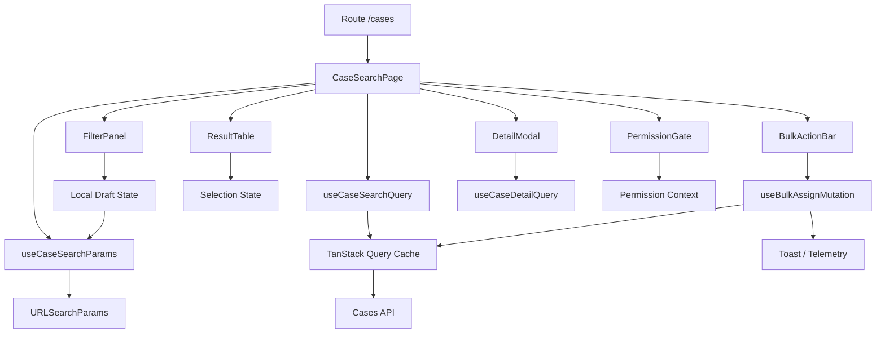
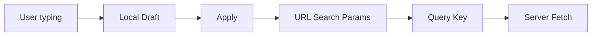
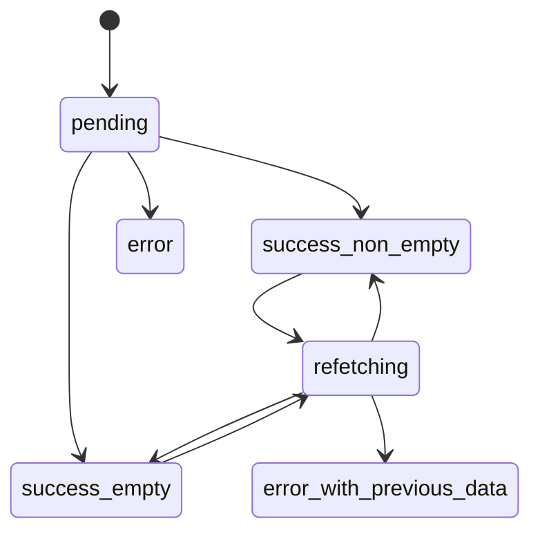

# Part 114 — Case Study: Complex Search Page

Complex search page adalah salah satu tempat terbaik untuk menguji pemahaman React state.
Di permukaan terlihat sederhana:

```txt
input keyword
filter status
sort
pagination
table result
```

Di produksi, search page cepat berubah menjadi sistem state yang kompleks:

```txt
URL harus shareable
filter punya draft dan committed state
query cache harus benar
pagination harus reset saat filter berubah
selection state harus stabil saat data berganti
server response bisa stale
mutation bisa mengubah row yang sedang terlihat
permission memengaruhi action
table besar bisa mahal render
empty/error/loading state harus eksplisit
observability harus cukup untuk debugging
```

Bagian ini membangun case study dengan gaya architecture handbook.
Tujuannya bukan membuat satu library search.
Tujuannya membentuk mental model dan blueprint yang bisa diterapkan ke enterprise search page.

---

## 1. Scenario

Kita membangun halaman pencarian regulatory cases.

User bisa:

```txt
mencari case berdasarkan keyword
filter berdasarkan status, priority, assignee, date range
sort berdasarkan updatedAt, dueDate, priority
paginate hasil
memilih beberapa row
melakukan bulk assign / bulk close
membuka detail modal
menyimpan filter sebagai saved view
membagikan URL ke rekan kerja
```

Constraint:

```txt
URL harus canonical dan shareable
server adalah source of truth untuk result
filter draft boleh lokal
committed search params harus ada di URL
query key harus stabil
pagination reset saat filter utama berubah
bulk selection tidak boleh salah target
action harus permission-aware
observability harus aman dari PII
```

---

## 2. State Inventory

Langkah pertama bukan menulis component.
Langkah pertama adalah menginventarisasi state.

| State | Owner | Source of truth | Persistent? | Shareable? |
|---|---|---|---|---|
| Keyword draft | Filter form | Local state | No | No |
| Committed keyword | URL | URL search params | Yes via URL | Yes |
| Status filter | URL | URL search params | Yes via URL | Yes |
| Priority filter | URL | URL search params | Yes via URL | Yes |
| Sort | URL | URL search params | Yes via URL | Yes |
| Page | URL | URL search params | Yes via URL | Yes |
| Page size | URL/user pref | URL or profile pref | Optional | Yes if URL |
| Search results | TanStack Query | Server/cache | Cache lifecycle | Indirect |
| Row selection | Page/table component | Local or scoped store | No | No |
| Detail modal open | Route or local | URL/local decision | Depends | Maybe |
| Saved views | Server state | Server/cache | Yes | Yes |
| Permission decisions | Permission provider/server | Backend policy snapshot | Session | No |
| Bulk mutation state | Mutation hook | TanStack Query mutation | Short-lived | No |
| Observability context | Provider | Telemetry client | No | No |

Rule:

```txt
If state must survive refresh/share/back-forward, prefer URL.
If state is authoritative remote data, use server-state cache.
If state is temporary UI draft, keep local.
If state is workflow progress, use reducer/state machine.
If state is cross-cutting capability, use context.
```

---

## 3. Architecture Diagram



Boundary design:

```txt
Page owns wiring.
URL hook owns parsing/canonicalization.
Query hook owns server-state fetching.
FilterPanel owns draft.
ResultTable owns row rendering and selection interaction.
BulkActionBar owns command intent.
Mutation hook owns command lifecycle and invalidation.
PermissionGate owns UX visibility/disable decision.
```

---

## 4. URL State Contract

Search params are API.
Treat them like API.

Canonical params:

```txt
q       keyword, trimmed, omitted when empty
status  open|closed|escalated|all, omitted when all
priority low|medium|high|critical, omitted when all
assignee user id, omitted when none
from    ISO date yyyy-mm-dd, optional
to      ISO date yyyy-mm-dd, optional
sort    updatedAt.desc | dueDate.asc | priority.desc
page    positive integer, default 1
size    25 | 50 | 100, default 25
```

Important properties:

```txt
parse unknown values safely
canonicalize default values away
reset page when filter/sort changes
preserve unrelated params if route owns them
avoid putting sensitive keyword into telemetry raw
```

---

## 5. Search Param Parser

Gunakan parser eksplisit.
Jangan baca search params ad-hoc di banyak component.

```ts
type CaseStatus = 'all' | 'open' | 'closed' | 'escalated'
type Priority = 'all' | 'low' | 'medium' | 'high' | 'critical'
type Sort = 'updatedAt.desc' | 'dueDate.asc' | 'priority.desc'

export type CaseSearchParams = {
  q: string
  status: CaseStatus
  priority: Priority
  assignee: string | null
  from: string | null
  to: string | null
  sort: Sort
  page: number
  size: 25 | 50 | 100
}

const DEFAULT_PARAMS: CaseSearchParams = {
  q: '',
  status: 'all',
  priority: 'all',
  assignee: null,
  from: null,
  to: null,
  sort: 'updatedAt.desc',
  page: 1,
  size: 25,
}
```

Parser:

```ts
function oneOf<T extends string>(value: string | null, allowed: readonly T[], fallback: T): T {
  return value && (allowed as readonly string[]).includes(value) ? (value as T) : fallback
}

function positiveInt(value: string | null, fallback: number): number {
  const parsed = Number(value)
  return Number.isInteger(parsed) && parsed > 0 ? parsed : fallback
}

export function parseCaseSearchParams(params: URLSearchParams): CaseSearchParams {
  return {
    q: (params.get('q') ?? '').trim(),
    status: oneOf(params.get('status'), ['all', 'open', 'closed', 'escalated'] as const, 'all'),
    priority: oneOf(params.get('priority'), ['all', 'low', 'medium', 'high', 'critical'] as const, 'all'),
    assignee: params.get('assignee') || null,
    from: params.get('from') || null,
    to: params.get('to') || null,
    sort: oneOf(params.get('sort'), ['updatedAt.desc', 'dueDate.asc', 'priority.desc'] as const, 'updatedAt.desc'),
    page: positiveInt(params.get('page'), 1),
    size: oneOf(params.get('size'), ['25', '50', '100'] as const, '25') === '50'
      ? 50
      : oneOf(params.get('size'), ['25', '50', '100'] as const, '25') === '100'
        ? 100
        : 25,
  }
}
```

The `size` parser can be cleaner, but the point is explicit validation.

Better:

```ts
function pageSize(value: string | null): 25 | 50 | 100 {
  if (value === '50') return 50
  if (value === '100') return 100
  return 25
}
```

---

## 6. Serialization and Canonicalization

Serialization must remove defaults.

```ts
export function serializeCaseSearchParams(params: CaseSearchParams): URLSearchParams {
  const next = new URLSearchParams()

  if (params.q) next.set('q', params.q)
  if (params.status !== 'all') next.set('status', params.status)
  if (params.priority !== 'all') next.set('priority', params.priority)
  if (params.assignee) next.set('assignee', params.assignee)
  if (params.from) next.set('from', params.from)
  if (params.to) next.set('to', params.to)
  if (params.sort !== DEFAULT_PARAMS.sort) next.set('sort', params.sort)
  if (params.page !== 1) next.set('page', String(params.page))
  if (params.size !== 25) next.set('size', String(params.size))

  return next
}
```

Canonical URL matters because:

```txt
same search should map to same URL
same URL should map to same query key
unnecessary params should not create duplicate cache entries
copy/share should be stable
back button should be predictable
```

---

## 7. URL Hook

React Router `useSearchParams` returns current `URLSearchParams` and a setter; setting search params causes navigation.

```tsx
export function useCaseSearchParams() {
  const [searchParams, setSearchParams] = useSearchParams()

  const parsed = useMemo(
    () => parseCaseSearchParams(searchParams),
    [searchParams],
  )

  const update = useCallback(
    (patch: Partial<CaseSearchParams>, options?: { resetPage?: boolean }) => {
      const next: CaseSearchParams = {
        ...parsed,
        ...patch,
        page: options?.resetPage ? 1 : patch.page ?? parsed.page,
      }

      setSearchParams(serializeCaseSearchParams(next))
    },
    [parsed, setSearchParams],
  )

  const reset = useCallback(() => {
    setSearchParams(serializeCaseSearchParams(DEFAULT_PARAMS))
  }, [setSearchParams])

  return { params: parsed, update, reset }
}
```

Caveat:

```txt
parsed object identity changes when searchParams changes.
Do not pass raw parsed object deep into memoized components unless needed.
Use domain callbacks at page boundary.
```

---

## 8. Draft vs Committed Filter State

Filter form needs local draft if typing should not update URL/query on every keystroke.



Pattern:

```tsx
function FilterPanel({
  value,
  onApply,
  onReset,
}: {
  value: CaseSearchParams
  onApply(next: CaseSearchParams): void
  onReset(): void
}) {
  const [draft, setDraft] = useState(value)

  useEffect(() => {
    setDraft(value)
  }, [value])

  return (
    <form
      onSubmit={(event) => {
        event.preventDefault()
        onApply(draft)
      }}
    >
      <input
        value={draft.q}
        onChange={(event) => setDraft((prev) => ({ ...prev, q: event.target.value }))}
      />
      <button type="submit">Apply</button>
      <button type="button" onClick={onReset}>Reset</button>
    </form>
  )
}
```

But be careful: syncing props to local state via effect is usually suspicious.
Here it is valid because `FilterPanel` intentionally has **draft state** that should reset when committed URL state changes externally.

Better contract:

```txt
FilterPanel receives committed value.
FilterPanel owns draft.
When committed value changes due browser back/share/reset, draft resyncs.
```

---

## 9. Immediate Search vs Apply Search

Two common designs:

| Design | State flow | Best for |
|---|---|---|
| Immediate search | input → URL/query after debounce | Simple keyword search |
| Apply search | input → local draft → Apply → URL/query | Complex filters |

Immediate search:

```tsx
const [draftQ, setDraftQ] = useState(params.q)
const deferredQ = useDeferredValue(draftQ)

useEffect(() => {
  update({ q: deferredQ }, { resetPage: true })
}, [deferredQ, update])
```

This is often not ideal because it turns typing into navigation.
For enterprise filters, Apply/Reset is clearer.

Rule:

```txt
Use local draft for complex filters.
Commit to URL only when user intent is clear.
```

---

## 10. Query Key Design

Query key is cache address.

```ts
export const caseSearchKeys = {
  all: ['cases'] as const,
  lists: () => [...caseSearchKeys.all, 'list'] as const,
  list: (params: CaseSearchParams) => [
    ...caseSearchKeys.lists(),
    {
      q: params.q,
      status: params.status,
      priority: params.priority,
      assignee: params.assignee,
      from: params.from,
      to: params.to,
      sort: params.sort,
      page: params.page,
      size: params.size,
    },
  ] as const,
  detail: (caseId: string) => [...caseSearchKeys.all, 'detail', caseId] as const,
}
```

Rules:

```txt
Every server-input variable belongs in the query key.
Do not put non-serializable objects in query key.
Canonicalize params before key generation.
Separate list and detail families.
Design keys for invalidation.
```

Bad:

```ts
useQuery({
  queryKey: ['cases'],
  queryFn: () => api.searchCases(params),
})
```

This causes unrelated searches to share the same cache entry.

---

## 11. Query Hook

```tsx
export function useCaseSearchQuery(params: CaseSearchParams) {
  return useQuery({
    queryKey: caseSearchKeys.list(params),
    queryFn: ({ signal }) => api.searchCases(params, { signal }),
    staleTime: 30_000,
    placeholderData: (previous) => previous,
  })
}
```

Why `placeholderData: previous => previous`?

```txt
When page/filter changes, previous data can remain visible while next query loads.
This avoids table flicker.
But UI must show stale/pending affordance.
```

UI:

```tsx
const query = useCaseSearchQuery(params)

<ResultTable
  rows={query.data?.items ?? []}
  loading={query.isPending}
  refetching={query.isFetching && !query.isPending}
  stale={query.isFetching && Boolean(query.data)}
/>
```

Distinguish:

| State | UI meaning |
|---|---|
| `isPending` | no data yet for this query |
| `isFetching` with data | background/refetching/placeholder data |
| `isError` | query failed |
| empty `items` | successful query with no results |

---

## 12. Page Component

```tsx
export function CaseSearchPage() {
  const { params, update, reset } = useCaseSearchParams()
  const query = useCaseSearchQuery(params)
  const permissions = useCasePermissions()
  const telemetry = useTelemetry()

  useEffect(() => {
    telemetry.info('case.search.params_changed', safeSearchParamTelemetry(params))
  }, [params, telemetry])

  return (
    <PageLayout title="Cases">
      <FilterPanel
        value={params}
        onApply={(next) => update(next, { resetPage: true })}
        onReset={reset}
      />

      <SearchSummary
        total={query.data?.total ?? 0}
        loading={query.isPending}
        refetching={query.isFetching && Boolean(query.data)}
      />

      {query.isError ? (
        <SearchErrorState onRetry={() => query.refetch()} />
      ) : (
        <CaseResultSection
          params={params}
          data={query.data}
          loading={query.isPending}
          refetching={query.isFetching && Boolean(query.data)}
          permissions={permissions}
          onPageChange={(page) => update({ page })}
          onSortChange={(sort) => update({ sort }, { resetPage: true })}
        />
      )}
    </PageLayout>
  )
}
```

Page owns wiring, not table details.

---

## 13. Result Section

```tsx
function CaseResultSection({
  params,
  data,
  loading,
  refetching,
  permissions,
  onPageChange,
  onSortChange,
}: Props) {
  const selection = useCaseSelection(data?.items ?? [])

  if (loading) return <ResultSkeleton />

  if (!data || data.items.length === 0) {
    return <EmptySearchState />
  }

  return (
    <>
      {selection.selectedCount > 0 && (
        <BulkActionBar
          selectedIds={selection.selectedIds}
          canAssign={permissions.canBulkAssign}
          onClear={selection.clear}
        />
      )}

      <CaseTable
        rows={data.items}
        sort={params.sort}
        refetching={refetching}
        selection={selection}
        onSortChange={onSortChange}
      />

      <Pagination
        page={params.page}
        pageSize={params.size}
        total={data.total}
        onPageChange={onPageChange}
      />
    </>
  )
}
```

Selection state should not be global by default.
It belongs to the result section/table unless bulk workflow must survive navigation.

---

## 14. Selection State

Selection keyed by row ID, not row index.

```ts
function useCaseSelection(visibleRows: CaseRow[]) {
  const visibleIds = useMemo(() => new Set(visibleRows.map((row) => row.id)), [visibleRows])
  const [selectedIds, setSelectedIds] = useState<Set<string>>(() => new Set())

  useEffect(() => {
    setSelectedIds((prev) => {
      const next = new Set<string>()
      for (const id of prev) {
        if (visibleIds.has(id)) next.add(id)
      }
      return next
    })
  }, [visibleIds])

  const toggle = useCallback((id: string) => {
    setSelectedIds((prev) => {
      const next = new Set(prev)
      if (next.has(id)) next.delete(id)
      else next.add(id)
      return next
    })
  }, [])

  const clear = useCallback(() => setSelectedIds(new Set()), [])

  return {
    selectedIds: [...selectedIds],
    selectedCount: selectedIds.size,
    isSelected: (id: string) => selectedIds.has(id),
    toggle,
    clear,
  }
}
```

The pruning effect is valid because visible result changes are external to selection state.
Alternative policy:

```txt
Selection survives pagination across whole query.
Selection prunes only when filter changes.
Selection belongs to a bulk workflow store.
```

Choose intentionally.

---

## 15. Pagination Reset Rules

Not all param changes should reset page.

| Change | Reset page? | Reason |
|---|---:|---|
| Keyword | Yes | Result set changed |
| Status | Yes | Result set changed |
| Priority | Yes | Result set changed |
| Assignee | Yes | Result set changed |
| Date range | Yes | Result set changed |
| Sort | Yes | Page meaning changed |
| Page size | Usually yes | Boundaries changed |
| Page | No | It is the page change |

Encode this in API:

```ts
onFilterApply={(next) => update(next, { resetPage: true })}
onSortChange={(sort) => update({ sort }, { resetPage: true })}
onPageChange={(page) => update({ page })}
```

Do not scatter `page: 1` across components.

---

## 16. Sorting Contract

Sort is server-state input.
It belongs in URL and query key.

```tsx
<CaseTable
  sort={params.sort}
  onSortChange={(sort) => update({ sort }, { resetPage: true })}
/>
```

Bad pattern:

```tsx
const [sort, setSort] = useState('updatedAt.desc')
const sortedRows = useMemo(() => sortRows(query.data.items, sort), [query.data, sort])
```

Unless the API explicitly returns all results and client sorting is correct, client sorting paginated server data is usually wrong.

---

## 17. Detail Modal State

Three options:

| Option | State location | Pros | Cons |
|---|---|---|---|
| Local modal state | `selectedCaseId` local | Simple | Not shareable/back-button |
| URL query param | `caseId=...` | Shareable, back-button | More URL complexity |
| Nested route | `/cases/:id` | Strong route model | More routing architecture |

For search page with shareable detail:

```txt
/cases?status=open&page=2&caseId=case-123
```

Then:

```tsx
const selectedCaseId = searchParams.get('caseId')

<CaseDetailModal
  caseId={selectedCaseId}
  open={Boolean(selectedCaseId)}
  onOpenChange={(open) => {
    if (!open) removeSearchParam('caseId')
  }}
/>
```

Detail query:

```tsx
function useCaseDetailQuery(caseId: string | null) {
  return useQuery({
    queryKey: caseId ? caseSearchKeys.detail(caseId) : ['cases', 'detail', 'none'],
    queryFn: ({ signal }) => api.getCase(caseId!, { signal }),
    enabled: Boolean(caseId),
  })
}
```

Better avoid dummy key by only rendering query component when `caseId` exists.

---

## 18. Bulk Mutation

Bulk actions are command workflows.

```tsx
function useBulkAssignCases() {
  const queryClient = useQueryClient()
  const telemetry = useTelemetry()

  return useMutation({
    mutationFn: api.bulkAssignCases,
    onMutate: async (input) => {
      const mutationId = crypto.randomUUID()
      telemetry.info('case.bulk_assign.started', {
        mutationId,
        selectedCount: input.caseIds.length,
      })
      return { mutationId }
    },
    onSuccess: (_data, input, context) => {
      telemetry.info('case.bulk_assign.succeeded', {
        mutationId: context?.mutationId ?? 'unknown',
        selectedCount: input.caseIds.length,
      })

      queryClient.invalidateQueries({ queryKey: caseSearchKeys.lists() })
    },
    onError: (error, input, context) => {
      telemetry.warn('case.bulk_assign.failed', {
        mutationId: context?.mutationId ?? 'unknown',
        selectedCount: input.caseIds.length,
        errorClass: classifyError(error),
      })
    },
  })
}
```

Invalidate list queries after bulk mutation because many list projections can change.
If detail view is open, invalidate detail keys too.

```ts
queryClient.invalidateQueries({ queryKey: caseSearchKeys.lists() })
for (const caseId of input.caseIds) {
  queryClient.invalidateQueries({ queryKey: caseSearchKeys.detail(caseId) })
}
```

---

## 19. Optimistic Bulk Action?

Bulk actions are risky for optimistic UI.

Optimistic update is valid when:

```txt
operation is reversible or low-risk
server conflict is rare and easy to reconcile
user expects instant feedback
affected cache entries are identifiable
```

For regulatory cases, bulk close/assign may have permission/state constraints.
Prefer conservative flow:

```txt
show pending state
disable affected action
wait for server result
invalidate/refetch
show result summary
```

If optimistic:

```txt
store previous cache snapshots
update visible list rows
record optimistic mutationId
rollback failed items only
show partial success/failure summary
```

---

## 20. Permission-Aware Actions

Do not hide everything blindly.

```tsx
<PermissionGate
  decision={permissions.bulkAssign}
  fallback={(reason) => (
    <Button disabled title={reason.userMessage}>
      Assign selected
    </Button>
  )}
>
  <Button onClick={openAssignDialog}>Assign selected</Button>
</PermissionGate>
```

Rules:

```txt
Frontend permission improves UX.
Backend authorization remains final enforcement.
Telemetry may record reasonClass, not full policy internals.
```

---

## 21. Loading, Empty, Error, Refetching

Do not collapse all states into `loading`.



UI policy:

| Query state | UI |
|---|---|
| Initial pending | Skeleton/full-page loading |
| Success empty | Empty state with reset filters |
| Success non-empty | Table |
| Refetching with data | Keep table + subtle loading bar |
| Error without data | Error state + retry |
| Error with previous data | Keep stale data + warning banner |

This distinction prevents flicker and data disappearance.

---

## 22. Stale Data UX

When showing previous data during refetch, mark it.

```tsx
{refetching && (
  <InlineStatus tone="neutral">
    Updating results…
  </InlineStatus>
)}
```

If the new params differ significantly, stale data can be misleading.
For example:

```txt
User changed status=open to status=closed.
Old open cases remain visible while closed query loads.
```

Mitigation options:

| Option | Pros | Cons |
|---|---|---|
| Keep previous data + banner | Smooth | Can confuse |
| Skeleton on major filter change | Clear | More flicker |
| Dim previous table | Balanced | More UI complexity |
| Keep previous only for pagination | Often best | Needs policy |

Production rule:

```txt
Use previous data for pagination/sort if acceptable.
Use stronger loading affordance for major filter changes.
```

---

## 23. Query Cancellation and Race

TanStack Query passes `signal` to queryFn.
Use it.

```ts
async function searchCases(params: CaseSearchParams, options: { signal?: AbortSignal }) {
  const response = await fetch(`/api/cases?${serializeCaseSearchParams(params)}`, {
    signal: options.signal,
  })

  if (!response.ok) throw await toApiError(response)
  return response.json() as Promise<CaseSearchResult>
}
```

Avoid manual `ignore` flags for this page when Query manages lifecycle.

The more important race is semantic:

```txt
Mutation changes a row.
Search cache still shows old row.
User performs second action from stale row.
```

Fix with invalidation/direct cache update and disabled stale action policy.

---

## 24. Component Tree

```txt
CaseSearchPage
  SearchPageHeader
  FilterPanel
    KeywordInput
    StatusFilter
    PriorityFilter
    AssigneePicker
    DateRangeFilter
    ApplyResetButtons
  SearchSummary
  BulkActionBar
  CaseTable
    CaseTableHeader
    CaseTableRow
    RowActionMenu
  Pagination
  CaseDetailModal
  SaveViewDialog
```

Ownership:

```txt
CaseSearchPage: URL/query wiring
FilterPanel: draft filter state
CaseTable: visual rows + selection callbacks
ResultSection: selection state
BulkActionBar: bulk command intent
CaseDetailModal: detail query/workflow
SaveViewDialog: save view mutation
```

---

## 25. Avoid Prop Explosion with View Model

If table props explode, build a view model at boundary.

```ts
type CaseTableViewModel = {
  rows: CaseRowViewModel[]
  sort: Sort
  refetching: boolean
  selection: {
    selectedIds: string[]
    selectedCount: number
    isSelected(id: string): boolean
    toggle(id: string): void
  }
  actions: {
    canOpenDetail: boolean
    canAssign: boolean
    onOpenDetail(id: string): void
    onSortChange(sort: Sort): void
  }
}
```

Use view model to stabilize API, not to hide all complexity.

Bad:

```ts
<CaseTable everything={pageState} />
```

Good:

```ts
<CaseTable model={tableModel} />
```

where `tableModel` is a deliberately designed contract.

---

## 26. Performance Model

Search page performance cost comes from:

```txt
large table render
unstable row props
context fan-out
filter draft causing whole page rerender
expensive cell formatters
selection state rerendering all rows
non-virtualized large pages
excessive query result transformations
```

Mitigation:

```txt
keep page size reasonable
memoize row component only after profiling
use stable row IDs
pass primitive props to rows where possible
move high-frequency input draft into FilterPanel
avoid global context for selection
use virtualization for huge result sets
use selectors for external store if selection global
```

Row component:

```tsx
const CaseTableRow = memo(function CaseTableRow({
  row,
  selected,
  onToggle,
  onOpen,
}: RowProps) {
  return (
    <tr aria-selected={selected}>
      <td>
        <input
          type="checkbox"
          checked={selected}
          onChange={() => onToggle(row.id)}
        />
      </td>
      <td>
        <button onClick={() => onOpen(row.id)}>{row.caseNumber}</button>
      </td>
      <td>{row.status}</td>
      <td>{row.priority}</td>
    </tr>
  )
})
```

But `memo` only helps if props are stable and render is actually expensive.

---

## 27. Accessibility Contract

Search page accessibility:

```txt
form inputs have labels
Apply/Reset are buttons with type
loading state announced politely
error state linked to retry action
table headers expose sort state
pagination has accessible labels
bulk selection announces count
modal traps focus and returns focus
disabled action explains reason if possible
```

Sort header:

```tsx
<th aria-sort={sort === 'dueDate.asc' ? 'ascending' : 'none'}>
  <button onClick={() => onSortChange('dueDate.asc')}>Due date</button>
</th>
```

Bulk summary:

```tsx
<div role="status" aria-live="polite">
  {selectedCount} cases selected
</div>
```

---

## 28. Observability for Search Page

Safe telemetry:

```ts
function safeSearchParamTelemetry(params: CaseSearchParams) {
  return {
    status: params.status,
    priority: params.priority,
    hasKeyword: params.q.length > 0,
    keywordLength: params.q.length,
    page: params.page,
    size: params.size,
    sort: params.sort,
    activeFilterCount: countActiveFilters(params),
  }
}
```

Events:

```txt
case.search.page_opened
case.search.params_changed
case.search.filters_applied
case.search.filters_reset
case.search.query_started
case.search.query_succeeded
case.search.query_failed
case.search.empty_state_shown
case.search.results_rendered
case.search.page_changed
case.search.sort_changed
case.bulk_assign.started
case.bulk_assign.succeeded
case.bulk_assign.failed
case.detail.opened
case.saved_view.created
```

Metrics:

```txt
query duration by status/priority/filterCount
query failure rate by errorClass
result count bucket
render duration by row count bucket
bulk mutation failure rate
empty state rate
```

---

## 29. Testing Plan

Test parser/serializer:

```ts
it('canonicalizes default params away', () => {
  const params = serializeCaseSearchParams(DEFAULT_PARAMS)
  expect(params.toString()).toBe('')
})

it('falls back on invalid params', () => {
  const params = parseCaseSearchParams(new URLSearchParams('page=-10&status=wat'))
  expect(params.page).toBe(1)
  expect(params.status).toBe('all')
})
```

Test page behavior:

```txt
render with URL params → inputs/table reflect committed state
change draft keyword → URL does not change before Apply
Apply filters → URL updates, page resets to 1
change page → URL page changes, filters preserved
invalid URL param → canonical/default UI state
query error → error state with retry
empty response → empty state
bulk assign success → list query invalidated
bulk assign failure → error toast shown, selection preserved/cleared per policy
browser back → filter draft resyncs
```

Test query key:

```ts
expect(caseSearchKeys.list({ ...DEFAULT_PARAMS, status: 'open' })).not.toEqual(
  caseSearchKeys.list({ ...DEFAULT_PARAMS, status: 'closed' }),
)
```

---

## 30. Failure Modes

| Failure mode | Symptom | Root cause | Fix |
|---|---|---|---|
| Query key too broad | wrong results reused | missing params in key | include all server inputs |
| Query key too noisy | cache explosion | non-canonical params | canonicalize defaults |
| Page not reset | empty/wrong page after filter | filter changes keep old page | reset page on filter/sort |
| Draft overwrites URL | back button weird | local draft sync wrong | explicit draft/commit contract |
| Selection by index | wrong rows selected | pagination/sort changes | key by row ID |
| Hidden stale data | user acts on old row | previous data no affordance | show refetching/stale state |
| Client sort server page | incorrect global order | sorting partial data | server-side sort |
| Full keyword telemetry | PII leak | raw search logging | safe metadata only |
| Over-global state | unrelated rerenders | store/context too broad | localize selection/draft |
| Duplicate fetch | effect-based fetching | manual fetch lifecycle | server-state cache |
| Modal not shareable | copied URL loses context | local detail state | URL/nested route detail state |
| Invalid params crash | URL parser trusts input | no validation | parser with fallbacks |
| Bulk invalidation gap | list shows old rows | mutation did not invalidate | invalidate list/detail families |
| Permission drift | button allowed but server denies | stale UI policy | backend enforcement + refetch permission |
| Render slow | table jank | large rows/context fan-out | profile, memo, virtualize |

---

## 31. Refactor Ladder

When the page grows:

```txt
1. Inline useSearchParams parsing
2. Extract parse/serialize helpers
3. Extract useCaseSearchParams
4. Extract query key factory
5. Extract useCaseSearchQuery
6. Extract FilterPanel draft state
7. Extract ResultSection selection state
8. Extract mutation hooks
9. Extract view model builders
10. Extract workflow machine for bulk/detail flows
11. Add observability adapter
12. Add Storybook state matrix
```

Do not jump to step 12 on day one.
But design step 1 so it can migrate.

---

## 32. ADR Example

```md
# ADR: Case Search State Ownership

## Context
The case search page must support shareable filters, browser back/forward, server pagination, bulk actions, and saved views.

## Decision
Committed search state will live in URL search params.
Filter panel will own local draft state.
Search results will be managed by TanStack Query.
Selection state will be local to the result section and keyed by case ID.
Bulk mutations will invalidate case list and affected detail query families.

## Consequences
Users can share URLs.
Back/forward works for committed filters.
Draft filter typing does not trigger query.
Selection does not survive filter changes.
Query key design becomes part of API contract.
```

---

## 33. Production Checklist

```txt
[ ] Search params parsed and validated centrally
[ ] Defaults canonicalized out of URL
[ ] Query key includes all server inputs
[ ] Query key excludes non-server UI state
[ ] Filter changes reset page
[ ] Draft filter state separated from committed URL state
[ ] Query uses AbortSignal where supported
[ ] Loading/empty/error/refetching states distinct
[ ] Previous/stale data affordance intentional
[ ] Selection keyed by stable ID
[ ] Bulk mutation invalidates impacted query families
[ ] Permission UI backed by server enforcement
[ ] Telemetry safe from PII
[ ] Parser/serializer tested
[ ] Query/mutation behavior tested
[ ] Accessibility states tested
[ ] Performance profiled before memoization/virtualization
```

---

## 34. Key Takeaways

```txt
Complex search page is a state topology problem, not a table problem.
URL owns committed shareable search state.
Local state owns draft filter input.
TanStack Query owns server result cache.
Query keys are cache schema and must be designed intentionally.
Pagination reset rules are part of state contract.
Selection must be keyed by stable IDs, not row index.
Stale/previous data must be visible as a UX state.
Mutations must define invalidation and optimistic policy.
Permission-aware UI is UX, not final security enforcement.
Observability must record metadata and correlation, not sensitive payload.
```

---

## References

- React Router `useSearchParams`: https://reactrouter.com/api/hooks/useSearchParams
- TanStack Query: https://tanstack.com/query/latest
- TanStack Query query keys: https://tanstack.com/query/v5/docs/framework/react/guides/query-keys
- TanStack Query invalidation: https://tanstack.com/query/latest/docs/framework/react/guides/query-invalidation
- React `useMemo`: https://react.dev/reference/react/useMemo
- React `useDeferredValue`: https://react.dev/reference/react/useDeferredValue
- React Profiler: https://react.dev/reference/react/Profiler
