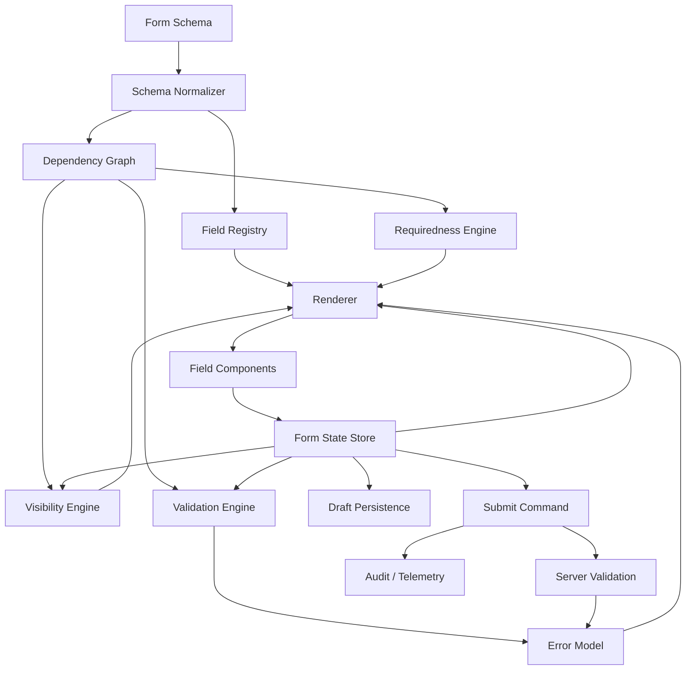
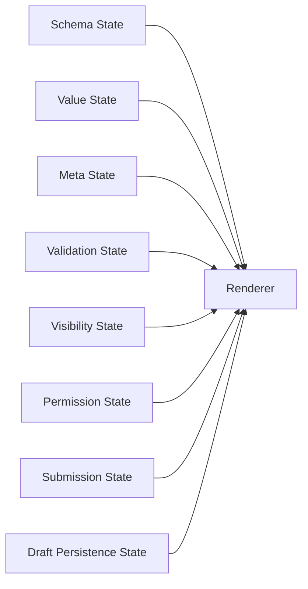
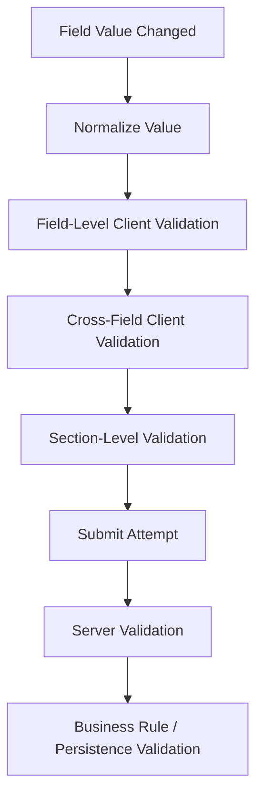

# Part 115 — Case Study: Enterprise Form Builder

Enterprise form builder terdengar seperti “render form dari JSON”. Itu framing yang terlalu kecil.

Di aplikasi sungguhan, enterprise form builder adalah **runtime UI untuk mengumpulkan data, menjaga invariant, mengorkestrasi validasi, mengontrol izin, menyimpan draft, menangani perubahan schema, dan menghasilkan bukti bahwa data dikumpulkan dengan aturan yang benar**.

Form builder yang buruk biasanya gagal bukan karena tidak bisa render `<input />`, tetapi karena:

- schema berubah setelah form sudah punya draft lama,
- field conditional membuat data tersembunyi tetap terkirim,
- validasi cross-field tersebar di component,
- array/repeater kehilangan identity saat reorder,
- server validation dan client validation tidak punya contract sama,
- permission hanya dipakai untuk hide UI, bukan menjaga command boundary,
- state field disimpan terlalu global sehingga setiap keystroke merender seluruh form,
- form tidak observable sehingga bug produksi tidak bisa direkonstruksi.

Target part ini: membangun mental model dan blueprint implementasi form builder yang bisa dipakai untuk form kompleks: onboarding, regulatory case intake, risk assessment, claim submission, loan application, approval packet, internal workflow, atau compliance checklist.

---

## 1. Problem Statement

Kita ingin membangun form builder dengan kemampuan berikut:

```txt
Schema-driven rendering
Conditional visibility
Conditional requiredness
Cross-field validation
Dynamic field arrays
Server validation
Draft persistence
Versioned schema migration
Permission-aware fields
Accessible error reporting
Observable submit workflow
Testable rules and transitions
```

Yang **tidak** kita inginkan:

```txt
JSON raksasa yang berubah menjadi bahasa pemrograman buruk
Component yang membaca schema langsung lalu punya ratusan if
Setiap field subscribe ke seluruh form state
Validation logic tersebar di 40 component
Submit handler yang menjadi procedural monster
```

Form builder harus dipisahkan menjadi beberapa engine kecil.

---

## 2. Core Mental Model

Enterprise form builder bukan satu component. Ia adalah komposisi beberapa subsystem:



Prinsipnya:

```txt
Schema describes structure.
Registry maps type to implementation.
State store owns current values and meta.
Dependency graph knows what depends on what.
Validation engine produces errors.
Renderer maps resolved form model to UI.
Submit command is the only boundary to server mutation.
```

Jangan biarkan satu layer melakukan semua pekerjaan.

---

## 3. Domain Vocabulary

Gunakan vocabulary yang stabil dari awal.

| Term | Meaning |
|---|---|
| Field | Unit input paling kecil, misalnya text, date, select, money |
| Group | Logical container untuk beberapa field |
| Section | Visual/domain grouping lebih besar |
| Repeater | Dynamic array of item groups |
| Schema | Versioned definition of form structure and rules |
| Field registry | Mapping dari `field.type` ke renderer/adapter |
| Value state | Data yang akan dikirim |
| Meta state | touched, dirty, visited, validating, disabled reason |
| Error model | Client/server/business errors keyed by field/path |
| Visibility rule | Menentukan field/section ditampilkan atau tidak |
| Requiredness rule | Menentukan wajib/tidak berdasarkan state/context |
| Validation rule | Menentukan valid/tidak |
| Draft | Persisted partial state yang belum submit |
| Submission | Command lifecycle menuju server |

Hal kecil tapi penting: **value state dan meta state jangan dicampur**. `values.customerName` adalah data domain. `meta.customerName.touched` adalah UI state.

---

## 4. State Topology

Enterprise form builder punya banyak jenis state.



| State | Owner | Volatility | Serializable | Notes |
|---|---|---:|---:|---|
| Schema | server/config/module | low | yes | versioned |
| Values | form engine | high | yes | submit payload source |
| Meta | form engine | high | partly | touched/dirty/visited |
| Visibility | derived engine | medium | no | derived from schema + values |
| Requiredness | derived engine | medium | no | derived, not stored |
| Errors | validation engine | medium | yes | client + server errors |
| Submission | command layer | low-medium | maybe | pending/succeeded/failed |
| Draft persistence | persistence adapter | medium | yes | versioned snapshot |
| Field focus | UI component/ref | high | no | ephemeral |

Rule sederhana:

```txt
Store user-provided facts.
Derive everything that can be deterministically derived.
Persist only what can survive schema/version changes.
```

---

## 5. Schema Shape

Mulai dari schema yang cukup kuat tetapi tidak menjadi bahasa programming bebas.

```ts
export type FormSchema = {
  schemaVersion: string;
  formId: string;
  title: string;
  sections: SectionSchema[];
};

export type SectionSchema = {
  id: string;
  title: string;
  description?: string;
  visibleWhen?: RuleExpr;
  fields: FieldSchema[];
};

export type FieldSchema =
  | TextFieldSchema
  | NumberFieldSchema
  | DateFieldSchema
  | SelectFieldSchema
  | RepeaterFieldSchema;

type BaseFieldSchema = {
  id: string;
  path: string;
  label: string;
  helpText?: string;
  requiredWhen?: RuleExpr;
  visibleWhen?: RuleExpr;
  disabledWhen?: RuleExpr;
  validate?: ValidationRule[];
  permissions?: FieldPermissionRule;
};

export type TextFieldSchema = BaseFieldSchema & {
  type: 'text';
  placeholder?: string;
  maxLength?: number;
};

export type SelectFieldSchema = BaseFieldSchema & {
  type: 'select';
  options: Array<{ value: string; label: string }>;
};

export type RepeaterFieldSchema = BaseFieldSchema & {
  type: 'repeater';
  minItems?: number;
  maxItems?: number;
  itemFields: FieldSchema[];
};
```

Kuncinya bukan punya semua field type dari awal. Kuncinya adalah membuat schema punya **contract yang stabil**:

```txt
id      = identity untuk schema node
path    = address value dalam payload
label   = accessible label
rules   = expression yang dievaluasi engine
type    = lookup ke field registry
```

---

## 6. Jangan Pakai Function Arbitrary di Schema Remote

Ini menggoda:

```ts
{
  visibleWhen: (values) => values.country === 'ID'
}
```

Untuk schema lokal compile-time, function masih bisa diterima. Untuk schema remote/configurable, jangan.

Masalahnya:

- tidak serializable,
- tidak bisa divalidasi statically,
- sulit versioning,
- sulit audit,
- berisiko security,
- sulit dijalankan di server untuk validasi ulang.

Gunakan expression AST terbatas.

```ts
export type RuleExpr =
  | { op: 'equals'; path: string; value: unknown }
  | { op: 'notEquals'; path: string; value: unknown }
  | { op: 'exists'; path: string }
  | { op: 'and'; rules: RuleExpr[] }
  | { op: 'or'; rules: RuleExpr[] }
  | { op: 'not'; rule: RuleExpr };
```

Evaluator:

```ts
export function evaluateRule(rule: RuleExpr | undefined, values: unknown): boolean {
  if (!rule) return true;

  switch (rule.op) {
    case 'equals':
      return getPath(values, rule.path) === rule.value;

    case 'notEquals':
      return getPath(values, rule.path) !== rule.value;

    case 'exists':
      return getPath(values, rule.path) != null;

    case 'and':
      return rule.rules.every((child) => evaluateRule(child, values));

    case 'or':
      return rule.rules.some((child) => evaluateRule(child, values));

    case 'not':
      return !evaluateRule(rule.rule, values);

    default: {
      const _exhaustive: never = rule;
      return _exhaustive;
    }
  }
}
```

This is boring on purpose. Boring rules are testable rules.

---

## 7. Field Registry

Renderer tidak boleh tahu cara render setiap field melalui `switch` raksasa yang terus membesar.

Gunakan registry.

```ts
export type FieldRendererProps<TField extends FieldSchema = FieldSchema> = {
  field: TField;
  value: unknown;
  error?: FieldError;
  meta: FieldMeta;
  disabled: boolean;
  required: boolean;
  onChange: (value: unknown) => void;
  onBlur: () => void;
};

export type FieldRenderer<TField extends FieldSchema = FieldSchema> =
  (props: FieldRendererProps<TField>) => React.ReactNode;

export type FieldRegistry = {
  text: FieldRenderer<TextFieldSchema>;
  number: FieldRenderer<NumberFieldSchema>;
  date: FieldRenderer<DateFieldSchema>;
  select: FieldRenderer<SelectFieldSchema>;
  repeater: FieldRenderer<RepeaterFieldSchema>;
};
```

Renderer:

```tsx
function FieldNode({ field }: { field: FieldSchema }) {
  const registry = useFieldRegistry();
  const form = useFormEngine();

  const visible = form.useVisible(field.id);
  const value = form.useFieldValue(field.path);
  const error = form.useFieldError(field.path);
  const meta = form.useFieldMeta(field.path);
  const disabled = form.useDisabled(field.id);
  const required = form.useRequired(field.id);

  if (!visible) return null;

  const Renderer = registry[field.type] as FieldRenderer;

  return (
    <Renderer
      field={field}
      value={value}
      error={error}
      meta={meta}
      disabled={disabled}
      required={required}
      onChange={(next) => form.setFieldValue(field.path, next)}
      onBlur={() => form.markBlurred(field.path)}
    />
  );
}
```

Perhatikan desain subscription: `useFieldValue(path)` harus membaca satu path, bukan seluruh values object.

---

## 8. Controlled vs Uncontrolled Field Strategy

Dalam form builder, field bisa dikontrol dengan dua cara.

### Fully controlled

```tsx
<input value={String(value ?? '')} onChange={(e) => onChange(e.target.value)} />
```

Kelebihan:

- state tunggal di form engine,
- mudah validasi realtime,
- mudah observability,
- mudah conditional logic.

Biaya:

- setiap keystroke masuk React state,
- butuh subscription granular,
- expensive kalau form sangat besar dan engine buruk.

### Locally buffered / commit-on-blur

```tsx
function BufferedTextField({ value, onChange, onBlur }: FieldRendererProps<TextFieldSchema>) {
  const [draft, setDraft] = React.useState(() => String(value ?? ''));

  React.useEffect(() => {
    setDraft(String(value ?? ''));
  }, [value]);

  return (
    <input
      value={draft}
      onChange={(event) => setDraft(event.target.value)}
      onBlur={() => {
        onChange(draft);
        onBlur();
      }}
    />
  );
}
```

Ini bisa mengurangi global update, tetapi membawa risiko:

- local draft stale saat server/draft restore mengubah value,
- conditional visibility tidak bereaksi sampai blur,
- validation realtime tidak lengkap,
- reset form harus sync ulang draft.

Decision rule:

```txt
Use controlled field when value affects other fields immediately.
Use buffered field only when value is isolated and expensive to update per keystroke.
```

---

## 9. Form State Engine

Untuk form kecil, `useReducer` cukup. Untuk enterprise form builder besar, engine sebaiknya punya granular subscription.

Minimal shape:

```ts
export type FormState = {
  values: Record<string, unknown>;
  meta: Record<string, FieldMeta>;
  errors: Record<string, FieldError[]>;
  submission: SubmissionState;
  schemaVersion: string;
};

export type FieldMeta = {
  touched: boolean;
  dirty: boolean;
  visited: boolean;
};

export type SubmissionState =
  | { tag: 'idle' }
  | { tag: 'submitting'; requestId: string }
  | { tag: 'succeeded'; submissionId: string }
  | { tag: 'failed'; requestId: string; reason: SubmitFailure };
```

Reducer events:

```ts
export type FormEvent =
  | { type: 'FIELD_CHANGED'; path: string; value: unknown }
  | { type: 'FIELD_BLURRED'; path: string }
  | { type: 'FIELD_VISITED'; path: string }
  | { type: 'CLIENT_VALIDATION_COMPLETED'; errors: Record<string, FieldError[]> }
  | { type: 'SERVER_VALIDATION_FAILED'; errors: Record<string, FieldError[]> }
  | { type: 'SUBMIT_STARTED'; requestId: string }
  | { type: 'SUBMIT_SUCCEEDED'; requestId: string; submissionId: string }
  | { type: 'SUBMIT_FAILED'; requestId: string; reason: SubmitFailure }
  | { type: 'DRAFT_RESTORED'; snapshot: FormDraftSnapshot }
  | { type: 'FORM_RESET'; values?: Record<string, unknown> };
```

Reducer invariant:

```ts
function formReducer(state: FormState, event: FormEvent): FormState {
  switch (event.type) {
    case 'FIELD_CHANGED': {
      return {
        ...state,
        values: setPathImmutable(state.values, event.path, event.value),
        meta: {
          ...state.meta,
          [event.path]: {
            ...state.meta[event.path],
            dirty: true,
          },
        },
      };
    }

    case 'SUBMIT_STARTED': {
      if (state.submission.tag === 'submitting') return state;
      return {
        ...state,
        submission: { tag: 'submitting', requestId: event.requestId },
      };
    }

    case 'SUBMIT_SUCCEEDED': {
      if (
        state.submission.tag !== 'submitting' ||
        state.submission.requestId !== event.requestId
      ) {
        return state;
      }

      return {
        ...state,
        submission: { tag: 'succeeded', submissionId: event.submissionId },
      };
    }

    default:
      return state;
  }
}
```

Request identity guard penting. Tanpa itu, response lama bisa menimpa state baru.

---

## 10. Dependency Graph

Conditional visibility dan cross-field validation butuh dependency graph.

Contoh:

```ts
const schema: FormSchema = {
  schemaVersion: '2026-07',
  formId: 'risk-assessment',
  title: 'Risk Assessment',
  sections: [
    {
      id: 'business',
      title: 'Business',
      fields: [
        {
          id: 'country',
          path: 'business.country',
          type: 'select',
          label: 'Country',
          options: [
            { value: 'ID', label: 'Indonesia' },
            { value: 'SG', label: 'Singapore' },
          ],
        },
        {
          id: 'taxId',
          path: 'business.taxId',
          type: 'text',
          label: 'Tax ID',
          visibleWhen: { op: 'equals', path: 'business.country', value: 'ID' },
          requiredWhen: { op: 'equals', path: 'business.country', value: 'ID' },
        },
      ],
    },
  ],
};
```

`taxId` depends on `business.country`.

Bangun graph:

```ts
export type DependencyGraph = {
  dependentsByPath: Map<string, Set<string>>;
};

export function buildDependencyGraph(schema: FormSchema): DependencyGraph {
  const dependentsByPath = new Map<string, Set<string>>();

  for (const field of walkFields(schema)) {
    const dependencies = collectRulePaths([
      field.visibleWhen,
      field.requiredWhen,
      field.disabledWhen,
      ...(field.validate ?? []).map((rule) => rule.when),
    ]);

    for (const path of dependencies) {
      const set = dependentsByPath.get(path) ?? new Set<string>();
      set.add(field.id);
      dependentsByPath.set(path, set);
    }
  }

  return { dependentsByPath };
}
```

Saat `business.country` berubah, kita tidak perlu recompute seluruh form. Kita recompute dependents.

```txt
changed path: business.country
affected nodes: taxId, regionalComplianceSection, taxDocumentRepeater
```

---

## 11. Hidden Field Policy

Ini salah satu keputusan paling penting.

Saat field menjadi hidden, apakah value-nya tetap disimpan?

Pilihan:

| Policy | Behavior | Cocok untuk |
|---|---|---|
| Keep | value tetap ada | wizard yang field bisa kembali muncul |
| Clear on hide | value dihapus | compliance/conditional payload yang tidak boleh mengirim data tidak relevan |
| Exclude on submit | value disimpan draft, tetapi tidak dikirim | draft UX + strict submit payload |
| Archive | value dipindah ke audit/draft archive | regulated systems |

Default enterprise yang aman:

```txt
Keep in draft.
Exclude from submit payload when invisible unless schema explicitly says otherwise.
Audit when field with value becomes excluded.
```

Implementation:

```ts
export function buildSubmitPayload(
  schema: FormSchema,
  values: Record<string, unknown>,
  visibility: Record<string, boolean>,
): Record<string, unknown> {
  let payload: Record<string, unknown> = {};

  for (const field of walkFields(schema)) {
    if (!visibility[field.id]) continue;

    const value = getPath(values, field.path);
    payload = setPathImmutable(payload, field.path, value);
  }

  return payload;
}
```

Jangan submit seluruh `values` mentah-mentah.

---

## 12. Validation Architecture

Validasi punya beberapa layer.



Jangan anggap client validation cukup.

Client validation berguna untuk UX cepat. Server validation adalah authority.

Error model:

```ts
export type FieldError = {
  code: string;
  message: string;
  severity: 'error' | 'warning';
  source: 'client' | 'server' | 'business';
};

export type FormError = {
  code: string;
  message: string;
  fieldPaths?: string[];
};
```

Validation rule:

```ts
export type ValidationRule =
  | { kind: 'required'; message?: string; when?: RuleExpr }
  | { kind: 'minLength'; value: number; message?: string; when?: RuleExpr }
  | { kind: 'maxLength'; value: number; message?: string; when?: RuleExpr }
  | { kind: 'regex'; pattern: string; message?: string; when?: RuleExpr }
  | { kind: 'customCode'; code: string; message?: string; when?: RuleExpr };
```

`customCode` bukan arbitrary JS. Itu key ke registry validator.

```ts
export type ValidatorRegistry = {
  [code: string]: (input: {
    value: unknown;
    values: Record<string, unknown>;
    field: FieldSchema;
  }) => FieldError | null;
};
```

---

## 13. Validation Graph Instead of Validation Soup

Cross-field validation sering menjadi procedural soup:

```ts
if (values.a && values.b && values.c !== ...) {
  // ...
}
```

Lebih baik treat validation as graph.

```ts
export type ValidationNode = {
  id: string;
  outputPath?: string;
  dependencies: string[];
  validate: (values: Record<string, unknown>) => FieldError[];
};
```

Contoh:

```ts
const dateRangeValidator: ValidationNode = {
  id: 'date-range',
  outputPath: 'period.endDate',
  dependencies: ['period.startDate', 'period.endDate'],
  validate(values) {
    const start = getPath(values, 'period.startDate');
    const end = getPath(values, 'period.endDate');

    if (!start || !end) return [];
    if (new Date(String(end)) < new Date(String(start))) {
      return [
        {
          code: 'END_BEFORE_START',
          message: 'End date must be after start date.',
          severity: 'error',
          source: 'client',
        },
      ];
    }

    return [];
  },
};
```

Saat `period.startDate` berubah, engine tahu validator mana yang perlu jalan.

---

## 14. Dynamic Field Arrays / Repeaters

Repeater adalah sumber bug identity.

Jangan key by index.

```ts
export type RepeaterItem = {
  itemId: string;
  value: Record<string, unknown>;
};
```

State shape:

```ts
{
  "owners": [
    { "itemId": "tmp_1", "name": "A", "share": 60 },
    { "itemId": "tmp_2", "name": "B", "share": 40 }
  ]
}
```

Renderer:

```tsx
function RepeaterField({ field, value, onChange }: FieldRendererProps<RepeaterFieldSchema>) {
  const items = Array.isArray(value) ? value : [];

  return (
    <div>
      {items.map((item, index) => (
        <div key={item.itemId}>
          {field.itemFields.map((childField) => (
            <FieldNode
              key={childField.id}
              field={rewriteFieldPath(childField, `${field.path}.${index}`)}
            />
          ))}

          <button
            type="button"
            onClick={() => onChange(items.filter((_, i) => i !== index))}
          >
            Remove
          </button>
        </div>
      ))}

      <button
        type="button"
        onClick={() => onChange([...items, createEmptyRepeaterItem(field)])}
      >
        Add
      </button>
    </div>
  );
}
```

Untuk library seperti React Hook Form, `useFieldArray` menyediakan helper untuk dynamic form arrays dan mendorong identity item yang stabil. Namun prinsipnya tetap sama: **identity item harus stabil saat append/remove/reorder**.

---

## 15. Field-Level Subscription

Jika setiap keystroke membuat seluruh form rerender, form builder akan terasa lambat.

Anti-pattern:

```tsx
const values = useFormValues();
const value = values[field.path];
```

Ini subscribe ke semua values.

Better:

```tsx
const value = useFieldValue(field.path);
```

Implementasi bisa lewat selector store:

```ts
function useFieldValue(path: string) {
  const store = useFormStore();

  return useSyncExternalStoreWithSelector(
    store.subscribe,
    store.getSnapshot,
    store.getServerSnapshot,
    (snapshot) => getPath(snapshot.values, path),
    Object.is,
  );
}
```

Jika tidak memakai selector store, gunakan component split:

```tsx
function FormRenderer({ schema }: { schema: FormSchema }) {
  return schema.sections.map((section) => (
    <SectionNode key={section.id} section={section} />
  ));
}

const FieldNode = React.memo(function FieldNode({ field }: { field: FieldSchema }) {
  // subscribe narrowly here
});
```

---

## 16. Draft Persistence

Draft persistence harus versioned.

```ts
export type FormDraftSnapshot = {
  formId: string;
  schemaVersion: string;
  savedAt: string;
  values: Record<string, unknown>;
  meta?: Record<string, FieldMeta>;
};
```

Persistence adapter:

```ts
export type DraftAdapter = {
  load(input: { formId: string; userId: string }): Promise<FormDraftSnapshot | null>;
  save(input: { formId: string; userId: string; snapshot: FormDraftSnapshot }): Promise<void>;
  clear(input: { formId: string; userId: string }): Promise<void>;
};
```

Autosave rules:

```txt
Debounce writes.
Do not save invalid transient every keystroke if payload is huge.
Include schemaVersion.
Use migration before restore.
Handle multi-tab conflict.
Never persist secrets unless explicitly allowed.
```

Migration:

```ts
export type DraftMigration = {
  from: string;
  to: string;
  migrate(values: Record<string, unknown>): Record<string, unknown>;
};
```

```ts
export function restoreDraft(
  draft: FormDraftSnapshot,
  currentSchema: FormSchema,
  migrations: DraftMigration[],
): Record<string, unknown> {
  let values = draft.values;
  let version = draft.schemaVersion;

  while (version !== currentSchema.schemaVersion) {
    const migration = migrations.find((m) => m.from === version);
    if (!migration) {
      throw new Error(`No draft migration from ${version} to ${currentSchema.schemaVersion}`);
    }
    values = migration.migrate(values);
    version = migration.to;
  }

  return values;
}
```

---

## 17. Server Validation Contract

Server validation response harus bisa dimap ke field path.

```ts
export type SubmitFormResponse =
  | {
      ok: true;
      submissionId: string;
      nextRoute?: string;
    }
  | {
      ok: false;
      kind: 'validation_failed';
      fieldErrors: Record<string, FieldError[]>;
      formErrors: FormError[];
    }
  | {
      ok: false;
      kind: 'conflict';
      message: string;
      latestVersion: string;
    }
  | {
      ok: false;
      kind: 'forbidden';
      message: string;
    };
```

Submit command:

```ts
async function submitForm(input: SubmitInput) {
  const clientErrors = validateForm(input.schema, input.values);

  if (hasBlockingErrors(clientErrors)) {
    input.dispatch({ type: 'CLIENT_VALIDATION_COMPLETED', errors: clientErrors });
    focusFirstError(clientErrors);
    return;
  }

  const requestId = crypto.randomUUID();
  input.dispatch({ type: 'SUBMIT_STARTED', requestId });

  const response = await input.api.submit({
    formId: input.schema.formId,
    schemaVersion: input.schema.schemaVersion,
    payload: buildSubmitPayload(input.schema, input.values, input.visibility),
    idempotencyKey: requestId,
  });

  if (response.ok) {
    input.dispatch({ type: 'SUBMIT_SUCCEEDED', requestId, submissionId: response.submissionId });
    return;
  }

  if (response.kind === 'validation_failed') {
    input.dispatch({ type: 'SERVER_VALIDATION_FAILED', errors: response.fieldErrors });
    focusFirstError(response.fieldErrors);
    return;
  }

  input.dispatch({ type: 'SUBMIT_FAILED', requestId, reason: response });
}
```

---

## 18. React 19 Form Actions Boundary

Untuk form yang submit langsung ke action, `useActionState` dan `useFormStatus` bisa menjadi ergonomic boundary.

Namun untuk enterprise form builder, jangan menaruh seluruh logic di JSX `action` callback.

Good boundary:

```tsx
function SubmitButton() {
  const status = useFormStatus();

  return (
    <button type="submit" disabled={status.pending}>
      {status.pending ? 'Submitting…' : 'Submit'}
    </button>
  );
}
```

`useFormStatus` bagus untuk membaca pending state dari form terdekat. `useActionState` bagus untuk mengikat hasil action ke state UI.

Tetapi form builder tetap butuh:

```txt
schema validation
field registry
draft lifecycle
permission handling
client/server validation mapping
audit/telemetry
```

React form actions adalah **submission primitive**, bukan keseluruhan enterprise form engine.

---

## 19. Accessibility Contract

Form builder tidak boleh membuat accessibility jadi afterthought.

Setiap field renderer harus memenuhi contract:

```ts
export type AccessibleFieldIds = {
  inputId: string;
  labelId: string;
  descriptionId?: string;
  errorId?: string;
};
```

Text field example:

```tsx
function TextField({ field, value, error, required, disabled, onChange, onBlur }: FieldRendererProps<TextFieldSchema>) {
  const inputId = React.useId();
  const errorId = `${inputId}-error`;
  const helpId = `${inputId}-help`;

  return (
    <div>
      <label htmlFor={inputId}>
        {field.label} {required ? <span aria-hidden="true">*</span> : null}
      </label>

      {field.helpText ? <p id={helpId}>{field.helpText}</p> : null}

      <input
        id={inputId}
        value={String(value ?? '')}
        required={required}
        disabled={disabled}
        aria-invalid={Boolean(error) || undefined}
        aria-describedby={[field.helpText ? helpId : null, error ? errorId : null]
          .filter(Boolean)
          .join(' ') || undefined}
        onChange={(event) => onChange(event.target.value)}
        onBlur={onBlur}
      />

      {error ? <p id={errorId} role="alert">{error.message}</p> : null}
    </div>
  );
}
```

Error summary:

```tsx
function ErrorSummary({ errors }: { errors: Record<string, FieldError[]> }) {
  const items = Object.entries(errors).filter(([, fieldErrors]) => fieldErrors.length > 0);

  if (items.length === 0) return null;

  return (
    <section role="alert" aria-labelledby="form-errors-title" tabIndex={-1}>
      <h2 id="form-errors-title">Please fix the following errors</h2>
      <ul>
        {items.map(([path, fieldErrors]) => (
          <li key={path}>
            <a href={`#${fieldIdFromPath(path)}`}>{fieldErrors[0].message}</a>
          </li>
        ))}
      </ul>
    </section>
  );
}
```

---

## 20. Permission-Aware Fields

Permission tidak hanya menentukan render/hide.

Permission memengaruhi:

```txt
visibility
editable/read-only state
submit payload
audit explanation
server command authorization
```

Decision object:

```ts
export type FieldPermissionDecision = {
  visible: boolean;
  editable: boolean;
  reason?: string;
};
```

Renderer jangan hanya menerima `canEdit: boolean`. Berikan reason agar UI bisa menjelaskan.

```tsx
function PermissionAwareField({ field }: { field: FieldSchema }) {
  const decision = useFieldPermission(field.id);

  if (!decision.visible) return null;

  return (
    <FieldNode
      field={field}
      forcedDisabled={!decision.editable}
      disabledReason={decision.reason}
    />
  );
}
```

Tapi batasnya jelas:

```txt
Frontend permission is UX and intent guard.
Server authorization is final authority.
```

---

## 21. Config Versioning and Auditability

Enterprise form builder sering dipakai pada domain yang perlu defensibility.

Submission harus menyimpan:

```txt
formId
schemaVersion
rendered field set
visible field set
submitted payload
client validation version
server validation version
user id / actor id
timestamp
correlation id
```

Audit event:

```ts
export type FormAuditEvent =
  | { type: 'FORM_RENDERED'; formId: string; schemaVersion: string; correlationId: string }
  | { type: 'FIELD_CHANGED'; path: string; correlationId: string }
  | { type: 'FIELD_EXCLUDED_FROM_SUBMIT'; path: string; reason: string; correlationId: string }
  | { type: 'CLIENT_VALIDATION_FAILED'; errorCount: number; correlationId: string }
  | { type: 'SERVER_VALIDATION_FAILED'; errorCount: number; correlationId: string }
  | { type: 'FORM_SUBMITTED'; submissionId: string; correlationId: string };
```

Jangan log raw PII tanpa policy.

Observability harus menjawab:

```txt
Schema mana yang user lihat?
Field mana yang hidden saat submit?
Validation mana yang gagal?
Apakah server menolak karena stale schema, permission, atau business rule?
Berapa lama user stuck di section tertentu?
```

---

## 22. Recommended Architecture

Struktur folder:

```txt
features/form-builder/
  model/
    schema.ts
    rules.ts
    validation.ts
    dependency-graph.ts
    form-reducer.ts
    form-store.ts
    draft.ts
    submit.ts
  ui/
    FormRenderer.tsx
    SectionNode.tsx
    FieldNode.tsx
    ErrorSummary.tsx
  fields/
    TextField.tsx
    SelectField.tsx
    DateField.tsx
    RepeaterField.tsx
    registry.ts
  adapters/
    react-hook-form-adapter.ts
    tanstack-query-submit-adapter.ts
    local-draft-adapter.ts
  tests/
    schema-fixtures.ts
    validation.test.ts
    renderer.test.tsx
    submit-flow.test.tsx
```

Jaga import direction:

```txt
ui -> model allowed
fields -> model allowed
model -> ui forbidden
model -> adapters forbidden
adapters -> model allowed
```

`model` harus bisa dites tanpa React.

---

## 23. Testing Matrix

| Layer | Test Type | What to Prove |
|---|---|---|
| Rule evaluator | unit | AST evaluation correct |
| Dependency graph | unit | affected nodes calculated correctly |
| Validation engine | unit/property | cross-field rules stable |
| Reducer | unit | transitions preserve invariants |
| Field renderer | component | label/error/disabled/accessibility contract |
| Form renderer | integration | schema renders correct UI |
| Repeater | integration | append/remove/reorder preserves identity |
| Submit command | integration | validation, pending, server error mapping |
| Draft migration | unit | old draft migrates to new schema |
| Permission fields | integration | hidden/readonly/excluded payload behavior |
| Accessibility | automated + manual | labels, descriptions, focus, error summary |

Example reducer test:

```ts
it('ignores stale submit success', () => {
  const state: FormState = {
    values: {},
    meta: {},
    errors: {},
    schemaVersion: '1',
    submission: { tag: 'submitting', requestId: 'newer' },
  };

  const next = formReducer(state, {
    type: 'SUBMIT_SUCCEEDED',
    requestId: 'older',
    submissionId: 'sub_1',
  });

  expect(next.submission).toEqual({ tag: 'submitting', requestId: 'newer' });
});
```

Example integration scenario:

```txt
Given country is SG
Then Tax ID is not visible
When country changes to ID
Then Tax ID appears and is required
When user submits without Tax ID
Then focus moves to Tax ID error
And submit command is not sent
```

---

## 24. Failure Modes

### 24.1 Schema becomes an unbounded programming language

Symptoms:

```txt
schema has scripts
conditions are impossible to audit
business users can create untestable logic
server cannot validate same rules
```

Fix:

```txt
Use constrained expression AST.
Version expressions.
Validate schema before publish.
Create rule test fixtures.
```

### 24.2 Field path is used as identity

`path` can change when schema changes. `id` should represent schema node identity.

Fix:

```txt
field.id for schema identity
field.path for value address
itemId for dynamic array identity
```

### 24.3 Hidden field values are accidentally submitted

Fix:

```txt
Build submit payload from visible/resolved schema.
Do not submit raw values object.
Audit excluded fields if necessary.
```

### 24.4 Cross-field validation is scattered

Fix:

```txt
Move validation into validation graph.
Test validation without React.
```

### 24.5 Draft restore breaks after schema change

Fix:

```txt
Version every draft.
Require migration or explicit discard path.
```

### 24.6 Repeater loses state on reorder

Fix:

```txt
Never key by array index.
Preserve item identity.
```

### 24.7 Every keystroke rerenders entire form

Fix:

```txt
Use field-level subscription.
Split component boundaries.
Profile before memoizing blindly.
```

### 24.8 Client permission treated as security

Fix:

```txt
Frontend guards improve UX only.
Server authorization remains final.
```

---

## 25. Production Checklist

```txt
[ ] Schema has version.
[ ] Schema is validated before use.
[ ] Field id and field path are distinct.
[ ] Field registry has typed renderer contract.
[ ] Dynamic arrays use stable item identity.
[ ] Value state and meta state are separate.
[ ] Derived visibility/requiredness is not stored as source of truth.
[ ] Hidden-field submit policy is explicit.
[ ] Validation is centralized and testable.
[ ] Server validation maps back to field paths.
[ ] Submit command uses request identity/idempotency.
[ ] Draft persistence is versioned and migratable.
[ ] Permission affects UI but server remains authority.
[ ] Accessibility labels/errors/focus are tested.
[ ] Observability records schema version and error taxonomy.
[ ] Form model layer is testable without React.
```

---

## 26. The Real Lesson

Enterprise form builder is not about making forms dynamic.

It is about **separating declarative structure, state ownership, validation, visibility, permission, persistence, and command lifecycle** so that form complexity can grow without turning every field into a bespoke component and every submit handler into a procedural trap.

The invariant to keep:

```txt
A field component renders and reports intent.
The form engine owns value/meta/errors.
The rules engine derives visibility/requiredness/validation.
The submit command owns server interaction.
The schema is versioned evidence of what the user was asked to provide.
```

If you preserve that split, form builder complexity becomes manageable.
