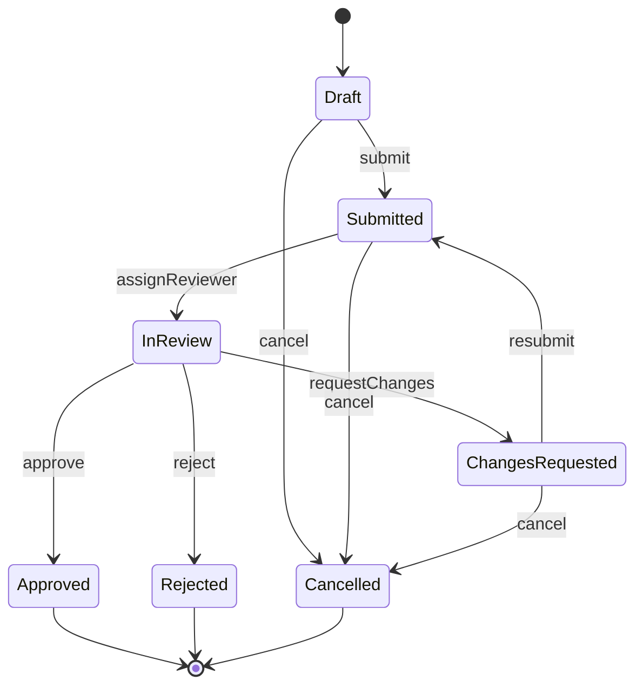
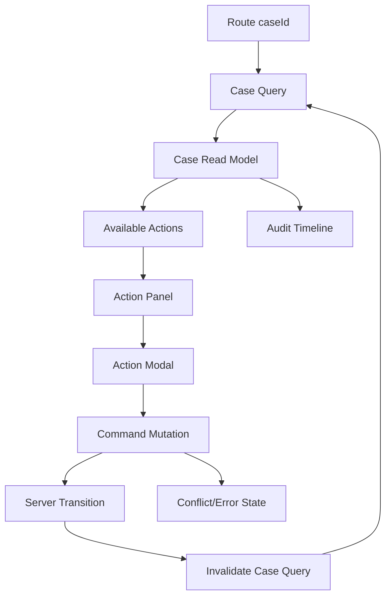

# Part 116 — Case Study: Approval Workflow UI

Approval workflow UI tampak sederhana: tombol Approve, Reject, Request Changes.

Di sistem production, UI seperti ini sering menjadi salah satu area paling risk-prone karena ia berhubungan dengan:

```txt
state transition
permission
audit trail
server authority
comments
attachments
concurrent reviewers
stale data
duplicate submit
optimistic feedback
rollback
regulatory defensibility
```

Kita tidak sedang membuat “button panel”. Kita sedang membuat **workflow client** yang merepresentasikan lifecycle domain object dengan aman.

---

## 1. Scenario

Kita punya `Case` yang harus melalui approval lifecycle.

```txt
Draft
Submitted
In Review
Changes Requested
Approved
Rejected
Cancelled
```

Aktor:

```txt
Case owner
Reviewer
Approver
Supervisor
System
```

Commands:

```txt
submit
assignReviewer
requestChanges
approve
reject
cancel
reopen
escalate
```

UI harus menampilkan:

```txt
current workflow state
actions available for current user
required comments/attachments per action
pending command state
audit timeline
conflict/stale data warning
permission explanation
action result feedback
```

---

## 2. Do Not Start from Buttons

Anti-pattern:

```tsx
{status === 'IN_REVIEW' && canApprove ? (
  <button onClick={approve}>Approve</button>
) : null}
```

Masalahnya:

- transition rule tersebar di JSX,
- permission bercampur dengan rendering,
- comments/validation action tidak punya model,
- audit requirement hilang,
- stale server state tidak ditangani,
- semua action terlihat seperti event lokal padahal command domain.

Mulai dari transition model.

---

## 3. Workflow as State Machine



UI harus membaca model ini sebagai data, bukan menyebarkan logic per component.

```ts
export type CaseWorkflowState =
  | 'draft'
  | 'submitted'
  | 'in_review'
  | 'changes_requested'
  | 'approved'
  | 'rejected'
  | 'cancelled';

export type CaseCommandType =
  | 'submit'
  | 'assignReviewer'
  | 'requestChanges'
  | 'resubmit'
  | 'approve'
  | 'reject'
  | 'cancel';

export type TransitionDefinition = {
  command: CaseCommandType;
  from: CaseWorkflowState[];
  to: CaseWorkflowState;
  label: string;
  intent: 'primary' | 'secondary' | 'danger';
  requiresComment?: boolean;
  requiresAttachment?: boolean;
  permission: string;
};
```

Transition table:

```ts
export const transitions: TransitionDefinition[] = [
  {
    command: 'submit',
    from: ['draft', 'changes_requested'],
    to: 'submitted',
    label: 'Submit',
    intent: 'primary',
    permission: 'case.submit',
  },
  {
    command: 'approve',
    from: ['in_review'],
    to: 'approved',
    label: 'Approve',
    intent: 'primary',
    permission: 'case.approve',
  },
  {
    command: 'reject',
    from: ['in_review'],
    to: 'rejected',
    label: 'Reject',
    intent: 'danger',
    permission: 'case.reject',
    requiresComment: true,
  },
  {
    command: 'requestChanges',
    from: ['in_review'],
    to: 'changes_requested',
    label: 'Request changes',
    intent: 'secondary',
    permission: 'case.request_changes',
    requiresComment: true,
  },
];
```

---

## 4. Server Is the Authority

The client may predict available actions, but the server decides.

```txt
Client transition model = UX/read model.
Server transition model = authority.
```

The API should return action availability as part of the case read model.

```ts
export type CaseReadModel = {
  id: string;
  version: number;
  status: CaseWorkflowState;
  title: string;
  owner: UserSummary;
  assignedReviewer?: UserSummary;
  availableActions: AvailableAction[];
  auditEvents: AuditEvent[];
  requiredChecks: RequiredCheck[];
};

export type AvailableAction = {
  command: CaseCommandType;
  label: string;
  enabled: boolean;
  disabledReason?: string;
  requiresComment?: boolean;
  requiresAttachment?: boolean;
  confirm?: {
    title: string;
    message: string;
  };
};
```

Kenapa server harus mengirim available actions?

```txt
permission dapat berubah
case dapat berubah oleh reviewer lain
business rule dapat bergantung pada server-only data
audit/authorization harus defensible
client tidak boleh menjadi sumber kebenaran workflow
```

Client transition table tetap berguna untuk:

```txt
local rendering consistency
type-safe UI
fallback skeleton
unit test scenario
storybook state lab
```

Tapi server response menang.

---

## 5. State Topology

Approval workflow UI punya beberapa state layer.

| State | Owner | Notes |
|---|---|---|
| Case read model | server-state cache | authority snapshot |
| Available actions | server read model | permission + workflow derived server-side |
| Action modal state | local/workflow state | comment/attachment/confirm |
| Pending command | mutation state | command lifecycle |
| Optimistic UI | mutation/workflow overlay | optional, not authority |
| Audit timeline | server-state cache | append-only read model |
| Form/comment draft | local state | reset after command |
| Conflict state | command result | stale version/etag |

Diagram:



---

## 6. Page Orchestration Layer

Keep the page as wiring boundary.

```tsx
export function CaseApprovalPage() {
  const { caseId } = useParams();
  const query = useCaseQuery(caseId);
  const workflow = useApprovalWorkflow({ caseId });

  if (query.isLoading) return <CaseSkeleton />;
  if (query.isError) return <CaseLoadError error={query.error} />;

  const caseModel = query.data;

  return (
    <PageLayout>
      <CaseHeader caseModel={caseModel} />
      <CaseStatusCard caseModel={caseModel} />
      <RequiredChecksPanel checks={caseModel.requiredChecks} />

      <ApprovalActionPanel
        actions={caseModel.availableActions}
        pendingCommand={workflow.pendingCommand}
        onActionSelected={workflow.openAction}
      />

      <AuditTimeline events={caseModel.auditEvents} />

      <ApprovalActionDialog
        state={workflow.dialogState}
        onCommentChanged={workflow.setComment}
        onAttachmentAdded={workflow.addAttachment}
        onCancel={workflow.closeDialog}
        onConfirm={workflow.confirmAction}
      />
    </PageLayout>
  );
}
```

The page wires:

```txt
route state
server state
workflow local state
mutation command
view components
```

The page should not contain transition if-else soup.

---

## 7. Workflow Hook

```ts
export type ApprovalDialogState =
  | { tag: 'closed' }
  | {
      tag: 'editing';
      action: AvailableAction;
      comment: string;
      attachments: AttachmentDraft[];
      validationErrors: string[];
    }
  | {
      tag: 'submitting';
      action: AvailableAction;
      comment: string;
      attachments: AttachmentDraft[];
      requestId: string;
    }
  | {
      tag: 'failed';
      action: AvailableAction;
      comment: string;
      attachments: AttachmentDraft[];
      error: CommandError;
    };
```

Events:

```ts
export type ApprovalWorkflowEvent =
  | { type: 'ACTION_OPENED'; action: AvailableAction }
  | { type: 'COMMENT_CHANGED'; comment: string }
  | { type: 'ATTACHMENT_ADDED'; attachment: AttachmentDraft }
  | { type: 'DIALOG_CLOSED' }
  | { type: 'SUBMIT_ATTEMPTED'; requestId: string }
  | { type: 'SUBMIT_FAILED'; requestId: string; error: CommandError }
  | { type: 'SUBMIT_SUCCEEDED'; requestId: string };
```

Reducer:

```ts
function approvalWorkflowReducer(
  state: ApprovalDialogState,
  event: ApprovalWorkflowEvent,
): ApprovalDialogState {
  switch (event.type) {
    case 'ACTION_OPENED':
      return {
        tag: 'editing',
        action: event.action,
        comment: '',
        attachments: [],
        validationErrors: [],
      };

    case 'COMMENT_CHANGED':
      if (state.tag !== 'editing' && state.tag !== 'failed') return state;
      return { ...state, tag: 'editing', comment: event.comment, validationErrors: [] };

    case 'ATTACHMENT_ADDED':
      if (state.tag !== 'editing' && state.tag !== 'failed') return state;
      return { ...state, tag: 'editing', attachments: [...state.attachments, event.attachment] };

    case 'SUBMIT_ATTEMPTED':
      if (state.tag !== 'editing' && state.tag !== 'failed') return state;
      return { ...state, tag: 'submitting', requestId: event.requestId };

    case 'SUBMIT_FAILED':
      if (state.tag !== 'submitting' || state.requestId !== event.requestId) return state;
      return {
        tag: 'failed',
        action: state.action,
        comment: state.comment,
        attachments: state.attachments,
        error: event.error,
      };

    case 'SUBMIT_SUCCEEDED':
      if (state.tag !== 'submitting' || state.requestId !== event.requestId) return state;
      return { tag: 'closed' };

    case 'DIALOG_CLOSED':
      return { tag: 'closed' };

    default: {
      const _exhaustive: never = event;
      return _exhaustive;
    }
  }
}
```

This reducer prevents impossible dialog states:

```txt
closed but has pending request
submitting but no selected action
failed but no action context
success from stale request closes current dialog
```

---

## 8. Command Boundary

Workflow action is not local event. It is a domain command.

```ts
export type ExecuteCaseCommandInput = {
  caseId: string;
  caseVersion: number;
  command: CaseCommandType;
  comment?: string;
  attachmentIds?: string[];
  idempotencyKey: string;
};

export type ExecuteCaseCommandResult =
  | { ok: true; newStatus: CaseWorkflowState; auditEventId: string }
  | { ok: false; kind: 'validation_failed'; message: string; fieldErrors?: Record<string, string> }
  | { ok: false; kind: 'forbidden'; message: string }
  | { ok: false; kind: 'conflict'; message: string; latestCase: CaseReadModel }
  | { ok: false; kind: 'failed'; message: string };
```

Command function:

```ts
async function executeCaseCommand(
  input: ExecuteCaseCommandInput,
): Promise<ExecuteCaseCommandResult> {
  const response = await fetch(`/api/cases/${input.caseId}/commands`, {
    method: 'POST',
    headers: {
      'Content-Type': 'application/json',
      'Idempotency-Key': input.idempotencyKey,
    },
    body: JSON.stringify(input),
  });

  return response.json();
}
```

Note `caseVersion`. This is critical for conflict detection.

---

## 9. TanStack Query Integration

Query key:

```ts
export const caseKeys = {
  all: ['cases'] as const,
  detail: (caseId: string) => [...caseKeys.all, 'detail', caseId] as const,
  audit: (caseId: string) => [...caseKeys.all, 'audit', caseId] as const,
};
```

Mutation:

```ts
function useExecuteCaseCommand() {
  const queryClient = useQueryClient();

  return useMutation({
    mutationFn: executeCaseCommand,
    onSuccess(result, variables) {
      if (result.ok) {
        queryClient.invalidateQueries({ queryKey: caseKeys.detail(variables.caseId) });
        queryClient.invalidateQueries({ queryKey: caseKeys.audit(variables.caseId) });
        return;
      }

      if (result.kind === 'conflict') {
        queryClient.setQueryData(caseKeys.detail(variables.caseId), result.latestCase);
      }
    },
  });
}
```

Do not manually patch complicated approval read models unless the server response is explicit and complete.

Default safe policy:

```txt
After workflow transition, invalidate case detail and audit timeline.
Use optimistic UI only for low-risk visual feedback.
```

---

## 10. useApprovalWorkflow Hook

```ts
export function useApprovalWorkflow({ caseId }: { caseId: string }) {
  const caseQuery = useCaseQuery(caseId);
  const executeCommand = useExecuteCaseCommand();
  const [dialogState, dispatch] = React.useReducer(approvalWorkflowReducer, { tag: 'closed' });

  const openAction = React.useCallback((action: AvailableAction) => {
    dispatch({ type: 'ACTION_OPENED', action });
  }, []);

  const setComment = React.useCallback((comment: string) => {
    dispatch({ type: 'COMMENT_CHANGED', comment });
  }, []);

  const addAttachment = React.useCallback((attachment: AttachmentDraft) => {
    dispatch({ type: 'ATTACHMENT_ADDED', attachment });
  }, []);

  const closeDialog = React.useCallback(() => {
    dispatch({ type: 'DIALOG_CLOSED' });
  }, []);

  const confirmAction = React.useCallback(async () => {
    if (dialogState.tag !== 'editing' && dialogState.tag !== 'failed') return;
    if (!caseQuery.data) return;

    const validationErrors = validateActionInput(dialogState.action, {
      comment: dialogState.comment,
      attachments: dialogState.attachments,
    });

    if (validationErrors.length > 0) {
      // Could be modeled as event if you want full reducer purity for validation result.
      return;
    }

    const requestId = crypto.randomUUID();
    dispatch({ type: 'SUBMIT_ATTEMPTED', requestId });

    const result = await executeCommand.mutateAsync({
      caseId,
      caseVersion: caseQuery.data.version,
      command: dialogState.action.command,
      comment: dialogState.comment,
      attachmentIds: dialogState.attachments.map((item) => item.id),
      idempotencyKey: requestId,
    });

    if (result.ok) {
      dispatch({ type: 'SUBMIT_SUCCEEDED', requestId });
      return;
    }

    dispatch({ type: 'SUBMIT_FAILED', requestId, error: result });
  }, [caseId, caseQuery.data, dialogState, executeCommand]);

  return {
    dialogState,
    pendingCommand: dialogState.tag === 'submitting' ? dialogState.action.command : null,
    openAction,
    setComment,
    addAttachment,
    closeDialog,
    confirmAction,
  };
}
```

Caveat: `confirmAction` closes over `dialogState`. This is fine if dependencies are correct. For very strict event modeling, make `confirmAction` read current state through reducer command pattern or actor.

---

## 11. Action Panel

```tsx
export function ApprovalActionPanel({
  actions,
  pendingCommand,
  onActionSelected,
}: {
  actions: AvailableAction[];
  pendingCommand: CaseCommandType | null;
  onActionSelected: (action: AvailableAction) => void;
}) {
  return (
    <section aria-labelledby="approval-actions-title">
      <h2 id="approval-actions-title">Available actions</h2>

      <div>
        {actions.map((action) => (
          <button
            key={action.command}
            type="button"
            disabled={!action.enabled || pendingCommand != null}
            aria-describedby={!action.enabled && action.disabledReason ? `${action.command}-reason` : undefined}
            onClick={() => onActionSelected(action)}
          >
            {pendingCommand === action.command ? 'Working…' : action.label}
          </button>
        ))}
      </div>

      {actions.map((action) =>
        !action.enabled && action.disabledReason ? (
          <p key={`${action.command}-reason`} id={`${action.command}-reason`}>
            {action.disabledReason}
          </p>
        ) : null,
      )}
    </section>
  );
}
```

Do not hide all disabled actions by default.

For regulated/internal systems, disabled with reason is often better:

```txt
You cannot approve because required risk checks are incomplete.
You cannot reject because you are the case owner.
You cannot submit because required documents are missing.
```

This improves explainability and reduces support burden.

---

## 12. Action Dialog

```tsx
export function ApprovalActionDialog({
  state,
  onCommentChanged,
  onAttachmentAdded,
  onCancel,
  onConfirm,
}: {
  state: ApprovalDialogState;
  onCommentChanged: (comment: string) => void;
  onAttachmentAdded: (attachment: AttachmentDraft) => void;
  onCancel: () => void;
  onConfirm: () => void;
}) {
  if (state.tag === 'closed') return null;

  const isSubmitting = state.tag === 'submitting';
  const action = state.action;

  return (
    <Dialog
      title={action.confirm?.title ?? action.label}
      onClose={isSubmitting ? undefined : onCancel}
    >
      {action.confirm ? <p>{action.confirm.message}</p> : null}

      {action.requiresComment ? (
        <label>
          Comment
          <textarea
            value={state.comment}
            disabled={isSubmitting}
            onChange={(event) => onCommentChanged(event.target.value)}
          />
        </label>
      ) : null}

      {action.requiresAttachment ? (
        <AttachmentPicker
          disabled={isSubmitting}
          onAttachmentAdded={onAttachmentAdded}
        />
      ) : null}

      {state.tag === 'failed' ? (
        <div role="alert">{state.error.message}</div>
      ) : null}

      <button type="button" disabled={isSubmitting} onClick={onCancel}>
        Cancel
      </button>

      <button type="button" disabled={isSubmitting} onClick={onConfirm}>
        {isSubmitting ? 'Submitting…' : action.label}
      </button>
    </Dialog>
  );
}
```

Dialog state is local workflow state, not server state.

---

## 13. Optimistic UI Policy

Approval workflows are usually high-integrity. Be careful with optimism.

Avoid this default:

```txt
Immediately show Approved before server confirms.
```

Better default:

```txt
Show command pending.
Disable conflicting actions.
Optionally show optimistic timeline item as pending.
Invalidate/read server authority after success.
```

Optimistic timeline item:

```ts
export type TimelineItem =
  | AuditEvent
  | {
      kind: 'optimistic';
      id: string;
      command: CaseCommandType;
      actorName: string;
      createdAt: string;
      status: 'pending' | 'failed';
    };
```

Visual language:

```txt
Pending approval submitted…
Not final until server confirms.
```

Use full optimistic status transition only when:

```txt
operation is reversible
conflict probability is low
server invariant is simple
UX cost of waiting is high
rollback is clearly handled
```

Approval/rejection usually deserves conservative optimism.

---

## 14. Conflict Handling

Concurrent reviewers are common.

Scenario:

```txt
Reviewer A opens case version 12.
Reviewer B approves case, server moves version to 13.
Reviewer A clicks Reject using version 12.
Server rejects command with conflict.
```

UI should:

```txt
stop pending state
show conflict explanation
refresh case read model
show latest audit event
ask user to review latest state
not silently retry destructive command
```

Conflict UI:

```tsx
function ConflictMessage({ latestCase }: { latestCase: CaseReadModel }) {
  return (
    <div role="alert">
      <h2>This case changed while you were reviewing it</h2>
      <p>
        Current status is now <strong>{latestCase.status}</strong>. Review the latest
        timeline before taking another action.
      </p>
    </div>
  );
}
```

Never hide conflict by simply refetching and pretending nothing happened.

---

## 15. Permission Drift

Permission can change between page load and click.

The server may return:

```ts
{ ok: false, kind: 'forbidden', message: 'You are no longer assigned as approver.' }
```

UI response:

```txt
show explanation
invalidate case query
refresh available actions
clear pending command
keep user on page unless access to read model also revoked
```

This is not a crash. It is a normal workflow outcome.

---

## 16. Audit Timeline

Audit timeline is not cosmetic.

It is the user-visible projection of workflow facts.

```ts
export type AuditEvent = {
  id: string;
  type:
    | 'case_submitted'
    | 'reviewer_assigned'
    | 'changes_requested'
    | 'case_approved'
    | 'case_rejected'
    | 'case_cancelled';
  actor: UserSummary;
  createdAt: string;
  comment?: string;
  attachments?: AttachmentSummary[];
  fromStatus?: CaseWorkflowState;
  toStatus?: CaseWorkflowState;
};
```

Renderer:

```tsx
function AuditTimeline({ events }: { events: AuditEvent[] }) {
  return (
    <section aria-labelledby="audit-title">
      <h2 id="audit-title">Timeline</h2>
      <ol>
        {events.map((event) => (
          <li key={event.id}>
            <strong>{formatAuditEventTitle(event)}</strong>
            <p>{event.actor.name} · {formatDateTime(event.createdAt)}</p>
            {event.comment ? <blockquote>{event.comment}</blockquote> : null}
          </li>
        ))}
      </ol>
    </section>
  );
}
```

Do not build timeline purely from client transitions. Use server audit events.

---

## 17. Required Checks Panel

Approval often depends on checks.

```ts
export type RequiredCheck = {
  id: string;
  label: string;
  status: 'passed' | 'failed' | 'pending' | 'not_applicable';
  blocking: boolean;
  message?: string;
};
```

UI:

```tsx
function RequiredChecksPanel({ checks }: { checks: RequiredCheck[] }) {
  return (
    <section aria-labelledby="checks-title">
      <h2 id="checks-title">Required checks</h2>
      <ul>
        {checks.map((check) => (
          <li key={check.id}>
            <span>{check.label}</span>
            <span>{check.status}</span>
            {check.message ? <p>{check.message}</p> : null}
          </li>
        ))}
      </ul>
    </section>
  );
}
```

Action disabled reason should point to checks when relevant.

```txt
Approve disabled because Sanctions check is pending.
Reject enabled because rejection does not require all checks to pass.
```

These are domain rules. Do not hard-code them in buttons.

---

## 18. XState Version

For complex workflows, XState/actor model can replace local reducer.

```ts
import { setup, assign, fromPromise } from 'xstate';

export const approvalMachine = setup({
  types: {
    context: {} as {
      selectedAction?: AvailableAction;
      comment: string;
      attachments: AttachmentDraft[];
      error?: CommandError;
    },
    events: {} as
      | { type: 'OPEN'; action: AvailableAction }
      | { type: 'COMMENT_CHANGED'; comment: string }
      | { type: 'CONFIRM'; caseModel: CaseReadModel }
      | { type: 'CANCEL' },
  },
  actors: {
    executeCommand: fromPromise(async ({ input }) => {
      return executeCaseCommand(input as ExecuteCaseCommandInput);
    }),
  },
}).createMachine({
  id: 'approvalDialog',
  initial: 'closed',
  context: {
    comment: '',
    attachments: [],
  },
  states: {
    closed: {
      on: {
        OPEN: {
          target: 'editing',
          actions: assign({
            selectedAction: ({ event }) => event.action,
            comment: '',
            attachments: [],
            error: undefined,
          }),
        },
      },
    },
    editing: {
      on: {
        COMMENT_CHANGED: {
          actions: assign({ comment: ({ event }) => event.comment }),
        },
        CONFIRM: 'submitting',
        CANCEL: 'closed',
      },
    },
    submitting: {
      invoke: {
        src: 'executeCommand',
        input: ({ context, event }) => {
          if (event.type !== 'CONFIRM' || !context.selectedAction) {
            throw new Error('Invalid submit event');
          }

          return {
            caseId: event.caseModel.id,
            caseVersion: event.caseModel.version,
            command: context.selectedAction.command,
            comment: context.comment,
            attachmentIds: context.attachments.map((item) => item.id),
            idempotencyKey: crypto.randomUUID(),
          };
        },
        onDone: 'closed',
        onError: {
          target: 'failed',
          actions: assign({ error: ({ event }) => event.error as CommandError }),
        },
      },
    },
    failed: {
      on: {
        COMMENT_CHANGED: {
          target: 'editing',
          actions: assign({ comment: ({ event }) => event.comment, error: undefined }),
        },
        CONFIRM: 'submitting',
        CANCEL: 'closed',
      },
    },
  },
});
```

Use XState when:

```txt
workflow has multiple states
async services have lifecycle
there are guarded transitions
there are nested/parallel flows
team benefits from visual/statechart model
```

Do not use XState just to toggle a modal.

---

## 19. Accessibility and Human Factors

Approval actions have consequences. UI must reduce accidental action.

Checklist:

```txt
Dangerous actions have confirmation.
Dialog focus is managed.
Escape/backdrop policy is explicit.
Required comment has label and validation error.
Pending state is visible and disables duplicate submit.
Disabled action explains why.
Timeline is readable by screen readers.
Conflict message uses role=alert or equivalent.
```

Do not rely on color only for status.

```tsx
<StatusBadge status="approved" aria-label="Status: Approved" />
```

---

## 20. Testing Matrix

| Layer | Test | What to Prove |
|---|---|---|
| Transition table | unit | each command valid only from allowed states |
| Available action mapping | unit | permission/status/checks produce correct actions |
| Workflow reducer | unit | dialog states cannot become impossible |
| Command API adapter | integration | payload includes version/idempotency/comment |
| Mutation integration | integration | success invalidates detail/audit queries |
| Conflict path | integration | stale command shows conflict and refreshes case |
| Permission drift | integration | forbidden result clears pending and refreshes actions |
| Action panel | component | disabled action reason is visible/accessible |
| Dialog | component | required comment validation and pending state |
| Timeline | component | events render in order with actor/time/comment |
| End-to-end | journey | reviewer approves/rejects/request changes correctly |

Reducer test:

```ts
it('does not close a newer dialog from stale success', () => {
  const state: ApprovalDialogState = {
    tag: 'submitting',
    requestId: 'new',
    action: approveAction,
    comment: '',
    attachments: [],
  };

  const next = approvalWorkflowReducer(state, {
    type: 'SUBMIT_SUCCEEDED',
    requestId: 'old',
  });

  expect(next).toBe(state);
});
```

Conflict integration scenario:

```txt
Given case version 12 is in_review
And available action Reject is enabled
When another reviewer approves version 12
And current user attempts Reject with version 12
Then server returns conflict with latest case version 13
And UI shows conflict message
And available actions are refreshed
And stale dialog does not submit again automatically
```

---

## 21. Observability

Approval workflow observability should record transitions, not raw sensitive data.

```ts
export type ApprovalTelemetryEvent =
  | {
      type: 'approval_action_opened';
      caseId: string;
      command: CaseCommandType;
      caseStatus: CaseWorkflowState;
      correlationId: string;
    }
  | {
      type: 'approval_command_submitted';
      caseId: string;
      command: CaseCommandType;
      caseVersion: number;
      correlationId: string;
    }
  | {
      type: 'approval_command_succeeded';
      caseId: string;
      command: CaseCommandType;
      durationMs: number;
      correlationId: string;
    }
  | {
      type: 'approval_command_failed';
      caseId: string;
      command: CaseCommandType;
      failureKind: string;
      correlationId: string;
    };
```

Dashboards should answer:

```txt
Which command fails most often?
How often do users hit stale/conflict?
Which disabled reasons block approvals most?
How long does submit -> success take?
How often are required comments missing?
Which workflow state has highest abandonment?
```

---

## 22. Failure Modes

### 22.1 UI derives actions locally and ignores server

Symptom:

```txt
button appears enabled but server rejects as forbidden/invalid
```

Fix:

```txt
server returns availableActions
client uses local transition model only for UX fallback/type safety
```

### 22.2 Duplicate submit

Fix:

```txt
pending command disables duplicate action
server receives idempotency key
mutation result guarded by requestId
```

### 22.3 Stale approval overwrites current state

Fix:

```txt
caseVersion/etag in command
server conflict response
client conflict UI
query refresh
```

### 22.4 Modal closes on failed command

Fix:

```txt
failed state keeps action/comment/attachments
user can retry or cancel
```

### 22.5 Audit timeline built from optimistic client state

Fix:

```txt
server audit events are authority
optimistic entries must be marked pending and reconciled
```

### 22.6 Permission hidden instead of explainable

Fix:

```txt
disabledReason in available action
explain blocked action when appropriate
```

### 22.7 Workflow logic spread across components

Fix:

```txt
transition table or state machine
workflow hook/actor as orchestration boundary
view components receive simple props
```

### 22.8 Comments/attachments not tied to command

Fix:

```txt
action dialog state includes required inputs
command payload includes attachment IDs and comment
server validates requirement again
```

---

## 23. Production Checklist

```txt
[ ] Server returns case status, version, available actions, and disabled reasons.
[ ] Client transition model is not authority.
[ ] Commands include caseVersion/etag.
[ ] Commands include idempotency key.
[ ] Dangerous actions require confirmation/comment when domain requires.
[ ] Pending command disables duplicate submit.
[ ] Stale/conflict response is explicit and visible.
[ ] Permission drift is treated as normal outcome.
[ ] Audit timeline comes from server events.
[ ] Optimistic UI is conservative and clearly marked.
[ ] Workflow reducer/machine prevents impossible dialog states.
[ ] Query invalidation refreshes case detail and audit timeline.
[ ] Accessibility covers action panel, dialog, errors, status, and timeline.
[ ] Tests cover success, validation, forbidden, conflict, duplicate, and retry paths.
[ ] Telemetry records command lifecycle and failure taxonomy.
```

---

## 24. The Real Lesson

Approval workflow UI is not a button problem. It is a **distributed state transition problem** with a human interface.

The client must make the workflow understandable and hard to misuse, but must not pretend to be the authority.

The strongest design is:

```txt
server owns workflow truth
client owns interaction workflow
transition table documents legal movement
availableActions explains what user can do now
command boundary handles async mutation
query cache refreshes read model
audit timeline preserves defensibility
```

If you keep these layers separate, approval workflows become testable and explainable instead of becoming nested conditionals scattered through JSX.
