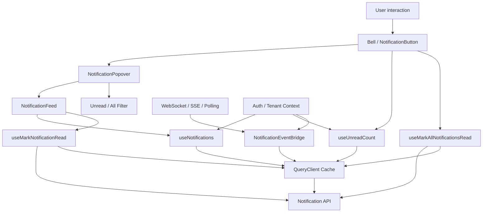

# Part 117 — Case Study: Notification Center

A notification center looks simple until it is real.

At demo level, it is a bell icon, a count, and a dropdown list.

At production level, it is a consistency problem:

- the server owns notification truth;
- the UI wants instant read/unread feedback;
- push events may arrive while the user is looking at stale cached data;
- multiple tabs may mark the same item read;
- route changes may close the popover but must not lose optimistic updates;
- unread count is a separate projection that can drift from the list;
- notification ordering may change while pagination is active;
- some notifications are permission-sensitive;
- some notifications are workflow commands, not just messages;
- some notifications become invalid when the underlying case/entity changes.

This part builds a notification center as an architecture exercise, not a widget tutorial.

We will treat the notification center as a **server-state surface with local interaction state and an optional external event stream**.

---

## 1. What We Are Building

The product requirement:

```txt
Users can open a notification center, see recent notifications, filter unread/all,
mark single notifications as read/unread, mark all as read, follow a notification
link, and see a badge count that updates when new notifications arrive.
```

The engineering requirement:

```txt
The UI must stay responsive, avoid duplicated state, tolerate stale server data,
handle optimistic read/unread operations, dedupe pushed events, and keep badge/list
consistency observable and debuggable.
```

The mistake is to model this as:

```tsx
const [notifications, setNotifications] = useState([]);
const [unreadCount, setUnreadCount] = useState(0);
```

That creates two client-owned mirrors of server projections.

The better model is:

```txt
Server owns notification records.
Query cache owns fetched server snapshots.
Mutation layer owns command lifecycle.
Local UI owns open/closed, selected filter, focus, and transient animation state.
External event bridge receives push events and invalidates/patches query cache.
```

---

## 2. State Topology

| State | Owner | Storage | Invalidated By | UI Reads From | Notes |
|---|---|---|---|---|---|
| Notification list | Server | TanStack Query cache | Push event, mutation, refetch, route focus | `useNotifications` | Server state, not local state |
| Unread count | Server projection | TanStack Query cache | Read/unread mutation, push event | `useUnreadCount` | May be separate endpoint for cheap badge |
| Popover open/closed | Current component/shell | Local state | User event, route change, Escape | local hook | Pure client UI state |
| Active filter | URL or local | URL if shareable, local if ephemeral | User event | route/search params or local state | Usually local for bell dropdown, URL for full page |
| Optimistic read state | Mutation lifecycle/cache patch | Query cache overlay or mutation variables | Success/error/settled | query cache or mutation state | Must rollback on failure |
| Realtime connection | External system | Effect-managed subscription | mount/unmount/auth change | event bridge | Never render-owned |
| Toast/new notification pulse | Client ephemeral | local/external UI store | timer/user dismiss | local/store | Not source of notification truth |
| Permission/capability | Server/session authority | context/query | session refresh/role change | permission hook | Do not trust frontend for authorization |

The key discipline:

```txt
Do not store the same server fact as independent React local state.
```

You can cache it. You can optimistically patch it. You can display derived projections.

But once the client becomes the independent authority for server-owned data, drift begins.

---

## 3. High-Level Architecture



The architecture has four layers:

1. **View layer**: bell, popover, feed, row, empty state.
2. **Domain hook layer**: `useNotifications`, `useUnreadCount`, `useMarkRead`, `useMarkAllRead`.
3. **Cache/invalidation layer**: query keys, cache patching, invalidation, optimistic rollback.
4. **Event bridge layer**: WebSocket/SSE/polling integration that talks to the query client, not to arbitrary components.

---

## 4. Server Contract First

Before React code, define the server contract.

```ts
export type NotificationId = string;
export type NotificationKind =
  | 'case.assigned'
  | 'case.escalated'
  | 'case.comment.created'
  | 'approval.requested'
  | 'system.maintenance';

export type Notification = {
  id: NotificationId;
  tenantId: string;
  kind: NotificationKind;
  title: string;
  body?: string;
  entity?: {
    type: 'case' | 'approval' | 'system';
    id: string;
    displayId?: string;
  };
  href?: string;
  readAt: string | null;
  createdAt: string;
  priority: 'low' | 'normal' | 'high';
  actor?: {
    id: string;
    name: string;
  };
};

export type NotificationPage = {
  items: Notification[];
  nextCursor: string | null;
};

export type NotificationFilter = {
  status: 'all' | 'unread';
  kinds?: NotificationKind[];
};
```

The server should expose commands, not field patches:

```ts
export interface NotificationApi {
  listNotifications(input: {
    tenantId: string;
    filter: NotificationFilter;
    cursor?: string | null;
    limit: number;
  }): Promise<NotificationPage>;

  getUnreadCount(input: {
    tenantId: string;
  }): Promise<{ count: number; serverTime: string }>;

  markRead(input: {
    tenantId: string;
    notificationId: NotificationId;
    idempotencyKey: string;
  }): Promise<{ notificationId: NotificationId; readAt: string }>;

  markUnread(input: {
    tenantId: string;
    notificationId: NotificationId;
    idempotencyKey: string;
  }): Promise<{ notificationId: NotificationId; readAt: null }>;

  markAllRead(input: {
    tenantId: string;
    before?: string;
    idempotencyKey: string;
  }): Promise<{ readAt: string; affectedCount: number }>;
}
```

Why commands?

Because the business operation is not “set `readAt` to now in UI”.

It is:

```txt
For this authenticated principal and tenant, mark this notification read if still visible/valid,
record audit metadata if required, update unread projection, and return canonical server state.
```

The UI can optimistically predict the result. It cannot become the authority.

---

## 5. Query Key Design

Notification query keys are cache address schema.

Do not write random string keys throughout components.

```ts
export const notificationKeys = {
  root: ['notifications'] as const,

  tenant: (tenantId: string) =>
    [...notificationKeys.root, 'tenant', tenantId] as const,

  listRoot: (tenantId: string) =>
    [...notificationKeys.tenant(tenantId), 'list'] as const,

  list: (tenantId: string, filter: NotificationFilter) =>
    [...notificationKeys.listRoot(tenantId), canonicalizeFilter(filter)] as const,

  unreadCount: (tenantId: string) =>
    [...notificationKeys.tenant(tenantId), 'unread-count'] as const,
};

function canonicalizeFilter(filter: NotificationFilter) {
  return {
    status: filter.status,
    kinds: filter.kinds ? [...filter.kinds].sort() : undefined,
  };
}
```

Rules:

1. Include tenant/session scope.
2. Include every variable that changes server response.
3. Canonicalize arrays/filters so equivalent filters produce equivalent keys.
4. Keep list root separate from specific list key for broad invalidation.
5. Keep unread count separate because it is a projection with different cost/lifetime.

Bad key:

```ts
['notifications']
```

Good key:

```ts
['notifications', 'tenant', tenantId, 'list', { status: 'unread', kinds: ['case.assigned'] }]
```

---

## 6. Domain Query Hooks

The component should not call API functions directly.

It should call a domain hook.

```ts
import { useInfiniteQuery, useQuery } from '@tanstack/react-query';

export function useNotifications(input: {
  tenantId: string;
  filter: NotificationFilter;
  limit?: number;
}) {
  const limit = input.limit ?? 30;

  return useInfiniteQuery({
    queryKey: notificationKeys.list(input.tenantId, input.filter),
    initialPageParam: null as string | null,
    queryFn: ({ pageParam }) =>
      notificationApi.listNotifications({
        tenantId: input.tenantId,
        filter: input.filter,
        cursor: pageParam,
        limit,
      }),
    getNextPageParam: (lastPage) => lastPage.nextCursor,
    staleTime: 15_000,
    gcTime: 5 * 60_000,
  });
}

export function useUnreadCount(input: { tenantId: string }) {
  return useQuery({
    queryKey: notificationKeys.unreadCount(input.tenantId),
    queryFn: () => notificationApi.getUnreadCount(input),
    staleTime: 10_000,
  });
}
```

A notification center often uses `useInfiniteQuery` because notifications are append-heavy and cursor pagination avoids offset drift.

But the UI should not know the cache mechanics.

The UI should only know:

```ts
const notifications = data?.pages.flatMap((page) => page.items) ?? [];
```

That flattening belongs in a view-model hook.

```ts
export function useNotificationFeedModel(input: {
  tenantId: string;
  filter: NotificationFilter;
}) {
  const query = useNotifications(input);

  const notifications = query.data?.pages.flatMap((page) => page.items) ?? [];

  return {
    notifications,
    isInitialLoading: query.isLoading,
    isRefreshing: query.isFetching && !query.isLoading,
    hasMore: query.hasNextPage,
    loadMore: query.fetchNextPage,
    isLoadingMore: query.isFetchingNextPage,
    error: query.error,
  };
}
```

This small layer keeps UI components stable when cache strategy changes.

---

## 7. Local Interaction State

The popover open state is not server state.

```tsx
export function NotificationBell({ tenantId }: { tenantId: string }) {
  const [open, setOpen] = useState(false);
  const unreadCount = useUnreadCount({ tenantId });

  return (
    <Popover open={open} onOpenChange={setOpen}>
      <Popover.Trigger aria-label="Open notifications">
        <BellIcon />
        {unreadCount.data?.count ? (
          <Badge>{formatBadge(unreadCount.data.count)}</Badge>
        ) : null}
      </Popover.Trigger>

      <Popover.Content align="end">
        <NotificationCenter tenantId={tenantId} onNavigate={() => setOpen(false)} />
      </Popover.Content>
    </Popover>
  );
}
```

The filter can be local or URL state.

For a dropdown/popup:

```ts
const [filter, setFilter] = useState<NotificationFilter>({ status: 'all' });
```

For a full notifications page:

```ts
const [searchParams, setSearchParams] = useSearchParams();
const filter = parseNotificationFilter(searchParams);
```

The decision rule:

```txt
If the state should survive reload/share/back-forward, use URL.
If it is only a local affordance inside a transient popover, use local state.
```

---

## 8. Mark Read Optimistically

A read operation should feel instant.

But the server still decides truth.

```ts
import { useMutation, useQueryClient } from '@tanstack/react-query';

export function useMarkNotificationRead(input: { tenantId: string }) {
  const queryClient = useQueryClient();

  return useMutation({
    mutationFn: (notificationId: NotificationId) =>
      notificationApi.markRead({
        tenantId: input.tenantId,
        notificationId,
        idempotencyKey: crypto.randomUUID(),
      }),

    onMutate: async (notificationId) => {
      await queryClient.cancelQueries({
        queryKey: notificationKeys.tenant(input.tenantId),
      });

      const previousLists = queryClient.getQueriesData<InfiniteData<NotificationPage>>({
        queryKey: notificationKeys.listRoot(input.tenantId),
      });

      const previousCount = queryClient.getQueryData<{ count: number; serverTime: string }>(
        notificationKeys.unreadCount(input.tenantId),
      );

      const optimisticReadAt = new Date().toISOString();

      queryClient.setQueriesData<InfiniteData<NotificationPage>>(
        { queryKey: notificationKeys.listRoot(input.tenantId) },
        (old) => patchNotificationInInfiniteList(old, notificationId, (item) => ({
          ...item,
          readAt: item.readAt ?? optimisticReadAt,
        })),
      );

      const wasUnread = previousLists.some(([, data]) =>
        data?.pages.some((page) =>
          page.items.some((item) => item.id === notificationId && item.readAt === null),
        ),
      );

      if (wasUnread && previousCount) {
        queryClient.setQueryData(notificationKeys.unreadCount(input.tenantId), {
          ...previousCount,
          count: Math.max(0, previousCount.count - 1),
        });
      }

      return { previousLists, previousCount };
    },

    onError: (_error, _notificationId, context) => {
      for (const [key, data] of context?.previousLists ?? []) {
        queryClient.setQueryData(key, data);
      }

      if (context?.previousCount) {
        queryClient.setQueryData(
          notificationKeys.unreadCount(input.tenantId),
          context.previousCount,
        );
      }
    },

    onSettled: () => {
      queryClient.invalidateQueries({
        queryKey: notificationKeys.tenant(input.tenantId),
      });
    },
  });
}
```

The helper is deliberately pure:

```ts
function patchNotificationInInfiniteList(
  old: InfiniteData<NotificationPage> | undefined,
  notificationId: NotificationId,
  patch: (item: Notification) => Notification,
): InfiniteData<NotificationPage> | undefined {
  if (!old) return old;

  return {
    ...old,
    pages: old.pages.map((page) => ({
      ...page,
      items: page.items.map((item) =>
        item.id === notificationId ? patch(item) : item,
      ),
    })),
  };
}
```

Why `onSettled` invalidation if we already patched?

Because optimistic UI is a prediction. The server may:

- reject due to permission;
- return canonical timestamp;
- update unread projection differently;
- hide notification after workflow state changed;
- include side effects that alter related queries.

Optimistic patch gives responsiveness. Invalidation restores authority.

---

## 9. Mark All Read

`markAllRead` is harder than marking one item.

It affects:

- all loaded pages;
- unread count;
- unread filtered list;
- server notifications not currently loaded;
- future push events created before/after the command boundary.

Use a server boundary timestamp.

```ts
export function useMarkAllNotificationsRead(input: { tenantId: string }) {
  const queryClient = useQueryClient();

  return useMutation({
    mutationFn: () => {
      const before = new Date().toISOString();
      return notificationApi.markAllRead({
        tenantId: input.tenantId,
        before,
        idempotencyKey: crypto.randomUUID(),
      });
    },

    onMutate: async () => {
      await queryClient.cancelQueries({
        queryKey: notificationKeys.tenant(input.tenantId),
      });

      const previousLists = queryClient.getQueriesData<InfiniteData<NotificationPage>>({
        queryKey: notificationKeys.listRoot(input.tenantId),
      });

      const previousCount = queryClient.getQueryData<{ count: number; serverTime: string }>(
        notificationKeys.unreadCount(input.tenantId),
      );

      const optimisticReadAt = new Date().toISOString();

      queryClient.setQueriesData<InfiniteData<NotificationPage>>(
        { queryKey: notificationKeys.listRoot(input.tenantId) },
        (old) =>
          old
            ? {
                ...old,
                pages: old.pages.map((page) => ({
                  ...page,
                  items: page.items.map((item) => ({
                    ...item,
                    readAt: item.readAt ?? optimisticReadAt,
                  })),
                })),
              }
            : old,
      );

      if (previousCount) {
        queryClient.setQueryData(notificationKeys.unreadCount(input.tenantId), {
          ...previousCount,
          count: 0,
        });
      }

      return { previousLists, previousCount };
    },

    onError: (_error, _variables, context) => {
      for (const [key, data] of context?.previousLists ?? []) {
        queryClient.setQueryData(key, data);
      }

      if (context?.previousCount) {
        queryClient.setQueryData(
          notificationKeys.unreadCount(input.tenantId),
          context.previousCount,
        );
      }
    },

    onSettled: () => {
      queryClient.invalidateQueries({
        queryKey: notificationKeys.tenant(input.tenantId),
      });
    },
  });
}
```

The server-side `before` timestamp matters.

Without it, the command is ambiguous:

```txt
Did "mark all read" include notifications that arrived during the request?
```

A production command should define the cut line.

---

## 10. Push Event Bridge

A notification center usually receives push events from WebSocket, Server-Sent Events, or long polling.

Do not let every component subscribe independently.

Build one event bridge.

```tsx
export function NotificationEventBridge({ tenantId }: { tenantId: string }) {
  const queryClient = useQueryClient();

  useEffect(() => {
    const connection = notificationEvents.connect({ tenantId });

    const unsubscribe = connection.subscribe((event) => {
      applyNotificationEvent(queryClient, tenantId, event);
    });

    return () => {
      unsubscribe();
      connection.close();
    };
  }, [queryClient, tenantId]);

  return null;
}
```

The bridge is not visual.

It is a synchronization adapter:

```txt
external event stream → query cache invalidation/patch
```

Event model:

```ts
export type NotificationEvent =
  | {
      type: 'notification.created';
      eventId: string;
      notification: Notification;
    }
  | {
      type: 'notification.read';
      eventId: string;
      notificationId: NotificationId;
      readAt: string;
    }
  | {
      type: 'notification.deleted';
      eventId: string;
      notificationId: NotificationId;
    }
  | {
      type: 'notification.projection.changed';
      eventId: string;
    };
```

Event application:

```ts
function applyNotificationEvent(
  queryClient: QueryClient,
  tenantId: string,
  event: NotificationEvent,
) {
  if (isDuplicateEvent(event.eventId)) return;
  rememberEvent(event.eventId);

  switch (event.type) {
    case 'notification.created': {
      queryClient.setQueryData<{ count: number; serverTime: string }>(
        notificationKeys.unreadCount(tenantId),
        (old) => old ? { ...old, count: old.count + 1 } : old,
      );

      queryClient.invalidateQueries({
        queryKey: notificationKeys.listRoot(tenantId),
      });
      return;
    }

    case 'notification.read': {
      queryClient.setQueriesData<InfiniteData<NotificationPage>>(
        { queryKey: notificationKeys.listRoot(tenantId) },
        (old) => patchNotificationInInfiniteList(old, event.notificationId, (item) => ({
          ...item,
          readAt: item.readAt ?? event.readAt,
        })),
      );

      queryClient.invalidateQueries({
        queryKey: notificationKeys.unreadCount(tenantId),
      });
      return;
    }

    case 'notification.deleted': {
      queryClient.invalidateQueries({
        queryKey: notificationKeys.tenant(tenantId),
      });
      return;
    }

    case 'notification.projection.changed': {
      queryClient.invalidateQueries({
        queryKey: notificationKeys.tenant(tenantId),
      });
      return;
    }
  }
}
```

Patch when cheap and safe.

Invalidate when event semantics are broad or ambiguous.

---

## 11. External Store for Connection Status

Connection status is not a server query.

It is external client state.

```ts
type NotificationConnectionSnapshot = {
  status: 'connecting' | 'open' | 'closed' | 'error';
  lastEventAt: number | null;
};
```

You can expose this through `useSyncExternalStore`:

```ts
function createNotificationConnectionStore() {
  let snapshot: NotificationConnectionSnapshot = {
    status: 'closed',
    lastEventAt: null,
  };

  const listeners = new Set<() => void>();

  return {
    getSnapshot() {
      return snapshot;
    },
    subscribe(listener: () => void) {
      listeners.add(listener);
      return () => listeners.delete(listener);
    },
    set(next: NotificationConnectionSnapshot) {
      if (Object.is(snapshot, next)) return;
      snapshot = next;
      listeners.forEach((listener) => listener());
    },
  };
}
```

React adapter:

```ts
export function useNotificationConnectionStatus() {
  return useSyncExternalStore(
    notificationConnectionStore.subscribe,
    notificationConnectionStore.getSnapshot,
    notificationConnectionStore.getSnapshot,
  );
}
```

Keep the distinction clear:

```txt
Notification records: server state.
Connection state: external client state.
Popover/filter/focus: local UI state.
```

When these categories blur, bugs become expensive.

---

## 12. Badge Consistency

Unread badge is a projection.

It should not be calculated from the loaded list unless the product contract says the badge only counts loaded rows.

Bad:

```ts
const unreadCount = notifications.filter((n) => n.readAt === null).length;
```

This only counts loaded notifications.

Good:

```tsx
function NotificationBadge({ tenantId }: { tenantId: string }) {
  const count = useUnreadCount({ tenantId });

  if (!count.data?.count) return null;

  return <Badge aria-label={`${count.data.count} unread notifications`}>{formatBadge(count.data.count)}</Badge>;
}
```

Badge drift can happen when:

- list query and count query refetch at different times;
- optimistic update patches list but not count;
- push event increments count but list query is stale;
- `markAllRead` patches loaded list but not server projection;
- multiple tabs issue commands.

A robust system does both:

```txt
optimistically patch obvious local projections
then invalidate authoritative projections
```

---

## 13. Multi-Tab Sync

If user opens two tabs:

```txt
Tab A marks all read.
Tab B still shows unread badge.
```

Options:

1. Rely on focus refetch.
2. Use push events from server.
3. Use `BroadcastChannel` for local cross-tab notification.
4. Use storage event as fallback.

A minimal local bridge:

```ts
const channel = new BroadcastChannel('notifications');

export function publishLocalNotificationEvent(event: NotificationEvent) {
  channel.postMessage(event);
}

export function subscribeLocalNotificationEvents(
  listener: (event: NotificationEvent) => void,
) {
  const handleMessage = (message: MessageEvent<NotificationEvent>) => {
    listener(message.data);
  };

  channel.addEventListener('message', handleMessage);

  return () => {
    channel.removeEventListener('message', handleMessage);
  };
}
```

Then bridge it into the query cache just like server push.

But remember:

```txt
BroadcastChannel improves perceived consistency between tabs.
It does not replace server truth.
```

---

## 14. Notification Row Contract

A row is not allowed to own notification truth.

```tsx
type NotificationRowProps = {
  notification: Notification;
  onOpen: (notification: Notification) => void;
  onMarkRead: (id: NotificationId) => void;
  onMarkUnread: (id: NotificationId) => void;
};

export function NotificationRow({
  notification,
  onOpen,
  onMarkRead,
  onMarkUnread,
}: NotificationRowProps) {
  const unread = notification.readAt === null;

  return (
    <article
      data-unread={unread ? '' : undefined}
      aria-label={notification.title}
      className="notification-row"
    >
      <button className="notification-main" onClick={() => onOpen(notification)}>
        <NotificationIcon kind={notification.kind} priority={notification.priority} />
        <span className="notification-copy">
          <strong>{notification.title}</strong>
          {notification.body ? <span>{notification.body}</span> : null}
          <time dateTime={notification.createdAt}>{formatRelativeTime(notification.createdAt)}</time>
        </span>
      </button>

      {unread ? (
        <button onClick={() => onMarkRead(notification.id)}>Mark read</button>
      ) : (
        <button onClick={() => onMarkUnread(notification.id)}>Mark unread</button>
      )}
    </article>
  );
}
```

Row contract:

```txt
Input: canonical notification snapshot.
Output: intent callbacks.
No local mirror of read state.
No API call.
No query key knowledge.
```

That keeps the row reusable in:

- popover;
- full page;
- Storybook;
- tests;
- mobile layout;
- embedded entity activity panel.

---

## 15. Center Composition

```tsx
export function NotificationCenter({
  tenantId,
  onNavigate,
}: {
  tenantId: string;
  onNavigate?: () => void;
}) {
  const [filter, setFilter] = useState<NotificationFilter>({ status: 'all' });

  const feed = useNotificationFeedModel({ tenantId, filter });
  const markRead = useMarkNotificationRead({ tenantId });
  const markUnread = useMarkNotificationUnread({ tenantId });
  const markAllRead = useMarkAllNotificationsRead({ tenantId });

  function openNotification(notification: Notification) {
    if (notification.readAt === null) {
      markRead.mutate(notification.id);
    }

    if (notification.href) {
      onNavigate?.();
      navigate(notification.href);
    }
  }

  return (
    <section aria-label="Notifications" className="notification-center">
      <NotificationCenterHeader
        filter={filter}
        onFilterChange={setFilter}
        onMarkAllRead={() => markAllRead.mutate()}
        markAllReadDisabled={markAllRead.isPending}
      />

      {feed.isInitialLoading ? <NotificationSkeleton /> : null}

      {feed.error ? <NotificationError error={feed.error} /> : null}

      {!feed.isInitialLoading && feed.notifications.length === 0 ? (
        <NotificationEmptyState filter={filter} />
      ) : null}

      <div role="list" aria-busy={feed.isRefreshing}>
        {feed.notifications.map((notification) => (
          <div role="listitem" key={notification.id}>
            <NotificationRow
              notification={notification}
              onOpen={openNotification}
              onMarkRead={(id) => markRead.mutate(id)}
              onMarkUnread={(id) => markUnread.mutate(id)}
            />
          </div>
        ))}
      </div>

      {feed.hasMore ? (
        <button onClick={() => feed.loadMore()} disabled={feed.isLoadingMore}>
          {feed.isLoadingMore ? 'Loading…' : 'Load more'}
        </button>
      ) : null}
    </section>
  );
}
```

The center composes the domain hooks.

It does not expose query details to rows.

It does not mirror query data into local state.

---

## 16. Permission-Sensitive Notifications

Notifications often reveal sensitive information.

Do not rely on frontend filtering.

Server must ensure:

```txt
Only notifications visible to the authenticated principal are returned.
Notification links must still enforce authorization on navigation target.
Read/unread commands must verify ownership/visibility.
Push events must only be sent to authorized sessions.
```

Frontend can still improve UX:

```ts
type NotificationAction = {
  kind: 'open' | 'approve' | 'comment' | 'mark-read';
  disabledReason?: string;
};
```

A row can hide or disable actions based on capability snapshot:

```tsx
function NotificationActions({ notification }: { notification: Notification }) {
  const permissions = usePermissions();
  const canOpen = permissions.can('notification.open', notification);

  if (!canOpen.allowed) {
    return <Tooltip content={canOpen.reason}>Unavailable</Tooltip>;
  }

  return <Button>Open</Button>;
}
```

But the real rule remains:

```txt
Frontend permission controls UX.
Backend authorization controls truth.
```

---

## 17. Accessibility Contract

Notification center accessibility requirements:

- bell button has an accessible name;
- unread badge is announced meaningfully, not only visually;
- popover/dialog focus behavior is predictable;
- list uses semantic list/region where appropriate;
- row controls are keyboard reachable;
- time elements use `dateTime`;
- loading/refetch state uses `aria-busy` only where useful;
- new notification announcements should not spam screen reader users;
- destructive/bulk actions need clear labels.

Example:

```tsx
<button aria-label={`Open notifications${count ? `, ${count} unread` : ''}`}>
  <BellIcon aria-hidden="true" />
  {count ? <span aria-hidden="true">{formatBadge(count)}</span> : null}
</button>
```

For live announcements, be conservative:

```tsx
<div aria-live="polite" className="sr-only">
  {newNotificationMessage}
</div>
```

Do not announce every event in a high-volume system.

Batch messages:

```txt
5 new notifications
```

is better than five separate announcements.

---

## 18. Observability

A notification center needs domain observability, not only error logs.

Useful events:

```ts
type NotificationTelemetryEvent =
  | { type: 'notification_center.opened'; tenantId: string }
  | { type: 'notification_center.filtered'; status: 'all' | 'unread' }
  | { type: 'notification.opened'; notificationId: string; kind: NotificationKind }
  | { type: 'notification.mark_read.requested'; notificationId: string }
  | { type: 'notification.mark_read.failed'; notificationId: string; errorCode: string }
  | { type: 'notification.push.connected' }
  | { type: 'notification.push.disconnected'; reason: string }
  | { type: 'notification.badge_drift_detected'; listUnread: number; serverUnread: number };
```

Add a development-only consistency check:

```ts
function useNotificationConsistencyCheck(input: {
  tenantId: string;
  loadedNotifications: Notification[];
  serverUnreadCount?: number;
}) {
  useEffect(() => {
    if (process.env.NODE_ENV !== 'development') return;
    if (input.serverUnreadCount == null) return;

    const loadedUnread = input.loadedNotifications.filter((item) => item.readAt === null).length;

    if (loadedUnread > input.serverUnreadCount) {
      console.warn('Notification unread count drift', {
        loadedUnread,
        serverUnreadCount: input.serverUnreadCount,
      });
    }
  }, [input.loadedNotifications, input.serverUnreadCount]);
}
```

The condition `loadedUnread > serverUnreadCount` should almost never happen if the server count is global and the loaded set is a subset.

If it happens, you probably have stale cache, optimistic drift, or wrong tenant scope.

---

## 19. Testing Matrix

| Test Area | What to Verify |
|---|---|
| Query key factory | Same logical filter produces same key; tenant isolation exists |
| Feed hook | Flattens pages, exposes load more, handles empty/error/loading |
| Single mark read | Patches row and count optimistically; rolls back on error |
| Mark all read | Patches all loaded rows and count; invalidates tenant queries |
| Push event | Dedupe event IDs; invalidates/patches correct keys |
| Multi-tab event | Broadcast event updates cache in another tab |
| Row component | Emits intent; no API/cache dependency |
| Permission UI | Disabled/hidden behavior matches capability object |
| Accessibility | Bell label, keyboard row controls, live region policy |
| Race condition | Late refetch does not resurrect stale unread state without invalidation |

Example mutation test shape:

```ts
it('rolls back optimistic mark-read when mutation fails', async () => {
  const queryClient = createTestQueryClient();
  seedNotificationList(queryClient, {
    tenantId: 't1',
    notifications: [{ id: 'n1', readAt: null }],
  });
  seedUnreadCount(queryClient, { tenantId: 't1', count: 1 });

  mockNotificationApi.markRead.mockRejectedValueOnce(new Error('Forbidden'));

  const { result } = renderHook(
    () => useMarkNotificationRead({ tenantId: 't1' }),
    { wrapper: createQueryWrapper(queryClient) },
  );

  await act(async () => {
    result.current.mutate('n1');
  });

  expect(readNotification(queryClient, 't1', 'n1')?.readAt).toBeNull();
  expect(readUnreadCount(queryClient, 't1')).toBe(1);
});
```

This test does not assert implementation details like “`onMutate` was called”.

It asserts the contract:

```txt
failed optimistic mutation restores previous visible state.
```

---

## 20. Failure Modes

### 20.1 Badge Count Drift

Symptom:

```txt
Bell says 3 unread, list shows 0 unread.
```

Likely causes:

- count query not invalidated after mutation;
- list filter only shows loaded subset;
- optimistic patch changed list but not count;
- multiple tabs issued conflicting commands;
- tenant scope missing in key.

Fix:

```txt
Patch obvious optimistic projection, then invalidate authoritative tenant/count keys.
```

---

### 20.2 Duplicate Notifications

Symptom:

```txt
Same notification appears twice after push + refetch.
```

Likely causes:

- push event inserted item into first page and refetch also returned it;
- no dedupe by notification ID;
- cursor pagination not stable.

Fix:

```ts
function uniqueById(items: Notification[]) {
  const seen = new Set<string>();
  return items.filter((item) => {
    if (seen.has(item.id)) return false;
    seen.add(item.id);
    return true;
  });
}
```

But prefer server-stable cursor and refetch after broad push event.

---

### 20.3 Stale Read State Reappears

Symptom:

```txt
User marks read, UI flips to read, then refetch flips it back unread.
```

Possible truth:

- server rejected command;
- request raced with stale refetch;
- optimistic patch applied to wrong key;
- response from old session/tenant wrote to current cache.

Fix:

- cancel relevant queries before optimistic patch;
- include tenant/user scope in query keys;
- invalidate on settled;
- use request identity where needed;
- treat server rejection as authoritative and show error.

---

### 20.4 Notification Link 403

Symptom:

```txt
Notification visible, but clicking target returns forbidden.
```

Possible causes:

- permission changed after notification creation;
- notification fanout was not permission-aware;
- target entity moved tenant/workspace;
- notification link is stale.

Fix:

```txt
Accept that notification visibility and entity access are separate checks.
Show graceful “You no longer have access” state.
Invalidate notification after 403 if appropriate.
```

---

### 20.5 Event Bus Becomes State Manager

Symptom:

```txt
Notifications are modified by random event listeners throughout the app.
```

Fix:

```txt
Only the NotificationEventBridge applies notification events to query cache.
Components emit intents or commands, not ad-hoc cache writes.
```

---

## 21. Production Checklist

Before shipping a notification center, verify:

```txt
[ ] Query keys include tenant/user/session scope.
[ ] List and unread count have explicit invalidation rules.
[ ] Optimistic mark-read has rollback.
[ ] Mark-all-read has server-defined cutoff semantics.
[ ] Push events are deduped.
[ ] Event bridge is centralized.
[ ] Multiple tabs do not permanently drift.
[ ] Notification links handle stale permission gracefully.
[ ] Rows are intent-only and do not own server truth.
[ ] Badge accessibility label is meaningful.
[ ] High-volume live announcements are batched or suppressed.
[ ] QueryClient is isolated in tests.
[ ] Failure modes are observable with telemetry.
```

---

## 22. Mental Model Summary

A notification center is not a dropdown.

It is a small distributed system:

```txt
server projection
+ client query cache
+ optimistic command lifecycle
+ external event stream
+ local interaction state
+ permission-sensitive navigation
+ multi-tab consistency
```

The clean design is not “put notifications in global state”.

The clean design is:

```txt
Use server-state cache for notification records and unread count.
Use mutation lifecycle for read/unread commands.
Use query invalidation to restore server authority.
Use a centralized event bridge for push events.
Use local state only for local UI affordances.
Use telemetry to detect drift.
```

That is the difference between a bell icon and a production notification system.

---

## References

- TanStack Query — Optimistic Updates: https://tanstack.com/query/v5/docs/framework/react/guides/optimistic-updates
- TanStack Query — Invalidations from Mutations: https://tanstack.com/query/v5/docs/react/guides/invalidations-from-mutations
- React — `useSyncExternalStore`: https://react.dev/reference/react/useSyncExternalStore
- React — `useEffect`: https://react.dev/reference/react/useEffect
