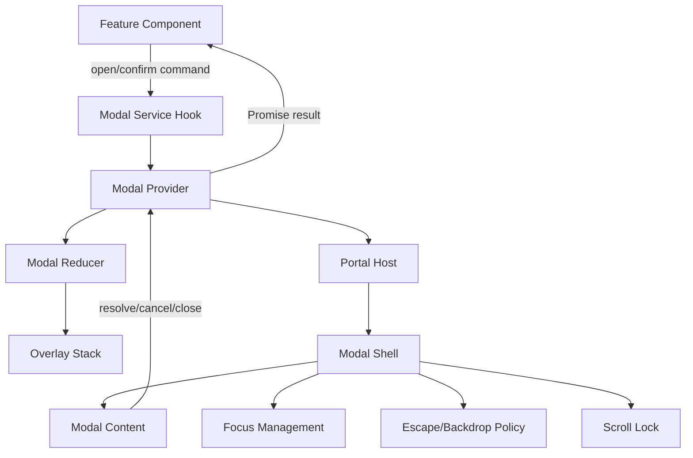

# Part 119 — Build a Modal Orchestrator

Modal terlihat sederhana sampai produk mulai punya:

- confirmation modal untuk destructive action,
- drawer untuk edit detail,
- command palette,
- nested modal,
- route-aware modal,
- optimistic mutation yang harus rollback,
- permission-aware action,
- focus trap,
- Escape policy,
- background inert,
- analytics/audit event,
- dan test yang harus deterministik.

Di titik itu, modal bukan lagi `isOpen` boolean di component lokal. Ia menjadi **workflow boundary**.

Kita akan membangun modal orchestrator dari scratch. Bukan karena harus selalu menulis sendiri, tetapi karena membangun sendiri memaksa kita memahami invariant yang harus dijaga oleh library mana pun.

> Mental model: modal orchestrator adalah **stateful command service** untuk overlay. Ia menerima command seperti `open`, `close`, `resolve`, `reject`, menjaga stack overlay, dan mengeksekusi side effect UI seperti focus return dan scroll lock di boundary yang eksplisit.

---

## 1. Problem Shape

Modal yang buruk biasanya mulai seperti ini:

```tsx
function UsersPage() {
  const [deleteOpen, setDeleteOpen] = useState(false);
  const [selectedUser, setSelectedUser] = useState<User | null>(null);

  return (
    <>
      <UserTable
        onDelete={(user) => {
          setSelectedUser(user);
          setDeleteOpen(true);
        }}
      />

      {deleteOpen && selectedUser && (
        <ConfirmDeleteModal
          user={selectedUser}
          onCancel={() => setDeleteOpen(false)}
          onConfirm={async () => {
            await deleteUser(selectedUser.id);
            setDeleteOpen(false);
          }}
        />
      )}
    </>
  );
}
```

Untuk satu modal, ini masih masuk akal. Untuk aplikasi enterprise, pola ini runtuh karena:

- modal state tersebar di banyak page,
- close semantics tidak konsisten,
- destructive confirmation tidak punya result contract,
- focus return sering hilang,
- Escape/backdrop behavior berbeda-beda,
- nested modal tidak punya stack policy,
- body scroll lock bocor,
- route change meninggalkan modal yatim,
- async close race dengan unmount,
- mutation lifecycle bercampur dengan UI component.

Masalah sebenarnya bukan "bagaimana render modal". Masalahnya adalah **siapa yang mengorkestrasi lifecycle modal**.

---

## 2. Target Architecture

Kita ingin API seperti ini:

```tsx
function UserDangerZone({ user }: { user: User }) {
  const modal = useModal();

  async function handleDelete() {
    const result = await modal.confirm({
      title: 'Delete user?',
      description: `This will permanently delete ${user.name}.`,
      confirmLabel: 'Delete',
      intent: 'danger',
    });

    if (!result.confirmed) return;

    await deleteUser(user.id);
  }

  return <button onClick={handleDelete}>Delete</button>;
}
```

Caller tidak perlu tahu:

- portal host berada di mana,
- modal DOM dirender ke node apa,
- stack index berapa,
- focus return dilakukan bagaimana,
- Escape/backdrop ditangani siapa,
- body scroll lock dihitung dari jumlah overlay aktif,
- promise resolve/reject disimpan di mana.

Itulah tugas orchestrator.

---

## 3. Boundary Diagram



The invariant is simple:

```txt
Feature code issues commands.
Provider owns overlay state.
Portal host renders overlays.
Modal shell owns accessibility mechanics.
Modal content owns domain-specific UI.
Result channel returns user decision.
```

---

## 4. Modal State Model

Jangan mulai dari component. Mulai dari state.

```ts
type ModalId = string;

type CloseReason =
  | 'confirm'
  | 'cancel'
  | 'escape'
  | 'backdrop'
  | 'programmatic'
  | 'route-change'
  | 'provider-unmount';

type ModalDescriptor = {
  id: ModalId;
  kind: 'confirm' | 'custom';
  title?: string;
  description?: string;
  props?: unknown;
  createdAt: number;
  closeOnEscape: boolean;
  closeOnBackdrop: boolean;
  restoreFocusTo?: HTMLElement | null;
};

type ModalState = {
  stack: ModalDescriptor[];
};
```

Kenapa `stack`, bukan satu `currentModal`?

Karena production UI sering punya:

- drawer membuka confirmation modal,
- command palette membuka detail dialog,
- modal error muncul di atas form modal,
- nested confirmation untuk unsaved changes.

Kalau produk melarang nested modal, tetap modelkan sebagai stack dengan policy `maxDepth = 1`. Ini lebih eksplisit daripada boolean scattered state.

---

## 5. Reducer as Overlay Transition System

Reducer menyimpan transisi. Side effect seperti focus dan promise resolution tidak dikerjakan di reducer.

```ts
type ModalEvent =
  | { type: 'OPEN'; modal: ModalDescriptor }
  | { type: 'CLOSE_TOP'; reason: CloseReason }
  | { type: 'CLOSE_BY_ID'; id: ModalId; reason: CloseReason }
  | { type: 'CLOSE_ALL'; reason: CloseReason };

function modalReducer(state: ModalState, event: ModalEvent): ModalState {
  switch (event.type) {
    case 'OPEN': {
      return {
        ...state,
        stack: [...state.stack, event.modal],
      };
    }

    case 'CLOSE_TOP': {
      return {
        ...state,
        stack: state.stack.slice(0, -1),
      };
    }

    case 'CLOSE_BY_ID': {
      return {
        ...state,
        stack: state.stack.filter((m) => m.id !== event.id),
      };
    }

    case 'CLOSE_ALL': {
      return {
        ...state,
        stack: [],
      };
    }

    default: {
      return state;
    }
  }
}
```

This reducer has no knowledge of DOM, Promise, analytics, focus, router, or mutation. That is intentional.

Reducer invariant:

```txt
OPEN adds exactly one descriptor.
CLOSE_TOP removes at most one descriptor.
CLOSE_BY_ID removes only that descriptor.
CLOSE_ALL empties the stack.
No transition mutates existing modal descriptor.
```

---

## 6. Result Channel

A modal often answers a question:

```txt
Did the user confirm?
What value did the form modal submit?
Why was the modal closed?
```

Boolean `isOpen` cannot express this. We need a result channel.

```ts
type ConfirmResult =
  | { confirmed: true; reason: 'confirm' }
  | { confirmed: false; reason: Exclude<CloseReason, 'confirm'> };

type Resolver = {
  resolve: (value: unknown) => void;
  reject: (reason?: unknown) => void;
};
```

Resolver map should live in a ref, not React state, because resolver functions are mutable imperative handles and should not trigger render.

```ts
const resolversRef = useRef(new Map<ModalId, Resolver>());
```

This is a good use of `useRef`:

- mutable cell,
- not rendered directly,
- used by event handlers/effects,
- not source of UI truth.

---

## 7. Provider Implementation

```tsx
import {
  createContext,
  useCallback,
  useContext,
  useEffect,
  useMemo,
  useReducer,
  useRef,
} from 'react';
import { createPortal } from 'react-dom';

type ModalApi = {
  confirm(input: ConfirmInput): Promise<ConfirmResult>;
  closeTop(reason?: CloseReason): void;
  closeAll(reason?: CloseReason): void;
};

const ModalContext = createContext<ModalApi | null>(null);

export function useModal(): ModalApi {
  const value = useContext(ModalContext);
  if (!value) {
    throw new Error('useModal must be used within <ModalProvider>');
  }
  return value;
}
```

Strict context is better than silent default behavior. Modal commands without provider should fail loudly in development and tests.

Now provider:

```tsx
export function ModalProvider({ children }: { children: React.ReactNode }) {
  const [state, dispatch] = useReducer(modalReducer, { stack: [] });
  const resolversRef = useRef(new Map<ModalId, Resolver>());

  const settle = useCallback((id: ModalId, value: unknown) => {
    const resolver = resolversRef.current.get(id);
    if (!resolver) return;
    resolver.resolve(value);
    resolversRef.current.delete(id);
  }, []);

  const closeById = useCallback(
    (id: ModalId, reason: CloseReason) => {
      dispatch({ type: 'CLOSE_BY_ID', id, reason });
      settle(id, { confirmed: false, reason });
    },
    [settle],
  );

  const closeTop = useCallback(
    (reason: CloseReason = 'programmatic') => {
      const top = state.stack.at(-1);
      if (!top) return;
      closeById(top.id, reason);
    },
    [state.stack, closeById],
  );

  const confirm = useCallback((input: ConfirmInput) => {
    const id = crypto.randomUUID();
    const restoreFocusTo = document.activeElement instanceof HTMLElement
      ? document.activeElement
      : null;

    const modal: ModalDescriptor = {
      id,
      kind: 'confirm',
      title: input.title,
      description: input.description,
      props: input,
      createdAt: Date.now(),
      closeOnEscape: input.closeOnEscape ?? true,
      closeOnBackdrop: input.closeOnBackdrop ?? true,
      restoreFocusTo,
    };

    dispatch({ type: 'OPEN', modal });

    return new Promise<ConfirmResult>((resolve, reject) => {
      resolversRef.current.set(id, { resolve, reject });
    });
  }, []);

  const closeAll = useCallback(
    (reason: CloseReason = 'programmatic') => {
      for (const modal of state.stack) {
        settle(modal.id, { confirmed: false, reason });
      }
      dispatch({ type: 'CLOSE_ALL', reason });
    },
    [state.stack, settle],
  );

  const api = useMemo<ModalApi>(
    () => ({ confirm, closeTop, closeAll }),
    [confirm, closeTop, closeAll],
  );

  return (
    <ModalContext.Provider value={api}>
      {children}
      <ModalPortalHost
        stack={state.stack}
        onConfirm={(id) => {
          dispatch({ type: 'CLOSE_BY_ID', id, reason: 'confirm' });
          settle(id, { confirmed: true, reason: 'confirm' });
        }}
        onCancel={(id, reason) => closeById(id, reason)}
      />
    </ModalContext.Provider>
  );
}
```

There is one important issue in this provider: `closeTop` depends on `state.stack`, so the `api` identity changes whenever stack changes.

For low-frequency modals, this is usually acceptable. For stricter API identity, move stack access into a ref:

```tsx
const stackRef = useRef<ModalDescriptor[]>([]);

useEffect(() => {
  stackRef.current = state.stack;
}, [state.stack]);

const closeTop = useCallback((reason: CloseReason = 'programmatic') => {
  const top = stackRef.current.at(-1);
  if (!top) return;
  closeById(top.id, reason);
}, [closeById]);
```

This makes `ModalApi` stable without hiding UI state in the ref. The source of rendered truth is still reducer state.

---

## 8. Portal Host

Portal host is a rendering boundary. It should not own workflow semantics.

```tsx
function ModalPortalHost(props: {
  stack: ModalDescriptor[];
  onConfirm(id: ModalId): void;
  onCancel(id: ModalId, reason: CloseReason): void;
}) {
  const host = getOrCreateModalRoot();

  return createPortal(
    <OverlayStack
      stack={props.stack}
      onConfirm={props.onConfirm}
      onCancel={props.onCancel}
    />,
    host,
  );
}

function getOrCreateModalRoot() {
  let node = document.getElementById('modal-root');
  if (!node) {
    node = document.createElement('div');
    node.id = 'modal-root';
    document.body.appendChild(node);
  }
  return node;
}
```

Portal changes DOM placement. It does not sever React tree semantics. Context and React event propagation still follow the React tree.

Design consequence:

```txt
A modal opened inside a provider can still read that provider's context.
A parent React handler may still receive events from portalled content.
DOM containment and React containment are not the same thing.
```

That last point matters for outside-click logic. Do not implement outside click by assuming DOM parent-child relationship equals React parent-child relationship.

---

## 9. Overlay Stack Rendering

```tsx
function OverlayStack(props: {
  stack: ModalDescriptor[];
  onConfirm(id: ModalId): void;
  onCancel(id: ModalId, reason: CloseReason): void;
}) {
  useBodyScrollLock(props.stack.length > 0);

  return (
    <div data-overlay-root="">
      {props.stack.map((modal, index) => {
        const isTop = index === props.stack.length - 1;

        return (
          <ModalShell
            key={modal.id}
            modal={modal}
            index={index}
            isTop={isTop}
            onConfirm={() => props.onConfirm(modal.id)}
            onCancel={(reason) => props.onCancel(modal.id, reason)}
          />
        );
      })}
    </div>
  );
}
```

Only the top modal should usually handle Escape and active focus trap.

Stack invariant:

```txt
Only top overlay handles global dismissal keyboard events.
Only top overlay is interactive by default.
Lower overlays are visually present but interaction-inert.
Scroll lock remains active while stack length > 0.
```

---

## 10. Body Scroll Lock

Minimal implementation:

```tsx
function useBodyScrollLock(enabled: boolean) {
  useEffect(() => {
    if (!enabled) return;

    const previousOverflow = document.body.style.overflow;
    document.body.style.overflow = 'hidden';

    return () => {
      document.body.style.overflow = previousOverflow;
    };
  }, [enabled]);
}
```

This is fine for a learning build. Production scroll lock gets harder because of:

- scrollbar compensation,
- iOS Safari behavior,
- nested locks from drawer + modal,
- preserving scroll position,
- body vs root scroll container,
- layout shift.

A robust implementation is reference-counted:

```ts
let lockCount = 0;
let previousOverflow = '';

function lockBodyScroll() {
  if (lockCount === 0) {
    previousOverflow = document.body.style.overflow;
    document.body.style.overflow = 'hidden';
  }
  lockCount += 1;
}

function unlockBodyScroll() {
  lockCount = Math.max(0, lockCount - 1);
  if (lockCount === 0) {
    document.body.style.overflow = previousOverflow;
  }
}
```

Then:

```tsx
function useBodyScrollLock(enabled: boolean) {
  useEffect(() => {
    if (!enabled) return;
    lockBodyScroll();
    return unlockBodyScroll;
  }, [enabled]);
}
```

Invariant:

```txt
No overlay should assume it is the only scroll lock owner.
Lock/unlock must be idempotent under Strict Mode mount/unmount checks.
```

---

## 11. Modal Shell

The shell handles generic modal mechanics:

- role/ARIA attributes,
- backdrop,
- Escape,
- focus initial placement,
- focus return,
- top-only dismissal,
- stack z-index,
- click propagation.

```tsx
function ModalShell(props: {
  modal: ModalDescriptor;
  index: number;
  isTop: boolean;
  onConfirm(): void;
  onCancel(reason: CloseReason): void;
}) {
  const titleId = `${props.modal.id}-title`;
  const descriptionId = `${props.modal.id}-description`;
  const panelRef = useRef<HTMLDivElement | null>(null);

  useEscapeKey({
    enabled: props.isTop && props.modal.closeOnEscape,
    onEscape: () => props.onCancel('escape'),
  });

  useInitialFocus({
    enabled: props.isTop,
    containerRef: panelRef,
  });

  useRestoreFocus({
    enabled: props.isTop,
    restoreTo: props.modal.restoreFocusTo,
  });

  return (
    <div
      className="overlay-layer"
      style={{ zIndex: 1000 + props.index }}
      aria-hidden={!props.isTop}
    >
      <div
        className="overlay-backdrop"
        onMouseDown={(event) => {
          if (!props.isTop) return;
          if (!props.modal.closeOnBackdrop) return;
          if (event.target !== event.currentTarget) return;
          props.onCancel('backdrop');
        }}
      />

      <div
        ref={panelRef}
        role="dialog"
        aria-modal="true"
        aria-labelledby={titleId}
        aria-describedby={props.modal.description ? descriptionId : undefined}
        className="modal-panel"
        onMouseDown={(event) => event.stopPropagation()}
      >
        {props.modal.kind === 'confirm' ? (
          <ConfirmModalContent
            id={props.modal.id}
            titleId={titleId}
            descriptionId={descriptionId}
            input={props.modal.props as ConfirmInput}
            onConfirm={props.onConfirm}
            onCancel={() => props.onCancel('cancel')}
          />
        ) : null}
      </div>
    </div>
  );
}
```

Notice the contract:

```txt
Shell owns modal mechanics.
Content owns copy and action buttons.
Provider owns result settlement.
Feature owns command after result.
```

---

## 12. Escape Key Hook

```tsx
function useEscapeKey(input: {
  enabled: boolean;
  onEscape(): void;
}) {
  const onEscapeRef = useRef(input.onEscape);

  useEffect(() => {
    onEscapeRef.current = input.onEscape;
  }, [input.onEscape]);

  useEffect(() => {
    if (!input.enabled) return;

    function handleKeyDown(event: KeyboardEvent) {
      if (event.key !== 'Escape') return;
      event.preventDefault();
      onEscapeRef.current();
    }

    document.addEventListener('keydown', handleKeyDown);
    return () => document.removeEventListener('keydown', handleKeyDown);
  }, [input.enabled]);
}
```

Why use a ref?

Because the subscription should depend on `enabled`, not resubscribe for every callback identity. The ref keeps the latest callback without turning event subscription into a dependency churn source.

---

## 13. Initial Focus

A modal should move focus into itself when opened.

Minimal implementation:

```tsx
function useInitialFocus(input: {
  enabled: boolean;
  containerRef: React.RefObject<HTMLElement | null>;
}) {
  useEffect(() => {
    if (!input.enabled) return;

    const container = input.containerRef.current;
    if (!container) return;

    const focusable = findFocusable(container);
    const target = focusable[0] ?? container;

    if (!container.hasAttribute('tabindex')) {
      container.setAttribute('tabindex', '-1');
    }

    target.focus();
  }, [input.enabled, input.containerRef]);
}
```

Focusable query:

```ts
function findFocusable(root: HTMLElement): HTMLElement[] {
  return Array.from(
    root.querySelectorAll<HTMLElement>([
      'a[href]',
      'button:not([disabled])',
      'textarea:not([disabled])',
      'input:not([disabled])',
      'select:not([disabled])',
      '[tabindex]:not([tabindex="-1"])',
    ].join(',')),
  ).filter((el) => !el.hasAttribute('disabled') && !el.getAttribute('aria-hidden'));
}
```

Production caveat:

```txt
Initial focus is not always the first button.
Large content may focus heading/container.
Destructive confirmation may focus cancel button.
Form modal may focus first invalid field.
```

Expose `initialFocusRef` or policy option when needed.

---

## 14. Focus Trap

A true modal should trap tab focus while open. Minimal trap:

```tsx
function useFocusTrap(input: {
  enabled: boolean;
  containerRef: React.RefObject<HTMLElement | null>;
}) {
  useEffect(() => {
    if (!input.enabled) return;

    const container = input.containerRef.current;
    if (!container) return;

    function handleKeyDown(event: KeyboardEvent) {
      if (event.key !== 'Tab') return;

      const focusable = findFocusable(container);
      if (focusable.length === 0) {
        event.preventDefault();
        container.focus();
        return;
      }

      const first = focusable[0];
      const last = focusable[focusable.length - 1];
      const active = document.activeElement;

      if (event.shiftKey && active === first) {
        event.preventDefault();
        last.focus();
      } else if (!event.shiftKey && active === last) {
        event.preventDefault();
        first.focus();
      }
    }

    document.addEventListener('keydown', handleKeyDown);
    return () => document.removeEventListener('keydown', handleKeyDown);
  }, [input.enabled, input.containerRef]);
}
```

Then call it inside `ModalShell`:

```tsx
useFocusTrap({
  enabled: props.isTop,
  containerRef: panelRef,
});
```

Production caveat: focus trap is deceptively hard around portals, shadow DOM, nested overlays, disabled controls, iframes, and browser quirks. In real products, use a battle-tested focus management primitive unless your team is ready to own accessibility edge cases.

---

## 15. Focus Return

When a modal closes, focus should usually return to the element that opened it.

```tsx
function useRestoreFocus(input: {
  enabled: boolean;
  restoreTo?: HTMLElement | null;
}) {
  useEffect(() => {
    if (!input.enabled) return;

    const restoreTo = input.restoreTo;

    return () => {
      if (!restoreTo) return;
      if (!document.contains(restoreTo)) return;
      restoreTo.focus();
    };
  }, [input.enabled, input.restoreTo]);
}
```

Important edge case:

```txt
The opener may unmount while modal is open.
```

Example: user opens detail modal from a row; while modal is open, query refetch removes the row. Returning focus to a stale element would fail. That is why `document.contains(restoreTo)` matters.

---

## 16. Confirm Modal Content

```tsx
type ConfirmInput = {
  title: string;
  description?: string;
  confirmLabel?: string;
  cancelLabel?: string;
  intent?: 'default' | 'danger';
  closeOnEscape?: boolean;
  closeOnBackdrop?: boolean;
};

function ConfirmModalContent(props: {
  id: string;
  titleId: string;
  descriptionId: string;
  input: ConfirmInput;
  onConfirm(): void;
  onCancel(): void;
}) {
  return (
    <div className="confirm-modal">
      <h2 id={props.titleId}>{props.input.title}</h2>

      {props.input.description ? (
        <p id={props.descriptionId}>{props.input.description}</p>
      ) : null}

      <div className="modal-actions">
        <button type="button" onClick={props.onCancel}>
          {props.input.cancelLabel ?? 'Cancel'}
        </button>
        <button
          type="button"
          data-intent={props.input.intent ?? 'default'}
          onClick={props.onConfirm}
        >
          {props.input.confirmLabel ?? 'Confirm'}
        </button>
      </div>
    </div>
  );
}
```

The content component does not resolve promises directly. It emits domain-neutral intent. Provider settles result.

---

## 17. Async Confirmation and Loading State

Now consider:

```tsx
const result = await modal.confirm(...);
if (result.confirmed) {
  await deleteUser(id);
}
```

Where does loading state live?

Two valid designs:

### Design A — caller owns mutation loading

```tsx
async function handleDelete() {
  const result = await modal.confirm(...);
  if (!result.confirmed) return;

  await mutation.mutateAsync({ id });
}
```

The modal closes before mutation starts. This is good for low-risk actions where post-confirm progress is shown elsewhere.

### Design B — modal owns async confirm action

```tsx
await modal.confirmAction({
  title: 'Delete user?',
  confirmLabel: 'Delete',
  action: () => deleteUser(id),
});
```

The modal remains open while action runs, disables buttons, and shows error if action fails. This is better for destructive actions where feedback must stay in context.

Implementation shape:

```ts
type ConfirmActionInput = ConfirmInput & {
  action(): Promise<void>;
};
```

But do not hide too much domain inside modal service. A modal service should not become your mutation framework.

Rule:

```txt
Modal may orchestrate user decision.
Mutation layer owns server command semantics.
Feature/application hook owns domain consequences.
```

---

## 18. Custom Modal Registry

Confirmation modal is enough for many cases. For arbitrary modal content, use a registry.

```ts
type ModalRegistry = {
  editUser: {
    input: { userId: string };
    result: { saved: boolean };
  };
  inviteUser: {
    input: { organizationId: string };
    result: { invitedUserId: string } | { cancelled: true };
  };
};
```

Typed API:

```ts
type ModalKind = keyof ModalRegistry;

type OpenModal = <K extends ModalKind>(
  kind: K,
  input: ModalRegistry[K]['input'],
) => Promise<ModalRegistry[K]['result']>;
```

Descriptor:

```ts
type CustomModalDescriptor<K extends ModalKind = ModalKind> = {
  id: ModalId;
  kind: K;
  input: ModalRegistry[K]['input'];
  closeOnEscape: boolean;
  closeOnBackdrop: boolean;
  restoreFocusTo?: HTMLElement | null;
};
```

Registry renderer:

```tsx
const modalComponents = {
  editUser: EditUserModal,
  inviteUser: InviteUserModal,
} satisfies {
  [K in ModalKind]: React.ComponentType<{
    input: ModalRegistry[K]['input'];
    resolve(value: ModalRegistry[K]['result']): void;
    cancel(reason: CloseReason): void;
  }>;
};
```

This keeps the orchestrator generic while preserving typed domain modal contracts.

---

## 19. Route-Aware Modal

Some modals are navigation state:

```txt
/users?modal=invite
/users/123?modal=edit
```

Use URL state when modal must be:

- shareable,
- reload-resilient,
- browser-back aware,
- deep linkable,
- part of navigation history.

Do not use provider-only modal state for route-level modal if browser back must close it.

Route-aware design:

```txt
URL owns whether route modal is open.
Modal shell owns accessibility mechanics.
Feature hook owns data/mutation.
Provider-owned modal service still owns transient confirms/toasts.
```

Example:

```tsx
function UsersRoute() {
  const [params, setParams] = useSearchParams();
  const modal = params.get('modal');

  return (
    <>
      <UsersPage />
      {modal === 'invite' ? (
        <InviteUserRouteModal
          onClose={() => {
            params.delete('modal');
            setParams(params);
          }}
        />
      ) : null}
    </>
  );
}
```

The modal orchestrator can still provide generic shell/stack primitives, but open state belongs to URL.

---

## 20. Permission-Aware Modal Commands

Bad pattern:

```tsx
<button onClick={() => modal.confirm({ title: 'Delete?' })}>
  Delete
</button>
```

without checking whether delete is available.

Better:

```tsx
function DeleteUserButton({ user }: { user: User }) {
  const modal = useModal();
  const permissions = usePermissions();
  const canDelete = permissions.can('user.delete', user);

  async function onClick() {
    if (!canDelete.allowed) return;

    const result = await modal.confirm({
      title: 'Delete user?',
      description: `Reason: ${canDelete.reason ?? 'Allowed'}`,
      intent: 'danger',
    });

    if (!result.confirmed) return;
    await deleteUser(user.id);
  }

  return (
    <button disabled={!canDelete.allowed} onClick={onClick}>
      Delete
    </button>
  );
}
```

Frontend permission is UX guard only. Backend authorization remains final authority.

---

## 21. Failure Modes

### 21.1 Promise never resolves

Cause:

- provider unmounts while modal open,
- route changes,
- modal removed without settling resolver.

Fix:

```tsx
useEffect(() => {
  return () => {
    for (const modal of stackRef.current) {
      settle(modal.id, { confirmed: false, reason: 'provider-unmount' });
    }
  };
}, [settle]);
```

### 21.2 Scroll lock remains forever

Cause:

- non-reference-counted lock,
- effect cleanup not symmetrical,
- Strict Mode exposes double mount cleanup bug.

Fix:

```txt
Use reference-counted lock.
Test mount/unmount repeatedly.
Do not mutate body style from multiple ad-hoc modal implementations.
```

### 21.3 Escape closes wrong modal

Cause:

- every modal listens to Escape,
- no top-only policy.

Fix:

```txt
Only top modal should own global dismissal events.
```

### 21.4 Focus returns to removed element

Cause:

- opener was unmounted while modal was open.

Fix:

```txt
Check document.contains(opener) before restoring focus.
Have fallback focus target for route/page.
```

### 21.5 Backdrop click closes modal while dragging

Cause:

- using `click` instead of pointer down/up policy,
- target/currentTarget bug,
- content propagation not stopped.

Fix:

```txt
Implement backdrop policy deliberately.
For complex drag interactions, track pointer origin.
```

### 21.6 Modal service becomes global god object

Cause:

- all workflows pushed into modal provider,
- mutation, permission, routing, analytics, and domain logic centralized in overlay layer.

Fix:

```txt
Provider owns overlay lifecycle.
Feature/application hook owns domain workflow.
Mutation/cache layer owns server state.
```

---

## 22. Testing Strategy

Test the orchestrator at four layers.

### Reducer tests

```ts
it('pushes modal on OPEN', () => {
  const next = modalReducer({ stack: [] }, { type: 'OPEN', modal });
  expect(next.stack).toHaveLength(1);
});
```

### Provider contract tests

```tsx
it('resolves confirm result when user confirms', async () => {
  render(
    <ModalProvider>
      <TestButton />
    </ModalProvider>,
  );

  await user.click(screen.getByRole('button', { name: /delete/i }));
  await user.click(screen.getByRole('button', { name: /confirm/i }));

  expect(await screen.findByText(/confirmed true/i)).toBeInTheDocument();
});
```

### Accessibility tests

Assert:

- dialog role exists,
- accessible name comes from title,
- focus moves inside dialog,
- Tab cycles inside,
- Escape closes according to policy,
- focus returns after close.

### Failure-mode tests

Assert:

- provider unmount settles pending promise,
- nested modals only top handles Escape,
- scroll lock is released after close,
- backdrop disabled policy works,
- opener removal does not crash focus return.

---

## 23. Production Checklist

Before shipping a modal orchestrator, answer:

```txt
Does every modal close path settle result exactly once?
Does provider unmount settle pending promises?
Does route change close or preserve modal intentionally?
Does Escape only affect top overlay?
Does backdrop policy match product risk?
Is focus moved into modal?
Is focus restored safely?
Is background inert or otherwise non-interactive?
Is scroll lock reference-counted?
Are nested overlays supported or explicitly rejected?
Are destructive actions confirmed with precise copy?
Are permissions checked before exposing action?
Are modal events observable without leaking sensitive content?
Are modal contracts tested by behavior, not implementation detail?
```

---

## 24. Key Takeaways

A modal orchestrator is not about avoiding prop drilling. It is about preserving lifecycle invariants:

```txt
One overlay stack owner.
One dismissal policy.
One result settlement path.
One focus-management boundary.
One scroll-lock owner.
Clear separation between overlay mechanics and domain workflow.
```

The top 1% React engineer does not ask, "Should this be in Context?" first.

They ask:

```txt
What is the lifecycle?
Who owns the state?
What are the valid transitions?
What must happen exactly once?
What can happen concurrently?
What fails on unmount, route change, or async race?
What is the accessibility contract?
```

That is the difference between a modal component and a modal system.

---

## 25. What Comes Next

Next, we will build a query cache from scratch. The goal is not to replace TanStack Query. The goal is to understand why server state needs:

- query keys,
- observers,
- stale state,
- invalidation,
- refetch orchestration,
- request deduplication,
- snapshot subscription,
- and cache lifecycle.

