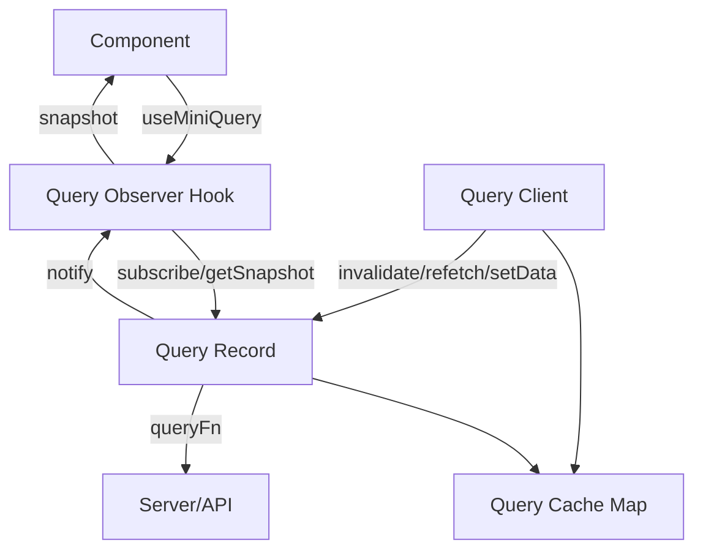

# Part 120 — Build a Query Cache from Scratch

This part is not trying to rebuild TanStack Query. TanStack Query is mature, battle-tested, and handles many edge cases we will not fully implement here.

The point is different: build a small query cache so the mental model becomes concrete.

After this part, `useQuery`, query keys, observers, stale state, invalidation, and refetch will stop feeling magical.

---

## 1. Why Query Cache Exists

Fetching with `useEffect` gives you data, but not a server-state system.

A real query cache must answer:

```txt
What uniquely identifies this server read?
Who is currently observing it?
Is cached data fresh or stale?
Should mount trigger refetch?
Are two components making the same request?
Can we dedupe in-flight fetches?
When should unused data be garbage collected?
How do mutations invalidate affected reads?
How does React subscribe safely to external cache state?
```

Server state is not just `data`.

Server state is:

```ts
type ServerState<T> = {
  data?: T;
  error?: unknown;
  status: 'idle' | 'pending' | 'success' | 'error';
  fetchStatus: 'idle' | 'fetching';
  updatedAt: number;
  invalidated: boolean;
};
```

You need both **cache state** and **observer state**.

---

## 2. Target API

We want this:

```tsx
function UserProfile({ userId }: { userId: string }) {
  const query = useMiniQuery({
    queryKey: ['user', userId],
    queryFn: () => fetchUser(userId),
    staleTime: 30_000,
  });

  if (query.status === 'pending') return <Spinner />;
  if (query.status === 'error') return <ErrorView error={query.error} />;

  return <UserCard user={query.data} />;
}
```

And this:

```tsx
function SaveUserButton({ userId }: { userId: string }) {
  const client = useMiniQueryClient();

  async function save() {
    await updateUser(userId);
    client.invalidateQueries({ queryKey: ['user', userId] });
  }

  return <button onClick={save}>Save</button>;
}
```

The design goal:

```txt
Components observe query snapshots.
Query client owns cache records.
Query records own request lifecycle.
Invalidation marks records stale and notifies observers.
React integration uses useSyncExternalStore.
```

---

## 3. Architecture Diagram



This is the fundamental architecture behind most server-state caches:

```txt
QueryClient: public command API.
QueryCache: addressable map of query records.
QueryRecord: lifecycle and listeners for one query key.
Observer Hook: React adapter for one component.
```

---

## 4. Query Key and Stable Hash

A query key is a cache address.

```ts
type QueryKey = readonly unknown[];
```

We need a stable hash:

```ts
function hashQueryKey(key: QueryKey): string {
  return JSON.stringify(key, stableReplacer);
}

function stableReplacer(_key: string, value: unknown) {
  if (isPlainObject(value)) {
    return Object.keys(value)
      .sort()
      .reduce<Record<string, unknown>>((acc, key) => {
        acc[key] = (value as Record<string, unknown>)[key];
        return acc;
      }, {});
  }
  return value;
}

function isPlainObject(value: unknown): value is Record<string, unknown> {
  return (
    typeof value === 'object' &&
    value !== null &&
    Object.getPrototypeOf(value) === Object.prototype
  );
}
```

For learning, this is enough. Production query key hashing handles more edge cases.

Query key rule:

```txt
Every variable that changes the server response must be in the query key.
```

Bad:

```tsx
useMiniQuery({
  queryKey: ['users'],
  queryFn: () => fetchUsers({ status, page }),
});
```

Good:

```tsx
useMiniQuery({
  queryKey: ['users', { status, page }],
  queryFn: () => fetchUsers({ status, page }),
});
```

---

## 5. Query Snapshot

```ts
type QueryStatus = 'idle' | 'pending' | 'success' | 'error';
type FetchStatus = 'idle' | 'fetching';

type QuerySnapshot<TData = unknown> = {
  data?: TData;
  error?: unknown;
  status: QueryStatus;
  fetchStatus: FetchStatus;
  updatedAt: number;
  invalidated: boolean;
};

const idleSnapshot: QuerySnapshot = {
  status: 'idle',
  fetchStatus: 'idle',
  updatedAt: 0,
  invalidated: false,
};
```

Snapshot must be treated as immutable.

Why?

React subscription via `useSyncExternalStore` depends on stable snapshots:

```txt
If data did not change, return the same snapshot object.
If data changed, return a new snapshot object.
```

Mutable snapshot is one of the fastest ways to create invisible stale UI bugs.

---

## 6. Query Record

A query record owns one query key.

```ts
type Listener = () => void;

type QueryOptions<TData> = {
  queryKey: QueryKey;
  queryFn: () => Promise<TData>;
  staleTime?: number;
  gcTime?: number;
};

class QueryRecord<TData = unknown> {
  readonly queryKey: QueryKey;
  readonly hash: string;

  private listeners = new Set<Listener>();
  private snapshot: QuerySnapshot<TData>;
  private inFlight: Promise<TData> | null = null;
  private gcTimer: ReturnType<typeof setTimeout> | null = null;

  queryFn: () => Promise<TData>;
  staleTime: number;
  gcTime: number;

  constructor(options: QueryOptions<TData>) {
    this.queryKey = options.queryKey;
    this.hash = hashQueryKey(options.queryKey);
    this.queryFn = options.queryFn;
    this.staleTime = options.staleTime ?? 0;
    this.gcTime = options.gcTime ?? 5 * 60_000;
    this.snapshot = idleSnapshot as QuerySnapshot<TData>;
  }

  getSnapshot = () => this.snapshot;

  subscribe = (listener: Listener) => {
    this.listeners.add(listener);

    if (this.gcTimer) {
      clearTimeout(this.gcTimer);
      this.gcTimer = null;
    }

    return () => {
      this.listeners.delete(listener);
      this.scheduleGcIfUnused();
    };
  };

  getObserverCount() {
    return this.listeners.size;
  }

  private notify() {
    for (const listener of this.listeners) {
      listener();
    }
  }

  private setSnapshot(next: QuerySnapshot<TData>) {
    this.snapshot = next;
    this.notify();
  }

  isStale(now = Date.now()) {
    if (this.snapshot.invalidated) return true;
    if (this.snapshot.status !== 'success') return true;
    return now - this.snapshot.updatedAt > this.staleTime;
  }

  invalidate() {
    this.setSnapshot({
      ...this.snapshot,
      invalidated: true,
    });
  }

  async fetch() {
    if (this.inFlight) return this.inFlight;

    const previous = this.snapshot;

    this.setSnapshot({
      ...previous,
      status: previous.status === 'idle' ? 'pending' : previous.status,
      fetchStatus: 'fetching',
    });

    this.inFlight = this.queryFn()
      .then((data) => {
        this.setSnapshot({
          data,
          error: undefined,
          status: 'success',
          fetchStatus: 'idle',
          updatedAt: Date.now(),
          invalidated: false,
        });
        return data;
      })
      .catch((error) => {
        this.setSnapshot({
          ...this.snapshot,
          error,
          status: 'error',
          fetchStatus: 'idle',
          invalidated: false,
        });
        throw error;
      })
      .finally(() => {
        this.inFlight = null;
      });

    return this.inFlight;
  }

  setData(updater: TData | ((prev: TData | undefined) => TData)) {
    const previousData = this.snapshot.data;
    const nextData = typeof updater === 'function'
      ? (updater as (prev: TData | undefined) => TData)(previousData)
      : updater;

    this.setSnapshot({
      data: nextData,
      error: undefined,
      status: 'success',
      fetchStatus: this.snapshot.fetchStatus,
      updatedAt: Date.now(),
      invalidated: false,
    });
  }

  private scheduleGcIfUnused() {
    if (this.listeners.size > 0) return;
    if (this.gcTimer) return;

    this.gcTimer = setTimeout(() => {
      // The cache will provide the actual delete callback later.
    }, this.gcTime);
  }
}
```

This record has lifecycle but no React dependency. That is good architecture.

---

## 7. Garbage Collection Hook

The record needs a way to ask cache to delete it.

```ts
class QueryRecord<TData = unknown> {
  // ...previous fields
  private onGc: (hash: string) => void;

  constructor(options: QueryOptions<TData>, onGc: (hash: string) => void) {
    this.queryKey = options.queryKey;
    this.hash = hashQueryKey(options.queryKey);
    this.queryFn = options.queryFn;
    this.staleTime = options.staleTime ?? 0;
    this.gcTime = options.gcTime ?? 5 * 60_000;
    this.snapshot = idleSnapshot as QuerySnapshot<TData>;
    this.onGc = onGc;
  }

  private scheduleGcIfUnused() {
    if (this.listeners.size > 0) return;
    if (this.gcTimer) return;

    this.gcTimer = setTimeout(() => {
      if (this.listeners.size === 0) {
        this.onGc(this.hash);
      }
    }, this.gcTime);
  }
}
```

Garbage collection invariant:

```txt
Active query records are not garbage collected.
Inactive records may stay cached for gcTime.
Re-subscribing cancels scheduled GC.
```

This is why server-state cache is not plain component state. It has lifecycle beyond component mount/unmount.

---

## 8. Query Cache

```ts
class QueryCache {
  private records = new Map<string, QueryRecord<any>>();

  get<TData>(options: QueryOptions<TData>): QueryRecord<TData> {
    const hash = hashQueryKey(options.queryKey);
    const existing = this.records.get(hash);

    if (existing) {
      existing.queryFn = options.queryFn;
      existing.staleTime = options.staleTime ?? existing.staleTime;
      existing.gcTime = options.gcTime ?? existing.gcTime;
      return existing as QueryRecord<TData>;
    }

    const record = new QueryRecord<TData>(options, (hash) => {
      this.records.delete(hash);
    });

    this.records.set(hash, record);
    return record;
  }

  findAllMatching(prefix: QueryKey): QueryRecord[] {
    return Array.from(this.records.values()).filter((record) =>
      matchesPrefix(record.queryKey, prefix),
    );
  }

  getAll() {
    return Array.from(this.records.values());
  }
}
```

Prefix matching:

```ts
function matchesPrefix(key: QueryKey, prefix: QueryKey) {
  if (prefix.length > key.length) return false;

  return prefix.every((value, index) =>
    hashQueryKey([value]) === hashQueryKey([key[index]]),
  );
}
```

For learning, this is fine. Production query matching needs more precise filters.

---

## 9. Query Client

The client is the public command surface.

```ts
class MiniQueryClient {
  private cache = new QueryCache();

  getQuery<TData>(options: QueryOptions<TData>) {
    return this.cache.get(options);
  }

  async fetchQuery<TData>(options: QueryOptions<TData>) {
    const record = this.cache.get(options);
    return record.fetch();
  }

  invalidateQueries(input: { queryKey: QueryKey; refetchActive?: boolean }) {
    const records = this.cache.findAllMatching(input.queryKey);

    for (const record of records) {
      record.invalidate();

      if (input.refetchActive ?? true) {
        if (record.getObserverCount() > 0) {
          void record.fetch();
        }
      }
    }
  }

  setQueryData<TData>(
    queryKey: QueryKey,
    updater: TData | ((prev: TData | undefined) => TData),
  ) {
    const record = this.cache.get<TData>({
      queryKey,
      queryFn: async () => {
        throw new Error('No queryFn registered for setQueryData-only record');
      },
    });

    record.setData(updater);
  }

  getQueries() {
    return this.cache.getAll();
  }
}
```

Notice the boundary:

```txt
QueryRecord owns lifecycle of one query.
QueryCache owns map and matching.
QueryClient owns public commands.
React hook owns subscription bridge.
```

---

## 10. React Provider

```tsx
const MiniQueryClientContext = createContext<MiniQueryClient | null>(null);

export function MiniQueryClientProvider(props: {
  client: MiniQueryClient;
  children: React.ReactNode;
}) {
  return (
    <MiniQueryClientContext.Provider value={props.client}>
      {props.children}
    </MiniQueryClientContext.Provider>
  );
}

export function useMiniQueryClient() {
  const client = useContext(MiniQueryClientContext);
  if (!client) {
    throw new Error('useMiniQueryClient must be used within MiniQueryClientProvider');
  }
  return client;
}
```

Create client outside render or memoize it once:

```tsx
function App() {
  const [client] = useState(() => new MiniQueryClient());

  return (
    <MiniQueryClientProvider client={client}>
      <Routes />
    </MiniQueryClientProvider>
  );
}
```

Do not create a new client every render. That would reset cache and make every query look cold.

---

## 11. React Hook with `useSyncExternalStore`

```tsx
import { useEffect, useMemo, useSyncExternalStore } from 'react';

type UseMiniQueryOptions<TData> = QueryOptions<TData> & {
  enabled?: boolean;
  refetchOnMount?: boolean;
};

export function useMiniQuery<TData>(options: UseMiniQueryOptions<TData>) {
  const client = useMiniQueryClient();

  const record = useMemo(
    () => client.getQuery(options),
    [client, hashQueryKey(options.queryKey)],
  );

  const snapshot = useSyncExternalStore(
    record.subscribe,
    record.getSnapshot,
    record.getSnapshot,
  ) as QuerySnapshot<TData>;

  const enabled = options.enabled ?? true;
  const refetchOnMount = options.refetchOnMount ?? true;

  useEffect(() => {
    if (!enabled) return;
    if (!refetchOnMount && snapshot.status !== 'idle') return;
    if (!record.isStale()) return;

    void record.fetch();
  }, [enabled, refetchOnMount, record, snapshot.status]);

  return {
    ...snapshot,
    isPending: snapshot.status === 'pending',
    isSuccess: snapshot.status === 'success',
    isError: snapshot.status === 'error',
    isFetching: snapshot.fetchStatus === 'fetching',
    refetch: () => record.fetch(),
  };
}
```

This is the core bridge.

React component does not own server data. It subscribes to a cache record.

---

## 12. Important Bug: Memo Dependency

This dependency is suspicious:

```tsx
[client, hashQueryKey(options.queryKey)]
```

Because it recomputes hash every render. Better:

```tsx
const queryHash = hashQueryKey(options.queryKey);

const record = useMemo(
  () => client.getQuery(options),
  [client, queryHash],
);
```

But another bug remains: if `queryFn`, `staleTime`, or `gcTime` changes for same key, we update existing record in `cache.get`. That is why `QueryCache.get` refreshes options when existing record is found.

Invariant:

```txt
Query key identifies cached data.
Query options may update observer behavior.
Query function should be stable enough not to accidentally capture stale variables outside the key.
```

If `queryFn` depends on `tenantId`, `filter`, or `page`, those variables belong in the query key.

---

## 13. Request Deduplication

The simplest deduplication is already in `QueryRecord.fetch`:

```ts
if (this.inFlight) return this.inFlight;
```

If two components mount with same query key:

```txt
Component A subscribes → fetch starts.
Component B subscribes → sees same record → fetch returns same in-flight promise.
Server gets one request.
Both observers receive same snapshot update.
```

Deduplication is not a global debounce. It is per-query-key in-flight sharing.

---

## 14. Stale Time

`staleTime` means:

```txt
After success, how long should this data be considered fresh?
```

Implementation:

```ts
isStale(now = Date.now()) {
  if (this.snapshot.invalidated) return true;
  if (this.snapshot.status !== 'success') return true;
  return now - this.snapshot.updatedAt > this.staleTime;
}
```

This means:

- idle query is stale,
- error query is stale,
- invalidated query is stale,
- successful query becomes stale after `staleTime`.

Do not confuse `staleTime` with `gcTime`.

```txt
staleTime: freshness window.
gcTime: inactive cache retention window.
```

---

## 15. Invalidation

Invalidation means:

```txt
This cached data may no longer reflect server truth.
```

It does not mean:

```txt
Delete data immediately.
```

Why keep data after invalidation?

Because stale-but-visible UI is usually better than blank UI.

```ts
client.invalidateQueries({ queryKey: ['users'] });
```

This can mark all these stale:

```txt
['users']
['users', { status: 'active' }]
['users', { status: 'inactive' }]
['users', { status: 'active', page: 2 }]
```

Invalidate narrowly when possible:

```ts
client.invalidateQueries({ queryKey: ['user', userId] });
```

Invalidate broadly when mutation affects aggregates:

```ts
client.invalidateQueries({ queryKey: ['users'] });
client.invalidateQueries({ queryKey: ['user', userId] });
client.invalidateQueries({ queryKey: ['dashboard', 'counts'] });
```

---

## 16. Direct Cache Write

Sometimes invalidation is not enough. You know the new data.

```tsx
client.setQueryData(['user', user.id], user);
```

Or update a list:

```tsx
client.setQueryData<User[]>(['users', { status: 'active' }], (prev = []) =>
  prev.map((item) => item.id === user.id ? user : item),
);
```

Direct cache write is powerful but dangerous.

Invariant:

```txt
Only write cache data if you can preserve the query projection contract.
```

If the query is sorted, filtered, paginated, permission-filtered, or server-computed, client-side update may be wrong. Invalidate instead.

---

## 17. Mutation Integration

Mini mutation helper:

```ts
type MutationOptions<TInput, TResult> = {
  mutationFn(input: TInput): Promise<TResult>;
  onSuccess?(result: TResult, input: TInput, client: MiniQueryClient): void;
  onError?(error: unknown, input: TInput, client: MiniQueryClient): void;
};

function useMiniMutation<TInput, TResult>(options: MutationOptions<TInput, TResult>) {
  const client = useMiniQueryClient();
  const [state, setState] = useState<{
    status: 'idle' | 'pending' | 'success' | 'error';
    error?: unknown;
  }>({ status: 'idle' });

  const mutateAsync = useCallback(async (input: TInput) => {
    setState({ status: 'pending' });
    try {
      const result = await options.mutationFn(input);
      options.onSuccess?.(result, input, client);
      setState({ status: 'success' });
      return result;
    } catch (error) {
      options.onError?.(error, input, client);
      setState({ status: 'error', error });
      throw error;
    }
  }, [client, options]);

  return {
    ...state,
    mutateAsync,
  };
}
```

Usage:

```tsx
const mutation = useMiniMutation({
  mutationFn: updateUser,
  onSuccess: (user, _input, client) => {
    client.setQueryData(['user', user.id], user);
    client.invalidateQueries({ queryKey: ['users'] });
  },
});
```

Caveat: the `options` object identity changes every render unless memoized. A real library handles this with observers and latest refs. For learning, this exposes the problem clearly.

---

## 18. Optimistic Update

Minimal optimistic mutation:

```tsx
async function renameUser(userId: string, name: string) {
  const key = ['user', userId] as const;
  const previous = client.getQuery({
    queryKey: key,
    queryFn: () => fetchUser(userId),
  }).getSnapshot().data as User | undefined;

  client.setQueryData<User>(key, (prev) => ({
    ...prev!,
    name,
  }));

  try {
    await updateUserName(userId, name);
    client.invalidateQueries({ queryKey: key });
  } catch (error) {
    if (previous) client.setQueryData(key, previous);
    throw error;
  }
}
```

This works for simple detail records.

It is not enough for:

- concurrent optimistic updates,
- list projection changes,
- temp IDs,
- offline replay,
- conflict resolution,
- cross-tab consistency,
- permission-driven projections.

Optimistic update invariant:

```txt
You need rollback context.
You need reconciliation after server response.
You need a strategy for concurrent optimistic commands.
```

---

## 19. Window Focus Refetch

A server-state cache commonly refetches stale active queries when the window regains focus.

```ts
class MiniQueryClient {
  // ...previous methods

  refetchActiveStaleQueries() {
    for (const record of this.cache.getAll()) {
      if (record.getObserverCount() === 0) continue;
      if (!record.isStale()) continue;
      void record.fetch();
    }
  }
}
```

Provider effect:

```tsx
function MiniQueryRuntime() {
  const client = useMiniQueryClient();

  useEffect(() => {
    function onFocus() {
      client.refetchActiveStaleQueries();
    }

    window.addEventListener('focus', onFocus);
    return () => window.removeEventListener('focus', onFocus);
  }, [client]);

  return null;
}
```

Then render in provider:

```tsx
<MiniQueryClientContext.Provider value={props.client}>
  <MiniQueryRuntime />
  {props.children}
</MiniQueryClientContext.Provider>
```

This is an external-system synchronization effect. It belongs in effect, not render.

---

## 20. Online Refetch

Same pattern:

```tsx
useEffect(() => {
  function onOnline() {
    client.refetchActiveStaleQueries();
  }

  window.addEventListener('online', onOnline);
  return () => window.removeEventListener('online', onOnline);
}, [client]);
```

But production apps need a real online manager because `navigator.onLine` is not a complete truth source. It is a hint.

---

## 21. SSR and Hydration

Our mini cache is client-only. To support SSR/hydration, you need:

- prefetch on server,
- serialize query snapshots,
- hydrate client cache with same query keys,
- avoid data mismatch,
- preserve updatedAt,
- use `getServerSnapshot` correctly.

Hydration shape:

```ts
type DehydratedQuery = {
  queryKey: QueryKey;
  snapshot: QuerySnapshot;
};

type DehydratedState = {
  queries: DehydratedQuery[];
};
```

Client hydrate:

```ts
client.hydrate(dehydratedState);
```

This is where production libraries earn their keep. SSR server state is much more than "initial data".

---

## 22. Suspense Boundary

A Suspense-enabled query hook usually throws promise during pending state.

Pseudo-code:

```tsx
function useSuspenseMiniQuery<TData>(options: QueryOptions<TData>) {
  const query = useMiniQuery(options);

  if (query.status === 'pending') {
    throw query.promise;
  }

  if (query.status === 'error') {
    throw query.error;
  }

  return query.data as TData;
}
```

Our record does not expose promise in snapshot yet. Add:

```ts
type QuerySnapshot<TData = unknown> = {
  data?: TData;
  error?: unknown;
  promise?: Promise<TData>;
  status: QueryStatus;
  fetchStatus: FetchStatus;
  updatedAt: number;
  invalidated: boolean;
};
```

Then when fetch starts:

```ts
this.setSnapshot({
  ...previous,
  promise: this.inFlight,
  status: previous.status === 'idle' ? 'pending' : previous.status,
  fetchStatus: 'fetching',
});
```

Suspense changes loading architecture. It should be introduced intentionally, with Error Boundary and fallback placement designed at route/page boundaries.

---

## 23. Failure Modes

### 23.1 Query key missing dependency

```tsx
useMiniQuery({
  queryKey: ['user'],
  queryFn: () => fetchUser(userId),
});
```

Symptom:

```txt
Switching userId shows wrong user.
```

Fix:

```tsx
queryKey: ['user', userId]
```

### 23.2 Mutable snapshot

Symptom:

```txt
Store changes but React component does not rerender reliably.
```

Fix:

```txt
Never mutate snapshot in place.
Return same object when unchanged.
Return new object when changed.
```

### 23.3 New QueryClient every render

Symptom:

```txt
Cache constantly resets.
Every route mount refetches.
Invalidation does not affect expected queries.
```

Fix:

```tsx
const [client] = useState(() => new MiniQueryClient());
```

### 23.4 Direct cache write violates projection

Symptom:

```txt
List ordering wrong.
Filtered list shows item that no longer belongs.
Count badge disagrees with list.
```

Fix:

```txt
Invalidate projection queries unless client can recompute exact server projection.
```

### 23.5 Observer leak

Symptom:

```txt
Inactive screens still update.
Memory grows.
GC never runs.
```

Fix:

```txt
Subscription cleanup must remove listener.
GC should run only when observer count is zero.
```

### 23.6 Refetch loop

Cause:

- effect depends on full snapshot object,
- snapshot changes on every render,
- queryFn identity churn,
- options object not stabilized.

Fix:

```txt
Depend on minimal stable values.
Keep snapshot stable when unchanged.
Keep query key complete and stable.
```

### 23.7 Invalidation too broad

Symptom:

```txt
Mutation causes app-wide refetch storm.
```

Fix:

```txt
Design query key hierarchy.
Invalidate by mutation impact map.
Observe network and cache events.
```

---

## 24. Testing Strategy

### Query key hashing

```ts
expect(hashQueryKey(['users', { page: 1, status: 'active' }]))
  .toBe(hashQueryKey(['users', { status: 'active', page: 1 }]));
```

### Request deduplication

```ts
it('dedupes in-flight requests', async () => {
  const queryFn = vi.fn().mockResolvedValue({ id: 'u1' });
  const client = new MiniQueryClient();

  const a = client.fetchQuery({ queryKey: ['user', 'u1'], queryFn });
  const b = client.fetchQuery({ queryKey: ['user', 'u1'], queryFn });

  await Promise.all([a, b]);

  expect(queryFn).toHaveBeenCalledTimes(1);
});
```

### Invalidation

```ts
it('marks matching records invalidated', async () => {
  const client = new MiniQueryClient();

  await client.fetchQuery({
    queryKey: ['users', { page: 1 }],
    queryFn: async () => [],
  });

  client.invalidateQueries({ queryKey: ['users'], refetchActive: false });

  const record = client.getQueries()[0];
  expect(record.getSnapshot().invalidated).toBe(true);
});
```

### React integration

Test with a real component:

```tsx
function UserView() {
  const query = useMiniQuery({
    queryKey: ['user', 'u1'],
    queryFn: async () => ({ id: 'u1', name: 'Ada' }),
  });

  if (query.isPending) return <span>Loading</span>;
  return <span>{query.data?.name}</span>;
}
```

Assert visible behavior, not private record internals.

---

## 25. Observability

A production query cache needs events:

```ts
type QueryCacheEvent =
  | { type: 'query.created'; hash: string; queryKey: QueryKey }
  | { type: 'query.fetch_started'; hash: string }
  | { type: 'query.fetch_success'; hash: string; durationMs: number }
  | { type: 'query.fetch_error'; hash: string; errorKind: string }
  | { type: 'query.invalidated'; hash: string }
  | { type: 'query.gc'; hash: string };
```

Do not log raw data by default. Server-state cache may hold sensitive records.

Useful dashboard signals:

```txt
Queries per route
Fetch count per navigation
Deduplication ratio
Invalidation fan-out
Average query duration
Error rate by query key family
Cache size over time
GC count
Refetch on focus count
```

---

## 26. What We Did Not Build

This mini cache intentionally omits many production concerns:

- retries with backoff,
- cancellation via AbortSignal,
- offline queue,
- infinite query pages,
- mutation cache,
- Suspense correctness,
- SSR streaming integration,
- structural sharing,
- query filters,
- devtools,
- persisted cache,
- broadcast channel sync,
- focus/online manager nuance,
- cache hydration edge cases,
- error reset boundary,
- partial matching correctness.

That is why you usually use TanStack Query or framework-native data layer for production. The build-from-scratch exercise is for understanding, not for replacing mature infrastructure casually.

---

## 27. Key Takeaways

A query cache is not just a map from URL to JSON.

It is a lifecycle system:

```txt
query key identifies data
query record owns state and in-flight request
observer subscribes to record snapshot
client exposes commands
staleTime controls freshness
gcTime controls inactive retention
invalidation marks server truth potentially changed
direct cache writes require projection discipline
useSyncExternalStore bridges external cache into React safely
```

The important mental shift:

```txt
Component does not fetch data.
Component observes a server-state record.
```

Once you understand that, TanStack Query's API becomes less like a library trick and more like a well-designed model of server-state reality.

---

## 28. What Comes Next

Next, we will build a client store from scratch. The query cache taught server-state lifecycle. The next build teaches shared client-state lifecycle:

- external store,
- selector subscription,
- structural sharing,
- persistence,
- action API,
- and React adapter boundaries.

