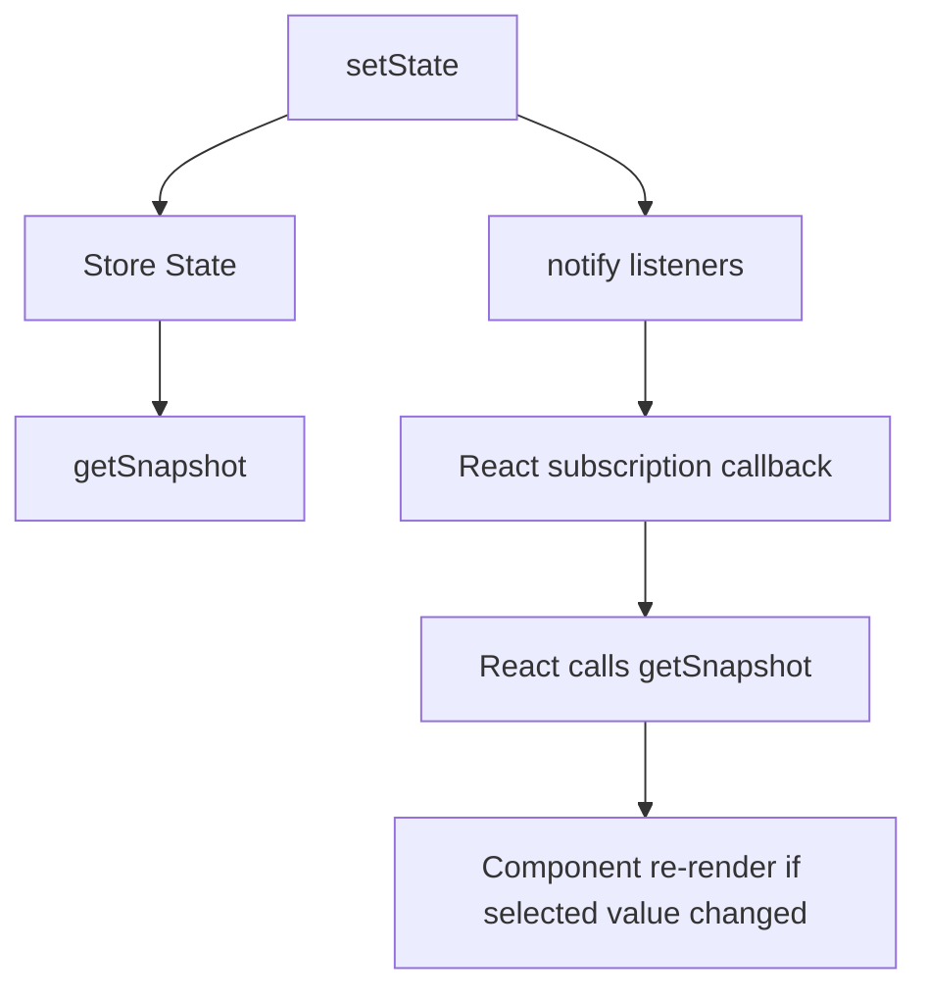
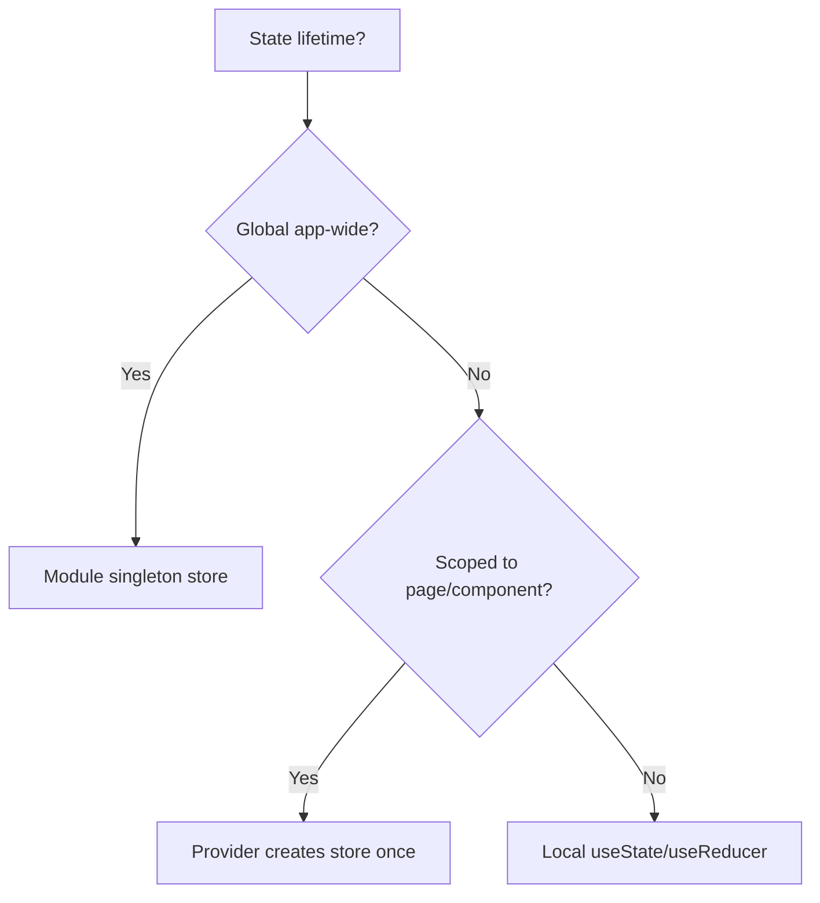

# Part 121 — Build a Client Store from Scratch

> Tujuan bagian ini: membangun **client-side store** kecil dari nol, bukan untuk mengganti Redux/Zustand, tetapi untuk memahami kontrak internal yang membuat store aman dipakai bersama React: snapshot, subscription, selector, equality, batching, scoped lifetime, persistence, SSR, dan debugging.

Kita sudah membangun mini query cache di Part 120. Query cache punya concern server-state: freshness, invalidation, retry, refetch, stale data, dan observer lifecycle. Client store berbeda. Ia memegang state yang **otoritatif di browser** untuk sementara waktu: UI preference, local editor state, client-only wizard draft, layout state, selected rows, command queue, ephemeral collaboration state, atau state domain kecil yang belum layak masuk server.

Kalimat kuncinya:

```txt
Client store bukan tempat menaruh semua state.
Client store adalah external mutable source yang diberi kontrak snapshot-subscription agar aman dibaca React.
```

Kalau store dibangun tanpa kontrak ini, bug-nya bukan cuma re-render berlebih. Bug-nya bisa berupa tearing, stale read, mutation tak terdeteksi, hydration mismatch, listener leak, selector salah, dan state global yang bocor antar user/request.

---

## 1. Problem Statement

Misalkan kita punya halaman case management dengan kebutuhan:

- panel filter yang dapat dibuka/tutup;
- selected case IDs untuk bulk action;
- column visibility;
- local draft untuk layout user;
- toast queue;
- command status client-only;
- beberapa komponen jauh di tree perlu membaca sebagian kecil state;
- update bisa sering terjadi;
- kita tidak mau semua consumer context re-render setiap satu field berubah.

Kita bisa memakai `useState` di parent, tetapi render radius melebar. Kita bisa memakai Context, tetapi context value besar akan membuat semua consumer context subscribe ke value yang sama. Kita bisa memakai Redux/Zustand, tetapi bagian ini ingin membuka lapisan bawahnya.

Minimal store yang benar harus mampu menjawab:

```txt
Bagaimana React tahu snapshot berubah?
Bagaimana component hanya re-render jika slice yang dibacanya berubah?
Bagaimana store tidak bocor antar page/request/test?
Bagaimana update tetap immutable?
Bagaimana persistence tidak merusak hydration?
Bagaimana debugging tahu event apa yang mengubah state?
```

---

## 2. Target Architecture

Kita akan membangun store dengan bentuk akhir seperti ini:

```tsx
const caseListStore = createStore({
  filtersOpen: false,
  selectedIds: new Set<string>(),
  columns: {
    owner: true,
    priority: true,
    status: true,
  },
  command: { status: 'idle' as const },
});

function BulkToolbar() {
  const selectedCount = useStore(caseListStore, s => s.selectedIds.size);
  const clearSelection = useStoreAction(caseListStore, a => a.clearSelection);

  if (selectedCount === 0) return null;

  return (
    <button onClick={clearSelection}>
      Clear {selectedCount} selected cases
    </button>
  );
}
```

Namun, kita tidak akan mulai dari API enak. Kita mulai dari primitive paling bawah.

---

## 3. Store Contract

Minimal external store punya tiga primitive:

```ts
getState(): State
setState(update): void
subscribe(listener): unsubscribe
```

Untuk React, kontrak itu dipetakan ke:

```ts
subscribe(callback)
getSnapshot()
getServerSnapshot?()
```

Dengan kata lain:



Invariant penting:

1. `getSnapshot` harus mengembalikan referensi yang stabil selama data tidak berubah.
2. `subscribe` harus mengembalikan cleanup function.
3. Store tidak boleh dimutasi diam-diam tanpa notify.
4. Selector harus pure.
5. Equality harus konsisten.
6. Update harus atomic dari sudut pandang subscriber.

---

## 4. Naive Store: Berguna untuk Melihat Masalah

Versi paling sederhana:

```ts
type Listener = () => void;

export function createNaiveStore<TState>(initialState: TState) {
  let state = initialState;
  const listeners = new Set<Listener>();

  return {
    getState() {
      return state;
    },
    setState(nextState: TState) {
      state = nextState;
      listeners.forEach(listener => listener());
    },
    subscribe(listener: Listener) {
      listeners.add(listener);
      return () => listeners.delete(listener);
    },
  };
}
```

Ini terlihat cukup. Tetapi masalahnya langsung muncul:

```ts
const store = createNaiveStore({ user: { name: 'Ayu' } });

// Mutation diam-diam. Tidak ada notify. React tidak tahu.
store.getState().user.name = 'Bima';
```

Store yang benar harus menganggap state sebagai **snapshot immutable**. Kalau snapshot bisa dimutasi dari luar, tidak ada equality yang bisa dipercaya.

---

## 5. Snapshot Immutability

Kita butuh update API yang mendorong replacement, bukan mutation diam-diam.

```ts
type Updater<TState> = TState | ((prev: TState) => TState);

type Store<TState> = {
  getState(): TState;
  setState(update: Updater<TState>, meta?: UpdateMeta): void;
  subscribe(listener: Listener): () => void;
};

type UpdateMeta = {
  type?: string;
  source?: string;
};
```

Implementasi:

```ts
export function createStore<TState>(initialState: TState): Store<TState> {
  let state = initialState;
  const listeners = new Set<Listener>();

  function getState() {
    return state;
  }

  function setState(update: Updater<TState>, meta?: UpdateMeta) {
    const nextState = typeof update === 'function'
      ? (update as (prev: TState) => TState)(state)
      : update;

    if (Object.is(nextState, state)) {
      return;
    }

    state = nextState;
    listeners.forEach(listener => listener());
  }

  function subscribe(listener: Listener) {
    listeners.add(listener);
    return () => {
      listeners.delete(listener);
    };
  }

  return { getState, setState, subscribe };
}
```

Sekarang state berubah hanya jika root snapshot berubah. Ini membuat React integration lebih aman.

Namun root replacement masih ergonomically buruk untuk object besar. Kita bisa memakai helper update parsial.

---

## 6. Partial Update Helper

```ts
type PartialUpdater<TState extends object> =
  | Partial<TState>
  | ((prev: TState) => Partial<TState>);

export function patchState<TState extends object>(
  store: Store<TState>,
  patch: PartialUpdater<TState>,
  meta?: UpdateMeta,
) {
  store.setState(prev => {
    const partial = typeof patch === 'function' ? patch(prev) : patch;
    return { ...prev, ...partial };
  }, meta);
}
```

Contoh:

```ts
patchState(caseListStore, { filtersOpen: true }, { type: 'filters.opened' });
```

Tetapi partial update root punya batas:

- tidak cocok untuk nested entity update tanpa helper tambahan;
- mudah overwrite nested object secara tidak sengaja;
- tidak mengekspresikan event domain;
- bisa mendorong setter-thinking.

Untuk store produksi, kita lebih suka action/command layer.

---

## 7. React Adapter dengan `useSyncExternalStore`

React tidak boleh membaca external mutable source secara bebas. Kita pakai `useSyncExternalStore`.

```tsx
import { useSyncExternalStore } from 'react';

export function useStoreSnapshot<TState>(store: Store<TState>): TState {
  return useSyncExternalStore(
    store.subscribe,
    store.getState,
    store.getState,
  );
}
```

Ini membuat React subscribe ke store dan membaca snapshot konsisten.

Masalah: setiap perubahan root state akan membuat semua consumer re-render, walaupun consumer hanya butuh satu field.

```tsx
function FiltersButton() {
  // Akan re-render untuk perubahan selectedIds, command, columns, dll.
  const state = useStoreSnapshot(caseListStore);
  return <button>{state.filtersOpen ? 'Close' : 'Open'}</button>;
}
```

Kita butuh selector.

---

## 8. Selector Hook

Selector membaca slice kecil dari state:

```ts
type Selector<TState, TSelected> = (state: TState) => TSelected;
type Equality<T> = (a: T, b: T) => boolean;

const objectIs: Equality<unknown> = Object.is;
```

Versi dengan `useSyncExternalStore` dasar:

```tsx
import { useRef, useSyncExternalStore } from 'react';

export function useStore<TState, TSelected>(
  store: Store<TState>,
  selector: Selector<TState, TSelected>,
  equality: Equality<TSelected> = Object.is,
): TSelected {
  const lastRef = useRef<{
    state: TState;
    selected: TSelected;
  } | null>(null);

  function getSelectedSnapshot() {
    const state = store.getState();
    const last = lastRef.current;

    if (last && Object.is(last.state, state)) {
      return last.selected;
    }

    const selected = selector(state);

    if (last && equality(last.selected, selected)) {
      lastRef.current = { state, selected: last.selected };
      return last.selected;
    }

    lastRef.current = { state, selected };
    return selected;
  }

  return useSyncExternalStore(
    store.subscribe,
    getSelectedSnapshot,
    getSelectedSnapshot,
  );
}
```

Catatan penting: `getSelectedSnapshot` harus mengembalikan referensi stabil jika selected value tidak berubah. Kalau selector selalu membuat object baru, equality harus menahan referensi lama.

Contoh penggunaan:

```tsx
const filtersOpen = useStore(caseListStore, s => s.filtersOpen);
const selectedCount = useStore(caseListStore, s => s.selectedIds.size);
```

---

## 9. Selector Failure Mode: Allocation Trap

Selector ini buruk:

```tsx
const view = useStore(store, s => ({
  filtersOpen: s.filtersOpen,
  selectedCount: s.selectedIds.size,
}));
```

Tanpa shallow equality, object baru dibuat setiap `getSnapshot`. React melihat referensi berubah.

Solusi:

```ts
export function shallowEqual<T extends Record<string, unknown>>(a: T, b: T) {
  if (Object.is(a, b)) return true;

  const aKeys = Object.keys(a);
  const bKeys = Object.keys(b);

  if (aKeys.length !== bKeys.length) return false;

  for (const key of aKeys) {
    if (!Object.prototype.hasOwnProperty.call(b, key)) return false;
    if (!Object.is(a[key], b[key])) return false;
  }

  return true;
}
```

Pemakaian:

```tsx
const view = useStore(
  store,
  s => ({
    filtersOpen: s.filtersOpen,
    selectedCount: s.selectedIds.size,
  }),
  shallowEqual,
);
```

Tapi jangan memakai shallow equality sebagai default universal. Untuk primitive, `Object.is` lebih murah. Untuk array/object derived, pertimbangkan selector split atau memoized selector.

---

## 10. Store Actions

Langkah berikutnya: jangan biarkan component menulis state secara arbitrary.

Buruk:

```tsx
store.setState(prev => ({
  ...prev,
  selectedIds: new Set([...prev.selectedIds, id]),
}));
```

Lebih baik:

```ts
type CaseListState = {
  filtersOpen: boolean;
  selectedIds: Set<string>;
};

function createCaseListActions(store: Store<CaseListState>) {
  return {
    openFilters() {
      patchState(store, { filtersOpen: true }, { type: 'filters.opened' });
    },
    closeFilters() {
      patchState(store, { filtersOpen: false }, { type: 'filters.closed' });
    },
    toggleSelected(id: string) {
      store.setState(prev => {
        const selectedIds = new Set(prev.selectedIds);
        if (selectedIds.has(id)) selectedIds.delete(id);
        else selectedIds.add(id);
        return { ...prev, selectedIds };
      }, { type: 'selection.toggled' });
    },
    clearSelection() {
      store.setState(prev => ({
        ...prev,
        selectedIds: new Set(),
      }), { type: 'selection.cleared' });
    },
  };
}
```

Action layer memberi kita:

- vocabulary event;
- invariant enforcement;
- telemetry point;
- test boundary;
- permission/precondition check;
- migration path ke reducer/state machine.

---

## 11. Action Hook

Kita ingin command/action reference stabil.

```ts
type ActionsOf<TState, TActions> = (store: Store<TState>) => TActions;

export function createStoreBundle<TState, TActions>(
  initialState: TState,
  createActions: ActionsOf<TState, TActions>,
) {
  const store = createStore(initialState);
  const actions = createActions(store);

  return { store, actions };
}
```

Pemakaian:

```ts
const caseList = createStoreBundle(
  {
    filtersOpen: false,
    selectedIds: new Set<string>(),
  },
  createCaseListActions,
);
```

Hook:

```tsx
export function useStoreAction<TActions, TSelected>(
  actions: TActions,
  selector: (actions: TActions) => TSelected,
): TSelected {
  // actions dibuat sekali dan stabil; selector dipanggil saat render.
  return selector(actions);
}
```

Pemakaian:

```tsx
function FilterToggle() {
  const filtersOpen = useStore(caseList.store, s => s.filtersOpen);
  const openFilters = useStoreAction(caseList.actions, a => a.openFilters);
  const closeFilters = useStoreAction(caseList.actions, a => a.closeFilters);

  return (
    <button onClick={filtersOpen ? closeFilters : openFilters}>
      {filtersOpen ? 'Close filters' : 'Open filters'}
    </button>
  );
}
```

---

## 12. Store Lifetime: Singleton vs Scoped Store

Ini keputusan besar.



Singleton store:

```ts
export const caseListStore = createStore(initialCaseListState);
```

Kelebihan:

- sederhana;
- tidak perlu provider;
- cocok untuk app-wide client-only singleton seperti toasts atau command palette.

Risiko:

- state bocor antar test kalau tidak di-reset;
- pada SSR/request environment bisa bocor antar user jika dipakai sembarangan;
- susah punya dua instance halaman yang sama;
- lifecycle tidak jelas.

Scoped store dengan Provider:

```tsx
import { createContext, useContext, useRef } from 'react';

const CaseListStoreContext = createContext<ReturnType<typeof createCaseListStore> | null>(null);

function createCaseListStore(initial?: Partial<CaseListState>) {
  return createStoreBundle(
    {
      filtersOpen: false,
      selectedIds: new Set<string>(),
      ...initial,
    },
    createCaseListActions,
  );
}

export function CaseListStoreProvider({ children }: { children: React.ReactNode }) {
  const ref = useRef<ReturnType<typeof createCaseListStore> | null>(null);

  if (ref.current === null) {
    ref.current = createCaseListStore();
  }

  return (
    <CaseListStoreContext.Provider value={ref.current}>
      {children}
    </CaseListStoreContext.Provider>
  );
}

export function useCaseListStoreBundle() {
  const value = useContext(CaseListStoreContext);
  if (!value) {
    throw new Error('useCaseListStoreBundle must be used inside CaseListStoreProvider');
  }
  return value;
}
```

Selector hook khusus domain:

```tsx
export function useCaseListValue<TSelected>(
  selector: Selector<CaseListState, TSelected>,
  equality?: Equality<TSelected>,
) {
  const { store } = useCaseListStoreBundle();
  return useStore(store, selector, equality);
}

export function useCaseListAction<TSelected>(selector: (actions: CaseListActions) => TSelected) {
  const { actions } = useCaseListStoreBundle();
  return selector(actions);
}
```

API pengguna:

```tsx
function SelectedCount() {
  const count = useCaseListValue(s => s.selectedIds.size);
  return <span>{count}</span>;
}
```

---

## 13. Store State Shape

Jangan mulai store dengan shape seperti ini:

```ts
type BadState = {
  everything: unknown;
  ui: any;
  data: any;
  flags: Record<string, boolean>;
};
```

Mulai dari lifecycle dan authority:

```ts
type CaseListState = {
  ui: {
    filtersOpen: boolean;
    density: 'comfortable' | 'compact';
  };
  selection: {
    selectedIds: ReadonlySet<string>;
    anchorId: string | null;
  };
  columns: Record<string, boolean>;
  command: {
    status: 'idle' | 'pending' | 'failed';
    requestId: string | null;
    error: string | null;
  };
};
```

Pisahkan berdasarkan perubahan:

- `ui` berubah karena interaksi lokal;
- `selection` bisa berubah cepat dan sering;
- `columns` bisa persistent;
- `command` punya lifecycle async.

Kalau satu slice sangat high-frequency, pertimbangkan store terpisah atau subscription selector sangat granular.

---

## 14. Immutable Collections

`Set` dan `Map` mudah menjebak.

Buruk:

```ts
store.setState(prev => {
  prev.selectedIds.add(id); // mutation snapshot lama
  return prev;              // root sama; React tidak tahu
});
```

Benar:

```ts
store.setState(prev => {
  const selectedIds = new Set(prev.selectedIds);
  selectedIds.add(id);
  return { ...prev, selectedIds };
});
```

Untuk state publik, pertimbangkan expose sebagai `ReadonlySet`:

```ts
type SelectionState = {
  selectedIds: ReadonlySet<string>;
};
```

Namun TypeScript `ReadonlySet` hanya compile-time. Runtime masih bisa bocor jika object yang sama diberikan ke consumer yang melakukan cast. Disiplin update tetap diperlukan.

---

## 15. Batching Notifications

Jika satu action melakukan beberapa update, listener bisa dipanggil berkali-kali.

Tambahkan transaction sederhana:

```ts
export function createStore<TState>(initialState: TState): Store<TState> & {
  batch(fn: () => void): void;
} {
  let state = initialState;
  const listeners = new Set<Listener>();
  let batchDepth = 0;
  let hasPendingNotification = false;

  function notify() {
    if (batchDepth > 0) {
      hasPendingNotification = true;
      return;
    }
    listeners.forEach(listener => listener());
  }

  function setState(update: Updater<TState>, meta?: UpdateMeta) {
    const nextState = typeof update === 'function'
      ? (update as (prev: TState) => TState)(state)
      : update;

    if (Object.is(nextState, state)) return;

    state = nextState;
    notify();
  }

  function batch(fn: () => void) {
    batchDepth += 1;
    try {
      fn();
    } finally {
      batchDepth -= 1;
      if (batchDepth === 0 && hasPendingNotification) {
        hasPendingNotification = false;
        listeners.forEach(listener => listener());
      }
    }
  }

  return {
    getState: () => state,
    setState,
    subscribe(listener) {
      listeners.add(listener);
      return () => listeners.delete(listener);
    },
    batch,
  };
}
```

Prinsip:

```txt
Action sebaiknya terlihat atomic bagi subscriber.
```

Kalau action butuh update beberapa slice, batching membuat UI tidak melihat intermediate inconsistent state.

---

## 16. Middleware Pipeline

Kita ingin logging, persistence, devtools, telemetry, dan validation tanpa menaruh semuanya di `setState`.

Buat middleware sederhana:

```ts
type StoreApi<TState> = {
  getState(): TState;
  setState(update: Updater<TState>, meta?: UpdateMeta): void;
  subscribe(listener: Listener): () => void;
};

type Middleware<TState> = (
  api: StoreApi<TState>,
  next: StoreApi<TState>['setState'],
) => StoreApi<TState>['setState'];
```

Logger:

```ts
function loggerMiddleware<TState>(): Middleware<TState> {
  return (api, next) => (update, meta) => {
    const prev = api.getState();
    next(update, meta);
    const nextState = api.getState();

    console.debug('[store]', meta?.type ?? 'anonymous', {
      prev,
      next: nextState,
    });
  };
}
```

Apply middleware:

```ts
function applyMiddleware<TState>(
  api: StoreApi<TState>,
  middlewares: Middleware<TState>[],
): StoreApi<TState>['setState'] {
  return middlewares.reduceRight(
    (next, middleware) => middleware(api, next),
    api.setState,
  );
}
```

Di store factory:

```ts
export function createStore<TState>(
  initialState: TState,
  options?: { middleware?: Middleware<TState>[] },
): StoreApi<TState> {
  let state = initialState;
  const listeners = new Set<Listener>();

  const api: StoreApi<TState> = {
    getState: () => state,
    setState(update, meta) {
      const nextState = typeof update === 'function'
        ? (update as (prev: TState) => TState)(state)
        : update;

      if (Object.is(nextState, state)) return;
      state = nextState;
      listeners.forEach(listener => listener());
    },
    subscribe(listener) {
      listeners.add(listener);
      return () => listeners.delete(listener);
    },
  };

  if (options?.middleware?.length) {
    api.setState = applyMiddleware(api, options.middleware);
  }

  return api;
}
```

Catatan: middleware yang membaca `prev`/`next` harus hati-hati terhadap object besar dan data sensitif. Jangan log PII/raw token.

---

## 17. Persistence

Persistence bukan sekadar `localStorage.setItem`.

Pertanyaan produksi:

```txt
State mana yang boleh disimpan?
Berapa lama?
Apakah mengandung PII?
Bagaimana versioning schema?
Bagaimana kalau parse gagal?
Bagaimana kalau user logout?
Bagaimana multi-tab sync?
Bagaimana SSR/hydration?
```

Desain persist middleware:

```ts
type PersistOptions<TState, TPersisted> = {
  key: string;
  version: number;
  select(state: TState): TPersisted;
  merge(state: TState, persisted: TPersisted): TState;
  validate(value: unknown): TPersisted | null;
  storage?: Storage;
};
```

Hydrate function:

```ts
function hydratePersisted<TState, TPersisted>(
  initialState: TState,
  options: PersistOptions<TState, TPersisted>,
): TState {
  const storage = options.storage ?? window.localStorage;
  const raw = storage.getItem(options.key);
  if (!raw) return initialState;

  try {
    const envelope = JSON.parse(raw) as {
      version: number;
      value: unknown;
    };

    if (envelope.version !== options.version) {
      return initialState;
    }

    const persisted = options.validate(envelope.value);
    if (persisted === null) {
      return initialState;
    }

    return options.merge(initialState, persisted);
  } catch {
    return initialState;
  }
}
```

Persist middleware:

```ts
function persistMiddleware<TState, TPersisted>(
  options: PersistOptions<TState, TPersisted>,
): Middleware<TState> {
  return (api, next) => (update, meta) => {
    next(update, meta);

    const storage = options.storage ?? window.localStorage;
    const selected = options.select(api.getState());

    storage.setItem(options.key, JSON.stringify({
      version: options.version,
      value: selected,
    }));
  };
}
```

Jangan persist:

- auth token sensitif dalam storage tidak aman;
- permission decision mentah sebagai authority;
- server-state cache tanpa invalidation policy;
- ephemeral pending status;
- object besar yang membuat main thread blocking.

---

## 18. Multi-Tab Synchronization

`localStorage` bisa memicu `storage` event pada tab lain. Store bisa subscribe ke event itu.

```ts
function createStorageSync<TState, TPersisted>(
  store: StoreApi<TState>,
  options: PersistOptions<TState, TPersisted>,
) {
  function onStorage(event: StorageEvent) {
    if (event.key !== options.key || event.newValue === null) return;

    try {
      const envelope = JSON.parse(event.newValue) as {
        version: number;
        value: unknown;
      };

      if (envelope.version !== options.version) return;

      const persisted = options.validate(envelope.value);
      if (persisted === null) return;

      store.setState(prev => options.merge(prev, persisted), {
        type: 'storage.synced',
        source: 'storage-event',
      });
    } catch {
      // Ignore invalid cross-tab payload.
    }
  }

  window.addEventListener('storage', onStorage);
  return () => window.removeEventListener('storage', onStorage);
}
```

Multi-tab sync harus punya conflict policy. Untuk preference, last-write-wins biasanya cukup. Untuk draft penting, butuh timestamp, owner, merge policy, atau server authority.

---

## 19. SSR and Hydration Boundary

Module singleton berbahaya di SSR karena satu process bisa melayani banyak request. Kalau store dibuat di module scope di server, state bisa bocor antar request.

Buruk:

```ts
// Pada server, singleton ini bisa hidup lintas request.
export const store = createStore({ userSpecificValue: null });
```

Lebih aman:

```tsx
export function AppStoreProvider({
  initialState,
  children,
}: {
  initialState: AppState;
  children: React.ReactNode;
}) {
  const ref = useRef<StoreApi<AppState> | null>(null);

  if (ref.current === null) {
    ref.current = createStore(initialState);
  }

  return <StoreContext.Provider value={ref.current}>{children}</StoreContext.Provider>;
}
```

`getServerSnapshot` harus mengembalikan snapshot yang cocok dengan HTML server. Jika client immediately reads localStorage dan menghasilkan value berbeda sebelum hydration selesai, UI mismatch bisa terjadi.

Praktik aman:

- untuk persisted UI preference, inject initial value ke HTML atau hydrate setelah mount;
- untuk request-specific data, buat store per request;
- jangan membuat browser-only store di server tanpa guard;
- jangan membaca `window` saat render server.

---

## 20. Devtools Hook

Minimal devtools bukan UI mewah. Kita butuh history event.

```ts
type StoreEvent<TState> = {
  type: string;
  source?: string;
  at: number;
  prev: TState;
  next: TState;
};

function historyMiddleware<TState>(
  events: StoreEvent<TState>[],
  limit = 100,
): Middleware<TState> {
  return (api, next) => (update, meta) => {
    const prev = api.getState();
    next(update, meta);
    const nextState = api.getState();

    if (Object.is(prev, nextState)) return;

    events.push({
      type: meta?.type ?? 'anonymous',
      source: meta?.source,
      at: Date.now(),
      prev,
      next: nextState,
    });

    if (events.length > limit) {
      events.shift();
    }
  };
}
```

Di production, jangan simpan full `prev/next` jika data besar atau sensitif. Simpan patch, key, count, atau redacted summary.

---

## 21. Testing Store Core

Core store bisa dites tanpa React.

```ts
test('notifies subscriber when state changes', () => {
  const store = createStore({ count: 0 });
  const listener = vi.fn();

  store.subscribe(listener);
  store.setState({ count: 1 });

  expect(listener).toHaveBeenCalledTimes(1);
});

test('does not notify when snapshot is identical', () => {
  const state = { count: 0 };
  const store = createStore(state);
  const listener = vi.fn();

  store.subscribe(listener);
  store.setState(state);

  expect(listener).not.toHaveBeenCalled();
});
```

Test selector behavior:

```tsx
test('component rerenders only when selected value changes', () => {
  const store = createStore({ a: 1, b: 1 });
  let renders = 0;

  function View() {
    renders += 1;
    const a = useStore(store, s => s.a);
    return <div>{a}</div>;
  }

  render(<View />);

  act(() => store.setState({ a: 1, b: 2 }));
  expect(renders).toBe(1);

  act(() => store.setState({ a: 2, b: 2 }));
  expect(renders).toBe(2);
});
```

---

## 22. Testing Scoped Store

Provider harus membuat store sekali per mounted provider, bukan setiap render.

```tsx
test('scoped provider preserves store across provider rerenders', () => {
  function Harness() {
    const [tick, setTick] = useState(0);
    return (
      <CaseListStoreProvider>
        <button onClick={() => setTick(tick + 1)}>rerender {tick}</button>
        <SelectedCount />
      </CaseListStoreProvider>
    );
  }

  render(<Harness />);

  // Interact with store, rerender harness, assert state preserved.
});
```

Kalau provider membuat store langsung di render tanpa `useRef`, setiap rerender reset state.

Buruk:

```tsx
function BadProvider({ children }: { children: React.ReactNode }) {
  const store = createCaseListStore(); // new setiap render
  return <Context.Provider value={store}>{children}</Context.Provider>;
}
```

Benar:

```tsx
const storeRef = useRef<StoreBundle | null>(null);
if (storeRef.current === null) storeRef.current = createCaseListStore();
```

---

## 23. Comparison with Zustand/Redux

Store kita sekarang mirip bagian kecil dari Zustand:

- external mutable store;
- `getState`;
- `setState`;
- `subscribe`;
- selector subscription;
- optional middleware.

Tapi Zustand production punya banyak detail yang tidak kita bangun penuh:

- mature middleware ecosystem;
- devtools integration;
- persist edge cases;
- immer middleware;
- SSR guidance;
- ecosystem testing patterns.

Redux Toolkit berbeda karena membawa governance:

- action log eksplisit;
- reducer slices;
- middleware convention;
- DevTools time travel;
- entity adapter;
- RTK Query boundary.

Gunakan store buatan sendiri hanya jika:

```txt
Scope kecil.
Kontrak jelas.
Tim memahami external store failure modes.
Kebutuhan library umum terlalu berat.
State tidak membutuhkan governance besar.
```

Kalau state menjadi pusat domain aplikasi, migrasikan ke tool matang.

---

## 24. Failure Modes

### 24.1 Mutable Snapshot

Gejala:

- UI tidak update;
- selector equality tidak dapat dipercaya;
- debug history membingungkan.

Penyebab:

```ts
state.items.push(item);
return state;
```

Solusi:

```ts
return { ...state, items: [...state.items, item] };
```

---

### 24.2 Selector Allocation Loop

Gejala:

- warning snapshot cache;
- rerender tanpa perubahan nyata;
- performance buruk.

Penyebab:

```tsx
useStore(store, s => ({ value: expensive(s) }));
```

Solusi:

- split selector;
- pakai shallow equality;
- memoize derived selector di layer store;
- simpan derived value jika memang punya lifecycle sendiri.

---

### 24.3 Hidden Global Coupling

Gejala:

- component jauh saling memengaruhi;
- test order-dependent;
- membuka dua screen yang sama saling berbagi state.

Penyebab:

```ts
export const editorStore = createStore(...);
```

padahal editor harus scoped per document.

Solusi:

- provider-scoped store;
- store factory;
- explicit reset in tests;
- avoid module singleton for user/session/request-specific state.

---

### 24.4 Persistence Corruption

Gejala:

- app crash setelah deploy;
- old schema tidak kompatibel;
- user tidak bisa membuka halaman.

Penyebab:

- tidak ada version;
- tidak ada validation;
- merge langsung raw JSON.

Solusi:

- envelope `{ version, value }`;
- validate runtime;
- migration function;
- fallback ke initial state;
- clear key on unrecoverable error.

---

### 24.5 Store as Event Bus

Gejala:

- state field dipakai sebagai transient signal;
- component membaca `lastEvent` lalu reset;
- race saat multiple event cepat.

Solusi:

- event bus untuk event ephemeral;
- store untuk durable snapshot;
- command callback untuk direct intent;
- workflow machine untuk stateful process.

---

## 25. Refactor Ladder

```txt
useState
→ useReducer
→ reducer + context
→ scoped external store
→ selector-based external store
→ Zustand/Redux Toolkit
→ workflow machine / actor system
```

Jangan lompat langsung ke global store. Naik hanya saat ada tekanan nyata:

- banyak consumer jauh;
- update frequency tinggi;
- context fan-out mahal;
- perlu selector granularity;
- state lifetime lintas route;
- butuh devtools/history;
- butuh state sharing antar island/microfrontend.

---

## 26. Production Checklist

Sebelum store masuk production:

```txt
[ ] Store lifetime jelas: singleton atau scoped.
[ ] Tidak ada request/user-specific state di module singleton server.
[ ] Snapshot immutable.
[ ] setState tidak notify jika snapshot sama.
[ ] subscribe cleanup benar.
[ ] React adapter memakai useSyncExternalStore.
[ ] Selector mengembalikan referensi stabil jika selected value tidak berubah.
[ ] Equality function dipilih sadar.
[ ] Action layer menjaga invariant.
[ ] Async command punya request identity/cancellation policy jika perlu.
[ ] Persistence punya version, validation, merge, dan privacy review.
[ ] Tests reset store antar test.
[ ] Observability tidak log data sensitif.
[ ] Migration path ke library matang terdokumentasi.
```

---

## 27. Mental Model Akhir

Client store adalah **database kecil di memori browser**. Kalau kamu memperlakukannya sebagai object global, ia akan menjadi sumber bug global. Kalau kamu memperlakukannya sebagai external data source dengan snapshot immutable, subscription contract, selector granularity, lifecycle ownership, dan action vocabulary, ia menjadi primitive arsitektur yang kuat.

Ringkasan paling padat:

```txt
Store = state snapshot + transition API + subscription protocol + lifetime boundary.
React integration = useSyncExternalStore + stable getSnapshot + selector equality.
Production safety = scoped ownership + immutable update + persistence discipline + tests.
```

Part berikutnya membangun workflow engine. Bedanya: client store memegang **apa kondisi sekarang**, sedangkan workflow engine memegang **transisi apa yang legal dari kondisi sekarang**.

---

## References

- React — `useSyncExternalStore`: https://react.dev/reference/react/useSyncExternalStore
- React — Components and Hooks must be pure: https://react.dev/reference/rules/components-and-hooks-must-be-pure
- React — `useReducer`: https://react.dev/reference/react/useReducer
- Zustand documentation: https://zustand.docs.pmnd.rs/
- Redux Toolkit documentation: https://redux-toolkit.js.org/
