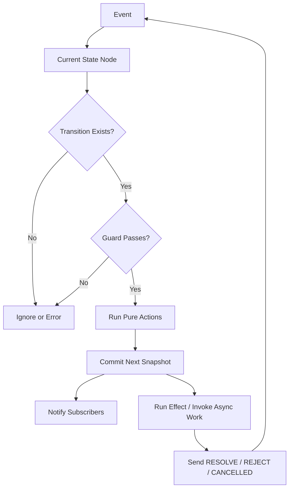

# Part 122 — Build a Workflow Engine for React

> Tujuan bagian ini: membangun workflow engine kecil dari nol agar kita memahami apa yang sebenarnya dilakukan oleh state machine/statechart/actor library saat mengorkestrasi UI kompleks.

Part 121 membangun client store: snapshot, subscription, selector, persistence. Store menjawab pertanyaan:

```txt
Apa state sekarang?
Siapa yang membaca?
Siapa yang menulis?
```

Workflow engine menjawab pertanyaan lebih ketat:

```txt
State apa saja yang legal?
Event apa saja yang boleh terjadi di setiap state?
Apa guard-nya?
Apa action sinkronnya?
Apa effect async-nya?
Bagaimana cancellation dan race ditangani?
Bagaimana UI tahu command sedang pending, berhasil, gagal, atau perlu retry?
```

React tidak memaksa kita memakai state machine. Tetapi semakin workflow mendekati domain nyata—approval, submission, payment, onboarding, upload, review, enforcement lifecycle—semakin berbahaya jika state hanya berupa beberapa boolean.

---

## 1. Boolean Soup Problem

Contoh umum:

```ts
type BadWorkflowState = {
  isEditing: boolean;
  isSubmitting: boolean;
  isSuccess: boolean;
  isError: boolean;
  canRetry: boolean;
  isConfirmOpen: boolean;
  error: string | null;
};
```

State ini mengizinkan kombinasi ilegal:

```txt
isSubmitting=true, isSuccess=true
isEditing=true, isConfirmOpen=true, isSubmitting=true
isError=false, error='network failed'
canRetry=true, isSubmitting=true
```

Masalahnya bukan TypeScript kurang kuat. Modelnya yang salah. Workflow bukan kumpulan boolean independen. Workflow adalah **finite set of states** dengan **legal transitions**.

---

## 2. Target Model

Kita ingin menulis workflow seperti ini:

```ts
const approvalWorkflow = createWorkflow({
  id: 'case-approval',
  initial: 'idle',
  context: {
    caseId: '',
    error: null as string | null,
    requestId: null as string | null,
  },
  states: {
    idle: {
      on: {
        SUBMIT: {
          target: 'confirming',
          guard: 'hasCaseId',
        },
      },
    },
    confirming: {
      on: {
        CONFIRM: {
          target: 'submitting',
          actions: ['assignRequestId'],
          effect: 'submitApproval',
        },
        CANCEL: { target: 'idle' },
      },
    },
    submitting: {
      on: {
        RESOLVE: { target: 'success' },
        REJECT: {
          target: 'failure',
          actions: ['assignError'],
        },
        CANCEL: {
          target: 'idle',
          actions: ['clearRequest'],
        },
      },
    },
    failure: {
      on: {
        RETRY: {
          target: 'submitting',
          actions: ['assignRequestId'],
          effect: 'submitApproval',
        },
        DISMISS: { target: 'idle' },
      },
    },
    success: {
      on: {
        RESET: { target: 'idle', actions: ['clear'] },
      },
    },
  },
});
```

UI memakai snapshot:

```tsx
function ApprovalButton() {
  const workflow = useApprovalWorkflow();
  const snapshot = useWorkflowSelector(workflow, s => ({
    value: s.value,
    canSubmit: s.can('SUBMIT'),
    canRetry: s.can('RETRY'),
  }));

  if (snapshot.value === 'failure') {
    return <button onClick={() => workflow.send({ type: 'RETRY' })}>Retry</button>;
  }

  return (
    <button
      disabled={!snapshot.canSubmit}
      onClick={() => workflow.send({ type: 'SUBMIT' })}
    >
      Submit for approval
    </button>
  );
}
```

---

## 3. Engine Concepts



Vocabulary:

| Concept | Meaning |
|---|---|
| State value | Nama fase workflow saat ini, misalnya `idle`, `submitting`, `failure` |
| Context | Extended data yang dibutuhkan workflow, misalnya `caseId`, `error`, `requestId` |
| Event | Input diskret, misalnya `SUBMIT`, `CANCEL`, `RESOLVE` |
| Transition | Perpindahan legal dari state A ke state B karena event tertentu |
| Guard | Predicate yang menentukan transition boleh terjadi atau tidak |
| Action | Update sinkron terhadap context/snapshot |
| Effect | Kerja asynchronous/external setelah transition committed |
| Snapshot | Value + context + metadata yang dibaca UI |

Rule penting:

```txt
Transition resolution harus pure.
Effect async tidak boleh menentukan target sebelum transition committed kecuali direpresentasikan sebagai event baru.
```

---

## 4. Type Definitions

Kita mulai sederhana.

```ts
type EventObject = {
  type: string;
  [key: string]: unknown;
};

type WorkflowSnapshot<TContext> = {
  value: string;
  context: TContext;
  status: 'active' | 'done' | 'stopped';
  changed: boolean;
};

type Guard<TContext, TEvent extends EventObject> = (args: {
  context: TContext;
  event: TEvent;
}) => boolean;

type Action<TContext, TEvent extends EventObject> = (args: {
  context: TContext;
  event: TEvent;
}) => Partial<TContext> | void;

type Effect<TContext, TEvent extends EventObject> = (args: {
  context: TContext;
  event: TEvent;
  send: (event: EventObject) => void;
  signal: AbortSignal;
}) => void | Promise<void>;
```

Transition config:

```ts
type TransitionConfig<TContext, TEvent extends EventObject> = {
  target?: string;
  guard?: string | Guard<TContext, TEvent>;
  actions?: Array<string | Action<TContext, TEvent>>;
  effect?: string | Effect<TContext, TEvent>;
};

type StateNodeConfig<TContext> = {
  on?: Record<string, TransitionConfig<TContext, any>>;
  entry?: Array<string | Action<TContext, any>>;
  exit?: Array<string | Action<TContext, any>>;
  final?: boolean;
};

type WorkflowConfig<TContext> = {
  id: string;
  initial: string;
  context: TContext;
  states: Record<string, StateNodeConfig<TContext>>;
  guards?: Record<string, Guard<TContext, any>>;
  actions?: Record<string, Action<TContext, any>>;
  effects?: Record<string, Effect<TContext, any>>;
};
```

---

## 5. Pure Transition Resolver

Resolver menerima snapshot + event dan menghasilkan next snapshot + effect to run.

```ts
type ResolvedTransition<TContext> = {
  snapshot: WorkflowSnapshot<TContext>;
  effect?: Effect<TContext, EventObject>;
  effectEvent?: EventObject;
};

function resolveWorkflowTransition<TContext>(
  config: WorkflowConfig<TContext>,
  snapshot: WorkflowSnapshot<TContext>,
  event: EventObject,
): ResolvedTransition<TContext> {
  const stateNode = config.states[snapshot.value];
  const transition = stateNode?.on?.[event.type];

  if (!transition) {
    return {
      snapshot: { ...snapshot, changed: false },
    };
  }

  const guard = resolveGuard(config, transition.guard);
  if (guard && !guard({ context: snapshot.context, event })) {
    return {
      snapshot: { ...snapshot, changed: false },
    };
  }

  let nextContext = snapshot.context;

  for (const actionRef of stateNode.exit ?? []) {
    nextContext = applyAction(config, nextContext, event, actionRef);
  }

  for (const actionRef of transition.actions ?? []) {
    nextContext = applyAction(config, nextContext, event, actionRef);
  }

  const nextValue = transition.target ?? snapshot.value;
  const nextNode = config.states[nextValue];

  for (const actionRef of nextNode.entry ?? []) {
    nextContext = applyAction(config, nextContext, event, actionRef);
  }

  const nextSnapshot: WorkflowSnapshot<TContext> = {
    value: nextValue,
    context: nextContext,
    status: nextNode.final ? 'done' : 'active',
    changed: true,
  };

  return {
    snapshot: nextSnapshot,
    effect: resolveEffect(config, transition.effect),
    effectEvent: event,
  };
}
```

Helpers:

```ts
function resolveGuard<TContext>(
  config: WorkflowConfig<TContext>,
  guard?: string | Guard<TContext, any>,
) {
  if (!guard) return undefined;
  if (typeof guard === 'function') return guard;
  const resolved = config.guards?.[guard];
  if (!resolved) throw new Error(`Unknown guard: ${guard}`);
  return resolved;
}

function resolveEffect<TContext>(
  config: WorkflowConfig<TContext>,
  effect?: string | Effect<TContext, any>,
) {
  if (!effect) return undefined;
  if (typeof effect === 'function') return effect;
  const resolved = config.effects?.[effect];
  if (!resolved) throw new Error(`Unknown effect: ${effect}`);
  return resolved;
}

function applyAction<TContext>(
  config: WorkflowConfig<TContext>,
  context: TContext,
  event: EventObject,
  actionRef: string | Action<TContext, any>,
): TContext {
  const action = typeof actionRef === 'function'
    ? actionRef
    : config.actions?.[actionRef];

  if (!action) {
    throw new Error(`Unknown action: ${String(actionRef)}`);
  }

  const patch = action({ context, event });

  if (!patch) {
    return context;
  }

  return { ...context, ...patch };
}
```

Keterbatasan sengaja:

- belum mendukung nested states;
- belum mendukung parallel states;
- belum mendukung delayed transition;
- belum mendukung spawned actors penuh;
- belum mendukung typed event inference sempurna.

Kita sedang membangun mental model, bukan mengganti XState.

---

## 6. Interpreter: Runtime Engine

Resolver pure belum cukup. Kita butuh runtime yang menyimpan snapshot, menerima event, notify subscriber, dan menjalankan effect.

```ts
type WorkflowActor<TContext> = {
  getSnapshot(): WorkflowSnapshot<TContext>;
  send(event: EventObject): void;
  subscribe(listener: () => void): () => void;
  stop(): void;
};

export function createWorkflowActor<TContext>(
  config: WorkflowConfig<TContext>,
): WorkflowActor<TContext> {
  let snapshot: WorkflowSnapshot<TContext> = {
    value: config.initial,
    context: config.context,
    status: 'active',
    changed: false,
  };

  const listeners = new Set<() => void>();
  const abortControllers = new Set<AbortController>();
  let stopped = false;

  function notify() {
    listeners.forEach(listener => listener());
  }

  function getSnapshot() {
    return snapshot;
  }

  function send(event: EventObject) {
    if (stopped || snapshot.status !== 'active') return;

    const result = resolveWorkflowTransition(config, snapshot, event);

    if (!result.snapshot.changed) return;

    snapshot = result.snapshot;
    notify();

    if (result.effect) {
      runEffect(result.effect, result.effectEvent ?? event);
    }
  }

  function runEffect(effect: Effect<TContext, EventObject>, event: EventObject) {
    const controller = new AbortController();
    abortControllers.add(controller);

    Promise.resolve(
      effect({
        context: snapshot.context,
        event,
        send,
        signal: controller.signal,
      }),
    ).catch(error => {
      if (controller.signal.aborted) return;
      send({ type: 'EFFECT_ERROR', error });
    }).finally(() => {
      abortControllers.delete(controller);
    });
  }

  function subscribe(listener: () => void) {
    listeners.add(listener);
    return () => listeners.delete(listener);
  }

  function stop() {
    stopped = true;
    snapshot = { ...snapshot, status: 'stopped', changed: true };
    abortControllers.forEach(controller => controller.abort());
    abortControllers.clear();
    notify();
    listeners.clear();
  }

  return { getSnapshot, send, subscribe, stop };
}
```

Sekarang kita punya actor kecil.

---

## 7. React Integration

Sama seperti Part 121, kita pakai `useSyncExternalStore`.

```tsx
import { useEffect, useRef, useSyncExternalStore } from 'react';

export function useWorkflowActor<TContext>(
  config: WorkflowConfig<TContext>,
): WorkflowActor<TContext> {
  const ref = useRef<WorkflowActor<TContext> | null>(null);

  if (ref.current === null) {
    ref.current = createWorkflowActor(config);
  }

  useEffect(() => {
    const actor = ref.current!;
    return () => actor.stop();
  }, []);

  return ref.current;
}

export function useWorkflowSnapshot<TContext>(
  actor: WorkflowActor<TContext>,
): WorkflowSnapshot<TContext> {
  return useSyncExternalStore(
    actor.subscribe,
    actor.getSnapshot,
    actor.getSnapshot,
  );
}
```

Basic usage:

```tsx
function ApprovalPanel() {
  const actor = useWorkflowActor(approvalWorkflow);
  const snapshot = useWorkflowSnapshot(actor);

  switch (snapshot.value) {
    case 'idle':
      return <button onClick={() => actor.send({ type: 'SUBMIT' })}>Submit</button>;
    case 'confirming':
      return (
        <ConfirmDialog
          onConfirm={() => actor.send({ type: 'CONFIRM' })}
          onCancel={() => actor.send({ type: 'CANCEL' })}
        />
      );
    case 'submitting':
      return <LoadingState />;
    case 'failure':
      return <RetryState onRetry={() => actor.send({ type: 'RETRY' })} />;
    case 'success':
      return <SuccessState />;
  }
}
```

---

## 8. Selector Support

Full snapshot subscription bisa membuat component re-render terlalu sering.

```tsx
function SubmitButton() {
  const snapshot = useWorkflowSnapshot(actor); // too broad
}
```

Selector:

```tsx
type Equality<T> = (a: T, b: T) => boolean;

export function useWorkflowSelector<TContext, TSelected>(
  actor: WorkflowActor<TContext>,
  selector: (snapshot: WorkflowSnapshot<TContext>) => TSelected,
  equality: Equality<TSelected> = Object.is,
): TSelected {
  const lastRef = useRef<{
    snapshot: WorkflowSnapshot<TContext>;
    selected: TSelected;
  } | null>(null);

  function getSelectedSnapshot() {
    const snapshot = actor.getSnapshot();
    const last = lastRef.current;

    if (last && Object.is(last.snapshot, snapshot)) {
      return last.selected;
    }

    const selected = selector(snapshot);

    if (last && equality(last.selected, selected)) {
      lastRef.current = { snapshot, selected: last.selected };
      return last.selected;
    }

    lastRef.current = { snapshot, selected };
    return selected;
  }

  return useSyncExternalStore(
    actor.subscribe,
    getSelectedSnapshot,
    getSelectedSnapshot,
  );
}
```

Usage:

```tsx
const isSubmitting = useWorkflowSelector(actor, s => s.value === 'submitting');
const error = useWorkflowSelector(actor, s => s.context.error);
```

---

## 9. `can(event)` Capability

UI sering perlu tahu action legal atau tidak.

Tambahkan helper:

```ts
function canTransition<TContext>(
  config: WorkflowConfig<TContext>,
  snapshot: WorkflowSnapshot<TContext>,
  event: EventObject,
): boolean {
  const stateNode = config.states[snapshot.value];
  const transition = stateNode?.on?.[event.type];

  if (!transition) return false;

  const guard = resolveGuard(config, transition.guard);
  return guard ? guard({ context: snapshot.context, event }) : true;
}
```

Expose dari actor:

```ts
type WorkflowActor<TContext> = {
  getSnapshot(): WorkflowSnapshot<TContext>;
  send(event: EventObject): void;
  can(event: EventObject | string): boolean;
  subscribe(listener: () => void): () => void;
  stop(): void;
};
```

Implementasi:

```ts
function can(event: EventObject | string) {
  return canTransition(
    config,
    snapshot,
    typeof event === 'string' ? { type: event } : event,
  );
}
```

UI:

```tsx
<button
  disabled={!actor.can('CONFIRM')}
  onClick={() => actor.send({ type: 'CONFIRM' })}
>
  Confirm
</button>
```

Peringatan: `can` untuk UI adalah convenience. Backend tetap authority untuk authorization/transition final.

---

## 10. Async Invocation and Request Identity

Effect async mudah menyebabkan stale response.

Naive effect:

```ts
effects: {
  async submitApproval({ context, send }) {
    await api.approve(context.caseId);
    send({ type: 'RESOLVE' });
  }
}
```

Masalah: user bisa cancel atau submit ulang. Response lama tetap mengirim `RESOLVE`.

Gunakan request ID:

```ts
type ApprovalContext = {
  caseId: string;
  requestId: string | null;
  error: string | null;
};
```

Action:

```ts
actions: {
  assignRequestId() {
    return { requestId: crypto.randomUUID(), error: null };
  },
  clearRequest() {
    return { requestId: null };
  },
  assignError({ event }) {
    return { error: String(event.error ?? 'Unknown error') };
  },
}
```

Effect captures request ID:

```ts
effects: {
  async submitApproval({ context, send, signal }) {
    const requestId = context.requestId;

    try {
      await api.approve(context.caseId, { signal });
      send({ type: 'RESOLVE', requestId });
    } catch (error) {
      if (signal.aborted) return;
      send({ type: 'REJECT', requestId, error });
    }
  },
}
```

Transitions guard response:

```ts
guards: {
  matchesRequest({ context, event }) {
    return event.requestId === context.requestId;
  },
},
states: {
  submitting: {
    on: {
      RESOLVE: { target: 'success', guard: 'matchesRequest' },
      REJECT: { target: 'failure', guard: 'matchesRequest', actions: ['assignError'] },
    },
  },
}
```

This is the difference between async hope and async discipline.

---

## 11. Cancellation Semantics

Effect cancellation needs two levels:

1. Abort external operation if possible.
2. Ignore stale completion if abort cannot stop it.

`AbortController` handles the first. Request identity handles the second.

```ts
CANCEL: {
  target: 'idle',
  actions: ['clearRequest'],
}
```

But our engine currently does not abort effect when leaving a state. It aborts only on actor stop. Add active invocation tracking by state.

```ts
type ActiveEffect = {
  stateValue: string;
  controller: AbortController;
};

const activeEffects = new Set<ActiveEffect>();
```

When transition leaves state, abort effects attached to previous state:

```ts
function abortEffectsForState(stateValue: string) {
  for (const active of activeEffects) {
    if (active.stateValue === stateValue) {
      active.controller.abort();
      activeEffects.delete(active);
    }
  }
}
```

In `send`:

```ts
const previousValue = snapshot.value;
const result = resolveWorkflowTransition(config, snapshot, event);

if (!result.snapshot.changed) return;

snapshot = result.snapshot;

if (snapshot.value !== previousValue) {
  abortEffectsForState(previousValue);
}

notify();
```

When running effect:

```ts
function runEffect(effect: Effect<TContext, EventObject>, event: EventObject, stateValue: string) {
  const controller = new AbortController();
  const active = { stateValue, controller };
  activeEffects.add(active);

  Promise.resolve(effect({
    context: snapshot.context,
    event,
    send,
    signal: controller.signal,
  })).finally(() => {
    activeEffects.delete(active);
  });
}
```

This mirrors invoked service lifecycle: active while the owning state remains active.

---

## 12. Entry Effects vs Transition Effects

Sometimes effect belongs to target state, not transition.

Example: entering `submitting` should always submit, regardless of whether transition was `CONFIRM` or `RETRY`.

Add `invoke` to state node:

```ts
type StateNodeConfig<TContext> = {
  on?: Record<string, TransitionConfig<TContext, any>>;
  entry?: Array<string | Action<TContext, any>>;
  exit?: Array<string | Action<TContext, any>>;
  invoke?: string | Effect<TContext, any>;
  final?: boolean;
};
```

When entering target:

```ts
const invoke = resolveEffect(config, nextNode.invoke);
```

Run it after commit.

Conceptually:

```txt
Transition effect = caused by a specific event.
State invoke = caused by being in a state.
```

For most workflow engines, state-level invocation is cleaner for async lifecycle states:

```ts
submitting: {
  invoke: 'submitApproval',
  on: {
    RESOLVE: { target: 'success', guard: 'matchesRequest' },
    REJECT: { target: 'failure', guard: 'matchesRequest', actions: ['assignError'] },
    CANCEL: { target: 'idle', actions: ['clearRequest'] },
  },
}
```

---

## 13. Delayed Transitions

Some workflows need timeout:

- auto-dismiss toast;
- retry backoff;
- lockout timer;
- debounce workflow transition;
- confirmation timeout.

Add `after` config:

```ts
type StateNodeConfig<TContext> = {
  on?: Record<string, TransitionConfig<TContext, any>>;
  after?: Record<number, TransitionConfig<TContext, any>>;
};
```

When entering state, schedule timeout:

```ts
const activeTimers = new Set<number>();

function scheduleAfter(stateValue: string) {
  const after = config.states[stateValue].after;
  if (!after) return;

  for (const [delayText] of Object.entries(after)) {
    const delay = Number(delayText);
    const timer = window.setTimeout(() => {
      send({ type: `@@after.${stateValue}.${delay}` });
    }, delay);
    activeTimers.add(timer);
  }
}
```

But rather than injecting hidden event names, a production engine would resolve delayed transitions directly. For learning, hidden internal events show the principle: time is also an external event source.

Cancel timers on exit:

```ts
function clearTimers() {
  activeTimers.forEach(timer => window.clearTimeout(timer));
  activeTimers.clear();
}
```

Invariant:

```txt
No timer should outlive the state that scheduled it.
```

---

## 14. Actor-like Child Workflows

Sometimes one workflow owns multiple child workflows:

- upload manager owns per-file upload actors;
- notification center owns per-notification command actors;
- case page owns approval actor, assignment actor, comment actor;
- form builder owns per-section validation actors.

Minimal spawn:

```ts
type SpawnedActor = WorkflowActor<any>;

type ActorSystem = {
  spawn<TContext>(id: string, config: WorkflowConfig<TContext>): WorkflowActor<TContext>;
  get(id: string): WorkflowActor<any> | undefined;
  stop(id: string): void;
  stopAll(): void;
};

function createActorSystem(): ActorSystem {
  const actors = new Map<string, SpawnedActor>();

  return {
    spawn(id, config) {
      if (actors.has(id)) {
        throw new Error(`Actor already exists: ${id}`);
      }
      const actor = createWorkflowActor(config);
      actors.set(id, actor);
      return actor;
    },
    get(id) {
      return actors.get(id);
    },
    stop(id) {
      const actor = actors.get(id);
      actor?.stop();
      actors.delete(id);
    },
    stopAll() {
      actors.forEach(actor => actor.stop());
      actors.clear();
    },
  };
}
```

Parent communicates by event:

```ts
child.send({ type: 'START_UPLOAD', fileId });
```

Child reports to parent by callback/send injection:

```ts
effects: {
  async upload({ context, send }) {
    await uploadFile(context.file);
    send({ type: 'DONE' });
    parent.send({ type: 'FILE_UPLOAD_DONE', fileId: context.fileId });
  },
}
```

This is enough to understand actors. It is not enough to replace mature actor orchestration in critical apps.

---

## 15. React Provider for Workflow Actor

For page-level workflow:

```tsx
const ApprovalWorkflowContext = createContext<WorkflowActor<ApprovalContext> | null>(null);

export function ApprovalWorkflowProvider({
  caseId,
  children,
}: {
  caseId: string;
  children: React.ReactNode;
}) {
  const ref = useRef<WorkflowActor<ApprovalContext> | null>(null);

  if (ref.current === null) {
    ref.current = createWorkflowActor({
      ...approvalWorkflow,
      context: {
        ...approvalWorkflow.context,
        caseId,
      },
    });
  }

  useEffect(() => {
    return () => ref.current?.stop();
  }, []);

  return (
    <ApprovalWorkflowContext.Provider value={ref.current}>
      {children}
    </ApprovalWorkflowContext.Provider>
  );
}

export function useApprovalActor() {
  const actor = useContext(ApprovalWorkflowContext);
  if (!actor) {
    throw new Error('useApprovalActor must be used inside ApprovalWorkflowProvider');
  }
  return actor;
}
```

Domain hooks:

```tsx
export function useApprovalStatus() {
  const actor = useApprovalActor();
  return useWorkflowSelector(actor, s => s.value);
}

export function useApprovalCommands() {
  const actor = useApprovalActor();
  return {
    submit: () => actor.send({ type: 'SUBMIT' }),
    confirm: () => actor.send({ type: 'CONFIRM' }),
    cancel: () => actor.send({ type: 'CANCEL' }),
    retry: () => actor.send({ type: 'RETRY' }),
  };
}
```

UI never needs transition table details.

---

## 16. Integration with Server State

Workflow engine should not duplicate server cache.

Bad:

```ts
type WorkflowContext = {
  case: CaseDto; // duplicated TanStack Query data
  comments: CommentDto[];
};
```

Better:

```ts
type WorkflowContext = {
  caseId: string;
  requestId: string | null;
  error: string | null;
};
```

Server state lives in query cache:

```tsx
const caseQuery = useCaseQuery(caseId);
const approval = useApprovalActor();
```

Mutation can be triggered as workflow effect:

```ts
effects: {
  async submitApproval({ context, send, signal }) {
    try {
      await approveCase({ caseId: context.caseId, signal });
      queryClient.invalidateQueries({ queryKey: caseKeys.detail(context.caseId) });
      send({ type: 'RESOLVE', requestId: context.requestId });
    } catch (error) {
      if (signal.aborted) return;
      send({ type: 'REJECT', requestId: context.requestId, error });
    }
  },
}
```

But injecting `queryClient` directly into machine config makes testing harder. Prefer dependency injection:

```ts
function createApprovalWorkflow(deps: {
  approveCase(input: { caseId: string; signal: AbortSignal }): Promise<void>;
  invalidateCase(caseId: string): void;
}) {
  return createWorkflow({
    // ...
    effects: {
      async submitApproval({ context, send, signal }) {
        try {
          await deps.approveCase({ caseId: context.caseId, signal });
          deps.invalidateCase(context.caseId);
          send({ type: 'RESOLVE', requestId: context.requestId });
        } catch (error) {
          if (signal.aborted) return;
          send({ type: 'REJECT', requestId: context.requestId, error });
        }
      },
    },
  });
}
```

---

## 17. Observability

Workflow engine gives excellent telemetry points:

```ts
type WorkflowTransitionLog = {
  workflowId: string;
  from: string;
  to: string;
  event: string;
  allowed: boolean;
  guardRejected?: boolean;
  at: number;
  durationMs?: number;
  correlationId?: string;
};
```

Instrumentation point in `send`:

```ts
function send(event: EventObject) {
  const from = snapshot.value;
  const startedAt = performance.now();
  const result = resolveWorkflowTransition(config, snapshot, event);
  const to = result.snapshot.value;

  logTransition({
    workflowId: config.id,
    from,
    to,
    event: event.type,
    allowed: result.snapshot.changed,
    at: Date.now(),
    durationMs: performance.now() - startedAt,
  });

  // commit etc.
}
```

Telemetry harus redacted. Jangan log full context jika context mengandung PII, tokens, atau sensitive case details.

---

## 18. Testing the Pure Resolver

Test paling penting tidak butuh React.

```ts
test('idle SUBMIT goes to confirming when case id exists', () => {
  const snapshot = {
    value: 'idle',
    context: { caseId: 'CASE-1', requestId: null, error: null },
    status: 'active' as const,
    changed: false,
  };

  const result = resolveWorkflowTransition(
    approvalWorkflow,
    snapshot,
    { type: 'SUBMIT' },
  );

  expect(result.snapshot.value).toBe('confirming');
});

test('idle SUBMIT is rejected when case id is missing', () => {
  const snapshot = {
    value: 'idle',
    context: { caseId: '', requestId: null, error: null },
    status: 'active' as const,
    changed: false,
  };

  const result = resolveWorkflowTransition(
    approvalWorkflow,
    snapshot,
    { type: 'SUBMIT' },
  );

  expect(result.snapshot.value).toBe('idle');
  expect(result.snapshot.changed).toBe(false);
});
```

Transition table coverage:

```txt
[ ] Every state has explicit tests for allowed events.
[ ] Important disallowed events are tested.
[ ] Guards are tested independently.
[ ] Actions are tested as pure context transforms.
[ ] Async effects are tested through actor integration.
```

---

## 19. Testing Actor Runtime

Test async effect:

```ts
test('submitting resolves to success', async () => {
  const approveCase = vi.fn().mockResolvedValue(undefined);
  const actor = createWorkflowActor(createApprovalWorkflow({
    approveCase,
    invalidateCase: vi.fn(),
  }));

  actor.send({ type: 'SUBMIT' });
  actor.send({ type: 'CONFIRM' });

  await waitFor(() => {
    expect(actor.getSnapshot().value).toBe('success');
  });
});
```

Test cancellation:

```ts
test('cancel prevents stale resolve', async () => {
  let resolve!: () => void;
  const approveCase = vi.fn(() => new Promise<void>(r => { resolve = r; }));

  const actor = createWorkflowActor(createApprovalWorkflow({
    approveCase,
    invalidateCase: vi.fn(),
  }));

  actor.send({ type: 'SUBMIT' });
  actor.send({ type: 'CONFIRM' });
  actor.send({ type: 'CANCEL' });

  resolve();

  await Promise.resolve();

  expect(actor.getSnapshot().value).toBe('idle');
});
```

---

## 20. Testing React Integration

UI tests should assert observable behavior.

```tsx
test('approval panel shows retry on failure', async () => {
  const approveCase = vi.fn().mockRejectedValue(new Error('network'));

  render(
    <ApprovalWorkflowProvider deps={{ approveCase, invalidateCase: vi.fn() }} caseId="CASE-1">
      <ApprovalPanel />
    </ApprovalWorkflowProvider>
  );

  await user.click(screen.getByRole('button', { name: /submit/i }));
  await user.click(screen.getByRole('button', { name: /confirm/i }));

  expect(await screen.findByRole('button', { name: /retry/i })).toBeInTheDocument();
});
```

Do not test implementation internals like “action function was called before entry action” unless that ordering is public engine contract.

---

## 21. Accessibility as Workflow Contract

UI workflow state must drive accessibility state:

| Workflow state | UI accessibility implication |
|---|---|
| `confirming` | focus moves into modal; background inert |
| `submitting` | submit button disabled or busy; progress announced if relevant |
| `failure` | error message associated with control; retry available |
| `success` | success announcement or navigation |
| `idle` | default focus path restored |

Workflow engine should not manipulate DOM. But workflow state should make accessibility derivable.

Example:

```tsx
const isSubmitting = useWorkflowSelector(actor, s => s.value === 'submitting');

<button disabled={isSubmitting} aria-busy={isSubmitting}>
  Submit
</button>
```

---

## 22. When to Use This vs XState

Use simple reducer if:

- transitions are local;
- states are flat;
- no async invocation lifecycle;
- few events;
- no actor hierarchy.

Use small custom workflow engine if:

- you need consistent semantics in a narrow domain;
- engine requirements are simple and stable;
- team accepts maintenance cost;
- you want zero dependency for a controlled internal primitive.

Use XState/statechart library if:

- nested/parallel states matter;
- actor hierarchy matters;
- invoked services and cancellation are central;
- visual tooling helps communication;
- workflow is business-critical;
- testing transition graph matters;
- multiple teams need shared semantics.

Do not write your own workflow engine because “libraries are heavy” unless you have already priced the maintenance, edge cases, and debugging cost.

---

## 23. Failure Modes

### 23.1 Effect Inside Resolver

Buruk:

```ts
function resolveTransition(...) {
  api.submit(); // side effect during pure transition
  return next;
}
```

Dampak:

- cannot test pure transition;
- replay/debug unsafe;
- Strict Mode/concurrent rendering assumptions violated if resolver is used in render path;
- race hidden.

Solusi:

```txt
Resolver returns effect descriptor.
Interpreter runs effect after commit.
```

---

### 23.2 Stale Async Completion

Gejala:

- user cancel, tetapi success muncul;
- retry lama overwrite retry baru;
- modal closed but callback reopens state.

Solusi:

- AbortController;
- requestId guard;
- state-level invocation lifecycle;
- ignore result if actor stopped.

---

### 23.3 Transition Explosion

Gejala:

- setiap state punya banyak event copy-paste;
- config sulit dibaca;
- edge cases tersembunyi.

Solusi:

- hierarchical states if needed;
- shared transition builder;
- move repeated behavior to parent state if using statechart library;
- simplify product flow.

---

### 23.4 Context Becomes Store Dump

Gejala:

- workflow context berisi semua entity DTO;
- server-state duplicated;
- mutation update harus sinkron ke banyak tempat.

Solusi:

```txt
Workflow context stores identifiers, request status, local decisions.
Server cache stores server data.
Client store stores durable client-only state.
```

---

### 23.5 UI Bypasses Workflow

Gejala:

- button directly calls API instead of sending event;
- modal closes without workflow event;
- hidden transition path not tested.

Solusi:

- expose domain commands only;
- lint/review boundary;
- test through user journey;
- telemetry shows all workflow transitions.

---

### 23.6 Impossible State Returns Through Props

Even if workflow engine is correct internally, parent props can contradict it.

Example:

```tsx
<ApprovalPanel isSubmitting={false} workflowState="submitting" />
```

Solusi:

- derive UI from single workflow snapshot;
- avoid parallel prop booleans;
- use view model hook that maps snapshot to props.

---

## 24. Production Checklist

```txt
[ ] States are finite and named with domain language.
[ ] Illegal states are unrepresentable.
[ ] Events are named as intents/results, not UI implementation details.
[ ] Transition table is reviewed with product/domain owner if business-critical.
[ ] Guards are pure.
[ ] Actions are pure context transforms.
[ ] Effects run after commit, never inside resolver.
[ ] Async effects have cancellation and stale-result guard.
[ ] Server state is not duplicated in workflow context.
[ ] UI derives from snapshot, not parallel booleans.
[ ] `can(event)` is used for UX only, not security authority.
[ ] Actor/store lifetime is scoped correctly.
[ ] Workflow has transition tests and journey tests.
[ ] Telemetry records transition name, result, and correlation ID safely.
[ ] Failure states are explicit and recoverable.
```

---

## 25. Mental Model Akhir

Workflow engine adalah **transition kernel** untuk UI kompleks.

Client store dari Part 121 memberi kita:

```txt
snapshot + subscription + selector
```

Workflow engine menambahkan:

```txt
finite states + legal events + guards + actions + effects + cancellation
```

Kalau store adalah database kecil di browser, workflow engine adalah **transaction coordinator** untuk user journey. Ia tidak hanya menyimpan state; ia menentukan transisi mana yang sah, kapan external effect boleh berjalan, bagaimana hasil async kembali sebagai event, dan bagaimana UI membaca status tanpa menciptakan boolean soup.

Ringkasan:

```txt
Do not model workflows as independent booleans.
Model them as finite states with explicit transitions.
Keep transition pure.
Run effects after commit.
Guard stale async results.
Derive UI from one snapshot.
```

Part berikutnya akan menutup seri dengan Final Architecture Playbook: bagaimana memilih semua teknik yang sudah dipelajari—hooks, context, composition, external store, query cache, state machine, testing, observability—dalam satu decision framework produksi.

---

## References

- React — `useSyncExternalStore`: https://react.dev/reference/react/useSyncExternalStore
- React — `useReducer`: https://react.dev/reference/react/useReducer
- React — Components and Hooks must be pure: https://react.dev/reference/rules/components-and-hooks-must-be-pure
- XState — Actors: https://stately.ai/docs/actors
- XState React: https://stately.ai/docs/xstate-react
