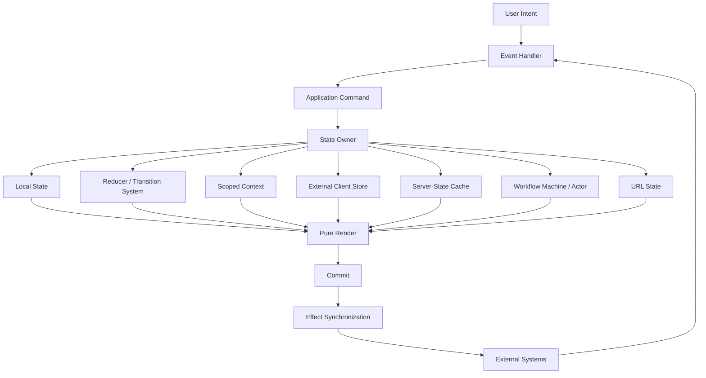
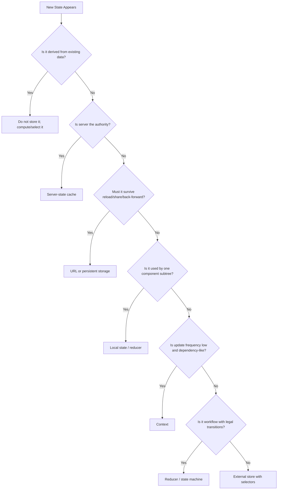
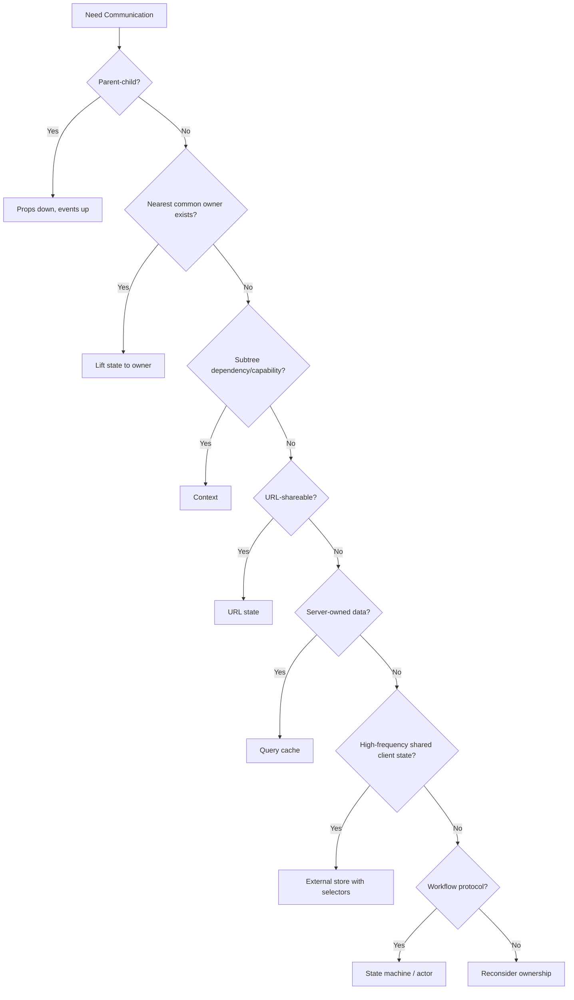

# Part 123 — Final Architecture Playbook

This is the closing part of the series.

The goal of this part is not to repeat every detail from the previous parts. The goal is to compress the whole series into an engineering playbook you can use during design review, code review, refactoring, debugging, and architecture decision-making.

A strong React engineer does not ask only:

```txt
Which library should I use?
```

A strong React engineer asks:

```txt
Who owns this state?
Who is allowed to change it?
What is the source of truth?
What is the lifecycle?
What is the authority?
What is the invalidation rule?
What is the reset boundary?
What is the failure mode?
How do we test and observe it?
```

That is the difference between using React and designing React systems.

---

## 1. The Final Mental Model

React UI architecture is a graph of ownership, rendering, communication, and side effects.



The invariant is simple:

```txt
Render describes UI.
Events express intent.
Reducers compute transitions.
Effects synchronize external systems.
Queries synchronize server state.
Machines orchestrate workflows.
Stores share client-owned state.
Context passes scoped dependencies or capabilities.
```

Most serious React bugs come from violating one of those boundaries.

---

## 2. The Architecture Primitive Map

Use this table as your first-pass placement guide.

| Problem | Prefer | Avoid |
|---|---|---|
| Pure UI toggle used by one component | `useState` | Global store |
| Multiple related local transitions | `useReducer` | Many independent setters |
| Deep subtree needs stable dependency | Context | Prop drilling through unrelated layers |
| Deep subtree needs high-frequency changing data | External store with selector | Broad Context value |
| Shared client-owned entity state | Zustand / Redux Toolkit / custom external store | Huge Context object |
| Remote data owned by server | TanStack Query / framework loader | Fetching everywhere with `useEffect` |
| URL-shareable filters/search/page | URL state | Hidden local state |
| Multi-step workflow with legal transitions | Reducer or state machine | Boolean soup |
| Complex async workflow with cancellation/retry/actors | XState / workflow engine | Scattered effects |
| Accessible reusable behavior primitive | Headless / compound component | Prop-heavy monolith |
| Product-specific UI composition | Page/application boundary | Smart component doing everything |
| Permission-gated UI | Capability/permission context + backend enforcement | Frontend-only authorization |
| Performance bottleneck from context fan-out | Split context / selector store | More random `useMemo` |

The table is not a law. It is a bias. Break it only when you can explain the trade-off.

---

## 3. The State Placement Algorithm

When deciding where state belongs, run this sequence.



The ordering matters.

Do not ask "Redux or Zustand?" first. Ask whether the state should exist at all.

---

## 4. The Source of Truth Rule

Every meaningful value must have exactly one authoritative owner.

Bad design:

```tsx
function UserEditor({ user }: { user: User }) {
  const [name, setName] = useState(user.name);
  const [profile, setProfile] = useState(user);

  // Which one is authoritative?
}
```

Better design:

```tsx
function UserEditor({ user }: { user: User }) {
  const [draft, setDraft] = useState(() => ({ name: user.name }));

  function resetFromUser(nextUser: User) {
    setDraft({ name: nextUser.name });
  }

  function submit() {
    return saveUserName({ userId: user.id, name: draft.name });
  }
}
```

The draft is intentionally local. The server user is authoritative. The submit command crosses the boundary.

The problem is not duplicated data by itself. The problem is duplicated authority.

---

## 5. The Ownership Test

For every state variable, answer this:

```txt
1. Who creates it?
2. Who reads it?
3. Who writes it?
4. Who resets it?
5. Who persists it?
6. Who invalidates it?
7. Who observes it?
8. Who owns failure recovery?
```

If those answers point to different places without an explicit protocol, the architecture is already drifting.

Example:

| State | Owner | Writer | Reset | Invalidation |
|---|---|---|---|---|
| Search input draft | Search form | Input events | Clear button / route change | N/A |
| Committed search query | URL | Submit/search event | URL navigation | URL canonicalization |
| Search results | Server-state cache | Query function | Query key change | Mutation/event invalidation |
| Selected rows | Page boundary | Row checkbox / bulk action | Query key change / clear selection | Page lifecycle |
| Bulk action pending | Mutation | Mutation lifecycle | Success/error | Mutation completion |

This is the level of explicitness expected in serious frontend systems.

---

## 6. Component Boundary Playbook

A component boundary is healthy when it has one primary role.

| Boundary Type | Responsibility |
|---|---|
| Primitive component | Semantic element + styling baseline |
| Headless component | Behavior, state coordination, accessibility |
| Compound root | Coordinates parts through context |
| Product component | Product-specific UI composition |
| Page boundary | Route/query/permission/data orchestration |
| Domain hook | Use-case read model + command API |
| Application hook | Workflow orchestration for a feature |
| Provider | Scoped dependency/capability/state boundary |

A component becomes dangerous when it combines too many roles:

```txt
fetches data
owns form state
owns modal state
checks permission
formats domain data
handles navigation
renders layout
performs mutation
logs analytics
contains retry policy
contains accessibility behavior
```

That is not a component. That is an unreviewed application layer.

Refactor by extracting boundaries, not by extracting random files.

---

## 7. The Communication Ladder

Use the lowest communication mechanism that preserves clarity.



Avoid jumping directly to event bus. Event bus can be valid, but usually only as a boundary protocol:

```txt
microfrontend bridge
analytics event channel
external runtime subscription
cross-tab browser event
WebSocket push event adapter
```

Inside one coherent React tree, event bus is often a sign that ownership was not modeled.

---

## 8. Context Decision Framework

Use Context when you need scoped propagation of a value through a subtree.

Good Context values:

```txt
theme
direction
density
form field metadata
compound component coordination
permission capability
modal service
analytics capability
logger
feature flags
clock/id generator for testing
stable command object
```

Risky Context values:

```txt
rapidly changing text input
large entity collection
server response cache
scroll position
mouse position
notification feed
every app setting in one AppContext
raw setter bag
```

The Context rule:

```txt
Context is a dependency passing mechanism first.
It can carry state, but it is not automatically a good state manager.
```

Provider design checklist:

```txt
Is the provider placed at the smallest correct scope?
Is the context value stable?
Can state and actions be split?
Does every consumer need every field?
Can high-frequency state move to an external store?
Can server state move to a query cache?
Does the provider hide dependencies that should be explicit props?
```

---

## 9. Hooks Correctness Checklist

Hooks are not magic. They are ordered state slots and synchronization contracts.

Before approving Hook-heavy code, check:

```txt
Rules of Hooks are obeyed.
Render stays pure.
Effects synchronize external systems only.
Effect dependencies reflect reactive values.
No event-specific logic is hidden inside Effects.
Refs are not used to bypass render correctness.
Memoization is not used as a correctness patch.
Custom hooks expose a coherent protocol.
Cleanup is symmetric with setup.
Async work has cancellation or stale-result guards.
Strict Mode does not reveal leaks or hidden assumptions.
```

A custom hook should be reviewed like a small service API.

Bad hook API:

```tsx
const { data, setData, loading, setLoading, error, setError } = useUserThing();
```

Better hook API:

```tsx
const userProfile = useUserProfile(userId);

userProfile.snapshot;
userProfile.rename({ name: "Ayu" });
userProfile.resetDraft();
userProfile.canSubmit;
```

The caller should manipulate intent, not internal mechanics.

---

## 10. Reducer and Transition Playbook

Use a reducer when state transitions have names, constraints, or relationships.

A reducer should model events:

```tsx
type Event =
  | { type: "draft.changed"; field: "name"; value: string }
  | { type: "submit.requested" }
  | { type: "submit.succeeded"; saved: User }
  | { type: "submit.failed"; error: string };
```

Not setters:

```tsx
type Event =
  | { type: "setName"; value: string }
  | { type: "setLoading"; value: boolean }
  | { type: "setError"; value: string | null };
```

The difference is not cosmetic. Event names encode domain intent.

Reducer checklist:

```txt
Events represent user/system intent.
State shape prevents impossible combinations.
Transitions are pure.
Async work stays outside reducer.
Stale async results are guarded by request ID or machine state.
Selectors hide internal shape.
Transition table can be tested independently.
```

---

## 11. External Store Playbook

Use an external store when many components need shared client-owned state and selective subscription matters.

A correct external store has this contract:

```tsx
type Store<T> = {
  getState(): T;
  setState(updater: T | ((prev: T) => T)): void;
  subscribe(listener: () => void): () => void;
};
```

With React integration:

```tsx
function useStore<T, S>(
  store: Store<T>,
  selector: (state: T) => S,
  isEqual: (a: S, b: S) => boolean = Object.is,
): S {
  // In production, use useSyncExternalStore or a library that implements it correctly.
  // The important contract: snapshot must be stable if underlying data did not change.
  throw new Error("Sketch only");
}
```

External store checklist:

```txt
Does the store own client state, not server cache?
Are snapshots immutable or stable?
Are selectors narrow?
Is equality correct?
Is store lifetime explicit: singleton, provider-scoped, request-scoped, or test-scoped?
Is persistence versioned and validated?
Does SSR/hydration need getServerSnapshot?
Are actions domain-level instead of setter bags?
```

Common smell:

```txt
A global store exists because passing props felt annoying.
```

That is not enough justification.

---

## 12. Server-State Playbook

Server state has different physics from client state.

Client state asks:

```txt
What does this UI currently intend?
```

Server state asks:

```txt
What do we currently believe about remote authority?
```

That means server state needs:

```txt
query identity
freshness policy
cache lifetime
invalidation policy
mutation lifecycle
optimistic strategy
rollback or compensation
refetch triggers
SSR/hydration strategy
error taxonomy
permission drift handling
```

Query key design is architecture design.

Example:

```tsx
const casesKeys = {
  all: ["cases"] as const,
  list: (tenantId: string, filters: CaseFilters) =>
    ["cases", tenantId, "list", canonicalizeFilters(filters)] as const,
  detail: (tenantId: string, caseId: string) =>
    ["cases", tenantId, "detail", caseId] as const,
};
```

Bad query keys create bad invalidation.

Mutation checklist:

```txt
Is the command idempotent?
Can duplicate submit happen?
What query keys are affected?
Is optimistic UI safe?
What is rollback behavior?
What is conflict behavior?
Should cache be directly updated or invalidated?
What happens after navigation?
How is server validation displayed?
```

Never treat server state as just another global store slice.

---

## 13. URL State Playbook

URL state is the right place for state that should survive navigation, refresh, sharing, and browser history.

Good URL state:

```txt
search query
filters
sort
page/cursor
selected tab when meaningful
view mode
entity id
modal route when deep-linkable
```

Bad URL state:

```txt
password/token/private data
large unsaved draft
high-frequency cursor position
non-serializable state
internal implementation flags
```

URL state checklist:

```txt
Is it serializable?
Is it canonicalized?
Is it validated at read boundary?
Does changing it reset dependent state?
Does it affect query keys?
Does browser back/forward behave correctly?
Does it leak sensitive information?
```

URL state is not merely a routing detail. It is a durable public API for the page.

---

## 14. Workflow Orchestration Playbook

Use workflow modeling when UI has legal states and legal transitions.

Examples:

```txt
multi-step onboarding
approval lifecycle
upload with retry/cancel
payment flow
bulk action confirmation
review/submit/rollback
case escalation
permission-sensitive task flow
```

Boolean soup smell:

```tsx
type State = {
  isOpen: boolean;
  isSubmitting: boolean;
  isSuccess: boolean;
  isError: boolean;
  isRetrying: boolean;
  isCancelled: boolean;
};
```

Better:

```tsx
type State =
  | { status: "idle" }
  | { status: "editing"; draft: Draft }
  | { status: "submitting"; draft: Draft; requestId: string }
  | { status: "failed"; draft: Draft; error: string }
  | { status: "succeeded"; result: Result };
```

Workflow checklist:

```txt
Are states explicit?
Are transitions named?
Are illegal states impossible?
Are guards centralized?
Are effects invoked from transition boundaries?
Is cancellation modeled?
Is retry modeled?
Is stale async result impossible or ignored?
Is navigation/back-button behavior defined?
Is observability evented by transition?
```

For small workflows, a reducer is enough.

For nested, parallel, invoked, cancelable, actor-like workflows, use a state machine or actor runtime.

---

## 15. Performance Playbook

Performance problems are usually topology problems before they are memoization problems.

Debug in this order:

```txt
1. What state changed?
2. Who owns that state?
3. How large is the render radius?
4. Which identities changed?
5. Which context providers changed?
6. Which external store selectors changed?
7. Which effects ran after commit?
8. Which layout work blocked paint?
9. Which list or subtree is too large?
10. Which network/cache behavior caused churn?
```

Do not start with:

```txt
Add useMemo everywhere.
```

Memoization checklist:

```txt
Is there a measured bottleneck?
Is the calculation expensive?
Is identity stability needed by memoized children or effect dependencies?
Can state be moved lower instead?
Can context be split instead?
Can selector subscription reduce rerender radius?
Will React Compiler handle this in compatible code?
Does memoization hide a correctness bug?
```

In React Compiler-era code, manual memoization becomes more targeted. But architecture still matters. A compiler cannot fix invalid ownership, bad query keys, or impossible state.

---

## 16. Accessibility as Architecture

Accessibility is not a polish layer. It is part of component contract.

For interactive primitives, define:

```txt
keyboard behavior
focus entry
focus return
focus containment
active descendant or roving tabindex model
ARIA roles/states/properties
labeling relationship
disabled/readonly behavior
screen reader announcement strategy
error message association
```

Examples:

| Component | Required Architectural Contract |
|---|---|
| Tabs | tablist/tab/tabpanel relationship, keyboard navigation, activation policy |
| Dialog | focus trap, focus return, inert background, Escape/backdrop policy |
| Combobox | popup relationship, active option, keyboard model |
| Form field | label, description, error, required/invalid state |
| Menu | roving focus, selection/activation semantics |

If a component library does not encode accessibility behavior as a stable contract, every product team will reinvent it badly.

---

## 17. Testing Strategy Matrix

Test the thing at the right boundary.

| Unit Under Test | Best Test |
|---|---|
| Pure selector | Input/output unit test |
| Reducer | Transition table test |
| Custom hook | Hook harness / component harness |
| Context provider | Provider harness with consumer |
| Headless component | Interaction + accessibility queries |
| Compound component | Contract tests for parts/root coordination |
| Server-state hook | QueryClient + mocked network |
| Mutation flow | Optimistic/rollback/invalidation test |
| Workflow | State-machine path tests + UI journey |
| Page orchestration | Integration test with router/query/permission harness |
| Component library state | Storybook scenarios + interaction tests |

Testing rule:

```txt
Test behavior, contracts, and invariants.
Do not test implementation choreography unless choreography is the contract.
```

A good test suite prevents architecture regression, not only visual regression.

---

## 18. Observability Playbook

In production, state bugs are often invisible unless you instrument transitions.

Log events, not random messages.

Good telemetry envelope:

```ts
type UiTelemetryEvent = {
  name: string;
  feature: string;
  entityType?: string;
  entityId?: string;
  correlationId?: string;
  workflowId?: string;
  fromState?: string;
  toState?: string;
  command?: string;
  outcome?: "started" | "succeeded" | "failed" | "cancelled" | "ignored";
  durationMs?: number;
  errorCode?: string;
};
```

Observe these boundaries:

```txt
user intent
command requested
mutation started/succeeded/failed
query invalidated/refetched
workflow transition
optimistic applied/rolled back
permission decision
modal opened/resolved/cancelled
navigation committed
error boundary triggered
performance hot path
```

Privacy rule:

```txt
Log structure and identifiers only when allowed.
Do not log private field values, credentials, tokens, or sensitive free text.
```

---

## 19. Anti-Pattern Map

| Smell | Usually Means | Refactor Toward |
|---|---|---|
| `AppContext` contains everything | No ownership model | Split providers / external store / query cache |
| Fetching in many Effects | No server-state boundary | Query hooks / framework loaders |
| Boolean soup | Workflow not modeled | Reducer / state machine |
| Setter props everywhere | Child controls parent internals | Intent callbacks / commands |
| State copied from props | Duplicated authority | Derived value / draft protocol / key reset |
| Event bus for UI coordination | Missing owner | Lifted state / context / workflow actor |
| Random `useMemo` everywhere | Performance superstition | Profiling + topology refactor |
| One component does everything | Missing boundaries | Page orchestration + domain hooks + view components |
| Disabled button for permission only | Security misconception | Backend authorization + frontend UX guard |
| `useEffect` transforms state | Derived data misplaced | Compute during render / reducer transition |
| `key={index}` in dynamic list | Identity bug waiting | Stable domain ID |
| External store singleton in SSR | Request leakage risk | Request-scoped/provider-scoped store |
| Query key missing filters | Cache collision | Complete canonical query key |
| Optimistic update without rollback | Inconsistent failure recovery | Rollback/compensation strategy |
| Modal close has no reason | Ambiguous workflow | Typed close/result protocol |

Architecture work is often just naming the smell correctly.

---

## 20. The Refactor Ladder

When a React area becomes difficult to reason about, do not rewrite immediately. Climb the ladder.

```txt
1. Name the state and owner.
2. Remove redundant derived state.
3. Move event-specific logic out of Effects.
4. Replace setter bags with intent callbacks.
5. Extract reducer when transitions are related.
6. Move server-owned data to query cache.
7. Move URL-worthy state to URL.
8. Split context by domain and volatility.
9. Move high-frequency shared state to external store with selectors.
10. Model workflow with machine/actor when transition space grows.
11. Extract page orchestration from view components.
12. Add tests for invariants before deeper refactor.
13. Add observability for production transition failures.
```

This is how you refactor safely under production constraints.

---

## 21. ADR Template for React State Decisions

Use this for decisions that affect multiple teams, features, or long-lived architecture.

```md
# ADR: <Decision Title>

## Status
Proposed | Accepted | Deprecated | Superseded

## Context
What problem are we solving?
What state exists?
Who reads it?
Who writes it?
Who owns authority?
What failure modes exist today?

## Decision
We will use <local state | reducer | context | external store | query cache | URL state | state machine> for <scope>.

## Ownership
- Source of truth:
- Writers:
- Readers:
- Reset boundary:
- Invalidation rule:
- Persistence rule:

## Alternatives Considered
1. Alternative A
   - Pros:
   - Cons:
2. Alternative B
   - Pros:
   - Cons:

## Consequences
Positive:
Negative:
Operational risk:
Testing impact:
Observability impact:
Migration impact:

## Review Trigger
Revisit this decision when:
- update frequency changes
- sharing radius changes
- server authority changes
- performance budget is violated
- workflow complexity grows
```

Good ADRs preserve engineering memory. Without them, every new engineer reopens old trade-offs without context.

---

## 22. Production Review Checklist

Before merging a serious React feature, ask these questions.

### State

```txt
Is every state value classified?
Is there exactly one source of truth?
Are derived values computed instead of stored?
Are reset semantics explicit?
Is state colocated as low as possible but as high as necessary?
```

### Hooks

```txt
Are hooks called only at valid locations?
Are effects actual synchronization, not derivation?
Are dependencies correct?
Is async work race-safe?
Are refs used only as escape hatches?
```

### Components

```txt
Does each component have a clear role?
Are public props stable and meaningful?
Are callbacks intent-based?
Are controlled/uncontrolled semantics documented?
Are accessibility contracts met?
```

### Context and Store

```txt
Is Context scoped narrowly?
Is provider value stable?
Is high-frequency state outside broad Context?
Are external store snapshots stable?
Are selectors narrow and equality rules correct?
```

### Server State

```txt
Are query keys complete and canonical?
Is freshness policy intentional?
Is invalidation scoped correctly?
Is optimistic behavior safe?
Are duplicate commands handled?
```

### Workflow

```txt
Are legal states explicit?
Are illegal states impossible?
Are transitions named?
Are permission/precondition checks explicit?
Are retry/cancel/failure paths modeled?
```

### Performance

```txt
Was performance measured before optimizing?
Is render radius acceptable?
Are large lists virtualized when needed?
Are context/provider fan-outs controlled?
Are layout effects minimized?
```

### Testing and Observability

```txt
Are reducer/machine invariants tested?
Are server-state flows tested with isolated cache?
Are UI interactions tested at observable boundary?
Are important transitions observable in production?
Are sensitive values excluded from telemetry?
```

---

## 23. Final Case Review: How to Think Like a Top-Tier React Engineer

Suppose you are designing a regulatory case management screen.

It has:

```txt
case detail header
permission-aware actions
case timeline
editable notes
document upload
approval workflow
related entities tab
notifications
modal confirmation
server validation
optimistic status update
route-shareable filters
```

A weak design says:

```txt
Put everything in one page component and pass props.
If prop drilling hurts, create CaseContext.
If that gets slow, add useMemo.
```

A strong design says:

```txt
Server authority:
- case detail query
- timeline query
- related entities query
- upload mutation
- approval mutation

URL authority:
- active tab
- timeline filters
- related entity filters

Local state:
- note draft
- upload drag state
- unsaved modal state

Workflow state:
- approval command lifecycle
- upload lifecycle
- discard-confirmation flow

Context/capability:
- permission decision service
- modal service
- analytics service
- design-system form field context

External store:
- notification connection status
- cross-page notification badge if client-owned and high-frequency

Component composition:
- headless tabs
- modal orchestrator
- permission gate
- form field primitives

Testing:
- query key tests
- mutation rollback tests
- reducer/machine transition tests
- page integration test
- Storybook state scenarios

Observability:
- command requested/succeeded/failed
- optimistic applied/rolled back
- permission denied
- workflow transition
- stale update ignored
```

That is architecture.

---

## 24. Final Principles

Keep these principles close.

```txt
State should be owned, not scattered.
Render should describe, not execute.
Effects should synchronize, not derive.
Context should pass capability, not hide everything.
Callbacks should express intent, not expose internals.
Reducers should encode transitions, not setter aliases.
Stores should share client-owned state, not server truth.
Queries should model server authority, freshness, and invalidation.
URL should hold shareable navigation state.
Machines should protect workflows from impossible states.
Performance should be profiled, not guessed.
Accessibility should be a contract, not decoration.
Testing should protect behavior and invariants.
Observability should make state transitions visible.
ADRs should preserve why, not only what.
```

The advanced level is not knowing more APIs.

The advanced level is knowing which API should not be used.

---

## 25. Series Completion

This is the final part of the planned series.

The series ends at:

```txt
Part 123 — Final Architecture Playbook
```

At this point, you should be able to reason about React state and orchestration from first principles:

```txt
runtime model
hook correctness
state topology
composition
context passing
component communication
client stores
server state
concurrency
workflow orchestration
architecture boundaries
testing
observability
case studies
build-from-scratch systems
```

The next level after this is no longer another React pattern list.

The next level is building and reviewing real systems with these invariants until the model becomes instinct.

---

## References

- React Docs — Managing State: https://react.dev/learn/managing-state
- React Docs — State as a Snapshot: https://react.dev/learn/state-as-a-snapshot
- React Docs — Synchronizing with Effects: https://react.dev/learn/synchronizing-with-effects
- React Docs — `useSyncExternalStore`: https://react.dev/reference/react/useSyncExternalStore
- React Docs — React Compiler: https://react.dev/learn/react-compiler
- React 19 Announcement: https://react.dev/blog/2024/12/05/react-19
- TanStack Query Docs: https://tanstack.com/query/latest
- TanStack Query — Query Keys: https://tanstack.com/query/v5/docs/framework/react/guides/query-keys
- TanStack Query — Optimistic Updates: https://tanstack.com/query/v5/docs/framework/react/guides/optimistic-updates
- XState/Stately Docs: https://stately.ai/docs/xstate
- XState React Docs: https://stately.ai/docs/xstate-react
- WAI-ARIA APG Patterns: https://www.w3.org/WAI/ARIA/apg/patterns/
