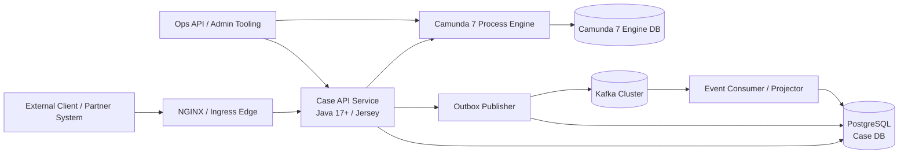
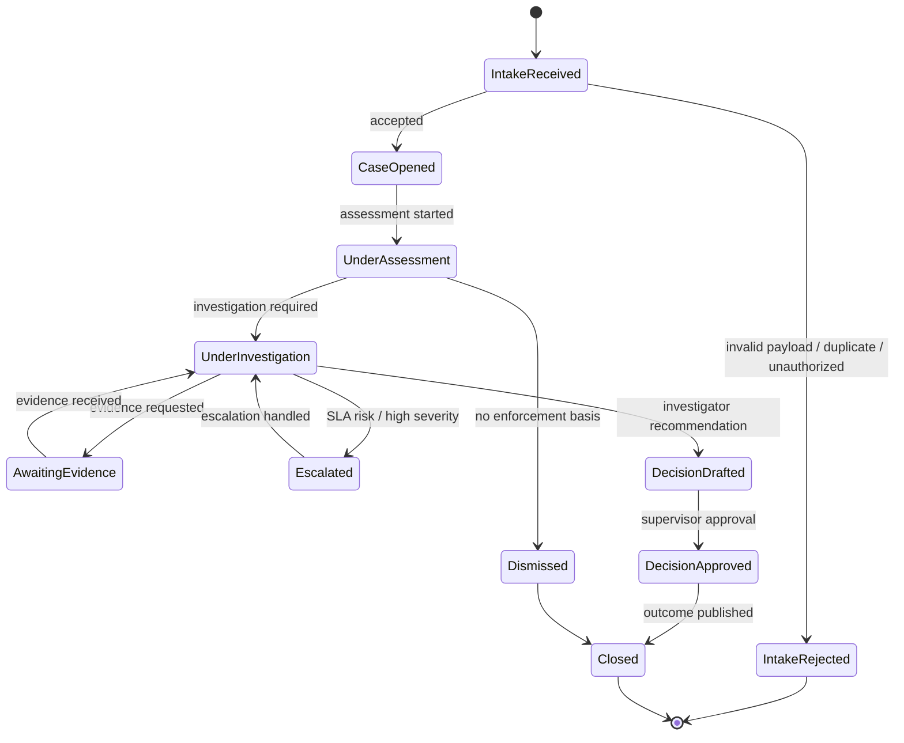
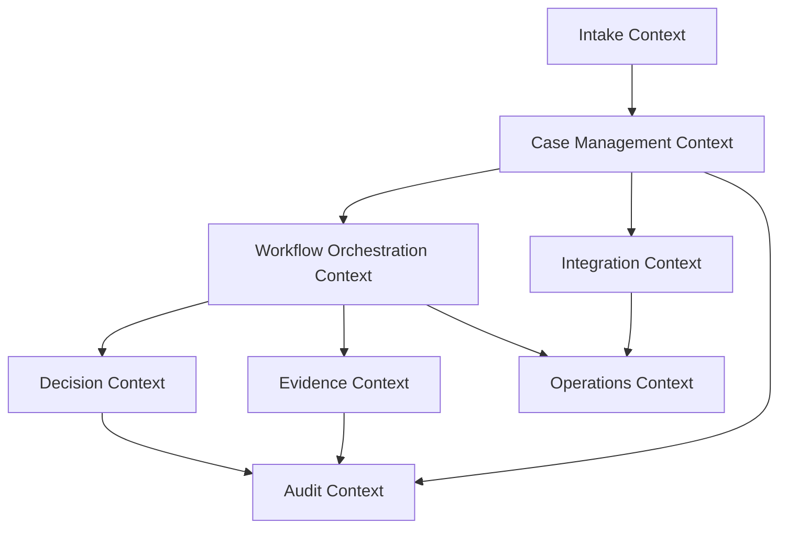
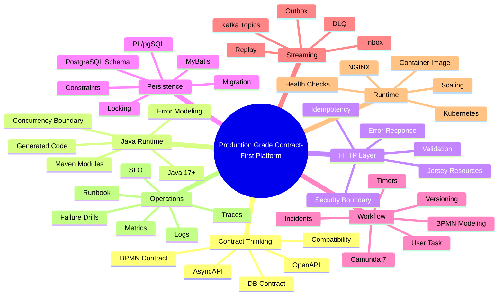
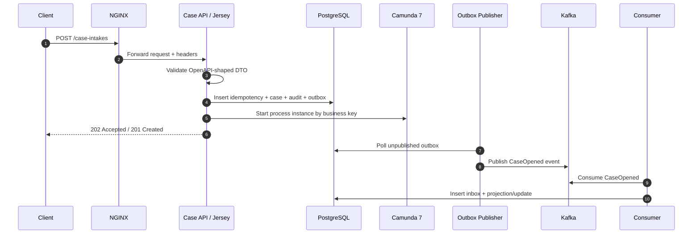

# Part 001 — System Skill Map and Case Study

Seri ini bukan tutorial "hello world" untuk Kubernetes, Kafka, Camunda, PostgreSQL, atau Java. Seri ini adalah latihan membangun sistem nyata: satu platform yang punya kontrak data, API, proses bisnis, transaksi database, event streaming, deployment Kubernetes, observability, dan recovery path.

Targetnya bukan sekadar bisa menjalankan service. Targetnya adalah bisa menjawab pertanyaan semacam ini:

- Kontrak mana yang menjadi sumber kebenaran ketika API, event, database, dan BPMN berubah bersamaan?
- Bagaimana memastikan workflow Camunda tidak menjadi tempat pembuangan semua business logic?
- Kapan logic sebaiknya ditaruh di Java, kapan di PostgreSQL, kapan di BPMN, dan kapan di Kafka consumer?
- Bagaimana merilis perubahan schema tanpa downtime?
- Bagaimana membuat event yang aman di-replay?
- Bagaimana mendesain idempotency sehingga retry tidak merusak data?
- Bagaimana membedakan state domain, state workflow, state audit, state integration, dan state operasi?
- Bagaimana tahu sistem siap production, bukan hanya siap demo?

Kita akan memakai studi kasus besar: **Regulatory Enforcement & Case Orchestration Platform**.

Platform ini menerima laporan, membuat kasus, memvalidasi data, menjalankan proses investigasi, mengelola human task, menghitung SLA, melakukan eskalasi, menyimpan audit trail, menerbitkan event, menerima event dari sistem lain, dan menyediakan endpoint untuk pencarian serta operasional.

Ini cukup kompleks untuk memaksa kita belajar hal-hal yang biasanya tidak muncul di contoh sederhana.

---

## 1. Apa yang Akan Dibangun

Bayangkan sebuah regulator memiliki platform internal untuk menangani lifecycle enforcement case.

Contoh domain:

1. Publik atau sistem eksternal mengirim laporan pelanggaran.
2. Sistem melakukan validasi awal.
3. Case dibuat dengan nomor referensi stabil.
4. Case masuk proses assessment.
5. Officer melakukan review.
6. Jika perlu investigasi, case masuk workflow investigasi.
7. Evidence dikumpulkan.
8. SLA berjalan.
9. Jika SLA mendekati breach, sistem membuat escalation task.
10. Decision dibuat: dismiss, warning, sanction, referral, atau prosecution recommendation.
11. Event diterbitkan untuk downstream system.
12. Semua perubahan terekam sebagai audit trail.
13. Operasional bisa melihat status proses, status data, event lag, incident, dan recovery action.

Kita tidak akan membangun seluruh UI. Fokus utama adalah backend platform, contract, workflow, data, event, deployment, dan operability.

---

## 2. Kenapa Studi Kasus Ini Cocok untuk Engineer Senior

Banyak tutorial backend mengajari pola yang terlalu datar:

```text
Controller -> Service -> Repository -> Database
```

Untuk sistem sederhana, itu cukup. Untuk platform kasus regulatory enforcement, pola itu cepat runtuh.

Masalah nyata muncul ketika:

- satu request bisa memulai workflow multi-hari;
- satu workflow bisa menunggu human task;
- satu event bisa datang terlambat;
- satu retry bisa mengeksekusi efek samping dua kali;
- satu proses bisa pindah versi;
- satu field baru perlu hadir di API, Kafka, DB, BPMN variable, dan reporting;
- satu release perlu berjalan tanpa menghentikan case aktif;
- satu downstream consumer perlu tetap berjalan walaupun event schema bertambah;
- satu officer bisa mengubah state bersamaan dengan timer escalation;
- satu incident Camunda perlu direpair tanpa merusak audit trail.

Studi kasus ini memaksa kita berpikir dalam **state**, **contract**, **transaction**, **event**, **workflow**, dan **operational recovery**.

---

## 3. Mental Model Besar

Sistem production-grade bukan kumpulan class. Sistem production-grade adalah kumpulan kontrak yang hidup bersama.

Kontrak utama di seri ini:

| Contract | Bentuk | Dipakai oleh | Risiko jika buruk |
|---|---|---|---|
| HTTP API contract | OpenAPI | Client, gateway, API test, generated model | Breaking change, ambiguous error, inconsistent validation |
| Event contract | AsyncAPI + schema | Kafka producer, consumer, replay tool | Consumer break, duplicate side effect, replay tidak aman |
| Database contract | DDL, constraint, function signature | Java service, MyBatis, reporting, migration | Data corrupt, migration gagal, invariant bocor |
| BPMN contract | BPMN model, process key, variable contract | Camunda engine, worker/delegate, operator | Incident storm, migration sulit, variable kacau |
| Runtime contract | Config, health, metrics, probes | Kubernetes, NGINX, platform ops | rollout buruk, false healthy, traffic loss |
| Build contract | Maven modules, dependency rules, generated sources | Developer, CI/CD, release pipeline | dependency drift, build tidak reproducible |
| Operational contract | runbook, alert, dashboard, repair procedure | SRE, support, engineer on-call | recovery lambat, data diperbaiki manual tanpa jejak |

Inti dari seri ini: **jangan mulai dari class Java**. Mulai dari kontrak dan invariant.

---

## 4. High-Level Architecture

Diagram berikut adalah peta kasar sistem yang akan kita jadikan rujukan sepanjang seri.



Ada beberapa keputusan penting dari awal:

1. **API service tidak hanya CRUD wrapper.** API service adalah boundary kontrak, validasi, idempotency, authorization, dan orchestration trigger.
2. **PostgreSQL bukan tempat menyimpan object Java mentah.** PostgreSQL menyimpan state domain yang bisa diaudit dan dipertahankan secara hukum.
3. **Camunda bukan database domain.** Camunda menyimpan state proses. Domain state tetap di database domain.
4. **Kafka bukan RPC.** Kafka dipakai untuk event streaming dan integration flow, bukan untuk menggantikan HTTP call sinkron secara membabi buta.
5. **Kubernetes bukan solusi desain aplikasi.** Kubernetes mengelola runtime, tetapi aplikasi tetap harus memiliki health model, shutdown model, idempotency, dan observability.
6. **Maven bukan hanya `mvn package`.** Maven menjadi boundary build, dependency governance, contract generation, testing lifecycle, dan release discipline.

---

## 5. Studi Kasus: Regulatory Enforcement Case Lifecycle

Kita definisikan lifecycle awal.



Ini terlihat seperti state machine sederhana. Tetapi di production, state di atas tersebar ke beberapa layer:

| Layer | Contoh state | Sifat |
|---|---|---|
| Domain state | `CASE_OPENED`, `UNDER_INVESTIGATION`, `CLOSED` | Harus kuat, bisa diaudit, menjadi sumber kebenaran bisnis |
| Workflow state | token BPMN sedang berada di user task tertentu | Mengatur orchestration, bukan menggantikan domain state |
| Task state | assigned, claimed, completed, overdue | Berkaitan dengan pekerjaan manusia |
| SLA state | due, breached, escalated, paused | Bisa dihitung, bisa juga disimpan sebagai snapshot |
| Event state | produced, published, consumed, failed | Integrasi dan reliability |
| Audit state | who did what, when, from where, why | Defensibility dan forensic trail |
| Operational state | pod restarting, lag tinggi, incident Camunda | Kesehatan runtime, bukan state bisnis |

Engineer yang matang tidak mencampur semua state ini ke satu enum besar.

---

## 6. Bounded Context Awal

Kita akan memakai beberapa bounded context sederhana namun cukup realistis.



Pembagian awal:

| Context | Tanggung jawab | Bukan tanggung jawab |
|---|---|---|
| Intake | menerima laporan, validasi awal, idempotency awal | menjalankan investigasi panjang |
| Case Management | lifecycle case, status domain, party, classification | menyimpan token BPMN |
| Workflow Orchestration | urutan pekerjaan, timer, message correlation, human task | menjadi sumber kebenaran domain |
| Evidence | metadata evidence, request evidence, status evidence | menyimpan binary besar di DB utama |
| Decision | recommendation, approval, outcome | menjalankan semua task workflow |
| Audit | immutable audit event internal | menjadi event bus eksternal |
| Integration | outbox, inbox, Kafka publishing/consuming | mengganti transaksi database lokal |
| Operations | repair, visibility, runbook endpoint | bypass business invariant |

---

## 7. Skill Map: Apa yang Perlu Dikuasai

Skill map di bawah adalah peta belajar seri. Bukan daftar teknologi, tetapi daftar kemampuan engineering.



---

## 8. The One Sentence Architecture

Kalau seluruh seri ini harus diringkas menjadi satu kalimat:

> Build a contract-first Java platform where HTTP commands create durable domain state, BPMN orchestrates long-running work, PostgreSQL enforces invariants, Kafka distributes integration events, and Kubernetes runs the system with observable, recoverable behavior.

Versi Indonesianya:

> Bangun platform Java berbasis kontrak, di mana HTTP command menciptakan state domain yang durable, BPMN mengorkestrasi pekerjaan panjang, PostgreSQL menjaga invariant, Kafka mendistribusikan event integrasi, dan Kubernetes menjalankan sistem dengan perilaku yang bisa diamati serta dipulihkan.

---

## 9. Prinsip Boundary yang Akan Dipakai

### 9.1 HTTP API adalah command/query boundary

HTTP endpoint tidak boleh menjadi sekadar wrapper untuk table.

Buruk:

```text
POST /cases
PUT /cases/{id}
PATCH /cases/{id}
DELETE /cases/{id}
```

Lebih baik:

```text
POST /case-intakes
POST /cases/{caseId}/assessment/start
POST /cases/{caseId}/investigation/request-evidence
POST /cases/{caseId}/decision/submit
POST /cases/{caseId}/decision/approve
GET  /cases/{caseId}
GET  /cases?status=UNDER_INVESTIGATION&severity=HIGH
```

Kenapa? Karena sistem case bukan spreadsheet. Setiap aksi punya intent, rule, audit consequence, dan failure mode.

### 9.2 BPMN adalah orchestration boundary

BPMN menjawab:

- pekerjaan apa terjadi setelah apa;
- siapa menunggu siapa;
- kapan timer berjalan;
- kapan escalation terjadi;
- kapan message dari luar membangunkan proses;
- di mana operator melihat incident.

BPMN tidak boleh menjadi tempat menaruh seluruh logic domain.

Buruk:

```text
BPMN variable `caseStatus` dianggap sebagai sumber kebenaran utama.
```

Lebih baik:

```text
Domain status disimpan di PostgreSQL. BPMN menyimpan token proses dan variable minimum yang diperlukan untuk routing.
```

### 9.3 PostgreSQL adalah invariant boundary

Constraint database adalah pagar terakhir. Java validation penting, tetapi tidak cukup.

Contoh invariant:

- case reference harus unik;
- audit entry tidak boleh berubah;
- decision approval harus menunjuk decision draft yang valid;
- outbox event tidak boleh diterbitkan tanpa aggregate id;
- idempotency key tidak boleh digunakan untuk request berbeda.

Invariant yang benar-benar penting harus punya representasi di database.

### 9.4 Kafka adalah integration boundary

Kafka event harus menjelaskan fakta yang sudah terjadi, bukan request yang masih ambigu.

Lebih baik:

```text
CaseOpened
EvidenceRequested
DecisionApproved
CaseClosed
```

Lebih berbahaya:

```text
DoOpenCase
PleaseMaybeStartInvestigation
UpdateSomething
```

Command bisa dikirim lewat messaging dalam beberapa arsitektur, tetapi seri ini akan memisahkan command dan event agar mental model tetap kuat.

### 9.5 Kubernetes adalah runtime boundary

Kubernetes hanya bisa mengambil keputusan bagus jika aplikasi memberi sinyal yang bagus.

Readiness probe buruk:

```text
return 200 if process is alive
```

Readiness probe lebih baik:

```text
return 200 only if service can accept traffic safely:
- app initialized
- required config loaded
- DB connectivity acceptable
- schema version compatible
- critical dependency mode known
```

Liveness probe tidak boleh terlalu agresif sampai membunuh process yang sebenarnya sedang melakukan recovery normal.

---

## 10. Konsep Kunci: Durable Intent

Banyak bug sistem terdistribusi terjadi karena intent hilang.

Contoh request:

```http
POST /case-intakes
Idempotency-Key: abc-123
Correlation-Id: corr-789
```

Payload:

```json
{
  "reporterType": "PUBLIC",
  "reportedEntityId": "ENT-991",
  "allegationType": "MARKET_ABUSE",
  "description": "Suspicious coordinated activity..."
}
```

Ketika request diterima, sistem tidak boleh hanya "memanggil service". Sistem harus membuat intent durable:

1. request diterima;
2. idempotency key dicatat;
3. payload hash disimpan;
4. validation result dicatat;
5. case dibuat dalam transaksi yang jelas;
6. audit entry dibuat;
7. outbox event dibuat;
8. workflow dimulai atau dijadwalkan;
9. response dikembalikan.

Jika proses mati setelah langkah 6, sistem harus tahu cara melanjutkan atau menandai failure.

Inilah bedanya production-grade dengan demo.

---

## 11. Vertical Slice Pertama

Vertical slice yang akan kita bangun secara konseptual sepanjang seri:



Perhatikan: sequence di atas sengaja belum sempurna. Nanti kita akan bedah masalahnya:

- Apakah start Camunda berada dalam transaksi yang sama dengan insert case?
- Apa yang terjadi jika DB commit sukses tapi Camunda start gagal?
- Apa yang terjadi jika Camunda start sukses tapi HTTP response timeout?
- Apa yang terjadi jika outbox publisher publish sukses tapi gagal mark published?
- Apa yang terjadi jika consumer memproses event dua kali?
- Apa yang terjadi jika request sama datang dengan payload berbeda tetapi idempotency key sama?

Pertanyaan-pertanyaan inilah yang membuat sistem menjadi matang.

---

## 12. Core Invariants Awal

Invariant adalah aturan yang harus tetap benar walaupun terjadi retry, crash, concurrency, atau deployment.

Berikut invariant awal untuk platform ini:

| Invariant | Layer utama | Enforcement tambahan |
|---|---|---|
| Satu idempotency key untuk satu semantic request | PostgreSQL unique constraint | Java validation, payload hash |
| Case reference unik dan stabil | PostgreSQL unique constraint | Sequence/reference generator test |
| Closed case tidak boleh dimodifikasi sembarangan | Domain service + DB rule | Audit, authorization |
| Decision approval butuh decision draft valid | DB FK/check + service rule | BPMN task authorization |
| Event outbox harus dibuat dalam transaksi yang sama dengan perubahan domain | DB transaction | Publisher test |
| Consumer side effect harus idempotent | Inbox table unique key | Kafka offset discipline |
| BPMN business key harus terhubung ke case id | Camunda start contract | DB mapping table |
| Audit append tidak boleh di-update/delete oleh application path biasa | DB privileges/trigger strategy | Ops policy |

Jika invariant hanya ada di kepala engineer, invariant itu tidak ada.

---

## 13. State Ownership Matrix

Salah satu kesalahan besar dalam sistem workflow adalah tidak jelas siapa pemilik state.

| State | Owner | Boleh dibaca oleh | Boleh diubah oleh | Catatan |
|---|---|---|---|---|
| Case status | Case domain DB | API, BPMN delegate, reporting | Case domain service | Sumber kebenaran status bisnis |
| BPMN token position | Camunda engine | Ops, workflow adapter | Camunda engine | Jangan dijadikan domain state utama |
| User task assignment | Camunda + task adapter | API, UI, Ops | Task operation | Perlu audit tambahan jika regulatory-grade |
| SLA due date | Domain DB + BPMN timer | API, Ops, reporting | SLA service/workflow | Hindari menghitung ulang tanpa trace |
| Event publish status | Outbox table | Publisher, Ops | Publisher | Harus bisa retry |
| Event consume status | Inbox table | Consumer, Ops | Consumer | Harus bisa dedupe |
| Audit log | Audit table | Ops, compliance, reporting | Append-only path | Tidak boleh editable normal |
| Deployment version | Kubernetes metadata | Ops, dashboards | CI/CD | Penting untuk incident correlation |

---

## 14. Folder dan Module Topology Awal

Kita belum masuk implementasi penuh, tetapi topology repository perlu dimengerti dari awal.

```text
regulatory-case-platform/
  pom.xml
  contracts/
    openapi/
      case-api.yaml
    asyncapi/
      case-events.yaml
    json-schema/
      common/
  contract-generated/
    case-api-model/
    case-event-model/
  platform-common/
    error-model/
    correlation/
    time/
    validation/
  case-service/
    case-api/
    case-application/
    case-domain/
    case-persistence-mybatis/
    case-workflow-adapter/
    case-event-adapter/
  workflow/
    camunda-processes/
    camunda-delegates/
    camunda-testing/
  integration/
    outbox-publisher/
    event-consumer/
  database/
    migrations/
    functions/
    test-fixtures/
  deployment/
    docker/
    kubernetes/
    nginx/
  testing/
    contract-tests/
    integration-tests/
    e2e-tests/
  ops/
    runbooks/
    dashboards/
```

Repository ini sengaja memisahkan:

- kontrak yang ditulis manusia;
- code hasil generate;
- domain logic;
- persistence logic;
- workflow adapter;
- event adapter;
- deployment manifest;
- test linting contract;
- runbook operasi.

Tujuannya bukan terlihat rapi. Tujuannya agar perubahan punya tempat yang jelas.

---

## 15. Jalan Belajar yang Efisien

Seri ini tidak akan mengulangi materi basic seperti:

- apa itu class Java;
- cara membuat endpoint paling sederhana;
- cara install PostgreSQL;
- cara membuat topic Kafka dari nol;
- cara menulis BPMN task paling sederhana;
- cara membuat Dockerfile paling dasar;
- cara membuat Deployment Kubernetes paling basic;
- cara kerja SQL SELECT/INSERT paling dasar.

Kita akan langsung memakai konsep tersebut untuk membahas hal yang lebih mahal di production:

- contract drift;
- schema evolution;
- idempotency;
- retry semantics;
- race condition;
- workflow versioning;
- process incident;
- zero-downtime migration;
- operational visibility;
- release sequencing;
- failure drills.

---

## 16. How to Think Like the System Owner

Engineer pemula bertanya:

> Endpoint-nya apa?

Engineer yang lebih matang bertanya:

> Aksi bisnis apa yang ingin dibuat durable, siapa owner state-nya, apa invariant-nya, bagaimana kontraknya berubah, dan bagaimana recovery jika proses mati di tengah jalan?

Gunakan urutan berpikir ini untuk setiap fitur:

```text
1. Intent
2. Contract
3. Invariant
4. State owner
5. Transaction boundary
6. Side effect boundary
7. Retry behavior
8. Observability
9. Release/migration impact
10. Operational recovery
```

Contoh fitur: officer menyetujui decision.

| Pertanyaan | Jawaban awal |
|---|---|
| Intent | Approve drafted decision |
| Contract | `POST /cases/{caseId}/decision/approve` |
| Invariant | Decision draft harus ada, case belum closed, approver authorized |
| State owner | Case/Decision domain DB |
| Transaction | update decision + audit + outbox |
| Side effect | publish `DecisionApproved`, move BPMN process |
| Retry | idempotency per approval command |
| Observability | correlation id, audit id, process instance id |
| Release impact | field decision outcome tidak boleh break consumer |
| Recovery | repair task jika BPMN correlation gagal setelah DB commit |

---

## 17. Failure Thinking from Day One

Kita akan selalu bertanya: **apa yang terjadi kalau ini gagal di tengah?**

Contoh failure matrix awal:

| Scenario | Risiko | Desain mitigasi |
|---|---|---|
| Client retry karena timeout | duplicate case | idempotency key + payload hash |
| API crash setelah DB commit | response hilang, state sudah berubah | idempotent read-back by key |
| API commit sukses tapi Camunda start gagal | case tanpa process | process-start repair job / outbox-command pattern |
| Outbox publish sukses tapi mark failed | event dipublish ulang | producer key + consumer idempotency |
| Kafka consumer crash setelah DB write sebelum offset commit | event diproses ulang | inbox table unique key |
| BPMN timer dan human task complete balapan | inconsistent transition | lock/domain transition guard |
| Migration menambah NOT NULL field langsung | deploy gagal | expand-contract migration |
| Readiness probe terlalu longgar | traffic masuk sebelum service siap | readiness berbasis dependency compatibility |
| Liveness probe terlalu agresif | restart loop | separate liveness and readiness semantics |

Failure model bukan bagian tambahan. Failure model adalah desain utama.

---

## 18. Compatibility Thinking

Dalam sistem enterprise, masalah sering bukan membuat fitur baru. Masalahnya adalah fitur baru harus hidup bersama versi lama.

Kita akan memakai aturan umum:

### HTTP API compatibility

Aman secara umum:

- menambah optional field response;
- menambah optional request field dengan default jelas;
- menambah endpoint baru;
- menambah enum hanya jika client siap unknown value;
- memperjelas error code tanpa mengubah meaning lama.

Berbahaya:

- menghapus field;
- mengubah tipe field;
- mengubah requiredness;
- mengganti semantic field lama;
- menambah enum jika client melakukan exhaustive parsing;
- mengubah pagination contract.

### Event compatibility

Aman secara umum:

- menambah optional field;
- menambah event type baru;
- menambah metadata non-breaking;
- menjaga event lama tetap bisa dibaca.

Berbahaya:

- mengubah arti event lama;
- reuse event name untuk semantic berbeda;
- menghapus field yang dipakai consumer;
- mengubah partition key;
- mengubah ordering assumption tanpa migrasi consumer.

### Database compatibility

Aman secara umum:

- add nullable column;
- add table baru;
- add index concurrently jika sesuai;
- add function baru;
- deploy code yang bisa membaca field lama dan baru.

Berbahaya:

- drop column sebelum semua reader berhenti memakai;
- rename column tanpa compatibility view;
- add NOT NULL tanpa backfill;
- ubah function signature yang masih dipanggil app lama;
- ubah enum database tanpa audit terhadap code path.

### BPMN compatibility

Aman secara umum:

- deploy process version baru untuk instance baru;
- menjaga variable contract lama untuk instance lama;
- menambah path baru dengan default behavior;
- migrasi instance dengan mapping eksplisit.

Berbahaya:

- mengubah process key sembarangan;
- menghapus task yang masih punya active instance;
- mengubah variable name yang dipakai delegate lama;
- menganggap semua instance langsung pindah ke versi baru.

---

## 19. What “Production Grade” Means Here

Istilah production-grade sering dipakai terlalu longgar. Dalam seri ini, fitur dianggap production-grade jika minimal memenuhi:

1. **Contracted** — punya kontrak jelas.
2. **Validated** — input divalidasi di boundary yang benar.
3. **Durable** — intent penting tidak hilang saat crash.
4. **Idempotent** — retry tidak menggandakan side effect.
5. **Observable** — bisa ditelusuri via log, metric, trace, audit.
6. **Recoverable** — ada mekanisme repair atau replay.
7. **Compatible** — bisa dirilis tanpa mematahkan consumer lama.
8. **Secure by boundary** — trust boundary eksplisit.
9. **Tested at the right level** — unit, contract, integration, e2e, migration test.
10. **Operable** — punya runbook, alert, dashboard, dan failure drill.

Kalau hanya "works on my machine", belum production-grade.

---

## 20. Core Design Heuristics

Gunakan heuristik berikut sepanjang seri.

### Heuristic 1 — Make illegal states unrepresentable where possible

Di Java, gunakan type yang lebih spesifik.

Buruk:

```java
String status;
String severity;
String caseId;
```

Lebih baik:

```java
record CaseId(UUID value) {}
enum CaseStatus { OPENED, UNDER_ASSESSMENT, UNDER_INVESTIGATION, CLOSED }
enum Severity { LOW, MEDIUM, HIGH, CRITICAL }
```

Tetapi type Java saja tidak cukup. Database juga harus menjaga invariant penting.

### Heuristic 2 — Use BPMN for waiting, routing, and visibility

BPMN unggul ketika proses:

- long-running;
- butuh human task;
- punya timer;
- butuh message correlation;
- perlu terlihat oleh operator;
- perlu incident handling.

BPMN kurang cocok untuk:

- loop data besar;
- high-throughput event processing;
- logic numerik berat;
- query/search;
- menjadi database domain.

### Heuristic 3 — Put side effects behind durable boundaries

Side effect mahal:

- publish Kafka event;
- start process;
- send notification;
- call external system;
- complete user task;
- update downstream projection.

Jangan lakukan side effect tanpa rencana retry dan idempotency.

### Heuristic 4 — Prefer explicit repair over magical consistency

Distributed system tidak selalu bisa atomic lintas semua komponen. Jangan berpura-pura.

Lebih sehat:

```text
DB commit succeeded, Camunda start failed.
Record PROCESS_START_PENDING and repair asynchronously.
```

Daripada:

```text
Try everything in one method and hope no timeout happens.
```

### Heuristic 5 — Design for old and new versions running together

Di Kubernetes, rolling update berarti versi lama dan versi baru bisa hidup bersamaan. Kontrak harus mengakomodasi ini.

---

## 21. Minimal Vocabulary

| Istilah | Arti dalam seri ini |
|---|---|
| Command | Permintaan untuk mengubah state |
| Query | Permintaan membaca state |
| Event | Fakta bahwa sesuatu sudah terjadi |
| Aggregate | Boundary konsistensi domain |
| Invariant | Aturan yang harus selalu benar |
| Idempotency | Eksekusi ulang menghasilkan efek akhir yang sama |
| Correlation ID | ID untuk menelusuri request lintas komponen |
| Business key | Key bisnis untuk menghubungkan process instance dengan domain entity |
| Outbox | Tabel durable untuk event yang akan dipublish |
| Inbox | Tabel durable untuk event yang sudah/akan diproses consumer |
| Projection | Read model turunan dari event/state lain |
| Incident | Failure operasional yang perlu perhatian atau repair |
| Compatibility | Kemampuan versi lama dan baru hidup bersama |

---

## 22. Rencana Belajar Setelah Part Ini

Part berikutnya akan masuk ke **Contract-First Architecture**.

Kita akan mendesain kontrak dari empat sisi:

1. HTTP API contract.
2. Kafka event contract.
3. Database contract.
4. BPMN process contract.

Output mental dari Part 002:

- tahu kenapa contract-first bukan sekadar generate DTO;
- tahu urutan desain kontrak;
- tahu compatibility rule;
- tahu bagaimana satu field bergerak dari API ke DB ke event ke BPMN;
- tahu cara menghindari contract drift;
- tahu governance minimum agar tim bisa scaling.

---

## 23. Latihan Mental

Sebelum lanjut, jawab pertanyaan ini untuk mengunci mental model:

1. Jika `POST /case-intakes` timeout di client, tetapi server sudah commit ke DB, response kedua harus apa?
2. Jika case sudah `CLOSED`, apakah Camunda process boleh masih punya active token?
3. Jika event `CaseOpened` dipublish dua kali, apa yang mencegah consumer membuat projection ganda?
4. Jika proses Camunda gagal setelah case dibuat, siapa yang bertanggung jawab memperbaiki?
5. Jika field `severity` berubah dari string menjadi object, berapa kontrak yang terdampak?
6. Jika Kubernetes menjalankan dua versi app selama rolling update, migration DB seperti apa yang aman?
7. Jika officer menyelesaikan task setelah SLA timer sudah mengeksekusi escalation, invariant apa yang mencegah state kacau?

Jangan buru-buru masuk code sebelum jawaban atas pertanyaan ini masuk akal.

---

## 24. Rujukan Primer

Rujukan ini bukan untuk dibaca semua sebelum lanjut. Gunakan sebagai anchor ketika nanti kita membahas detail.

- Kubernetes Documentation — Concepts, workloads, services, configuration, security, and operations: https://kubernetes.io/docs/
- NGINX Documentation — reverse proxy, load balancing, headers, timeouts: https://docs.nginx.com/
- Java SE 17 Documentation: https://docs.oracle.com/en/java/javase/17/
- Eclipse Jersey User Guide: https://eclipse-ee4j.github.io/jersey.github.io/documentation/latest/index.html
- Camunda 7 Documentation: https://docs.camunda.org/manual/7.24/
- Apache Kafka Documentation: https://kafka.apache.org/documentation/
- PostgreSQL Documentation: https://www.postgresql.org/docs/
- MyBatis 3 Documentation: https://mybatis.org/mybatis-3/
- Apache Maven Documentation: https://maven.apache.org/guides/
- OpenAPI Specification: https://spec.openapis.org/
- AsyncAPI Specification: https://www.asyncapi.com/docs/reference/specification/latest

---

## 25. Ringkasan Part 001

Kita sudah menetapkan bahwa seri ini akan membangun satu platform production-grade, bukan belajar teknologi secara terpisah.

Poin yang harus dibawa ke part berikutnya:

1. Sistem besar adalah kumpulan kontrak yang hidup bersama.
2. State harus punya owner yang jelas.
3. Workflow state bukan domain state.
4. Event adalah fakta, bukan harapan.
5. Database menjaga invariant penting.
6. Retry harus aman.
7. Failure model adalah bagian desain, bukan tambahan akhir.
8. Production-grade berarti contracted, durable, observable, recoverable, compatible, secure, tested, dan operable.

Part berikutnya: **Contract-First Architecture**.
