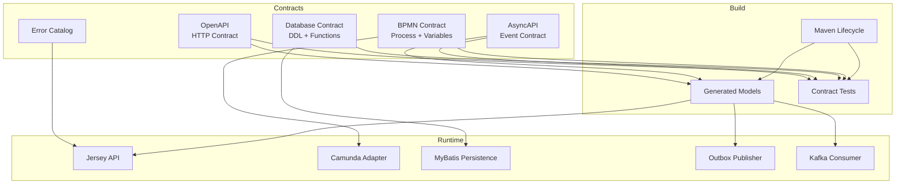
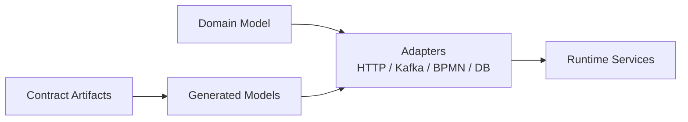
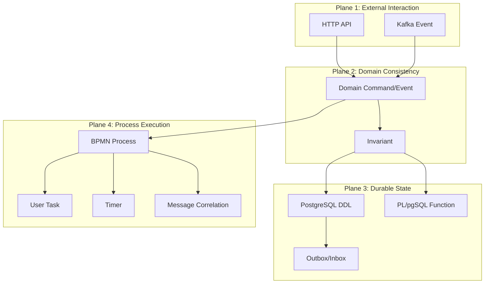
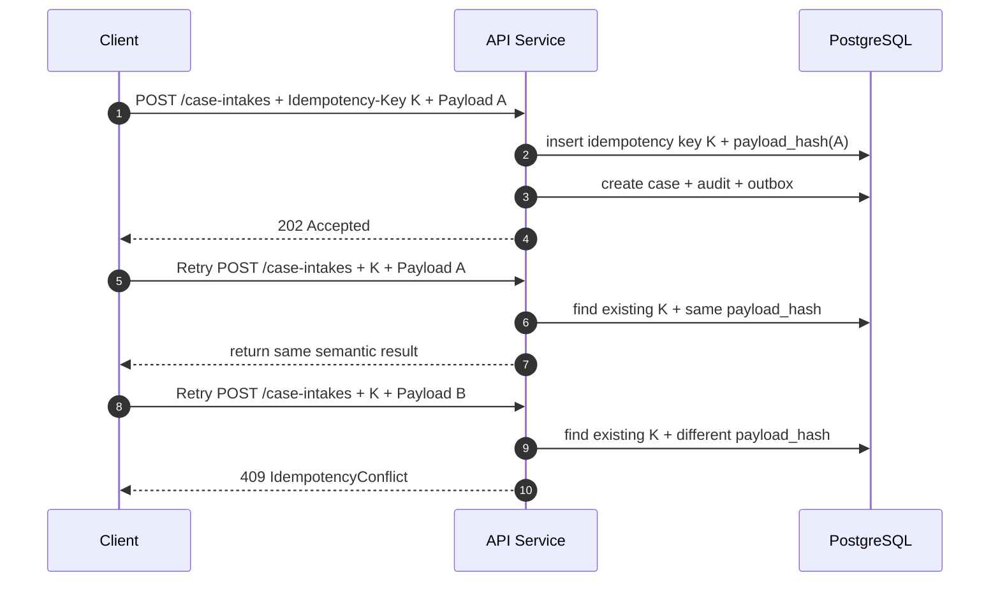
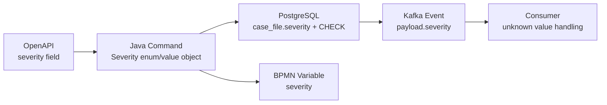
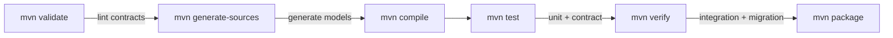
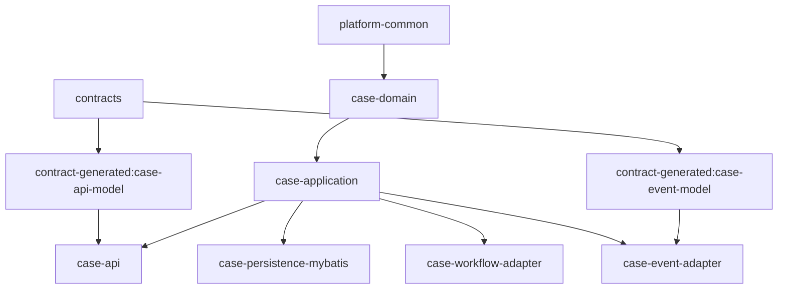
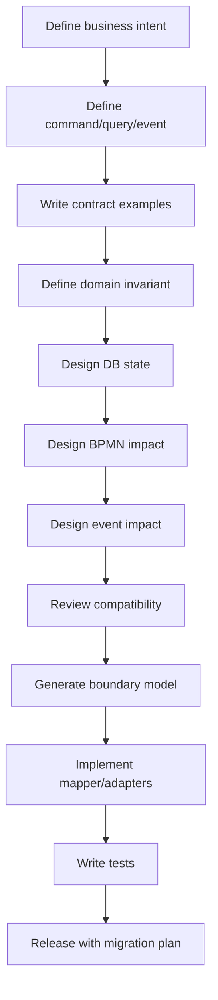

# Part 002 — Contract-First Architecture

Contract-first sering disalahpahami sebagai:

> Tulis OpenAPI dulu, generate DTO, selesai.

Itu terlalu sempit.

Dalam platform yang kita bangun, contract-first berarti: **desain boundary sistem sebelum implementasi detail, lalu buat pipeline yang menjaga boundary itu tetap konsisten ketika sistem berubah.**

Kontrak bukan hanya OpenAPI. Kontrak ada di HTTP, Kafka, database, BPMN, configuration, error model, observability, dan build.

Jika kontrak tidak eksplisit, implementasi akan membuat kontrak diam-diam. Kontrak diam-diam adalah sumber bug paling mahal.

---

## 1. Problem yang Diselesaikan Contract-First

Tanpa contract-first, sistem biasanya berkembang seperti ini:

1. Engineer membuat table.
2. Engineer membuat entity/model Java.
3. Engineer membuat endpoint.
4. Engineer membuat event dari object yang sudah ada.
5. Engineer menambahkan BPMN variable sesuai kebutuhan delegate.
6. Client mulai bergantung pada bentuk response.
7. Consumer mulai bergantung pada bentuk event.
8. Reporting mulai bergantung pada bentuk table.
9. Beberapa bulan kemudian, perubahan kecil menjadi sulit karena semua layer punya kontrak implisit.

Gejala yang muncul:

- field diganti nama di API tetapi consumer event masih memakai nama lama;
- BPMN variable hilang setelah refactor DTO;
- DB column di-drop tetapi reporting masih membaca;
- enum baru membuat client lama error;
- event replay menghasilkan side effect berbeda karena schema lama tidak dipikirkan;
- generated code diedit manual;
- OpenAPI tidak cocok dengan behavior runtime;
- error response tidak konsisten antar endpoint;
- process instance lama gagal karena delegate baru mengharapkan variable baru.

Contract-first mencegah ini dengan memaksa pertanyaan desain muncul sebelum code menyebar.

---

## 2. Definisi Contract dalam Seri Ini

Kontrak adalah kesepakatan eksplisit antara producer dan consumer tentang bentuk, semantic, lifecycle, compatibility, dan failure behavior.

| Contract | Producer | Consumer | Artefak |
|---|---|---|---|
| HTTP API | Case API service | UI, partner, ops client | OpenAPI YAML, error catalog, examples |
| Event API | Domain service/outbox publisher | Kafka consumer, analytics, projection | AsyncAPI YAML, JSON Schema, event examples |
| Database | Migration owner | Application, mapper, reporting | DDL, constraints, functions, views |
| BPMN | Workflow team/service | Camunda engine, delegates, ops | BPMN XML, variable contract, task contract |
| Java internal | Module owner | Other modules | public types, interfaces, package boundary |
| Runtime config | Platform/service owner | Kubernetes, deployment pipeline | env vars, ConfigMap/Secret schema |
| Observability | Service | Ops/SRE/dashboard/alert | log fields, metric names, trace attributes |
| Build | Repo owner | CI/CD, developers | Maven parent POM, module graph, plugin rules |

Kontrak yang baik tidak hanya berkata "field ini string". Kontrak yang baik menjawab:

- field ini artinya apa;
- siapa boleh mengisinya;
- kapan field hadir;
- apakah field required;
- apa default-nya;
- apakah bisa berubah;
- bagaimana versi lama membacanya;
- bagaimana error diekspresikan;
- bagaimana operasi diulang dengan aman.

---

## 3. Architecture View: Contract as Spine

Kita akan menjadikan contract sebagai tulang punggung sistem.



Kontrak berada di atas implementasi, tetapi tidak berarti implementasi menjadi pasif. Implementasi tetap perlu domain model yang kuat. Yang dilarang adalah membuat kontrak publik ikut bentuk internal tanpa desain.

---

## 4. Contract-First Tidak Sama dengan Schema-Only

Schema menjawab struktur. Contract menjawab struktur plus semantic.

Contoh schema yang belum cukup:

```yaml
severity:
  type: string
  enum: [LOW, MEDIUM, HIGH, CRITICAL]
```

Pertanyaan contract yang masih hilang:

- Siapa menentukan severity?
- Apakah client boleh mengirim `CRITICAL`, atau hanya sistem internal?
- Apakah severity bisa turun?
- Apakah perubahan severity harus menghasilkan audit entry?
- Apakah perubahan severity menerbitkan event?
- Apakah severity mempengaruhi SLA timer BPMN?
- Bagaimana jika nanti ditambah `EXTREME`?
- Apakah consumer lama akan gagal jika melihat value baru?

Maka contract yang lebih lengkap butuh description, examples, compatibility note, dan rule mapping.

```yaml
severity:
  type: string
  description: >
    Business severity assigned during intake triage. External clients may suggest
    severity, but final severity is determined by assessment rules. Consumers must
    treat unknown future values as non-fatal and map them to the safest escalation
    behavior available.
  enum:
    - LOW
    - MEDIUM
    - HIGH
    - CRITICAL
  x-compatibility:
    unknownValuePolicy: treat-as-highest-known-safe-severity
  examples:
    - HIGH
```

Extension seperti `x-compatibility` bukan standard universal, tetapi berguna sebagai governance internal jika toolchain mendukung linting custom.

---

## 5. Contract Types dan Ownership

### 5.1 HTTP API Contract

HTTP API contract menjelaskan command dan query yang boleh dilakukan oleh client.

Untuk case intake, kita bisa mulai dengan:

```yaml
openapi: 3.1.0
info:
  title: Regulatory Case API
  version: 1.0.0
paths:
  /case-intakes:
    post:
      operationId: submitCaseIntake
      summary: Submit a new enforcement case intake
      parameters:
        - name: Idempotency-Key
          in: header
          required: true
          schema:
            type: string
            minLength: 16
            maxLength: 128
        - name: Correlation-Id
          in: header
          required: false
          schema:
            type: string
            maxLength: 128
      requestBody:
        required: true
        content:
          application/json:
            schema:
              $ref: '#/components/schemas/SubmitCaseIntakeRequest'
      responses:
        '202':
          description: Intake accepted for processing
          content:
            application/json:
              schema:
                $ref: '#/components/schemas/CaseIntakeAcceptedResponse'
        '400':
          $ref: '#/components/responses/BadRequest'
        '409':
          $ref: '#/components/responses/IdempotencyConflict'
```

Hal yang perlu diperhatikan:

- `operationId` stabil karena sering dipakai code generator.
- `Idempotency-Key` menjadi bagian kontrak, bukan header opsional informal.
- `Correlation-Id` boleh optional dari client, tetapi service harus menghasilkan jika tidak ada.
- Response error harus konsisten.
- `202` bisa lebih tepat daripada `201` jika workflow panjang dimulai asynchronous.

### 5.2 Event Contract

Event contract menjelaskan fakta yang diterbitkan ke Kafka.

Contoh event envelope:

```json
{
  "eventId": "018f5d8a-23b0-7c75-9d89-0b6e4c3c8d4a",
  "eventType": "CaseOpened",
  "eventVersion": 1,
  "occurredAt": "2026-07-02T10:15:30Z",
  "producer": "case-service",
  "correlationId": "corr-789",
  "causationId": "cmd-456",
  "aggregateType": "CASE",
  "aggregateId": "CASE-2026-000001",
  "payload": {
    "caseId": "CASE-2026-000001",
    "severity": "HIGH",
    "allegationType": "MARKET_ABUSE"
  }
}
```

Contract penting:

- `eventId` unique untuk deduplication.
- `eventType` stabil.
- `eventVersion` eksplisit.
- `occurredAt` adalah waktu fakta terjadi, bukan waktu publish.
- `correlationId` menghubungkan event dengan request awal.
- `causationId` menghubungkan event dengan command/trigger.
- `aggregateId` bisa dipakai sebagai partition key.
- Payload tidak boleh berisi object internal tanpa desain.

### 5.3 Database Contract

Database contract bukan hanya table. Contract database mencakup:

- table name;
- column name;
- column type;
- nullability;
- check constraint;
- foreign key;
- unique constraint;
- index;
- function signature;
- view contract;
- migration path;
- privilege;
- audit rule.

Contoh awal:

```sql
CREATE TABLE case_file (
    case_id             uuid PRIMARY KEY,
    case_reference      text NOT NULL UNIQUE,
    status              text NOT NULL,
    severity            text NOT NULL,
    allegation_type     text NOT NULL,
    created_at          timestamptz NOT NULL,
    updated_at          timestamptz NOT NULL,
    version             bigint NOT NULL DEFAULT 0,
    CONSTRAINT case_file_status_ck CHECK (
        status IN (
            'CASE_OPENED',
            'UNDER_ASSESSMENT',
            'UNDER_INVESTIGATION',
            'DECISION_DRAFTED',
            'DECISION_APPROVED',
            'CLOSED'
        )
    ),
    CONSTRAINT case_file_severity_ck CHECK (
        severity IN ('LOW', 'MEDIUM', 'HIGH', 'CRITICAL')
    )
);
```

Nanti kita akan bahas apakah memakai `text + check constraint`, PostgreSQL enum, lookup table, atau domain type. Untuk sekarang, poinnya: database contract harus eksplisit.

### 5.4 BPMN Contract

BPMN contract mencakup:

- process definition key;
- business key;
- message names;
- signal names;
- variable names;
- variable types;
- user task definition keys;
- candidate group names;
- error codes;
- timer semantics;
- migration policy.

Contoh variable contract:

```yaml
processKey: enforcement_case_lifecycle
businessKey: caseReference
variables:
  caseId:
    type: string
    requiredAtStart: true
    description: Stable internal case UUID as string.
  caseReference:
    type: string
    requiredAtStart: true
    description: Human-readable regulatory case reference.
  severity:
    type: string
    requiredAtStart: true
    allowedValues: [LOW, MEDIUM, HIGH, CRITICAL]
  assessmentRequired:
    type: boolean
    requiredAtStart: false
    default: true
messages:
  EvidenceReceived:
    correlationKey: caseReference
  DecisionApproved:
    correlationKey: caseReference
userTasks:
  review_intake:
    candidateGroups: [intake-officer]
  approve_decision:
    candidateGroups: [supervisor]
```

Kalau variable BPMN tidak dikontrakkan, delegate akan saling bergantung pada string literal yang rapuh.

---

## 6. Contract Dependency Direction

Arah dependency harus dijaga.



Domain boleh memiliki model sendiri. Generated model tidak otomatis menjadi domain model.

Kenapa?

Karena contract model sering berubah untuk kebutuhan integrasi, sedangkan domain model harus melindungi invariant internal.

Anti-pattern:

```java
public void approveDecision(CaseIntakeAcceptedResponse response) {
    // domain logic memakai DTO response OpenAPI
}
```

Lebih sehat:

```java
public DecisionApprovalResult approveDecision(ApproveDecisionCommand command) {
    // command internal yang sudah divalidasi dan dimodelkan sesuai domain
}
```

HTTP DTO dipetakan ke command internal. Event payload dipetakan dari domain event internal. BPMN variable dipetakan dari workflow command/query internal.

---

## 7. Four Contract Planes

Dalam seri ini, kita akan memakai empat contract plane utama.



Kesalahan umum adalah mengira salah satu plane bisa menggantikan semua plane lain.

Contoh:

- OpenAPI tidak menggantikan database constraints.
- Database constraints tidak menggantikan BPMN process visibility.
- BPMN tidak menggantikan domain model.
- Kafka tidak menggantikan transaksi lokal.
- Java type tidak menggantikan compatibility contract dengan consumer eksternal.

---

## 8. Contract Lifecycle

Kontrak punya lifecycle.

```mermaid
flowchart LR
    Draft[Draft Contract]
    Review[Design Review]
    Examples[Examples + Edge Cases]
    Lint[Contract Lint]
    Generate[Generate Code]
    Test[Contract Tests]
    Implement[Implementation]
    Verify[Runtime Verification]
    Version[Version + Release]
    Deprecate[Deprecation]

    Draft --> Review
    Review --> Examples
    Examples --> Lint
    Lint --> Generate
    Generate --> Test
    Test --> Implement
    Implement --> Verify
    Verify --> Version
    Version --> Deprecate
```



Checklist lifecycle:

1. Tulis contract draft.
2. Tambahkan examples untuk success dan failure.
3. Review semantic, bukan hanya syntax.
4. Jalankan linting.
5. Generate model jika diperlukan.
6. Jalankan contract test.
7. Implement adapter.
8. Cocokkan runtime behavior dengan contract.
9. Versioning.
10. Deprecation jika ada perubahan breaking.

---

## 9. Designing the First Command Contract

Kita mulai dari command: submit case intake.

### 9.1 Intent

Intent:

```text
A reporter submits a potential regulatory violation for intake assessment.
```

Bukan:

```text
Insert row into case table.
```

### 9.2 Command shape

```yaml
SubmitCaseIntakeRequest:
  type: object
  required:
    - reporterType
    - reportedEntity
    - allegation
  properties:
    reporterType:
      $ref: '#/components/schemas/ReporterType'
    reporterReference:
      type: string
      maxLength: 128
      description: Optional external reference from reporter.
    reportedEntity:
      $ref: '#/components/schemas/ReportedEntity'
    allegation:
      $ref: '#/components/schemas/Allegation'
    attachments:
      type: array
      maxItems: 20
      items:
        $ref: '#/components/schemas/AttachmentReference'
```

### 9.3 Response shape

```yaml
CaseIntakeAcceptedResponse:
  type: object
  required:
    - intakeId
    - caseReference
    - status
    - submittedAt
  properties:
    intakeId:
      type: string
      format: uuid
    caseReference:
      type: string
      example: CASE-2026-000001
    status:
      type: string
      enum: [ACCEPTED]
    submittedAt:
      type: string
      format: date-time
```

### 9.4 Error shape

```yaml
ProblemResponse:
  type: object
  required:
    - type
    - title
    - status
    - code
    - correlationId
  properties:
    type:
      type: string
      format: uri
    title:
      type: string
    status:
      type: integer
    code:
      type: string
    detail:
      type: string
    correlationId:
      type: string
    violations:
      type: array
      items:
        $ref: '#/components/schemas/FieldViolation'
```

Kita akan memakai error response konsisten untuk semua endpoint.

---

## 10. Idempotency as Contract

Idempotency bukan implementasi tersembunyi. Idempotency adalah kontrak dengan client.

Contract rule:

1. Client harus mengirim `Idempotency-Key` untuk command mutating tertentu.
2. Server menyimpan key, method, path, payload hash, response summary, dan status.
3. Request ulang dengan key dan payload sama mengembalikan hasil yang konsisten.
4. Request ulang dengan key sama tetapi payload berbeda menghasilkan conflict.
5. TTL key harus jelas.



Database table awal:

```sql
CREATE TABLE idempotency_record (
    idempotency_key       text NOT NULL,
    request_method        text NOT NULL,
    request_path          text NOT NULL,
    request_payload_hash  text NOT NULL,
    response_status       integer,
    response_body         jsonb,
    processing_status     text NOT NULL,
    created_at            timestamptz NOT NULL,
    expires_at            timestamptz NOT NULL,
    PRIMARY KEY (idempotency_key, request_method, request_path),
    CONSTRAINT idempotency_processing_status_ck CHECK (
        processing_status IN ('PROCESSING', 'COMPLETED', 'FAILED_RETRYABLE', 'FAILED_FINAL')
    )
);
```

Nanti kita akan bedah locking, stuck `PROCESSING`, dan recovery.

---

## 11. Event Contract Design

Untuk command `submitCaseIntake`, event pertama bisa berupa `CaseOpened` atau `CaseIntakeAccepted`. Pilihan ini bukan kosmetik.

### Option A — `CaseIntakeAccepted`

Artinya: laporan diterima untuk diproses.

Cocok jika case belum benar-benar dibuka atau masih bisa ditolak setelah validasi asynchronous.

### Option B — `CaseOpened`

Artinya: case domain resmi sudah dibuat.

Cocok jika transaksi command memang langsung membuat case valid.

Untuk vertical slice pertama, kita pilih:

```text
CaseOpened
```

Karena kita ingin event mewakili fakta domain yang durable.

AsyncAPI sketch:

```yaml
asyncapi: 3.0.0
info:
  title: Regulatory Case Events
  version: 1.0.0
channels:
  case.events.v1:
    address: case.events.v1
    messages:
      CaseOpened:
        $ref: '#/components/messages/CaseOpened'
operations:
  publishCaseOpened:
    action: send
    channel:
      $ref: '#/channels/case.events.v1'
    messages:
      - $ref: '#/channels/case.events.v1/messages/CaseOpened'
components:
  messages:
    CaseOpened:
      name: CaseOpened
      title: Case opened
      payload:
        $ref: '#/components/schemas/CaseOpenedEvent'
```

Payload sketch:

```yaml
CaseOpenedEvent:
  type: object
  required:
    - eventId
    - eventType
    - eventVersion
    - occurredAt
    - aggregateId
    - payload
  properties:
    eventId:
      type: string
      format: uuid
    eventType:
      const: CaseOpened
    eventVersion:
      type: integer
      const: 1
    occurredAt:
      type: string
      format: date-time
    aggregateId:
      type: string
    payload:
      $ref: '#/components/schemas/CaseOpenedPayload'
```

---

## 12. Database Contract from API/Event Contract

Dari request/response/event di atas, database tidak otomatis mengikuti 1:1.

Contoh mapping:

| Contract field | Database storage | Catatan |
|---|---|---|
| `caseReference` | `case_file.case_reference` | Unique, human-readable, stable |
| `reporterType` | `case_intake.reporter_type` | Raw intake data, bisa berbeda dari assessed party |
| `reportedEntity.id` | `case_party.external_entity_id` | Perlu normalization |
| `allegation.type` | `case_file.allegation_type` | Bisa menjadi classification awal |
| `severity` | `case_file.severity` | Bisa dihitung dari rules |
| `eventId` | `outbox_event.event_id` | Unique publish identity |
| `correlationId` | `audit_log.correlation_id` dan `outbox_event.correlation_id` | Traceability |

Skema awal outbox:

```sql
CREATE TABLE outbox_event (
    event_id          uuid PRIMARY KEY,
    aggregate_type    text NOT NULL,
    aggregate_id      text NOT NULL,
    event_type        text NOT NULL,
    event_version     integer NOT NULL,
    topic_name        text NOT NULL,
    partition_key     text NOT NULL,
    payload           jsonb NOT NULL,
    headers           jsonb NOT NULL DEFAULT '{}'::jsonb,
    occurred_at       timestamptz NOT NULL,
    publish_status    text NOT NULL DEFAULT 'PENDING',
    published_at      timestamptz,
    attempt_count     integer NOT NULL DEFAULT 0,
    next_attempt_at   timestamptz,
    last_error        text,
    CONSTRAINT outbox_event_publish_status_ck CHECK (
        publish_status IN ('PENDING', 'PUBLISHING', 'PUBLISHED', 'FAILED_RETRYABLE', 'FAILED_FINAL')
    )
);

CREATE INDEX outbox_event_pending_idx
    ON outbox_event (next_attempt_at, occurred_at)
    WHERE publish_status IN ('PENDING', 'FAILED_RETRYABLE');
```

Outbox adalah jembatan antara transaksi database dan event Kafka. Kita tidak akan mengandalkan publish Kafka langsung sebagai bagian dari transaksi database lokal.

---

## 13. BPMN Contract from Domain Intent

Untuk `CaseOpened`, workflow bisa dimulai.

Pertanyaan desain:

- Apakah API langsung start process setelah DB commit?
- Apakah process start direpresentasikan sebagai outbox command internal?
- Apakah Camunda engine embedded di service yang sama?
- Apakah business key memakai `caseReference` atau UUID?
- Apa variable minimal saat start?

Untuk tahap awal, kita definisikan contract:

```yaml
process:
  key: enforcement_case_lifecycle
  startsWhen: CaseOpened domain transaction committed
  businessKey: caseReference
  requiredVariables:
    caseId: string
    caseReference: string
    severity: string
    allegationType: string
    openedAt: datetime
```

BPMN sketch:

```mermaid
flowchart LR
    start((Start))
    review[User Task\nReview Intake]
    gateway{Assessment Result?}
    dismiss[Service Task\nDismiss Case]
    investigate[Service Task\nStart Investigation]
    evidence[User Task\nRequest Evidence]
    timer((SLA Timer))
    escalate[Service Task\nEscalate]
    decision[User Task\nDraft Decision]
    approve[User Task\nApprove Decision]
    close[Service Task\nClose Case]
    end((End))

    start --> review
    review --> gateway
    gateway --> dismiss --> close --> end
    gateway --> investigate --> evidence --> decision --> approve --> close
    evidence -.-> timer -.-> escalate -.-> evidence
```

Diagram di atas belum BPMN XML. Ini mental map. Nanti kita akan masuk ke BPMN model dan variable detail.

---

## 14. Contract Composition: One Field Across Layers

Mari ikuti satu field: `severity`.



Jika `severity` berubah, kita harus cek:

| Layer | Pertanyaan |
|---|---|
| OpenAPI | Apakah request/response enum berubah? Client lama aman? |
| Java | Apakah enum exhaustive switch akan break? |
| DB | Apakah check constraint perlu migration? |
| BPMN | Apakah gateway memakai value ini? |
| Kafka | Apakah consumer lama bisa membaca value baru? |
| Ops | Apakah dashboard/alert grouping perlu update? |

Inilah contract-first dalam praktik. Satu field bukan cuma satu field.

---

## 15. Compatibility Rules

### 15.1 Rule umum

Perubahan contract dibagi tiga:

| Jenis | Arti | Contoh |
|---|---|---|
| Patch-compatible | Tidak memengaruhi consumer | typo docs, example baru |
| Minor-compatible | Menambah kemampuan tanpa break | optional field baru, endpoint baru |
| Major-breaking | Consumer perlu berubah | rename field, change type, required field baru |

### 15.2 OpenAPI compatibility

Aman:

- tambah optional response field;
- tambah optional request field dengan default;
- tambah response code baru yang masuk kategori existing error handling;
- tambah endpoint baru;
- tambah header response optional.

Breaking:

- hapus field;
- rename field;
- ubah type;
- required field baru pada request lama;
- ubah semantic status code;
- ubah pagination format;
- ubah error model.

### 15.3 Event compatibility

Aman:

- tambah optional payload field;
- tambah metadata header;
- tambah event type baru;
- tambah topic baru;
- publish event versi baru berdampingan.

Breaking:

- ubah arti event;
- hapus field yang dipakai consumer;
- ubah `aggregateId` atau partition key;
- ubah ordering assumption;
- ubah timestamp semantic;
- reuse event type lama untuk fakta baru.

### 15.4 Database compatibility

Aman dalam rolling deployment:

- add nullable column;
- add table baru;
- add index dengan strategi aman;
- add function baru;
- add view baru;
- code baru membaca field lama dan baru.

Breaking:

- drop column yang masih dibaca app lama;
- rename column langsung;
- add NOT NULL tanpa default/backfill strategy;
- ubah function signature yang dipakai versi lama;
- ubah constraint sebelum data lama bersih.

### 15.5 BPMN compatibility

Aman:

- deploy process definition version baru untuk instance baru;
- maintain delegate compatibility dengan variable lama;
- migrasi instance dengan mapping eksplisit;
- tambah optional variable dengan default.

Breaking:

- delete activity yang masih active;
- ubah task definition key yang dipakai UI/ops;
- ubah message name tanpa compatibility;
- ubah business key;
- ubah variable required untuk instance lama.

---

## 16. Contract Review Checklist

Gunakan checklist ini sebelum implementasi fitur.

### 16.1 Semantic checklist

- Apa business intent-nya?
- Apakah ini command, query, atau event?
- Siapa producer?
- Siapa consumer?
- Apakah field punya arti stabil?
- Apakah ada field yang sebenarnya derived?
- Apakah ada field yang raw input dan assessed output perlu dipisah?
- Apakah error behavior jelas?
- Apakah retry behavior jelas?
- Apakah authorization boundary jelas?

### 16.2 Compatibility checklist

- Apa yang terjadi pada client lama?
- Apa yang terjadi pada consumer lama?
- Apa yang terjadi pada process instance lama?
- Apa yang terjadi saat rolling update?
- Apakah DB migration expand-contract?
- Apakah generated code berubah breaking?
- Apakah enum baru aman?
- Apakah unknown field/value policy jelas?

### 16.3 Operational checklist

- Apa correlation id-nya?
- Apa audit event-nya?
- Apa metric-nya?
- Apa log field wajib?
- Apa alert jika gagal?
- Apa runbook repair?
- Apa dashboard untuk melihat stuck state?
- Apa test untuk replay/retry?

---

## 17. Governance Minimum

Contract-first tanpa governance hanya menjadi dokumen mati.

Minimum governance:

```text
contracts/
  openapi/
    case-api.yaml
  asyncapi/
    case-events.yaml
  bpmn/
    enforcement_case_lifecycle.bpmn
  database/
    schema-contract.md
  errors/
    error-catalog.yaml
  examples/
    submit-case-intake-request.json
    case-opened-event.json
```

CI harus menjalankan:

1. YAML syntax validation.
2. OpenAPI validation.
3. AsyncAPI validation.
4. Example validation terhadap schema.
5. Breaking change check terhadap baseline.
6. Generated code compile.
7. Contract tests.
8. BPMN parse/deployment test.
9. DB migration test.
10. Mapper integration test.

Maven lifecycle bisa mengikat banyak proses ini ke fase build.



---

## 18. Contract Drift

Contract drift terjadi ketika dokumen kontrak dan runtime behavior berbeda.

Contoh drift:

| Contract berkata | Runtime melakukan | Dampak |
|---|---|---|
| `severity` required | service menerima null | data buruk masuk |
| error response punya `correlationId` | beberapa endpoint tidak mengisi | debugging sulit |
| event field optional | consumer menganggap required | consumer crash |
| BPMN variable `caseId` string | delegate mengirim UUID object serialized | process instance gagal |
| DB column nullable | domain menganggap selalu ada | NPE atau inconsistent behavior |

Pencegahan drift:

- contract tests;
- generated DTO hanya di boundary;
- mapper tests;
- BPMN deployment tests;
- schema migration tests;
- runtime conformance tests;
- examples yang divalidasi.

---

## 19. Error Contract

Error contract harus stabil karena client dan ops bergantung padanya.

Katalog error awal:

```yaml
errors:
  VALIDATION_FAILED:
    httpStatus: 400
    retryable: false
    description: Request payload or parameter violates contract.
  IDEMPOTENCY_CONFLICT:
    httpStatus: 409
    retryable: false
    description: Same idempotency key was used with different request semantics.
  CASE_NOT_FOUND:
    httpStatus: 404
    retryable: false
    description: Case reference does not exist or is not visible to caller.
  CASE_STATE_CONFLICT:
    httpStatus: 409
    retryable: false
    description: Command cannot be applied to current case state.
  DEPENDENCY_TEMPORARILY_UNAVAILABLE:
    httpStatus: 503
    retryable: true
    description: Required dependency is temporarily unavailable.
  INTERNAL_ERROR:
    httpStatus: 500
    retryable: unknown
    description: Unexpected server-side error.
```

Runtime response:

```json
{
  "type": "https://errors.example.internal/IDEMPOTENCY_CONFLICT",
  "title": "Idempotency conflict",
  "status": 409,
  "code": "IDEMPOTENCY_CONFLICT",
  "detail": "The same idempotency key was used with a different payload.",
  "correlationId": "corr-789"
}
```

Rule:

- jangan bocorkan stacktrace;
- jangan ubah `code` sembarangan;
- jangan membuat message satu-satunya sumber behavior client;
- `correlationId` wajib ada;
- retryable harus bisa ditentukan untuk error operasional tertentu.

---

## 20. Contract and Security Boundary

Contract harus mencerminkan trust boundary.

Contoh field yang tidak boleh dipercaya dari client:

```yaml
createdBy:
  type: string
```

Jika `createdBy` dikirim client eksternal, itu raw claim, bukan authenticated principal.

Lebih baik:

```yaml
SubmitCaseIntakeRequest:
  type: object
  properties:
    reporterReference:
      type: string
      description: Reference supplied by reporter. Not trusted as authenticated identity.
```

Authenticated identity datang dari security context, bukan request body.

Security contract juga mencakup:

- header mana yang trusted dari NGINX/Ingress;
- apakah `X-Forwarded-*` diterima;
- siapa boleh memanggil endpoint ops;
- field mana yang disembunyikan dari role tertentu;
- audit apa yang wajib dibuat;
- apakah attachment reference sudah diverifikasi.

---

## 21. Contract and Observability

Observability juga butuh kontrak.

Minimum log field:

```json
{
  "timestamp": "2026-07-02T10:15:30Z",
  "level": "INFO",
  "service": "case-service",
  "correlationId": "corr-789",
  "idempotencyKeyHash": "...",
  "caseReference": "CASE-2026-000001",
  "operation": "submitCaseIntake",
  "outcome": "ACCEPTED",
  "durationMs": 183
}
```

Minimum metric:

```text
case_api_requests_total{operation,status}
case_command_duration_seconds{operation,outcome}
outbox_pending_events_total{topic}
outbox_publish_attempts_total{topic,outcome}
kafka_consumer_lag{consumer_group,topic}
camunda_incidents_total{process_key,activity_id}
case_state_transition_total{from_status,to_status}
```

Minimum trace attributes:

```text
correlation.id
case.reference
operation.name
idempotency.key_hash
bpmn.process_key
bpmn.process_instance_id
kafka.topic
kafka.partition_key
```

Jika observability field tidak dikontrakkan, dashboard dan alert akan rapuh.

---

## 22. Contract and Maven Module Design

Contract-first perlu module boundary.

Contoh module graph:



Rules:

1. `case-domain` tidak bergantung pada generated OpenAPI model.
2. `case-domain` tidak bergantung pada Jersey.
3. `case-domain` tidak bergantung pada Camunda API.
4. `case-domain` tidak bergantung pada Kafka client.
5. `case-application` mengoordinasikan use case.
6. Adapter menerjemahkan boundary external ke internal.
7. Generated model hanya hidup di boundary adapter atau mapping layer.

Maven Enforcer dan dependency rules nanti dipakai untuk menjaga batas ini.

---

## 23. Contract-First Implementation Flow

Untuk setiap fitur, pakai flow ini:



Jangan mulai dari `Resource` class.

---

## 24. Example: Submit Case Intake End-to-End Contract

### 24.1 HTTP command

```http
POST /case-intakes HTTP/1.1
Content-Type: application/json
Idempotency-Key: 01J0ZK8X9Z4P8Q0W2Y5C7R9T11
Correlation-Id: corr-20260702-0001
```

```json
{
  "reporterType": "PUBLIC",
  "reporterReference": "WEB-REPORT-9981",
  "reportedEntity": {
    "externalEntityId": "ENT-991",
    "displayName": "Example Capital Ltd"
  },
  "allegation": {
    "type": "MARKET_ABUSE",
    "description": "Suspicious coordinated trading pattern."
  },
  "attachments": [
    {
      "attachmentId": "ATT-123",
      "filename": "evidence-summary.pdf"
    }
  ]
}
```

### 24.2 Domain command

```java
public record SubmitCaseIntakeCommand(
        IdempotencyKey idempotencyKey,
        CorrelationId correlationId,
        ReporterType reporterType,
        Optional<String> reporterReference,
        ReportedEntityDraft reportedEntity,
        AllegationDraft allegation,
        List<AttachmentReference> attachments,
        Actor actor,
        Instant receivedAt
) {}
```

### 24.3 Database writes

Dalam satu transaksi domain:

```text
insert idempotency_record
insert case_intake
insert case_file
insert case_party
insert audit_log
insert outbox_event(CaseOpened)
```

### 24.4 BPMN trigger

Pilihan awal:

```text
Start enforcement_case_lifecycle with businessKey = caseReference
```

Tetapi karena Camunda start adalah side effect terhadap engine, kita akan mendesain repair path jika start gagal.

### 24.5 Event

```text
CaseOpened -> topic case.events.v1 -> partition key caseReference
```

### 24.6 Response

```json
{
  "intakeId": "018f5d8a-23b0-7c75-9d89-0b6e4c3c8d4a",
  "caseReference": "CASE-2026-000001",
  "status": "ACCEPTED",
  "submittedAt": "2026-07-02T10:15:30Z"
}
```

---

## 25. Anti-Patterns

### Anti-pattern 1 — Database as API shape

```text
OpenAPI response mirrors table columns exactly.
```

Masalah:

- internal schema bocor;
- migration susah;
- field audit/internal ikut terbuka;
- query model dan command model bercampur.

### Anti-pattern 2 — Generated DTO everywhere

```text
OpenAPI generated request object dipakai sampai domain dan persistence.
```

Masalah:

- domain menjadi tergantung contract external;
- breaking change menyebar jauh;
- validation boundary kabur.

### Anti-pattern 3 — BPMN variable as global data bag

```text
Semua data case disimpan sebagai process variable.
```

Masalah:

- variable besar;
- serialization risk;
- migration sulit;
- data domain tersebar;
- query/reporting buruk.

### Anti-pattern 4 — Event as serialized entity

```text
Kafka event berisi dump entity database.
```

Masalah:

- schema internal bocor;
- consumer bergantung ke field tidak stabil;
- data sensitif ikut tersebar;
- event meaning tidak jelas.

### Anti-pattern 5 — Contract without examples

Schema tanpa contoh sering gagal menangkap edge case.

Minimal harus ada:

- valid request;
- invalid request;
- success response;
- conflict response;
- event example;
- replay example;
- old-version compatibility example.

---

## 26. Production Checklist for Contract-First

Sebuah fitur belum siap implementasi jika belum bisa menjawab:

- Apa OpenAPI operation-nya?
- Apa request dan response example-nya?
- Apa error code-nya?
- Apa idempotency behavior-nya?
- Apa event yang diterbitkan?
- Apa topic dan partition key-nya?
- Apa DB table/column/function yang terdampak?
- Apa migration strategy-nya?
- Apa BPMN process/task/message/timer yang terdampak?
- Apa variable contract-nya?
- Apa audit event-nya?
- Apa metric/log/trace field-nya?
- Apa compatibility risk-nya?
- Apa retry dan recovery behavior-nya?
- Apa test yang membuktikan contract dipatuhi?

Jika jawaban terlalu kabur, implementasi akan mahal di belakang.

---

## 27. Practical Rule: Contract Before Class, Invariant Before Framework

Urutan kerja yang sehat:

```text
1. Business invariant
2. Contract
3. Storage shape
4. Workflow implication
5. Event implication
6. Java domain model
7. Adapter implementation
8. Runtime deployment
```

Urutan kerja yang berbahaya:

```text
1. Create Jersey resource
2. Create service class
3. Create mapper
4. Return whatever works
5. Generate OpenAPI from code later
6. Publish entity as Kafka event
```

Code-first tidak selalu salah. Tetapi untuk platform dengan banyak consumer dan lifecycle panjang, contract-first memberi kontrol yang lebih baik.

---

## 28. Rujukan Primer

- OpenAPI Specification: https://spec.openapis.org/
- AsyncAPI Specification: https://www.asyncapi.com/docs/reference/specification/latest
- JSON Schema: https://json-schema.org/specification
- Eclipse Jersey User Guide: https://eclipse-ee4j.github.io/jersey.github.io/documentation/latest/index.html
- Camunda 7 Documentation: https://docs.camunda.org/manual/7.24/
- Apache Kafka Documentation: https://kafka.apache.org/documentation/
- PostgreSQL Documentation: https://www.postgresql.org/docs/
- MyBatis 3 Documentation: https://mybatis.org/mybatis-3/
- Apache Maven Guides: https://maven.apache.org/guides/

---

## 29. Ringkasan Part 002

Contract-first dalam seri ini berarti mendesain dan menjaga boundary sistem sebelum implementasi menyebar.

Poin utama:

1. Kontrak bukan hanya OpenAPI.
2. Contract-first mencakup HTTP, event, DB, BPMN, Java module, config, observability, dan build.
3. Schema hanya menjelaskan struktur; contract juga menjelaskan semantic, compatibility, dan failure behavior.
4. Generated model tidak boleh otomatis menjadi domain model.
5. Satu field bisa berdampak ke API, Java, DB, BPMN, Kafka, consumer, dan ops.
6. Idempotency adalah bagian contract.
7. Error model adalah bagian contract.
8. Observability field adalah bagian contract.
9. Contract drift harus dicegah dengan linting, examples, generated code, contract tests, migration tests, dan runtime verification.

Part berikutnya: **Production Architecture Blueprint**.
