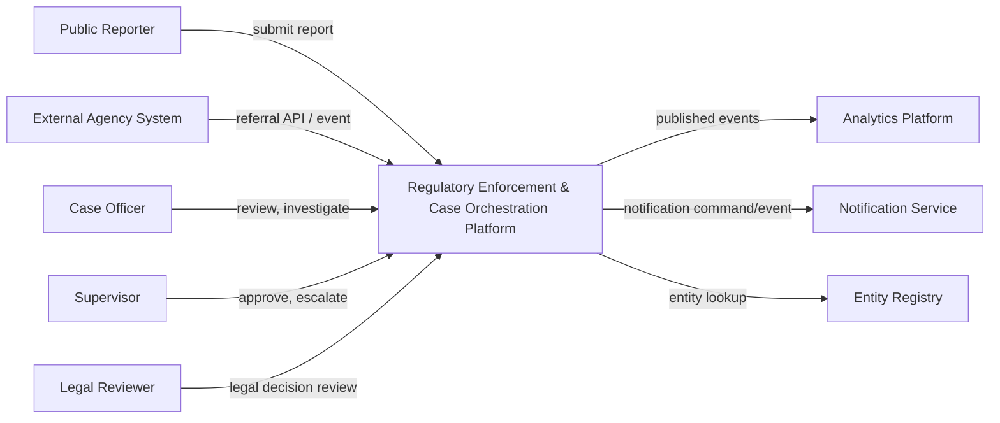
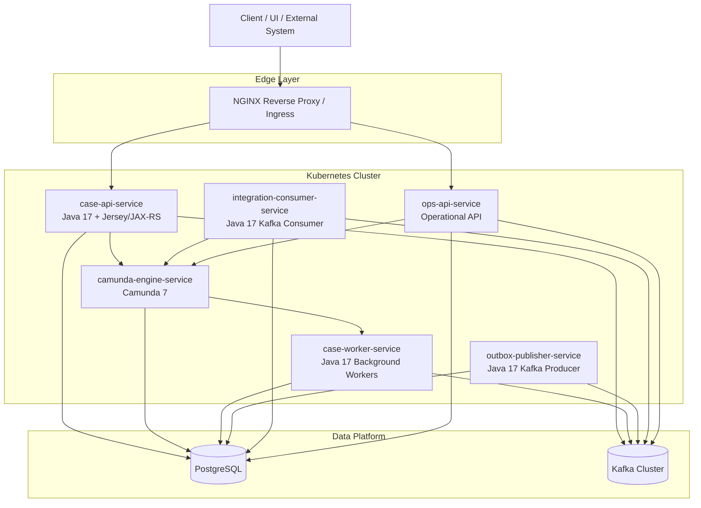
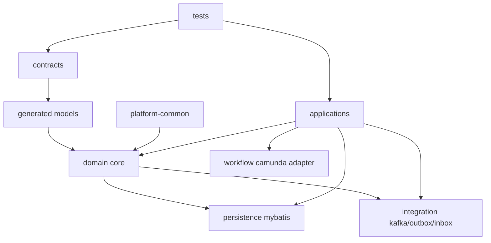
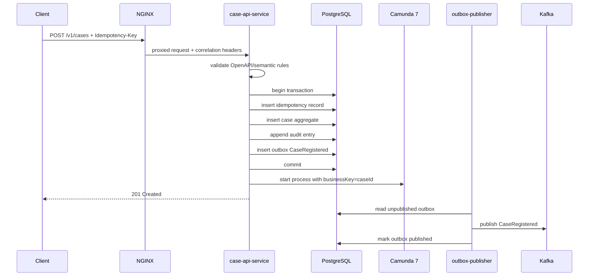
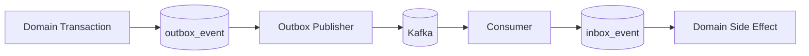
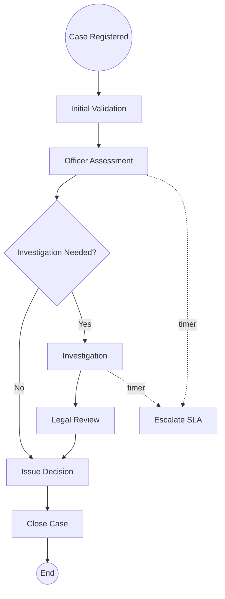
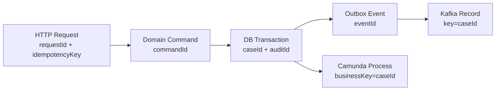
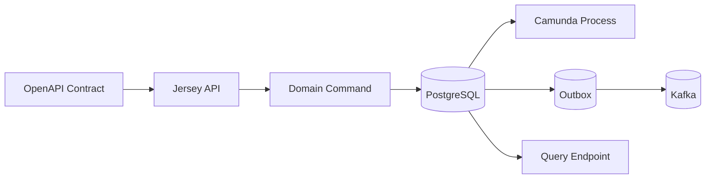

# Part 003 — Production Architecture Blueprint

Part ini menjawab pertanyaan besar: **bentuk sistem akhirnya seperti apa?**

Bukan bentuk folder saja. Bukan gambar kotak-kotak abstrak. Yang kita butuhkan adalah blueprint yang cukup konkret untuk menjawab:

- service apa saja yang berjalan;
- kontrak apa yang mengikat tiap boundary;
- data mana yang menjadi source of truth;
- proses mana yang diorkestrasi Camunda;
- event mana yang dipublikasikan Kafka;
- bagaimana NGINX dan Kubernetes membentuk runtime path;
- bagaimana release, observability, dan recovery ikut masuk sejak awal.

Kita akan membangun platform dengan pendekatan **contract-first**, tetapi contract-first tidak berarti semua hal dipaksa menjadi OpenAPI. Dalam sistem produksi, kontrak muncul di beberapa lapisan:

| Layer | Kontrak | Tujuan |
|---|---|---|
| HTTP API | OpenAPI | Memastikan caller dan service sepakat tentang request, response, error, pagination, idempotency, dan auth boundary. |
| Event | AsyncAPI + schema payload | Memastikan producer dan consumer sepakat tentang event envelope, payload, topic, key, version, dan compatibility. |
| Database | DDL, constraints, function signature, migration | Memastikan data shape, invariant, lock behavior, dan backward compatibility. |
| Workflow | BPMN model, variable contract, message correlation | Memastikan proses bisnis, wait state, human task, timer, dan incident semantics bisa dioperasikan. |
| Runtime | Kubernetes manifest, config contract, probes | Memastikan service punya deployment, health, resource limit, shutdown, dan scaling behavior yang bisa diprediksi. |
| Build | Maven POM, module graph, plugin version | Memastikan build repeatable, generated source stabil, dependency terkendali, dan release reproducible. |

Blueprint yang bagus bukan blueprint yang paling indah. Blueprint yang bagus adalah blueprint yang **membuat failure terlihat sebelum failure terjadi**.

---

## 1. Studi Kasus yang Akan Kita Bangun

Nama sistem kerja kita:

```text
Regulatory Enforcement & Case Orchestration Platform
```

Tujuan platform:

1. menerima laporan atau referral dari sistem eksternal;
2. membuat enforcement case;
3. menjalankan proses assessment dan investigation;
4. mengelola human task untuk officer, supervisor, dan legal reviewer;
5. menghitung SLA dan escalation;
6. menyimpan evidence, decision, status, audit, dan integration state;
7. menerbitkan event untuk downstream system;
8. menyediakan endpoint operasional untuk query, troubleshooting, dan recovery.

Sistem ini sengaja dipilih karena memaksa kita menghadapi masalah nyata:

- state case tidak sama dengan state workflow;
- event tidak boleh diterbitkan sebelum transaksi database valid;
- retry dari HTTP client tidak boleh membuat case ganda;
- Kafka consumer harus idempotent;
- Camunda incident tidak boleh membuat domain data korup;
- migration database harus bisa dilakukan tanpa menghentikan sistem;
- audit trail harus defensible;
- operational recovery harus dirancang, bukan ditambal saat incident.

---

## 2. Prinsip Arsitektur

Blueprint ini memakai beberapa prinsip yang akan terus muncul di seluruh seri.

### 2.1 Data contract first, bukan code first

Kita tidak mulai dari class Java. Kita mulai dari kontrak:

```text
API contract -> event contract -> process contract -> persistence contract -> implementation
```

Alasannya sederhana: class Java adalah detail implementasi. Kontrak adalah janji antar boundary.

Jika class berubah tetapi kontrak tetap, external behavior tidak berubah. Jika kontrak berubah, semua consumer perlu tahu konsekuensinya.

### 2.2 Domain state adalah source of truth, bukan BPMN token

Camunda menyimpan state proses. Itu penting, tetapi bukan berarti state domain berada di Camunda.

Contoh:

```text
case_status = UNDER_INVESTIGATION
```

Status itu harus bisa dijawab dari database domain walaupun Cockpit Camunda sedang tidak tersedia.

Camunda boleh tahu bahwa process instance sedang menunggu `UserTask_ReviewEvidence`, tetapi pertanyaan regulatory seperti “case ini status hukumnya apa?” harus dijawab dari domain model dan audit trail, bukan dari posisi token BPMN.

### 2.3 Workflow mengorkestrasi, domain menjaga invariant

BPMN cocok untuk:

- urutan aktivitas;
- human task;
- timer;
- escalation;
- message wait;
- compensation path;
- incident visibility.

BPMN tidak cocok sebagai tempat utama untuk:

- validasi domain yang kompleks;
- constraint data;
- query bisnis;
- audit formal;
- idempotency;
- event publication guarantee.

Aturan praktis:

```text
Jika rule harus tetap benar walaupun workflow engine gagal, simpan rule itu di domain/database boundary.
```

### 2.4 Kafka adalah log integrasi, bukan database utama

Kafka dipakai untuk mendistribusikan fakta yang sudah terjadi:

```text
CaseRegistered
AssessmentCompleted
InvestigationStarted
DecisionIssued
CaseClosed
```

Kafka tidak menjadi tempat utama untuk mencari status final case. Status final tetap berada di PostgreSQL.

Kafka berguna untuk:

- fan-out ke downstream;
- async processing;
- decoupling;
- replay;
- integration audit;
- eventual consistency.

Tetapi Kafka juga membawa risiko:

- duplicate delivery;
- consumer lag;
- partition ordering limitation;
- schema evolution;
- poison message;
- replay side-effect.

Karena itu kita akan memakai outbox/inbox pattern.

### 2.5 PostgreSQL menjaga invariant yang harus benar

Banyak engineer memperlakukan database hanya sebagai tempat simpan object. Di sistem ini, PostgreSQL adalah lapisan kebenaran untuk:

- uniqueness;
- foreign key;
- state transition guard;
- idempotency record;
- audit append;
- outbox;
- inbox;
- lock coordination;
- migration compatibility.

MyBatis dipilih karena kita ingin SQL terlihat dan bisa dioptimalkan secara eksplisit. Kita tidak menyembunyikan query shape di balik ORM yang terlalu magical.

### 2.6 Kubernetes menjalankan sistem, bukan menyelesaikan desain sistem

Kubernetes membantu menjalankan workload, service discovery, config injection, secret injection, rollout, scaling, probes, dan resource management.

Tetapi Kubernetes tidak otomatis menyelesaikan:

- idempotency;
- consistency;
- transaction boundary;
- schema migration;
- event ordering;
- workflow incident;
- deadlock;
- bad retry policy.

Jangan memakai Kubernetes sebagai pengganti arsitektur aplikasi.

---

## 3. Blueprint Level 0 — System Context

Pada level paling luar, sistem kita berinteraksi dengan beberapa actor dan external system.



Kita tidak akan membangun semua external system. Tetapi kontraknya tetap harus dipikirkan karena production system jarang hidup sendirian.

---

## 4. Blueprint Level 1 — Runtime Topology

Runtime topology yang akan kita pakai:



Ini bukan satu-satunya topology yang mungkin. Namun topology ini bagus untuk belajar karena ia memisahkan beberapa tanggung jawab penting:

| Component | Tanggung jawab utama |
|---|---|
| `case-api-service` | HTTP API untuk command/query utama. Validasi request, idempotency, domain command, start/correlate process. |
| `camunda-engine-service` | Menjalankan process engine Camunda 7, menyimpan process state, job executor, human task lifecycle. |
| `case-worker-service` | Menjalankan pekerjaan teknis yang dipicu workflow atau scheduler, tetapi logic domain tetap melalui boundary service/data. |
| `outbox-publisher-service` | Membaca outbox PostgreSQL dan menerbitkan event ke Kafka secara aman. |
| `integration-consumer-service` | Membaca event/command dari Kafka, melakukan idempotency via inbox, update domain, correlate process jika perlu. |
| `ops-api-service` | Endpoint internal untuk troubleshooting, replay, drain outbox, incident view, dan operational query. |
| PostgreSQL | Source of truth untuk domain data, audit, outbox/inbox, idempotency, dan sebagian state operational. |
| Kafka | Event streaming backbone untuk integrasi asynchronous. |
| NGINX | Edge routing, reverse proxy, timeout, header propagation, request limit, dan load balancing. |
| Kubernetes | Deployment, scaling, service discovery, config, secret, probes, rolling update, dan resource control. |

---

## 5. Kenapa Tidak Satu Monolith Saja?

Pertanyaan ini penting. Banyak sistem terlalu cepat dipecah menjadi microservices. Hasilnya bukan arsitektur, tetapi distributed mess.

Untuk seri ini, kita tidak memecah karena ingin terlihat modern. Kita memecah karena ada **runtime characteristic** yang berbeda.

| Unit | Karakter runtime | Alasan dipisah |
|---|---|---|
| API service | Latency-sensitive, request/response | Perlu autoscale berdasarkan HTTP load dan menjaga timeout pendek. |
| Camunda engine | Stateful engine behavior, job executor, process deployment | Perlu tuning transaksi, history, job acquisition, dan incident secara khusus. |
| Outbox publisher | Batch/polling, Kafka I/O, retry | Tidak boleh memperlambat HTTP request. |
| Kafka consumer | Event-driven, replayable, lag-sensitive | Perlu scaling dan idempotency terpisah dari API. |
| Ops API | Internal, privileged, dangerous if exposed | Harus punya auth dan network boundary berbeda. |

Namun pemisahan deployment tidak otomatis berarti pemisahan repository. Untuk fase belajar, kita akan memakai **modular monorepo** dengan Maven multi-module. Ini memberi satu koordinasi kontrak dan release, tetapi runtime tetap bisa dipaketkan menjadi beberapa deployable.

---

## 6. Deployable Unit

Kita akan punya lima deployable utama.

### 6.1 `case-api-service`

Tugas:

- menerima HTTP command;
- memvalidasi contract;
- menerapkan idempotency;
- menjalankan domain command;
- menulis domain data dan audit;
- membuat outbox event;
- memulai atau menghubungkan process instance Camunda;
- mengembalikan response deterministik.

Contoh endpoint:

```text
POST /v1/cases
GET  /v1/cases/{caseId}
POST /v1/cases/{caseId}/assessment
POST /v1/cases/{caseId}/evidence
POST /v1/cases/{caseId}/decision
```

Boundary penting:

```text
HTTP request tidak langsung publish Kafka.
HTTP request menulis domain data + outbox dalam satu transaksi.
Publisher terpisah yang menerbitkan outbox ke Kafka.
```

### 6.2 `camunda-engine-service`

Ada dua pendekatan besar untuk Camunda 7:

1. embedded engine di aplikasi domain;
2. engine service terpisah.

Untuk seri ini, kita gunakan engine service terpisah secara konseptual, tetapi tetap dalam ekosistem Java yang bisa berkomunikasi internal. Tujuannya agar process runtime punya boundary jelas.

Tugas:

- deploy BPMN process definition;
- menjalankan process instance;
- mengelola user task;
- menjalankan timer;
- mengelola job executor;
- menyimpan history process;
- menyediakan query task/process untuk ops;
- menerima message correlation.

Catatan penting: Camunda 7 menggunakan database relasional untuk persistence engine. Jika memakai database yang sama dengan domain, schema dan connection pool harus dipisah secara disiplin. Praktik yang lebih bersih adalah memakai schema/database terpisah.

```text
postgres database:
  - case_domain schema
  - case_integration schema
  - camunda schema
```

### 6.3 `case-worker-service`

Worker menjalankan pekerjaan yang tidak cocok dilakukan inline dalam HTTP request.

Contoh:

- enrich case dari registry;
- generate document package;
- calculate SLA snapshot;
- validate evidence bundle;
- request external legal review;
- perform scheduled reconciliation.

Worker bisa dipanggil dari Camunda service task atau berjalan sebagai scheduled/background process.

Prinsipnya:

```text
Worker tidak boleh menjadi pemilik state utama.
Worker membaca command/context, memanggil domain boundary, lalu menulis hasil secara idempotent.
```

### 6.4 `outbox-publisher-service`

Outbox publisher adalah komponen reliability.

Tanpa outbox:

```text
BEGIN
  insert case
  commit
publish kafka event
```

Jika service crash setelah commit tetapi sebelum publish, event hilang.

Dengan outbox:

```text
BEGIN
  insert case
  insert outbox event
COMMIT

publisher reads outbox -> publish Kafka -> mark published
```

Kita akan membahas detailnya di Part 032. Untuk sekarang, cukup pahami bahwa outbox adalah jembatan antara transaksi database dan Kafka.

### 6.5 `integration-consumer-service`

Consumer membaca event dari Kafka dan melakukan side-effect ke domain atau workflow.

Contoh input:

```text
EntityRegistry.EntityUpdated
PaymentPenalty.Paid
ExternalAgency.ReferralUpdated
Notification.DeliveryFailed
```

Consumer harus idempotent. Kafka consumer bisa menerima event yang sama lebih dari sekali karena retry, rebalance, atau failure setelah side-effect tapi sebelum commit offset.

Karena itu consumer memakai inbox:

```text
BEGIN
  insert inbox_event(event_id) -- unique
  apply side effect
COMMIT
```

Jika event sudah pernah diproses, consumer skip dengan aman.

---

## 7. Internal Module Blueprint

Deployment unit adalah satu hal. Module code adalah hal lain.

Kita akan memakai Maven multi-module seperti ini:

```text
regulatory-case-platform/
  pom.xml
  contracts/
    openapi-case-api/
    asyncapi-case-events/
    bpmn-case-processes/
    db-contracts/
  generated/
    generated-openapi-model/
    generated-event-model/
  platform/
    platform-common/
    platform-config/
    platform-observability/
    platform-security/
  domain/
    case-domain-core/
    case-domain-command/
    case-domain-query/
  persistence/
    case-persistence-mybatis/
    case-db-migration/
    case-plpgsql/
  workflow/
    case-workflow-api/
    case-workflow-camunda7/
    case-bpmn-deployment/
  integration/
    case-kafka-contract/
    case-outbox/
    case-inbox/
    case-event-publisher/
    case-event-consumer/
  applications/
    case-api-service/
    camunda-engine-service/
    case-worker-service/
    outbox-publisher-service/
    integration-consumer-service/
    ops-api-service/
  tests/
    contract-tests/
    integration-tests/
    e2e-tests/
    performance-tests/
  deploy/
    docker/
    kubernetes/
    nginx/
```

Module graph harus mengarah ke domain, bukan sebaliknya.



Aturan dependency:

1. `domain-core` tidak boleh bergantung ke Jersey, Camunda, Kafka, MyBatis, atau Kubernetes.
2. `domain-command` boleh mendefinisikan use case, tetapi interface teknis tetap melalui port.
3. `persistence-mybatis` mengimplementasikan repository port.
4. `workflow-camunda7` mengimplementasikan workflow port.
5. `integration-kafka` mengimplementasikan event publisher/consumer port.
6. `applications/*` menyatukan wiring runtime.

Anti-pattern yang harus dihindari:

```text
DomainService imports org.camunda.bpm.engine.RuntimeService
DomainService imports jakarta.ws.rs.core.Response
DomainService imports org.apache.kafka.clients.producer.KafkaProducer
DomainService imports org.apache.ibatis.session.SqlSession
```

Jika domain service mengimpor semua framework, domain bukan lagi domain. Ia menjadi glue code yang sulit dites dan sulit dimigrasikan.

---

## 8. Request Path: Submit Case

Sekarang kita lihat satu flow konkret: submit case.



Perhatikan desainnya: start process Camunda terjadi setelah domain commit.

Apakah ini selalu benar? Tidak selalu. Ada trade-off.

Jika Camunda start gagal setelah domain commit, case sudah dibuat tetapi process belum berjalan. Karena itu harus ada recovery job:

```text
find cases where process_instance_id is null and status = REGISTERED
start/correlate process idempotently
```

Alternatifnya, Camunda start dilakukan dalam transaksi yang sama jika embedded engine dan datasource sama. Tetapi itu membuat coupling lebih kuat. Dalam sistem yang ingin long-term maintainable, kita biasanya lebih suka explicit recovery daripada hidden distributed coupling.

---

## 9. Command Path vs Query Path

Jangan campur command dan query terlalu cepat.

Command path:

```text
validate -> authorize -> idempotency -> invariant check -> state transition -> audit -> outbox -> response
```

Query path:

```text
authorize -> select optimized projection -> response
```

Command path butuh ketat. Query path butuh cepat dan jelas.

Contoh command:

```text
POST /v1/cases/{caseId}/decision
```

Harus memeriksa:

- case exists;
- user authorized;
- current case state memperbolehkan decision;
- decision type valid;
- required evidence complete;
- no duplicate decision command;
- audit append berhasil;
- outbox event dibuat.

Contoh query:

```text
GET /v1/cases?status=UNDER_INVESTIGATION&assignedTo=officer-123&pageToken=...
```

Harus memperhatikan:

- index shape;
- pagination stability;
- response projection;
- access filter;
- query timeout;
- no accidental full table scan.

Pada sistem kecil, command/query separation terasa berlebihan. Pada sistem case management besar, ini menjadi alat untuk menjaga kompleksitas.

---

## 10. Database Blueprint

Kita akan memakai PostgreSQL dengan beberapa schema logis.

```text
case_domain
  enforcement_case
  case_party
  case_evidence
  case_assessment
  case_decision
  case_status_transition
  case_audit_entry

case_integration
  idempotency_record
  outbox_event
  inbox_event
  external_reference

case_ops
  repair_action
  reconciliation_run
  operational_note

camunda
  ACT_*
```

### 10.1 Domain tables

Domain tables menyimpan state bisnis.

Contoh konsep:

```sql
CREATE TABLE case_domain.enforcement_case (
    case_id              uuid PRIMARY KEY,
    case_number          text NOT NULL UNIQUE,
    status               text NOT NULL,
    severity             text NOT NULL,
    source_type          text NOT NULL,
    source_reference     text NOT NULL,
    assigned_officer_id  text,
    opened_at            timestamptz NOT NULL,
    closed_at            timestamptz,
    version              bigint NOT NULL DEFAULT 0,
    created_at           timestamptz NOT NULL,
    updated_at           timestamptz NOT NULL
);
```

Ini hanya contoh awal. Detail penuh akan dibahas di Part 020.

### 10.2 Audit tables

Audit bukan sekadar log.

Audit harus menjawab:

- siapa melakukan apa;
- kapan;
- dari channel apa;
- terhadap entity apa;
- sebelum/sesudahnya apa;
- correlation id apa;
- command id apa;
- alasan bisnis apa.

Audit harus append-only sejauh mungkin.

### 10.3 Outbox and inbox

Outbox menyimpan event yang harus dipublish.

Inbox menyimpan event yang sudah diterima agar consumer idempotent.



---

## 11. Kafka Blueprint

Kafka topics awal:

| Topic | Producer | Consumer | Key | Catatan |
|---|---|---|---|---|
| `case.lifecycle.v1` | outbox publisher | analytics, notification, downstream | `caseId` | Event utama lifecycle case. |
| `case.assignment.v1` | outbox publisher | workload service, notification | `caseId` | Assignment dan reassignment. |
| `case.sla.v1` | SLA worker | ops, notification | `caseId` | SLA warning, breach, recovery. |
| `external.referral.v1` | external agency gateway | integration consumer | `referralId` | Referral dari sistem eksternal. |
| `entity.registry.v1` | registry system | integration consumer | `entityId` | Update data entity/party. |
| `case.deadletter.v1` | consumers | ops | original event key | DLQ untuk event yang tidak bisa diproses otomatis. |

Key design:

```text
Events about the same case should use caseId as partition key when ordering per case matters.
```

Tetapi jangan menganggap Kafka memberi global ordering seluruh case. Ordering yang bisa diandalkan adalah ordering dalam partition. Karena itu desain event handler tidak boleh membutuhkan “event seluruh dunia diproses berurutan”.

### Event envelope

Kita akan memakai envelope seperti ini:

```json
{
  "eventId": "018f6d8f-0f34-7a80-9e47-6e8b7b8c61d1",
  "eventType": "CaseRegistered",
  "eventVersion": 1,
  "occurredAt": "2026-07-02T09:00:00Z",
  "producer": "case-api-service",
  "correlationId": "corr-123",
  "causationId": "cmd-456",
  "tenantId": "regulator-id",
  "subject": {
    "type": "case",
    "id": "case-uuid"
  },
  "payload": {}
}
```

Envelope harus stabil. Payload boleh berevolusi dengan aturan compatibility.

---

## 12. Camunda 7 Blueprint

Process utama:

```text
case-enforcement-lifecycle
```

Subprocess atau process pendukung:

```text
case-assessment
case-investigation
case-sla-monitoring
case-decision-review
case-appeal
```

Pada Camunda 7, konsep penting:

| Konsep | Pemakaian dalam sistem |
|---|---|
| Process definition key | Identitas logical proses, misalnya `case-enforcement-lifecycle`. |
| Process instance | Satu runtime proses untuk satu case atau satu sub-lifecycle. |
| Business key | `caseId` atau `caseNumber` stabil untuk korelasi bisnis. |
| Variables | Context proses minimal, bukan salinan seluruh domain object. |
| User task | Work item untuk officer/supervisor/legal reviewer. |
| Message event | Menunggu event eksternal atau command internal. |
| Timer event | SLA, reminder, timeout, escalation. |
| Incident | Failure operasional process execution yang perlu ditangani. |
| Job executor | Eksekutor async continuation, timer, dan background process job. |

### 12.1 Variabel Camunda tidak boleh menjadi mini database

Bad pattern:

```text
process variables:
  entireCaseJson
  allEvidence
  allParties
  allAuditEntries
  currentDecisionDraft
```

Better pattern:

```text
process variables:
  caseId
  caseNumber
  severity
  currentStage
  assignmentGroup
  slaDeadline
```

Detail domain tetap di PostgreSQL. BPMN menyimpan pointer dan context yang dibutuhkan untuk routing.

### 12.2 BPMN high-level



Diagram ini bukan BPMN final. Ini abstraction. BPMN final nanti akan memakai element yang benar: user task, service task, exclusive gateway, boundary timer event, message catch event, error event, dan escalation path.

---

## 13. NGINX dan Edge Blueprint

NGINX berperan di edge. Dalam Kubernetes, ini bisa berupa Ingress Controller atau NGINX reverse proxy terpisah, tergantung platform.

Tanggung jawab edge:

- TLS termination atau pass-through sesuai security architecture;
- routing host/path;
- request size limit;
- timeout policy;
- header propagation;
- rate limiting;
- buffering decision;
- upstream load balancing;
- access log;
- rejecting malformed request sedini mungkin.

Contoh routing konseptual:

```nginx
location /api/case/ {
    proxy_pass http://case-api-service;
    proxy_set_header X-Request-Id $request_id;
    proxy_set_header X-Forwarded-For $proxy_add_x_forwarded_for;
    proxy_set_header X-Forwarded-Proto $scheme;
    proxy_connect_timeout 3s;
    proxy_send_timeout 30s;
    proxy_read_timeout 30s;
    client_max_body_size 2m;
}

location /ops/case/ {
    proxy_pass http://ops-api-service;
    proxy_set_header X-Request-Id $request_id;
    proxy_read_timeout 60s;
    client_max_body_size 2m;
}
```

Jangan desain API seolah-olah network tidak pernah timeout. Edge timeout harus konsisten dengan:

- Jersey request timeout;
- database query timeout;
- Camunda command timeout;
- Kafka producer timeout;
- client retry timeout;
- Kubernetes termination grace period.

Timeout chain yang salah bisa menciptakan duplicate side-effect.

---

## 14. Kubernetes Blueprint

Kubernetes manifest akan dibahas detail di Part 036. Di sini kita tentukan bentuk awal.

Setiap deployable minimal punya:

- `Deployment`;
- `Service`;
- `ConfigMap`;
- `Secret` reference;
- readiness probe;
- liveness probe;
- resource requests/limits;
- graceful shutdown;
- PodDisruptionBudget untuk service kritikal;
- HPA jika metrik scaling jelas;
- NetworkPolicy jika cluster mendukung.

Contoh konseptual:

```yaml
apiVersion: apps/v1
kind: Deployment
metadata:
  name: case-api-service
spec:
  replicas: 3
  selector:
    matchLabels:
      app: case-api-service
  template:
    metadata:
      labels:
        app: case-api-service
    spec:
      terminationGracePeriodSeconds: 45
      containers:
        - name: case-api-service
          image: registry.example.com/case-api-service:1.0.0
          ports:
            - containerPort: 8080
          readinessProbe:
            httpGet:
              path: /health/ready
              port: 8080
          livenessProbe:
            httpGet:
              path: /health/live
              port: 8080
          resources:
            requests:
              cpu: "500m"
              memory: "768Mi"
            limits:
              cpu: "2"
              memory: "1536Mi"
```

Readiness harus menjawab:

```text
Apakah instance ini boleh menerima traffic baru?
```

Liveness harus menjawab:

```text
Apakah process ini stuck dan perlu restart?
```

Jangan membuat liveness probe terlalu agresif. Restart bukan obat untuk semua penyakit. Untuk masalah database lambat, restart semua pod justru memperparah incident.

---

## 15. Configuration Blueprint

Config bukan detail kecil. Config adalah contract antara deployer dan aplikasi.

Contoh config group:

```text
HTTP
  PORT
  REQUEST_TIMEOUT_MS
  MAX_REQUEST_BODY_BYTES

DATABASE
  JDBC_URL
  DB_POOL_MAX_SIZE
  DB_QUERY_TIMEOUT_MS
  DB_MIGRATION_ENABLED

KAFKA
  BOOTSTRAP_SERVERS
  PRODUCER_ACKS
  PRODUCER_DELIVERY_TIMEOUT_MS
  CONSUMER_GROUP_ID
  CONSUMER_MAX_POLL_RECORDS

CAMUNDA
  ENGINE_REST_URL
  PROCESS_DEPLOYMENT_ENABLED
  JOB_EXECUTOR_ENABLED
  HISTORY_LEVEL

OBSERVABILITY
  SERVICE_NAME
  LOG_LEVEL
  TRACE_EXPORTER_ENDPOINT
  METRICS_PORT
```

Rules:

1. Default lokal boleh nyaman, default production harus aman.
2. Secret tidak boleh masuk image.
3. Config harus tervalidasi saat startup.
4. Config penting harus muncul di startup log dalam bentuk sanitized.
5. Perubahan config harus diperlakukan sebagai release input.

---

## 16. Security Boundary Blueprint

Security akan dibahas lebih detail nanti, tetapi blueprint harus menempatkan boundary sejak awal.

Layer security:

| Layer | Kontrol |
|---|---|
| Edge | TLS, request size, rate limit, security headers, source filtering. |
| API | Authentication, authorization, request validation, audit context. |
| Domain | Permission-aware command, ownership/assignment rule. |
| Database | Least privilege user, schema permission, row visibility if needed. |
| Kafka | Topic ACL, producer/consumer identity, TLS/SASL depending platform. |
| Camunda | Task authorization, admin boundary, Cockpit/REST protection. |
| Kubernetes | Secret, service account, network policy, image policy. |

Anti-pattern:

```text
Karena endpoint ops hanya internal, maka tidak perlu auth.
```

Endpoint ops sering lebih berbahaya daripada endpoint publik karena bisa memicu replay, repair, cancellation, atau incident mutation. Internal bukan berarti aman.

---

## 17. Observability Blueprint

Observability bukan menambahkan log di akhir. Observability harus masuk ke kontrak.

Setiap request/event/process harus membawa:

- `correlationId`;
- `causationId`;
- `requestId`;
- `caseId` jika sudah ada;
- `commandId` atau idempotency key;
- user/system actor;
- tenant/regulator id jika multi-tenant;
- process instance id jika relevan;
- event id jika relevan.

### 17.1 Correlation map



Ketika incident terjadi, operator harus bisa menjawab:

```text
Dari satu correlationId, request mana yang masuk, command apa yang dieksekusi, row apa yang berubah, event apa yang terbit, process instance mana yang dibuat, dan consumer mana yang memprosesnya?
```

Kalau tidak bisa, sistem belum production-grade.

### 17.2 Metrics awal

| Area | Metrics |
|---|---|
| HTTP | request count, latency, error rate, request size, status code. |
| DB | pool usage, query latency, lock wait, deadlock, transaction rollback. |
| Kafka producer | publish rate, error rate, delivery latency, outbox lag. |
| Kafka consumer | consumer lag, processing latency, retry count, DLQ count. |
| Camunda | active process instances, incidents, job acquisition, failed jobs, task aging. |
| Kubernetes | pod restart, CPU/memory, readiness changes, rollout status. |

---

## 18. Release Blueprint

Release sistem ini tidak boleh hanya “build image lalu deploy”. Release harus mengurutkan kontrak.

Urutan aman untuk perubahan backward-compatible:

```text
1. Additive database migration
2. Deploy code that can read old + new shape
3. Deploy contract-compatible API/event changes
4. Enable new behavior
5. Backfill data if needed
6. Remove old behavior only after consumers migrated
```

Untuk perubahan breaking, pakai expand-contract:

```text
expand -> dual read/write if unavoidable -> migrate consumers -> contract -> cleanup
```

Jangan menghapus column, event field, endpoint, atau BPMN variable sebelum semua runtime path tidak memakainya.

---

## 19. Failure Blueprint

Blueprint yang baik menyebutkan failure sejak awal.

| Failure | Dampak | Desain mitigasi |
|---|---|---|
| API crash after DB commit before Camunda start | Case dibuat, process belum berjalan | Reconciliation job start process idempotently. |
| API crash before DB commit | Tidak ada domain data | Client retry dengan idempotency key. |
| Kafka publish gagal | Event tertahan | Outbox retry, outbox lag alert. |
| Kafka consumer crash after DB commit before offset commit | Event diproses ulang | Inbox idempotency. |
| Camunda job gagal | Incident/failure job | Retry policy, BPMN error boundary, ops repair. |
| DB deadlock | Transaction rollback | Retry limited untuk retryable command, lock ordering. |
| NGINX timeout but backend eventually commits | Client retry bisa duplicate | Idempotency key response replay. |
| Kubernetes pod killed during request | Partial work | Transaction boundary, graceful shutdown, retry-safe command. |
| Schema migration partially applied | Runtime mismatch | migration lock, preflight, rollback/forward-only script. |

Sistem produksi tidak menghindari semua failure. Sistem produksi membuat failure **terbatas, terlihat, dan bisa dipulihkan**.

---

## 20. Environment Blueprint

Minimal environment:

```text
local
  developer laptop, docker compose/kind/minikube, test database

ci
  unit test, contract test, integration test with containers

dev
  shared development environment

staging
  production-like, release validation, migration rehearsal

prod
  real traffic, controlled access, strict observability
```

Local tidak harus sama dengan production. Tetapi behavior penting harus bisa dites:

- DB migration;
- MyBatis mapper;
- OpenAPI validation;
- Kafka contract;
- outbox/inbox;
- Camunda process deployment;
- workflow transition;
- idempotency;
- failure retry.

---

## 21. Production Architecture Decision Records

Setiap keputusan besar harus punya ADR.

Contoh ADR yang akan dibuat sepanjang seri:

```text
ADR-001: Use modular monorepo with Maven multi-module
ADR-002: Use PostgreSQL as domain source of truth
ADR-003: Use Camunda 7 for process orchestration, not domain state ownership
ADR-004: Use outbox pattern for Kafka publication
ADR-005: Use inbox pattern for Kafka consumer idempotency
ADR-006: Use OpenAPI-first for HTTP contracts
ADR-007: Use AsyncAPI-style contract for Kafka event contracts
ADR-008: Use MyBatis for explicit SQL mapping
ADR-009: Use NGINX at edge for routing and timeout control
ADR-010: Use Kubernetes Deployment per runtime characteristic
```

ADR bukan birokrasi. ADR adalah cara mencegah keputusan penting hilang di chat, memory personal, atau tribal knowledge.

---

## 22. Anti-Pattern Arsitektur yang Harus Dihindari

### 22.1 “Semua masuk service layer”

Jika semua logic masuk `CaseService`, class itu akan menjadi 5000 baris dan tidak bisa diuji dengan baik.

Pecah berdasarkan tanggung jawab:

```text
CaseCommandHandler
CaseStateTransitionPolicy
CaseAuditAppender
CaseOutboxWriter
CaseRepository
CaseWorkflowPort
CaseAssignmentPolicy
```

### 22.2 “BPMN menggantikan domain model”

Jika semua status case hanya disimpulkan dari BPMN token, query domain menjadi rapuh.

BPMN berubah karena proses operasional berubah. Domain status berubah karena makna bisnis berubah. Keduanya berhubungan, tetapi tidak identik.

### 22.3 “Kafka event sebagai command tersembunyi”

Event seharusnya fakta yang sudah terjadi. Jika event diberi nama:

```text
DoInvestigationNow
UpdateCaseImmediately
CallLegalReviewService
```

itu bukan event. Itu command. Command dan event punya retry, ownership, dan semantics berbeda.

### 22.4 “Idempotency hanya di memory”

Idempotency yang disimpan di memory hilang saat pod restart. Dalam Kubernetes, pod bisa mati kapan saja. Idempotency command penting harus persisten.

### 22.5 “Generated code bocor ke semua layer”

Generated DTO dari OpenAPI berguna di boundary, tetapi domain jangan bergantung langsung pada generated transport model.

Mapping memang terasa membosankan, tetapi mapping menjaga domain dari perubahan transport.

### 22.6 “Health check melakukan query berat”

Readiness boleh memeriksa dependency penting dengan ringan. Liveness jangan melakukan dependency check berat. Jika database lambat lalu semua pod restart, incident menjadi lebih buruk.

---

## 23. Minimal Vertical Slice yang Akan Kita Bangun

Sebelum membangun semua fitur, kita butuh vertical slice kecil tapi lengkap.

Vertical slice pertama:

```text
Submit case -> persist domain -> audit -> outbox -> start process -> publish event -> query case
```

Komponen yang terkena:

- OpenAPI `POST /v1/cases`;
- Java request validation;
- idempotency table;
- PostgreSQL `enforcement_case`;
- audit append;
- outbox insert;
- Camunda process start;
- Kafka publish via outbox;
- query endpoint;
- integration test;
- Kubernetes deployment manifest minimal.

Diagram:



Jika vertical slice ini benar, fitur lain bisa ditambahkan dengan pola yang sama.

---

## 24. Production Readiness Criteria untuk Blueprint

Sebelum lanjut ke implementasi detail, blueprint harus lolos pertanyaan ini:

- Apakah setiap deployable punya tanggung jawab jelas?
- Apakah source of truth domain jelas?
- Apakah BPMN tidak mengambil alih domain invariant?
- Apakah HTTP command retry-safe?
- Apakah event publication tidak bisa hilang setelah commit?
- Apakah Kafka consumer idempotent?
- Apakah state penting bisa di-query tanpa membaca process engine secara langsung?
- Apakah audit trail append-only dan punya correlation?
- Apakah failure path punya recovery job atau runbook?
- Apakah database migration punya strategi expand-contract?
- Apakah config runtime tervalidasi saat startup?
- Apakah endpoint ops diproteksi lebih ketat dari endpoint biasa?
- Apakah observability bisa menghubungkan request, command, DB row, event, dan process instance?

Jika jawabannya belum, sistem belum siap dibangun lebih jauh.

---

## 25. Ringkasan

Blueprint arsitektur produksi ini menempatkan setiap teknologi pada perannya:

- **Java 17+** untuk domain logic, application service, worker, publisher, dan consumer.
- **JAX-RS/Jersey** untuk HTTP boundary yang eksplisit dan contract-driven.
- **Maven** untuk modular build, generated source, dan release discipline.
- **PostgreSQL** untuk source of truth domain, audit, idempotency, outbox, inbox, dan lock coordination.
- **MyBatis** untuk SQL mapping eksplisit dan query shape yang bisa dikendalikan.
- **PL/pgSQL** untuk logic dekat data yang memang harus atomik dan defensible.
- **Camunda 7** untuk orchestration, human task, timer, message wait, dan incident visibility.
- **Kafka** untuk event streaming, asynchronous integration, replay, dan decoupling.
- **NGINX** untuk edge routing, timeout, request control, dan reverse proxy.
- **Kubernetes** untuk runtime orchestration, deployment, service discovery, probes, config, scaling, dan rollout.

Part berikutnya akan masuk ke fondasi yang sering diabaikan: **Domain Model, State, and Workflow Boundaries**. Kita akan membedah kenapa `case_status`, BPMN token, Kafka event, audit entry, SLA timer, dan database transaction bukan benda yang sama, walaupun semuanya terlihat seperti “state”.

---

## Referensi Primer

- Kubernetes Documentation — Workloads, Services, Ingress, ConfigMap, Secret, probes, Deployment.
- NGINX Documentation — HTTP load balancing and reverse proxy behavior.
- Eclipse Jersey User Guide — JAX-RS resources, filters, interceptors, providers, deployment model.
- Camunda 7 Documentation — process engine, job executor, transaction handling, BPMN execution.
- Apache Kafka Documentation — topics, partitions, producers, consumers, records.
- PostgreSQL Documentation — MVCC, transaction isolation, explicit locking, constraints, indexes.
- MyBatis Documentation — mapper XML files, dynamic SQL, type handlers, result mapping.
- Apache Maven Documentation — POM, build lifecycle, dependency management, plugin management.
