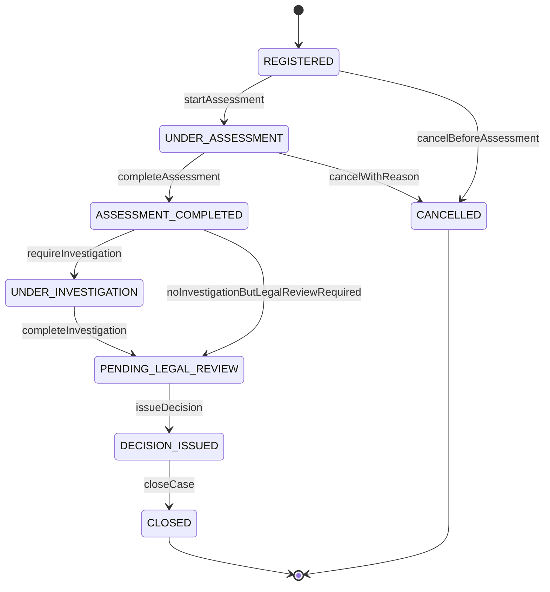
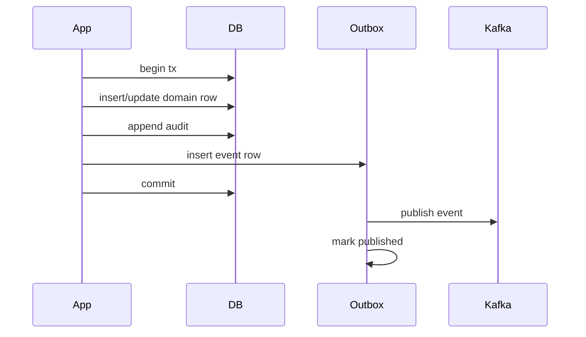
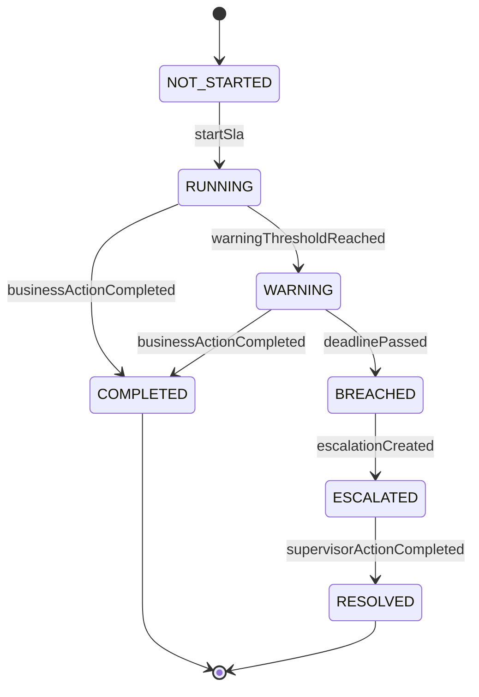
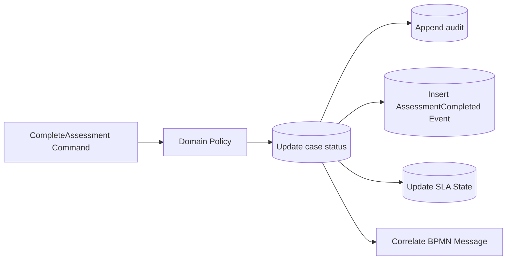
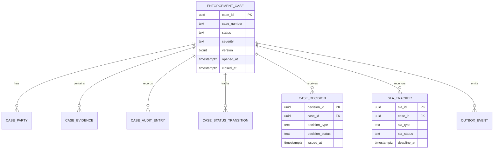

# Part 004 — Domain Model, State, and Workflow Boundaries

Banyak sistem enterprise gagal bukan karena engineer tidak tahu Java, Kafka, PostgreSQL, atau Kubernetes. Mereka gagal karena satu konsep sederhana dicampur aduk:

```text
state
```

Di sistem nyata, “state” bukan satu benda. Minimal ada beberapa jenis state:

- domain state;
- workflow state;
- persistence state;
- event state;
- audit state;
- SLA state;
- integration state;
- operational state;
- UI/projection state.

Jika semua state dicampur ke satu field `status`, sistem akan terlihat sederhana di awal, lalu menjadi rapuh saat ada exception, appeal, cancellation, retry, migration, replay, atau human task yang berjalan paralel.

Part ini membangun mental model yang akan dipakai sampai akhir seri.

Targetnya: kita bisa menjawab dengan presisi:

- `case_status` harus disimpan di mana?
- BPMN token Camunda mewakili apa?
- Kafka event mewakili state atau fakta?
- Audit trail harus mengikuti domain state atau command attempt?
- SLA breach itu status case atau status operasional?
- Retry consumer boleh mengubah state yang sama berapa kali?
- Kapan state transition harus atomic di PostgreSQL?
- Kapan workflow cukup mengorkestrasi tanpa menjadi source of truth?

---

## 1. Problem: “Status” yang Terlalu Banyak Arti

Misalkan ada field:

```text
status = IN_REVIEW
```

Apa artinya?

Mungkin berarti:

1. officer sedang melakukan assessment;
2. Camunda process sedang berhenti di user task review;
3. case belum boleh diberi decision;
4. SLA assessment sedang berjalan;
5. event `CaseReviewStarted` sudah dipublish;
6. UI harus menampilkan tombol submit assessment;
7. audit terakhir menunjukkan assignment ke officer;
8. database row belum closed;
9. external referral masih waiting acknowledgment.

Jika semua makna itu ditempel ke satu field, field tersebut menjadi overloaded.

Overloaded state menghasilkan bug seperti ini:

- UI menampilkan aksi yang salah;
- Camunda process menunggu task yang sudah tidak relevan;
- event replay mengembalikan case ke status lama;
- query dashboard menghitung case salah;
- audit tidak bisa menjelaskan kenapa status berubah;
- migration process gagal karena state tidak punya makna tunggal;
- recovery operator tidak tahu apakah harus memperbaiki domain row, Camunda instance, atau Kafka offset.

Solusinya bukan membuat 50 field status. Solusinya adalah memisahkan jenis state berdasarkan pertanyaan yang dijawab.

---

## 2. State Taxonomy

Gunakan taxonomy ini sebagai peta.

| Jenis state | Pertanyaan yang dijawab | Source of truth |
|---|---|---|
| Domain state | “Secara bisnis/legal, case ini berada di tahap apa?” | PostgreSQL domain tables. |
| Workflow state | “Process engine sedang menunggu aktivitas apa?” | Camunda 7 runtime/history tables. |
| Persistence state | “Row mana yang committed, locked, version berapa?” | PostgreSQL transaction + MVCC. |
| Event state | “Fakta apa yang sudah dipublikasikan/diterima?” | Outbox/inbox + Kafka log. |
| Audit state | “Siapa melakukan apa, kapan, kenapa, dan akibatnya?” | Append-only audit tables. |
| SLA state | “Deadline apa yang berjalan, warning/breach apa yang terjadi?” | Domain/SLA tables + timer process. |
| Integration state | “External system sudah dikirim/diterima/acknowledged?” | Integration tables + Kafka offsets. |
| Operational state | “Sistem sehat, lag, incident, retry, repair apa?” | Metrics/logs/traces/ops tables. |
| Projection/UI state | “Apa yang nyaman ditampilkan/dicari user?” | Read model/projection/query tables. |

Satu kejadian bisnis bisa menyentuh beberapa state sekaligus, tetapi tiap state punya pemilik dan semantics berbeda.

---

## 3. Domain State

Domain state menjawab pertanyaan bisnis.

Contoh domain state utama:

```text
DRAFT
REGISTERED
UNDER_ASSESSMENT
ASSESSMENT_COMPLETED
UNDER_INVESTIGATION
PENDING_LEGAL_REVIEW
DECISION_ISSUED
CLOSED
CANCELLED
```

State ini harus:

- punya definisi bisnis;
- punya allowed transition;
- punya invariant;
- bisa diaudit;
- bisa di-query tanpa membaca workflow engine;
- tidak bergantung pada detail implementasi Camunda.

### 3.1 Domain state machine awal



State machine ini bukan sekadar diagram. Ia adalah kontrak domain.

Jika command `issueDecision` dipanggil ketika status masih `UNDER_ASSESSMENT`, sistem harus menolak. Penolakan ini tidak boleh tergantung apakah BPMN token sedang berada di gateway tertentu. Domain harus menjaga invariantnya sendiri.

### 3.2 Invariant domain

Contoh invariant:

```text
Case tidak boleh CLOSED sebelum decision dibuat.
Case tidak boleh DECISION_ISSUED tanpa at least satu decision record valid.
Case tidak boleh UNDER_INVESTIGATION jika assessment belum completed.
Case tidak boleh memiliki dua active final decision.
Case number harus unik.
Closed case tidak boleh menerima evidence baru kecuali lewat reopen process eksplisit.
Decision severe sanction wajib legal review.
```

Invariant harus ditegakkan di beberapa level:

| Level | Contoh |
|---|---|
| Java domain policy | `canIssueDecision(currentStatus, decisionType)` |
| PostgreSQL constraint | unique active decision, FK, NOT NULL, CHECK |
| Transaction lock | optimistic/pessimistic lock saat transition |
| Test | transition matrix, property-like negative cases |

Jangan hanya mengandalkan validasi UI atau BPMN gateway. UI bisa bypass. BPMN bisa incident. Consumer bisa replay. Operator bisa menjalankan repair. Domain invariant tetap harus bertahan.

---

## 4. Workflow State

Workflow state menjawab pertanyaan process engine:

```text
Process instance ini sedang berada di aktivitas apa?
Job apa yang pending?
Timer apa yang aktif?
User task apa yang menunggu?
Incident apa yang terjadi?
```

Contoh workflow state:

- process instance active;
- token berada di `UserTask_AssessCase`;
- timer boundary `AssessmentSlaWarning` aktif;
- service task `EnrichEntityData` failed;
- process instance menunggu message `EvidenceSubmitted`;
- incident tercipta karena delegate exception.

Workflow state **bukan** sumber utama status bisnis.

### 4.1 Mapping domain state ke workflow state

Mapping bisa seperti ini:

| Domain state | Workflow state yang mungkin |
|---|---|
| `REGISTERED` | process baru dimulai, initial validation service task, atau incident di validation. |
| `UNDER_ASSESSMENT` | user task assessment aktif, timer SLA assessment aktif. |
| `ASSESSMENT_COMPLETED` | gateway menuju investigation/legal review, atau message wait. |
| `UNDER_INVESTIGATION` | investigation user task aktif, evidence wait, external data wait, timer aktif. |
| `PENDING_LEGAL_REVIEW` | legal review user task aktif. |
| `DECISION_ISSUED` | close case service task, notification task, event publication wait. |
| `CLOSED` | process instance ended atau archival subprocess. |

Perhatikan: satu domain state bisa punya beberapa workflow state internal.

Karena itu jangan membuat domain status terlalu granular hanya agar cocok dengan BPMN step.

Bad:

```text
CASE_STATUS = WAITING_AT_BPMN_TASK_REVIEW_EVIDENCE_V2
```

Better:

```text
case.status = UNDER_INVESTIGATION
workflow.activeTask = Review Evidence
```

### 4.2 BPMN token sebagai operational truth

BPMN token adalah kebenaran untuk process execution, bukan kebenaran legal domain.

Jika operator bertanya:

```text
Kenapa case ini tidak lanjut?
```

Camunda berguna:

```text
Ada incident di service task ValidateEvidenceBundle.
```

Jika auditor bertanya:

```text
Apakah case ini sudah memiliki legal decision final?
```

Domain database dan audit trail yang menjawab.

---

## 5. Persistence State

Persistence state menjawab pertanyaan teknis database:

- row sudah committed atau belum;
- transaction isolation apa;
- row version berapa;
- lock siapa yang memegang;
- constraint apa yang gagal;
- migration version apa;
- data visible untuk transaction mana.

Dalam PostgreSQL, concurrency bukan hanya “dua thread update row”. Ada MVCC, isolation level, locks, deadlocks, serialization failure, dan transaction boundary.

### 5.1 Version sebagai state teknis

Contoh field:

```sql
version bigint NOT NULL DEFAULT 0
```

`version` bukan domain state. Ia persistence state untuk optimistic locking.

Command update bisa memakai:

```sql
UPDATE case_domain.enforcement_case
SET status = #{newStatus},
    version = version + 1,
    updated_at = now()
WHERE case_id = #{caseId}
  AND version = #{expectedVersion}
  AND status = #{expectedStatus};
```

Jika affected row = 0, kemungkinan:

- case tidak ada;
- version stale;
- status sudah berubah;
- command tidak valid lagi.

Aplikasi harus membedakan error ini secukupnya.

### 5.2 Lock sebagai state sementara

Lock tidak terlihat di domain model, tetapi mempengaruhi behavior.

Contoh operasi yang butuh lock:

- assign officer;
- issue decision;
- close case;
- process same Kafka event;
- publish outbox batch;
- repair stuck process.

Kita akan memakai kombinasi:

- optimistic locking untuk command biasa;
- `SELECT ... FOR UPDATE` untuk transition kritikal;
- `FOR UPDATE SKIP LOCKED` untuk worker batch;
- advisory lock untuk koordinasi khusus jika perlu.

Persistence state harus dipahami agar kita tidak membuat bug yang hanya muncul di production load.

---

## 6. Event State

Event state menjawab:

```text
Fakta apa yang sudah terjadi dan dikomunikasikan ke luar boundary?
```

Event bukan command. Event adalah fakta masa lalu.

Good:

```text
CaseRegistered
AssessmentCompleted
InvestigationStarted
DecisionIssued
CaseClosed
SlaBreached
```

Bad:

```text
StartAssessmentPlease
DoDecisionNow
UpdateCaseStatus
CallNotificationService
```

### 6.1 Event harus berasal dari committed fact

Event `CaseRegistered` hanya boleh dipublish jika case benar-benar committed di database.

Karena itu event publication tidak boleh dilakukan langsung dari memory sebelum commit.

Flow benar:



Event state yang kita simpan:

| Field | Makna |
|---|---|
| `event_id` | Identitas global event. |
| `aggregate_type` | Misalnya `case`. |
| `aggregate_id` | `case_id`. |
| `event_type` | `CaseRegistered`. |
| `event_version` | Versi schema event. |
| `payload` | Isi event. |
| `status` | `NEW`, `PUBLISHED`, `FAILED`, dll. |
| `attempt_count` | Jumlah percobaan publish. |
| `published_at` | Waktu publish berhasil. |

### 6.2 Event replay tidak boleh merusak domain

Jika event dikonsumsi ulang, consumer harus aman.

Contoh inbox:

```sql
CREATE TABLE case_integration.inbox_event (
    event_id          uuid PRIMARY KEY,
    topic             text NOT NULL,
    partition_no      int NOT NULL,
    offset_no         bigint NOT NULL,
    event_type        text NOT NULL,
    received_at       timestamptz NOT NULL,
    processed_at      timestamptz,
    processing_status text NOT NULL
);
```

Consumer melakukan:

```text
insert event_id ke inbox
jika duplicate -> skip
jika insert berhasil -> process side-effect
commit
```

Event state bukan hanya Kafka offset. Offset adalah posisi consumer. Inbox adalah bukti bahwa side-effect sudah pernah diterapkan.

---

## 7. Audit State

Audit state menjawab:

```text
Apa yang terjadi, siapa yang melakukan, kapan, dari mana, terhadap entity apa, dan kenapa?
```

Audit berbeda dari log.

Log:

```text
2026-07-02 INFO Decision submitted
```

Audit:

```text
actor=officer-123
command=IssueDecision
caseId=...
previousStatus=PENDING_LEGAL_REVIEW
newStatus=DECISION_ISSUED
decisionType=SANCTION
reasonCode=EVIDENCE_CONFIRMED
correlationId=...
occurredAt=...
```

Audit harus bisa dipakai untuk pembelaan keputusan. Dalam sistem regulatory, audit bukan ornamen.

### 7.1 Audit sebagai append-only fact

Audit entry tidak boleh diedit sembarangan. Jika perlu koreksi, tambahkan audit entry koreksi.

Contoh audit table:

```sql
CREATE TABLE case_domain.case_audit_entry (
    audit_id        uuid PRIMARY KEY,
    case_id         uuid NOT NULL,
    actor_type      text NOT NULL,
    actor_id        text NOT NULL,
    action          text NOT NULL,
    reason_code     text,
    before_snapshot jsonb,
    after_snapshot  jsonb,
    correlation_id  text NOT NULL,
    command_id      text NOT NULL,
    occurred_at     timestamptz NOT NULL
);
```

Audit state bisa memiliki snapshot, tetapi snapshot bukan pengganti domain table. Snapshot membantu menjelaskan perubahan pada titik waktu tertentu.

### 7.2 Audit command attempt vs audit success

Tidak semua command attempt menjadi domain change.

Pertanyaan desain:

```text
Apakah command yang ditolak perlu audit?
```

Untuk sistem regulatory, sering kali iya, terutama untuk aksi sensitif.

Kita bisa memisahkan:

| Audit type | Contoh |
|---|---|
| Security/access audit | User mencoba aksi tanpa izin. |
| Command attempt audit | User mencoba issue decision tetapi data belum lengkap. |
| Domain change audit | Decision berhasil diterbitkan. |
| Operational audit | Operator menjalankan repair/replay. |

Jangan mencampur semuanya ke satu semantic tanpa field pembeda.

---

## 8. SLA State

SLA state menjawab:

```text
Deadline apa yang berlaku, apakah sudah warning, apakah sudah breach, siapa yang harus diberitahu, dan apakah breach sudah ditangani?
```

SLA bukan selalu domain status.

Case bisa tetap `UNDER_INVESTIGATION` dan sekaligus punya SLA state `BREACHED`.

```text
case.status = UNDER_INVESTIGATION
sla.assessment.status = COMPLETED
sla.investigation.status = BREACHED
```

Jika SLA dipaksa masuk ke `case_status`, state machine akan meledak:

```text
UNDER_INVESTIGATION_SLA_OK
UNDER_INVESTIGATION_SLA_WARNING
UNDER_INVESTIGATION_SLA_BREACHED
UNDER_INVESTIGATION_SLA_ESCALATED
```

Itu tanda state berbeda dicampur.

### 8.1 SLA model



SLA state bisa di-drive oleh:

- domain command;
- Camunda timer;
- scheduled worker;
- database query for due items.

Tetapi source of truth SLA sebaiknya ada di table yang bisa di-query dan diaudit.

---

## 9. Integration State

Integration state menjawab:

```text
Kita sudah menerima apa dari external system?
Kita sudah mengirim apa?
External system sudah ack atau belum?
Retry terakhir kapan?
Payload versi berapa?
```

Contoh:

```text
external_referral.status = RECEIVED
external_referral.case_id = ...
external_notification.status = SENT
external_notification.ack_status = WAITING
```

Integration state berbeda dari domain state.

Misalnya notification gagal dikirim. Apakah case status berubah?

Biasanya tidak.

```text
case.status = DECISION_ISSUED
notification.status = FAILED_RETRYABLE
```

Jika notification gagal mengubah case status menjadi `ERROR`, domain menjadi tercemar oleh masalah integrasi.

Lebih baik operational/integration state yang menunjukkan failure, sementara domain tetap benar.

---

## 10. Operational State

Operational state menjawab:

```text
Sistem sedang sehat atau tidak?
Apa yang stuck?
Apa yang lag?
Apa yang retry terus?
Apa yang butuh intervensi operator?
```

Contoh operational state:

- outbox lag 15 menit;
- Kafka consumer group lag 50000 records;
- Camunda incidents 23;
- DB connection pool 95% used;
- API p95 latency 2.5s;
- pod restart 12 kali dalam 10 menit;
- migration version mismatch;
- failed repair action.

Operational state tidak boleh mengubah domain state secara otomatis tanpa command/recovery yang eksplisit.

Bad:

```text
Jika Kafka lag tinggi, set semua case menjadi PROCESSING_DELAYED.
```

Better:

```text
Expose operational alert: event publication delayed.
Domain case tetap pada status bisnisnya.
```

Jika perlu memberi tahu user bahwa update mungkin terlambat, itu projection/UI concern, bukan domain status utama.

---

## 11. Projection/UI State

Projection state menjawab:

```text
Data apa yang dibutuhkan UI/search/dashboard dengan cepat?
```

Projection boleh redundant.

Contoh:

```text
case_search_projection
  case_id
  case_number
  status
  severity
  assigned_officer_name
  current_task_name
  sla_badge
  last_event_at
```

Projection bukan source of truth. Projection bisa dibangun ulang dari domain table, audit, workflow query, atau event.

Projection boleh eventual consistent selama UI memahami behavior-nya.

---

## 12. Boundary Rule: Siapa Boleh Mengubah Apa?

Gunakan matriks ini.

| State | Boleh diubah oleh | Tidak boleh diubah langsung oleh |
|---|---|---|
| Domain state | Domain command handler dalam transaksi | UI, Kafka consumer tanpa command boundary, BPMN script sembarang. |
| Workflow state | Camunda engine melalui BPMN execution | Domain repository langsung. |
| Persistence state | PostgreSQL transaction/lock/migration | Business code tanpa memahami isolation. |
| Event state | Outbox publisher, consumer inbox | API direct publish tanpa outbox. |
| Audit state | Audit appender dalam command boundary | Manual update biasa. |
| SLA state | SLA policy, timer, command handler | UI status toggle. |
| Integration state | Integration adapter/consumer/publisher | Domain policy yang tidak tahu external protocol. |
| Operational state | Observability/ops/reconciliation | Domain transition otomatis tanpa command. |
| Projection state | Projector/query updater | Business invariant. |

Rule penting:

```text
Setiap state punya pemilik. Jika semua komponen boleh mengubah semua state, tidak ada invariant yang benar-benar aman.
```

---

## 13. Command sebagai Satu-satunya Pintu Domain Transition

Domain state berubah melalui command.

Contoh command:

```text
RegisterCase
StartAssessment
CompleteAssessment
StartInvestigation
SubmitEvidence
CompleteInvestigation
RequestLegalReview
IssueDecision
CloseCase
CancelCase
ReopenCase
```

Command punya:

- command id;
- actor;
- target aggregate;
- payload;
- idempotency key;
- correlation id;
- expected version/status jika perlu;
- reason code;
- requested at.

Contoh Java record konseptual:

```java
public record IssueDecisionCommand(
    UUID commandId,
    UUID caseId,
    String actorId,
    String actorRole,
    long expectedVersion,
    DecisionType decisionType,
    String reasonCode,
    String correlationId,
    Instant requestedAt
) {}
```

Command handler melakukan:

```text
load current state
validate authorization
validate transition
apply domain policy
persist transition atomically
append audit
insert outbox
return result
```

### 13.1 Jangan biarkan setter mengubah state

Bad:

```java
caseEntity.setStatus("CLOSED");
caseMapper.update(caseEntity);
```

Better:

```java
caseCommandHandler.handle(new CloseCaseCommand(...));
```

Atau di domain object:

```java
caseAggregate.close(closeCaseCommand, policy, clock);
```

State transition harus menjadi aksi bernama, bukan assignment field acak.

---

## 14. Transition Matrix

Sebelum coding, buat transition matrix.

| From | Command | To | Guard |
|---|---|---|---|
| `REGISTERED` | `StartAssessment` | `UNDER_ASSESSMENT` | officer assigned. |
| `UNDER_ASSESSMENT` | `CompleteAssessment` | `ASSESSMENT_COMPLETED` | assessment result complete. |
| `ASSESSMENT_COMPLETED` | `StartInvestigation` | `UNDER_INVESTIGATION` | investigation required. |
| `UNDER_INVESTIGATION` | `CompleteInvestigation` | `PENDING_LEGAL_REVIEW` | required evidence complete. |
| `PENDING_LEGAL_REVIEW` | `IssueDecision` | `DECISION_ISSUED` | legal reviewer approved. |
| `DECISION_ISSUED` | `CloseCase` | `CLOSED` | notification/outcome recorded. |
| `REGISTERED` | `CancelCase` | `CANCELLED` | cancellation reason valid. |
| `UNDER_ASSESSMENT` | `CancelCase` | `CANCELLED` | supervisor approval if assigned. |

Negative transition harus dites:

| From | Invalid command | Expected error |
|---|---|---|
| `REGISTERED` | `IssueDecision` | `INVALID_STATE_TRANSITION` |
| `CLOSED` | `SubmitEvidence` | `CASE_ALREADY_CLOSED` |
| `UNDER_INVESTIGATION` | `StartAssessment` | `ASSESSMENT_ALREADY_COMPLETED` |
| `CANCELLED` | `CloseCase` | `CASE_CANCELLED` |

Testing negative path lebih penting daripada happy path di sistem stateful.

---

## 15. Domain Event vs Integration Event

Tidak semua event sama.

### 15.1 Domain event

Domain event adalah fakta internal tentang aggregate.

```text
CaseRegistered
CaseAssigned
AssessmentCompleted
DecisionIssued
```

Domain event biasanya dibuat saat domain command berhasil.

### 15.2 Integration event

Integration event adalah event yang dipublikasikan ke luar bounded context.

Ia bisa mirip domain event, tetapi sering perlu envelope, filtering, redaction, versioning, dan compatibility berbeda.

Contoh:

```text
case.lifecycle.v1 CaseRegistered
```

Payload integration event mungkin tidak memuat semua detail internal karena privacy/security/compatibility.

### 15.3 Process event

Process event adalah event untuk menggerakkan workflow.

Contoh:

```text
EvidenceSubmittedMessage
LegalReviewCompletedMessage
ExternalRegistryDataReceivedMessage
```

Ini bisa berasal dari domain event atau external event, tetapi dipakai untuk korelasi BPMN.

Jangan menyamakan semua event ini. Mereka punya audience berbeda.

---

## 16. Mapping Command, State, Audit, Event, Workflow

Untuk satu command `CompleteAssessment`, mapping-nya bisa seperti ini:



Dalam transaksi ideal:

```text
domain update + audit + outbox + SLA update = atomic
```

BPMN correlation bisa dilakukan setelah commit dengan recovery path, atau dalam boundary yang sama jika architecture memilih coupling lebih kuat.

Yang penting: keputusan ini eksplisit, bukan kebetulan.

---

## 17. Camunda Variable Contract

Camunda variables harus minimal dan stabil.

Contoh variable contract:

```json
{
  "caseId": "uuid",
  "caseNumber": "ENF-2026-000001",
  "severity": "HIGH",
  "assessmentGroup": "ENFORCEMENT_OFFICER",
  "slaDeadline": "2026-07-10T10:00:00Z"
}
```

Hindari:

```json
{
  "case": { "entire nested domain object": "..." },
  "allEvidence": ["..."],
  "auditTrail": ["..."],
  "uiState": { "...": "..." }
}
```

Variable besar menciptakan masalah:

- serialization issue;
- migration sulit;
- stale data;
- history table membengkak;
- process instance sulit dipahami;
- sensitive data tersebar.

Rule:

```text
Camunda variable adalah routing/process context, bukan domain object storage.
```

---

## 18. Business Key dan Correlation

Setiap process instance harus punya business key yang stabil.

Pilihan:

```text
businessKey = caseId
```

Atau:

```text
businessKey = caseNumber
```

Untuk sistem internal, `caseId` UUID biasanya lebih stabil. `caseNumber` berguna untuk manusia tetapi bisa punya format bisnis yang berubah.

Correlation rule:

| Use case | Correlation key |
|---|---|
| Start lifecycle process | `caseId` as business key. |
| Evidence submitted | message name + `caseId`. |
| External registry data received | message name + `caseId` or external reference mapping. |
| SLA timer | process-local timer plus `caseId`. |
| Appeal submitted | new process or subprocess with `caseId` + appealId. |

Jangan correlate hanya berdasarkan status atau user id. Correlation harus deterministic.

---

## 19. State Drift

State drift terjadi ketika beberapa state yang harus sinkron mulai berbeda.

Contoh:

```text
Database: case.status = REGISTERED
Camunda: no process instance exists
Outbox: CaseRegistered published
UI: shows UNDER_ASSESSMENT
```

Atau:

```text
Database: case.status = DECISION_ISSUED
Camunda: still waiting at Legal Review task
Kafka: DecisionIssued not published
Audit: no decision audit entry
```

State drift tidak bisa dihindari sepenuhnya di distributed system. Yang penting adalah:

- drift bisa dideteksi;
- drift punya owner;
- drift punya recovery path;
- recovery idempotent;
- audit mencatat recovery.

### 19.1 Reconciliation query

Contoh reconciliation:

```text
Find cases where status = REGISTERED and no active process instance id after 5 minutes.
Find outbox events NEW older than 2 minutes.
Find Camunda incidents grouped by activity id.
Find cases DECISION_ISSUED without DecisionIssued outbox event.
Find SLA RUNNING with deadline < now and no breach event.
```

Reconciliation adalah bagian desain, bukan script darurat.

---

## 20. Error State vs Domain State

Jangan menambahkan `ERROR` ke domain status tanpa berpikir.

Banyak error adalah operational, bukan domain.

Contoh:

| Error | Domain status berubah? | State yang berubah |
|---|---|---|
| Kafka publish gagal | Tidak | outbox status. |
| Email notification gagal | Tidak | notification/integration status. |
| Camunda service task incident | Biasanya tidak | workflow incident. |
| DB deadlock saat command | Tidak jika rollback | command result error. |
| Evidence invalid | Bisa, tergantung rule | domain validation result/audit. |
| Legal reviewer rejects decision | Ya, jika itu outcome bisnis | domain state/decision state. |

Domain status `ERROR` sering menjadi tempat sampah untuk semua masalah. Hindari kecuali error itu benar-benar state bisnis.

---

## 21. Cancellation, Reopen, dan Appeal

State machine sederhana biasanya lupa tiga hal:

- cancellation;
- reopen;
- appeal.

Dalam regulatory system, ini penting.

### 21.1 Cancellation

Cancellation bukan delete.

Cancellation harus punya:

- reason;
- actor;
- allowed states;
- audit;
- effect ke workflow;
- event;
- downstream notification.

### 21.2 Reopen

Reopen lebih berbahaya daripada create.

Pertanyaan:

- Dari status apa boleh reopen?
- Apakah decision lama tetap valid?
- Apakah reopen membuat investigation baru atau melanjutkan lama?
- Apakah SLA dihitung ulang?
- Apakah event `CaseReopened` cukup atau perlu `InvestigationReopened`?
- Bagaimana audit menjelaskan pembatalan closure?

### 21.3 Appeal

Appeal bisa menjadi:

- subprocess dalam case lifecycle;
- process instance baru terkait case;
- aggregate baru `appeal` dengan lifecycle sendiri.

Untuk sistem besar, appeal sering lebih bersih sebagai aggregate/process terpisah yang mereferensikan case.

---

## 22. Aggregate Boundary

Tidak semua table dalam satu aggregate.

Candidate aggregate:

| Aggregate | Alasan |
|---|---|
| `Case` | Root lifecycle utama. |
| `EvidenceBundle` | Bisa banyak, lifecycle validasi sendiri. |
| `Decision` | Final/semi-final legal outcome, invariant kuat. |
| `SlaTracker` | Deadline dan escalation lifecycle. |
| `ExternalReferral` | Integration lifecycle dengan external agency. |
| `Appeal` | Lifecycle sendiri setelah decision. |

Aggregate boundary membantu menentukan transaksi.

Rule:

```text
Satu command sebaiknya mengubah satu aggregate utama secara atomik.
```

Jika perlu mengubah beberapa aggregate, pertimbangkan:

- apakah sebenarnya boundary aggregate terlalu kecil/besar;
- apakah perlu domain service transactional;
- apakah event-driven eventual consistency cukup;
- apakah invariant lintas aggregate benar-benar harus synchronous.

---

## 23. Case Aggregate Conceptual Model



Model ini belum final. Ia memberi arah bahwa case root memiliki relasi ke beberapa sub-entity dan related aggregate.

---

## 24. Implementasi State Transition di Java

Kita ingin transition eksplisit.

Contoh sederhana:

```java
public enum CaseStatus {
    REGISTERED,
    UNDER_ASSESSMENT,
    ASSESSMENT_COMPLETED,
    UNDER_INVESTIGATION,
    PENDING_LEGAL_REVIEW,
    DECISION_ISSUED,
    CLOSED,
    CANCELLED
}
```

Transition policy:

```java
public final class CaseTransitionPolicy {

    public boolean canTransition(CaseStatus from, CaseCommandType command) {
        return switch (from) {
            case REGISTERED -> command == CaseCommandType.START_ASSESSMENT
                    || command == CaseCommandType.CANCEL_CASE;
            case UNDER_ASSESSMENT -> command == CaseCommandType.COMPLETE_ASSESSMENT
                    || command == CaseCommandType.CANCEL_CASE;
            case ASSESSMENT_COMPLETED -> command == CaseCommandType.START_INVESTIGATION
                    || command == CaseCommandType.REQUEST_LEGAL_REVIEW;
            case UNDER_INVESTIGATION -> command == CaseCommandType.COMPLETE_INVESTIGATION;
            case PENDING_LEGAL_REVIEW -> command == CaseCommandType.ISSUE_DECISION;
            case DECISION_ISSUED -> command == CaseCommandType.CLOSE_CASE;
            case CLOSED, CANCELLED -> false;
        };
    }
}
```

Ini masih sederhana. Production implementation perlu error detail, reason, actor permission, dan domain data completeness.

Yang penting: transition berada di tempat eksplisit dan dites.

---

## 25. Implementasi State Guard di PostgreSQL

Java policy penting, tetapi database tetap harus menjaga update tidak liar.

Contoh update guarded:

```sql
UPDATE case_domain.enforcement_case
SET status = 'DECISION_ISSUED',
    version = version + 1,
    updated_at = now()
WHERE case_id = #{caseId}
  AND status = 'PENDING_LEGAL_REVIEW'
  AND version = #{expectedVersion};
```

Lalu pastikan decision record ada dalam transaksi yang sama.

```sql
INSERT INTO case_domain.case_decision (
    decision_id,
    case_id,
    decision_type,
    decision_status,
    issued_at
) VALUES (
    #{decisionId},
    #{caseId},
    #{decisionType},
    'ISSUED',
    now()
);
```

Jika `UPDATE` affected row = 0, jangan lanjut insert decision seolah-olah berhasil.

### 25.1 Constraint untuk final decision

Contoh partial unique index:

```sql
CREATE UNIQUE INDEX ux_case_one_issued_decision
ON case_domain.case_decision(case_id)
WHERE decision_status = 'ISSUED';
```

Ini menjaga invariant: satu case hanya boleh punya satu issued decision aktif.

---

## 26. Workflow Boundary Pattern

Kita butuh port agar domain tidak bergantung langsung ke Camunda.

```java
public interface CaseWorkflowPort {
    void startCaseLifecycle(UUID caseId, String caseNumber, CaseWorkflowContext context);
    void correlateAssessmentCompleted(UUID caseId, AssessmentWorkflowResult result);
    void correlateDecisionIssued(UUID caseId, DecisionWorkflowResult result);
}
```

Adapter Camunda:

```java
public final class CamundaCaseWorkflowAdapter implements CaseWorkflowPort {
    // uses RuntimeService internally
}
```

Domain command handler bergantung ke `CaseWorkflowPort`, bukan `RuntimeService`.

Namun lebih baik lagi, untuk mengurangi coupling transaksi, command handler bisa menulis `workflow_command` table atau outbox internal, lalu worker melakukan correlation.

Pattern:

```text
domain command -> insert workflow command -> commit -> workflow dispatcher -> Camunda RuntimeService
```

Ini membuat workflow integration idempotent dan recoverable.

---

## 27. State Ownership in Code

Susunan package konseptual:

```text
case-domain-core
  CaseAggregate
  CaseStatus
  CaseCommandType
  CaseTransitionPolicy
  CaseInvariantViolation

case-domain-command
  RegisterCaseHandler
  CompleteAssessmentHandler
  IssueDecisionHandler
  CloseCaseHandler

case-persistence-mybatis
  CaseMapper
  CaseDecisionMapper
  CaseAuditMapper
  OutboxMapper

case-workflow-camunda7
  CamundaCaseWorkflowAdapter
  CamundaMessageCorrelationAdapter

case-event-publisher
  CaseEventFactory
  OutboxEventWriter
```

Dependency direction:

```text
handler -> domain policy
handler -> repository port
handler -> audit port
handler -> outbox port
handler -> workflow port
adapter -> framework
```

Jangan biarkan mapper XML, BPMN variable name, atau Kafka topic name tersebar di domain core.

---

## 28. Edge Cases yang Harus Didesain Dari Awal

### 28.1 Double submit case

Client timeout lalu retry `POST /v1/cases`.

Solusi:

- idempotency key wajib untuk command create;
- idempotency record menyimpan request hash dan response reference;
- duplicate dengan same key + same payload mengembalikan result sama;
- same key + different payload ditolak.

### 28.2 Officer complete assessment dua kali

Dua tab browser atau double click.

Solusi:

- command idempotency;
- optimistic lock version;
- guarded update by expected status;
- audit hanya satu success, duplicate menjadi replay/ignored.

### 28.3 Kafka event datang sebelum process menunggu message

Event eksternal diterima cepat, tetapi BPMN belum sampai message catch event.

Solusi:

- jangan langsung drop correlation failure;
- simpan integration event;
- retry correlation;
- atau desain process supaya event ditangani domain dulu, process membaca state saat sampai step terkait.

### 28.4 Camunda incident setelah domain state berubah

Service task gagal setelah case status diupdate.

Solusi:

- pastikan service task idempotent;
- gunakan async boundary secara sadar;
- recovery command membaca domain state;
- jangan rollback domain fact yang sudah committed tanpa command kompensasi.

### 28.5 Migration mengubah status enum

Status `PENDING_LEGAL_REVIEW` ingin diganti menjadi `LEGAL_REVIEW_PENDING`.

Solusi:

- jangan rename langsung;
- tambahkan support read both;
- migrate data;
- update contract;
- cleanup setelah semua code lama tidak berjalan;
- pikirkan event payload lama.

---

## 29. Testing Strategy untuk State Boundary

State boundary harus dites dengan beberapa level.

### 29.1 Transition matrix test

```text
Given REGISTERED
When IssueDecision
Then INVALID_STATE_TRANSITION
```

### 29.2 Repository guarded update test

```text
Given status UNDER_ASSESSMENT version 3
When update expected status PENDING_LEGAL_REVIEW
Then affected rows = 0
```

### 29.3 Idempotency test

```text
Given commandId already processed
When same command replayed
Then same result returned and no duplicate audit/outbox
```

### 29.4 Workflow correlation test

```text
Given process instance businessKey=caseId
When AssessmentCompleted correlated
Then process moves to next expected activity
```

### 29.5 Event replay test

```text
Given inbox has eventId
When Kafka delivers same event again
Then side-effect skipped
```

### 29.6 Reconciliation test

```text
Given case REGISTERED without processInstanceId older than threshold
When reconciliation runs
Then workflow start command created idempotently
```

---

## 30. Decision Rules: Where Should Logic Live?

Gunakan tabel ini saat ragu.

| Logic | Tempat utama | Alasan |
|---|---|---|
| Allowed case status transition | Domain policy + DB guard | Invariant bisnis harus tahan retry/concurrency. |
| Unique case number | PostgreSQL constraint | Harus benar walau race condition. |
| HTTP request shape | OpenAPI + validation layer | Transport contract. |
| Evidence completeness rule | Domain policy, mungkin query DB | Rule bisnis. |
| SLA timer wait | Camunda timer / scheduler | Process timing. |
| SLA breach record | Domain/SLA table | Harus bisa diaudit/query. |
| Human task assignment | Workflow + domain assignment policy | Process + business ownership. |
| Kafka publish guarantee | Outbox | Transactional reliability. |
| Consumer duplicate detection | Inbox | Idempotent side-effect. |
| Query dashboard | Projection/query model | Performance/read shape. |
| Repair action | Ops command + audit | Controlled operational mutation. |

Jika logic mempengaruhi legal/business correctness, jangan hanya taruh di BPMN atau UI.

---

## 31. Practical Mental Model

Gunakan model ini:

```text
Domain state = what is true in the business.
Workflow state = what work is currently being coordinated.
Persistence state = what data is committed and protected by transactions.
Event state = what facts have been communicated asynchronously.
Audit state = what must be explainable later.
SLA state = what time obligation is active or breached.
Integration state = what external interaction has happened.
Operational state = what the system is doing or failing to do.
Projection state = what users can search or see efficiently.
```

Ketika ada field baru bernama `status`, jangan langsung tambahkan. Tanya dulu:

```text
Status untuk menjawab pertanyaan apa?
Siapa pemiliknya?
Apa allowed transition-nya?
Apakah harus diaudit?
Apakah harus transactional?
Apakah boleh eventual consistent?
Apakah bisa di-rebuild?
Apakah external contract melihatnya?
```

---

## 32. Ringkasan

Part ini adalah fondasi desain yang akan menghemat banyak kesalahan di part implementasi.

Poin utama:

- Jangan mencampur semua state ke satu `status`.
- Domain state adalah source of truth bisnis dan legal.
- Workflow state adalah state koordinasi proses Camunda.
- Persistence state adalah realitas transaksi, lock, visibility, dan version.
- Event state adalah fakta asynchronous yang harus aman dipublish dan di-replay.
- Audit state adalah bukti, bukan sekadar log.
- SLA state punya lifecycle sendiri.
- Integration state tidak boleh mengotori domain state.
- Operational state harus terlihat dan recoverable.
- Projection state boleh redundant dan rebuildable.
- State transition harus lewat command boundary, bukan setter sembarang.
- BPMN mengorkestrasi; domain menjaga invariant.
- PostgreSQL constraints dan guarded update adalah bagian dari domain protection.

Part berikutnya akan masuk ke **Repository and Module Topology**: bagaimana seluruh boundary ini diterjemahkan menjadi Maven multi-module layout, package structure, contract folder, generated source boundary, application modules, test modules, dan deployment artifacts.

---

## Referensi Primer

- PostgreSQL Documentation — transaction isolation, MVCC, explicit locking, constraints, indexes.
- Camunda 7 Documentation — process engine, process instance, user task, job executor, timer, incident, transaction handling.
- Apache Kafka Documentation — topics, partitions, producer/consumer semantics, records, consumer groups.
- Eclipse Jersey User Guide — request/resource boundary, filters, providers, deployment model.
- Apache Maven Documentation — project object model, build lifecycle, module management.
