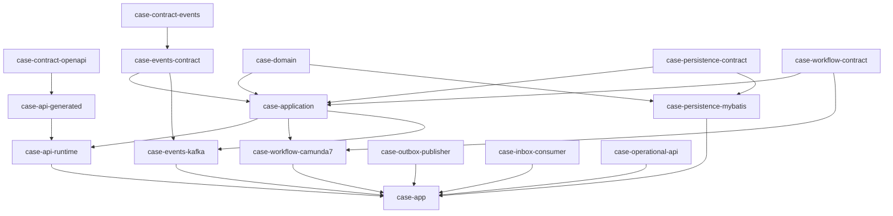
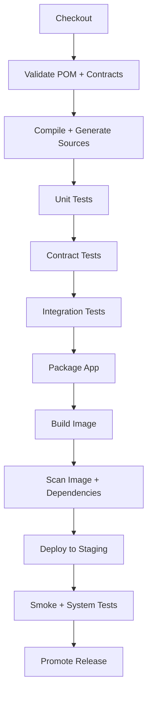
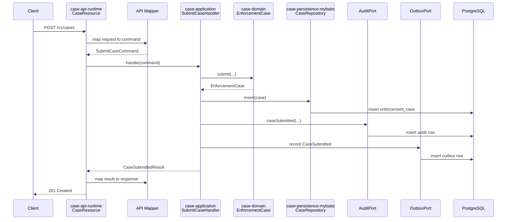

# Part 005 — Repository and Module Topology

Repository structure adalah arsitektur yang dipaksa menjadi nyata.

Diagram bagus bisa menyembunyikan coupling. Dokumen arsitektur bisa mengklaim boundary yang rapi. Tetapi struktur repository, module dependency, package boundary, Maven lifecycle, dan CI gate akan menunjukkan kebenaran sistem:

- siapa boleh depend ke siapa;
- contract mana yang menjadi sumber kebenaran;
- generated code boleh bocor ke mana;
- persistence detail terlihat atau tersembunyi;
- workflow engine menjadi core domain atau sekadar orkestrator;
- test bisa dijalankan cepat atau semua hal harus boot seluruh dunia;
- release satu service bisa dilakukan tanpa merusak semua module lain.

Part ini membangun topology repository untuk studi kasus kita: **Regulatory Enforcement & Case Orchestration Platform**.

Kita tidak sedang membuat struktur folder yang terlihat rapi. Kita sedang membuat **mechanical boundary**: aturan yang dipaksa oleh Maven, dependency graph, package naming, test scope, dan CI.

---

## 1. Problem: Repository yang Terlihat Rapi tapi Boundary-nya Bohong

Banyak project enterprise punya folder seperti ini:

```text
src/main/java/com/company/project
├── controller
├── service
├── repository
├── model
├── dto
└── util
```

Struktur ini terlihat familiar, tetapi untuk sistem production-grade contract-first, struktur seperti ini terlalu miskin informasi.

Masalahnya:

1. `model` sering berisi campuran DTO HTTP, entity database, Kafka event, Camunda variable, dan internal command.
2. `service` menjadi tempat semua logika: transaksi, workflow, validation, event publishing, authorization, dan mapper call.
3. `repository` menyembunyikan SQL tetapi tidak menyembunyikan coupling data.
4. `controller` terlihat tipis, tetapi error semantics dan idempotency sering tersebar.
5. `util` menjadi tempat pembuangan logic yang tidak punya owner.
6. Semua class bisa import semua class lain.

Akibatnya, contract-first hanya menjadi label. Secara mekanis, sistem tetap code-first dan coupling-first.

Kita butuh repository yang menjawab:

- kontrak HTTP didefinisikan di mana?
- kontrak event didefinisikan di mana?
- BPMN process definition disimpan dan dites di mana?
- SQL migration dan PL/pgSQL function menjadi bagian release apa?
- module mana yang boleh tahu Camunda API?
- module mana yang boleh tahu MyBatis?
- module mana yang boleh tahu Kafka client?
- generated code boleh dipakai langsung oleh domain atau harus diadaptasi?
- test contract, integration, dan system ditempatkan di mana?

---

## 2. Prinsip Topology

Gunakan prinsip berikut.

### 2.1 Contract is an input, not an afterthought

Kontrak tidak lahir setelah code selesai. Kontrak adalah input build.

Artinya:

- OpenAPI file versioned di repository;
- AsyncAPI/event schema versioned di repository;
- BPMN definition versioned di repository;
- DB migration versioned di repository;
- Java types hasil generate tidak diedit manual;
- CI bisa menolak perubahan kontrak yang breaking.

### 2.2 Generated code is not domain code

Generated code berguna, tetapi tidak boleh menjadi pusat domain.

Generated DTO biasanya membawa bentuk kontrak eksternal. Domain model membawa invariant internal. Dua hal ini boleh mirip, tetapi tidak identik.

Contoh:

```text
OpenAPI CreateCaseRequest
        │
        ▼
api-generated model
        │ mapped by adapter
        ▼
domain command SubmitCaseCommand
        │ validated by domain/application service
        ▼
PostgreSQL row + audit + outbox
```

Generated model boleh berubah mengikuti contract evolution. Domain command berubah mengikuti business invariant. Jangan satukan keduanya tanpa boundary.

### 2.3 Infrastructure dependency points inward? Not exactly

Di Clean Architecture klasik, dependency mengarah ke domain. Itu benar sebagai prinsip umum, tetapi sistem enterprise contract-first butuh beberapa boundary tambahan:

- contract module boleh berada di luar domain;
- generated module boleh dipakai API adapter;
- BPMN module boleh memiliki process definition tetapi tidak boleh menyimpan domain decision;
- persistence module boleh mengimplementasikan port, tetapi SQL tetap first-class artifact;
- deployment module tidak boleh depend ke application code.

Jangan dogmatis. Yang penting: **domain invariant tidak dikendalikan oleh transport, engine, atau mapper.**

### 2.4 Build graph must encode architecture

Kalau architecture rule hanya ada di dokumentasi, rule itu akan dilanggar.

Maven module graph harus membuat pelanggaran menjadi sulit.

Contoh rule:

```text
case-domain tidak boleh depend ke jersey, kafka, camunda, mybatis, servlet, jakarta.ws.rs
case-application boleh depend ke domain dan port, tetapi tidak ke jersey resource
case-api-runtime boleh depend ke jersey dan generated API model
case-persistence-mybatis boleh depend ke mybatis dan postgresql driver
case-workflow-camunda boleh depend ke camunda engine API
case-events-kafka boleh depend ke kafka client
```

Rule ini nanti bisa diperkuat dengan Maven Enforcer, ArchUnit, dan CI.

---

## 3. High-Level Repository Topology

Kita pakai satu repository untuk satu platform learning ini agar dependency antar-bagian terlihat. Dalam production nyata, organisasi bisa memilih monorepo atau multi-repo. Untuk belajar sistem kompleks, monorepo lebih efektif karena kita bisa melihat kontrak, code, DB, BPMN, deployment, dan test dalam satu tempat.

```text
regulatory-enforcement-platform/
├── pom.xml
├── README.md
├── docs/
├── contracts/
├── platform-bom/
├── platform-parent/
├── case-domain/
├── case-application/
├── case-contract-openapi/
├── case-contract-events/
├── case-api-generated/
├── case-api-runtime/
├── case-persistence-contract/
├── case-persistence-mybatis/
├── case-workflow-contract/
├── case-workflow-camunda7/
├── case-events-contract/
├── case-events-kafka/
├── case-outbox-publisher/
├── case-inbox-consumer/
├── case-operational-api/
├── case-app/
├── database/
├── deployment/
├── test-fixtures/
├── test-contract/
├── test-integration/
├── test-system/
└── tools/
```

Ini terlihat banyak. Tetapi banyak bukan berarti rumit. Banyak module kecil dengan boundary jelas sering lebih mudah dikendalikan daripada satu module besar yang semua class-nya saling import.

---

## 4. Maven Aggregator, Parent, dan BOM

Sebelum masuk module bisnis, bedakan tiga konsep Maven yang sering dicampur.

### 4.1 Aggregator POM

Aggregator POM menentukan module apa saja yang dibangun bersama.

Root `pom.xml` biasanya punya packaging `pom` dan daftar `<modules>`.

```xml
<project>
  <modelVersion>4.0.0</modelVersion>

  <groupId>com.example.regulatory</groupId>
  <artifactId>regulatory-enforcement-platform</artifactId>
  <version>1.0.0-SNAPSHOT</version>
  <packaging>pom</packaging>

  <modules>
    <module>platform-bom</module>
    <module>platform-parent</module>
    <module>case-domain</module>
    <module>case-application</module>
    <module>case-contract-openapi</module>
    <module>case-contract-events</module>
    <module>case-api-generated</module>
    <module>case-api-runtime</module>
    <module>case-persistence-contract</module>
    <module>case-persistence-mybatis</module>
    <module>case-workflow-contract</module>
    <module>case-workflow-camunda7</module>
    <module>case-events-contract</module>
    <module>case-events-kafka</module>
    <module>case-outbox-publisher</module>
    <module>case-inbox-consumer</module>
    <module>case-operational-api</module>
    <module>case-app</module>
    <module>database</module>
    <module>test-fixtures</module>
    <module>test-contract</module>
    <module>test-integration</module>
    <module>test-system</module>
  </modules>
</project>
```

Aggregator menjawab: “kalau build seluruh repo, module apa saja yang ikut?”

### 4.2 Parent POM

Parent POM membawa konfigurasi build yang diwariskan:

- Java version;
- compiler configuration;
- surefire/failsafe configuration;
- pluginManagement;
- checkstyle/spotbugs/error-prone jika dipakai;
- source encoding;
- reproducible build setting;
- default test naming convention.

`platform-parent/pom.xml`:

```xml
<project>
  <modelVersion>4.0.0</modelVersion>

  <parent>
    <groupId>com.example.regulatory</groupId>
    <artifactId>regulatory-enforcement-platform</artifactId>
    <version>1.0.0-SNAPSHOT</version>
    <relativePath>../pom.xml</relativePath>
  </parent>

  <artifactId>platform-parent</artifactId>
  <packaging>pom</packaging>

  <properties>
    <maven.compiler.release>17</maven.compiler.release>
    <project.build.sourceEncoding>UTF-8</project.build.sourceEncoding>
    <project.reporting.outputEncoding>UTF-8</project.reporting.outputEncoding>
  </properties>

  <build>
    <pluginManagement>
      <plugins>
        <plugin>
          <groupId>org.apache.maven.plugins</groupId>
          <artifactId>maven-compiler-plugin</artifactId>
          <version>${maven.compiler.plugin.version}</version>
          <configuration>
            <release>${maven.compiler.release}</release>
          </configuration>
        </plugin>

        <plugin>
          <groupId>org.apache.maven.plugins</groupId>
          <artifactId>maven-surefire-plugin</artifactId>
          <version>${maven.surefire.plugin.version}</version>
        </plugin>

        <plugin>
          <groupId>org.apache.maven.plugins</groupId>
          <artifactId>maven-failsafe-plugin</artifactId>
          <version>${maven.failsafe.plugin.version}</version>
        </plugin>
      </plugins>
    </pluginManagement>
  </build>
</project>
```

Parent menjawab: “bagaimana module dibangun?”

### 4.3 BOM

BOM atau Bill of Materials mengontrol versi dependency.

`platform-bom/pom.xml`:

```xml
<project>
  <modelVersion>4.0.0</modelVersion>

  <groupId>com.example.regulatory</groupId>
  <artifactId>platform-bom</artifactId>
  <version>1.0.0-SNAPSHOT</version>
  <packaging>pom</packaging>

  <dependencyManagement>
    <dependencies>
      <dependency>
        <groupId>org.glassfish.jersey</groupId>
        <artifactId>jersey-bom</artifactId>
        <version>${jersey.version}</version>
        <type>pom</type>
        <scope>import</scope>
      </dependency>

      <dependency>
        <groupId>org.junit</groupId>
        <artifactId>junit-bom</artifactId>
        <version>${junit.version}</version>
        <type>pom</type>
        <scope>import</scope>
      </dependency>
    </dependencies>
  </dependencyManagement>
</project>
```

BOM menjawab: “versi dependency apa yang legal?”

Jangan campur semua ke root POM. Root aggregator, parent, dan BOM punya fungsi berbeda.

---

## 5. Module Graph Utama

Dependency graph ideal:



Baca diagram dari bawah ke atas secara hati-hati: module runtime menggabungkan adapter. Domain tidak tahu runtime.

Catatan: Maven dependency arah panah bisa digambar berbeda tergantung konvensi. Yang penting adalah aturan konseptual: **domain dan application core tidak depend ke framework adapter.**

---

## 6. Module-by-Module Design

### 6.1 `case-domain`

Isi:

```text
case-domain/
└── src/main/java/com/example/regulatory/case/domain/
    ├── CaseId.java
    ├── CaseNumber.java
    ├── EnforcementCase.java
    ├── CaseLifecycleStatus.java
    ├── RiskLevel.java
    ├── DecisionType.java
    ├── CaseTransitionPolicy.java
    ├── CaseInvariantViolation.java
    └── events/
        ├── DomainEvent.java
        ├── CaseAccepted.java
        ├── CaseRejected.java
        └── CaseEscalated.java
```

Rule:

- tidak ada `jakarta.ws.rs`;
- tidak ada `org.apache.kafka`;
- tidak ada `org.camunda`;
- tidak ada `org.mybatis`;
- tidak ada JDBC;
- tidak ada servlet;
- tidak ada generated OpenAPI DTO;
- boleh punya pure Java records/classes/enums;
- boleh punya domain exception atau typed result;
- harus bisa dites tanpa container.

Contoh domain type:

```java
public record CaseId(UUID value) {
    public CaseId {
        if (value == null) {
            throw new IllegalArgumentException("case id is required");
        }
    }
}
```

Contoh domain policy:

```java
public final class CaseTransitionPolicy {
    public void requireCanStartInvestigation(EnforcementCase c) {
        if (c.status() != CaseLifecycleStatus.ACCEPTED) {
            throw new CaseInvariantViolation(
                "Only accepted case can enter investigation"
            );
        }
    }
}
```

Domain module menjawab: “apa yang benar secara bisnis?”

### 6.2 `case-application`

Isi:

```text
case-application/
└── src/main/java/com/example/regulatory/case/application/
    ├── command/
    │   ├── SubmitCaseCommand.java
    │   ├── AcceptCaseCommand.java
    │   └── EscalateCaseCommand.java
    ├── handler/
    │   ├── SubmitCaseHandler.java
    │   └── EscalateCaseHandler.java
    ├── port/
    │   ├── CaseRepository.java
    │   ├── CaseAuditPort.java
    │   ├── CaseWorkflowPort.java
    │   ├── CaseEventPort.java
    │   └── TransactionPort.java
    └── result/
        ├── ApplicationResult.java
        └── CaseSubmittedResult.java
```

Application module mengorkestrasi use case tanpa tahu transport dan infrastructure.

Contoh command:

```java
public record SubmitCaseCommand(
    String idempotencyKey,
    String externalReference,
    String complainantId,
    String allegationType,
    String summary,
    Instant receivedAt
) {}
```

Contoh port:

```java
public interface CaseRepository {
    Optional<EnforcementCase> findByExternalReference(String externalReference);
    CaseId nextIdentity();
    void insert(EnforcementCase c);
}
```

Contoh handler:

```java
public final class SubmitCaseHandler {
    private final CaseRepository cases;
    private final CaseAuditPort audit;
    private final CaseEventPort events;
    private final TransactionPort tx;

    public CaseSubmittedResult handle(SubmitCaseCommand command) {
        return tx.required(() -> {
            cases.findByExternalReference(command.externalReference())
                .ifPresent(existing -> {
                    throw new DuplicateCaseSubmission(existing.id());
                });

            EnforcementCase c = EnforcementCase.submit(
                cases.nextIdentity(),
                command.externalReference(),
                command.complainantId(),
                command.allegationType(),
                command.summary(),
                command.receivedAt()
            );

            cases.insert(c);
            audit.caseSubmitted(c.id(), command.receivedAt());
            events.recordCaseSubmitted(c);

            return new CaseSubmittedResult(c.id(), c.caseNumber());
        });
    }
}
```

Application module menjawab: “satu use case harus menjalankan langkah apa secara atomik dan berurutan?”

### 6.3 `case-contract-openapi`

Isi:

```text
case-contract-openapi/
└── src/main/openapi/
    ├── case-api.yaml
    ├── components/
    │   ├── schemas.yaml
    │   ├── parameters.yaml
    │   ├── responses.yaml
    │   └── errors.yaml
    └── examples/
        ├── submit-case-request.json
        └── submit-case-response.json
```

Rule:

- tidak ada Java source kecuali helper test opsional;
- kontrak HTTP adalah artifact;
- CI memvalidasi syntax;
- CI membandingkan compatibility dengan versi sebelumnya;
- contoh request/response harus valid terhadap schema.

Module ini menjawab: “HTTP API yang dijanjikan ke consumer seperti apa?”

### 6.4 `case-api-generated`

Isi:

```text
case-api-generated/
└── target/generated-sources/openapi/...
```

Rule:

- code generated dari `case-contract-openapi`;
- tidak diedit manual;
- tidak boleh mengandung business logic;
- package jelas, misalnya `com.example.regulatory.case.api.generated`;
- dipakai oleh `case-api-runtime`, bukan oleh `case-domain`.

Contoh POM generator:

```xml
<plugin>
  <groupId>org.openapitools</groupId>
  <artifactId>openapi-generator-maven-plugin</artifactId>
  <version>${openapi.generator.version}</version>
  <executions>
    <execution>
      <goals>
        <goal>generate</goal>
      </goals>
      <configuration>
        <inputSpec>${project.basedir}/../case-contract-openapi/src/main/openapi/case-api.yaml</inputSpec>
        <generatorName>jaxrs-spec</generatorName>
        <modelPackage>com.example.regulatory.case.api.generated.model</modelPackage>
        <apiPackage>com.example.regulatory.case.api.generated.api</apiPackage>
        <generateSupportingFiles>false</generateSupportingFiles>
      </configuration>
    </execution>
  </executions>
</plugin>
```

Generated module menjawab: “bentuk Java dari kontrak eksternal seperti apa?”

### 6.5 `case-api-runtime`

Isi:

```text
case-api-runtime/
└── src/main/java/com/example/regulatory/case/api/runtime/
    ├── resource/
    │   └── CaseResource.java
    ├── mapper/
    │   ├── SubmitCaseMapper.java
    │   └── ApiErrorMapper.java
    ├── filter/
    │   ├── CorrelationIdFilter.java
    │   └── RequestAuditFilter.java
    └── provider/
        ├── JsonProvider.java
        └── ExceptionMapperProvider.java
```

Rule:

- boleh depend ke Jersey/JAX-RS;
- boleh depend ke generated OpenAPI model;
- boleh call application handler;
- tidak boleh menulis SQL;
- tidak boleh publish Kafka langsung;
- tidak boleh call Camunda API langsung kecuali lewat application/workflow port;
- mapping error harus eksplisit.

Contoh resource:

```java
@Path("/v1/cases")
@Consumes(MediaType.APPLICATION_JSON)
@Produces(MediaType.APPLICATION_JSON)
public final class CaseResource {
    private final SubmitCaseHandler submitCase;
    private final SubmitCaseMapper mapper;

    @POST
    public Response submit(
        @HeaderParam("Idempotency-Key") String idempotencyKey,
        SubmitCaseRequest request
    ) {
        SubmitCaseCommand command = mapper.toCommand(idempotencyKey, request);
        CaseSubmittedResult result = submitCase.handle(command);
        return Response.status(Response.Status.CREATED)
            .entity(mapper.toResponse(result))
            .build();
    }
}
```

API runtime menjawab: “bagaimana kontrak HTTP dijalankan oleh application use case?”

### 6.6 `case-persistence-contract`

Isi:

```text
case-persistence-contract/
└── src/main/java/com/example/regulatory/case/persistence/contract/
    ├── CaseRecord.java
    ├── CaseSearchCriteria.java
    ├── CaseRowVersion.java
    └── CasePersistenceError.java
```

Module ini opsional, tetapi berguna untuk memisahkan shape persistence dari MyBatis implementation. Jangan samakan dengan domain.

Persistence record bisa menyimpan field teknis:

```java
public record CaseRecord(
    UUID id,
    String caseNumber,
    String lifecycleStatus,
    long rowVersion,
    Instant createdAt,
    Instant updatedAt
) {}
```

Domain tidak perlu tahu `rowVersion` jika itu murni persistence concern. Application mungkin perlu tahu versi untuk optimistic locking. Pilih dengan sadar.

### 6.7 `case-persistence-mybatis`

Isi:

```text
case-persistence-mybatis/
└── src/main/
    ├── java/com/example/regulatory/case/persistence/mybatis/
    │   ├── mapper/
    │   │   ├── CaseSqlMapper.java
    │   │   └── OutboxSqlMapper.java
    │   ├── repository/
    │   │   └── MyBatisCaseRepository.java
    │   ├── tx/
    │   │   └── MyBatisTransactionPort.java
    │   └── typehandler/
    │       ├── CaseIdTypeHandler.java
    │       └── JsonbTypeHandler.java
    └── resources/com/example/regulatory/case/persistence/mybatis/mapper/
        ├── CaseSqlMapper.xml
        └── OutboxSqlMapper.xml
```

Rule:

- boleh depend ke MyBatis;
- boleh depend ke PostgreSQL JDBC driver;
- boleh tahu SQL table/function;
- boleh implement `CaseRepository`;
- tidak boleh expose MyBatis mapper ke API runtime;
- tidak boleh mengubah domain invariant diam-diam.

Contoh mapper interface:

```java
public interface CaseSqlMapper {
    void insertCase(CaseRecord record);
    Optional<CaseRecord> findById(UUID id);
    Optional<CaseRecord> findByExternalReference(String externalReference);
}
```

Contoh XML:

```xml
<mapper namespace="com.example.regulatory.case.persistence.mybatis.mapper.CaseSqlMapper">
  <insert id="insertCase" parameterType="com.example.regulatory.case.persistence.contract.CaseRecord">
    insert into enforcement_case (
      id,
      case_number,
      lifecycle_status,
      row_version,
      created_at,
      updated_at
    ) values (
      #{id},
      #{caseNumber},
      #{lifecycleStatus},
      #{rowVersion},
      #{createdAt},
      #{updatedAt}
    )
  </insert>
</mapper>
```

Persistence module menjawab: “bagaimana domain/application state committed ke PostgreSQL?”

### 6.8 `database`

Isi:

```text
database/
└── src/main/resources/db/migration/
    ├── V001__create_case_core.sql
    ├── V002__create_case_audit.sql
    ├── V003__create_outbox.sql
    ├── V004__create_inbox.sql
    ├── V005__create_idempotency_key.sql
    └── V006__create_case_functions.sql
```

Walau kita belum memilih migration tool secara detail di daftar isi, repository tetap harus punya tempat untuk SQL migration. Untuk seri ini, database artifact adalah bagian release, bukan catatan manual DBA di luar code.

Rule:

- DDL versioned;
- PL/pgSQL function versioned;
- index creation direncanakan;
- migration diuji dengan database nyata via Testcontainers di integration test;
- migration tidak boleh bergantung pada state developer lokal.

Database module menjawab: “bentuk storage contract yang dirilis seperti apa?”

### 6.9 `case-workflow-contract`

Isi:

```text
case-workflow-contract/
└── src/main/java/com/example/regulatory/case/workflow/contract/
    ├── CaseWorkflowPort.java
    ├── StartCaseProcessCommand.java
    ├── CorrelateCaseEventCommand.java
    ├── CaseProcessVariable.java
    └── WorkflowError.java
```

Rule:

- tidak depend ke Camunda;
- mendefinisikan bahasa workflow internal;
- application boleh depend ke module ini;
- Camunda implementation berada di module lain.

Contoh:

```java
public interface CaseWorkflowPort {
    void startCaseLifecycle(StartCaseProcessCommand command);
    void correlateInvestigationCompleted(CorrelateCaseEventCommand command);
}
```

Workflow contract menjawab: “use case butuh orkestrasi workflow apa tanpa tahu engine-nya?”

### 6.10 `case-workflow-camunda7`

Isi:

```text
case-workflow-camunda7/
└── src/main/
    ├── java/com/example/regulatory/case/workflow/camunda7/
    │   ├── CamundaCaseWorkflowAdapter.java
    │   ├── delegate/
    │   │   ├── ValidateCaseDelegate.java
    │   │   └── PublishAssessmentRequestedDelegate.java
    │   ├── variable/
    │   │   └── CamundaVariableMapper.java
    │   └── incident/
    │       └── WorkflowIncidentClassifier.java
    └── resources/bpmn/
        ├── case-lifecycle.bpmn
        └── case-escalation.bpmn
```

Rule:

- boleh depend ke Camunda 7 API;
- BPMN XML versioned;
- process variables mapped explicitly;
- delegate tidak boleh berisi domain logic besar;
- delegate harus kecil, deterministic, dan testable;
- Camunda technical error tidak boleh bocor sebagai domain error.

Workflow Camunda module menjawab: “bagaimana orkestrasi dijalankan di Camunda 7?”

### 6.11 `case-contract-events`

Isi:

```text
case-contract-events/
└── src/main/asyncapi/
    ├── case-events.yaml
    ├── schemas/
    │   ├── case-submitted.schema.json
    │   ├── case-accepted.schema.json
    │   └── case-escalated.schema.json
    └── examples/
        ├── case-submitted.json
        └── case-accepted.json
```

Rule:

- kontrak event versioned;
- schema payload + envelope jelas;
- topic, key, header, dan semantic compatibility terdokumentasi;
- example valid terhadap schema.

Module ini menjawab: “fakta apa yang dipublikasikan ke event stream?”

### 6.12 `case-events-contract`

Isi Java contract internal untuk event:

```text
case-events-contract/
└── src/main/java/com/example/regulatory/case/events/contract/
    ├── CaseEventEnvelope.java
    ├── CaseSubmittedEvent.java
    ├── CaseAcceptedEvent.java
    ├── CaseEventMetadata.java
    └── CaseEventPublisher.java
```

Rule:

- tidak depend ke Kafka client;
- bisa generated dari schema atau ditulis manual dengan mapping ketat;
- dipakai application port;
- payload tidak boleh mengambil domain object mentah lalu serialize sembarangan.

### 6.13 `case-events-kafka`

Isi:

```text
case-events-kafka/
└── src/main/java/com/example/regulatory/case/events/kafka/
    ├── KafkaCaseEventPublisher.java
    ├── KafkaCaseEventConsumer.java
    ├── KafkaHeaderMapper.java
    ├── KafkaSerializationAdapter.java
    └── KafkaErrorClassifier.java
```

Rule:

- boleh depend ke Kafka client;
- Kafka exception diklasifikasi;
- serialization eksplisit;
- header propagation eksplisit;
- tidak boleh langsung mutate domain state tanpa application handler.

### 6.14 `case-outbox-publisher`

Isi:

```text
case-outbox-publisher/
└── src/main/java/com/example/regulatory/case/outbox/
    ├── OutboxPoller.java
    ├── OutboxPublisher.java
    ├── OutboxClaimStrategy.java
    ├── OutboxRetryPolicy.java
    └── OutboxMetrics.java
```

Rule:

- membaca outbox table;
- claim batch dengan locking strategy;
- publish Kafka;
- mark published;
- retry dan poison handling;
- tidak menjalankan business decision.

Outbox publisher adalah operational component, bukan domain service.

### 6.15 `case-inbox-consumer`

Isi:

```text
case-inbox-consumer/
└── src/main/java/com/example/regulatory/case/inbox/
    ├── InboxConsumer.java
    ├── InboxDeduplicator.java
    ├── InboxRetryPolicy.java
    ├── IncomingEventRouter.java
    └── InboxMetrics.java
```

Rule:

- menerima event dari Kafka;
- deduplicate via inbox table;
- route ke application handler;
- commit offset hanya setelah durable handling sesuai strategi;
- idempotency wajib.

### 6.16 `case-operational-api`

Isi:

```text
case-operational-api/
└── src/main/java/com/example/regulatory/case/ops/
    ├── HealthResource.java
    ├── ReadinessResource.java
    ├── OutboxOpsResource.java
    ├── WorkflowIncidentResource.java
    └── BuildInfoResource.java
```

Rule:

- health/readiness bukan business API;
- expose operational info yang aman;
- tidak bocorkan data sensitif;
- endpoint repair harus sangat hati-hati, authorized, audited.

### 6.17 `case-app`

Isi:

```text
case-app/
└── src/main/java/com/example/regulatory/case/app/
    ├── Main.java
    ├── Bootstrap.java
    ├── ModuleWiring.java
    ├── RuntimeConfig.java
    └── ShutdownHooks.java
```

Module ini menyatukan semua adapter.

Rule:

- dependency paling banyak ada di runtime assembly;
- wiring ada di sini;
- business logic tidak ada di sini;
- lifecycle startup/shutdown dikelola di sini;
- container entrypoint mengarah ke sini.

---

## 7. Contract Directory vs Contract Module

Kita punya `contracts/` dan module `case-contract-*`. Apakah redundant?

Tidak, kalau perannya jelas.

```text
contracts/
├── openapi/
│   └── case-api.yaml
├── asyncapi/
│   └── case-events.yaml
└── bpmn/
    └── case-lifecycle.bpmn
```

`contracts/` bisa dipakai sebagai source canonical linting/documentation lintas module.

Module `case-contract-openapi` dan `case-contract-events` adalah packaging/build boundary. Dalam repo kecil, kontrak bisa langsung berada di module. Dalam repo besar, `contracts/` bisa menjadi workspace-level source dan module hanya membungkus validation/generation.

Untuk seri ini, pilih satu saja agar tidak membingungkan:

```text
case-contract-openapi/src/main/openapi
case-contract-events/src/main/asyncapi
case-workflow-camunda7/src/main/resources/bpmn
```

Artinya kontrak disimpan dekat module yang membangun artifact-nya.

---

## 8. Package Naming Strategy

Package harus menunjukkan boundary, bukan sekadar layer generic.

Buruk:

```text
com.example.project.service
com.example.project.dto
com.example.project.util
```

Lebih baik:

```text
com.example.regulatory.case.domain
com.example.regulatory.case.application.command
com.example.regulatory.case.application.handler
com.example.regulatory.case.application.port
com.example.regulatory.case.api.runtime.resource
com.example.regulatory.case.api.runtime.mapper
com.example.regulatory.case.persistence.mybatis.mapper
com.example.regulatory.case.workflow.camunda7.delegate
com.example.regulatory.case.events.kafka
com.example.regulatory.case.outbox
```

Package naming menjadi peta mental. Saat membaca import, engineer harus langsung tahu dependency ini melintasi boundary apa.

---

## 9. Dependency Rules yang Harus Dipaksa

Rule dependency minimal:

| From module | Boleh depend ke | Tidak boleh depend ke |
|---|---|---|
| `case-domain` | JDK only, maybe small validation lib | Jersey, Kafka, Camunda, MyBatis, JDBC, generated DTO |
| `case-application` | domain, ports/contracts | Jersey resource, Kafka client, Camunda engine, MyBatis mapper |
| `case-api-runtime` | application, api-generated, JAX-RS/Jersey | MyBatis mapper XML, Kafka producer direct, Camunda RuntimeService direct |
| `case-persistence-mybatis` | application port, domain, MyBatis, JDBC | Jersey resource, API generated DTO |
| `case-workflow-camunda7` | workflow contract, application, Camunda API | Jersey resource, API generated DTO unless explicit adapter |
| `case-events-kafka` | event contract, Kafka client | Jersey resource, MyBatis mapper direct for business mutation |
| `case-app` | all runtime modules | business logic implementation |
| `test-integration` | runtime modules, Testcontainers | production-only secrets |

Jika rule ini tidak dipaksa, repository akan membusuk perlahan.

---

## 10. Enforcing Architecture with Tests

Gunakan ArchUnit atau mekanisme serupa untuk membuat rule menjadi executable.

Contoh rule konseptual:

```java
@Test
void domain_must_not_depend_on_frameworks() {
    JavaClasses classes = new ClassFileImporter()
        .importPackages("com.example.regulatory.case.domain");

    noClasses()
        .that().resideInAPackage("..case.domain..")
        .should().dependOnClassesThat().resideInAnyPackage(
            "jakarta.ws.rs..",
            "org.glassfish.jersey..",
            "org.apache.kafka..",
            "org.camunda..",
            "org.mybatis.."
        )
        .check(classes);
}
```

Ini bukan cosmetic test. Ini pagar arsitektur.

---

## 11. Test Module Topology

Sistem production-grade butuh beberapa jenis test. Jangan campur semua dalam satu folder.

```text
test-fixtures/
├── CaseFixture.java
├── ApiFixture.java
├── EventFixture.java
└── DatabaseFixture.java

test-contract/
├── OpenApiCompatibilityTest.java
├── OpenApiExampleValidationTest.java
├── EventSchemaCompatibilityTest.java
└── BpmnVariableContractTest.java

test-integration/
├── PostgresMigrationIT.java
├── MyBatisRepositoryIT.java
├── OutboxPublisherIT.java
├── KafkaConsumerIT.java
└── CamundaProcessIT.java

test-system/
├── CaseLifecycleSystemIT.java
├── CaseEscalationSystemIT.java
├── FailureRecoverySystemIT.java
└── DeploymentSmokeIT.java
```

### 11.1 Unit test

Dijalankan cepat. Tidak butuh container.

Target:

- domain policy;
- application handler dengan fake port;
- mapper pure function;
- error classifier;
- idempotency decision logic.

### 11.2 Contract test

Menjamin kontrak valid dan tidak berubah sembarangan.

Target:

- OpenAPI syntax;
- schema example validity;
- breaking-change detection;
- AsyncAPI/event schema validity;
- BPMN variable contract consistency.

### 11.3 Integration test

Butuh dependency nyata.

Target:

- PostgreSQL migration;
- MyBatis mapper;
- transaction behavior;
- Kafka serialization/deserialization;
- Camunda process execution;
- outbox/inbox with real database.

### 11.4 System test

Menjalankan slice besar.

Target:

- submit case via HTTP;
- persist case;
- create audit;
- write outbox;
- publish event;
- start/correlate workflow;
- verify projection;
- simulate failure.

---

## 12. Maven Lifecycle Strategy

Gunakan konvensi:

- unit tests: `mvn test`;
- integration tests: `mvn verify` dengan Failsafe;
- generated code: `generate-sources`;
- contract validation: `validate` atau `verify` tergantung berat;
- packaging app: `package`;
- container image build: profile eksplisit, bukan default untuk semua developer.

Contoh naming:

```text
*Test.java     -> unit test, surefire
*IT.java       -> integration test, failsafe
*SystemIT.java -> system test, failsafe/profile khusus
```

Contoh failsafe:

```xml
<plugin>
  <groupId>org.apache.maven.plugins</groupId>
  <artifactId>maven-failsafe-plugin</artifactId>
  <executions>
    <execution>
      <goals>
        <goal>integration-test</goal>
        <goal>verify</goal>
      </goals>
    </execution>
  </executions>
</plugin>
```

Jangan membuat `mvn test` selalu menyalakan Kafka, PostgreSQL, Camunda, dan Kubernetes. Developer akan berhenti menjalankannya.

---

## 13. Generated Source Discipline

Generated source punya tiga aturan.

### 13.1 Generated output harus deterministik

Kalau generator dijalankan dua kali tanpa perubahan input, output harus sama.

Jika tidak, review diff menjadi noisy dan trust menurun.

### 13.2 Generated code tidak diedit manual

Kalau generated code perlu disesuaikan, ubah input contract atau generator config, bukan hasil generate.

### 13.3 Generated model tidak menjadi domain model

Buruk:

```java
public void submit(SubmitCaseRequest request) {
    domainService.submit(request);
}
```

Lebih baik:

```java
public void submit(SubmitCaseRequest request) {
    SubmitCaseCommand command = mapper.toCommand(request);
    submitCaseHandler.handle(command);
}
```

Mapping terasa membosankan, tetapi mapping adalah boundary. Boundary memang harus eksplisit.

---

## 14. Deployment Module Topology

Deployment artifact tidak boleh tercecer.

```text
deployment/
├── docker/
│   └── case-app.Dockerfile
├── k8s/
│   ├── base/
│   │   ├── deployment.yaml
│   │   ├── service.yaml
│   │   ├── configmap.yaml
│   │   ├── secret.example.yaml
│   │   └── pdb.yaml
│   └── overlays/
│       ├── local/
│       ├── staging/
│       └── production/
└── nginx/
    ├── nginx.conf
    └── routes.conf
```

Rule:

- Kubernetes manifests versioned;
- NGINX route config versioned;
- secret contoh boleh ada, secret asli tidak;
- environment differences explicit;
- manifest tidak menjadi tempat business config liar.

Deployment module menjawab: “bagaimana artifact ini dijalankan di environment nyata?”

---

## 15. Runtime Wiring Pattern

Ada dua ekstrem buruk:

1. semua dependency dibuat dengan `new` di mana-mana;
2. semua dependency diserahkan ke framework DI tanpa struktur.

Untuk seri ini, kita pakai explicit composition root.

```java
public final class ModuleWiring {
    public CaseResource caseResource(RuntimeConfig config) {
        DataSource dataSource = dataSource(config.database());
        SqlSessionFactory sqlSessionFactory = myBatis(dataSource);

        CaseRepository caseRepository = new MyBatisCaseRepository(sqlSessionFactory);
        TransactionPort tx = new MyBatisTransactionPort(sqlSessionFactory);
        CaseAuditPort audit = new PostgresCaseAuditPort(sqlSessionFactory);
        CaseEventPort events = new OutboxCaseEventPort(sqlSessionFactory);

        SubmitCaseHandler submitCase = new SubmitCaseHandler(
            caseRepository,
            audit,
            events,
            tx
        );

        return new CaseResource(submitCase, new SubmitCaseMapper());
    }
}
```

Pada production nyata, Anda bisa memakai DI framework. Tetapi mental model composition root tetap penting: ada satu tempat yang menyatukan adapter, bukan adapter saling mencari dependency sendiri.

---

## 16. CI Pipeline Topology

Pipeline minimal:



Pipeline bukan sekadar automation. Pipeline adalah governance.

Gate yang wajib ada:

- contract syntax valid;
- generated code up-to-date;
- no forbidden dependency;
- unit tests pass;
- integration tests pass;
- migration can apply to clean database;
- image builds reproducibly;
- critical vulnerabilities handled;
- smoke test passes.

---

## 17. Release Artifact Strategy

Jangan release source code. Release artifact.

Artifact penting:

| Artifact | Bentuk | Owner |
|---|---|---|
| HTTP contract | OpenAPI YAML | API owner |
| Event contract | AsyncAPI/schema | Event owner |
| BPMN process | BPMN XML | Workflow owner |
| DB migration | SQL migration | Data owner |
| Java app | JAR/container image | Service owner |
| Kubernetes manifest | YAML/Kustomize/Helm | Platform/service owner |
| NGINX config | conf/ingress | Edge/platform owner |
| Test evidence | reports | Delivery owner |

Release production bukan “merge to main lalu semoga jalan”. Release production adalah promosi artifact yang sudah diverifikasi.

---

## 18. Naming Conventions

Gunakan nama yang stabil.

### 18.1 Module naming

```text
case-domain
case-application
case-api-runtime
case-persistence-mybatis
case-workflow-camunda7
case-events-kafka
```

Format:

```text
<bounded-context>-<concern>-<implementation-if-any>
```

Contoh:

- `case-persistence-mybatis`, bukan `case-db`;
- `case-workflow-camunda7`, bukan `case-process`;
- `case-events-kafka`, bukan `case-messaging`.

Nama harus menunjukkan coupling teknologi.

### 18.2 Package naming

Package harus mengikuti module.

```text
com.example.regulatory.case.persistence.mybatis
```

Jangan membuat package `com.example.regulatory.common` untuk semua hal. Common sering menjadi global coupling.

### 18.3 Artifact naming

Artifact Maven harus bisa dibaca di dependency tree.

```text
com.example.regulatory:case-domain
com.example.regulatory:case-application
com.example.regulatory:case-workflow-camunda7
```

Saat melihat `mvn dependency:tree`, engineer harus bisa mengerti struktur sistem.

---

## 19. Common Module: Kapan Boleh?

Module `common` sering berbahaya. Ia menjadi tempat semua hal yang malas diberi owner.

Boleh punya common jika isinya sangat stabil dan tidak domain-specific:

```text
platform-time
platform-result
platform-observability
platform-json
platform-test-fixtures
```

Buruk:

```text
common/
├── dto/
├── service/
├── validator/
├── mapper/
├── constants/
└── util/
```

Lebih baik:

```text
case-application/result
case-api-runtime/mapper
case-domain/policy
case-persistence-mybatis/typehandler
```

Rule: kalau satu class punya alasan berubah karena satu bounded context, letakkan di bounded context itu. Jangan masukkan ke common.

---

## 20. Configuration File Placement

Configuration harus punya owner.

```text
case-app/src/main/resources/application.yaml
case-persistence-mybatis/src/main/resources/mybatis-config.xml
case-workflow-camunda7/src/main/resources/camunda.cfg.xml
case-api-runtime/src/main/resources/logging-api.yaml
```

Tetapi konfigurasi environment-specific sebaiknya tidak hardcoded di JAR.

Gunakan environment variable atau mounted config untuk:

- database URL;
- Kafka bootstrap servers;
- Camunda job executor tuning;
- NGINX timeout;
- feature toggle;
- security settings.

Kita akan bahas detail di part konfigurasi.

---

## 21. Anti-Pattern Repository

### 21.1 The everything app module

```text
case-app/
└── src/main/java/...
    ├── controller
    ├── service
    ├── repository
    ├── kafka
    ├── camunda
    └── util
```

Semua cepat di awal, mahal di akhir.

### 21.2 The fake contract module

Kontrak ada, tetapi generated code diedit manual dan implementation tidak divalidasi terhadap contract.

Ini bukan contract-first. Ini contract-decoration.

### 21.3 The shared DTO trap

Satu DTO dipakai untuk:

- HTTP request;
- Kafka event;
- DB row;
- Camunda variable;
- UI projection.

DTO terlihat reuse, tetapi sebenarnya menyatukan lifecycle yang berbeda.

### 21.4 The framework-in-domain leak

Domain import:

```java
import jakarta.ws.rs.core.Response;
import org.camunda.bpm.engine.delegate.DelegateExecution;
import org.apache.kafka.clients.producer.ProducerRecord;
```

Jika ini terjadi, boundary rusak.

### 21.5 The unowned SQL folder

SQL migration ada di folder random, tidak diuji, tidak jelas bagian release apa.

Database adalah bagian sistem. Treat it as code.

---

## 22. Worked Example: Submit Case Dependency Path

Saat API `POST /v1/cases` dipanggil, dependency path ideal:



Tidak ada Kafka publish langsung di HTTP thread jika kita memakai outbox. Tidak ada Camunda variable mutation langsung dari resource. Tidak ada SQL dari resource.

---

## 23. Build Order Mental Model

Maven reactor akan membangun module berdasarkan dependency.

Secara konseptual:

```text
platform-bom / platform-parent
        ↓
contracts
        ↓
generated contract code
        ↓
domain + application + contracts/ports
        ↓
adapters: api, persistence, workflow, events
        ↓
runtime app
        ↓
tests
```

Jika module graph membuat `case-domain` menunggu `case-api-runtime`, ada yang salah.

---

## 24. Incremental Development Path

Agar tidak tenggelam, bangun repository secara incremental.

### Step 1 — Root, parent, BOM

Buat root aggregator, parent POM, BOM.

Success condition:

```text
mvn -q validate
```

berhasil.

### Step 2 — Domain + application kosong

Buat module domain dan application dengan satu command handler dummy.

Success condition:

```text
mvn -pl case-domain,case-application test
```

berhasil tanpa database, Kafka, Camunda.

### Step 3 — OpenAPI contract + generated module

Tambahkan contract minimal untuk `POST /v1/cases`.

Success condition:

- contract valid;
- generated source compile;
- API runtime bisa mapping request ke command.

### Step 4 — PostgreSQL + MyBatis integration

Tambahkan migration dan mapper insert/find.

Success condition:

- Testcontainers PostgreSQL naik;
- migration apply;
- mapper insert/find pass.

### Step 5 — Outbox event recording

Tambahkan outbox table dan application event port.

Success condition:

- submit case menulis case + audit + outbox dalam satu transaction.

### Step 6 — Camunda process start

Tambahkan process definition minimal.

Success condition:

- process instance bisa start dengan business key;
- variables contract benar;
- no business logic hidden in BPMN.

### Step 7 — Runtime app

Satukan resource, handler, persistence, workflow, dan config.

Success condition:

- app start lokal;
- health endpoint OK;
- submit case end-to-end pass.

---

## 25. Production Failure Model dari Topology

Topology yang benar membantu saat failure.

| Failure | Module yang diinvestigasi dulu | Kenapa |
|---|---|---|
| API 400 salah | `case-contract-openapi`, `case-api-runtime` | Mungkin schema/validation/mapping error. |
| Domain transition salah | `case-domain`, `case-application` | Invariant/policy/use case error. |
| Data tidak committed | `case-persistence-mybatis`, `database` | Transaction/mapper/migration issue. |
| Event tidak terkirim | `case-outbox-publisher`, `case-events-kafka` | Outbox claim/publish/retry issue. |
| Duplicate processing | `case-inbox-consumer`, `database` | Inbox/idempotency issue. |
| Process stuck | `case-workflow-camunda7` | BPMN job/incident/correlation issue. |
| Deployment gagal | `deployment`, `case-app` | Runtime config/image/probe issue. |

Jika topology kabur, incident triage kabur.

---

## 26. Production Checklist

Sebelum lanjut ke contract detail, repository harus memenuhi checklist ini.

### Architecture boundary

- [ ] Domain tidak import framework runtime.
- [ ] Application handler tidak import Jersey, Kafka client, Camunda engine, MyBatis mapper.
- [ ] Adapter module punya nama teknologi eksplisit.
- [ ] Generated code tidak dipakai sebagai domain model.
- [ ] SQL migration versioned.
- [ ] BPMN definition versioned.
- [ ] OpenAPI dan AsyncAPI versioned.

### Maven build

- [ ] Root aggregator jelas.
- [ ] Parent POM mengontrol plugin behavior.
- [ ] BOM mengontrol dependency versions.
- [ ] Unit dan integration test dipisah.
- [ ] Generated sources masuk lifecycle dengan deterministik.
- [ ] Dependency convergence dicek.

### Testing

- [ ] Unit test bisa jalan tanpa container.
- [ ] Contract test bisa validasi API/event examples.
- [ ] Integration test bisa apply migration ke PostgreSQL nyata.
- [ ] Camunda process bisa dites terpisah.
- [ ] System test punya path submit case end-to-end.

### Operations

- [ ] Deployment manifests versioned.
- [ ] Secret asli tidak committed.
- [ ] Health/readiness endpoint terpisah dari business API.
- [ ] Runtime config punya owner.
- [ ] Build info bisa dilacak ke commit/artifact.

---

## 27. What You Should Internalize

Repository topology bukan preferensi estetika. Ia adalah control surface.

Sistem production-grade membutuhkan boundary yang bisa diverifikasi:

- contract boundary;
- domain boundary;
- application boundary;
- persistence boundary;
- workflow boundary;
- eventing boundary;
- runtime boundary;
- deployment boundary;
- test boundary.

Jika boundary tidak muncul di module graph, ia hanya muncul di niat engineer. Niat tidak cukup untuk sistem yang tumbuh besar.

Part berikutnya masuk ke kontrak HTTP secara konkret: kita akan menulis dan menganalisis OpenAPI untuk case intake, validation, error model, idempotency, pagination, search, dan compatibility.
