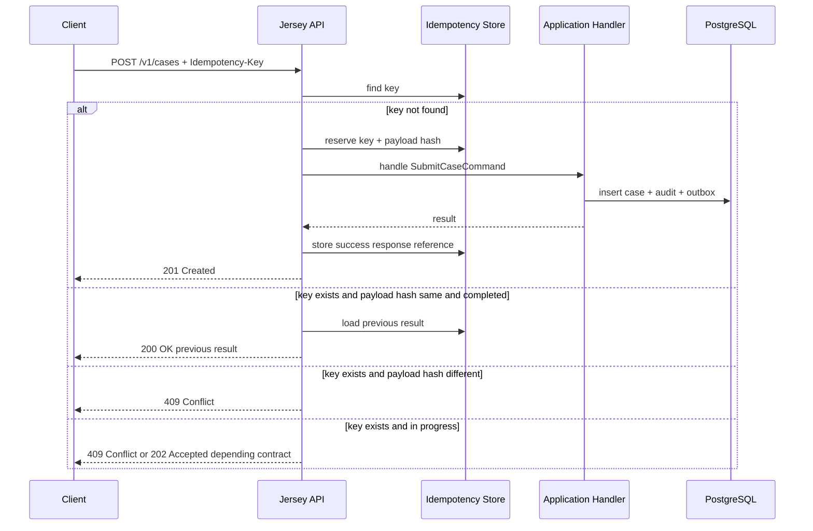
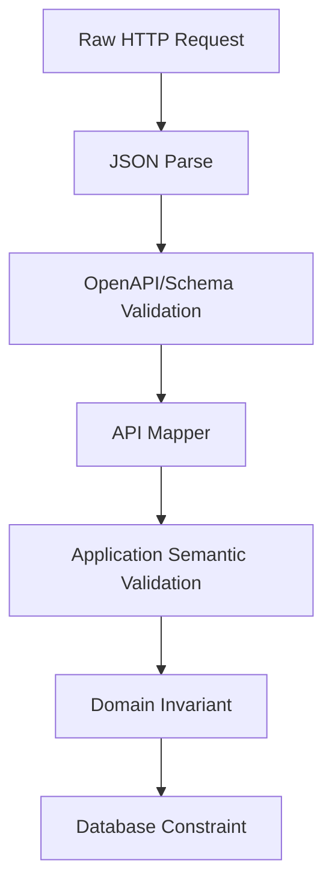
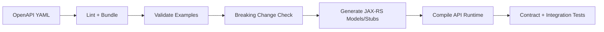

# Part 006 — HTTP API Contracts with OpenAPI

HTTP API adalah pintu masuk sistem. Di banyak project, API didesain setelah service code jadi. Endpoint muncul dari method controller. Response shape muncul dari object yang kebetulan mudah di-serialize. Error response berubah tergantung exception. Pagination berbeda antar endpoint. Idempotency dilupakan sampai user mengirim request dua kali.

Itu bukan contract-first.

Contract-first berarti: sebelum kita bicara resource class Jersey, mapper, handler, database insert, atau workflow start, kita mendefinisikan **janji eksternal** yang harus stabil.

Part ini membangun kontrak HTTP untuk studi kasus kita: **Regulatory Enforcement & Case Orchestration Platform**.

Kita fokus pada API utama:

- submit case;
- get case by id;
- search/list cases;
- accept/reject case;
- assign case;
- start investigation;
- record decision;
- close case;
- retrieve timeline/audit projection;
- operational-safe error model.

Kita tidak mengejar endpoint banyak. Kita mengejar API yang tahan perubahan.

---

## 1. Mental Model: HTTP API sebagai Boundary, Bukan Method Call

HTTP API bukan remote method call.

Remote method call berpikir seperti ini:

```text
call submitCase(request) and get Case object back
```

Production HTTP API harus berpikir seperti ini:

```text
A client submits an intent through a stable protocol boundary.
The server validates syntax, semantics, authorization, idempotency, and state transition.
The server returns an observable outcome with correlation metadata.
The client can retry safely when the network fails.
```

Perbedaan ini penting.

Method call mengasumsikan koneksi, caller, callee, dan memory semua reliable. HTTP API production mengasumsikan:

- request bisa timeout;
- client bisa retry;
- response bisa hilang;
- request bisa duplikat;
- user bisa mengirim payload lama;
- API gateway bisa menambah header;
- proxy bisa memutus connection;
- downstream DB/Kafka/Camunda bisa gagal setelah sebagian logic berjalan;
- consumer memakai versi kontrak berbeda.

Kontrak API harus memberi pegangan untuk kondisi tersebut.

---

## 2. OpenAPI Document Layout

Untuk seri ini, kontrak diletakkan di:

```text
case-contract-openapi/
└── src/main/openapi/
    ├── case-api.yaml
    ├── components/
    │   ├── schemas.yaml
    │   ├── parameters.yaml
    │   ├── responses.yaml
    │   ├── headers.yaml
    │   └── security.yaml
    └── examples/
        ├── submit-case-request.json
        ├── submit-case-response.json
        ├── problem-validation-error.json
        └── case-search-response.json
```

Untuk pembelajaran, kita akan menampilkan banyak snippet dalam satu file. Untuk repository nyata, file boleh dipecah asalkan build tool bisa bundle/resolve `$ref` dengan deterministik.

Skeleton OpenAPI:

```yaml
openapi: 3.1.0
info:
  title: Regulatory Enforcement Case API
  version: 1.0.0
  description: HTTP API for case intake, lifecycle actions, decisioning, and case timeline retrieval.
servers:
  - url: https://api.example.gov/enforcement
    description: Production
  - url: https://staging-api.example.gov/enforcement
    description: Staging

tags:
  - name: Cases
    description: Case intake and lifecycle operations.
  - name: CaseTimeline
    description: Case audit and timeline projection.

paths: {}
components:
  schemas: {}
  parameters: {}
  responses: {}
  headers: {}
  securitySchemes: {}
```

OpenAPI adalah deskripsi interface, bukan dokumentasi dekoratif. Ia harus cukup presisi untuk:

- menghasilkan model Java;
- menghasilkan contract tests;
- memvalidasi examples;
- menilai breaking changes;
- membantu consumer memahami retry dan error semantics.

---

## 3. Resource Model

Resource utama:

```text
Case
Case Assignment
Case Investigation
Case Decision
Case Timeline
```

Endpoint awal:

```text
POST   /v1/cases
GET    /v1/cases/{caseId}
GET    /v1/cases
POST   /v1/cases/{caseId}/acceptance
POST   /v1/cases/{caseId}/assignment
POST   /v1/cases/{caseId}/investigation:start
POST   /v1/cases/{caseId}/decision
POST   /v1/cases/{caseId}/closure
GET    /v1/cases/{caseId}/timeline
```

Perhatikan action endpoint seperti `investigation:start`. REST purist mungkin tidak suka. Tetapi di sistem workflow/regulatory, banyak operasi adalah command dengan invariant kuat, bukan CRUD property update.

Alternatif:

```text
POST /v1/cases/{caseId}/investigations
```

Itu juga valid. Pilihan tergantung model domain. Untuk seri ini, kita memakai gaya command-subresource agar intent jelas.

Rule:

- `GET` tidak mengubah state;
- `POST` untuk command yang membuat state transition;
- `PUT` hanya jika client mengganti resource secara idempotent penuh;
- `PATCH` hanya jika partial update semantics benar-benar didefinisikan;
- jangan memakai `POST /doSomething` global;
- jangan expose internal workflow task id sebagai API utama kecuali memang bagian public contract.

---

## 4. Identifier Strategy

Gunakan identifier yang stabil dan tidak membocorkan detail internal.

Kita bedakan:

| Identifier | Contoh | Fungsi |
|---|---|---|
| `caseId` | UUID | Public stable identifier untuk API. |
| `caseNumber` | `CASE-2026-000001` | Human-readable reference. |
| `externalReference` | `PORTAL-ABC-123` | Reference dari sistem pengirim. |
| `businessKey` | `caseId` atau `caseNumber` | Correlation key untuk workflow. |
| DB surrogate id | UUID/internal | Storage identity. |

Jangan menjadikan Camunda process instance id sebagai public case id. Process instance bisa berubah saat migration atau redesign workflow. Case id harus milik domain.

Schema:

```yaml
CaseId:
  type: string
  format: uuid
  description: Stable public identifier of an enforcement case.

CaseNumber:
  type: string
  pattern: '^CASE-[0-9]{4}-[0-9]{6}$'
  example: CASE-2026-000001

ExternalReference:
  type: string
  minLength: 1
  maxLength: 128
  description: Reference supplied by an upstream system or external intake channel.
```

---

## 5. Required Cross-Cutting Headers

Headers penting:

```yaml
components:
  parameters:
    CorrelationIdHeader:
      name: X-Correlation-Id
      in: header
      required: false
      schema:
        type: string
        minLength: 8
        maxLength: 128
      description: Client-supplied correlation id. If absent, the server generates one.

    IdempotencyKeyHeader:
      name: Idempotency-Key
      in: header
      required: true
      schema:
        type: string
        minLength: 16
        maxLength: 128
      description: Required for non-idempotent commands to safely handle retries.

  headers:
    XCorrelationId:
      description: Correlation id associated with this request.
      schema:
        type: string

    Location:
      description: URI of the created or affected resource.
      schema:
        type: string
```

Idempotency key wajib untuk command seperti submit case. Untuk operation lain, kita bisa menentukan per endpoint.

Rule praktis:

- command yang bisa di-retry oleh client harus punya idempotency key;
- idempotency key harus disimpan durable di server;
- hasil request pertama harus bisa dikembalikan untuk retry identik;
- request dengan key sama tapi payload berbeda harus ditolak;
- idempotency tidak boleh hanya cache memory.

---

## 6. Error Model

Jangan biarkan setiap endpoint mengarang error sendiri.

Gunakan satu model error yang stabil. Kita ambil inspirasi dari problem-details style, tetapi kita sesuaikan dengan kebutuhan audit dan correlation.

```yaml
Problem:
  type: object
  required:
    - type
    - title
    - status
    - detail
    - correlationId
    - errorCode
  properties:
    type:
      type: string
      format: uri-reference
      example: https://api.example.gov/problems/validation-error
    title:
      type: string
      example: Validation error
    status:
      type: integer
      minimum: 400
      maximum: 599
      example: 400
    detail:
      type: string
      example: Request body contains invalid fields.
    errorCode:
      type: string
      example: CASE_VALIDATION_FAILED
    correlationId:
      type: string
      example: corr-20260702-abc123
    invalidParams:
      type: array
      items:
        $ref: '#/components/schemas/InvalidParam'

InvalidParam:
  type: object
  required:
    - name
    - reason
  properties:
    name:
      type: string
      example: allegationType
    reason:
      type: string
      example: must be one of FRAUD, SAFETY, LICENSING, MARKET_ABUSE
```

Standard responses:

```yaml
components:
  responses:
    BadRequest:
      description: Request is syntactically invalid or failed structural validation.
      content:
        application/problem+json:
          schema:
            $ref: '#/components/schemas/Problem'

    Unauthorized:
      description: Authentication is missing or invalid.
      content:
        application/problem+json:
          schema:
            $ref: '#/components/schemas/Problem'

    Forbidden:
      description: Caller is authenticated but not allowed to perform this action.
      content:
        application/problem+json:
          schema:
            $ref: '#/components/schemas/Problem'

    NotFound:
      description: Resource does not exist or is not visible to the caller.
      content:
        application/problem+json:
          schema:
            $ref: '#/components/schemas/Problem'

    Conflict:
      description: Request conflicts with current resource state or idempotency state.
      content:
        application/problem+json:
          schema:
            $ref: '#/components/schemas/Problem'

    UnprocessableEntity:
      description: Request is structurally valid but violates business rules.
      content:
        application/problem+json:
          schema:
            $ref: '#/components/schemas/Problem'

    TooManyRequests:
      description: Caller exceeded rate or quota limit.
      content:
        application/problem+json:
          schema:
            $ref: '#/components/schemas/Problem'

    InternalServerError:
      description: Unexpected server error.
      content:
        application/problem+json:
          schema:
            $ref: '#/components/schemas/Problem'
```

Error taxonomy:

| HTTP status | Meaning | Example |
|---|---|---|
| 400 | malformed request / structural validation | invalid JSON, missing required field |
| 401 | not authenticated | missing token |
| 403 | not authorized | officer cannot access this region |
| 404 | not found / not visible | case id unknown |
| 409 | state conflict / duplicate / idempotency conflict | case already accepted |
| 422 | semantic validation failed | allegation type incompatible with intake channel |
| 429 | rate limit | too many submissions |
| 500 | unexpected bug | null pointer, unmapped failure |
| 503 | dependency unavailable | database down, service not ready |

Do not return `500` for known domain conflict. Do not return `200` with `{ success: false }` for failed command. HTTP status is part of the contract.

---

## 7. Submit Case API

Endpoint:

```yaml
paths:
  /v1/cases:
    post:
      tags:
        - Cases
      operationId: submitCase
      summary: Submit a new enforcement case
      description: Creates a new enforcement case from an intake channel. The operation is idempotent when the same Idempotency-Key and equivalent payload are submitted again.
      parameters:
        - $ref: '#/components/parameters/CorrelationIdHeader'
        - $ref: '#/components/parameters/IdempotencyKeyHeader'
      requestBody:
        required: true
        content:
          application/json:
            schema:
              $ref: '#/components/schemas/SubmitCaseRequest'
            examples:
              basic:
                value:
                  externalReference: PORTAL-2026-0001
                  intakeChannel: PUBLIC_PORTAL
                  complainant:
                    partyId: PRT-1001
                    displayName: Jane Citizen
                  allegation:
                    type: LICENSING
                    summary: Business may be operating without active license.
                  receivedAt: '2026-07-02T09:30:00Z'
      responses:
        '201':
          description: Case was created.
          headers:
            X-Correlation-Id:
              $ref: '#/components/headers/XCorrelationId'
            Location:
              $ref: '#/components/headers/Location'
          content:
            application/json:
              schema:
                $ref: '#/components/schemas/SubmitCaseResponse'
        '200':
          description: Idempotent replay of a previously successful equivalent request.
          headers:
            X-Correlation-Id:
              $ref: '#/components/headers/XCorrelationId'
          content:
            application/json:
              schema:
                $ref: '#/components/schemas/SubmitCaseResponse'
        '400':
          $ref: '#/components/responses/BadRequest'
        '409':
          $ref: '#/components/responses/Conflict'
        '422':
          $ref: '#/components/responses/UnprocessableEntity'
        '500':
          $ref: '#/components/responses/InternalServerError'
```

Kenapa retry idempotent bisa mengembalikan `200`, bukan `201`?

Karena request replay tidak membuat resource baru. Ia mengembalikan hasil yang sudah ada. Beberapa organisasi tetap mengembalikan `201` untuk replay agar client sederhana. Keduanya bisa diterima jika kontrak jelas. Untuk seri ini, kita pilih:

- first success: `201 Created`;
- replay equivalent: `200 OK`;
- same key different payload: `409 Conflict`.

---

## 8. Submit Request Schema

```yaml
SubmitCaseRequest:
  type: object
  additionalProperties: false
  required:
    - externalReference
    - intakeChannel
    - complainant
    - allegation
    - receivedAt
  properties:
    externalReference:
      $ref: '#/components/schemas/ExternalReference'
    intakeChannel:
      $ref: '#/components/schemas/IntakeChannel'
    complainant:
      $ref: '#/components/schemas/PartySummary'
    allegation:
      $ref: '#/components/schemas/AllegationInput'
    receivedAt:
      type: string
      format: date-time
      description: Time the case was received by the intake channel.

IntakeChannel:
  type: string
  enum:
    - PUBLIC_PORTAL
    - INTERNAL_REFERRAL
    - AGENCY_REFERRAL
    - MANUAL_ENTRY

PartySummary:
  type: object
  additionalProperties: false
  required:
    - partyId
    - displayName
  properties:
    partyId:
      type: string
      minLength: 1
      maxLength: 64
    displayName:
      type: string
      minLength: 1
      maxLength: 256

AllegationInput:
  type: object
  additionalProperties: false
  required:
    - type
    - summary
  properties:
    type:
      $ref: '#/components/schemas/AllegationType'
    summary:
      type: string
      minLength: 10
      maxLength: 4000

AllegationType:
  type: string
  enum:
    - FRAUD
    - SAFETY
    - LICENSING
    - MARKET_ABUSE
```

`additionalProperties: false` membuat kontrak ketat. Trade-off-nya: client tidak bisa mengirim field tambahan untuk forward compatibility. Untuk public API luas, beberapa organisasi memilih lebih longgar. Untuk regulated internal/external API, strictness sering lebih aman karena field tak dikenal bisa berarti salah mapping atau data leak.

Pilih dengan sadar.

---

## 9. Submit Response Schema

```yaml
SubmitCaseResponse:
  type: object
  additionalProperties: false
  required:
    - caseId
    - caseNumber
    - lifecycleStatus
    - submittedAt
  properties:
    caseId:
      $ref: '#/components/schemas/CaseId'
    caseNumber:
      $ref: '#/components/schemas/CaseNumber'
    lifecycleStatus:
      $ref: '#/components/schemas/CaseLifecycleStatus'
    submittedAt:
      type: string
      format: date-time

CaseLifecycleStatus:
  type: string
  enum:
    - SUBMITTED
    - ACCEPTED
    - REJECTED
    - IN_INVESTIGATION
    - PENDING_DECISION
    - DECIDED
    - CLOSED
```

Response tidak mengembalikan seluruh case detail. Untuk command response, cukup berikan outcome minimal yang stabil.

Buruk:

```json
{
  "case": {
    "id": "...",
    "status": "...",
    "internalWorkflowState": "Activity_123",
    "rowVersion": 9,
    "outboxId": "...",
    "camundaProcessInstanceId": "..."
  }
}
```

Ini membocorkan internal implementation. Jangan expose workflow token, row version, atau outbox id kecuali memang menjadi public contract.

---

## 10. Idempotency Flow



Untuk seri ini:

- `IN_PROGRESS` dengan key sama dikembalikan `409 Conflict` dengan error code `IDEMPOTENCY_KEY_IN_PROGRESS`;
- retry setelah success mengembalikan result sebelumnya;
- retry setelah failure tergantung apakah failure tersimpan sebagai terminal atau boleh ulang.

Idempotency store minimal:

```text
idempotency_key
- key
- request_method
- request_path
- request_hash
- status: IN_PROGRESS | SUCCEEDED | FAILED
- response_status
- response_body
- created_at
- updated_at
- expires_at
```

Jangan menyimpan idempotency hanya di NGINX atau memory. Server instance bisa restart. Request bisa diarahkan ke pod berbeda.

---

## 11. Get Case by ID

```yaml
/v1/cases/{caseId}:
  get:
    tags:
      - Cases
    operationId: getCase
    summary: Get case detail by id
    parameters:
      - $ref: '#/components/parameters/CorrelationIdHeader'
      - name: caseId
        in: path
        required: true
        schema:
          $ref: '#/components/schemas/CaseId'
    responses:
      '200':
        description: Case detail.
        content:
          application/json:
            schema:
              $ref: '#/components/schemas/CaseDetail'
      '404':
        $ref: '#/components/responses/NotFound'
      '500':
        $ref: '#/components/responses/InternalServerError'
```

Case detail schema:

```yaml
CaseDetail:
  type: object
  additionalProperties: false
  required:
    - caseId
    - caseNumber
    - lifecycleStatus
    - intakeChannel
    - allegation
    - createdAt
    - updatedAt
  properties:
    caseId:
      $ref: '#/components/schemas/CaseId'
    caseNumber:
      $ref: '#/components/schemas/CaseNumber'
    lifecycleStatus:
      $ref: '#/components/schemas/CaseLifecycleStatus'
    intakeChannel:
      $ref: '#/components/schemas/IntakeChannel'
    allegation:
      $ref: '#/components/schemas/AllegationSummary'
    assignment:
      $ref: '#/components/schemas/AssignmentSummary'
    createdAt:
      type: string
      format: date-time
    updatedAt:
      type: string
      format: date-time
```

Jangan expose semua data hanya karena tersedia di database. API detail harus mengikuti consumer need dan authorization boundary.

---

## 12. Search/List Cases

List endpoint production harus punya pagination dan sorting yang jelas.

```yaml
/v1/cases:
  get:
    tags:
      - Cases
    operationId: searchCases
    summary: Search cases
    parameters:
      - $ref: '#/components/parameters/CorrelationIdHeader'
      - name: lifecycleStatus
        in: query
        required: false
        schema:
          $ref: '#/components/schemas/CaseLifecycleStatus'
      - name: assignedOfficerId
        in: query
        required: false
        schema:
          type: string
      - name: pageSize
        in: query
        required: false
        schema:
          type: integer
          minimum: 1
          maximum: 200
          default: 50
      - name: pageToken
        in: query
        required: false
        schema:
          type: string
      - name: sort
        in: query
        required: false
        schema:
          type: string
          enum:
            - createdAt.desc
            - createdAt.asc
            - updatedAt.desc
            - slaDueAt.asc
    responses:
      '200':
        description: Page of cases.
        content:
          application/json:
            schema:
              $ref: '#/components/schemas/CaseSearchResponse'
```

Response:

```yaml
CaseSearchResponse:
  type: object
  additionalProperties: false
  required:
    - items
    - page
  properties:
    items:
      type: array
      items:
        $ref: '#/components/schemas/CaseSummary'
    page:
      $ref: '#/components/schemas/PageInfo'

PageInfo:
  type: object
  additionalProperties: false
  required:
    - pageSize
    - hasNextPage
  properties:
    pageSize:
      type: integer
    nextPageToken:
      type: string
    hasNextPage:
      type: boolean
```

Gunakan page token, bukan offset, untuk list yang bisa berubah cepat. Offset pagination mudah dipahami tetapi rawan duplikasi/skip saat data berubah. Kita akan bahas query shape dan index di part PostgreSQL.

---

## 13. State Transition Commands

### 13.1 Accept case

```yaml
/v1/cases/{caseId}/acceptance:
  post:
    tags:
      - Cases
    operationId: acceptCase
    summary: Accept a submitted case for assessment or investigation
    parameters:
      - $ref: '#/components/parameters/CorrelationIdHeader'
      - $ref: '#/components/parameters/IdempotencyKeyHeader'
      - name: caseId
        in: path
        required: true
        schema:
          $ref: '#/components/schemas/CaseId'
    requestBody:
      required: true
      content:
        application/json:
          schema:
            $ref: '#/components/schemas/AcceptCaseRequest'
    responses:
      '200':
        description: Case accepted or equivalent idempotent result returned.
        content:
          application/json:
            schema:
              $ref: '#/components/schemas/CaseTransitionResponse'
      '404':
        $ref: '#/components/responses/NotFound'
      '409':
        $ref: '#/components/responses/Conflict'
      '422':
        $ref: '#/components/responses/UnprocessableEntity'
```

Request:

```yaml
AcceptCaseRequest:
  type: object
  additionalProperties: false
  required:
    - acceptedBy
    - reason
  properties:
    acceptedBy:
      type: string
      minLength: 1
      maxLength: 128
    reason:
      type: string
      minLength: 5
      maxLength: 2000
```

Response:

```yaml
CaseTransitionResponse:
  type: object
  additionalProperties: false
  required:
    - caseId
    - lifecycleStatus
    - transitionedAt
  properties:
    caseId:
      $ref: '#/components/schemas/CaseId'
    lifecycleStatus:
      $ref: '#/components/schemas/CaseLifecycleStatus'
    transitionedAt:
      type: string
      format: date-time
```

### 13.2 Why not PATCH status?

Buruk:

```http
PATCH /v1/cases/{caseId}
{
  "status": "ACCEPTED"
}
```

Masalah:

- siapa yang menerima?
- alasan apa?
- apakah transition legal?
- audit event apa?
- apakah workflow harus bergerak?
- event apa yang dipublish?
- idempotency bagaimana?

Status bukan field UI. Status adalah hasil command. Gunakan command endpoint.

---

## 14. Assignment API

Assignment adalah domain/operational boundary yang sensitif.

```yaml
/v1/cases/{caseId}/assignment:
  post:
    tags:
      - Cases
    operationId: assignCase
    summary: Assign a case to an officer or team
    parameters:
      - $ref: '#/components/parameters/CorrelationIdHeader'
      - $ref: '#/components/parameters/IdempotencyKeyHeader'
      - name: caseId
        in: path
        required: true
        schema:
          $ref: '#/components/schemas/CaseId'
    requestBody:
      required: true
      content:
        application/json:
          schema:
            $ref: '#/components/schemas/AssignCaseRequest'
    responses:
      '200':
        description: Assignment updated.
        content:
          application/json:
            schema:
              $ref: '#/components/schemas/AssignmentResponse'
      '409':
        $ref: '#/components/responses/Conflict'
```

Schema:

```yaml
AssignCaseRequest:
  type: object
  additionalProperties: false
  required:
    - assignmentType
    - assigneeId
    - assignedBy
    - reason
  properties:
    assignmentType:
      type: string
      enum:
        - OFFICER
        - TEAM
    assigneeId:
      type: string
      minLength: 1
      maxLength: 128
    assignedBy:
      type: string
      minLength: 1
      maxLength: 128
    reason:
      type: string
      minLength: 5
      maxLength: 2000

AssignmentResponse:
  type: object
  additionalProperties: false
  required:
    - caseId
    - assignment
    - assignedAt
  properties:
    caseId:
      $ref: '#/components/schemas/CaseId'
    assignment:
      $ref: '#/components/schemas/AssignmentSummary'
    assignedAt:
      type: string
      format: date-time

AssignmentSummary:
  type: object
  additionalProperties: false
  required:
    - assignmentType
    - assigneeId
  properties:
    assignmentType:
      type: string
      enum:
        - OFFICER
        - TEAM
    assigneeId:
      type: string
```

Jangan jadikan assignment sebagai string bebas `assignedTo`. Assignment punya jenis, actor, reason, audit, dan authorization.

---

## 15. Timeline API

Regulatory system butuh explainability. Timeline bukan optional UI sugar. Ia bagian dari defensibility.

```yaml
/v1/cases/{caseId}/timeline:
  get:
    tags:
      - CaseTimeline
    operationId: getCaseTimeline
    summary: Get case timeline
    parameters:
      - $ref: '#/components/parameters/CorrelationIdHeader'
      - name: caseId
        in: path
        required: true
        schema:
          $ref: '#/components/schemas/CaseId'
      - name: pageSize
        in: query
        schema:
          type: integer
          minimum: 1
          maximum: 200
          default: 100
      - name: pageToken
        in: query
        schema:
          type: string
    responses:
      '200':
        description: Timeline page.
        content:
          application/json:
            schema:
              $ref: '#/components/schemas/CaseTimelineResponse'
```

Schema:

```yaml
CaseTimelineResponse:
  type: object
  additionalProperties: false
  required:
    - items
    - page
  properties:
    items:
      type: array
      items:
        $ref: '#/components/schemas/TimelineEntry'
    page:
      $ref: '#/components/schemas/PageInfo'

TimelineEntry:
  type: object
  additionalProperties: false
  required:
    - entryId
    - eventType
    - occurredAt
    - actor
    - summary
  properties:
    entryId:
      type: string
    eventType:
      type: string
      enum:
        - CASE_SUBMITTED
        - CASE_ACCEPTED
        - CASE_REJECTED
        - CASE_ASSIGNED
        - INVESTIGATION_STARTED
        - DECISION_RECORDED
        - CASE_CLOSED
        - SLA_BREACHED
        - WORKFLOW_INCIDENT_REPAIRED
    occurredAt:
      type: string
      format: date-time
    actor:
      $ref: '#/components/schemas/ActorSummary'
    summary:
      type: string
    metadata:
      type: object
      additionalProperties: true

ActorSummary:
  type: object
  additionalProperties: false
  required:
    - actorType
    - actorId
  properties:
    actorType:
      type: string
      enum:
        - USER
        - SYSTEM
        - SERVICE
    actorId:
      type: string
```

Timeline `metadata` sengaja fleksibel karena event timeline bisa punya detail berbeda. Tetapi fleksibel bukan berarti liar. Internal audit table tetap harus punya schema yang bisa dikendalikan. API projection boleh menyederhanakan.

---

## 16. Security Contract

OpenAPI security scheme bukan pengganti authorization implementation. Tetapi kontrak harus menyatakan cara caller diautentikasi.

```yaml
components:
  securitySchemes:
    bearerAuth:
      type: http
      scheme: bearer
      bearerFormat: JWT

security:
  - bearerAuth: []
```

Per endpoint, kita bisa menjelaskan authorization rule dalam description/vendor extension:

```yaml
/v1/cases/{caseId}/decision:
  post:
    operationId: recordDecision
    summary: Record enforcement decision
    description: Requires decision authority for the case jurisdiction and allegation type.
    security:
      - bearerAuth: []
```

Jangan menganggap token valid berarti semua resource boleh diakses. Object-level authorization harus dilakukan di application/policy layer.

---

## 17. Compatibility Rules

Kontrak API harus punya aturan perubahan.

### 17.1 Biasanya backward-compatible

- menambah optional response field;
- menambah optional request field jika server tidak mewajibkan;
- menambah enum? Hati-hati. Untuk response enum, ini bisa breaking untuk client yang exhaustive;
- menambah endpoint baru;
- memperluas max length jika storage mendukung;
- menambah error code baru untuk status yang sudah ada, jika client tidak exhaustive.

### 17.2 Biasanya breaking

- menghapus field;
- mengubah tipe field;
- membuat optional field menjadi required;
- mengubah semantic field;
- mengubah status code utama;
- mengubah path/operationId;
- mengubah enum dengan menghapus value;
- memperketat validation;
- mengganti pagination semantics;
- mengganti idempotency behavior;
- mengubah error model.

### 17.3 Hidden breaking change

Ini lebih berbahaya: kontrak shape sama, behavior berubah.

Contoh:

```text
POST /v1/cases/{caseId}/acceptance
```

Dulu bisa dipanggil oleh supervisor dan senior officer. Sekarang hanya supervisor. OpenAPI tidak berubah, tetapi consumer behavior rusak.

Solusi:

- changelog;
- contract test behavior;
- policy documentation;
- staged rollout;
- versioning jika dampak besar.

---

## 18. Versioning Strategy

Untuk seri ini:

```text
/v1/...
```

Path version dipilih karena mudah untuk gateway, logs, routing, dan client. Alternatif header version juga valid, tetapi operasionalnya lebih kompleks.

Rule:

- `v1` tidak berarti setiap perubahan kecil butuh `v2`;
- `v2` dibuat saat behavior/shape breaking untuk consumer penting;
- versi contract artifact tetap pakai semantic versioning internal;
- deprecation harus punya timeline;
- endpoint lama tidak dimatikan diam-diam.

Contoh info:

```yaml
info:
  title: Regulatory Enforcement Case API
  version: 1.3.0
```

Path tetap `/v1`, artifact version naik dari `1.2.0` ke `1.3.0` jika compatible feature ditambah.

---

## 19. OperationId Discipline

`operationId` bukan dekorasi. Ia sering dipakai generator untuk nama method.

Buruk:

```yaml
operationId: postCase
operationId: update
operationId: doAction
```

Lebih baik:

```yaml
operationId: submitCase
operationId: getCase
operationId: searchCases
operationId: acceptCase
operationId: assignCase
operationId: startCaseInvestigation
operationId: recordCaseDecision
operationId: closeCase
operationId: getCaseTimeline
```

OperationId harus stabil. Mengubahnya bisa memecahkan generated client/server stub walau path sama.

---

## 20. Request Validation Layers

Ada beberapa lapis validation.



Jangan berharap satu lapis menyelesaikan semua.

| Layer | Menangkap |
|---|---|
| JSON parse | malformed JSON |
| OpenAPI schema | missing required field, wrong type, max length |
| API mapper | normalization, conversion, enum mapping |
| Application validation | actor allowed, command context, idempotency |
| Domain invariant | illegal transition, invalid business rule |
| Database constraint | uniqueness, foreign key, defensive invariant |

Jika database constraint gagal, jangan langsung bocorkan SQL error. Map ke error contract yang benar.

---

## 21. Mapping to JAX-RS/Jersey

OpenAPI contract menghasilkan model/stub. Jersey resource harus menjadi adapter tipis.

```java
@Path("/v1/cases")
@Produces(MediaType.APPLICATION_JSON)
@Consumes(MediaType.APPLICATION_JSON)
public final class CaseResource {
    private final SubmitCaseHandler submitCaseHandler;
    private final CaseQueryHandler caseQueryHandler;
    private final CaseApiMapper mapper;

    @POST
    public Response submitCase(
        @HeaderParam("X-Correlation-Id") String correlationId,
        @HeaderParam("Idempotency-Key") String idempotencyKey,
        SubmitCaseRequest request
    ) {
        SubmitCaseCommand command = mapper.toSubmitCommand(
            correlationId,
            idempotencyKey,
            request
        );

        SubmitCaseResult result = submitCaseHandler.handle(command);

        return Response.status(Response.Status.CREATED)
            .header("X-Correlation-Id", result.correlationId())
            .header("Location", "/v1/cases/" + result.caseId())
            .entity(mapper.toSubmitResponse(result))
            .build();
    }
}
```

Resource tidak:

- membuka SQL session;
- memanggil Kafka producer;
- memanggil Camunda `RuntimeService` langsung;
- membangun audit row manual;
- membuat business transition sendiri.

Resource hanya adapter dari HTTP contract ke application command.

---

## 22. Exception Mapping

Jersey `ExceptionMapper` harus mengubah exception ke `Problem`.

```java
@Provider
public final class ApplicationExceptionMapper implements ExceptionMapper<ApplicationException> {
    @Override
    public Response toResponse(ApplicationException ex) {
        Problem problem = Problem.from(ex);
        return Response.status(ex.httpStatus())
            .type("application/problem+json")
            .entity(problem)
            .build();
    }
}
```

Mapping harus deterministic:

| Exception | HTTP |
|---|---:|
| `MalformedRequestException` | 400 |
| `AuthenticationRequiredException` | 401 |
| `ForbiddenCaseAccessException` | 403 |
| `CaseNotFoundException` | 404 |
| `CaseStateConflictException` | 409 |
| `BusinessRuleViolationException` | 422 |
| `DependencyUnavailableException` | 503 |
| unknown | 500 |

Jangan return stack trace. Jangan return SQL message. Jangan return Camunda internal exception detail. Log detail internal dengan correlation id.

---

## 23. API Examples as Tests

Example bukan hiasan dokumentasi. Example harus divalidasi.

`examples/submit-case-request.json`:

```json
{
  "externalReference": "PORTAL-2026-0001",
  "intakeChannel": "PUBLIC_PORTAL",
  "complainant": {
    "partyId": "PRT-1001",
    "displayName": "Jane Citizen"
  },
  "allegation": {
    "type": "LICENSING",
    "summary": "Business may be operating without active license."
  },
  "receivedAt": "2026-07-02T09:30:00Z"
}
```

CI harus memvalidasi example terhadap schema. Jika example invalid, dokumentasi berbohong.

---

## 24. Contract-to-Code Pipeline

Pipeline:



Failure di tahap awal lebih murah daripada failure saat runtime.

Minimal gate:

- YAML valid;
- `$ref` resolvable;
- operationId unique;
- schema examples valid;
- required error responses tersedia;
- no accidental breaking change;
- generated code compile;
- resource implementation matches operation.

---

## 25. Full Minimal OpenAPI Slice

Berikut slice minimal yang cukup untuk mulai implementasi `POST /v1/cases`.

```yaml
openapi: 3.1.0
info:
  title: Regulatory Enforcement Case API
  version: 1.0.0
paths:
  /v1/cases:
    post:
      tags:
        - Cases
      operationId: submitCase
      summary: Submit a new enforcement case
      parameters:
        - $ref: '#/components/parameters/CorrelationIdHeader'
        - $ref: '#/components/parameters/IdempotencyKeyHeader'
      requestBody:
        required: true
        content:
          application/json:
            schema:
              $ref: '#/components/schemas/SubmitCaseRequest'
      responses:
        '201':
          description: Case was created.
          headers:
            X-Correlation-Id:
              $ref: '#/components/headers/XCorrelationId'
            Location:
              $ref: '#/components/headers/Location'
          content:
            application/json:
              schema:
                $ref: '#/components/schemas/SubmitCaseResponse'
        '200':
          description: Idempotent replay of previous equivalent request.
          content:
            application/json:
              schema:
                $ref: '#/components/schemas/SubmitCaseResponse'
        '400':
          $ref: '#/components/responses/BadRequest'
        '409':
          $ref: '#/components/responses/Conflict'
        '422':
          $ref: '#/components/responses/UnprocessableEntity'
        '500':
          $ref: '#/components/responses/InternalServerError'
components:
  parameters:
    CorrelationIdHeader:
      name: X-Correlation-Id
      in: header
      required: false
      schema:
        type: string
        minLength: 8
        maxLength: 128
    IdempotencyKeyHeader:
      name: Idempotency-Key
      in: header
      required: true
      schema:
        type: string
        minLength: 16
        maxLength: 128
  headers:
    XCorrelationId:
      description: Correlation id associated with the request.
      schema:
        type: string
    Location:
      description: URI of the created resource.
      schema:
        type: string
  responses:
    BadRequest:
      description: Bad request.
      content:
        application/problem+json:
          schema:
            $ref: '#/components/schemas/Problem'
    Conflict:
      description: Conflict with current state or idempotency state.
      content:
        application/problem+json:
          schema:
            $ref: '#/components/schemas/Problem'
    UnprocessableEntity:
      description: Business validation failed.
      content:
        application/problem+json:
          schema:
            $ref: '#/components/schemas/Problem'
    InternalServerError:
      description: Unexpected server error.
      content:
        application/problem+json:
          schema:
            $ref: '#/components/schemas/Problem'
  schemas:
    SubmitCaseRequest:
      type: object
      additionalProperties: false
      required:
        - externalReference
        - intakeChannel
        - complainant
        - allegation
        - receivedAt
      properties:
        externalReference:
          type: string
          minLength: 1
          maxLength: 128
        intakeChannel:
          type: string
          enum:
            - PUBLIC_PORTAL
            - INTERNAL_REFERRAL
            - AGENCY_REFERRAL
            - MANUAL_ENTRY
        complainant:
          $ref: '#/components/schemas/PartySummary'
        allegation:
          $ref: '#/components/schemas/AllegationInput'
        receivedAt:
          type: string
          format: date-time
    PartySummary:
      type: object
      additionalProperties: false
      required:
        - partyId
        - displayName
      properties:
        partyId:
          type: string
          minLength: 1
          maxLength: 64
        displayName:
          type: string
          minLength: 1
          maxLength: 256
    AllegationInput:
      type: object
      additionalProperties: false
      required:
        - type
        - summary
      properties:
        type:
          type: string
          enum:
            - FRAUD
            - SAFETY
            - LICENSING
            - MARKET_ABUSE
        summary:
          type: string
          minLength: 10
          maxLength: 4000
    SubmitCaseResponse:
      type: object
      additionalProperties: false
      required:
        - caseId
        - caseNumber
        - lifecycleStatus
        - submittedAt
      properties:
        caseId:
          type: string
          format: uuid
        caseNumber:
          type: string
          pattern: '^CASE-[0-9]{4}-[0-9]{6}$'
        lifecycleStatus:
          type: string
          enum:
            - SUBMITTED
        submittedAt:
          type: string
          format: date-time
    Problem:
      type: object
      additionalProperties: false
      required:
        - type
        - title
        - status
        - detail
        - errorCode
        - correlationId
      properties:
        type:
          type: string
        title:
          type: string
        status:
          type: integer
        detail:
          type: string
        errorCode:
          type: string
        correlationId:
          type: string
        invalidParams:
          type: array
          items:
            type: object
            required:
              - name
              - reason
            properties:
              name:
                type: string
              reason:
                type: string
```

Ini belum seluruh API. Ini slice pertama yang bisa dibangun dan dites.

---

## 26. Production Checklist

### Contract shape

- [ ] `operationId` unik dan stabil.
- [ ] Semua command punya request/response schema eksplisit.
- [ ] Error response memakai model standar.
- [ ] Header correlation id didefinisikan.
- [ ] Idempotency key wajib untuk command non-idempotent.
- [ ] Path version jelas.
- [ ] Tidak ada internal id bocor.

### Validation

- [ ] Required field masuk schema.
- [ ] String punya `minLength`/`maxLength` jika relevan.
- [ ] Enum value dipilih hati-hati.
- [ ] `additionalProperties` diputuskan sadar.
- [ ] Example valid terhadap schema.
- [ ] Semantic validation tidak dipaksa semua ke schema.

### Compatibility

- [ ] Perubahan kontrak dicek breaking/non-breaking.
- [ ] Enum response tidak ditambah tanpa analisis client.
- [ ] Error code punya registry.
- [ ] Deprecation terdokumentasi.
- [ ] Versioning strategy jelas.

### Runtime alignment

- [ ] Jersey resource hanya adapter.
- [ ] API model dimapping ke application command.
- [ ] Exception mapper deterministic.
- [ ] SQL/Kafka/Camunda tidak dipanggil langsung dari resource.
- [ ] Correlation id masuk log, audit, outbox, dan response.

---

## 27. Anti-Patterns

### 27.1 API follows database table

Endpoint dibuat dari table:

```text
POST /case_table
PATCH /case_table/{id}
```

Database schema bukan API contract. Database shape bisa berubah untuk performa, migration, atau normalization. API harus mengikuti domain capability.

### 27.2 Generic update endpoint

```http
POST /v1/cases/{id}/update
```

Ini menyembunyikan intent. Dalam audit/regulatory system, intent adalah hal utama.

### 27.3 Error string as contract

```json
{
  "error": "Something went wrong"
}
```

Tidak cukup untuk client, operator, audit, atau support.

### 27.4 Optional everything

Semua field optional agar “flexible”. Akibatnya validation pindah ke runtime dan client tidak tahu apa yang wajib.

### 27.5 Expose engine state

```json
{
  "processInstanceId": "...",
  "activityId": "Activity_12"
}
```

Jangan expose Camunda internals sebagai API contract umum. Workflow engine adalah implementation detail kecuali Anda memang membangun workflow API publik.

### 27.6 Treat OpenAPI as generated documentation only

Jika OpenAPI digenerate setelah code, ia hanya dokumentasi dari implementation saat itu. Contract-first menuntut OpenAPI menjadi input design dan CI gate.

---

## 28. What You Should Internalize

Kontrak HTTP yang baik tidak hanya menjelaskan field JSON. Ia menjelaskan cara sistem berperilaku saat dunia nyata kacau:

- duplicate request;
- retry;
- timeout;
- invalid state;
- partial failure;
- authorization boundary;
- schema evolution;
- backward compatibility;
- debugging via correlation id;
- audit defensibility.

OpenAPI bukan tujuan akhir. OpenAPI adalah alat untuk membuat boundary eksplisit, bisa dites, bisa direview, dan bisa dipakai oleh manusia maupun tooling.

Part berikutnya akan masuk ke event contract dengan AsyncAPI dan Kafka: bagaimana mendesain event envelope, topic, key, schema evolution, ordering, replay, dan consumer compatibility tanpa jatuh ke ilusi “event = object yang di-serialize”.
