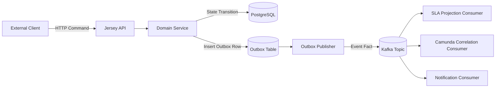
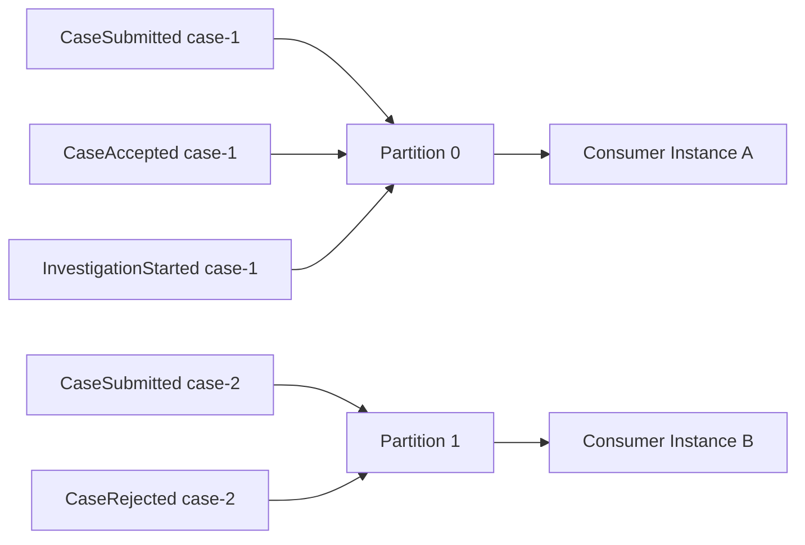
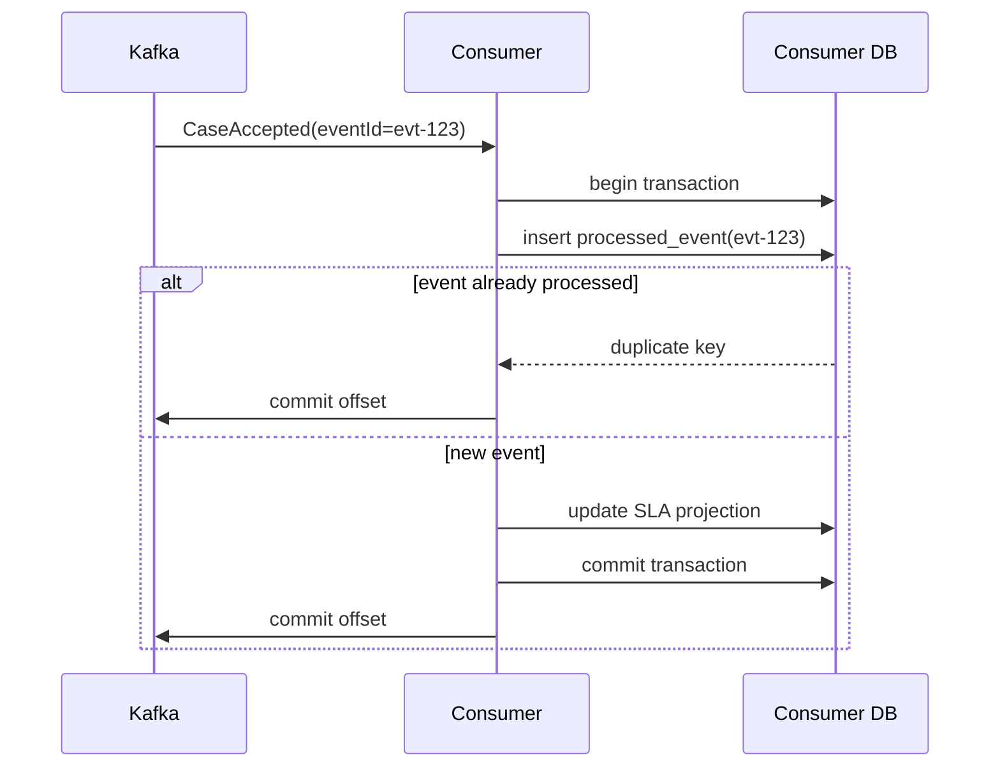
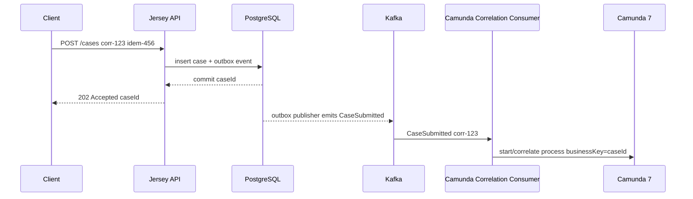
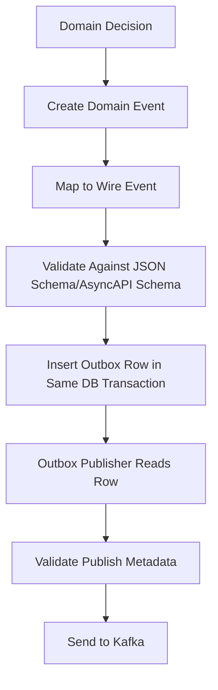

# Part 007 — Event Contracts with AsyncAPI and Kafka

HTTP contract menjawab pertanyaan: **bagaimana client meminta sesuatu ke sistem?**

Event contract menjawab pertanyaan yang lebih berbahaya: **apa yang sistem umumkan ke dunia luar, dalam urutan apa, dengan makna apa, dan apakah pengumuman itu aman diproses ulang?**

Di sistem kecil, event sering dibuat seperti log:

```json
{
  "caseId": "CASE-2026-000001",
  "status": "ACCEPTED"
}
```

Itu terlihat cukup sampai ada consumer yang membangun SLA projection, consumer lain mengirim notifikasi, consumer lain membuat report, dan consumer lama masih membaca payload versi sebelumnya.

Production event tidak boleh hanya menjadi "pesan yang kebetulan dikirim ke Kafka". Event adalah kontrak integrasi yang bisa memengaruhi banyak service, laporan regulator, automasi workflow, dan proses recovery.

Part ini membangun kontrak event untuk **Regulatory Enforcement & Case Orchestration Platform** menggunakan pendekatan **AsyncAPI + Kafka**.

Kita tidak akan mengulang basic Kafka seperti apa itu broker atau consumer. Fokus kita adalah desain production-grade:

- event taxonomy;
- topic ownership;
- message envelope;
- partition key;
- ordering boundary;
- idempotency;
- schema evolution;
- replay safety;
- consumer obligation;
- DLQ/retry contract;
- correlation dengan HTTP, database, dan Camunda 7.

---

## 1. Mental Model: Event adalah Fakta, Bukan Request Terselubung

Kesalahan paling umum dalam event-driven system adalah memakai event sebagai remote command yang disamarkan.

Contoh buruk:

```json
{
  "eventType": "PleaseStartInvestigation",
  "caseId": "CASE-2026-000001"
}
```

Nama event itu bukan fakta. Itu permintaan.

Event yang benar harus menyatakan sesuatu yang **sudah terjadi**:

```json
{
  "eventType": "CaseAccepted",
  "caseId": "CASE-2026-000001",
  "acceptedAt": "2026-07-02T09:15:22Z"
}
```

Bedanya besar.

Command berkata:

```text
Please do X.
```

Event berkata:

```text
X happened.
```

Dalam sistem produksi, perbedaan ini memengaruhi ownership:

| Bentuk | Makna | Owner keputusan | Consumer boleh menolak? | Aman untuk replay? |
|---|---|---|---|---|
| Command | permintaan melakukan aksi | receiver | ya | biasanya tidak tanpa idempotency kuat |
| Event | fakta yang sudah terjadi | publisher/domain owner | tidak mengubah fakta, hanya gagal memproses projection | ya, jika handler idempotent |
| Query | permintaan membaca state | receiver | ya | tidak relevan |

Di seri ini:

- HTTP endpoint menerima **command intent** dari client.
- Domain service memutuskan state transition.
- PostgreSQL menyimpan state dan outbox dalam satu transaksi.
- Kafka publisher membaca outbox dan menerbitkan **event fact**.
- Consumer membangun projection, memicu workflow correlation, mengirim notifikasi, atau menjalankan side effect.



Invariant penting:

> Event published tidak boleh menceritakan sesuatu yang belum committed di database.

Karena itu, event publishing tidak dilakukan langsung dari request handler sebelum transaksi database commit. Kita akan bahas outbox mendalam di Part 032. Di part ini, kita mendefinisikan kontraknya dulu.

---

## 2. Event Taxonomy untuk Case Platform

Tidak semua pesan di Kafka memiliki makna sama.

Kita butuh taxonomy agar nama topic, payload, lifecycle, retention, dan consumer expectation jelas.

Untuk studi kasus ini, kita pakai kategori berikut.

| Kategori | Contoh | Makna | Retention | Replay |
|---|---|---|---|---|
| Domain event | `CaseAccepted`, `CaseRejected` | fakta domain dari bounded context case | panjang | harus replayable |
| Process event | `InvestigationTaskCreated`, `SlaBreached` | fakta workflow/process | menengah-panjang | replayable untuk projection |
| Integration event | `CaseAcceptedIntegrationEvent` | fakta yang distabilkan untuk sistem eksternal | panjang | replayable |
| Notification event | `CaseOfficerAssignedNotificationRequested` | permintaan side effect notifikasi | pendek-menengah | idempotent tapi tidak selalu perlu full replay |
| Audit event | `CaseAuditEntryAppended` | immutable audit signal | sangat panjang | replayable, sensitif akses |
| Operational event | `OutboxPublisherLagged` | telemetry operasional | pendek | tidak untuk domain recovery |

Kita akan disiplin:

- **domain event** diterbitkan oleh service pemilik aggregate;
- **integration event** adalah kontrak eksternal yang lebih stabil dari internal domain event;
- **notification event** tidak boleh menjadi sumber kebenaran domain;
- **operational event** tidak boleh dipakai consumer bisnis;
- **audit event** memiliki aturan privasi lebih ketat.

### 2.1 Domain Event vs Integration Event

Domain event sering terlalu kaya atau terlalu dekat ke internal model.

Contoh domain event internal:

```json
{
  "eventType": "CaseRiskAssessmentCompleted",
  "caseId": "CASE-2026-000001",
  "assessmentVersion": 12,
  "riskScore": 87,
  "riskBand": "HIGH",
  "ruleResults": [
    { "ruleCode": "LATE_DISCLOSURE", "matched": true },
    { "ruleCode": "REPEAT_OFFENDER", "matched": true }
  ]
}
```

Consumer eksternal mungkin tidak boleh melihat `ruleResults`. Maka kita terbitkan integration event yang lebih aman:

```json
{
  "eventType": "CaseRiskClassified",
  "caseId": "CASE-2026-000001",
  "riskBand": "HIGH",
  "classifiedAt": "2026-07-02T09:15:22Z"
}
```

Jangan menganggap semua event internal otomatis boleh menjadi integration event.

Rule:

> Integration event adalah public API. Domain event adalah internal language. Jangan membocorkan internal language kecuali memang sengaja dijadikan public contract.

---

## 3. Topic Design: Topic adalah Boundary, Bukan Folder Pesan

Topic Kafka sering dinamai sembarangan:

```text
case-events
case-events-v2
case-events-new
case-events-final
case-events-final-2
```

Itu tanda tidak ada ownership dan lifecycle.

Topic production harus menjawab:

- siapa owner topic?
- apa jenis message di dalamnya?
- apakah ordering dibutuhkan?
- apa partition key?
- apakah compaction dipakai?
- berapa retention?
- siapa consumer yang diizinkan?
- apakah payload berisi data sensitif?
- apakah topic bisa direplay?
- apa compatibility policy?

Untuk seri ini, kita pakai konvensi:

```text
<domain>.<stream>.<classification>.v<major>
```

Contoh:

```text
enforcement.case.lifecycle.public.v1
enforcement.case.audit.restricted.v1
enforcement.case.sla.internal.v1
enforcement.case.notification.internal.v1
enforcement.case.outbox-operational.internal.v1
```

Makna field:

| Bagian | Contoh | Fungsi |
|---|---|---|
| domain | `enforcement` | domain besar organisasi |
| stream | `case.lifecycle` | stream/subdomain |
| classification | `public`, `internal`, `restricted` | akses dan sensitivitas |
| version | `v1` | major compatibility boundary |

### 3.1 Jangan Satu Topic untuk Semua Hal

Satu topic besar seperti `events` memberi ilusi sederhana. Masalahnya muncul saat:

- retention audit harus panjang, notification pendek;
- consumer tertentu hanya boleh baca event publik;
- partition key berbeda per jenis event;
- event volume SLA tinggi, event decision rendah;
- schema compatibility berbeda;
- replay satu subset menjadi mahal.

Lebih baik topic dipisah berdasarkan **stream semantics**, bukan berdasarkan nama service semata.

Contoh pemisahan:

```text
enforcement.case.lifecycle.public.v1
  - CaseSubmitted
  - CaseAccepted
  - CaseRejected
  - CaseClosed

enforcement.case.assignment.internal.v1
  - CaseAssigned
  - CaseUnassigned
  - CaseReassigned

enforcement.case.sla.internal.v1
  - SlaStarted
  - SlaPaused
  - SlaResumed
  - SlaBreached

enforcement.case.audit.restricted.v1
  - CaseAuditEntryAppended
```

### 3.2 Kapan Satu Topic Berisi Banyak Event Type?

Satu topic boleh berisi beberapa event type jika mereka berbagi:

- partition key sama;
- ordering boundary sama;
- retention sama;
- audience sama;
- security classification sama;
- lifecycle compatibility sama.

Untuk `case.lifecycle`, semua event memakai `caseId` sebagai partition key dan consumer biasanya perlu urutan lifecycle per case. Maka beberapa event type dalam satu topic masih masuk akal.

---

## 4. Partition Key: Ordering Boundary yang Sering Salah Dipilih

Kafka memberi ordering dalam satu partition, bukan seluruh topic.

Karena itu partition key bukan detail teknis kecil. Partition key menentukan:

- urutan apa yang dijamin;
- parallelism maksimum consumer;
- potensi hot partition;
- cara replay;
- cara correlation;
- dampak resharding.

Untuk lifecycle case, partition key natural adalah `caseId`.

```text
key = CASE-2026-000001
```

Artinya semua event lifecycle untuk case yang sama masuk ke partition yang sama sehingga consumer melihat urutan per case.



### 4.1 Partition Key Decision Table

| Stream | Candidate key | Dipilih | Alasan |
|---|---|---|---|
| case lifecycle | `caseId`, `tenantId`, `officerId` | `caseId` | perlu urutan per case |
| assignment | `caseId`, `assigneeId` | `caseId` | assignment adalah bagian lifecycle case |
| SLA | `caseId`, `slaId` | `caseId` atau `slaId` | tergantung satu case bisa punya banyak SLA paralel atau tidak |
| audit | `caseId`, `auditEntryId` | `caseId` | audit timeline perlu urut per case |
| notification | `recipientId`, `caseId` | tergantung delivery | kalau rate limit per recipient, pilih `recipientId` |
| reporting aggregate | `period`, `caseType` | jangan pakai lifecycle topic | buat projection sendiri |

### 4.2 Hot Partition Risk

`caseId` biasanya aman jika volume tersebar. Tetapi ada domain yang tidak aman:

- satu mega-case punya jutaan evidence event;
- satu tenant besar menghasilkan 80% traffic;
- satu officer menangani bulk reassignment;
- satu scheduled job menghasilkan burst untuk satu key.

Jangan pilih `tenantId` sebagai partition key jika satu tenant bisa mendominasi throughput.

Rule praktis:

> Pilih partition key berdasarkan ordering requirement terkecil yang benar, bukan berdasarkan field yang paling mudah.

Kalau ordering hanya perlu per case, jangan pakai tenant.

---

## 5. Event Envelope: Metadata Wajib Production

Payload event tidak boleh hanya body domain. Kita perlu envelope.

Envelope menyediakan metadata lintas event:

- `eventId` untuk deduplication;
- `eventType` untuk routing;
- `eventVersion` untuk compatibility;
- `occurredAt` untuk waktu domain terjadi;
- `publishedAt` untuk waktu event dikirim;
- `producer` untuk ownership;
- `correlationId` untuk trace lintas request/event/process;
- `causationId` untuk hubungan sebab-akibat;
- `tenantId` untuk multi-tenancy;
- `subject` untuk entity utama;
- `schemaRef` untuk schema governance;
- `dataClassification` untuk privacy/security.

Envelope dasar:

```json
{
  "eventId": "018f9f53-8a39-7c18-b0b9-9e0d60a1f2a1",
  "eventType": "CaseAccepted",
  "eventVersion": 1,
  "occurredAt": "2026-07-02T09:15:22.123Z",
  "publishedAt": "2026-07-02T09:15:23.010Z",
  "producer": "case-command-service",
  "tenantId": "regulator-id",
  "subject": "case/CASE-2026-000001",
  "correlationId": "corr-01J1V7W1AZ5Q5Q7F1F7WQGZ0PE",
  "causationId": "cmd-01J1V7W12M8HDQK8SZE9AMY0Z1",
  "partitionKey": "CASE-2026-000001",
  "schemaRef": "asyncapi://enforcement.case.lifecycle.public.v1/CaseAccepted/1",
  "dataClassification": "PUBLIC_TO_AUTHORIZED_SYSTEMS",
  "data": {
    "caseId": "CASE-2026-000001",
    "acceptedAt": "2026-07-02T09:15:22.123Z",
    "acceptedBy": "officer-123",
    "caseType": "MARKET_ABUSE",
    "riskBand": "HIGH"
  }
}
```

### 5.1 `occurredAt` vs `publishedAt`

Jangan samakan waktu domain dengan waktu publish.

| Field | Makna |
|---|---|
| `occurredAt` | waktu fakta domain terjadi/committed |
| `publishedAt` | waktu publisher berhasil mengirim ke Kafka |

Saat outbox tertunda karena Kafka outage, `occurredAt` bisa jauh lebih awal daripada `publishedAt`.

Consumer SLA harus memakai waktu yang benar.

Contoh:

```text
Case accepted at 09:00.
Kafka outage until 09:20.
Event published at 09:21.
SLA 4 hours should start from 09:00, not 09:21.
```

### 5.2 `eventId` Bukan `caseId`

`caseId` mengidentifikasi entity. `eventId` mengidentifikasi fakta unik.

Satu case bisa punya banyak event:

```text
caseId = CASE-2026-000001
  eventId = evt-1 CaseSubmitted
  eventId = evt-2 CaseAccepted
  eventId = evt-3 InvestigationStarted
```

Consumer idempotency harus berdasarkan `eventId`, bukan hanya `caseId`. Kalau consumer menyimpan `caseId` saja, event kedua untuk case yang sama bisa keliru dianggap duplikat.

---

## 6. Event Body Design: Minimal Tapi Cukup

Ada dua ekstrem yang sama-sama buruk.

Ekstrem pertama: event terlalu kecil.

```json
{
  "caseId": "CASE-2026-000001"
}
```

Consumer harus call API balik untuk tahu detail. Ini menciptakan synchronous dependency dan membuat replay sulit.

Ekstrem kedua: event terlalu besar.

```json
{
  "case": {
    "everything": "including mutable fields, comments, evidence, documents, pii, internal scores"
  }
}
```

Consumer menjadi tergantung ke semua detail internal, data sensitif menyebar, dan perubahan payload menjadi mahal.

Rule:

> Event harus membawa data yang diperlukan consumer untuk bereaksi terhadap fakta tersebut, tetapi tidak boleh menjadi dump database row.

### 6.1 `CaseAccepted` Body

```json
{
  "caseId": "CASE-2026-000001",
  "caseType": "MARKET_ABUSE",
  "riskBand": "HIGH",
  "acceptedAt": "2026-07-02T09:15:22.123Z",
  "acceptedBy": "officer-123",
  "acceptanceReasonCode": "VALID_JURISDICTION",
  "nextExpectedAction": "START_INVESTIGATION"
}
```

Kenapa field ini ada?

| Field | Alasan |
|---|---|
| `caseId` | entity identity |
| `caseType` | routing dan reporting |
| `riskBand` | SLA dan prioritization |
| `acceptedAt` | timeline dan SLA |
| `acceptedBy` | audit/projection |
| `acceptanceReasonCode` | explainability |
| `nextExpectedAction` | consumer orchestration helper, bukan command wajib |

`nextExpectedAction` perlu hati-hati. Ia bukan instruksi. Ia metadata domain yang menyatakan ekspektasi lifecycle. Consumer tetap harus punya aturan sendiri.

---

## 7. AsyncAPI Document Layout

AsyncAPI memberi cara machine-readable untuk mendokumentasikan API event-driven: server, channel, operation, message, schema, security, dan metadata.

Untuk repository seri ini:

```text
case-contract-asyncapi/
└── src/main/asyncapi/
    ├── case-events.yaml
    ├── components/
    │   ├── messages.yaml
    │   ├── schemas.yaml
    │   ├── security.yaml
    │   └── traits.yaml
    └── examples/
        ├── case-submitted.json
        ├── case-accepted.json
        └── sla-breached.json
```

Kita gunakan AsyncAPI 3.x style: channel mendeskripsikan address/transport binding, operation mendeskripsikan perilaku send/receive, message mendeskripsikan payload.

Skeleton:

```yaml
asyncapi: 3.0.0
info:
  title: Regulatory Enforcement Case Events
  version: 1.0.0
  description: Event contracts for case lifecycle, SLA, assignment, and audit streams.

servers:
  productionKafka:
    host: kafka.prod.internal:9092
    protocol: kafka
    description: Production Kafka cluster
  stagingKafka:
    host: kafka.staging.internal:9092
    protocol: kafka
    description: Staging Kafka cluster

channels:
  caseLifecycleEvents:
    address: enforcement.case.lifecycle.public.v1
    messages:
      CaseSubmitted:
        $ref: '#/components/messages/CaseSubmitted'
      CaseAccepted:
        $ref: '#/components/messages/CaseAccepted'
      CaseRejected:
        $ref: '#/components/messages/CaseRejected'

operations:
  publishCaseLifecycleEvents:
    action: send
    channel:
      $ref: '#/channels/caseLifecycleEvents'
    messages:
      - $ref: '#/channels/caseLifecycleEvents/messages/CaseSubmitted'
      - $ref: '#/channels/caseLifecycleEvents/messages/CaseAccepted'
      - $ref: '#/channels/caseLifecycleEvents/messages/CaseRejected'
```

---

## 8. AsyncAPI Message Contract

Kita definisikan envelope reusable.

```yaml
components:
  schemas:
    EventEnvelope:
      type: object
      required:
        - eventId
        - eventType
        - eventVersion
        - occurredAt
        - producer
        - tenantId
        - subject
        - correlationId
        - partitionKey
        - data
      properties:
        eventId:
          type: string
          format: uuid
        eventType:
          type: string
        eventVersion:
          type: integer
          minimum: 1
        occurredAt:
          type: string
          format: date-time
        publishedAt:
          type: string
          format: date-time
        producer:
          type: string
        tenantId:
          type: string
        subject:
          type: string
          examples:
            - case/CASE-2026-000001
        correlationId:
          type: string
        causationId:
          type: string
        partitionKey:
          type: string
        schemaRef:
          type: string
        dataClassification:
          type: string
          enum:
            - PUBLIC_TO_AUTHORIZED_SYSTEMS
            - INTERNAL
            - RESTRICTED
        data:
          type: object
```

Untuk message tertentu, kita bisa memakai `allOf` agar envelope tetap konsisten.

```yaml
components:
  messages:
    CaseAccepted:
      name: CaseAccepted
      title: Case Accepted
      summary: Published when a submitted case is accepted for enforcement processing.
      contentType: application/json
      payload:
        allOf:
          - $ref: '#/components/schemas/EventEnvelope'
          - type: object
            properties:
              eventType:
                const: CaseAccepted
              eventVersion:
                const: 1
              data:
                $ref: '#/components/schemas/CaseAcceptedData'
```

Payload data:

```yaml
components:
  schemas:
    CaseAcceptedData:
      type: object
      additionalProperties: false
      required:
        - caseId
        - caseType
        - riskBand
        - acceptedAt
        - acceptedBy
        - acceptanceReasonCode
      properties:
        caseId:
          type: string
          pattern: '^CASE-[0-9]{4}-[0-9]{6}$'
        caseType:
          type: string
          enum:
            - MARKET_ABUSE
            - DISCLOSURE_FAILURE
            - LICENSING_BREACH
            - CONDUCT_RISK
        riskBand:
          type: string
          enum:
            - LOW
            - MEDIUM
            - HIGH
            - CRITICAL
        acceptedAt:
          type: string
          format: date-time
        acceptedBy:
          type: string
        acceptanceReasonCode:
          type: string
        nextExpectedAction:
          type: string
          enum:
            - START_INVESTIGATION
            - WAIT_FOR_REVIEW
```

### 8.1 `additionalProperties: false` — Dipakai dengan Sadar

Untuk event contract, `additionalProperties: false` membuat schema ketat. Ini baik untuk producer discipline, tetapi bisa mengganggu forward compatibility jika consumer gagal saat melihat field baru.

Strategi yang lebih aman:

- schema producer boleh ketat;
- consumer harus toleran terhadap field tambahan;
- contract test memastikan field wajib tidak hilang;
- field baru optional dulu;
- field lama deprecated dulu, tidak langsung dihapus.

Kita akan memakai prinsip:

```text
Producer strict. Consumer tolerant.
```

---

## 9. Message Headers vs Payload Metadata

Kafka punya record headers. Jangan semua metadata dimasukkan hanya ke payload.

Field yang sering berguna di header:

- `eventId`;
- `eventType`;
- `eventVersion`;
- `correlationId`;
- `tenantId`;
- `schemaRef`;
- `dataClassification`.

Kenapa?

Consumer bisa melakukan routing ringan tanpa deserialize seluruh payload.

Namun metadata penting tetap disimpan di payload envelope juga agar:

- event tetap self-contained saat diekspor;
- replay dari object storage tetap lengkap;
- audit/debug tidak tergantung header preservation;
- DLQ payload tetap bisa dipahami.

Rule:

> Header boleh menduplikasi metadata envelope untuk operational routing, tetapi payload tetap sumber kebenaran kontrak event.

Contoh producer header:

```java
record.headers().add("eventType", "CaseAccepted".getBytes(StandardCharsets.UTF_8));
record.headers().add("eventId", eventId.toString().getBytes(StandardCharsets.UTF_8));
record.headers().add("correlationId", correlationId.getBytes(StandardCharsets.UTF_8));
record.headers().add("schemaRef", schemaRef.getBytes(StandardCharsets.UTF_8));
```

---

## 10. Event Versioning Strategy

Ada tiga level versioning:

1. topic major version;
2. event type version;
3. schema revision.

### 10.1 Topic Major Version

Topic major version berubah jika compatibility rusak secara besar.

```text
enforcement.case.lifecycle.public.v1
enforcement.case.lifecycle.public.v2
```

Jangan membuat topic baru untuk perubahan kecil optional field.

### 10.2 Event Type Version

`eventVersion` berubah ketika bentuk message untuk event type berubah.

```json
{
  "eventType": "CaseAccepted",
  "eventVersion": 1
}
```

Jika `CaseAccepted` versi 2 menambah optional field, consumer lama harus tetap bisa jalan.

Jika versi 2 mengubah makna field, itu breaking change.

### 10.3 Schema Revision

Schema revision adalah detail registry/governance. Misalnya:

```text
asyncapi://enforcement.case.lifecycle.public.v1/CaseAccepted/1.3.0
```

Kita tidak perlu topic baru untuk setiap schema revision.

### 10.4 Compatibility Rules

Perubahan yang biasanya aman:

- menambah optional field;
- menambah enum hanya jika consumer tolerant;
- memperluas string pattern secara compatible;
- menambah event type baru di topic yang sama jika consumer mengabaikan event yang tidak dikenal.

Perubahan yang berbahaya:

- menghapus field wajib;
- mengganti tipe field;
- mengganti makna field;
- mengganti partition key;
- mengganti semantic ordering;
- mengganti timezone meaning;
- mengganti unit angka;
- menambah enum saat consumer memakai exhaustive switch tanpa fallback.

Contoh Java bug:

```java
switch (riskBand) {
    case "LOW" -> handleLow();
    case "MEDIUM" -> handleMedium();
    case "HIGH" -> handleHigh();
    case "CRITICAL" -> handleCritical();
    default -> throw new IllegalArgumentException("Unknown risk band: " + riskBand);
}
```

Untuk consumer projection, unknown enum seharusnya tidak selalu fatal. Ia bisa masuk quarantine atau fallback:

```java
RiskBand parsed = RiskBand.fromWireValue(value)
    .orElse(RiskBand.UNKNOWN);
```

---

## 11. Event Naming: Nama adalah Kontrak Semantik

Nama event harus jelas dan lampau.

| Buruk | Lebih baik | Alasan |
|---|---|---|
| `CaseStatusChanged` | `CaseAccepted`, `CaseRejected`, `CaseClosed` | status changed terlalu generik |
| `ProcessCase` | `CaseSubmitted` atau command `SubmitCase` | command/event campur |
| `InvestigationUpdate` | `InvestigationStarted`, `InvestigationSuspended` | update tidak menjelaskan fakta |
| `UserTaskEvent` | `InvestigationTaskAssigned` | terlalu teknis Camunda |
| `CaseEventV2` | topic/event version terpisah | nama event jangan jadi tempat version chaos |

Rule:

> Event name harus membuat consumer bisa menebak invariants yang berubah tanpa membaca source code producer.

---

## 12. Event Granularity: Jangan Terlalu Halus, Jangan Terlalu Kasar

Jika event terlalu halus:

```text
CaseRiskScoreUpdated
CaseRiskBandUpdated
CasePriorityUpdated
CaseQueueUpdated
```

Consumer harus menggabungkan banyak event untuk tahu satu keputusan.

Jika event terlalu kasar:

```text
CaseUpdated
```

Consumer tidak tahu makna perubahan.

Gunakan event berdasarkan **business fact**.

Contoh:

```text
CaseRiskAssessmentCompleted
```

Event ini boleh membawa score, band, priority, dan reason code karena semuanya bagian dari satu assessment decision.

### 12.1 Decision Heuristic

Buat event baru jika:

- ada consumer yang bereaksi berbeda terhadap fakta itu;
- fakta itu punya waktu kejadian sendiri;
- fakta itu punya audit significance;
- fakta itu punya authorization/privacy berbeda;
- fakta itu bisa gagal/diulang secara terpisah;
- fakta itu mengubah lifecycle invariant.

Jangan buat event baru jika:

- hanya field teknis berubah;
- tidak ada consumer nyata;
- hanya untuk mempermudah satu query internal;
- event akan selalu dipakai bersama event lain secara atomik.

---

## 13. Consumer Contract: Consumer Juga Punya Kewajiban

Contract-first sering hanya fokus pada producer. Itu kurang.

Consumer juga wajib mematuhi kontrak:

- harus idempotent;
- harus toleran terhadap duplicate delivery;
- harus tidak mengandalkan global ordering;
- harus mengabaikan event type yang tidak relevan;
- harus menyimpan offset hanya setelah side effect aman;
- harus punya poison message strategy;
- harus punya replay mode;
- harus tidak call balik producer secara masif saat replay;
- harus menjaga correlation id;
- harus tidak mengubah fakta event.

### 13.1 Consumer Declaration

Untuk consumer penting, kita dokumentasikan consumer contract.

```yaml
x-consumers:
  - name: sla-projection-service
    purpose: Build SLA deadlines and breach projections for accepted cases.
    consumes:
      - CaseAccepted
      - InvestigationStarted
      - SlaPaused
      - SlaResumed
    idempotencyKey: eventId
    orderingAssumption: per caseId only
    replaySupported: true
    sideEffects:
      - writes PostgreSQL projection table
    failurePolicy:
      retry: exponential-backoff
      dlq: enforcement.case.lifecycle.public.v1.sla-projection.dlq
```

Ini extension field, bukan standar wajib. Tetapi secara governance, field seperti ini sangat berguna.

### 13.2 Consumer Offset and Side Effect

Consumer projection harus berpikir seperti ini:

```text
read event
validate envelope
check inbox/event_processed table
apply side effect in local transaction
record eventId as processed
commit transaction
commit Kafka offset
```

Jika offset commit sebelum side effect, event bisa hilang secara logis.

Jika side effect commit sebelum offset, event bisa dibaca lagi. Karena itu handler harus idempotent.



---

## 14. Replay Safety

Replay bukan fitur nice-to-have. Replay adalah alat recovery.

Replay dipakai saat:

- consumer projection corrupt;
- bug handler diperbaiki;
- service baru butuh bootstrap data;
- audit reconstruction;
- migration projection;
- laporan regulator perlu dihitung ulang.

Agar replay aman, event harus:

- immutable;
- self-contained untuk kebutuhan consumer;
- punya `eventId` stabil;
- punya `occurredAt` stabil;
- punya schema version;
- tidak tergantung API callback untuk data historis mutable;
- consumer side effect bisa dibedakan antara replay dan live mode jika diperlukan.

### 14.1 Live Mode vs Replay Mode

Consumer notifikasi tidak boleh mengirim email ulang saat replay.

Maka consumer side effect harus punya mode:

| Consumer | Live mode | Replay mode |
|---|---|---|
| SLA projection | update projection | rebuild projection |
| Search index | update index | rebuild index |
| Notification | send notification | skip or write dry-run log |
| Audit projection | append/check | reconstruct |
| Camunda correlation | correlate process | usually disabled unless controlled migration |

Replay tidak selalu berarti semua consumer aktif.

Rule:

> Consumer dengan external side effect harus replay-aware.

---

## 15. DLQ dan Poison Message Contract

DLQ bukan tempat sampah yang dilupakan. DLQ adalah kontrak operasional.

Poison message terjadi ketika event valid secara Kafka, tetapi consumer tidak bisa memprosesnya karena:

- schema tidak dikenal;
- field mandatory hilang;
- referential data tidak ada;
- bug handler;
- data semantik tidak valid;
- dependency downstream selalu gagal;
- side effect ditolak permanen.

DLQ message harus membawa:

- original topic;
- original partition;
- original offset;
- original key;
- original headers;
- original payload;
- consumer name;
- failure category;
- error message ringkas;
- failedAt;
- correlationId;
- retry count.

Contoh DLQ envelope:

```json
{
  "dlqId": "018f9f77-8a39-7c18-b0b9-9e0d60a1f999",
  "consumer": "sla-projection-service",
  "failedAt": "2026-07-02T09:20:00Z",
  "failureCategory": "SCHEMA_VALIDATION_FAILED",
  "errorCode": "UNKNOWN_RISK_BAND",
  "originalTopic": "enforcement.case.lifecycle.public.v1",
  "originalPartition": 3,
  "originalOffset": 881992,
  "originalKey": "CASE-2026-000001",
  "correlationId": "corr-01J1V7W1AZ5Q5Q7F1F7WQGZ0PE",
  "payload": {
    "eventId": "018f9f53-8a39-7c18-b0b9-9e0d60a1f2a1"
  }
}
```

### 15.1 Retry vs DLQ Decision

| Failure | Retry? | DLQ? | Contoh |
|---|---:|---:|---|
| network timeout | ya | setelah batas | DB temporarily unavailable |
| schema invalid | tidak banyak | ya | required field missing |
| unknown enum | tergantung policy | quarantine/DLQ | new enum not supported |
| duplicate event | tidak | tidak | already processed |
| downstream 429 | ya dengan backoff | setelah batas | notification provider rate limit |
| authorization config missing | tidak cepat | ya + alert | consumer lacks permission |

Rule:

> Retry untuk failure sementara. DLQ untuk failure yang butuh perubahan data, konfigurasi, atau kode.

---

## 16. Correlation: HTTP ke Kafka ke Camunda

Contract-first harus menjaga trace semantic lintas protokol.

Saat client submit case:

```text
POST /cases
X-Correlation-Id: corr-123
Idempotency-Key: idem-456
```

Sistem menyimpan:

- command id;
- idempotency key;
- correlation id;
- created case id;
- outbox event id;
- Camunda business key.

Event membawa correlation id yang sama:

```json
{
  "eventId": "evt-789",
  "eventType": "CaseSubmitted",
  "correlationId": "corr-123",
  "causationId": "cmd-submit-case-id",
  "subject": "case/CASE-2026-000001"
}
```

Camunda process menggunakan `businessKey = caseId` dan menyimpan `correlationId` sebagai process variable atau context metadata.



### 16.1 `correlationId` vs `causationId`

| Field | Pertanyaan yang dijawab |
|---|---|
| `correlationId` | operasi besar apa yang menghubungkan semua ini? |
| `causationId` | event/command apa yang langsung menyebabkan event ini? |

Contoh chain:

```text
HTTP SubmitCase command
  correlationId = corr-123
  commandId = cmd-1

CaseSubmitted event
  correlationId = corr-123
  causationId = cmd-1
  eventId = evt-1

CaseAccepted event
  correlationId = corr-123
  causationId = evt-1 or cmd-accept-2
  eventId = evt-2
```

Tanpa causation id, debugging chain panjang menjadi kabur.

---

## 17. Java Representation: Jangan Bocorkan Transport ke Domain

Event payload perlu class Java. Tetapi jangan jadikan generated DTO sebagai domain object.

Layering:

```text
case-contract-events-generated
  Generated DTO from AsyncAPI/JSON Schema

case-event-model
  Internal event envelope/value object

case-command-service
  Domain service creates event model
  Mapper converts to generated DTO for publishing
```

Contoh domain event internal:

```java
public record CaseAcceptedEvent(
        EventId eventId,
        CaseId caseId,
        CaseType caseType,
        RiskBand riskBand,
        Instant acceptedAt,
        OfficerId acceptedBy,
        ReasonCode acceptanceReasonCode,
        CorrelationId correlationId,
        CausationId causationId
) implements DomainEvent {

    @Override
    public String eventType() {
        return "CaseAccepted";
    }

    @Override
    public String partitionKey() {
        return caseId.value();
    }
}
```

Generated DTO mapping:

```java
public final class CaseAcceptedEventMapper {

    public CaseAcceptedMessage toWire(CaseAcceptedEvent event) {
        CaseAcceptedData data = new CaseAcceptedData()
                .caseId(event.caseId().value())
                .caseType(event.caseType().wireValue())
                .riskBand(event.riskBand().wireValue())
                .acceptedAt(event.acceptedAt())
                .acceptedBy(event.acceptedBy().value())
                .acceptanceReasonCode(event.acceptanceReasonCode().value());

        return new CaseAcceptedMessage()
                .eventId(event.eventId().value())
                .eventType("CaseAccepted")
                .eventVersion(1)
                .occurredAt(event.acceptedAt())
                .producer("case-command-service")
                .subject("case/" + event.caseId().value())
                .correlationId(event.correlationId().value())
                .causationId(event.causationId().value())
                .partitionKey(event.partitionKey())
                .data(data);
    }
}
```

Mapper terlihat membosankan. Justru bagus. Boundary eksplisit membuat perubahan contract tidak menyebar ke domain core.

---

## 18. Event Validation Pipeline

Producer harus validate event sebelum outbox insert atau sebelum publish?

Jawaban production-grade:

- validasi domain dilakukan sebelum state transition;
- validasi wire contract dilakukan sebelum outbox insert;
- validasi publish safety dilakukan sebelum Kafka send;
- consumer validasi envelope sebelum handler.

Pipeline:



Kenapa validasi sebelum outbox insert?

Karena outbox row adalah janji untuk publish. Jika payload invalid masuk outbox, publisher akan gagal berulang dan menciptakan operational noise.

Tetapi publisher tetap validate ringan, karena:

- data bisa berasal dari versi service lama;
- outbox bisa di-repair manual;
- bug migration bisa menghasilkan payload buruk;
- defense in depth.

---

## 19. Contract Testing untuk Event

Event contract testing harus menjawab:

- producer menghasilkan event valid;
- consumer bisa membaca sample event lama;
- consumer toleran field baru;
- breaking change terdeteksi sebelum release;
- partition key tidak berubah tanpa review;
- event examples tetap sinkron dengan schema.

### 19.1 Producer Contract Test

```java
@Test
void caseAcceptedEventMustMatchContract() {
    CaseAcceptedEvent event = fixture.caseAcceptedEvent();
    CaseAcceptedMessage message = mapper.toWire(event);

    JsonNode json = objectMapper.valueToTree(message);

    assertThat(schemaValidator.validate("CaseAccepted", json))
            .isEmpty();

    assertThat(message.getPartitionKey())
            .isEqualTo(message.getData().getCaseId());
}
```

### 19.2 Consumer Compatibility Test

Consumer harus diuji dengan fixture historis.

```text
src/test/resources/events/enforcement.case.lifecycle.public.v1/
├── CaseSubmitted.v1.valid.json
├── CaseAccepted.v1.valid.json
├── CaseAccepted.v1.with-extra-field.json
├── CaseRejected.v1.valid.json
└── CaseAccepted.v1.unknown-risk-band.json
```

Test:

```java
@Test
void consumerMustIgnoreUnknownOptionalFields() {
    EventEnvelope envelope = loadFixture("CaseAccepted.v1.with-extra-field.json");

    assertThatCode(() -> consumer.handle(envelope))
            .doesNotThrowAnyException();
}
```

### 19.3 Partition Key Regression Test

```java
@Test
void caseLifecyclePartitionKeyMustBeCaseId() {
    CaseAcceptedMessage message = fixture.caseAcceptedMessage();

    ProducerRecord<String, byte[]> record = producerRecordFactory.toRecord(message);

    assertThat(record.topic())
            .isEqualTo("enforcement.case.lifecycle.public.v1");
    assertThat(record.key())
            .isEqualTo(message.getData().getCaseId());
}
```

Partition key adalah contract. Jangan biarkan refactor mengubahnya diam-diam.

---

## 20. Security and Privacy in Event Contracts

Event menyebar lebih luas daripada database row. Begitu data masuk Kafka, banyak consumer bisa punya copy.

Karena itu event contract harus punya privacy stance.

### 20.1 Data Classification

| Classification | Boleh berisi | Consumer |
|---|---|---|
| `PUBLIC_TO_AUTHORIZED_SYSTEMS` | data bisnis non-rahasia untuk sistem terotorisasi | banyak internal/external partner |
| `INTERNAL` | data operasional internal | service internal |
| `RESTRICTED` | PII/sensitive/audit detail | consumer terbatas |
| `SECRET` | credential/key | tidak boleh di event |

Rule:

> Credential, token, secret, raw password, private key, dan session identifier tidak boleh masuk event payload.

### 20.2 PII Minimization

Buruk:

```json
{
  "caseId": "CASE-2026-000001",
  "subjectName": "Jane Doe",
  "subjectNationalId": "...",
  "subjectAddress": "...",
  "riskBand": "HIGH"
}
```

Lebih aman:

```json
{
  "caseId": "CASE-2026-000001",
  "subjectRef": "party/PARTY-123456",
  "riskBand": "HIGH"
}
```

Consumer yang memang butuh PII harus melewati API/DB boundary dengan authorization, bukan mendapatkannya dari public lifecycle topic.

---

## 21. Event Contract Review Checklist

Sebelum event baru diterima, jawab ini:

### Semantics

- Fakta apa yang sudah terjadi?
- Apa beda event ini dengan event yang sudah ada?
- Apakah nama event bentuk past tense?
- Apa invariant yang berubah?
- Apakah event ini domain, integration, process, notification, audit, atau operational event?

### Topic and Ordering

- Topic mana?
- Mengapa topic itu benar?
- Partition key apa?
- Ordering apa yang dijamin?
- Apakah ada risiko hot partition?

### Payload

- Field mana yang wajib?
- Field mana yang optional?
- Apakah payload self-contained untuk consumer utama?
- Apakah ada PII atau data sensitif?
- Apakah `occurredAt` jelas?
- Apakah timezone dan unit eksplisit?

### Compatibility

- Apa compatibility policy?
- Apakah consumer lama akan gagal?
- Apakah enum baru aman?
- Apakah field lama deprecated dulu?
- Apakah ada fixture historis?

### Operations

- Apakah event replayable?
- Apakah consumer idempotent?
- Apakah ada DLQ policy?
- Apakah observability metadata lengkap?
- Apakah runbook recovery tersedia?

---

## 22. Anti-Patterns

### 22.1 Event sebagai Database Row Dump

Jika event sama dengan row database, maka schema internal menjadi public contract. Perubahan tabel menjadi breaking change integrasi.

### 22.2 `statusChanged` Everywhere

`StatusChanged` memaksa consumer memahami transition matrix sendiri. Lebih baik publish business fact spesifik.

### 22.3 Partition Key Berdasarkan Tenant Tanpa Analisis

Tenant key sering terlihat natural, tetapi bisa menciptakan hot partition dan ordering yang terlalu luas.

### 22.4 Consumer Call Back ke API untuk Semua Detail

Ini mengubah async system menjadi sync distributed call graph saat load/replay.

### 22.5 Event Tanpa `eventId`

Tanpa event id, idempotency consumer menjadi tebakan.

### 22.6 DLQ Tanpa Ownership

DLQ tanpa owner dan replay tool hanyalah kuburan message.

### 22.7 Breaking Change dengan Nama Event Sama

Mengubah makna field tanpa major version adalah salah satu bentuk integrasi paling mahal.

---

## 23. Production Failure Model

| Failure | Dampak | Mitigasi desain |
|---|---|---|
| Kafka unavailable | event tidak publish | outbox menahan event sampai Kafka pulih |
| duplicate publish | consumer memproses dua kali | `eventId` + idempotent consumer |
| consumer crash after DB commit before offset commit | event dibaca ulang | inbox/processed_event table |
| bad payload in outbox | publisher stuck | pre-outbox validation + quarantine |
| schema incompatible | consumer gagal | compatibility test + DLQ + tolerant reader |
| hot partition | lag tinggi untuk key tertentu | partition key review + topic split jika perlu |
| replay triggers email again | user menerima notifikasi duplikat | replay mode + side effect guard |
| event includes PII accidentally | data leakage | contract review + classification + schema lint |
| event order misunderstood | projection salah | document ordering boundary per partition |

---

## 24. Minimal Contract Set untuk Seri Ini

Kita akan memakai event-event berikut sebagai baseline:

```text
enforcement.case.lifecycle.public.v1
  CaseSubmitted
  CaseAccepted
  CaseRejected
  InvestigationStarted
  CaseDecisionRecorded
  CaseClosed

enforcement.case.assignment.internal.v1
  CaseAssigned
  CaseReassigned
  CaseAssignmentReleased

enforcement.case.sla.internal.v1
  SlaStarted
  SlaPaused
  SlaResumed
  SlaBreached

enforcement.case.audit.restricted.v1
  CaseAuditEntryAppended

enforcement.case.notification.internal.v1
  NotificationRequested
  NotificationDelivered
  NotificationFailed
```

Kita tidak akan membuat ratusan event. Kita mulai dari event yang punya value arsitektural.

---

## 25. Contoh AsyncAPI Lebih Lengkap

```yaml
asyncapi: 3.0.0
info:
  title: Regulatory Enforcement Case Events
  version: 1.0.0
  description: Event contracts for regulatory case lifecycle.

defaultContentType: application/json

servers:
  productionKafka:
    host: kafka.prod.internal:9092
    protocol: kafka

channels:
  caseLifecycle:
    address: enforcement.case.lifecycle.public.v1
    messages:
      CaseAccepted:
        $ref: '#/components/messages/CaseAccepted'

operations:
  caseCommandServicePublishesLifecycle:
    action: send
    channel:
      $ref: '#/channels/caseLifecycle'
    messages:
      - $ref: '#/channels/caseLifecycle/messages/CaseAccepted'

components:
  messages:
    CaseAccepted:
      name: CaseAccepted
      title: Case Accepted
      contentType: application/json
      headers:
        type: object
        properties:
          eventType:
            type: string
            const: CaseAccepted
          correlationId:
            type: string
          schemaRef:
            type: string
      payload:
        $ref: '#/components/schemas/CaseAcceptedEnvelope'

  schemas:
    CaseAcceptedEnvelope:
      type: object
      additionalProperties: false
      required:
        - eventId
        - eventType
        - eventVersion
        - occurredAt
        - producer
        - tenantId
        - subject
        - correlationId
        - partitionKey
        - dataClassification
        - data
      properties:
        eventId:
          type: string
          format: uuid
        eventType:
          type: string
          const: CaseAccepted
        eventVersion:
          type: integer
          const: 1
        occurredAt:
          type: string
          format: date-time
        publishedAt:
          type: string
          format: date-time
        producer:
          type: string
          const: case-command-service
        tenantId:
          type: string
        subject:
          type: string
        correlationId:
          type: string
        causationId:
          type: string
        partitionKey:
          type: string
        schemaRef:
          type: string
        dataClassification:
          type: string
          const: PUBLIC_TO_AUTHORIZED_SYSTEMS
        data:
          $ref: '#/components/schemas/CaseAcceptedData'

    CaseAcceptedData:
      type: object
      additionalProperties: false
      required:
        - caseId
        - caseType
        - riskBand
        - acceptedAt
        - acceptedBy
        - acceptanceReasonCode
      properties:
        caseId:
          type: string
          pattern: '^CASE-[0-9]{4}-[0-9]{6}$'
        caseType:
          type: string
          enum:
            - MARKET_ABUSE
            - DISCLOSURE_FAILURE
            - LICENSING_BREACH
            - CONDUCT_RISK
        riskBand:
          type: string
          enum:
            - LOW
            - MEDIUM
            - HIGH
            - CRITICAL
        acceptedAt:
          type: string
          format: date-time
        acceptedBy:
          type: string
        acceptanceReasonCode:
          type: string
        nextExpectedAction:
          type: string
          enum:
            - START_INVESTIGATION
            - WAIT_FOR_REVIEW
```

---

## 26. How This Connects to Later Parts

Part ini adalah fondasi untuk beberapa bagian berikutnya:

- Part 008 memakai event contract untuk mendesain database table `outbox_event` dan audit schema.
- Part 026-030 memakai event untuk Camunda correlation dan process incident handling.
- Part 031-034 memperdalam Kafka topic, outbox, inbox, consumer idempotency, dan process integration.
- Part 038 memakai envelope metadata untuk observability.
- Part 039 memakai failure model untuk drill produksi.

Jangan lanjut ke implementasi Kafka producer sebelum kontrak ini stabil. Producer tanpa contract hanya mempercepat kekacauan.

---

## 27. Production Checklist

Sebelum event contract dianggap siap:

- [ ] event names memakai business fact, bukan command;
- [ ] topic name mengikuti convention;
- [ ] partition key tertulis jelas;
- [ ] ordering guarantee tertulis eksplisit;
- [ ] envelope punya `eventId`, `eventType`, `eventVersion`, `occurredAt`, `correlationId`, `causationId`, `partitionKey`;
- [ ] data classification jelas;
- [ ] PII diminimalkan;
- [ ] schema punya required/optional distinction;
- [ ] examples valid terhadap schema;
- [ ] producer contract test ada;
- [ ] consumer compatibility fixture ada;
- [ ] DLQ policy ada;
- [ ] replay behavior consumer tertulis;
- [ ] versioning policy tertulis;
- [ ] owner topic dan owner event jelas;
- [ ] breaking change procedure jelas.

---

## 28. Sumber Primer dan Rujukan

- AsyncAPI Specification: https://www.asyncapi.com/docs/reference/specification/latest
- AsyncAPI document structure: https://www.asyncapi.com/docs/concepts/asyncapi-document/structure
- AsyncAPI operations: https://www.asyncapi.com/docs/concepts/asyncapi-document/adding-operations
- Apache Kafka documentation: https://kafka.apache.org/documentation/
- Kafka design and concepts: https://kafka.apache.org/documentation/#intro_concepts_and_terms

---

## 29. Ringkasan

Event contract adalah public memory dari sistem. Sekali consumer bergantung pada event, event itu menjadi API.

Desain production-grade harus menjawab:

- event ini fakta apa?
- siapa owner-nya?
- topic mana?
- key apa?
- ordering apa?
- metadata apa?
- schema version apa?
- consumer boleh berasumsi apa?
- replay aman atau tidak?
- duplicate ditangani bagaimana?
- data sensitif bocor atau tidak?

Di part berikutnya, kita masuk ke sisi database: bagaimana PostgreSQL menjadi kontrak internal yang menjaga invariant, bukan sekadar storage pasif.
