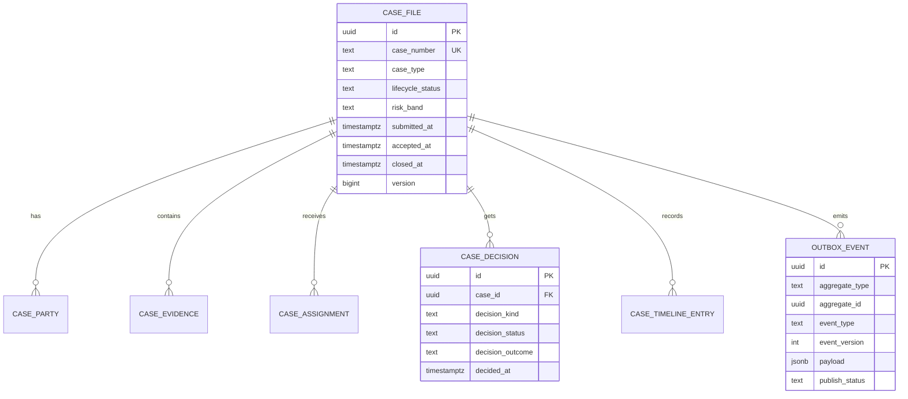
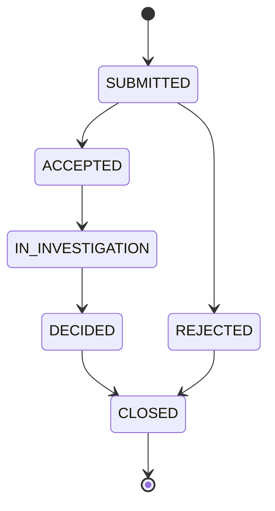
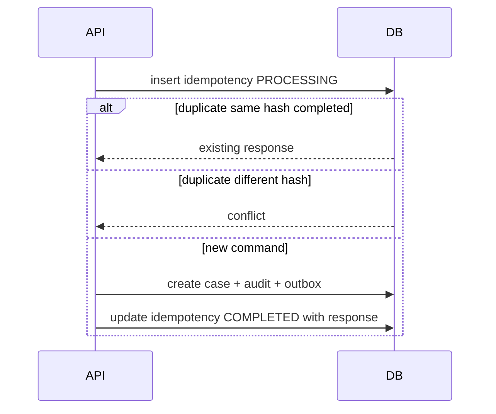

# Part 008 — Database Contracts: PostgreSQL First

Banyak engineer memperlakukan database sebagai detail implementasi:

```text
Java model dulu, table mengikuti.
```

Untuk sistem kecil, pendekatan itu terlihat cepat. Untuk sistem regulatory case management, itu rapuh.

Database bukan hanya tempat menyimpan object. Database adalah **contract boundary internal** yang menjaga fakta, invariant, auditability, concurrency, dan recovery.

Di part ini kita membangun mental model **PostgreSQL First**, bukan dalam arti semua logic harus masuk database, tetapi dalam arti desain data harus cukup kuat untuk bertahan saat:

- beberapa service menulis entity yang terkait;
- workflow engine retry;
- Kafka consumer replay;
- request HTTP duplicate;
- migration terjadi tanpa downtime;
- audit regulator memeriksa keputusan lama;
- operator perlu memperbaiki data dengan aman;
- aplikasi bug tapi database tetap menjaga invariant penting.

Kita belum masuk detail query tuning dan locking mendalam. Itu ada di Part 021 dan Part 024. Di sini fokus kita adalah **database sebagai kontrak**.

---

## 1. Mental Model: Database adalah Source of Durable Truth

Dalam arsitektur kita ada banyak state:

- HTTP request state;
- Java in-memory state;
- Camunda process state;
- Kafka event stream;
- cache/projection;
- database state;
- audit trail.

Di antara semua itu, PostgreSQL memegang peran khusus:

> PostgreSQL menyimpan fakta durable yang harus tetap benar walaupun API retry, worker crash, Kafka delay, atau Camunda job gagal.

Ini tidak berarti database menjadi pusat semua coupling. Tetapi invariant yang benar-benar penting tidak boleh hanya ada di Java if statement.

Contoh invariant regulatory case:

```text
A case cannot have two active final decisions.
```

Kalau invariant ini hanya di service code:

```java
if (!decisionRepository.hasActiveFinalDecision(caseId)) {
    decisionRepository.insertFinalDecision(...);
}
```

Dua request paralel masih bisa lolos race condition.

Database harus ikut menjaga:

```sql
CREATE UNIQUE INDEX uq_case_one_active_final_decision
ON enforcement.case_decision (case_id)
WHERE decision_status = 'ACTIVE' AND decision_kind = 'FINAL';
```

Sekarang, bahkan jika dua thread Java, dua pod Kubernetes, atau retry Camunda berjalan paralel, invariant tetap punya pagar terakhir.

---

## 2. Contract-First Database Design

Database contract adalah janji internal tentang:

- schema dan table ownership;
- identity format;
- relationship antar entity;
- constraints;
- enum/value domain;
- nullability;
- timestamp semantics;
- audit semantics;
- transaction boundary;
- migration compatibility;
- function/procedure signature;
- read/write access pattern.

Database contract bukan hanya DDL.

DDL menjelaskan bentuk. Contract menjelaskan makna.

Contoh DDL saja:

```sql
CREATE TABLE enforcement.case_file (
    id uuid PRIMARY KEY,
    status text NOT NULL
);
```

Contract yang benar harus menjawab:

- `id` dibuat oleh siapa?
- `status` value apa saja?
- status transition legal apa?
- apakah status boleh mundur?
- apakah `status` source of truth atau projection?
- apakah delete diperbolehkan?
- apakah row immutable setelah closed?
- apakah ada audit untuk perubahan status?
- apakah consumer Kafka boleh membuat row ini?

Tanpa jawaban itu, table terlihat sederhana tapi sistem rapuh.

---

## 3. Schema Ownership dan Namespace

Kita pakai PostgreSQL schema untuk memisahkan ownership logis.

```text
enforcement      -- core case domain tables
enforcement_audit -- immutable audit records
enforcement_event -- outbox/inbox/event processing tables
enforcement_ref  -- reference/configuration data
enforcement_ops  -- operational tables, locks, repair logs
```

Contoh:

```sql
CREATE SCHEMA IF NOT EXISTS enforcement;
CREATE SCHEMA IF NOT EXISTS enforcement_audit;
CREATE SCHEMA IF NOT EXISTS enforcement_event;
CREATE SCHEMA IF NOT EXISTS enforcement_ref;
CREATE SCHEMA IF NOT EXISTS enforcement_ops;
```

### 3.1 Kenapa Tidak Semua di `public`?

`public` membuat boundary kabur. Pada awal project, ini terasa tidak masalah. Setelah beberapa tahun:

- table audit bercampur dengan table domain;
- migration sulit dibaca;
- permission susah dibatasi;
- ownership antar module tidak jelas;
- tool introspection menghasilkan noise;
- operator tidak tahu table mana boleh di-repair.

Schema memberi boundary kasar yang murah.

### 3.2 Ownership Rule

| Schema | Owner aplikasi | Boleh ditulis oleh | Catatan |
|---|---|---|---|
| `enforcement` | case-command-service | command service + controlled worker | source of truth domain |
| `enforcement_audit` | audit module | append-only writer | tidak update/delete normal |
| `enforcement_event` | event infrastructure module | outbox publisher, consumers | integration reliability |
| `enforcement_ref` | reference data admin/migration | migration/admin service | slow-changing data |
| `enforcement_ops` | operations tooling | repair/admin jobs | harus sangat diaudit |

Rule:

> Schema bukan security boundary sempurna, tetapi schema adalah ownership boundary yang bisa diperkuat dengan permission dan migration discipline.

---

## 4. Core Entity Model untuk Case Platform

Kita mulai dengan aggregate utama: `case_file`.



Ini belum final physical design. Ini peta kontrak.

Core tables awal:

```text
enforcement.case_file
enforcement.case_party
enforcement.case_evidence
enforcement.case_assignment
enforcement.case_decision
enforcement.case_timeline_entry
enforcement_audit.audit_entry
enforcement_event.outbox_event
enforcement_event.inbox_event
enforcement_event.consumer_checkpoint
```

---

## 5. Identity Strategy

Identity bukan detail sepele. Identity memengaruhi API, logs, audit, partition key, trace, dan operator workflow.

Kita gunakan dua jenis identity untuk case:

| Field | Tipe | Fungsi |
|---|---|---|
| `id` | `uuid` | primary key internal stable |
| `case_number` | `text` | human/reference identifier |

Contoh:

```sql
CREATE TABLE enforcement.case_file (
    id uuid PRIMARY KEY,
    case_number text NOT NULL UNIQUE,
    case_type text NOT NULL,
    lifecycle_status text NOT NULL,
    risk_band text,
    submitted_at timestamptz NOT NULL,
    accepted_at timestamptz,
    closed_at timestamptz,
    version bigint NOT NULL DEFAULT 0,
    created_at timestamptz NOT NULL DEFAULT now(),
    updated_at timestamptz NOT NULL DEFAULT now()
);
```

### 5.1 UUID vs Case Number

`uuid` bagus untuk internal referential integrity. `case_number` bagus untuk manusia, regulator, support, dan dokumen.

Jangan jadikan human-readable number sebagai satu-satunya PK jika formatnya mungkin berubah.

Contoh nomor case:

```text
CASE-2026-000001
```

Format ini bisa berubah karena kebijakan. Primary key internal seharusnya tidak ikut berubah.

### 5.2 Kafka Partition Key

Untuk event lifecycle, kita bisa memakai `case_number` atau `id` sebagai partition key. Pilih satu dan konsisten.

Dalam seri ini:

```text
partitionKey = case_number
```

Alasan:

- lebih mudah ditelusuri operator;
- sama dengan subject external contract;
- tetap unik;
- tidak mengubah database PK.

Tapi database FK tetap memakai `uuid id`.

---

## 6. Timestamp Contract

Timestamp sering menjadi sumber bug diam-diam.

Kita pakai `timestamptz` untuk waktu kejadian absolut.

```sql
submitted_at timestamptz NOT NULL,
accepted_at timestamptz,
closed_at timestamptz,
created_at timestamptz NOT NULL DEFAULT now(),
updated_at timestamptz NOT NULL DEFAULT now()
```

### 6.1 Business Time vs System Time

| Field | Makna |
|---|---|
| `submitted_at` | waktu submission diterima secara bisnis |
| `accepted_at` | waktu acceptance berlaku |
| `created_at` | waktu row dibuat di database |
| `updated_at` | waktu row terakhir diubah |
| `outbox.created_at` | waktu event disiapkan untuk publish |
| `event.occurred_at` | waktu fakta domain terjadi |
| `event.published_at` | waktu Kafka publish sukses |

Jangan memakai satu timestamp untuk semua makna.

Contoh masalah:

```text
Case accepted at 09:00.
DB row updated at 09:01.
Outbox published at 09:20 after Kafka recovered.
SLA must start at 09:00.
```

### 6.2 Timezone Rule

Rule seri ini:

- semua timestamp storage memakai `timestamptz`;
- semua event memakai ISO-8601 UTC;
- local timezone hanya untuk presentation/reporting;
- deadline legal harus menyimpan timezone/context jika dihitung berdasarkan hari kerja lokal.

Contoh deadline yang butuh konteks:

```sql
CREATE TABLE enforcement.case_sla_deadline (
    id uuid PRIMARY KEY,
    case_id uuid NOT NULL REFERENCES enforcement.case_file(id),
    sla_code text NOT NULL,
    starts_at timestamptz NOT NULL,
    due_at timestamptz NOT NULL,
    calendar_code text NOT NULL,
    timezone_id text NOT NULL,
    status text NOT NULL,
    created_at timestamptz NOT NULL DEFAULT now()
);
```

`due_at` menyimpan instant final. `calendar_code` dan `timezone_id` menyimpan explainability.

---

## 7. Enum Strategy: PostgreSQL Enum vs Text + Check/Reference Table

PostgreSQL punya enum type. Tetapi untuk sistem yang sering berubah, enum perlu dipilih dengan hati-hati.

Pilihan:

### 7.1 Native PostgreSQL Enum

```sql
CREATE TYPE enforcement.case_lifecycle_status AS ENUM (
    'SUBMITTED',
    'ACCEPTED',
    'REJECTED',
    'IN_INVESTIGATION',
    'DECIDED',
    'CLOSED'
);
```

Kelebihan:

- type safety kuat;
- compact;
- value invalid tertolak.

Kekurangan:

- perubahan enum punya implikasi migration;
- rename/remove value tidak sederhana;
- bisa menyulitkan rollback;
- Java/MyBatis mapping perlu disiplin.

### 7.2 Text + Check Constraint

```sql
CREATE TABLE enforcement.case_file (
    id uuid PRIMARY KEY,
    lifecycle_status text NOT NULL,
    CONSTRAINT ck_case_lifecycle_status
        CHECK (lifecycle_status IN (
            'SUBMITTED',
            'ACCEPTED',
            'REJECTED',
            'IN_INVESTIGATION',
            'DECIDED',
            'CLOSED'
        ))
);
```

Kelebihan:

- mudah dibaca;
- migration relatif sederhana;
- rollback lebih mudah daripada enum native dalam beberapa skenario.

Kekurangan:

- check constraint harus diubah saat value baru;
- constraint panjang jika banyak value;
- reuse antar table kurang elegan.

### 7.3 Reference Table

```sql
CREATE TABLE enforcement_ref.case_lifecycle_status_ref (
    code text PRIMARY KEY,
    description text NOT NULL,
    is_active boolean NOT NULL DEFAULT true,
    sort_order integer NOT NULL
);
```

Kelebihan:

- bisa menambah metadata;
- cocok untuk reference data yang dikelola;
- bisa soft-deprecate value;
- baik untuk UI/configuration.

Kekurangan:

- foreign key tambahan;
- join tambahan;
- tidak semua value domain pantas jadi table.

### 7.4 Pilihan Seri Ini

Untuk lifecycle status yang sangat inti, kita gunakan **text + check constraint** di awal, lalu bisa dievolusi menjadi reference table jika value membutuhkan metadata.

Kenapa bukan PostgreSQL enum?

Karena seri ini fokus zero-downtime migration dan contract evolution. Native enum bisa dipakai, tetapi butuh prosedur migration yang lebih hati-hati. Untuk pembelajaran contract-first, text + check memberi visibility lebih mudah.

---

## 8. Nullability Contract

`NULL` bukan sekadar kosong. `NULL` berarti unknown/not applicable/not yet set tergantung konteks.

Buruk:

```sql
risk_band text NULL
```

Tanpa contract, `NULL` bisa berarti:

- belum dinilai;
- tidak perlu dinilai;
- gagal dinilai;
- data corrupt;
- legacy case;
- risk disabled.

Lebih jelas:

```sql
risk_assessment_status text NOT NULL DEFAULT 'NOT_ASSESSED',
risk_band text NULL,
CONSTRAINT ck_risk_band_required_when_assessed
CHECK (
    (risk_assessment_status <> 'ASSESSED' AND risk_band IS NULL)
    OR
    (risk_assessment_status = 'ASSESSED' AND risk_band IS NOT NULL)
)
```

Aturan:

> Nullable field harus punya semantic reason. Jika tidak bisa menjelaskan alasan `NULL`, jangan izinkan `NULL`.

---

## 9. Constraints sebagai Domain Invariant

Constraints adalah executable contract.

### 9.1 Primary Key dan Unique Constraint

```sql
ALTER TABLE enforcement.case_file
ADD CONSTRAINT uq_case_file_case_number UNIQUE (case_number);
```

### 9.2 Foreign Key

```sql
CREATE TABLE enforcement.case_party (
    id uuid PRIMARY KEY,
    case_id uuid NOT NULL REFERENCES enforcement.case_file(id),
    party_ref text NOT NULL,
    role_code text NOT NULL,
    created_at timestamptz NOT NULL DEFAULT now(),
    CONSTRAINT uq_case_party_role UNIQUE (case_id, party_ref, role_code)
);
```

Foreign key mencegah orphan party.

### 9.3 Check Constraint

```sql
ALTER TABLE enforcement.case_file
ADD CONSTRAINT ck_case_closed_at
CHECK (
    (lifecycle_status = 'CLOSED' AND closed_at IS NOT NULL)
    OR
    (lifecycle_status <> 'CLOSED')
);
```

### 9.4 Partial Unique Index

Satu final decision aktif per case:

```sql
CREATE UNIQUE INDEX uq_case_one_active_final_decision
ON enforcement.case_decision (case_id)
WHERE decision_kind = 'FINAL' AND decision_status = 'ACTIVE';
```

Ini tidak bisa diekspresikan dengan unique biasa jika hanya subset row yang harus unik.

### 9.5 Exclusion Constraint untuk Rentang Waktu

Jika assignment aktif tidak boleh overlap untuk role tertentu:

```sql
CREATE EXTENSION IF NOT EXISTS btree_gist;

CREATE TABLE enforcement.case_assignment (
    id uuid PRIMARY KEY,
    case_id uuid NOT NULL REFERENCES enforcement.case_file(id),
    assignee_id text NOT NULL,
    assignment_role text NOT NULL,
    active_period tstzrange NOT NULL,
    created_at timestamptz NOT NULL DEFAULT now(),
    EXCLUDE USING gist (
        case_id WITH =,
        assignment_role WITH =,
        active_period WITH &&
    )
);
```

Ini advanced, tapi sangat kuat untuk mencegah dua assignment aktif overlap.

---

## 10. State Transition Contract

Database tidak selalu ideal untuk seluruh state machine, tetapi ia bisa menjaga invariant kasar.

Lifecycle:



Kita bisa menyimpan transition history:

```sql
CREATE TABLE enforcement.case_lifecycle_transition (
    id uuid PRIMARY KEY,
    case_id uuid NOT NULL REFERENCES enforcement.case_file(id),
    from_status text,
    to_status text NOT NULL,
    transition_reason_code text NOT NULL,
    transitioned_by text NOT NULL,
    transitioned_at timestamptz NOT NULL,
    command_id text NOT NULL,
    correlation_id text NOT NULL,
    created_at timestamptz NOT NULL DEFAULT now(),
    CONSTRAINT uq_case_transition_command UNIQUE (case_id, command_id)
);
```

Kenapa perlu transition table jika `case_file.lifecycle_status` sudah ada?

Karena current state menjawab:

```text
status sekarang apa?
```

Transition history menjawab:

```text
bagaimana bisa sampai ke status itu?
```

Untuk regulatory system, pertanyaan kedua sering lebih penting.

---

## 11. Audit Contract

Audit bukan log aplikasi.

Log aplikasi untuk debugging. Audit untuk pembuktian.

Audit harus:

- append-only;
- punya actor;
- punya action;
- punya target;
- punya timestamp;
- punya correlation id;
- punya before/after atau delta jika sesuai;
- punya reason code;
- tidak mudah diubah;
- bisa direkonstruksi untuk regulator.

Contoh table:

```sql
CREATE TABLE enforcement_audit.audit_entry (
    id uuid PRIMARY KEY,
    aggregate_type text NOT NULL,
    aggregate_id uuid NOT NULL,
    aggregate_ref text NOT NULL,
    action_code text NOT NULL,
    actor_id text NOT NULL,
    actor_type text NOT NULL,
    reason_code text,
    correlation_id text NOT NULL,
    causation_id text,
    occurred_at timestamptz NOT NULL,
    recorded_at timestamptz NOT NULL DEFAULT now(),
    before_state jsonb,
    after_state jsonb,
    metadata jsonb NOT NULL DEFAULT '{}'::jsonb
);
```

### 11.1 Audit Append Function

Agar audit insert konsisten, kita bisa buat function:

```sql
CREATE OR REPLACE FUNCTION enforcement_audit.append_audit_entry(
    p_id uuid,
    p_aggregate_type text,
    p_aggregate_id uuid,
    p_aggregate_ref text,
    p_action_code text,
    p_actor_id text,
    p_actor_type text,
    p_reason_code text,
    p_correlation_id text,
    p_causation_id text,
    p_occurred_at timestamptz,
    p_before_state jsonb,
    p_after_state jsonb,
    p_metadata jsonb
) RETURNS void
LANGUAGE plpgsql
AS $$
BEGIN
    INSERT INTO enforcement_audit.audit_entry (
        id,
        aggregate_type,
        aggregate_id,
        aggregate_ref,
        action_code,
        actor_id,
        actor_type,
        reason_code,
        correlation_id,
        causation_id,
        occurred_at,
        before_state,
        after_state,
        metadata
    ) VALUES (
        p_id,
        p_aggregate_type,
        p_aggregate_id,
        p_aggregate_ref,
        p_action_code,
        p_actor_id,
        p_actor_type,
        p_reason_code,
        p_correlation_id,
        p_causation_id,
        p_occurred_at,
        p_before_state,
        p_after_state,
        COALESCE(p_metadata, '{}'::jsonb)
    );
END;
$$;
```

Function ini bukan business brain. Ia contract wrapper agar audit append konsisten.

---

## 12. Outbox Contract

Outbox adalah jembatan database transaction ke Kafka publish.

Table:

```sql
CREATE TABLE enforcement_event.outbox_event (
    id uuid PRIMARY KEY,
    aggregate_type text NOT NULL,
    aggregate_id uuid NOT NULL,
    aggregate_ref text NOT NULL,
    topic text NOT NULL,
    partition_key text NOT NULL,
    event_type text NOT NULL,
    event_version integer NOT NULL,
    payload jsonb NOT NULL,
    headers jsonb NOT NULL DEFAULT '{}'::jsonb,
    publish_status text NOT NULL DEFAULT 'PENDING',
    attempt_count integer NOT NULL DEFAULT 0,
    next_attempt_at timestamptz NOT NULL DEFAULT now(),
    published_at timestamptz,
    last_error_code text,
    last_error_message text,
    correlation_id text NOT NULL,
    causation_id text,
    occurred_at timestamptz NOT NULL,
    created_at timestamptz NOT NULL DEFAULT now(),
    updated_at timestamptz NOT NULL DEFAULT now(),
    CONSTRAINT ck_outbox_publish_status CHECK (
        publish_status IN ('PENDING', 'PUBLISHING', 'PUBLISHED', 'FAILED', 'QUARANTINED')
    ),
    CONSTRAINT ck_outbox_event_version_positive CHECK (event_version > 0)
);
```

### 12.1 Outbox Invariant

- outbox row dibuat dalam transaksi yang sama dengan domain state change;
- payload harus valid terhadap event contract;
- `partition_key` harus eksplisit;
- `topic` harus final saat row dibuat;
- publisher tidak boleh mengubah makna payload;
- `published_at` hanya diisi setelah Kafka send sukses;
- failed publish tidak rollback domain state.

### 12.2 Claiming Rows for Publisher

Publisher perlu mengambil batch tanpa dua instance memproses row sama.

Kita belum masuk locking detail, tapi bentuk query-nya nanti seperti:

```sql
SELECT id
FROM enforcement_event.outbox_event
WHERE publish_status = 'PENDING'
  AND next_attempt_at <= now()
ORDER BY created_at
FOR UPDATE SKIP LOCKED
LIMIT 100;
```

`SKIP LOCKED` akan dibahas mendalam di Part 024 dan Part 032.

---

## 13. Inbox Contract

Inbox dipakai consumer agar event processing idempotent.

```sql
CREATE TABLE enforcement_event.inbox_event (
    id uuid PRIMARY KEY,
    consumer_name text NOT NULL,
    event_id uuid NOT NULL,
    event_type text NOT NULL,
    source_topic text NOT NULL,
    source_partition integer NOT NULL,
    source_offset bigint NOT NULL,
    partition_key text NOT NULL,
    processing_status text NOT NULL,
    received_at timestamptz NOT NULL DEFAULT now(),
    processed_at timestamptz,
    last_error_code text,
    last_error_message text,
    correlation_id text,
    CONSTRAINT uq_inbox_consumer_event UNIQUE (consumer_name, event_id),
    CONSTRAINT uq_inbox_consumer_source_offset UNIQUE (consumer_name, source_topic, source_partition, source_offset),
    CONSTRAINT ck_inbox_processing_status CHECK (
        processing_status IN ('RECEIVED', 'PROCESSING', 'PROCESSED', 'FAILED', 'IGNORED')
    )
);
```

Kenapa punya dua unique constraint?

| Constraint | Fungsi |
|---|---|
| `(consumer_name, event_id)` | dedupe event semantic |
| `(consumer_name, topic, partition, offset)` | dedupe posisi Kafka |

Jika producer salah mengirim event sama ke offset berbeda, `event_id` menangkap duplicate semantic.

Jika event tidak punya event id valid, source offset masih memberi trace.

---

## 14. Idempotency Contract untuk HTTP Command

HTTP duplicate request harus ditangani di database.

```sql
CREATE TABLE enforcement.idempotency_record (
    id uuid PRIMARY KEY,
    idempotency_key text NOT NULL,
    request_hash text NOT NULL,
    command_type text NOT NULL,
    resource_type text NOT NULL,
    resource_id uuid,
    response_status integer,
    response_body jsonb,
    processing_status text NOT NULL,
    expires_at timestamptz NOT NULL,
    created_at timestamptz NOT NULL DEFAULT now(),
    updated_at timestamptz NOT NULL DEFAULT now(),
    CONSTRAINT uq_idempotency_key_command UNIQUE (idempotency_key, command_type),
    CONSTRAINT ck_idempotency_processing_status CHECK (
        processing_status IN ('PROCESSING', 'COMPLETED', 'FAILED')
    )
);
```

Invariant:

- same key + same command + same request hash boleh return cached result;
- same key + same command + different request hash harus ditolak;
- expired key tidak boleh merusak audit lama;
- record dibuat sebelum side effect utama atau dalam transaction boundary yang aman.

Pseudo-flow:



---

## 15. Function Contract: PL/pgSQL sebagai Boundary Tertentu

PL/pgSQL bukan tempat memindahkan seluruh application logic tanpa desain.

Gunakan function ketika:

- operasi harus atomik dekat data;
- invariant sulit dijaga di Java saja;
- audit/outbox harus konsisten;
- batch operation harus efisien;
- lock discipline perlu disentralisasi;
- banyak caller perlu contract yang sama.

Jangan gunakan function ketika:

- logic sering berubah dan tidak butuh data locality;
- rule lebih cocok di domain service;
- function hanya menyembunyikan query sederhana;
- testing dan deployment menjadi lebih buruk;
- ownership function tidak jelas.

### 15.1 Example: Accept Case Function

```sql
CREATE OR REPLACE FUNCTION enforcement.accept_case(
    p_case_id uuid,
    p_accepted_by text,
    p_reason_code text,
    p_command_id text,
    p_correlation_id text,
    p_occurred_at timestamptz
) RETURNS TABLE (
    case_id uuid,
    case_number text,
    new_status text,
    event_id uuid
)
LANGUAGE plpgsql
AS $$
DECLARE
    v_case enforcement.case_file%ROWTYPE;
    v_event_id uuid := gen_random_uuid();
BEGIN
    SELECT * INTO v_case
    FROM enforcement.case_file cf
    WHERE cf.id = p_case_id
    FOR UPDATE;

    IF NOT FOUND THEN
        RAISE EXCEPTION 'CASE_NOT_FOUND: %', p_case_id;
    END IF;

    IF v_case.lifecycle_status <> 'SUBMITTED' THEN
        RAISE EXCEPTION 'INVALID_CASE_STATE: expected SUBMITTED but was %', v_case.lifecycle_status;
    END IF;

    UPDATE enforcement.case_file
    SET lifecycle_status = 'ACCEPTED',
        accepted_at = p_occurred_at,
        version = version + 1,
        updated_at = now()
    WHERE id = p_case_id;

    INSERT INTO enforcement.case_lifecycle_transition (
        id,
        case_id,
        from_status,
        to_status,
        transition_reason_code,
        transitioned_by,
        transitioned_at,
        command_id,
        correlation_id
    ) VALUES (
        gen_random_uuid(),
        p_case_id,
        v_case.lifecycle_status,
        'ACCEPTED',
        p_reason_code,
        p_accepted_by,
        p_occurred_at,
        p_command_id,
        p_correlation_id
    );

    INSERT INTO enforcement_event.outbox_event (
        id,
        aggregate_type,
        aggregate_id,
        aggregate_ref,
        topic,
        partition_key,
        event_type,
        event_version,
        payload,
        correlation_id,
        causation_id,
        occurred_at
    ) VALUES (
        v_event_id,
        'CASE',
        p_case_id,
        v_case.case_number,
        'enforcement.case.lifecycle.public.v1',
        v_case.case_number,
        'CaseAccepted',
        1,
        jsonb_build_object(
            'eventId', v_event_id,
            'eventType', 'CaseAccepted',
            'eventVersion', 1,
            'occurredAt', p_occurred_at,
            'producer', 'case-command-service',
            'subject', 'case/' || v_case.case_number,
            'correlationId', p_correlation_id,
            'causationId', p_command_id,
            'partitionKey', v_case.case_number,
            'dataClassification', 'PUBLIC_TO_AUTHORIZED_SYSTEMS',
            'data', jsonb_build_object(
                'caseId', v_case.case_number,
                'caseType', v_case.case_type,
                'riskBand', v_case.risk_band,
                'acceptedAt', p_occurred_at,
                'acceptedBy', p_accepted_by,
                'acceptanceReasonCode', p_reason_code,
                'nextExpectedAction', 'START_INVESTIGATION'
            )
        ),
        p_correlation_id,
        p_command_id,
        p_occurred_at
    );

    RETURN QUERY
    SELECT p_case_id, v_case.case_number, 'ACCEPTED'::text, v_event_id;
END;
$$;
```

Apakah semua sistem harus memakai function sebesar ini? Tidak.

Tujuan contoh ini adalah memperlihatkan contract atomik:

```text
state transition + transition history + outbox event berada dalam satu database transaction.
```

Di beberapa arsitektur, logic ini bisa tetap di Java dengan SQL eksplisit. Yang tidak boleh hilang adalah invariant atomiknya.

---

## 16. MyBatis Implication: SQL adalah First-Class Artifact

Karena seri ini memakai MyBatis, SQL tidak disembunyikan di ORM magic.

Mapper untuk function:

```xml
<select id="acceptCase" statementType="CALLABLE" resultMap="AcceptCaseResultMap">
  SELECT * FROM enforcement.accept_case(
    #{caseId,jdbcType=OTHER},
    #{acceptedBy,jdbcType=VARCHAR},
    #{reasonCode,jdbcType=VARCHAR},
    #{commandId,jdbcType=VARCHAR},
    #{correlationId,jdbcType=VARCHAR},
    #{occurredAt,jdbcType=TIMESTAMP_WITH_TIMEZONE}
  )
</select>
```

Kontrak MyBatis harus selaras dengan function signature.

Jika function parameter berubah, mapper test harus gagal.

Jangan biarkan mapper XML menjadi string liar tanpa contract test.

---

## 17. Migration Compatibility

Database contract harus bisa berubah tanpa menghentikan sistem.

Rule dasar: **expand, migrate, contract**.

### 17.1 Buruk: Rename Column Langsung

```sql
ALTER TABLE enforcement.case_file RENAME COLUMN lifecycle_status TO status;
```

Aplikasi lama langsung gagal.

### 17.2 Lebih Aman

Step 1: expand

```sql
ALTER TABLE enforcement.case_file
ADD COLUMN status text;
```

Step 2: backfill

```sql
UPDATE enforcement.case_file
SET status = lifecycle_status
WHERE status IS NULL;
```

Step 3: dual read/write di aplikasi untuk periode transisi.

Step 4: contract setelah semua versi lama hilang.

```sql
ALTER TABLE enforcement.case_file
DROP COLUMN lifecycle_status;
```

Rename langsung hampir selalu buruk untuk zero-downtime.

### 17.3 Constraint Migration Safety

Menambah constraint pada table besar bisa blocking jika tidak hati-hati. Strateginya:

```sql
ALTER TABLE enforcement.case_file
ADD CONSTRAINT ck_case_lifecycle_status_new
CHECK (lifecycle_status IN ('SUBMITTED', 'ACCEPTED', 'REJECTED', 'IN_INVESTIGATION', 'DECIDED', 'CLOSED'))
NOT VALID;
```

Lalu validasi terpisah:

```sql
ALTER TABLE enforcement.case_file
VALIDATE CONSTRAINT ck_case_lifecycle_status_new;
```

Ini mengurangi risiko lock berat pada operasi tertentu.

---

## 18. Read Model vs Write Model

Jangan paksa satu table melayani semua query.

Write model menjaga invariant. Read model melayani query.

Contoh write model:

```text
case_file
case_party
case_decision
case_assignment
case_lifecycle_transition
audit_entry
```

Query UI ingin list:

```text
case number, status, assignee, risk band, due date, last action, open task count
```

Kalau setiap list page join 8 table dengan filter kompleks, sistem cepat rapuh.

Buat projection:

```sql
CREATE TABLE enforcement.case_worklist_projection (
    case_id uuid PRIMARY KEY,
    case_number text NOT NULL,
    lifecycle_status text NOT NULL,
    case_type text NOT NULL,
    risk_band text,
    current_assignee_id text,
    current_queue text,
    nearest_due_at timestamptz,
    last_action_at timestamptz NOT NULL,
    open_task_count integer NOT NULL DEFAULT 0,
    projection_version bigint NOT NULL DEFAULT 0,
    updated_at timestamptz NOT NULL DEFAULT now()
);
```

Projection boleh rebuilt dari event/transition jika corrupt.

Rule:

> Jangan campur invariant write model dan convenience read model tanpa sadar.

---

## 19. Deletion Contract: Regulatory Systems Jarang Benar-Benar Delete

Untuk regulatory case, delete fisik sering tidak boleh sembarangan.

Pilihan:

| Strategy | Cocok untuk | Risiko |
|---|---|---|
| hard delete | temporary staging data | kehilangan audit |
| soft delete | user-visible removal | query harus filter konsisten |
| tombstone event | event-driven deletion signal | consumer harus patuh |
| legal retention purge | data retention policy | harus sangat terkontrol |

Untuk core case:

```sql
ALTER TABLE enforcement.case_file
ADD COLUMN retention_status text NOT NULL DEFAULT 'ACTIVE',
ADD COLUMN retained_until timestamptz,
ADD COLUMN deleted_at timestamptz,
ADD CONSTRAINT ck_case_retention_status CHECK (
    retention_status IN ('ACTIVE', 'UNDER_HOLD', 'ELIGIBLE_FOR_PURGE', 'PURGED')
);
```

Jangan memakai `deleted boolean` tanpa retention semantics.

---

## 20. Permission and Access Contract

Minimal role model PostgreSQL:

```text
case_app_rw        -- app read/write for enforcement schema
case_app_ro        -- read-only app/reporting limited
case_migration     -- migration role
case_audit_append  -- append audit only
case_ops_repair    -- controlled repair role
```

Contoh:

```sql
REVOKE ALL ON SCHEMA enforcement FROM PUBLIC;
GRANT USAGE ON SCHEMA enforcement TO case_app_rw;
GRANT SELECT, INSERT, UPDATE ON ALL TABLES IN SCHEMA enforcement TO case_app_rw;

REVOKE DELETE ON ALL TABLES IN SCHEMA enforcement FROM case_app_rw;
```

Untuk audit:

```sql
GRANT INSERT ON enforcement_audit.audit_entry TO case_audit_append;
GRANT SELECT ON enforcement_audit.audit_entry TO case_app_ro;
REVOKE UPDATE, DELETE ON enforcement_audit.audit_entry FROM case_audit_append;
```

Permission bukan pengganti aplikasi authorization, tetapi pagar tambahan.

---

## 21. Data Repair Contract

Production system pasti butuh repair.

Repair tanpa contract berbahaya.

Buat table repair log:

```sql
CREATE TABLE enforcement_ops.data_repair_log (
    id uuid PRIMARY KEY,
    repair_code text NOT NULL,
    target_schema text NOT NULL,
    target_table text NOT NULL,
    target_id text NOT NULL,
    reason text NOT NULL,
    executed_by text NOT NULL,
    executed_at timestamptz NOT NULL DEFAULT now(),
    correlation_id text NOT NULL,
    before_state jsonb,
    after_state jsonb,
    approval_ref text
);
```

Rule:

- setiap repair punya ticket/approval;
- before/after disimpan;
- repair script idempotent jika mungkin;
- repair tidak bypass audit untuk perubahan domain penting;
- repair event diterbitkan jika consumer projection perlu tahu.

---

## 22. Physical Naming Convention

Naming membuat database bisa dibaca tanpa tribal knowledge.

| Object | Convention | Contoh |
|---|---|---|
| table | singular noun atau domain noun konsisten | `case_file`, `case_decision` |
| primary key | `pk_<table>` | `pk_case_file` |
| foreign key | `fk_<from>__<to>` | `fk_case_party__case_file` |
| unique | `uq_<table>_<columns>` | `uq_case_file_case_number` |
| check | `ck_<table>_<rule>` | `ck_case_file_lifecycle_status` |
| index | `ix_<table>_<columns>` | `ix_case_file_status_submitted_at` |
| partial unique index | `uq_<table>_<meaning>` | `uq_case_one_active_final_decision` |
| function | verb phrase | `accept_case`, `append_audit_entry` |

Constraint names harus eksplisit. Error database bisa dipetakan ke domain error berdasarkan constraint name.

Contoh:

```text
uq_case_file_case_number -> DUPLICATE_CASE_NUMBER
ck_case_file_lifecycle_status -> INVALID_CASE_STATUS
uq_case_one_active_final_decision -> FINAL_DECISION_ALREADY_EXISTS
```

---

## 23. Error Mapping Contract

Database error tidak boleh bocor mentah ke API.

Java layer harus memetakan SQLSTATE/constraint name ke domain error.

| DB Failure | Constraint | Domain Error | HTTP |
|---|---|---|---|
| duplicate case number | `uq_case_file_case_number` | `DUPLICATE_CASE` | 409 |
| invalid lifecycle status | `ck_case_file_lifecycle_status` | `INVALID_CASE_STATUS` | 422/500 tergantung source |
| missing case FK | `fk_case_party__case_file` | `CASE_NOT_FOUND` | 404/409 |
| final decision exists | `uq_case_one_active_final_decision` | `FINAL_DECISION_ALREADY_EXISTS` | 409 |
| invalid state in function | raised exception | `INVALID_CASE_STATE` | 409 |

Jika constraint violation terjadi karena input client, response bisa 4xx. Jika terjadi karena bug internal, response bisa 500. Pemetaan harus melihat context.

---

## 24. Database Contract Testing

Test minimal:

### 24.1 Migration Test

- apply migration from empty database;
- apply migration from previous version;
- run rollback simulation jika strategy support;
- validate all constraints exist;
- validate function signatures.

### 24.2 Constraint Test

```sql
-- duplicate active final decision should fail
INSERT INTO enforcement.case_decision (... decision_kind, decision_status ...)
VALUES (..., 'FINAL', 'ACTIVE', ...);

INSERT INTO enforcement.case_decision (... decision_kind, decision_status ...)
VALUES (..., 'FINAL', 'ACTIVE', ...);
```

Expected: violation `uq_case_one_active_final_decision`.

### 24.3 MyBatis Integration Test

- mapper can insert valid case;
- mapper maps timestamptz correctly;
- mapper calls function correctly;
- mapper handles constraint violation mapping;
- mapper reads JSONB if needed;
- transaction rollback works.

### 24.4 Contract Fixture

Simpan fixture SQL:

```text
src/test/resources/db/fixtures/
├── valid-case-submitted.sql
├── valid-case-accepted.sql
├── invalid-two-active-final-decisions.sql
├── invalid-closed-without-closed-at.sql
└── outbox-pending-event.sql
```

---

## 25. Anti-Patterns

### 25.1 Database Hanya Mengikuti Java Object

Jika table hanya hasil serialize object, invariant lintas object hilang.

### 25.2 Semua Status dalam Satu Kolom Tanpa Semantik

`status` sering menjadi tempat lifecycle, workflow, SLA, assignment, dan deletion bercampur.

### 25.3 Constraint Minimal karena “Validasi Sudah di Service”

Service bisa bug, race, retry, atau bypass. Constraint adalah pagar terakhir.

### 25.4 Audit dari Log Aplikasi

Log tidak cukup untuk audit defensible. Log bisa hilang, berubah format, atau tidak punya before/after.

### 25.5 Hard Delete Core Regulatory Data

Menghapus data core tanpa retention/audit contract berbahaya.

### 25.6 Migration Rename Langsung

Rename/drop langsung membuat rolling deployment gagal.

### 25.7 JSONB untuk Semua Domain Data

JSONB berguna, tetapi jika semua field penting masuk JSONB tanpa constraint/index/contract, database kehilangan kemampuan menjaga invariant.

### 25.8 PL/pgSQL Menjadi Big Ball of Mud

Function berguna untuk atomisitas dan invariant dekat data. Tetapi jika semua business logic dipindahkan tanpa boundary, sistem menjadi sulit dites dan dimigrasi.

---

## 26. Production Failure Model

| Failure | Dampak | Mitigasi database contract |
|---|---|---|
| duplicate HTTP request | double case/action | idempotency table + unique key |
| two workers accept same case | invalid transition | row lock + state check + version |
| two final decisions inserted | regulatory inconsistency | partial unique index |
| Kafka down | event hilang jika publish langsung | outbox table dalam same transaction |
| consumer reprocess event | duplicate side effect | inbox table unique by event id |
| app bug sends invalid status | corrupt lifecycle | check constraint |
| audit not written | weak defensibility | transactional audit append |
| migration breaks old app | outage during deploy | expand-contract migration |
| report query too heavy | DB load spike | projection/read model |
| manual repair untraceable | audit gap | data repair log |

---

## 27. Minimal DDL Baseline

Berikut baseline ringkas yang akan kita kembangkan di part berikutnya.

```sql
CREATE SCHEMA IF NOT EXISTS enforcement;
CREATE SCHEMA IF NOT EXISTS enforcement_audit;
CREATE SCHEMA IF NOT EXISTS enforcement_event;
CREATE SCHEMA IF NOT EXISTS enforcement_ref;
CREATE SCHEMA IF NOT EXISTS enforcement_ops;

CREATE TABLE enforcement.case_file (
    id uuid PRIMARY KEY,
    case_number text NOT NULL,
    case_type text NOT NULL,
    lifecycle_status text NOT NULL,
    risk_assessment_status text NOT NULL DEFAULT 'NOT_ASSESSED',
    risk_band text,
    submitted_at timestamptz NOT NULL,
    accepted_at timestamptz,
    closed_at timestamptz,
    version bigint NOT NULL DEFAULT 0,
    created_at timestamptz NOT NULL DEFAULT now(),
    updated_at timestamptz NOT NULL DEFAULT now(),
    CONSTRAINT uq_case_file_case_number UNIQUE (case_number),
    CONSTRAINT ck_case_lifecycle_status CHECK (
        lifecycle_status IN (
            'SUBMITTED',
            'ACCEPTED',
            'REJECTED',
            'IN_INVESTIGATION',
            'DECIDED',
            'CLOSED'
        )
    ),
    CONSTRAINT ck_case_risk_assessment_status CHECK (
        risk_assessment_status IN ('NOT_ASSESSED', 'ASSESSED', 'FAILED', 'NOT_APPLICABLE')
    ),
    CONSTRAINT ck_case_risk_band CHECK (
        risk_band IS NULL OR risk_band IN ('LOW', 'MEDIUM', 'HIGH', 'CRITICAL')
    ),
    CONSTRAINT ck_case_risk_band_required_when_assessed CHECK (
        (risk_assessment_status = 'ASSESSED' AND risk_band IS NOT NULL)
        OR
        (risk_assessment_status <> 'ASSESSED')
    ),
    CONSTRAINT ck_case_closed_at CHECK (
        (lifecycle_status = 'CLOSED' AND closed_at IS NOT NULL)
        OR
        (lifecycle_status <> 'CLOSED')
    )
);

CREATE TABLE enforcement.case_lifecycle_transition (
    id uuid PRIMARY KEY,
    case_id uuid NOT NULL,
    from_status text,
    to_status text NOT NULL,
    transition_reason_code text NOT NULL,
    transitioned_by text NOT NULL,
    transitioned_at timestamptz NOT NULL,
    command_id text NOT NULL,
    correlation_id text NOT NULL,
    created_at timestamptz NOT NULL DEFAULT now(),
    CONSTRAINT fk_case_lifecycle_transition__case_file
        FOREIGN KEY (case_id) REFERENCES enforcement.case_file(id),
    CONSTRAINT uq_case_transition_command UNIQUE (case_id, command_id)
);

CREATE TABLE enforcement.case_decision (
    id uuid PRIMARY KEY,
    case_id uuid NOT NULL,
    decision_kind text NOT NULL,
    decision_status text NOT NULL,
    decision_outcome text NOT NULL,
    decided_by text NOT NULL,
    decided_at timestamptz NOT NULL,
    created_at timestamptz NOT NULL DEFAULT now(),
    CONSTRAINT fk_case_decision__case_file
        FOREIGN KEY (case_id) REFERENCES enforcement.case_file(id),
    CONSTRAINT ck_case_decision_kind CHECK (decision_kind IN ('PRELIMINARY', 'FINAL')),
    CONSTRAINT ck_case_decision_status CHECK (decision_status IN ('DRAFT', 'ACTIVE', 'SUPERSEDED', 'WITHDRAWN'))
);

CREATE UNIQUE INDEX uq_case_one_active_final_decision
ON enforcement.case_decision (case_id)
WHERE decision_kind = 'FINAL' AND decision_status = 'ACTIVE';

CREATE TABLE enforcement_event.outbox_event (
    id uuid PRIMARY KEY,
    aggregate_type text NOT NULL,
    aggregate_id uuid NOT NULL,
    aggregate_ref text NOT NULL,
    topic text NOT NULL,
    partition_key text NOT NULL,
    event_type text NOT NULL,
    event_version integer NOT NULL,
    payload jsonb NOT NULL,
    headers jsonb NOT NULL DEFAULT '{}'::jsonb,
    publish_status text NOT NULL DEFAULT 'PENDING',
    attempt_count integer NOT NULL DEFAULT 0,
    next_attempt_at timestamptz NOT NULL DEFAULT now(),
    published_at timestamptz,
    last_error_code text,
    last_error_message text,
    correlation_id text NOT NULL,
    causation_id text,
    occurred_at timestamptz NOT NULL,
    created_at timestamptz NOT NULL DEFAULT now(),
    updated_at timestamptz NOT NULL DEFAULT now(),
    CONSTRAINT ck_outbox_publish_status CHECK (
        publish_status IN ('PENDING', 'PUBLISHING', 'PUBLISHED', 'FAILED', 'QUARANTINED')
    ),
    CONSTRAINT ck_outbox_event_version_positive CHECK (event_version > 0)
);

CREATE INDEX ix_outbox_pending_next_attempt
ON enforcement_event.outbox_event (next_attempt_at, created_at)
WHERE publish_status = 'PENDING';
```

---

## 28. How This Connects to Later Parts

Part ini menjadi dasar untuk:

- Part 020: desain schema case platform lebih lengkap;
- Part 021: constraint, index, dan query shape;
- Part 022: PL/pgSQL untuk production logic;
- Part 023: MyBatis mapper design;
- Part 024: transaction, concurrency, locking;
- Part 025: migration dan release safety;
- Part 032: outbox pattern;
- Part 033: inbox dan idempotent consumer.

Jangan anggap DDL sebagai pekerjaan DBA setelah aplikasi selesai. Untuk sistem contract-first, DDL adalah bagian dari desain produk engineering.

---

## 29. Production Checklist

Sebelum database contract dianggap siap:

- [ ] schema ownership jelas;
- [ ] table source-of-truth vs projection jelas;
- [ ] primary key dan external reference dipisah;
- [ ] timestamp semantics jelas;
- [ ] nullable field punya alasan;
- [ ] status value dibatasi constraint/reference;
- [ ] invariant penting dijaga database;
- [ ] partial unique index dipakai untuk uniqueness bersyarat;
- [ ] audit append-only model tersedia;
- [ ] outbox table tersedia untuk event publish;
- [ ] inbox table tersedia untuk consumer idempotency;
- [ ] idempotency table tersedia untuk HTTP command;
- [ ] migration mengikuti expand-contract;
- [ ] constraint names eksplisit untuk error mapping;
- [ ] repair log tersedia;
- [ ] MyBatis mapper punya integration test;
- [ ] DDL dan contract docs disimpan dalam repository yang sama dengan service boundary.

---

## 30. Sumber Primer dan Rujukan

- PostgreSQL Constraints: https://www.postgresql.org/docs/current/ddl-constraints.html
- PostgreSQL Indexes: https://www.postgresql.org/docs/current/indexes.html
- PostgreSQL CREATE INDEX: https://www.postgresql.org/docs/current/sql-createindex.html
- PostgreSQL Data Types: https://www.postgresql.org/docs/current/datatype.html
- PostgreSQL ALTER TABLE: https://www.postgresql.org/docs/current/sql-altertable.html

---

## 31. Ringkasan

Database contract adalah pertahanan terakhir terhadap kekacauan distributed system.

Java service bisa retry. Kafka bisa duplicate. Camunda job bisa gagal dan berjalan ulang. Kubernetes bisa restart pod. Operator bisa menjalankan repair. Tetapi durable truth harus tetap bisa dipertanggungjawabkan.

PostgreSQL First berarti:

- invariant penting punya constraint;
- audit bukan log biasa;
- outbox/inbox adalah bagian reliability contract;
- migration dipikirkan sejak awal;
- function dipakai untuk atomisitas yang memang butuh dekat data;
- read model dan write model tidak dicampur sembarangan;
- data repair diperlakukan sebagai operasi resmi, bukan SQL manual gelap.

Di part berikutnya kita akan masuk ke **BPMN Contracts with Camunda 7**: bagaimana proses executable menjadi kontrak, bagaimana variable contract dijaga, dan bagaimana Camunda state tidak boleh menggantikan domain state.
