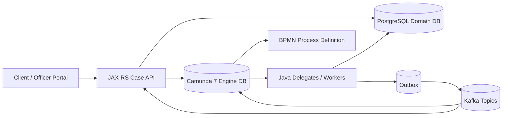
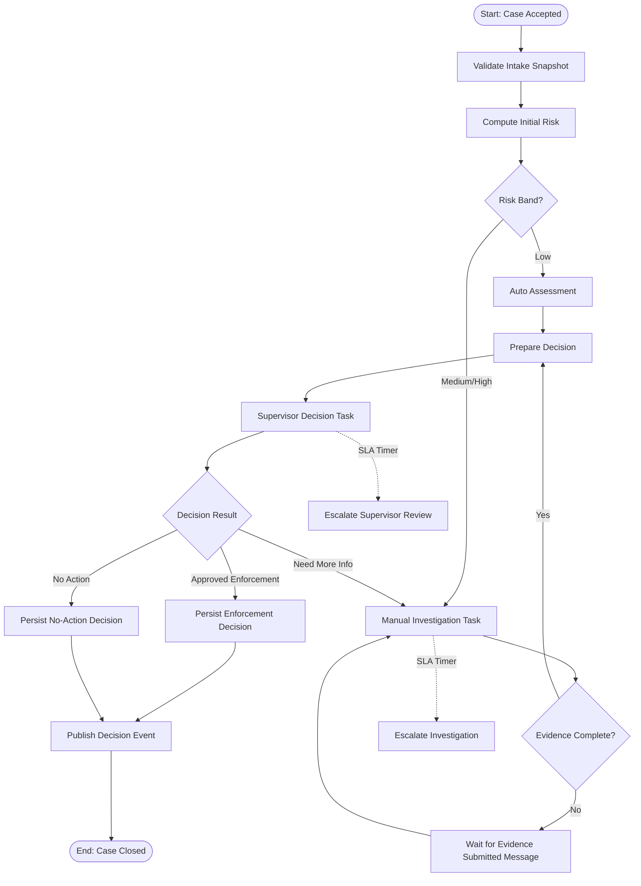
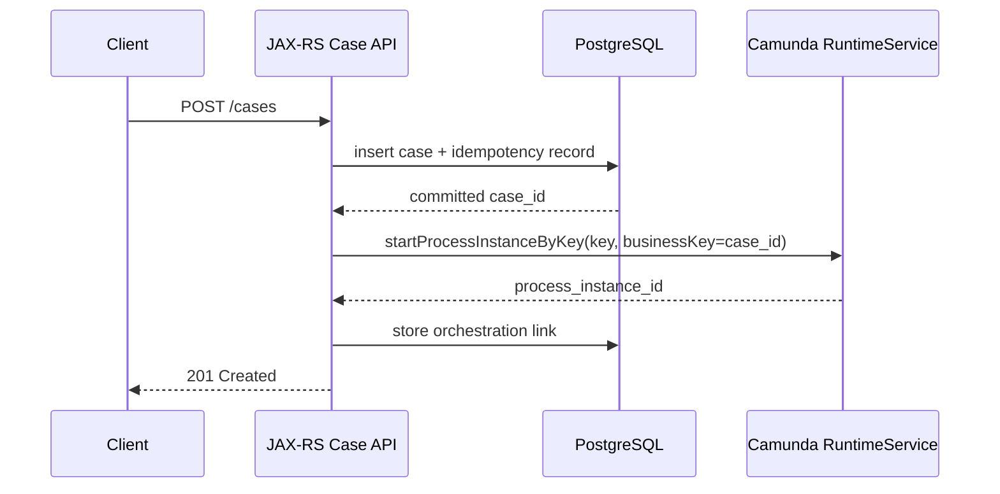
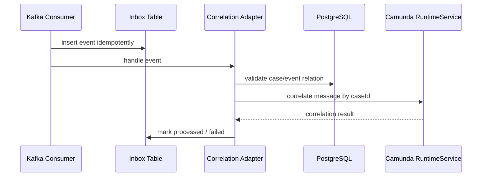

# Part 009 — BPMN Contracts with Camunda 7

Di part sebelumnya kita membahas database contract. Sekarang kita masuk ke kontrak yang sering terlihat visual, tetapi paling mudah disalahpahami: **BPMN contract**.

BPMN bukan gambar proses untuk presentasi. Dalam Camunda 7, BPMN adalah **executable process contract**. File BPMN menentukan:

- bagaimana proses dimulai;
- event apa yang bisa membangunkan proses;
- task apa yang harus dikerjakan manusia;
- service task apa yang dipanggil sistem;
- timer apa yang memicu escalation;
- error apa yang dianggap business error;
- retry apa yang dianggap technical failure;
- variable apa yang boleh dibaca/ditulis;
- titik transaksi mana yang menjadi boundary failure.

Untuk sistem kecil, BPMN sering dipakai sebagai flowchart yang “nanti delegate-nya bebas melakukan apa saja”. Untuk platform regulatory enforcement, pendekatan itu berbahaya.

Di sistem enforcement, workflow bukan sekadar urutan kerja. Workflow adalah bukti bahwa organisasi:

- menerima case sesuai prosedur;
- memvalidasi data dengan aturan yang dapat dijelaskan;
- memberi kesempatan review/manual judgment;
- menjalankan SLA dan escalation;
- membuat keputusan dengan alasan yang tercatat;
- bisa menjelaskan kenapa suatu case ada di state tertentu;
- bisa memulihkan proses ketika job gagal tanpa merusak fakta domain.

Karena itu, BPMN harus diperlakukan sebagai kontrak.

> Contract-first untuk BPMN berarti kita mendefinisikan process key, variable schema, message correlation, task payload, error boundary, retry behavior, dan versioning rule sebelum menulis delegate implementation.

---

## 1. Di Mana Posisi BPMN Contract dalam Sistem Kita?

Dalam arsitektur seri ini, Camunda 7 tidak menjadi database utama domain. Camunda tidak menjadi satu-satunya sumber kebenaran case. Camunda adalah **orchestration runtime**.



Ada dua jenis state besar:

1. **Domain state**: disimpan di PostgreSQL domain schema.
2. **Workflow execution state**: disimpan di Camunda engine tables.

Kesalahan umum adalah mencampur keduanya.

Contoh buruk:

```text
Case status = value dari active BPMN activity.
```

Ini keliru karena active BPMN activity adalah posisi teknis proses, bukan fakta domain. Activity seperti `WaitForInvestigatorInput` atau `RetryPublishDecisionEvent` bukan status legal case.

Contoh lebih sehat:

```text
Domain state:
- case.lifecycle_status = UNDER_INVESTIGATION
- case.assignment_status = ASSIGNED
- case.sla_status = AT_RISK

Workflow state:
- process instance waiting at UserTask_InvestigationReview
- timer boundary event scheduled for escalation
- async job failed 2 times at ServiceTask_ComputeSla
```

Workflow state menjelaskan **apa yang sedang dikerjakan engine**. Domain state menjelaskan **apa fakta bisnis yang berlaku**.

---

## 2. BPMN Contract Bukan Satu File `.bpmn` Saja

BPMN contract minimal terdiri dari beberapa layer:

| Layer | Contract Artifact | Fungsi |
|---|---|---|
| Process identity | process key, deployment name, version tag | Identitas proses yang stabil untuk start, migration, monitoring |
| Start contract | start event, business key, start variables | Cara proses dibuat |
| Variable contract | variable name, type, owner, mutability | Data yang boleh dipakai engine |
| Task contract | user task key, candidate group, form/payload requirement | Tugas manusia yang stabil |
| Message contract | message name, correlation key, payload | Cara event eksternal membangunkan proses |
| Error contract | BPMN error code, incident policy, retry policy | Perbedaan business failure dan technical failure |
| Timer contract | duration/date/cycle expression, escalation semantics | SLA dan deadline |
| Delegate contract | class/interface, input variables, output variables | Perjanjian antara BPMN dan Java code |
| Ops contract | incident handling, retry, suspension, migration | Cara sistem dioperasikan |

Tanpa layer-layer ini, BPMN akan menjadi diagram yang terlihat rapi tetapi rapuh di runtime.

---

## 3. Studi Kasus Proses: Regulatory Enforcement Case Lifecycle

Kita gunakan proses utama:

```text
Process key: enforcement-case-lifecycle
```

Tujuan proses:

1. case diterima dari API;
2. data awal divalidasi;
3. risk score dihitung;
4. jika perlu investigation, user task dibuat;
5. jika evidence kurang, proses menunggu evidence event;
6. SLA dipantau dengan timer;
7. decision dibuat;
8. decision event dipublikasikan;
9. case ditutup.

Model high-level:



Ini bukan final BPMN XML. Ini abstraction agar kita melihat contract surface.

Dari diagram ini, kita sudah bisa mengidentifikasi kontrak:

- start event contract;
- user task contract;
- message contract;
- timer contract;
- decision contract;
- delegate contract;
- event publication contract;
- incident contract.

---

## 4. Process Key sebagai Public Runtime Identifier

Process key adalah identitas stabil yang dipakai oleh API, deployment, monitoring, migration, dan operator.

Contoh:

```xml
<bpmn:process id="enforcement-case-lifecycle" name="Enforcement Case Lifecycle" isExecutable="true">
```

Gunakan rule berikut:

```text
process key = kebab-case, domain-specific, stable, tidak mengandung versi teknis
```

Contoh baik:

```text
enforcement-case-lifecycle
case-appeal-lifecycle
evidence-review-subprocess
```

Contoh buruk:

```text
process1
new-case-flow-v2
camunda-main-process
regulatoryFlow2026
```

Kenapa versi tidak ditaruh di process key?

Karena Camunda 7 sendiri memiliki versioning process definition saat deployment. Jika setiap versi memakai key baru, kita kehilangan kemampuan melihat lineage sebagai satu proses yang sama.

Gunakan metadata/extension untuk version tag jika perlu:

```xml
<camunda:properties>
  <camunda:property name="contractVersion" value="2026.07" />
  <camunda:property name="owner" value="case-orchestration" />
  <camunda:property name="domain" value="enforcement" />
</camunda:properties>
```

Rule:

> Process key berubah hanya jika makna proses secara domain berubah menjadi proses berbeda, bukan karena flow teknis direvisi.

---

## 5. Business Key: Jangan Pakai Process Instance ID sebagai Identitas Bisnis

Camunda process instance id adalah identifier engine. Ia berguna untuk operasi engine, tetapi bukan identifier domain.

Untuk case enforcement, gunakan:

```text
businessKey = caseId
```

Contoh start process dari Java:

```java
public final class StartCaseProcessCommand {
    private final UUID caseId;
    private final String caseReferenceNumber;
    private final String intakeChannel;
    private final String submittedBy;

    // constructor + getters
}
```

```java
Map<String, Object> variables = new HashMap<>();
variables.put("caseId", command.caseId().toString());
variables.put("caseReferenceNumber", command.caseReferenceNumber());
variables.put("intakeChannel", command.intakeChannel());
variables.put("submittedBy", command.submittedBy());
variables.put("contractVersion", "2026.07");

runtimeService.startProcessInstanceByKey(
    "enforcement-case-lifecycle",
    command.caseId().toString(),
    variables
);
```

Kenapa `caseId` cocok sebagai business key?

- stabil sepanjang lifecycle case;
- bisa dipahami operator;
- bisa dikorelasikan dengan PostgreSQL domain record;
- bisa dipakai untuk message correlation;
- tidak berubah ketika process instance teknis diganti/migrated/restarted.

Namun ada rule penting:

> Business key bukan pengganti unique constraint di domain database.

Camunda business key membantu correlation dan observability. Domain uniqueness tetap dijaga PostgreSQL.

---

## 6. Start Contract

Start contract menjawab:

```text
Siapa boleh memulai proses ini?
Kapan proses boleh dimulai?
Variable apa yang wajib ada?
Apakah proses boleh dimulai lebih dari sekali untuk case yang sama?
Apa yang terjadi jika start duplicate?
```

Untuk sistem kita, proses dimulai setelah case berhasil disimpan ke PostgreSQL.

Sequence yang benar:



Ada trade-off besar di sini.

Jika API menyimpan case lalu gagal start Camunda, domain case sudah ada tetapi workflow belum jalan.

Pilihan desain:

| Pilihan | Kelebihan | Risiko |
|---|---|---|
| Start Camunda dalam transaksi API yang sama | Terlihat atomic dari sisi request | Sulit karena Camunda dan domain DB boundary bisa berbeda; coupling tinggi |
| Simpan case lalu start Camunda synchronously | Simpel, mudah dipahami | Perlu recovery jika start gagal |
| Simpan case lalu tulis command outbox untuk starter worker | Lebih reliable dan retryable | Response tidak langsung menjamin process sudah start |

Untuk platform produksi, pilihan yang lebih defensible:

```text
POST /cases commits domain case + orchestration_start_requested outbox.
Starter worker membaca outbox dan memulai Camunda.
API mengembalikan case accepted, bukan process completed.
```

Namun pada seri ini, kita akan menunjukkan kedua pola karena banyak sistem Camunda 7 existing masih memakai synchronous start.

Contract rule:

```text
Domain case must be durable before process starts.
Process start must be idempotent by caseId.
Duplicate start must not create two active lifecycle processes for the same case.
```

Implementasi guard di DB:

```sql
create table case_orchestration_link (
    case_id uuid primary key,
    process_key text not null,
    process_instance_id text not null,
    started_at timestamptz not null default now(),
    ended_at timestamptz,
    unique (process_instance_id)
);
```

Jika worker retry start, cek dulu link:

```java
Optional<OrchestrationLink> existing = orchestrationLinkRepository.findByCaseId(caseId);
if (existing.isPresent()) {
    return existing.get();
}
```

Jangan mengandalkan “Camunda tidak akan duplicate” tanpa domain-side guard.

---

## 7. Variable Contract: Bagian Paling Sering Membusuk

Process variable di Camunda mudah dipakai. Terlalu mudah.

Contoh buruk:

```java
execution.setVariable("case", hugeCaseObject);
execution.setVariable("data", mapOfEverything);
execution.setVariable("status", "done");
execution.setVariable("payload", requestJson);
```

Ini membuat BPMN sulit dipahami, sulit dimigrasi, sulit di-debug, dan rawan serialization problem.

Variable contract harus eksplisit.

### 7.1 Kategori Variable

Untuk platform kita, gunakan kategori:

| Kategori | Contoh | Mutability | Disimpan di Camunda? |
|---|---|---|---|
| Identity variable | `caseId`, `caseReferenceNumber` | immutable | ya |
| Routing variable | `riskBand`, `requiresInvestigation` | berubah di titik tertentu | ya |
| Task variable | `investigationTaskType`, `candidateGroup` | controlled | ya |
| Message correlation variable | `evidenceBatchId`, `appealId` | controlled | ya, jika diperlukan |
| Snapshot pointer | `intakeSnapshotId`, `decisionDraftId` | immutable setelah dibuat | ya |
| Large payload | full evidence file, full party graph | jangan | tidak |
| Sensitive payload | national id, personal data detail | sangat dibatasi | sebaiknya tidak |
| Derived display data | label UI, formatted text | jangan | tidak |

Rule:

> Camunda variables menyimpan pointer dan routing facts, bukan seluruh domain object.

### 7.2 Naming Rule

Gunakan nama variable stabil:

```text
caseId
caseReferenceNumber
intakeSnapshotId
riskBand
requiresManualInvestigation
investigationOutcome
decisionDraftId
finalDecisionType
currentEscalationLevel
contractVersion
```

Hindari:

```text
case_id
CaseID
case
payload
data
obj
request
status
flag
```

Kenapa camelCase?

Karena variable akan dibaca di Java delegate, expression BPMN, test fixture, dan operational query. Yang penting bukan camelCase-nya, tetapi konsistensi. Di seri ini kita pilih camelCase untuk JVM/BPMN boundary, sedangkan database tetap snake_case.

Mapping eksplisit:

| BPMN Variable | Java Field | DB Column | Event Field |
|---|---|---|---|
| `caseId` | `caseId` | `case_id` | `caseId` |
| `riskBand` | `riskBand` | `risk_band` | `riskBand` |
| `decisionDraftId` | `decisionDraftId` | `decision_draft_id` | `decisionDraftId` |

### 7.3 Variable Type Rule

Gunakan type sederhana jika variable dipakai untuk routing:

```text
String, Boolean, Integer, Long, Instant-as-String, UUID-as-String
```

Jangan pakai complex serialized Java object sebagai variable routing utama.

Contoh buruk:

```java
execution.setVariable("riskAssessment", new RiskAssessment(...));
```

Masalahnya:

- class berubah saat deployment;
- serialization format berubah;
- migration process instance menjadi sulit;
- Cockpit/debugging menjadi lebih berat;
- cross-version compatibility buruk.

Lebih baik:

```java
execution.setVariable("riskAssessmentId", riskAssessmentId.toString());
execution.setVariable("riskBand", riskBand.name());
execution.setVariable("requiresManualInvestigation", riskBand.requiresManualInvestigation());
```

Fakta lengkap `risk_assessment` tetap di PostgreSQL.

### 7.4 Variable Ownership

Setiap variable harus punya owner.

| Variable | Owner | Writer | Reader |
|---|---|---|---|
| `caseId` | Case API | process starter | all delegates |
| `riskBand` | Risk service/delegate | `ComputeInitialRiskDelegate` | gateway, task assignment |
| `requiresManualInvestigation` | Risk policy | `ComputeInitialRiskDelegate` | BPMN gateway |
| `investigationOutcome` | Investigation task | task completion API | decision preparation |
| `decisionDraftId` | Decision delegate | `PrepareDecisionDelegate` | supervisor task, final persistence |

Jika semua delegate bebas menulis semua variable, proses akan menjadi shared mutable state tanpa kontrak.

Rule:

> A BPMN variable may have many readers, but should have one clear writer.

---

## 8. Gateway Contract: Gateway Harus Membaca Facts yang Stabil

Gateway di BPMN sering terlihat sederhana:

```text
if riskBand == HIGH then manual investigation
```

Namun gateway menjadi kontrak runtime. Jika expression berubah, process behavior berubah.

Contoh:

```xml
<bpmn:sequenceFlow id="Flow_HighRisk" sourceRef="Gateway_RiskBand" targetRef="Task_ManualInvestigation">
  <bpmn:conditionExpression xsi:type="bpmn:tFormalExpression">
    ${riskBand == 'HIGH' || riskBand == 'CRITICAL'}
  </bpmn:conditionExpression>
</bpmn:sequenceFlow>
```

Rule untuk gateway:

1. expression harus pendek;
2. expression membaca variable routing, bukan object besar;
3. expression tidak memanggil service eksternal;
4. rule kompleks dihitung di delegate/policy class lalu disimpan sebagai boolean/routing variable;
5. default path harus eksplisit;
6. setiap path diuji dengan process test.

Contoh lebih baik:

```java
execution.setVariable("requiresManualInvestigation", decision.requiresManualInvestigation());
```

Gateway:

```text
${requiresManualInvestigation == true}
```

Kenapa?

Karena BPMN bukan tempat ideal untuk menyembunyikan policy kompleks. BPMN harus memperlihatkan pilihan proses, bukan mengimplementasikan policy engine di expression string.

---

## 9. User Task Contract

User task bukan hanya kotak di diagram. User task adalah kontrak antara process engine, task API, authorization, UI, SLA, audit, dan domain update.

Contoh user task:

```text
Task key: UserTask_InvestigationReview
Name: Investigation Review
Candidate group: enforcement-investigator
Input: caseId, caseReferenceNumber, riskBand, intakeSnapshotId
Output: investigationOutcome, evidenceCompleteness, recommendedAction
SLA: P3D from task creation
Audit: task claim, complete, outcome, comments
```

### 9.1 Task Definition Key Harus Stabil

Task definition key dipakai oleh:

- UI routing;
- task query;
- authorization mapping;
- audit report;
- migration mapping;
- analytics;
- process tests.

Contoh baik:

```text
UserTask_InvestigationReview
UserTask_SupervisorDecision
UserTask_EvidenceClarification
```

Contoh buruk:

```text
Task_1
Activity_0abc123
Review
NewTask
```

Rule:

> Task definition key adalah public process contract. Jangan biarkan auto-generated ID dari modeler masuk ke production.

### 9.2 Candidate Group sebagai Contract, Bukan Hardcoded UI Role

Dalam BPMN:

```xml
<bpmn:userTask id="UserTask_InvestigationReview" name="Investigation Review" camunda:candidateGroups="enforcement-investigator" />
```

`enforcement-investigator` harus dipetakan ke authorization model organisasi.

Namun jangan menaruh semua logic assignment di BPMN jika rule-nya kompleks.

Contoh assignment kompleks:

```text
Jika region = WEST dan riskBand = HIGH, assign ke senior investigator group wilayah barat.
Jika case terkait entity yang pernah diperiksa officer tertentu, officer itu tidak boleh assigned.
Jika conflict of interest, assign ke alternate unit.
```

BPMN tidak cocok untuk policy assignment yang kaya. Gunakan delegate:

```java
AssignmentDecision decision = assignmentPolicy.assignInvestigation(caseId);
execution.setVariable("investigationCandidateGroup", decision.candidateGroup());
execution.setVariable("assignmentPolicyVersion", decision.policyVersion());
```

Lalu BPMN:

```xml
<bpmn:userTask id="UserTask_InvestigationReview"
               name="Investigation Review"
               camunda:candidateGroups="${investigationCandidateGroup}" />
```

Tetap contract-first karena variable `investigationCandidateGroup` didefinisikan jelas.

### 9.3 Task Completion Contract

Task completion harus divalidasi sebagai command, bukan sekadar submit variable bebas.

Contoh endpoint:

```http
POST /tasks/{taskId}/complete-investigation-review
```

Payload:

```json
{
  "caseId": "8b36802f-7b25-4d17-89d3-0ef1a579f4cb",
  "outcome": "EVIDENCE_COMPLETE",
  "recommendedAction": "PROCEED_TO_DECISION",
  "comment": "Evidence package is complete and allegation is substantiated.",
  "idempotencyKey": "task-completion-2026-07-02-001"
}
```

Mapping ke variables:

```java
Map<String, Object> variables = Map.of(
    "investigationOutcome", command.outcome().name(),
    "recommendedAction", command.recommendedAction().name(),
    "investigationCompletedAt", clock.instant().toString()
);

taskService.complete(taskId, variables);
```

Tapi sebelum `complete`, service harus validasi:

- task milik `caseId` yang sama;
- task definition key sesuai command;
- user punya authority;
- task belum completed;
- idempotency key belum dipakai untuk outcome berbeda;
- transition domain valid;
- audit record ditulis.

Jangan memberi UI endpoint generic:

```http
POST /camunda/task/{id}/complete
```

Dengan payload:

```json
{
  "variables": {
    "anything": "anything"
  }
}
```

Itu membocorkan engine sebagai API publik dan menghancurkan contract boundary.

---

## 10. Message Contract: Cara Event Eksternal Membangunkan Proses

Camunda message event adalah kontrak directed communication. Tidak seperti signal broadcast, message diarahkan ke proses tertentu atau start event tertentu.

Di sistem kita, beberapa event eksternal perlu membangunkan process instance:

- evidence submitted;
- appeal submitted;
- payment received untuk penalty;
- external registry verification completed;
- supervisor override approved.

Contoh BPMN wait state:

```text
Intermediate catch message: Message_EvidenceSubmitted
```

Message contract:

```yaml
messageName: EvidenceSubmitted
correlation:
  businessKey: caseId
payload:
  caseId: uuid
  evidenceBatchId: uuid
  submittedAt: datetime
  source: enum
idempotency:
  key: eventId
```

### 10.1 Correlation Key Rule

Gunakan correlation key yang bermakna domain.

Untuk case lifecycle:

```text
businessKey = caseId
```

Jika satu case bisa punya beberapa sub-flow paralel untuk evidence batch, correlation bisa perlu tambahan variable:

```text
businessKey = caseId
process variable evidenceRequestId = incoming evidenceRequestId
```

Contoh Java correlation:

```java
runtimeService.createMessageCorrelation("EvidenceSubmitted")
    .processInstanceBusinessKey(event.caseId().toString())
    .setVariable("latestEvidenceBatchId", event.evidenceBatchId().toString())
    .setVariable("evidenceSubmittedAt", event.submittedAt().toString())
    .correlateWithResult();
```

Jika banyak execution matching, correlation gagal. Itu bagus. Kegagalan tersebut menunjukkan contract ambiguity.

Rule:

> Jika satu message bisa match lebih dari satu waiting execution, model process atau correlation contract belum cukup spesifik.

### 10.2 Message Name Harus Stabil

Gunakan message name domain-oriented:

```text
EvidenceSubmitted
AppealSubmitted
ExternalVerificationCompleted
PenaltyPaymentReceived
```

Hindari:

```text
Msg1
Continue
KafkaMessage
EventReceived
UpdateCase
```

Message name harus disejajarkan dengan AsyncAPI event contract, tetapi tidak harus selalu identik dengan topic name.

| Kafka Topic | Event Type | Camunda Message Name |
|---|---|---|
| `evidence.events.v1` | `EvidenceSubmitted` | `EvidenceSubmitted` |
| `case-appeal.events.v1` | `AppealSubmitted` | `AppealSubmitted` |
| `registry-verification.events.v1` | `ExternalVerificationCompleted` | `ExternalVerificationCompleted` |

Topic adalah transport grouping. Message name adalah process wake-up semantic.

### 10.3 Correlation Adapter Pattern

Jangan biarkan Kafka consumer langsung menulis business logic ke BPMN tanpa boundary.

Gunakan adapter:



Adapter bertanggung jawab untuk:

- idempotency event;
- validasi payload vs domain state;
- mapping event ke message name;
- menentukan correlation key;
- handling “process not waiting yet”;
- retry/DLQ policy.

### 10.4 Race: Event Datang Sebelum Process Menunggu

Ini real di production.

Contoh:

1. user submit evidence;
2. event `EvidenceSubmitted` dipublish;
3. process belum sampai wait state `EvidenceSubmitted`;
4. correlation gagal.

Jangan anggap ini tidak mungkin.

Solusi umum:

| Solusi | Cocok untuk | Trade-off |
|---|---|---|
| Retry correlation dengan inbox | event eventually arrives after process waits | perlu retry policy |
| Store fact in DB, BPMN checks before wait | event mungkin datang lebih dulu | model sedikit lebih kompleks |
| Event subprocess / boundary message | process bisa menerima event di banyak titik | harus hati-hati scope |
| Domain-driven wait state | process tidak menunggu event langsung; process polling/check DB fact | lebih deterministic tapi kurang reactive |

Untuk regulatory platform, pola aman:

```text
Event selalu disimpan sebagai durable domain fact/inbox.
BPMN tidak menjadi satu-satunya tempat event diingat.
Jika correlation gagal karena process belum ready, retry adapter atau biarkan process mengecek DB saat masuk wait stage.
```

---

## 11. Timer Contract dan SLA

Timer di BPMN terlihat sederhana. Namun dalam production, timer adalah kontrak SLA.

Contoh:

```text
Investigation must be reviewed within 3 business days.
Supervisor decision must be made within 2 business days after recommendation.
Critical cases escalate after 4 hours.
```

BPMN timer bisa memakai duration/date/cycle. Tetapi SLA regulatory sering perlu business calendar, holiday, region, priority, dan pause rules.

Jangan taruh semua logika kalender di expression timer yang sulit diuji.

Pola yang lebih sehat:

1. Delegate menghitung `investigationDueAt` berdasarkan SLA policy.
2. BPMN timer membaca due date tersebut.
3. Domain DB menyimpan SLA fact.
4. Timer ketika firing menulis escalation/audit, bukan hanya mengirim email.

Contoh variable:

```java
SlaDeadline deadline = slaPolicy.calculateInvestigationDeadline(caseId);
execution.setVariable("investigationDueAt", deadline.dueAt().toString());
execution.setVariable("slaPolicyVersion", deadline.policyVersion());
```

Timer:

```xml
<bpmn:timerEventDefinition>
  <bpmn:timeDate xsi:type="bpmn:tFormalExpression">${investigationDueAt}</bpmn:timeDate>
</bpmn:timerEventDefinition>
```

Rule:

> Timer triggers operational action, but SLA truth should also be queryable from domain database.

Kenapa?

Karena operator dan report tidak boleh harus membaca internal Camunda job table untuk mengetahui case mana yang at risk.

---

## 12. Service Task Contract

Service task adalah boundary antara BPMN dan Java code.

Contoh:

```text
ServiceTask_ComputeInitialRisk
Delegate: ComputeInitialRiskDelegate
Input variables: caseId, intakeSnapshotId
Output variables: riskAssessmentId, riskBand, requiresManualInvestigation
Failure:
  - business: RiskInputInvalid -> BPMN error
  - technical: DB unavailable -> incident/retry
```

### 12.1 Delegate Harus Kecil dan Deterministic

Contoh buruk:

```java
public class BigCaseDelegate implements JavaDelegate {
    public void execute(DelegateExecution execution) {
        // load case
        // validate
        // compute risk
        // assign user
        // update status
        // publish Kafka
        // send email
        // complete external call
    }
}
```

Ini membuat satu service task menjadi black box.

Contoh lebih baik:

```java
public final class ComputeInitialRiskDelegate implements JavaDelegate {
    private final RiskAssessmentApplicationService riskAssessmentService;
    private final ProcessVariableWriter variables;

    @Override
    public void execute(DelegateExecution execution) {
        UUID caseId = variables.requireUuid(execution, "caseId");
        UUID snapshotId = variables.requireUuid(execution, "intakeSnapshotId");

        RiskAssessmentResult result = riskAssessmentService.computeInitialRisk(caseId, snapshotId);

        variables.set(execution, "riskAssessmentId", result.assessmentId().toString());
        variables.set(execution, "riskBand", result.riskBand().name());
        variables.set(execution, "requiresManualInvestigation", result.requiresManualInvestigation());
    }
}
```

Delegate hanya melakukan:

- read required variables;
- call application service;
- map result ke output variables;
- throw typed error.

### 12.2 Delegate Input/Output Contract

Dokumentasikan setiap delegate:

```yaml
serviceTask: ServiceTask_ComputeInitialRisk
delegate: ComputeInitialRiskDelegate
input:
  caseId:
    type: uuid-string
    required: true
  intakeSnapshotId:
    type: uuid-string
    required: true
output:
  riskAssessmentId:
    type: uuid-string
    required: true
  riskBand:
    type: enum-string
    values: [LOW, MEDIUM, HIGH, CRITICAL]
  requiresManualInvestigation:
    type: boolean
errors:
  business:
    - code: RISK_INPUT_INVALID
      mapsTo: BpmnError
  technical:
    - database_unavailable
    - policy_service_timeout
retry:
  asyncBefore: true
  retries: 3
  retryTimeCycle: R5/PT5M
```

BPMN contract tidak harus berada hanya dalam XML. Bisa disimpan di dokumentasi dekat BPMN, test fixture, atau metadata contract.

---

## 13. Business Error vs Technical Incident

Ini salah satu mental model paling penting di Camunda.

Tidak semua failure adalah incident.

### 13.1 Business Error

Business error berarti proses menemukan kondisi bisnis yang valid tapi tidak mengikuti happy path.

Contoh:

```text
Evidence incomplete.
Case is not eligible for automatic decision.
External registry says entity no longer exists.
Penalty amount below enforcement threshold.
```

Business error harus dimodelkan eksplisit dengan BPMN error atau gateway path.

Contoh:

```java
throw new BpmnError("EVIDENCE_INCOMPLETE", "Evidence package is incomplete");
```

BPMN menangkap error:

```text
Boundary Error Event: EVIDENCE_INCOMPLETE -> UserTask_RequestEvidenceClarification
```

### 13.2 Technical Incident

Technical incident berarti sistem gagal menjalankan operasi yang seharusnya bisa berhasil jika di-retry atau diperbaiki.

Contoh:

```text
PostgreSQL connection unavailable.
Kafka broker unavailable.
Serialization bug.
Deadlock.
Network timeout.
Delegate throws NullPointerException.
```

Technical failure sebaiknya menghasilkan failed job/incident, bukan business path.

Rule:

> Business error mengubah jalur proses. Technical error menghentikan eksekusi sampai sistem/operator memperbaiki penyebabnya.

Jangan lakukan ini:

```java
catch (Exception e) {
    throw new BpmnError("SYSTEM_ERROR");
}
```

Itu mengubah outage teknis menjadi jalur bisnis palsu. Regulator dan auditor tidak akan suka jika “database timeout” terlihat seperti “case not eligible”.

---

## 14. Async Boundary dan Transaction Contract

Camunda 7 menjalankan banyak langkah dalam satu transaksi engine sampai mencapai wait state atau async boundary. Ini berarti failure di satu task bisa rollback perubahan engine sebelumnya dalam transaksi yang sama.

Async boundary menentukan titik commit dan retry job executor.

### 14.1 Kapan Pakai `asyncBefore`

Gunakan `asyncBefore` untuk service task yang:

- memanggil sistem eksternal;
- melakukan operasi yang bisa gagal transient;
- mempublikasikan event via outbox;
- melakukan kalkulasi berat;
- menjadi boundary antar domain action;
- perlu retry independent.

Contoh:

```xml
<bpmn:serviceTask id="ServiceTask_PublishDecisionEvent"
                  name="Publish Decision Event"
                  camunda:asyncBefore="true"
                  camunda:class="com.example.workflow.PublishDecisionEventDelegate" />
```

Dengan async boundary, job executor dapat retry task jika gagal.

### 14.2 Kapan Jangan Berlebihan

Terlalu banyak async boundary membuat proses lambat dan terlalu banyak job.

Gunakan boundary di titik yang berarti secara failure model, bukan di setiap kotak.

Pertanyaan desain:

```text
Jika task ini gagal, apakah operator/retry perlu melihatnya sebagai unit recovery sendiri?
```

Jika ya, async boundary masuk akal.

### 14.3 Transaction Boundary dengan Domain DB

Jika delegate menulis domain DB lalu execution gagal setelahnya, kita perlu paham transaksi.

Ada beberapa pola:

| Pola | Deskripsi | Risiko |
|---|---|---|
| Camunda dan domain memakai datasource/transaksi sama | satu transaksi untuk engine + domain update | coupling tinggi, konfigurasi kompleks |
| Separate transaction per application service | domain commit bisa terjadi meski process rollback | perlu idempotency/recovery |
| Outbox/inbox untuk side effect | side effect durable dan retryable | lebih banyak komponen |

Untuk platform ini, rule utama:

> Setiap domain-side mutation yang dipanggil dari BPMN harus idempotent berdasarkan business key + operation key.

Contoh operation key:

```text
caseId + operationType + processActivityId + processDefinitionVersion
```

Atau lebih eksplisit:

```text
caseId + "PERSIST_FINAL_DECISION" + decisionDraftId
```

---

## 15. Incident Contract

Incident bukan sekadar “error di Camunda”. Incident adalah operational contract antara process engine dan operator.

Incident harus menjawab:

```text
Apa yang gagal?
Case mana yang terdampak?
Apakah aman di-retry?
Apakah side effect sudah terjadi?
Apakah perlu data repair?
Siapa owner-nya?
Apa runbook-nya?
```

### 15.1 Incident Context Variable

Jangan hanya mengandalkan stack trace.

Set variable observability:

```java
execution.setVariable("lastOperation", "PUBLISH_DECISION_EVENT");
execution.setVariable("lastOperationTarget", "case.decision.events.v1");
execution.setVariable("lastOperationId", operationId.toString());
```

Namun jangan menaruh sensitive data.

### 15.2 Retry Semantics

Retry aman jika operation idempotent.

Contoh publish decision event via outbox:

```text
Delegate inserts outbox row with unique event_id.
If retry occurs, insert conflict means event already prepared.
Publisher later sends to Kafka.
```

SQL guard:

```sql
create unique index ux_outbox_event_id on outbox_event(event_id);
```

Delegate retry menjadi aman.

### 15.3 Incident Runbook Template

Setiap critical service task harus punya runbook singkat:

```md
## Incident: ServiceTask_PublishDecisionEvent

Symptoms:
- Failed job at ServiceTask_PublishDecisionEvent
- caseId variable present
- lastOperation = PUBLISH_DECISION_EVENT

Safe retry?
- Yes, if outbox_event.event_id has unique constraint.
- Check outbox_event by case_id and event_type.

Manual repair:
- If decision persisted but no outbox row, insert repair outbox event using repair script.
- If outbox row exists but publisher failed, restart publisher or clear poison reason.

Do not:
- Do not manually complete process without decision event unless incident owner approves.
```

Production BPMN tanpa runbook adalah production risk.

---

## 16. Versioning Contract

Camunda 7 menyimpan process definition version per deployment. Instance yang sudah berjalan tetap memakai definition version yang ia mulai, kecuali dimigrasi.

Kita perlu membedakan:

| Jenis perubahan | Contoh | Risiko | Strategi |
|---|---|---|---|
| Cosmetic | rename label | rendah | deploy biasa |
| Add optional path | tambah escalation notification | sedang | deploy baru, test migration jika instance aktif terdampak |
| Change gateway rule | HIGH sekarang masuk supervisor langsung | tinggi | versioned policy + migration plan |
| Rename task id | `UserTask_Review` jadi `UserTask_InvestigationReview` | tinggi | hindari; migration mapping perlu |
| Rename variable | `riskLevel` jadi `riskBand` | sangat tinggi | dual-read/dual-write transitional |
| Remove wait state | hapus message catch event | sangat tinggi | migrate/cancel/drain old instances |

Rule:

> BPMN versioning bukan hanya deploy file baru. BPMN versioning adalah perubahan contract runtime untuk process instances yang mungkin hidup berminggu-minggu atau bertahun-tahun.

### 16.1 Stable IDs

Jaga stabilitas:

- process key;
- task definition key;
- service task id;
- message name;
- variable name;
- BPMN error code;
- timer semantic.

Boleh mengubah label `name`, tetapi hati-hati mengubah `id`.

### 16.2 Versioned Policy, Not Versioned Spaghetti

Jika rule berubah, jangan selalu cabangkan BPMN menjadi raksasa.

Contoh:

```java
RiskDecision decision = riskPolicy.evaluate(caseId, PolicyVersion.current());
execution.setVariable("riskPolicyVersion", decision.policyVersion());
execution.setVariable("requiresManualInvestigation", decision.requiresManualInvestigation());
```

BPMN tetap stabil, policy version berubah di code/config/database.

Namun jika proses hukum benar-benar berubah, BPMN version baru memang masuk akal.

---

## 17. Migration-Aware BPMN Design

Karena proses bisa long-running, desain awal harus migration-aware.

### 17.1 Jangan Mengunci Semua Makna di Activity ID Acak

Jika activity id auto-generated:

```text
Activity_0vx81mp
Gateway_1kwd91a
```

migration mapping dan incident debugging menjadi menyakitkan.

Gunakan id bermakna:

```text
ServiceTask_ComputeInitialRisk
Gateway_RequiresManualInvestigation
UserTask_InvestigationReview
MessageCatch_EvidenceSubmitted
```

### 17.2 Hindari Variable Renaming Mendadak

Jika harus rename:

Transitional version:

```java
String riskBand = variableReader.firstPresentString(
    execution,
    "riskBand",
    "riskLevel"
);

execution.setVariable("riskBand", riskBand);
```

Setelah old instances habis/migrated, baru hapus old variable.

### 17.3 Drain Strategy

Untuk perubahan besar:

```text
1. Deploy new process version.
2. New cases start on new version.
3. Old cases continue on old version.
4. Monitor active old instances.
5. Migrate only safe segments.
6. Cancel/repair exceptional old instances with approval.
```

Tidak semua instance harus dimigrasi. Kadang lebih aman membiarkan old instances selesai.

---

## 18. BPMN Testing Contract

BPMN contract harus diuji seperti API contract.

Minimum test:

| Test | Tujuan |
|---|---|
| Process starts with required variables | start contract valid |
| Missing required variable fails predictably | variable contract enforced |
| Low risk routes to auto assessment | gateway rule valid |
| High risk creates investigation task | user task contract valid |
| Evidence incomplete routes to clarification | business error/path valid |
| Evidence submitted message wakes correct instance | message correlation valid |
| SLA timer triggers escalation | timer contract valid |
| Technical failure creates retryable job/incident | incident semantics valid |
| Duplicate message does not double-complete | idempotency valid |
| Old variable name still works during transition | migration compatibility valid |

Contoh test pseudo-code:

```java
@Test
void highRiskCaseCreatesInvestigationTask() {
    UUID caseId = UUID.randomUUID();

    ProcessInstance instance = runtimeService.startProcessInstanceByKey(
        "enforcement-case-lifecycle",
        caseId.toString(),
        Map.of(
            "caseId", caseId.toString(),
            "intakeSnapshotId", UUID.randomUUID().toString(),
            "contractVersion", "2026.07"
        )
    );

    completeServiceTaskWithRiskBand(instance, "HIGH");

    Task task = taskService.createTaskQuery()
        .processInstanceBusinessKey(caseId.toString())
        .taskDefinitionKey("UserTask_InvestigationReview")
        .singleResult();

    assertNotNull(task);
}
```

Lebih penting dari syntax testing adalah mental modelnya:

> Test BPMN path sebagai contract behavior, bukan hanya test delegate class.

---

## 19. BPMN Contract Document Template

Untuk setiap process definition, buat dokumen contract seperti ini.

```yaml
process:
  key: enforcement-case-lifecycle
  name: Enforcement Case Lifecycle
  owner: case-orchestration-team
  domain: regulatory-enforcement
  businessKey: caseId
  contractVersion: 2026.07

start:
  allowedBy:
    - case-api
    - case-process-starter-worker
  requiredVariables:
    - caseId
    - caseReferenceNumber
    - intakeSnapshotId
    - contractVersion
  idempotency:
    key: caseId
    guard: case_orchestration_link.case_id primary key

variables:
  caseId:
    type: uuid-string
    owner: case-api
    mutability: immutable
  riskBand:
    type: enum-string
    values: [LOW, MEDIUM, HIGH, CRITICAL]
    owner: risk-assessment
    mutability: assigned-once-before-risk-gateway
  decisionDraftId:
    type: uuid-string
    owner: decision-service
    mutability: assigned-once

messages:
  EvidenceSubmitted:
    correlation: businessKey=caseId
    payloadPointers:
      - evidenceBatchId
      - submittedAt
    idempotency: eventId via inbox

userTasks:
  UserTask_InvestigationReview:
    candidateGroup: enforcement-investigator
    completionCommand: CompleteInvestigationReview
    outputVariables:
      - investigationOutcome
      - recommendedAction

serviceTasks:
  ServiceTask_ComputeInitialRisk:
    delegate: ComputeInitialRiskDelegate
    asyncBefore: true
    retry: R3/PT5M

errors:
  EVIDENCE_INCOMPLETE:
    type: business
    handledBy: UserTask_RequestEvidenceClarification

incidents:
  ServiceTask_PublishDecisionEvent:
    retrySafe: true
    runbook: runbooks/camunda/publish-decision-event.md
```

Ini mungkin terlihat formal, tetapi inilah yang membedakan workflow production-grade dari diagram rapuh.

---

## 20. Anti-Pattern BPMN Camunda 7

### Anti-pattern 1: BPMN sebagai Big Ball of Mud

Gejala:

- banyak gateway dengan expression panjang;
- variable `payload` dipakai semua activity;
- task id auto-generated;
- delegate melakukan banyak side effect;
- tidak ada variable ownership.

Dampak:

- sulit debug;
- sulit migration;
- sulit test;
- incident tidak jelas;
- operator takut retry.

### Anti-pattern 2: Camunda sebagai Source of Truth Domain

Gejala:

- case status hanya ada di process variable;
- report membaca Camunda history sebagai domain data;
- decision tidak punya table domain sendiri;
- audit penting hanya ada di process history.

Dampak:

- reporting berat;
- audit domain tergantung engine detail;
- migration engine menjadi sangat mahal;
- recovery domain kabur.

### Anti-pattern 3: Generic Task Complete API

Gejala:

```http
POST /tasks/{id}/complete
{
  "variables": {...}
}
```

Dampak:

- UI bisa mengirim variable apa saja;
- authorization domain lemah;
- audit tidak semantic;
- task completion tidak idempotent;
- BPMN variable contract rusak.

### Anti-pattern 4: Semua Error Jadi BPMN Error

Gejala:

```java
catch (Exception e) {
    throw new BpmnError("FAILED");
}
```

Dampak:

- outage teknis terlihat seperti business outcome;
- retry engine tidak bekerja semestinya;
- audit menyesatkan;
- operator kehilangan signal incident.

### Anti-pattern 5: Mengubah Activity ID Setelah Production

Gejala:

- modeler auto-generate ulang id;
- task id berubah karena rename visual;
- migration mapping gagal;
- dashboard lama rusak.

Dampak:

- active instance sulit dimigrasi;
- test brittle;
- task analytics patah.

---

## 21. Production Checklist

Sebelum process definition dianggap production-ready:

```text
[ ] Process key stabil dan domain-specific.
[ ] Business key ditentukan dan dipakai konsisten.
[ ] Start variables terdokumentasi.
[ ] Variable ownership jelas.
[ ] Variable type sederhana untuk routing.
[ ] Large/sensitive payload tidak disimpan sembarangan di Camunda variables.
[ ] User task definition key stabil.
[ ] Task completion memakai semantic command endpoint.
[ ] Candidate group/assignment policy terdokumentasi.
[ ] Message name dan correlation key jelas.
[ ] Race event-before-wait ditangani.
[ ] Timer SLA memakai policy yang testable.
[ ] Business error berbeda dari technical incident.
[ ] Async boundary ditempatkan berdasarkan failure model.
[ ] Service task punya input/output contract.
[ ] Retry safety dibuktikan dengan idempotency.
[ ] Incident runbook ada untuk critical task.
[ ] Process versioning strategy ada.
[ ] Migration/drain strategy ada.
[ ] BPMN path tests mencakup happy path dan failure path.
```

---

## 22. Kesimpulan

BPMN contract adalah kontrak executable untuk orchestration. Di Camunda 7, kontrak ini tidak hanya berada di gambar proses, tetapi juga di:

- process key;
- business key;
- variable names;
- task definition keys;
- message names;
- correlation rules;
- timer semantics;
- delegate input/output;
- BPMN error code;
- async boundary;
- retry behavior;
- incident runbook;
- migration strategy.

Untuk sistem regulatory enforcement, BPMN yang baik bukan BPMN yang terlihat paling sederhana. BPMN yang baik adalah BPMN yang:

1. domain behavior-nya jelas;
2. state boundary-nya sehat;
3. error semantics-nya defensible;
4. retry-nya aman;
5. active instance-nya bisa dioperasikan;
6. perubahannya bisa dikelola tanpa merusak case berjalan.

Di part berikutnya kita akan menyatukan semua kontrak: OpenAPI, AsyncAPI, BPMN, PostgreSQL, Java DTO, MyBatis mapper, dan Kafka payload. Fokusnya adalah **cross-contract consistency** — bagaimana memastikan sistem tidak punya tujuh definisi berbeda untuk konsep yang sama.

---

## Source Alignment

Materi ini diselaraskan dengan dokumentasi primer dan referensi teknis berikut:

- Camunda 7 documentation: process engine, BPMN, message events, process variables, job executor, incidents, and runtime service concepts.
- Camunda 7 Javadocs: `RuntimeService` and `MessageCorrelationBuilder` behavior for business key and message correlation.
- Camunda guidance on routing events to Camunda 7 processes.
- BPMN 2.0 execution concepts as implemented by Camunda 7.
- Production workflow design practices for long-running process instances, async boundaries, retries, and incident recovery.
