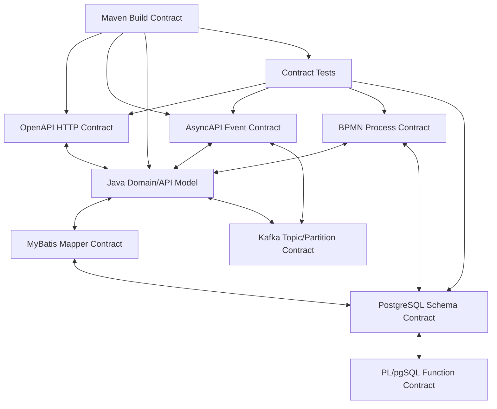
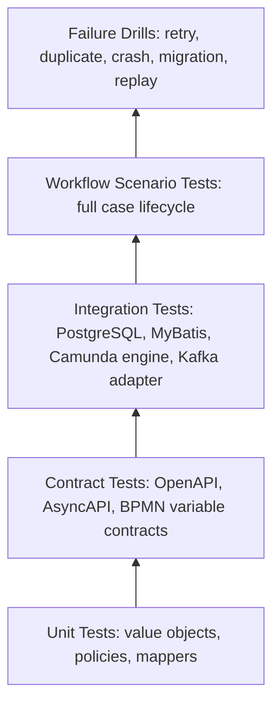

# Part 010 — Cross-Contract Consistency

Contract-first sering gagal bukan karena tim tidak punya kontrak. Justru sebaliknya: tim punya terlalu banyak kontrak yang tidak sinkron.

Contoh satu konsep bernama `case status` bisa muncul sebagai:

- enum di OpenAPI;
- enum di Java DTO;
- column `case_status` di PostgreSQL;
- process variable `status` di Camunda;
- field `caseStatus` di Kafka event;
- string literal di MyBatis XML;
- filter query di UI;
- label di dashboard;
- rule di PL/pgSQL function.

Jika semuanya berkembang sendiri-sendiri, sistem akan membusuk diam-diam.

Gejalanya:

```text
API bilang status = UNDER_REVIEW.
Database menyimpan INVESTIGATION.
BPMN variable bernama reviewStatus.
Kafka event mengirim case_state.
Consumer lama hanya mengenal IN_PROGRESS.
Dashboard menampilkan Pending.
```

Ini bukan masalah naming kecil. Ini masalah **semantic drift**.

Di sistem regulatory enforcement, semantic drift berbahaya karena setiap keputusan harus bisa dijelaskan. Kalau sistem tidak konsisten tentang arti state, event, decision, task, dan deadline, maka audit trail menjadi lemah.

Part ini membahas cara menjaga konsistensi lintas kontrak:

- OpenAPI untuk HTTP boundary;
- AsyncAPI untuk event boundary;
- BPMN Camunda 7 untuk orchestration boundary;
- PostgreSQL untuk durable truth;
- PL/pgSQL untuk data-near invariants;
- MyBatis untuk SQL mapping boundary;
- Java SE model untuk in-process type system;
- Kafka untuk streaming semantics;
- Maven untuk build-time enforcement.

Tujuannya bukan membuat semua layer identik. Tujuannya adalah membuat semua layer **selaras**, dengan ownership dan mapping yang eksplisit.

---

## 1. Mental Model: Satu Konsep, Banyak Representasi

Satu konsep domain bisa punya banyak representasi teknis.

Contoh konsep:

```text
Case Identifier
```

Representasi:

| Layer | Representation |
|---|---|
| OpenAPI | `caseId: string`, format `uuid` |
| Java | `UUID caseId` atau value object `CaseId` |
| PostgreSQL | `case_id uuid` |
| Kafka event | `caseId: string` |
| Camunda | process variable `caseId` as string |
| Business key | `caseId.toString()` |
| MyBatis | `java.util.UUID` mapped to PostgreSQL `uuid` |
| Logs | `case_id` or `caseId` as correlation field |

Ini normal. Yang berbahaya adalah ketika mapping tidak eksplisit.

Rule utama:

> Cross-contract consistency bukan berarti semua layer memakai bentuk yang sama. Cross-contract consistency berarti setiap perbedaan bentuk punya alasan dan mapping yang diuji.

---

## 2. Contract Surface Map

Sebelum menjaga konsistensi, kita harus tahu permukaan kontraknya.



Setiap edge adalah tempat drift bisa terjadi.

Contoh drift edge:

| Edge | Drift Example |
|---|---|
| OpenAPI ↔ Java | API schema enum punya value baru tapi Java enum belum update |
| Java ↔ MyBatis | Java field nullable tapi DB column not null |
| MyBatis ↔ DB | mapper select tidak mengambil column baru yang wajib |
| AsyncAPI ↔ Kafka | event contract bilang key `caseId`, producer memakai `partyId` |
| BPMN ↔ Java | delegate membaca variable `riskLevel`, BPMN menulis `riskBand` |
| BPMN ↔ DB | process variable bilang decision final, DB belum punya final decision |
| OpenAPI ↔ BPMN | API task completion mengirim outcome yang tidak dikenal gateway |

Jadi kita butuh mekanisme, bukan sekadar disiplin manual.

---

## 3. Canonical Contract Registry

Kita tidak akan membuat satu “mega schema” yang menguasai semua layer. Itu biasanya menjadi bottleneck.

Yang kita butuhkan adalah **contract registry internal repository**.

Dalam repo Maven multi-module:

```text
contract-first-platform/
  contracts/
    openapi/
      case-api.yaml
      task-api.yaml
      decision-api.yaml
    asyncapi/
      case-events.yaml
      evidence-events.yaml
      decision-events.yaml
    bpmn/
      enforcement-case-lifecycle.bpmn
      evidence-review-subprocess.bpmn
    database/
      schema/
        001_case_core.sql
        002_decision.sql
      functions/
        fn_create_case.sql
        fn_finalize_decision.sql
    mappings/
      concept-map.yaml
      enum-map.yaml
      error-map.yaml
      idempotency-map.yaml
```

`concept-map.yaml` bukan runtime artifact. Ia adalah governance artifact.

Contoh:

```yaml
concepts:
  CaseId:
    meaning: Durable identifier of an enforcement case.
    owner: case-core
    representations:
      openapi: '#/components/schemas/CaseId'
      java: com.example.casecore.CaseId
      postgres: enforcement_case.case_id uuid
      kafka: envelope.subject.id + payload.caseId
      camunda:
        businessKey: caseId
        variable: caseId
      logField: caseId
    invariants:
      - stable after creation
      - globally unique
      - never reused
      - required in all case-scoped events
```

Ini terlihat sederhana, tetapi sangat kuat. Saat ada engineer ingin menambahkan `case_ref`, ia harus menjawab apakah itu identifier baru atau display reference.

---

## 4. Golden Rule: Durable Truth vs Transport Representation

Tidak semua kontrak punya level kebenaran yang sama.

Urutan mental model:

```text
Domain invariant > Database durable fact > Process orchestration fact > API representation > Event notification > UI display
```

Bukan berarti API/event tidak penting. Tetapi jika terjadi konflik, kita harus tahu sumber koreksi.

Contoh:

```text
Kafka event CaseClosed terkirim, tetapi DB case masih UNDER_INVESTIGATION.
```

Mana yang benar?

Untuk sistem kita:

```text
DB domain fact menang.
Event dianggap erroneous side effect dan perlu compensating/repair event.
```

Contoh lain:

```text
Camunda process instance sudah end, tetapi DB case belum CLOSED.
```

Ini incident. Jangan otomatis menganggap case closed hanya karena process ended.

Rule:

> BPMN completion is not domain completion unless the domain completion transaction has committed.

Karena itu part sebelumnya menekankan domain state dan workflow state harus dipisah.

---

## 5. Naming Consistency: Jangan Remehkan Bahasa

Nama adalah kontrak.

### 5.1 Case Status vs Case Lifecycle Status

`status` terlalu umum.

Lebih baik:

```text
caseLifecycleStatus
assignmentStatus
slaStatus
decisionStatus
appealStatus
publicationStatus
```

Database:

```sql
case_lifecycle_status text not null
assignment_status text not null
sla_status text not null
```

Java:

```java
public enum CaseLifecycleStatus {
    ACCEPTED,
    UNDER_ASSESSMENT,
    UNDER_INVESTIGATION,
    DECISION_PENDING,
    DECIDED,
    CLOSED,
    CANCELLED
}
```

OpenAPI:

```yaml
CaseLifecycleStatus:
  type: string
  enum:
    - ACCEPTED
    - UNDER_ASSESSMENT
    - UNDER_INVESTIGATION
    - DECISION_PENDING
    - DECIDED
    - CLOSED
    - CANCELLED
```

Kafka:

```json
{
  "caseLifecycleStatus": "UNDER_INVESTIGATION"
}
```

Camunda:

```text
caseLifecycleStatusSnapshot = UNDER_INVESTIGATION
```

Perhatikan kata `Snapshot`. Jika Camunda variable hanya snapshot untuk routing/observability, namanya harus menunjukkan bahwa ia bukan durable truth.

### 5.2 Naming Translation Table

Gunakan translation table:

| Concept | OpenAPI | Java | PostgreSQL | BPMN | Kafka | Log |
|---|---|---|---|---|---|---|
| Case ID | `caseId` | `caseId` | `case_id` | `caseId` | `caseId` | `caseId` |
| Lifecycle status | `caseLifecycleStatus` | `caseLifecycleStatus` | `case_lifecycle_status` | `caseLifecycleStatusSnapshot` | `caseLifecycleStatus` | `caseLifecycleStatus` |
| Risk band | `riskBand` | `riskBand` | `risk_band` | `riskBand` | `riskBand` | `riskBand` |
| Decision type | `decisionType` | `decisionType` | `decision_type` | `finalDecisionType` | `decisionType` | `decisionType` |
| Correlation ID | `correlationId` header | `correlationId` | `correlation_id` | `correlationId` | `correlationId` | `correlationId` |

This table is boring. Boring is good. Boring prevents production ambiguity.

---

## 6. Enum Consistency

Enum drift adalah salah satu sumber bug paling umum.

### 6.1 Enum Ownership

Setiap enum harus punya owner.

| Enum | Owner | Primary Contract |
|---|---|---|
| `CaseLifecycleStatus` | case-core | database + OpenAPI |
| `RiskBand` | risk-assessment | policy contract + OpenAPI/Event |
| `DecisionType` | decision-core | database + event contract |
| `TaskOutcome` | workflow/task-core | task API + BPMN gateway |
| `EventType` | integration | AsyncAPI/event envelope |

Jika enum dimiliki semua tim, enum tidak dimiliki siapa pun.

### 6.2 Additive Change Rule

Untuk enum di API/event:

```text
Adding enum value may still break consumers.
```

Secara schema, menambah enum value terlihat backward-compatible untuk producer. Tetapi consumer lama bisa gagal jika switch statement tidak punya default.

Java anti-pattern:

```java
switch (status) {
    case ACCEPTED -> ...;
    case CLOSED -> ...;
}
```

Lebih aman:

```java
switch (status) {
    case ACCEPTED -> ...;
    case UNDER_ASSESSMENT -> ...;
    case UNDER_INVESTIGATION -> ...;
    case DECISION_PENDING -> ...;
    case DECIDED -> ...;
    case CLOSED -> ...;
    case CANCELLED -> ...;
    default -> throw new UnknownContractValueException("caseLifecycleStatus", status.name());
}
```

Namun untuk Java enum, `default` pada switch enum bisa menyembunyikan compile-time exhaustiveness. Dalam sistem contract-first, strategi bergantung pada boundary:

- internal domain code: prefer exhaustive handling;
- external event consumer: tolerate unknown values if possible;
- API validation: reject unknown input values;
- projections/dashboard: show `UNKNOWN(value)` rather than crash.

### 6.3 Database Enum vs Text + Constraint

PostgreSQL native enum kuat tetapi migration-nya perlu disiplin. Untuk domain yang berubah, sering lebih fleksibel memakai `text` + check constraint atau reference table.

Contoh:

```sql
alter table enforcement_case
add constraint ck_case_lifecycle_status
check (case_lifecycle_status in (
    'ACCEPTED',
    'UNDER_ASSESSMENT',
    'UNDER_INVESTIGATION',
    'DECISION_PENDING',
    'DECIDED',
    'CLOSED',
    'CANCELLED'
));
```

Jika enum sering berubah atau perlu metadata:

```sql
create table case_lifecycle_status_ref (
    status_code text primary key,
    display_name text not null,
    is_terminal boolean not null,
    sort_order integer not null
);
```

Cross-contract rule:

> Enum value string must be stable. Display label may change. Meaning must not silently change.

---

## 7. ID Semantics Consistency

Identifier bukan sekadar UUID.

Kita punya beberapa ID:

| ID | Meaning | Public? | Stable? | Layer |
|---|---|---:|---:|---|
| `caseId` | durable case identity | yes | yes | all |
| `caseReferenceNumber` | human-readable reference | yes | yes, but format may vary | API/UI/report |
| `processInstanceId` | Camunda engine instance id | no/public ops only | engine-stable | workflow ops |
| `businessKey` | Camunda correlation key | ops-visible | yes | Camunda |
| `eventId` | unique integration event id | yes for integration | yes | Kafka/outbox/inbox |
| `correlationId` | trace/call-chain id | yes | per request/flow | logs/events/API |
| `causationId` | what caused this event | yes for integration | yes | event envelope |
| `idempotencyKey` | duplicate command guard | client/request scope | yes within scope | API/DB |
| `decisionId` | durable decision identity | yes | yes | DB/API/event |

Common bug:

```text
Using correlationId as idempotencyKey.
```

Tidak sama.

- `correlationId` menghubungkan observability.
- `idempotencyKey` mendeteksi duplicate command.
- `eventId` mengidentifikasi event.
- `causationId` menjelaskan event/command penyebab.
- `caseId` mengidentifikasi aggregate/domain entity.

### 7.1 Event Envelope ID Contract

Event envelope:

```json
{
  "eventId": "d8bcf8a9-5d95-48c0-81af-76c5ed84831e",
  "eventType": "CaseAccepted",
  "eventVersion": "1.0",
  "occurredAt": "2026-07-02T10:15:30Z",
  "producer": "case-service",
  "subject": {
    "type": "case",
    "id": "8b36802f-7b25-4d17-89d3-0ef1a579f4cb"
  },
  "correlationId": "corr-20260702-001",
  "causationId": "cmd-20260702-001",
  "payload": {
    "caseId": "8b36802f-7b25-4d17-89d3-0ef1a579f4cb",
    "caseReferenceNumber": "ENF-2026-000001"
  }
}
```

Duplication of `subject.id` and `payload.caseId` can be acceptable if documented. `subject.id` is generic envelope routing. `payload.caseId` is event-specific domain readability.

But they must match. Add producer-side invariant test.

---

## 8. Error Contract Consistency

Error model crosses layers:

- OpenAPI error response;
- Java exception/result type;
- BPMN error code;
- PostgreSQL SQLSTATE/custom error;
- Kafka failure event;
- log/metric label;
- operator runbook.

### 8.1 Error Taxonomy

Use taxonomy:

| Category | Meaning | HTTP | BPMN | Retry? |
|---|---|---:|---|---|
| Validation error | request invalid | 400 | not start / command rejected | no |
| Authorization error | actor not allowed | 403 | task not completed | no |
| Conflict error | state transition invalid or duplicate | 409 | business path or reject | maybe no |
| Not found | resource absent | 404 | not applicable | no |
| Business rule failure | valid command but business path differs | 422/409 | BPMN error/gateway | no technical retry |
| Technical transient | DB/Kafka/network temporary | 503/500 | incident/failed job | yes |
| Technical permanent bug | serialization/null/schema bug | 500 | incident | retry after fix |

### 8.2 Error Map

```yaml
errors:
  CASE_NOT_FOUND:
    meaning: Requested case does not exist or is not visible to actor.
    http:
      status: 404
      code: CASE_NOT_FOUND
    java:
      exception: CaseNotFoundException
    db:
      sqlState: P0002
    bpmn:
      usage: not used as BPMN error for lifecycle path
    event:
      publish: false

  EVIDENCE_INCOMPLETE:
    meaning: Evidence package is validly submitted but insufficient for decision.
    http:
      status: 422
      code: EVIDENCE_INCOMPLETE
    java:
      result: EvidenceCompleteness.INCOMPLETE
    bpmn:
      errorCode: EVIDENCE_INCOMPLETE
      boundaryEvent: ErrorBoundary_EvidenceIncomplete
    event:
      eventType: EvidenceMarkedIncomplete

  DECISION_ALREADY_FINAL:
    meaning: Final decision already exists for the case.
    http:
      status: 409
      code: DECISION_ALREADY_FINAL
    java:
      exception: DecisionAlreadyFinalException
    db:
      constraint: ux_one_final_decision_per_case
    bpmn:
      handling: incident if reached unexpectedly
```

This map prevents semantic mismatch.

### 8.3 Constraint Violation Mapping

Database invariant:

```sql
create unique index ux_one_final_decision_per_case
on case_decision(case_id)
where is_final = true;
```

If Java catches unique violation, it should map to domain error:

```text
DECISION_ALREADY_FINAL
```

Not:

```text
500 Internal Server Error
```

Unless the violation indicates impossible internal bug. Context matters.

---

## 9. Idempotency Consistency

Idempotency must be consistent across HTTP, DB, BPMN, and Kafka.

### 9.1 Command Idempotency

HTTP request:

```http
POST /cases
Idempotency-Key: intake-abc-001
```

DB table:

```sql
create table idempotency_record (
    scope text not null,
    idempotency_key text not null,
    request_hash text not null,
    response_status integer,
    response_body jsonb,
    resource_id uuid,
    created_at timestamptz not null default now(),
    primary key (scope, idempotency_key)
);
```

Rule:

```text
Same key + same request hash => return same result.
Same key + different request hash => 409 conflict.
```

### 9.2 Process Idempotency

Start process:

```text
caseId is process business key.
case_orchestration_link.case_id primary key prevents duplicate active orchestration link.
```

### 9.3 Event Idempotency

Producer outbox:

```sql
create unique index ux_outbox_event_id on outbox_event(event_id);
```

Consumer inbox:

```sql
create table inbox_event (
    event_id uuid primary key,
    event_type text not null,
    subject_type text not null,
    subject_id text not null,
    received_at timestamptz not null default now(),
    processed_at timestamptz,
    status text not null
);
```

### 9.4 Task Completion Idempotency

Task completion command:

```http
POST /tasks/{taskId}/complete-investigation-review
Idempotency-Key: complete-investigation-001
```

But task ID may become invalid after completion. So scope must include semantic command:

```text
scope = task-completion:InvestigationReview:caseId
key = client idempotency key
```

Store:

```sql
create table task_completion_command (
    case_id uuid not null,
    task_definition_key text not null,
    idempotency_key text not null,
    task_id text not null,
    outcome text not null,
    completed_at timestamptz not null,
    primary key (case_id, task_definition_key, idempotency_key)
);
```

Cross-contract invariant:

> A duplicate command, process start, event, or task completion must converge to the same durable result or be rejected as conflict.

---

## 10. Temporal Consistency

Time fields are another drift source.

Common fields:

| Field | Meaning |
|---|---|
| `createdAt` | record creation time in service/database |
| `occurredAt` | when business event occurred |
| `publishedAt` | when event was published to Kafka |
| `receivedAt` | when consumer received event |
| `processedAt` | when consumer finished processing |
| `dueAt` | SLA deadline |
| `completedAt` | task/decision completion |
| `effectiveAt` | when legal/business effect starts |

Do not mix them.

Example:

```text
Decision effectiveAt may be earlier or later than event publishedAt.
```

For regulatory systems, this matters.

### 10.1 Time Contract Rules

```text
All external contract timestamps use ISO-8601 offset date-time.
All database durable timestamps use timestamptz.
All Java internal timestamps use Instant unless local business calendar is required.
Business date uses LocalDate with timezone/calendar explicitly documented.
```

OpenAPI:

```yaml
occurredAt:
  type: string
  format: date-time
```

PostgreSQL:

```sql
occurred_at timestamptz not null
```

Java:

```java
Instant occurredAt;
```

BPMN variable:

```text
investigationDueAt = ISO-8601 instant string
```

---

## 11. OpenAPI ↔ Java Consistency

OpenAPI is the contract. Java implementation must conform.

### 11.1 Generated Model Boundary

Generated DTOs should not become domain model.

Recommended structure:

```text
case-api-contract-generated
  generated OpenAPI DTOs

case-api-http
  Jersey resource classes
  request validators
  API-to-command mappers

case-application
  command handlers
  domain services

case-domain
  domain model/value objects
```

Mapping:

```java
public CreateCaseCommand toCommand(CreateCaseRequest request, RequestContext context) {
    return new CreateCaseCommand(
        new ExternalReference(request.getExternalReference()),
        IntakeChannel.valueOf(request.getIntakeChannel().name()),
        context.actorId(),
        context.idempotencyKey()
    );
}
```

Why not use generated DTO everywhere?

Because API representation changes for clients. Domain model changes for business correctness. They should influence each other through mapping, not collapse into one object.

### 11.2 Validation Split

| Validation | Layer |
|---|---|
| syntactic JSON shape | OpenAPI/request parser |
| required fields | OpenAPI + Java validation |
| field format | OpenAPI + value object |
| business existence | application service |
| state transition | domain service + DB constraint |
| invariant final guarantee | DB constraint |

Do not expect OpenAPI to enforce domain invariant. Do not expect DB to produce friendly client error alone. Each layer does its job.

---

## 12. AsyncAPI ↔ Kafka ↔ Java Consistency

AsyncAPI describes event-driven API. Kafka provides transport semantics. Java producer/consumer implements behavior.

### 12.1 Topic Contract

Topic naming:

```text
case.lifecycle.events.v1
evidence.events.v1
decision.events.v1
```

Contract:

```yaml
channels:
  case.lifecycle.events.v1:
    address: case.lifecycle.events.v1
    messages:
      CaseAccepted:
        $ref: '#/components/messages/CaseAccepted'
      CaseLifecycleStatusChanged:
        $ref: '#/components/messages/CaseLifecycleStatusChanged'
```

Kafka partition key rule:

```text
case-scoped lifecycle events use caseId as partition key.
```

Why?

Because ordering per case matters, global ordering does not scale and is not needed.

### 12.2 Producer Test

Producer contract test should assert:

```text
eventType matches AsyncAPI message name.
eventVersion supported.
partition key = payload.caseId.
subject.id = payload.caseId.
occurredAt not null.
eventId unique.
required payload fields present.
```

Pseudo-code:

```java
@Test
void caseAcceptedEventUsesCaseIdAsPartitionKey() {
    CaseAcceptedEvent event = fixture.caseAccepted();

    ProducerRecord<String, byte[]> record = eventPublisher.toRecord(event);

    assertEquals(event.payload().caseId().toString(), record.key());
    assertEquals("case.lifecycle.events.v1", record.topic());
    assertEnvelopeMatchesAsyncApi(record.value());
}
```

### 12.3 Consumer Tolerance

Consumer must know what compatibility means.

For additive fields:

```text
Consumer should ignore unknown fields.
```

For unknown enum:

```text
Consumer should reject, park, or route to unknown handler depending on domain risk.
```

For unknown event type:

```text
Consumer should not crash the whole consumer loop.
```

Use inbox status:

```text
RECEIVED
PROCESSED
IGNORED_UNSUPPORTED_TYPE
FAILED_RETRYABLE
FAILED_PERMANENT
PARKED_CONTRACT_VIOLATION
```

---

## 13. BPMN ↔ Java Consistency

BPMN and Java meet at variables, delegates, errors, and task completion.

### 13.1 Typed Variable Accessor

Do not scatter string literals:

```java
String caseId = (String) execution.getVariable("caseId");
```

Use typed access:

```java
public final class ProcessVariables {
    public static final String CASE_ID = "caseId";
    public static final String RISK_BAND = "riskBand";
    public static final String DECISION_DRAFT_ID = "decisionDraftId";

    public UUID requireCaseId(DelegateExecution execution) {
        return requireUuid(execution, CASE_ID);
    }

    public RiskBand requireRiskBand(DelegateExecution execution) {
        return RiskBand.valueOf(requireString(execution, RISK_BAND));
    }
}
```

This is not overengineering. This is a contract adapter.

### 13.2 Delegate Contract Tests

For every delegate:

```text
Missing required variable -> contract exception.
Invalid variable format -> contract exception.
Business rule failure -> BPMN error or expected route.
Technical failure -> exception, not swallowed.
Output variables set exactly as documented.
```

### 13.3 BPMN XML Static Check

A simple static check can scan BPMN XML for:

- process id naming;
- task id naming;
- message name naming;
- delegate class existence;
- required extension properties;
- forbidden auto-generated ids;
- known variable names in expressions.

Example rule:

```text
Reject BPMN if any id matches Activity_[a-zA-Z0-9]+ in production model.
```

---

## 14. BPMN ↔ Database Consistency

BPMN should not be the durable truth, but it must remain aligned with DB.

### 14.1 Orchestration Link

```sql
create table case_orchestration_link (
    case_id uuid primary key references enforcement_case(case_id),
    process_key text not null,
    process_instance_id text not null unique,
    process_definition_version integer,
    started_at timestamptz not null default now(),
    ended_at timestamptz,
    last_known_activity text,
    last_sync_at timestamptz
);
```

This table is not source of all workflow state. It is bridge metadata.

### 14.2 Domain Transition from BPMN

When BPMN reaches decision persistence:

```text
ServiceTask_PersistFinalDecision
```

It calls application service:

```java
decisionApplicationService.finalizeDecision(command);
```

DB enforces:

```sql
one final decision per case
case must be in valid lifecycle state
decision reason required
actor required
```

BPMN then moves forward only if DB commit succeeds.

Cross-contract invariant:

> BPMN path may request a domain transition, but PostgreSQL/domain service decides whether transition is valid.

### 14.3 Reconciliation Query

Build operational query:

```sql
select
    c.case_id,
    c.case_lifecycle_status,
    l.process_instance_id,
    l.process_key,
    l.ended_at
from enforcement_case c
left join case_orchestration_link l on l.case_id = c.case_id
where c.case_lifecycle_status not in ('CLOSED', 'CANCELLED')
  and l.process_instance_id is null;
```

This detects cases without orchestration.

Another:

```sql
select
    c.case_id,
    c.case_lifecycle_status,
    l.process_instance_id,
    l.ended_at
from enforcement_case c
join case_orchestration_link l on l.case_id = c.case_id
where c.case_lifecycle_status not in ('CLOSED', 'CANCELLED')
  and l.ended_at is not null;
```

This detects process ended while domain not terminal.

---

## 15. PostgreSQL ↔ MyBatis ↔ Java Consistency

MyBatis gives control over SQL. That is powerful and dangerous.

### 15.1 Result Map Must Match Query Shape

Mapper:

```xml
<resultMap id="CaseSummaryResultMap" type="com.example.casequery.CaseSummaryRow">
  <id property="caseId" column="case_id" javaType="java.util.UUID" />
  <result property="caseReferenceNumber" column="case_reference_number" />
  <result property="caseLifecycleStatus" column="case_lifecycle_status" />
  <result property="riskBand" column="risk_band" />
  <result property="createdAt" column="created_at" />
</resultMap>
```

Query:

```xml
<select id="findCaseSummary" resultMap="CaseSummaryResultMap">
  select
      c.case_id,
      c.case_reference_number,
      c.case_lifecycle_status,
      c.risk_band,
      c.created_at
  from enforcement_case c
  where c.case_id = #{caseId, jdbcType=OTHER}
</select>
```

If DB adds `decision_status not null`, mapper may not need it. But if Java row constructor expects it, query must include it.

Contract test:

```text
Run mapper query against real PostgreSQL container and assert mapping for every column/value type.
```

### 15.2 Nullability Consistency

If DB says:

```sql
risk_band text null
```

Java cannot blindly use:

```java
RiskBand riskBand
```

without nullable handling.

Use:

```java
Optional<RiskBand> riskBand
```

or split DTO:

```java
CaseBeforeRiskAssessment
CaseAfterRiskAssessment
```

If OpenAPI says field is required but DB permits null during transition, API mapper must handle state-specific representation.

### 15.3 Type Handler Contract

For value objects:

```java
public record CaseId(UUID value) {}
```

Use MyBatis TypeHandler:

```java
public final class CaseIdTypeHandler extends BaseTypeHandler<CaseId> {
    @Override
    public void setNonNullParameter(PreparedStatement ps, int i, CaseId parameter, JdbcType jdbcType)
        throws SQLException {
        ps.setObject(i, parameter.value());
    }

    @Override
    public CaseId getNullableResult(ResultSet rs, String columnName) throws SQLException {
        UUID value = rs.getObject(columnName, UUID.class);
        return value == null ? null : new CaseId(value);
    }
}
```

This makes mapping explicit and testable.

---

## 16. Database Function ↔ Application Contract

PL/pgSQL functions are contracts too.

Example:

```sql
create function finalize_case_decision(
    p_case_id uuid,
    p_decision_id uuid,
    p_decision_type text,
    p_decided_by text,
    p_decided_at timestamptz
)
returns table(
    case_id uuid,
    decision_id uuid,
    case_lifecycle_status text,
    decision_version integer
)
language plpgsql
as $$
begin
    -- validate state
    -- insert/update decision
    -- update case lifecycle status
    -- append audit
    -- return canonical result
end;
$$;
```

Application mapper:

```xml
<select id="finalizeCaseDecision" resultMap="FinalizedDecisionResultMap">
  select * from finalize_case_decision(
    #{caseId, jdbcType=OTHER},
    #{decisionId, jdbcType=OTHER},
    #{decisionType},
    #{decidedBy},
    #{decidedAt}
  )
</select>
```

Contract consistency requirements:

- function argument order stable;
- function return columns stable;
- error codes mapped;
- transaction behavior documented;
- idempotency behavior clear;
- migration path for signature changes.

Safer migration for function signature:

```text
1. Add finalize_case_decision_v2.
2. Deploy application that can call v2.
3. Move traffic.
4. Keep v1 until old app/process version drained.
5. Remove v1 later.
```

Do not change function signature in place if old code/process instances may still call it.

---

## 17. Observability Contract Consistency

Correlation fields must be consistent across layers.

Required fields:

| Field | API | Java Log | DB Audit | Kafka | BPMN |
|---|---|---|---|---|---|
| `correlationId` | header | MDC | audit column | envelope | variable |
| `caseId` | path/body | MDC | primary/foreign key | subject/payload | businessKey/variable |
| `actorId` | auth context | MDC | audit column | metadata if relevant | variable if task-related |
| `eventId` | no | log producer | outbox | envelope | optional variable |
| `processInstanceId` | ops only | log | orchestration link | not normally | engine |
| `taskDefinitionKey` | task API | log | task audit | optional event | engine |

Example structured log:

```json
{
  "level": "INFO",
  "message": "Final decision persisted",
  "correlationId": "corr-20260702-001",
  "caseId": "8b36802f-7b25-4d17-89d3-0ef1a579f4cb",
  "decisionId": "f03056f8-3f3a-44c6-ae92-69071f2bdc8d",
  "processInstanceId": "camunda-pi-123",
  "activityId": "ServiceTask_PersistFinalDecision"
}
```

Rule:

> Every production incident must be traceable from API request to DB mutation to BPMN activity to Kafka event using shared correlation fields.

---

## 18. Build-Time Enforcement with Maven

Human review is not enough. Use Maven lifecycle to enforce contract consistency.

Example phases:

```text
validate:
  - lint OpenAPI
  - lint AsyncAPI
  - lint BPMN naming rules
  - validate SQL migration naming

generate-sources:
  - generate OpenAPI DTO/server interfaces
  - generate event DTOs if applicable
  - generate contract constants

test:
  - unit tests
  - mapper tests
  - BPMN path tests
  - contract compatibility tests

verify:
  - integration tests with PostgreSQL/Kafka/Camunda test runtime
  - backward compatibility checks
  - schema migration dry run
```

### 18.1 Contract Constants Module

Create small internal module:

```text
platform-contract-constants
```

Contains:

```java
public final class BpmnVariables {
    public static final String CASE_ID = "caseId";
    public static final String RISK_BAND = "riskBand";
    public static final String DECISION_DRAFT_ID = "decisionDraftId";
}

public final class BpmnMessages {
    public static final String EVIDENCE_SUBMITTED = "EvidenceSubmitted";
}

public final class EventTypes {
    public static final String CASE_ACCEPTED = "CaseAccepted";
}
```

Be careful: constants do not solve semantic drift alone. But they reduce typo drift.

### 18.2 Compatibility Gate

Before merge:

```text
[ ] OpenAPI change classified: additive / breaking / internal.
[ ] AsyncAPI event change classified.
[ ] DB migration classified: expand / contract / data repair.
[ ] BPMN change classified: cosmetic / path change / migration-required.
[ ] Java mapper tests pass against migrated schema.
[ ] Old event samples still deserialize.
[ ] Old process instances can continue or have migration plan.
```

---

## 19. Contract Test Matrix

A production-grade contract-first platform needs a test matrix, not just test count.

| Contract Edge | Test Type | Example |
|---|---|---|
| OpenAPI → Java | generated contract test | sample request maps to command |
| Java → OpenAPI | response schema test | response validates against schema |
| OpenAPI → DB | integration test | create case API writes required DB facts |
| DB → MyBatis | mapper test | result map handles nullability/type |
| BPMN → Java | delegate test | required variables enforced |
| Java → BPMN | process path test | high risk routes to investigation |
| Kafka → AsyncAPI | producer contract test | event validates against schema |
| AsyncAPI → Consumer | consumer compatibility test | old consumer ignores additive field |
| BPMN → Kafka | orchestration integration test | final decision creates outbox event |
| Kafka → BPMN | correlation test | evidence event wakes correct process |
| DB Migration → App | migration test | old + new app-compatible schema window |

Test pyramid for this system:



Do not put everything in end-to-end tests. They are slow and hard to diagnose. But do not rely only on unit tests. Contract drift happens at boundaries.

---

## 20. Contract Change Classification

Every contract change should be classified.

### 20.1 OpenAPI Change

| Change | Classification | Notes |
|---|---|---|
| Add optional response field | usually backward-compatible | clients should ignore unknown fields |
| Add required request field | breaking | existing clients fail |
| Rename field | breaking | use additive + deprecate |
| Add enum value | potentially breaking | consumers may not tolerate |
| Change field meaning | breaking even if schema same | worst kind of drift |

### 20.2 AsyncAPI/Event Change

| Change | Classification | Notes |
|---|---|---|
| Add optional payload field | usually compatible | consumers ignore unknown |
| Remove field | breaking | unless field documented unused |
| Change partition key | breaking operationally | ordering changes |
| Change eventType meaning | breaking | use new event type/version |
| Add event type to existing topic | maybe compatible | consumers need unknown type handling |

### 20.3 Database Change

| Change | Classification | Notes |
|---|---|---|
| Add nullable column | expand | safe if app ignores |
| Add not-null column without default | breaking | blocks old inserts |
| Rename column | breaking | use add-copy-read-switch-drop |
| Tighten constraint | breaking unless data cleaned and app ready | plan carefully |
| Drop function signature | breaking | old code/process may call |

### 20.4 BPMN Change

| Change | Classification | Notes |
|---|---|---|
| Rename display label | cosmetic | low risk |
| Rename activity id | breaking ops/migration | avoid |
| Add new path | behavior change | test/migration needed |
| Remove wait state | high risk | active instances affected |
| Rename variable | breaking | transitional dual-read |
| Change timer duration | business behavior change | audit/policy approval |

---

## 21. The Cross-Contract Review Ritual

Untuk sistem production-grade, setiap perubahan penting harus melewati review lintas kontrak.

Template review:

```md
## Contract Change Review

Change summary:
- ...

Affected concepts:
- CaseLifecycleStatus
- DecisionType

Affected artifacts:
- OpenAPI: case-api.yaml
- AsyncAPI: case-events.yaml
- BPMN: enforcement-case-lifecycle.bpmn
- DB: V042__add_decision_pending_status.sql
- Java: CaseLifecycleStatus.java
- MyBatis: CaseMapper.xml

Compatibility:
- Existing API clients: compatible / breaking
- Existing event consumers: compatible / breaking
- Existing process instances: compatible / migration required
- Existing DB data: compatible / backfill required

Migration plan:
1. Add new enum value to DB constraint.
2. Deploy Java tolerant reader.
3. Deploy BPMN using new route.
4. Enable policy flag.
5. Monitor unknown status metrics.

Rollback:
- Disable policy flag.
- Do not write new status.
- Existing records with new status require repair script before old app rollback.

Tests:
- contract enum test
- mapper test
- BPMN route test
- event sample compatibility test
```

This is not bureaucracy. This is how you prevent hidden coupling from becoming production outage.

---

## 22. Worked Example: Add `APPEAL_PENDING`

Suppose regulation changes: after final decision, subject may submit appeal. We need new lifecycle state:

```text
APPEAL_PENDING
```

### 22.1 Bad Change

Engineer updates Java enum:

```java
APPEAL_PENDING
```

Then deploys code.

What breaks?

- DB check constraint rejects value.
- OpenAPI docs do not show value.
- Kafka consumers do not know value.
- BPMN gateway still treats decided case as closed.
- UI does not show appeal queue.
- reports misclassify cases.

### 22.2 Good Change

Step 1 — Concept map:

```yaml
CaseLifecycleStatus.APPEAL_PENDING:
  meaning: Final decision exists and appeal window has active appeal under review.
  terminal: false
  allowedFrom:
    - DECIDED
  allowedTo:
    - UNDER_APPEAL_REVIEW
    - CLOSED
```

Step 2 — Database expand:

```sql
alter table enforcement_case drop constraint ck_case_lifecycle_status;

alter table enforcement_case add constraint ck_case_lifecycle_status
check (case_lifecycle_status in (
    'ACCEPTED',
    'UNDER_ASSESSMENT',
    'UNDER_INVESTIGATION',
    'DECISION_PENDING',
    'DECIDED',
    'APPEAL_PENDING',
    'CLOSED',
    'CANCELLED'
));
```

Step 3 — Java tolerant deploy:

```java
public enum CaseLifecycleStatus {
    ACCEPTED,
    UNDER_ASSESSMENT,
    UNDER_INVESTIGATION,
    DECISION_PENDING,
    DECIDED,
    APPEAL_PENDING,
    CLOSED,
    CANCELLED
}
```

Step 4 — OpenAPI update:

```yaml
CaseLifecycleStatus:
  type: string
  enum:
    - ACCEPTED
    - UNDER_ASSESSMENT
    - UNDER_INVESTIGATION
    - DECISION_PENDING
    - DECIDED
    - APPEAL_PENDING
    - CLOSED
    - CANCELLED
```

Step 5 — AsyncAPI event update:

```yaml
CaseLifecycleStatusChangedPayload:
  type: object
  required:
    - caseId
    - previousStatus
    - newStatus
  properties:
    newStatus:
      $ref: '#/components/schemas/CaseLifecycleStatus'
```

Step 6 — BPMN process change:

Add message catch/event subprocess:

```text
Message: AppealSubmitted
Correlation: businessKey=caseId
Effect: route to appeal subprocess or set appeal pending transition
```

Step 7 — Tests:

```text
DB accepts APPEAL_PENDING.
OpenAPI schema exposes APPEAL_PENDING.
Event sample with APPEAL_PENDING validates.
Old consumer behavior known.
BPMN receives AppealSubmitted after decision.
Domain transition DECIDED -> APPEAL_PENDING valid.
```

Step 8 — Release:

```text
1. DB expand.
2. App tolerant read/write disabled.
3. BPMN deployed but appeal start guarded by feature flag/policy date.
4. Enable appeal policy.
5. Monitor events, states, process incidents.
```

This is cross-contract consistency in action.

---

## 23. Worked Example: Rename `riskLevel` to `riskBand`

Renaming looks harmless. It is usually breaking.

### 23.1 Affected Artifacts

```text
OpenAPI field: riskLevel -> riskBand
Java field: riskLevel -> riskBand
DB column: risk_level -> risk_band
BPMN variable: riskLevel -> riskBand
Kafka payload: riskLevel -> riskBand
MyBatis result map
Reports and dashboards
```

### 23.2 Safe Transitional Strategy

Phase 1 — Add new field/column:

```sql
alter table enforcement_case add column risk_band text;
```

Phase 2 — Dual-write:

```java
caseRecord.setRiskLevel(result.riskBand().name());
caseRecord.setRiskBand(result.riskBand().name());
```

Phase 3 — Dual-read:

```java
String riskBand = firstNonNull(row.riskBand(), row.riskLevel());
```

BPMN variable bridge:

```java
String riskBand = variableReader.firstPresentString(execution, "riskBand", "riskLevel");
execution.setVariable("riskBand", riskBand);
```

Event payload:

```json
{
  "riskLevel": "HIGH",
  "riskBand": "HIGH"
}
```

Mark `riskLevel` deprecated in contract.

Phase 4 — Consumers migrated.

Phase 5 — Stop writing old field.

Phase 6 — Drop old field/column after retention and active process drain.

Rule:

> Rename is not a rename. Rename is add + bridge + migrate + deprecate + remove.

---

## 24. Failure Model: What Happens When Contracts Drift?

### Drift 1: BPMN variable mismatch

Symptom:

```text
Delegate expects riskBand, BPMN wrote riskLevel.
```

Runtime result:

- delegate throws missing variable exception;
- job retries;
- incident created;
- case stuck.

Prevention:

- typed variable accessor;
- BPMN static check;
- process path test.

### Drift 2: DB constraint stricter than API validation

Symptom:

```text
API accepts decisionType = WARNING, DB constraint rejects.
```

Runtime result:

- 500 if unmapped;
- transaction rollback;
- user sees internal error.

Prevention:

- shared enum map;
- API validation test against DB allowed values;
- constraint violation mapper.

### Drift 3: Kafka event schema ahead of consumer

Symptom:

```text
Producer emits new enum APPEAL_PENDING, consumer crashes.
```

Runtime result:

- consumer lag grows;
- DLQ fills;
- downstream projection stale.

Prevention:

- compatibility check;
- tolerant consumer;
- staged release;
- unknown enum policy.

### Drift 4: MyBatis mapper omits required new column

Symptom:

```text
Constructor field null or defaulted incorrectly.
```

Runtime result:

- wrong decision logic;
- NullPointerException;
- subtle audit error.

Prevention:

- mapper integration tests;
- constructor requiring all fields;
- avoid silent defaults for domain facts.

---

## 25. Production Checklist

Before merging a contract-affecting change:

```text
[ ] Concept ownership identified.
[ ] All representations listed.
[ ] OpenAPI updated if HTTP boundary affected.
[ ] AsyncAPI updated if event boundary affected.
[ ] BPMN variables/messages/tasks/errors updated if workflow affected.
[ ] PostgreSQL schema/function migration prepared.
[ ] MyBatis mapper/result map updated.
[ ] Java DTO/domain/value object mapping updated.
[ ] Kafka partition key/event envelope unaffected or deliberately changed.
[ ] Error map updated.
[ ] Idempotency behavior unchanged or documented.
[ ] Observability fields preserved.
[ ] Backward/forward compatibility classified.
[ ] Active process instance impact assessed.
[ ] Database migration expand/contract plan defined.
[ ] Event consumer compatibility verified.
[ ] Contract tests updated.
[ ] Rollback plan accounts for data already written.
```

---

## 26. Kesimpulan

Contract-first architecture tidak otomatis aman hanya karena kita punya OpenAPI, AsyncAPI, BPMN, SQL migration, Java DTO, dan event schema.

Sistem aman ketika kontrak-kontrak itu:

- punya ownership;
- punya mapping eksplisit;
- punya compatibility rule;
- punya migration path;
- punya test di boundary;
- punya observability fields yang sama;
- punya error taxonomy yang konsisten;
- punya idempotency semantics yang tidak saling bertentangan;
- punya release choreography.

Prinsip paling penting:

> Jangan biarkan satu konsep domain berkembang menjadi tujuh definisi teknis yang berbeda tanpa peta hubungan.

Di part berikutnya kita masuk ke Java SE 17+ runtime foundation. Fokusnya bukan fitur Java secara umum, tetapi bagaimana memakai Java 17+ untuk membangun boundary yang kuat: value object, records, sealed type, error model, immutability, concurrency boundary, date/time correctness, dan runtime discipline untuk sistem production-grade.

---

## Source Alignment

Materi ini diselaraskan dengan dokumentasi primer dan spesifikasi berikut:

- OpenAPI Specification untuk HTTP API description, schema, components, operations, parameters, and responses.
- AsyncAPI Specification untuk message-driven API description across protocols including Kafka.
- Camunda 7 documentation and Javadocs for process variables, message correlation, runtime service, business key, jobs, and incidents.
- PostgreSQL documentation for constraints, data types, transactions, indexes, functions, and schema evolution.
- MyBatis documentation for mapper XML, result maps, dynamic SQL, and type handlers.
- Apache Maven documentation for lifecycle, multi-module projects, plugin execution, and build enforcement.
- Apache Kafka documentation for topics, partitions, records, producers, and consumers.
