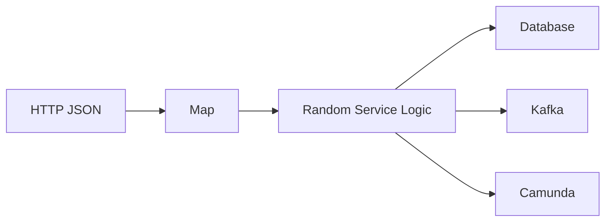
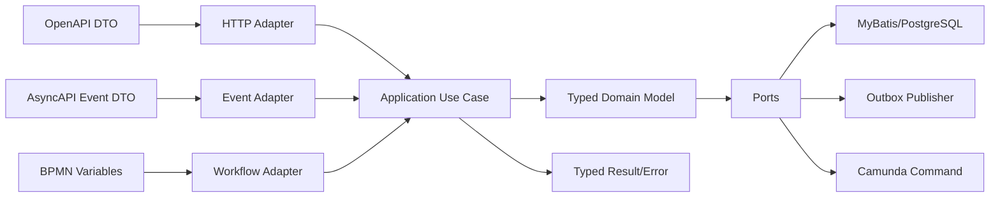
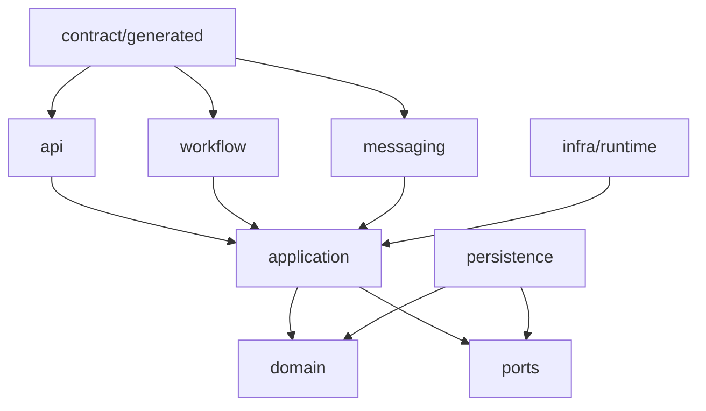
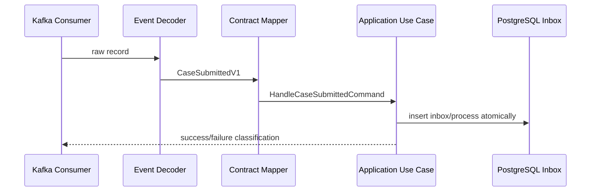
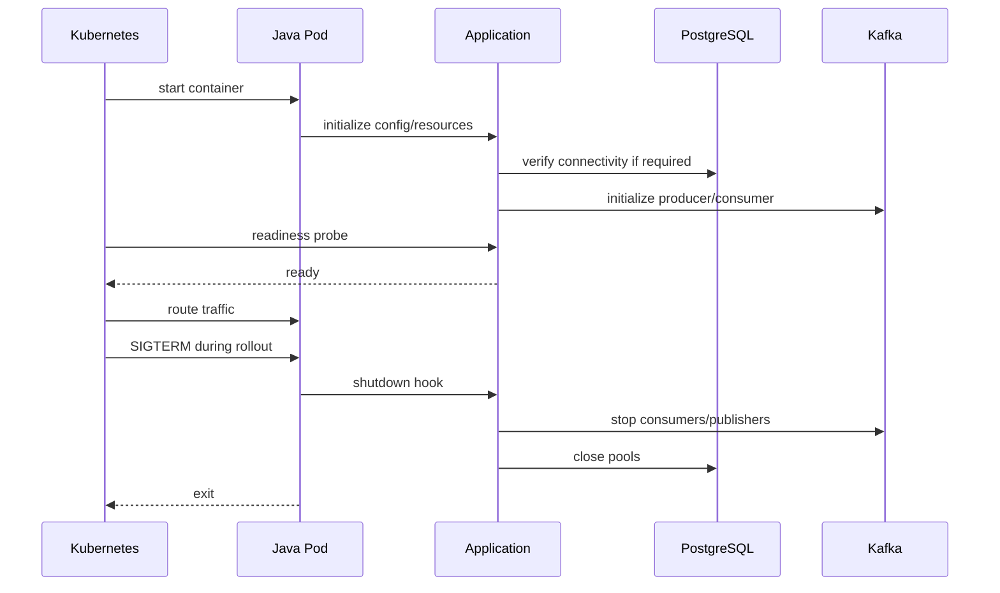
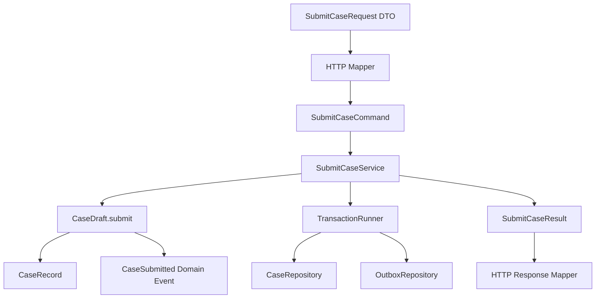

# Part 011 — Java 17+ Runtime Foundation

Java di seri ini bukan sekadar bahasa untuk menulis endpoint, delegate Camunda, Kafka consumer, atau mapper MyBatis.

Java adalah **runtime boundary** yang menghubungkan semua kontrak:

- OpenAPI contract masuk sebagai HTTP request/response;
- AsyncAPI contract masuk sebagai Kafka event;
- BPMN contract masuk sebagai process variable, command, task, timer, dan error;
- PostgreSQL contract masuk sebagai row, constraint, function, transaction, dan SQLSTATE;
- MyBatis contract masuk sebagai mapper method, parameter object, result object, dan transaction boundary;
- Kubernetes contract masuk sebagai process lifecycle: startup, readiness, shutdown, memory limit, CPU throttling, signal, dan restart.

Di sistem kecil, Java sering dipakai sebagai tempat menaruh logic.

Di sistem production-grade, Java harus dipakai sebagai tempat **memaksa invariant**.

Kalau invariant hanya hidup di dokumentasi, invariant itu akan dilanggar.
Kalau invariant hanya hidup di OpenAPI, internal code bisa tetap salah.
Kalau invariant hanya hidup di database constraint, error baru ketahuan terlalu terlambat.
Kalau invariant hanya hidup di BPMN, service lain tidak paham semantiknya.

Java 17+ memberi cukup alat untuk membuat model yang lebih eksplisit:

- `record` untuk data carrier yang immutable-by-shape;
- `sealed class` dan `sealed interface` untuk closed hierarchy;
- pattern matching untuk mengurangi cast dan membuat branch lebih aman;
- `java.time` untuk time semantics yang eksplisit;
- strong typing untuk value object domain;
- `CompletableFuture`, `ExecutorService`, dan concurrency primitives untuk boundary asynchronous;
- `Clock`, `Duration`, dan `Instant` untuk testable time;
- module/build discipline via Maven untuk mencegah dependency graph liar.

Part ini tidak mengulang syntax Java basic. Fokusnya adalah bagaimana Java 17+ dipakai sebagai fondasi runtime untuk sistem seperti ini:

```text
Regulatory Enforcement Case Platform
  HTTP API      -> Jersey resource
  Application   -> use case service
  Domain        -> invariant model
  Persistence   -> MyBatis + PostgreSQL
  Workflow      -> Camunda 7 delegate/process adapter
  Eventing      -> Kafka producer/consumer
  Runtime       -> Kubernetes-managed JVM process
```

---

## 1. Problem: Java Code yang “Jalan” Belum Tentu Punya Runtime Discipline

Aplikasi Java bisa terlihat sehat di demo:

```text
POST /cases
200 OK
case created
```

Tetapi di production, runtime-nya diuji oleh hal yang lebih keras:

- request datang dua kali karena retry client;
- Kafka consumer memproses event lama setelah schema berubah;
- Camunda job executor mengulang delegate yang separuh berhasil;
- database menolak write karena constraint violation;
- pod menerima SIGTERM ketika transaksi sedang berjalan;
- thread pool penuh karena downstream lambat;
- timestamp dari client ambigu;
- DTO berubah tapi BPMN variable lama masih hidup di process instance;
- enum Java berubah tapi row lama di PostgreSQL masih punya value lama;
- exception low-level bocor ke HTTP response;
- `null` menyebar dari mapper ke domain service.

Masalah seperti ini jarang selesai dengan menambah framework.

Masalah ini diselesaikan dengan **runtime model yang jelas**.

Runtime model menjawab:

1. Objek apa yang boleh melewati boundary?
2. Objek apa yang hanya boleh hidup di satu layer?
3. Error apa yang boleh dilempar?
4. Error apa yang harus dikonversi?
5. Siapa yang memiliki transaksi?
6. Siapa yang memiliki retry?
7. Siapa yang memiliki timeout?
8. Bagaimana JVM berhenti dengan aman?
9. Bagaimana code menolak state yang tidak valid sebelum masuk database?
10. Bagaimana model Java tetap kompatibel dengan kontrak HTTP, Kafka, BPMN, dan DB?

---

## 2. Target Mental Model

Gunakan Java sebagai **contract enforcement layer**.

Bukan seperti ini:



Tetapi seperti ini:



Aturan utamanya:

> Data dari luar tidak boleh langsung menjadi domain truth.

Data dari luar harus melewati:

1. parsing;
2. validation;
3. normalization;
4. semantic mapping;
5. domain construction;
6. invariant check;
7. application decision;
8. persistence/event/workflow side effect.

Java 17+ membantu membuat langkah-langkah ini eksplisit.

---

## 3. Baseline Java Version Strategy

Untuk seri ini, baseline aman adalah:

```text
Java source/release: 17
Production language level: Java 17 stable features
Optional extension: Java 21+ where explicitly marked
Avoid: Java preview features in production baseline
```

Kenapa Java 17?

- Java 17 adalah LTS yang banyak dipakai di enterprise runtime.
- Camunda 7, Jersey, Kafka client, PostgreSQL JDBC, dan MyBatis lazim berjalan di ekosistem Java enterprise yang konservatif.
- Fitur seperti records, sealed classes, dan pattern matching for `instanceof` sudah cukup untuk domain modeling yang kuat.

Kenapa tidak langsung Java 21+?

Boleh, tetapi jangan jadikan fitur baru sebagai syarat memahami seri ini.

Java 21+ memberi fitur bagus seperti virtual threads dan pattern matching for switch yang sudah lebih matang. Tetapi stack enterprise sering punya constraint:

- container base image belum seragam;
- security scanning policy belum mengizinkan versi tertentu;
- application server/library compatibility perlu diuji;
- profiling dan observability agent belum certified;
- performance baseline belum dibuat ulang.

Maka pendekatan seri ini:

```text
Java 17 = baseline produksi
Java 21+ = optimization/modernization track, bukan asumsi wajib
```

Di Maven, gunakan `release`, bukan hanya `source` dan `target`:

```xml
<properties>
    <maven.compiler.release>17</maven.compiler.release>
    <project.build.sourceEncoding>UTF-8</project.build.sourceEncoding>
</properties>
```

`release` membantu memastikan API JDK yang dipakai sesuai versi target, bukan hanya bytecode-nya.

---

## 4. Layering Java Runtime dalam Sistem Ini

Kita akan memakai layering berikut:

```text
contract/
  generated OpenAPI DTO
  generated AsyncAPI DTO

api/
  Jersey resource
  HTTP mapper
  ExceptionMapper

application/
  use case service
  command handler
  result/error mapping

domain/
  value object
  aggregate-ish model
  invariant
  domain error
  domain event model

workflow/
  Camunda delegate
  BPMN variable mapper
  process command adapter

messaging/
  Kafka consumer
  Kafka producer/outbox adapter
  event mapper

persistence/
  MyBatis mapper
  transaction manager
  repository implementation

runtime/
  configuration
  lifecycle
  health
  metrics
```

Dependency direction:



Yang harus dicegah:

```text
Domain depends on Jersey.
Domain depends on Kafka client.
Domain depends on Camunda engine API.
Domain depends on MyBatis annotation/XML concern.
Application service accepts generated DTO directly.
Generated OpenAPI model is stored as Camunda variable without mapping.
Kafka payload object is passed directly into repository.
```

Layer boundary bukan estetika. Boundary adalah cara membuat sistem tetap bisa berubah.

---

## 5. Domain Primitive: Jangan Biarkan String Menguasai Sistem

Kesalahan umum di sistem Java enterprise:

```java
public void escalate(String caseId, String reason, String actorId) {
    // ...
}
```

Ini terlihat sederhana, tetapi lemah.

Masalahnya:

- `caseId` bisa tertukar dengan `actorId`;
- `reason` bisa kosong;
- format ID tidak dipaksa;
- error baru muncul jauh di database atau process engine;
- log dan audit sulit dipercaya;
- method signature tidak mengandung semantik.

Gunakan domain primitive:

```java
public record CaseId(String value) {
    public CaseId {
        if (value == null || value.isBlank()) {
            throw new IllegalArgumentException("caseId must not be blank");
        }
        if (!value.matches("CASE-[0-9]{12}")) {
            throw new IllegalArgumentException("caseId has invalid format");
        }
    }

    @Override
    public String toString() {
        return value;
    }
}
```

Kemudian method menjadi:

```java
public void escalate(CaseId caseId, EscalationReason reason, ActorId actorId) {
    // ...
}
```

Ini bukan overengineering.

Di sistem regulatory enforcement, salah kirim actor id sebagai case id bisa menghasilkan audit trail palsu.

### 5.1 Domain Primitive yang Akan Dipakai

Minimal domain primitive untuk studi kasus:

```text
CaseId
PartyId
EvidenceId
TaskId
DecisionId
AppealId
CorrelationId
CausationId
RequestId
IdempotencyKey
ActorId
TenantId
ProcessInstanceId
KafkaMessageId
OutboxMessageId
InboxMessageId
```

Tidak semua harus punya class kompleks. Tetapi semua concept yang punya invariant harus punya type.

Contoh:

```java
public record CorrelationId(String value) {
    public CorrelationId {
        if (value == null || value.isBlank()) {
            throw new IllegalArgumentException("correlationId must not be blank");
        }
        if (value.length() > 128) {
            throw new IllegalArgumentException("correlationId is too long");
        }
    }
}
```

`CorrelationId` tidak hanya string. Ia adalah benang yang menghubungkan:

- HTTP request;
- application log;
- outbox row;
- Kafka event header;
- Camunda process variable;
- PostgreSQL audit row;
- tracing span;
- support ticket saat incident.

---

## 6. Record: Data Carrier yang Bernilai, Bukan Sekadar DTO Ringkas

Java `record` cocok untuk immutable data carrier.

Tetapi jangan salah: `record` bukan pengganti semua class.

Gunakan record untuk:

- command input ke use case;
- query parameter object;
- value object sederhana;
- domain event immutable;
- result object;
- internal snapshot;
- mapper result yang tidak butuh behavior kompleks.

Contoh command:

```java
public record SubmitCaseCommand(
        IdempotencyKey idempotencyKey,
        CorrelationId correlationId,
        ActorId submittedBy,
        CaseCategory category,
        List<SubmittedParty> parties,
        List<SubmittedEvidence> evidence,
        Instant submittedAt
) {
    public SubmitCaseCommand {
        if (idempotencyKey == null) throw new IllegalArgumentException("idempotencyKey is required");
        if (correlationId == null) throw new IllegalArgumentException("correlationId is required");
        if (submittedBy == null) throw new IllegalArgumentException("submittedBy is required");
        if (category == null) throw new IllegalArgumentException("category is required");
        if (submittedAt == null) throw new IllegalArgumentException("submittedAt is required");

        parties = List.copyOf(parties == null ? List.of() : parties);
        evidence = List.copyOf(evidence == null ? List.of() : evidence);

        if (parties.isEmpty()) {
            throw new IllegalArgumentException("at least one party is required");
        }
    }
}
```

Perhatikan dua hal:

1. Compact constructor dipakai untuk invariant.
2. Collection dibuat immutable copy.

Tanpa `List.copyOf`, record hanya membuat reference final, bukan isi list immutable.

Anti-pattern:

```java
public record SubmitCaseCommand(List<SubmittedParty> parties) {
}
```

Lalu caller bisa melakukan:

```java
var parties = new ArrayList<SubmittedParty>();
var command = new SubmitCaseCommand(parties);
parties.clear();
```

Record terlihat immutable, tetapi isinya bisa berubah.

### 6.1 Record untuk Generated DTO vs Domain Command

Jangan samakan DTO generated dari OpenAPI dengan domain command.

```text
OpenAPI DTO
  - milik transport contract
  - boleh mengikuti naming JSON
  - boleh punya optional field yang mengikuti schema evolution
  - tidak boleh menyimpan invariant domain penuh

Domain Command
  - milik application layer
  - field sudah normalized
  - punya type domain
  - punya invariant awal
  - tidak expose detail HTTP
```

Contoh mapping:

```java
public final class SubmitCaseHttpMapper {

    public SubmitCaseCommand toCommand(
            SubmitCaseRequest request,
            RequestHeaders headers,
            Clock clock
    ) {
        return new SubmitCaseCommand(
                new IdempotencyKey(headers.idempotencyKey()),
                new CorrelationId(headers.correlationId()),
                new ActorId(headers.actorId()),
                CaseCategory.fromApiValue(request.getCategory()),
                request.getParties().stream()
                        .map(this::toSubmittedParty)
                        .toList(),
                request.getEvidence().stream()
                        .map(this::toSubmittedEvidence)
                        .toList(),
                Instant.now(clock)
        );
    }
}
```

Generated DTO boleh berubah mengikuti kontrak API. Domain command harus stabil mengikuti semantic system.

---

## 7. Sealed Types: Tutup Hirarki yang Harus Tertutup

Banyak konsep domain di sistem case lifecycle bersifat closed set.

Contoh: hasil validasi intake.

```java
public sealed interface IntakeValidationResult
        permits IntakeValidationResult.Accepted,
                IntakeValidationResult.Rejected,
                IntakeValidationResult.NeedsManualReview {

    record Accepted(CaseId caseId) implements IntakeValidationResult {}

    record Rejected(List<ValidationFinding> findings) implements IntakeValidationResult {
        public Rejected {
            findings = List.copyOf(findings);
        }
    }

    record NeedsManualReview(CaseId caseId, ReviewReason reason) implements IntakeValidationResult {}
}
```

Keuntungannya:

- pembaca tahu semua kemungkinan hasil;
- compiler membantu menjaga exhaustive handling;
- error model lebih eksplisit;
- mapping ke HTTP/Kafka/BPMN bisa dibuat sebagai table keputusan;
- tidak ada subtype liar dari module lain.

### 7.1 Sealed Types untuk Domain Event

```java
public sealed interface CaseDomainEvent
        permits CaseSubmitted,
                CaseAccepted,
                CaseRejected,
                CaseEscalated,
                CaseDecisionRecorded {

    CaseId caseId();
    CorrelationId correlationId();
    Instant occurredAt();
}

public record CaseSubmitted(
        CaseId caseId,
        CorrelationId correlationId,
        ActorId submittedBy,
        Instant occurredAt
) implements CaseDomainEvent {}
```

Domain event hierarchy sebaiknya tertutup di domain module.

Kafka event contract boleh berbeda.

```text
Domain event != Kafka payload
```

Domain event adalah semantic fact internal.
Kafka payload adalah integration contract eksternal.

Mapping perlu eksplisit:

```java
public final class CaseEventContractMapper {
    public CaseSubmittedV1 toKafkaPayload(CaseSubmitted event) {
        return new CaseSubmittedV1(
                event.caseId().value(),
                event.correlationId().value(),
                event.submittedBy().value(),
                event.occurredAt().toString()
        );
    }
}
```

### 7.2 Sealed Types untuk Error

Error modeling akan dibahas mendalam di Part 012. Tetapi pondasinya ada di sini.

```java
public sealed interface CaseCommandError
        permits CaseCommandError.NotFound,
                CaseCommandError.InvalidState,
                CaseCommandError.DuplicateRequest,
                CaseCommandError.AuthorizationDenied,
                CaseCommandError.TransientDependencyFailure {

    ErrorCode code();
    String message();

    record NotFound(CaseId caseId) implements CaseCommandError {
        public ErrorCode code() { return ErrorCode.CASE_NOT_FOUND; }
        public String message() { return "case not found"; }
    }

    record InvalidState(CaseId caseId, CaseStatus currentStatus, String reason)
            implements CaseCommandError {
        public ErrorCode code() { return ErrorCode.CASE_INVALID_STATE; }
        public String message() { return reason; }
    }

    record DuplicateRequest(IdempotencyKey key, CaseId existingCaseId)
            implements CaseCommandError {
        public ErrorCode code() { return ErrorCode.DUPLICATE_REQUEST; }
        public String message() { return "duplicate idempotency key"; }
    }

    record AuthorizationDenied(ActorId actorId, String operation)
            implements CaseCommandError {
        public ErrorCode code() { return ErrorCode.AUTHORIZATION_DENIED; }
        public String message() { return "actor is not allowed to perform operation"; }
    }

    record TransientDependencyFailure(String dependency, String detail)
            implements CaseCommandError {
        public ErrorCode code() { return ErrorCode.TRANSIENT_DEPENDENCY_FAILURE; }
        public String message() { return detail; }
    }
}
```

Dengan sealed hierarchy, kita bisa memetakan error secara deterministik.

---

## 8. Pattern Matching: Gunakan untuk Boundary, Bukan untuk Menyembunyikan Desain Buruk

Java 17 punya pattern matching for `instanceof`.

```java
if (error instanceof CaseCommandError.InvalidState invalidState) {
    // invalidState sudah typed
}
```

Ini mengurangi cast manual.

Untuk Java 17 baseline, hati-hati dengan pattern matching for switch karena di Java 17 statusnya preview. Jangan jadikan preview feature sebagai baseline produksi kecuali organisasi memang punya governance untuk preview language features.

Jika runtime sudah Java 21+, mapping sealed type bisa lebih bersih dengan switch pattern.

Baseline Java 17 style:

```java
public HttpProblem toProblem(CaseCommandError error) {
    if (error instanceof CaseCommandError.NotFound notFound) {
        return notFound(notFound);
    }
    if (error instanceof CaseCommandError.InvalidState invalidState) {
        return conflict(invalidState);
    }
    if (error instanceof CaseCommandError.DuplicateRequest duplicate) {
        return duplicate(duplicate);
    }
    if (error instanceof CaseCommandError.AuthorizationDenied denied) {
        return forbidden(denied);
    }
    if (error instanceof CaseCommandError.TransientDependencyFailure transientFailure) {
        return serviceUnavailable(transientFailure);
    }
    throw new IllegalStateException("unmapped error type: " + error.getClass().getName());
}
```

Java 21+ style:

```java
public HttpProblem toProblem(CaseCommandError error) {
    return switch (error) {
        case CaseCommandError.NotFound notFound -> notFound(notFound);
        case CaseCommandError.InvalidState invalidState -> conflict(invalidState);
        case CaseCommandError.DuplicateRequest duplicate -> duplicate(duplicate);
        case CaseCommandError.AuthorizationDenied denied -> forbidden(denied);
        case CaseCommandError.TransientDependencyFailure transientFailure -> serviceUnavailable(transientFailure);
    };
}
```

Prinsipnya sama: semua varian harus dimapping.

Jangan gunakan pattern matching sebagai alasan membuat hierarchy raksasa yang tidak stabil.

---

## 9. Enum: Bagus untuk Closed Vocabulary, Buruk untuk Lifecycle yang Sering Berubah

Enum terlihat cocok untuk status.

```java
public enum CaseStatus {
    DRAFT,
    SUBMITTED,
    UNDER_REVIEW,
    INVESTIGATION,
    ESCALATED,
    DECIDED,
    CLOSED
}
```

Ini boleh, tetapi harus hati-hati.

Enum Java menjadi masalah jika:

- value lama masih ada di database tetapi sudah dihapus di code;
- Kafka event lama berisi enum yang consumer baru tidak kenal;
- BPMN process instance lama menyimpan variable string yang tidak bisa dimapping;
- OpenAPI enum terlalu cepat dipersempit;
- UI memakai enum sebagai workflow truth.

Gunakan aturan:

```text
Java enum boleh untuk vocabulary internal yang stabil.
Java enum tidak boleh menjadi satu-satunya source of truth untuk lifecycle multi-layer.
```

Untuk status yang cross-boundary, gunakan mapping eksplisit:

```java
public enum CaseStatus {
    SUBMITTED("SUBMITTED"),
    UNDER_ASSESSMENT("UNDER_ASSESSMENT"),
    INVESTIGATION_OPEN("INVESTIGATION_OPEN"),
    DECISION_PENDING("DECISION_PENDING"),
    CLOSED("CLOSED"),
    UNKNOWN("UNKNOWN");

    private final String wireValue;

    CaseStatus(String wireValue) {
        this.wireValue = wireValue;
    }

    public String wireValue() {
        return wireValue;
    }

    public static CaseStatus fromWireValue(String value) {
        for (CaseStatus status : values()) {
            if (status.wireValue.equals(value)) {
                return status;
            }
        }
        return UNKNOWN;
    }
}
```

Untuk internal invariant tertentu, `UNKNOWN` mungkin tidak boleh masuk domain. Tetapi di adapter Kafka/HTTP lama, `UNKNOWN` bisa dipakai untuk menolak secara terkendali, bukan crash liar.

---

## 10. Time Semantics: Waktu Harus Punya Arti

Jangan gunakan `Date` atau string timestamp sebagai default domain time.

Gunakan:

```text
Instant       -> titik waktu absolut untuk audit/event/storage
LocalDate     -> tanggal kalender tanpa waktu, misalnya due date legal
OffsetDateTime -> boundary API jika offset perlu diekspose
Duration      -> durasi SLA/retry/timeout
Clock         -> sumber waktu injectable untuk test
```

Contoh:

```java
public record CaseSubmissionTime(Instant value) {
    public CaseSubmissionTime {
        if (value == null) {
            throw new IllegalArgumentException("submission time is required");
        }
    }
}
```

Application service jangan memanggil `Instant.now()` langsung di banyak tempat.

Gunakan `Clock`:

```java
public final class SubmitCaseService {
    private final Clock clock;

    public SubmitCaseService(Clock clock) {
        this.clock = clock;
    }

    public SubmitCaseResult submit(SubmitCaseCommand command) {
        Instant now = Instant.now(clock);
        // ...
    }
}
```

Keuntungannya:

- test deterministic;
- audit event bisa punya timestamp konsisten;
- retry tidak menghasilkan waktu liar;
- SLA calculation bisa diuji;
- daylight saving/timezone bug lebih terkendali.

### 10.1 Time Ownership

Tentukan siapa yang boleh membuat waktu:

| Waktu | Owner | Tipe | Catatan |
|---|---|---|---|
| Request received time | API runtime | `Instant` | dibuat saat request diterima |
| Case submitted time | application service | `Instant` | bukan dari client kecuali kontrak mengizinkan |
| Evidence occurrence date | client/domain | `LocalDate` atau `OffsetDateTime` | tergantung makna hukum |
| SLA due date | domain/policy service | `Instant` atau `LocalDate` | harus jelas calendar vs absolute time |
| Event occurred time | domain/application | `Instant` | fakta bisnis terjadi kapan |
| Kafka published time | messaging adapter | `Instant` | side effect publikasi |
| Audit recorded time | database/application | `Instant` | kapan dicatat |

Kesalahan umum:

```text
Client mengirim submittedAt dan server menerimanya sebagai audit truth.
```

Untuk sistem regulasi, waktu audit harus dikendalikan server.

---

## 11. Null Discipline

Java masih punya `null`. Production code harus punya aturan.

Aturan seri ini:

```text
Boundary boleh menerima null karena input eksternal kotor.
Domain object tidak boleh menyimpan null untuk field wajib.
Application service tidak boleh memakai null sebagai control flow.
Repository tidak boleh mengembalikan null untuk not found.
Mapper boleh melihat null dari database, tetapi harus normalize sebelum masuk domain.
```

Gunakan `Optional` untuk return yang memang optional:

```java
public interface CaseRepository {
    Optional<CaseRecord> findById(CaseId caseId);
}
```

Jangan gunakan `Optional` untuk field record yang akan diserialisasi:

```java
// Hindari untuk DTO/record field.
public record CaseSummary(Optional<String> decisionReason) {}
```

Lebih baik:

```java
public record CaseSummary(String decisionReason) {
    public boolean hasDecisionReason() {
        return decisionReason != null && !decisionReason.isBlank();
    }
}
```

Atau buat model yang eksplisit:

```java
public sealed interface DecisionExplanation
        permits DecisionExplanation.Absent, DecisionExplanation.Present {

    record Absent() implements DecisionExplanation {}
    record Present(String value) implements DecisionExplanation {
        public Present {
            if (value == null || value.isBlank()) {
                throw new IllegalArgumentException("decision explanation must not be blank");
            }
        }
    }
}
```

---

## 12. Collection Discipline

Collection adalah sumber bug besar di Java enterprise.

Aturan:

```text
Incoming mutable collection -> copy
Domain collection -> immutable view/copy
Repository batch input -> copy before use if reused asynchronously
Generated DTO list -> do not expose to domain directly
```

Contoh:

```java
public record EvidenceBundle(List<EvidenceItem> items) {
    public EvidenceBundle {
        items = List.copyOf(items == null ? List.of() : items);
        if (items.isEmpty()) {
            throw new IllegalArgumentException("evidence bundle must not be empty");
        }
    }
}
```

Jangan simpan reference mutable dari request DTO.

---

## 13. Domain Service vs Application Service

Bedakan dua hal ini.

Application service:

- menerima command;
- membuka transaction boundary;
- memanggil repository;
- memanggil domain logic;
- menulis outbox;
- mengembalikan result;
- tidak menyimpan state internal;
- tahu orchestration teknis secukupnya.

Domain service/model:

- mengekspresikan aturan bisnis;
- tidak tahu HTTP/Kafka/Camunda/MyBatis;
- tidak tahu transaction manager;
- tidak tahu logging framework;
- tidak mengirim event ke broker;
- boleh menghasilkan domain event sebagai data.

Contoh application service:

```java
public final class SubmitCaseService {
    private final CaseRepository caseRepository;
    private final IdempotencyRepository idempotencyRepository;
    private final OutboxRepository outboxRepository;
    private final TransactionRunner transactionRunner;
    private final Clock clock;

    public SubmitCaseResult submit(SubmitCaseCommand command) {
        return transactionRunner.inTransaction(() -> {
            Optional<IdempotencyRecord> existing =
                    idempotencyRepository.findCompleted(command.idempotencyKey());

            if (existing.isPresent()) {
                return SubmitCaseResult.duplicate(existing.get().caseId());
            }

            CaseDraft draft = CaseDraft.from(command);
            CaseSubmission submission = draft.submit(Instant.now(clock));

            caseRepository.insert(submission.caseRecord());
            outboxRepository.appendAll(submission.domainEvents());
            idempotencyRepository.markCompleted(command.idempotencyKey(), submission.caseId());

            return SubmitCaseResult.accepted(submission.caseId());
        });
    }
}
```

Domain logic menghasilkan keputusan, bukan side effect langsung.

---

## 14. Transaction Boundary di Java

Dalam sistem ini, transaksi database sebaiknya dimiliki application service atau explicit transaction runner, bukan random repository.

Buruk:

```java
repository.insertCase(caseRecord);      // transaction A
repository.insertAudit(auditRecord);    // transaction B
repository.insertOutbox(eventRecord);   // transaction C
```

Baik:

```java
transactionRunner.inTransaction(() -> {
    repository.insertCase(caseRecord);
    auditRepository.append(auditRecord);
    outboxRepository.append(eventRecord);
    return result;
});
```

Alasannya:

- case write, audit write, dan outbox write harus atomic;
- retry application harus jelas;
- error mapping lebih mudah;
- deadlock handling bisa distandardisasi;
- observability bisa mencatat transaction duration.

Interface sederhana:

```java
public interface TransactionRunner {
    <T> T inTransaction(TransactionCallback<T> callback);
}

@FunctionalInterface
public interface TransactionCallback<T> {
    T execute();
}
```

Implementasi bisa memakai JDBC transaction, MyBatis `SqlSession`, atau framework DI yang dipilih.

Yang penting: domain tidak tahu.

---

## 15. Checked Exception vs Runtime Exception

Java punya checked exception, tetapi production architecture harus punya policy.

Aturan praktis:

```text
Domain/application expected failure -> typed result/error.
Infrastructure unexpected failure -> exception, lalu diterjemahkan di boundary.
Programming bug -> unchecked exception, crash/incident, jangan disamarkan.
```

Contoh expected failure:

```text
case not found
invalid state transition
duplicate idempotency key
authorization denied
validation rejected
```

Ini bukan exception teknis. Ini hasil bisnis/aplikasi.

Contoh infrastructure failure:

```text
database connection timeout
Kafka producer timeout
Camunda engine command failed
SQL deadlock
serialization failure
```

Ini boleh muncul sebagai exception di infrastructure, tetapi harus diklasifikasi sebelum keluar boundary.

Jangan jadikan semua hal exception:

```java
throw new RuntimeException("case not found");
```

Itu membuat control flow, observability, retry, dan HTTP mapping kacau.

---

## 16. Result Type Sederhana untuk Java 17

Java tidak punya built-in `Result<T, E>` seperti beberapa bahasa lain.

Kita bisa membuat sealed type sederhana.

```java
public sealed interface AppResult<T, E>
        permits AppResult.Success, AppResult.Failure {

    record Success<T, E>(T value) implements AppResult<T, E> {}
    record Failure<T, E>(E error) implements AppResult<T, E> {}

    static <T, E> AppResult<T, E> success(T value) {
        return new Success<>(value);
    }

    static <T, E> AppResult<T, E> failure(E error) {
        return new Failure<>(error);
    }
}
```

Pemakaian:

```java
public AppResult<SubmitCaseSuccess, SubmitCaseError> submit(SubmitCaseCommand command) {
    // ...
}
```

Tetapi jangan overuse.

Untuk use case penting, sering lebih jelas membuat result spesifik:

```java
public sealed interface SubmitCaseResult
        permits SubmitCaseResult.Accepted,
                SubmitCaseResult.Duplicate,
                SubmitCaseResult.Rejected,
                SubmitCaseResult.Failed {

    record Accepted(CaseId caseId) implements SubmitCaseResult {}
    record Duplicate(CaseId existingCaseId) implements SubmitCaseResult {}
    record Rejected(List<ValidationFinding> findings) implements SubmitCaseResult {
        public Rejected {
            findings = List.copyOf(findings);
        }
    }
    record Failed(SubmitCaseError error) implements SubmitCaseResult {}

    static Accepted accepted(CaseId caseId) {
        return new Accepted(caseId);
    }

    static Duplicate duplicate(CaseId existingCaseId) {
        return new Duplicate(existingCaseId);
    }
}
```

Use-case-specific result lebih verbose, tetapi lebih jelas.

---

## 17. Serialization Boundary

Serialization tidak boleh mengendalikan domain model.

Anti-pattern:

```java
public class Case {
    @JsonProperty("case_id")
    private String caseId;

    @Column("case_status")
    private String status;

    @XmlElement
    private String legacyField;
}
```

Class yang sama dipakai untuk:

- JSON API;
- DB row;
- domain model;
- Kafka payload;
- Camunda variable.

Ini terlihat hemat, tapi membuat perubahan kecil menjadi ledakan lintas layer.

Gunakan model berbeda:

```text
SubmitCaseRequest        -> HTTP DTO
SubmitCaseCommand        -> application command
CaseRecord               -> persistence row object
CaseAggregate/Snapshot   -> domain model
CaseSubmittedV1          -> Kafka payload
CaseProcessVariables     -> BPMN variable object
```

Mapping eksplisit memang lebih banyak code.

Tetapi mapping eksplisit adalah tempat semantic conversion terjadi.

---

## 18. Camunda Variable Boundary

Camunda 7 menyimpan process variables. Jangan masukkan object domain sembarangan sebagai serialized Java object.

Lebih aman:

```text
BPMN variables as stable primitives/string/JSON contract
Domain model remains outside process engine serialization
```

Contoh variable object:

```java
public record CaseProcessVariables(
        String caseId,
        String correlationId,
        String caseCategory,
        String currentPhase,
        String submittedBy,
        String slaDueAt
) {
    public Map<String, Object> toVariableMap() {
        return Map.of(
                "caseId", caseId,
                "correlationId", correlationId,
                "caseCategory", caseCategory,
                "currentPhase", currentPhase,
                "submittedBy", submittedBy,
                "slaDueAt", slaDueAt
        );
    }
}
```

Jangan:

```java
runtimeService.startProcessInstanceByKey(
        "case_enforcement",
        caseDomainObjectAsVariableMap
);
```

Risikonya:

- serialized class berubah;
- package rename merusak process instance lama;
- classloader issue;
- migration sulit;
- process variable menjadi tempat domain truth palsu.

---

## 19. Kafka Boundary

Kafka consumer tidak boleh langsung memanggil domain service dengan generated payload tanpa validasi.

Flow yang benar:



Generated event DTO adalah wire contract.

Application command adalah semantic instruction.

Contoh:

```java
public final class CaseSubmittedConsumerHandler {
    private final CaseSubmittedEventMapper mapper;
    private final HandleCaseSubmittedService service;

    public ConsumerHandlingResult handle(KafkaRecord<CaseSubmittedV1> record) {
        HandleCaseSubmittedCommand command = mapper.toCommand(record);
        return service.handle(command);
    }
}
```

Kafka client errors jangan bocor ke domain.

---

## 20. Jersey/JAX-RS Boundary

Jersey resource harus tipis.

Resource bukan tempat business logic.

```java
@Path("/cases")
public final class CaseResource {
    private final SubmitCaseHttpMapper mapper;
    private final SubmitCaseService service;
    private final SubmitCaseResponseMapper responseMapper;

    @POST
    @Consumes(MediaType.APPLICATION_JSON)
    @Produces(MediaType.APPLICATION_JSON)
    public Response submitCase(
            @Context HttpHeaders headers,
            SubmitCaseRequest request
    ) {
        SubmitCaseCommand command = mapper.toCommand(request, RequestHeaders.from(headers));
        SubmitCaseResult result = service.submit(command);
        return responseMapper.toResponse(result);
    }
}
```

Resource melakukan:

- extract headers;
- call mapper;
- call use case;
- map result to response.

Resource tidak melakukan:

- SQL;
- Kafka publish langsung;
- Camunda command langsung;
- business decision;
- long-running retry;
- manual JSON string building.

---

## 21. Threading Model dalam Sistem Ini

Ada beberapa sumber eksekusi:

```text
HTTP request thread
Camunda job executor thread
Kafka consumer thread
Outbox publisher thread
Scheduled maintenance thread
Kubernetes lifecycle/shutdown hook
```

Jangan campur semua dengan satu mental model.

### 21.1 HTTP Thread

HTTP request harus cepat dan bounded.

Cocok untuk:

- validate input;
- execute short transaction;
- enqueue work;
- start/correlate process;
- return accepted/created/result.

Tidak cocok untuk:

- menunggu human task;
- polling downstream lama;
- blocking sampai Kafka consumer lain selesai;
- menjalankan batch backfill.

### 21.2 Camunda Job Executor Thread

Camunda job executor akan melakukan retry berdasarkan job configuration. Delegate harus idempotent atau aman diulang.

Delegate tidak boleh mengasumsikan:

```text
satu delegate execution = satu efek bisnis pasti sekali
```

Yang benar:

```text
satu delegate execution = attempt yang bisa gagal, diulang, atau menjadi incident
```

### 21.3 Kafka Consumer Thread

Kafka consumer thread perlu mempertimbangkan:

- offset commit;
- retry;
- idempotency;
- partition ordering;
- poison message;
- shutdown.

Consumer handler harus bisa mengklasifikasi error:

```text
success -> commit
retryable failure -> retry/backoff
non-retryable contract failure -> DLQ/quarantine + commit
fatal infrastructure failure -> stop/rebalance according to policy
```

### 21.4 Outbox Publisher Thread

Outbox publisher membaca row pending dan publish ke Kafka.

Ia harus:

- memakai batch size;
- memakai lock discipline;
- punya retry limit;
- tidak memblokir write path utama;
- punya metric lag;
- aman saat pod restart.

---

## 22. ExecutorService Discipline

Jangan membuat thread pool sembarangan.

Buruk:

```java
Executors.newCachedThreadPool().submit(() -> sendKafkaEvent(event));
```

Masalah:

- thread tidak bounded;
- lifecycle tidak jelas;
- shutdown tidak jelas;
- error hilang;
- backpressure tidak ada;
- observability buruk.

Lebih baik:

```java
public final class RuntimeExecutors implements AutoCloseable {
    private final ExecutorService outboxExecutor;

    public RuntimeExecutors() {
        this.outboxExecutor = Executors.newFixedThreadPool(
                4,
                runnable -> {
                    Thread thread = new Thread(runnable);
                    thread.setName("outbox-publisher-" + thread.threadId());
                    thread.setDaemon(false);
                    return thread;
                }
        );
    }

    public ExecutorService outboxExecutor() {
        return outboxExecutor;
    }

    @Override
    public void close() {
        outboxExecutor.shutdown();
    }
}
```

Tetapi di production, pertimbangkan thread factory yang mencatat uncaught exception dan integrasi metrics.

### 22.1 Bounded Queue

`newFixedThreadPool` memakai unbounded queue secara default melalui factory `Executors`. Untuk workload yang bisa meledak, gunakan `ThreadPoolExecutor` eksplisit.

```java
public static ExecutorService boundedExecutor(
        int poolSize,
        int queueCapacity,
        String namePrefix
) {
    AtomicInteger sequence = new AtomicInteger();

    return new ThreadPoolExecutor(
            poolSize,
            poolSize,
            0L,
            TimeUnit.MILLISECONDS,
            new ArrayBlockingQueue<>(queueCapacity),
            runnable -> {
                Thread thread = new Thread(runnable);
                thread.setName(namePrefix + "-" + sequence.incrementAndGet());
                return thread;
            },
            new ThreadPoolExecutor.CallerRunsPolicy()
    );
}
```

`CallerRunsPolicy` memberi backpressure sederhana. Tetapi policy harus dipilih sesuai workload.

---

## 23. Interruption, Timeout, dan Cancellation

Java production code harus menghormati interruption.

Buruk:

```java
try {
    Thread.sleep(1000);
} catch (InterruptedException ignored) {
}
```

Baik:

```java
try {
    Thread.sleep(1000);
} catch (InterruptedException interrupted) {
    Thread.currentThread().interrupt();
    throw new RuntimeException("interrupted while waiting", interrupted);
}
```

Kenapa penting?

Saat Kubernetes mengirim SIGTERM, aplikasi perlu berhenti.

Kalau thread mengabaikan interruption:

- graceful shutdown gagal;
- pod dibunuh paksa;
- transaksi bisa terputus;
- Kafka offset state bisa kacau;
- outbox publisher bisa meninggalkan lock lebih lama dari perlu.

Timeout harus eksplisit:

```java
public record RuntimeTimeouts(
        Duration databaseQueryTimeout,
        Duration kafkaSendTimeout,
        Duration camundaCommandTimeout,
        Duration externalHttpTimeout
) {
    public RuntimeTimeouts {
        requirePositive(databaseQueryTimeout, "databaseQueryTimeout");
        requirePositive(kafkaSendTimeout, "kafkaSendTimeout");
        requirePositive(camundaCommandTimeout, "camundaCommandTimeout");
        requirePositive(externalHttpTimeout, "externalHttpTimeout");
    }

    private static void requirePositive(Duration duration, String name) {
        if (duration == null || duration.isZero() || duration.isNegative()) {
            throw new IllegalArgumentException(name + " must be positive");
        }
    }
}
```

Jangan biarkan timeout tersebar sebagai angka literal.

---

## 24. JVM Lifecycle di Kubernetes

Java process di Kubernetes harus memahami lifecycle.

Urutan penting:



Java app harus punya:

- startup validation;
- readiness state;
- liveness endpoint;
- graceful shutdown;
- resource close order;
- bounded stop duration.

### 24.1 Readiness vs Liveness

Liveness:

```text
Apakah process masih hidup atau deadlocked parah?
```

Readiness:

```text
Apakah process boleh menerima traffic sekarang?
```

Jangan jadikan liveness bergantung ke database secara agresif. Jika DB down sementara lalu semua pod restart, recovery bisa makin buruk.

Readiness boleh lebih sensitif.

---

## 25. Configuration sebagai Runtime Contract

Konfigurasi adalah kontrak antara deployment environment dan aplikasi.

Jangan baca environment variable acak di banyak tempat.

Buruk:

```java
String topic = System.getenv("CASE_TOPIC");
```

Baik:

```java
public record KafkaRuntimeConfig(
        String bootstrapServers,
        String caseEventTopic,
        String consumerGroupId,
        Duration sendTimeout
) {
    public KafkaRuntimeConfig {
        requireNonBlank(bootstrapServers, "bootstrapServers");
        requireNonBlank(caseEventTopic, "caseEventTopic");
        requireNonBlank(consumerGroupId, "consumerGroupId");
        if (sendTimeout == null || sendTimeout.isNegative() || sendTimeout.isZero()) {
            throw new IllegalArgumentException("sendTimeout must be positive");
        }
    }

    private static void requireNonBlank(String value, String name) {
        if (value == null || value.isBlank()) {
            throw new IllegalArgumentException(name + " must not be blank");
        }
    }
}
```

Lalu satu loader:

```java
public final class EnvironmentConfigLoader {
    public KafkaRuntimeConfig kafka() {
        return new KafkaRuntimeConfig(
                required("KAFKA_BOOTSTRAP_SERVERS"),
                required("KAFKA_CASE_EVENT_TOPIC"),
                required("KAFKA_CONSUMER_GROUP_ID"),
                duration("KAFKA_SEND_TIMEOUT", Duration.ofSeconds(10))
        );
    }
}
```

Konfigurasi yang invalid harus membuat aplikasi gagal startup, bukan gagal di tengah request pertama.

---

## 26. Logging Context

Java code harus membawa context tanpa mencemari domain.

Minimal context:

```text
correlationId
requestId
actorId
tenantId
caseId
processInstanceId
kafkaTopic
kafkaPartition
kafkaOffset
outboxMessageId
```

Jangan pass semua context sebagai `Map<String, String>` ke domain.

Buat context object untuk application boundary:

```java
public record OperationContext(
        CorrelationId correlationId,
        RequestId requestId,
        ActorId actorId,
        TenantId tenantId
) {
    public OperationContext {
        if (correlationId == null) throw new IllegalArgumentException("correlationId is required");
        if (requestId == null) throw new IllegalArgumentException("requestId is required");
        if (actorId == null) throw new IllegalArgumentException("actorId is required");
        if (tenantId == null) throw new IllegalArgumentException("tenantId is required");
    }
}
```

Domain logic boleh menerima `ActorId` jika memang bagian dari aturan domain. Tetapi logging infrastructure tidak boleh masuk domain.

---

## 27. Memory dan Object Allocation

Java production code tidak boleh hanya benar secara fungsional. Ia juga harus sadar memory.

Area rawan:

- membaca result set besar ke memory;
- menyimpan semua event outbox dalam list besar;
- membuat string JSON berkali-kali;
- logging payload besar;
- menyimpan BPMN variable besar;
- menyimpan evidence document sebagai byte array di heap;
- unbounded queue;
- cache tanpa eviction.

Aturan praktis:

```text
Data besar harus streaming atau paginated.
Payload besar jangan masuk log.
BPMN variable harus kecil dan stabil.
Evidence binary jangan disimpan di Camunda variable.
Queue harus bounded.
Batch size harus eksplisit.
```

Contoh batch config:

```java
public record OutboxPublisherConfig(
        int batchSize,
        Duration pollInterval,
        int maxAttempts
) {
    public OutboxPublisherConfig {
        if (batchSize < 1 || batchSize > 1000) {
            throw new IllegalArgumentException("batchSize must be between 1 and 1000");
        }
        if (pollInterval == null || pollInterval.isNegative() || pollInterval.isZero()) {
            throw new IllegalArgumentException("pollInterval must be positive");
        }
        if (maxAttempts < 1) {
            throw new IllegalArgumentException("maxAttempts must be positive");
        }
    }
}
```

---

## 28. Classpath, Module Path, dan Maven Reality

Java 17 punya module system, tetapi banyak enterprise application masih berjalan di classpath.

Untuk seri ini:

```text
Maven module != Java Platform Module System module
```

Kita memakai Maven module sebagai boundary build dan ownership.

Kita tidak memaksa JPMS karena:

- banyak library enterprise historis lebih classpath-oriented;
- generated code dan framework reflection bisa menambah kompleksitas;
- target utama adalah production architecture, bukan modular Java language deep dive.

Tetapi tetap pakai package discipline:

```text
com.example.caseplatform.domain
com.example.caseplatform.application
com.example.caseplatform.api
com.example.caseplatform.persistence
com.example.caseplatform.workflow
com.example.caseplatform.messaging
```

Dan enforce dependency direction via Maven.

---

## 29. Reflection dan Framework Magic

Jersey, JSON serializer, MyBatis, dan Camunda bisa memakai reflection.

Reflection bukan musuh, tetapi harus dikurung di adapter layer.

Aturan:

```text
Framework-friendly objects live near framework boundary.
Domain model does not bend itself for framework reflection.
```

Jika JSON serializer butuh no-args constructor, jangan rusak domain object. Buat DTO khusus.

Jika MyBatis butuh setter/result map, jangan jadikan domain aggregate mutable. Buat persistence row object.

Jika Camunda butuh variable map, jangan simpan aggregate sebagai Java serialized object. Buat variable contract.

---

## 30. Testing Runtime Foundation

Unit test untuk domain primitive:

```java
@Test
void caseIdRejectsBlankValue() {
    assertThrows(IllegalArgumentException.class, () -> new CaseId(" "));
}
```

Test untuk collection immutability:

```java
@Test
void commandCopiesParties() {
    var parties = new ArrayList<SubmittedParty>();
    parties.add(validParty());

    var command = new SubmitCaseCommand(
            validIdempotencyKey(),
            validCorrelationId(),
            validActorId(),
            CaseCategory.MARKET_ABUSE,
            parties,
            List.of(validEvidence()),
            Instant.parse("2026-07-02T00:00:00Z")
    );

    parties.clear();

    assertEquals(1, command.parties().size());
}
```

Test untuk deterministic time:

```java
@Test
void submissionUsesInjectedClock() {
    Clock fixed = Clock.fixed(
            Instant.parse("2026-07-02T10:15:30Z"),
            ZoneOffset.UTC
    );

    var service = new SubmitCaseService(..., fixed);

    var result = service.submit(validCommand());

    assertEquals(Instant.parse("2026-07-02T10:15:30Z"), result.submittedAt());
}
```

---

## 31. Anti-Pattern Catalogue

### 31.1 One Model for Everything

```text
One Case class used for API, DB, Kafka, BPMN, and domain.
```

Akibat:

- field transport bocor ke domain;
- database change memecahkan API;
- Kafka compatibility menjadi tidak terkendali;
- Camunda instance lama rentan class change;
- test sulit difokuskan.

### 31.2 Stringly Typed Domain

```text
caseId, actorId, taskId all as String.
```

Akibat:

- parameter tertukar;
- invariant terlambat;
- log/audit sulit dipercaya.

### 31.3 Exception as Business Flow

```text
throw RuntimeException for not found, duplicate, invalid state.
```

Akibat:

- HTTP 500 palsu;
- retry salah;
- incident noise;
- user mendapat error teknis untuk kondisi bisnis.

### 31.4 Preview Feature as Production Baseline

```text
Java 17 preview switch pattern used everywhere.
```

Akibat:

- compiler/runtime flag khusus;
- build portability turun;
- upgrade path riskier.

### 31.5 Ignoring Shutdown

```text
Kafka consumer and outbox publisher keep running until container is killed.
```

Akibat:

- duplicate processing;
- partial publish;
- noisy rebalance;
- longer rollout.

### 31.6 Mutable Record Payload

```text
record contains mutable List without copying.
```

Akibat:

- object terlihat immutable tapi berubah diam-diam.

---

## 32. Production Checklist

Sebelum Java runtime foundation dianggap siap:

- [ ] Java version baseline jelas: 17 atau 21+.
- [ ] Maven compiler memakai `release`.
- [ ] Generated DTO tidak masuk domain/application sebagai truth.
- [ ] Domain primitive dibuat untuk identifier penting.
- [ ] Records melakukan validation dan defensive copy.
- [ ] Sealed hierarchy dipakai untuk result/error/event yang closed set.
- [ ] Time source memakai `Clock`.
- [ ] Timestamp semantics dibedakan: client time, server time, audit time, event time.
- [ ] Null policy jelas di tiap layer.
- [ ] Transaction boundary dimiliki application service/transaction runner.
- [ ] Expected business/application failure tidak dilempar sebagai generic runtime exception.
- [ ] Framework reflection dikurung di adapter layer.
- [ ] Camunda variable contract tidak menyimpan domain object serialized sembarangan.
- [ ] Kafka payload tidak dipakai langsung sebagai domain command.
- [ ] Thread pools bounded dan punya shutdown.
- [ ] Timeout config eksplisit.
- [ ] Readiness/liveness semantics jelas.
- [ ] Payload besar tidak masuk log, BPMN variable, atau memory batch tanpa batas.

---

## 33. Mini Capstone: Runtime Foundation untuk Submit Case

Target design:



Key Java types:

```text
CaseId
IdempotencyKey
CorrelationId
ActorId
SubmitCaseCommand
SubmitCaseResult
SubmitCaseError
CaseDraft
CaseSubmission
CaseRecord
CaseDomainEvent
CaseSubmitted
TransactionRunner
Clock
```

Yang sengaja tidak ada:

```text
Map<String,Object> sebagai domain command
String caseStatus tersebar
RuntimeException untuk duplicate request
Instant.now() langsung di domain
KafkaProducer dipanggil dari domain
Camunda RuntimeService dipanggil dari resource
```

Itulah inti Java runtime foundation: bukan fitur, tetapi discipline.

---

## 34. Referensi Primer

- Oracle Java SE 17 Language Guide — Records: https://docs.oracle.com/en/java/javase/17/language/records.html
- Oracle Java SE 17 Language Guide — Sealed Classes and Interfaces: https://docs.oracle.com/en/java/javase/17/language/sealed-classes-and-interfaces.html
- Oracle Java SE 17 Language Guide — Pattern Matching for `instanceof`: https://docs.oracle.com/en/java/javase/17/language/pattern-matching-instanceof.html
- Maven Compiler Plugin — `release`: https://maven.apache.org/plugins/maven-compiler-plugin/examples/set-compiler-release.html
- Jakarta RESTful Web Services Specification: https://jakarta.ee/specifications/restful-ws/
- Camunda 7 Documentation: https://docs.camunda.org/manual/
- Apache Kafka Documentation: https://kafka.apache.org/documentation/
- PostgreSQL Documentation: https://www.postgresql.org/docs/current/

---

## 35. Ringkasan

Java 17+ di sistem ini harus dipakai untuk menjaga struktur, bukan hanya menjalankan kode.

Inti part ini:

1. Gunakan Java 17 sebagai baseline stabil.
2. Pisahkan DTO, command, domain model, persistence record, Kafka payload, dan BPMN variable.
3. Gunakan domain primitive untuk konsep penting.
4. Gunakan record dengan validation dan defensive copy.
5. Gunakan sealed type untuk result, error, dan event yang closed set.
6. Gunakan `Clock`, `Instant`, `Duration`, dan time semantics eksplisit.
7. Buat null, collection, exception, transaction, dan thread policy yang jelas.
8. Kurung framework magic di adapter layer.
9. Perlakukan Kubernetes lifecycle sebagai bagian dari desain Java runtime.

Part berikutnya akan memperdalam satu area yang paling menentukan kualitas sistem: **Error Modeling and Result Types**.
