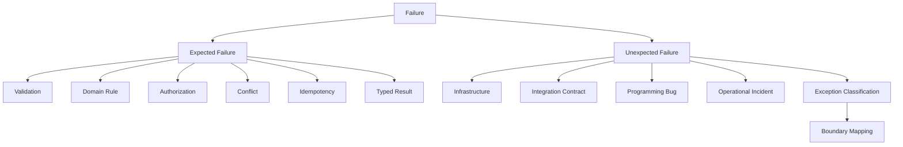
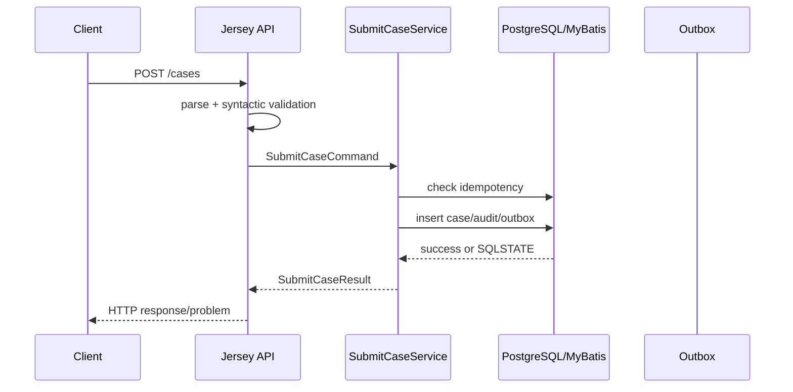
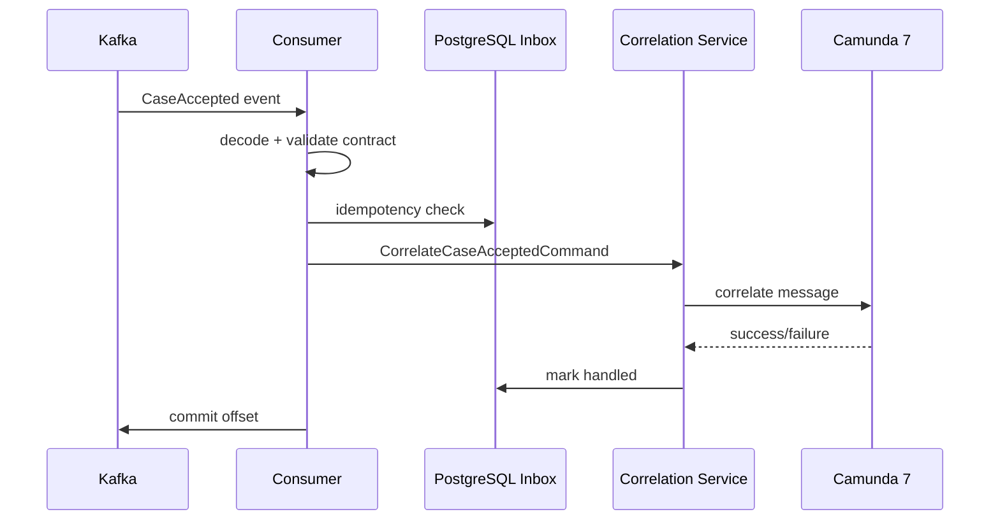
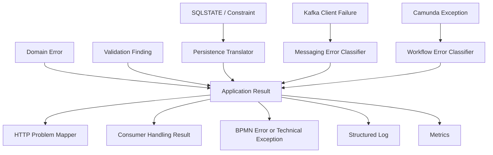

# Part 012 — Error Modeling and Result Types

Error handling adalah tempat arsitektur production-grade sering terbongkar.

Sistem bisa punya OpenAPI rapi, BPMN indah, Kafka topic jelas, PostgreSQL schema kuat, dan Kubernetes deployment lengkap. Tetapi kalau error model buruk, sistem tetap sulit dioperasikan.

Gejala error model buruk:

```text
Semua error menjadi HTTP 500.
Duplicate request terlihat seperti database failure.
Validation error tidak bisa dibedakan dari authorization error.
Camunda BPMN business rejection menjadi technical incident.
Kafka consumer retry selamanya untuk payload yang memang invalid.
PostgreSQL constraint violation bocor sebagai stack trace.
MyBatis exception langsung dikirim ke client.
Outbox publish failure dianggap business failure.
Dashboard error count naik tetapi tidak menjelaskan apa yang harus dilakukan.
```

Error model production-grade harus menjawab tiga pertanyaan:

1. **Apa yang salah?**
2. **Siapa yang harus bertindak?**
3. **Apakah aman untuk retry?**

Di sistem regulatory enforcement, error bukan hanya masalah teknis. Error memengaruhi:

- user experience;
- audit trail;
- SLA;
- retry behavior;
- incident response;
- legal defensibility;
- operational cost;
- data consistency.

Part ini membangun error model lintas:

- Java application/service result;
- JAX-RS/Jersey HTTP response;
- OpenAPI error contract;
- Kafka consumer/producer retry;
- PostgreSQL SQLSTATE dan PL/pgSQL exception;
- MyBatis exception translation;
- Camunda 7 BPMN error, technical exception, failed job, dan incident;
- Kubernetes observability.

---

## 1. Mental Model: Error Bukan Satu Hal

Kata “error” terlalu luas.

Minimal, pisahkan:

```text
Input error
Domain error
Application error
Authorization error
Conflict/concurrency error
Idempotency error
Infrastructure error
Integration contract error
Process/workflow error
Operational error
Programming bug
```

Jika semua dijadikan `Exception`, sistem kehilangan semantik.

Model dasar:



Expected failure bukan exception teknis. Expected failure adalah bagian dari use case.

Contoh expected failure:

```text
Case not found.
Case cannot be escalated from CLOSED.
Actor cannot approve own submitted case.
Duplicate idempotency key.
Evidence file type is not allowed.
```

Unexpected failure:

```text
Database unavailable.
Kafka broker timeout.
Camunda command context failed.
JSON payload cannot be deserialized because producer sent wrong schema.
NullPointerException due to programming bug.
```

Expected failure harus typed.
Unexpected failure harus diklasifikasi, diobservasi, dan dikonversi di boundary.

---

## 2. Error Classification Matrix

Gunakan matrix ini sebagai dasar.

| Class | Contoh | Retry? | HTTP | Kafka Consumer | Camunda | Owner |
|---|---|---:|---:|---|---|---|
| Validation | missing required field | No | 400/422 | DLQ/quarantine if consumed | BPMN business rejection if modeled | caller/producer |
| Authorization | actor not allowed | No | 403 | usually DLQ/quarantine | BPMN business path | caller/security policy |
| Not Found | case id unknown | Usually no | 404 | depends on eventual consistency | BPMN wait/retry if reference may arrive | caller/system |
| Conflict | invalid state transition | No or bounded retry | 409 | DLQ or business compensation | BPMN error boundary | application/domain |
| Duplicate | same idempotency key | No | 200/201 replay or 409 | idempotent skip | no incident | caller/application |
| Optimistic Lock | version changed | Yes bounded | 409 or retry internal | retry bounded | job retry maybe | concurrency policy |
| Deadlock/Serialization | DB deadlock/serialization failure | Yes bounded | 503 after fail | retry bounded | job retry | infrastructure |
| Dependency Timeout | Kafka/DB/Camunda timeout | Yes bounded | 503/504 | retry/backoff | technical failure/incident | platform |
| Contract Violation | unknown event version | No | 400 if HTTP | DLQ/quarantine | incident if internal | producer/consumer contract |
| Bug | NPE, impossible branch | No automatic | 500 | stop/quarantine depending scope | incident | engineering |

Tabel ini bukan hiasan. Ia harus diterjemahkan ke code, tests, metrics, dan runbook.

---

## 3. Prinsip Error Model

### 3.1 Error Harus Stabil

Error code adalah kontrak.

Buruk:

```json
{
  "message": "Cannot escalate from CLOSED"
}
```

Baik:

```json
{
  "type": "https://errors.example.com/case-invalid-state",
  "title": "Case is in an invalid state for this operation",
  "status": 409,
  "code": "CASE_INVALID_STATE",
  "detail": "Case CASE-000000000123 cannot be escalated from CLOSED",
  "correlationId": "corr-abc",
  "retryable": false
}
```

Human-readable message boleh berubah. Machine-readable code jangan sembarangan berubah.

### 3.2 Error Harus Punya Owner

Setiap error harus menjawab:

```text
Siapa yang bisa memperbaiki?
```

- caller;
- user;
- operator;
- platform team;
- data repair team;
- upstream producer;
- engineering team.

Tanpa owner, error hanya noise.

### 3.3 Error Harus Punya Retry Semantics

`retryable` bukan kosmetik.

Retry salah bisa membuat sistem rusak:

- retry validation error akan membanjiri system;
- retry duplicate request bisa menghasilkan audit noise;
- retry non-idempotent command bisa membuat side effect ganda;
- tidak retry deadlock membuat user gagal padahal bisa pulih.

### 3.4 Error Harus Aman untuk Audit

Jangan bocorkan:

- stack trace;
- SQL literal berisi PII;
- secret;
- internal table name ke external client;
- authorization policy detail yang sensitif;
- Kafka broker address;
- Camunda internal exception detail.

Internal log boleh lebih detail, tetapi tetap harus redacted.

---

## 4. Canonical Error Code Registry

Buat registry error code.

Contoh:

```java
public enum ErrorCode {
    // Input / contract
    REQUEST_BODY_INVALID,
    REQUEST_HEADER_MISSING,
    IDEMPOTENCY_KEY_INVALID,
    EVENT_CONTRACT_INVALID,
    EVENT_VERSION_UNSUPPORTED,

    // Domain / application
    CASE_NOT_FOUND,
    CASE_INVALID_STATE,
    CASE_DUPLICATE_SUBMISSION,
    CASE_VALIDATION_REJECTED,
    EVIDENCE_INVALID,
    DECISION_NOT_ALLOWED,

    // Security
    AUTHENTICATION_REQUIRED,
    AUTHORIZATION_DENIED,

    // Concurrency
    OPTIMISTIC_LOCK_CONFLICT,
    DB_DEADLOCK_RETRYABLE,
    DB_SERIALIZATION_RETRYABLE,

    // Infrastructure
    DATABASE_UNAVAILABLE,
    KAFKA_PUBLISH_FAILED,
    CAMUNDA_COMMAND_FAILED,
    DOWNSTREAM_TIMEOUT,

    // Unknown / bug
    INTERNAL_ERROR,
    PROGRAMMING_INVARIANT_VIOLATED
}
```

Registry harus punya metadata:

```java
public record ErrorDescriptor(
        ErrorCode code,
        String title,
        int defaultHttpStatus,
        Retryability retryability,
        ErrorOwner owner,
        Visibility visibility
) {}
```

Enums pendukung:

```java
public enum Retryability {
    NEVER,
    SAFE_TO_RETRY,
    RETRY_AFTER_BACKOFF,
    RETRY_ONLY_IF_IDEMPOTENT,
    OPERATOR_DECISION_REQUIRED
}

public enum ErrorOwner {
    CALLER,
    USER,
    APPLICATION,
    PLATFORM,
    UPSTREAM_PRODUCER,
    DATA_REPAIR,
    ENGINEERING
}

public enum Visibility {
    EXTERNAL_SAFE,
    INTERNAL_ONLY,
    REDACTED
}
```

Contoh registry:

```java
public final class ErrorRegistry {
    private static final Map<ErrorCode, ErrorDescriptor> DESCRIPTORS = Map.ofEntries(
            entry(ErrorCode.CASE_NOT_FOUND, new ErrorDescriptor(
                    ErrorCode.CASE_NOT_FOUND,
                    "Case was not found",
                    404,
                    Retryability.NEVER,
                    ErrorOwner.CALLER,
                    Visibility.EXTERNAL_SAFE
            )),
            entry(ErrorCode.CASE_INVALID_STATE, new ErrorDescriptor(
                    ErrorCode.CASE_INVALID_STATE,
                    "Case is in an invalid state for this operation",
                    409,
                    Retryability.NEVER,
                    ErrorOwner.APPLICATION,
                    Visibility.EXTERNAL_SAFE
            )),
            entry(ErrorCode.DATABASE_UNAVAILABLE, new ErrorDescriptor(
                    ErrorCode.DATABASE_UNAVAILABLE,
                    "Database is temporarily unavailable",
                    503,
                    Retryability.RETRY_AFTER_BACKOFF,
                    ErrorOwner.PLATFORM,
                    Visibility.REDACTED
            ))
    );

    public ErrorDescriptor descriptor(ErrorCode code) {
        ErrorDescriptor descriptor = DESCRIPTORS.get(code);
        if (descriptor == null) {
            throw new IllegalStateException("missing error descriptor for " + code);
        }
        return descriptor;
    }
}
```

Build/test harus gagal jika ada `ErrorCode` tanpa descriptor.

---

## 5. Domain Error: Closed, Typed, dan Dekat dengan Rule

Domain error adalah error yang berasal dari aturan bisnis.

Contoh:

```java
public sealed interface CaseDomainError
        permits CaseDomainError.InvalidStateTransition,
                CaseDomainError.EvidenceRejected,
                CaseDomainError.DecisionNotAllowed,
                CaseDomainError.ActorConflict {

    ErrorCode code();
    String safeMessage();

    record InvalidStateTransition(
            CaseId caseId,
            CaseStatus currentState,
            String operation
    ) implements CaseDomainError {
        public ErrorCode code() { return ErrorCode.CASE_INVALID_STATE; }
        public String safeMessage() {
            return "case cannot perform operation in current state";
        }
    }

    record EvidenceRejected(
            EvidenceId evidenceId,
            List<String> reasons
    ) implements CaseDomainError {
        public EvidenceRejected {
            reasons = List.copyOf(reasons);
        }
        public ErrorCode code() { return ErrorCode.EVIDENCE_INVALID; }
        public String safeMessage() { return "evidence is invalid"; }
    }

    record DecisionNotAllowed(
            CaseId caseId,
            ActorId actorId
    ) implements CaseDomainError {
        public ErrorCode code() { return ErrorCode.DECISION_NOT_ALLOWED; }
        public String safeMessage() { return "decision is not allowed"; }
    }

    record ActorConflict(
            ActorId actorId,
            String rule
    ) implements CaseDomainError {
        public ErrorCode code() { return ErrorCode.AUTHORIZATION_DENIED; }
        public String safeMessage() { return "actor violates separation-of-duty rule"; }
    }
}
```

Domain error tidak tahu HTTP.

Domain error tidak tahu Kafka.

Domain error tidak tahu Camunda.

Domain error hanya menjelaskan rule yang gagal.

---

## 6. Application Result: Use Case Harus Mengembalikan Outcome yang Terbaca

Untuk use case penting, gunakan result spesifik.

```java
public sealed interface SubmitCaseResult
        permits SubmitCaseResult.Accepted,
                SubmitCaseResult.Duplicate,
                SubmitCaseResult.Rejected,
                SubmitCaseResult.Failed {

    record Accepted(CaseId caseId, Instant submittedAt) implements SubmitCaseResult {}

    record Duplicate(CaseId existingCaseId) implements SubmitCaseResult {}

    record Rejected(List<ValidationFinding> findings) implements SubmitCaseResult {
        public Rejected {
            findings = List.copyOf(findings);
        }
    }

    record Failed(SubmitCaseApplicationError error) implements SubmitCaseResult {}
}
```

Application error membungkus domain dan infrastructure classification:

```java
public sealed interface SubmitCaseApplicationError
        permits SubmitCaseApplicationError.DomainFailure,
                SubmitCaseApplicationError.AuthorizationFailure,
                SubmitCaseApplicationError.TransientFailure,
                SubmitCaseApplicationError.InvariantViolation {

    ErrorCode code();
    Retryability retryability();

    record DomainFailure(CaseDomainError cause) implements SubmitCaseApplicationError {
        public ErrorCode code() { return cause.code(); }
        public Retryability retryability() { return Retryability.NEVER; }
    }

    record AuthorizationFailure(ErrorCode code, ActorId actorId)
            implements SubmitCaseApplicationError {
        public Retryability retryability() { return Retryability.NEVER; }
    }

    record TransientFailure(ErrorCode code, String dependency)
            implements SubmitCaseApplicationError {
        public Retryability retryability() { return Retryability.RETRY_AFTER_BACKOFF; }
    }

    record InvariantViolation(String detail) implements SubmitCaseApplicationError {
        public ErrorCode code() { return ErrorCode.PROGRAMMING_INVARIANT_VIOLATED; }
        public Retryability retryability() { return Retryability.NEVER; }
    }
}
```

Kenapa tidak cukup `Either<Error, Success>` generik?

Generic result berguna untuk helper. Tetapi use case production sering butuh outcome yang kaya:

- accepted;
- duplicate;
- rejected;
- pending;
- already completed;
- conflict;
- failed transiently.

Outcome ini bukan sekadar success/failure.

---

## 7. HTTP Error Contract dengan Problem Details

Untuk HTTP, gunakan bentuk stabil yang kompatibel dengan pendekatan Problem Details.

Contoh response:

```json
{
  "type": "https://errors.example.com/case-invalid-state",
  "title": "Case is in an invalid state for this operation",
  "status": 409,
  "detail": "The requested operation cannot be performed for the current case state.",
  "instance": "/cases/CASE-000000000123/escalations/req-abc",
  "code": "CASE_INVALID_STATE",
  "correlationId": "corr-abc",
  "retryable": false,
  "owner": "CALLER"
}
```

Field inti:

| Field | Fungsi |
|---|---|
| `type` | URI stabil untuk error type |
| `title` | judul singkat stabil |
| `status` | HTTP status |
| `detail` | safe explanation |
| `instance` | request/problem instance |
| `code` | machine-readable internal/external code |
| `correlationId` | tracing/support |
| `retryable` | retry guidance |
| `owner` | siapa yang harus memperbaiki |

Jangan kirim stack trace.

Jangan kirim raw SQL.

Jangan kirim internal exception class.

### 7.1 Jersey ExceptionMapper

Boundary HTTP harus punya centralized mapper.

```java
@Provider
public final class UnhandledExceptionMapper implements ExceptionMapper<Throwable> {
    private final ErrorRegistry errorRegistry;
    private final ProblemFactory problemFactory;

    @Override
    public Response toResponse(Throwable throwable) {
        ClassifiedError classified = classify(throwable);
        HttpProblem problem = problemFactory.from(classified);

        return Response.status(problem.status())
                .type("application/problem+json")
                .entity(problem)
                .build();
    }
}
```

Tetapi jangan semua hal lewat `Throwable` mapper. Use case result harus dimapping secara eksplisit.

```java
public final class SubmitCaseResponseMapper {
    public Response toResponse(SubmitCaseResult result) {
        if (result instanceof SubmitCaseResult.Accepted accepted) {
            return Response.status(201).entity(toResponseBody(accepted)).build();
        }
        if (result instanceof SubmitCaseResult.Duplicate duplicate) {
            return Response.status(200).entity(toDuplicateBody(duplicate)).build();
        }
        if (result instanceof SubmitCaseResult.Rejected rejected) {
            return Response.status(422).entity(toValidationProblem(rejected)).build();
        }
        if (result instanceof SubmitCaseResult.Failed failed) {
            return toProblemResponse(failed.error());
        }
        throw new IllegalStateException("unmapped result " + result.getClass().getName());
    }
}
```

HTTP status bukan error model. HTTP status hanya projection dari error model ke HTTP boundary.

---

## 8. Validation Error: Field Error vs Semantic Error

Pisahkan validation teknis dan semantic validation.

### 8.1 Syntactic/Contract Validation

Contoh:

- missing required field;
- invalid date format;
- string terlalu panjang;
- enum tidak dikenal;
- JSON tidak valid.

Biasanya menjadi HTTP 400 atau 422 tergantung API convention.

### 8.2 Semantic Validation

Contoh:

- evidence date tidak boleh setelah decision date;
- reporter tidak boleh sama dengan reviewer;
- case kategori tertentu wajib punya minimum dua evidence;
- escalation hanya boleh dilakukan setelah assessment.

Ini domain/application validation.

Model finding:

```java
public record ValidationFinding(
        String path,
        ErrorCode code,
        String message,
        Severity severity
) {
    public ValidationFinding {
        if (path == null || path.isBlank()) throw new IllegalArgumentException("path is required");
        if (code == null) throw new IllegalArgumentException("code is required");
        if (message == null || message.isBlank()) throw new IllegalArgumentException("message is required");
        if (severity == null) throw new IllegalArgumentException("severity is required");
    }
}

public enum Severity {
    ERROR,
    WARNING
}
```

Problem response:

```json
{
  "type": "https://errors.example.com/case-validation-rejected",
  "title": "Case submission failed validation",
  "status": 422,
  "code": "CASE_VALIDATION_REJECTED",
  "correlationId": "corr-abc",
  "retryable": false,
  "violations": [
    {
      "path": "$.evidence[0].occurredAt",
      "code": "EVIDENCE_INVALID",
      "message": "Evidence occurrence date cannot be in the future"
    }
  ]
}
```

---

## 9. PostgreSQL Error Translation

PostgreSQL punya SQLSTATE. Aplikasi sebaiknya memeriksa SQLSTATE, bukan parsing message.

Contoh SQLSTATE umum:

```text
23505 unique_violation
23503 foreign_key_violation
23514 check_violation
40001 serialization_failure
40P01 deadlock_detected
```

Translator:

```java
public final class PostgreSqlErrorTranslator {
    public PersistenceError translate(SQLException exception) {
        String sqlState = exception.getSQLState();

        return switch (sqlState) {
            case "23505" -> new PersistenceError.UniqueViolation(extractConstraint(exception));
            case "23503" -> new PersistenceError.ForeignKeyViolation(extractConstraint(exception));
            case "23514" -> new PersistenceError.CheckViolation(extractConstraint(exception));
            case "40001" -> new PersistenceError.SerializationFailure();
            case "40P01" -> new PersistenceError.DeadlockDetected();
            default -> new PersistenceError.UnknownDatabaseFailure(sqlState);
        };
    }
}
```

Jika baseline Java 17 tidak memakai switch pattern, switch string seperti di atas aman. Untuk sealed result mapping, gunakan `instanceof` pattern seperti Part 011.

Persistence error:

```java
public sealed interface PersistenceError
        permits PersistenceError.UniqueViolation,
                PersistenceError.ForeignKeyViolation,
                PersistenceError.CheckViolation,
                PersistenceError.SerializationFailure,
                PersistenceError.DeadlockDetected,
                PersistenceError.UnknownDatabaseFailure {

    record UniqueViolation(String constraintName) implements PersistenceError {}
    record ForeignKeyViolation(String constraintName) implements PersistenceError {}
    record CheckViolation(String constraintName) implements PersistenceError {}
    record SerializationFailure() implements PersistenceError {}
    record DeadlockDetected() implements PersistenceError {}
    record UnknownDatabaseFailure(String sqlState) implements PersistenceError {}
}
```

Mapping ke application:

| Persistence Error | Application Error | Retry |
|---|---|---|
| unique idempotency key | duplicate request | no/replay |
| unique natural key | conflict | no |
| FK violation | invariant/bug or invalid reference | depends |
| check violation | validation/domain bug | no |
| serialization failure | retryable concurrency | yes bounded |
| deadlock | retryable concurrency | yes bounded |
| connection failure | infrastructure | yes bounded/backoff |

Jangan langsung map semua SQL exception ke HTTP 500.

---

## 10. PL/pgSQL Error Contract

Jika PL/pgSQL function dipakai untuk invariant dekat data, error-nya harus menjadi kontrak.

Contoh PL/pgSQL:

```sql
raise exception using
    errcode = 'P0001',
    message = 'case cannot be escalated from current status',
    detail = 'case_id=' || p_case_id,
    hint = 'check case lifecycle state before escalation';
```

Tetapi lebih baik hindari hanya `P0001` generik untuk semua hal.

Gunakan convention internal:

```text
constraint name: chk_case_valid_status
function-specific error message prefix: CASE_INVALID_STATE
SQLSTATE for class + detail for specific code
```

Aplikasi tetap harus translate ke `ErrorCode`, bukan expose PL/pgSQL message mentah.

```java
public ApplicationError translate(PersistenceError error) {
    if (error instanceof PersistenceError.CheckViolation check) {
        return switch (check.constraintName()) {
            case "chk_case_valid_status" -> domain(ErrorCode.CASE_INVALID_STATE);
            case "chk_evidence_valid_type" -> domain(ErrorCode.EVIDENCE_INVALID);
            default -> invariantViolation("unknown check constraint: " + check.constraintName());
        };
    }
    // ...
}
```

Constraint name adalah bagian dari database contract.

Jangan rename constraint sembarangan tanpa memikirkan application translator.

---

## 11. MyBatis Exception Boundary

MyBatis mapper sebaiknya tidak membiarkan exception mentah bocor ke application layer.

Repository implementation melakukan translation:

```java
public final class MyBatisCaseRepository implements CaseRepository {
    private final CaseMapper mapper;
    private final PostgreSqlErrorTranslator errorTranslator;

    @Override
    public void insert(CaseRecord record) {
        try {
            mapper.insert(record);
        } catch (PersistenceException exception) {
            throw new RepositoryException(errorTranslator.translate(rootSqlException(exception)), exception);
        }
    }
}
```

Lalu application service bisa menangani `RepositoryException` secara konsisten.

Tetapi jangan terlalu banyak catch di semua tempat. Idealnya transaction runner atau repository boundary punya standar.

---

## 12. Kafka Error Semantics

Kafka error handling berbeda dari HTTP.

HTTP response langsung kembali ke caller. Kafka consumer memproses record dari log.

Untuk Kafka consumer, pertanyaan utama:

```text
Apakah record ini bisa berhasil jika dicoba ulang?
```

Classification:

| Failure | Retry? | Action |
|---|---:|---|
| temporary DB outage | yes | retry/backoff, do not commit until policy says |
| DB deadlock | yes bounded | retry |
| unknown event type | no | DLQ/quarantine + commit original offset |
| invalid payload schema | no | DLQ/quarantine + commit |
| missing reference due to eventual consistency | maybe | retry with bounded wait or park |
| business rule rejection | no | publish rejection event or mark handled |
| programming bug | no automatic | stop consumer or quarantine depending blast radius |
| poison message | no infinite retry | DLQ/quarantine |

Consumer handling result:

```java
public sealed interface ConsumerHandlingResult
        permits ConsumerHandlingResult.Handled,
                ConsumerHandlingResult.RetryLater,
                ConsumerHandlingResult.Quarantine,
                ConsumerHandlingResult.StopConsumer {

    record Handled() implements ConsumerHandlingResult {}

    record RetryLater(Duration backoff, String reason) implements ConsumerHandlingResult {}

    record Quarantine(ErrorCode code, String reason) implements ConsumerHandlingResult {}

    record StopConsumer(ErrorCode code, String reason) implements ConsumerHandlingResult {}
}
```

Handler:

```java
public ConsumerHandlingResult handle(KafkaRecord<CaseSubmittedV1> record) {
    try {
        HandleCaseSubmittedCommand command = mapper.toCommand(record);
        return service.handle(command);
    } catch (EventContractException contractException) {
        return new ConsumerHandlingResult.Quarantine(
                ErrorCode.EVENT_CONTRACT_INVALID,
                "event contract invalid"
        );
    } catch (RepositoryException repositoryException) {
        return classifyRepositoryFailure(repositoryException);
    } catch (RuntimeException bug) {
        return new ConsumerHandlingResult.StopConsumer(
                ErrorCode.INTERNAL_ERROR,
                "unexpected consumer failure"
        );
    }
}
```

### 12.1 DLQ Bukan Tempat Sampah

DLQ/quarantine event harus punya kontrak.

Minimal:

```json
{
  "originalTopic": "case.events.v1",
  "originalPartition": 4,
  "originalOffset": 912312,
  "originalKey": "CASE-000000000123",
  "consumerGroupId": "case-workflow-correlator",
  "errorCode": "EVENT_CONTRACT_INVALID",
  "errorMessage": "event contract invalid",
  "correlationId": "corr-abc",
  "failedAt": "2026-07-02T10:15:30Z",
  "payloadHash": "sha256:..."
}
```

Jangan hanya kirim payload gagal ke topic lain tanpa metadata.

---

## 13. Kafka Producer Error Semantics

Producer failure tidak selalu berarti business command gagal.

Jika memakai outbox pattern:

```text
Business transaction writes case + audit + outbox atomically.
Kafka publish happens after commit.
```

Maka Kafka publish failure berarti:

```text
business fact sudah durable, publication pending/failed
```

Bukan:

```text
business command gagal total
```

Outbox publisher result:

```java
public sealed interface PublishAttemptResult
        permits PublishAttemptResult.Published,
                PublishAttemptResult.RetryableFailure,
                PublishAttemptResult.PermanentFailure {

    record Published(String topic, int partition, long offset) implements PublishAttemptResult {}

    record RetryableFailure(ErrorCode code, String reason) implements PublishAttemptResult {}

    record PermanentFailure(ErrorCode code, String reason) implements PublishAttemptResult {}
}
```

Permanent failure harus jarang. Biasanya terjadi karena payload contract tidak valid, event type unsupported, atau serialization bug.

Retryable failure misalnya broker timeout.

---

## 14. Camunda 7: BPMN Error vs Technical Exception vs Incident

Camunda error modeling sangat penting.

Jangan semua failure di delegate dilempar sebagai `RuntimeException`.

Pisahkan:

```text
BPMN business error
  -> modeled path
  -> boundary error event / error event subprocess
  -> expected business outcome

Technical exception
  -> failed job retry
  -> possible incident after retries exhausted
  -> operator/engineering attention

Unhandled bug
  -> incident/noise
  -> must be fixed in code
```

Contoh business error:

```java
public final class AssessCaseDelegate implements JavaDelegate {
    @Override
    public void execute(DelegateExecution execution) {
        AssessmentResult result = assessmentService.assess(toCommand(execution));

        if (result instanceof AssessmentResult.Rejected rejected) {
            throw new BpmnError(
                    "CASE_ASSESSMENT_REJECTED",
                    rejected.reason()
            );
        }

        if (result instanceof AssessmentResult.Accepted accepted) {
            writeVariables(execution, accepted);
            return;
        }

        throw new IllegalStateException("unmapped assessment result");
    }
}
```

BPMN model harus punya boundary error event untuk `CASE_ASSESSMENT_REJECTED`.

Jika tidak dimodelkan, business outcome bisa berubah menjadi incident.

### 14.1 Delegate Error Policy

Delegate harus punya policy:

| Failure | Throw BPMN Error? | Throw Exception? | Notes |
|---|---:|---:|---|
| business rejection modeled in BPMN | yes | no | expected path |
| validation failure from process variable bug | no | yes | model/delegate bug |
| DB temporary failure | no | yes | let job retry |
| downstream timeout | no | yes | job retry/backoff |
| non-retryable contract bug | no | yes + incident | fix deployment/data |
| authorization domain rejection modeled | yes | maybe | depends on BPMN design |

Jangan pakai BPMN error untuk database outage.

Jangan pakai technical exception untuk expected business rejection.

---

## 15. Camunda Incident Mapping

Camunda incident harus punya operational meaning.

Incident bukan sekadar “ada error”. Incident adalah:

```text
process instance membutuhkan intervensi atau retry policy exhausted.
```

Runbook incident harus mencatat:

- process definition key;
- process instance id;
- business key/case id;
- activity id;
- job id;
- exception class;
- error code internal jika ada;
- correlation id;
- retry count;
- last failure time;
- apakah aman retry;
- apakah perlu data repair;
- apakah perlu BPMN migration.

Java delegate harus memasukkan context sebelum gagal.

```java
try {
    service.perform(command);
} catch (RepositoryException exception) {
    throw new CasePlatformTechnicalException(
            ErrorCode.DATABASE_UNAVAILABLE,
            "database failure during assessment",
            exception
    );
}
```

Jangan lempar `RuntimeException("failed")` tanpa code.

---

## 16. Idempotency Error Bukan Selalu Error

Duplicate request dengan idempotency key yang sama sering bukan error. Ia bisa menjadi replay.

Scenario:

```text
Client POST /cases with Idempotency-Key: abc
Server creates case
Network drops before response received
Client retries same request with same key
```

Response kedua sebaiknya mengembalikan hasil yang sama atau referensi hasil sebelumnya.

Result:

```java
public sealed interface IdempotencyDecision
        permits IdempotencyDecision.FirstAttempt,
                IdempotencyDecision.ReplayCompleted,
                IdempotencyDecision.ConflictWithDifferentPayload,
                IdempotencyDecision.InProgress {

    record FirstAttempt() implements IdempotencyDecision {}
    record ReplayCompleted(CaseId existingCaseId) implements IdempotencyDecision {}
    record ConflictWithDifferentPayload() implements IdempotencyDecision {}
    record InProgress(Duration retryAfter) implements IdempotencyDecision {}
}
```

Mapping:

| Decision | HTTP |
|---|---:|
| FirstAttempt | continue processing |
| ReplayCompleted | 200/201 with same semantic result |
| ConflictWithDifferentPayload | 409 |
| InProgress | 409 or 425/503 with Retry-After depending API policy |

Jangan memperlakukan semua duplicate key sebagai failure teknis.

---

## 17. Optimistic Locking dan Conflict

Optimistic locking failure bisa berarti:

```text
User/action membaca state lama dan mencoba update setelah state berubah.
```

Untuk HTTP command:

- bisa return 409;
- bisa meminta client refetch;
- bisa retry internal jika operation commutative dan idempotent.

Untuk background worker:

- retry bounded;
- refetch state;
- skip if already applied.

Error model:

```java
public record ConcurrencyConflict(
        ErrorCode code,
        String resource,
        String expectedVersion,
        String actualVersion
) {}
```

Jangan jadikan optimistic lock sebagai 500.

---

## 18. Error Mapping End-to-End: Submit Case

Flow:



Mapping table:

| Source | Internal | HTTP |
|---|---|---:|
| JSON parse failure | REQUEST_BODY_INVALID | 400 |
| missing idempotency key | REQUEST_HEADER_MISSING | 400 |
| invalid domain rule | CASE_VALIDATION_REJECTED | 422 |
| duplicate same payload | replay | 200/201 |
| duplicate different payload | CASE_DUPLICATE_SUBMISSION | 409 |
| unique violation on idempotency | duplicate decision | 200/409 depending stored payload |
| DB deadlock | DB_DEADLOCK_RETRYABLE | retry then 503 if exhausted |
| DB unavailable | DATABASE_UNAVAILABLE | 503 |
| programming invariant | PROGRAMMING_INVARIANT_VIOLATED | 500 |

---

## 19. Error Mapping End-to-End: Kafka to Camunda Correlation

Flow:



Mapping table:

| Source | Internal | Kafka Action |
|---|---|---|
| payload cannot deserialize | EVENT_CONTRACT_INVALID | quarantine + commit |
| unsupported event version | EVENT_VERSION_UNSUPPORTED | quarantine + commit |
| duplicate inbox message | already handled | commit |
| Camunda no matching execution | correlation miss | retry/park/quarantine depending expected timing |
| Camunda command timeout | CAMUNDA_COMMAND_FAILED | retry bounded |
| DB deadlock | DB_DEADLOCK_RETRYABLE | retry bounded |
| bug in mapper | INTERNAL_ERROR | stop/quarantine |

Camunda correlation miss bukan otomatis fatal. Dalam event-driven system, event bisa datang sebelum process subscription siap jika choreography tidak benar. Bisa jadi:

- design bug;
- ordering issue;
- process not started;
- wrong correlation key;
- duplicate/late event;
- event from old version.

Error policy harus membedakan semua itu.

---

## 20. Logging Error dengan Aman

Log internal harus cukup detail untuk debugging, tetapi tidak bocor.

Good log fields:

```text
errorCode
errorClass
correlationId
requestId
caseId
actorId hash or safe id
processInstanceId
activityId
kafkaTopic
kafkaPartition
kafkaOffset
sqlState
constraintName
retryable
attempt
```

Bad log fields:

```text
full access token
raw authorization header
full evidence payload
PII in arbitrary JSON
SQL with interpolated sensitive values
stack trace for expected validation errors at ERROR level
```

Expected validation errors biasanya `INFO` atau `WARN`, bukan `ERROR`.

Technical failures bisa `ERROR`.

High-volume known invalid producer events mungkin perlu sampling agar log tidak menjadi DoS vector.

---

## 21. Metrics untuk Error

Minimal metrics:

```text
http_requests_total{status, error_code}
application_errors_total{use_case, error_code, retryable}
kafka_consumer_failures_total{topic, group, error_code, action}
kafka_dlq_total{topic, group, error_code}
outbox_publish_failures_total{topic, error_code, retryable}
camunda_delegate_failures_total{process_key, activity_id, error_code}
repository_errors_total{operation, sql_state, constraint}
```

Jangan membuat label cardinality liar:

```text
caseId as metric label -> buruk
error message as label -> buruk
stack trace hash as high-cardinality label -> hati-hati
```

Gunakan `caseId` di log/tracing, bukan metric label.

---

## 22. Test Strategy untuk Error Model

Error model harus dites sebagai contract.

### 22.1 Registry Completeness Test

```java
@Test
void everyErrorCodeHasDescriptor() {
    ErrorRegistry registry = new ErrorRegistry();

    for (ErrorCode code : ErrorCode.values()) {
        assertNotNull(registry.descriptor(code));
    }
}
```

### 22.2 HTTP Mapping Test

```java
@Test
void invalidStateMapsTo409() {
    var error = new SubmitCaseApplicationError.DomainFailure(
            new CaseDomainError.InvalidStateTransition(
                    new CaseId("CASE-000000000123"),
                    CaseStatus.CLOSED,
                    "escalate"
            )
    );

    Response response = mapper.toProblemResponse(error);

    assertEquals(409, response.getStatus());
}
```

### 22.3 SQLSTATE Translation Test

```java
@Test
void uniqueViolationMapsToPersistenceUniqueViolation() {
    SQLException sqlException = new SQLException("duplicate", "23505");

    PersistenceError error = translator.translate(sqlException);

    assertInstanceOf(PersistenceError.UniqueViolation.class, error);
}
```

### 22.4 Kafka Poison Message Test

```java
@Test
void invalidEventContractIsQuarantinedAndNotRetriedForever() {
    ConsumerHandlingResult result = handler.handle(invalidRecord());

    assertInstanceOf(ConsumerHandlingResult.Quarantine.class, result);
}
```

### 22.5 Camunda BPMN Error Test

Test delegate behavior:

```java
@Test
void businessRejectionThrowsBpmnError() {
    assertThrows(BpmnError.class, () -> delegate.execute(execution));
}
```

Integration test harus memastikan BPMN boundary event menangkap error tersebut.

---

## 23. Runbook-Ready Error Design

Setiap error serius harus punya runbook direction.

Contoh descriptor tambahan:

```java
public record ErrorOperationsGuide(
        ErrorCode code,
        String summary,
        String firstCheck,
        String safeAction,
        String escalationPath
) {}
```

Contoh:

| Error | First Check | Safe Action | Escalation |
|---|---|---|---|
| DATABASE_UNAVAILABLE | DB connectivity, pool exhaustion | wait/retry, scale/check DB | platform DBA |
| DB_DEADLOCK_RETRYABLE | query/lock graph | retry bounded, inspect hot rows | engineering/DBA |
| EVENT_CONTRACT_INVALID | event version/schema | quarantine, contact producer | integration owner |
| CAMUNDA_COMMAND_FAILED | process instance/activity/job | retry job if safe | workflow owner |
| PROGRAMMING_INVARIANT_VIOLATED | recent deploy/logs | rollback if widespread | engineering lead |

Error code tanpa runbook sering berarti error code belum matang.

---

## 24. Anti-Pattern Catalogue

### 24.1 Catch-All 500

```java
catch (Exception e) {
    return Response.serverError().build();
}
```

Akibat:

- validation error jadi 500;
- retry policy salah;
- client tidak tahu apa yang harus dilakukan;
- dashboard penuh noise.

### 24.2 Stack Trace to Client

```json
{
  "error": "org.postgresql.util.PSQLException: ERROR: duplicate key value violates unique constraint..."
}
```

Akibat:

- security leak;
- coupling ke DB implementation;
- kontrak error tidak stabil.

### 24.3 Retry Everything

```text
retry all failures 10 times
```

Akibat:

- poison message macetkan partition;
- invalid request membanjiri service;
- user melihat latency tinggi tanpa manfaat.

### 24.4 No Retry Anywhere

```text
any failure = fail immediately
```

Akibat:

- deadlock kecil jadi user-visible failure;
- transient Kafka/DB issue membuat sistem rapuh.

### 24.5 Business Error as Camunda Incident

```java
throw new RuntimeException("case rejected")
```

Akibat:

- expected path masuk incident queue;
- operator menangani hal yang seharusnya BPMN path normal.

### 24.6 Technical Failure as BPMN Business Error

```java
throw new BpmnError("DATABASE_DOWN")
```

Akibat:

- process mengikuti business path palsu;
- failure teknis tertutup;
- audit trail misleading.

### 24.7 Error Message as Contract

Client mem-parse string:

```text
"case cannot be escalated"
```

Akibat:

- perubahan wording memecahkan client;
- localization memecahkan automation;
- testing rapuh.

Gunakan `code`.

---

## 25. Production Checklist

Sebelum error model dianggap production-ready:

- [ ] Semua error code punya descriptor.
- [ ] Descriptor punya HTTP status default, retryability, owner, dan visibility.
- [ ] Expected business failures direpresentasikan sebagai typed result/error.
- [ ] Unexpected infrastructure failures diklasifikasi di boundary.
- [ ] HTTP error response memakai shape stabil seperti Problem Details.
- [ ] Stack trace tidak keluar ke client.
- [ ] PostgreSQL SQLSTATE ditranslate, bukan message parsing.
- [ ] Constraint name penting dianggap database contract.
- [ ] MyBatis exception tidak bocor ke resource/API.
- [ ] Kafka consumer membedakan retry, quarantine, commit, dan stop.
- [ ] DLQ/quarantine event punya metadata cukup.
- [ ] Outbox publish failure tidak membatalkan fakta bisnis yang sudah commit.
- [ ] Camunda BPMN business error dibedakan dari technical exception.
- [ ] Incident punya context: process key, activity id, business key, correlation id, error code.
- [ ] Error logs aman dari PII/secret.
- [ ] Metrics tidak memakai high-cardinality label.
- [ ] Mapping error dites sebagai contract.
- [ ] Runbook tersedia untuk error operasional penting.

---

## 26. Mini Capstone: Unified Error Boundary

Target akhir part ini:



Satu failure bisa punya banyak projection:

```text
Domain invalid state
  HTTP 409
  Kafka business rejection event
  Camunda BPMN error boundary
  log WARN with error_code=CASE_INVALID_STATE
  metric application_errors_total{error_code=CASE_INVALID_STATE}
```

Projection berbeda. Semantik sama.

Itulah tujuan error modeling: bukan membuat error cantik, tetapi membuat sistem bisa dipahami saat gagal.

---

## 27. Referensi Primer

- RFC 9457 — Problem Details for HTTP APIs: https://www.rfc-editor.org/info/rfc9457/
- Jakarta RESTful Web Services Specification: https://jakarta.ee/specifications/restful-ws/
- Jakarta REST `ExceptionMapper` API: https://jakarta.ee/specifications/restful-ws/
- PostgreSQL Error Codes / SQLSTATE: https://www.postgresql.org/docs/current/errcodes-appendix.html
- PostgreSQL PL/pgSQL Errors and Messages: https://www.postgresql.org/docs/current/plpgsql-errors-and-messages.html
- Apache Kafka Documentation: https://kafka.apache.org/documentation/
- Camunda 7 Documentation: https://docs.camunda.org/manual/
- Camunda 7 `BpmnError` Javadocs: https://docs.camunda.org/javadoc/camunda-bpm-platform/

---

## 28. Ringkasan

Error model production-grade harus lebih kaya daripada exception dan HTTP status.

Inti part ini:

1. Pisahkan expected failure dan unexpected failure.
2. Gunakan typed result untuk outcome use case penting.
3. Buat error code registry yang stabil.
4. Tambahkan retryability, owner, visibility, dan operational guide.
5. Map domain/application error ke HTTP Problem Details secara eksplisit.
6. Translate PostgreSQL SQLSTATE dan constraint name.
7. Jangan bocorkan MyBatis/PostgreSQL exception ke client.
8. Kafka consumer harus membedakan retryable, non-retryable, poison, dan fatal.
9. Camunda BPMN error adalah business path; technical exception adalah retry/incident path.
10. Error harus siap untuk log, metric, trace, test, dan runbook.

Part berikutnya akan masuk ke **Maven Production Build System**: cara membuat build graph yang memaksa boundary, code generation, dependency policy, reproducible build, dan release discipline.
