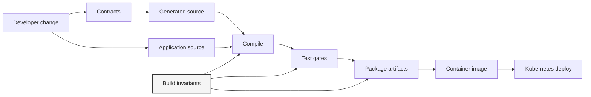
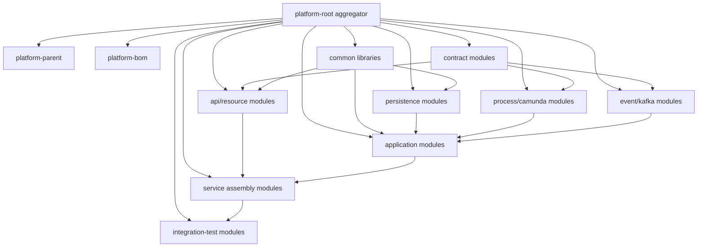
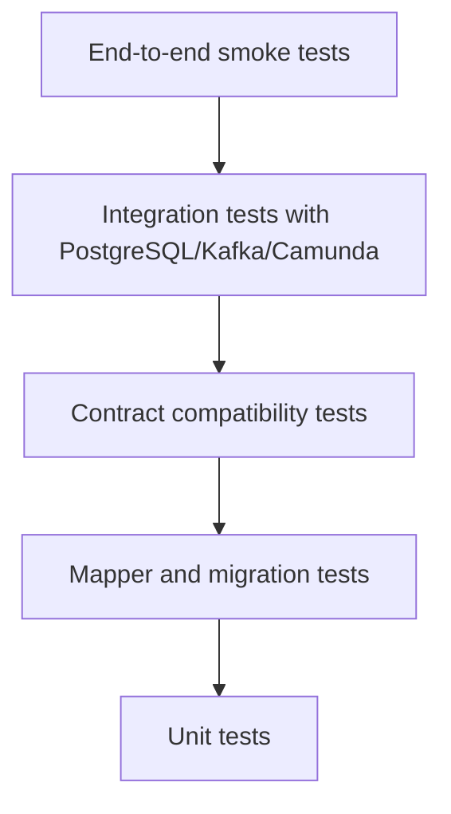
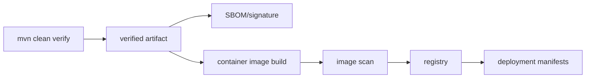
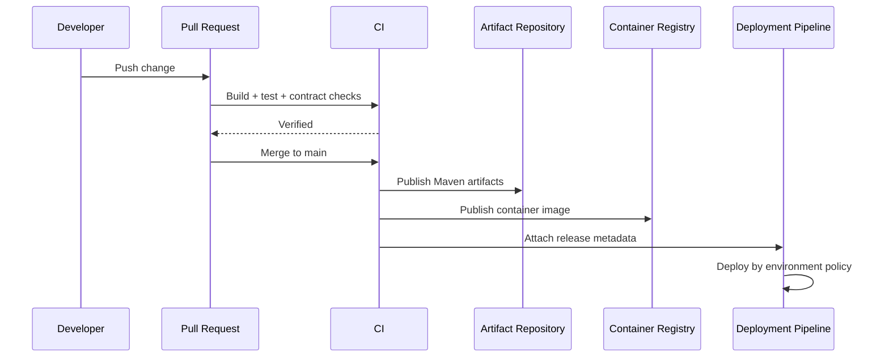

# Part 013 — Maven Production Build System

Build system bukan urusan belakangan.

Di sistem kecil, Maven sering hanya diperlakukan sebagai alat untuk menjalankan:

```bash
mvn clean package
```

Di sistem produksi yang contract-first, Maven harus diperlakukan sebagai **control plane arsitektur**.

Ia harus menjawab:

- modul mana yang boleh bergantung pada modul mana;
- versi dependency mana yang legal;
- plugin build mana yang legal;
- generated code dibuat dari kontrak apa;
- test apa yang wajib berjalan sebelum artifact dianggap valid;
- apakah build bisa diulang secara deterministik;
- apakah artifact bisa diaudit;
- apakah perubahan kontrak memicu test yang benar;
- apakah developer bisa melakukan partial build tanpa merusak invariants;
- apakah CI menjalankan hal yang sama seperti local developer.

Untuk platform regulatory enforcement, build system bukan hanya soal compile. Build system adalah salah satu guardrail agar sistem tetap defensible.

Kalau kontrak berubah tetapi generated code tidak diperbarui, build harus gagal.
Kalau module API bergantung langsung pada module PostgreSQL mapper, build harus gagal.
Kalau ada dependency tanpa versi terkelola, build harus gagal.
Kalau Java version berubah diam-diam, build harus gagal.
Kalau test integration dilewati di CI, build harus gagal.
Kalau artifact tidak reproducible, release sulit diaudit.

Part ini membangun Maven production build system untuk stack:

- Java SE 17+;
- JAX-RS/Jersey;
- Camunda 7;
- Kafka;
- PostgreSQL;
- MyBatis;
- PL/pgSQL migration;
- OpenAPI dan AsyncAPI generated sources;
- Kubernetes deployment artifact.

---

## 1. Mental Model: Build System sebagai Architecture Firewall

Maven bukan hanya dependency downloader.

Maven punya tiga fungsi arsitektural:

```text
Source code -> Build graph -> Verified artifact
```

Di tengahnya, build graph harus memaksa aturan.



Maven harus menjadi pagar terhadap tiga jenis kerusakan:

| Kerusakan | Contoh | Build harus melakukan apa |
|---|---|---|
| Architectural drift | `api-resource` import `mybatis-mapper` langsung | fail compile / fail enforcer |
| Dependency drift | versi Kafka client berubah tanpa review | fail dependency convergence / require upper bound |
| Contract drift | OpenAPI berubah tapi generated model lama | fail generated source check / contract tests |
| Test drift | integration test tidak pernah jalan | fail CI lifecycle |
| Release drift | artifact tidak bisa direproduksi | fail reproducible build policy |
| Runtime drift | local Java 21, CI Java 17, prod Java 17 | fail toolchain/enforcer |

Prinsipnya sederhana:

> Jangan berharap semua engineer mengingat boundary. Jadikan boundary sebagai properti build.

---

## 2. Bentuk Build yang Kita Butuhkan

Dari part sebelumnya, repository kita punya beberapa boundary:

```text
contracts/
services/
libraries/
deploy/
tools/
```

Di Maven, jangan memetakan folder ini secara naif. Yang penting adalah **dependency direction**.

Target dependency graph:



Poin penting:

- `platform-root` hanya aggregator, bukan parent yang penuh konfigurasi;
- `platform-parent` menyimpan standard build behavior;
- `platform-bom` menyimpan versi dependency internal dan eksternal;
- contract modules harus berada di awal graph;
- generated model tidak boleh menyebar ke domain core tanpa mapping eksplisit;
- service assembly module menggabungkan adapter menjadi runtime artifact;
- integration-test module menguji deployable unit sebagai black box.

---

## 3. Root Aggregator POM

Root aggregator bertugas mengumpulkan modules.

Ia tidak harus menjadi parent untuk semua module. Pisahkan konsep:

| Konsep Maven | Fungsi | Risiko jika dicampur sembarangan |
|---|---|---|
| Aggregation | menentukan module mana yang dibangun bersama reactor | root menjadi terlalu berat |
| Inheritance | mewariskan configuration ke child | konfigurasi bocor ke module yang tidak butuh |
| BOM import | mengelola versi dependency | versi terduplikasi jika tidak disiplin |

Contoh root `pom.xml`:

```xml
<project xmlns="http://maven.apache.org/POM/4.0.0"
         xmlns:xsi="http://www.w3.org/2001/XMLSchema-instance"
         xsi:schemaLocation="http://maven.apache.org/POM/4.0.0 https://maven.apache.org/xsd/maven-4.0.0.xsd">
  <modelVersion>4.0.0</modelVersion>

  <groupId>com.acme.enforcement</groupId>
  <artifactId>enforcement-platform-root</artifactId>
  <version>1.0.0-SNAPSHOT</version>
  <packaging>pom</packaging>

  <modules>
    <module>build/platform-parent</module>
    <module>build/platform-bom</module>

    <module>contracts/http/case-api-contract</module>
    <module>contracts/events/case-event-contract</module>
    <module>contracts/process/case-process-contract</module>

    <module>libraries/platform-common</module>
    <module>libraries/platform-error</module>
    <module>libraries/platform-observability</module>

    <module>services/case-service/case-api</module>
    <module>services/case-service/case-application</module>
    <module>services/case-service/case-persistence</module>
    <module>services/case-service/case-process</module>
    <module>services/case-service/case-events</module>
    <module>services/case-service/case-runtime</module>

    <module>testing/case-service-contract-tests</module>
    <module>testing/case-service-integration-tests</module>
  </modules>
</project>
```

Root aggregator tidak perlu memiliki ratusan dependency. Kalau root aggregator terlalu pintar, ia akan menjadi tempat semua keputusan bercampur.

---

## 4. Platform Parent: Standard Build Behavior

`platform-parent` adalah tempat meletakkan behavior yang harus sama di semua module.

Contoh:

- Java release level;
- compiler settings;
- encoding;
- reproducible build timestamp;
- surefire/failsafe setup;
- enforcer rules;
- source/javadoc jar policy;
- plugin versions;
- dependency convergence policy;
- generated source directory convention;
- test naming convention;
- static analysis baseline.

Contoh parent:

```xml
<project xmlns="http://maven.apache.org/POM/4.0.0"
         xmlns:xsi="http://www.w3.org/2001/XMLSchema-instance"
         xsi:schemaLocation="http://maven.apache.org/POM/4.0.0 https://maven.apache.org/xsd/maven-4.0.0.xsd">
  <modelVersion>4.0.0</modelVersion>

  <groupId>com.acme.enforcement</groupId>
  <artifactId>platform-parent</artifactId>
  <version>1.0.0-SNAPSHOT</version>
  <packaging>pom</packaging>

  <properties>
    <project.build.sourceEncoding>UTF-8</project.build.sourceEncoding>
    <project.reporting.outputEncoding>UTF-8</project.reporting.outputEncoding>

    <java.release>17</java.release>

    <!-- Di CI release, isi dari commit timestamp atau release timestamp stabil. -->
    <project.build.outputTimestamp>${git.commit.time}</project.build.outputTimestamp>

    <maven.compiler.plugin.version>3.13.0</maven.compiler.plugin.version>
    <maven.surefire.plugin.version>3.3.1</maven.surefire.plugin.version>
    <maven.failsafe.plugin.version>3.3.1</maven.failsafe.plugin.version>
    <maven.enforcer.plugin.version>3.5.0</maven.enforcer.plugin.version>
  </properties>

  <dependencyManagement>
    <dependencies>
      <dependency>
        <groupId>com.acme.enforcement</groupId>
        <artifactId>platform-bom</artifactId>
        <version>${project.version}</version>
        <type>pom</type>
        <scope>import</scope>
      </dependency>
    </dependencies>
  </dependencyManagement>

  <build>
    <pluginManagement>
      <plugins>
        <plugin>
          <groupId>org.apache.maven.plugins</groupId>
          <artifactId>maven-compiler-plugin</artifactId>
          <version>${maven.compiler.plugin.version}</version>
          <configuration>
            <release>${java.release}</release>
            <compilerArgs>
              <arg>-Xlint:all</arg>
            </compilerArgs>
          </configuration>
        </plugin>

        <plugin>
          <groupId>org.apache.maven.plugins</groupId>
          <artifactId>maven-surefire-plugin</artifactId>
          <version>${maven.surefire.plugin.version}</version>
          <configuration>
            <includes>
              <include>**/*Test.java</include>
            </includes>
          </configuration>
        </plugin>

        <plugin>
          <groupId>org.apache.maven.plugins</groupId>
          <artifactId>maven-failsafe-plugin</artifactId>
          <version>${maven.failsafe.plugin.version}</version>
          <configuration>
            <includes>
              <include>**/*IT.java</include>
              <include>**/*IntegrationTest.java</include>
            </includes>
          </configuration>
        </plugin>
      </plugins>
    </pluginManagement>
  </build>
</project>
```

Catatan penting: `pluginManagement` hanya mengelola versi dan default config. Plugin tidak otomatis berjalan kecuali dideklarasikan di `<plugins>` atau diaktifkan oleh packaging/lifecycle.

Ini bagus. Ia membuat module memilih plugin yang memang relevan, tapi tetap memakai konfigurasi standar.

---

## 5. Platform BOM: Dependency Version Contract

BOM adalah kontrak versi.

Ia menjawab:

```text
Versi dependency apa yang boleh digunakan di platform ini?
```

Contoh `platform-bom`:

```xml
<project xmlns="http://maven.apache.org/POM/4.0.0"
         xmlns:xsi="http://www.w3.org/2001/XMLSchema-instance"
         xsi:schemaLocation="http://maven.apache.org/POM/4.0.0 https://maven.apache.org/xsd/maven-4.0.0.xsd">
  <modelVersion>4.0.0</modelVersion>

  <groupId>com.acme.enforcement</groupId>
  <artifactId>platform-bom</artifactId>
  <version>1.0.0-SNAPSHOT</version>
  <packaging>pom</packaging>

  <properties>
    <jersey.version>3.1.8</jersey.version>
    <jakarta.ws.rs.version>3.1.0</jakarta.ws.rs.version>
    <kafka.clients.version>3.8.0</kafka.clients.version>
    <postgresql.driver.version>42.7.3</postgresql.driver.version>
    <mybatis.version>3.5.16</mybatis.version>
    <camunda.version>7.22.0</camunda.version>
    <jackson.version>2.17.2</jackson.version>
    <slf4j.version>2.0.13</slf4j.version>
    <junit.jupiter.version>5.10.3</junit.jupiter.version>
    <testcontainers.version>1.20.1</testcontainers.version>
  </properties>

  <dependencyManagement>
    <dependencies>
      <dependency>
        <groupId>org.glassfish.jersey</groupId>
        <artifactId>jersey-bom</artifactId>
        <version>${jersey.version}</version>
        <type>pom</type>
        <scope>import</scope>
      </dependency>

      <dependency>
        <groupId>org.junit</groupId>
        <artifactId>junit-bom</artifactId>
        <version>${junit.jupiter.version}</version>
        <type>pom</type>
        <scope>import</scope>
      </dependency>

      <dependency>
        <groupId>org.testcontainers</groupId>
        <artifactId>testcontainers-bom</artifactId>
        <version>${testcontainers.version}</version>
        <type>pom</type>
        <scope>import</scope>
      </dependency>

      <dependency>
        <groupId>org.apache.kafka</groupId>
        <artifactId>kafka-clients</artifactId>
        <version>${kafka.clients.version}</version>
      </dependency>

      <dependency>
        <groupId>org.postgresql</groupId>
        <artifactId>postgresql</artifactId>
        <version>${postgresql.driver.version}</version>
      </dependency>

      <dependency>
        <groupId>org.mybatis</groupId>
        <artifactId>mybatis</artifactId>
        <version>${mybatis.version}</version>
      </dependency>

      <dependency>
        <groupId>org.camunda.bpm</groupId>
        <artifactId>camunda-engine</artifactId>
        <version>${camunda.version}</version>
      </dependency>
    </dependencies>
  </dependencyManagement>
</project>
```

Hal yang sengaja dilakukan:

- dependency version ditaruh di BOM, bukan tersebar di module;
- module memakai dependency tanpa versi eksplisit;
- dependency eksternal yang punya BOM sendiri di-import;
- dependency internal juga bisa dikelola di BOM;
- perubahan versi menjadi diff yang terlihat.

Contoh module:

```xml
<dependency>
  <groupId>org.mybatis</groupId>
  <artifactId>mybatis</artifactId>
</dependency>
```

Jika module menulis versi sendiri, itu smell. Bisa valid dalam kasus khusus, tapi harus exceptional.

---

## 6. Dependency Scope sebagai Runtime Contract

Scope dependency bukan kosmetik.

Ia menentukan apa yang masuk compile path, runtime path, dan test path.

| Scope | Makna | Contoh di platform |
|---|---|---|
| `compile` | diperlukan compile dan runtime | domain library, mapper interface |
| `provided` | compile perlu, runtime disediakan container | servlet API jika berjalan di app server tertentu |
| `runtime` | tidak perlu compile, perlu runtime | JDBC driver jika akses via abstraction |
| `test` | hanya test | JUnit, Testcontainers |
| `import` | hanya untuk BOM | platform-bom, junit-bom |

Kesalahan umum:

```xml
<dependency>
  <groupId>org.postgresql</groupId>
  <artifactId>postgresql</artifactId>
  <scope>compile</scope>
</dependency>
```

Ini tidak selalu salah. Tetapi jika semua module memakai driver PostgreSQL sebagai compile dependency, boundary persistence bocor. Untuk module API, PostgreSQL driver tidak boleh terlihat sama sekali.

Aturan yang kita inginkan:

```text
case-api          -> tidak tahu PostgreSQL, MyBatis, Kafka, Camunda engine
case-application  -> tahu port interface, tidak tahu JDBC detail jika bisa
case-persistence  -> tahu PostgreSQL/MyBatis
case-events       -> tahu Kafka client
case-process      -> tahu Camunda API
case-runtime      -> menggabungkan semuanya
```

---

## 7. Maven Enforcer: Gagal Lebih Awal

Build production-grade harus gagal cepat.

Tambahkan Enforcer di parent:

```xml
<plugin>
  <groupId>org.apache.maven.plugins</groupId>
  <artifactId>maven-enforcer-plugin</artifactId>
  <version>${maven.enforcer.plugin.version}</version>
  <executions>
    <execution>
      <id>enforce-platform-rules</id>
      <goals>
        <goal>enforce</goal>
      </goals>
      <configuration>
        <rules>
          <requireMavenVersion>
            <version>[3.9.0,)</version>
          </requireMavenVersion>
          <requireJavaVersion>
            <version>[17,)</version>
          </requireJavaVersion>
          <dependencyConvergence />
          <requireUpperBoundDeps />
          <banDuplicatePomDependencyVersions />
        </rules>
        <fail>true</fail>
      </configuration>
    </execution>
  </executions>
</plugin>
```

Enforcer bukan pengganti design review. Tetapi ia mengurangi kelas error yang tidak perlu dibahas manusia.

Tambahkan juga banned dependencies untuk boundary tertentu.

Contoh untuk `case-api`:

```xml
<plugin>
  <groupId>org.apache.maven.plugins</groupId>
  <artifactId>maven-enforcer-plugin</artifactId>
  <executions>
    <execution>
      <id>ban-infrastructure-dependencies-from-api</id>
      <goals>
        <goal>enforce</goal>
      </goals>
      <configuration>
        <rules>
          <bannedDependencies>
            <excludes>
              <exclude>org.mybatis:*</exclude>
              <exclude>org.postgresql:postgresql</exclude>
              <exclude>org.apache.kafka:*</exclude>
              <exclude>org.camunda.bpm:*</exclude>
            </excludes>
          </bannedDependencies>
        </rules>
      </configuration>
    </execution>
  </executions>
</plugin>
```

Ini membuat boundary eksplisit.

Kalau suatu hari `case-api` butuh Kafka client, pertanyaannya bukan “tambahkan dependency saja”, tetapi “kenapa API layer tahu Kafka?”

---

## 8. Module Boundary dengan Compile-Time Direction

Maven tidak punya module boundary sekuat JPMS secara default. Tetapi dependency graph bisa dipakai sebagai firewall.

Contoh module `case-application`:

```xml
<dependencies>
  <dependency>
    <groupId>com.acme.enforcement</groupId>
    <artifactId>platform-common</artifactId>
  </dependency>
  <dependency>
    <groupId>com.acme.enforcement</groupId>
    <artifactId>platform-error</artifactId>
  </dependency>
  <dependency>
    <groupId>com.acme.enforcement</groupId>
    <artifactId>case-event-contract</artifactId>
  </dependency>
</dependencies>
```

`case-application` boleh tahu event contract, tetapi tidak boleh tahu Kafka client. Ia boleh menghasilkan `CaseAcceptedEvent`, tapi tidak memanggil `KafkaProducer` langsung.

Port:

```java
public interface CaseEventPublisher {
    void publish(CaseDomainEvent event);
}
```

Adapter di module lain:

```java
final class KafkaCaseEventPublisher implements CaseEventPublisher {
    private final OutboxRepository outboxRepository;

    @Override
    public void publish(CaseDomainEvent event) {
        outboxRepository.append(event);
    }
}
```

Maven boundary:

```text
case-application -> case-event-contract
case-events      -> case-application + kafka-clients + case-event-contract
```

Jika arah dependency terbalik, design rusak.

---

## 9. Generated Sources: Jangan Biarkan Liar

Contract-first berarti build menghasilkan code dari kontrak.

Tetapi generated source harus diperlakukan sebagai **artifact turunan**, bukan tempat business logic.

Konvensi direktori:

```text
contracts/http/case-api-contract/
  src/main/openapi/case-api.yaml
  target/generated-sources/openapi/...

contracts/events/case-event-contract/
  src/main/asyncapi/case-events.yaml
  target/generated-sources/asyncapi/...
```

Aturan:

- source of truth ada di `src/main/openapi` atau `src/main/asyncapi`;
- generated code masuk `target/generated-sources/...`;
- generated code tidak diedit manual;
- module lain hanya bergantung pada artifact contract module;
- mapping ke domain dilakukan eksplisit.

Contoh OpenAPI Generator Maven Plugin di contract module:

```xml
<plugin>
  <groupId>org.openapitools</groupId>
  <artifactId>openapi-generator-maven-plugin</artifactId>
  <version>${openapi.generator.version}</version>
  <executions>
    <execution>
      <id>generate-case-api-models</id>
      <phase>generate-sources</phase>
      <goals>
        <goal>generate</goal>
      </goals>
      <configuration>
        <inputSpec>${project.basedir}/src/main/openapi/case-api.yaml</inputSpec>
        <generatorName>jaxrs-spec</generatorName>
        <apiPackage>com.acme.enforcement.contract.http.caseapi</apiPackage>
        <modelPackage>com.acme.enforcement.contract.http.caseapi.model</modelPackage>
        <generateSupportingFiles>false</generateSupportingFiles>
        <configOptions>
          <dateLibrary>java8</dateLibrary>
          <useJakartaEe>true</useJakartaEe>
          <interfaceOnly>true</interfaceOnly>
        </configOptions>
      </configuration>
    </execution>
  </executions>
</plugin>
```

Catatan:

- gunakan package `contract`, bukan `domain`;
- jangan expose generated model langsung ke persistence;
- jangan tambahkan business behavior ke generated class;
- jangan mengandalkan default generator tanpa review output.

---

## 10. Lifecycle Maven untuk Platform Ini

Maven lifecycle harus dimanfaatkan secara konsisten.

| Phase | Kegunaan di platform |
|---|---|
| `validate` | cek POM, enforcer, contract presence |
| `generate-sources` | generate OpenAPI/AsyncAPI models |
| `compile` | compile production code |
| `test-compile` | compile test fixture |
| `test` | unit test cepat |
| `package` | build jar/war/distribution |
| `pre-integration-test` | start resources jika dibutuhkan |
| `integration-test` | run integration tests |
| `verify` | final gates, compatibility checks, coverage thresholds |
| `install` | publish ke local repository |
| `deploy` | publish ke remote repository |

Untuk CI, target minimal:

```bash
mvn -B -U clean verify
```

Untuk release candidate:

```bash
mvn -B -U clean deploy -Prelease
```

Untuk build module tertentu dan dependencynya:

```bash
mvn -pl services/case-service/case-runtime -am verify
```

Untuk melanjutkan dari module gagal:

```bash
mvn -rf :case-runtime verify
```

Developer senior harus nyaman dengan reactor flags:

| Flag | Fungsi |
|---|---|
| `-pl` | pilih project/module tertentu |
| `-am` | also make dependency modules |
| `-amd` | also make dependent modules |
| `-rf` | resume from failed module |
| `-DskipTests` | skip test execution, masih compile test tergantung plugin |
| `-Dmaven.test.skip=true` | skip compile dan run test; berbahaya untuk CI |

Aturan: `-Dmaven.test.skip=true` tidak boleh dipakai di CI regular.

---

## 11. Unit Test vs Integration Test di Maven

Pisahkan nama dan lifecycle.

```text
*Test.java                -> surefire -> test phase
*IT.java                  -> failsafe -> integration-test + verify phase
*IntegrationTest.java     -> failsafe -> integration-test + verify phase
```

Surefire:

```xml
<plugin>
  <groupId>org.apache.maven.plugins</groupId>
  <artifactId>maven-surefire-plugin</artifactId>
</plugin>
```

Failsafe:

```xml
<plugin>
  <groupId>org.apache.maven.plugins</groupId>
  <artifactId>maven-failsafe-plugin</artifactId>
  <executions>
    <execution>
      <goals>
        <goal>integration-test</goal>
        <goal>verify</goal>
      </goals>
    </execution>
  </executions>
</plugin>
```

Kenapa Failsafe penting?

Kalau integration test gagal, Failsafe tetap memberi kesempatan phase teardown berjalan. Ini penting ketika test menyalakan resource eksternal seperti container PostgreSQL/Kafka.

Test pyramid untuk platform ini:



Pyramid bukan berarti unit test paling penting secara bisnis. Artinya unit test paling banyak karena murah.

Untuk sistem ini, mapper/migration test sangat penting karena banyak invariant hidup di database.

---

## 12. Contract Test sebagai Build Gate

Contract test harus menjadi bagian dari `verify`.

Jenis contract gate:

| Gate | Contoh |
|---|---|
| OpenAPI lint | path naming, error schema, required headers |
| OpenAPI compatibility | perubahan tidak memecahkan consumer lama |
| AsyncAPI lint | topic naming, envelope, partition key metadata |
| Event schema compatibility | field removal/rename ditolak |
| BPMN variable contract | variable required masih ada |
| DB migration compatibility | expand-contract rule tidak dilanggar |
| Generated code freshness | generated output sesuai contract saat ini |

Contoh pseudo-config:

```xml
<plugin>
  <groupId>com.acme.enforcement.build</groupId>
  <artifactId>contract-check-maven-plugin</artifactId>
  <version>${project.version}</version>
  <executions>
    <execution>
      <id>verify-contracts</id>
      <phase>verify</phase>
      <goals>
        <goal>openapi-lint</goal>
        <goal>asyncapi-lint</goal>
        <goal>compatibility-check</goal>
      </goals>
    </execution>
  </executions>
</plugin>
```

Plugin di atas bisa internal. Tidak semua organisasi perlu membuat plugin sendiri di awal, tetapi organisasi matang biasanya menaruh policy dalam tool, bukan wiki.

---

## 13. Reproducible Build

Artifact produksi harus bisa dijelaskan.

Build reproducible berarti source, environment, dan instruksi build yang sama menghasilkan artifact yang identik secara bit-for-bit untuk artifact yang ditargetkan.

Kenapa penting?

- audit release;
- supply-chain integrity;
- incident investigation;
- rollback confidence;
- vendor/regulatory defensibility;
- membedakan artifact resmi dari artifact lokal.

Minimal Maven policy:

```xml
<properties>
  <project.build.outputTimestamp>${git.commit.time}</project.build.outputTimestamp>
</properties>
```

Di CI, set `git.commit.time` dari commit terakhir atau release timestamp yang stabil.

Tambahkan metadata build:

```xml
<plugin>
  <groupId>io.github.git-commit-id</groupId>
  <artifactId>git-commit-id-maven-plugin</artifactId>
  <version>${git.commit.id.plugin.version}</version>
  <executions>
    <execution>
      <id>get-the-git-infos</id>
      <goals>
        <goal>revision</goal>
      </goals>
    </execution>
  </executions>
</plugin>
```

Artifact harus mengandung:

```text
Implementation-Version
Build-Commit
Build-Time
Build-Branch
Contract-Version
Schema-Version
```

Tapi hati-hati: build time yang berubah setiap build bisa merusak reproducibility. Untuk release, metadata harus stabil dan disengaja.

---

## 14. Maven Wrapper

Gunakan Maven Wrapper agar developer dan CI memakai Maven version yang sama.

```bash
./mvnw -version
./mvnw clean verify
```

Policy:

- CI selalu memakai `./mvnw`, bukan Maven global;
- wrapper jar/script disimpan di repository sesuai policy organisasi;
- upgrade Maven wrapper dilakukan sebagai PR eksplisit;
- build log mencetak Maven version, Java version, OS, dan active profiles.

Tanpa wrapper, bug build bisa muncul hanya karena versi Maven berbeda.

---

## 15. Toolchains: Memaksa JDK yang Benar

`maven-compiler-plugin <release>17</release>` membatasi target bytecode/API, tetapi belum tentu memaksa JDK runtime yang dipakai build.

Untuk organisasi besar, gunakan Maven Toolchains.

Contoh policy:

```xml
<plugin>
  <groupId>org.apache.maven.plugins</groupId>
  <artifactId>maven-toolchains-plugin</artifactId>
  <version>${maven.toolchains.plugin.version}</version>
  <executions>
    <execution>
      <goals>
        <goal>toolchain</goal>
      </goals>
    </execution>
  </executions>
  <configuration>
    <toolchains>
      <jdk>
        <version>17</version>
      </jdk>
    </toolchains>
  </configuration>
</plugin>
```

Ini berguna jika developer punya JDK 17, 21, dan 25 di mesin yang sama.

Aturan desain:

```text
Runtime Java boleh lebih baru hanya jika compatibility, test, dan container image policy jelas.
Compile target tidak boleh berubah sebagai efek samping upgrade laptop developer.
```

---

## 16. Profile: Gunakan Sedikit, Jelas, dan Terbatas

Maven profile sering menjadi sumber drift.

Contoh profile yang masuk akal:

| Profile | Fungsi |
|---|---|
| `local` | local developer convenience |
| `ci` | CI strict gates |
| `release` | signing, deploy, source/javadoc, reproducibility |
| `contract-check` | compatibility/lint extra gates |
| `native-tools` | hanya jika ada tooling OS-specific |

Contoh:

```xml
<profiles>
  <profile>
    <id>ci</id>
    <properties>
      <skip.integration.tests>false</skip.integration.tests>
      <strict.contract.checks>true</strict.contract.checks>
    </properties>
  </profile>

  <profile>
    <id>local</id>
    <properties>
      <skip.integration.tests>true</skip.integration.tests>
      <strict.contract.checks>false</strict.contract.checks>
    </properties>
  </profile>
</profiles>
```

Jangan membuat profile seperti:

```text
dev, test, staging, prod
```

Build artifact tidak boleh berbeda karena environment. Environment configuration harus datang dari runtime config, bukan build profile, kecuali ada alasan kuat.

Prinsip:

> Build once, configure at runtime.

---

## 17. Packaging: Library Module vs Runtime Module

Tidak semua module menghasilkan artifact yang sama.

| Module | Packaging | Output |
|---|---|---|
| `platform-bom` | `pom` | BOM |
| `platform-parent` | `pom` | parent POM |
| contract modules | `jar` | generated interfaces/models |
| common libraries | `jar` | reusable code |
| persistence | `jar` | mapper/repository implementation |
| process | `jar` | delegate/process integration code |
| events | `jar` | producer/consumer implementation |
| runtime | `jar`/`war` | deployable service |
| integration tests | `jar` | test artifact only |

Untuk Jersey/JAX-RS runtime, ada beberapa pilihan:

1. deploy sebagai WAR ke servlet container/app server;
2. package sebagai executable jar dengan embedded HTTP server;
3. package dengan framework tambahan.

Seri ini akan menekankan boundary, bukan memaksa satu packaging. Tetapi apapun pilihannya, `case-runtime` adalah satu-satunya module yang boleh menggabungkan semua adapter konkret.

---

## 18. Container Image Build: Maven atau Bukan?

Ada dua pendekatan:

| Pendekatan | Kelebihan | Risiko |
|---|---|---|
| Maven plugin build image | satu command dari Maven | build Java dan image terlalu coupling |
| Docker/BuildKit di CI | pipeline lebih eksplisit | developer local perlu command tambahan |

Untuk platform enterprise, lebih aman:

```text
Maven menghasilkan verified jar/war.
CI image build mengambil artifact Maven.
Image build punya policy sendiri.
```

Alur:



Jangan campur semua hal ke satu `mvn deploy` yang melakukan compile, test, image build, push, dan deploy ke cluster. Itu membuat failure sulit diisolasi.

---

## 19. CI Build Matrix

CI tidak cukup satu job.

Build matrix yang sehat:

| Job | Command | Tujuan |
|---|---|---|
| Fast PR build | `./mvnw -B -Pci clean verify -DskipITs=true` | feedback cepat |
| Contract build | `./mvnw -B -Pci,contract-check clean verify` | kontrak dan compatibility |
| Integration build | `./mvnw -B -Pci clean verify` | PostgreSQL/Kafka/Camunda integration |
| Dependency audit | tool organisasi | CVE/license policy |
| Reproducibility check | build ulang artifact | audit artifact |
| Release build | `./mvnw -B -Prelease clean deploy` | publish artifact |

Tetapi hati-hati dengan `skipITs`. PR yang mengubah persistence, Kafka, BPMN, atau contract harus menjalankan integration build.

CI decision table:

| Perubahan | Minimal gate |
|---|---|
| Java domain only | unit + affected module |
| OpenAPI | openapi lint + generated + API contract tests |
| AsyncAPI | asyncapi lint + event compatibility + consumer tests |
| SQL migration | migration test + mapper integration test |
| BPMN | process deployment test + variable contract test |
| Maven parent/BOM | full build |
| Dockerfile/K8s | image + deployment smoke |

---

## 20. Dependency Hygiene

Dependency adalah supply-chain surface.

Policy dasar:

- semua dependency harus punya owner;
- versi harus managed;
- dependency transitive yang berbahaya harus dikecualikan eksplisit;
- dependency update harus punya changelog review;
- jangan menambahkan framework besar untuk masalah kecil;
- jangan expose dependency eksternal dalam public API internal tanpa sengaja;
- gunakan dependency analyzer untuk menemukan unused/undeclared dependencies;
- jaga jar hell sejak awal.

Contoh exclusion:

```xml
<dependency>
  <groupId>some.vendor</groupId>
  <artifactId>some-client</artifactId>
  <exclusions>
    <exclusion>
      <groupId>commons-logging</groupId>
      <artifactId>commons-logging</artifactId>
    </exclusion>
  </exclusions>
</dependency>
```

Exclusion harus punya alasan. Jangan copy-paste exclusion dari StackOverflow tanpa memahami runtime effect.

---

## 21. Internal Plugin vs Script

Banyak organisasi menaruh build logic di shell script:

```bash
scripts/check-contracts.sh
scripts/generate-openapi.sh
scripts/lint-bpmn.sh
```

Ini boleh untuk awal, tetapi ada batas.

| Opsi | Cocok untuk | Risiko |
|---|---|---|
| Shell script | eksperimen, local tool | cross-platform, lifecycle tidak jelas |
| Maven plugin config | tool standar | verbose |
| Internal Maven plugin | policy organisasi | butuh maintenance |
| CI-only script | deployment/pipeline | local/CI drift |

Rule praktis:

```text
Jika check menentukan apakah source code valid, jadikan bagian dari Maven verify.
Jika check menentukan deployment environment, tempatkan di CI/CD deployment stage.
```

---

## 22. Build Output Contract

Setiap deployable artifact harus punya output contract.

Untuk `case-runtime`, artifact minimal:

```text
target/case-runtime.jar
target/classes/application.yaml
target/classes/db/migration/...
target/classes/bpmn/...
target/classes/META-INF/build-info.properties
target/generated-sources/...
target/surefire-reports/...
target/failsafe-reports/...
```

Build info:

```properties
service.name=case-service
service.version=1.0.0-SNAPSHOT
git.commit=abc1234
contract.http.case-api.version=1.4.0
contract.events.case-events.version=2.1.0
db.schema.version=2026.07.02.001
bpmn.case-lifecycle.version=17
java.release=17
```

Runtime health endpoint bisa mengekspos sebagian metadata ini:

```json
{
  "service": "case-service",
  "version": "1.0.0",
  "commit": "abc1234",
  "contracts": {
    "http.caseApi": "1.4.0",
    "events.caseEvents": "2.1.0"
  }
}
```

Jangan expose data sensitif di build info.

---

## 23. Release Discipline

Release bukan `mvn deploy` dari laptop.

Release harus berasal dari CI yang bersih.

Alur:



Release artifact harus immutable.

Jangan overwrite version yang sama di artifact repository untuk release final.

SNAPSHOT boleh berubah. Release tidak.

---

## 24. Anti-Patterns

### Anti-pattern 1: Semua module mewarisi semua dependency

```xml
<dependencies>
  <dependency>Kafka</dependency>
  <dependency>PostgreSQL</dependency>
  <dependency>Camunda</dependency>
  <dependency>Jersey</dependency>
</dependencies>
```

di parent.

Ini menghancurkan boundary.

Parent boleh mengelola dependency version, tetapi tidak boleh membuat semua module otomatis bergantung pada semua teknologi.

### Anti-pattern 2: Generated code diedit manual

Jika generated code perlu diedit, berarti generator config, template, atau kontraknya salah.

### Anti-pattern 3: Profile prod menghasilkan artifact berbeda

Kalau `-Pprod` mengganti dependency atau class yang dikompilasi, environment behavior sulit diaudit.

### Anti-pattern 4: Version ada di mana-mana

Jika versi dependency tersebar di 40 module, upgrade menjadi operasi tak terkendali.

### Anti-pattern 5: CI menjalankan command berbeda dari developer

Developer menjalankan `mvn package`, CI menjalankan script kompleks yang tidak bisa direproduksi lokal. Ini menciptakan debugging tax.

### Anti-pattern 6: Test skip sebagai default

Jika default build tidak menjalankan test penting, build system sedang menipu developer.

### Anti-pattern 7: Root POM menjadi tempat business decision

Root POM seharusnya mengatur build, bukan menyembunyikan architecture smell.

---

## 25. Production Checklist

Sebelum masuk production-grade baseline, Maven build harus memenuhi ini:

- [ ] semua module masuk reactor dengan urutan dependency jelas;
- [ ] parent POM dan BOM dipisah;
- [ ] semua dependency version dikelola BOM/dependencyManagement;
- [ ] plugin version dikelola pluginManagement;
- [ ] Java release dikunci;
- [ ] Maven version distandarkan via wrapper;
- [ ] Enforcer aktif;
- [ ] dependency convergence aktif;
- [ ] generated source dibuat pada `generate-sources`;
- [ ] generated source tidak diedit manual;
- [ ] Surefire dan Failsafe dipisah;
- [ ] integration tests berjalan di lifecycle `verify`;
- [ ] contract checks masuk build gate;
- [ ] reproducible build property disiapkan;
- [ ] artifact mengandung build metadata aman;
- [ ] CI memakai command yang bisa dijalankan lokal;
- [ ] release hanya dari CI;
- [ ] deployable artifact immutable;
- [ ] dependency boundary bisa gagal jika dilanggar.

---

## 26. Latihan Implementasi

Buat repository skeleton:

```text
enforcement-platform/
  pom.xml
  .mvn/wrapper/...
  build/
    platform-parent/pom.xml
    platform-bom/pom.xml
  contracts/
    http/case-api-contract/pom.xml
    events/case-event-contract/pom.xml
  libraries/
    platform-common/pom.xml
    platform-error/pom.xml
  services/
    case-service/
      case-api/pom.xml
      case-application/pom.xml
      case-persistence/pom.xml
      case-process/pom.xml
      case-events/pom.xml
      case-runtime/pom.xml
  testing/
    case-service-contract-tests/pom.xml
    case-service-integration-tests/pom.xml
```

Kemudian buat aturan:

1. `case-api` tidak boleh import PostgreSQL/Kafka/Camunda.
2. `case-application` tidak boleh import Jersey/MyBatis/Kafka/Camunda engine langsung.
3. `case-persistence` boleh import MyBatis dan PostgreSQL.
4. `case-events` boleh import Kafka client.
5. `case-process` boleh import Camunda API.
6. `case-runtime` boleh menggabungkan semua adapter.
7. `mvn clean verify` harus menjalankan unit test dan integration test.
8. `mvn -pl services/case-service/case-runtime -am verify` harus berhasil.

Kalau ini berhasil, Maven sudah mulai menjadi architecture firewall.

---

## 27. Ringkasan

Maven production-grade bukan sekadar `pom.xml` panjang.

Maven adalah mekanisme untuk membuat arsitektur bisa dipaksa.

Yang penting:

- root aggregator mengatur reactor;
- parent mengatur build behavior;
- BOM mengatur versi;
- Enforcer mencegah drift;
- dependency scope menjaga runtime boundary;
- generated source dibuat dari kontrak;
- lifecycle Maven dipakai untuk test dan verification gates;
- reproducible build membuat release defensible;
- CI menjalankan build yang sama dengan local;
- release artifact immutable.

Di part berikutnya, kita akan masuk ke **Code Generation Contract Pipeline**: bagaimana OpenAPI, AsyncAPI, schema, generated model, JAX-RS interface, Kafka payload, dan mapping layer disusun agar contract-first tidak berubah menjadi generated-code-first chaos.

---

## Reference Anchors

- Apache Maven — Guide to Working with Multiple Modules: `https://maven.apache.org/guides/mini/guide-multiple-modules.html`
- Apache Maven — Configuring for Reproducible Builds: `https://maven.apache.org/guides/mini/guide-reproducible-builds.html`
- Apache Maven — Introduction to the Build Lifecycle: `https://maven.apache.org/guides/introduction/introduction-to-the-lifecycle.html`
- Apache Maven Enforcer Plugin: `https://maven.apache.org/enforcer/maven-enforcer-plugin/`
- Apache Maven Surefire/Failsafe Plugins: `https://maven.apache.org/surefire/`
- OpenAPI Generator Maven Plugin: `https://github.com/OpenAPITools/openapi-generator/tree/master/modules/openapi-generator-maven-plugin`
