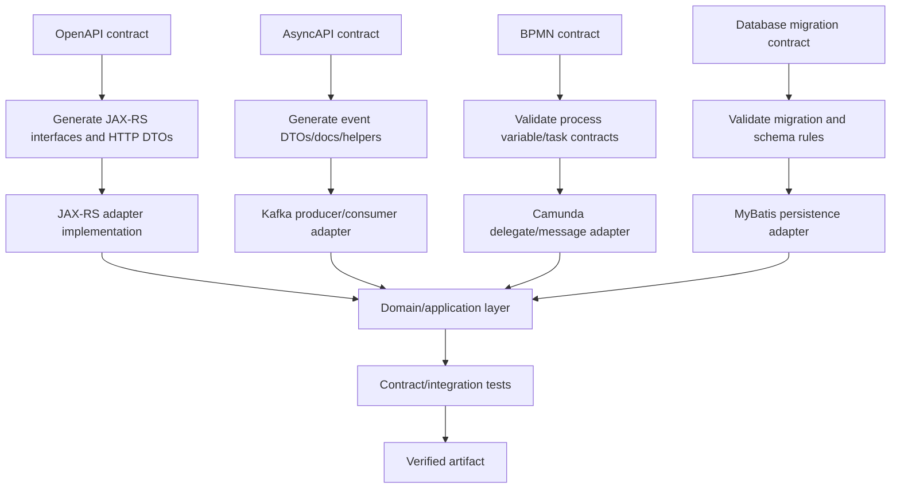
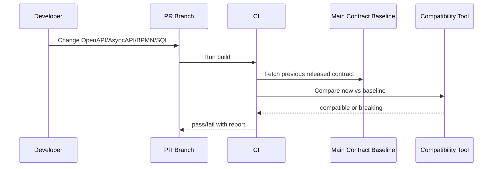
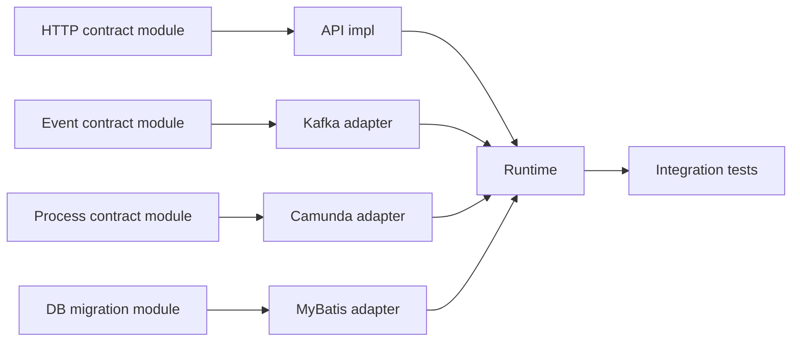

# Part 014 — Code Generation Contract Pipeline

Contract-first sering gagal bukan karena idenya salah.

Ia gagal karena pipeline-nya tidak disiplin.

Gejala umum:

```text
OpenAPI ada, tapi controller tidak sesuai.
Generated code diedit manual.
DTO OpenAPI dipakai langsung sebagai domain entity.
Kafka event schema didokumentasikan, tapi producer mengirim field tambahan liar.
Consumer punya asumsi yang tidak pernah masuk AsyncAPI.
BPMN variable contract hidup di kepala developer.
CI tidak tahu apakah kontrak berubah breaking atau tidak.
Maven generate-sources kadang berjalan, kadang tidak.
```

Hasilnya: organisasi merasa sudah contract-first, padahal hanya punya file YAML.

Part ini membangun pipeline contract-first yang benar-benar dipakai oleh build, test, dan release.

Targetnya:

```text
Contract file -> Generated code -> Adapter implementation -> Domain mapping -> Tests -> Verified artifact
```

Bukan:

```text
Code dulu -> generate dokumentasi belakangan -> berharap sesuai
```

---

## 1. Mental Model: Contract adalah Source, Generated Code adalah Derivative

Contract-first memiliki satu invariant utama:

> Kontrak adalah sumber kebenaran boundary eksternal. Generated code adalah hasil turunan. Business logic tidak boleh hidup di generated code.

Peta pipeline:



Boundary yang harus dijaga:

| Layer | Boleh tahu | Tidak boleh tahu |
|---|---|---|
| OpenAPI generated model | HTTP contract shape | domain invariant yang kompleks |
| JAX-RS resource impl | HTTP model + application service | MyBatis SQL detail |
| Domain/application | domain primitives, ports, result types | JAX-RS annotations, Kafka classes, Camunda engine APIs |
| Kafka adapter | event contract, Kafka client, outbox/inbox | HTTP DTO |
| Camunda adapter | BPMN variables, process API | raw HTTP request |
| Persistence adapter | MyBatis, SQL, PostgreSQL error mapping | JAX-RS resource |

Generated code memudahkan konsistensi, tapi bisa merusak arsitektur jika dibiarkan masuk ke semua tempat.

---

## 2. Empat Jenis Kontrak di Platform Ini

Kita tidak hanya punya satu kontrak.

| Kontrak | File | Boundary | Tooling |
|---|---|---|---|
| HTTP API | `src/main/openapi/*.yaml` | client ↔ service | OpenAPI Generator, linter, contract tests |
| Event API | `src/main/asyncapi/*.yaml` | producer ↔ consumer | AsyncAPI tools, schema validator, compatibility tests |
| Process API | `src/main/bpmn/*.bpmn` + variable spec | process ↔ service/human task | BPMN validation, variable contract tests |
| Database API | migration SQL + function signatures | app ↔ database | migration test, schema diff, SQL tests |

Satu kesalahan framing yang harus dihindari:

```text
OpenAPI adalah kontrak sistem.
```

Tidak cukup.

OpenAPI hanya kontrak HTTP. Sistem kita juga punya event, workflow, dan database contract.

---

## 3. Struktur Contract Modules

Gunakan module khusus:

```text
contracts/
  http/
    case-api-contract/
      pom.xml
      src/main/openapi/case-api.yaml
      src/test/resources/examples/
        create-case-request.valid.json
        create-case-response.valid.json
  events/
    case-event-contract/
      pom.xml
      src/main/asyncapi/case-events.yaml
      src/main/jsonschema/events/
        case-accepted.schema.json
        case-rejected.schema.json
      src/test/resources/events/
        case-accepted.v1.valid.json
  process/
    case-process-contract/
      pom.xml
      src/main/bpmn/case-lifecycle.bpmn
      src/main/process-contract/case-lifecycle.variables.yaml
      src/test/resources/process/
        valid-variable-set.json
```

Mengapa dipisah?

- perubahan kontrak menjadi diff yang jelas;
- generated code bisa dibangun sebelum implementation;
- module lain bisa bergantung ke contract artifact;
- compatibility check bisa berjalan tanpa menjalankan full service;
- ownership kontrak lebih mudah;
- release contract bisa diberi version sendiri jika diperlukan.

---

## 4. OpenAPI Pipeline untuk JAX-RS/Jersey

Kita mulai dari HTTP.

Contoh potongan `case-api.yaml`:

```yaml
openapi: 3.1.0
info:
  title: Case Intake API
  version: 1.4.0
paths:
  /cases:
    post:
      operationId: createCase
      summary: Create a regulatory enforcement case
      parameters:
        - name: Idempotency-Key
          in: header
          required: true
          schema:
            type: string
            minLength: 16
            maxLength: 128
        - name: X-Correlation-Id
          in: header
          required: true
          schema:
            type: string
      requestBody:
        required: true
        content:
          application/json:
            schema:
              $ref: '#/components/schemas/CreateCaseRequest'
      responses:
        '202':
          description: Case accepted for processing
          content:
            application/json:
              schema:
                $ref: '#/components/schemas/CreateCaseAcceptedResponse'
        '400':
          $ref: '#/components/responses/BadRequest'
        '409':
          $ref: '#/components/responses/DuplicateRequest'
components:
  schemas:
    CreateCaseRequest:
      type: object
      required:
        - sourceSystem
        - allegationType
        - receivedAt
      properties:
        sourceSystem:
          type: string
        allegationType:
          type: string
          enum: [LICENSING_BREACH, FINANCIAL_MISCONDUCT, SAFETY_INCIDENT]
        receivedAt:
          type: string
          format: date-time
    CreateCaseAcceptedResponse:
      type: object
      required:
        - caseId
        - status
      properties:
        caseId:
          type: string
          format: uuid
        status:
          type: string
          enum: [ACCEPTED]
```

OpenAPI harus memuat hal yang benar-benar menjadi kontrak:

- path;
- method;
- header wajib;
- request body;
- response body;
- error model;
- status code;
- idempotency behavior;
- pagination format;
- compatibility rules melalui schema design.

OpenAPI tidak boleh menjadi dumping ground untuk internal implementation detail.

---

## 5. Generate JAX-RS Interface, Bukan Business Logic

Untuk Jersey/JAX-RS, target sehat adalah generate interface atau resource contract, lalu implementasikan sendiri.

```text
Generated:
  CaseApi.java
  CreateCaseRequest.java
  CreateCaseAcceptedResponse.java

Manual:
  CaseResource.java implements CaseApi
  CaseHttpMapper.java
  CaseApplicationService.java
```

Contoh generated interface konseptual:

```java
@Path("/cases")
public interface CaseApi {
    @POST
    @Consumes(MediaType.APPLICATION_JSON)
    @Produces(MediaType.APPLICATION_JSON)
    Response createCase(
        @HeaderParam("Idempotency-Key") String idempotencyKey,
        @HeaderParam("X-Correlation-Id") String correlationId,
        CreateCaseRequest request
    );
}
```

Manual implementation:

```java
public final class CaseResource implements CaseApi {
    private final CaseApplicationService service;
    private final CaseHttpMapper mapper;

    public CaseResource(CaseApplicationService service, CaseHttpMapper mapper) {
        this.service = service;
        this.mapper = mapper;
    }

    @Override
    public Response createCase(
            String idempotencyKey,
            String correlationId,
            CreateCaseRequest request) {

        CreateCaseCommand command = mapper.toCommand(
            idempotencyKey,
            correlationId,
            request
        );

        Result<CaseAccepted, PlatformError> result = service.createCase(command);

        return mapper.toResponse(result);
    }
}
```

Perhatikan boundary:

- `CaseResource` boleh tahu generated HTTP DTO;
- `CaseApplicationService` tidak tahu generated HTTP DTO;
- mapping eksplisit;
- error result dipetakan ke HTTP response di adapter.

---

## 6. Maven Configuration untuk OpenAPI Generation

Contract module `case-api-contract/pom.xml`:

```xml
<project>
  <parent>
    <groupId>com.acme.enforcement</groupId>
    <artifactId>platform-parent</artifactId>
    <version>1.0.0-SNAPSHOT</version>
    <relativePath>../../../build/platform-parent/pom.xml</relativePath>
  </parent>

  <artifactId>case-api-contract</artifactId>
  <packaging>jar</packaging>

  <properties>
    <openapi.generator.version>7.8.0</openapi.generator.version>
  </properties>

  <dependencies>
    <dependency>
      <groupId>jakarta.ws.rs</groupId>
      <artifactId>jakarta.ws.rs-api</artifactId>
    </dependency>
    <dependency>
      <groupId>jakarta.validation</groupId>
      <artifactId>jakarta.validation-api</artifactId>
    </dependency>
    <dependency>
      <groupId>com.fasterxml.jackson.core</groupId>
      <artifactId>jackson-annotations</artifactId>
    </dependency>
  </dependencies>

  <build>
    <plugins>
      <plugin>
        <groupId>org.openapitools</groupId>
        <artifactId>openapi-generator-maven-plugin</artifactId>
        <version>${openapi.generator.version}</version>
        <executions>
          <execution>
            <id>generate-jaxrs-contract</id>
            <phase>generate-sources</phase>
            <goals>
              <goal>generate</goal>
            </goals>
            <configuration>
              <inputSpec>${project.basedir}/src/main/openapi/case-api.yaml</inputSpec>
              <generatorName>jaxrs-spec</generatorName>
              <apiPackage>com.acme.enforcement.contract.http.caseapi</apiPackage>
              <modelPackage>com.acme.enforcement.contract.http.caseapi.model</modelPackage>
              <generateApiTests>false</generateApiTests>
              <generateModelTests>false</generateModelTests>
              <generateSupportingFiles>false</generateSupportingFiles>
              <configOptions>
                <interfaceOnly>true</interfaceOnly>
                <useJakartaEe>true</useJakartaEe>
                <dateLibrary>java8</dateLibrary>
                <openApiNullable>false</openApiNullable>
              </configOptions>
            </configuration>
          </execution>
        </executions>
      </plugin>
    </plugins>
  </build>
</project>
```

`dateLibrary=java8` biasanya berarti memakai Java time types seperti `OffsetDateTime` untuk `date-time` pada generator yang mendukungnya. Tetap review output generator, jangan percaya default tanpa membaca hasil.

---

## 7. Generated DTO Bukan Domain Model

Ini aturan besar.

Generated DTO:

```java
public class CreateCaseRequest {
    private String sourceSystem;
    private String allegationType;
    private OffsetDateTime receivedAt;
}
```

Domain command:

```java
public record CreateCaseCommand(
    IdempotencyKey idempotencyKey,
    CorrelationId correlationId,
    SourceSystem sourceSystem,
    AllegationType allegationType,
    Instant receivedAt
) {}
```

Mapper:

```java
public final class CaseHttpMapper {
    public CreateCaseCommand toCommand(
            String idempotencyKey,
            String correlationId,
            CreateCaseRequest request) {

        return new CreateCaseCommand(
            IdempotencyKey.parse(idempotencyKey),
            CorrelationId.parse(correlationId),
            SourceSystem.parse(request.getSourceSystem()),
            AllegationType.parse(request.getAllegationType()),
            request.getReceivedAt().toInstant()
        );
    }
}
```

Kenapa tidak pakai DTO langsung?

Karena generated DTO biasanya:

- mutable;
- nullable;
- punya tipe terlalu umum;
- mengikuti transport shape;
- berubah karena kontrak eksternal;
- tidak tahu invariant domain;
- bisa memiliki annotation transport-specific.

Domain harus lebih ketat daripada DTO.

---

## 8. OpenAPI Validation: Generator Tidak Cukup

Code generation tidak membuktikan kontrak bagus.

Tambahkan validation gate:

| Check | Contoh rule |
|---|---|
| structural validity | OpenAPI valid sesuai spec |
| naming | path plural noun, operationId stabil |
| error model | semua endpoint punya error response standar |
| headers | mutation endpoint wajib idempotency/correlation |
| pagination | list endpoint wajib cursor/limit contract |
| security | endpoint tidak lupa security scheme |
| compatibility | field required baru tidak boleh ditambahkan sembarangan |

Contoh policy file internal:

```yaml
rules:
  mutation-requires-idempotency-key:
    appliesTo:
      methods: [post, put, patch, delete]
    requireHeader: Idempotency-Key

  all-operations-require-correlation-id:
    requireHeader: X-Correlation-Id

  no-inline-error-schema:
    requireResponseRefPrefix: '#/components/responses/'
```

Untuk organisasi matang, rule seperti ini sebaiknya masuk CI.

---

## 9. Contract Examples sebagai Golden Samples

Kontrak tanpa example sulit diuji.

Tambahkan:

```text
src/test/resources/examples/
  create-case-request.valid.json
  create-case-request.missing-source-system.invalid.json
  create-case-response.accepted.json
  problem.validation-error.json
```

Test:

```java
class CaseApiContractExampleTest {
    @Test
    void validCreateCaseRequestMatchesOpenApiSchema() {
        JsonNode example = loadJson("create-case-request.valid.json");
        OpenApiSchemaValidator.assertValid(
            "#/components/schemas/CreateCaseRequest",
            example
        );
    }
}
```

Manfaat:

- dokumentasi nyata;
- fixture untuk consumer;
- regression check saat schema berubah;
- sample untuk integration tests;
- basis mock server.

---

## 10. AsyncAPI Pipeline untuk Kafka

Event contract berbeda dari HTTP contract.

HTTP biasanya request-response. Kafka event adalah log/message stream.

AsyncAPI harus menjelaskan:

- channel/topic;
- operation publish/subscribe;
- message name;
- payload schema;
- headers;
- correlation id;
- partition key;
- content type;
- schema version;
- semantic ordering;
- replay behavior;
- consumer obligations.

Contoh potongan `case-events.yaml`:

```yaml
asyncapi: 3.0.0
info:
  title: Case Event API
  version: 2.1.0
channels:
  caseLifecycleEvents:
    address: enforcement.case.lifecycle.v1
    messages:
      CaseAccepted:
        $ref: '#/components/messages/CaseAccepted'
operations:
  publishCaseAccepted:
    action: send
    channel:
      $ref: '#/channels/caseLifecycleEvents'
    messages:
      - $ref: '#/channels/caseLifecycleEvents/messages/CaseAccepted'
components:
  messages:
    CaseAccepted:
      name: CaseAccepted
      title: Case accepted event
      contentType: application/json
      headers:
        type: object
        required:
          - eventId
          - correlationId
          - schemaVersion
          - occurredAt
          - partitionKey
        properties:
          eventId:
            type: string
            format: uuid
          correlationId:
            type: string
          schemaVersion:
            type: string
          occurredAt:
            type: string
            format: date-time
          partitionKey:
            type: string
      payload:
        $ref: '#/components/schemas/CaseAcceptedPayload'
  schemas:
    CaseAcceptedPayload:
      type: object
      required:
        - caseId
        - sourceSystem
        - acceptedAt
      properties:
        caseId:
          type: string
          format: uuid
        sourceSystem:
          type: string
        acceptedAt:
          type: string
          format: date-time
```

AsyncAPI membantu dokumentasi dan tooling event-driven API, tetapi jangan menganggap semua generator Java Kafka mature sama seperti OpenAPI generator. Review output, dan jika perlu gunakan AsyncAPI terutama untuk docs, validation, dan schema source, lalu buat adapter Java sendiri.

---

## 11. Event Envelope sebagai Generated atau Manual?

Ada dua pilihan.

### Pilihan A — Generate Payload, Manual Envelope

```java
public record EventEnvelope<T>(
    UUID eventId,
    String eventType,
    String schemaVersion,
    String correlationId,
    String causationId,
    String partitionKey,
    Instant occurredAt,
    T payload
) {}
```

Generated:

```java
CaseAcceptedPayload
CaseRejectedPayload
CaseEscalatedPayload
```

Manual:

```java
EventEnvelope<T>
KafkaRecordMapper
OutboxMessage
```

Ini sering lebih stabil.

### Pilihan B — Generate Seluruh Message

Generated:

```java
CaseAcceptedMessage
CaseAcceptedHeaders
CaseAcceptedPayload
```

Lebih lengkap, tetapi bisa membuat dependency ke generator sangat kuat.

Untuk sistem enterprise, saya lebih sering memilih **payload generated, envelope manual**.

Alasannya:

- envelope adalah platform-wide invariant;
- payload berubah per domain event;
- envelope berkaitan dengan outbox, inbox, tracing, idempotency;
- generator output untuk header/envelope sering perlu penyesuaian.

---

## 12. Kafka Adapter Mapping

Domain event:

```java
public sealed interface CaseDomainEvent permits CaseAccepted, CaseRejected {
    CaseId caseId();
    Instant occurredAt();
}

public record CaseAccepted(
    CaseId caseId,
    SourceSystem sourceSystem,
    Instant occurredAt
) implements CaseDomainEvent {}
```

Generated payload:

```java
public class CaseAcceptedPayload {
    private UUID caseId;
    private String sourceSystem;
    private OffsetDateTime acceptedAt;
}
```

Mapper:

```java
public final class CaseEventContractMapper {
    public EventEnvelope<CaseAcceptedPayload> toContractEvent(
            CaseAccepted domainEvent,
            CorrelationId correlationId) {

        CaseAcceptedPayload payload = new CaseAcceptedPayload()
            .caseId(domainEvent.caseId().value())
            .sourceSystem(domainEvent.sourceSystem().value())
            .acceptedAt(OffsetDateTime.ofInstant(domainEvent.occurredAt(), ZoneOffset.UTC));

        return new EventEnvelope<>(
            UUID.randomUUID(),
            "CaseAccepted",
            "2.1.0",
            correlationId.value(),
            null,
            domainEvent.caseId().value().toString(),
            domainEvent.occurredAt(),
            payload
        );
    }
}
```

Sekali lagi: domain tidak tahu Kafka.

Kafka adapter tahu domain event dan contract payload.

---

## 13. Schema Compatibility Rules untuk Event

Event schema lebih sulit daripada HTTP response.

Consumer bisa tertinggal.
Event bisa di-replay dari masa lalu.
DLQ bisa diproses ulang setelah berminggu-minggu.

Compatibility rules:

| Perubahan | Aman? | Catatan |
|---|---|---|
| tambah optional field | biasanya aman | consumer lama ignore |
| tambah required field | breaking | event lama tidak punya field |
| rename field | breaking | anggap remove + add |
| remove field | breaking jika consumer pakai | perlu deprecation |
| ubah type | breaking | `string` ke `object` berbahaya |
| ubah enum dengan tambah value | bisa breaking | consumer exhaustive switch bisa gagal |
| ubah semantic field | breaking meski schema sama | harus version event |

Rule penting:

```text
Schema compatibility bukan hanya syntactic. Semantic compatibility lebih penting.
```

Contoh semantic breaking:

```text
field: riskScore
old meaning: 0..100 integer, semakin tinggi semakin berisiko
new meaning: 0..1 decimal, semakin tinggi semakin aman
```

Schema berubah jelas, tetapi bahkan jika tipe tetap sama, makna berubah tetap breaking.

---

## 14. Process Contract Pipeline untuk Camunda 7

BPMN file juga kontrak.

Masalahnya, BPMN sering tidak punya type system kuat untuk variable.

Kita buat companion variable contract:

```yaml
processKey: case_lifecycle
versionPolicy: additive-only-with-migration-plan
businessKey:
  source: caseId
variables:
  caseId:
    type: uuid-string
    requiredAtStart: true
    immutable: true
  sourceSystem:
    type: string
    requiredAtStart: true
    immutable: true
  allegationType:
    type: string
    requiredAtStart: true
  riskScore:
    type: integer
    requiredBefore:
      - activityId: decide_routing
  investigationOutcome:
    type: string
    requiredBefore:
      - activityId: final_decision
userTasks:
  assess_case:
    requiredCandidateGroups:
      - intake-officer
    requiredVariables:
      - caseId
      - allegationType
  approve_enforcement_action:
    requiredCandidateGroups:
      - enforcement-manager
    requiredVariables:
      - caseId
      - investigationOutcome
messages:
  EvidenceReceived:
    correlationKey: caseId
    requiredVariables:
      - evidenceId
```

Build gate:

- BPMN file parseable;
- process key sesuai naming convention;
- semua service task punya delegate binding policy;
- semua message event punya correlation key;
- semua user task punya candidate group;
- variable yang dipakai delegate terdaftar;
- variable required punya test fixture;
- timer boundary event punya SLA mapping.

---

## 15. Camunda Variable Mapper

Jangan sebar string variable di semua delegate.

Buruk:

```java
String caseId = (String) execution.getVariable("caseId");
execution.setVariable("riskScore", 92);
```

Lebih baik:

```java
public final class CaseProcessVariables {
    public static final String CASE_ID = "caseId";
    public static final String RISK_SCORE = "riskScore";

    public CaseId caseId(DelegateExecution execution) {
        return CaseId.parse((String) execution.getVariable(CASE_ID));
    }

    public void riskScore(DelegateExecution execution, RiskScore riskScore) {
        execution.setVariable(RISK_SCORE, riskScore.value());
    }
}
```

Lebih kuat lagi: generated constants dari variable contract.

```java
public final class CaseLifecycleVariables {
    public static final String CASE_ID = "caseId";
    public static final String SOURCE_SYSTEM = "sourceSystem";
    public static final String ALLEGATION_TYPE = "allegationType";
    public static final String RISK_SCORE = "riskScore";
}
```

Generated constants boleh. Business logic tetap manual.

---

## 16. Database Contract Pipeline

Jangan generate database schema langsung dari OpenAPI.

Itu kesalahan serius.

OpenAPI shape adalah transport contract. Database schema adalah persistence contract. Keduanya punya tekanan desain berbeda.

Contoh:

| Konsep | OpenAPI | Database |
|---|---|---|
| `caseId` | string uuid | `uuid primary key` |
| `status` | enum response | `case_status` enum/table + transition constraints |
| `receivedAt` | date-time | `timestamptz not null` |
| audit | mungkin tidak terlihat | append-only audit table |
| idempotency | header | idempotency table with unique key |
| outbox | tidak terlihat | outbox table |

Pipeline database:

```text
migration SQL -> apply to test DB -> introspect schema -> run mapper tests -> run invariant tests
```

Migration files:

```text
src/main/db/migration/
  V202607020001__create_case_core_tables.sql
  V202607020002__create_idempotency_table.sql
  V202607020003__create_outbox_table.sql
  V202607020004__create_case_functions.sql
```

Build check:

- migration applies from empty database;
- migration applies from previous version;
- rollback strategy documented if relevant;
- MyBatis mapper compiles and executes;
- constraints reject invalid states;
- PL/pgSQL function signature matches Java caller;
- idempotency unique constraints work;
- outbox polling query uses expected index.

---

## 17. MyBatis Contract Boundary

MyBatis mapper XML adalah kontrak antara Java persistence adapter dan SQL.

Contoh mapper interface:

```java
public interface CaseMapper {
    int insertCase(CaseRow row);
    Optional<CaseRow> findById(UUID caseId);
    int transitionStatus(CaseStatusTransitionRow transition);
}
```

XML:

```xml
<mapper namespace="com.acme.enforcement.casepersistence.CaseMapper">
  <insert id="insertCase" parameterType="CaseRow">
    insert into enforcement_case (
      case_id,
      source_system,
      allegation_type,
      status,
      received_at,
      created_at
    ) values (
      #{caseId},
      #{sourceSystem},
      #{allegationType},
      #{status},
      #{receivedAt},
      now()
    )
  </insert>
</mapper>
```

Contract checks:

- mapper statement id sama dengan interface method;
- parameter type sesuai;
- result mapping tidak silently drop field penting;
- SQL berjalan di PostgreSQL test container;
- constraint violation diterjemahkan ke error model;
- query plan untuk hot path diperiksa.

Jangan menguji MyBatis mapper hanya dengan mock. Mapper adalah integrasi dengan SQL.

---

## 18. Generated Source Freshness Check

Ada dua strategi.

### Strategy A — Generated code tidak di-commit

Pros:

- repository bersih;
- tidak ada generated diff noise;
- selalu regenerate saat build.

Cons:

- developer butuh generator tersedia;
- IDE setup kadang perlu konfigurasi;
- debugging generator output kurang terlihat di review.

### Strategy B — Generated code di-commit

Pros:

- diff output terlihat;
- consumer tanpa generator bisa compile;
- review contract impact lebih eksplisit.

Cons:

- mudah stale;
- PR noise besar;
- orang bisa edit manual.

Untuk platform ini, rekomendasi default:

```text
Jangan commit generated code untuk service internal.
Commit generated code hanya jika artifact contract perlu dikonsumsi lintas repository tanpa build generator yang sama.
```

Jika generated code di-commit, CI wajib menjalankan:

```bash
mvn generate-sources
 git diff --exit-code
```

Jika ada diff, generated code stale.

---

## 19. Package Naming Discipline

Naming harus menunjukkan boundary.

```text
com.acme.enforcement.contract.http.caseapi
com.acme.enforcement.contract.http.caseapi.model
com.acme.enforcement.contract.event.caseevents.model
com.acme.enforcement.caseapi.resource
com.acme.enforcement.caseapi.mapper
com.acme.enforcement.caseapplication
com.acme.enforcement.casepersistence.mybatis
com.acme.enforcement.caseevents.kafka
com.acme.enforcement.caseprocess.camunda
```

Jangan:

```text
com.acme.enforcement.model
com.acme.enforcement.dto
com.acme.enforcement.common
```

Nama generik mempercepat kebocoran boundary.

---

## 20. Type Mapping Policy

Generator type default tidak selalu sesuai domain.

Contoh OpenAPI:

```yaml
caseId:
  type: string
  format: uuid
receivedAt:
  type: string
  format: date-time
```

Generated DTO mungkin memakai:

```java
UUID caseId;
OffsetDateTime receivedAt;
```

Domain mungkin memakai:

```java
CaseId caseId;
Instant receivedAt;
```

Jangan paksa generator menghasilkan domain primitive untuk semua hal. Itu akan membuat contract module tergantung domain module atau custom type terlalu banyak.

Rule:

| Konsep | Generated DTO | Domain |
|---|---|---|
| UUID | `UUID` | `CaseId`, `EvidenceId` |
| date-time | `OffsetDateTime` | `Instant` + timezone policy |
| enum | generated enum/string | sealed/domain enum with unknown handling |
| amount | `BigDecimal` | `Money`/typed amount jika relevan |
| status | generated enum/string | state machine type |

Mapping eksplisit terlihat verbose, tetapi menjaga boundary.

---

## 21. Enum Compatibility Problem

Generated enum bisa berbahaya.

Jika OpenAPI punya:

```yaml
status:
  type: string
  enum: [ACCEPTED, REJECTED]
```

Generator bisa membuat:

```java
enum Status {
    ACCEPTED,
    REJECTED
}
```

Ketika server menambah `UNDER_REVIEW`, client lama bisa gagal deserialize.

Untuk external API, pertimbangkan:

- enum sebagai string dengan documented known values;
- unknown value handling;
- enum expansion sebagai compatibility concern;
- consumer-driven contract tests.

Untuk internal server generated model, enum masih bisa berguna. Tetapi jangan lupa compatibility.

---

## 22. Contract Versioning

Pisahkan beberapa versi:

```text
service version       : 1.12.0
HTTP API version      : 1.4.0
Event API version     : 2.1.0
DB schema version     : migration sequence
BPMN process version  : process definition version
Java artifact version : Maven artifact version
container image tag   : immutable digest/tag
```

Jangan memaksa semuanya selalu sama.

Namun release manifest harus mencatat semuanya:

```yaml
service: case-service
serviceVersion: 1.12.0
artifact: com.acme.enforcement:case-runtime:1.12.0
contracts:
  http:
    case-api: 1.4.0
  events:
    case-events: 2.1.0
processes:
  case_lifecycle: 17
database:
  schema: 202607020004
image:
  digest: sha256:...
```

Ini penting untuk incident investigation.

---

## 23. Compatibility Check Flow

Ketika PR mengubah kontrak, CI harus membandingkan dengan baseline.



Compatibility baseline sebaiknya bukan hanya `main` terbaru. Gunakan kontrak versi rilis terakhir yang masih didukung.

Jika ada client lama yang masih memakai API v1.3.0, maka perubahan v1.4.0 harus kompatibel dengan v1.3.0 atau jelas menjadi major version.

---

## 24. Contract Change Decision Table

| Perubahan | OpenAPI | AsyncAPI | BPMN | DB | Keputusan |
|---|---|---|---|---|---|
| tambah optional response field | non-breaking | non-breaking | n/a | n/a | allow |
| tambah required request field | breaking | n/a | n/a | maybe | reject atau major version |
| rename field | breaking | breaking | variable breaking | column migration | reject tanpa migration plan |
| tambah event optional field | n/a | usually non-breaking | n/a | n/a | allow dengan docs |
| tambah enum value | maybe breaking | maybe breaking | maybe | maybe | require consumer impact review |
| hapus endpoint | breaking | n/a | n/a | n/a | require deprecation lifecycle |
| hapus BPMN variable | n/a | n/a | breaking for running instances | n/a | require migration plan |
| drop DB column | n/a | n/a | maybe | breaking | expand-contract only |
| ubah process key | n/a | n/a | breaking | n/a | reject unless new process |

Part penting: build tool bisa mendeteksi sebagian perubahan. Tetapi semantic impact tetap perlu review manusia.

---

## 25. Contract Implementation Test

Contract bisa valid, implementation bisa salah.

Untuk HTTP:

```java
class CaseApiImplementationContractIT {
    @Test
    void createCaseResponseMatchesOpenApiContract() {
        HttpResponse response = client.post("/cases", validRequest(), headers());

        assertThat(response.statusCode()).isEqualTo(202);
        OpenApiResponseValidator.assertValid(
            "createCase",
            202,
            response.body()
        );
    }
}
```

Untuk Kafka:

```java
class CaseEventPublisherContractIT {
    @Test
    void publishedCaseAcceptedEventMatchesAsyncApiSchema() {
        service.createCase(validCommand());

        ConsumerRecord<String, String> record = kafka.read("enforcement.case.lifecycle.v1");

        AsyncApiMessageValidator.assertValid(
            "CaseAccepted",
            record.headers(),
            record.value()
        );
    }
}
```

Untuk Camunda:

```java
class CaseProcessContractIT {
    @Test
    void processStartsWithRequiredVariables() {
        ProcessInstance instance = runtimeService.startProcessInstanceByKey(
            "case_lifecycle",
            caseId.toString(),
            Map.of(
                "caseId", caseId.toString(),
                "sourceSystem", "PORTAL",
                "allegationType", "LICENSING_BREACH"
            )
        );

        assertThat(instance).isNotNull();
    }
}
```

Untuk DB:

```java
class CasePersistenceContractIT {
    @Test
    void duplicateExternalReferenceIsRejectedByConstraint() {
        mapper.insertCase(rowWithExternalReference("EXT-123"));

        assertThatThrownBy(() -> mapper.insertCase(rowWithExternalReference("EXT-123")))
            .isInstanceOf(DuplicateKeyException.class);
    }
}
```

---

## 26. Contract Pipeline di Maven Reactor

Ideal flow:

```text
contracts/http/case-api-contract
  generate-sources
  compile
  test contract examples

contracts/events/case-event-contract
  generate-sources
  compile
  test event examples

contracts/process/case-process-contract
  validate bpmn
  validate variable contract

services/case-service/case-api
  compile resource implementation against generated interface
  unit test mapper

services/case-service/case-events
  compile event adapter against generated payloads
  event contract tests

services/case-service/case-runtime
  package runtime

integration-tests
  boot service with PostgreSQL/Kafka/Camunda
  verify HTTP/Event/DB/Process behavior
```

Mermaid:



Jika contract module gagal, implementation tidak perlu dibangun.

---

## 27. Handling Generator Upgrades

Generator adalah dependency berbahaya secara halus.

Upgrade generator bisa mengubah generated code tanpa kontrak berubah.

Risiko:

- class name berubah;
- annotation berubah;
- nullability berubah;
- date type berubah;
- enum deserialization berubah;
- Jakarta vs javax package berubah;
- default library berubah.

Policy upgrade generator:

1. PR terpisah.
2. Regenerate semua affected modules.
3. Review generated diff.
4. Jalankan full contract + integration tests.
5. Catat breaking behavior jika ada.
6. Jangan gabung dengan perubahan business logic.

Contoh PR title:

```text
build(contract): upgrade openapi-generator from 7.6.0 to 7.8.0
```

Bukan:

```text
feat: add case appeal endpoint and upgrade generator
```

---

## 28. Template Customization: Terakhir, Bukan Pertama

OpenAPI Generator dan beberapa tool lain memungkinkan template customization.

Ini powerful, tapi mahal.

Gunakan template custom jika:

- default output melanggar architecture boundary;
- annotation yang dibutuhkan tidak tersedia melalui config;
- generator perlu mengikuti framework convention internal;
- output harus stabil lintas ratusan service.

Jangan custom template hanya karena tidak suka formatting.

Risiko template custom:

- upgrade generator lebih sulit;
- bug generator menjadi bug organisasi;
- knowledge tersembunyi;
- output bisa menyimpang dari komunitas.

Rule:

```text
Prefer configOptions.
Jika tidak cukup, prefer post-processing kecil.
Jika masih tidak cukup, baru custom template.
```

---

## 29. Local Developer Workflow

Developer harus punya workflow sederhana.

```bash
# build affected runtime and dependencies
./mvnw -pl services/case-service/case-runtime -am clean verify

# regenerate contract module only
./mvnw -pl contracts/http/case-api-contract clean generate-sources

# run HTTP contract tests
./mvnw -pl testing/case-service-contract-tests -am test

# run full integration tests
./mvnw -pl testing/case-service-integration-tests -am verify
```

Jangan membuat contract pipeline hanya bisa berjalan di CI. Itu memperlambat feedback dan mendorong developer menebak-nebak.

---

## 30. CI Workflow untuk Contract Change

Untuk PR yang mengubah `src/main/openapi/**`:

```text
1. validate OpenAPI syntax
2. run OpenAPI style rules
3. generate source
4. compile generated artifact
5. validate examples
6. compare compatibility against baseline
7. compile API implementation
8. run HTTP mapper tests
9. run API integration tests
10. publish contract diff report as PR artifact
```

Untuk PR yang mengubah `src/main/asyncapi/**`:

```text
1. validate AsyncAPI syntax
2. run topic/message naming rules
3. validate JSON examples
4. generate payload/docs/helper code
5. compare schema compatibility
6. compile producer/consumer adapters
7. run Kafka contract tests
8. publish event diff report
```

Untuk PR yang mengubah BPMN:

```text
1. parse BPMN
2. validate process key/version policy
3. validate service task delegate mapping
4. validate message correlation contract
5. validate variable contract
6. deploy process to test engine
7. run process path tests
8. check migration risk for running instances
```

---

## 31. Contract Diff Report

PR review harus menampilkan perubahan kontrak dalam bahasa manusia.

Contoh:

```text
HTTP Contract Diff: case-api 1.4.0 -> 1.5.0

Non-breaking:
  + GET /cases/{caseId}/timeline
  + CaseSummary.assignedUnit optional string

Potentially breaking:
  ~ CreateCaseRequest.allegationType enum added value: MARKET_ABUSE

Breaking:
  - CreateCaseResponse.status removed value: ACCEPTED

Required actions:
  - Consumer impact review for enum expansion.
  - Breaking removal rejected unless major version or deprecation evidence attached.
```

Untuk event:

```text
Event Contract Diff: case-events 2.1.0 -> 2.2.0

Non-breaking:
  + CaseAcceptedPayload.priority optional string

Breaking:
  ~ CaseRejectedPayload.reason changed string -> object

Required actions:
  - Introduce CaseRejectedV2 or support dual schema.
```

Diff report membuat review lebih produktif daripada “tolong lihat YAML”.

---

## 32. Failure Model

Contract pipeline bisa gagal. Itu normal.

| Failure | Penyebab | Respon |
|---|---|---|
| generator gagal | spec invalid atau config salah | fix contract/config, jangan edit generated output |
| generated compile gagal | generator output incompatible dengan dependency | pin/adjust dependency atau config |
| mapper compile gagal | generated type berubah | update mapper eksplisit |
| compatibility check gagal | breaking change | versioning/deprecation/migration plan |
| example validation gagal | example stale atau schema salah | update salah satu, jangan skip test |
| integration contract test gagal | implementation drift | fix adapter/service |
| CI diff generated code | generated source stale | regenerate atau stop committing generated code |
| BPMN variable check gagal | delegate/variable mismatch | update variable contract or delegate |

Jangan menjadikan `skipContractChecks=true` sebagai kebiasaan. Kalau perlu escape hatch, harus restricted dan tercatat.

---

## 33. Escape Hatch Policy

Kadang pipeline terlalu ketat.

Contoh:

- emergency fix production;
- false positive compatibility tool;
- migration besar yang butuh staged rollout;
- generator bug.

Buat escape hatch eksplisit:

```text
-Dcontract.checks.skip=true
```

Tetapi dengan rule:

- hanya bisa dipakai di branch tertentu atau manual approval;
- CI mencatat alasan;
- PR wajib menambahkan follow-up issue;
- release note menyebut contract check skipped;
- tidak boleh menjadi default profile.

Escape hatch yang tidak diaudit akan menjadi jalan utama.

---

## 34. Anti-Patterns

### Anti-pattern 1: Contract-first berubah menjadi generated-code-first

Jika engineer membaca generated class untuk memahami API, bukan membaca kontrak, maka sumber kebenaran sudah bergeser.

### Anti-pattern 2: Domain memakai generated DTO

Ini membuat domain bergantung pada transport schema.

### Anti-pattern 3: OpenAPI dibuat setelah implementation

Itu documentation-after-the-fact, bukan contract-first.

### Anti-pattern 4: Event payload bebas karena “internal Kafka”

Internal event sering hidup lebih lama dari service. Treat it as contract.

### Anti-pattern 5: BPMN variable string tersebar

String variable tanpa contract menyebabkan runtime failure yang baru muncul saat process instance berjalan.

### Anti-pattern 6: Database schema dianggap implementation detail

Untuk sistem regulatory, database invariant dan audit structure adalah bagian dari defensibility.

### Anti-pattern 7: Tooling hanya ada di laptop satu orang

Contract pipeline harus jalan di Maven/CI, bukan “script milik senior engineer”.

---

## 35. Production Checklist

- [ ] OpenAPI contract berada di contract module;
- [ ] AsyncAPI contract berada di contract module;
- [ ] BPMN contract dan variable spec berada di process contract module;
- [ ] DB migration diperlakukan sebagai contract;
- [ ] generated source dibuat pada Maven `generate-sources`;
- [ ] generated source tidak diedit manual;
- [ ] generated package diberi nama `contract`, bukan `domain`;
- [ ] JAX-RS resource implementation memetakan DTO ke command;
- [ ] domain/application tidak import JAX-RS, Kafka, Camunda, MyBatis;
- [ ] event adapter memetakan domain event ke contract payload;
- [ ] process adapter memakai variable constants/mapper;
- [ ] MyBatis mapper diuji terhadap PostgreSQL nyata/test container;
- [ ] OpenAPI examples divalidasi;
- [ ] AsyncAPI/event examples divalidasi;
- [ ] compatibility check membandingkan baseline rilis;
- [ ] contract diff report muncul di PR;
- [ ] generator version dipin;
- [ ] generator upgrade dilakukan sebagai PR terpisah;
- [ ] CI menjalankan contract pipeline;
- [ ] escape hatch diaudit.

---

## 36. Latihan Implementasi

Bangun pipeline minimum:

1. Buat `case-api.yaml` dengan endpoint `POST /cases`.
2. Generate JAX-RS interface dan model di `case-api-contract`.
3. Implement `CaseResource implements CaseApi` di `case-api`.
4. Buat `CaseHttpMapper` yang mengubah generated DTO menjadi domain command.
5. Buat `case-events.yaml` dengan event `CaseAccepted`.
6. Generate atau tulis payload contract class untuk event.
7. Buat mapper domain event ke event envelope.
8. Buat variable contract YAML untuk `case_lifecycle`.
9. Buat constants untuk process variables.
10. Buat integration test yang membuktikan:
    - HTTP request sesuai OpenAPI;
    - response sesuai OpenAPI;
    - event publish sesuai AsyncAPI/schema;
    - process instance start memakai variable contract;
    - DB row dan outbox row dibuat konsisten.

Jika latihan ini berhasil, contract-first sudah menjadi executable pipeline, bukan slogan.

---

## 37. Ringkasan

Contract-first yang sehat memiliki discipline berikut:

- kontrak adalah source;
- generated code adalah derivative;
- generated code tidak memuat business logic;
- adapter memetakan contract DTO ke domain type;
- HTTP, event, process, dan database contract diperlakukan setara;
- Maven menjalankan generation dan verification;
- CI membandingkan kontrak baru dengan baseline rilis;
- compatibility check mencegah breaking change diam-diam;
- examples menjadi golden samples;
- generator upgrade diperlakukan sebagai perubahan supply-chain/build;
- escape hatch ada, tapi diaudit.

Di part berikutnya, kita akan masuk ke **Configuration, Secrets, and Runtime Profiles**: bagaimana service yang sudah dibangun dari kontrak dikonfigurasi secara aman untuk local, CI, staging, dan production tanpa membuat artifact berbeda-beda.

---

## Reference Anchors

- OpenAPI Specification: `https://spec.openapis.org/oas/latest.html`
- OpenAPI Generator Maven Plugin: `https://github.com/OpenAPITools/openapi-generator/tree/master/modules/openapi-generator-maven-plugin`
- OpenAPI Generator JAX-RS Spec Generator: `https://openapi-generator.tech/docs/generators/jaxrs-spec/`
- AsyncAPI Specification: `https://www.asyncapi.com/docs/reference/specification/latest`
- AsyncAPI Kafka Tutorial: `https://www.asyncapi.com/docs/tutorials/kafka`
- AsyncAPI Tools and Generator: `https://www.asyncapi.com/tools`
- Apache Maven Build Lifecycle: `https://maven.apache.org/guides/introduction/introduction-to-the-lifecycle.html`
