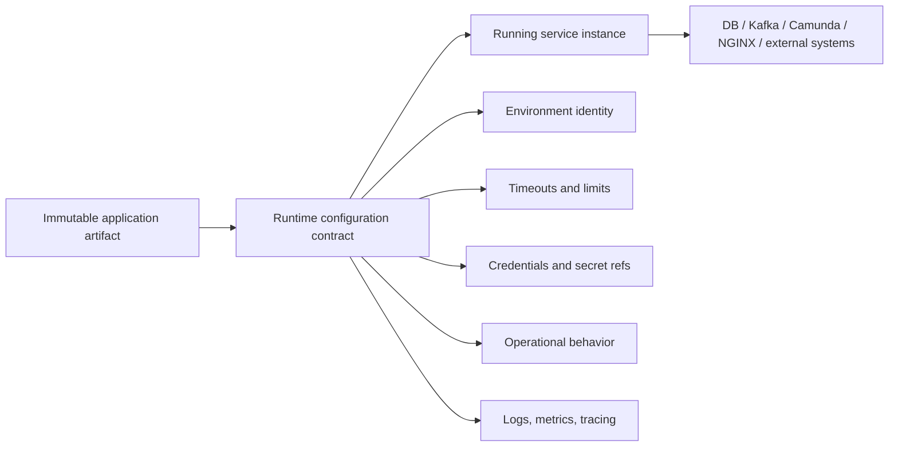
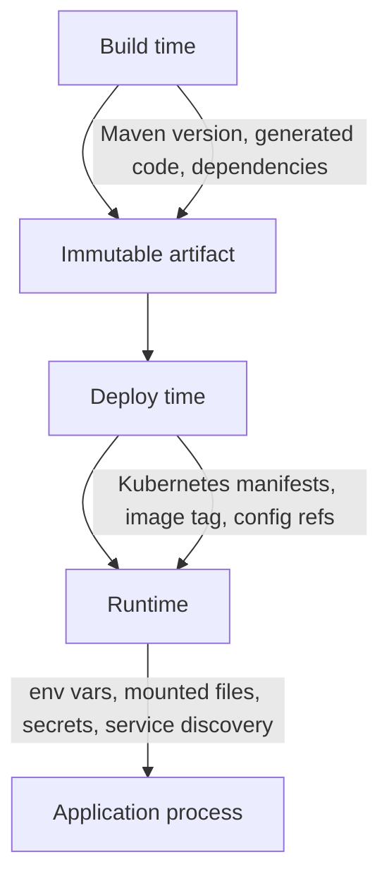
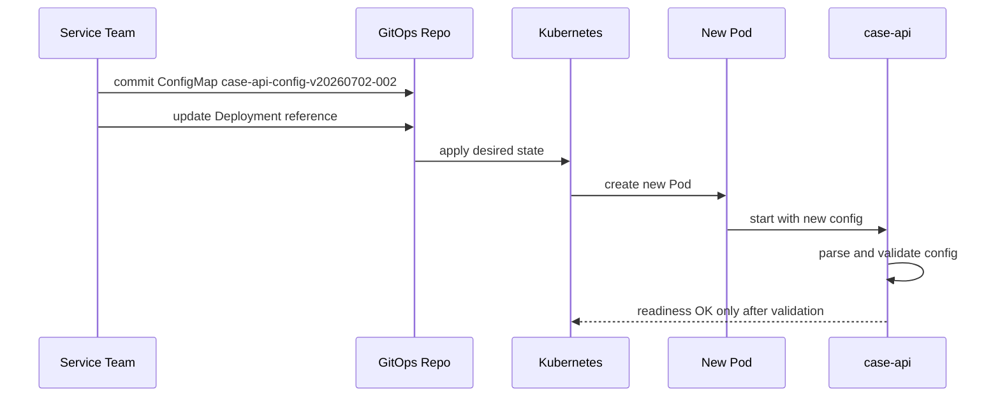
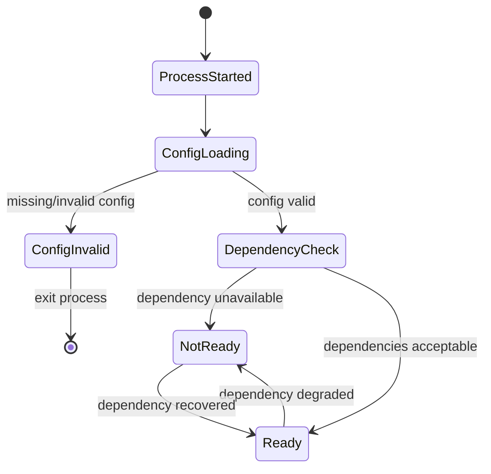
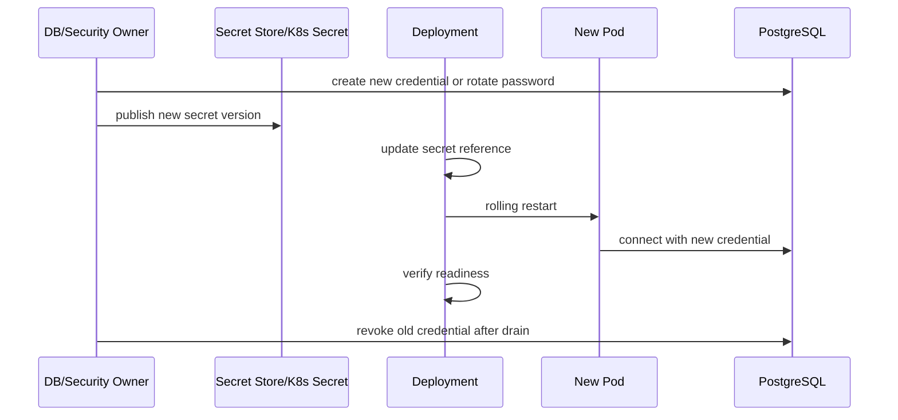

# Part 015 — Configuration, Secrets, and Runtime Profiles

Production system rarely fails because developers do not know how to read an environment variable.

It fails because configuration is treated as a bag of strings.

A typical failure looks like this:

```text
APP_ENV=prod
DB_URL=jdbc:postgresql://staging-db:5432/case_platform
KAFKA_BOOTSTRAP_SERVERS=kafka-prod:9092
CAMUNDA_HISTORY_LEVEL=full
CASE_SLA_REVIEW_HOURS=48
CASE_SLA_REVIEW_HOURS=24
```

Everything starts. Nothing looks wrong. Then one case goes to the wrong database, one SLA timer uses the wrong value, Kafka publishes to production, Camunda creates history volume far above expectation, and the incident is blamed on "configuration issue".

That diagnosis is too shallow.

The real problem is this:

> Configuration is part of the runtime contract. If it is not typed, validated, owned, versioned, observable, and failure-modeled, it is not production-grade configuration.

This part builds the configuration layer for our regulatory enforcement case platform.

We will not repeat Kubernetes basics. We will focus on how to design configuration so that the system is safe under release, restart, rotation, failover, and human operation.

---

## 1. The Mental Model: Configuration is a Runtime Contract

Code has compile-time contracts.

OpenAPI has HTTP contracts.

AsyncAPI has event contracts.

BPMN has process contracts.

Database migration has schema contracts.

Configuration is the contract between the deployable artifact and the runtime environment.



The invariant:

```text
The same artifact should be deployable to local, CI, staging, and production.
Only the runtime contract changes.
```

But there is a dangerous misreading of that invariant.

It does **not** mean every environment can set any random key.

It means:

```text
The artifact declares exactly what it needs.
Each environment supplies valid values.
The application validates them before accepting traffic.
```

A production-grade service should be able to answer these questions at startup:

```text
What environment am I running in?
What config keys are required?
Which values are invalid?
Which values are secrets and must never be logged?
Which values are allowed to differ by environment?
Which values require restart when changed?
Which values can be reloaded dynamically?
Which dependencies are configured but unreachable?
Which behavior flags are enabled?
```

If a service cannot answer those questions, it is operating by convention, not contract.

---

## 2. Configuration Taxonomy

Do not classify configuration only by storage mechanism.

`env var`, `ConfigMap`, `Secret`, and `properties file` are implementation choices.

The more important classification is semantic.

| Category | Example | Owner | Change Frequency | Safe to Log? | Requires Restart? |
|---|---|---|---|---|---|
| Environment identity | `APP_ENV=prod` | platform/release | rarely | yes | yes |
| Service identity | `SERVICE_NAME=case-api` | service team | rarely | yes | yes |
| Dependency endpoint | `DB_HOST`, `KAFKA_BOOTSTRAP_SERVERS` | platform | sometimes | usually yes | usually yes |
| Credential | `DB_PASSWORD` | secret manager/platform | rotated | no | depends |
| Operational limit | `HTTP_REQUEST_TIMEOUT_MS` | service/platform | sometimes | yes | usually yes |
| Domain policy | `CASE_REVIEW_SLA_HOURS` | product/domain owner | controlled | yes | maybe |
| Feature toggle | `ENABLE_CASE_APPEAL_V2` | release owner | frequently | yes | maybe |
| Observability | `LOG_LEVEL`, `TRACE_SAMPLE_RATIO` | SRE/platform | frequently | yes | sometimes |
| Build-time value | Maven version, generated source path | build owner | per build | yes | n/a |

The mistake is mixing these categories into one untyped map.

For this platform, we will use this rule:

> Every configuration key must have a semantic category, owner, validation rule, default strategy, observability rule, and reload strategy.

That sounds heavy. In practice, it becomes a small table per service.

Example for `case-api`:

| Key | Type | Required | Default | Owner | Restart | Secret | Validation |
|---|---:|---:|---|---|---:|---:|---|
| `APP_ENV` | enum | yes | none | platform | yes | no | `local`, `ci`, `staging`, `prod` |
| `SERVICE_NAME` | string | yes | `case-api` | service | yes | no | DNS-safe name |
| `HTTP_PORT` | int | yes | `8080` | platform | yes | no | 1024..65535 |
| `DB_JDBC_URL` | uri/string | yes | none | platform | yes | no | starts with `jdbc:postgresql://` |
| `DB_USERNAME` | string | yes | none | platform | yes | no | non-empty |
| `DB_PASSWORD` | secret | yes | none | platform | maybe | yes | non-empty, never printed |
| `KAFKA_BOOTSTRAP_SERVERS` | list | yes | none | platform | yes | no | at least 1 endpoint |
| `CAMUNDA_BASE_URL` | uri | yes | none | platform | yes | no | valid URI |
| `CASE_INTAKE_IDEMPOTENCY_TTL_HOURS` | duration | yes | `72h` | service | yes | no | 1h..720h |
| `CASE_REVIEW_SLA_HOURS` | duration | yes | none | domain | yes | no | 1h..720h |
| `LOG_LEVEL` | enum | no | `INFO` | platform | maybe | no | `TRACE`..`ERROR` |

That table is not documentation only.

It should drive code, tests, deployment manifests, and operational runbooks.

---

## 3. Build-Time, Deploy-Time, and Runtime Configuration

Many teams blur these three layers.

That creates brittle releases.



### 3.1 Build-Time Configuration

Build-time configuration decides how the artifact is produced.

Examples:

```text
Maven profile for code generation
Dependency versions
Generated source directory
Compiler release version
Testcontainers enable/disable flag
Static analysis rules
```

Build-time configuration should not decide production behavior.

Bad:

```xml
<profile>
  <id>prod</id>
  <properties>
    <db.url>jdbc:postgresql://prod-db:5432/case</db.url>
  </properties>
</profile>
```

Why bad?

Because the artifact is now environment-specific.

A production-grade build should produce an artifact that does not know the production database address.

Better:

```text
Maven builds the same artifact.
Kubernetes injects DB_JDBC_URL at runtime.
The application validates DB_JDBC_URL before starting.
```

Maven profiles are acceptable for build concerns:

```text
- enable integration tests
- enable contract generation
- choose local generated source path
- activate static analysis plugin
- package docker image metadata
```

They should not become the runtime environment model.

### 3.2 Deploy-Time Configuration

Deploy-time configuration is the desired state submitted to the platform.

Examples:

```text
Deployment replica count
Container image tag
ConfigMap name
Secret name
Resource request and limit
Probe paths
Ingress route
ServiceAccount
```

This is where Kubernetes manifests, Helm values, Kustomize overlays, or GitOps definitions usually live.

Deploy-time configuration should answer:

```text
Which artifact version is running?
Which config version is attached?
Which secret version is attached?
How many replicas?
Which ingress rule?
Which service account?
```

It should not hide application meaning.

Bad:

```yaml
values:
  magic: true
  mode: fast
  x: 30
```

Better:

```yaml
caseApi:
  reviewSlaHours: 48
  intakeIdempotencyTtlHours: 72
  kafkaProducerTimeoutMs: 3000
```

### 3.3 Runtime Configuration

Runtime configuration is what the process sees.

Examples:

```text
Environment variables
Mounted configuration files
Mounted secrets
Injected service account token
DNS-resolved service names
Downward API metadata
```

The application should not blindly trust runtime config.

It should parse and validate it as early as possible.

---

## 4. ConfigMap and Secret Mapping in Kubernetes

Kubernetes provides ConfigMaps for non-confidential configuration data and Secrets for sensitive data. ConfigMaps can be consumed as environment variables, command-line arguments, or files in a volume. Secrets can also be mounted as volumes or exposed as environment variables.

The important production point is not memorizing the YAML.

The important point is selecting the right delivery mechanism.

### 4.1 Environment Variables

Environment variables are simple and explicit.

```yaml
apiVersion: apps/v1
kind: Deployment
metadata:
  name: case-api
spec:
  template:
    spec:
      containers:
      - name: case-api
        image: registry.example.com/case-api:1.15.0
        env:
        - name: APP_ENV
          value: "prod"
        - name: HTTP_PORT
          value: "8080"
        - name: DB_JDBC_URL
          valueFrom:
            configMapKeyRef:
              name: case-api-config-v20260702-001
              key: db.jdbcUrl
        - name: DB_USERNAME
          valueFrom:
            secretKeyRef:
              name: case-api-db-secret-v20260702-001
              key: username
        - name: DB_PASSWORD
          valueFrom:
            secretKeyRef:
              name: case-api-db-secret-v20260702-001
              key: password
```

Good for:

```text
small scalar values
startup-only configuration
values that should be visible in process environment
values that require restart when changed
```

Bad for:

```text
large structured config
dynamic reload
highly sensitive values on platforms where process env can be inspected
multi-line certificates
complex routing tables
```

The operational property:

```text
If an env var changes in Kubernetes, the running process does not magically receive the new value.
A new Pod must be created.
```

For most application configuration, that is acceptable and even desirable. Restart gives deterministic behavior.

### 4.2 Mounted Config Files

For structured configuration, mount files.

```yaml
apiVersion: v1
kind: ConfigMap
metadata:
  name: case-api-policy-v20260702-001
data:
  case-policy.yaml: |
    review:
      slaHours: 48
      escalationHours: 72
    appeal:
      enabled: true
      submissionWindowDays: 30
---
apiVersion: apps/v1
kind: Deployment
metadata:
  name: case-api
spec:
  template:
    spec:
      containers:
      - name: case-api
        image: registry.example.com/case-api:1.15.0
        volumeMounts:
        - name: policy-config
          mountPath: /app/config/policy
          readOnly: true
      volumes:
      - name: policy-config
        configMap:
          name: case-api-policy-v20260702-001
```

Good for:

```text
YAML/JSON policy files
routing tables
certificate bundles
large static config
configuration that should be inspectable as a file
```

But do not assume automatic reload means safe reload.

A process may observe partially changed meaning if it reads files repeatedly without validation or versioning.

For production systems, use one of these strategies:

```text
Strategy A: immutable config file + Pod restart
Strategy B: reload endpoint + validate whole config snapshot before swap
Strategy C: sidecar reload controller + explicit application reload contract
```

For this series, the default is:

```text
Immutable config version -> rolling restart -> startup validation -> ready only when valid
```

### 4.3 Secrets

A Kubernetes Secret is the right Kubernetes primitive for sensitive values, but it is not a complete secret management system by itself.

Production secret handling requires:

```text
encryption at rest for the cluster secret store
strict RBAC
namespace boundary
rotation plan
least-privilege service accounts
audit logging
no secret values in logs, metrics, exceptions, or health responses
```

In application code, treat secret values as toxic.

Bad:

```java
LOGGER.info("Connecting to database with user={} password={}", username, password);
```

Better:

```java
LOGGER.info("Connecting to database with user={} password=<redacted>", username);
```

Even better: do not pass raw secret strings into every component.

Use a dedicated value type:

```java
public record SecretValue(String value) {
    public SecretValue {
        if (value == null || value.isBlank()) {
            throw new IllegalArgumentException("secret value must not be blank");
        }
    }

    @Override
    public String toString() {
        return "<redacted>";
    }
}
```

This does not make the secret impossible to leak, but it blocks accidental logging through `toString()`.

---

## 5. Naming Configuration Versions

Mutable names are convenient.

They are also a source of invisible drift.

Bad:

```text
case-api-config
case-api-secret
```

Why bad?

Because the name does not tell which version is attached to a Pod. Someone can mutate the object and the Deployment still points to the same name.

Better:

```text
case-api-config-v20260702-001
case-api-db-secret-v20260702-001
case-api-policy-v20260702-001
```

Then the Deployment references exact versions.

```yaml
envFrom:
- configMapRef:
    name: case-api-config-v20260702-001
```

A new config release creates a new ConfigMap name and triggers a rollout.



This gives you a simple operational invariant:

```text
A running Pod can be traced to an exact image version and an exact config version.
```

That invariant matters during incident review.

---

## 6. Typed Configuration in Java

Configuration should enter the Java process as strings.

It should not remain strings.

Bad:

```java
String timeout = System.getenv("KAFKA_PRODUCER_TIMEOUT_MS");
producer.send(record).get(Long.parseLong(timeout), TimeUnit.MILLISECONDS);
```

Better:

```java
public record KafkaConfig(
        List<String> bootstrapServers,
        Duration producerTimeout,
        String caseEventTopic,
        String consumerGroupId
) {
    public KafkaConfig {
        if (bootstrapServers == null || bootstrapServers.isEmpty()) {
            throw new ConfigException("KAFKA_BOOTSTRAP_SERVERS must contain at least one server");
        }
        if (producerTimeout == null || producerTimeout.isNegative() || producerTimeout.isZero()) {
            throw new ConfigException("KAFKA_PRODUCER_TIMEOUT_MS must be positive");
        }
        if (caseEventTopic == null || caseEventTopic.isBlank()) {
            throw new ConfigException("CASE_EVENT_TOPIC must not be blank");
        }
        if (consumerGroupId == null || consumerGroupId.isBlank()) {
            throw new ConfigException("KAFKA_CONSUMER_GROUP_ID must not be blank");
        }
    }
}
```

A service-level config can compose smaller records:

```java
public record AppConfig(
        Environment environment,
        HttpConfig http,
        DatabaseConfig database,
        KafkaConfig kafka,
        CamundaConfig camunda,
        CasePolicyConfig casePolicy,
        ObservabilityConfig observability
) {
    public AppConfig {
        if (environment == null) throw new ConfigException("APP_ENV is required");
        if (http == null) throw new ConfigException("http config is required");
        if (database == null) throw new ConfigException("database config is required");
        if (kafka == null) throw new ConfigException("kafka config is required");
        if (camunda == null) throw new ConfigException("camunda config is required");
        if (casePolicy == null) throw new ConfigException("case policy config is required");
        if (observability == null) throw new ConfigException("observability config is required");
    }
}
```

Environment should be an enum, not a free-form string:

```java
public enum Environment {
    LOCAL,
    CI,
    STAGING,
    PROD;

    public static Environment parse(String value) {
        if (value == null || value.isBlank()) {
            throw new ConfigException("APP_ENV is required");
        }
        try {
            return Environment.valueOf(value.trim().toUpperCase(Locale.ROOT));
        } catch (IllegalArgumentException ex) {
            throw new ConfigException("APP_ENV must be one of local, ci, staging, prod");
        }
    }

    public boolean isProduction() {
        return this == PROD;
    }
}
```

Then production-specific validation becomes explicit:

```java
public record ObservabilityConfig(
        String logLevel,
        boolean jsonLogging,
        double traceSampleRatio
) {
    public void validateFor(Environment environment) {
        if (environment.isProduction() && !jsonLogging) {
            throw new ConfigException("JSON logging must be enabled in production");
        }
        if (traceSampleRatio < 0.0 || traceSampleRatio > 1.0) {
            throw new ConfigException("TRACE_SAMPLE_RATIO must be between 0.0 and 1.0");
        }
    }
}
```

The key pattern:

```text
Parse string once.
Convert to typed value.
Validate immediately.
Pass typed config to components.
Never let raw environment lookup spread through business code.
```

---

## 7. A Small Config Loader Without Framework Magic

In a large enterprise platform, you may use a mature configuration framework.

But the mental model is easier to see if we implement the core ourselves.

```java
public final class Env {
    private final Map<String, String> values;

    public Env(Map<String, String> values) {
        this.values = Map.copyOf(values);
    }

    public String required(String key) {
        String value = values.get(key);
        if (value == null || value.isBlank()) {
            throw new ConfigException(key + " is required");
        }
        return value.trim();
    }

    public String optional(String key, String defaultValue) {
        String value = values.get(key);
        return value == null || value.isBlank() ? defaultValue : value.trim();
    }

    public int requiredInt(String key, int min, int max) {
        String raw = required(key);
        try {
            int value = Integer.parseInt(raw);
            if (value < min || value > max) {
                throw new ConfigException(key + " must be between " + min + " and " + max);
            }
            return value;
        } catch (NumberFormatException ex) {
            throw new ConfigException(key + " must be an integer");
        }
    }

    public Duration requiredDurationMillis(String key, long minMillis, long maxMillis) {
        int millis = requiredInt(key, (int) minMillis, (int) maxMillis);
        return Duration.ofMillis(millis);
    }

    public URI requiredUri(String key) {
        String raw = required(key);
        try {
            return URI.create(raw);
        } catch (IllegalArgumentException ex) {
            throw new ConfigException(key + " must be a valid URI");
        }
    }

    public SecretValue requiredSecret(String key) {
        return new SecretValue(required(key));
    }
}
```

Now load config in one place:

```java
public final class AppConfigLoader {
    private AppConfigLoader() {}

    public static AppConfig loadFromEnvironment() {
        Env env = new Env(System.getenv());

        Environment environment = Environment.parse(env.required("APP_ENV"));

        HttpConfig http = new HttpConfig(
                env.requiredInt("HTTP_PORT", 1024, 65535),
                env.requiredDurationMillis("HTTP_REQUEST_TIMEOUT_MS", 100, 120_000)
        );

        DatabaseConfig database = new DatabaseConfig(
                env.required("DB_JDBC_URL"),
                env.required("DB_USERNAME"),
                env.requiredSecret("DB_PASSWORD"),
                env.requiredInt("DB_POOL_MAX_SIZE", 1, 200),
                env.requiredDurationMillis("DB_QUERY_TIMEOUT_MS", 100, 300_000)
        );

        KafkaConfig kafka = new KafkaConfig(
                parseCsv(env.required("KAFKA_BOOTSTRAP_SERVERS")),
                env.requiredDurationMillis("KAFKA_PRODUCER_TIMEOUT_MS", 100, 120_000),
                env.required("CASE_EVENT_TOPIC"),
                env.required("CASE_CONSUMER_GROUP_ID")
        );

        CamundaConfig camunda = new CamundaConfig(
                env.requiredUri("CAMUNDA_BASE_URL"),
                env.requiredDurationMillis("CAMUNDA_REQUEST_TIMEOUT_MS", 100, 120_000)
        );

        CasePolicyConfig casePolicy = new CasePolicyConfig(
                Duration.ofHours(env.requiredInt("CASE_REVIEW_SLA_HOURS", 1, 720)),
                Duration.ofHours(env.requiredInt("CASE_ESCALATION_SLA_HOURS", 1, 1440)),
                Duration.ofHours(env.requiredInt("CASE_INTAKE_IDEMPOTENCY_TTL_HOURS", 1, 720))
        );

        ObservabilityConfig observability = new ObservabilityConfig(
                env.optional("LOG_LEVEL", "INFO"),
                Boolean.parseBoolean(env.optional("JSON_LOGGING", "true")),
                Double.parseDouble(env.optional("TRACE_SAMPLE_RATIO", "0.05"))
        );
        observability.validateFor(environment);

        return new AppConfig(environment, http, database, kafka, camunda, casePolicy, observability);
    }

    private static List<String> parseCsv(String value) {
        return Arrays.stream(value.split(","))
                .map(String::trim)
                .filter(s -> !s.isBlank())
                .toList();
    }
}
```

This is intentionally boring.

Boring config code is good.

The dangerous version is clever, implicit, and impossible to debug.

---

## 8. Startup Validation and Readiness

A service should not become ready until configuration is valid.

But valid config is not the same as reachable dependencies.

Separate these checks:

```text
Startup config validation:
  - required keys present
  - values parse correctly
  - cross-field rules pass
  - production-only rules pass

Readiness validation:
  - DB reachable enough for required operation
  - Kafka producer metadata reachable if required
  - Camunda endpoint reachable if this service depends on it synchronously
  - migrations compatible

Liveness validation:
  - process is not deadlocked
  - event loop / server still responds
  - do not check DB deeply here
```

Mermaid view:



A configuration error should usually crash the process.

Why?

Because a bad config is not transient.

If `DB_JDBC_URL` is invalid, retrying inside the same process does not help.

Crash fast. Let Kubernetes restart only after the manifest is fixed. Avoid serving partial behavior.

Bad readiness:

```java
@Path("/health")
public class HealthResource {
    @GET
    public String health() {
        return "OK";
    }
}
```

Better split:

```text
/live   -> process alive, cheap
/ready  -> configured and able to serve traffic
```

For `case-api`, readiness should verify at least:

```text
- AppConfig loaded successfully
- PostgreSQL connection can execute a lightweight query
- database migration version is compatible with application version
- Kafka producer can fetch metadata for required topics, if publishing is mandatory
- Camunda dependency mode is known: required, degraded, or async-only
```

Do not put expensive diagnostics in readiness.

Readiness is called often. It should be fast and bounded.

---

## 9. Runtime Profiles Without Runtime Chaos

A profile is not a second codebase.

A profile is a constrained set of runtime behavior differences.

For this platform:

| Profile | Purpose | Allowed Differences | Forbidden Differences |
|---|---|---|---|
| `local` | developer loop | local endpoints, relaxed auth, smaller timeouts, Testcontainers | different domain rules unless explicitly tested |
| `ci` | automated verification | ephemeral DB/Kafka, strict tests, deterministic data | calling shared staging services |
| `staging` | production-like rehearsal | production-like topology, synthetic secrets, full observability | weaker schema or fake workflow |
| `prod` | real workload | real credentials, strict auth, strict logging, controlled flags | debug endpoints, mock dependencies |

The anti-pattern:

```java
if (env.equals("prod")) {
    runRealWorkflow();
} else {
    skipValidation();
}
```

This creates a system that is only tested in the environment where failure is most expensive.

Better:

```java
if (config.environment().isProduction()) {
    productionSafety.validate(config);
}
```

The behavior should be mostly the same. The safety checks become stricter in production.

Examples of valid profile differences:

```text
local uses localhost Kafka, prod uses cluster Kafka
local uses shorter SLA for test data, prod uses policy-defined SLA
local uses console logging, prod uses structured JSON logging
local may disable external notification, prod must publish notification request events
ci uses ephemeral schema, prod uses migration-managed schema
```

Examples of dangerous profile differences:

```text
local bypasses idempotency entirely
staging uses a different BPMN process model
prod alone uses different event payload fields
ci skips database constraints
non-prod catches and ignores SQL exceptions
```

The invariant:

```text
Profiles may change environment bindings and operational limits.
Profiles must not silently change contract semantics.
```

---

## 10. Configuration for Each Stack Component

Now map configuration to the actual platform.

### 10.1 HTTP/Jersey Configuration

Jersey resource behavior should know:

```text
HTTP_PORT
HTTP_REQUEST_TIMEOUT_MS
HTTP_MAX_REQUEST_BODY_BYTES
HTTP_CORRELATION_HEADER_NAME
HTTP_ENABLE_ACCESS_LOG
HTTP_ERROR_INCLUDE_DEBUG_DETAILS
```

Production rules:

```text
- debug details must be false in prod
- max request body must be bounded
- correlation header must be stable
- timeouts must be less than upstream NGINX timeout
```

Timeout chain matters.

```text
Client timeout > NGINX proxy timeout > Jersey app timeout > DB/Kafka dependency timeout
```

If the inner layer has a longer timeout than the outer layer, the application will keep doing work after the caller has gone away.

### 10.2 PostgreSQL/MyBatis Configuration

Database config should know:

```text
DB_JDBC_URL
DB_USERNAME
DB_PASSWORD
DB_POOL_MAX_SIZE
DB_CONNECTION_TIMEOUT_MS
DB_QUERY_TIMEOUT_MS
DB_MIGRATION_EXPECTED_VERSION
DB_APPLICATION_NAME
```

Production rules:

```text
- application_name must identify service and version
- pool size must respect database max connection budget
- query timeout must exist
- migration version must be checked
- password must never be printed
```

The pool size is not local optimization. It is global capacity planning.

If 20 replicas each open a pool of 50 connections, the platform asks PostgreSQL for 1000 connections.

The correct question is not:

```text
How many connections make this service fast locally?
```

The correct question is:

```text
What is this service's fair share of database concurrency under the production topology?
```

### 10.3 Kafka Configuration

Kafka config should know:

```text
KAFKA_BOOTSTRAP_SERVERS
KAFKA_SECURITY_PROTOCOL
KAFKA_SASL_MECHANISM
KAFKA_PRODUCER_ACKS
KAFKA_PRODUCER_TIMEOUT_MS
KAFKA_CONSUMER_GROUP_ID
KAFKA_CONSUMER_MAX_POLL_RECORDS
KAFKA_CONSUMER_AUTO_OFFSET_RESET
CASE_EVENT_TOPIC
CASE_COMMAND_TOPIC
CASE_DLQ_TOPIC
```

Production rules:

```text
- producer acks must match durability requirement
- consumer group id must be environment-specific
- topic names must be environment-specific or cluster-isolated
- auto offset reset must be deliberate, not defaulted blindly
- DLQ topic must exist if DLQ strategy is enabled
```

A bad config can cause a consumer to silently replay from the beginning or skip historical messages depending on offset state and reset policy.

So Kafka config must be reviewed like data migration config.

### 10.4 Camunda 7 Configuration

Camunda config should know:

```text
CAMUNDA_BASE_URL or embedded engine datasource config
CAMUNDA_REQUEST_TIMEOUT_MS
CAMUNDA_PROCESS_DEFINITION_KEY_CASE_LIFECYCLE
CAMUNDA_WORKER_LOCK_DURATION_MS, if external task style is used
CAMUNDA_HISTORY_LEVEL
CAMUNDA_JOB_RETRY_DEFAULT
CAMUNDA_INCIDENT_ALERT_ENABLED
```

Production rules:

```text
- process definition key must be explicit
- history level must be capacity-planned
- retry behavior must match error model
- worker timeout must be shorter than business SLA
- incident alerting must be enabled for critical process paths
```

The common error is treating Camunda as a black box.

It is not.

Camunda is part of the platform state machine. Its configuration changes process runtime behavior.

### 10.5 NGINX Configuration

NGINX config should know:

```text
proxy_read_timeout
proxy_connect_timeout
client_max_body_size
proxy_buffering
request id header propagation
upstream service name
TLS settings
rate limit zone
```

Production rules:

```text
- NGINX timeout must align with application timeout
- max body size must align with OpenAPI request contract
- request ID must propagate into Jersey
- security headers must be explicit
- buffering must be deliberate for upload/download endpoints
```

### 10.6 Kubernetes Configuration

Kubernetes workload config should know:

```text
replicas
resources.requests
resources.limits
readinessProbe
livenessProbe
startupProbe
serviceAccountName
configMapRef
secretRef
podDisruptionBudget
rollingUpdate strategy
```

Production rules:

```text
- readiness must reflect traffic safety
- liveness must not kill slow but healthy pods
- resource request must be realistic
- secret/config version must be traceable
- service account must be least-privilege
```

---

## 11. Feature Flags and Domain Policy

Feature flags are useful.

They are also a common source of long-term system decay.

A flag should have:

```text
name
owner
purpose
default
allowed environments
expiry date
observability dimension
rollback behavior
test coverage
```

Example:

```text
ENABLE_APPEAL_SUBMISSION_V2
Owner: Case Platform Team
Purpose: Switch appeal submission API from old validation path to contract-first path
Default: false in staging, false in prod until rollout
Allowed env: staging, prod
Expiry: remove after all tenants migrated
Rollback: false routes to old path
Metrics: appeal_submission_path_total{version="v1|v2"}
```

Feature flags must not bypass contracts.

Bad:

```text
ENABLE_APPEAL_V2=true makes API return undocumented field
```

Better:

```text
OpenAPI includes the field as optional.
Flag controls whether the application populates it.
Compatibility is preserved.
```

For regulatory systems, policy config is more dangerous than UI feature toggles.

Example:

```text
CASE_REVIEW_SLA_HOURS=48
CASE_ESCALATION_SLA_HOURS=72
APPEAL_SUBMISSION_WINDOW_DAYS=30
```

These values can affect legal defensibility.

Do not bury them in random config files with no approval trail.

Recommended rule:

```text
Domain policy config requires domain-owner approval and release note entry.
Operational config requires platform/service-owner approval.
Secret config requires platform/security-owner process.
```

---

## 12. Secret Rotation

Secret rotation is not only "change the password".

It is a choreography between dependency, secret store, Kubernetes, application process, and connection pool.

### 12.1 Simple Restart-Based Rotation

For most services, use restart-based rotation first.



This is predictable.

It works well when restart cost is acceptable.

### 12.2 Live Rotation

Live rotation is harder.

It requires:

```text
mounted secret file or external secret client
application reload loop
connection pool credential refresh
safe overlap period
metrics proving old credential no longer used
```

Do not implement live rotation casually.

A broken live rotation can create partial credential state where some connections work and some fail.

For this series, default to restart-based rotation unless a requirement explicitly demands live reload.

---

## 13. Observability of Configuration Without Leaking Secrets

Operators need to know which config version is running.

They do not need secret values.

Expose safe config metadata:

```json
{
  "service": "case-api",
  "version": "1.15.0",
  "environment": "prod",
  "configVersion": "case-api-config-v20260702-001",
  "policyVersion": "case-api-policy-v20260702-001",
  "schemaCompatibility": "ok",
  "features": {
    "appealSubmissionV2": false
  }
}
```

Do not expose:

```text
DB password
Kafka SASL password
JWT signing secret
private key
full connection string if it contains credentials
```

Useful logs at startup:

```text
INFO service=case-api version=1.15.0 env=prod configVersion=case-api-config-v20260702-001 policyVersion=case-api-policy-v20260702-001
INFO db.host=postgres-prod-primary db.name=case_platform db.user=case_api db.password=<redacted>
INFO kafka.bootstrap.count=3 caseEventTopic=prod.case.events.v1
INFO camunda.process.caseLifecycleKey=case_lifecycle
```

Not useful:

```text
INFO Loaded 97 environment variables
```

That says nothing about safety.

---

## 14. Testing Configuration

Configuration must be tested like code.

### 14.1 Unit Tests for Loader

```java
@Test
void rejectsInvalidPort() {
    Map<String, String> env = validEnv();
    env.put("HTTP_PORT", "80");

    ConfigException ex = assertThrows(
            ConfigException.class,
            () -> AppConfigLoader.load(new Env(env))
    );

    assertTrue(ex.getMessage().contains("HTTP_PORT"));
}
```

### 14.2 Production Rule Tests

```java
@Test
void productionRequiresJsonLogging() {
    ObservabilityConfig config = new ObservabilityConfig("INFO", false, 0.05);

    ConfigException ex = assertThrows(
            ConfigException.class,
            () -> config.validateFor(Environment.PROD)
    );

    assertTrue(ex.getMessage().contains("JSON logging"));
}
```

### 14.3 Manifest Tests

For Kubernetes manifests, validate:

```text
- required env vars are present
- ConfigMap/Secret references exist
- prod manifests do not use local endpoints
- readiness/liveness paths match application
- resource requests are set
- secret names are versioned
```

You can implement this with policy tools, CI scripts, or manifest unit tests.

The tool matters less than the invariant.

### 14.4 Integration Tests

Use Testcontainers or equivalent integration infrastructure to verify:

```text
- DB config can open connection
- Kafka config can produce/consume
- Camunda config can deploy/correlate in test profile
- application refuses invalid config before accepting traffic
```

A strong integration test is:

```text
Start service with missing DB_PASSWORD.
Assert process exits or readiness never becomes true.
```

That test prevents a real production incident.

---

## 15. Failure Model

Configuration failure modes are predictable.

| Failure | Symptom | Root Cause | Correct Behavior |
|---|---|---|---|
| Missing key | startup crash | manifest incomplete | fail fast before readiness |
| Invalid type | startup crash | string parse failure | fail fast with key name |
| Wrong environment endpoint | data leak / wrong dependency | bad manifest | detect via env guard, naming, smoke tests |
| Secret missing | auth failure | secret not mounted | fail fast if required |
| Secret rotated without restart | connection failure | stale env var | rollout restart or live reload contract |
| Timeout mismatch | zombie work | outer timeout shorter than inner | timeout chain review |
| Feature flag drift | inconsistent behavior | unclear ownership | expiry + observability + tests |
| ConfigMap mutated in place | non-reproducible runtime | mutable config name | versioned immutable config |
| Policy value wrong | legal/process risk | no domain approval | approval workflow + audit trail |

The production stance:

```text
Configuration errors should be loud, early, and specific.
They should not become business data corruption.
```

---

## 16. Production Checklist

Before `case-api` is allowed into production:

```text
[ ] all required config keys are declared in a config contract table
[ ] config loader parses strings into typed values
[ ] startup fails on invalid config
[ ] production-only validation rules exist
[ ] secrets are redacted by type and logging policy
[ ] ConfigMap and Secret names are versioned
[ ] runtime endpoint exposes safe config metadata only
[ ] liveness and readiness are separate
[ ] timeout chain is documented
[ ] DB pool size is capacity-planned
[ ] Kafka topic and group config is environment-safe
[ ] Camunda process key config is explicit
[ ] feature flags have owner and expiry
[ ] domain policy values have approval trail
[ ] manifest tests verify env/config/secret references
[ ] invalid-config tests exist in CI
```

---

## 17. Anti-Patterns

### Anti-Pattern 1: `System.getenv()` Everywhere

```java
String topic = System.getenv("CASE_EVENT_TOPIC");
```

This spreads runtime parsing across the codebase.

Fix:

```text
Load once. Validate once. Inject typed config.
```

### Anti-Pattern 2: Maven Profile as Environment Model

```bash
mvn package -Pprod
```

If this changes runtime behavior, the artifact is not environment-neutral.

Fix:

```text
Use Maven profiles for build lifecycle only.
Use runtime config for environment behavior.
```

### Anti-Pattern 3: ConfigMap for Secrets

```yaml
data:
  db.password: super-secret
```

Fix:

```text
Use Secret or external secret manager integration.
Still apply encryption, RBAC, rotation, and redaction.
```

### Anti-Pattern 4: One `APP_MODE` to Rule Everything

```text
APP_MODE=fast
```

Nobody knows what this means.

Fix:

```text
Use explicit keys: timeouts, feature flags, pool sizes, policy durations.
```

### Anti-Pattern 5: Readiness Always OK

```text
/ready returns 200 even when DB migration is incompatible
```

Fix:

```text
Readiness should represent safe traffic acceptance.
```

---

## 18. The Core Lesson

Configuration is not an afterthought.

In a production-grade contract-first system, configuration is one of the contracts.

The practical rule:

```text
If a config value can change system behavior, it deserves a name, type, owner, validation rule, test, and operational story.
```

For the rest of this series, every component we build will assume this configuration model:

```text
Immutable artifact
Versioned runtime config
Typed Java config
Fail-fast startup validation
Separate readiness/liveness
Redacted secret handling
Observable config metadata
Profile differences constrained by contract semantics
```

That foundation lets us build Jersey resources, PostgreSQL access, Kafka workers, Camunda delegates, and Kubernetes manifests without hiding production risk in a pile of strings.

---

## References

- Kubernetes Documentation — ConfigMaps: `https://kubernetes.io/docs/concepts/configuration/configmap/`
- Kubernetes Documentation — Secrets: `https://kubernetes.io/docs/concepts/configuration/secret/`
- Kubernetes Documentation — Define Environment Variables for a Container: `https://kubernetes.io/docs/tasks/inject-data-application/define-environment-variable-container/`
- Kubernetes Documentation — Configure a Pod to Use a ConfigMap: `https://kubernetes.io/docs/tasks/configure-pod-container/configure-pod-configmap/`
- Maven Documentation — Build Profiles: `https://maven.apache.org/guides/introduction/introduction-to-profiles.html`
