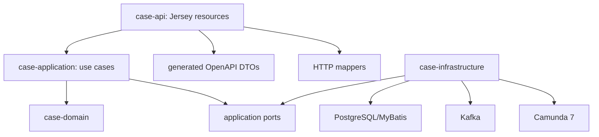

# Part 016 — Jersey Resource Design

A JAX-RS resource class looks simple.

```java
@Path("/cases")
public class CaseResource {
    @POST
    public Response create(CreateCaseRequest request) {
        return Response.ok().build();
    }
}
```

That simplicity is dangerous.

Many production codebases slowly turn resource classes into a mix of:

```text
HTTP parsing
validation
business logic
transaction management
SQL calls
Kafka publishing
Camunda correlation
logging
security checks
error mapping
response construction
```

The endpoint still works.

But the boundary is gone.

In a contract-first platform, the Jersey resource has one job:

> Adapt the HTTP contract to the application use case and adapt the application result back to the HTTP contract.

It should not become the domain model, process engine, repository, event publisher, or transaction script.

This part designs the Jersey HTTP layer for our regulatory enforcement case platform.

We will build it as a production-grade adapter around OpenAPI contracts, typed Java application services, error mapping, request context, and observability.

---

## 1. The Mental Model: Resource Class as Adapter

Think of the resource class as a plug converter.

It sits between two worlds:

```text
HTTP world:
  method, path, headers, query params, body, status code, media type

Application world:
  command, query, domain identity, use case result, domain error
```

It should translate between them and then get out of the way.


Resource design invariant:

```text
A resource method must be easy to read as a contract implementation.
```

Good resource method shape:

```text
extract path/query/header/body
map request DTO to command/query
call application service
return mapped response
```

Bad resource method shape:

```text
parse JSON manually
start DB transaction
run SQL
mutate process variables
send Kafka event
catch every exception
manually build inconsistent errors
```

The difference is not aesthetic. It decides whether the API can evolve safely.

---

## 2. Contract-First Resource Implementation

Part 006 designed the OpenAPI contract.

That contract should drive the resource boundary.

A simplified OpenAPI fragment:

```yaml
paths:
  /v1/cases:
    post:
      operationId: submitCase
      parameters:
        - name: Idempotency-Key
          in: header
          required: true
          schema:
            type: string
        - name: X-Correlation-Id
          in: header
          required: false
          schema:
            type: string
      requestBody:
        required: true
        content:
          application/json:
            schema:
              $ref: '#/components/schemas/SubmitCaseRequest'
      responses:
        '202':
          description: Case accepted for processing
          content:
            application/json:
              schema:
                $ref: '#/components/schemas/SubmitCaseResponse'
        '400':
          $ref: '#/components/responses/BadRequest'
        '409':
          $ref: '#/components/responses/Conflict'
```

The Jersey resource should look like an implementation of that operation.

```java
@Path("/v1/cases")
@Consumes(MediaType.APPLICATION_JSON)
@Produces(MediaType.APPLICATION_JSON)
public final class CaseResource {
    private final SubmitCaseUseCase submitCaseUseCase;
    private final CaseHttpMapper mapper;

    public CaseResource(SubmitCaseUseCase submitCaseUseCase,
                        CaseHttpMapper mapper) {
        this.submitCaseUseCase = Objects.requireNonNull(submitCaseUseCase);
        this.mapper = Objects.requireNonNull(mapper);
    }

    @POST
    public Response submitCase(
            @HeaderParam("Idempotency-Key") String idempotencyKey,
            @HeaderParam("X-Correlation-Id") String correlationId,
            SubmitCaseRequestDto body
    ) {
        SubmitCaseCommand command = mapper.toSubmitCaseCommand(
                idempotencyKey,
                correlationId,
                body
        );

        SubmitCaseResult result = submitCaseUseCase.submit(command);

        return mapper.toSubmitCaseResponse(result);
    }
}
```

Notice what is not here:

```text
No SQL.
No Kafka producer.
No Camunda runtime service.
No transaction boundary.
No domain mutation.
No generic catch block.
No raw environment lookup.
```

The resource is thin, but not dumb.

It owns HTTP adaptation.

---

## 3. Package Boundary

A clean package layout makes architecture harder to violate.

```text
case-api/
  src/main/java/com/example/caseplatform/api/
    JerseyApplication.java
    resource/
      CaseResource.java
      CaseTaskResource.java
      CaseDecisionResource.java
      HealthResource.java
    filter/
      CorrelationIdFilter.java
      AccessLogFilter.java
      SecurityContextFilter.java
    mapper/
      CaseHttpMapper.java
      ProblemDetailsMapper.java
    provider/
      JsonProvider.java
      ValidationExceptionMapper.java
      DomainExceptionMapper.java
      UnhandledExceptionMapper.java
    dto/
      generated/...

case-application/
  SubmitCaseUseCase.java
  AssignCaseTaskUseCase.java
  DecideCaseUseCase.java
  model/...

case-domain/
  CaseId.java
  CaseLifecycleState.java
  CaseCommand.java
  CaseError.java
```

The dependency direction:



Allowed:

```text
case-api depends on case-application
case-api depends on generated DTOs
case-api maps HTTP DTO to application command
```

Forbidden:

```text
case-domain depends on JAX-RS
case-application depends on Jersey Response
case-resource uses MyBatis mapper directly
case-resource calls Kafka producer directly
case-resource reaches Camunda RuntimeService directly
```

This is how we prevent resource classes from becoming mini monoliths.

---

## 4. Jersey Application Registration

In production systems, explicit registration is usually easier to reason about than magical classpath scanning.

A Jersey application can be configured with a `ResourceConfig`.

```java
public final class JerseyApplication extends ResourceConfig {
    public JerseyApplication(AppComponents components) {
        register(new CaseResource(
                components.submitCaseUseCase(),
                components.caseHttpMapper()
        ));

        register(new CaseTaskResource(
                components.assignTaskUseCase(),
                components.caseTaskHttpMapper()
        ));

        register(new HealthResource(
                components.healthService()
        ));

        register(new CorrelationIdFilter());
        register(new AccessLogFilter());
        register(new SecurityContextFilter(components.authVerifier()));

        register(new ValidationExceptionMapper(components.problemDetailsMapper()));
        register(new DomainExceptionMapper(components.problemDetailsMapper()));
        register(new UnhandledExceptionMapper(components.problemDetailsMapper()));

        register(components.jsonProvider());
    }
}
```

The point is not that every project must register this way.

The point is that the HTTP layer should be explicit enough that you can answer:

```text
Which resources are exposed?
Which filters run before resource methods?
Which exception mapper handles which error?
Which JSON provider is used?
Which dependencies are injected into each resource?
```

If you cannot answer those questions, debugging production behavior becomes guesswork.

---

## 5. Request Context: Correlation, Caller, and Tenant

Every request needs context.

Not everything belongs in the body.

For this platform, request context contains:

```text
correlation id
request id
caller identity
caller roles/groups
tenant or jurisdiction, if multi-tenant
source IP / forwarded chain, if trusted
idempotency key, for mutating operations
received timestamp
```

Do not pass these as random strings everywhere.

Create a request context type:

```java
public record RequestContext(
        CorrelationId correlationId,
        RequestId requestId,
        CallerIdentity caller,
        Instant receivedAt
) {}
```

A JAX-RS filter can create the context.

```java
@Provider
@Priority(Priorities.AUTHENTICATION)
public final class CorrelationIdFilter implements ContainerRequestFilter, ContainerResponseFilter {
    public static final String HEADER = "X-Correlation-Id";
    public static final String PROPERTY = "requestContext";

    @Override
    public void filter(ContainerRequestContext requestContext) {
        String incoming = requestContext.getHeaderString(HEADER);
        CorrelationId correlationId = CorrelationId.fromNullable(incoming);
        RequestId requestId = RequestId.newId();

        RequestContext context = new RequestContext(
                correlationId,
                requestId,
                CallerIdentity.anonymous(),
                Instant.now()
        );

        requestContext.setProperty(PROPERTY, context);
    }

    @Override
    public void filter(ContainerRequestContext requestContext,
                       ContainerResponseContext responseContext) {
        RequestContext context = (RequestContext) requestContext.getProperty(PROPERTY);
        if (context != null) {
            responseContext.getHeaders().putSingle(HEADER, context.correlationId().value());
            responseContext.getHeaders().putSingle("X-Request-Id", context.requestId().value());
        }
    }
}
```

Then the resource can receive the low-level JAX-RS context and convert it once:

```java
@Context
private ContainerRequestContext containerRequestContext;

private RequestContext requestContext() {
    return (RequestContext) containerRequestContext.getProperty(CorrelationIdFilter.PROPERTY);
}
```

Or inject a small wrapper if your DI style supports it.

The invariant:

```text
Request context is created before resource method execution and propagated into application commands.
```

Example command:

```java
public record SubmitCaseCommand(
        RequestContext requestContext,
        IdempotencyKey idempotencyKey,
        ExternalReference externalReference,
        PartySnapshot reportingParty,
        List<EvidenceReference> evidence,
        String allegationSummary
) {}
```

This makes audit and event publication consistent later.

---

## 6. Resource Method Design

A resource method should be boring.

Boring is good.

Pattern:

```java
@POST
public Response submitCase(
        @HeaderParam("Idempotency-Key") String idempotencyKey,
        SubmitCaseRequestDto body
) {
    RequestContext context = requestContext();
    SubmitCaseCommand command = mapper.toCommand(context, idempotencyKey, body);
    SubmitCaseResult result = submitCaseUseCase.submit(command);
    return mapper.toResponse(result);
}
```

A method can have light HTTP decisions.

Example:

```java
@GET
@Path("/{caseId}")
public Response getCase(@PathParam("caseId") String caseId) {
    RequestContext context = requestContext();

    GetCaseQuery query = new GetCaseQuery(
            context,
            CaseId.parse(caseId)
    );

    GetCaseResult result = getCaseUseCase.get(query);

    return mapper.toResponse(result);
}
```

But avoid this:

```java
@GET
@Path("/{caseId}")
public Response getCase(@PathParam("caseId") String caseId) {
    try (SqlSession session = sqlSessionFactory.openSession()) {
        CaseRow row = session.getMapper(CaseMapper.class).findById(caseId);
        if (row == null) return Response.status(404).build();
        RuntimeService runtimeService = camunda.getRuntimeService();
        ProcessInstance pi = runtimeService.createProcessInstanceQuery()
                .processInstanceBusinessKey(caseId)
                .singleResult();
        return Response.ok(Map.of("case", row, "process", pi.getId())).build();
    }
}
```

Why bad?

Because it creates hidden coupling:

```text
HTTP endpoint now knows SQL session lifecycle
HTTP endpoint knows Camunda query model
HTTP endpoint owns response aggregation logic
HTTP endpoint owns error behavior accidentally
```

Better:

```text
Resource -> GetCaseUseCase -> ports -> infrastructure adapters
```

---

## 7. DTO to Domain Mapping

Generated OpenAPI DTOs are not domain models.

They are boundary models.

Boundary models answer:

```text
What did the client send?
What does the API return?
```

Domain models answer:

```text
What does the system mean?
What invariants must hold?
What transitions are allowed?
```

Mapping code is not boilerplate. It is a contract enforcement point.

```java
public final class CaseHttpMapper {
    public SubmitCaseCommand toCommand(RequestContext context,
                                       String rawIdempotencyKey,
                                       SubmitCaseRequestDto body) {
        if (body == null) {
            throw ApiValidationException.requiredBody("SubmitCaseRequest");
        }

        return new SubmitCaseCommand(
                context,
                IdempotencyKey.parse(rawIdempotencyKey),
                ExternalReference.parse(body.getExternalReference()),
                mapReportingParty(body.getReportingParty()),
                mapEvidence(body.getEvidence()),
                normalizeSummary(body.getAllegationSummary())
        );
    }

    private PartySnapshot mapReportingParty(ReportingPartyDto dto) {
        if (dto == null) {
            throw ApiValidationException.requiredField("reportingParty");
        }
        return new PartySnapshot(
                PartyName.parse(dto.getName()),
                ContactPoint.parse(dto.getContact())
        );
    }

    private List<EvidenceReference> mapEvidence(List<EvidenceDto> evidence) {
        if (evidence == null || evidence.isEmpty()) {
            throw ApiValidationException.requiredField("evidence");
        }
        return evidence.stream()
                .map(e -> EvidenceReference.parse(e.getType(), e.getUri()))
                .toList();
    }

    private String normalizeSummary(String value) {
        if (value == null || value.isBlank()) {
            throw ApiValidationException.requiredField("allegationSummary");
        }
        return value.trim();
    }
}
```

This mapper does three things:

```text
converts HTTP strings to domain value objects
normalizes boundary data
throws API validation errors for invalid request shape
```

It does not:

```text
query database
start process instance
publish Kafka event
make authorization decision
```

Keep mappers pure and easy to test.

---

## 8. Response Semantics

A production API should not return `200 OK` for everything.

For case intake:

| Scenario | HTTP Status | Why |
|---|---:|---|
| new case accepted asynchronously | `202 Accepted` | process continues after response |
| duplicate idempotency key, same payload | `200 OK` or `202 Accepted` with same result | safe duplicate |
| duplicate idempotency key, different payload | `409 Conflict` | client reused key incorrectly |
| invalid request body | `400 Bad Request` | malformed or semantically invalid input |
| unauthorized | `401 Unauthorized` | caller not authenticated |
| forbidden | `403 Forbidden` | caller authenticated but not allowed |
| case not found | `404 Not Found` | resource does not exist or not visible |
| unsupported media type | `415 Unsupported Media Type` | body format unsupported |
| dependency unavailable | `503 Service Unavailable` | temporary server inability |

For our `submitCase` response:

```java
public Response toSubmitCaseResponse(SubmitCaseResult result) {
    return switch (result) {
        case SubmitCaseResult.Accepted accepted -> Response
                .accepted(new SubmitCaseResponseDto()
                        .caseId(accepted.caseId().value())
                        .status("ACCEPTED")
                        .processInstanceKey(accepted.processReference().value()))
                .location(URI.create("/v1/cases/" + accepted.caseId().value()))
                .build();

        case SubmitCaseResult.Duplicate duplicate -> Response
                .status(Response.Status.OK)
                .entity(new SubmitCaseResponseDto()
                        .caseId(duplicate.caseId().value())
                        .status("DUPLICATE_ACCEPTED"))
                .build();
    };
}
```

This example assumes Java sealed result types from earlier parts.

The important point:

```text
HTTP status must reflect client-observable contract semantics, not internal implementation convenience.
```

---

## 9. Exception Mapping

Do not catch everything in every resource method.

JAX-RS supports exception mapping through providers. Jersey implements this mechanism.

Resource method:

```java
@POST
public Response submitCase(@HeaderParam("Idempotency-Key") String idempotencyKey,
                           SubmitCaseRequestDto body) {
    SubmitCaseCommand command = mapper.toCommand(requestContext(), idempotencyKey, body);
    SubmitCaseResult result = submitCaseUseCase.submit(command);
    return mapper.toSubmitCaseResponse(result);
}
```

Exception mapper:

```java
@Provider
public final class ApiValidationExceptionMapper
        implements ExceptionMapper<ApiValidationException> {

    private final ProblemDetailsMapper problemDetailsMapper;

    public ApiValidationExceptionMapper(ProblemDetailsMapper problemDetailsMapper) {
        this.problemDetailsMapper = problemDetailsMapper;
    }

    @Override
    public Response toResponse(ApiValidationException exception) {
        ProblemDetailsDto problem = problemDetailsMapper.validationProblem(exception);
        return Response.status(Response.Status.BAD_REQUEST)
                .type("application/problem+json")
                .entity(problem)
                .build();
    }
}
```

Domain exception mapper:

```java
@Provider
public final class DomainExceptionMapper
        implements ExceptionMapper<DomainException> {

    private final ProblemDetailsMapper problemDetailsMapper;

    @Override
    public Response toResponse(DomainException exception) {
        ProblemDetailsDto problem = problemDetailsMapper.domainProblem(exception);
        Response.Status status = switch (exception.code()) {
            case "CASE_NOT_FOUND" -> Response.Status.NOT_FOUND;
            case "CASE_CONFLICT" -> Response.Status.CONFLICT;
            case "FORBIDDEN_TRANSITION" -> Response.Status.CONFLICT;
            default -> Response.Status.BAD_REQUEST;
        };

        return Response.status(status)
                .type("application/problem+json")
                .entity(problem)
                .build();
    }
}
```

Unhandled exception mapper:

```java
@Provider
public final class UnhandledExceptionMapper
        implements ExceptionMapper<Throwable> {

    private static final Logger log = LoggerFactory.getLogger(UnhandledExceptionMapper.class);
    private final ProblemDetailsMapper problemDetailsMapper;

    @Override
    public Response toResponse(Throwable exception) {
        RequestContext context = CurrentRequestContext.getOrUnknown();

        log.error("Unhandled API exception correlationId={} requestId={}",
                context.correlationId().value(),
                context.requestId().value(),
                exception);

        ProblemDetailsDto problem = problemDetailsMapper.internalServerError(context);

        return Response.status(Response.Status.INTERNAL_SERVER_ERROR)
                .type("application/problem+json")
                .entity(problem)
                .build();
    }
}
```

Do not expose stack traces in production error responses.

Do log enough context for operators to correlate.

---

## 10. Problem Details Shape

Part 012 introduced the error model.

The Jersey layer materializes it as HTTP problem details.

Example response:

```json
{
  "type": "https://errors.example.com/case-platform/validation-error",
  "title": "Invalid request",
  "status": 400,
  "detail": "reportingParty is required",
  "instance": "/v1/cases",
  "correlationId": "corr-01JZ9MSZT6V7G4KHDXCN7K1RAQ",
  "errorCode": "API_VALIDATION_ERROR",
  "violations": [
    {
      "field": "reportingParty",
      "message": "must be provided"
    }
  ]
}
```

A mapper can create it consistently:

```java
public final class ProblemDetailsMapper {
    public ProblemDetailsDto validationProblem(ApiValidationException ex) {
        RequestContext context = CurrentRequestContext.getOrUnknown();

        return new ProblemDetailsDto()
                .type("https://errors.example.com/case-platform/validation-error")
                .title("Invalid request")
                .status(400)
                .detail(ex.safeMessage())
                .correlationId(context.correlationId().value())
                .errorCode(ex.errorCode())
                .violations(ex.violations().stream()
                        .map(this::toViolationDto)
                        .toList());
    }
}
```

The invariant:

```text
Every non-2xx API error has a stable machine-readable errorCode and correlationId.
```

That is what makes client behavior, support workflow, and incident debugging possible.

---

## 11. Validation Boundary

There are multiple validation layers.

Do not collapse them.

| Layer | Example | Owner | Error Type |
|---|---|---|---|
| HTTP syntax | invalid JSON | Jersey/Jackson | `400` |
| OpenAPI shape | missing required field | API contract | `400` |
| API semantic | invalid idempotency key format | API mapper | `400` |
| Authorization | caller cannot submit case | application/security | `403` |
| Domain invariant | case cannot transition | domain/application | `409` |
| Database invariant | unique key violation | persistence | mapped domain/data error |

Validation in resource/mappers should stop bad requests before they enter the application service.

But resource validation should not know deep business rules.

Example:

```text
allegationSummary missing -> API validation
case cannot be closed while investigation task active -> domain/application rule
unique idempotency key violation -> persistence translated to idempotency result/conflict
```

Bean Validation can be useful for simple DTO constraints.

But in contract-first systems, generated DTO constraints must be treated carefully:

```text
- generated annotations are good for simple shape validation
- domain value objects still enforce domain meaning
- mapper still normalizes and converts
- application service still checks authorization and business invariants
```

Do not let annotation validation become your only model of correctness.

---

## 12. Filters and Interceptors

Filters operate around request/response metadata.

Interceptors operate around entity body read/write.

Use them deliberately.

### 12.1 Correlation Filter

Already covered above.

Responsibilities:

```text
read or create correlation id
create request id
attach request context
write correlation headers to response
```

### 12.2 Security Context Filter

A security filter should verify caller identity before the resource method.

```java
@Provider
@Priority(Priorities.AUTHENTICATION)
public final class SecurityContextFilter implements ContainerRequestFilter {
    private final AuthVerifier authVerifier;

    public SecurityContextFilter(AuthVerifier authVerifier) {
        this.authVerifier = authVerifier;
    }

    @Override
    public void filter(ContainerRequestContext requestContext) {
        String authorization = requestContext.getHeaderString(HttpHeaders.AUTHORIZATION);
        CallerIdentity caller = authVerifier.verify(authorization);

        RequestContext existing = (RequestContext) requestContext
                .getProperty(CorrelationIdFilter.PROPERTY);

        RequestContext updated = new RequestContext(
                existing.correlationId(),
                existing.requestId(),
                caller,
                existing.receivedAt()
        );

        requestContext.setProperty(CorrelationIdFilter.PROPERTY, updated);
    }
}
```

Do not trust arbitrary forwarded headers unless NGINX/ingress trust boundary is configured.

### 12.3 Access Log Filter

Access logs should be structured.

```java
@Provider
public final class AccessLogFilter implements ContainerRequestFilter, ContainerResponseFilter {
    private final Clock clock;

    @Override
    public void filter(ContainerRequestContext requestContext) {
        requestContext.setProperty("startedAt", clock.instant());
    }

    @Override
    public void filter(ContainerRequestContext requestContext,
                       ContainerResponseContext responseContext) {
        Instant startedAt = (Instant) requestContext.getProperty("startedAt");
        long durationMs = Duration.between(startedAt, clock.instant()).toMillis();
        RequestContext context = (RequestContext) requestContext.getProperty(CorrelationIdFilter.PROPERTY);

        log.info("http_request method={} path={} status={} durationMs={} correlationId={} requestId={}",
                requestContext.getMethod(),
                requestContext.getUriInfo().getPath(),
                responseContext.getStatus(),
                durationMs,
                context.correlationId().value(),
                context.requestId().value());
    }
}
```

Never log request bodies by default in a regulatory system.

They may contain personal data, evidence references, complaint text, or legal-sensitive information.

---

## 13. Resource Boundary and Transactions

A common question:

> Should the Jersey resource start the database transaction?

Usually, no.

The transaction belongs to the application use case or lower application service boundary.

Why?

Because the use case knows the unit of consistency.

Example submit case flow:

```text
HTTP request
-> SubmitCaseUseCase
   -> validate caller
   -> check idempotency
   -> insert case
   -> insert audit record
   -> insert outbox event
   -> start/correlate workflow command, depending architecture
-> return accepted result
```

The transaction boundary is around application state mutation, not around HTTP method mechanics.

Do not do this:

```java
@POST
public Response submitCase(SubmitCaseRequestDto body) {
    transactionManager.inTransaction(() -> {
        SubmitCaseCommand command = mapper.toCommand(requestContext(), body);
        SubmitCaseResult result = submitCaseUseCase.submit(command);
        return mapper.toResponse(result);
    });
}
```

This makes the resource responsible for transaction policy.

Better:

```java
@POST
public Response submitCase(SubmitCaseRequestDto body) {
    SubmitCaseCommand command = mapper.toCommand(requestContext(), body);
    SubmitCaseResult result = submitCaseUseCase.submit(command);
    return mapper.toResponse(result);
}
```

The use case decides transaction behavior internally.

This allows the same use case to be called from:

```text
HTTP resource
Kafka consumer
Camunda delegate
batch repair tool
```

without duplicating transaction rules.

---

## 14. Async API Semantics Over HTTP

Case intake often starts asynchronous work.

The API should not pretend that the workflow is finished.

Bad:

```text
POST /v1/cases returns 200 OK with status CLOSED
```

unless the case is truly closed synchronously.

Better:

```text
POST /v1/cases returns 202 Accepted
Location: /v1/cases/{caseId}
```

Response:

```json
{
  "caseId": "case_01JZ9N8NV4P6Q4XV7Y0G8WT73Y",
  "status": "ACCEPTED",
  "links": {
    "self": "/v1/cases/case_01JZ9N8NV4P6Q4XV7Y0G8WT73Y",
    "tasks": "/v1/cases/case_01JZ9N8NV4P6Q4XV7Y0G8WT73Y/tasks"
  }
}
```

This is honest.

It tells the client:

```text
The request is accepted.
Processing continues.
Poll or subscribe to another channel for state changes.
```

In our architecture, the accepted request may result in:

```text
PostgreSQL case row
idempotency row
outbox event
Camunda process start/correlation
Kafka event publication
human task creation
```

The HTTP resource should not wait for every asynchronous side effect unless the contract explicitly requires it.

---

## 15. Pagination and Query Resources

Query endpoints have different design pressure.

Example:

```text
GET /v1/cases?status=UNDER_REVIEW&pageSize=50&pageToken=...
```

Resource method:

```java
@GET
public Response searchCases(@QueryParam("status") String status,
                            @QueryParam("pageSize") Integer pageSize,
                            @QueryParam("pageToken") String pageToken) {
    SearchCasesQuery query = mapper.toSearchCasesQuery(
            requestContext(),
            status,
            pageSize,
            pageToken
    );

    SearchCasesResult result = searchCasesUseCase.search(query);

    return mapper.toSearchCasesResponse(result);
}
```

Do not expose database pagination mechanics directly.

Bad:

```text
GET /v1/cases?offset=1000000&limit=1000
```

This invites expensive queries and unstable result windows.

Better:

```text
GET /v1/cases?pageSize=50&pageToken=opaque-token
```

The token can encode stable cursor information.

The resource does not need to know the SQL cursor shape.

It only maps HTTP query params into a query object.

---

## 16. Health Resources

Health endpoints are resources too, but they have different contracts.

```java
@Path("/health")
@Produces(MediaType.APPLICATION_JSON)
public final class HealthResource {
    private final HealthService healthService;

    @GET
    @Path("/live")
    public Response live() {
        return Response.ok(Map.of("status", "UP")).build();
    }

    @GET
    @Path("/ready")
    public Response ready() {
        Readiness readiness = healthService.readiness();
        if (readiness.ready()) {
            return Response.ok(readiness.safeView()).build();
        }
        return Response.status(Response.Status.SERVICE_UNAVAILABLE)
                .entity(readiness.safeView())
                .build();
    }
}
```

Rules:

```text
/live should be cheap and should not deeply check dependencies
/ready should reflect safe traffic acceptance
health output must not leak secrets
readiness dependency checks must be bounded by timeout
```

In Kubernetes, these endpoints are not just diagnostics. They control traffic and restart behavior.

Design them carefully.

---

## 17. Testing Jersey Resources

Resource tests should verify HTTP adaptation, not the whole world.

### 17.1 Mapper Unit Test

```java
@Test
void mapsSubmitCaseRequestToCommand() {
    SubmitCaseRequestDto dto = new SubmitCaseRequestDto()
            .externalReference("EXT-123")
            .reportingParty(new ReportingPartyDto().name("Alice").contact("alice@example.com"))
            .evidence(List.of(new EvidenceDto().type("DOCUMENT").uri("s3://bucket/file.pdf")))
            .allegationSummary("Possible violation");

    SubmitCaseCommand command = mapper.toCommand(
            sampleRequestContext(),
            "idem-123",
            dto
    );

    assertEquals("EXT-123", command.externalReference().value());
    assertEquals("idem-123", command.idempotencyKey().value());
}
```

### 17.2 Resource Test with Stub Use Case

```java
@Test
void submitCaseReturns202() {
    SubmitCaseUseCase useCase = command -> new SubmitCaseResult.Accepted(
            CaseId.parse("case_123"),
            ProcessReference.parse("proc_456")
    );

    CaseResource resource = new CaseResource(useCase, new CaseHttpMapper());

    Response response = resource.submitCase(
            "idem-123",
            "corr-123",
            validRequestDto()
    );

    assertEquals(202, response.getStatus());
}
```

### 17.3 Provider Test

```java
@Test
void validationExceptionMapsToProblemDetails() {
    ApiValidationException ex = ApiValidationException.requiredField("reportingParty");

    Response response = mapper.toResponse(ex);

    assertEquals(400, response.getStatus());
    assertEquals("application/problem+json", response.getMediaType().toString());
}
```

### 17.4 Contract Test

Contract tests should verify that actual HTTP behavior matches OpenAPI.

Examples:

```text
- missing required field returns documented 400 shape
- successful submit returns documented 202 shape
- unsupported content type returns 415
- duplicate idempotency conflict returns 409
- response does not contain undocumented required-breaking fields
```

Do not rely only on generated code. Generated code can prove shape alignment, but behavior still needs tests.

---

## 18. Failure Model

| Failure | Symptom | Likely Root Cause | Resource-Layer Response |
|---|---|---|---|
| invalid JSON | `400` | malformed body | provider maps parse error to problem details |
| missing required field | `400` | client contract violation | mapper/validation reports field |
| invalid domain transition | `409` | request conflicts with current state | domain error mapper |
| unauthenticated caller | `401` | missing/invalid token | security filter aborts |
| unauthorized caller | `403` | role/policy failure | application/security error mapper |
| DB timeout | `503` or `500` depending policy | dependency failure | application/persistence error translated safely |
| Kafka unavailable during required publish | `503` | dependency failure | use case returns retryable service error |
| unexpected bug | `500` | coding defect | unhandled mapper logs correlation ID, hides stack trace |
| missing correlation header | no failure | client omitted optional header | filter creates one |
| oversized request | `413` | client body too large | NGINX/Jersey limit, documented error |

The resource layer should make failures understandable to clients and operators.

It should not hide failures behind generic `200 OK` or leak internals through stack traces.

---

## 19. Production Checklist

Before exposing a Jersey resource in production:

```text
[ ] operation exists in OpenAPI
[ ] resource path/method/status codes match contract
[ ] request DTO is not used as domain model
[ ] resource calls application use case, not infrastructure directly
[ ] request context is created before resource method
[ ] correlation ID is returned in response
[ ] authentication filter runs before protected resources
[ ] validation errors map to stable problem details
[ ] domain errors map to documented statuses
[ ] unhandled errors are logged with correlation ID
[ ] request/response logging avoids sensitive body data
[ ] health endpoints separate liveness and readiness
[ ] contract tests verify documented behavior
[ ] resource tests use stub application services
[ ] timeout behavior aligns with NGINX and downstream dependencies
```

---

## 20. Anti-Patterns

### Anti-Pattern 1: Resource as Transaction Script

```java
@POST
public Response submit(...) {
    insertCase();
    startCamundaProcess();
    publishKafkaEvent();
    return Response.ok().build();
}
```

Fix:

```text
Resource adapts HTTP to SubmitCaseUseCase.
Use case owns transaction and side-effect policy.
```

### Anti-Pattern 2: Generated DTO as Domain Entity

```java
public void submit(SubmitCaseRequestDto dto) {
    caseRepository.save(dto);
}
```

Fix:

```text
Map DTO to domain command/value objects.
```

### Anti-Pattern 3: Catch-All in Every Method

```java
try {
    ...
} catch (Exception ex) {
    return Response.serverError().build();
}
```

Fix:

```text
Use consistent exception mappers and typed errors.
```

### Anti-Pattern 4: Returning 200 for Business Failure

```json
{
  "success": false,
  "message": "case not found"
}
```

with HTTP `200`.

Fix:

```text
Use HTTP status according to contract: 404, 409, 422/400, 403, etc.
```

### Anti-Pattern 5: Logging Full Request Body

Regulatory case data can contain sensitive evidence.

Fix:

```text
Log metadata, not sensitive payload.
Use explicit safe fields.
```

---

## 21. The Core Lesson

Jersey resources are not where the system becomes smart.

They are where the system becomes precise.

A production-grade resource layer does four things well:

```text
It implements the OpenAPI contract honestly.
It translates HTTP data into application commands.
It translates application results into HTTP responses.
It applies consistent cross-cutting request behavior through filters and providers.
```

Everything else should move inward to the application layer or outward to infrastructure adapters.

The next part will deepen the most failure-prone parts of this boundary: validation, idempotency, and error handling.

---

## References

- Eclipse Jersey User Guide: `https://eclipse-ee4j.github.io/jersey.github.io/documentation/latest/user-guide.html`
- Eclipse Jersey Application Deployment and Runtime Environments: `https://eclipse-ee4j.github.io/jersey.github.io/documentation/3.0.1/deployment.html`
- Jakarta RESTful Web Services Specification: `https://jakarta.ee/specifications/restful-ws/3.0/`
- Jakarta RESTful Web Services Specification Document: `https://jakarta.ee/specifications/restful-ws/3.0/jakarta-restful-ws-spec-3.0.html`
- RFC 9457 — Problem Details for HTTP APIs: `https://www.rfc-editor.org/rfc/rfc9457.html`
