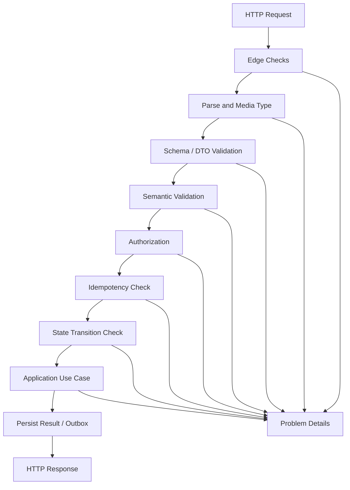
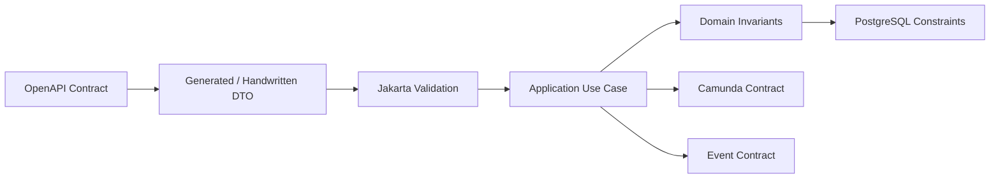
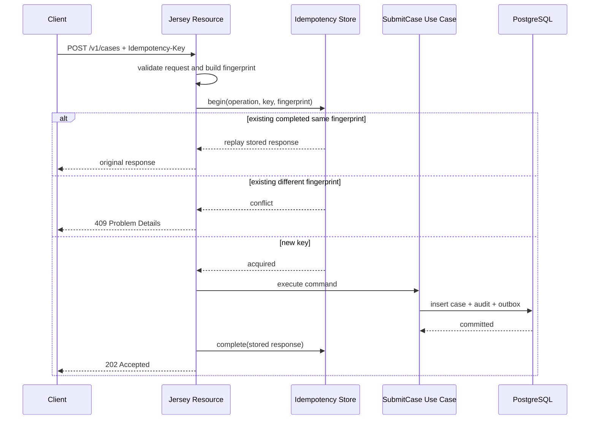

# Part 017 — HTTP Validation, Idempotency, and Errors

A production API is not production-grade because it can parse JSON.

It is production-grade when it can answer these questions precisely:

```text
Is this request structurally valid?
Is this request semantically valid?
Is the caller allowed to do this action?
Is the target resource in a state that accepts this action?
Was this request already attempted before?
If the client retries, will the system duplicate the side effect?
If the database rejects the write, can we explain it deterministically?
If the workflow fails later, did the HTTP response lie?
```

Most API bugs happen because teams treat validation, idempotency, and errors as separate concerns.

They are not separate.

They are one boundary system.

In our regulatory enforcement platform, a `POST /v1/cases` request may create a case, write audit records, start a Camunda process, enqueue a Kafka event, and return `202 Accepted` to the caller. A network timeout, duplicate click, gateway retry, worker crash, database deadlock, or process incident can turn one user action into multiple conflicting effects if the boundary is weak.

This part builds the HTTP boundary that prevents that.

---

## 1. The Mental Model: HTTP Boundary as a Decision Machine

A good HTTP endpoint is not a function that receives JSON and returns JSON.

It is a decision machine.



Each step has a different question.

| Boundary | Question | Example Failure | Typical Status |
|---|---|---|---|
| Edge | Can this request enter the service? | Body too large, unsupported route | 413, 404, 405 |
| Parsing | Can the request be decoded? | Invalid JSON | 400 |
| Media type | Is the content type supported? | `text/plain` sent to JSON endpoint | 415 |
| Contract validation | Does it match OpenAPI/DTO rules? | Missing `caseType` | 400 |
| Semantic validation | Does it make business sense? | `incidentDate` is in the future | 422 or 400 |
| Authorization | Can this principal do this? | Officer cannot access this jurisdiction | 403 |
| Idempotency | Is this duplicate or conflicting replay? | Same key, different body | 409 |
| State transition | Is this action allowed now? | Close already closed case | 409 |
| Persistence | Did durable invariants hold? | Unique constraint violation | 409 or 500 |
| Workflow | Did process accept command? | Camunda incident after async boundary | 202 plus later incident, or 500 before boundary |

The exact status mapping must be decided by your API contract. The important point is not whether every organization chooses `400` or `422` for a semantic validation failure. The important point is that the mapping is consistent, documented, tested, and observable.

---

## 2. Do Not Treat Validation as One Thing

The word "validation" hides multiple different checks.

A top-tier engineer separates them.

```text
syntax validation      -> can we parse the input?
shape validation       -> does the payload match the contract?
field validation       -> are primitive fields valid?
semantic validation    -> is the meaning valid?
authorization check    -> can this actor do this operation?
state validation       -> is the aggregate/workflow in a valid state?
idempotency check      -> is this a safe retry or a conflicting duplicate?
persistence invariant  -> does the database still accept the final write?
```

These checks are not interchangeable.

A database unique constraint cannot tell the client that `reportedBy.email` has invalid format. Bean Validation cannot know whether the caller has jurisdiction access. OpenAPI cannot know whether a case is already closed. A JAX-RS resource method should not manually duplicate all database constraints.

The design rule:

```text
Validate as early as possible, but enforce invariants at the layer that owns the truth.
```

That gives us a layered model.



No layer is trusted alone.

Each layer reduces the set of bad requests that can reach the next layer.

---

## 3. Contract-First Request Shape

Start with the OpenAPI operation.

```yaml
paths:
  /v1/cases:
    post:
      operationId: submitCase
      summary: Submit a regulatory enforcement case for intake
      parameters:
        - name: Idempotency-Key
          in: header
          required: true
          schema:
            type: string
            minLength: 20
            maxLength: 128
        - name: X-Correlation-Id
          in: header
          required: false
          schema:
            type: string
            maxLength: 128
      requestBody:
        required: true
        content:
          application/json:
            schema:
              $ref: '#/components/schemas/SubmitCaseRequest'
      responses:
        '202':
          description: Case accepted for intake processing
        '400':
          $ref: '#/components/responses/BadRequest'
        '401':
          $ref: '#/components/responses/Unauthorized'
        '403':
          $ref: '#/components/responses/Forbidden'
        '409':
          $ref: '#/components/responses/Conflict'
        '415':
          $ref: '#/components/responses/UnsupportedMediaType'
        '500':
          $ref: '#/components/responses/InternalServerError'
```

Then define the body schema.

```yaml
SubmitCaseRequest:
  type: object
  required:
    - externalReference
    - caseType
    - subject
    - allegation
  additionalProperties: false
  properties:
    externalReference:
      type: string
      minLength: 1
      maxLength: 80
    caseType:
      type: string
      enum: [LICENSING_BREACH, MARKET_ABUSE, CONDUCT_RISK, REPORTING_FAILURE]
    subject:
      $ref: '#/components/schemas/CaseSubject'
    allegation:
      $ref: '#/components/schemas/Allegation'
    evidenceReferences:
      type: array
      maxItems: 50
      items:
        $ref: '#/components/schemas/EvidenceReference'
```

The contract prevents vague payloads.

Important contract choices:

```text
additionalProperties: false
bounded string lengths
bounded array sizes
enums for stable public vocabulary
required fields for minimum useful command
explicit error responses
explicit idempotency header
```

These constraints are not cosmetic. They protect the service from ambiguity, resource exhaustion, and invalid downstream assumptions.

---

## 4. DTO Validation with Jakarta Validation

In Java, Jakarta Validation gives us a declarative way to express field-level and object-level constraints.

The DTO should reflect the external contract, not the domain entity.

```java
public record SubmitCaseRequestDto(
        @NotBlank
        @Size(max = 80)
        String externalReference,

        @NotNull
        CaseTypeDto caseType,

        @NotNull
        @Valid
        CaseSubjectDto subject,

        @NotNull
        @Valid
        AllegationDto allegation,

        @Size(max = 50)
        List<@Valid EvidenceReferenceDto> evidenceReferences
) {}
```

Nested DTO:

```java
public record CaseSubjectDto(
        @NotBlank
        @Size(max = 120)
        String legalName,

        @NotBlank
        @Pattern(regexp = "^[A-Z0-9-]{4,40}$")
        String registrationNumber,

        @NotBlank
        @Size(min = 2, max = 2)
        String jurisdictionCode
) {}
```

Header validation can be explicit in the resource or in a request mapper.

```java
public record SubmitCaseHttpHeaders(
        @NotBlank
        @Size(min = 20, max = 128)
        String idempotencyKey,

        @Size(max = 128)
        String correlationId
) {}
```

Resource method:

```java
@POST
public Response submitCase(
        @HeaderParam("Idempotency-Key") String idempotencyKey,
        @HeaderParam("X-Correlation-Id") String correlationId,
        @Valid SubmitCaseRequestDto body
) {
    SubmitCaseHttpHeaders headers = new SubmitCaseHttpHeaders(
            idempotencyKey,
            correlationId
    );

    validator.validateAndThrow(headers);

    SubmitCaseCommand command = mapper.toCommand(headers, body);
    SubmitCaseResult result = submitCaseUseCase.submit(command);

    return responseMapper.toResponse(result);
}
```

This example validates headers manually because JAX-RS parameter validation behavior depends on runtime integration. Manual header validation also makes the boundary explicit and testable.

---

## 5. Validation Groups: Useful but Dangerous

Validation groups can model different validation contexts.

```java
public interface Submit {}
public interface Amend {}

public record AllegationDto(
        @NotBlank(groups = Submit.class)
        @Size(max = 4000)
        String narrative,

        @NotNull(groups = Submit.class)
        LocalDate incidentDate,

        @Size(max = 50, groups = Amend.class)
        String amendmentReason
) {}
```

Use groups when the same DTO truly supports multiple operations.

But be careful.

If `SubmitCaseRequestDto` and `AmendCaseRequestDto` have different meanings, prefer different DTOs.

Bad design:

```java
public record CaseRequestDto(
        String id,
        String status,
        String reason,
        String comment,
        String decision,
        String assignee,
        Boolean urgent
) {}
```

Then use groups to pretend every operation is well-modeled.

Better design:

```text
SubmitCaseRequestDto
AmendCaseRequestDto
AssignCaseRequestDto
CloseCaseRequestDto
EscalateCaseRequestDto
```

Validation groups are a tool, not a substitute for operation-specific contracts.

---

## 6. Semantic Validation Belongs After DTO Validation

Field validation answers:

```text
Is the value shaped correctly?
```

Semantic validation answers:

```text
Does the value make sense in our domain?
```

Example semantic rules:

```text
incidentDate cannot be after receivedAt
jurisdictionCode must be supported by the tenant
caseType must be accepted by the intake channel
subject registration number must match jurisdiction format
at least one allegation category must be reportable
externalReference must be unique per reporting institution
```

These rules need services, database reads, or reference data.

They do not belong inside simple annotation constraints unless the rule is local and deterministic.

Use a semantic validator inside the application boundary.

```java
public final class SubmitCaseSemanticValidator {
    private final JurisdictionCatalog jurisdictionCatalog;
    private final IntakePolicyRepository intakePolicyRepository;

    public ValidationResult validate(SubmitCaseCommand command) {
        ValidationResult result = ValidationResult.ok();

        if (!jurisdictionCatalog.exists(command.subject().jurisdictionCode())) {
            result = result.add("subject.jurisdictionCode", "UNSUPPORTED_JURISDICTION");
        }

        if (command.allegation().incidentDate().isAfter(command.receivedAt().toLocalDate())) {
            result = result.add("allegation.incidentDate", "INCIDENT_DATE_IN_FUTURE");
        }

        if (!intakePolicyRepository.accepts(command.channel(), command.caseType())) {
            result = result.add("caseType", "CASE_TYPE_NOT_ACCEPTED_FOR_CHANNEL");
        }

        return result;
    }
}
```

Design rule:

```text
Use annotation validation for local shape.
Use application semantic validation for cross-field and reference-data rules.
Use database constraints for durable invariants.
```

---

## 7. Problem Details as the Error Envelope

Do not invent a different JSON error format for every endpoint.

Use a single error envelope based on Problem Details.

Example validation response:

```json
{
  "type": "https://api.example.com/problems/validation-failed",
  "title": "Request validation failed",
  "status": 400,
  "detail": "The request contains invalid fields.",
  "instance": "/v1/cases",
  "errorCode": "REQ_VALIDATION_FAILED",
  "correlationId": "01JZ9R6Q8N3E9HB0Y0S53AV3HZ",
  "violations": [
    {
      "field": "subject.registrationNumber",
      "code": "PATTERN",
      "message": "must match registration number format"
    },
    {
      "field": "allegation.incidentDate",
      "code": "INCIDENT_DATE_IN_FUTURE",
      "message": "incident date cannot be after received date"
    }
  ]
}
```

Keep `message` safe.

Do not leak:

```text
SQL queries
stack traces
internal hostnames
security policy internals
Camunda execution IDs unless explicitly safe
Kafka broker details
raw JWT claims
```

A good error response helps the caller fix the request without helping an attacker map the system.

---

## 8. Error Taxonomy for This Platform

Create a registry.

| Error Code | Owner | Status | Retryable | Example |
|---|---|---:|---|---|
| `REQ_MALFORMED_JSON` | HTTP Adapter | 400 | No | Invalid JSON body |
| `REQ_VALIDATION_FAILED` | HTTP Adapter | 400 | No | Missing required field |
| `REQ_SEMANTIC_INVALID` | Application | 422/400 | No | Unsupported jurisdiction |
| `AUTH_REQUIRED` | Security | 401 | Maybe after auth | Missing/invalid token |
| `AUTH_FORBIDDEN` | Security | 403 | No | No access to case jurisdiction |
| `IDEMPOTENCY_KEY_REQUIRED` | HTTP Adapter | 400 | No | Missing key on POST |
| `IDEMPOTENCY_REPLAY` | Idempotency Store | 200/202 | No extra side effect | Same key and same fingerprint |
| `IDEMPOTENCY_CONFLICT` | Idempotency Store | 409 | No | Same key, different request |
| `CASE_STATE_CONFLICT` | Domain | 409 | No | Case already closed |
| `CASE_NOT_FOUND` | Application | 404 | No | Unknown case ID |
| `DEPENDENCY_TIMEOUT` | Infrastructure | 503/504 | Yes | Downstream timeout |
| `DB_DEADLOCK_RETRYABLE` | Persistence | 503/409 | Yes internally | Transaction deadlock |
| `INTERNAL_ERROR` | Platform | 500 | Unknown | Unhandled exception |

This registry becomes a contract.

Every new endpoint must map failures into it or explicitly add a new error code.

---

## 9. JAX-RS Exception Mapping

Centralize exception mapping.

Do not write `try/catch` blocks in every resource method.

```java
@Provider
public final class ConstraintViolationExceptionMapper
        implements ExceptionMapper<ConstraintViolationException> {

    private final ProblemFactory problemFactory;

    public Response toResponse(ConstraintViolationException exception) {
        ProblemDetails problem = problemFactory.validationProblem(
                exception.getConstraintViolations().stream()
                        .map(this::toViolation)
                        .toList()
        );

        return Response.status(Response.Status.BAD_REQUEST)
                .type("application/problem+json")
                .entity(problem)
                .build();
    }

    private Violation toViolation(ConstraintViolation<?> violation) {
        return new Violation(
                normalizePath(violation.getPropertyPath()),
                violation.getConstraintDescriptor()
                        .getAnnotation()
                        .annotationType()
                        .getSimpleName()
                        .toUpperCase(),
                violation.getMessage()
        );
    }
}
```

Domain exception mapping:

```java
@Provider
public final class ApplicationExceptionMapper
        implements ExceptionMapper<ApplicationException> {

    private final ProblemFactory problemFactory;

    public Response toResponse(ApplicationException exception) {
        ProblemDetails problem = problemFactory.fromApplicationError(exception.error());

        return Response.status(exception.error().httpStatus())
                .type("application/problem+json")
                .entity(problem)
                .build();
    }
}
```

Unhandled exception mapping:

```java
@Provider
public final class UnhandledExceptionMapper
        implements ExceptionMapper<Throwable> {

    private static final Logger log = LoggerFactory.getLogger(UnhandledExceptionMapper.class);
    private final ProblemFactory problemFactory;

    public Response toResponse(Throwable exception) {
        log.error("Unhandled HTTP request failure", exception);

        ProblemDetails problem = problemFactory.internalError();

        return Response.status(Response.Status.INTERNAL_SERVER_ERROR)
                .type("application/problem+json")
                .entity(problem)
                .build();
    }
}
```

The unhandled mapper must log the full internal error but return a safe external error.

---

## 10. Problem Factory

Keep problem construction in one place.

```java
public final class ProblemFactory {
    private final RequestContext requestContext;

    public ProblemDetails validationProblem(List<Violation> violations) {
        return new ProblemDetails(
                URI.create("https://api.example.com/problems/validation-failed"),
                "Request validation failed",
                400,
                "The request contains invalid fields.",
                requestContext.path(),
                "REQ_VALIDATION_FAILED",
                requestContext.correlationId(),
                Map.of("violations", violations)
        );
    }

    public ProblemDetails fromApplicationError(ApplicationError error) {
        return new ProblemDetails(
                URI.create("https://api.example.com/problems/" + error.slug()),
                error.title(),
                error.httpStatus(),
                error.safeDetail(),
                requestContext.path(),
                error.code(),
                requestContext.correlationId(),
                error.extensions()
        );
    }

    public ProblemDetails internalError() {
        return new ProblemDetails(
                URI.create("https://api.example.com/problems/internal-error"),
                "Internal server error",
                500,
                "The request could not be processed.",
                requestContext.path(),
                "INTERNAL_ERROR",
                requestContext.correlationId(),
                Map.of()
        );
    }
}
```

Problem object:

```java
public record ProblemDetails(
        URI type,
        String title,
        int status,
        String detail,
        String instance,
        String errorCode,
        String correlationId,
        Map<String, Object> extensions
) {}
```

In production, control JSON serialization carefully so extension fields appear as top-level properties or under a known field according to your public contract.

---

## 11. Idempotency Is Not Deduplication Only

Idempotency means a client can retry safely.

It does not mean:

```text
drop duplicate requests blindly
make every operation PUT
ignore side effects
trust the client not to retry
```

For our platform, `submitCase` is not naturally idempotent. It creates a case.

So we make it idempotent by requiring an `Idempotency-Key` header and storing a fingerprint of the request.

The idempotency contract:

```text
Same operation + same idempotency key + same request fingerprint
  -> return the original result, no new side effect.

Same operation + same idempotency key + different request fingerprint
  -> reject as conflict.

Different idempotency key
  -> may create a different operation attempt.
```

This is critical for:

```text
browser retry
mobile retry
API gateway retry
client timeout
load balancer retry
user double submit
server crash after commit before response
```

---

## 12. Idempotency Fingerprint

The idempotency key alone is not enough.

A client could accidentally reuse the same key with a different payload.

Create a request fingerprint.

Fingerprint inputs:

```text
HTTP method
canonical path template
tenant ID
principal/client ID
operation ID
canonical request body hash
selected stable headers
contract version
```

Example:

```java
public final class IdempotencyFingerprintFactory {
    public IdempotencyFingerprint create(SubmitCaseCommand command) {
        String canonical = String.join("\n",
                "POST",
                "/v1/cases",
                command.tenantId().value(),
                command.principalId().value(),
                "submitCase",
                canonicalJsonHash(command.originalRequestBody()),
                "v1"
        );

        return IdempotencyFingerprint.sha256(canonical);
    }
}
```

Avoid including volatile values:

```text
received timestamp generated by server
correlation ID
trace ID
random request metadata
non-deterministic JSON serialization
```

The fingerprint must be stable across retries.

---

## 13. PostgreSQL Idempotency Table

The idempotency store must be durable.

An in-memory cache cannot protect you from pod restart or multi-replica concurrency.

```sql
create table api_idempotency_key (
    tenant_id              uuid        not null,
    operation_id           text        not null,
    idempotency_key         text        not null,
    request_fingerprint     text        not null,
    status                 text        not null,
    response_status         integer,
    response_body           jsonb,
    resource_type           text,
    resource_id             uuid,
    error_code              text,
    locked_until            timestamptz,
    created_at              timestamptz not null default now(),
    updated_at              timestamptz not null default now(),
    expires_at              timestamptz not null,

    constraint pk_api_idempotency_key
        primary key (tenant_id, operation_id, idempotency_key),

    constraint chk_api_idempotency_status
        check (status in ('PROCESSING', 'COMPLETED', 'FAILED_RETRYABLE', 'FAILED_FINAL'))
);

create index idx_api_idempotency_expires_at
    on api_idempotency_key (expires_at);
```

Status meaning:

| Status | Meaning | Client Behavior |
|---|---|---|
| `PROCESSING` | First request is still in progress or crashed before finalization | Retry later or receive `409/425/202` depending contract |
| `COMPLETED` | Original request completed and response is stored | Return stored response |
| `FAILED_RETRYABLE` | Failure happened before durable side effect or was explicitly safe to retry | Allow controlled retry |
| `FAILED_FINAL` | Request failed definitively | Return stored failure |

For create commands, many teams only store completed success responses. That is often insufficient. You need to decide how to handle failures, especially failures that happen after partial durable effects.

---

## 14. Idempotency Execution Algorithm

High-level algorithm:



The hard case is crash timing.

```text
Case inserted.
Transaction committed.
Pod crashes before HTTP response.
Client retries.
```

Without idempotency, the retry may create a second case.

With idempotency, the retry returns the stored result or reconstructs it from the resource ID associated with the idempotency record.

---

## 15. Single Transaction or Two Transactions?

There are two common designs.

### Design A: Idempotency record and business write in one transaction

```text
begin transaction
  insert idempotency PROCESSING
  insert case
  insert audit
  insert outbox
  update idempotency COMPLETED with response
commit
```

Benefits:

```text
strong atomicity
simpler reasoning
no completed business write without idempotency finalization
```

Costs:

```text
longer transaction
idempotency row locked while business logic runs
harder if operation spans multiple local transactions
```

### Design B: Idempotency reservation before business transaction

```text
transaction 1:
  reserve key as PROCESSING

transaction 2:
  perform business write
  mark completed
```

Benefits:

```text
shorter reservation transaction
can expose in-progress status
```

Costs:

```text
crash leaves PROCESSING records
requires stale-lock recovery
requires careful reconciliation
```

For our case platform, prefer **one local PostgreSQL transaction** for `submitCase` because the command creates local case state, audit, and outbox together.

When the operation becomes long-running, accept the request quickly, persist command state, and move work to asynchronous processing.

---

## 16. Idempotency Store Interface

Application-facing interface:

```java
public interface IdempotencyStore {
    IdempotencyDecision begin(IdempotencyRequest request);

    void complete(IdempotencyCompletion completion);

    void failFinal(IdempotencyFailure failure);
}
```

Decision model:

```java
public sealed interface IdempotencyDecision permits
        IdempotencyDecision.Acquired,
        IdempotencyDecision.Replay,
        IdempotencyDecision.Conflict,
        IdempotencyDecision.InProgress {

    record Acquired() implements IdempotencyDecision {}

    record Replay(int status, String body) implements IdempotencyDecision {}

    record Conflict(String existingFingerprint) implements IdempotencyDecision {}

    record InProgress(Instant lockedUntil) implements IdempotencyDecision {}
}
```

Resource/use case integration:

```java
IdempotencyDecision decision = idempotencyStore.begin(request);

return switch (decision) {
    case IdempotencyDecision.Replay replay -> replayResponse(replay);
    case IdempotencyDecision.Conflict conflict -> throw idempotencyConflict(conflict);
    case IdempotencyDecision.InProgress inProgress -> throw idempotencyInProgress(inProgress);
    case IdempotencyDecision.Acquired acquired -> executeAndStoreResponse(command);
};
```

This is cleaner than hiding idempotency behind an annotation because it forces you to reason about replay semantics.

---

## 17. SQL Pattern for Reservation

One robust pattern is insert-or-select with locking.

Pseudo-logic:

```sql
insert into api_idempotency_key (
    tenant_id,
    operation_id,
    idempotency_key,
    request_fingerprint,
    status,
    locked_until,
    expires_at
)
values (?, ?, ?, ?, 'PROCESSING', now() + interval '30 seconds', now() + interval '24 hours')
on conflict (tenant_id, operation_id, idempotency_key)
do nothing;
```

Then select the row:

```sql
select *
from api_idempotency_key
where tenant_id = ?
  and operation_id = ?
  and idempotency_key = ?
for update;
```

Decision:

```text
if fingerprint differs -> CONFLICT
if status COMPLETED -> REPLAY
if status PROCESSING and lock still valid -> IN_PROGRESS
if status PROCESSING and lock expired -> controlled takeover or recovery path
if current transaction inserted row -> ACQUIRED
```

Be careful with takeover.

A stale `PROCESSING` record does not always mean the original operation failed. The original request might have committed the business state but crashed before updating the idempotency row. The recovery path must inspect business state using resource references, external reference, or audit/outbox markers.

---

## 18. Idempotency and External References

Regulatory systems often receive an external reference from upstream systems.

Example:

```text
reporting institution reference = BANK-2026-000391
```

Should external reference replace idempotency key?

Usually, no.

They solve different problems.

| Mechanism | Owner | Purpose |
|---|---|---|
| `Idempotency-Key` | Caller/request attempt | Safe retry of same HTTP operation |
| `externalReference` | Business source system | Business-level duplicate detection |
| `caseId` | Platform | Internal resource identity |
| `businessKey` | Camunda/process | Process correlation identity |

Use both.

External reference uniqueness rule:

```sql
create unique index ux_case_external_reference
    on enforcement_case (tenant_id, reporting_institution_id, external_reference)
    where external_reference is not null;
```

Idempotency rule:

```text
same HTTP attempt must not duplicate side effects
```

Business duplicate rule:

```text
two different HTTP attempts might still describe the same upstream case
```

Those are not the same invariant.

---

## 19. Status Code Semantics for Idempotency

Possible response rules:

| Scenario | Response |
|---|---|
| First successful submit | `202 Accepted` with case ID and status URI |
| Retry same key/same payload after success | same `202` body as original |
| Retry same key/different payload | `409 Conflict` |
| Retry while first request still processing | `409 Conflict`, `425 Too Early`, or `202` with status URI depending contract |
| Missing idempotency key | `400 Bad Request` |
| Invalid idempotency key format | `400 Bad Request` |
| Expired idempotency key reused | Treat as new only if contract explicitly allows; safer to reject or require new key |

In many enterprise APIs, `409 Conflict` for in-progress duplicate is practical because the client already violated the single-flight expectation. For public APIs, returning `202` with a status resource can be friendlier.

Pick one behavior and document it.

---

## 20. Mapping Persistence Errors to HTTP Errors

Do not parse PostgreSQL error messages.

Map based on SQLSTATE and constraint name.

Example:

```java
public final class PostgresErrorTranslator {
    public ApplicationError translate(SQLException exception) {
        String sqlState = exception.getSQLState();
        String constraint = extractConstraintName(exception);

        if ("23505".equals(sqlState) && "ux_case_external_reference".equals(constraint)) {
            return ApplicationErrors.duplicateExternalReference();
        }

        if ("23503".equals(sqlState)) {
            return ApplicationErrors.invalidReference();
        }

        if ("40P01".equals(sqlState)) {
            return ApplicationErrors.retryableDatabaseDeadlock();
        }

        if ("40001".equals(sqlState)) {
            return ApplicationErrors.retryableSerializationFailure();
        }

        return ApplicationErrors.internalPersistenceFailure();
    }
}
```

Typical SQLSTATEs:

| SQLSTATE | Meaning | HTTP Mapping |
|---|---|---|
| `23505` | unique violation | 409 |
| `23503` | foreign key violation | 400/409 depending caller fault |
| `23514` | check violation | 400/409 or internal bug |
| `40001` | serialization failure | retry internally, then 503/409 if exhausted |
| `40P01` | deadlock detected | retry internally, then 503 if exhausted |

Database constraints are the final guard. If a constraint violation happens for something the API should have caught earlier, treat it as a signal to improve validation or close a race condition.

---

## 21. Internal Retry vs Client Retry

Not all retry belongs to the client.

Use internal retry for short, safe, transient database failures:

```text
serialization failure
deadlock
brief connection acquisition failure
```

Do not retry internally for:

```text
semantic validation failure
authorization failure
idempotency conflict
unique violation caused by different business command
Camunda business error
request body invalid
```

Internal retry must be bounded.

Example:

```java
public <T> T executeWithDatabaseRetry(Supplier<T> operation) {
    int attempt = 0;
    while (true) {
        try {
            return operation.get();
        } catch (ApplicationException ex) {
            if (!ex.error().isRetryableDatabaseConcurrencyError()) {
                throw ex;
            }
            attempt++;
            if (attempt >= 3) {
                throw ex;
            }
            sleep(backoffWithJitter(attempt));
        }
    }
}
```

Retry must not create duplicate side effects. That is why outbox, idempotency, and transaction boundaries matter.

---

## 22. Validation and Authorization Order

Should you validate before authorization?

It depends.

A safe default:

```text
1. Parse and basic shape validation.
2. Authenticate principal.
3. Authorize access to operation/resource scope.
4. Semantic validation that needs domain data.
5. Execute state transition.
```

Why not run all validation before authorization?

Because detailed validation errors can leak information about resources the caller cannot access.

Example:

```text
PATCH /v1/cases/{caseId}/close
```

If the caller has no access to the case, avoid returning:

```text
"case cannot be closed because it is under appeal"
```

That leaks case state.

Return `403` or a deliberately indistinguishable `404` depending the security policy.

---

## 23. State Conflict vs Validation Failure

A common mistake is returning validation errors for state conflicts.

Example:

```text
Close case request body is valid.
Caller is authorized.
But case is already closed.
```

That is not request-shape validation.

It is a state conflict.

```json
{
  "type": "https://api.example.com/problems/case-state-conflict",
  "title": "Case state conflict",
  "status": 409,
  "detail": "The case cannot be closed from its current state.",
  "errorCode": "CASE_STATE_CONFLICT",
  "correlationId": "01JZ9T2D5G3X3AZM7AE9Y8N4PF",
  "currentState": "CLOSED",
  "allowedStates": ["UNDER_REVIEW", "PENDING_DECISION"]
}
```

Only include `currentState` and `allowedStates` if the caller is allowed to know them.

---

## 24. Command Handler Integration

The resource should not know every validation step.

Use case flow:

```java
public final class SubmitCaseUseCase {
    private final IdempotencyService idempotencyService;
    private final SubmitCaseSemanticValidator semanticValidator;
    private final AuthorizationService authorizationService;
    private final CaseRepository caseRepository;
    private final OutboxRepository outboxRepository;
    private final TransactionRunner transactionRunner;

    public SubmitCaseResult submit(SubmitCaseCommand command) {
        authorizationService.requireCanSubmitCase(command.principal(), command.tenantId());
        semanticValidator.validate(command).throwIfInvalid();

        return idempotencyService.execute(
                command.idempotencyScope(),
                command.fingerprint(),
                () -> transactionRunner.required(() -> createCase(command))
        );
    }

    private SubmitCaseResult createCase(SubmitCaseCommand command) {
        EnforcementCase created = EnforcementCase.submit(command);

        caseRepository.insert(created);
        outboxRepository.append(created.toCaseSubmittedEvent());

        return SubmitCaseResult.accepted(created.caseId(), created.caseNumber());
    }
}
```

This keeps resource thin while keeping idempotency close to side effects.

---

## 25. What About Camunda Start Process?

Do not start Camunda directly from the HTTP resource if the request must return quickly and be resilient.

Preferred design for `submitCase`:

```text
HTTP submit
  -> PostgreSQL transaction inserts case + audit + outbox event
  -> response 202
  -> outbox publisher publishes CaseSubmitted
  -> process starter consumes event or local worker starts process
  -> Camunda process begins intake workflow
```

Why?

Because the durable system of record is PostgreSQL. Camunda process start can fail independently. Kafka can lag. The job executor can be down.

If HTTP returns `201 Created` after directly starting process and then database/audit/outbox is inconsistent, your operational recovery becomes harder.

For this platform, HTTP acceptance means:

```text
The command has been durably accepted and will be processed.
```

It does not mean:

```text
Every downstream workflow step has completed.
```

That distinction must be clear in the API contract.

---

## 26. Response Shape for Accepted Commands

Example success body:

```json
{
  "caseId": "018fd6f1-6ca7-7d7e-90cb-d71b87c83764",
  "caseNumber": "ENF-2026-000391",
  "status": "INTAKE_ACCEPTED",
  "links": {
    "self": "/v1/cases/018fd6f1-6ca7-7d7e-90cb-d71b87c83764",
    "status": "/v1/cases/018fd6f1-6ca7-7d7e-90cb-d71b87c83764/status"
  },
  "correlationId": "01JZ9T7MSAA2SCKJQ9NQS7SY04"
}
```

Why not return the entire case?

Because creation may be asynchronous. The case might still need enrichment, deduplication, assignment, process start, or SLA calculation.

Return the durable accepted identity and status link.

---

## 27. Logging Strategy for Validation and Errors

Log one line per completed request.

Safe fields:

```text
correlation_id
trace_id
tenant_id
principal_id or service_client_id
operation_id
http_method
path_template
status_code
error_code
latency_ms
idempotency_decision
case_id if created
```

Do not log by default:

```text
full request body
full Problem Details violations if they contain sensitive values
JWT token
API key
raw evidence references if sensitive
personal data unless explicitly approved
```

Example structured log:

```json
{
  "event": "http_request_completed",
  "operationId": "submitCase",
  "method": "POST",
  "pathTemplate": "/v1/cases",
  "status": 202,
  "tenantId": "tnt_001",
  "principalId": "usr_1932",
  "correlationId": "01JZ9T7MSAA2SCKJQ9NQS7SY04",
  "idempotencyDecision": "ACQUIRED",
  "latencyMs": 84
}
```

---

## 28. Metrics

Minimum metrics:

```text
http.server.requests by method/path/status/error_code
api.validation.failures by operation/error_code
api.idempotency.decisions by operation/decision
api.semantic_validation.failures by rule
api.db.retry.count by sqlstate
api.error.count by error_code
```

Useful idempotency decisions:

```text
ACQUIRED
REPLAY
CONFLICT
IN_PROGRESS
EXPIRED
RECOVERED
```

Alert candidates:

```text
sudden spike in IDEMPOTENCY_CONFLICT
increase in REQ_MALFORMED_JSON
increase in AUTH_FORBIDDEN for one principal/client
increase in DB_DEADLOCK_RETRYABLE
increase in INTERNAL_ERROR
```

Validation failure spikes often indicate upstream contract drift or abuse.

---

## 29. Testing Strategy

### Contract tests

Use generated samples and OpenAPI examples.

Test:

```text
valid request returns 202
missing required field returns 400 Problem Details
unknown enum returns 400
wrong media type returns 415
same idempotency key/same body replays response
same idempotency key/different body returns 409
unauthorized request returns 401
forbidden principal returns 403
closed case command returns 409
```

### Race tests

Use concurrent requests with same idempotency key.

```java
@Test
void concurrentSubmitWithSameKeyCreatesOnlyOneCase() {
    int concurrency = 20;

    List<Response> responses = runConcurrently(concurrency, () ->
            client.submitCase(idempotencyKey, validBody)
    );

    assertThat(caseRepository.countByExternalReference(externalReference)).isEqualTo(1);
    assertThat(responses).allMatch(r -> r.status() == 202 || r.status() == 409);
}
```

### Persistence translation tests

Force database errors.

```text
unique violation -> DUPLICATE_EXTERNAL_REFERENCE
foreign key violation -> INVALID_REFERENCE
serialization failure -> retry path
check violation -> mapped or treated as internal bug
```

### Crash recovery tests

Harder, but valuable.

```text
commit case but crash before response
retry same idempotency key
expect replay/recovery instead of duplicate case
```

You can simulate this by injecting a failure after commit hook in an integration test environment.

---

## 30. Production Checklist

```text
[ ] all modifying POST/PATCH endpoints define idempotency policy
[ ] OpenAPI documents Idempotency-Key requirement where needed
[ ] request schemas bound string length, array length, and additional properties
[ ] DTO validation exists for field-level constraints
[ ] semantic validation exists for domain rules
[ ] authorization runs before leaking sensitive domain state
[ ] all errors map to Problem Details
[ ] error codes are stable and documented
[ ] exception mappers are centralized
[ ] unhandled errors return safe messages
[ ] SQLSTATE and constraint-name mapping exist
[ ] idempotency table has tenant + operation + key primary key
[ ] idempotency fingerprint detects key reuse with different request
[ ] idempotency replay returns original response
[ ] concurrent duplicate requests are tested
[ ] database retry is bounded and side-effect safe
[ ] validation/error metrics include operation and error code
[ ] sensitive payload fields are not logged
```

---

## 31. Anti-Patterns

### Anti-Pattern 1: Validation Only in the UI

The UI validates, so backend accepts everything.

Fix:

```text
Backend owns the public contract.
Frontend validation is only usability.
```

### Anti-Pattern 2: Idempotency Key Without Fingerprint

Same key reused for different body accidentally replays old result.

Fix:

```text
Store request fingerprint and reject key/body mismatch.
```

### Anti-Pattern 3: Unique Constraint as User Experience

The API waits for database unique violation and returns generic 500.

Fix:

```text
Translate constraint violations into stable domain errors.
Still keep the constraint as final invariant.
```

### Anti-Pattern 4: Every Error is 400

Authorization failure, state conflict, duplicate submission, invalid JSON, and internal timeout all return `400`.

Fix:

```text
Use error taxonomy with status, code, owner, and retryability.
```

### Anti-Pattern 5: Catch Exception and Return Message

```java
catch (Exception ex) {
    return Response.status(500).entity(ex.getMessage()).build();
}
```

Fix:

```text
Centralized exception mapper.
Safe Problem Details response.
Full detail only in internal logs.
```

### Anti-Pattern 6: Idempotency in Redis Only

Redis may be fine for performance, but if it is not the durable source of truth for the command side effect, it cannot be the only idempotency guard.

Fix:

```text
Use PostgreSQL-backed idempotency for commands whose side effects are persisted in PostgreSQL.
Use cache only as optimization.
```

---

## 32. The Core Lesson

Validation, idempotency, and error handling are one production boundary.

Validation decides whether the command is meaningful.

Idempotency decides whether executing it is safe.

Error handling decides whether the client, operator, and downstream systems can understand what happened.

A contract-first API is not complete when OpenAPI compiles.

It is complete when every failure path is also part of the contract.

The next part moves one level outward: API security and edge-aware services behind NGINX and Kubernetes.

---

## References

- RFC 9457 — Problem Details for HTTP APIs: `https://www.rfc-editor.org/rfc/rfc9457.html`
- IETF HTTPAPI Working Group draft — Idempotency-Key HTTP Header Field: `https://datatracker.ietf.org/doc/draft-ietf-httpapi-idempotency-key-header/`
- Jakarta Validation Specification: `https://jakarta.ee/specifications/bean-validation/3.1/`
- Jakarta RESTful Web Services Specification: `https://jakarta.ee/specifications/restful-ws/3.0/`
- PostgreSQL Error Codes: `https://www.postgresql.org/docs/current/errcodes-appendix.html`
- PostgreSQL Constraints: `https://www.postgresql.org/docs/current/ddl-constraints.html`
