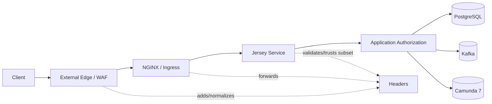

# Part 018 — API Security and Edge-Aware Services

A service behind NGINX and Kubernetes is not automatically secure.

It is only behind something.

That difference matters.

In a production regulatory platform, a request may pass through:

```text
client
CDN or WAF
external load balancer
NGINX ingress / reverse proxy
Kubernetes Service
Jersey application pod
application service
database / Kafka / Camunda
```

Every hop can add headers, remove headers, rewrite paths, terminate TLS, change source IP, retry requests, buffer bodies, or obscure the real caller.

If the Java service does not understand the edge contract, it will make bad decisions.

This part designs API security and edge-awareness for the case platform.

The goal is not to make Jersey responsible for every security concern. The goal is to make responsibilities explicit:

```text
What is enforced at the edge?
What is enforced inside the service?
What metadata is trusted?
What metadata is ignored?
What must be logged?
What must never be logged?
```

---

## 1. The Mental Model: Security Is a Chain of Enforcement Points

Security is not one filter.

It is a chain.



Each layer should do what it is good at.

| Layer | Good At | Bad At |
|---|---|---|
| WAF/CDN | coarse filtering, known bad traffic, TLS policy, bot protection | domain authorization |
| NGINX/Ingress | routing, size limit, timeouts, header normalization, rate limiting | case-level access decisions |
| Jersey filter | authentication extraction, request context, correlation, coarse auth checks | deep domain decisions if it has no data |
| Application service | operation authorization, object-level authorization, policy decisions | TLS termination and network filtering |
| PostgreSQL | durable row-level invariants, audit, constraints | authenticating HTTP callers |

The invariant:

```text
Never assume a layer before you has done a check unless that check is part of an explicit trusted contract.
```

---

## 2. Trust Boundary

A trust boundary is where data changes from untrusted to trusted only after verification.

For our service:

```text
untrusted: raw HTTP headers from the client
trusted only after verification: identity claims, tenant, roles, source IP, scheme, host
trusted infrastructure: known reverse proxy IPs, service mesh identity, Kubernetes service account where applicable
```

Dangerous mistake:

```java
String userId = headers.getHeaderString("X-User-Id");
```

If any external client can send that header, the system has no authentication.

Safer rule:

```text
Only trust identity headers if they are injected by a trusted upstream component and stripped from external requests before injection.
Otherwise validate cryptographic credentials inside the service.
```

For many systems, the Java service should validate a bearer token or receive a verified identity from a trusted internal gateway. Both can work. The unsafe design is mixing them casually.

---

## 3. Edge-Aware Request Context

Every request needs a normalized context.

```java
public record RequestContext(
        CorrelationId correlationId,
        TraceId traceId,
        TenantId tenantId,
        Principal principal,
        ClientApplication clientApplication,
        String method,
        String pathTemplate,
        String originalHost,
        String originalScheme,
        String clientIp,
        Instant receivedAt
) {}
```

The context should be built once in a JAX-RS filter.

```java
@Provider
@Priority(Priorities.AUTHENTICATION)
public final class RequestContextFilter implements ContainerRequestFilter {
    private final IdentityResolver identityResolver;
    private final TrustedProxyHeaderResolver proxyHeaderResolver;
    private final RequestContextHolder contextHolder;

    @Override
    public void filter(ContainerRequestContext request) {
        CorrelationId correlationId = resolveOrCreateCorrelationId(request);
        Principal principal = identityResolver.resolve(request);
        EdgeInfo edgeInfo = proxyHeaderResolver.resolve(request);

        RequestContext context = new RequestContext(
                correlationId,
                resolveTraceId(request),
                principal.tenantId(),
                principal,
                principal.clientApplication(),
                request.getMethod(),
                resolvePathTemplate(request),
                edgeInfo.originalHost(),
                edgeInfo.originalScheme(),
                edgeInfo.clientIp(),
                Instant.now()
        );

        contextHolder.set(context);
    }
}
```

The rest of the application should not repeatedly parse raw headers.

---

## 4. Header Spoofing

Headers are easy to fake.

A client can send:

```text
X-Forwarded-For: 127.0.0.1
X-Forwarded-Proto: https
X-User-Id: admin
X-Tenant-Id: regulator-prod
X-Correlation-Id: malicious-value
```

So the edge must strip or overwrite sensitive headers.

NGINX pattern:

```nginx
location / {
    proxy_set_header Host $host;
    proxy_set_header X-Real-IP $remote_addr;
    proxy_set_header X-Forwarded-For $proxy_add_x_forwarded_for;
    proxy_set_header X-Forwarded-Proto $scheme;
    proxy_set_header X-Request-Id $request_id;

    proxy_set_header X-User-Id "";
    proxy_set_header X-Tenant-Id "";

    proxy_pass http://case-api-service;
}
```

If an upstream identity gateway injects identity headers, configure a dedicated internal location/network path where those headers are overwritten from trusted values, not forwarded from client input.

Java-side rule:

```text
Treat forwarded headers as trusted only if the immediate peer is a trusted proxy.
```

In Kubernetes, this usually means the pod should only receive traffic through the configured Service/Ingress path, with NetworkPolicy limiting direct pod access where possible.

---

## 5. Authentication Boundary

Authentication answers:

```text
Who or what is making the request?
```

It does not answer:

```text
Can this principal access this case?
```

For our platform, principals may include:

```text
human officer
supervisor
external reporting institution user
internal service account
batch processor
process worker
```

Principal model:

```java
public sealed interface Principal permits
        HumanPrincipal,
        ServicePrincipal,
        AnonymousPrincipal {

    TenantId tenantId();
    PrincipalId principalId();
    Set<Role> roles();
    Set<String> scopes();
}
```

Human principal:

```java
public record HumanPrincipal(
        TenantId tenantId,
        PrincipalId principalId,
        String username,
        Set<Role> roles,
        Set<JurisdictionCode> jurisdictions,
        Set<String> scopes
) implements Principal {}
```

Service principal:

```java
public record ServicePrincipal(
        TenantId tenantId,
        PrincipalId principalId,
        String clientId,
        Set<Role> roles,
        Set<String> scopes
) implements Principal {}
```

Do not pass raw JWT claims or raw gateway headers through the domain.

Normalize them into a principal.

---

## 6. Authentication Filter Shape

Example bearer token resolver shape:

```java
public final class BearerTokenIdentityResolver implements IdentityResolver {
    private final TokenVerifier tokenVerifier;

    public Principal resolve(ContainerRequestContext request) {
        String authorization = request.getHeaderString(HttpHeaders.AUTHORIZATION);

        if (authorization == null || !authorization.startsWith("Bearer ")) {
            throw SecurityErrors.authenticationRequired();
        }

        String token = authorization.substring("Bearer ".length());
        VerifiedToken verified = tokenVerifier.verify(token);

        return PrincipalMapper.fromVerifiedToken(verified);
    }
}
```

Important checks:

```text
signature valid
token not expired
audience matches this API
issuer trusted
algorithm expected
required claims present
tenant claim valid
scope/role claims normalized
```

Do not only decode the token.

A decoded token is not a verified token.

---

## 7. Authorization Boundary

Authorization answers:

```text
Can this principal perform this action on this target?
```

There are at least three levels.

| Level | Example | Where |
|---|---|---|
| Operation-level | Can submit cases? | JAX-RS filter or application service |
| Object-level | Can view this specific case? | Application service with DB lookup |
| Field/action-level | Can edit decision reason? | Application/domain policy |

Broken object-level authorization is one of the most common and severe API design failures. In our platform, every endpoint with `caseId`, `taskId`, `partyId`, `evidenceId`, or `decisionId` must prove object access.

Bad authorization:

```java
@GET
@Path("/v1/cases/{caseId}")
public CaseDto get(@PathParam("caseId") UUID caseId) {
    requireRole("OFFICER");
    return caseQuery.find(caseId);
}
```

The caller is an officer, but maybe not for that case.

Better:

```java
public CaseDetails getCase(GetCaseQuery query) {
    CaseAccessSnapshot access = caseAccessRepository.findAccessSnapshot(
            query.caseId(),
            query.principal().tenantId(),
            query.principal().principalId()
    );

    authorizationPolicy.requireCanViewCase(query.principal(), access);

    return caseQueryRepository.getDetails(query.caseId());
}
```

Access must be checked against the object.

---

## 8. Authorization Policy as Code

Avoid scattering authorization checks across resource methods.

Create policy classes.

```java
public final class CaseAuthorizationPolicy {
    public void requireCanSubmitCase(Principal principal, TenantId tenantId) {
        requireTenant(principal, tenantId);
        requireAnyScope(principal, "case:submit", "case:*", "admin:*");
    }

    public void requireCanViewCase(Principal principal, CaseAccessSnapshot snapshot) {
        requireTenant(principal, snapshot.tenantId());

        if (principal.roles().contains(Role.SUPERVISOR)) {
            requireJurisdiction(principal, snapshot.jurisdictionCode());
            return;
        }

        if (snapshot.assignedOfficerId().equals(principal.principalId())) {
            return;
        }

        throw SecurityErrors.forbidden("AUTH_FORBIDDEN");
    }

    public void requireCanCloseCase(Principal principal, CaseAccessSnapshot snapshot) {
        requireCanViewCase(principal, snapshot);
        requireAnyRole(principal, Role.SUPERVISOR, Role.DECISION_OFFICER);
    }
}
```

This makes authorization reviewable.

A security reviewer can inspect policy classes instead of searching random `if` statements.

---

## 9. Tenant Boundary

Multi-tenant regulatory systems must treat tenant as a hard boundary.

The tenant may represent:

```text
regulatory authority
business unit
jurisdiction partition
environmental boundary
```

Tenant must be present in:

```text
principal
request context
database primary/unique keys
queries
outbox/inbox records
Kafka event envelope
Camunda business key or variables where needed
logs/metrics attributes
```

Database query anti-pattern:

```sql
select *
from enforcement_case
where case_id = ?;
```

Better:

```sql
select *
from enforcement_case
where tenant_id = ?
  and case_id = ?;
```

Even if `case_id` is globally unique, including `tenant_id` in queries enforces mental discipline and improves policy review.

---

## 10. Edge Headers Contract

Define which headers the service accepts.

| Header | Source | Trust Level | Purpose |
|---|---|---|---|
| `Authorization` | client | verified cryptographically | authentication |
| `X-Correlation-Id` | client or edge | sanitized | correlation |
| `X-Request-Id` | NGINX/edge | trusted if overwritten by edge | request tracking |
| `X-Forwarded-For` | proxy chain | trusted only from trusted proxy | original client IP |
| `X-Forwarded-Proto` | proxy | trusted only from trusted proxy | original scheme |
| `X-Forwarded-Host` | proxy | trusted only from trusted proxy | original host |
| `Idempotency-Key` | client | validated, not trusted for identity | safe retry |
| `X-User-Id` | identity gateway | trusted only if gateway strips client value | identity propagation |

Reject or ignore unexpected security-sensitive headers.

The contract must be documented because local development, staging, and production often differ.

---

## 11. Correlation ID Is Not Security Identity

Correlation ID helps trace requests.

It is not proof of caller identity.

Rules:

```text
Allow client-provided correlation ID only after sanitization.
Generate one if absent.
Limit length and character set.
Do not use it for authorization.
Do not trust it for uniqueness.
Do not expose internal trace IDs if policy forbids it.
```

Example sanitizer:

```java
public final class CorrelationIdResolver {
    private static final Pattern SAFE = Pattern.compile("^[A-Za-z0-9._:-]{1,128}$");

    public CorrelationId resolve(String header) {
        if (header == null || header.isBlank()) {
            return CorrelationId.create();
        }
        if (!SAFE.matcher(header).matches()) {
            return CorrelationId.create();
        }
        return new CorrelationId(header);
    }
}
```

Do not reflect arbitrary header values into logs and responses without sanitization.

---

## 12. NGINX as Edge Policy Layer

NGINX should enforce coarse constraints before requests hit Java.

Example:

```nginx
server {
    listen 443 ssl http2;
    server_name api.example.com;

    client_max_body_size 1m;
    keepalive_timeout 30s;

    location /v1/ {
        proxy_http_version 1.1;
        proxy_connect_timeout 2s;
        proxy_send_timeout 10s;
        proxy_read_timeout 30s;

        proxy_set_header Host $host;
        proxy_set_header X-Real-IP $remote_addr;
        proxy_set_header X-Forwarded-For $proxy_add_x_forwarded_for;
        proxy_set_header X-Forwarded-Proto $scheme;
        proxy_set_header X-Request-Id $request_id;

        proxy_pass http://case-api-service;
    }
}
```

Edge responsibilities:

```text
TLS termination if not handled earlier
route only allowed paths
limit request body size
set timeout budget
normalize forwarding headers
optionally rate limit
block obvious malformed traffic
```

Java responsibilities remain:

```text
validate contract
authenticate or verify trusted identity
authorize operation and object access
apply idempotency
execute domain use case
return documented errors
```

---

## 13. Timeout Chain

Timeouts are security and reliability controls.

A request that runs forever is a denial-of-service vector.

Design timeout chain from outside to inside.

```text
client timeout > edge read timeout > service request timeout > DB/Kafka/Camunda call timeout
```

Example budget:

| Layer | Timeout |
|---|---:|
| Client | 35s |
| NGINX `proxy_read_timeout` | 30s |
| Jersey request budget | 25s |
| PostgreSQL statement timeout | 10s |
| Kafka send timeout | 5s |
| Camunda API call timeout | 5s |

For command endpoints, prefer fast durable acceptance and async processing instead of holding HTTP open while workflow work completes.

---

## 14. Request Size and Resource Consumption

APIs fail when unbounded inputs meet expensive processing.

Bound these dimensions:

```text
HTTP body size
JSON nesting depth if parser supports it
array item count
string length
file/evidence metadata count
pagination limit
search filter complexity
time range width
number of IDs in bulk endpoint
```

OpenAPI should document limits.

Jersey should validate limits.

NGINX should enforce coarse body limits.

PostgreSQL should avoid unbounded query plans.

Example pagination guard:

```java
public record PageRequest(
        @Min(1)
        int page,

        @Min(1)
        @Max(100)
        int size
) {}
```

For regulatory search endpoints, never expose unbounded wildcard search without a query plan and operational budget.

---

## 15. Rate Limiting

Rate limiting can exist at multiple layers.

| Layer | Example |
|---|---|
| NGINX | IP/client coarse rate limit |
| API gateway | token/client/app limit |
| Service | operation-specific limit |
| Database | defensive query timeout/resource guard |

Rate limit dimensions:

```text
client application
principal
tenant
source IP
operation ID
case ID for mutation spam
```

Response should be consistent:

```json
{
  "type": "https://api.example.com/problems/rate-limit-exceeded",
  "title": "Rate limit exceeded",
  "status": 429,
  "detail": "Too many requests for this operation.",
  "errorCode": "RATE_LIMIT_EXCEEDED",
  "correlationId": "01JZA09S7G5H9V2TDF8TPQ2JSQ"
}
```

If the edge returns this before hitting Java, align its error body with the same Problem Details contract where practical.

---

## 16. CORS Is Not Authentication

CORS controls browser cross-origin behavior.

It does not protect the API from non-browser clients.

Rules:

```text
Only enable CORS for browser-facing APIs.
Do not use wildcard origins with credentials.
Keep allowed methods and headers minimal.
Treat CORS as UI integration policy, not backend security.
```

For machine-to-machine APIs, CORS may be unnecessary.

For internal regulatory portals, configure explicit origins:

```text
https://portal.example.com
https://ops.example.com
```

Avoid:

```text
Access-Control-Allow-Origin: *
Access-Control-Allow-Credentials: true
```

---

## 17. Security Headers

For APIs returning JSON, browser security headers still matter when endpoints are called from browser applications or may return downloadable content.

Common headers:

```text
Strict-Transport-Security
X-Content-Type-Options: nosniff
Content-Security-Policy where applicable
Referrer-Policy
Cache-Control for sensitive responses
```

Example Jersey response filter:

```java
@Provider
public final class SecurityHeadersFilter implements ContainerResponseFilter {
    @Override
    public void filter(ContainerRequestContext request, ContainerResponseContext response) {
        response.getHeaders().putSingle("X-Content-Type-Options", "nosniff");
        response.getHeaders().putSingle("Referrer-Policy", "no-referrer");
        response.getHeaders().putSingle("Cache-Control", "no-store");
    }
}
```

NGINX can also set headers.

Choose one owning layer to avoid inconsistent values.

---

## 18. Path and Method Security

Do not rely on hidden endpoints.

Every endpoint should be intentionally exposed.

Resource inventory:

| Method | Path | Auth | Scope | Object Check |
|---|---|---|---|---|
| `POST` | `/v1/cases` | required | `case:submit` | tenant submit policy |
| `GET` | `/v1/cases/{caseId}` | required | `case:read` | case access |
| `POST` | `/v1/cases/{caseId}/close` | required | `case:close` | case access + role |
| `GET` | `/internal/health/live` | none/internal | none | none |
| `GET` | `/internal/health/ready` | internal | none | none |
| `POST` | `/internal/workers/outbox/drain` | service auth | `internal:worker` | internal only |

Internal endpoints must not become public because of a broad ingress path rule.

In Kubernetes Ingress, route public and internal paths deliberately.

---

## 19. Kubernetes Ingress Awareness

Kubernetes Ingress maps external HTTP(S) traffic to services based on rules. But an Ingress resource by itself is not the whole implementation; an ingress controller must run and interpret it.

Example conceptual Ingress:

```yaml
apiVersion: networking.k8s.io/v1
kind: Ingress
metadata:
  name: case-api-ingress
spec:
  rules:
    - host: api.example.com
      http:
        paths:
          - path: /v1/cases
            pathType: Prefix
            backend:
              service:
                name: case-api
                port:
                  number: 8080
```

Security checks:

```text
Does the Ingress expose only intended paths?
Are internal endpoints excluded?
Are TLS settings correct?
Are body size and timeout annotations configured?
Is the ingress controller configured to overwrite forwarding headers?
Are direct NodePort/pod paths blocked?
```

Do not assume every cluster's ingress behavior is identical. Controller-specific annotations matter.

---

## 20. Service-to-Service Security

Internal traffic still needs identity.

Service-to-service calls may use:

```text
mTLS through service mesh
signed service tokens
private network plus token auth
Kubernetes service account identity where integrated
```

Do not treat "inside the cluster" as automatically trusted.

Example internal worker principal:

```java
public record WorkerPrincipal(
        TenantId tenantId,
        PrincipalId principalId,
        String workloadName,
        Set<String> scopes
) implements Principal {}
```

Internal endpoint example:

```java
@POST
@Path("/internal/outbox/drain")
public Response drainOutbox() {
    authorization.requireScope(requestContext.principal(), "internal:outbox:drain");
    outboxDrainUseCase.drain();
    return Response.accepted().build();
}
```

Internal does not mean unauthenticated.

---

## 21. BOLA Prevention by Query Shape

Broken object-level authorization is easier to prevent when repository methods include principal/tenant filters.

Bad repository:

```java
CaseDetails findById(CaseId caseId);
```

Better query interface:

```java
Optional<CaseDetails> findVisibleCase(
        TenantId tenantId,
        PrincipalId principalId,
        CaseId caseId
);
```

SQL shape:

```sql
select c.*
from enforcement_case c
join case_access ca
  on ca.tenant_id = c.tenant_id
 and ca.case_id = c.case_id
where c.tenant_id = #{tenantId}
  and c.case_id = #{caseId}
  and ca.principal_id = #{principalId};
```

This is not always sufficient for complex policy, but it prevents the most common error: fetching the object first and forgetting to check access.

---

## 22. Data Minimization in API Responses

Security is also about not returning unnecessary data.

Case details may include:

```text
subject identity
evidence metadata
investigation notes
internal risk scoring
legal privilege markers
audit events
assigned officer details
```

Different callers need different projections.

```text
External reporter -> own submitted case summary
Officer -> assigned case operational view
Supervisor -> jurisdiction portfolio view
Audit officer -> immutable audit view
System worker -> minimal process command data
```

Do not use one giant `CaseDto` for every caller.

Use projection-specific DTOs.

```java
public record ExternalCaseSummaryDto(
        UUID caseId,
        String caseNumber,
        String status,
        Instant submittedAt
) {}

public record OfficerCaseDetailDto(
        UUID caseId,
        String caseNumber,
        String status,
        SubjectDto subject,
        AllegationDto allegation,
        List<TaskSummaryDto> tasks
) {}
```

Returning less data reduces blast radius.

---

## 23. Sensitive Logging and Audit Logging Are Different

Application logs are for operations.

Audit logs are for accountability.

Do not mix them casually.

Application log:

```json
{
  "event": "case_close_request_failed",
  "caseId": "018fd7...",
  "errorCode": "AUTH_FORBIDDEN",
  "principalId": "usr_1293",
  "correlationId": "01JZA0R2..."
}
```

Audit log:

```json
{
  "eventType": "CASE_CLOSE_ATTEMPT_DENIED",
  "actorId": "usr_1293",
  "caseId": "018fd7...",
  "decision": "DENIED",
  "reasonCode": "INSUFFICIENT_ROLE",
  "occurredAt": "2026-07-03T10:15:30Z"
}
```

Audit logs usually need stronger integrity, retention, and query semantics.

Application logs should avoid sensitive payloads and secrets.

---

## 24. Security Error Responses

Authentication failure:

```json
{
  "type": "https://api.example.com/problems/authentication-required",
  "title": "Authentication required",
  "status": 401,
  "detail": "Authentication is required to access this resource.",
  "errorCode": "AUTH_REQUIRED",
  "correlationId": "01JZA11Q22WRN9YF9Q5DS7VG4D"
}
```

Authorization failure:

```json
{
  "type": "https://api.example.com/problems/forbidden",
  "title": "Forbidden",
  "status": 403,
  "detail": "You are not allowed to perform this operation.",
  "errorCode": "AUTH_FORBIDDEN",
  "correlationId": "01JZA12SKNATBX5Q40QDW0XSEA"
}
```

Do not return:

```text
"user lacks DECISION_OFFICER role for jurisdiction SG-MKT case assigned to usr_7781"
```

unless the caller is allowed to know those details.

Security errors should be useful but not revealing.

---

## 25. Filter Ordering

Typical JAX-RS filter order:

```text
1. request size/body handled by edge where possible
2. correlation/request context
3. authentication
4. coarse authorization
5. resource method
6. response security headers
7. access logging
```

Example priorities:

```java
@Provider
@Priority(Priorities.AUTHENTICATION)
public final class AuthenticationFilter implements ContainerRequestFilter { }

@Provider
@Priority(Priorities.AUTHORIZATION)
public final class AuthorizationFilter implements ContainerRequestFilter { }

@Provider
public final class SecurityHeadersFilter implements ContainerResponseFilter { }
```

Resource-level annotations can help.

```java
@RequiresScope("case:submit")
@POST
public Response submitCase(...) { ... }
```

But annotation checks should map into real policy code, not become scattered string comparisons.

---

## 26. OpenAPI Security Contract

Document security in OpenAPI.

```yaml
components:
  securitySchemes:
    bearerAuth:
      type: http
      scheme: bearer
      bearerFormat: JWT

security:
  - bearerAuth: []
```

Operation-level scopes:

```yaml
paths:
  /v1/cases/{caseId}:
    get:
      operationId: getCase
      security:
        - bearerAuth: []
      responses:
        '200':
          description: Case details
        '401':
          $ref: '#/components/responses/Unauthorized'
        '403':
          $ref: '#/components/responses/Forbidden'
        '404':
          $ref: '#/components/responses/NotFound'
```

OpenAPI does not enforce authorization by itself. It documents the contract and supports generated clients, tests, and review.

---

## 27. Contract Tests for Security

Security needs tests like any other contract.

Test matrix:

```text
missing token -> 401
invalid token -> 401
expired token -> 401
wrong audience -> 401
valid token missing scope -> 403
valid scope but wrong tenant -> 403 or 404 by policy
valid role but wrong object jurisdiction -> 403
case ID enumeration does not leak sensitive details
external reporter cannot access another reporter's case
internal endpoint cannot be accessed with external user token
unexpected identity header from client is ignored
oversized request rejected before expensive processing
```

BOLA test example:

```java
@Test
void officerCannotReadCaseOutsideJurisdiction() {
    Principal officer = fixtures.officerWithJurisdiction("ID-JKT");
    CaseId caseId = fixtures.caseInJurisdiction("SG-MKT");

    Response response = client.as(officer).getCase(caseId);

    assertThat(response.status()).isIn(403, 404);
    assertThat(response.body().errorCode()).isIn("AUTH_FORBIDDEN", "CASE_NOT_FOUND");
}
```

The exact `403` vs `404` is a policy decision. Test the chosen policy.

---

## 28. Threat Model for This Platform

Threats to model:

| Threat | Example | Control |
|---|---|---|
| Header spoofing | client sends `X-User-Id: admin` | strip/overwrite headers, verify token |
| BOLA | user changes `caseId` in URL | object-level authorization |
| Tenant escape | query missing `tenant_id` | tenant-bound queries and constraints |
| Replay/duplicate submit | client retries POST | idempotency key and fingerprint |
| Resource exhaustion | huge body/search | size limits, pagination, timeouts |
| Token misuse | wrong audience or expired token | full token verification |
| Sensitive data leakage | logs contain evidence body | logging allowlist |
| Internal endpoint exposure | ingress routes `/internal` publicly | ingress rules, service auth, network policy |
| Error detail leakage | 500 returns stack trace | safe Problem Details |
| Insecure direct pod access | bypass ingress headers | network policy and service design |

Threat modeling should be attached to API design, not performed only after implementation.

---

## 29. Failure Model

### Failure: NGINX strips required auth header

Symptom:

```text
all requests return 401 after deployment
```

Control:

```text
smoke test through actual ingress path
edge config versioned with app deployment
synthetic auth probe
```

### Failure: direct service path bypasses NGINX

Symptom:

```text
client can spoof X-Forwarded-* or identity headers
```

Control:

```text
NetworkPolicy
internal-only Service type
service validates trusted peer assumptions
ignore identity headers unless trusted gateway marker is verified
```

### Failure: role check exists but object check missing

Symptom:

```text
officer can access another jurisdiction's case by changing UUID
```

Control:

```text
repository methods require tenant/principal
BOLA tests
policy review checklist
```

### Failure: edge timeout shorter than service transaction

Symptom:

```text
client receives timeout but server commits mutation
client retries and duplicates without idempotency
```

Control:

```text
align timeout chain
idempotency for modifying endpoints
fast durable acceptance
```

### Failure: logs leak sensitive payload

Symptom:

```text
case evidence or personal data appears in centralized logs
```

Control:

```text
structured logging allowlist
no full body logging
security review for log fields
```

---

## 30. Production Checklist

```text
[ ] public and internal routes are separated
[ ] ingress exposes only intended path prefixes
[ ] NGINX sets/normalizes forwarding headers
[ ] sensitive client-supplied identity headers are stripped or ignored
[ ] service verifies bearer tokens or trusted identity contract
[ ] token issuer/audience/expiry/algorithm are verified
[ ] principal is normalized before use case layer
[ ] operation-level authorization exists
[ ] object-level authorization exists for all resource IDs
[ ] tenant ID is included in repository query shape
[ ] internal endpoints require service authentication
[ ] CORS is explicit and minimal where needed
[ ] body size, pagination, and search limits are bounded
[ ] timeout chain is documented
[ ] rate limit strategy exists for public/client-heavy endpoints
[ ] security errors use safe Problem Details
[ ] no sensitive request/response body logging by default
[ ] audit log is separated from application log
[ ] OpenAPI documents security schemes and errors
[ ] BOLA and tenant escape tests exist
[ ] direct pod/service bypass is blocked or harmless
```

---

## 31. Anti-Patterns

### Anti-Pattern 1: Trusting `X-User-Id`

```java
String userId = request.getHeaderString("X-User-Id");
```

Fix:

```text
Verify token or accept identity only from a trusted gateway that overwrites headers.
```

### Anti-Pattern 2: Role-Only Authorization

```text
User has OFFICER role, therefore can access every case.
```

Fix:

```text
Check operation, tenant, jurisdiction, assignment, and object-specific policy.
```

### Anti-Pattern 3: Public Internal Endpoints

```text
/actuator, /internal, /workers, /admin exposed through public ingress.
```

Fix:

```text
Separate ingress/service routes and require internal auth.
```

### Anti-Pattern 4: CORS as Security

```text
Only allowed browser origin can call us, so API is safe.
```

Fix:

```text
CORS is browser integration policy. Authentication and authorization are still required.
```

### Anti-Pattern 5: Full Body Access Logs

```text
Log every request and response for debugging.
```

Fix:

```text
Log safe metadata. Use controlled diagnostic sampling with redaction when absolutely needed.
```

### Anti-Pattern 6: Edge and Service Config Drift

NGINX allows 10MB body but OpenAPI says 1MB. Service timeout is 60 seconds but ingress timeout is 30 seconds.

Fix:

```text
Treat edge settings as part of the API runtime contract.
Test through the real ingress path.
```

---

## 32. The Core Lesson

A Java API is not secure because it has an authentication filter.

It is secure when the whole request path has explicit contracts:

```text
which traffic can reach the service
which headers are trusted
which identity is verified
which principal can perform which operation
which object-level access is proven
which data is returned
which failures are hidden or exposed
which logs are safe
```

NGINX and Kubernetes shape the request before Jersey sees it.

Jersey must understand that shape, but it must not blindly trust it.

The next part will turn the HTTP boundary into a testable production asset: contract and integration testing for API behavior.

---

## References

- OWASP API Security Top 10 2023: `https://owasp.org/API-Security/editions/2023/en/0x11-t10/`
- OWASP REST Security Cheat Sheet: `https://cheatsheetseries.owasp.org/cheatsheets/REST_Security_Cheat_Sheet.html`
- NGINX ngx_http_proxy_module: `https://nginx.org/en/docs/http/ngx_http_proxy_module.html`
- Kubernetes Ingress: `https://kubernetes.io/docs/concepts/services-networking/ingress/`
- Kubernetes Ingress Controllers: `https://kubernetes.io/docs/concepts/services-networking/ingress-controllers/`
- Jakarta RESTful Web Services Specification: `https://jakarta.ee/specifications/restful-ws/3.0/`
- RFC 9457 — Problem Details for HTTP APIs: `https://www.rfc-editor.org/rfc/rfc9457.html`
