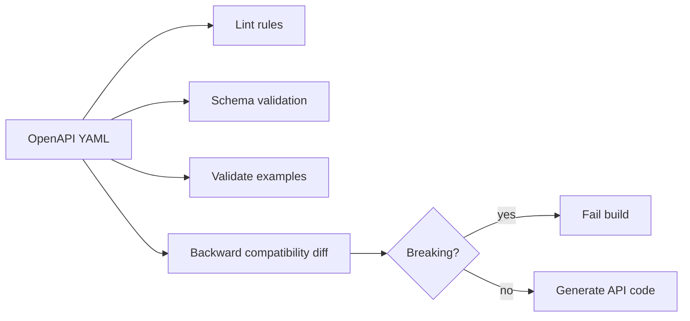
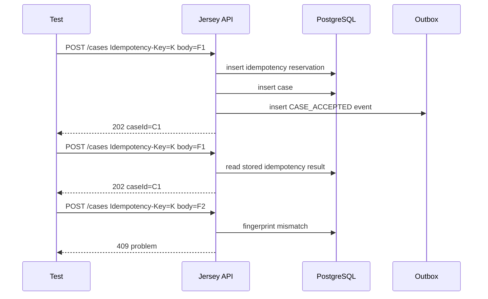
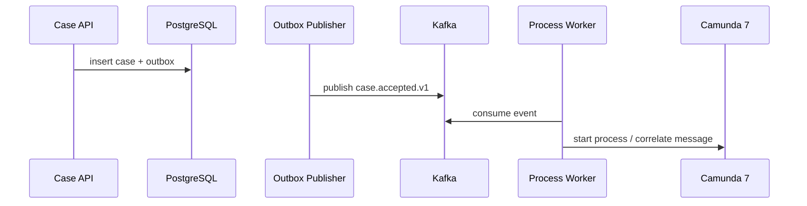

# Part 019 — API Testing: Contract and Integration

A production API is not tested because we want confidence that the controller method returns `200 OK`.

A production API is tested because every request is a legal act against the system boundary.

For a regulatory enforcement platform, an API request may:

- create an enforceable case,
- start a BPMN process instance,
- write an audit record,
- reserve an idempotency key,
- enqueue an outbox event,
- create SLA obligations,
- expose search data to an officer,
- reject a malformed payload before it becomes operational debt.

So the testing question is not:

```text
Does the endpoint work?
```

The better question is:

```text
Does this boundary preserve the contract under normal, invalid, duplicate, concurrent, and degraded conditions?
```

This part designs the API testing strategy for the contract-first case platform.

We will not repeat unit testing basics. We will build the test system that makes the previous parts enforceable.

---

## 1. What We Are Testing

The API layer is not only Jersey resources.

The real API boundary includes:

```text
OpenAPI contract
Generated DTOs
JAX-RS/Jersey resource
Request filters
Validation layer
Authorization context
Idempotency store
Application service
PostgreSQL transaction
Outbox insert
Error mapper
Response schema
Observability metadata
```

A test that calls a Java method directly does not test that boundary.

A useful production test must answer at least one of these questions:

| Question | Example |
|---|---|
| Contract conformance | Does the actual response match the OpenAPI schema? |
| Behavior correctness | Does `POST /cases` create the right domain records? |
| Failure correctness | Does invalid state return `409`, not `500`? |
| Idempotency | Does duplicate request replay the same result safely? |
| Transactionality | Is the case row inserted without losing the outbox event? |
| Security | Is object-level access denied even if the path ID exists? |
| Observability | Does every error include correlation ID and stable error code? |
| Compatibility | Can old clients keep working after the contract evolves? |

The API test suite is a set of boundary probes.

It does not exist to maximize coverage numbers.

It exists to prevent contract drift.

---

## 2. Test Taxonomy for This Platform

A top-level taxonomy helps avoid mixing test types.

```mermaid
flowchart TD
    Tests[API Test Strategy] --> Static[Static Contract Gates]
    Tests --> Resource[Resource Boundary Tests]
    Tests --> Integration[Integration Tests]
    Tests --> Negative[Negative & Abuse Tests]
    Tests --> Compatibility[Compatibility Tests]
    Tests --> Reliability[Reliability Tests]
    Tests --> Observability[Observability Assertions]

    Static --> OASLint[OpenAPI lint]
    Static --> Diff[Breaking-change diff]
    Static --> Examples[Example validation]

    Resource --> JerseyTest[Jersey Test Framework]
    Resource --> Filters[Filters/providers/mappers]

    Integration --> Pg[Testcontainers PostgreSQL]
    Integration --> Kafka[Testcontainers Kafka]
    Integration --> Migration[Migration applied]

    Negative --> InvalidPayload[Invalid payload]
    Negative --> Conflict[State conflict]
    Negative --> Authz[BOLA/object auth]

    Reliability --> Idempotency[Duplicate request]
    Reliability --> Race[Concurrent request]
    Reliability --> Retry[Retry/replay]
```



The hierarchy matters.

A fast static contract gate should fail before a slow integration test starts.

A resource boundary test should fail before a full end-to-end environment is needed.

A reliability test should only exist for behavior that can actually break in production.

---

## 3. The Contract-First Testing Rule

In this series, OpenAPI is not documentation generated from code.

It is the contract that code must obey.

That produces a strict testing rule:

```text
A test must not invent API shapes that are not in the contract.
```

Bad test:

```java
String request = """
  { "name": "Case X" }
""";
```

This looks harmless, but the test now owns an implicit schema.

Better test:

```text
Use examples from the OpenAPI contract.
Validate request examples against request schemas.
Validate actual responses against response schemas.
Generate or centrally define fixtures from contract-owned samples.
```

The source of truth should be visible:

```text
contracts/openapi/case-command-api.yaml
contracts/examples/cases/create-case-request.valid.json
contracts/examples/cases/create-case-response.accepted.json
contracts/examples/problems/validation-error.json
```

The test suite consumes those artifacts.

It does not rewrite them silently.

---

## 4. Test Ownership by Maven Module

Part 005 introduced module topology. Testing becomes much easier if each module owns the right test responsibility.

Example layout:

```text
case-platform/
  contracts/
    openapi/
      case-command-api.yaml
      case-query-api.yaml
    examples/
      cases/
      problems/

  case-contract-tests/
    src/test/java/...      # OpenAPI lint, example validation, compatibility checks

  case-api-generated/
    src/generated/java/... # generated DTO/resource interfaces

  case-api-jersey/
    src/main/java/...      # Jersey ResourceConfig, filters, mappers
    src/test/java/...      # Jersey boundary tests

  case-application/
    src/main/java/...      # use cases, commands, result types
    src/test/java/...      # pure application tests

  case-persistence-postgres/
    src/main/java/...      # MyBatis mappers, repositories
    src/test/java/...      # mapper + Testcontainers PostgreSQL

  case-api-integration-tests/
    src/test/java/...      # API + DB + Kafka + outbox tests

  case-deployment-tests/
    src/test/java/...      # container runtime smoke tests, optional
```

The anti-pattern is one giant `src/test/java` directory that tests everything from anywhere.

That makes failures hard to diagnose.

A useful test failure should reveal the broken boundary.

| Failure Location | Likely Meaning |
|---|---|
| `case-contract-tests` | Contract invalid or incompatible |
| `case-api-generated` | Generator/config mismatch |
| `case-api-jersey` | HTTP adapter behavior broken |
| `case-application` | Domain/application logic broken |
| `case-persistence-postgres` | SQL/schema/mapper broken |
| `case-api-integration-tests` | Cross-boundary runtime behavior broken |

Testing architecture is architecture.

---

## 5. Static Contract Gates

Static gates run before runtime tests.

They catch mistakes such as:

- invalid OpenAPI syntax,
- missing `operationId`,
- ambiguous error response shape,
- missing examples,
- enum value removed without compatibility plan,
- required field added to an existing request,
- response property type changed,
- undocumented `500` response,
- inconsistent correlation ID header.

A contract gate can be represented like this:



A static gate is cheap and deterministic.

Use it aggressively.

### 5.1 Minimum OpenAPI Rule Set

For this platform, the OpenAPI rules should require:

| Rule | Reason |
|---|---|
| Every operation has `operationId` | Required for generation and traceability |
| Every operation declares `x-capability` | Connects endpoint to capability map |
| Every operation has `4xx` and `5xx` problem responses | Prevents undocumented error behavior |
| Every mutation accepts `Idempotency-Key` where applicable | Prevents duplicate side effects |
| Every response includes `X-Correlation-Id` | Enables incident tracing |
| Every schema has examples | Enables fixture generation and review |
| No raw `object` without documented shape | Prevents contract escape hatch |
| No stringly typed domain enum without compatibility rule | Prevents silent semantic drift |

Example rule intent:

```yaml
paths:
  /cases:
    post:
      operationId: createCase
      x-capability: case-intake
      parameters:
        - $ref: '#/components/parameters/IdempotencyKey'
        - $ref: '#/components/parameters/CorrelationId'
      responses:
        '202':
          description: Case accepted
          content:
            application/json:
              schema:
                $ref: '#/components/schemas/CreateCaseAcceptedResponse'
        '400':
          $ref: '#/components/responses/BadRequestProblem'
        '409':
          $ref: '#/components/responses/ConflictProblem'
        '422':
          $ref: '#/components/responses/SemanticValidationProblem'
        '500':
          $ref: '#/components/responses/InternalProblem'
```

The exact linting tool is less important than the enforcement rule.

The build must fail when contract discipline is violated.

---

## 6. Example Validation

Examples are not decoration.

They are executable samples.

For every public operation, keep examples near the contract:

```text
contracts/examples/cases/create-case-request.valid.json
contracts/examples/cases/create-case-request.invalid-missing-subject.json
contracts/examples/cases/create-case-response.accepted.json
contracts/examples/problems/validation-error.json
contracts/examples/problems/conflict-error.json
```

Each example should be validated against the schema it claims to represent.

Pseudo-test:

```java
@Test
void createCaseValidExample_matchesOpenApiRequestSchema() {
    OpenApiContract contract = OpenApiContract.load("contracts/openapi/case-command-api.yaml");
    JsonNode example = Json.read("contracts/examples/cases/create-case-request.valid.json");

    SchemaValidationResult result = contract.validateRequestBody(
        "POST",
        "/cases",
        "application/json",
        example
    );

    assertThat(result.errors()).isEmpty();
}
```

This prevents a common failure:

```text
The contract says one thing.
The examples say another.
The implementation follows a third thing.
```

That is how client integration breaks even when tests are green.

---

## 7. Resource Boundary Tests with Jersey

A Jersey resource boundary test should verify the HTTP adapter behavior without requiring the full platform.

It should include:

- resource class,
- `ResourceConfig`,
- request filters,
- response filters,
- exception mappers,
- JSON providers,
- validation providers,
- fake application service,
- correlation ID behavior,
- response status mapping.

It should not include:

- real PostgreSQL,
- real Kafka,
- real Camunda,
- real NGINX,
- broad domain scenario testing.

A typical boundary test:

```java
class CaseResourceContractTest extends JerseyTest {

    private final FakeCreateCaseUseCase createCaseUseCase = new FakeCreateCaseUseCase();

    @Override
    protected Application configure() {
        return new ResourceConfig()
            .register(new CaseResource(createCaseUseCase))
            .register(new CorrelationIdFilter())
            .register(new ProblemDetailsExceptionMapper())
            .register(new JsonProvider())
            .property("jersey.config.beanValidation.enableOutputValidationErrorEntity.server", true);
    }

    @Test
    void createCase_whenAccepted_returns202AndProblemFreeContractShape() {
        createCaseUseCase.nextResult = CreateCaseResult.accepted(
            new CaseId("case_01J9YV"),
            new ProcessInstanceRef("camunda_123")
        );

        Response response = target("/cases")
            .request()
            .header("Idempotency-Key", "idem-001")
            .header("X-Correlation-Id", "corr-001")
            .post(Entity.json(validCreateCaseRequest()));

        assertThat(response.getStatus()).isEqualTo(202);
        assertThat(response.getHeaderString("X-Correlation-Id")).isEqualTo("corr-001");

        JsonNode body = response.readEntity(JsonNode.class);
        assertThat(body.get("caseId").asText()).isEqualTo("case_01J9YV");
    }
}
```

The fake use case lets the test force all result branches:

```java
createCaseUseCase.nextResult = CreateCaseResult.duplicate(...);
createCaseUseCase.nextResult = CreateCaseResult.semanticViolation(...);
createCaseUseCase.nextResult = CreateCaseResult.authorizationDenied(...);
createCaseUseCase.nextResult = CreateCaseResult.unavailable(...);
```

This style tests mapping:

```text
application result -> HTTP response
```

It does not test persistence.

That separation is intentional.

---

## 8. Response Contract Validation

A Jersey boundary test that only checks status code is weak.

Add response contract validation.

Conceptual helper:

```java
final class ApiContractAssert {
    private final OpenApiContract contract;

    void assertResponse(String method, String path, int status, String contentType, JsonNode body) {
        SchemaValidationResult result = contract.validateResponseBody(
            method,
            path,
            status,
            contentType,
            body
        );

        if (!result.errors().isEmpty()) {
            throw new AssertionError(result.render());
        }
    }
}
```

Test usage:

```java
@Test
void validationError_matchesOpenApiProblemSchema() {
    Response response = target("/cases")
        .request()
        .header("Idempotency-Key", "idem-002")
        .post(Entity.json("{}"));

    assertThat(response.getStatus()).isEqualTo(400);

    JsonNode body = response.readEntity(JsonNode.class);

    apiContractAssert.assertResponse(
        "POST",
        "/cases",
        400,
        "application/problem+json",
        body
    );
}
```

This catches mistakes such as:

```json
{
  "error": "bad request"
}
```

when the contract requires:

```json
{
  "type": "https://errors.case-platform.local/http/validation-failed",
  "title": "Validation failed",
  "status": 400,
  "code": "HTTP.VALIDATION_FAILED",
  "correlationId": "corr-001",
  "violations": [
    {
      "field": "subject.externalRef",
      "message": "must not be blank"
    }
  ]
}
```

Contract validation makes error shape as important as success shape.

That is essential because clients spend most integration effort handling errors.

---

## 9. Negative Testing Matrix

Negative tests should not be random.

They should be derived from explicit failure classes.

| Failure Class | Example | Expected Status | Owner |
|---|---|---:|---|
| Malformed JSON | broken body | `400` | HTTP adapter |
| Schema invalid | missing required field | `400` | validation adapter |
| Semantic invalid | incident date in impossible range | `422` | application service |
| Unauthorized | no valid identity | `401` | auth filter |
| Forbidden | officer lacks case scope | `403` | authorization service |
| Conflict | case cannot transition | `409` | domain/application |
| Duplicate idempotent replay | same key + same fingerprint | original status | idempotency service |
| Idempotency conflict | same key + different fingerprint | `409` | idempotency service |
| Payload too large | body exceeds edge/service limit | `413` | edge/service boundary |
| Unsupported media type | XML sent to JSON endpoint | `415` | HTTP adapter |
| Downstream unavailable | DB unavailable | `503` | infrastructure mapper |

The test suite should include representative cases for each class.

Example:

```java
@ParameterizedTest
@MethodSource("invalidCreateCasePayloads")
void createCase_invalidPayload_returns400Problem(String fixturePath) {
    JsonNode payload = Json.read(fixturePath);

    Response response = target("/cases")
        .request()
        .header("Idempotency-Key", UUID.randomUUID().toString())
        .post(Entity.json(payload));

    assertThat(response.getStatus()).isEqualTo(400);

    JsonNode problem = response.readEntity(JsonNode.class);
    assertThat(problem.get("code").asText()).isEqualTo("HTTP.VALIDATION_FAILED");
    assertThat(problem.has("correlationId")).isTrue();
}
```

Do not create hundreds of negative tests manually.

Create a small curated matrix that represents contract risk.

---

## 10. Idempotency Testing

Idempotency is not a header.

Idempotency is a stored decision.

For `POST /cases`, the expected behavior is:

| Scenario | Expected Behavior |
|---|---|
| First request with key `K` and fingerprint `F1` | Execute command, store result |
| Repeat with key `K` and same fingerprint `F1` | Return stored result, no new side effects |
| Repeat with key `K` and different fingerprint `F2` | Return `409 Idempotency conflict` |
| First request fails before reservation | Client may retry normally |
| Request reserved but processing crashes | Recovery path must complete or mark recoverable |

Test plan:



Integration test skeleton:

```java
@Test
void createCase_duplicateSameIdempotencyKey_doesNotCreateSecondCaseOrOutboxEvent() {
    String idemKey = "idem-" + UUID.randomUUID();
    JsonNode request = Json.read("contracts/examples/cases/create-case-request.valid.json");

    ApiResponse first = api.postJson("/cases", idemKey, request);
    ApiResponse second = api.postJson("/cases", idemKey, request);

    assertThat(first.status()).isEqualTo(202);
    assertThat(second.status()).isEqualTo(202);
    assertThat(second.body().get("caseId").asText())
        .isEqualTo(first.body().get("caseId").asText());

    String caseId = first.body().get("caseId").asText();

    assertThat(db.count("select count(*) from enforcement_case where case_id = ?", caseId))
        .isEqualTo(1);

    assertThat(db.count("select count(*) from event_outbox where aggregate_id = ?", caseId))
        .isEqualTo(1);
}
```

This test proves behavior that a resource-only test cannot prove.

---

## 11. Integration Tests with Testcontainers

For this platform, integration tests should use real PostgreSQL and Kafka containers where behavior depends on the real engine.

Mocks are not enough for:

- transaction isolation,
- SQL constraints,
- MyBatis result mapping,
- PostgreSQL JSONB behavior,
- lock conflict,
- `SKIP LOCKED`,
- Kafka partition ordering,
- consumer offset behavior,
- outbox polling.

A minimal PostgreSQL integration test base:

```java
@Testcontainers
abstract class PostgresIntegrationTest {

    @Container
    static PostgreSQLContainer<?> postgres = new PostgreSQLContainer<>("postgres:17")
        .withDatabaseName("case_platform")
        .withUsername("case_app")
        .withPassword("case_app_pw");

    static DataSource dataSource;

    @BeforeAll
    static void startDatabase() {
        dataSource = DataSources.hikari(
            postgres.getJdbcUrl(),
            postgres.getUsername(),
            postgres.getPassword()
        );

        MigrationRunner.run(dataSource, "db/migration");
    }
}
```

A Kafka + PostgreSQL integration test base:

```java
@Testcontainers
abstract class PlatformIntegrationTest {

    @Container
    static PostgreSQLContainer<?> postgres = new PostgreSQLContainer<>("postgres:17");

    @Container
    static KafkaContainer kafka = new KafkaContainer(
        DockerImageName.parse("apache/kafka-native:3.9.0")
    );

    @BeforeAll
    static void boot() {
        TestRuntimeConfig config = TestRuntimeConfig.builder()
            .jdbcUrl(postgres.getJdbcUrl())
            .kafkaBootstrapServers(kafka.getBootstrapServers())
            .build();

        PlatformTestApp.start(config);
    }
}
```

Use container versions intentionally.

Do not rely on `latest`.

A test suite that passes on one developer laptop and fails on CI because image versions drifted is not a reliable test suite.

---

## 12. Database Assertions Are Contract Assertions

An API integration test should not only assert HTTP response.

It should assert database side effects that are part of the contract.

For `POST /cases`, useful assertions include:

```sql
select lifecycle_status
from enforcement_case
where case_id = :case_id;
```

```sql
select count(*)
from case_audit_log
where case_id = :case_id
  and action_code = 'CASE_ACCEPTED';
```

```sql
select event_type, aggregate_id, publish_status
from event_outbox
where aggregate_id = :case_id;
```

```sql
select idem_status, response_status
from idempotency_record
where idempotency_key = :key;
```

A correct test is not afraid to look inside the database if the database is part of the system contract.

But it must not assert irrelevant implementation details.

Good assertion:

```text
A case is created with lifecycle_status = INTAKE_ACCEPTED.
```

Bad assertion:

```text
The row happens to be physically inserted before the audit row.
```

Unless ordering is part of the contract, do not test it.

---

## 13. Outbox Assertions

For a contract-first event-driven platform, mutation APIs often have an event obligation.

`POST /cases` does not only create a case.

It must produce `case.accepted.v1` or equivalent event.

Since the event is created through an outbox, the first assertion is database-side:

```java
@Test
void createCase_writesCaseAcceptedOutboxEvent() {
    ApiResponse response = api.postJson("/cases", newIdemKey(), validCreateCaseRequest());
    String caseId = response.body().get("caseId").asText();

    OutboxRow event = outboxRepository.findByAggregateId(caseId).single();

    assertThat(event.eventType()).isEqualTo("case.accepted.v1");
    assertThat(event.aggregateType()).isEqualTo("case");
    assertThat(event.aggregateId()).isEqualTo(caseId);
    assertThat(event.partitionKey()).isEqualTo(caseId);
    assertThat(event.payload().at("/caseId").asText()).isEqualTo(caseId);
    assertThat(event.publishStatus()).isEqualTo("PENDING");
}
```

A second-level test may run the outbox publisher and consume from Kafka:

```java
@Test
void outboxPublisher_publishesCaseAcceptedEventToKafka() {
    String caseId = createCaseThroughApi();

    outboxPublisher.drainOnce();

    ConsumerRecord<String, String> record = kafkaTestConsumer.readOne("case.events.v1");

    assertThat(record.key()).isEqualTo(caseId);

    JsonNode event = Json.parse(record.value());
    assertThat(event.get("eventType").asText()).isEqualTo("case.accepted.v1");
    assertThat(event.get("correlationId").asText()).isNotBlank();
}
```

Do not make every API test start Kafka.

Separate API persistence obligation from publisher obligation.

That keeps tests fast and diagnosable.

---

## 14. Authorization and BOLA Tests

Object-level authorization must be tested explicitly.

A regulatory officer may be allowed to read one case but not another.

The test must prove that path parameters are not enough.

Example:

```java
@Test
void getCase_whenOfficerOutsideJurisdiction_returns403EvenIfCaseExists() {
    CaseId caseId = fixture.createCase(jurisdiction("WEST"));
    TestPrincipal officer = fixture.officerWithJurisdiction("EAST");

    ApiResponse response = api.get(
        "/cases/" + caseId.value(),
        authHeaders(officer)
    );

    assertThat(response.status()).isEqualTo(403);
    assertThat(response.problemCode()).isEqualTo("AUTHZ.CASE_SCOPE_DENIED");
}
```

Also test the absence case separately:

```java
@Test
void getCase_whenCaseDoesNotExist_returns404() {
    TestPrincipal officer = fixture.officerWithJurisdiction("WEST");

    ApiResponse response = api.get(
        "/cases/case_missing",
        authHeaders(officer)
    );

    assertThat(response.status()).isEqualTo(404);
}
```

Be deliberate about `403` vs `404`.

Some systems hide existence to prevent enumeration.

If that is the security policy, document it and test it.

---

## 15. Concurrency Tests

Concurrency bugs do not appear in happy-path tests.

For `POST /cases`, concurrency risks include:

- duplicate idempotency reservation,
- duplicate external reference,
- double outbox insert,
- inconsistent audit rows,
- race between validation and insert,
- lost update in state transition.

Example concurrent duplicate test:

```java
@Test
void createCase_concurrentDuplicateExternalReference_createsOnlyOneCase() throws Exception {
    JsonNode request = validCreateCaseRequestWithExternalRef("ext-777");

    ExecutorService executor = Executors.newFixedThreadPool(8);
    CountDownLatch start = new CountDownLatch(1);

    List<Callable<ApiResponse>> calls = IntStream.range(0, 8)
        .mapToObj(i -> (Callable<ApiResponse>) () -> {
            start.await();
            return api.postJson("/cases", "idem-" + i, request);
        })
        .toList();

    List<Future<ApiResponse>> futures = calls.stream()
        .map(executor::submit)
        .toList();

    start.countDown();

    List<ApiResponse> responses = futures.stream()
        .map(TestFutures::getUnchecked)
        .toList();

    long accepted = responses.stream().filter(r -> r.status() == 202).count();
    long conflicts = responses.stream().filter(r -> r.status() == 409).count();

    assertThat(accepted).isEqualTo(1);
    assertThat(conflicts).isEqualTo(7);

    assertThat(db.count("select count(*) from enforcement_case where external_ref = ?", "ext-777"))
        .isEqualTo(1);
}
```

This test is slower than a normal integration test.

That is acceptable if it protects a real production invariant.

Do not create concurrency tests for every endpoint.

Create them for endpoints that can produce duplicate side effects.

---

## 16. Search API Tests

Search APIs look harmless, but they often become production hotspots.

For case search, test:

- pagination stability,
- deterministic sorting,
- filter semantics,
- authorization filtering,
- empty result shape,
- invalid filter handling,
- maximum page size,
- cursor or offset behavior,
- response schema.

Example test:

```java
@Test
void searchCases_filtersByLifecycleStatusAndJurisdiction() {
    fixture.createCase(status("UNDER_INVESTIGATION"), jurisdiction("WEST"));
    fixture.createCase(status("CLOSED"), jurisdiction("WEST"));
    fixture.createCase(status("UNDER_INVESTIGATION"), jurisdiction("EAST"));

    TestPrincipal westOfficer = fixture.officerWithJurisdiction("WEST");

    ApiResponse response = api.get(
        "/cases?status=UNDER_INVESTIGATION&pageSize=20",
        authHeaders(westOfficer)
    );

    assertThat(response.status()).isEqualTo(200);
    assertThat(response.body().get("items")).hasSize(1);
    assertThat(response.body().at("/items/0/status").asText()).isEqualTo("UNDER_INVESTIGATION");
}
```

A search test should avoid depending on global database state.

Always create its own fixture data.

---

## 17. Fixture Strategy

Poor fixtures make tests unreadable.

Good fixtures encode domain intent.

Bad:

```java
Map<String, Object> payload = new HashMap<>();
payload.put("a", "x");
payload.put("b", "y");
payload.put("c", "z");
```

Better:

```java
JsonNode request = CaseRequests.validComplaint()
    .withSubjectExternalRef("subject-123")
    .withAllegationType("UNLICENSED_OPERATION")
    .withIncidentDate(LocalDate.parse("2026-03-01"))
    .buildJson();
```

A good fixture has three properties:

1. It starts from a valid default.
2. It makes changes visible in the test.
3. It does not hide the condition under test.

Example fixture builder:

```java
final class CaseRequestFixture {
    private String subjectExternalRef = "subject-default";
    private String allegationType = "UNLICENSED_OPERATION";
    private LocalDate incidentDate = LocalDate.parse("2026-03-01");

    CaseRequestFixture withSubjectExternalRef(String value) {
        this.subjectExternalRef = value;
        return this;
    }

    CaseRequestFixture withAllegationType(String value) {
        this.allegationType = value;
        return this;
    }

    JsonNode buildJson() {
        return Json.object()
            .putObject("subject")
                .put("externalRef", subjectExternalRef)
                .parent()
            .put("allegationType", allegationType)
            .put("incidentDate", incidentDate.toString())
            .build();
    }
}
```

Keep fixture builders in test modules.

Do not leak them into production code.

---

## 18. Test Data Cleanup

Integration tests need isolation.

Common strategies:

| Strategy | Pros | Cons |
|---|---|---|
| Recreate container per class | Strong isolation | Slower |
| Truncate tables after test | Fast enough | Must handle FK order |
| Transaction rollback per test | Fast | Hard with HTTP server and async publisher |
| Unique test namespace/data | Works with async | Requires disciplined identifiers |
| Database template snapshot | Fast for large schemas | More operational complexity |

For this platform, a practical default is:

```text
One PostgreSQL container per test class or suite.
Apply migrations once.
Each test creates unique external refs / case IDs.
Clean tables between tests for synchronous data.
Avoid async publisher unless the test is explicitly about publishing.
```

Example cleanup order:

```sql
truncate table
    event_outbox,
    event_inbox,
    case_audit_log,
    case_assignment,
    case_evidence,
    enforcement_case,
    idempotency_record
restart identity cascade;
```

Be careful with truncating shared lookup tables.

Static reference data should be migrated once and left alone.

---

## 19. Testing Error Mapping from SQLSTATE

PostgreSQL constraints are part of the contract.

The API must translate database errors into stable problem codes.

Example:

```sql
alter table enforcement_case
add constraint uq_case_external_ref unique (source_system, external_ref);
```

Test:

```java
@Test
void createCase_duplicateExternalReference_returnsConflictProblem() {
    fixture.createCase(source("PORTAL"), externalRef("ext-123"));

    ApiResponse response = api.postJson(
        "/cases",
        newIdemKey(),
        validCreateCaseRequestWithExternalRef("PORTAL", "ext-123")
    );

    assertThat(response.status()).isEqualTo(409);
    assertThat(response.problemCode()).isEqualTo("CASE.EXTERNAL_REF_ALREADY_EXISTS");
}
```

The test should not assert the raw SQLSTATE in the HTTP response.

Raw SQLSTATE is an implementation detail.

Stable problem code is the API contract.

---

## 20. Testing Correlation and Logging Fields

You cannot assert logs in every test.

But you should assert correlation behavior at the boundary.

Examples:

```java
@Test
void requestWithoutCorrelationId_generatesCorrelationId() {
    ApiResponse response = api.postJson("/cases", newIdemKey(), validCreateCaseRequest());

    assertThat(response.header("X-Correlation-Id")).isNotBlank();
}
```

```java
@Test
void requestWithCorrelationId_echoesCorrelationId() {
    ApiResponse response = api.postJson(
        "/cases",
        Map.of(
            "Idempotency-Key", newIdemKey(),
            "X-Correlation-Id", "corr-test-123"
        ),
        validCreateCaseRequest()
    );

    assertThat(response.header("X-Correlation-Id")).isEqualTo("corr-test-123");
}
```

For problem responses:

```java
@Test
void validationProblem_includesCorrelationId() {
    ApiResponse response = api.postJson(
        "/cases",
        Map.of("X-Correlation-Id", "corr-validation-1"),
        Json.object().build()
    );

    assertThat(response.status()).isEqualTo(400);
    assertThat(response.body().get("correlationId").asText())
        .isEqualTo("corr-validation-1");
}
```

Correlation is not optional in incident response.

If users report an error code without correlation ID, operations becomes guesswork.

---

## 21. Testing Timeout and Downstream Failure

Not every failure requires a real outage.

Use controlled fakes where the failure belongs to the adapter.

For resource boundary tests:

```java
@Test
void createCase_whenUseCaseTimesOut_returns503Problem() {
    createCaseUseCase.nextResult = CreateCaseResult.temporaryUnavailable("db-timeout");

    Response response = target("/cases")
        .request()
        .header("Idempotency-Key", "idem-timeout")
        .post(Entity.json(validCreateCaseRequest()));

    assertThat(response.getStatus()).isEqualTo(503);

    JsonNode problem = response.readEntity(JsonNode.class);
    assertThat(problem.get("code").asText()).isEqualTo("INFRA.TEMPORARILY_UNAVAILABLE");
}
```

For integration tests, use real container failure sparingly.

Examples:

- pause PostgreSQL container and verify readiness fails,
- stop Kafka and verify outbox remains pending,
- break DB credentials and verify application fails startup safely.

These are not normal PR tests.

They are readiness/failure-drill tests.

---

## 22. API Compatibility Tests

A production platform has clients that upgrade slowly.

Compatibility tests protect old clients.

For OpenAPI, compatibility risk includes:

| Change | Risk |
|---|---|
| Remove response field | Breaks clients that read it |
| Rename field | Breaks all clients using old name |
| Add required request field | Breaks old clients |
| Narrow enum | Breaks old values |
| Change type `string` to `integer` | Breaks serializers |
| Change status code | Breaks control flow |
| Change error code | Breaks client error handling |

Store previous released contract:

```text
contracts/releases/case-command-api-1.4.0.yaml
contracts/openapi/case-command-api.yaml
```

Compatibility gate:

```text
current contract must be backward compatible with latest released contract
unless the version policy explicitly allows a breaking major change
```

Runtime compatibility test:

```java
@Test
void createCase_oldMinimalRequestStillAccepted() {
    JsonNode oldClientPayload = Json.read(
        "contracts/compat/v1_4/create-case-minimal-request.json"
    );

    ApiResponse response = api.postJson("/cases", newIdemKey(), oldClientPayload);

    assertThat(response.status()).isEqualTo(202);
}
```

Static compatibility tools catch schema breaks.

Runtime compatibility tests catch behavior breaks.

Use both.

---

## 23. Testing BPMN Trigger Behavior from API

The API should not expose Camunda internals.

But if `POST /cases` starts a process, the integration test should verify the process start obligation.

There are two options.

### Option A: API writes command/event only

The API writes case + outbox event. A separate worker starts/correlates Camunda.

Test API:

```text
API creates case and outbox event.
```

Test worker separately:

```text
worker consumes event and starts/correlates process.
```

### Option B: API starts Camunda directly inside application service

The API transaction may involve case DB and Camunda engine transaction.

Test API:

```text
API creates case and process instance reference.
```

But this increases coupling.

For this series, prefer Option A where possible:



This makes API testing simpler and failure recovery cleaner.

---

## 24. Build Lifecycle Placement

A practical Maven pipeline:

```text
validate
  - check OpenAPI syntax
  - lint contracts
  - run compatibility diff

generate-sources
  - generate JAX-RS interfaces and DTOs
  - generate event model if used

compile
  - compile production code

test
  - unit tests
  - resource boundary tests
  - mapper tests where fast enough

verify
  - integration tests with Testcontainers
  - OpenAPI response contract tests
  - idempotency/concurrency selected tests
```

Example naming convention:

```text
*Test.java       -> unit/resource tests during test phase
*IT.java         -> integration tests during verify phase
*ContractIT.java -> contract-backed runtime integration tests
```

Maven plugin separation:

```xml
<plugin>
  <groupId>org.apache.maven.plugins</groupId>
  <artifactId>maven-surefire-plugin</artifactId>
  <configuration>
    <includes>
      <include>**/*Test.java</include>
    </includes>
  </configuration>
</plugin>

<plugin>
  <groupId>org.apache.maven.plugins</groupId>
  <artifactId>maven-failsafe-plugin</artifactId>
  <configuration>
    <includes>
      <include>**/*IT.java</include>
      <include>**/*ContractIT.java</include>
    </includes>
  </configuration>
  <executions>
    <execution>
      <goals>
        <goal>integration-test</goal>
        <goal>verify</goal>
      </goals>
    </execution>
  </executions>
</plugin>
```

Keep the PR path fast enough that engineers actually run it.

Put heavier failure drills into scheduled or pre-release pipelines.

---

## 25. What Not to Test at the API Layer

Do not test everything through HTTP.

Bad idea:

```text
Every domain rule is only tested by POSTing JSON to Jersey.
```

That makes tests slow, brittle, and hard to diagnose.

Better split:

| Rule Type | Best Test Level |
|---|---|
| Pure domain transition | application/domain unit test |
| HTTP validation mapping | Jersey boundary test |
| SQL constraint behavior | PostgreSQL/MyBatis integration test |
| API-to-DB side effect | API integration test |
| Outbox publishing | publisher integration test |
| Kafka consumer idempotency | consumer integration test |
| Camunda process behavior | process test / worker integration test |
| Edge routing/timeouts | deployment/ingress test |

The API test suite should focus on boundary behavior.

It should not become a slow substitute for all other tests.

---

## 26. The Minimum Test Set for `POST /cases`

For the create-case endpoint, a production-grade minimum set is:

### Static Contract

- OpenAPI valid.
- Examples valid.
- Request/response schemas compatible with previous release.
- `Idempotency-Key` documented.
- Problem responses documented.

### Resource Boundary

- Valid request maps to `202`.
- Validation failure maps to `400` Problem Details.
- Semantic violation maps to `422`.
- Conflict maps to `409`.
- Unauthorized maps to `401`.
- Forbidden maps to `403`.
- Temporary infrastructure failure maps to `503`.
- Correlation ID generated/echoed.

### Integration

- Valid request inserts case row.
- Valid request inserts audit row.
- Valid request inserts outbox row.
- Duplicate idempotency key with same body returns stored result.
- Duplicate idempotency key with different body returns `409`.
- Duplicate external reference returns `409`.
- Concurrent duplicate external reference creates only one case.

### Event Publication

- Outbox publisher publishes event to Kafka.
- Published event matches AsyncAPI/event schema.
- Outbox row is marked published only after successful send.

This is not excessive.

This is the cost of a mutation endpoint with legal and operational side effects.

---

## 27. Anti-Patterns

### Anti-Pattern 1: Contract Exists, Tests Ignore It

If tests never validate against OpenAPI, the contract is documentation theatre.

### Anti-Pattern 2: Mocking PostgreSQL for SQL Behavior

You cannot mock unique constraints, isolation levels, JSONB operators, query plans, or deadlocks accurately.

Use real PostgreSQL for persistence behavior.

### Anti-Pattern 3: Testing Only Happy Path

Most production damage comes from duplicates, partial failure, retries, and invalid states.

### Anti-Pattern 4: One Giant Integration Test Suite

If every test boots everything, engineers stop running tests locally.

Split tests by boundary.

### Anti-Pattern 5: Asserting Implementation Noise

Do not assert private method calls or incidental row ordering.

Assert contracts and invariants.

### Anti-Pattern 6: Random Test Data Without Meaning

Random values are useful for uniqueness, not for meaning.

A failing test should reveal the business condition immediately.

---

## 28. Production Checklist

Before treating an API as production-ready, verify:

- [ ] OpenAPI contract is valid.
- [ ] Contract examples are schema-valid.
- [ ] Response bodies are validated against contract in tests.
- [ ] Error responses use stable Problem Details shape.
- [ ] Idempotency behavior is tested.
- [ ] Duplicate side effects are tested.
- [ ] Authorization and object-scope tests exist.
- [ ] PostgreSQL constraints are tested with real PostgreSQL.
- [ ] MyBatis mapper tests run against real PostgreSQL.
- [ ] Outbox side effect is tested.
- [ ] Kafka publication is tested separately from API mutation.
- [ ] Correlation ID behavior is tested.
- [ ] Compatibility gate exists for released contracts.
- [ ] CI separates fast tests from heavier integration/failure tests.

---

## 29. Mental Model Recap

API testing is not about proving that code executes.

It is about proving that a boundary is stable.

For this platform:

```text
OpenAPI defines the external promise.
Jersey implements the transport adapter.
Application service enforces use-case behavior.
PostgreSQL enforces durable invariants.
Outbox records event obligations.
Kafka tests prove publication behavior.
Problem Details makes failures contract-visible.
Maven makes all of this repeatable.
```

The best API tests are boring.

They encode what must never drift.

---

## 30. Reference Anchors

Primary references used for this part:

- OpenAPI Specification: https://spec.openapis.org/oas/latest.html
- Jersey Test Framework documentation: https://eclipse-ee4j.github.io/jersey.github.io/documentation/latest/test-framework.html
- Testcontainers for Java: https://java.testcontainers.org/
- PostgreSQL documentation: https://www.postgresql.org/docs/current/
- Apache Kafka documentation: https://kafka.apache.org/documentation/
- RFC 9457 Problem Details for HTTP APIs: https://www.rfc-editor.org/rfc/rfc9457.html

---

## Closing

Part 019 built the testing discipline that protects the API boundary.

Part 020 moves down into the durable core: the PostgreSQL schema for the case platform.
