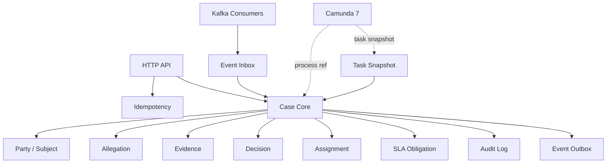
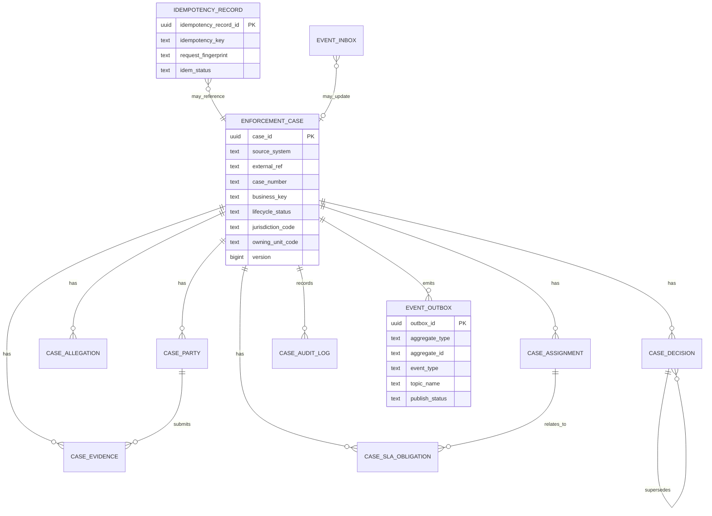
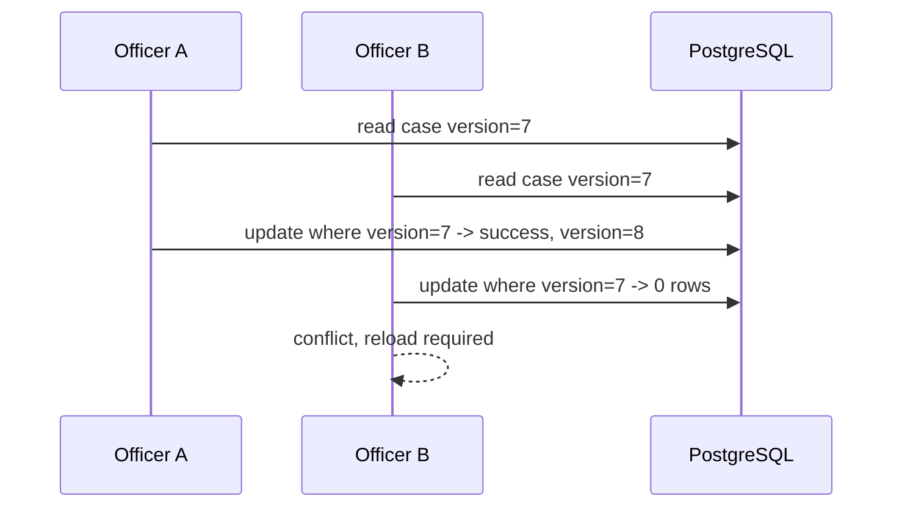

# Part 020 — PostgreSQL Schema for Case Platform

A production database schema is not storage.

It is the durable contract of the system.

For a regulatory enforcement platform, the database is where the system proves:

- which case exists,
- who created it,
- what state it is in,
- what obligations are active,
- what evidence was attached,
- what decisions were made,
- what events must be published,
- what requests were already processed,
- what audit trail survives application failure.

If the schema is vague, the system becomes vague.

If the schema allows impossible states, the application must fight ghosts forever.

This part designs the PostgreSQL schema for the case platform introduced in earlier parts.

We will not tune every index here. Part 021 focuses on constraints, indexes, and query shape. This part focuses on the schema as a contract.

---

## 1. Schema Design Goals

The schema must support five forces at once:

| Force | Meaning |
|---|---|
| Domain correctness | Illegal case states should be hard or impossible to persist |
| Workflow integration | Camunda process state must be linked without becoming source of truth for domain facts |
| Event reliability | Domain mutations must produce durable event obligations |
| Audit defensibility | Important changes must survive retries, incidents, and operator repair |
| Operational recovery | Failed jobs, duplicate requests, and replayed events must be diagnosable |

The schema must not be optimized only for the first happy-path demo.

It must be designed for:

```text
duplicate clients
retry storms
human task delays
late evidence
appeal/reopen
partial external outage
Kafka lag
Camunda incidents
manual repair
schema migration
regulatory audit
```

---

## 2. Logical Database Areas

The platform schema is organized into areas.



Suggested database schemas:

```sql
create schema if not exists case_core;
create schema if not exists case_audit;
create schema if not exists integration;
create schema if not exists reference_data;
```

A schema namespace should express ownership:

| PostgreSQL Schema | Purpose |
|---|---|
| `case_core` | Main business entities and operational case state |
| `case_audit` | Append-only audit and decision history |
| `integration` | Idempotency, outbox, inbox, external integration state |
| `reference_data` | Controlled lookup values, code sets, configuration-like data |

Avoid mixing every table in `public`.

A schema namespace makes ownership and privilege design easier.

---

## 3. Naming Conventions

Use boring names.

Boring is good.

Recommended conventions:

| Item | Convention | Example |
|---|---|---|
| Table | singular or domain noun, consistent | `enforcement_case` |
| Primary key | `<entity>_id` | `case_id` |
| Foreign key | referenced key name | `case_id` |
| Timestamp | `<verb>_at` | `created_at`, `closed_at` |
| Actor | `<verb>_by` | `created_by`, `assigned_by` |
| Status | `<domain>_status` | `lifecycle_status` |
| Code | `<thing>_code` | `allegation_type_code` |
| Constraint | `pk_`, `fk_`, `uq_`, `ck_` | `ck_case_lifecycle_status` |
| Index | `idx_` | `idx_case_status_created_at` |

Do not name columns `status` everywhere.

In this platform, multiple state dimensions exist:

```text
case.lifecycle_status
case.risk_status
case.assignment_status
sla.sla_status
outbox.publish_status
inbox.consume_status
idempotency.idem_status
```

A generic `status` column hides meaning.

---

## 4. Identity Strategy

Use database-level UUIDs or application-generated IDs consistently.

For public/domain identifiers, prefer stable opaque IDs:

```text
case_id = UUID or prefixed opaque ID
external_ref = client/source reference
business_key = Camunda correlation key
```

A simple PostgreSQL UUID strategy:

```sql
create extension if not exists pgcrypto;
```

```sql
case_id uuid primary key default gen_random_uuid()
```

Benefits:

- stable across services,
- safe for distributed creation,
- not sequentially guessable like integer IDs,
- works well with external API responses.

Trade-off:

- random UUIDs can create less locality in B-tree indexes than monotonic IDs,
- some teams prefer UUIDv7/ULID-style IDs for sortability,
- choose one strategy deliberately and document it.

For this series, examples use `uuid` because PostgreSQL supports it cleanly.

---

## 5. Timestamp Contract

Use `timestamptz` for events in real time.

Do not store local wall-clock timestamps for system facts.

Recommended base columns:

```sql
created_at timestamptz not null default now(),
created_by text not null,
updated_at timestamptz not null default now(),
updated_by text not null
```

For append-only tables, often only these are needed:

```sql
recorded_at timestamptz not null default now(),
recorded_by text not null
```

Be explicit about the meaning:

| Column | Meaning |
|---|---|
| `created_at` | When this row was created in this system |
| `updated_at` | When this row was last updated in this system |
| `received_at` | When an external message/request arrived |
| `occurred_at` | When a domain event claims it happened |
| `published_at` | When an outbox event was published |
| `consumed_at` | When an inbox message was consumed |
| `due_at` | SLA deadline instant |

Never use one timestamp column for all meanings.

---

## 6. Core Case Table

The central table is `enforcement_case`.

It should contain only facts that are truly about the case aggregate root.

```sql
create table case_core.enforcement_case (
    case_id uuid primary key default gen_random_uuid(),

    source_system text not null,
    external_ref text not null,

    case_number text not null,
    business_key text not null,

    lifecycle_status text not null,
    risk_level text not null,
    priority_level text not null,

    jurisdiction_code text not null,
    owning_unit_code text not null,

    subject_summary text not null,
    allegation_summary text not null,

    camunda_process_instance_id text null,
    camunda_process_definition_key text null,

    accepted_at timestamptz null,
    closed_at timestamptz null,

    version bigint not null default 0,

    created_at timestamptz not null default now(),
    created_by text not null,
    updated_at timestamptz not null default now(),
    updated_by text not null,

    constraint uq_case_external_ref unique (source_system, external_ref),
    constraint uq_case_number unique (case_number),
    constraint uq_case_business_key unique (business_key),

    constraint ck_case_lifecycle_status check (
        lifecycle_status in (
            'DRAFT',
            'INTAKE_ACCEPTED',
            'UNDER_ASSESSMENT',
            'UNDER_INVESTIGATION',
            'PENDING_DECISION',
            'DECIDED',
            'CLOSED',
            'REOPENED',
            'CANCELLED'
        )
    ),

    constraint ck_case_risk_level check (
        risk_level in ('LOW', 'MEDIUM', 'HIGH', 'CRITICAL')
    ),

    constraint ck_case_priority_level check (
        priority_level in ('P4', 'P3', 'P2', 'P1')
    ),

    constraint ck_case_closed_at_required check (
        (lifecycle_status in ('CLOSED', 'CANCELLED') and closed_at is not null)
        or
        (lifecycle_status not in ('CLOSED', 'CANCELLED'))
    )
);
```

Important design choices:

| Column | Reason |
|---|---|
| `source_system`, `external_ref` | Prevent duplicate intake from same external source |
| `case_number` | Human-facing identifier, not necessarily primary key |
| `business_key` | Stable correlation key for Camunda/process integration |
| `lifecycle_status` | Domain lifecycle state, not task state |
| `camunda_process_instance_id` | Reference only; Camunda is not source of domain truth |
| `version` | Optimistic locking for state transitions |
| summaries | Denormalized display/search convenience, not full source of truth |

The table does not include every party, evidence item, or decision.

Those are separate facts.

---

## 7. Case Number Strategy

A case number is not the same as `case_id`.

Example:

```text
case_id     = 8a1db078-6af1-4a01-a506-a217c56e5e2e
case_number = ENF-2026-000123
business_key = CASE:8a1db078-6af1-4a01-a506-a217c56e5e2e
```

Why separate them?

| Identifier | Audience | Stability Requirement |
|---|---|---|
| `case_id` | APIs, DB relations, events | Must never be reused |
| `case_number` | Humans, documents | Stable but format may be policy-driven |
| `business_key` | Workflow correlation | Stable across process interactions |
| `external_ref` | External systems | Unique within source system |

Case number generation can be done by:

- database sequence per year,
- central numbering service,
- application logic with locking,
- preallocated number blocks.

Simple version:

```sql
create sequence case_core.case_number_seq;
```

```sql
-- conceptual expression, exact implementation later in PL/pgSQL part
'ENF-' || to_char(now(), 'YYYY') || '-' || lpad(nextval('case_core.case_number_seq')::text, 6, '0')
```

For real systems, decide whether numbering must be gapless.

Most systems should avoid gapless guarantees because rollback, retry, and concurrency make gapless numbering expensive.

If regulators require gap analysis, store voided/reserved numbers explicitly rather than pretending gaps cannot happen.

---

## 8. Party and Subject Tables

A case can involve multiple parties:

- subject under investigation,
- complainant,
- witness,
- responsible officer,
- legal representative,
- organization,
- related entity.

Do not cram all of that into `enforcement_case`.

```sql
create table case_core.case_party (
    case_party_id uuid primary key default gen_random_uuid(),
    case_id uuid not null,

    party_role text not null,
    party_type text not null,

    external_party_ref text null,
    display_name text not null,

    person_date_of_birth date null,
    organization_registration_no text null,

    contact_email text null,
    contact_phone text null,

    effective_from date null,
    effective_to date null,

    created_at timestamptz not null default now(),
    created_by text not null,

    constraint fk_case_party_case
        foreign key (case_id)
        references case_core.enforcement_case (case_id),

    constraint ck_case_party_role check (
        party_role in (
            'SUBJECT',
            'COMPLAINANT',
            'WITNESS',
            'REPRESENTATIVE',
            'RELATED_ENTITY'
        )
    ),

    constraint ck_case_party_type check (
        party_type in ('PERSON', 'ORGANIZATION')
    ),

    constraint ck_case_party_person_org_shape check (
        (party_type = 'PERSON' and organization_registration_no is null)
        or
        (party_type = 'ORGANIZATION' and person_date_of_birth is null)
    )
);
```

This design is intentionally modest.

In a high-maturity platform, party may become its own bounded context with identity resolution, deduplication, sanctions screening, and master-data governance.

For this series, `case_party` is enough to model case-specific participation without pretending to solve enterprise MDM.

---

## 9. Allegation Table

A case may include multiple allegations.

Each allegation has its own type, severity, date range, and narrative.

```sql
create table case_core.case_allegation (
    allegation_id uuid primary key default gen_random_uuid(),
    case_id uuid not null,

    allegation_type_code text not null,
    severity_level text not null,

    occurred_from date null,
    occurred_to date null,

    narrative text not null,
    regulatory_reference text null,

    allegation_status text not null default 'ACTIVE',

    created_at timestamptz not null default now(),
    created_by text not null,
    updated_at timestamptz not null default now(),
    updated_by text not null,

    constraint fk_case_allegation_case
        foreign key (case_id)
        references case_core.enforcement_case (case_id),

    constraint ck_allegation_severity check (
        severity_level in ('LOW', 'MEDIUM', 'HIGH', 'CRITICAL')
    ),

    constraint ck_allegation_status check (
        allegation_status in ('ACTIVE', 'WITHDRAWN', 'SUBSTANTIATED', 'UNSUBSTANTIATED')
    ),

    constraint ck_allegation_date_range check (
        occurred_from is null
        or occurred_to is null
        or occurred_from <= occurred_to
    )
);
```

Why separate allegations?

Because case lifecycle and allegation outcome are not the same.

A case can be closed with some allegations substantiated and others withdrawn.

That cannot be expressed cleanly with one `case.status` column.

---

## 10. Evidence Table

Evidence must be modeled carefully because it can be legally sensitive.

The database should usually store metadata and references, not large binary content.

```sql
create table case_core.case_evidence (
    evidence_id uuid primary key default gen_random_uuid(),
    case_id uuid not null,

    evidence_type text not null,
    evidence_status text not null,

    title text not null,
    description text null,

    storage_location text not null,
    content_hash_sha256 text not null,
    content_mime_type text not null,
    content_size_bytes bigint not null,

    submitted_by_party_id uuid null,
    submitted_at timestamptz not null,

    chain_of_custody_required boolean not null default false,

    created_at timestamptz not null default now(),
    created_by text not null,

    constraint fk_case_evidence_case
        foreign key (case_id)
        references case_core.enforcement_case (case_id),

    constraint fk_case_evidence_party
        foreign key (submitted_by_party_id)
        references case_core.case_party (case_party_id),

    constraint ck_evidence_type check (
        evidence_type in ('DOCUMENT', 'IMAGE', 'VIDEO', 'AUDIO', 'SYSTEM_RECORD', 'STATEMENT', 'OTHER')
    ),

    constraint ck_evidence_status check (
        evidence_status in ('RECEIVED', 'ACCEPTED', 'REJECTED', 'SUPERSEDED')
    ),

    constraint ck_evidence_size_positive check (content_size_bytes > 0),
    constraint ck_evidence_hash_shape check (content_hash_sha256 ~ '^[a-f0-9]{64}$')
);
```

Key design rule:

```text
Evidence content can live in object storage.
Evidence metadata and integrity facts live in PostgreSQL.
```

The hash matters because storage systems can be replaced, copied, or migrated.

The integrity fact must survive.

---

## 11. Assignment and Work Ownership

Camunda user tasks represent workflow work.

But the case platform often needs a queryable operational view of assignment.

Do not treat Camunda task tables as your case query model.

Use a task/assignment snapshot table.

```sql
create table case_core.case_assignment (
    assignment_id uuid primary key default gen_random_uuid(),
    case_id uuid not null,

    assignment_type text not null,
    assignment_status text not null,

    assigned_to_user_id text null,
    assigned_to_group_code text null,
    assigned_by text not null,
    assigned_at timestamptz not null default now(),

    released_at timestamptz null,
    completed_at timestamptz null,

    camunda_task_id text null,
    camunda_task_definition_key text null,

    created_at timestamptz not null default now(),
    created_by text not null,
    updated_at timestamptz not null default now(),
    updated_by text not null,

    constraint fk_case_assignment_case
        foreign key (case_id)
        references case_core.enforcement_case (case_id),

    constraint ck_assignment_type check (
        assignment_type in ('INTAKE_REVIEW', 'ASSESSMENT', 'INVESTIGATION', 'DECISION_REVIEW', 'APPEAL_REVIEW')
    ),

    constraint ck_assignment_status check (
        assignment_status in ('OPEN', 'CLAIMED', 'COMPLETED', 'CANCELLED', 'RELEASED')
    ),

    constraint ck_assignment_owner_present check (
        assigned_to_user_id is not null
        or assigned_to_group_code is not null
    )
);
```

This table is not the BPMN source of truth.

It is a platform read/operation model that lets the API answer questions such as:

```text
Which cases are assigned to my unit?
Which cases have unclaimed decision review tasks?
Which tasks are close to SLA breach?
```

Camunda remains responsible for process execution.

The platform schema remains responsible for domain/query durability.

---

## 12. SLA Obligation Table

SLA is not a timer only.

SLA is an obligation.

Camunda timer events can trigger escalation, but PostgreSQL should store the obligation state.

```sql
create table case_core.case_sla_obligation (
    sla_obligation_id uuid primary key default gen_random_uuid(),
    case_id uuid not null,

    obligation_type text not null,
    sla_status text not null,

    starts_at timestamptz not null,
    due_at timestamptz not null,
    breached_at timestamptz null,
    satisfied_at timestamptz null,

    related_assignment_id uuid null,
    camunda_timer_activity_id text null,

    escalation_level integer not null default 0,

    created_at timestamptz not null default now(),
    created_by text not null,
    updated_at timestamptz not null default now(),
    updated_by text not null,

    constraint fk_sla_case
        foreign key (case_id)
        references case_core.enforcement_case (case_id),

    constraint fk_sla_assignment
        foreign key (related_assignment_id)
        references case_core.case_assignment (assignment_id),

    constraint ck_sla_obligation_type check (
        obligation_type in ('INTAKE_REVIEW', 'ASSESSMENT_DECISION', 'INVESTIGATION_UPDATE', 'FINAL_DECISION')
    ),

    constraint ck_sla_status check (
        sla_status in ('ACTIVE', 'SATISFIED', 'BREACHED', 'CANCELLED')
    ),

    constraint ck_sla_due_after_start check (due_at > starts_at),

    constraint ck_sla_terminal_timestamp check (
        (sla_status = 'SATISFIED' and satisfied_at is not null)
        or (sla_status = 'BREACHED' and breached_at is not null)
        or (sla_status in ('ACTIVE', 'CANCELLED'))
    )
);
```

Why store SLA separately?

Because a case can have multiple obligations over time.

A single `case.due_at` column cannot express:

- intake review deadline,
- investigation update deadline,
- final decision deadline,
- appeal review deadline,
- historical breaches.

SLA history matters.

---

## 13. Decision Table

Decision is a durable legal/operational fact.

It should be append-oriented and auditable.

```sql
create table case_core.case_decision (
    decision_id uuid primary key default gen_random_uuid(),
    case_id uuid not null,

    decision_type text not null,
    decision_status text not null,
    outcome_code text not null,

    decision_summary text not null,
    rationale text not null,

    decided_by text not null,
    decided_at timestamptz not null,

    effective_from date null,
    effective_to date null,

    supersedes_decision_id uuid null,

    created_at timestamptz not null default now(),
    created_by text not null,

    constraint fk_decision_case
        foreign key (case_id)
        references case_core.enforcement_case (case_id),

    constraint fk_decision_supersedes
        foreign key (supersedes_decision_id)
        references case_core.case_decision (decision_id),

    constraint ck_decision_type check (
        decision_type in ('INITIAL', 'FINAL', 'APPEAL', 'REOPENING')
    ),

    constraint ck_decision_status check (
        decision_status in ('DRAFT', 'ISSUED', 'SUPERSEDED', 'WITHDRAWN')
    ),

    constraint ck_decision_effective_range check (
        effective_from is null
        or effective_to is null
        or effective_from <= effective_to
    )
);
```

Decision records should not be casually updated.

If a decision changes after being issued, prefer supersession:

```text
old decision -> SUPERSEDED
new decision -> ISSUED, supersedes_decision_id = old decision
```

That preserves regulatory defensibility.

---

## 14. Audit Log

Audit is not debug logging.

Audit is a durable record of meaningful actions.

```sql
create table case_audit.case_audit_log (
    audit_id uuid primary key default gen_random_uuid(),
    case_id uuid not null,

    action_code text not null,
    action_category text not null,

    actor_id text not null,
    actor_type text not null,

    correlation_id text not null,
    causation_id text null,
    idempotency_key text null,

    before_state jsonb null,
    after_state jsonb null,
    action_metadata jsonb not null default '{}'::jsonb,

    recorded_at timestamptz not null default now(),

    constraint fk_audit_case
        foreign key (case_id)
        references case_core.enforcement_case (case_id),

    constraint ck_audit_actor_type check (
        actor_type in ('USER', 'SYSTEM', 'WORKER', 'ADMIN_REPAIR')
    ),

    constraint ck_audit_category check (
        action_category in ('CASE', 'ASSIGNMENT', 'SLA', 'DECISION', 'EVIDENCE', 'INTEGRATION', 'REPAIR')
    )
);
```

Audit table characteristics:

| Property | Rule |
|---|---|
| Append-only | Do not update/delete normal audit rows |
| Correlated | Every row must have correlation ID |
| Intentional | Only meaningful business/ops actions |
| Minimal PII | Avoid copying unnecessary sensitive data |
| Repair-aware | Admin repair actions must be explicit |

Use `jsonb` carefully.

It is acceptable for metadata snapshots, but not as a replacement for relational model.

---

## 15. Idempotency Table

The idempotency table protects mutation APIs from duplicate client retries.

```sql
create table integration.idempotency_record (
    idempotency_record_id uuid primary key default gen_random_uuid(),

    idempotency_key text not null,
    request_fingerprint text not null,
    request_method text not null,
    request_path text not null,

    actor_id text not null,
    tenant_code text null,

    idem_status text not null,

    response_status integer null,
    response_body jsonb null,

    resource_type text null,
    resource_id text null,

    locked_until timestamptz null,
    completed_at timestamptz null,
    expires_at timestamptz not null,

    created_at timestamptz not null default now(),
    updated_at timestamptz not null default now(),

    constraint uq_idempotency_scope unique (
        idempotency_key,
        request_method,
        request_path,
        actor_id
    ),

    constraint ck_idem_status check (
        idem_status in ('RESERVED', 'COMPLETED', 'FAILED_RETRYABLE', 'FAILED_FINAL')
    ),

    constraint ck_idem_response_status check (
        response_status is null or response_status between 100 and 599
    )
);
```

Important: idempotency scope must be deliberate.

Possible scope:

```text
idempotency_key + method + path + actor_id
```

or, in multi-tenant systems:

```text
tenant_code + idempotency_key + method + path + actor_id
```

Do not make `idempotency_key` globally unique unless you really mean it.

Two clients might generate the same key accidentally.

Scope it to the caller and operation.

---

## 16. Event Outbox Table

The outbox table is the bridge from database transaction to Kafka publication.

```sql
create table integration.event_outbox (
    outbox_id uuid primary key default gen_random_uuid(),

    aggregate_type text not null,
    aggregate_id text not null,

    event_type text not null,
    event_version integer not null,

    topic_name text not null,
    partition_key text not null,

    event_key text not null,
    event_payload jsonb not null,
    event_headers jsonb not null default '{}'::jsonb,

    correlation_id text not null,
    causation_id text null,
    idempotency_key text null,

    publish_status text not null default 'PENDING',
    attempt_count integer not null default 0,
    next_attempt_at timestamptz not null default now(),
    published_at timestamptz null,
    last_error text null,

    created_at timestamptz not null default now(),

    constraint ck_outbox_status check (
        publish_status in ('PENDING', 'PUBLISHING', 'PUBLISHED', 'FAILED_RETRYABLE', 'FAILED_FINAL')
    ),

    constraint ck_outbox_attempt_count check (attempt_count >= 0),
    constraint ck_outbox_event_version check (event_version > 0)
);
```

Outbox contract:

```text
If a domain mutation commits and requires an event, the outbox row must be committed in the same transaction.
```

Publisher contract:

```text
Only mark PUBLISHED after Kafka send succeeds.
```

Do not publish to Kafka first and then write the database.

That creates unrecoverable split-brain behavior.

---

## 17. Event Inbox Table

The inbox table protects consumers from duplicate event processing.

```sql
create table integration.event_inbox (
    inbox_id uuid primary key default gen_random_uuid(),

    consumer_name text not null,
    source_topic text not null,
    source_partition integer not null,
    source_offset bigint not null,

    event_id text not null,
    event_type text not null,
    event_version integer not null,

    aggregate_type text not null,
    aggregate_id text not null,

    event_payload jsonb not null,
    event_headers jsonb not null default '{}'::jsonb,

    consume_status text not null,
    attempt_count integer not null default 0,
    last_error text null,

    received_at timestamptz not null default now(),
    processed_at timestamptz null,

    constraint uq_inbox_event_per_consumer unique (consumer_name, event_id),
    constraint uq_inbox_offset_per_consumer unique (
        consumer_name,
        source_topic,
        source_partition,
        source_offset
    ),

    constraint ck_inbox_status check (
        consume_status in ('RECEIVED', 'PROCESSED', 'FAILED_RETRYABLE', 'FAILED_FINAL', 'IGNORED')
    ),

    constraint ck_inbox_attempt_count check (attempt_count >= 0)
);
```

Why store both `event_id` and topic/partition/offset?

| Field | Purpose |
|---|---|
| `event_id` | Logical deduplication |
| `topic/partition/offset` | Kafka diagnostic traceability |
| `consumer_name` | Same event may be consumed by multiple logical consumers |

The inbox table turns consumer idempotency into a durable fact.

---

## 18. Reference Data Tables

Not every code should be a PostgreSQL enum.

For highly stable internal states, a `check` constraint is fine.

For business-controlled code sets, use reference tables.

Example:

```sql
create table reference_data.allegation_type (
    allegation_type_code text primary key,
    display_name text not null,
    description text null,
    active boolean not null default true,
    effective_from date not null,
    effective_to date null,

    constraint ck_allegation_type_effective_range check (
        effective_to is null or effective_from <= effective_to
    )
);
```

Then:

```sql
alter table case_core.case_allegation
add constraint fk_allegation_type
foreign key (allegation_type_code)
references reference_data.allegation_type (allegation_type_code);
```

Use reference tables when:

- business users recognize the code set,
- codes have display names,
- codes can be retired,
- codes have effective dates,
- reports depend on code meaning.

Use `check` constraints when:

- the values are technical lifecycle states,
- changing them requires application release anyway,
- the state machine is owned by engineering/domain design.

---

## 19. ER Overview

A simplified ER view:



Mermaid ER syntax does not express every schema nuance.

Use it as a map, not as the source of truth.

The DDL is the contract.

---

## 20. State Transition Storage

The current lifecycle state lives on `enforcement_case.lifecycle_status`.

The history of transitions should live elsewhere.

```sql
create table case_audit.case_state_transition (
    transition_id uuid primary key default gen_random_uuid(),
    case_id uuid not null,

    from_lifecycle_status text null,
    to_lifecycle_status text not null,

    transition_reason_code text not null,
    transition_comment text null,

    actor_id text not null,
    correlation_id text not null,

    occurred_at timestamptz not null default now(),

    constraint fk_transition_case
        foreign key (case_id)
        references case_core.enforcement_case (case_id),

    constraint ck_transition_changed check (
        from_lifecycle_status is null
        or from_lifecycle_status <> to_lifecycle_status
    )
);
```

Why not infer transitions from updated rows?

Because updates overwrite the previous value.

A regulatory system should not need forensic reconstruction from WAL backups to answer:

```text
Who moved this case from investigation to decision, when, and why?
```

Store the transition as a first-class fact.

---

## 21. Optimistic Locking

The `version` column on `enforcement_case` supports optimistic locking.

Update shape:

```sql
update case_core.enforcement_case
set
    lifecycle_status = :next_status,
    version = version + 1,
    updated_at = now(),
    updated_by = :actor_id
where case_id = :case_id
  and version = :expected_version;
```

If row count is zero:

```text
Either the case does not exist, or another transaction changed it.
```

The application should distinguish those cases if needed.

This prevents lost updates:



Optimistic locking belongs in the schema because concurrency is not a UI-only problem.

---

## 22. Soft Delete, Cancellation, and Closure

Avoid generic soft delete columns for legal domain facts.

Bad:

```sql
is_deleted boolean not null default false
```

For a case platform, deletion is usually not the right concept.

Use domain state:

```text
CANCELLED
CLOSED
WITHDRAWN
SUPERSEDED
REJECTED
```

These states explain why something is no longer active.

If privacy or retention requires deletion/anonymization, model it explicitly:

```sql
anonymized_at timestamptz null,
anonymized_by text null,
retention_policy_code text null
```

Do not hide legal lifecycle behind `deleted = true`.

---

## 23. JSONB Discipline

PostgreSQL `jsonb` is powerful.

It is also an easy way to destroy schema clarity.

Use `jsonb` for:

- event payload copy,
- audit metadata,
- external raw payload snapshot,
- flexible integration metadata,
- search projection fragments where controlled.

Avoid `jsonb` for:

- lifecycle state,
- required identifiers,
- foreign keys,
- authorization scope,
- SLA due dates,
- core reporting facts,
- values that need constraints.

Rule:

```text
If the system must enforce it, query it often, join it, or report on it, make it a typed column.
```

JSONB is a boundary tool, not a substitute for modelling.

---

## 24. External Raw Request Capture

Sometimes regulatory systems must preserve the incoming request.

Do this deliberately.

```sql
create table integration.api_request_log (
    api_request_log_id uuid primary key default gen_random_uuid(),

    request_id text not null,
    correlation_id text not null,
    idempotency_key text null,

    request_method text not null,
    request_path text not null,
    actor_id text null,

    request_fingerprint text not null,
    sanitized_request_body jsonb null,

    response_status integer null,
    problem_code text null,

    received_at timestamptz not null default now(),
    completed_at timestamptz null,

    constraint uq_api_request_log_request_id unique (request_id),
    constraint ck_api_request_response_status check (
        response_status is null or response_status between 100 and 599
    )
);
```

Do not blindly store raw payloads containing PII/secrets.

Use a sanitized copy or store only a hash when possible.

Auditability must be balanced with privacy and data minimization.

---

## 25. Relationship to Camunda 7 Tables

Camunda 7 has its own runtime and history tables.

Do not casually join application queries to Camunda internals.

Instead, store references:

```sql
camunda_process_instance_id text null,
camunda_process_definition_key text null,
camunda_task_id text null,
camunda_task_definition_key text null
```

Why?

- Camunda tables are engine-owned.
- Engine schema can be large and operationally sensitive.
- Application queries should not depend on internal runtime representation.
- Case platform needs stable query models even if process engine implementation changes later.

Use Camunda APIs or controlled synchronization to update snapshots.

Treat engine tables as engine state, not domain database.

---

## 26. Minimum Index Skeleton

Full index design is Part 021, but some indexes are foundational.

```sql
create index idx_case_lifecycle_created
on case_core.enforcement_case (lifecycle_status, created_at desc);

create index idx_case_jurisdiction_status
on case_core.enforcement_case (jurisdiction_code, lifecycle_status, updated_at desc);

create index idx_case_assignment_open_group
on case_core.case_assignment (assigned_to_group_code, assignment_status, assigned_at)
where assignment_status in ('OPEN', 'CLAIMED');

create index idx_sla_active_due
on case_core.case_sla_obligation (due_at)
where sla_status = 'ACTIVE';

create index idx_outbox_pending_next_attempt
on integration.event_outbox (next_attempt_at, created_at)
where publish_status in ('PENDING', 'FAILED_RETRYABLE');

create index idx_inbox_event_id_consumer
on integration.event_inbox (consumer_name, event_id);
```

Index rule for now:

```text
Add indexes that protect core operational paths.
Do not index every foreign key and status blindly without query evidence.
```

Part 021 will go deeper into query shape and index trade-offs.

---

## 27. Privilege Boundary

Production databases should not run everything as superuser.

Example roles:

```sql
create role case_app_login login password 'replace-me';
create role case_migration_login login password 'replace-me';
create role case_readonly_login login password 'replace-me';
```

Application privileges:

```sql
grant usage on schema case_core, case_audit, integration, reference_data to case_app_login;

grant select, insert, update on all tables in schema case_core to case_app_login;
grant select, insert on all tables in schema case_audit to case_app_login;
grant select, insert, update on all tables in schema integration to case_app_login;
grant select on all tables in schema reference_data to case_app_login;
```

Migration role can own DDL.

Runtime app role should not casually drop tables or alter schema.

This is often skipped in development.

Do not skip the design.

---

## 28. Migration-Aware DDL

A schema is not created once.

It evolves.

Design DDL with future migration in mind.

Safer evolution pattern:

```text
1. Add nullable column.
2. Deploy app that writes both old and new shape if needed.
3. Backfill data.
4. Add constraint as not-valid if appropriate.
5. Validate constraint.
6. Make column not null.
7. Remove old dependency later.
```

Example:

```sql
alter table case_core.enforcement_case
add column regulatory_program_code text null;
```

Backfill:

```sql
update case_core.enforcement_case
set regulatory_program_code = 'DEFAULT_PROGRAM'
where regulatory_program_code is null;
```

Then enforce:

```sql
alter table case_core.enforcement_case
alter column regulatory_program_code set not null;
```

Avoid adding a non-null column without default to a large production table during a busy release.

Part 025 will go deeper into release-safe migrations.

---

## 29. MyBatis Mapping Implications

This schema is designed to map cleanly with MyBatis.

Example select shape:

```sql
select
    c.case_id,
    c.case_number,
    c.lifecycle_status,
    c.risk_level,
    c.priority_level,
    c.jurisdiction_code,
    c.owning_unit_code,
    c.subject_summary,
    c.allegation_summary,
    c.version,
    c.created_at,
    c.updated_at
from case_core.enforcement_case c
where c.case_id = #{caseId}
```

Avoid returning giant joined aggregates by default.

Use explicit query models:

```text
CaseHeaderView
CaseDetailView
CaseSearchRow
CaseAssignmentView
CaseAuditEntry
```

MyBatis works best when SQL shape is intentional.

Do not force every query into the same object graph.

---

## 30. Complete Initial Migration Shape

A production migration should be split into logical files, not one massive script.

Example:

```text
db/migration/
  V001__create_schemas.sql
  V002__create_reference_data.sql
  V003__create_case_core.sql
  V004__create_case_party_and_allegation.sql
  V005__create_evidence_assignment_sla.sql
  V006__create_decision_and_audit.sql
  V007__create_integration_idempotency_outbox_inbox.sql
  V008__create_initial_indexes.sql
  V009__grant_runtime_privileges.sql
```

This makes review easier.

A reviewer can reason about one boundary at a time.

---

## 31. Production Checklist

Before accepting the schema as production-grade, verify:

- [ ] Core domain facts are typed columns, not buried in JSONB.
- [ ] Every table has a clear owner and purpose.
- [ ] Primary keys are stable and opaque.
- [ ] External references are unique in the right scope.
- [ ] Domain states use explicit names.
- [ ] Important invariants have constraints.
- [ ] Audit records are append-oriented.
- [ ] Idempotency is scoped and durable.
- [ ] Outbox rows are inserted in the same transaction as domain mutation.
- [ ] Inbox supports idempotent event consumption.
- [ ] Camunda IDs are references, not domain state.
- [ ] SLA obligations are first-class records.
- [ ] Search/query needs are considered but not over-indexed.
- [ ] Runtime and migration privileges are separated.
- [ ] Migration files are reviewable and ordered.

---

## 32. Anti-Patterns

### Anti-Pattern 1: One `status` Column to Rule Everything

Case lifecycle, assignment, SLA, outbox, inbox, and idempotency are different state machines.

Do not collapse them.

### Anti-Pattern 2: Camunda Tables as Application Query Model

Engine tables are not your domain schema.

Use references and snapshots.

### Anti-Pattern 3: JSONB for Core Facts

If you need constraints, reporting, joins, or authorization decisions, use typed columns.

### Anti-Pattern 4: Audit as Application Logs

Logs are operational traces.

Audit is durable evidence.

They are not the same.

### Anti-Pattern 5: Outbox Without Idempotent Publisher

An outbox row alone does not guarantee safe publication.

Publisher status, attempts, and deduplication matter.

### Anti-Pattern 6: No External Reference Constraint

If the same external intake can create two cases, duplicate prevention has failed at the durable boundary.

### Anti-Pattern 7: Deleting Legal Facts with Soft Delete

Use domain lifecycle and retention policy.

Do not hide facts behind `is_deleted`.

---

## 33. Mental Model Recap

The schema is the platform's durable memory.

For this case platform:

```text
case_core stores current operational truth.
case_audit stores defensible history.
integration stores reliability boundaries.
reference_data stores controlled business code sets.
Camunda stores process execution state.
Kafka stores distributed event flow.
```

The database should not know every workflow detail.

The workflow engine should not own every domain fact.

The application should not be the only place where invariants exist.

A production-grade system distributes responsibility carefully.

---

## 34. Reference Anchors

Primary references used for this part:

- PostgreSQL constraints: https://www.postgresql.org/docs/current/ddl-constraints.html
- PostgreSQL data types: https://www.postgresql.org/docs/current/datatype.html
- PostgreSQL JSON types: https://www.postgresql.org/docs/current/datatype-json.html
- PostgreSQL indexes: https://www.postgresql.org/docs/current/indexes.html
- PostgreSQL `pgcrypto`: https://www.postgresql.org/docs/current/pgcrypto.html
- Camunda 7 documentation: https://docs.camunda.org/manual/7.23/
- Apache Kafka documentation: https://kafka.apache.org/documentation/
- MyBatis documentation: https://mybatis.org/mybatis-3/

---

## Closing

Part 020 created the durable schema foundation for the case platform.

Part 021 will pressure-test this schema through constraints, indexes, and query shape.
