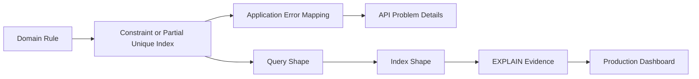

# Part 021 — Constraints, Indexes, and Query Shape

A production database is not fast because it has many indexes.

A production database is fast because its **data invariants**, **query shapes**, and **access paths** agree with each other.

This part continues from Part 020. We already designed the main PostgreSQL schema for the regulatory case platform. Now we will make that schema defensible under real load:

- users search active cases,
- supervisors open queues,
- Camunda workers claim pending work,
- Kafka publishers drain outbox rows,
- compliance auditors read historical decisions,
- integration consumers deduplicate events,
- operators repair partial failures,
- release scripts run while traffic is alive.

The goal is not to memorize every PostgreSQL index type.

The goal is to know **where correctness ends and performance begins**, and how to design both as one system.

---

## 1. The Core Mental Model

Most teams treat constraints and indexes as separate topics:

```text
constraints = correctness
indexes     = performance
queries     = application code
```

That split is too weak for production systems.

A better model:

```text
business invariant -> database constraint -> query shape -> index shape -> operational evidence
```

For example:

> A case may have only one active decision draft at a time.

This should not live only in Java code. It needs a durable invariant:

```sql
CREATE UNIQUE INDEX uq_decision_one_active_draft_per_case
ON case_core.case_decision (case_id)
WHERE decision_status = 'DRAFT';
```

That is both:

- a correctness rule, because duplicate active drafts are impossible; and
- an access path, because the query that finds active drafts is efficient.

In production, the best database design often has this shape:



If one of those arrows is missing, the system is probably relying on hope.

---

## 2. What Must Be Protected in the Case Platform

The platform has several high-value invariants.

Some are **hard invariants**. They must be rejected immediately.

Some are **workflow invariants**. They depend on process state and may need orchestration.

Some are **operational invariants**. They protect reliability rather than domain truth.

| Invariant | Enforce where | Why |
|---|---|---|
| Case reference is globally unique | unique constraint | Duplicate regulatory identifiers break audit and search |
| Case status must be from allowed set | check constraint or reference FK | Prevent invalid lifecycle values |
| Version increases on update | Java + SQL update predicate | Enables optimistic concurrency |
| One active idempotency record per key/fingerprint | unique index | Makes retries safe |
| One unprocessed outbox event per generated event id | primary/unique key | Prevents duplicate publish obligations |
| Inbox event id processed once per consumer | unique key | Makes Kafka replay safe |
| One active SLA obligation of a given type per case | partial unique index | Prevents duplicate timers/escalations |
| Decision cannot exist without case | foreign key | Prevents orphan decision |
| Closed case cannot receive non-appeal evidence | domain service + transaction lock | Needs state-aware rule, not just static constraint |

Do not force every rule into a constraint.

A database constraint is best when the rule is:

- local to one row,
- local to a relationship,
- deterministic,
- always true,
- not dependent on external systems,
- not dependent on a clock race unless carefully modeled.

A domain service or PL/pgSQL function is better when the rule is:

- state-transition dependent,
- requires locking multiple rows,
- produces side effects such as outbox/audit,
- needs custom error mapping,
- requires authorization context,
- is valid only for a specific command.

---

## 3. Constraint Types as Production Contracts

PostgreSQL constraints are not decoration. They are executable contracts.

### 3.1 Primary Key

Use primary keys to identify facts, not merely rows.

For generated IDs, prefer immutable UUIDs/ULIDs generated by the application or database policy. The key decision is not only type. The key decision is semantic ownership.

```sql
CREATE TABLE case_core.enforcement_case (
  case_id uuid PRIMARY KEY,
  case_reference text NOT NULL,
  tenant_id text NOT NULL,
  current_status text NOT NULL,
  version integer NOT NULL DEFAULT 1,
  created_at timestamptz NOT NULL DEFAULT clock_timestamp(),
  updated_at timestamptz NOT NULL DEFAULT clock_timestamp()
);
```

A primary key should not change. If the external regulator changes a case reference, keep the same internal `case_id` and update the reference under audit.

### 3.2 Unique Constraint

Use unique constraints for global identity.

```sql
ALTER TABLE case_core.enforcement_case
ADD CONSTRAINT uq_case_reference UNIQUE (tenant_id, case_reference);
```

Do not rely on `SELECT` then `INSERT` in Java:

```java
// weak under concurrency
if (!caseRepository.exists(reference)) {
    caseRepository.insert(command);
}
```

Two requests can pass `exists()` simultaneously.

The database must be the final arbiter.

The Java layer should translate the unique violation into a stable domain error such as:

```text
CASE_REFERENCE_ALREADY_EXISTS
```

### 3.3 Foreign Key

Use foreign keys to prevent orphan records.

```sql
CREATE TABLE case_core.case_evidence (
  evidence_id uuid PRIMARY KEY,
  case_id uuid NOT NULL REFERENCES case_core.enforcement_case(case_id),
  evidence_type text NOT NULL,
  storage_uri text NOT NULL,
  submitted_at timestamptz NOT NULL DEFAULT clock_timestamp()
);
```

A foreign key is not only referential integrity. It is also documentation for the relationship.

But foreign keys have operational consequences:

- deletes may block,
- cascade rules can surprise you,
- bulk loads need order,
- migrations must respect dependencies,
- missing index on referencing columns can hurt delete/update paths.

For a regulatory system, avoid casual cascade delete for important facts. Use explicit lifecycle fields instead.

```sql
-- Usually better than ON DELETE CASCADE for audit-heavy domains
revoked_at timestamptz NULL,
revoked_by text NULL,
revoked_reason text NULL
```

### 3.4 Check Constraint

Use check constraints for row-local facts.

```sql
ALTER TABLE case_core.enforcement_case
ADD CONSTRAINT ck_case_status
CHECK (current_status IN (
  'DRAFT',
  'INTAKE_VALIDATION',
  'UNDER_ASSESSMENT',
  'UNDER_INVESTIGATION',
  'PENDING_DECISION',
  'DECIDED',
  'CLOSED',
  'REOPENED'
));
```

A check constraint is excellent for allowed values. It is not good for complex state transition rules:

```text
UNDER_INVESTIGATION -> CLOSED may be invalid unless decision exists
```

That requires a command boundary with locking and audit.

### 3.5 Exclusion Constraint

Use exclusion constraints when the invariant involves overlap, especially time ranges.

Example: a case cannot have overlapping active SLA windows of the same type.

```sql
CREATE EXTENSION IF NOT EXISTS btree_gist;

ALTER TABLE case_core.case_sla_obligation
ADD CONSTRAINT ex_sla_no_overlap
EXCLUDE USING gist (
  case_id WITH =,
  obligation_type WITH =,
  tstzrange(started_at, due_at, '[)') WITH &&
)
WHERE (completed_at IS NULL);
```

This is more powerful than a normal unique constraint because it prevents overlapping time intervals.

Use it carefully. It is correct for strong time-window invariants, but it may have more write overhead and operational complexity.

---

## 4. Partial Unique Indexes for Real Business Invariants

A common production rule:

> There may be many historical rows, but only one active row.

A normal unique constraint cannot express this cleanly.

A partial unique index can.

### 4.1 One Active Assignment Per Case

```sql
CREATE UNIQUE INDEX uq_case_one_active_assignment
ON case_core.case_assignment (case_id)
WHERE released_at IS NULL;
```

Now the table can keep history:

```text
case_id | assigned_to | assigned_at | released_at
A       | alice       | t1          | t2
A       | bob         | t2          | null
```

But it cannot contain:

```text
A | bob   | t2 | null
A | clara | t3 | null
```

### 4.2 One Active SLA Obligation Per Type

```sql
CREATE UNIQUE INDEX uq_case_active_sla_by_type
ON case_core.case_sla_obligation (case_id, obligation_type)
WHERE completed_at IS NULL;
```

This prevents duplicated active timers that later create duplicate escalations.

### 4.3 One Active Process Binding Per Case

Camunda may run multiple historic process instances, but the domain should know which one is active.

```sql
CREATE UNIQUE INDEX uq_active_process_binding_per_case
ON case_core.case_process_binding (case_id, process_key)
WHERE ended_at IS NULL;
```

This prevents accidental double-start of the same orchestration.

---

## 5. Query Shape Comes Before Index Shape

An index is not designed from a table.

An index is designed from a query shape.

A query shape is the stable pattern of:

- predicate,
- join path,
- sort order,
- limit,
- access frequency,
- cardinality,
- latency expectation,
- consistency expectation.

Example query shape:

```text
Supervisor queue:
Find active investigation cases for tenant T,
assigned to group G,
ordered by SLA due time ascending,
limited to 50 rows.
```

SQL:

```sql
SELECT
  c.case_id,
  c.case_reference,
  c.current_status,
  s.due_at,
  a.assigned_group
FROM case_core.enforcement_case c
JOIN case_core.case_sla_obligation s
  ON s.case_id = c.case_id
 AND s.completed_at IS NULL
JOIN case_core.case_assignment a
  ON a.case_id = c.case_id
 AND a.released_at IS NULL
WHERE c.tenant_id = :tenant_id
  AND c.current_status = 'UNDER_INVESTIGATION'
  AND a.assigned_group = :group
ORDER BY s.due_at ASC, c.case_id ASC
LIMIT :limit;
```

The index is derived from that query.

Potential indexes:

```sql
CREATE INDEX ix_case_status_tenant
ON case_core.enforcement_case (tenant_id, current_status, case_id);

CREATE INDEX ix_active_assignment_group_case
ON case_core.case_assignment (assigned_group, case_id)
WHERE released_at IS NULL;

CREATE INDEX ix_active_sla_due_case
ON case_core.case_sla_obligation (due_at, case_id)
WHERE completed_at IS NULL;
```

But this is only a first hypothesis. You still need `EXPLAIN (ANALYZE, BUFFERS)` with realistic data distribution.

---

## 6. Build a Query Catalogue

Do not create indexes ad hoc.

Create a query catalogue.

| Query ID | Name | Owner | Frequency | SLA | Tables | Sort | Pagination | Index dependency |
|---|---|---|---:|---:|---|---|---|---|
| Q-CASE-001 | Fetch case by reference | API | high | p95 < 50ms | case | none | none | `uq_case_reference` |
| Q-CASE-002 | Supervisor active queue | UI | high | p95 < 150ms | case, assignment, sla | due_at asc | keyset | active assignment + active sla |
| Q-CASE-003 | Case audit timeline | UI/audit | medium | p95 < 200ms | audit | occurred_at asc | keyset | audit case/time index |
| Q-CASE-004 | Outbox poller | worker | very high | batch < 1s | outbox | created_at asc | batch seek | unprocessed partial index |
| Q-CASE-005 | Inbox dedup check | consumer | very high | p95 < 20ms | inbox | none | none | consumer/event unique key |
| Q-CASE-006 | Evidence search by external ref | API | medium | p95 < 100ms | evidence | submitted_at desc | keyset | external ref index |

The catalogue prevents the common failure mode:

> Somebody adds an index because one query was slow in staging, then six months later the write path collapses because every insert updates twelve unused indexes.

---

## 7. Composite Index Design

Composite indexes are where many systems quietly fail.

The order of columns matters.

A useful heuristic:

```text
equality filters -> range filter -> sort key -> stable tiebreaker
```

Example:

```sql
WHERE tenant_id = :tenant_id
  AND current_status = :status
  AND created_at >= :from
ORDER BY created_at DESC, case_id DESC
LIMIT 50
```

Index:

```sql
CREATE INDEX ix_case_status_created_seek
ON case_core.enforcement_case (
  tenant_id,
  current_status,
  created_at DESC,
  case_id DESC
);
```

Why this shape?

| Column | Role |
|---|---|
| `tenant_id` | equality filter, isolates tenant |
| `current_status` | equality filter, narrows queue/status |
| `created_at DESC` | range/sort support |
| `case_id DESC` | deterministic tiebreaker for keyset pagination |

The deterministic tiebreaker matters. Without it, pagination can skip or duplicate rows when multiple rows share the same timestamp.

---

## 8. Keyset Pagination Instead of Offset Pagination

Offset pagination is simple and often wrong for high-volume operational screens.

```sql
SELECT ...
FROM case_core.enforcement_case
WHERE tenant_id = :tenant_id
ORDER BY created_at DESC
OFFSET 100000
LIMIT 50;
```

The database may still need to walk past 100,000 rows before returning 50.

Keyset pagination uses the last seen key:

```sql
SELECT
  case_id,
  case_reference,
  current_status,
  created_at
FROM case_core.enforcement_case
WHERE tenant_id = :tenant_id
  AND (
    created_at < :last_created_at
    OR (created_at = :last_created_at AND case_id < :last_case_id)
  )
ORDER BY created_at DESC, case_id DESC
LIMIT :limit;
```

Supporting index:

```sql
CREATE INDEX ix_case_tenant_created_seek
ON case_core.enforcement_case (
  tenant_id,
  created_at DESC,
  case_id DESC
);
```

For case management systems, keyset pagination is usually better for:

- queues,
- timelines,
- audit logs,
- outbox polling,
- evidence lists,
- decision history.

Offset pagination is acceptable for small admin reference tables or low-volume pages where exact page number matters more than performance.

---

## 9. Covering Indexes with INCLUDE

A covering index can serve a query without fetching every table row, depending on visibility and planner decisions.

Example query:

```sql
SELECT case_id, case_reference, current_status, updated_at
FROM case_core.enforcement_case
WHERE tenant_id = :tenant_id
  AND current_status = :status
ORDER BY updated_at DESC, case_id DESC
LIMIT 50;
```

Index:

```sql
CREATE INDEX ix_case_queue_covering
ON case_core.enforcement_case (
  tenant_id,
  current_status,
  updated_at DESC,
  case_id DESC
)
INCLUDE (case_reference);
```

Use `INCLUDE` for columns needed in the result but not needed for filtering or ordering.

Do not use it blindly. Wider indexes cost more:

- more disk,
- more cache pressure,
- more write amplification,
- more vacuum work,
- slower migrations.

A covering index is justified when the query is frequent, latency-sensitive, and stable.

---

## 10. Partial Indexes for Operational Queues

Operational systems often have tables where most rows are no longer active.

Examples:

- processed outbox rows,
- completed SLA obligations,
- released assignments,
- resolved incidents,
- completed inbox records.

A full index on all rows gets slower as history grows.

A partial index focuses on active work.

### 10.1 Outbox Poller

```sql
CREATE TABLE integration.outbox_event (
  outbox_event_id uuid PRIMARY KEY,
  aggregate_type text NOT NULL,
  aggregate_id uuid NOT NULL,
  topic_name text NOT NULL,
  partition_key text NOT NULL,
  event_type text NOT NULL,
  payload jsonb NOT NULL,
  headers jsonb NOT NULL DEFAULT '{}'::jsonb,
  status text NOT NULL DEFAULT 'PENDING',
  attempt_count integer NOT NULL DEFAULT 0,
  next_attempt_at timestamptz NOT NULL DEFAULT clock_timestamp(),
  created_at timestamptz NOT NULL DEFAULT clock_timestamp(),
  published_at timestamptz NULL,
  last_error text NULL,
  CONSTRAINT ck_outbox_status CHECK (status IN ('PENDING', 'PUBLISHING', 'PUBLISHED', 'FAILED'))
);
```

Polling query:

```sql
SELECT outbox_event_id
FROM integration.outbox_event
WHERE status IN ('PENDING', 'FAILED')
  AND next_attempt_at <= clock_timestamp()
ORDER BY next_attempt_at ASC, created_at ASC, outbox_event_id ASC
LIMIT 100
FOR UPDATE SKIP LOCKED;
```

Index:

```sql
CREATE INDEX ix_outbox_ready_to_publish
ON integration.outbox_event (
  next_attempt_at ASC,
  created_at ASC,
  outbox_event_id ASC
)
WHERE status IN ('PENDING', 'FAILED');
```

This index does not care about published history.

It supports the worker's real query shape.

### 10.2 Inbox Deduplication

```sql
CREATE TABLE integration.consumer_inbox (
  consumer_name text NOT NULL,
  source_topic text NOT NULL,
  source_partition integer NOT NULL,
  source_offset bigint NOT NULL,
  event_id uuid NOT NULL,
  processed_at timestamptz NOT NULL DEFAULT clock_timestamp(),
  result text NOT NULL,
  PRIMARY KEY (consumer_name, event_id)
);
```

This primary key expresses the invariant:

> This consumer handles this event identity once.

A consumer may still receive the same Kafka record again. That is normal. The database decides whether the side effect already happened.

---

## 11. Expression Indexes

An expression index is useful when the query always transforms a column.

Example: case reference is searched case-insensitively.

```sql
CREATE INDEX ix_case_reference_lower
ON case_core.enforcement_case (tenant_id, lower(case_reference));
```

Query:

```sql
SELECT case_id
FROM case_core.enforcement_case
WHERE tenant_id = :tenant_id
  AND lower(case_reference) = lower(:case_reference);
```

A better alternative is often to normalize on write:

```sql
case_reference_normalized text NOT NULL
```

Then index the normalized column:

```sql
CREATE UNIQUE INDEX uq_case_reference_normalized
ON case_core.enforcement_case (tenant_id, case_reference_normalized);
```

Use expression indexes when normalization is not possible or when the expression is stable and well understood.

---

## 12. JSONB Indexing: Be Conservative

JSONB is useful for:

- event payloads,
- flexible metadata,
- external payload snapshots,
- audit details,
- integration headers.

It is dangerous when used as a replacement for domain schema.

Bad smell:

```sql
SELECT *
FROM case_core.enforcement_case
WHERE payload ->> 'status' = 'UNDER_INVESTIGATION';
```

This means core domain state is hidden in JSON.

Acceptable:

```sql
SELECT outbox_event_id
FROM integration.outbox_event
WHERE headers ->> 'correlationId' = :correlation_id;
```

If this query is operationally important:

```sql
CREATE INDEX ix_outbox_correlation_id
ON integration.outbox_event ((headers ->> 'correlationId'));
```

But prefer first-class columns for first-class query dimensions:

- `case_id`,
- `tenant_id`,
- `event_type`,
- `status`,
- `created_at`,
- `correlation_id`,
- `business_key`.

JSONB is an extension point, not the core model.

---

## 13. Foreign Key Index Discipline

PostgreSQL does not automatically create an index for every foreign key column.

If you frequently join by the foreign key or delete/update the parent, you usually need an index on the child foreign key.

Example:

```sql
CREATE INDEX ix_evidence_case_id
ON case_core.case_evidence (case_id);
```

For audit timelines:

```sql
CREATE INDEX ix_audit_case_time
ON case_core.case_audit_log (case_id, occurred_at ASC, audit_id ASC);
```

For decision history:

```sql
CREATE INDEX ix_decision_case_time
ON case_core.case_decision (case_id, decided_at DESC, decision_id DESC);
```

Do not create indexes just because a column is a foreign key. Create them because a real query or referential operation needs them.

---

## 14. Query Shape for Case Detail Page

A common UI mistake is to load everything with one giant join.

```sql
SELECT *
FROM case c
LEFT JOIN party p ON ...
LEFT JOIN evidence e ON ...
LEFT JOIN decision d ON ...
LEFT JOIN audit a ON ...
WHERE c.case_id = :case_id;
```

This can create row explosion:

```text
1 case x 5 parties x 12 evidence x 3 decisions x 200 audit rows = 36,000 joined rows
```

Better shape:

```mermaid
flowchart TB
  A[GET /cases/{caseId}] --> B[Load case core]
  B --> C[Load parties]
  B --> D[Load active SLA]
  B --> E[Load latest decision]
  B --> F[Load evidence page]
  B --> G[Load audit page separately]
```

Use multiple targeted queries, each with a clear index.

```sql
-- case core
SELECT *
FROM case_core.enforcement_case
WHERE case_id = :case_id;

-- parties
SELECT *
FROM case_core.case_party
WHERE case_id = :case_id
ORDER BY party_role, party_id;

-- evidence page
SELECT *
FROM case_core.case_evidence
WHERE case_id = :case_id
ORDER BY submitted_at DESC, evidence_id DESC
LIMIT :limit;

-- audit page
SELECT *
FROM case_core.case_audit_log
WHERE case_id = :case_id
ORDER BY occurred_at DESC, audit_id DESC
LIMIT :limit;
```

Indexes:

```sql
CREATE INDEX ix_party_case_role
ON case_core.case_party (case_id, party_role, party_id);

CREATE INDEX ix_evidence_case_submitted_seek
ON case_core.case_evidence (case_id, submitted_at DESC, evidence_id DESC);

CREATE INDEX ix_audit_case_occurred_seek
ON case_core.case_audit_log (case_id, occurred_at DESC, audit_id DESC);
```

In MyBatis, this often maps better to explicit mapper methods than deeply nested result maps.

---

## 15. Queue Query Design

Queue screens are not normal search screens.

A queue has:

- strict filter dimensions,
- deterministic ordering,
- frequent refresh,
- small page size,
- operational latency expectation,
- concurrent state changes.

Example investigation queue:

```sql
SELECT
  c.case_id,
  c.case_reference,
  c.current_status,
  a.assigned_group,
  s.due_at
FROM case_core.enforcement_case c
JOIN case_core.case_assignment a
  ON a.case_id = c.case_id
 AND a.released_at IS NULL
JOIN case_core.case_sla_obligation s
  ON s.case_id = c.case_id
 AND s.completed_at IS NULL
 AND s.obligation_type = 'INVESTIGATION_DUE'
WHERE c.tenant_id = :tenant_id
  AND c.current_status = 'UNDER_INVESTIGATION'
  AND a.assigned_group = :assigned_group
ORDER BY s.due_at ASC, c.case_id ASC
LIMIT :limit;
```

Possible index set:

```sql
CREATE INDEX ix_case_tenant_status_id
ON case_core.enforcement_case (tenant_id, current_status, case_id);

CREATE INDEX ix_assignment_active_group_case
ON case_core.case_assignment (assigned_group, case_id)
WHERE released_at IS NULL;

CREATE INDEX ix_sla_active_type_due_case
ON case_core.case_sla_obligation (obligation_type, due_at ASC, case_id)
WHERE completed_at IS NULL;
```

But the final choice depends on data distribution:

- How many active cases per tenant?
- How selective is `current_status`?
- How selective is `assigned_group`?
- How many active SLA rows per case?
- Does `due_at` ordering dominate?

Never tune from imagination only.

---

## 16. Search Query Design

Search is different from queue.

Queue is operational.

Search is exploratory.

Do not make one endpoint do every kind of query if the result is unindexable.

Bad endpoint:

```http
GET /cases?anything=...
```

Better contract:

```http
GET /cases/by-reference/{caseReference}
GET /cases/search?status=&createdFrom=&createdTo=&partyIdentifier=&limit=&cursor=
GET /cases/queues/investigation?group=&cursor=
GET /cases/{caseId}/audit?cursor=
```

Each endpoint maps to a stable query shape.

A broad search can still exist, but it should have explicit limits and operational warnings:

- max date window,
- max page size,
- required tenant,
- required at least one selective filter,
- timeout budget,
- no unbounded export from synchronous API.

---

## 17. Avoiding Index Explosion

Every index has a cost.

On write-heavy tables, indexes are not free.

A row insert into `outbox_event` updates:

- table heap,
- primary key index,
- ready-to-publish index,
- aggregate index,
- any correlation index,
- any event type index.

Too many indexes can hurt:

```text
API latency -> more index maintenance
Kafka publisher -> slower inserts
vacuum -> more work
checkpoint -> more IO
cache -> lower hit ratio
migration -> longer locks/builds
```

Use this index review table:

| Question | If no |
|---|---|
| Which query depends on this index? | Remove or do not add |
| Is the query frequent or high-risk? | Maybe no index needed |
| Is there an EXPLAIN plan proving benefit? | Treat as hypothesis only |
| Does it duplicate another index prefix? | Merge or remove |
| Does it hurt a high-write table? | Re-evaluate |
| Is it used after 30 days in production stats? | Candidate for removal |

---

## 18. EXPLAIN Discipline

A production engineer must be comfortable reading query plans.

Minimum workflow:

```sql
EXPLAIN (ANALYZE, BUFFERS)
SELECT ...;
```

Look for:

| Signal | Meaning |
|---|---|
| Sequential scan on huge table | Maybe missing index or low selectivity |
| Rows estimated far from actual | Statistics issue or correlated predicates |
| Sort node with high memory/disk | Index does not support ordering |
| Nested loop with huge inner loops | Join strategy problem or missing index |
| High shared read blocks | Cache miss or too much IO |
| Bitmap heap scan | Could be fine; check row count and heap blocks |
| Index scan with many heap fetches | Covering index may help, or visibility map issue |

Do not worship one plan shape.

A sequential scan can be correct for small tables or low-selectivity queries.

An index scan can be bad if it fetches too many random heap pages.

The plan must be evaluated against realistic data.

---

## 19. Statistics and Data Distribution

Indexes are chosen by the planner based on statistics.

If production data distribution differs from test data, your plan may differ.

Case platform examples:

- 80% of cases may be `CLOSED`, 5% `UNDER_INVESTIGATION`.
- One tenant may have 90% of records.
- One assigned group may own most urgent cases.
- Outbox may have millions of `PUBLISHED` rows and only 100 `PENDING` rows.
- SLA `due_at` may be heavily clustered around business days.

This is why synthetic test data must reflect shape, not just count.

Bad test data:

```text
1,000,000 cases evenly distributed across statuses and tenants
```

Better test data:

```text
large tenant skew
closed-history dominance
small active queue
bursty outbox
late evidence
reopened cases
```

---

## 20. Locking-Aware Queries

Some queries are read-only.

Some queries select work to mutate.

They need different shapes.

### 20.1 Worker Claim Query

```sql
WITH candidate AS (
  SELECT outbox_event_id
  FROM integration.outbox_event
  WHERE status IN ('PENDING', 'FAILED')
    AND next_attempt_at <= clock_timestamp()
  ORDER BY next_attempt_at ASC, created_at ASC, outbox_event_id ASC
  LIMIT :batch_size
  FOR UPDATE SKIP LOCKED
)
UPDATE integration.outbox_event o
SET status = 'PUBLISHING',
    attempt_count = attempt_count + 1
FROM candidate c
WHERE o.outbox_event_id = c.outbox_event_id
RETURNING o.*;
```

This shape supports multiple publishers without each publisher claiming the same rows.

The index must support the candidate selection:

```sql
CREATE INDEX ix_outbox_claim
ON integration.outbox_event (next_attempt_at, created_at, outbox_event_id)
WHERE status IN ('PENDING', 'FAILED');
```

### 20.2 Case Transition Query

For state transitions, use optimistic locking:

```sql
UPDATE case_core.enforcement_case
SET current_status = :new_status,
    version = version + 1,
    updated_at = clock_timestamp()
WHERE case_id = :case_id
  AND version = :expected_version
  AND current_status = :expected_status;
```

If affected rows = 0, do not guess.

It means one of these is true:

- case does not exist,
- version changed,
- status changed,
- tenant boundary mismatch if tenant predicate is included.

Your application must map that to a stable error.

---

## 21. Index Naming Convention

Names matter during incident response.

Use names that reveal intent.

```text
pk_<table>
uq_<table>_<business_key>
ck_<table>_<rule>
fk_<child>_<parent>
ix_<table>_<query_or_columns>
ix_<table>_active_<purpose>
ex_<table>_<rule>
```

Examples:

```sql
CREATE UNIQUE INDEX uq_case_reference_tenant
ON case_core.enforcement_case (tenant_id, case_reference);

CREATE INDEX ix_outbox_ready_to_publish
ON integration.outbox_event (next_attempt_at, created_at, outbox_event_id)
WHERE status IN ('PENDING', 'FAILED');

CREATE INDEX ix_audit_case_timeline
ON case_core.case_audit_log (case_id, occurred_at DESC, audit_id DESC);
```

Avoid names like:

```text
idx1
case_index_2
new_index_temp
performance_fix
```

Incident response is hard enough.

---

## 22. MyBatis Query Shape Discipline

MyBatis gives SQL control. That is its strength.

Do not waste that strength by hiding query shape behind vague dynamic SQL.

Bad mapper smell:

```xml
<select id="searchCases" resultMap="CaseResultMap">
  SELECT * FROM case_core.enforcement_case
  WHERE 1 = 1
  <if test="tenantId != null">
    AND tenant_id = #{tenantId}
  </if>
  <if test="status != null">
    AND current_status = #{status}
  </if>
  <if test="reference != null">
    AND case_reference ILIKE '%' || #{reference} || '%'
  </if>
  <if test="assignedGroup != null">
    AND assigned_group = #{assignedGroup}
  </if>
</select>
```

This creates many query shapes, most of them not indexable.

Better:

```xml
<select id="findByCaseReference" resultMap="CaseSummaryResultMap">
  SELECT case_id, case_reference, current_status, version, created_at, updated_at
  FROM case_core.enforcement_case
  WHERE tenant_id = #{tenantId}
    AND case_reference = #{caseReference}
</select>

<select id="findInvestigationQueue" resultMap="InvestigationQueueRowResultMap">
  SELECT c.case_id, c.case_reference, c.current_status, s.due_at
  FROM case_core.enforcement_case c
  JOIN case_core.case_sla_obligation s
    ON s.case_id = c.case_id
   AND s.completed_at IS NULL
   AND s.obligation_type = 'INVESTIGATION_DUE'
  WHERE c.tenant_id = #{tenantId}
    AND c.current_status = 'UNDER_INVESTIGATION'
  ORDER BY s.due_at ASC, c.case_id ASC
  LIMIT #{limit}
</select>
```

Mapper method names should map to query catalogue entries.

---

## 23. Migration Safety for Indexes and Constraints

Adding a constraint or index is not always harmless.

Questions before adding:

| Change | Risk |
|---|---|
| Add NOT NULL | Existing null rows fail; table scan may be needed |
| Add unique constraint | Existing duplicates fail; write locking risk |
| Add foreign key | Existing orphan rows fail; validation may scan |
| Add check constraint | Existing bad rows fail |
| Create large index | IO spike; lock considerations |
| Drop index | Hidden query regression |

Safer pattern:

```text
1. Detect bad rows.
2. Repair/backfill.
3. Add constraint as NOT VALID if supported.
4. Validate constraint separately.
5. Add application handling for violation codes.
6. Observe.
```

For indexes on large live tables, consider concurrent creation where appropriate:

```sql
CREATE INDEX CONCURRENTLY ix_audit_case_timeline
ON case_core.case_audit_log (case_id, occurred_at DESC, audit_id DESC);
```

Be aware that concurrent index creation has restrictions and failure handling requirements. It is not magic.

---

## 24. Production Failure Models

### Failure: Duplicate Active Assignment

Cause:

```text
two supervisors assign same case concurrently
```

Defense:

```sql
CREATE UNIQUE INDEX uq_case_one_active_assignment
ON case_core.case_assignment (case_id)
WHERE released_at IS NULL;
```

Application behavior:

```text
catch unique violation -> return CASE_ALREADY_ASSIGNED or retry read-after-write
```

### Failure: Outbox Publisher Scans History

Cause:

```text
outbox has 200 million published rows and no partial ready index
```

Defense:

```sql
CREATE INDEX ix_outbox_ready_to_publish
ON integration.outbox_event (next_attempt_at, created_at, outbox_event_id)
WHERE status IN ('PENDING', 'FAILED');
```

### Failure: Audit Timeline Times Out

Cause:

```text
ORDER BY occurred_at DESC without case_id/time index
```

Defense:

```sql
CREATE INDEX ix_audit_case_timeline
ON case_core.case_audit_log (case_id, occurred_at DESC, audit_id DESC);
```

### Failure: Search Endpoint Becomes Unbounded Export

Cause:

```text
GET /cases/search with optional filters and no date window
```

Defense:

```text
contract requires tenant + selective filter + max date range + max limit
```

---

## 25. Production Checklist

Before a schema/index/query change goes to production:

- [ ] Is the business invariant written down?
- [ ] Is the invariant enforced at the correct layer?
- [ ] Are database violations mapped to stable domain errors?
- [ ] Is there a query catalogue entry?
- [ ] Does the query have realistic test data?
- [ ] Has `EXPLAIN (ANALYZE, BUFFERS)` been captured?
- [ ] Does the index support filtering and ordering?
- [ ] Is pagination deterministic?
- [ ] Is the index justified by frequency, latency, or risk?
- [ ] Does the index create unacceptable write amplification?
- [ ] Is the migration safe on live data?
- [ ] Is there a rollback or mitigation plan?
- [ ] Are MyBatis mapper methods aligned with stable query shapes?
- [ ] Are observability metrics available for latency, rows, and errors?

---

## 26. Anti-Patterns

| Anti-pattern | Why it fails |
|---|---|
| Index every foreign key automatically | Can create write overhead without solving real query problems |
| One generic search endpoint for everything | Produces unstable query shapes and unindexable predicates |
| Rely only on Java validation for uniqueness | Fails under concurrent requests |
| Use offset pagination for operational queues | Becomes slower as data grows and can skip/duplicate under mutation |
| Store core domain fields only in JSONB | Hides invariants from constraints and indexes |
| Add indexes without EXPLAIN evidence | Creates performance debt disguised as optimization |
| Treat query tuning as DBA-only work | Application query shape is usually the root cause |
| Build all indexes from local tiny data | Planner behavior changes with production distribution |
| Use generated SQL blindly | Loses control of access path and result shape |
| Drop “unused” indexes without context | Some indexes protect rare but critical incident paths |

---

## 27. What You Should Internalize

A top-level engineer does not ask:

> Which index should I add?

They ask:

> What invariant or query shape am I making durable?

The hierarchy is:

```text
Domain rule first.
Query shape second.
Index third.
EXPLAIN evidence fourth.
Operational monitoring fifth.
```

When these align, PostgreSQL becomes a reliable part of the architecture.

When they do not, the database becomes a place where accidental complexity accumulates.

---

## 28. References

- PostgreSQL Documentation — Constraints: https://www.postgresql.org/docs/current/ddl-constraints.html
- PostgreSQL Documentation — Indexes: https://www.postgresql.org/docs/current/indexes.html
- PostgreSQL Documentation — Index Types: https://www.postgresql.org/docs/current/indexes-types.html
- PostgreSQL Documentation — Multicolumn Indexes: https://www.postgresql.org/docs/current/indexes-multicolumn.html
- PostgreSQL Documentation — Partial Indexes: https://www.postgresql.org/docs/current/indexes-partial.html
- PostgreSQL Documentation — CREATE INDEX: https://www.postgresql.org/docs/current/sql-createindex.html
- PostgreSQL Documentation — EXPLAIN: https://www.postgresql.org/docs/current/using-explain.html
- PostgreSQL Documentation — Explicit Locking: https://www.postgresql.org/docs/current/explicit-locking.html
