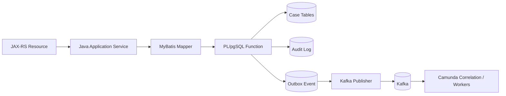
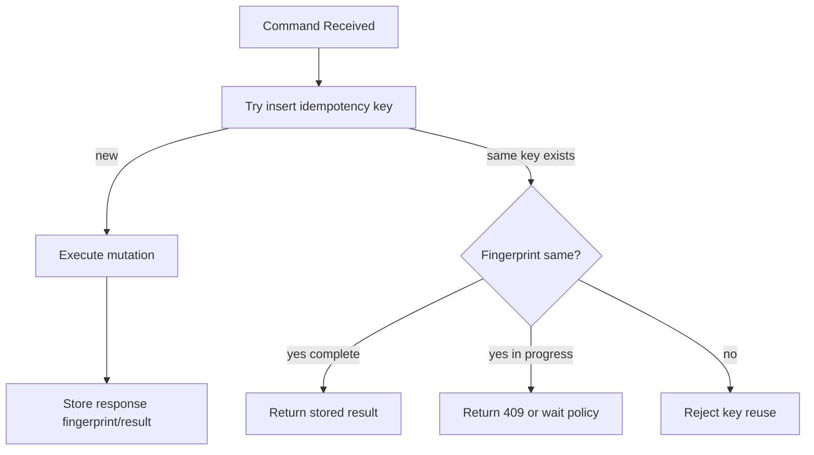

# Part 022 — PL/pgSQL for Production Logic

PL/pgSQL is not a place to hide business logic because the Java code became messy.

PL/pgSQL is a tool for logic that must execute **near the data**, inside the same transaction, with the database as the final consistency boundary.

Used badly, PL/pgSQL becomes an invisible application server.

Used well, it becomes a small, sharp layer for:

- enforcing state transitions under lock,
- appending audit records atomically,
- creating outbox events with the same commit as domain mutation,
- translating constraint failures into stable SQLSTATE/domain errors,
- implementing idempotent command persistence,
- reducing race windows,
- protecting data during migration and repair.

This part explains when to use PL/pgSQL, how to design function contracts, and how to integrate it with Java, MyBatis, Kafka, and Camunda 7 without turning the database into a black box.

---

## 1. The Boundary Rule

A production system should have a simple rule:

```text
Java owns orchestration and intent.
PostgreSQL owns durable consistency.
PL/pgSQL owns small atomic operations that are safer near the data.
```

Do not use PL/pgSQL for:

- HTTP request handling,
- calling external services,
- Kafka publishing,
- Camunda API calls,
- authorization policy that depends on external identity provider,
- large application workflows,
- business processes that need human explanation outside database context.

Use PL/pgSQL for:

- atomic domain mutation,
- state transition with expected version,
- append-only audit write,
- durable outbox insertion,
- idempotency record creation/update,
- sequence/reference generation,
- data repair scripts,
- migration helpers,
- invariant-preserving bulk operations.

The function should be a **transactional primitive**, not a hidden feature module.

---

## 2. Why PL/pgSQL Exists in This Architecture

Our platform uses these boundaries:



The key property:

> Case mutation, audit append, and outbox obligation commit together.

If Java updates the case and then separately inserts audit/outbox records, every boundary becomes a failure point:

```text
case updated -> JVM crash before audit
case updated -> audit inserted -> crash before outbox
case updated -> outbox inserted -> duplicate audit on retry
```

PL/pgSQL can group the durable mutation as one database contract.

Kafka publishing still happens outside the transaction via the outbox publisher.

---

## 3. Function Contract Design

A PL/pgSQL function is a contract.

It needs the same discipline as an HTTP or Kafka contract.

A function contract must define:

| Contract element | Example |
|---|---|
| Name | `case_core.transition_case_status` |
| Command intent | move case from one status to another |
| Required input | case id, tenant id, expected version, target status, actor, reason |
| Authorization assumption | caller has already authenticated and checked high-level permission |
| Invariant enforced | expected status/version, valid transition, audit append, outbox event |
| Return model | new version, previous status, new status, event id |
| Error model | stable SQLSTATE and message/detail/hint |
| Side effects | update case, insert audit, insert outbox |
| Idempotency | external or internal depending on command |
| Locking | row-level lock on target case |

Avoid ambiguous function names:

```sql
-- weak
perform_case_update(...)
process_case(...)
save_case(...)
```

Prefer intent-revealing names:

```sql
case_core.transition_case_status(...)
case_core.append_case_evidence(...)
case_core.record_case_decision(...)
integration.claim_outbox_batch(...)
integration.mark_outbox_published(...)
```

---

## 4. Function Input Style

There are two common styles.

### 4.1 Many Scalar Parameters

```sql
CREATE FUNCTION case_core.transition_case_status(
  p_tenant_id text,
  p_case_id uuid,
  p_expected_version integer,
  p_target_status text,
  p_actor_id text,
  p_reason text,
  p_correlation_id text
)
RETURNS TABLE (
  case_id uuid,
  previous_status text,
  new_status text,
  new_version integer,
  outbox_event_id uuid
)
LANGUAGE plpgsql
AS $$
BEGIN
  -- implementation
END;
$$;
```

Good for stable, small command contracts.

Pros:

- explicit,
- type-safe,
- easy to map with MyBatis,
- easy to document,
- easy to detect breaking changes.

Cons:

- signature changes when command evolves,
- too many parameters can become noisy.

### 4.2 JSONB Command Parameter

```sql
CREATE FUNCTION case_core.transition_case_status(p_command jsonb)
RETURNS jsonb
LANGUAGE plpgsql
AS $$
BEGIN
  -- implementation
END;
$$;
```

Useful for flexible migration or internal admin tooling.

But it hides type checking and can make compatibility worse.

For production application commands, prefer scalar parameters or strongly typed composite types unless there is a clear reason.

---

## 5. Stable Error Contract

Do not throw random text from PL/pgSQL and parse it in Java.

Use stable SQLSTATE plus structured message/detail/hint.

Example:

```sql
RAISE EXCEPTION USING
  ERRCODE = 'P0001',
  MESSAGE = 'CASE_VERSION_CONFLICT',
  DETAIL = format('case_id=%s expected_version=%s', p_case_id, p_expected_version),
  HINT = 'Reload the case and retry the command with the latest version.';
```

PostgreSQL has standard SQLSTATE codes. For domain-specific errors, many teams use user-defined exception code patterns such as `P0001` with stable messages.

In Java, map errors by SQLSTATE and message code:

```java
public DomainError map(SQLException e) {
    String sqlState = e.getSQLState();
    String message = e.getMessage();

    if ("23505".equals(sqlState)) {
        return DomainError.conflict("UNIQUE_CONSTRAINT_VIOLATION");
    }
    if ("P0001".equals(sqlState) && message.contains("CASE_VERSION_CONFLICT")) {
        return DomainError.conflict("CASE_VERSION_CONFLICT");
    }
    if ("P0001".equals(sqlState) && message.contains("INVALID_CASE_TRANSITION")) {
        return DomainError.conflict("INVALID_CASE_TRANSITION");
    }
    return DomainError.internal("DATABASE_ERROR");
}
```

Better yet, standardize the function error message format so Java does not rely on fragile full-text parsing.

---

## 6. The Main Example: Transition Case Status

We will implement one production-grade function:

```text
case_core.transition_case_status
```

It must:

1. lock the case row,
2. check tenant boundary,
3. check expected version,
4. check allowed transition,
5. update case state,
6. append audit log,
7. insert outbox event,
8. return mutation result.

### 6.1 Supporting Table: Transition Rule

Hardcoding every transition in PL/pgSQL can work for small systems, but a rule table is easier to inspect and migrate.

```sql
CREATE TABLE case_core.case_status_transition_rule (
  from_status text NOT NULL,
  to_status text NOT NULL,
  transition_code text NOT NULL,
  requires_reason boolean NOT NULL DEFAULT false,
  is_active boolean NOT NULL DEFAULT true,
  PRIMARY KEY (from_status, to_status)
);

INSERT INTO case_core.case_status_transition_rule
(from_status, to_status, transition_code, requires_reason)
VALUES
('DRAFT', 'INTAKE_VALIDATION', 'SUBMIT_FOR_INTAKE', false),
('INTAKE_VALIDATION', 'UNDER_ASSESSMENT', 'ACCEPT_INTAKE', false),
('INTAKE_VALIDATION', 'CLOSED', 'REJECT_INTAKE', true),
('UNDER_ASSESSMENT', 'UNDER_INVESTIGATION', 'OPEN_INVESTIGATION', false),
('UNDER_INVESTIGATION', 'PENDING_DECISION', 'COMPLETE_INVESTIGATION', false),
('PENDING_DECISION', 'DECIDED', 'RECORD_DECISION', false),
('DECIDED', 'CLOSED', 'CLOSE_CASE', false),
('CLOSED', 'REOPENED', 'REOPEN_CASE', true),
('REOPENED', 'UNDER_INVESTIGATION', 'RESUME_INVESTIGATION', false);
```

This table is not a replacement for BPMN.

It is the domain state transition guard. BPMN orchestration may trigger commands, but the database still protects the domain state.

### 6.2 Result Type

A named result type makes MyBatis mapping clearer.

```sql
CREATE TYPE case_core.case_transition_result AS (
  case_id uuid,
  previous_status text,
  new_status text,
  previous_version integer,
  new_version integer,
  audit_id uuid,
  outbox_event_id uuid
);
```

### 6.3 Function Implementation

```sql
CREATE OR REPLACE FUNCTION case_core.transition_case_status(
  p_tenant_id text,
  p_case_id uuid,
  p_expected_version integer,
  p_target_status text,
  p_actor_id text,
  p_reason text,
  p_correlation_id text
)
RETURNS case_core.case_transition_result
LANGUAGE plpgsql
AS $$
DECLARE
  v_case record;
  v_rule record;
  v_now timestamptz := clock_timestamp();
  v_audit_id uuid := gen_random_uuid();
  v_outbox_event_id uuid := gen_random_uuid();
  v_new_version integer;
  v_result case_core.case_transition_result;
BEGIN
  IF p_actor_id IS NULL OR btrim(p_actor_id) = '' THEN
    RAISE EXCEPTION USING
      ERRCODE = 'P0001',
      MESSAGE = 'ACTOR_REQUIRED',
      DETAIL = 'actor id is required for auditable case transition';
  END IF;

  SELECT
    c.case_id,
    c.tenant_id,
    c.case_reference,
    c.current_status,
    c.version
  INTO v_case
  FROM case_core.enforcement_case c
  WHERE c.case_id = p_case_id
    AND c.tenant_id = p_tenant_id
  FOR UPDATE;

  IF NOT FOUND THEN
    RAISE EXCEPTION USING
      ERRCODE = 'P0001',
      MESSAGE = 'CASE_NOT_FOUND',
      DETAIL = format('tenant_id=%s case_id=%s', p_tenant_id, p_case_id);
  END IF;

  IF v_case.version <> p_expected_version THEN
    RAISE EXCEPTION USING
      ERRCODE = 'P0001',
      MESSAGE = 'CASE_VERSION_CONFLICT',
      DETAIL = format(
        'case_id=%s expected_version=%s actual_version=%s',
        p_case_id,
        p_expected_version,
        v_case.version
      ),
      HINT = 'Reload the case and retry with the latest version.';
  END IF;

  SELECT r.*
  INTO v_rule
  FROM case_core.case_status_transition_rule r
  WHERE r.from_status = v_case.current_status
    AND r.to_status = p_target_status
    AND r.is_active = true;

  IF NOT FOUND THEN
    RAISE EXCEPTION USING
      ERRCODE = 'P0001',
      MESSAGE = 'INVALID_CASE_TRANSITION',
      DETAIL = format(
        'case_id=%s from_status=%s to_status=%s',
        p_case_id,
        v_case.current_status,
        p_target_status
      );
  END IF;

  IF v_rule.requires_reason AND (p_reason IS NULL OR btrim(p_reason) = '') THEN
    RAISE EXCEPTION USING
      ERRCODE = 'P0001',
      MESSAGE = 'TRANSITION_REASON_REQUIRED',
      DETAIL = format('transition_code=%s', v_rule.transition_code);
  END IF;

  v_new_version := v_case.version + 1;

  UPDATE case_core.enforcement_case
  SET current_status = p_target_status,
      version = v_new_version,
      updated_at = v_now
  WHERE case_id = p_case_id
    AND tenant_id = p_tenant_id;

  INSERT INTO case_core.case_audit_log (
    audit_id,
    case_id,
    tenant_id,
    audit_type,
    actor_id,
    occurred_at,
    correlation_id,
    details
  ) VALUES (
    v_audit_id,
    p_case_id,
    p_tenant_id,
    'CASE_STATUS_TRANSITION',
    p_actor_id,
    v_now,
    p_correlation_id,
    jsonb_build_object(
      'fromStatus', v_case.current_status,
      'toStatus', p_target_status,
      'transitionCode', v_rule.transition_code,
      'reason', p_reason,
      'previousVersion', v_case.version,
      'newVersion', v_new_version
    )
  );

  INSERT INTO integration.outbox_event (
    outbox_event_id,
    aggregate_type,
    aggregate_id,
    topic_name,
    partition_key,
    event_type,
    payload,
    headers,
    status,
    created_at,
    next_attempt_at
  ) VALUES (
    v_outbox_event_id,
    'CASE',
    p_case_id,
    'regulatory.case.events.v1',
    p_case_id::text,
    'CaseStatusChanged',
    jsonb_build_object(
      'eventId', v_outbox_event_id,
      'caseId', p_case_id,
      'tenantId', p_tenant_id,
      'caseReference', v_case.case_reference,
      'previousStatus', v_case.current_status,
      'newStatus', p_target_status,
      'version', v_new_version,
      'occurredAt', v_now
    ),
    jsonb_build_object(
      'correlationId', p_correlation_id,
      'actorId', p_actor_id,
      'schemaVersion', '1.0.0'
    ),
    'PENDING',
    v_now,
    v_now
  );

  v_result := (
    p_case_id,
    v_case.current_status,
    p_target_status,
    v_case.version,
    v_new_version,
    v_audit_id,
    v_outbox_event_id
  )::case_core.case_transition_result;

  RETURN v_result;
END;
$$;
```

The function intentionally does not publish to Kafka.

It creates a durable obligation to publish.

That is the outbox pattern.

---

## 7. Why the Function Locks the Row

The line below matters:

```sql
FOR UPDATE
```

Without it, two transactions can both read the same version/status and then race.

With row-level lock:

```text
Transaction A locks case row.
Transaction B waits for same row.
Transaction A updates version/status and commits.
Transaction B resumes, sees updated row or fails version check.
```

This does not eliminate every concurrency issue in the system.

It makes this specific state transition atomic and serial for one case row.

For cross-case operations, different lock strategy may be needed.

---

## 8. Keep Authorization Outside, Keep Audit Context Inside

The function should not decide whether the user is allowed to transition the case unless all required authorization data is already in the database and stable.

Better split:

```text
JAX-RS filter/auth layer -> identity validated
Java application service -> permission checked
PL/pgSQL function -> actor_id required and recorded
```

The database function should reject missing actor identity because the mutation must be auditable.

But it should not call an identity service.

```sql
IF p_actor_id IS NULL OR btrim(p_actor_id) = '' THEN
  RAISE EXCEPTION ... MESSAGE = 'ACTOR_REQUIRED';
END IF;
```

That is not authentication. It is audit integrity.

---

## 9. MyBatis Integration

A mapper can call the function explicitly.

```xml
<select id="transitionCaseStatus"
        parameterType="com.example.caseapp.persistence.TransitionCaseStatusParams"
        resultMap="CaseTransitionResultMap">
  SELECT *
  FROM case_core.transition_case_status(
    #{tenantId},
    #{caseId,jdbcType=OTHER},
    #{expectedVersion},
    #{targetStatus},
    #{actorId},
    #{reason},
    #{correlationId}
  )
</select>
```

Result map:

```xml
<resultMap id="CaseTransitionResultMap"
           type="com.example.caseapp.persistence.CaseTransitionResultRow">
  <id property="caseId" column="case_id" />
  <result property="previousStatus" column="previous_status" />
  <result property="newStatus" column="new_status" />
  <result property="previousVersion" column="previous_version" />
  <result property="newVersion" column="new_version" />
  <result property="auditId" column="audit_id" />
  <result property="outboxEventId" column="outbox_event_id" />
</resultMap>
```

Application service:

```java
public TransitionCaseResult transition(TransitionCaseCommand command) {
    permissionService.requireCanTransition(command.actor(), command.caseId(), command.targetStatus());

    try {
        CaseTransitionResultRow row = mapper.transitionCaseStatus(
            TransitionCaseStatusParams.from(command)
        );
        return row.toDomainResult();
    } catch (PersistenceException e) {
        throw databaseErrorMapper.toApplicationException(e);
    }
}
```

The Java service still owns intent and permission.

The function owns atomic mutation.

---

## 10. Idempotent Command Function

Some commands must be idempotent at the API boundary.

Example:

```http
POST /cases/{caseId}/transitions
Idempotency-Key: abc-123
```

The idempotency function pattern:



A simplified table:

```sql
CREATE TABLE integration.idempotency_record (
  tenant_id text NOT NULL,
  idempotency_key text NOT NULL,
  request_fingerprint text NOT NULL,
  status text NOT NULL,
  response_payload jsonb NULL,
  created_at timestamptz NOT NULL DEFAULT clock_timestamp(),
  completed_at timestamptz NULL,
  PRIMARY KEY (tenant_id, idempotency_key),
  CONSTRAINT ck_idempotency_status CHECK (status IN ('IN_PROGRESS', 'COMPLETED', 'FAILED'))
);
```

A helper function:

```sql
CREATE OR REPLACE FUNCTION integration.begin_idempotent_command(
  p_tenant_id text,
  p_idempotency_key text,
  p_request_fingerprint text
)
RETURNS text
LANGUAGE plpgsql
AS $$
DECLARE
  v_existing record;
BEGIN
  INSERT INTO integration.idempotency_record (
    tenant_id,
    idempotency_key,
    request_fingerprint,
    status
  ) VALUES (
    p_tenant_id,
    p_idempotency_key,
    p_request_fingerprint,
    'IN_PROGRESS'
  )
  ON CONFLICT (tenant_id, idempotency_key) DO NOTHING;

  IF FOUND THEN
    RETURN 'STARTED';
  END IF;

  SELECT * INTO v_existing
  FROM integration.idempotency_record
  WHERE tenant_id = p_tenant_id
    AND idempotency_key = p_idempotency_key
  FOR UPDATE;

  IF v_existing.request_fingerprint <> p_request_fingerprint THEN
    RAISE EXCEPTION USING
      ERRCODE = 'P0001',
      MESSAGE = 'IDEMPOTENCY_KEY_REUSED_WITH_DIFFERENT_REQUEST';
  END IF;

  IF v_existing.status = 'COMPLETED' THEN
    RETURN 'ALREADY_COMPLETED';
  END IF;

  RETURN 'IN_PROGRESS';
END;
$$;
```

This function alone is not the full design. You still need response storage, timeout policy, and recovery behavior.

But the invariant belongs in the database:

```text
same tenant + same key -> same fingerprint or reject
```

---

## 11. Outbox Functions

The outbox publisher needs atomic claim and completion operations.

### 11.1 Claim Batch

```sql
CREATE OR REPLACE FUNCTION integration.claim_outbox_batch(
  p_batch_size integer,
  p_worker_id text
)
RETURNS SETOF integration.outbox_event
LANGUAGE plpgsql
AS $$
BEGIN
  RETURN QUERY
  WITH candidate AS (
    SELECT outbox_event_id
    FROM integration.outbox_event
    WHERE status IN ('PENDING', 'FAILED')
      AND next_attempt_at <= clock_timestamp()
    ORDER BY next_attempt_at ASC, created_at ASC, outbox_event_id ASC
    LIMIT p_batch_size
    FOR UPDATE SKIP LOCKED
  )
  UPDATE integration.outbox_event o
  SET status = 'PUBLISHING',
      attempt_count = attempt_count + 1,
      locked_by = p_worker_id,
      locked_at = clock_timestamp()
  FROM candidate c
  WHERE o.outbox_event_id = c.outbox_event_id
  RETURNING o.*;
END;
$$;
```

The `SKIP LOCKED` pattern enables multiple workers to claim different rows without blocking each other on already-claimed rows.

### 11.2 Mark Published

```sql
CREATE OR REPLACE FUNCTION integration.mark_outbox_published(
  p_outbox_event_id uuid,
  p_worker_id text
)
RETURNS void
LANGUAGE plpgsql
AS $$
BEGIN
  UPDATE integration.outbox_event
  SET status = 'PUBLISHED',
      published_at = clock_timestamp(),
      locked_by = NULL,
      locked_at = NULL,
      last_error = NULL
  WHERE outbox_event_id = p_outbox_event_id
    AND status = 'PUBLISHING'
    AND locked_by = p_worker_id;

  IF NOT FOUND THEN
    RAISE EXCEPTION USING
      ERRCODE = 'P0001',
      MESSAGE = 'OUTBOX_EVENT_NOT_OWNED_BY_WORKER',
      DETAIL = format('outbox_event_id=%s worker_id=%s', p_outbox_event_id, p_worker_id);
  END IF;
END;
$$;
```

### 11.3 Mark Failed

```sql
CREATE OR REPLACE FUNCTION integration.mark_outbox_failed(
  p_outbox_event_id uuid,
  p_worker_id text,
  p_error text
)
RETURNS void
LANGUAGE plpgsql
AS $$
DECLARE
  v_attempt_count integer;
  v_next_attempt_at timestamptz;
BEGIN
  SELECT attempt_count
  INTO v_attempt_count
  FROM integration.outbox_event
  WHERE outbox_event_id = p_outbox_event_id
    AND status = 'PUBLISHING'
    AND locked_by = p_worker_id
  FOR UPDATE;

  IF NOT FOUND THEN
    RAISE EXCEPTION USING
      ERRCODE = 'P0001',
      MESSAGE = 'OUTBOX_EVENT_NOT_OWNED_BY_WORKER';
  END IF;

  v_next_attempt_at := clock_timestamp() + make_interval(secs => LEAST(300, power(2, v_attempt_count)::integer));

  UPDATE integration.outbox_event
  SET status = 'FAILED',
      next_attempt_at = v_next_attempt_at,
      locked_by = NULL,
      locked_at = NULL,
      last_error = left(p_error, 2000)
  WHERE outbox_event_id = p_outbox_event_id;
END;
$$;
```

Keep retry math simple and observable. More complex policies can live in Java if easier to test.

---

## 12. Trigger Functions: Use Sparingly

PL/pgSQL trigger functions can enforce automatic behavior, but they hide control flow.

Good trigger use cases:

- maintain `updated_at`,
- append low-level audit for sensitive tables,
- prevent direct mutation of append-only tables,
- enforce cross-column normalization.

Bad trigger use cases:

- start business workflows,
- call external integrations,
- silently create domain events from every update,
- replace application commands,
- implement complex state machine invisibly.

Example `updated_at` trigger:

```sql
CREATE OR REPLACE FUNCTION case_core.set_updated_at()
RETURNS trigger
LANGUAGE plpgsql
AS $$
BEGIN
  NEW.updated_at := clock_timestamp();
  RETURN NEW;
END;
$$;

CREATE TRIGGER trg_case_set_updated_at
BEFORE UPDATE ON case_core.enforcement_case
FOR EACH ROW
EXECUTE FUNCTION case_core.set_updated_at();
```

This is acceptable because it is simple, local, and unsurprising.

A trigger that inserts Kafka outbox events on every update is more dangerous because it may publish events for internal repair, migration, or administrative corrections unless carefully filtered.

---

## 13. SECURITY DEFINER Risk

`SECURITY DEFINER` means the function runs with the privileges of the function owner, not the caller.

This can be useful for exposing a narrow safe mutation surface while denying direct table writes.

But it is risky.

If you use it:

- set a safe `search_path`,
- schema-qualify objects,
- keep the function small,
- revoke public execute if needed,
- grant execute to specific application role,
- avoid dynamic SQL where possible,
- validate all inputs,
- never concatenate untrusted strings into SQL.

Example skeleton:

```sql
CREATE OR REPLACE FUNCTION case_core.safe_transition_case_status(...)
RETURNS case_core.case_transition_result
LANGUAGE plpgsql
SECURITY DEFINER
SET search_path = case_core, integration, pg_temp
AS $$
BEGIN
  -- schema-qualified access still preferred for clarity
END;
$$;

REVOKE ALL ON FUNCTION case_core.safe_transition_case_status(...) FROM PUBLIC;
GRANT EXECUTE ON FUNCTION case_core.safe_transition_case_status(...) TO app_case_service;
```

Do not use `SECURITY DEFINER` as a shortcut around proper privileges. Use it as a carefully audited interface.

---

## 14. Dynamic SQL Discipline

Dynamic SQL is powerful and dangerous.

Avoid it unless needed for:

- generic migration helpers,
- partition maintenance,
- admin tooling,
- generated report functions with controlled identifiers.

Bad:

```sql
EXECUTE 'SELECT * FROM ' || p_table_name || ' WHERE id = ''' || p_id || '''';
```

Better:

```sql
EXECUTE format('SELECT * FROM %I.%I WHERE id = $1', p_schema_name, p_table_name)
USING p_id;
```

Use `format('%I', identifier)` for identifiers and `USING` for values.

Still, most production command functions should not need dynamic SQL.

---

## 15. Migration-Safe Function Evolution

Function signatures are contracts.

Changing a function parameter list can break Java/MyBatis callers.

Safer strategies:

### 15.1 Add New Function Version

```sql
case_core.transition_case_status_v1(...)
case_core.transition_case_status_v2(...)
```

Use when behavior or result contract changes meaningfully.

### 15.2 Add Wrapper Function

```sql
CREATE OR REPLACE FUNCTION case_core.transition_case_status(
  p_tenant_id text,
  p_case_id uuid,
  p_expected_version integer,
  p_target_status text,
  p_actor_id text,
  p_reason text,
  p_correlation_id text
)
RETURNS case_core.case_transition_result
LANGUAGE plpgsql
AS $$
BEGIN
  RETURN case_core.transition_case_status_v2(
    p_tenant_id,
    p_case_id,
    p_expected_version,
    p_target_status,
    p_actor_id,
    p_reason,
    p_correlation_id,
    NULL
  );
END;
$$;
```

Use when you need backward compatibility during rolling deploy.

### 15.3 Avoid Breaking Return Type Casually

If MyBatis maps columns by name, adding columns may be okay. Renaming/removing columns is breaking.

For command results, prefer explicit result columns with stable names.

---

## 16. Testing PL/pgSQL

Do not test database functions only through HTTP.

You need layered tests.

| Test layer | Purpose |
|---|---|
| SQL unit test | direct function behavior and SQLSTATE |
| Integration test | Java/MyBatis mapping and transaction behavior |
| Concurrency test | lock/version conflict behavior |
| Contract test | result columns and error codes remain stable |
| Migration test | old and new app versions work during rollout |
| Recovery test | outbox/inbox/idempotency repair behavior |

Example SQL test shape:

```sql
BEGIN;

SELECT case_core.transition_case_status(
  'tenant-a',
  '00000000-0000-0000-0000-000000000001'::uuid,
  1,
  'INTAKE_VALIDATION',
  'user-123',
  NULL,
  'corr-001'
);

SELECT current_status, version
FROM case_core.enforcement_case
WHERE case_id = '00000000-0000-0000-0000-000000000001'::uuid;

SELECT audit_type
FROM case_core.case_audit_log
WHERE case_id = '00000000-0000-0000-0000-000000000001'::uuid;

SELECT event_type, status
FROM integration.outbox_event
WHERE aggregate_id = '00000000-0000-0000-0000-000000000001'::uuid;

ROLLBACK;
```

In Java integration tests, use Testcontainers PostgreSQL and execute the same mapper call the application uses.

---

## 17. Observability for Database Functions

A function is production code. It needs observability.

At minimum, expose metrics at the Java layer:

- function call count,
- function latency,
- SQLSTATE count,
- domain error count,
- lock timeout count,
- deadlock count,
- retry count,
- outbox rows generated,
- outbox age.

PostgreSQL-side logging can help during incidents, but do not spam logs from every function call.

Avoid this in hot paths:

```sql
RAISE NOTICE 'transitioning case %', p_case_id;
```

Use structured audit tables for domain audit, and application metrics for operational observability.

---

## 18. Performance Considerations

PL/pgSQL is usually fast enough for small transactional functions.

Performance problems appear when functions:

- loop row by row over large sets,
- execute unindexed queries,
- hide expensive joins,
- call functions per row in large queries,
- use dynamic SQL unnecessarily,
- do too much JSON manipulation in hot paths,
- hold locks while doing slow work,
- perform broad updates without batching.

Bad pattern:

```sql
FOR v_case IN SELECT * FROM case_core.enforcement_case WHERE current_status = 'DRAFT'
LOOP
  UPDATE case_core.enforcement_case SET ... WHERE case_id = v_case.case_id;
END LOOP;
```

Better set-based update if the rule is simple:

```sql
UPDATE case_core.enforcement_case
SET current_status = 'INTAKE_VALIDATION',
    version = version + 1,
    updated_at = clock_timestamp()
WHERE current_status = 'DRAFT'
  AND created_at < clock_timestamp() - interval '7 days';
```

For command functions, row-level logic is fine because one command usually targets one aggregate.

For bulk repair, use batch size and explicit progress tracking.

---

## 19. Transaction Boundary with Java

A PL/pgSQL function runs inside the transaction started by the caller.

If Java uses a transaction manager:

```text
begin transaction
  call function
  maybe perform additional DB reads
commit
```

The function does not commit independently.

That is important.

Do not design function behavior assuming it commits immediately. The caller can still roll back.

This is usually good: API command either commits all database effects or none.

But it means:

- do not publish Kafka inside the function,
- do not rely on outbox rows being visible before commit,
- do not hold transactions open while calling external systems,
- keep Java transaction scope short.

---

## 20. Camunda 7 Integration Boundary

Camunda 7 process execution may call Java delegates. Those delegates may call database functions.

Be careful with transaction semantics.

A BPMN service task that calls `transition_case_status` may run inside a Camunda-managed transaction depending on engine integration.

The safe rule:

```text
BPMN step calls application service.
Application service calls DB function.
DB function mutates domain + audit + outbox.
If delegate fails, transaction rolls back and Camunda retry/incident semantics apply.
```

Do not let Camunda process variables become the durable domain state.

After calling the function, store only what the process needs:

```text
caseId
businessKey
newVersion
transitionResultCode
```

The durable truth remains in PostgreSQL.

---

## 21. Failure Model

### Failure: Java Crashes After Function Returns Before HTTP Response

Database transaction may have committed or rolled back depending on crash timing.

Defense:

- idempotency key,
- durable audit,
- durable outbox,
- read-after-retry behavior.

### Failure: Function Updates Case But Audit Insert Fails

If inside one function/transaction, entire transaction rolls back.

Defense:

- atomic function,
- not separate best-effort audit call.

### Failure: Kafka Publish Fails

The function does not publish Kafka.

It inserts outbox row.

Defense:

- outbox retry,
- DLQ/quarantine policy,
- outbox age alert.

### Failure: Two Users Transition Same Case

Defense:

- row lock,
- expected version,
- stable conflict error.

### Failure: Function Signature Breaks Rolling Deploy

Defense:

- function versioning,
- wrapper functions,
- expand-contract release.

### Failure: SECURITY DEFINER Escalation

Defense:

- safe search path,
- least privilege,
- no unsafe dynamic SQL,
- explicit grants,
- audit review.

---

## 22. Production Checklist

Before creating or changing a PL/pgSQL function:

- [ ] Is the function a small atomic primitive, not a hidden application workflow?
- [ ] Is the input contract explicit?
- [ ] Is the return contract stable?
- [ ] Are all touched tables schema-qualified?
- [ ] Is the lock strategy documented?
- [ ] Are expected version/status checks included where needed?
- [ ] Are audit and outbox writes atomic with mutation?
- [ ] Are domain errors stable and mappable in Java?
- [ ] Are SQLSTATE/constraint violations tested?
- [ ] Does the function avoid external calls?
- [ ] Does the function avoid broad unbounded scans?
- [ ] Is the function safe under rolling deploy?
- [ ] If `SECURITY DEFINER` is used, is `search_path` controlled?
- [ ] Is the function covered by SQL and Java integration tests?
- [ ] Are metrics available at the Java boundary?

---

## 23. Anti-Patterns

| Anti-pattern | Why it fails |
|---|---|
| Move all business logic into PL/pgSQL | Creates hidden application server with weak tooling and ownership |
| Let Java parse free-form database error text | Fragile and breaks localization/message changes |
| Publish Kafka from database function | External side effect cannot commit atomically with DB transaction |
| Use triggers for major business workflows | Makes behavior invisible and hard to reason about |
| Use SECURITY DEFINER casually | Can create privilege escalation vulnerabilities |
| Use JSONB command for every function | Loses database type checking and contract clarity |
| Change function signature during rolling deploy | Breaks old application pods |
| Hold locks while doing slow work | Causes contention and incident cascades |
| Catch all exceptions and return success | Corrupts operational truth |
| Create audit as best effort after mutation | Destroys regulatory defensibility |

---

## 24. What You Should Internalize

PL/pgSQL is most valuable when it makes a dangerous race impossible.

It should not replace Java application architecture.

It should compress a critical consistency window into one durable database operation:

```text
check -> lock -> mutate -> audit -> outbox -> return
```

That pattern is the heart of production-grade regulatory persistence.

The database function should be boring, explicit, tested, versioned, observable, and hard to misuse.

If a function feels clever, it is probably too clever.

---

## 25. References

- PostgreSQL Documentation — PL/pgSQL Overview: https://www.postgresql.org/docs/current/plpgsql.html
- PostgreSQL Documentation — PL/pgSQL Control Structures: https://www.postgresql.org/docs/current/plpgsql-control-structures.html
- PostgreSQL Documentation — PL/pgSQL Errors and Messages: https://www.postgresql.org/docs/current/plpgsql-errors-and-messages.html
- PostgreSQL Documentation — PL/pgSQL Trigger Functions: https://www.postgresql.org/docs/current/plpgsql-trigger.html
- PostgreSQL Documentation — SQLSTATE Error Codes: https://www.postgresql.org/docs/current/errcodes-appendix.html
- PostgreSQL Documentation — Transaction Isolation: https://www.postgresql.org/docs/current/transaction-iso.html
- PostgreSQL Documentation — Explicit Locking: https://www.postgresql.org/docs/current/explicit-locking.html
- PostgreSQL Documentation — CREATE FUNCTION: https://www.postgresql.org/docs/current/sql-createfunction.html
