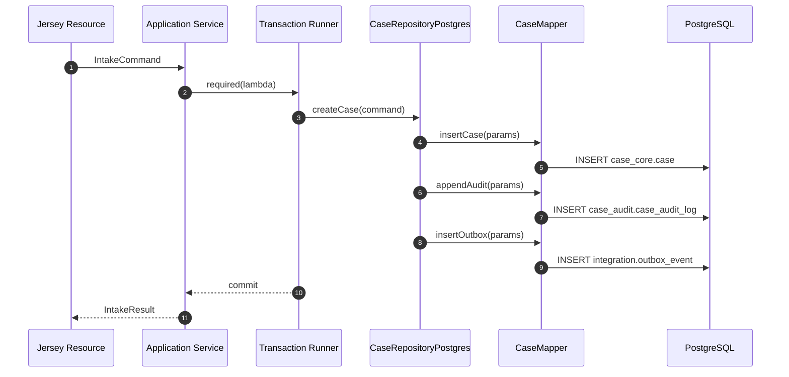
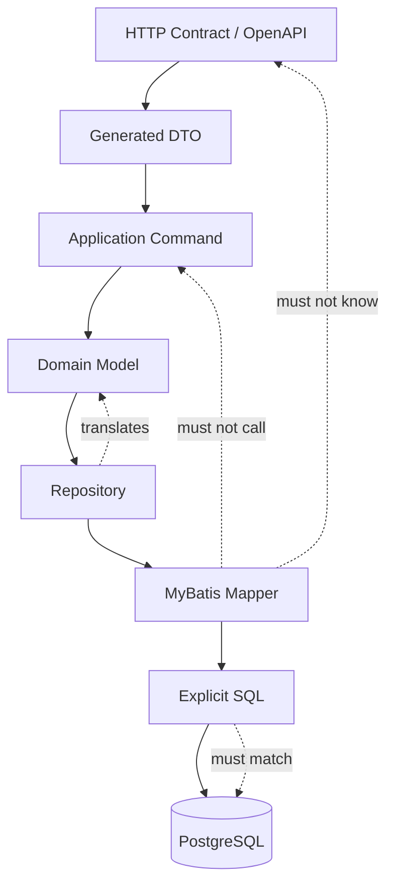

# Part 023 — MyBatis Mapper Design

MyBatis is not an ORM you use when you want to avoid SQL.

MyBatis is a persistence tool you use when SQL shape matters enough that you want it to be explicit, reviewed, tested, and owned.

In this series, that is exactly what we want.

The regulatory case platform has queries whose shape is part of the system contract:

- case search with stable pagination,
- case summary projection,
- SLA queue selection,
- outbox polling,
- inbox deduplication,
- audit append and retrieval,
- state transition through PL/pgSQL,
- evidence metadata retrieval,
- task snapshot query,
- reporting-oriented read model extraction.

A high-level ORM can be productive for CRUD-heavy domains. But in a system where query shape, locking behavior, transaction boundary, and index compatibility are operationally important, hiding SQL becomes risky.

MyBatis gives you a disciplined middle ground:

```text
Java owns intent and object boundaries.
SQL owns query shape and database behavior.
MyBatis owns the mapping contract between them.
```

This part explains how to design MyBatis mapper code so it remains clear under production load, schema evolution, and incident debugging.

---

## 1. The Mapper Boundary Rule

A mapper is not a repository, not a service, and not a business policy engine.

A mapper is a typed SQL adapter.

Use this rule:

```text
Resource -> Application Service -> Transaction Boundary -> Repository -> Mapper -> PostgreSQL
```

The mapper should not know:

- HTTP status codes,
- Kafka topics,
- Camunda process keys,
- user-facing error messages,
- authorization policy,
- workflow decisions,
- request idempotency semantics beyond the SQL it executes.

The mapper should know:

- SQL statement shape,
- parameter binding,
- result mapping,
- PostgreSQL type handling,
- stored function invocation,
- batch operation shape,
- lock clause requirements when the repository requests them.

A mapper is close to the database, but it should not become the database brain.

---

## 2. Why MyBatis Fits This Platform

The platform has a few traits that make MyBatis useful:

| System trait | Why MyBatis helps |
|---|---|
| PostgreSQL-specific SQL matters | MyBatis lets us write native SQL directly |
| Query plans matter | SQL text is visible and reviewable |
| Stored functions exist | Mapper can call functions explicitly |
| Domain state is constrained in DB | Mapper can rely on constraints and returned rows |
| Audit/outbox/inbox tables exist | SQL shape can be tuned per use case |
| Read models are not simple entity graphs | `resultMap` can map carefully without pretending it is an aggregate ORM graph |
| Case search needs stable pagination | Keyset SQL can be explicit |
| Concurrency needs lock clauses | `FOR UPDATE`, `SKIP LOCKED`, advisory locks can be written directly |

The key trade-off is that MyBatis gives you less automation and more responsibility.

That is acceptable in this series because the goal is not to write less SQL. The goal is to write SQL that is production-readable.

---

## 3. Module Placement

From the module topology in Part 005, mapper code belongs in the persistence adapter layer.

Recommended layout:

```text
case-platform/
  case-contract-openapi/
  case-contract-events/
  case-domain/
  case-application/
  case-persistence-postgres/
    src/main/java/com/acme/caseplatform/persistence/
      CaseRecord.java
      CaseSearchRow.java
      CaseMapper.java
      CaseRepositoryPostgres.java
      typehandler/
        CaseStatusTypeHandler.java
        JsonbTypeHandler.java
        OffsetDateTimeTypeHandler.java
    src/main/resources/com/acme/caseplatform/persistence/
      CaseMapper.xml
      AuditMapper.xml
      OutboxMapper.xml
      InboxMapper.xml
      SlaMapper.xml
  case-api-jersey/
  case-worker-kafka/
  case-worker-camunda/
```

Boundary rule:

```text
case-domain must not depend on MyBatis.
case-application must not depend on MyBatis XML details.
case-persistence-postgres may depend on domain types only if mapping is controlled.
```

A useful pattern is to keep mapper result rows separate from domain objects:

```text
SQL row -> persistence row type -> repository maps to domain object / application DTO
```

This avoids binding your domain model directly to physical table shape.

---

## 4. Mapper Interface Shape

A mapper interface should be boring.

Example:

```java
package com.acme.caseplatform.persistence;

import java.time.OffsetDateTime;
import java.util.List;
import java.util.Optional;
import java.util.UUID;

public interface CaseMapper {

    Optional<CaseRecord> findCaseById(UUID caseId);

    Optional<CaseRecord> findCaseByReference(String caseReference);

    List<CaseSearchRow> searchCases(CaseSearchSqlParams params);

    int insertCase(CaseInsertSqlParams params);

    int updateCaseSummary(CaseSummaryUpdateSqlParams params);

    CaseTransitionSqlResult transitionCase(CaseTransitionSqlParams params);

    List<OutboxRow> claimOutboxBatch(OutboxClaimSqlParams params);

    int markOutboxPublished(UUID eventId, OffsetDateTime publishedAt);
}
```

Notice what is missing:

- no `HttpRequest`,
- no `Response`,
- no `ProcessInstance`,
- no Kafka producer,
- no business service injection,
- no hidden transaction start/commit,
- no generic `Map<String, Object>` unless there is a deliberate reason.

Mapper methods should expose database operations, not application use cases.

---

## 5. Parameter Object Discipline

Do not pass ten primitive parameters into mapper methods.

Bad:

```java
int insertCase(UUID caseId, String ref, String type, String status, String tenant, String createdBy);
```

Better:

```java
public record CaseInsertSqlParams(
    UUID caseId,
    String caseReference,
    String caseType,
    String status,
    String tenantId,
    String createdBy,
    OffsetDateTime createdAt
) {}
```

Why this matters:

- parameter names become stable contract with XML,
- method signature stays readable,
- new optional fields can be added intentionally,
- tests can build fixtures clearly,
- logs/debugging can show a meaningful object,
- review can detect whether SQL uses all fields correctly.

Use domain primitives carefully. If the mapper receives domain value objects directly, make sure the mapping is obvious.

Example:

```java
public record CaseReference(String value) {
    public CaseReference {
        if (value == null || value.isBlank()) {
            throw new IllegalArgumentException("case reference is required");
        }
    }
}
```

You may either expose `String` to the mapper parameter or create a TypeHandler for `CaseReference`. For most systems, keep mapper params simple and convert in the repository.

---

## 6. Result Row Discipline

Avoid mapping complex domain aggregate directly from a large join.

Bad idea:

```text
SELECT case + party + allegation + evidence + task + audit
-> giant object graph
-> domain aggregate
```

That usually creates:

- duplicate parent rows,
- accidental N+1 repairs,
- memory growth,
- confusing `resultMap`,
- domain objects with partially loaded collections,
- stale assumptions about aggregate completeness.

Prefer explicit read shapes:

```java
public record CaseRecord(
    UUID caseId,
    String caseReference,
    String caseType,
    String status,
    long version,
    String tenantId,
    OffsetDateTime receivedAt,
    OffsetDateTime createdAt,
    OffsetDateTime updatedAt
) {}

public record CaseSearchRow(
    UUID caseId,
    String caseReference,
    String caseType,
    String status,
    String assignedTeam,
    OffsetDateTime receivedAt,
    OffsetDateTime dueAt,
    OffsetDateTime lastActivityAt
) {}
```

A query should answer one question.

If the question is “show case search result,” return `CaseSearchRow`.

If the question is “load case for transition,” return a lock-oriented record or call a transition function.

If the question is “render full case detail,” compose several intentionally shaped queries in the repository or application service.

---

## 7. XML Mapper as SQL Contract

Example `CaseMapper.xml`:

```xml
<?xml version="1.0" encoding="UTF-8" ?>
<!DOCTYPE mapper
  PUBLIC "-//mybatis.org//DTD Mapper 3.0//EN"
  "https://mybatis.org/dtd/mybatis-3-mapper.dtd">

<mapper namespace="com.acme.caseplatform.persistence.CaseMapper">

  <resultMap id="CaseRecordMap" type="com.acme.caseplatform.persistence.CaseRecord">
    <constructor>
      <arg column="case_id" javaType="java.util.UUID" />
      <arg column="case_reference" javaType="java.lang.String" />
      <arg column="case_type" javaType="java.lang.String" />
      <arg column="status" javaType="java.lang.String" />
      <arg column="version" javaType="long" />
      <arg column="tenant_id" javaType="java.lang.String" />
      <arg column="received_at" javaType="java.time.OffsetDateTime" />
      <arg column="created_at" javaType="java.time.OffsetDateTime" />
      <arg column="updated_at" javaType="java.time.OffsetDateTime" />
    </constructor>
  </resultMap>

  <select id="findCaseById" parameterType="java.util.UUID" resultMap="CaseRecordMap">
    SELECT
      c.case_id,
      c.case_reference,
      c.case_type,
      c.status,
      c.version,
      c.tenant_id,
      c.received_at,
      c.created_at,
      c.updated_at
    FROM case_core.case c
    WHERE c.case_id = #{caseId}
  </select>

</mapper>
```

Three rules:

1. Always list columns explicitly.
2. Avoid `SELECT *`.
3. Make `resultMap` names reflect the row shape, not the table name.

`SELECT *` is not harmless. It couples the mapper to table evolution, increases network payload, and can silently break constructor mappings when column order or names change.

---

## 8. Constructor Mapping for Records

Java records are a good fit for immutable persistence rows.

Example:

```java
public record CaseSearchRow(
    UUID caseId,
    String caseReference,
    String caseType,
    String status,
    String assignedTeam,
    OffsetDateTime receivedAt,
    OffsetDateTime dueAt,
    OffsetDateTime lastActivityAt
) {}
```

Mapper:

```xml
<resultMap id="CaseSearchRowMap" type="com.acme.caseplatform.persistence.CaseSearchRow">
  <constructor>
    <arg column="case_id" javaType="java.util.UUID" />
    <arg column="case_reference" javaType="java.lang.String" />
    <arg column="case_type" javaType="java.lang.String" />
    <arg column="status" javaType="java.lang.String" />
    <arg column="assigned_team" javaType="java.lang.String" />
    <arg column="received_at" javaType="java.time.OffsetDateTime" />
    <arg column="due_at" javaType="java.time.OffsetDateTime" />
    <arg column="last_activity_at" javaType="java.time.OffsetDateTime" />
  </constructor>
</resultMap>
```

This style makes row shape explicit.

The downside is verbosity. That is acceptable because the mapper is part of the production contract.

---

## 9. Search Query Shape

Case search is not generic filtering.

It is a contract between UI/API, SQL, index design, and operational performance.

Example parameter:

```java
public record CaseSearchSqlParams(
    String tenantId,
    String status,
    String caseType,
    String assignedTeam,
    OffsetDateTime receivedFrom,
    OffsetDateTime receivedTo,
    OffsetDateTime cursorReceivedAt,
    UUID cursorCaseId,
    int limit
) {}
```

Mapper:

```xml
<select id="searchCases" parameterType="com.acme.caseplatform.persistence.CaseSearchSqlParams" resultMap="CaseSearchRowMap">
  SELECT
    c.case_id,
    c.case_reference,
    c.case_type,
    c.status,
    a.assigned_team,
    c.received_at,
    s.due_at,
    c.updated_at AS last_activity_at
  FROM case_core.case c
  LEFT JOIN case_core.case_assignment a
    ON a.case_id = c.case_id
   AND a.active = true
  LEFT JOIN case_core.case_sla_obligation s
    ON s.case_id = c.case_id
   AND s.obligation_type = 'INITIAL_ASSESSMENT'
   AND s.satisfied_at IS NULL
  WHERE c.tenant_id = #{tenantId}
  <if test="status != null">
    AND c.status = #{status}
  </if>
  <if test="caseType != null">
    AND c.case_type = #{caseType}
  </if>
  <if test="assignedTeam != null">
    AND a.assigned_team = #{assignedTeam}
  </if>
  <if test="receivedFrom != null">
    AND c.received_at &gt;= #{receivedFrom}
  </if>
  <if test="receivedTo != null">
    AND c.received_at &lt; #{receivedTo}
  </if>
  <if test="cursorReceivedAt != null and cursorCaseId != null">
    AND (c.received_at, c.case_id) &lt; (#{cursorReceivedAt}, #{cursorCaseId})
  </if>
  ORDER BY c.received_at DESC, c.case_id DESC
  LIMIT #{limit}
</select>
```

This query shape implies an index such as:

```sql
CREATE INDEX CONCURRENTLY idx_case_search_tenant_status_received
ON case_core.case (tenant_id, status, received_at DESC, case_id DESC);
```

The mapper and index must be reviewed together.

A query without an index strategy is not production design. It is a guess.

---

## 10. Dynamic SQL: Useful, but Dangerous

MyBatis dynamic SQL is useful for optional filters.

It is dangerous when it becomes a query builder with unlimited combinations.

Safe dynamic SQL:

```xml
<if test="status != null">
  AND c.status = #{status}
</if>
```

Risky dynamic SQL:

```xml
${sortColumn} ${sortDirection}
```

`${...}` performs string substitution. It can be necessary for whitelisted identifiers, but it is not parameter binding.

For sorting, prefer an enum-to-SQL-fragment whitelist in Java:

```java
public enum CaseSort {
    RECEIVED_DESC("c.received_at DESC, c.case_id DESC"),
    DUE_ASC("s.due_at ASC NULLS LAST, c.case_id ASC");

    private final String sql;

    CaseSort(String sql) {
        this.sql = sql;
    }

    public String sql() {
        return sql;
    }
}
```

Then only pass values produced by internal code, never raw request strings.

Even better: keep a small number of named mapper methods for important query shapes.

---

## 11. The `#{}` vs `${}` Rule

Use `#{}` for values.

Use `${}` only for whitelisted SQL identifiers/fragments controlled by the application.

```xml
-- good
WHERE c.status = #{status}

-- dangerous if user-controlled
ORDER BY ${sortColumn}
```

The production rule:

```text
External input must never reach ${...}.
```

This includes:

- query parameter names,
- sort direction,
- schema names,
- table names,
- JSON path fragments,
- raw filter expressions.

When you need identifier flexibility, map an enum to fixed SQL text and test every option.

---

## 12. Mapping PostgreSQL Types

PostgreSQL has types that do not always map cleanly by default.

Common production choices:

| PostgreSQL type | Java type | Notes |
|---|---|---|
| `uuid` | `UUID` | Usually supported by PostgreSQL JDBC |
| `timestamptz` | `OffsetDateTime` | Prefer instant-aware semantics |
| `text` | `String` | Use constraints for allowed values where needed |
| `jsonb` | domain-specific record or `JsonNode` | Requires explicit serialization policy |
| `numeric` | `BigDecimal` | Never use double for money/precise quantities |
| `bigint` | `long`/`Long` | Watch nullability |
| `boolean` | `boolean`/`Boolean` | Match DB nullability |
| enum-like text | Java enum or string | Prefer stable DB text plus Java enum mapping at boundary |
| array | `List<T>` or SQL array | Use carefully; do not overuse |

The rule is simple:

```text
If PostgreSQL type has non-trivial semantics, make the mapping explicit.
```

---

## 13. TypeHandler Strategy

A TypeHandler is useful when the same database conversion appears repeatedly.

Example for a domain enum stored as text:

```java
public enum CaseStatus {
    RECEIVED,
    VALIDATING,
    UNDER_INVESTIGATION,
    PENDING_DECISION,
    CLOSED
}
```

TypeHandler:

```java
package com.acme.caseplatform.persistence.typehandler;

import com.acme.caseplatform.domain.CaseStatus;
import org.apache.ibatis.type.BaseTypeHandler;
import org.apache.ibatis.type.JdbcType;

import java.sql.CallableStatement;
import java.sql.PreparedStatement;
import java.sql.ResultSet;
import java.sql.SQLException;

public final class CaseStatusTypeHandler extends BaseTypeHandler<CaseStatus> {

    @Override
    public void setNonNullParameter(
            PreparedStatement ps,
            int i,
            CaseStatus parameter,
            JdbcType jdbcType
    ) throws SQLException {
        ps.setString(i, parameter.name());
    }

    @Override
    public CaseStatus getNullableResult(ResultSet rs, String columnName) throws SQLException {
        return from(rs.getString(columnName));
    }

    @Override
    public CaseStatus getNullableResult(ResultSet rs, int columnIndex) throws SQLException {
        return from(rs.getString(columnIndex));
    }

    @Override
    public CaseStatus getNullableResult(CallableStatement cs, int columnIndex) throws SQLException {
        return from(cs.getString(columnIndex));
    }

    private CaseStatus from(String value) {
        return value == null ? null : CaseStatus.valueOf(value);
    }
}
```

Use TypeHandlers for stable, common conversions.

Do not create a TypeHandler just to avoid thinking about mapping.

---

## 14. JSONB Mapping

`jsonb` is useful for flexible metadata, but dangerous if it becomes an escape hatch for missing schema design.

Good uses:

- external source payload snapshot,
- non-critical evidence metadata,
- event payload copy in outbox,
- audit diff details,
- integration diagnostic context.

Bad uses:

- primary case status,
- assignment state,
- SLA state,
- authorization fields,
- core query filters,
- frequently updated mutable business fields.

Example JSONB TypeHandler using Jackson:

```java
public final class JsonbNodeTypeHandler extends BaseTypeHandler<JsonNode> {
    private static final ObjectMapper MAPPER = new ObjectMapper();

    @Override
    public void setNonNullParameter(
            PreparedStatement ps,
            int i,
            JsonNode parameter,
            JdbcType jdbcType
    ) throws SQLException {
        PGobject jsonObject = new PGobject();
        jsonObject.setType("jsonb");
        jsonObject.setValue(parameter.toString());
        ps.setObject(i, jsonObject);
    }

    @Override
    public JsonNode getNullableResult(ResultSet rs, String columnName) throws SQLException {
        return parse(rs.getString(columnName));
    }

    @Override
    public JsonNode getNullableResult(ResultSet rs, int columnIndex) throws SQLException {
        return parse(rs.getString(columnIndex));
    }

    @Override
    public JsonNode getNullableResult(CallableStatement cs, int columnIndex) throws SQLException {
        return parse(cs.getString(columnIndex));
    }

    private JsonNode parse(String value) throws SQLException {
        if (value == null) {
            return null;
        }
        try {
            return MAPPER.readTree(value);
        } catch (JsonProcessingException e) {
            throw new SQLException("Invalid jsonb payload", e);
        }
    }
}
```

Production rule:

```text
JSONB fields need schema ownership too, even if PostgreSQL does not enforce every field.
```

At minimum, document:

- owner,
- expected shape,
- allowed version field,
- index strategy if queried,
- retention policy,
- migration strategy.

---

## 15. Calling PL/pgSQL Functions

From Part 022, PL/pgSQL functions should represent atomic primitives.

Mapper example:

```java
public record CaseTransitionSqlParams(
    UUID caseId,
    String expectedStatus,
    long expectedVersion,
    String targetStatus,
    String reasonCode,
    String actorId,
    String correlationId,
    OffsetDateTime occurredAt
) {}

public record CaseTransitionSqlResult(
    UUID caseId,
    String previousStatus,
    String newStatus,
    long newVersion,
    UUID auditId,
    UUID outboxEventId
) {}
```

XML:

```xml
<resultMap id="CaseTransitionResultMap" type="com.acme.caseplatform.persistence.CaseTransitionSqlResult">
  <constructor>
    <arg column="case_id" javaType="java.util.UUID" />
    <arg column="previous_status" javaType="java.lang.String" />
    <arg column="new_status" javaType="java.lang.String" />
    <arg column="new_version" javaType="long" />
    <arg column="audit_id" javaType="java.util.UUID" />
    <arg column="outbox_event_id" javaType="java.util.UUID" />
  </constructor>
</resultMap>

<select id="transitionCase"
        parameterType="com.acme.caseplatform.persistence.CaseTransitionSqlParams"
        resultMap="CaseTransitionResultMap">
  SELECT *
  FROM case_core.transition_case(
    p_case_id          =&gt; #{caseId},
    p_expected_status =&gt; #{expectedStatus},
    p_expected_version =&gt; #{expectedVersion},
    p_target_status   =&gt; #{targetStatus},
    p_reason_code     =&gt; #{reasonCode},
    p_actor_id        =&gt; #{actorId},
    p_correlation_id  =&gt; #{correlationId},
    p_occurred_at     =&gt; #{occurredAt}
  )
</select>
```

The repository maps SQL exceptions to domain errors.

Do not let application services interpret raw database exception messages.

---

## 16. Repository Wrapper

The repository is where persistence operations become domain language.

```java
public final class CaseRepositoryPostgres implements CaseRepository {
    private final CaseMapper caseMapper;
    private final SqlErrorTranslator errorTranslator;

    public CaseRepositoryPostgres(CaseMapper caseMapper, SqlErrorTranslator errorTranslator) {
        this.caseMapper = caseMapper;
        this.errorTranslator = errorTranslator;
    }

    @Override
    public CaseTransitionResult transition(CaseTransitionCommand command) {
        try {
            CaseTransitionSqlResult row = caseMapper.transitionCase(toSqlParams(command));
            return toDomainResult(row);
        } catch (PersistenceException e) {
            throw errorTranslator.translate(e);
        }
    }
}
```

The repository is allowed to speak both domain and persistence.

The mapper should speak only persistence.

---

## 17. Transaction Scope

A mapper must not silently own transaction scope.

The transaction boundary should be visible at the application service or unit-of-work layer.

Example:

```java
public final class CaseIntakeService {
    private final TransactionRunner tx;
    private final CaseRepository cases;
    private final IdempotencyRepository idempotency;

    public IntakeResult intake(IntakeCommand command) {
        return tx.required(() -> {
            idempotency.reserve(command.idempotencyKey(), command.fingerprint());
            IntakeResult result = cases.createCase(command);
            idempotency.markCompleted(command.idempotencyKey(), result.responseSnapshot());
            return result;
        });
    }
}
```

The mapper participates in the current transaction.

It does not decide:

- when the transaction starts,
- whether Kafka is published immediately,
- whether Camunda is called inside the transaction,
- how retries are performed,
- whether HTTP returns `409`, `422`, or `503`.

Those decisions live above the mapper.

---

## 18. SqlSession and Local Cache Awareness

MyBatis has a `SqlSession` concept. The session is the main execution scope.

In production code, you need a clear session lifecycle:

```text
one request/command transaction -> one managed SqlSession -> mapper calls -> commit/rollback
```

Be careful with MyBatis local cache.

Within the same session, repeated selects can return cached objects depending on configuration and statement behavior. That can surprise you in code that expects to see changes made outside the session.

Practical rule for command paths:

```text
Do not rely on MyBatis cache for correctness.
Use database constraints, locks, and transaction semantics for correctness.
```

For regulatory systems, second-level cache should be disabled by default unless a specific read-only reference data use case justifies it.

Caching case state is usually dangerous.

---

## 19. Batch Operations

Batching can improve throughput, but it changes failure behavior.

Use batch operations for:

- inserting many reference rows,
- marking many outbox rows as claimed/published,
- writing bulk audit import records,
- controlled backfills.

Be careful for:

- case state transitions,
- operations requiring per-row domain error mapping,
- user-facing commands where partial failure must be explained,
- operations with lock contention.

Example batch insert shape:

```xml
<insert id="insertAuditBatch" parameterType="java.util.List">
  INSERT INTO case_audit.case_audit_log (
    audit_id,
    case_id,
    action,
    actor_id,
    correlation_id,
    occurred_at,
    details
  )
  VALUES
  <foreach collection="list" item="item" separator=",">
    (
      #{item.auditId},
      #{item.caseId},
      #{item.action},
      #{item.actorId},
      #{item.correlationId},
      #{item.occurredAt},
      #{item.details, typeHandler=com.acme.caseplatform.persistence.typehandler.JsonbNodeTypeHandler}
    )
  </foreach>
</insert>
```

For very large batches, do not create unbounded SQL statements.

Chunk them.

```text
500 rows per batch is often easier to operate than one giant 100,000-row statement.
```

The exact number depends on row width, network, locks, and database capacity.

---

## 20. Outbox Mapper Design

Outbox polling is a production-critical SQL path.

Mapper method:

```java
List<OutboxRow> claimOutboxBatch(OutboxClaimSqlParams params);
```

SQL:

```xml
<select id="claimOutboxBatch" resultMap="OutboxRowMap">
  WITH candidate AS (
    SELECT event_id
    FROM integration.outbox_event
    WHERE status = 'PENDING'
      AND available_at &lt;= now()
    ORDER BY created_at ASC, event_id ASC
    FOR UPDATE SKIP LOCKED
    LIMIT #{limit}
  ), claimed AS (
    UPDATE integration.outbox_event o
       SET status = 'CLAIMED',
           claimed_by = #{workerId},
           claimed_at = now(),
           attempt_count = attempt_count + 1
      FROM candidate c
     WHERE o.event_id = c.event_id
     RETURNING o.event_id,
               o.aggregate_type,
               o.aggregate_id,
               o.event_type,
               o.event_version,
               o.partition_key,
               o.payload,
               o.headers,
               o.attempt_count,
               o.created_at
  )
  SELECT * FROM claimed
</select>
```

This is not a generic query. It is a concurrency primitive.

The mapper file should make that obvious.

---

## 21. Inbox Mapper Design

Inbox deduplication protects consumers from duplicate processing.

Example:

```xml
<insert id="tryInsertInboxMessage">
  INSERT INTO integration.inbox_message (
    message_id,
    consumer_name,
    topic,
    partition_no,
    offset_no,
    received_at,
    status
  ) VALUES (
    #{messageId},
    #{consumerName},
    #{topic},
    #{partitionNo},
    #{offsetNo},
    now(),
    'RECEIVED'
  )
  ON CONFLICT (consumer_name, message_id) DO NOTHING
</insert>
```

The mapper returns affected row count.

Repository interprets:

```text
1 row inserted -> first time processing
0 row inserted -> duplicate, skip or load previous result
```

Do not use “check then insert” for deduplication.

Use the unique constraint.

---

## 22. Avoid N+1 with Explicit Loading Plans

MyBatis will not magically save you from N+1 queries.

Bad service code:

```java
List<CaseSearchRow> rows = caseMapper.searchCases(params);
for (CaseSearchRow row : rows) {
    List<PartyRow> parties = partyMapper.findParties(row.caseId());
    // N+1 query pattern
}
```

Better options:

1. Design a summary query that returns exactly what the UI needs.
2. Load related rows in bulk using `WHERE case_id = ANY(...)` or `IN (...)` with chunking.
3. Use separate detail endpoint for expensive graph loading.
4. Maintain a read projection for heavy screens.

Bulk load example:

```xml
<select id="findPartiesByCaseIds" resultMap="PartyRowMap">
  SELECT
    p.case_id,
    p.party_id,
    p.party_role,
    p.display_name
  FROM case_core.case_party p
  WHERE p.case_id IN
  <foreach collection="caseIds" item="caseId" open="(" separator="," close=")">
    #{caseId}
  </foreach>
  ORDER BY p.case_id, p.party_role, p.display_name
</select>
```

For large lists, chunk the input. Do not generate huge `IN` clauses accidentally.

---

## 23. Pagination Discipline

Offset pagination is simple but often unstable and expensive at scale.

For operational lists, use keyset pagination.

Example:

```sql
WHERE (received_at, case_id) < (:cursor_received_at, :cursor_case_id)
ORDER BY received_at DESC, case_id DESC
LIMIT :limit
```

The mapper must make cursor fields explicit.

The API can expose an opaque cursor, but internally it should decode to stable sort keys.

Do not let the UI invent arbitrary sorting on production case tables.

Every supported sort should have:

- SQL shape,
- index strategy,
- test data,
- API cursor encoding,
- regression test for stable ordering.

---

## 24. Locking Queries in Mappers

Locking SQL should be named clearly.

Bad:

```java
CaseRecord findCase(UUID caseId);
```

Better:

```java
Optional<CaseRecord> findCaseForUpdate(UUID caseId);
```

SQL:

```xml
<select id="findCaseForUpdate" resultMap="CaseRecordMap">
  SELECT
    c.case_id,
    c.case_reference,
    c.case_type,
    c.status,
    c.version,
    c.tenant_id,
    c.received_at,
    c.created_at,
    c.updated_at
  FROM case_core.case c
  WHERE c.case_id = #{caseId}
  FOR UPDATE
</select>
```

The method name should reveal the blocking behavior.

A mapper method that can block is operationally different from a normal read.

---

## 25. Error Translation

PostgreSQL errors should be translated by code, not by message text.

Common SQLSTATE handling:

| SQLSTATE | Meaning | Typical domain mapping |
|---|---|---|
| `23505` | unique violation | duplicate reference/idempotency conflict |
| `23503` | foreign key violation | invalid reference or race with deleted parent |
| `23514` | check violation | invariant violation |
| `40001` | serialization failure | retryable transaction conflict |
| `40P01` | deadlock detected | retryable if command is safe/idempotent |
| `55P03` | lock not available | busy/conflict/retry later |

Translator:

```java
public final class PostgresSqlErrorTranslator implements SqlErrorTranslator {
    @Override
    public RuntimeException translate(PersistenceException exception) {
        SQLException sql = findSqlException(exception);
        if (sql == null) {
            return new PersistenceFailure("Unknown persistence failure", exception);
        }

        return switch (sql.getSQLState()) {
            case "23505" -> new DuplicateResourceFailure(sql);
            case "23514" -> new InvariantViolationFailure(sql);
            case "40001", "40P01" -> new RetryableConcurrencyFailure(sql);
            case "55P03" -> new ResourceBusyFailure(sql);
            default -> new PersistenceFailure("Persistence failure: " + sql.getSQLState(), sql);
        };
    }
}
```

The HTTP layer maps domain failures to Problem Details.

The Kafka consumer maps retryable failures to retry policy.

The Camunda delegate maps business failure to BPMN error only when it is a modeled business outcome.

---

## 26. Mapper Tests

Mapper tests should run against PostgreSQL, not an in-memory imitation.

Why:

- PostgreSQL SQL dialect matters,
- JSONB behavior matters,
- locking behavior matters,
- indexes and constraints matter,
- PL/pgSQL function behavior matters,
- SQLSTATE values matter.

Minimum mapper test suite:

| Test type | Example |
|---|---|
| Mapping test | `findCaseById` maps all columns correctly |
| Nullability test | nullable DB fields map predictably |
| Constraint test | duplicate case reference returns SQLSTATE `23505` |
| Function call test | `transitionCase` returns audit/outbox ids |
| Dynamic SQL test | optional filters generate expected results |
| Pagination test | keyset cursor produces stable next page |
| Lock test | `findCaseForUpdate` blocks or fails as expected under contention |
| Batch test | batch insert handles expected row count |
| TypeHandler test | JSONB/enum/time conversion round-trips correctly |

Do not test MyBatis internals.

Test your mapping contract.

---

## 27. SQL Review Checklist

Every production mapper query should be reviewable with this checklist:

- [ ] Does the query answer one clear question?
- [ ] Are columns explicitly listed?
- [ ] Does the result map match the row shape?
- [ ] Are all external values bound with `#{}`?
- [ ] Is every `${}` fragment whitelisted and tested?
- [ ] Does the query have an index strategy?
- [ ] Is pagination stable?
- [ ] Does ordering include a deterministic tie-breaker?
- [ ] Does the method name reveal locking behavior?
- [ ] Is row count interpretation explicit for insert/update/delete?
- [ ] Is SQLSTATE translation tested?
- [ ] Is query cardinality bounded?
- [ ] Is the transaction boundary outside the mapper?
- [ ] Is the query safe under rolling deploy and schema migration?

---

## 28. Observability at the Mapper Boundary

Do not log full SQL with sensitive parameters in production by default.

But you do need persistence observability.

Capture metrics by operation name:

```text
persistence.operation.duration{operation="case.search"}
persistence.operation.error{operation="case.transition", sqlstate="40001"}
persistence.operation.rows{operation="outbox.claim"}
persistence.operation.timeout{operation="case.findForUpdate"}
```

For tracing, tag the application-level operation, not every raw field:

```text
db.system=postgresql
db.operation=case.transition
db.sql.table=case_core.case
case.id=<only if policy allows>
correlation.id=<safe correlation id>
```

For regulatory systems, never casually log:

- evidence payload,
- party personal data,
- raw request body,
- auth token,
- sensitive decision notes,
- full JSONB metadata.

Logs should explain the system behavior without leaking regulated data.

---

## 29. Mapper Naming Conventions

Use names that reveal intent:

| Method | Meaning |
|---|---|
| `findCaseById` | nullable read by id |
| `getCaseById` | must exist or throw in repository, not mapper |
| `findCaseForUpdate` | blocking lock read |
| `tryInsertInboxMessage` | row count matters |
| `claimOutboxBatch` | concurrency operation |
| `markOutboxPublished` | state update |
| `transitionCase` | function-backed atomic transition |
| `searchCases` | bounded read model query |
| `countCasesForDiagnostics` | expensive count should be named as such |

Avoid generic mapper methods:

```text
execute
query
updateStatus
doSearch
findAll
save
```

`save` is especially bad. It hides whether the SQL inserts, updates, upserts, locks, increments version, or ignores conflicts.

---

## 30. Upsert Discipline

PostgreSQL `ON CONFLICT` is powerful.

It is also easy to misuse.

Safe use cases:

- idempotency reservation,
- inbox deduplication,
- reference data import,
- projection refresh,
- cache-like tables.

Risky use cases:

- core case state transition,
- decision finalization,
- audit log insertion,
- workflow identity mapping,
- security-sensitive records.

Core state usually deserves explicit expected-version update:

```sql
UPDATE case_core.case
   SET status = :target_status,
       version = version + 1,
       updated_at = now()
 WHERE case_id = :case_id
   AND status = :expected_status
   AND version = :expected_version
RETURNING case_id, status, version;
```

If zero rows are returned, you have a conflict or stale command.

Do not hide this behind upsert.

---

## 31. Read Model vs Write Model Mappers

Separate write mappers from read mappers when the system grows.

```text
CaseCommandMapper
CaseQueryMapper
CaseAuditMapper
OutboxMapper
InboxMapper
SlaQueueMapper
```

Why:

- write mappers tend to require locks and version checks,
- read mappers tend to require projections and pagination,
- operational queues have different performance behavior,
- audit queries have retention and partitioning concerns,
- reporting queries should not leak into command path.

This is not ceremony. It protects cognitive load.

---

## 32. Mermaid: Persistence Call Flow



The important point:

```text
MyBatis does not publish Kafka.
MyBatis does not start Camunda.
MyBatis persists the durable facts that allow those actions to happen safely after commit.
```

---

## 33. Mermaid: Mapper Responsibility Boundary



The repository is the membrane.

The mapper is the SQL adapter.

---

## 34. Anti-Patterns

| Anti-pattern | Why it fails |
|---|---|
| Treat MyBatis as an ORM replacement | Leads to entity graph illusions without ORM safeguards |
| `SELECT *` everywhere | Breaks mapping discipline and increases payload unexpectedly |
| Use `Map<String, Object>` for parameters | Destroys contract clarity |
| Use `${}` for user-controlled sorting | SQL injection risk |
| Put business decisions in XML | Hides policy in persistence layer |
| Mapper opens/commits transaction | Makes command consistency invisible |
| Generic `save()` method | Hides insert/update/upsert/version semantics |
| Directly map giant join to aggregate | Creates duplicate rows, N+1 patches, and partial aggregate confusion |
| Enable second-level cache for mutable case data | Causes stale operational decisions |
| Ignore SQLSTATE | Produces fragile error handling |
| Use offset pagination for large operational queues | Causes unstable and slow pagination |
| Hide lock clause in a normal method name | Surprises operators and developers |
| Test mappers with H2 only | Misses PostgreSQL behavior |

---

## 35. Production Checklist

Before accepting a mapper into the platform:

- [ ] The mapper method name reveals operation semantics.
- [ ] The mapper belongs to the correct read/write/queue/audit boundary.
- [ ] All SQL columns are explicit.
- [ ] The result map is named after the row shape.
- [ ] Dynamic SQL is bounded and tested.
- [ ] User input never reaches `${}`.
- [ ] Query shape has an index strategy.
- [ ] Pagination is deterministic.
- [ ] Locking methods are named clearly.
- [ ] SQLSTATE translation exists for expected database failures.
- [ ] Transaction boundary is outside the mapper.
- [ ] PostgreSQL-specific behavior is tested on PostgreSQL.
- [ ] Observability captures operation duration, row count, and failure class.
- [ ] Sensitive data is not logged.
- [ ] Mapper behavior is safe during rolling deploy and schema migration.

---

## 36. What You Should Internalize

MyBatis is valuable when it keeps SQL visible.

Do not use it to pretend persistence is simple.

Use it to make persistence honest.

For this platform, a good mapper has these properties:

```text
explicit SQL
bounded query shape
clear result mapping
safe dynamic fragments
visible transaction participation
PostgreSQL-aware error handling
tested against real PostgreSQL
observable under production load
```

The mapper is not the place where architecture disappears.

It is the place where architecture meets the database.

If that meeting is vague, production will eventually reveal the truth through slow queries, deadlocks, duplicate events, stale reads, and unrecoverable audit gaps.

Make the SQL contract explicit now.

---

## 37. References

- MyBatis 3 Documentation — Mapper XML Files: https://mybatis.org/mybatis-3/sqlmap-xml.html
- MyBatis 3 Documentation — Dynamic SQL: https://mybatis.org/mybatis-3/dynamic-sql.html
- MyBatis 3 Documentation — Configuration: https://mybatis.org/mybatis-3/configuration.html
- MyBatis 3 Documentation — Java API: https://mybatis.org/mybatis-3/java-api.html
- MyBatis 3 Documentation — SQL Map XML resultMap: https://mybatis.org/mybatis-3/sqlmap-xml.html#Result_Maps
- PostgreSQL Documentation — Indexes: https://www.postgresql.org/docs/current/indexes.html
- PostgreSQL Documentation — Explicit Locking: https://www.postgresql.org/docs/current/explicit-locking.html
- PostgreSQL Documentation — Transaction Isolation: https://www.postgresql.org/docs/current/transaction-iso.html
- PostgreSQL Documentation — Error Codes: https://www.postgresql.org/docs/current/errcodes-appendix.html
- PostgreSQL JDBC Driver Documentation: https://jdbc.postgresql.org/documentation/
