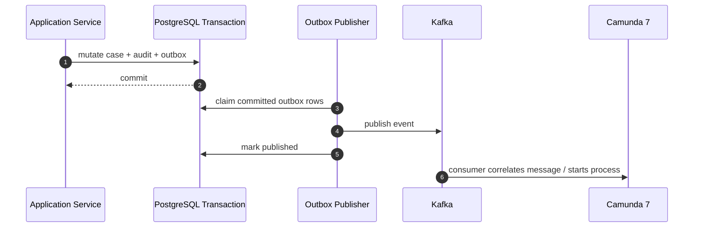
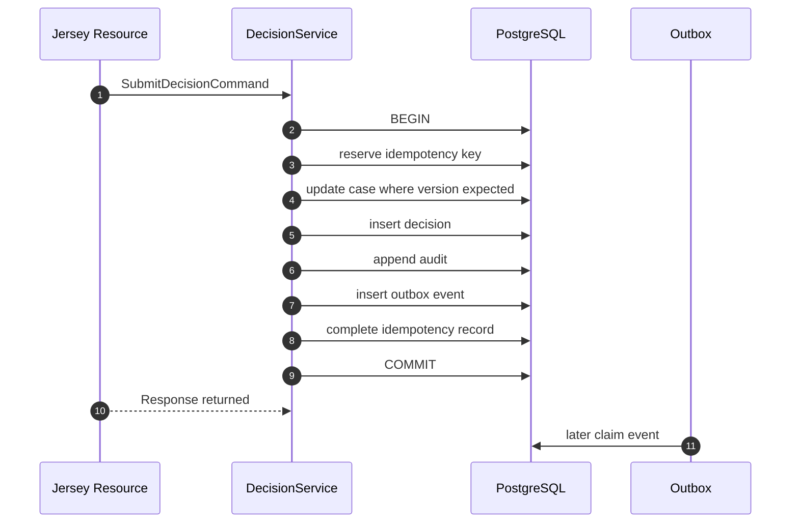
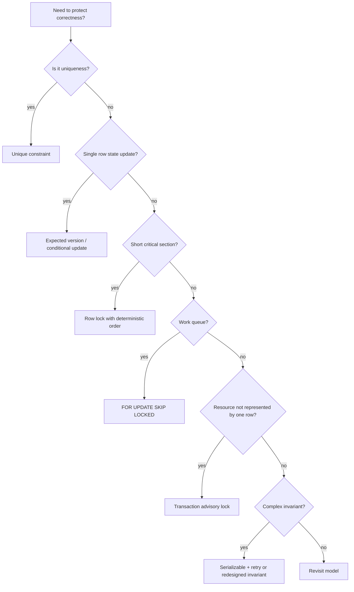

# Part 024 — Transaction, Concurrency, and Locking

Concurrency bugs are not caused by PostgreSQL being weak.

They are usually caused by application code pretending that concurrent users, workers, timers, retries, and message consumers are not touching the same facts at the same time.

In this platform, the same case can be touched by:

- an intake API request,
- a validation worker,
- a Camunda service task,
- a human investigator,
- an SLA timer,
- an escalation job,
- a Kafka consumer,
- a data repair script,
- a replay operation,
- an admin override.

That means concurrency is not an edge case.

It is the normal operating environment.

The goal of this part is to build a practical mental model for PostgreSQL transactions, locking, retries, and consistency boundaries as they apply to Java, MyBatis, Kafka, and Camunda 7.

---

## 1. The Core Mental Model

A transaction is not just a way to group SQL statements.

A transaction is a contract about what must become durable together.

For this platform:

```text
case mutation + audit append + outbox insert + idempotency update
must commit or rollback together.
```

Kafka publish does not belong inside the database transaction.

Camunda API call does not belong inside the database transaction.

External HTTP call does not belong inside the database transaction.

The durable transaction writes facts that later allow external side effects to happen safely.



The transaction is the source of durable truth.

The event and workflow are consequences of that truth.

---

## 2. MVCC in Practical Terms

PostgreSQL uses Multi-Version Concurrency Control.

The practical implication:

```text
Readers and writers do not always block each other.
Different transactions can see different snapshots of the database.
```

This is good for throughput.

It also means you must stop assuming that a read is a permanent truth.

Example:

1. Transaction A reads case status `VALIDATING`.
2. Transaction B changes the same case to `UNDER_INVESTIGATION` and commits.
3. Transaction A still holds an old assumption unless it locks, rechecks, or performs an expected-version update.

The rule:

```text
Any decision based on mutable state must be protected by a concurrency strategy.
```

Concurrency strategy can be:

- optimistic version check,
- row lock,
- unique constraint,
- exclusion constraint,
- advisory lock,
- serializable transaction with retry,
- queue claim using `FOR UPDATE SKIP LOCKED`,
- idempotency key,
- or a combination.

---

## 3. Isolation Levels: What They Mean for This Platform

PostgreSQL supports standard isolation levels with PostgreSQL-specific behavior.

For application design, think in terms of failure modes.

| Isolation level | Practical meaning | Typical use |
|---|---|---|
| Read Committed | Each statement sees data committed before that statement starts | Default command handling, with explicit version/lock checks |
| Repeatable Read | Transaction sees a stable snapshot | Complex read consistency, less common for command paths |
| Serializable | PostgreSQL prevents non-serializable outcomes by aborting conflicting transactions | High-value invariants when explicit locking is too hard, requires retry |

Most systems should start with:

```text
Read Committed + explicit constraints + expected version + row locks where needed.
```

Do not raise isolation level globally because you are unsure.

Higher isolation can improve correctness for some patterns, but it also increases abort/retry behavior and requires a disciplined retry envelope.

---

## 4. Lost Update

Lost update occurs when two transactions read the same row and then overwrite each other.

Bad pattern:

```text
T1 reads case version 7
T2 reads case version 7
T1 updates status to UNDER_INVESTIGATION
T2 updates assignment and writes old derived summary
T2 accidentally overwrites T1's state assumption
```

Production fix: expected version update.

```sql
UPDATE case_core.case
   SET status = :target_status,
       version = version + 1,
       updated_at = now()
 WHERE case_id = :case_id
   AND version = :expected_version
RETURNING case_id, status, version;
```

If no row is returned:

```text
someone changed the row first
```

Application result:

- return `409 Conflict` for HTTP command,
- retry internally only if command is safe and policy allows,
- emit no event if mutation did not happen,
- create no audit success record if transition failed.

---

## 5. Optimistic Locking

Optimistic locking assumes conflict is possible but not dominant.

It works well for user commands such as:

- update case summary,
- change assignment,
- submit decision draft,
- add evidence metadata,
- complete human task with expected case version.

Table shape:

```sql
ALTER TABLE case_core.case
ADD COLUMN version bigint NOT NULL DEFAULT 0;
```

Update shape:

```sql
UPDATE case_core.case
   SET status = #{targetStatus},
       version = version + 1,
       updated_at = now()
 WHERE case_id = #{caseId}
   AND version = #{expectedVersion}
RETURNING case_id, status, version;
```

Java command:

```java
public record SubmitDecisionCommand(
    UUID caseId,
    long expectedVersion,
    String decisionCode,
    String actorId,
    String correlationId
) {}
```

The expected version should come from the client or previous read model.

The point is to make the user's decision explicit:

```text
I am deciding based on version 12 of this case.
```

If the case has changed to version 13, the system should not silently apply the stale decision.

---

## 6. Pessimistic Locking

Pessimistic locking assumes conflict must be prevented while a short critical section executes.

Example:

```sql
SELECT case_id, status, version
FROM case_core.case
WHERE case_id = :case_id
FOR UPDATE;
```

Use it when:

- you must read current state and perform several dependent writes,
- the operation is short,
- conflict must be serialized,
- you cannot express the invariant as a single conditional update,
- you are about to append audit/outbox based on the locked state.

Do not hold locks while:

- calling external HTTP services,
- publishing Kafka,
- waiting for Camunda,
- doing heavy computation,
- rendering response payloads,
- calling a human task API,
- sleeping or retrying.

A lock is a scarce resource.

Hold it briefly.

---

## 7. Lock Mode Naming

PostgreSQL has different row-level lock strengths.

You do not need to memorize every internal nuance at first, but you do need to name intent clearly.

Common command patterns:

| SQL clause | Use case |
|---|---|
| `FOR UPDATE` | You intend to update/delete the selected row or serialize state transition |
| `FOR NO KEY UPDATE` | You update row data but not key columns referenced by FK relationships |
| `FOR SHARE` | You need to prevent concurrent destructive changes while reading |
| `FOR KEY SHARE` | You need to protect key references |
| `NOWAIT` | Fail immediately instead of waiting for lock |
| `SKIP LOCKED` | Queue workers skip rows already claimed by others |

Name mapper methods accordingly:

```java
findCaseForUpdate(caseId)
findCaseForUpdateNowait(caseId)
claimPendingOutboxSkipLocked(params)
```

Do not hide blocking behavior behind neutral names.

---

## 8. `NOWAIT` vs Waiting

Default locking waits.

That may be correct for short operations, but dangerous for user-facing request paths if lock contention can cascade.

Example:

```sql
SELECT case_id
FROM case_core.case
WHERE case_id = :case_id
FOR UPDATE NOWAIT;
```

If locked, PostgreSQL raises an error instead of waiting.

Application mapping:

```text
SQLSTATE 55P03 -> resource busy / retry later
```

When to use `NOWAIT`:

- admin command should fail fast,
- UI can show “case is currently being updated,”
- worker can requeue command,
- lock contention indicates an operational issue.

When not to use it:

- operation is internal and waiting briefly is acceptable,
- fail-fast would create noisy retries,
- the caller cannot handle conflict gracefully.

---

## 9. `SKIP LOCKED` for Work Queues

`SKIP LOCKED` is ideal for multiple workers claiming rows from the same table.

Outbox example:

```sql
WITH candidate AS (
    SELECT event_id
    FROM integration.outbox_event
    WHERE status = 'PENDING'
      AND available_at <= now()
    ORDER BY created_at ASC, event_id ASC
    FOR UPDATE SKIP LOCKED
    LIMIT :limit
), claimed AS (
    UPDATE integration.outbox_event o
       SET status = 'CLAIMED',
           claimed_by = :worker_id,
           claimed_at = now(),
           attempt_count = attempt_count + 1
      FROM candidate c
     WHERE o.event_id = c.event_id
     RETURNING o.*
)
SELECT * FROM claimed;
```

Why this works:

- each worker locks different candidate rows,
- locked rows are skipped instead of blocking,
- the `UPDATE ... RETURNING` makes claim durable,
- retry/recovery can find stale claims later.

But `SKIP LOCKED` is not fairness magic.

You still need:

- stale claim recovery,
- max attempt policy,
- poison event quarantine,
- ordering expectations per aggregate,
- lag metrics,
- worker identity,
- visibility into stuck rows.

---

## 10. Advisory Locks

Advisory locks are application-defined locks managed by PostgreSQL.

They are useful when the lock target is not exactly one row.

Examples:

- one migration/backfill per tenant,
- one case import job per external source,
- one scheduler leader for a partition,
- one repair operation per case family,
- one projection rebuild per projection name.

Transaction-level advisory lock:

```sql
SELECT pg_try_advisory_xact_lock(:lock_key);
```

If it returns false, someone else holds the lock.

Use transaction-level locks for most application operations because they release automatically at transaction end.

Be careful with session-level advisory locks. They can survive longer than intended if connection pooling is involved.

Production rule:

```text
Prefer transaction-level advisory locks unless you have a very specific reason.
```

---

## 11. Building Advisory Lock Keys

Advisory locks use numeric keys.

Do not invent unreviewable hash logic scattered across code.

Centralize it:

```java
public final class AdvisoryLockKeys {
    private static final long CASE_IMPORT_NAMESPACE = 10_000L;
    private static final long TENANT_BACKFILL_NAMESPACE = 20_000L;

    public static long caseImport(String externalSourceId) {
        return hashToLong(CASE_IMPORT_NAMESPACE, externalSourceId);
    }

    public static long tenantBackfill(String tenantId) {
        return hashToLong(TENANT_BACKFILL_NAMESPACE, tenantId);
    }
}
```

Document:

- namespace,
- target resource,
- expected lock duration,
- fail behavior,
- retry behavior,
- operational metric.

An advisory lock without ownership documentation becomes folklore.

---

## 12. Unique Constraints as Concurrency Control

A unique constraint is often the best lock.

Example idempotency:

```sql
CREATE UNIQUE INDEX uq_idempotency_tenant_key
ON integration.idempotency_record (tenant_id, idempotency_key);
```

Insert-first pattern:

```sql
INSERT INTO integration.idempotency_record (
    tenant_id,
    idempotency_key,
    request_fingerprint,
    status,
    created_at
) VALUES (
    :tenant_id,
    :idempotency_key,
    :request_fingerprint,
    'IN_PROGRESS',
    now()
)
ON CONFLICT (tenant_id, idempotency_key) DO NOTHING;
```

If row inserted, process command.

If no row inserted, load existing idempotency record and compare fingerprint/status.

Do not do:

```text
SELECT to check existence
then INSERT
```

That creates a race.

Let the unique constraint be the arbiter.

---

## 13. Check Constraints as Invariant Guards

Some concurrency bugs should be impossible regardless of application code path.

Example:

```sql
ALTER TABLE case_core.case_sla_obligation
ADD CONSTRAINT chk_sla_satisfied_after_due_valid
CHECK (satisfied_at IS NULL OR satisfied_at >= created_at);
```

Constraints do not replace domain logic.

They protect the database from bad writers:

- old application pods,
- manual repair scripts,
- future services,
- migration code,
- partially failed workers.

In a regulatory system, database constraints are not just correctness tools. They are defensibility tools.

---

## 14. Deadlocks

A deadlock happens when transactions wait on each other in a cycle.

Example:

```text
T1 locks case A, then wants case B
T2 locks case B, then wants case A
```

PostgreSQL detects deadlocks and aborts one transaction.

Application sees SQLSTATE `40P01`.

Deadlock prevention rules:

1. Acquire locks in a consistent order.
2. Keep transactions short.
3. Avoid user/external waits inside transactions.
4. Lock the smallest necessary set of rows.
5. Avoid mixing unrelated resources in one transaction.
6. Use deterministic ordering when locking multiple cases.
7. Make retries idempotent.

Example deterministic lock order:

```sql
SELECT case_id
FROM case_core.case
WHERE case_id = ANY(:case_ids)
ORDER BY case_id
FOR UPDATE;
```

Do not lock rows in whatever order the request body provided.

---

## 15. Serialization Failures

At `SERIALIZABLE` isolation, PostgreSQL may abort a transaction to preserve serializable behavior.

Application sees SQLSTATE `40001`.

This is not a database failure.

It is a concurrency control signal.

Handling rule:

```text
Retry the whole transaction only when the command is safe to retry.
```

Safe retry requires:

- idempotency key for external commands,
- no external side effect inside the transaction,
- retry limit,
- jitter/backoff,
- metrics,
- full transaction re-execution, not just last SQL statement.

Never retry only the failed mapper call if earlier statements in the transaction contributed to the conflict.

---

## 16. Retry Taxonomy

Not every failure is retryable.

| Failure | SQLSTATE/example | Retry? | Notes |
|---|---|---|---|
| Unique violation | `23505` | Usually no | Unless idempotency duplicate can return cached response |
| Check violation | `23514` | No | Application/domain bug or invalid command |
| Foreign key violation | `23503` | Usually no | Could be race, but often invalid reference |
| Deadlock | `40P01` | Yes, if safe | Retry whole transaction |
| Serialization failure | `40001` | Yes, if safe | Retry whole transaction |
| Lock not available | `55P03` | Maybe | User path may return busy; worker path may retry |
| Connection failure | varies | Maybe | Depends whether commit outcome is known |
| Statement timeout | `57014` often | Dangerous | Commit outcome/side effect status must be understood |

Retry policy belongs above the mapper.

The mapper reports failure.

The application decides policy.

---

## 17. Transaction Runner

Make transaction scope explicit.

```java
public interface TransactionRunner {
    <T> T required(TransactionCallback<T> callback);
}
```

Implementation responsibilities:

- open session/connection,
- begin transaction,
- bind MyBatis session,
- commit on success,
- rollback on failure,
- translate transaction-level exceptions,
- expose retry wrapper only where appropriate.

Usage:

```java
public IntakeResult intake(IntakeCommand command) {
    return retryPolicy.forIdempotentCommand(() ->
        tx.required(() -> {
            idempotency.reserve(command.idempotencyKey(), command.fingerprint());
            IntakeResult result = cases.create(command);
            idempotency.complete(command.idempotencyKey(), result.responseSnapshot());
            return result;
        })
    );
}
```

Do not scatter transaction begin/commit across resources, repositories, delegates, and consumers.

---

## 18. The “Exactly Once” Illusion

A common mistake:

```text
We use transactions, so the command happens exactly once.
```

In distributed systems, exactly-once business effects require careful end-to-end design.

PostgreSQL transaction gives atomicity inside PostgreSQL.

Kafka has its own delivery/commit semantics.

Camunda has its own job retry and transaction semantics.

HTTP clients retry.

Workers crash.

Network calls time out.

So the real target is:

```text
durable intent + idempotent handling + deduplication + retry-safe side effects + observable recovery
```

That is why this platform uses:

- idempotency table for HTTP commands,
- outbox table for event publishing,
- inbox table for consumer deduplication,
- expected version for case mutation,
- process business key for Camunda correlation,
- stable event id for downstream handling,
- retry policies with poison quarantine.

---

## 19. HTTP Command Transaction Pattern

For a command like `POST /cases/{caseId}/decision`:

```text
1. Validate request shape.
2. Authenticate and authorize actor.
3. Decode idempotency key.
4. Start transaction.
5. Reserve/load idempotency record.
6. Lock or expected-version update case.
7. Insert decision record.
8. Append audit.
9. Insert outbox event.
10. Complete idempotency record.
11. Commit.
12. Return response.
13. Outbox publisher later emits Kafka event.
```

Mermaid:



No Kafka publish happens inside the command transaction.

No Camunda API call happens inside the command transaction.

---

## 20. Kafka Consumer Transaction Pattern

For a Kafka event consumer:

```text
1. Receive message.
2. Start DB transaction.
3. Insert inbox row with unique message id.
4. If duplicate, commit and acknowledge.
5. Load/mutate target state with expected rules.
6. Append audit if needed.
7. Insert new outbox event if needed.
8. Mark inbox processed.
9. Commit DB transaction.
10. Acknowledge Kafka offset according to consumer framework policy.
```

Core idea:

```text
Kafka offset commit must not be the only memory of processing.
```

The database inbox is the durable deduplication record.

This protects against:

- duplicate delivery,
- consumer crash after DB commit before offset commit,
- replay,
- rebalance,
- retry storms.

---

## 21. Camunda Delegate Transaction Pattern

A Camunda 7 delegate can run inside process engine transaction context depending on deployment model and async boundaries.

For production clarity, do not hide large application transactions inside BPMN service tasks.

Safer pattern:

```text
BPMN service task calls application service.
Application service owns DB transaction boundary.
Service writes durable result/outbox.
Delegate returns only after command completes.
BPMN async boundary controls retry/incident behavior.
```

Delegate rule:

```text
Do not hold database lock while waiting on process engine operations outside the same local command.
```

If a process step needs to correlate with external events, use:

- durable event record,
- Kafka consumer,
- message correlation key,
- idempotent correlation,
- BPMN message boundary.

Do not rely on “it usually happens fast.”

---

## 22. SLA Timer Race

Example race:

```text
Investigator completes assessment at 10:00:00.
SLA timer fires at 10:00:00.
Both try to update case/SLA state.
```

Bad design:

```text
Timer checks old status and escalates after completion.
```

Better design:

Use conditional update:

```sql
UPDATE case_core.case_sla_obligation
   SET escalated_at = now(),
       escalation_reason = 'INITIAL_ASSESSMENT_OVERDUE'
 WHERE obligation_id = :obligation_id
   AND satisfied_at IS NULL
   AND escalated_at IS NULL
   AND due_at <= now()
RETURNING obligation_id;
```

If zero rows returned, the timer lost the race and should do nothing.

This is not an error.

It is expected concurrency.

---

## 23. Human Task Completion Race

Two users may try to complete the same task.

Do not handle this only in UI.

Database table:

```sql
CREATE TABLE case_core.case_task_snapshot (
    task_id uuid PRIMARY KEY,
    case_id uuid NOT NULL,
    status text NOT NULL,
    assignee_id text,
    version bigint NOT NULL DEFAULT 0,
    completed_at timestamptz,
    completed_by text
);
```

Completion SQL:

```sql
UPDATE case_core.case_task_snapshot
   SET status = 'COMPLETED',
       completed_at = now(),
       completed_by = :actor_id,
       version = version + 1
 WHERE task_id = :task_id
   AND status = 'CLAIMED'
   AND assignee_id = :actor_id
   AND version = :expected_version
RETURNING task_id, case_id, version;
```

Outcomes:

| Returned rows | Meaning |
|---|---|
| 1 | Task completion accepted |
| 0 | Already completed, not assigned, stale version, or invalid state |

The application can then return a clear conflict.

---

## 24. Assignment Race

Claiming assignment should be conditional.

```sql
UPDATE case_core.case_assignment
   SET assignee_id = :actor_id,
       claimed_at = now(),
       version = version + 1
 WHERE assignment_id = :assignment_id
   AND assignee_id IS NULL
   AND active = true
RETURNING assignment_id, assignee_id, version;
```

Do not:

```text
SELECT assignment
if assignee is null
UPDATE assignment
```

Between select and update, someone else can claim it.

Let the conditional update be the arbiter.

---

## 25. Case Merge / Multi-Case Operations

Multi-case operations are deadlock-prone.

Example: merge duplicate cases.

Rules:

1. Sort case ids deterministically.
2. Lock all cases in that order.
3. Recheck merge eligibility after locks are acquired.
4. Write merge record.
5. Update child/duplicate case statuses.
6. Append audit for every affected case.
7. Insert outbox events.
8. Commit.

SQL lock:

```sql
SELECT case_id, status, version
FROM case_core.case
WHERE case_id = ANY(:case_ids)
ORDER BY case_id
FOR UPDATE;
```

Never lock primary case first and duplicate case second based on request order.

Request order is not a concurrency strategy.

---

## 26. Statement Timeout and Lock Timeout

Timeouts are safety valves.

Useful PostgreSQL settings per transaction/session:

```sql
SET LOCAL lock_timeout = '2s';
SET LOCAL statement_timeout = '10s';
SET LOCAL idle_in_transaction_session_timeout = '30s';
```

Use carefully.

A timeout can mean:

- statement was cancelled before mutation,
- transaction is aborted and must rollback,
- application does not know whether an external side effect happened if it violated the no-external-call rule.

If you keep external side effects outside the transaction, timeout recovery is simpler.

---

## 27. Long Transactions

Long transactions harm production systems.

They can:

- hold locks,
- block vacuum cleanup,
- increase bloat pressure,
- keep old snapshots alive,
- delay DDL,
- increase deadlock windows,
- make incident recovery harder.

Avoid long transactions caused by:

- streaming large result sets while transaction remains open,
- user think time,
- external API calls,
- batch jobs without chunking,
- report generation on command database,
- accidental transaction around entire HTTP request including response rendering.

Chunk batch jobs.

Use read replicas or reporting stores where appropriate.

Keep command transactions short and purposeful.

---

## 28. Read-Only Transactions

Read-only transactions are useful for complex consistent reads.

But do not confuse read-only with harmless.

A long read-only transaction can still hold an old snapshot and affect cleanup.

For API queries:

- keep them short,
- bound result size,
- use keyset pagination,
- avoid heavy joins on hot command tables,
- use projections for dashboards,
- add statement timeout.

For regulatory audit export, prefer controlled async export jobs rather than one huge synchronous HTTP transaction.

---

## 29. MyBatis and Transaction Participation

Mapper calls should participate in the current transaction.

Bad:

```java
public void createCase(...) {
    mapper.insertCase(...);       // connection A, auto-commit true
    mapper.insertAudit(...);      // connection B, auto-commit true
    mapper.insertOutbox(...);     // connection C, auto-commit true
}
```

This breaks atomicity.

Good:

```java
tx.required(() -> {
    mapper.insertCase(...);
    mapper.insertAudit(...);
    mapper.insertOutbox(...);
    return result;
});
```

The same transaction context must include all database writes that represent one durable business fact.

---

## 30. Connection Pool Reality

Database concurrency is also limited by connection pool size.

More threads do not mean more throughput.

If the pool has 20 connections and 200 request threads block waiting for DB, you can create latency collapse.

Monitor:

- active connections,
- idle connections,
- pending acquisition count,
- acquisition latency,
- transaction duration,
- lock wait duration,
- statement timeout count,
- deadlock count,
- retry count.

The platform should treat the database as a constrained shared resource.

---

## 31. Testing Concurrency

Concurrency tests must create actual overlap.

A test that calls command A then command B is not a concurrency test.

Java test structure:

```java
@Test
void onlyOneTaskCompletionWins() throws Exception {
    CountDownLatch ready = new CountDownLatch(2);
    CountDownLatch start = new CountDownLatch(1);

    Callable<Result> attempt = () -> {
        ready.countDown();
        start.await();
        return service.completeTask(commandWithSameTaskAndVersion());
    };

    Future<Result> f1 = executor.submit(attempt);
    Future<Result> f2 = executor.submit(attempt);

    ready.await();
    start.countDown();

    List<Result> results = List.of(f1.get(), f2.get());

    assertThat(results).filteredOn(Result::accepted).hasSize(1);
    assertThat(results).filteredOn(Result::conflict).hasSize(1);
}
```

Use PostgreSQL in tests.

Do not use an in-memory database to test PostgreSQL locking behavior.

---

## 32. Failure Drill: Outbox Worker Crash

Scenario:

```text
Worker claims 100 outbox rows.
Worker publishes 60 events.
Worker crashes before marking all as published.
```

Design must answer:

- What happens to 40 claimed rows?
- Are the 60 published rows duplicated later?
- Do consumers deduplicate?
- Is event id stable?
- Is stale claim recovery bounded?
- Does operator have a query to see stuck rows?

Recovery pattern:

```sql
UPDATE integration.outbox_event
   SET status = 'PENDING',
       claimed_by = NULL,
       claimed_at = NULL,
       available_at = now() + interval '30 seconds'
 WHERE status = 'CLAIMED'
   AND claimed_at < now() - interval '5 minutes';
```

Consumer inbox handles duplicates.

That is the point of the inbox.

---

## 33. Failure Drill: Unknown Commit Outcome

Hard case:

```text
Application sends COMMIT.
Network fails before application receives commit response.
```

The application may not know whether commit succeeded.

Design response:

- use idempotency key,
- client retries same command,
- server checks idempotency record,
- if completed, returns stored response,
- if in progress/stale, applies recovery policy.

Without idempotency, unknown commit outcome becomes a dangerous duplicate command problem.

---

## 34. Failure Drill: Camunda Job Retry

Camunda service task calls application service.

The application commits DB mutation, then delegate throws due to transient error while returning.

Camunda retries the job.

Without idempotency, the service may mutate twice.

Fix:

- delegate command includes deterministic idempotency key,
- application service uses idempotency table,
- state transition uses expected status/version,
- outbox event id is stable or deduplicated,
- duplicate delegate retry returns previous result.

BPMN retry is not enough.

Application command must be retry-safe.

---

## 35. Failure Drill: Deadlock Storm

Symptoms:

- increased SQLSTATE `40P01`,
- request latency spikes,
- retry count spikes,
- lock wait metrics rise,
- database CPU may rise due to retries,
- user sees intermittent conflict or 503.

Immediate triage:

1. Identify top deadlocked statements.
2. Check lock acquisition order.
3. Check recent deployment for new multi-row operations.
4. Reduce worker concurrency if queue-related.
5. Disable or throttle offending job if possible.
6. Confirm retry backoff has jitter.
7. Add deterministic ordering or narrower locks.

Long-term fix is design, not simply more retries.

---

## 36. Operational Queries

Useful diagnostic query for lock waits:

```sql
SELECT
    blocked.pid AS blocked_pid,
    blocked.query AS blocked_query,
    blocking.pid AS blocking_pid,
    blocking.query AS blocking_query
FROM pg_catalog.pg_locks blocked_locks
JOIN pg_catalog.pg_stat_activity blocked
  ON blocked.pid = blocked_locks.pid
JOIN pg_catalog.pg_locks blocking_locks
  ON blocking_locks.locktype = blocked_locks.locktype
 AND blocking_locks.database IS NOT DISTINCT FROM blocked_locks.database
 AND blocking_locks.relation IS NOT DISTINCT FROM blocked_locks.relation
 AND blocking_locks.page IS NOT DISTINCT FROM blocked_locks.page
 AND blocking_locks.tuple IS NOT DISTINCT FROM blocked_locks.tuple
 AND blocking_locks.virtualxid IS NOT DISTINCT FROM blocked_locks.virtualxid
 AND blocking_locks.transactionid IS NOT DISTINCT FROM blocked_locks.transactionid
 AND blocking_locks.classid IS NOT DISTINCT FROM blocked_locks.classid
 AND blocking_locks.objid IS NOT DISTINCT FROM blocked_locks.objid
 AND blocking_locks.objsubid IS NOT DISTINCT FROM blocked_locks.objsubid
 AND blocking_locks.pid != blocked_locks.pid
JOIN pg_catalog.pg_stat_activity blocking
  ON blocking.pid = blocking_locks.pid
WHERE NOT blocked_locks.granted;
```

This kind of query belongs in a runbook, not in random Slack memory.

---

## 37. Decision Matrix

| Problem | Preferred primitive |
|---|---|
| Prevent stale user update | Expected version update |
| Ensure unique external reference | Unique constraint |
| Deduplicate HTTP retry | Idempotency table |
| Deduplicate Kafka consumer | Inbox table |
| Publish event after DB commit | Outbox table |
| Multiple workers claim queue rows | `FOR UPDATE SKIP LOCKED` |
| Short critical state transition | Row lock or conditional update |
| Multi-case operation | Deterministic lock order |
| One job per tenant | Transaction-level advisory lock |
| Complex cross-row invariant | Constraint, explicit lock, or serializable transaction with retry |
| External side effect coordination | Durable record + idempotent side effect |

---

## 38. Mermaid: Concurrency Control Selection



The decision should be deliberate.

Do not choose locks because they feel safe.

Choose the smallest primitive that protects the invariant.

---

## 39. Production Checklist

Before shipping a command path:

- [ ] Is the durable transaction boundary explicit?
- [ ] Are all required DB writes inside one transaction?
- [ ] Are external side effects outside the DB transaction?
- [ ] Is stale update prevented by expected version, lock, or constraint?
- [ ] Are unique/idempotency constraints used instead of check-then-insert?
- [ ] Are lock clauses visible in mapper method names?
- [ ] Are multiple-row locks acquired in deterministic order?
- [ ] Are retries applied only to safe whole transactions?
- [ ] Are SQLSTATE `40001`, `40P01`, and `55P03` handled intentionally?
- [ ] Are command retries protected by idempotency?
- [ ] Are Kafka consumers protected by inbox deduplication?
- [ ] Are Camunda retries protected by command idempotency?
- [ ] Are transaction duration and lock waits observable?
- [ ] Are concurrency tests run against PostgreSQL?
- [ ] Does the runbook explain lock/deadlock triage?

---

## 40. Anti-Patterns

| Anti-pattern | Why it fails |
|---|---|
| Global serializable isolation as a substitute for design | Causes aborts without clear retry discipline |
| Check then insert | Race-prone; use unique constraint |
| Hold DB lock while calling external service | Creates contention and incident cascades |
| Retry only the failed SQL statement | Breaks transaction semantics |
| Retry non-idempotent commands | Creates duplicates or corrupts audit |
| Use offset pagination for worker queues | Slow and unstable under mutation |
| Ignore zero-row conditional update | Silently loses concurrency conflict |
| Hide locks inside generic mapper methods | Surprises developers and operators |
| Use session advisory locks with pooled connections casually | Locks may outlive intended operation |
| Treat Camunda retry as application idempotency | Can duplicate DB mutations |
| Treat Kafka offset as processing truth | Fails under crash/rebalance/replay |
| Make batch jobs one giant transaction | Increases lock time and rollback blast radius |

---

## 41. What You Should Internalize

Concurrency control is not one feature.

It is a system of small contracts:

```text
constraints prevent impossible facts
versions prevent stale writes
locks serialize critical sections
idempotency absorbs retries
outbox/inbox bridge database and messaging
retry policy handles aborts safely
observability reveals contention
runbooks make recovery repeatable
```

The database is not just storage.

In this architecture, PostgreSQL is the final consistency boundary for durable facts.

Java expresses intent.

MyBatis makes SQL explicit.

PL/pgSQL compresses critical atomic operations.

Kafka distributes committed facts.

Camunda orchestrates long-running work.

Each layer has a concurrency role. Problems appear when one layer pretends to own all of it.

The best production concurrency design is boring:

```text
short transactions
clear lock order
conditional writes
stable ids
idempotent commands
bounded retries
real metrics
tested races
```

That boringness is the point.

---

## 42. References

- PostgreSQL Documentation — Chapter 13: Concurrency Control: https://www.postgresql.org/docs/current/mvcc.html
- PostgreSQL Documentation — Transaction Isolation: https://www.postgresql.org/docs/current/transaction-iso.html
- PostgreSQL Documentation — Explicit Locking: https://www.postgresql.org/docs/current/explicit-locking.html
- PostgreSQL Documentation — Advisory Locks: https://www.postgresql.org/docs/current/explicit-locking.html#ADVISORY-LOCKS
- PostgreSQL Documentation — `SELECT` Locking Clauses: https://www.postgresql.org/docs/current/sql-select.html
- PostgreSQL Documentation — Error Codes: https://www.postgresql.org/docs/current/errcodes-appendix.html
- PostgreSQL Documentation — Runtime Config Client Connection Defaults: https://www.postgresql.org/docs/current/runtime-config-client.html
- MyBatis 3 Documentation — Java API and SqlSession: https://mybatis.org/mybatis-3/java-api.html
- MyBatis 3 Documentation — Mapper XML Files: https://mybatis.org/mybatis-3/sqlmap-xml.html
- Apache Kafka Documentation — Design and Delivery Semantics: https://kafka.apache.org/documentation/
- Camunda 7 Documentation — Transactions in Processes: https://docs.camunda.org/manual/latest/user-guide/process-engine/transactions-in-processes/
