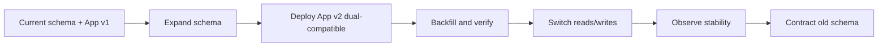
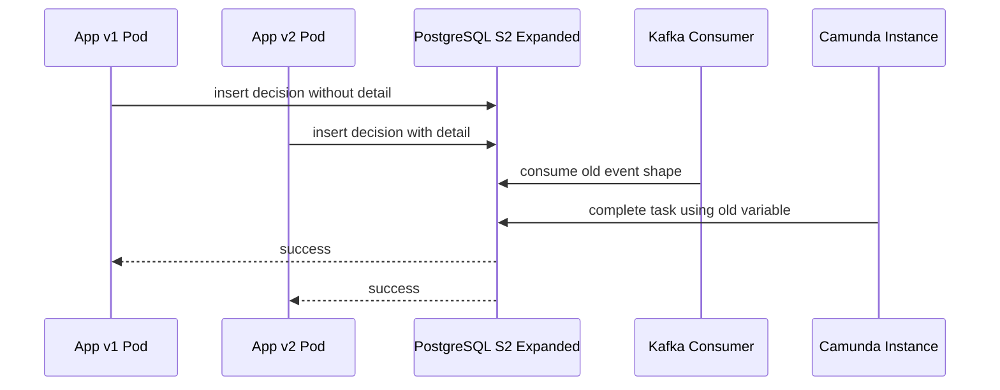
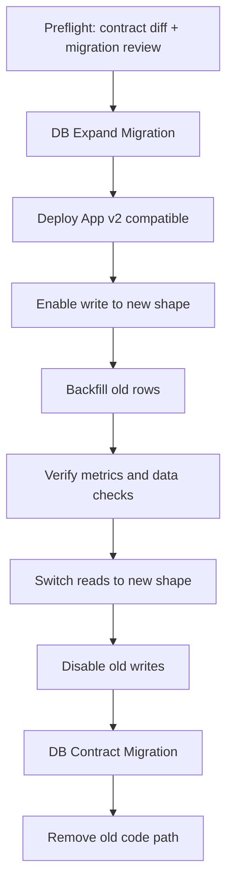

# Part 025 — Database Migration and Release Safety

Database migration bukan pekerjaan “ubah schema lalu deploy aplikasi”. Di sistem produksi, database adalah pusat gravitasi. Banyak versi aplikasi dapat hidup bersamaan selama rolling deployment. Kafka consumer bisa masih memproses event lama. Camunda process instance bisa berjalan berhari-hari atau berbulan-bulan dengan variable versi lama. Reporting job bisa membaca kolom lama. Operator bisa menjalankan repair script. Karena itu, migration harus diperlakukan sebagai **release protocol**, bukan file SQL biasa.

Kita memakai studi kasus yang sama: **Regulatory Enforcement & Case Orchestration Platform**. Di platform ini, data case, SLA, decision, audit, outbox, inbox, dan process reference harus tetap aman saat release berjalan. Salah migration dapat membuat case tidak bisa diputuskan, outbox berhenti publish event, Camunda gagal correlate message, atau audit trail kehilangan makna defensible.

Tujuan part ini bukan membuat kamu hafal semua DDL PostgreSQL. Tujuannya adalah membentuk intuisi produksi: perubahan database harus kompatibel dengan versi aplikasi lama dan baru, observability harus ada sebelum migration, rollback database jarang sesederhana rollback aplikasi, dan perubahan kontrak data harus dipikirkan sebagai choreography lintas API, event, database, MyBatis, PL/pgSQL, dan BPMN.

---

## 1. Problem Produksi yang Sebenarnya

Bayangkan kita ingin menambahkan `decision_reason_detail` ke proses decision. Awalnya decision hanya punya:

```sql
case_decision(decision_id, case_id, decision_type, decision_reason_code, decided_at)
```

Product/regulatory team meminta alasan yang lebih rinci untuk audit:

```sql
decision_reason_detail text
```

Kelihatannya mudah: `ALTER TABLE ADD COLUMN decision_reason_detail text NOT NULL`. Tapi di produksi, ada beberapa masalah:

1. Versi aplikasi lama belum mengirim field tersebut.
2. Process instance Camunda yang sudah berjalan mungkin memakai variable lama.
3. Kafka event `case.decision.recorded.v1` belum punya field tersebut.
4. MyBatis insert lama tidak menyebut kolom baru.
5. Backfill data lama membutuhkan aturan bisnis.
6. `NOT NULL` terlalu cepat dapat memblokir atau menggagalkan write path.
7. Rollback aplikasi setelah schema berubah bisa gagal jika aplikasi lama tidak kompatibel.

Migration production-grade berarti kita tidak bertanya “SQL apa yang diperlukan?”, tetapi bertanya:

> Selama window release, versi mana saja yang akan hidup bersamaan, kontrak mana yang berubah, siapa yang membaca/menulis field lama dan baru, dan bagaimana sistem tetap benar bila deployment berhenti di tengah jalan?

---

## 2. Mental Model: Database Migration sebagai Perubahan Kontrak

Database contract memiliki beberapa lapisan:

| Lapisan | Contoh | Risiko jika berubah sembarangan |
|---|---|---|
| Shape contract | tabel, kolom, tipe, nullability | aplikasi lama gagal read/write |
| Constraint contract | PK, FK, unique, check | data lama invalid, write path gagal |
| Query contract | index, sort order, pagination assumption | latency naik, timeout, lock contention |
| Function contract | PL/pgSQL signature, return type, SQLSTATE | MyBatis call gagal, error mapping salah |
| Semantic contract | arti `status`, `decision_type`, `closed_at` | audit salah, reporting misleading |
| Operational contract | migration duration, lock level, rollback path | outage saat deploy |

Di production system, migration yang baik punya tiga sifat:

1. **Compatible** — aplikasi versi lama dan baru dapat berjalan pada schema transisi.
2. **Observable** — kita tahu progress, error, lock wait, backfill rate, dan dampak latency.
3. **Recoverable** — bila release berhenti, sistem punya posisi aman: lanjut, pause, rollback aplikasi, atau repair data.

---

## 3. Migration Taxonomy

Tidak semua migration sama. Jangan samakan `ADD COLUMN nullable` dengan split tabel besar berisi ratusan juta row.

### 3.1 Additive schema migration

Contoh:

```sql
ALTER TABLE case_core.case_decision
ADD COLUMN decision_reason_detail text;
```

Biasanya paling aman karena aplikasi lama tidak peduli kolom baru. Tapi tetap perlu dicek:

- Apakah ada trigger yang memakai `SELECT *`?
- Apakah MyBatis `resultMap` eksplisit atau memakai mapping longgar?
- Apakah serialization layer menganggap semua kolom wajib?
- Apakah replication/logical decoding terdampak?

### 3.2 Contract-tightening migration

Contoh:

```sql
ALTER TABLE case_core.case_decision
ALTER COLUMN decision_reason_detail SET NOT NULL;
```

Ini berbahaya jika dilakukan sebelum semua writer mengisi kolom. Tightening harus datang belakangan, setelah data lama dibersihkan dan semua versi aplikasi yang masih hidup patuh kontrak baru.

### 3.3 Destructive migration

Contoh:

```sql
ALTER TABLE case_core.case_decision
DROP COLUMN decision_reason_code;
```

Destructive migration hampir selalu harus menjadi langkah terakhir setelah periode observasi. Jangan drop hanya karena aplikasi terbaru tidak memakai field itu. Pastikan:

- Tidak ada consumer event lama yang masih butuh data.
- Tidak ada process instance lama yang masih refer field tersebut.
- Tidak ada report, BI query, ad-hoc repair, atau legal export yang bergantung padanya.
- Tidak ada rollback aplikasi yang akan membutuhkan field itu.

### 3.4 Data migration/backfill

Contoh:

```sql
UPDATE case_core.case_decision
SET decision_reason_detail = 'Migrated from reason code: ' || decision_reason_code
WHERE decision_reason_detail IS NULL;
```

Backfill adalah workload produksi. Ia bersaing dengan request normal, job executor Camunda, Kafka publisher, dan reporting query. Backfill harus chunked, resumable, measurable, dan cancel-safe.

### 3.5 Function migration

Contoh:

```sql
CREATE OR REPLACE FUNCTION case_core.record_case_decision(...)
RETURNS uuid
LANGUAGE plpgsql
AS $$
BEGIN
  ...
END;
$$;
```

`CREATE OR REPLACE FUNCTION` tidak boleh dianggap selalu aman. Perubahan parameter, return type, error code, side effect, lock behavior, dan transaction semantics dapat mematahkan MyBatis caller. Untuk fungsi penting, gunakan versi eksplisit.

```sql
case_core.record_case_decision_v1(...)
case_core.record_case_decision_v2(...)
```

### 3.6 Operational migration

Contoh:

- Membuat index besar.
- Reindex index bengkak.
- Partition maintenance.
- Archival table movement.
- Cleanup history/audit.

Operational migration sering tidak mengubah kontrak bisnis, tetapi dapat menyebabkan outage jika lock, disk, WAL, atau replication lag tidak dihitung.

---

## 4. Expand-Contract Pattern

Pola utama kita adalah **expand-contract**.



Prinsipnya sederhana: jangan paksa schema baru sebelum semua writer dan reader siap.

### 4.1 Expand

Tambahkan struktur baru tanpa merusak yang lama.

```sql
ALTER TABLE case_core.case_decision
ADD COLUMN decision_reason_detail text;
```

Pada tahap ini:

- Kolom nullable.
- Aplikasi lama tetap bekerja.
- Aplikasi baru boleh mulai menulis field baru.
- Tidak ada constraint ketat dulu.

### 4.2 Dual-compatible application

Aplikasi versi baru harus bisa membaca kombinasi lama dan baru.

```java
public record DecisionReason(
    String code,
    Optional<String> detail
) {
    public String displayForAudit() {
        return detail.filter(s -> !s.isBlank())
            .orElse("Reason code: " + code);
    }
}
```

Jangan langsung menganggap `detail` wajib hanya karena field sudah ada di OpenAPI v2. Database transisi selalu lebih longgar daripada model final.

### 4.3 Backfill

Backfill harus bertahap.

```sql
WITH batch AS (
  SELECT decision_id
  FROM case_core.case_decision
  WHERE decision_reason_detail IS NULL
  ORDER BY decided_at, decision_id
  LIMIT 1000
)
UPDATE case_core.case_decision d
SET decision_reason_detail = 'Migrated from reason code: ' || d.decision_reason_code
FROM batch
WHERE d.decision_id = batch.decision_id;
```

Backfill job harus menyimpan progress, bisa diulang, dan tidak boleh mengunci seluruh tabel besar dalam satu transaksi panjang.

### 4.4 Verify

Sebelum tightening:

```sql
SELECT count(*) AS missing_detail
FROM case_core.case_decision
WHERE decision_reason_detail IS NULL;
```

Tambahkan juga verification untuk semantic correctness, bukan hanya null check:

```sql
SELECT decision_reason_code, count(*)
FROM case_core.case_decision
WHERE decision_reason_detail IS NULL
GROUP BY decision_reason_code
ORDER BY count(*) DESC;
```

### 4.5 Contract

Setelah semua writer aman, semua data valid, dan observasi cukup:

```sql
ALTER TABLE case_core.case_decision
ALTER COLUMN decision_reason_detail SET NOT NULL;
```

Dropping old field dilakukan paling akhir, sering di release berbeda.

---

## 5. Compatibility Matrix

Setiap migration harus punya matrix seperti ini.

| Schema | App v1 | App v2 | Aman? | Catatan |
|---|---|---|---|---|
| S1 old | jalan | jalan jika field optional | ya | sebelum expand |
| S2 expanded | jalan | jalan | ya | target rolling deploy |
| S3 backfilled | jalan | jalan | ya | reader boleh switch |
| S4 tightened | mungkin gagal write | jalan | hanya setelah v1 hilang | jangan dilakukan di release yang sama dengan v2 bila v1 masih mungkin rollback |
| S5 old column dropped | gagal jika rollback ke v1 | jalan | hanya setelah rollback window ditutup | destructive step |

Matrix ini memaksa kita memikirkan realitas rolling deployment.



Schema transisi yang baik mengizinkan keadaan ini sementara.

---

## 6. PostgreSQL Lock Awareness

PostgreSQL DDL bukan operasi netral. Beberapa subform `ALTER TABLE` membutuhkan lock yang kuat. Dokumentasi PostgreSQL menjelaskan bahwa `ALTER TABLE` dapat mengambil lock berbeda tergantung subcommand, dan jika tidak disebutkan khusus, `ACCESS EXCLUSIVE` adalah default untuk banyak bentuk perubahan. Karena itu, migration engineer harus membaca rencana DDL sebagai rencana locking.

### 6.1 Rule praktis

Sebelum menjalankan DDL di tabel produksi besar, jawab:

1. Lock apa yang diambil?
2. Berapa lama lock dipegang?
3. Apakah operasi scan tabel?
4. Apakah operasi menulis ulang tabel?
5. Apakah operasi menghasilkan WAL besar?
6. Apakah bisa dilakukan secara concurrent?
7. Apakah bisa dipause atau diulang?

### 6.2 Create index concurrently

Untuk index besar di tabel aktif, gunakan pola concurrent bila cocok.

```sql
CREATE INDEX CONCURRENTLY idx_case_decision_case_id_decided_at
ON case_core.case_decision (case_id, decided_at DESC, decision_id DESC);
```

Catatan penting:

- `CREATE INDEX CONCURRENTLY` mengurangi blocking terhadap write, tetapi biasanya lebih lama.
- Tidak boleh dijalankan di dalam transaction block migration biasa.
- Jika gagal, dapat meninggalkan index invalid yang perlu ditangani manual.
- Tetap menghasilkan IO/WAL dan dapat memengaruhi latency.

Karena banyak migration tool membungkus migration dalam transaksi, file untuk concurrent index sering perlu dikonfigurasi sebagai non-transactional migration.

### 6.3 NOT VALID constraint

Untuk constraint yang butuh validasi data lama, gunakan strategi bertahap.

```sql
ALTER TABLE case_core.case_decision
ADD CONSTRAINT chk_decision_reason_detail_not_blank
CHECK (decision_reason_detail IS NULL OR length(trim(decision_reason_detail)) > 0)
NOT VALID;

ALTER TABLE case_core.case_decision
VALIDATE CONSTRAINT chk_decision_reason_detail_not_blank;
```

`NOT VALID` berguna untuk menghindari validasi semua row pada saat constraint dibuat. Setelah itu, validasi dapat dijalankan sebagai langkah terpisah dan terencana.

### 6.4 Rename bukan selalu aman secara kontrak

```sql
ALTER TABLE case_core.case_decision
RENAME COLUMN decision_reason_code TO reason_code;
```

DDL ini tampak kecil, tetapi kontraknya destructive untuk aplikasi lama. MyBatis mapper lama masih mencari `decision_reason_code`. Lebih aman:

1. Add new column.
2. Dual write.
3. Backfill.
4. Switch read.
5. Observe.
6. Drop old column jauh belakangan.

---

## 7. Release Choreography

Migration harus ditempatkan dalam urutan release.



### 7.1 Jangan campur semua dalam satu deploy

Anti-pattern:

```text
Release 42:
- Add NOT NULL column
- Deploy app using field
- Backfill old data
- Drop old column
- Change event schema
- Change BPMN variable
```

Ini terlihat efisien, tetapi sulit di-debug. Jika gagal di tengah, kamu tidak tahu apakah masalahnya DDL, data, aplikasi, event consumer, atau process instance.

### 7.2 Release yang lebih aman

```text
Release 42A: expand schema + publish compatibility mode
Release 42B: deploy app dual-compatible
Release 42C: backfill + verify
Release 42D: switch read/write defaults
Release 42E: tighten constraints
Release 42F: remove old contract after rollback window
```

Semakin kritikal sistem, semakin bernilai memecah release.

---

## 8. Migration File Discipline

Gunakan naming yang membuat niat migration jelas.

```text
db/migration/
  V20260703_0100__expand_case_decision_reason_detail.sql
  V20260703_0200__backfill_case_decision_reason_detail.sql
  V20260703_0300__validate_case_decision_reason_detail.sql
  V20260710_0100__contract_case_decision_reason_detail_not_null.sql
```

Jangan beri nama seperti:

```text
V42__update_schema.sql
V43__fix.sql
V44__final_fix.sql
```

Nama migration adalah dokumentasi operasional. Saat incident, operator perlu tahu apakah migration expand, backfill, validate, atau contract.

---

## 9. Migration Review Checklist

Sebelum merge migration:

| Pertanyaan | Kenapa penting |
|---|---|
| Apakah migration kompatibel dengan app versi lama? | Rolling deploy dan rollback aplikasi |
| Apakah semua query MyBatis terdampak sudah dicek? | Mapper eksplisit bisa patah saat kolom berubah |
| Apakah Kafka consumer lama masih bisa memproses data? | Replay dan lag consumer |
| Apakah Camunda process instance lama masih valid? | Long-running workflow |
| Apakah migration mengambil lock kuat? | Outage risiko |
| Apakah ada scan/write besar? | IO, WAL, replication lag |
| Apakah migration resumable? | Backfill bisa gagal di tengah |
| Apakah ada verification query? | Jangan percaya asumsi |
| Apakah rollback app aman? | Rollback database sering tidak sederhana |
| Apakah runbook jelas? | Operator butuh langkah nyata |

---

## 10. MyBatis Compatibility Rules

MyBatis membuat SQL eksplisit. Ini bagus untuk kontrol, tetapi migration harus menghormati mapper lama.

### 10.1 Insert harus eksplisit

Anti-pattern:

```xml
<insert id="insertDecision">
  INSERT INTO case_core.case_decision
  VALUES (#{decisionId}, #{caseId}, #{decisionType}, #{reasonCode}, #{decidedAt})
</insert>
```

Gunakan kolom eksplisit:

```xml
<insert id="insertDecision">
  INSERT INTO case_core.case_decision (
    decision_id,
    case_id,
    decision_type,
    decision_reason_code,
    decided_at,
    created_at
  ) VALUES (
    #{decisionId},
    #{caseId},
    #{decisionType},
    #{reasonCode},
    #{decidedAt},
    now()
  )
</insert>
```

Jika kolom baru nullable, mapper lama tetap aman.

### 10.2 ResultMap harus stabil

```xml
<resultMap id="DecisionRowMap" type="com.acme.casecore.DecisionRow">
  <id property="decisionId" column="decision_id" />
  <result property="caseId" column="case_id" />
  <result property="decisionType" column="decision_type" />
  <result property="reasonCode" column="decision_reason_code" />
  <result property="reasonDetail" column="decision_reason_detail" />
</resultMap>
```

Saat masa transisi, property baru harus nullable/optional di Java row object. Jangan membuat mapper v2 gagal membaca row lama.

### 10.3 SQL alias untuk perubahan nama

Jika field domain berubah nama tetapi kolom lama masih ada:

```sql
SELECT
  decision_reason_code AS reason_code
FROM case_core.case_decision
```

Alias dapat menjadi jembatan sementara agar kode Java baru tidak membawa nama lama terlalu jauh.

---

## 11. PL/pgSQL Function Evolution

Fungsi database adalah kontrak. Jangan ubah diam-diam.

### 11.1 Versi eksplisit untuk perubahan besar

```sql
CREATE OR REPLACE FUNCTION case_core.record_case_decision_v2(
  p_case_id uuid,
  p_decision_type text,
  p_reason_code text,
  p_reason_detail text,
  p_actor_id text,
  p_correlation_id text
)
RETURNS uuid
LANGUAGE plpgsql
AS $$
DECLARE
  v_decision_id uuid;
BEGIN
  IF p_reason_detail IS NULL OR length(trim(p_reason_detail)) = 0 THEN
    RAISE EXCEPTION USING
      ERRCODE = 'P0001',
      MESSAGE = 'decision reason detail is required';
  END IF;

  INSERT INTO case_core.case_decision (
    decision_id,
    case_id,
    decision_type,
    decision_reason_code,
    decision_reason_detail,
    decided_by,
    decided_at,
    created_at
  ) VALUES (
    gen_random_uuid(),
    p_case_id,
    p_decision_type,
    p_reason_code,
    p_reason_detail,
    p_actor_id,
    now(),
    now()
  )
  RETURNING decision_id INTO v_decision_id;

  INSERT INTO integration.outbox_event (
    event_id,
    aggregate_type,
    aggregate_id,
    event_type,
    payload,
    correlation_id,
    created_at
  ) VALUES (
    gen_random_uuid(),
    'case',
    p_case_id,
    'case.decision.recorded.v2',
    jsonb_build_object(
      'caseId', p_case_id,
      'decisionId', v_decision_id,
      'decisionType', p_decision_type,
      'reasonCode', p_reason_code,
      'reasonDetail', p_reason_detail
    ),
    p_correlation_id,
    now()
  );

  RETURN v_decision_id;
END;
$$;
```

### 11.2 Wrapper sementara

Jika perlu menjaga caller lama:

```sql
CREATE OR REPLACE FUNCTION case_core.record_case_decision_v1(
  p_case_id uuid,
  p_decision_type text,
  p_reason_code text,
  p_actor_id text,
  p_correlation_id text
)
RETURNS uuid
LANGUAGE plpgsql
AS $$
BEGIN
  RETURN case_core.record_case_decision_v2(
    p_case_id,
    p_decision_type,
    p_reason_code,
    'Migrated/default reason detail for code ' || p_reason_code,
    p_actor_id,
    p_correlation_id
  );
END;
$$;
```

Wrapper seperti ini bukan ideal jangka panjang, tetapi berguna untuk menjaga compatibility selama transisi.

---

## 12. Backfill Engineering

Backfill yang baik punya properti:

1. **Chunked** — tidak satu transaksi besar.
2. **Idempotent** — aman diulang.
3. **Observable** — progress dan error terlihat.
4. **Throttled** — tidak membunuh workload normal.
5. **Cancelable** — bisa dihentikan tanpa data rusak.
6. **Verifiable** — punya query validasi.

### 12.1 Backfill progress table

```sql
CREATE TABLE maintenance.backfill_job_progress (
  job_name text PRIMARY KEY,
  last_seen_id uuid,
  processed_count bigint NOT NULL DEFAULT 0,
  failed_count bigint NOT NULL DEFAULT 0,
  started_at timestamptz NOT NULL DEFAULT now(),
  updated_at timestamptz NOT NULL DEFAULT now(),
  completed_at timestamptz
);
```

### 12.2 Chunk pattern

```sql
WITH candidates AS (
  SELECT decision_id
  FROM case_core.case_decision
  WHERE decision_reason_detail IS NULL
  ORDER BY decision_id
  LIMIT 500
  FOR UPDATE SKIP LOCKED
)
UPDATE case_core.case_decision d
SET decision_reason_detail = 'Migrated from reason code: ' || d.decision_reason_code
FROM candidates c
WHERE d.decision_id = c.decision_id
RETURNING d.decision_id;
```

`FOR UPDATE SKIP LOCKED` berguna untuk worker paralel, tetapi jangan gunakan tanpa memahami ordering, starvation, dan observability. Untuk job maintenance yang sederhana, satu worker throttled sering lebih aman.

### 12.3 Throttle

Pseudo-code Java:

```java
while (true) {
    int updated = migrationMapper.backfillDecisionReasonDetail(500);
    metrics.counter("backfill.decision_reason.updated").increment(updated);

    if (updated == 0) {
        break;
    }

    Thread.sleep(Duration.ofMillis(250));
}
```

Backfill bukan lomba cepat. Tujuannya menyelesaikan dengan dampak produksi minimal.

---

## 13. Rollback Reality

Aplikasi bisa di-rollback dengan mengganti image. Database tidak selalu bisa di-rollback dengan mudah.

### 13.1 Tipe rollback

| Tipe | Contoh | Catatan |
|---|---|---|
| App rollback | kembali dari image v2 ke v1 | hanya aman jika schema masih compatible |
| Config rollback | matikan feature flag | cocok untuk switch read/write |
| Data repair | update row yang salah | harus audited dan reviewable |
| Forward fix | deploy patch v2.1 | sering lebih aman daripada reverse migration |
| DB rollback | drop kolom baru, restore backup | mahal dan berisiko, jangan jadikan default |

### 13.2 Rollback-safe migration

Migration expand biasanya rollback-safe karena app lama masih jalan.

```sql
ALTER TABLE case_core.case_decision
ADD COLUMN decision_reason_detail text;
```

Jika deploy app v2 gagal, app v1 tetap bisa berjalan karena kolom baru tidak mengganggu.

### 13.3 Rollback-hostile migration

```sql
ALTER TABLE case_core.case_decision
DROP COLUMN decision_reason_code;
```

Jika setelah ini app v2 gagal dan kamu perlu rollback ke v1, app v1 mungkin mati. Karena itu destructive migration harus menunggu rollback window selesai.

---

## 14. Event Contract dan Database Migration

Database migration tidak bisa dipisahkan dari event migration.

Jika table berubah:

```sql
case_decision.decision_reason_detail
```

Event juga mungkin berubah:

```json
{
  "eventType": "case.decision.recorded.v2",
  "data": {
    "caseId": "...",
    "decisionId": "...",
    "reasonCode": "INSUFFICIENT_EVIDENCE",
    "reasonDetail": "Evidence chain did not satisfy enforcement threshold"
  }
}
```

Jangan langsung publish event v2 sebelum consumer siap. Gunakan salah satu strategi:

1. **Additive event field** jika consumer toleran unknown field.
2. **New event type version** jika semantic berubah.
3. **Dual publish sementara** bila consumer migration sulit.
4. **Translator consumer** untuk sistem eksternal legacy.

Outbox table harus menyimpan event version secara eksplisit.

```sql
ALTER TABLE integration.outbox_event
ADD COLUMN schema_version integer NOT NULL DEFAULT 1;
```

Jika default ini ditambahkan ke tabel besar, cek dampak versi PostgreSQL, rewrite behavior, dan lock plan. Jangan asumsikan aman tanpa testing pada ukuran data representatif.

---

## 15. Camunda Process Instance dan Database Migration

Long-running process adalah alasan kuat untuk migration bertahap. Process instance lama bisa masih menyimpan variable:

```json
{
  "decisionReasonCode": "INSUFFICIENT_EVIDENCE"
}
```

Process model baru mungkin memakai:

```json
{
  "decisionReason": {
    "code": "INSUFFICIENT_EVIDENCE",
    "detail": "Evidence chain did not satisfy enforcement threshold"
  }
}
```

Jangan mengubah delegate Java sehingga hanya menerima variable baru jika process instance lama masih bisa mencapai task itu.

Gunakan adapter:

```java
final class DecisionReasonVariableReader {
    DecisionReason read(DelegateExecution execution) {
        Object newShape = execution.getVariable("decisionReason");
        if (newShape != null) {
            return parseNewShape(newShape);
        }

        Object oldCode = execution.getVariable("decisionReasonCode");
        if (oldCode != null) {
            return new DecisionReason(oldCode.toString(), Optional.empty());
        }

        throw new MissingProcessVariableException("decisionReason");
    }
}
```

Process variable migration dan DB schema migration harus direncanakan bersama.

---

## 16. Production Migration Runbook

Contoh runbook untuk `decision_reason_detail`.

### 16.1 Pre-deploy

```text
1. Confirm no long-running transaction on case_core.case_decision.
2. Confirm replication lag below threshold.
3. Confirm backup/restore status is healthy.
4. Confirm app v1 compatible with expanded schema in staging.
5. Confirm migration tested on production-like data volume.
6. Confirm dashboards ready:
   - DB lock wait
   - query latency
   - outbox pending count
   - API 5xx
   - Camunda incident count
   - Kafka consumer lag
```

### 16.2 Expand migration

```sql
ALTER TABLE case_core.case_decision
ADD COLUMN decision_reason_detail text;
```

### 16.3 Deploy app dual-compatible

Deploy app v2 but keep read path fallback.

```text
feature.decisionReasonDetail.write=true
feature.decisionReasonDetail.readPreferred=false
```

### 16.4 Backfill

Run maintenance job in controlled chunks.

```text
batch.size=500
sleep.ms=250
max.runtime.minutes=30
```

### 16.5 Verify

```sql
SELECT count(*)
FROM case_core.case_decision
WHERE decision_reason_detail IS NULL;
```

### 16.6 Switch read

```text
feature.decisionReasonDetail.readPreferred=true
```

### 16.7 Tighten later

```sql
ALTER TABLE case_core.case_decision
ADD CONSTRAINT chk_decision_reason_detail_present
CHECK (decision_reason_detail IS NOT NULL)
NOT VALID;

ALTER TABLE case_core.case_decision
VALIDATE CONSTRAINT chk_decision_reason_detail_present;
```

Only after full readiness:

```sql
ALTER TABLE case_core.case_decision
ALTER COLUMN decision_reason_detail SET NOT NULL;
```

---

## 17. Migration Test Matrix

Minimal test:

| Test | Isi |
|---|---|
| App v1 + schema old | baseline |
| App v1 + schema expanded | rollback safety |
| App v2 + schema old | pre-expand safety jika deploy order salah |
| App v2 + schema expanded | target rolling deploy |
| App v2 + backfilled data | final read path |
| App v2 + old process variables | Camunda compatibility |
| Consumer v1 + event v2 additive | consumer tolerance |
| Backfill interrupted | resumability |
| Duplicate migration run | idempotency |
| Concurrent write during backfill | race safety |

Gunakan Testcontainers untuk PostgreSQL integration test, tetapi jangan berhenti di sana. Untuk migration besar, buat dataset synthetic yang meniru cardinality, index selectivity, dan row width produksi.

---

## 18. Anti-Pattern

### 18.1 “Migration selalu transactional, jadi aman”

Transaksi membuat atomicity, bukan membuat migration bebas lock atau bebas downtime. Beberapa operasi concurrent justru tidak bisa dijalankan dalam transaction block.

### 18.2 “Rollback script wajib untuk semua migration”

Rollback script berguna, tetapi sering tidak realistis untuk data destructive. Lebih penting membuat migration forward-compatible dan punya forward-fix path.

### 18.3 “Drop kolom setelah deploy sukses”

Deploy sukses bukan berarti rollback window selesai. Tunggu sampai versi lama tidak mungkin dipakai lagi dan semua consumer/report/process lama aman.

### 18.4 “Backfill bisa jalan sekali manual”

Manual backfill tanpa progress, metrics, dan idempotency adalah incident yang menunggu waktu.

### 18.5 “Schema adalah urusan DBA saja”

Di sistem contract-first, schema adalah bagian dari kontrak aplikasi. Engineer aplikasi harus memahami lock, compatibility, dan release choreography.

---

## 19. Production Checklist

Sebelum migration dianggap production-ready:

- [ ] Migration memiliki tipe jelas: expand, backfill, validate, contract, repair, atau operational.
- [ ] Compatibility matrix app/schema/event/process sudah dibuat.
- [ ] DDL lock dan scan behavior sudah direview.
- [ ] Index besar memakai strategi concurrent bila sesuai.
- [ ] Backfill chunked, idempotent, observable, dan cancel-safe.
- [ ] MyBatis mapper lama dan baru sudah diuji.
- [ ] PL/pgSQL function contract tidak diubah diam-diam.
- [ ] Kafka event compatibility sudah diuji.
- [ ] Camunda process instance lama tetap bisa berjalan.
- [ ] Verification query tersedia.
- [ ] Dashboard tersedia sebelum migration.
- [ ] Rollback aplikasi aman pada schema transisi.
- [ ] Destructive step dipisah dari release utama.
- [ ] Runbook mencakup pause, resume, fail, dan forward fix.

---

## 20. Key Takeaways

Database migration production-grade adalah disiplin release engineering. SQL hanya satu bagian. Yang lebih penting adalah menjaga kompatibilitas antara versi aplikasi, event, workflow, dan data lama.

Pegangan utama:

1. Gunakan expand-contract.
2. Jangan tighten sebelum semua writer patuh.
3. Jangan drop sebelum rollback window selesai.
4. Perlakukan backfill sebagai workload produksi.
5. Review DDL berdasarkan lock, scan, WAL, dan replication impact.
6. Versikan function contract bila signature/semantic berubah.
7. Tes kombinasi app lama/baru dan schema lama/baru.
8. Buat migration observable dan recoverable.

Di part berikutnya kita masuk ke Camunda 7 process engine architecture. Itu penting karena Camunda bukan sekadar library BPMN. Ia adalah engine stateful berbasis database dengan job executor, transaction semantics, process definition versioning, history, dan operational failure mode sendiri.

---

## References

- PostgreSQL Documentation — `ALTER TABLE`: https://www.postgresql.org/docs/current/sql-altertable.html
- PostgreSQL Documentation — `CREATE INDEX`: https://www.postgresql.org/docs/current/sql-createindex.html
- PostgreSQL Documentation — `REINDEX`: https://www.postgresql.org/docs/current/sql-reindex.html
- PostgreSQL Documentation — Explicit Locking: https://www.postgresql.org/docs/current/explicit-locking.html
- PostgreSQL Documentation — PL/pgSQL Errors and Messages: https://www.postgresql.org/docs/current/plpgsql-errors-and-messages.html
