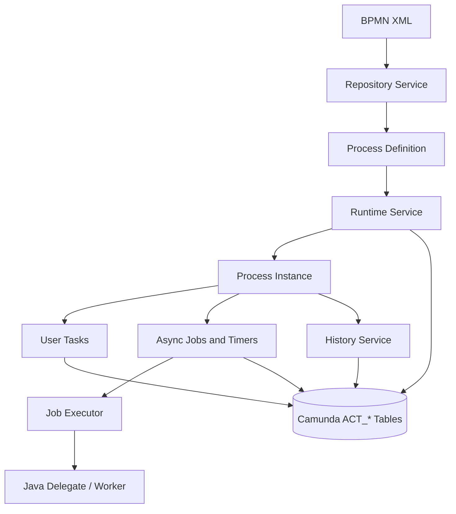
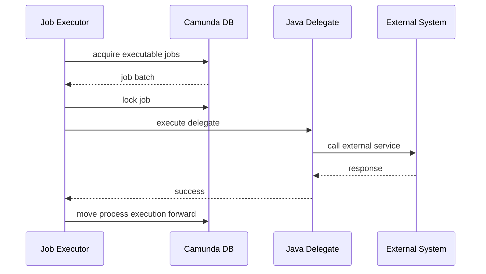
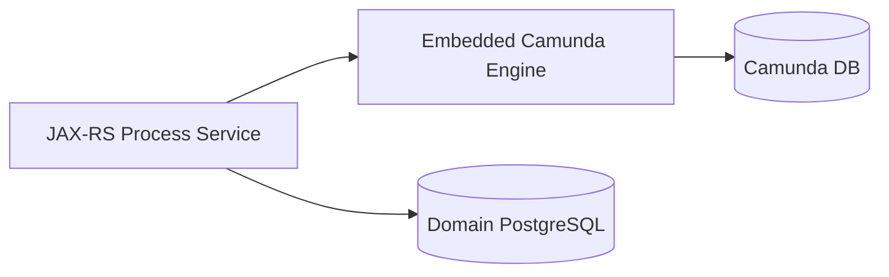
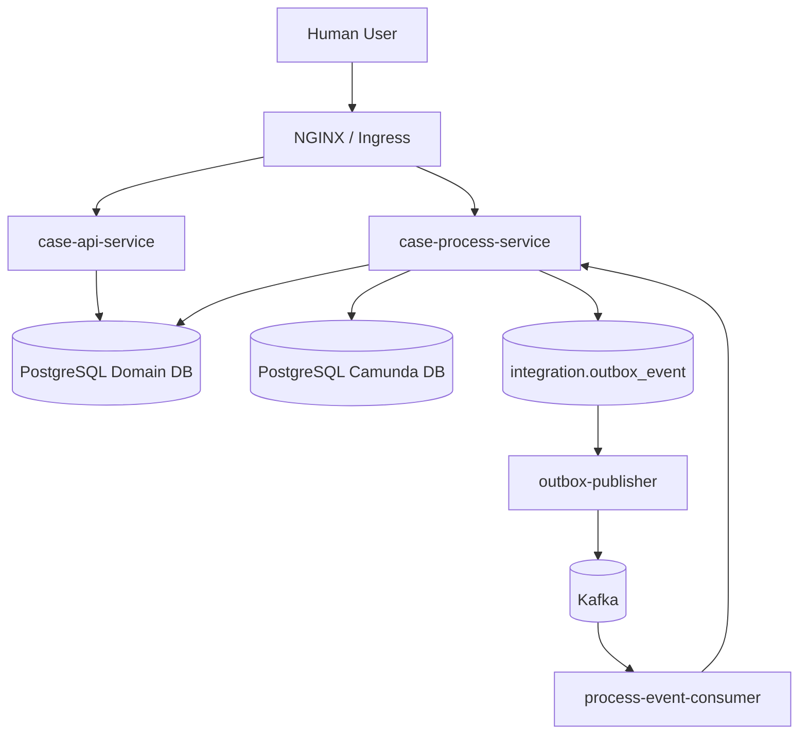
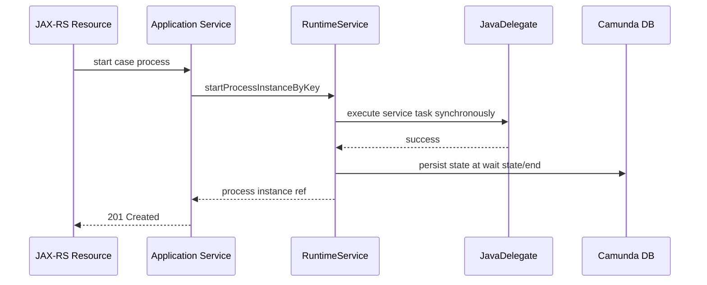
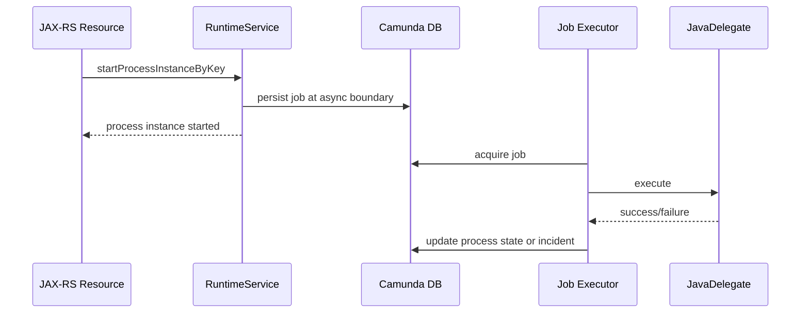
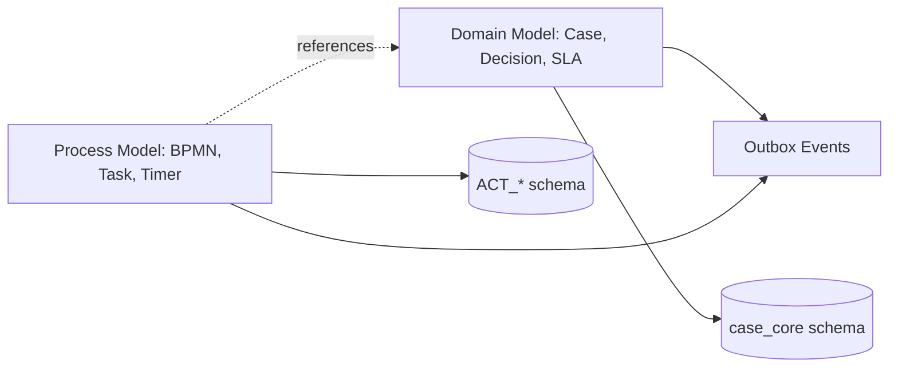
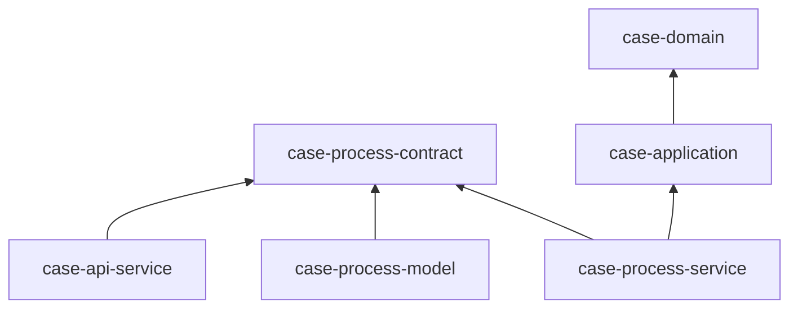

# Part 026 — Camunda 7 Process Engine Architecture

Camunda 7 sering dipakai seperti “library untuk menjalankan BPMN”. Di produksi, cara pikir itu kurang kuat. Camunda 7 adalah **stateful process engine** yang menyimpan runtime state ke relational database, menjalankan asynchronous job melalui job executor, mengevaluasi BPMN behavior, menyimpan history, dan berinteraksi dengan kode aplikasi melalui service API, delegate, listener, external task, REST API, serta transaction boundary.

Dalam seri ini, Camunda 7 dipakai untuk orchestration pada Regulatory Enforcement & Case Orchestration Platform. Camunda tidak menjadi sumber kebenaran semua domain data. Camunda mengatur alur kerja, human task, timer, message correlation, retry, incident, dan visibility proses. Sumber kebenaran case tetap berada di PostgreSQL domain schema seperti `case_core.case_file`, `case_core.case_decision`, `case_core.sla_obligation`, audit table, outbox, dan inbox.

Kita juga harus jujur: Camunda 7 adalah teknologi legacy-production. Untuk sistem baru, keputusan memakai Camunda 7 harus punya alasan operasional, lisensi/support, dan migration-awareness. Namun banyak enterprise masih menjalankan Camunda 7 di sistem kritikal, sehingga memahami arsitekturnya tetap sangat bernilai.

---

## 1. Mental Model: Engine, Not Diagram Renderer

BPMN file bukan dokumentasi pasif. Di Camunda 7, BPMN XML dideploy sebagai **process definition**. Saat instance berjalan, engine menyimpan state, menunggu event, membuat job, membuat task, menjalankan delegate, dan mencatat history.



Kalau kamu mengubah BPMN, kamu mengubah executable contract. Kalau kamu mengubah delegate Java, kamu mengubah behavior process instance yang mungkin sudah lama berjalan. Kalau kamu mengubah variable shape, kamu mengubah kontrak antara process model, Java delegate, API, Kafka event, dan database.

---

## 2. Komponen Utama Camunda 7

### 2.1 BPMN engine core

Engine core membaca BPMN XML, membuat model internal, dan mengeksekusi node: start event, service task, user task, gateway, timer event, boundary event, message event, end event, dan sebagainya.

Bagi engineer produksi, hal penting bukan hafalan simbol BPMN, tetapi memahami kapan token proses:

- langsung lanjut secara sinkron,
- berhenti pada wait state,
- membuat job asynchronous,
- membuat user task,
- menunggu message correlation,
- menunggu timer,
- atau masuk incident.

### 2.2 Service API

Camunda 7 mengekspos service API. Yang paling sering dipakai:

| Service | Fungsi utama |
|---|---|
| `RepositoryService` | deploy/read process definition |
| `RuntimeService` | start instance, correlate message, manage runtime execution |
| `TaskService` | query/claim/complete user task |
| `HistoryService` | query historic process/task/activity/variable |
| `ManagementService` | query/manage jobs, incidents, metrics tertentu |
| `IdentityService` | identity/user/group integration, tergantung setup |
| `AuthorizationService` | authorization model Camunda, jika digunakan |

Dalam platform kita, service API dibungkus oleh adapter. Jangan biarkan resource JAX-RS atau Kafka consumer menyebarkan call Camunda mentah tanpa boundary.

```java
public interface CaseProcessGateway {
    ProcessInstanceRef startAssessment(CaseId caseId, CorrelationId correlationId);
    void correlateEvidenceReceived(CaseId caseId, EvidenceId evidenceId, CorrelationId correlationId);
    void completeInvestigationTask(TaskId taskId, InvestigatorDecision decision, Actor actor);
}
```

Adapter ini menyembunyikan detail `RuntimeService`, `TaskService`, variable names, BPMN message names, dan process definition keys.

### 2.3 Persistence layer

Camunda 7 menyimpan state engine ke relational database. Secara konseptual, tabel Camunda sering dikelompokkan seperti:

| Prefix | Makna umum |
|---|---|
| `ACT_RE_*` | repository data seperti deployment dan process definition |
| `ACT_RU_*` | runtime data seperti execution, task, job, variable |
| `ACT_HI_*` | history data |
| `ACT_GE_*` | general data seperti byte array/properties |
| `ACT_ID_*` | identity data jika identity engine dipakai |

Rule penting:

> Jangan jadikan tabel `ACT_*` sebagai domain read model aplikasi.

Boleh query untuk operasi/diagnostics dengan hati-hati, tetapi domain UI, reporting, audit legal, dan API response harus berasal dari schema domain milik aplikasi, bukan join liar ke internal engine table.

### 2.4 Job executor

Job executor menjalankan pekerjaan asynchronous: timer, async continuation, retry service task, dan background job lain. Ia mengambil job dari database, mengunci job, menjalankannya, lalu meng-update state.



Job executor adalah sumber banyak incident jika external call lambat, database lock tinggi, retry salah, atau deployment cluster tidak aware dengan process application yang tersedia.

---

## 3. Deployment Model Options

Ada tiga cara umum menjalankan Camunda 7.

### 3.1 Embedded process engine

Engine hidup di dalam aplikasi Java.



Kelebihan:

- Deployment sederhana untuk team aplikasi.
- Delegate Java berada dekat dengan process model.
- Transaction integration lebih mudah dipahami.
- Cocok untuk bounded context process service.

Risiko:

- Scaling API dan job execution terikat dalam satu deployable jika tidak dipisah.
- Setiap replica bisa menjalankan job executor.
- Perlu disiplin readiness, graceful shutdown, dan job acquisition.
- Process engine ikut restart saat service restart.

### 3.2 Shared engine di application server

Engine menjadi service di runtime container dan process application dideploy ke container tersebut.

Kelebihan:

- Engine dapat dipakai beberapa process application.
- Cocok untuk organisasi yang sudah punya platform Camunda 7 terpusat.

Risiko:

- Coupling antar aplikasi lebih sulit dikontrol.
- Deployment aware job executor perlu dipahami serius.
- Debugging classpath/delegate ownership bisa rumit.

### 3.3 Standalone remote engine / REST

Engine disediakan sebagai service jarak jauh. Aplikasi berinteraksi via REST.

Kelebihan:

- Boundary network jelas.
- Aplikasi tidak membawa engine dependency.
- Operasi engine bisa dipusatkan.

Risiko:

- Transaction boundary domain DB dan engine DB terpisah.
- Latency dan partial failure bertambah.
- Delegate execution strategy harus dipilih: internal delegate, external task, atau worker terpisah.

### 3.4 Pilihan seri ini

Untuk seri ini, kita memilih model:

```text
case-process-service
- embedded Camunda 7 engine
- owns BPMN deployment
- exposes JAX-RS process/admin/task API
- integrates with domain PostgreSQL through application service
- integrates with Kafka through outbox/inbox adapters
- runs on Kubernetes as controlled Deployment
```

Alasannya: kita ingin mengajari boundary secara eksplisit tanpa menyembunyikan engine di platform terpusat. Namun desain tetap menjaga Camunda sebagai subsystem, bukan domain model utama.

---

## 4. Runtime Topology dalam Platform



Catatan desain:

1. Domain DB dan Camunda DB bisa berada dalam database server yang sama tetapi schema/database ownership harus jelas.
2. Tabel `ACT_*` dimiliki engine. Jangan campur migration domain dengan migration internal Camunda.
3. API untuk task dan process operation melewati application authorization, bukan langsung expose Camunda REST tanpa kontrol.
4. Event Kafka tidak langsung mutate Camunda secara sembarang; ada adapter dan idempotency boundary.

---

## 5. Process Application Boundary

Process application adalah boundary antara BPMN model dan kode Java yang dibutuhkan untuk menjalankannya.

Struktur module yang kita inginkan:

```text
case-process-service/
  src/main/resources/bpmn/
    enforcement-case-lifecycle.bpmn
    investigation-subprocess.bpmn
  src/main/java/com/acme/enforcement/process/
    adapter/camunda/
    delegate/
    listener/
    variable/
    task/
    incident/
```

Rule:

- BPMN file tidak boleh refer delegate class dari module acak.
- Delegate class harus kecil dan memanggil application service.
- Variable name harus didefinisikan sebagai contract, bukan string liar.
- BPMN message name harus stabil dan terdokumentasi.
- Process definition key harus dianggap public internal contract.

Contoh constant boundary:

```java
public final class EnforcementProcessContract {
    public static final String PROCESS_KEY = "enforcement-case-lifecycle";

    public static final class Messages {
        public static final String EVIDENCE_RECEIVED = "EvidenceReceived";
        public static final String DECISION_RECORDED = "DecisionRecorded";
    }

    public static final class Variables {
        public static final String CASE_ID = "caseId";
        public static final String CORRELATION_ID = "correlationId";
        public static final String RISK_SCORE = "riskScore";
        public static final String DECISION_REASON = "decisionReason";
    }

    private EnforcementProcessContract() {}
}
```

---

## 6. Transaction Boundary

Camunda 7 execution bisa sinkron sampai mencapai wait state. Jika service task tidak diberi async boundary, delegate dapat berjalan dalam command/transaction yang sama dengan engine operation.

### 6.1 Synchronous path



Kelebihan: sederhana. Risiko: external call di delegate memperpanjang request transaction dan membuat user request lambat/gagal.

### 6.2 Async boundary

Dengan `asyncBefore` atau `asyncAfter`, engine membuat job dan request awal bisa selesai lebih cepat.



Async boundary membuat retry dan incident lebih eksplisit. Untuk service task yang memanggil external system, menulis outbox, atau berpotensi lambat, async boundary sering lebih aman.

### 6.3 Rule praktis

| Aktivitas | Default seri ini |
|---|---|
| Pure gateway/variable mapping ringan | synchronous |
| Service task call external system | async before |
| Service task publish command/event | async before + idempotency |
| User task | wait state alami |
| Timer/SLA | job executor |
| Message correlation | idempotent adapter |

---

## 7. Domain DB vs Camunda DB Transaction

Kesalahan umum: mencoba membuat satu transaksi besar yang mencakup semua domain state, Camunda state, Kafka event, dan external call.

Di platform kita:

- Domain invariant disimpan di PostgreSQL domain schema.
- Camunda menyimpan process state di `ACT_*` tables.
- Kafka publish dilakukan melalui outbox.
- External side effect harus idempotent.

Jika Camunda dan domain schema memakai datasource/transaction manager yang sama, transaksi lokal bisa menyatukan beberapa operasi. Tetapi jangan jadikan ini alasan untuk menulis desain yang hanya benar jika semua hal berada di satu database selamanya.

Lebih baik desain dengan boundary eksplisit:

```java
public final class StartAssessmentUseCase {
    private final CaseRepository caseRepository;
    private final CaseProcessGateway processGateway;
    private final OutboxRepository outboxRepository;

    public StartAssessmentResult handle(StartAssessmentCommand command) {
        CaseFile caseFile = caseRepository.requireOpen(command.caseId());
        caseFile.markAssessmentStarted(command.actor(), command.now());
        caseRepository.save(caseFile);

        ProcessInstanceRef ref = processGateway.startAssessment(
            command.caseId(),
            command.correlationId()
        );

        outboxRepository.append(CaseAssessmentStartedEvent.from(caseFile, ref));
        return new StartAssessmentResult(ref.processInstanceId());
    }
}
```

Jika call ke process engine gagal setelah domain save, kamu butuh recovery. Jika process started tetapi domain update gagal, kamu juga butuh reconciliation. Karena itu, untuk operation kritikal, desainlah idempotency dan reconciliation sejak awal.

---

## 8. Job Executor Architecture

Job executor bekerja seperti worker internal yang mengambil job dari database.

Komponen konseptual:

| Komponen | Fungsi |
|---|---|
| Job acquisition | mencari job yang due dan executable |
| Job lock | mencegah node lain mengeksekusi job sama |
| Executor thread pool | menjalankan job |
| Retry cycle | menentukan kapan job dicoba ulang |
| Incident creation | menandai job gagal setelah retry habis |
| Deployment awareness | membatasi job berdasarkan deployment/process application yang tersedia |

### 8.1 Exclusive jobs

Untuk banyak kasus, exclusive job membantu mencegah beberapa job dalam process instance yang sama dieksekusi bersamaan. Namun jangan jadikan ini pengganti desain idempotency. External side effect tetap harus aman diulang.

### 8.2 Retry time cycle

BPMN/service task bisa punya retry cycle. Contoh konseptual:

```xml
<camunda:failedJobRetryTimeCycle>R3/PT5M</camunda:failedJobRetryTimeCycle>
```

Artinya retry beberapa kali dengan jeda tertentu. Retry bukan solusi untuk semua error. Bedakan:

| Error | Retry? |
|---|---|
| HTTP 503 external system | ya, bounded retry |
| DB deadlock/serialization failure | ya, dengan retry policy |
| Validation failed karena input salah | tidak, BPMN error atau domain rejection |
| Missing process variable karena bug deployment | tidak otomatis; incident dan repair |
| Authorization denied | tidak |

### 8.3 Job executor di Kubernetes

Jika `case-process-service` punya 4 replica dan semua mengaktifkan job executor, semua bisa mengambil job. Ini bisa baik untuk scaling, tetapi perlu kontrol:

- Set thread pool sesuai kapasitas DB dan external dependency.
- Gunakan resource request/limit yang realistis.
- Pastikan graceful shutdown tidak membunuh job di tengah secara brutal.
- Monitor acquisition latency, job failure, incident count, dan database load.
- Hati-hati dengan deployment heterogen saat rolling update.

---

## 9. Deployment-Aware Job Executor

Dalam cluster, masalah muncul jika node mengambil job untuk process application/delegate yang tidak tersedia di node itu. Deployment awareness dapat membantu engine hanya menjalankan job untuk deployment yang terdaftar pada node terkait.

Namun deployment awareness bukan silver bullet. Ia harus dipahami bersama:

- strategy deployment BPMN,
- process application registration,
- rolling update,
- class availability,
- process versioning,
- dan migration process instance.

Rule seri ini:

> Jika delegate Java berada di aplikasi yang sama dengan BPMN deployment, jangan biarkan node tanpa kode/deployment yang sesuai mengambil job tersebut.

---

## 10. Process Definition Versioning

Camunda menyimpan versi process definition. Saat BPMN baru dideploy, instance baru biasanya memakai versi terbaru, sedangkan instance lama tetap berjalan pada versi definisi tempat ia dimulai, kecuali dilakukan migration.

Ini punya konsekuensi:

1. Delegate Java baru harus compatible dengan instance lama jika class yang sama dipakai.
2. Variable reader harus bisa membaca shape lama.
3. Task form/UI harus tahu process/task version.
4. Message correlation harus tidak ambigu.
5. Process instance migration harus direncanakan, bukan otomatis.

Contoh naming:

```text
processDefinitionKey: enforcement-case-lifecycle
version: managed by Camunda deployment
businessKey: CASE-2026-000184
```

Business key harus stabil dan meaningful. Dalam platform kita, gunakan case number atau case UUID yang dapat ditelusuri.

---

## 11. Business Key dan Correlation

Business key adalah salah satu jembatan antara domain dan process.

```java
runtimeService.startProcessInstanceByKey(
    EnforcementProcessContract.PROCESS_KEY,
    caseId.value().toString(),
    variables
);
```

Untuk message correlation:

```java
runtimeService.createMessageCorrelation(EnforcementProcessContract.Messages.EVIDENCE_RECEIVED)
    .processInstanceBusinessKey(caseId.value().toString())
    .setVariable("evidenceId", evidenceId.value().toString())
    .correlateWithResult();
```

Risiko correlation:

| Risiko | Mitigasi |
|---|---|
| Tidak ada instance menunggu message | inbox retry / dead-letter / operator review |
| Lebih dari satu instance match | correlation key terlalu lemah; perbaiki model |
| Message datang sebelum process wait state | inbox buffer + retry dengan backoff |
| Duplicate message | idempotency key di integration inbox |
| Variable shape salah | contract validator sebelum correlate |

---

## 12. Camunda sebagai Orchestrator, Bukan Database Domain

Batas yang sehat:



Contoh domain state:

```text
case_file.lifecycle_status = UNDER_INVESTIGATION
```

Contoh process state:

```text
process instance waiting at user task: Review Evidence
```

Keduanya berhubungan tetapi tidak identik. Jangan menampilkan status case langsung dari current BPMN activity. BPMN activity adalah posisi orchestration, bukan definisi legal status case.

---

## 13. History Level dan Audit Boundary

Camunda history berguna untuk melihat process execution. Tetapi regulatory audit tidak boleh sepenuhnya bergantung pada Camunda history.

Perbedaan:

| Data | Camunda history | Domain audit |
|---|---|---|
| Activity executed | kuat | biasanya tidak detail BPMN |
| User task completed | kuat | perlu disalin sebagai audit action penting |
| Legal decision reason | tidak cukup | harus domain audit |
| Evidence mutation | tidak ideal | domain audit wajib |
| Retention policy | bisa cleanup | audit legal bisa lebih panjang |

History cleanup harus dipikirkan sejak awal. Jika semua history disimpan tanpa retention, tabel history dapat tumbuh besar. Jika cleanup terlalu agresif, investigasi operational kehilangan jejak. Pisahkan process observability history dari audit legal record.

---

## 14. Schema Ownership

Camunda schema harus di-manage sesuai versi engine. Jangan menambahkan trigger, FK, atau custom index sembarangan ke `ACT_*` tables tanpa alasan kuat dan testing mendalam.

Praktik sehat:

```text
postgresql/
  camunda_schema/     # engine-owned, version-controlled by Camunda migration path
  domain_schema/      # application-owned
  integration_schema/ # outbox/inbox/idempotency
```

Kalau butuh query operasional, buat read-only view di schema terpisah bila benar-benar perlu, dan dokumentasikan sebagai non-domain API.

---

## 15. Maven Module Boundary

Module yang sehat:

```text
learn-contract-first-platform/
  case-process-contract/
    Process keys, message names, variable names
  case-process-model/
    BPMN files and validation tests
  case-process-service/
    Embedded engine, delegates, listeners, adapters
  case-process-test/
    BPMN scenario tests and integration tests
```

Jangan membuat semua service tergantung langsung pada `camunda-engine`. Hanya process service dan test module yang perlu dependency engine langsung.

### 15.1 Dependency direction



`case-domain` tidak boleh tergantung Camunda. Domain harus bisa diuji tanpa engine.

---

## 16. Delegate Design

JavaDelegate harus tipis.

Anti-pattern:

```java
public final class RecordDecisionDelegate implements JavaDelegate {
    public void execute(DelegateExecution execution) {
        // parse variables
        // query database
        // validate authorization
        // update domain tables
        // call external system
        // publish Kafka event directly
        // catch all exceptions
    }
}
```

Pola lebih sehat:

```java
public final class RecordDecisionDelegate implements JavaDelegate {
    private final RecordDecisionUseCase useCase;
    private final ProcessVariableReader variableReader;
    private final ProcessVariableWriter variableWriter;

    @Override
    public void execute(DelegateExecution execution) {
        RecordDecisionCommand command = variableReader.readRecordDecisionCommand(execution);
        RecordDecisionResult result = useCase.handle(command);
        variableWriter.writeDecisionResult(execution, result);
    }
}
```

Delegate bertugas menjadi adapter antara process variable dan application use case. Business invariant tetap di domain/application layer.

---

## 17. BPMN Error vs Technical Incident

Jangan semua exception menjadi incident. Jangan semua error bisnis menjadi retry.

| Kondisi | Representasi |
|---|---|
| Evidence tidak cukup untuk lanjut | BPMN business path atau BPMN error |
| External service timeout | technical exception + retry |
| Database deadlock | retry terbatas |
| Missing required variable karena bug | incident |
| Unauthorized task completion | reject di API, bukan BPMN path normal |
| Case already closed | domain conflict; mungkin BPMN compensation/manual review |

BPMN error harus digunakan untuk jalur bisnis yang dimodelkan. Technical exception harus digunakan untuk kegagalan sistem yang perlu retry/incident.

---

## 18. Kubernetes Operational Shape

Minimal deployment shape:

```yaml
apiVersion: apps/v1
kind: Deployment
metadata:
  name: case-process-service
spec:
  replicas: 3
  selector:
    matchLabels:
      app: case-process-service
  template:
    metadata:
      labels:
        app: case-process-service
    spec:
      terminationGracePeriodSeconds: 60
      containers:
        - name: app
          image: registry.example.com/case-process-service:2026.07.03
          ports:
            - containerPort: 8080
          env:
            - name: CAMUNDA_JOB_EXECUTOR_ACTIVATE
              value: "true"
          readinessProbe:
            httpGet:
              path: /internal/ready
              port: 8080
          livenessProbe:
            httpGet:
              path: /internal/live
              port: 8080
```

Readiness harus memeriksa kemampuan minimum service untuk menerima traffic. Liveness jangan terlalu agresif hingga membunuh node saat DB lambat sementara. Untuk engine stateful, restart berlebihan dapat memperparah incident.

---

## 19. Graceful Shutdown

Saat Pod dihentikan:

1. Stop menerima traffic baru.
2. Biarkan request berjalan selesai.
3. Stop/slow job acquisition.
4. Biarkan job yang sedang berjalan selesai sejauh mungkin.
5. Release resource dengan bersih.

Jika shutdown terlalu cepat, job lock mungkin menunggu timeout sebelum node lain mengambil ulang. Ini membuat latency process naik dan operator bingung karena tidak ada error jelas, hanya proses terasa “stuck”.

---

## 20. Observability

Minimal metrics/log untuk Camunda process service:

| Area | Signal |
|---|---|
| Job executor | acquired jobs, executed jobs, failed jobs, acquisition time |
| Incident | count by process key, activity id, exception type |
| Process | started/completed instance count, duration |
| Task | created/completed/overdue count |
| Timer | due timer count, timer execution delay |
| DB | lock wait, connection pool, slow query |
| API | task completion latency, correlation latency |
| Kafka integration | inbox pending, duplicate, DLQ, retry count |

Structured log wajib membawa:

```text
correlationId
caseId
processInstanceId
processDefinitionKey
activityId
businessKey
messageName
taskId
```

Jangan log semua process variable mentah. Variable bisa mengandung data sensitif atau informasi legal.

---

## 21. Failure Model

### 21.1 Job stuck

Gejala:

- Timer tidak firing.
- Async service task tidak jalan.
- Job due tetapi tidak dieksekusi.
- Incident count naik atau job retries turun.

Kemungkinan penyebab:

- Job executor mati/nonaktif.
- DB lock/connection pool penuh.
- Job terkunci oleh node mati sampai lock timeout.
- Deployment awareness salah.
- Delegate class tidak tersedia.
- External dependency lambat membuat worker habis.

### 21.2 Message correlation gagal

Gejala:

- Kafka event sudah diterima tetapi process tidak lanjut.
- Inbox retry meningkat.
- Error “no matching execution” atau “multiple matching executions”.

Mitigasi:

- Gunakan inbox table.
- Correlation key harus deterministik.
- Jangan langsung DLQ pada “not waiting yet”; gunakan retry bounded.
- Audit semua correlation attempt.

### 21.3 Incident storm

Gejala:

- Banyak instance gagal pada activity yang sama.
- Job retry habis.
- DB/API load meningkat.

Mitigasi:

- Pause job executor atau disable feature flag bila perlu.
- Identifikasi process key/activity id/error type.
- Perbaiki dependency/config/data.
- Retry jobs secara batch terkontrol.
- Jangan retry massal tanpa memastikan akar masalah selesai.

---

## 22. Production Readiness Checklist

Sebelum Camunda process service production-ready:

- [ ] Process definition key, message names, variable names terdokumentasi sebagai contract.
- [ ] Camunda tidak menjadi domain database utama.
- [ ] Domain state dan process state dipisah jelas.
- [ ] BPMN deployment versioning dipahami.
- [ ] Delegate tipis dan memanggil use case.
- [ ] Async boundary dipilih secara eksplisit.
- [ ] Retry policy dibedakan antara business error dan technical error.
- [ ] Job executor thread/concurrency disesuaikan kapasitas DB dan dependency.
- [ ] Deployment-aware behavior direview untuk cluster.
- [ ] History level dan cleanup policy ditentukan.
- [ ] `ACT_*` schema tidak dimodifikasi sembarangan.
- [ ] Message correlation idempotent dan buffered via inbox.
- [ ] Metrics/log membawa process identifiers.
- [ ] Graceful shutdown diuji di Kubernetes.
- [ ] Incident runbook tersedia.
- [ ] Migration path Camunda 7 jangka panjang dicatat sebagai architecture risk.

---

## 23. Key Takeaways

Camunda 7 harus diperlakukan sebagai process engine stateful berbasis database. Kekuatan utamanya adalah executable BPMN, wait state, human task, timer, retry, incident, dan visibility proses. Kelemahannya muncul ketika kita menjadikannya domain database, menyembunyikan business invariant di delegate, atau menganggap workflow state sama dengan domain state.

Pegangan utama:

1. Bungkus Camunda API dalam gateway adapter.
2. Pisahkan domain state dari process state.
3. Gunakan BPMN sebagai contract executable.
4. Jadikan variable names dan message names sebagai contract eksplisit.
5. Pakai async boundary untuk pekerjaan lambat/berisiko.
6. Pahami job executor sebagai worker berbasis DB, bukan magic background thread.
7. Jangan query `ACT_*` sebagai read model domain.
8. Rancang observability dan incident recovery sejak awal.
9. Perlakukan Camunda 7 sebagai legacy-production component dengan migration-awareness.

Di part berikutnya kita akan memakai arsitektur ini untuk memodelkan lifecycle case secara konkret dalam BPMN: intake, assessment, investigation, escalation, decision, appeal, dan closure.

---

## References

- Camunda 7 / CIB seven Architecture Overview: https://docs.cibseven.org/manual/latest/introduction/architecture/
- Camunda Best Practices — Understanding Camunda 7 Transaction Handling: https://unsupported.docs.camunda.io/8.3/docs/components/best-practices/development/understanding-transaction-handling-c7/
- Camunda Best Practices — Deciding About Your Camunda 7 Stack: https://unsupported.docs.camunda.io/8.1/docs/components/best-practices/architecture/deciding-about-your-stack-c7/
- Camunda Blog — The Job Executor: What Is Going on in My Process Engine?: https://camunda.com/blog/2019/10/job-executor-what-is-going-on-in-my-process-engine/
- Camunda Best Practices — Operating Camunda 7: https://docs.camunda.io/docs/8.7/components/best-practices/operations/operating-camunda-c7/
