# Part 027 — BPMN Modeling for Case Lifecycle

Part sebelumnya membahas Camunda 7 sebagai process engine stateful. Sekarang kita masuk ke pertanyaan yang lebih sulit: **bagaimana memodelkan lifecycle case yang kompleks tanpa membuat BPMN menjadi spaghetti diagram, tanpa menyembunyikan logic penting di Java delegate, dan tanpa menjadikan Camunda sebagai database domain?**

Studi kasus kita tetap sama: **Regulatory Enforcement & Case Orchestration Platform**. Sistem menerima laporan/pengaduan, melakukan validasi awal, membentuk case, melakukan triage, assessment, investigation, escalation, decision, appeal, closure, audit, dan event publication.

Target part ini bukan membuat diagram BPMN yang terlihat cantik. Targetnya adalah membuat **executable process model** yang:

- mudah dibaca oleh engineer dan process owner,
- punya boundary jelas antara human task, system task, event, timer, dan decision,
- tahan terhadap retry, incident, timeout, dan deploy bertahap,
- tidak mencampur domain state dengan workflow token,
- bisa dites, dimigrasikan, dan dioperasikan.

---

## 1. Problem: Case Lifecycle Bukan Satu Linear Flow

Case enforcement jarang berjalan lurus dari `Created` ke `Closed`. Realitasnya lebih mirip ini:

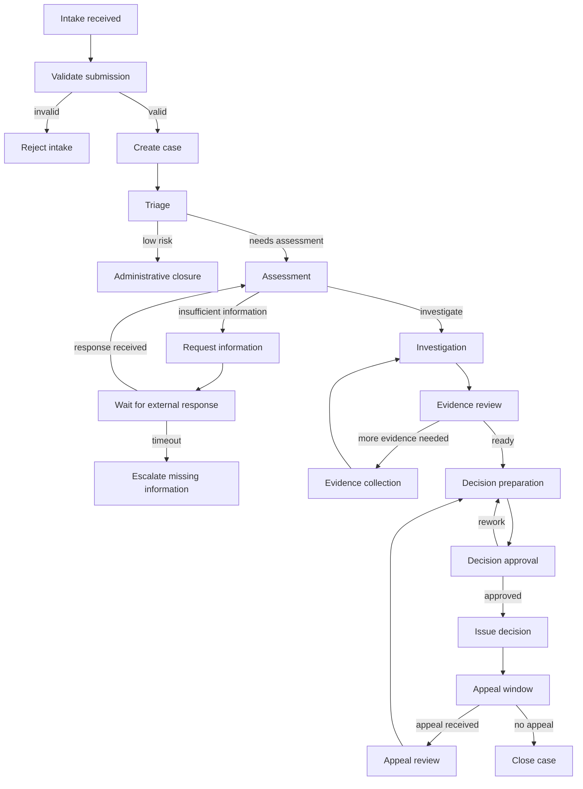

Masalah produksi muncul kalau model di atas langsung dituangkan ke satu proses besar tanpa struktur. Hasilnya:

- diagram sulit dibaca,
- perubahan kecil berdampak ke semua instance,
- task assignment tersebar tanpa ownership,
- timer sulit diuji,
- migration process version menjadi berisiko,
- incident sulit ditelusuri,
- business user tidak tahu node mana yang benar-benar executable dan mana yang hanya dokumentasi.

BPMN harus memodelkan **control flow yang perlu diorkestrasi oleh engine**, bukan semua detail domain.

---

## 2. Prinsip Utama: Model the Wait, Not Every Line of Code

Camunda 7 sangat kuat untuk proses yang punya wait state:

- menunggu human approval,
- menunggu SLA timer,
- menunggu external response,
- menunggu Kafka event yang dikorelasikan,
- menunggu review paralel,
- menunggu retry technical job,
- menunggu appeal period.

Sebaliknya, Camunda bukan tempat ideal untuk menaruh:

- validasi field detail yang lebih cocok di OpenAPI/Java/DB constraint,
- query kompleks,
- pricing/decision algorithm yang berubah cepat,
- looping data besar,
- business rule granular yang lebih baik sebagai decision service eksplisit,
- storage semua domain attributes.

Mental model yang kita pakai:

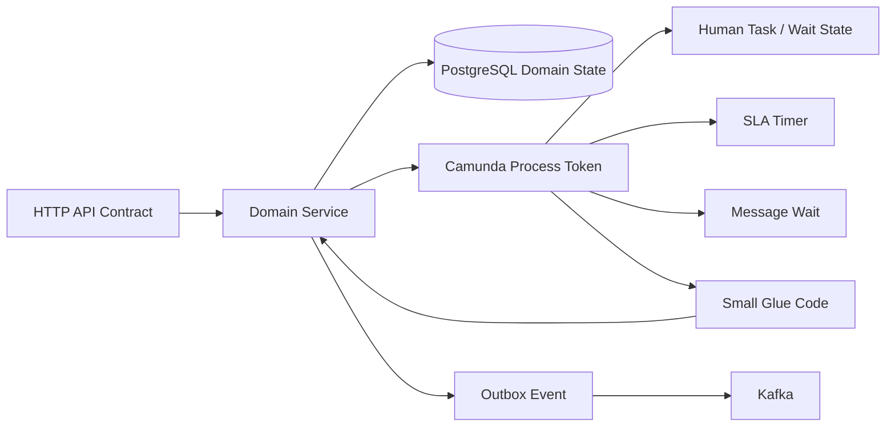

Camunda memegang **workflow progression**. PostgreSQL domain schema memegang **business truth**. Kafka memegang **integration event log**. HTTP API memegang **command/query boundary**.

---

## 3. Process Boundary: Satu Case, Banyak Sub-Lifecycle

Jangan mulai dari BPMN symbol. Mulai dari lifecycle boundary.

Untuk platform enforcement, kita bisa membagi lifecycle menjadi beberapa proses atau subprocess:

| Lifecycle | Contoh aktivitas | Boundary yang cocok |
|---|---|---|
| Intake | receive, validate, reject/create case | process start atau child process |
| Triage | classify risk, assign queue, route | embedded subprocess atau service + user task |
| Assessment | review sufficiency, request info | subprocess dengan timer/message |
| Investigation | collect evidence, interview, analysis | subprocess atau separate process tergantung durasi |
| Decision | prepare, review, approve, issue | subprocess dengan approval chain |
| Appeal | appeal window, appeal intake, reconsideration | event subprocess atau separate process |
| Closure | final audit, notification, archive | final subprocess |

Rule praktis:

- gunakan **embedded subprocess** untuk mengelompokkan complexity yang masih satu lifecycle dan satu versioning cadence,
- gunakan **call activity** untuk reuse atau lifecycle yang bisa berubah sendiri,
- gunakan **separate process** untuk long-running lifecycle yang punya ownership, SLA, dan migration policy sendiri,
- gunakan **event subprocess** untuk event yang bisa terjadi saat proses sedang berjalan, seperti withdrawal, urgent escalation, external complaint update, atau legal hold.

---

## 4. Top-Level Case Process

Top-level process tidak perlu memuat semua detail. Ia harus menunjukkan fase utama dan wait state penting.

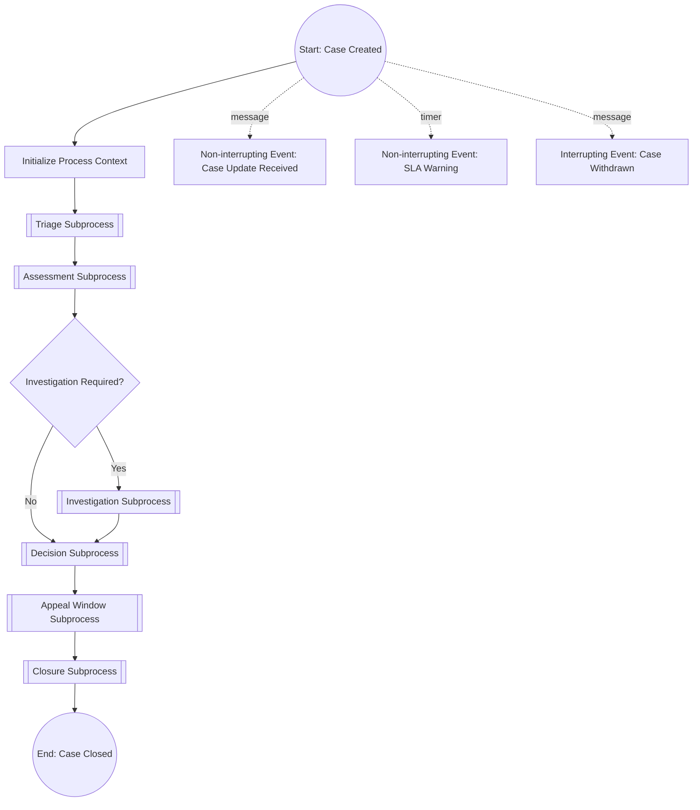

Dalam BPMN aktual, top-level ini bisa menggunakan embedded subprocess atau call activity. Di awal sistem, embedded subprocess sering lebih sederhana. Saat domain tumbuh, beberapa lifecycle dapat dipecah menjadi call activity.

### 4.1 Process key dan business key

Untuk Camunda 7, process definition perlu process key stabil, misalnya:

```text
reg_enforcement_case_lifecycle
```

Business key harus mengacu ke identity domain case, misalnya:

```text
CASE-2026-00000123
```

Jangan memakai technical UUID acak sebagai business key kalau operator mencari case dengan nomor resmi. UUID tetap boleh menjadi primary key database, tetapi business key harus membantu operasi.

### 4.2 Minimal process variables

Process variable jangan menjadi dump seluruh payload case. Gunakan variable kecil, stabil, dan eksplisit:

```json
{
  "caseId": "7a54e9cf-1a41-4e52-9f28-1c0c1d8a5172",
  "caseNumber": "CASE-2026-00000123",
  "tenantId": "regulator-id",
  "riskTier": "HIGH",
  "caseType": "MARKET_ABUSE",
  "assignedUnit": "ENFORCEMENT_INVESTIGATION",
  "schemaVersion": 1
}
```

Variable detail seperti party address, evidence metadata, document content, decision reasons, dan audit detail tetap berada di PostgreSQL domain schema.

---

## 5. Intake Modeling

Intake biasanya berasal dari HTTP API atau event integration. Jangan biarkan BPMN melakukan semua validasi intake. Validasi syntax dan schema dilakukan sebelum process start.

Flow yang lebih aman:

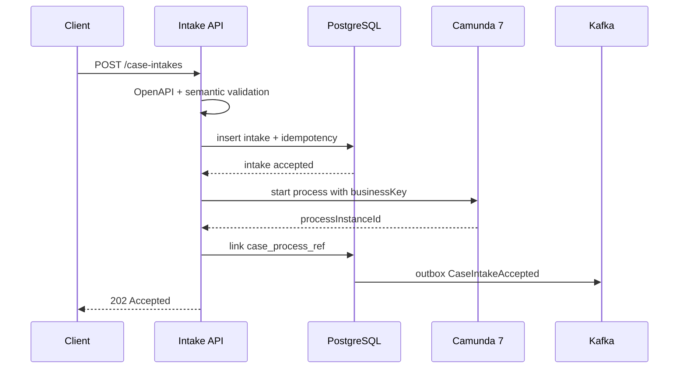

### 5.1 Kenapa tidak start process sebelum DB commit?

Kalau process instance dibuat sebelum domain record committed, process bisa jalan dan delegate berikutnya tidak menemukan case. Kalau DB record dibuat tetapi process start gagal, case menjadi orphan. Karena itu perlu desain transaksi jelas.

Pola sederhana:

1. API membuat case/intake di DB.
2. API start process.
3. API menyimpan `process_instance_id`.
4. Jika step 2 gagal, case berada di state `PROCESS_START_PENDING` dan worker repair akan mencoba ulang.

Pola lebih kuat:

1. API menulis command/domain state + outbox `StartCaseProcessRequested`.
2. Process starter worker membaca outbox.
3. Worker start process idempotently.
4. Worker menulis linkage.

Pola kedua lebih recoverable, tetapi lebih kompleks. Untuk platform enforcement serius, pola kedua biasanya lebih aman.

---

## 6. Triage Subprocess

Triage adalah fase routing awal: menentukan risk tier, unit penanganan, prioritas, dan apakah case bisa langsung closed secara administratif.

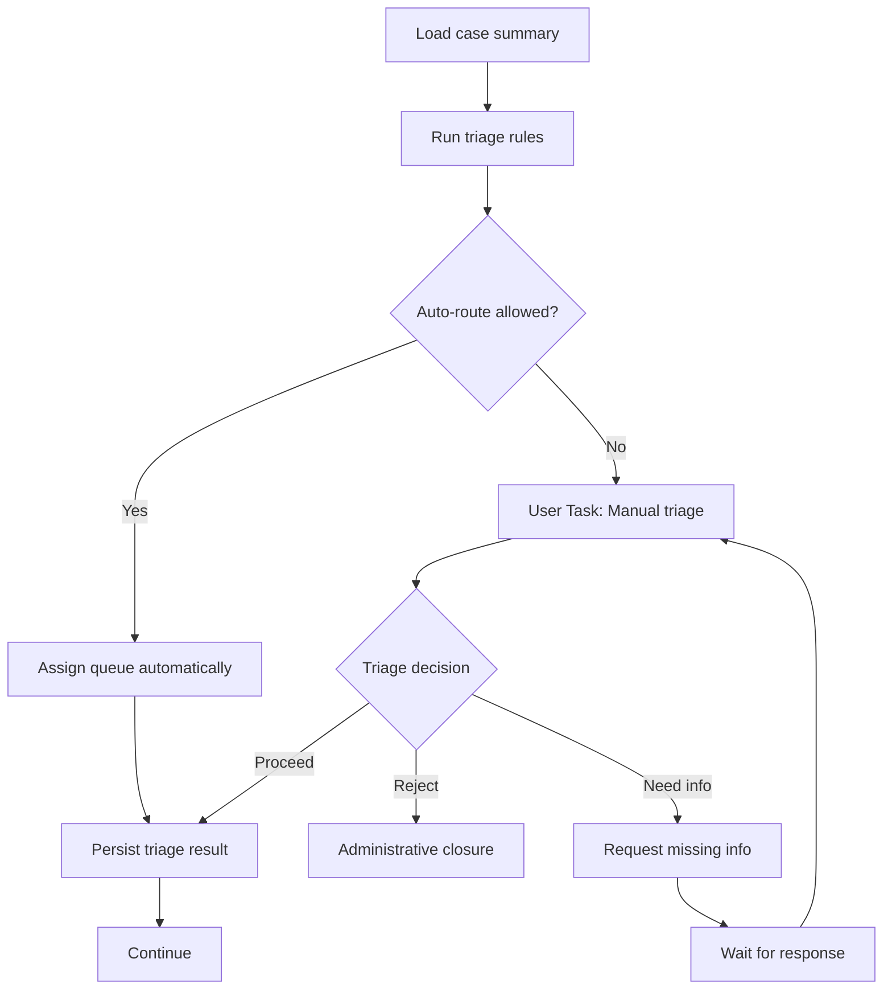

### 6.1 Jangan jadikan gateway sebagai rule engine besar

BPMN gateway sebaiknya membaca hasil keputusan, bukan menghitung semua keputusan.

Buruk:

```text
Gateway expression:
${caseType == 'A' && amount > 1000000 && person.isPoliticallyExposed() && previousCases > 3 && ...}
```

Lebih baik:

```text
${triageOutcome == 'PROCEED_TO_ASSESSMENT'}
```

Keputusan `triageOutcome` dihitung oleh domain service atau decision component, disimpan di DB, diaudit, lalu diberikan ke process variable kecil.

### 6.2 Manual triage user task

User task contract minimal:

| Field | Contoh |
|---|---|
| taskDefinitionKey | `manual_triage_review` |
| candidateGroups | `triage-officer`, `triage-supervisor` |
| dueDate | dari SLA policy |
| formKey | `case-triage-v1` |
| required action | choose outcome, add reason, optionally assign unit |
| completion command | `CompleteTriageTaskCommand` |

Human task bukan tempat menyimpan domain result. Saat user complete task, aplikasi harus:

1. memvalidasi authorization,
2. membaca task dari Camunda,
3. membaca current case state dari PostgreSQL,
4. validasi allowed transition,
5. persist triage decision + audit,
6. complete Camunda task dengan variable minimal.

---

## 7. Assessment Subprocess

Assessment menentukan apakah case cukup untuk dilanjutkan, perlu informasi tambahan, atau harus ditutup.

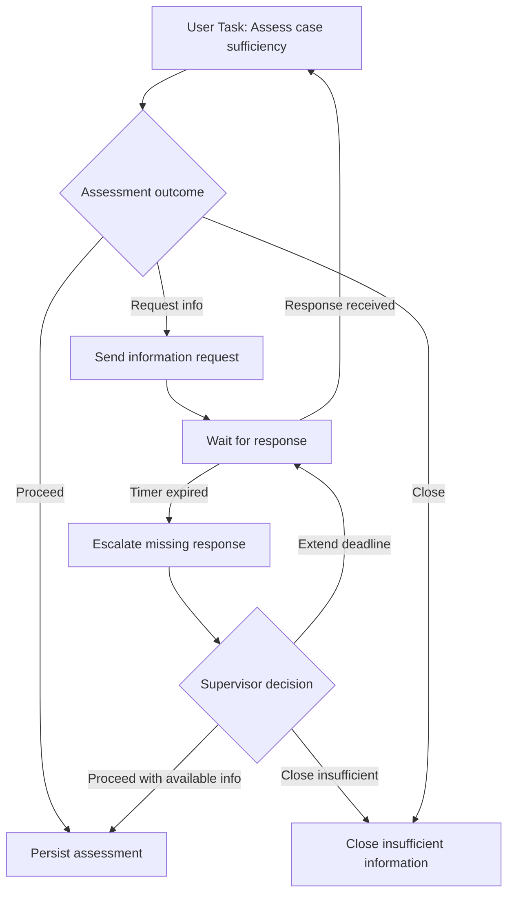

### 7.1 Modeling external response

External response dapat datang dari:

- public portal,
- another internal service,
- batch upload,
- Kafka event,
- manual officer upload.

Di BPMN, ini sebaiknya dimodelkan sebagai **message catch event** atau receive task. Dari sisi integrasi:

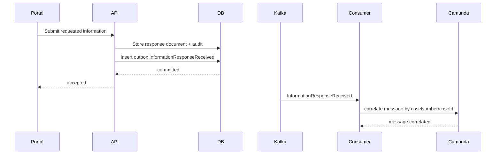

Camunda tidak perlu menyimpan seluruh dokumen response. Camunda hanya perlu tahu bahwa response sudah datang dan process bisa lanjut.

### 7.2 Timer SLA pada assessment

Assessment sering punya deadline. Dalam BPMN, gunakan timer boundary event pada user task atau intermediate timer pada wait state.

Perbedaan penting:

| Pola | Efek |
|---|---|
| Interrupting timer boundary | task dibatalkan dan alur pindah ke escalation path |
| Non-interrupting timer boundary | task tetap aktif, token tambahan menjalankan reminder/escalation |
| Intermediate timer catch | proses memang menunggu waktu tertentu sebelum lanjut |

Untuk SLA warning, gunakan non-interrupting timer. Untuk hard deadline, gunakan interrupting timer.

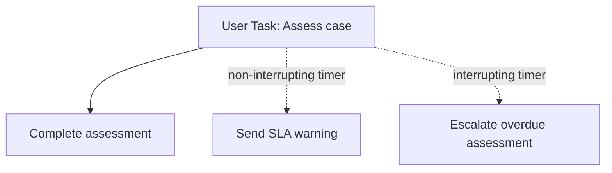

Rule produksi:

- SLA warning tidak boleh menghapus pekerjaan user.
- Hard deadline harus punya policy jelas: auto-escalate, auto-reassign, atau auto-close.
- Timer expression harus berasal dari persisted SLA obligation, bukan dihitung tersembunyi di BPMN.

---

## 8. Investigation Subprocess

Investigation adalah bagian paling mudah menjadi tidak terstruktur. Jangan paksa semua aktivitas investigasi ke sequence flow rigid jika realitasnya ad-hoc.

Ada dua pola:

### 8.1 Structured investigation

Cocok jika semua case melewati langkah stabil:

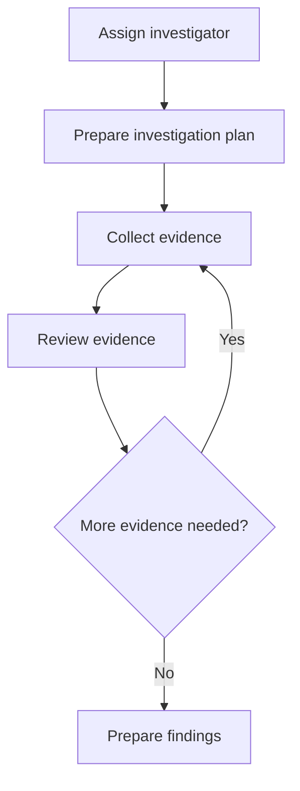

### 8.2 Semi-structured investigation

Cocok jika investigator bisa melakukan beberapa aktivitas dalam urutan fleksibel.

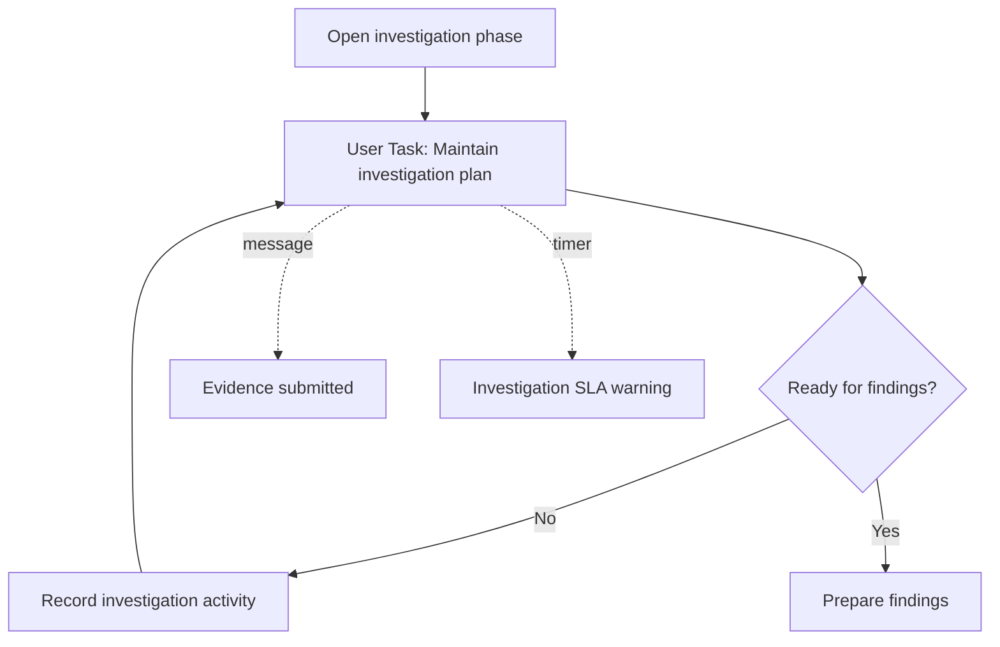

Dalam sistem case management nyata, banyak aktivitas investigasi sebaiknya menjadi **domain operations** di aplikasi, bukan semua menjadi task BPMN. Contoh:

- upload evidence,
- add interview note,
- link party,
- request document,
- mark evidence privileged,
- add legal review comment.

BPMN cukup memodelkan fase besar: investigation active, review findings, decision readiness.

---

## 9. Evidence Review dan Parallel Work

Jika ada banyak reviewer, gunakan parallel gateway dengan hati-hati.

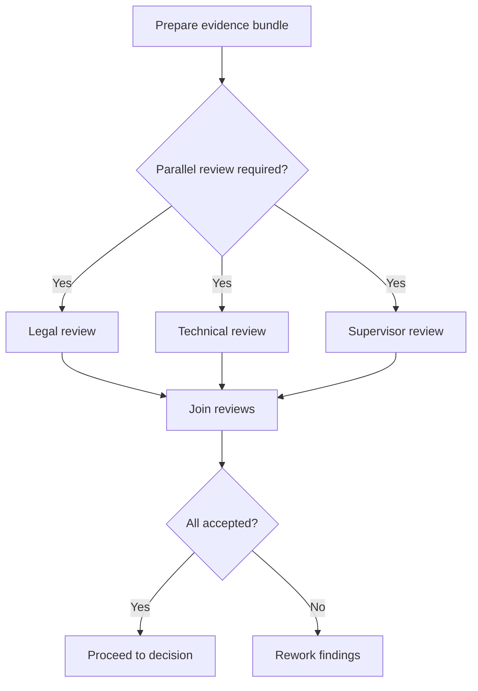

Risk parallel review:

- satu reviewer selesai, lainnya timeout,
- rework diminta setelah reviewer lain approve,
- reviewer completion race dengan cancellation,
- join gateway menunggu token yang tidak pernah datang karena salah model,
- migration process instance lebih sulit.

Untuk production, pastikan:

- parallel task punya task definition key berbeda,
- deadline per task eksplisit,
- join condition jelas,
- review result disimpan di DB, bukan hanya variable,
- cancellation path diuji.

---

## 10. Decision Subprocess

Decision adalah fase yang sangat audit-sensitive. BPMN harus memastikan keputusan tidak diterbitkan sebelum semua precondition terpenuhi.

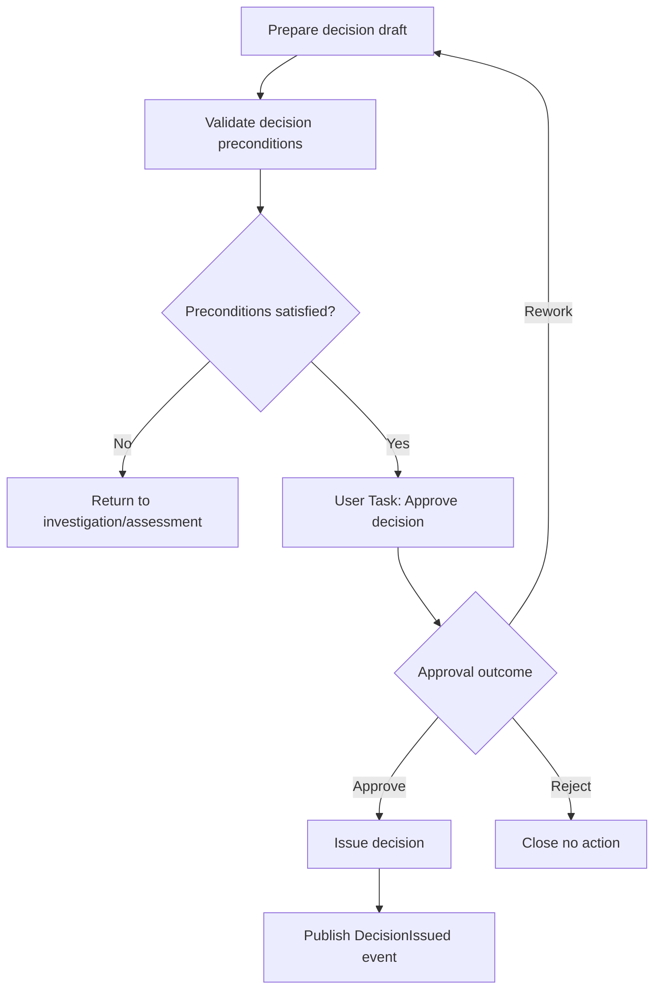

### 10.1 Decision issue harus idempotent

`Issue decision` biasanya melakukan side-effect:

- set domain case status,
- generate decision number,
- create audit record,
- notify parties,
- publish event,
- maybe create appeal window.

Jangan semua side-effect dilakukan langsung di JavaDelegate tanpa idempotency. Pola yang lebih aman:

1. Camunda service task memanggil domain service `issueDecision(caseId, commandId)`.
2. Domain service melakukan transactional update di PostgreSQL.
3. Domain service menulis outbox event.
4. Jika delegate retry, `commandId` atau business invariant mencegah double issue.
5. Kafka publisher mengirim event dari outbox.

---

## 11. Appeal Window Subprocess

Appeal window adalah contoh bagus untuk timer + message race.

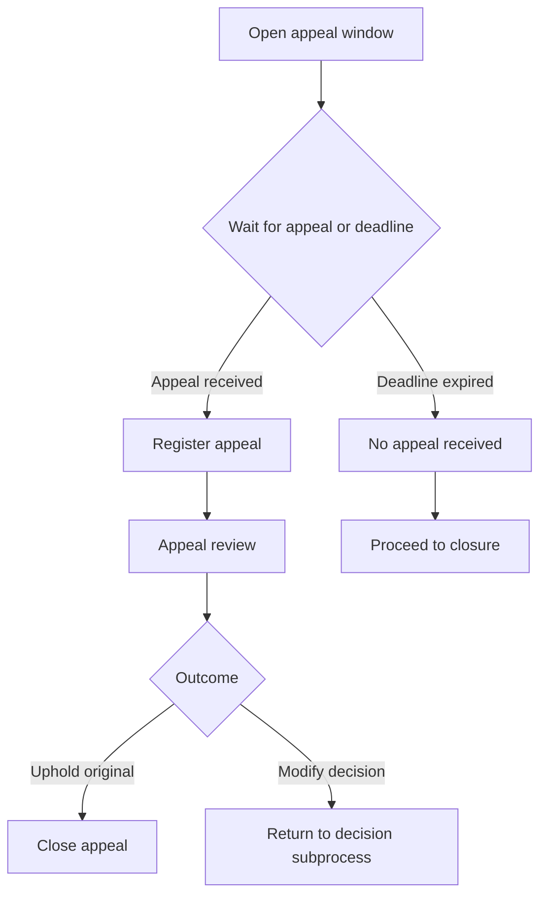

Dalam BPMN aktual, ini sering dimodelkan dengan event-based gateway atau receive task + timer boundary. Masalah pentingnya adalah race:

- appeal masuk tepat saat deadline job sedang dieksekusi,
- deadline job menang tetapi appeal sebenarnya diterima sebelum batas waktu,
- event dikirim dua kali,
- message correlation gagal karena process sudah lanjut.

Untuk mengatasinya, domain DB harus menjadi arbiter:

```text
appeal_received_at <= appeal_deadline_at
```

Jika benar, appeal valid walaupun Camunda timer sudah jalan. Jika tidak, appeal ditolak sebagai late appeal, kecuali ada policy exception.

Camunda mengatur flow. Domain rule menentukan validitas.

---

## 12. Closure Subprocess

Closure sering dianggap mudah, padahal berisi banyak invariant:

- semua required decision sudah final,
- appeal window selesai,
- outstanding task tidak ada,
- audit lengkap,
- event final diterbitkan,
- retention policy diset,
- external notification selesai atau masuk retry path,
- case search projection diperbarui.

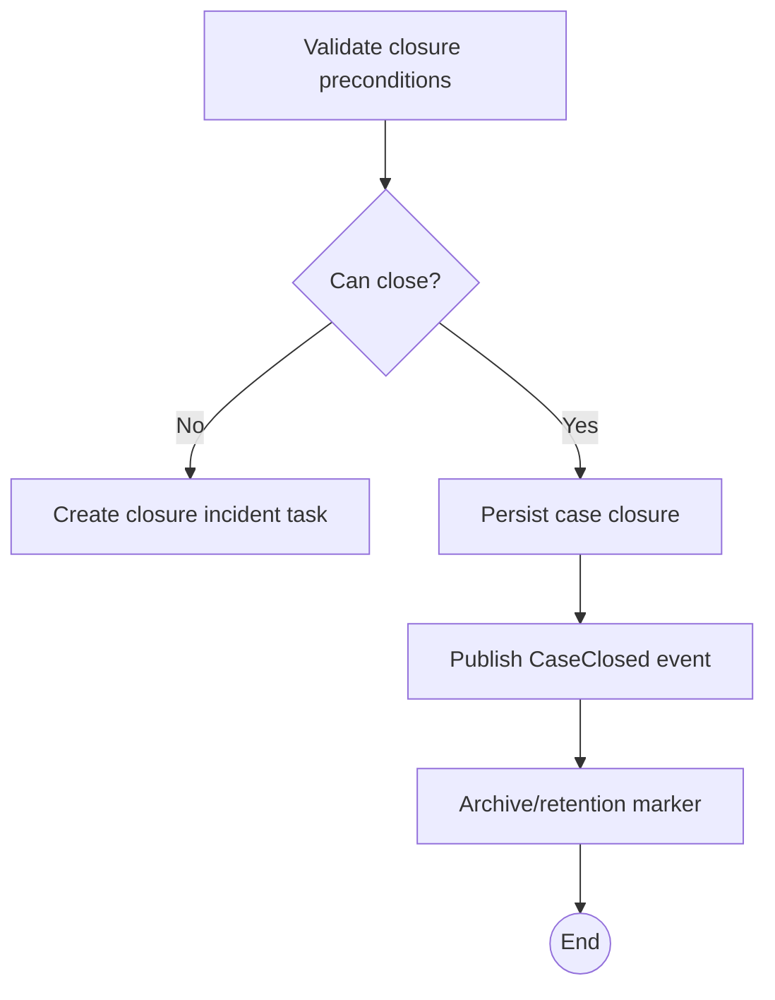

Closure tidak boleh hanya `End Event`. End event Camunda menandakan process selesai, tetapi domain closure harus dipersist dengan audit.

---

## 13. Event Subprocess untuk Cross-Cutting Event

Beberapa event bisa terjadi kapan saja selama case aktif.

Contoh:

- case withdrawn,
- legal hold applied,
- urgent public safety escalation,
- duplicate case detected,
- court order received,
- external regulator transfer requested,
- data correction submitted.

BPMN event subprocess cocok untuk ini.

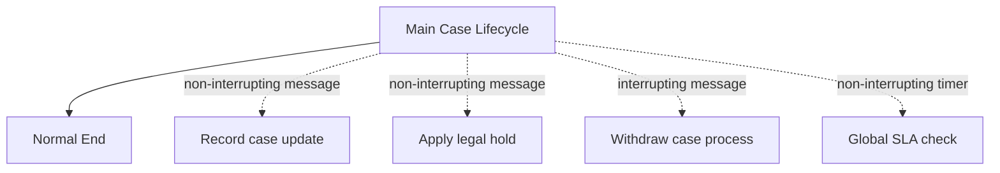

### 13.1 Interrupting vs non-interrupting

| Event | Interrupting? | Alasan |
|---|---:|---|
| Case update received | Tidak | proses utama tetap berjalan |
| Evidence submitted | Tidak | update domain state, mungkin unblock wait state |
| Legal hold applied | Biasanya tidak | dapat membatasi action tanpa membatalkan proses |
| Case withdrawn | Ya | lifecycle utama harus berhenti ke path withdrawal |
| Duplicate detected | Tergantung | bisa merge tanpa stop, atau cancel duplicate |
| Urgent escalation | Tidak | escalation berjalan paralel |

Kesalahan umum: semua event dibuat interrupting. Akibatnya proses utama berhenti hanya karena ada update minor.

---

## 14. Gateway Discipline

Gateway adalah sumber banyak bug BPMN. Gunakan dengan disiplin.

### 14.1 Exclusive gateway

Gunakan untuk keputusan satu dari beberapa path.

```text
assessmentOutcome == 'PROCEED'
assessmentOutcome == 'REQUEST_INFORMATION'
assessmentOutcome == 'CLOSE'
```

Pastikan ada default path untuk value tidak dikenal:

```text
else -> Technical Review Required / Incident
```

### 14.2 Parallel gateway

Gunakan untuk pekerjaan yang benar-benar harus semuanya selesai.

Jangan pakai parallel gateway jika:

- jumlah task dinamis besar,
- task bisa dibatalkan sebagian,
- hanya butuh first responder,
- hasil bisa datang dari event eksternal tidak deterministik.

### 14.3 Event-based gateway

Cocok untuk menunggu salah satu event:

- appeal received,
- appeal deadline expired,
- withdrawal received,
- response received,
- response deadline expired.

Namun jangan lupa domain rule untuk race. BPMN event-based gateway memilih token path berdasarkan event yang engine proses duluan, bukan selalu berdasarkan kebenaran domain temporal.

---

## 15. Timer Modeling Deep Dive

Timer bukan sekadar deadline. Timer adalah job yang akan dieksekusi engine. Di produksi, timer berarti:

- row job di Camunda DB,
- job executor mengambil job,
- kemungkinan retry jika gagal,
- clock/timezone sensitivity,
- behavior saat node restart,
- interaction dengan DB lock,
- incident jika gagal berkali-kali.

### 15.1 Timer expression strategy

Simpan deadline di domain DB:

```sql
case_core.sla_obligation(
  obligation_id,
  case_id,
  obligation_type,
  due_at,
  warning_at,
  status
)
```

BPMN timer memakai variable yang diambil dari domain DB saat memasuki wait state:

```text
${assessmentDueAt}
```

Jangan menghitung deadline kompleks di expression BPMN. Calculation harus ada di domain service agar bisa diuji dan diaudit.

### 15.2 Timer cancellation

Jika task selesai sebelum timer, interrupting timer boundary tidak berjalan. Non-interrupting timer yang sudah pernah trigger bisa membuat token tambahan. Karena itu reminder/escalation harus idempotent:

```text
sendSlaWarning(caseId, obligationId, warningType)
```

DB invariant:

```text
unique(obligation_id, warning_type)
```

---

## 16. Message Correlation Design

Message correlation adalah kontrak serius. Jangan korelasikan hanya berdasarkan variable rapuh.

Message name:

```text
InformationResponseReceived
AppealReceived
CaseWithdrawn
LegalHoldApplied
```

Correlation key:

```text
caseNumber atau caseId
```

Payload variable minimal:

```json
{
  "eventId": "evt-...",
  "caseId": "...",
  "receivedAt": "2026-07-03T09:21:00Z",
  "schemaVersion": 1
}
```

Design rule:

- Kafka event id disimpan di inbox sebelum correlation.
- Correlation dilakukan idempotently.
- Jika correlation gagal karena process belum menunggu message, event tidak langsung dibuang.
- Consumer punya retry/quarantine policy.
- Domain DB tetap menyimpan fakta event, walaupun process correlation terlambat.

---

## 17. Human Task Modeling

Human task harus dimodelkan sebagai **work contract**, bukan UI screen.

Contoh task contract:

```yaml
taskDefinitionKey: approve_decision
candidateGroups:
  - enforcement-supervisor
requiredDomainState:
  - DECISION_DRAFTED
completionCommand: ApproveDecisionCommand
allowedOutcomes:
  - APPROVE
  - REJECT
  - REWORK
requiredFields:
  - outcome
  - reasonCode
  - comment
auditLevel: LEGAL_DECISION
```

UI boleh berubah. Task contract harus stabil.

### 17.1 Claim dan complete bukan authorization final

Camunda candidate group membantu task visibility. Tetapi authorization final tetap harus dicek di application/domain layer:

- apakah user masih aktif?
- apakah user punya role pada tenant ini?
- apakah user punya conflict of interest?
- apakah case sedang legal hold?
- apakah task masih valid terhadap domain state?

Jangan menganggap `TaskService.complete()` sebagai satu-satunya guard.

---

## 18. BPMN Variable Contract

Variable adalah coupling point antara BPMN XML, Java delegate, listener, task UI, test, dan migration.

Gunakan variable registry:

| Variable | Type | Owner | Mutable? | Scope |
|---|---|---|---:|---|
| `caseId` | UUID string | domain | no | process |
| `caseNumber` | string | domain | no | process |
| `riskTier` | enum string | triage | yes | process |
| `assessmentOutcome` | enum string | assessment | yes | subprocess |
| `decisionOutcome` | enum string | decision | yes | subprocess |
| `appealDeadlineAt` | ISO instant string | SLA service | no after set | appeal subprocess |
| `schemaVersion` | int | platform | no | process |

Anti-pattern:

```json
{
  "case": {
    "all": "domain object here"
  }
}
```

Ini akan membuat migration, serialization, history, dan debugging menjadi sakit.

---

## 19. Process Versioning Strategy

Camunda deploy process definition version baru. Instance lama biasanya tetap berada pada definition version lama kecuali dimigrasikan.

Maka model BPMN harus dirancang untuk perubahan.

### 19.1 Perubahan aman

Relatif aman:

- menambah task baru di path yang belum dilalui instance baru,
- menambah optional non-interrupting event subprocess,
- memperbaiki label/description,
- menambah variable optional dengan default,
- menambah retry config pada activity tertentu untuk versi baru.

Berisiko:

- menghapus activity yang sedang ditempati instance lama,
- mengganti taskDefinitionKey,
- mengganti message name,
- mengganti business key strategy,
- mengubah gateway condition tanpa compatibility,
- mengubah variable type.

### 19.2 Stabilkan identifier

Identifier yang harus dianggap kontrak:

- process key,
- activity id,
- task definition key,
- message name,
- error code,
- signal name jika dipakai,
- external task topic,
- variable name.

Nama label boleh berubah. ID jangan berubah sembarangan.

---

## 20. Modeling Failure: Business Error vs Technical Incident

Business error adalah hasil proses yang diharapkan sebagai cabang bisnis.

Contoh:

- submission invalid,
- information insufficient,
- appeal late,
- decision rejected,
- duplicate case,
- authorization denied untuk action tertentu.

Technical incident adalah kegagalan eksekusi:

- DB timeout,
- Kafka unavailable,
- delegate exception,
- serialization error,
- deadlock unretried,
- external service 503,
- Camunda job failed after retries.

BPMN harus memodelkan business error sebagai flow. Technical error biarkan menjadi retry/incident kecuali ada kompensasi bisnis eksplisit.

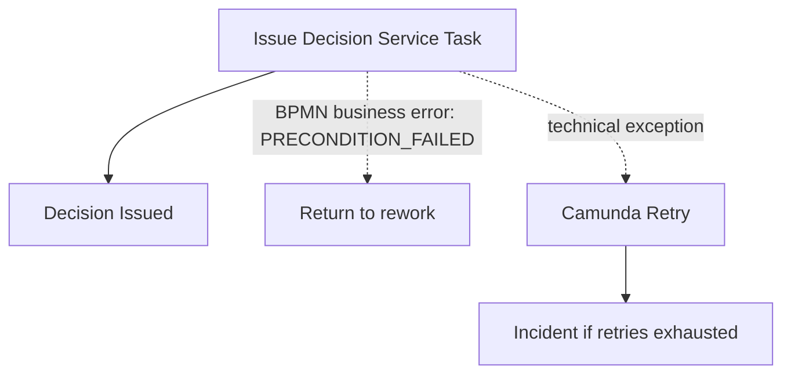

---

## 21. Capstone BPMN Shape

Berikut bentuk konseptual final untuk lifecycle case.

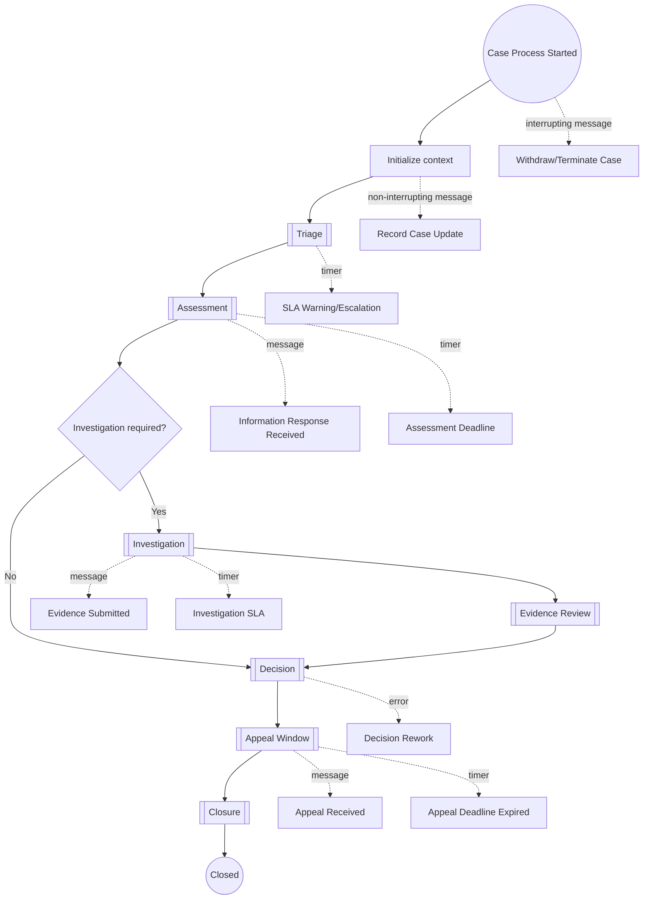

Diagram ini bukan final BPMN XML. Ini blueprint mental. BPMN aktual harus dibuat dengan ID stabil, event names eksplisit, async boundary yang dipilih, dan test coverage.

---

## 22. Implementation Skeleton

Contoh package/module yang terkait Part 027:

```text
case-process-camunda/
  src/main/resources/bpmn/
    reg-enforcement-case-lifecycle.bpmn
  src/main/java/com/acme/regtech/process/
    CaseProcessVariables.java
    CaseProcessMessages.java
    CaseProcessKeys.java
    delegate/
      InitializeCaseProcessDelegate.java
      PersistTriageResultDelegate.java
      PersistAssessmentResultDelegate.java
      IssueDecisionDelegate.java
      CloseCaseDelegate.java
    correlation/
      CaseMessageCorrelationService.java
    task/
      CaseTaskQueryService.java
      CaseTaskCompletionService.java
```

Konstanta process jangan tersebar sebagai string literal:

```java
public final class CaseProcessKeys {
  public static final String PROCESS_KEY = "reg_enforcement_case_lifecycle";

  public static final String TASK_MANUAL_TRIAGE = "manual_triage_review";
  public static final String TASK_ASSESS_CASE = "assess_case_sufficiency";
  public static final String TASK_APPROVE_DECISION = "approve_decision";

  public static final String MESSAGE_INFORMATION_RESPONSE_RECEIVED = "InformationResponseReceived";
  public static final String MESSAGE_APPEAL_RECEIVED = "AppealReceived";
  public static final String MESSAGE_CASE_WITHDRAWN = "CaseWithdrawn";

  private CaseProcessKeys() {}
}
```

Variable wrapper:

```java
public record CaseProcessContext(
    String caseId,
    String caseNumber,
    String tenantId,
    String caseType,
    String riskTier,
    int schemaVersion
) {}
```

Mapping variable harus eksplisit:

```java
public final class CaseProcessVariables {
  public static final String CASE_ID = "caseId";
  public static final String CASE_NUMBER = "caseNumber";
  public static final String TENANT_ID = "tenantId";
  public static final String CASE_TYPE = "caseType";
  public static final String RISK_TIER = "riskTier";
  public static final String SCHEMA_VERSION = "schemaVersion";

  private CaseProcessVariables() {}
}
```

---

## 23. Testing BPMN Model

BPMN model harus punya test seperti code.

Test minimal:

| Test | Tujuan |
|---|---|
| process starts with valid variables | memastikan start contract benar |
| invalid variable set rejected by delegate/domain | mencegah silent corruption |
| triage proceed path | happy path triage |
| triage reject path | administrative closure |
| assessment request info path | wait for message |
| information response correlation | message correlation works |
| assessment timer escalation | timer path works |
| investigation required path | route correct |
| decision approve path | issue decision idempotent |
| appeal deadline path | timer to closure |
| appeal received before deadline | appeal review path |
| withdrawal event | interrupting termination path |
| technical delegate failure | retry/incident behavior |

Jangan hanya test happy path. BPMN bug paling mahal biasanya ada di timeout, cancellation, parallel join, dan migration.

---

## 24. Production Checklist

Sebelum BPMN lifecycle masuk production:

- [ ] Process key stabil.
- [ ] Activity IDs tidak autogenerated random.
- [ ] Task definition keys stabil dan terdokumentasi.
- [ ] Message names stabil dan cocok dengan event contract.
- [ ] Variable registry tersedia.
- [ ] Semua gateway punya default path atau explicit fallback.
- [ ] Timer expression berasal dari persisted SLA policy.
- [ ] Human task completion melewati domain authorization.
- [ ] Business error dimodelkan sebagai flow.
- [ ] Technical exception menjadi retry/incident.
- [ ] Long-running service task diberi async boundary sesuai kebutuhan.
- [ ] Domain state tidak disimpan penuh di process variables.
- [ ] Correlation consumer idempotent.
- [ ] BPMN model punya automated tests.
- [ ] Migration impact dianalisis sebelum deploy.
- [ ] Operator punya runbook untuk incident, stuck task, failed job, dan failed correlation.

---

## 25. Anti-Pattern

### 25.1 BPMN sebagai big-ball-of-mud domain model

Gejala:

- semua business rule ada di gateway expression,
- process variable berisi object besar,
- setiap perubahan domain harus edit BPMN,
- user task form menulis langsung ke variable tanpa domain validation.

Akibat:

- audit lemah,
- test sulit,
- migration sulit,
- production incident sulit ditriage.

### 25.2 BPMN terlalu abstrak

Gejala:

- diagram hanya berisi `Process Case`, `Review`, `Complete`,
- tidak ada message/timer/user task nyata,
- tidak mencerminkan wait state,
- tidak bisa dieksekusi tanpa logic tersembunyi besar.

Akibat:

- BPMN menjadi dokumentasi palsu,
- logic pindah ke Java secara tidak terkendali,
- process owner tidak bisa membaca sistem nyata.

### 25.3 Semua event interrupting

Akibat:

- update minor membatalkan pekerjaan utama,
- token hilang,
- user task tiba-tiba lenyap,
- operator kehilangan konteks.

### 25.4 Timer tanpa domain SLA record

Akibat:

- deadline sulit diaudit,
- perubahan SLA sulit dijelaskan,
- race condition dengan manual extension,
- dispute hukum sulit ditangani.

---

## 26. Practical Assignment

Buat BPMN blueprint untuk `reg_enforcement_case_lifecycle` dengan minimal:

1. top-level process,
2. triage subprocess,
3. assessment subprocess dengan request info + timer,
4. investigation subprocess,
5. decision subprocess,
6. appeal window dengan message + timer,
7. closure subprocess,
8. event subprocess untuk withdrawal,
9. non-interrupting event untuk case update,
10. variable registry.

Lalu jawab pertanyaan ini:

- event mana yang interrupting dan kenapa?
- task mana yang human task dan siapa candidate group-nya?
- gateway mana yang membaca hasil domain decision, bukan menghitung rule langsung?
- apa business key proses?
- variable apa yang boleh disimpan di Camunda?
- state apa yang wajib tetap di PostgreSQL?
- incident apa yang mungkin muncul?
- bagaimana operator memperbaikinya?

---

## 27. Ringkasan

BPMN production-grade bukan soal menggambar proses sebanyak mungkin. BPMN production-grade adalah seni memilih **control flow yang memang perlu diorkestrasi**.

Dalam enforcement case platform:

- Camunda memodelkan lifecycle, wait state, timer, human task, message correlation, retry, dan incident.
- PostgreSQL memegang domain truth, audit, SLA obligation, evidence, decision, outbox, dan inbox.
- Kafka membawa event integration.
- HTTP API membawa command/query contract.
- Java delegate hanya glue code kecil yang memanggil domain service idempotent.

Jika kamu memodelkan wait state dengan benar, menstabilkan identifier, menjaga variable kecil, dan memisahkan business error dari technical incident, BPMN menjadi executable architecture. Jika tidak, BPMN menjadi diagram mahal yang menyembunyikan failure.

Part berikutnya akan turun ke implementasi: **Camunda Service Task and Worker Patterns**. Di sana kita akan membahas JavaDelegate, external task style, retry, BPMN error, incident, idempotency, transaction boundary, dan worker design yang aman untuk produksi.
