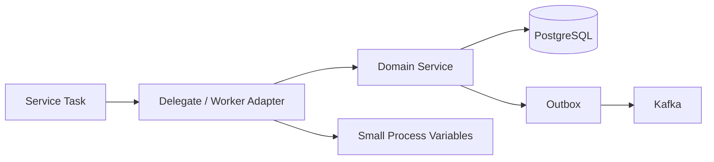
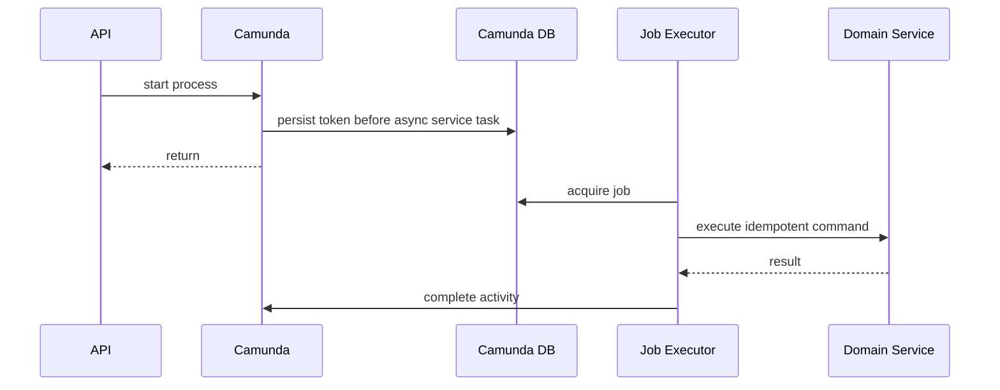
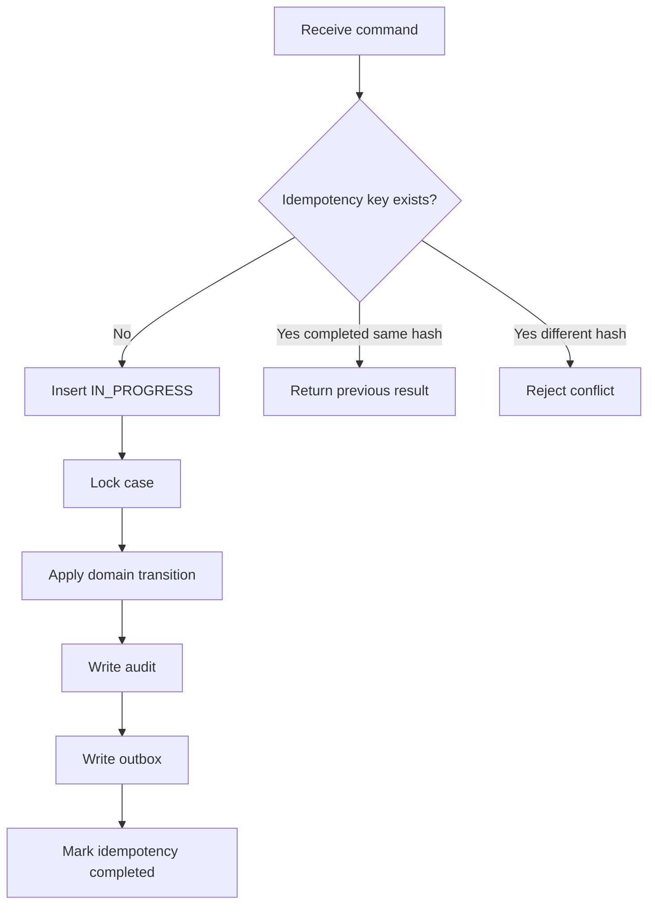
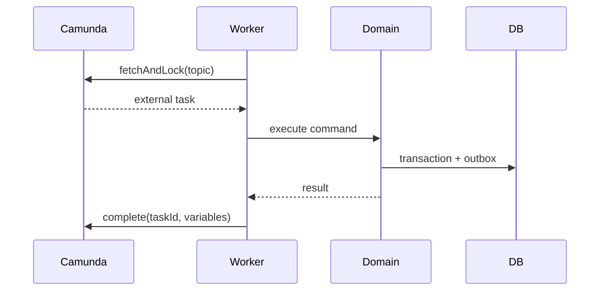
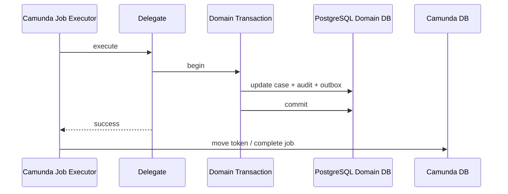
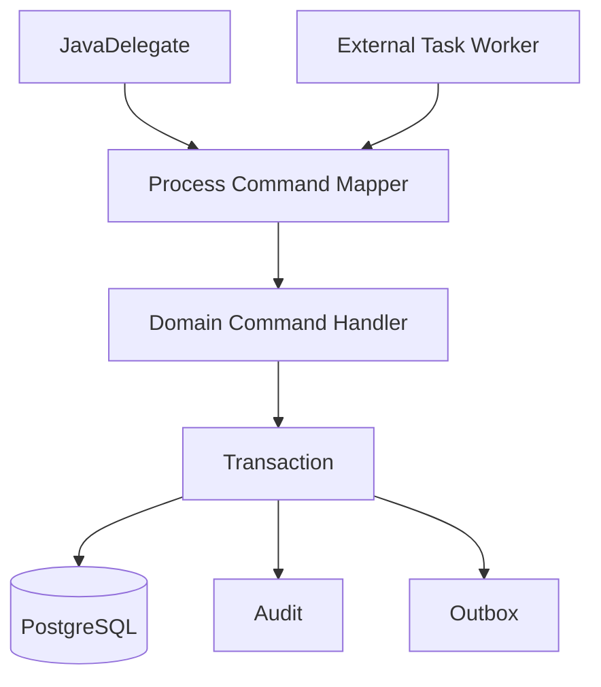
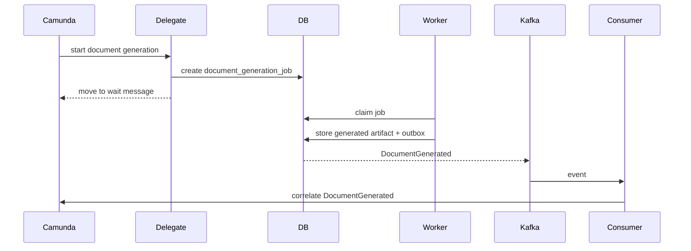

# Part 028 — Camunda Service Task and Worker Patterns

Part 027 memodelkan lifecycle case dalam BPMN. Sekarang kita masuk ke bagian yang paling sering membuat sistem Camunda gagal di produksi: **service task dan worker implementation**.

Service task terlihat sederhana: BPMN node memanggil kode Java, kode melakukan sesuatu, lalu proses lanjut. Di produksi, node kecil itu bisa membawa risiko besar:

- double side-effect karena retry,
- transaksi domain dan transaksi Camunda bercampur,
- HTTP call eksternal menggantung job executor,
- BPMN error dipakai untuk technical failure,
- Java exception dipakai untuk business branch,
- process variable bengkak,
- incident tidak punya runbook,
- worker tidak idempotent,
- timeout tidak selaras dari NGINX sampai database,
- deploy versi baru mematahkan instance lama.

Target part ini: membuat pola service task/worker yang **deterministic, idempotent, observable, recoverable, dan compatible dengan contract-first architecture**.

---

## 1. Mental Model: Service Task Bukan Tempat Business Logic Besar

Service task sebaiknya dianggap sebagai **orchestration adapter**.



Service task melakukan glue:

- membaca process variables kecil,
- membentuk command idempotent,
- memanggil domain service,
- menerjemahkan result menjadi variable/output process,
- melempar BPMN error untuk business branch yang memang dimodelkan,
- melempar exception untuk technical failure agar Camunda retry/incident bekerja.

Service task tidak boleh menjadi:

- tempat query bisnis kompleks tanpa domain boundary,
- tempat menyimpan domain object ke variable,
- tempat melakukan side-effect tanpa idempotency,
- tempat memanggil banyak external system tanpa timeout dan circuit policy,
- tempat menangkap semua exception lalu proses lanjut seolah sukses.

---

## 2. Dua Pola Utama: JavaDelegate vs External Task

Camunda 7 menyediakan beberapa cara menghubungkan BPMN dengan kode. Dalam seri ini kita fokus pada dua pola utama:

| Pola | Cara kerja | Cocok untuk |
|---|---|---|
| JavaDelegate / delegate expression | Engine memanggil Java code dalam aplikasi/engine JVM | logic lokal, low-latency, satu deployment boundary, domain service di JVM sama |
| External Task | Worker eksternal polling task dari engine, execute, lalu complete/fail | polyglot, service terpisah, scaling per task, isolasi dari engine thread |

Camunda best practice menyebut dua pola push/pull: engine dapat mendorong work lewat delegate/script, atau external worker menarik work melalui external task. Untuk banyak kasus, external task memberi decoupling dan scaling per topic, sedangkan JavaDelegate cocok saat logic berada di JVM yang sama dan boundary-nya terkendali.

---

## 3. Decision Matrix

Jangan memilih pola berdasarkan selera. Pilih berdasarkan failure mode.

| Kriteria | JavaDelegate | External Task |
|---|---:|---:|
| Domain service berada dalam aplikasi yang sama | Kuat | Bisa, tapi berlebihan |
| Butuh scaling per activity | Sedang | Kuat |
| Butuh polyglot worker | Lemah | Kuat |
| Butuh isolasi dari engine thread | Lemah-sedang | Kuat |
| Latency sangat rendah | Kuat | Sedang |
| Operasi worker independen | Lemah | Kuat |
| Transaksi domain dekat engine | Kuat tapi risk coupling | Lebih eksplisit |
| Risiko blocking job executor | Tinggi jika salah | Lebih terkendali |
| Simplicity awal | Kuat | Sedang |

Rule praktis untuk platform kita:

- gunakan **JavaDelegate** untuk glue pendek ke domain service lokal yang cepat, idempotent, dan tidak melakukan remote call panjang,
- gunakan **External Task** untuk pekerjaan yang lama, remote, membutuhkan scaling terpisah, atau berinteraksi dengan sistem eksternal yang sering gagal,
- jangan mencampur dua pola untuk activity yang sama tanpa alasan jelas,
- semua pola tetap harus idempotent.

---

## 4. JavaDelegate Pattern

Contoh service task: `Issue Decision`.

BPMN service task memanggil delegate:

```text
activityId: issue_decision
delegateExpression: ${issueDecisionDelegate}
asyncBefore: true
failedJobRetryTimeCycle: R3/PT5M
```

Delegate skeleton:

```java
public final class IssueDecisionDelegate implements JavaDelegate {
  private final DecisionApplicationService decisionService;

  public IssueDecisionDelegate(DecisionApplicationService decisionService) {
    this.decisionService = decisionService;
  }

  @Override
  public void execute(DelegateExecution execution) throws Exception {
    String caseId = requiredString(execution, "caseId");
    String caseNumber = requiredString(execution, "caseNumber");
    String commandId = commandId(execution, "issue_decision");

    IssueDecisionCommand command = new IssueDecisionCommand(
        commandId,
        caseId,
        caseNumber,
        Instant.now()
    );

    IssueDecisionResult result = decisionService.issueDecision(command);

    switch (result.status()) {
      case ISSUED -> {
        execution.setVariable("decisionIssued", true);
        execution.setVariable("decisionNumber", result.decisionNumber());
      }
      case PRECONDITION_FAILED -> {
        throw new BpmnError("DECISION_PRECONDITION_FAILED", result.reason());
      }
      case BUSINESS_REWORK_REQUIRED -> {
        throw new BpmnError("DECISION_REWORK_REQUIRED", result.reason());
      }
    }
  }
}
```

### 4.1 Delegate harus tipis

Delegate tidak boleh mengeksekusi SQL langsung jika sudah ada domain service. Ia hanya melakukan mapping:

```text
process variables -> command -> domain service -> result -> process variables / BPMN error
```

Jika delegate lebih dari beberapa puluh baris dan mulai punya branching kompleks, kemungkinan logic domain bocor ke workflow adapter.

### 4.2 Jangan swallow exception

Buruk:

```java
try {
  decisionService.issueDecision(command);
} catch (Exception e) {
  log.error("failed", e);
  execution.setVariable("decisionIssued", false);
}
```

Ini membuat proses lanjut dalam kondisi palsu. Technical failure harus tetap menjadi exception agar Camunda retry atau incident.

Lebih baik:

```java
try {
  decisionService.issueDecision(command);
} catch (TransientDatabaseException e) {
  throw e; // Camunda retry
} catch (ExternalDependencyUnavailableException e) {
  throw e; // Camunda retry / incident
} catch (DecisionPreconditionException e) {
  throw new BpmnError("DECISION_PRECONDITION_FAILED", e.getMessage());
}
```

---

## 5. BPMN Error vs Java Exception

Ini invariant penting.

| Kondisi | Mekanisme | Efek |
|---|---|---|
| Business branch yang diharapkan | `BpmnError` | ditangkap boundary error event / error subprocess |
| Technical transient failure | Java exception | job retry |
| Technical permanent failure | Java exception sampai retry habis | incident |
| Validation bug/programming bug | Java exception | incident |
| Authorization failure saat human action | domain error sebelum complete task | HTTP error, task tetap aktif |
| Late appeal | business result | BPMN branch atau domain rejection |

Contoh business error:

```java
throw new BpmnError("INFORMATION_INSUFFICIENT", "Case lacks required evidence");
```

Contoh technical exception:

```java
throw new KafkaPublishUnavailableException("outbox publisher unavailable");
```

Jangan memakai BPMN error untuk database timeout. Jangan memakai Java exception untuk decision outcome normal.

---

## 6. Async Continuation Pattern

Tanpa async boundary, sebagian eksekusi proses berjalan dalam transaksi yang sama dengan pemanggil engine. Async continuation membuat transaction boundary dan job yang dieksekusi job executor.

Praktisnya:

- `asyncBefore` membuat engine commit state sebelum activity dijalankan job executor,
- `asyncAfter` membuat engine commit setelah activity, lalu lanjut via job,
- failed async job bisa retry,
- incident muncul jika retry habis.

Gunakan `asyncBefore` pada service task yang:

- melakukan side-effect,
- memanggil domain service dengan DB transaction,
- mungkin gagal transient,
- harus observable sebagai job,
- tidak boleh menggagalkan HTTP request awal terlalu lama.



### 6.1 Async boundary bukan pengganti idempotency

Jika job gagal setelah domain side-effect berhasil tetapi sebelum Camunda commit lanjut, Camunda bisa retry. Maka domain command harus idempotent.

---

## 7. Idempotent Command Pattern

Setiap service task yang melakukan side-effect harus punya `commandId` stabil.

Contoh command id:

```text
<processInstanceId>:<activityId>:<businessActionVersion>
```

Atau lebih domain-centric:

```text
CASE-2026-00000123:ISSUE_DECISION:v1
```

Tabel idempotency:

```sql
create table integration.idempotency_record (
  idempotency_key text primary key,
  operation_name text not null,
  request_hash text not null,
  status text not null,
  result_ref text,
  created_at timestamptz not null default now(),
  completed_at timestamptz
);
```

Domain service flow:



Idempotency bukan optional. Camunda retry, Kubernetes restart, DB failover, network timeout, dan manual incident retry semuanya bisa mengulang eksekusi.

---

## 8. External Task Pattern

External task cocok untuk worker yang dipisahkan dari process engine.



Worker loop perlu menangani:

- fetch and lock,
- lock duration,
- command idempotency,
- complete success,
- handle failure with retries,
- handle BPMN error for business branch,
- metrics,
- shutdown.

Pseudo-code:

```java
while (running) {
  List<ExternalTask> tasks = client.fetchAndLock("issue-decision", maxTasks);

  for (ExternalTask task : tasks) {
    try {
      WorkerCommand command = map(task);
      WorkerResult result = handler.handle(command);

      if (result.businessError().isPresent()) {
        externalTaskService.handleBpmnError(
            task,
            result.businessError().get().code(),
            result.businessError().get().message()
        );
      } else {
        externalTaskService.complete(task, result.variables());
      }
    } catch (RetryableException e) {
      externalTaskService.handleFailure(task, e.getMessage(), stack(e), retries(task), retryTimeout(e));
    } catch (Exception e) {
      externalTaskService.handleFailure(task, e.getMessage(), stack(e), 0, 0L);
    }
  }
}
```

### 8.1 Lock duration

Lock duration harus lebih panjang dari expected execution time, tetapi tidak terlalu panjang hingga recovery lambat jika worker mati.

Jika task memerlukan 30 detik rata-rata:

```text
lockDuration = 2-3 minutes
worker timeout = 60 seconds
retry timeout = 5 minutes
```

Jika pekerjaan bisa lama, jangan tahan external task lock terlalu lama tanpa heartbeat/extend lock strategy. Lebih baik pecah menjadi command yang cepat atau pindahkan long-running work ke domain job dengan callback/message correlation.

---

## 9. Worker Failure Matrix

| Failure | Apa yang terjadi | Pola penanganan |
|---|---|---|
| Worker mati sebelum domain side-effect | lock expired | task diambil worker lain |
| Worker mati setelah side-effect sebelum complete | task diulang | idempotency return previous result, lalu complete |
| Camunda complete timeout | worker tidak tahu sukses/gagal | retry complete atau rely on idempotency + query |
| Domain DB timeout | no side-effect or uncertain | retryable exception, idempotency check |
| Business precondition failed | expected branch | BPMN error |
| Poison task | selalu gagal karena data buruk | retries exhausted, incident/manual repair |
| Process instance migrated | variable/topic mismatch | compatibility layer atau incident |

Worker harus didesain untuk **at-least-once execution**. Jangan pernah menganggap task hanya dieksekusi sekali.

---

## 10. Transaction Boundary dengan Domain DB

Camunda DB dan domain DB bisa sama server/schema atau berbeda. Apa pun pilihannya, jangan mengandalkan distributed transaction dua database.

### 10.1 JavaDelegate dengan domain transaction



Jika domain commit sukses lalu Camunda commit gagal, job bisa retry. Idempotency wajib.

### 10.2 External task complete after domain commit

Sama juga:

1. worker execute domain transaction,
2. worker complete external task,
3. jika complete gagal/timeout, task bisa diulang,
4. idempotency mencegah double effect.

Tidak ada exactly-once antar Camunda dan domain DB tanpa kompleksitas distributed transaction. Desain yang benar adalah **effectively-once melalui idempotency + reconciliation**.

---

## 11. Retry Strategy

Retry harus berbeda antara technical transient, technical permanent, dan business outcome.

### 11.1 Camunda failed job retry

Untuk JavaDelegate async service task, failed job retry bisa dikonfigurasi di BPMN extension.

Contoh policy:

```text
R3/PT5M
```

Artinya retry 3 kali dengan interval 5 menit. Pilih berdasarkan dependency:

| Dependency | Retry policy awal |
|---|---|
| PostgreSQL deadlock/serialization failure | cepat, beberapa kali |
| temporary DB connection issue | backoff sedang |
| external HTTP 503 | backoff lebih panjang |
| validation/programming bug | retry rendah atau langsung incident |
| rate limited external service | retry setelah reset window |

### 11.2 External task retry

External task worker mengontrol retries saat `handleFailure`.

Rule:

- decrement retry hanya untuk error yang memang retryable,
- jangan retry business error,
- simpan error code structured,
- emit metric by topic/error code,
- beri retry timeout eksplisit.

---

## 12. Incident Design

Incident bukan sekadar error. Incident adalah **operational work item**.

Incident harus memberi operator:

- process instance id,
- business key/case number,
- activity id,
- error code,
- technical message yang aman,
- correlation id,
- last command id,
- retry count,
- runbook link,
- domain state summary.

Structured log saat failure:

```json
{
  "event": "camunda_service_task_failed",
  "processKey": "reg_enforcement_case_lifecycle",
  "processInstanceId": "...",
  "businessKey": "CASE-2026-00000123",
  "activityId": "issue_decision",
  "commandId": "CASE-2026-00000123:ISSUE_DECISION:v1",
  "errorCode": "DB_TIMEOUT",
  "retryable": true,
  "correlationId": "..."
}
```

Incident runbook harus menjawab:

- apakah aman retry manual?
- bagaimana cek domain side-effect sudah terjadi?
- query apa untuk melihat idempotency record?
- apakah outbox sudah ada?
- apakah process variable perlu repair?
- siapa owner business process?

---

## 13. Service Task Catalog

Untuk platform enforcement, buat catalog activity.

| Activity ID | Pattern | Side-effect? | Idempotency key | Error model |
|---|---|---:|---|---|
| `initialize_case_process` | JavaDelegate | no/minor | process start | exception -> incident |
| `persist_triage_result` | JavaDelegate | yes | case triage command | BPMN business error / retry |
| `send_information_request` | External Task | yes | request info command | retry / incident |
| `persist_assessment_result` | JavaDelegate | yes | assessment command | BPMN branch |
| `prepare_investigation` | JavaDelegate | yes | investigation start | retry |
| `generate_evidence_bundle` | External Task | yes/long | bundle command | retry / incident |
| `issue_decision` | JavaDelegate or External Task | yes | issue decision command | BPMN precondition error / retry |
| `send_decision_notification` | External Task | yes remote | notification command | retry / DLQ-style incident |
| `close_case` | JavaDelegate | yes | close case command | retry / incident |

Catalog ini menjadi kontrak antara BPMN, Java code, operations, dan tests.

---

## 14. Variable Mapping Pattern

Jangan biarkan delegate mengambil variable langsung secara acak.

Gunakan helper:

```java
public final class ProcessVariableReader {
  public String requiredString(DelegateExecution execution, String name) {
    Object value = execution.getVariable(name);
    if (value == null) {
      throw new MissingProcessVariableException(name);
    }
    if (!(value instanceof String s) || s.isBlank()) {
      throw new InvalidProcessVariableException(name, "expected non-blank string");
    }
    return s;
  }

  public Instant requiredInstant(DelegateExecution execution, String name) {
    String value = requiredString(execution, name);
    return Instant.parse(value);
  }
}
```

Missing variable adalah technical/modeling incident, bukan business branch. Jangan lanjut dengan default palsu.

Output variable juga harus eksplisit:

```java
execution.setVariable("assessmentOutcome", result.outcome().name());
execution.setVariable("assessmentCompletedAt", result.completedAt().toString());
```

Jangan set variable object kompleks kecuali sangat terkendali.

---

## 15. Command Handler Pattern

Baik JavaDelegate maupun external worker sebaiknya memanggil command handler yang sama.



Keuntungan:

- logic domain tidak tergantung Camunda API,
- bisa dites tanpa engine,
- external task dan JavaDelegate bisa berbagi domain behavior,
- migration dari JavaDelegate ke external task lebih mudah.

---

## 16. Side-Effect Taxonomy

Tidak semua side-effect sama.

| Side-effect | Risiko | Pola |
|---|---|---|
| DB state transition | duplicate update, race | transaction + lock + idempotency |
| audit append | duplicate audit | idempotency or natural unique key |
| outbox insert | duplicate event | unique event key |
| email/notification | duplicate send | notification command id + provider idempotency if possible |
| external API call | uncertain result | outbox/saga callback, reconciliation |
| document generation | expensive duplicate | content hash + artifact table |
| Camunda message correlation | not waiting/duplicate | inbox + retry/quarantine |

Prinsip: service task boleh memicu side-effect hanya jika side-effect punya **dedupe strategy**.

---

## 17. Long-Running Work Pattern

Jangan jalankan pekerjaan 10 menit di JavaDelegate sinkron. Untuk long-running work:

1. service task membuat domain job,
2. process menunggu message,
3. worker eksternal memproses job,
4. worker mengirim event/callback,
5. Kafka consumer mengorelasikan message ke Camunda.



Ini lebih operasional daripada menahan job executor thread lama.

---

## 18. External HTTP Call Pattern

Jika service task harus memanggil service eksternal, jangan lakukan tanpa boundary.

Checklist:

- timeout connect/read/write eksplisit,
- retry hanya untuk safe operation,
- idempotency key dikirim ke service eksternal jika didukung,
- circuit breaker atau bulkhead jika dependency flakey,
- response disimpan di DB/audit,
- error diklasifikasi,
- no sensitive data in logs,
- reconciliation job untuk uncertain outcome.

Untuk action kritikal seperti notification atau regulatory transfer, outbox lebih aman daripada direct call dari delegate.

---

## 19. Outbox Integration from Service Task

Banyak service task perlu menerbitkan event. Jangan publish langsung ke Kafka dari delegate sebagai bagian dari process step.

Buruk:

```java
caseRepository.updateStatus(caseId, "DECISION_ISSUED");
kafkaProducer.send("case-events", event);
```

Jika update sukses tetapi send gagal, state dan event tidak sinkron. Lebih baik:

```java
transactionTemplate.execute(tx -> {
  caseRepository.issueDecision(command);
  auditRepository.append(...);
  outboxRepository.insert("DecisionIssued", payload);
});
```

Outbox publisher yang terpisah mengirim ke Kafka. Camunda delegate hanya menerima result domain.

---

## 20. Worker Observability

Metrics minimal:

| Metric | Label |
|---|---|
| `camunda_delegate_execution_total` | activityId, outcome |
| `camunda_delegate_execution_duration_seconds` | activityId |
| `camunda_delegate_failure_total` | activityId, errorCode, retryable |
| `external_task_fetched_total` | topic |
| `external_task_completed_total` | topic |
| `external_task_failed_total` | topic, errorCode |
| `external_task_bpmn_error_total` | topic, errorCode |
| `process_message_correlation_failed_total` | messageName, reason |

Logs harus mengandung:

- correlation id,
- tenant id,
- case number,
- process instance id,
- activity id,
- command id,
- error code.

Trace span:

```text
HTTP request -> domain command -> Camunda start/correlation -> delegate/worker -> DB transaction -> outbox publish -> Kafka consumer
```

---

## 21. Graceful Shutdown

Di Kubernetes, pod bisa dihentikan saat sedang menjalankan delegate/worker.

### 21.1 JavaDelegate/job executor

Pastikan:

- aplikasi menerima SIGTERM,
- readiness turun sebelum shutdown,
- job executor diberi waktu menyelesaikan job berjalan,
- transaction timeout lebih pendek dari termination grace period,
- job failure dapat retry setelah restart.

### 21.2 External worker

Saat shutdown:

1. stop fetch task baru,
2. selesaikan task yang sedang diproses jika cukup waktu,
3. jika tidak, biarkan lock expired,
4. jangan complete task setelah context sudah tidak valid,
5. metric shutdown reason.

External task pattern lebih mudah di-scale, tetapi butuh lock duration dan shutdown discipline.

---

## 22. Testing Service Task

Layer test:

| Test | Scope |
|---|---|
| command handler unit test | domain behavior tanpa Camunda |
| delegate unit test | variable mapping + result mapping |
| BPMN path test | process flow dan BPMN error |
| integration test with PostgreSQL | transaction/idempotency/outbox |
| retry test | exception menyebabkan retry/incident |
| external task worker test | fetch/handle/complete/fail behavior |
| chaos test | worker dies after side-effect |

Contoh test case penting:

```text
Given issue_decision delegate executes
And domain command commits successfully
And Camunda job completion fails
When job is retried
Then domain service returns previous idempotent result
And process moves forward without duplicate decision/audit/event
```

Ini test produksi yang jauh lebih penting daripada sekadar “delegate calls service once”.

---

## 23. Failure Drills

Latih skenario ini:

### Drill 1 — Delegate DB timeout

Expected:

- job retry,
- no domain partial write,
- structured log,
- metric failure increment,
- incident jika retries habis.

### Drill 2 — Domain commit success, Camunda completion failure

Expected:

- retry safe,
- idempotency returns same result,
- no duplicate outbox,
- process eventually progresses.

### Drill 3 — External worker killed after side-effect

Expected:

- lock expires,
- another worker picks task,
- idempotency prevents duplicate,
- task completes.

### Drill 4 — Business precondition failure

Expected:

- BPMN error caught,
- process goes to rework path,
- no incident,
- audit entry exists.

### Drill 5 — Poison variable after bad deployment

Expected:

- incident with missing/invalid variable,
- no silent default,
- repair procedure available,
- compatibility test added.

---

## 24. Anti-Pattern

### 24.1 Fat delegate

Delegate berisi query, rule, API call, retry loop, Kafka publish, dan variable mutation sekaligus.

Akibat:

- sulit dites,
- sulit retry aman,
- domain behavior tersembunyi,
- incident tidak jelas,
- migration sulit.

### 24.2 Catch-all and continue

Semua exception ditangkap, log error, proses lanjut.

Akibat:

- data rusak tanpa incident,
- operator tidak tahu ada failure,
- downstream menerima event palsu.

### 24.3 BPMN error untuk semua error

Database timeout dilempar sebagai `BpmnError` dan proses masuk branch bisnis.

Akibat:

- technical failure terlihat seperti business decision,
- audit menipu,
- retry hilang.

### 24.4 No idempotency because “Camunda retries are controlled”

Retry bisa terjadi dari banyak sumber: job retry, worker restart, network timeout, manual retry, redeploy, failover. Tanpa idempotency, side-effect akan ganda.

### 24.5 Publish Kafka directly from delegate

Jika publish gagal setelah domain update, state tidak sinkron. Gunakan outbox.

---

## 25. Production Checklist

Untuk setiap service task/worker:

- [ ] Activity ID stabil.
- [ ] Pattern dipilih: JavaDelegate atau External Task.
- [ ] Owner jelas.
- [ ] Input variable contract terdokumentasi.
- [ ] Output variable contract terdokumentasi.
- [ ] Domain command idempotent.
- [ ] Command ID stabil.
- [ ] Business errors dipetakan ke BPMN error code.
- [ ] Technical errors dibiarkan menjadi retry/incident.
- [ ] Retry policy eksplisit.
- [ ] Timeout eksplisit.
- [ ] Side-effect memakai DB transaction/outbox/inbox bila perlu.
- [ ] Logging structured.
- [ ] Metrics tersedia.
- [ ] Runbook tersedia.
- [ ] Unit test delegate/worker tersedia.
- [ ] Integration test idempotency tersedia.
- [ ] Failure drill minimal sudah diuji.

---

## 26. Practical Assignment

Implementasikan tiga activity dari lifecycle case:

1. `persist_triage_result` sebagai JavaDelegate.
2. `send_information_request` sebagai External Task worker.
3. `issue_decision` sebagai JavaDelegate dengan BPMN error untuk precondition failure.

Untuk masing-masing, buat:

- input variable contract,
- output variable contract,
- command object,
- idempotency key,
- retry policy,
- error mapping,
- observability fields,
- test matrix,
- failure drill.

Kemudian jawab:

- activity mana yang melakukan side-effect?
- apa yang terjadi jika activity dieksekusi dua kali?
- apa yang terjadi jika domain commit sukses tetapi Camunda complete gagal?
- apa yang terjadi jika external worker mati setelah side-effect?
- error mana yang business error dan mana yang technical incident?

---

## 27. Ringkasan

Service task dan worker adalah tempat BPMN bertemu dunia nyata. Dunia nyata punya timeout, duplicate execution, partial failure, database lock, external dependency, retry, dan human repair.

Pola yang aman:

- delegate/worker tipis,
- domain service eksplisit,
- command idempotent,
- side-effect transactional,
- Kafka via outbox,
- technical error menjadi retry/incident,
- business outcome menjadi BPMN branch,
- variable kecil dan terdaftar,
- observability dan runbook sejak awal.

Dengan pola ini, Camunda tidak menjadi kotak ajaib. Camunda menjadi orchestration engine yang terintegrasi dengan sistem Java/PostgreSQL/Kafka secara defensible dan recoverable.

Part berikutnya akan membahas **Human Task, Authorization, and SLA**: bagaimana task assignment, candidate group, due date, escalation, claim/release, authorization final, dan audit task dibuat aman untuk produksi.
