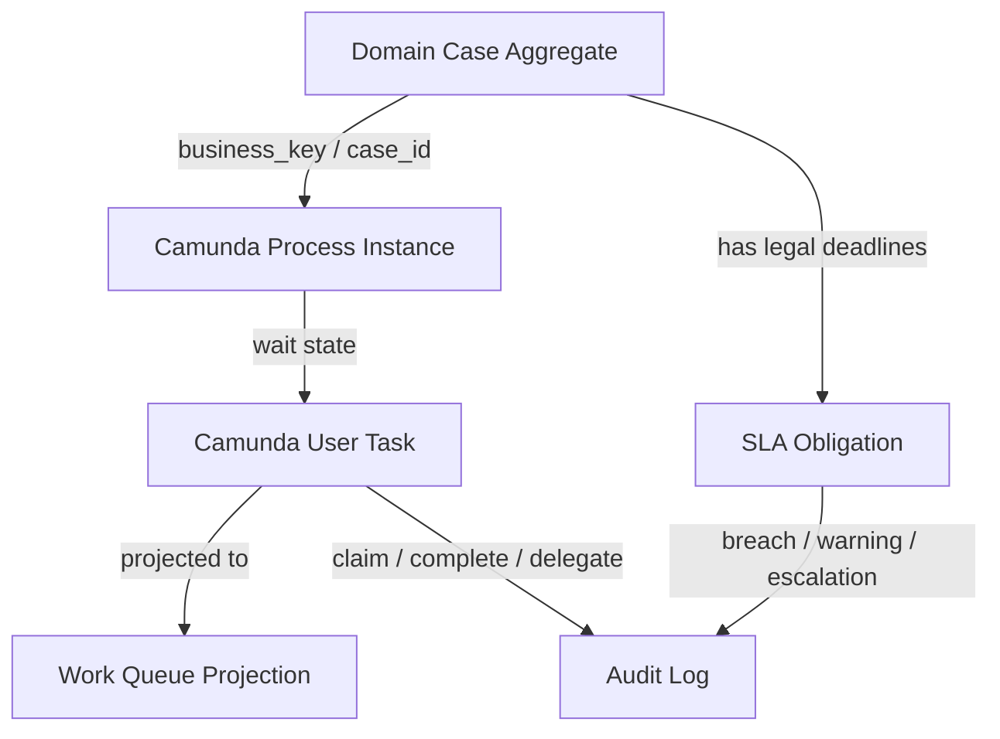
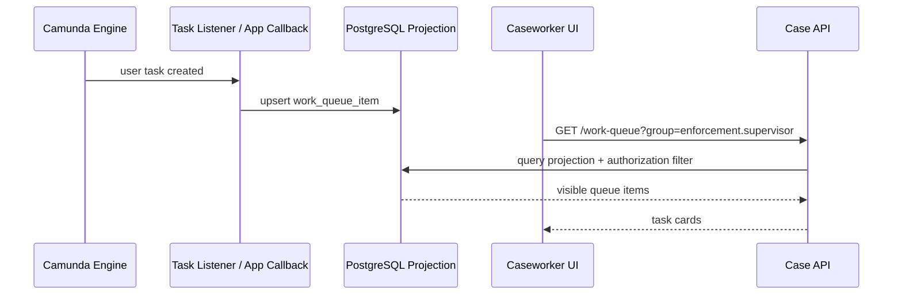
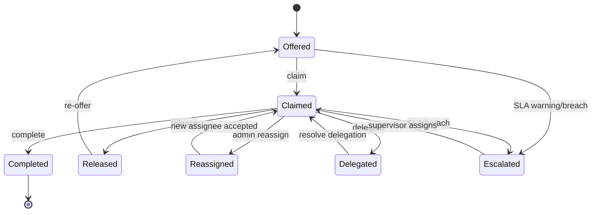
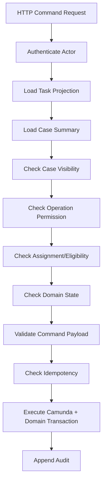
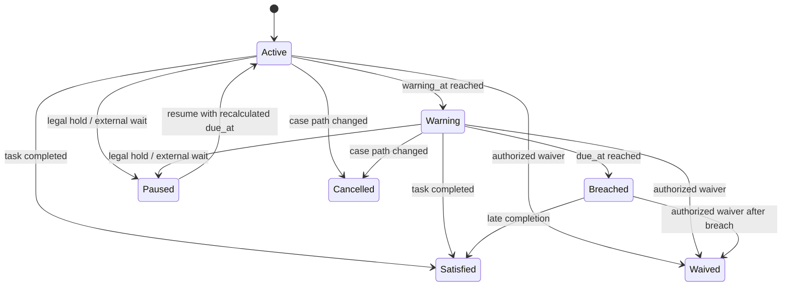
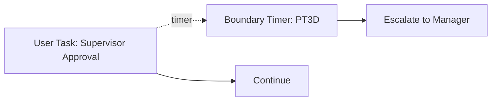
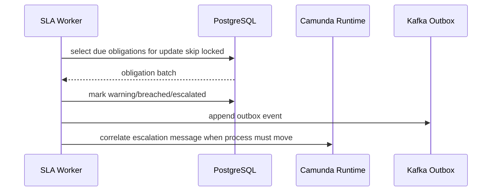
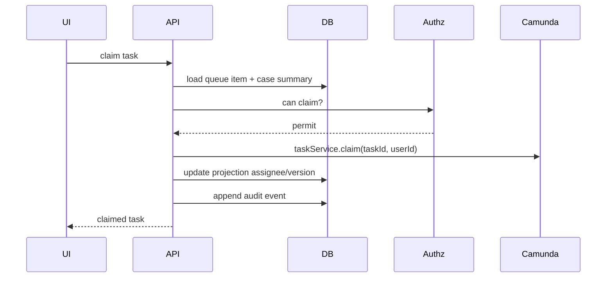
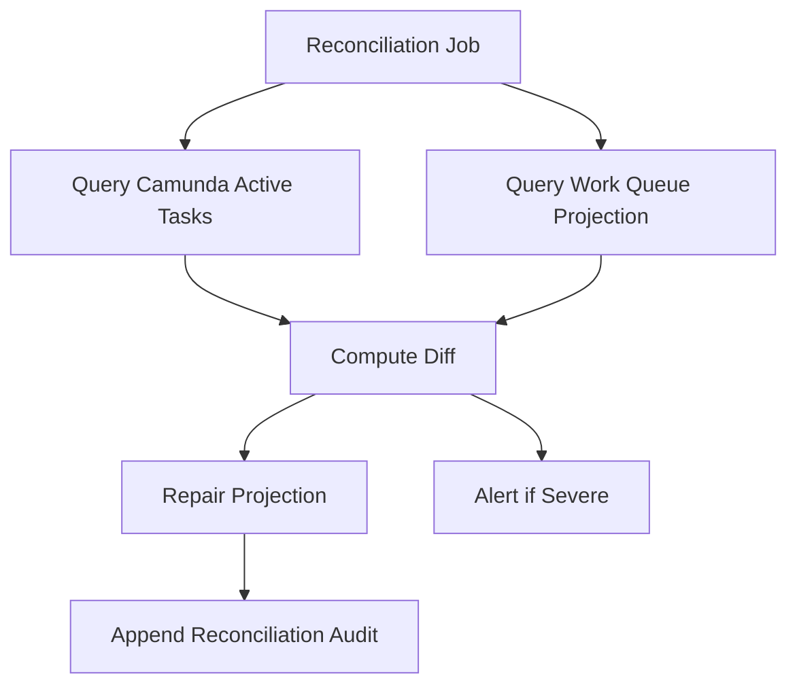
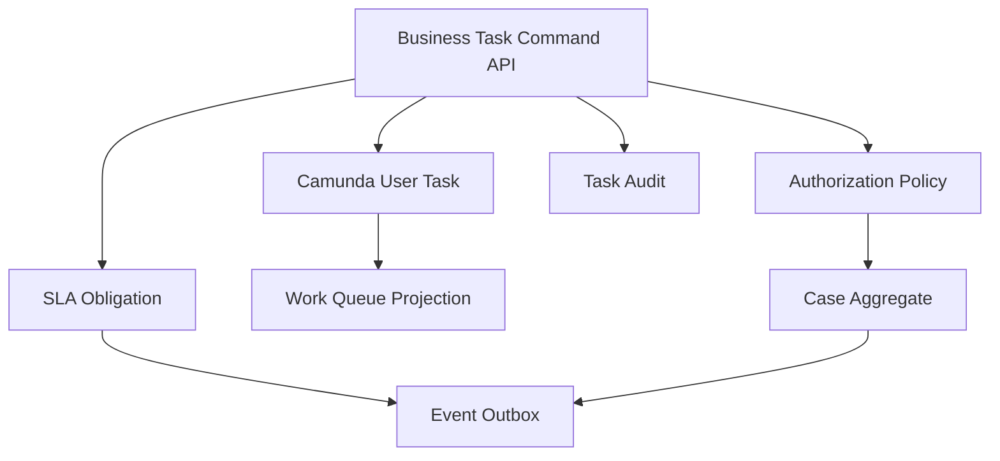

# Part 029 — Human Task, Authorization, and SLA

Human task is where a beautiful workflow usually becomes a messy production system.

A service task can be retried. A Kafka event can be replayed. A database transaction can be rolled back. But a human task involves queue ownership, organizational authority, delegation, deadlines, evidence, comments, policy judgment, and audit obligations.

In a regulatory enforcement platform, the hard question is not merely:

> “Who can see this task?”

The real question is:

> “Who is allowed to perform this action on this case, at this lifecycle state, under this policy, before this deadline, with evidence strong enough to defend the decision later?”

This part designs human task handling as a production contract.

We will not treat Camunda Tasklist as the whole product. We will treat Camunda 7 human task as one stateful engine primitive inside a larger case-management platform.

---

## 1. The Production Problem

In a simple demo, a user task is just a BPMN node:

```xml
<bpmn:userTask id="reviewCase" name="Review Case" />
```

In production, the same task implies at least ten contracts:

1. **Eligibility contract** — which users or groups may claim it.
2. **Visibility contract** — which users may see it in a work queue.
3. **Assignment contract** — who owns it right now.
4. **Completion contract** — who may complete it and with which payload.
5. **Decision contract** — which domain transition happens after completion.
6. **SLA contract** — when the task becomes due, breached, escalated, or waived.
7. **Audit contract** — what must be preserved for defensibility.
8. **Authorization contract** — which permission is checked at each operation.
9. **Concurrency contract** — what happens when two users act at once.
10. **Recovery contract** — what operators do when assignment or SLA state is wrong.

A top-level engineer does not design “a task screen”. They design the lifecycle of work.

---

## 2. Mental Model: Human Task Is a Work Item, Not the Case

The most dangerous mistake is to make the Camunda task the source of truth for the case.

A Camunda task is a **process execution artifact**. It tells you that a process instance is waiting for a human contribution.

A case is a **domain aggregate**. It tells you the legally meaningful state of the enforcement matter.

A task may represent work over a case, but it is not the case.



The relationship should be:

- Camunda task says: **“the process is waiting here.”**
- Domain case says: **“the case is in this legally meaningful state.”**
- Work queue says: **“these users should act next.”**
- SLA table says: **“this obligation is due at this time.”**
- Audit log says: **“this is what happened and why.”**

If you collapse all of those into Camunda variables, the system becomes hard to query, hard to authorize, hard to report, and hard to defend.

---

## 3. The Case Platform Human Task Types

For the enforcement case study, we define a small but representative task taxonomy.

| Task Type | Example | Domain Meaning | Risk |
|---|---|---|---|
| Intake review | Validate submitted complaint | Gate invalid input | Low/medium |
| Jurisdiction review | Decide whether agency has authority | Legal boundary | High |
| Evidence request | Ask regulated party for evidence | External deadline | High |
| Investigator assignment | Assign investigator | Resource allocation | Medium |
| Investigation review | Assess evidence and facts | Case merit | High |
| Enforcement recommendation | Recommend warning/fine/action | Decision preparation | Very high |
| Supervisor approval | Approve or reject recommendation | Decision control | Very high |
| Appeal review | Reconsider decision | Legal defensibility | Very high |
| Closure verification | Confirm obligations fulfilled | Final state | Medium/high |

Each task type should have a contract.

Example:

```yaml
humanTaskType: SUPERVISOR_APPROVAL
processTaskDefinitionKey: supervisorApproval
caseStateRequired: PENDING_SUPERVISOR_APPROVAL
candidateGroups:
  - enforcement.supervisor
completionCommands:
  - APPROVE_RECOMMENDATION
  - RETURN_FOR_REWORK
  - ESCALATE_TO_LEGAL
sla:
  responseDue: P3D
  warningBefore: PT12H
  breachAction: ESCALATE_TO_REGIONAL_MANAGER
auditLevel: DECISION_CRITICAL
requiresReason: true
requiresEvidenceRefs: false
```

This is the difference between a workflow and a defensible case platform.

---

## 4. Camunda 7 Task Concepts You Must Separate

Camunda 7 has several human-task-related concepts. They sound similar but mean different things.

| Concept | Meaning | Production Interpretation |
|---|---|---|
| Candidate group | Group eligible for a task | Initial routing / queue eligibility |
| Candidate user | Specific user eligible for a task | Exceptional direct routing |
| Assignee | User responsible for the task now | Operational ownership |
| Owner | User who owns delegated task | Delegation tracking |
| Claim | Set assignee if unassigned | Queue-to-person transition |
| Set assignee | Directly change assignee | Administrative override if not controlled |
| Delegate | Delegate task to another user | Temporary delegation flow |
| Complete | Finish task and continue process | Domain command boundary |
| Due date | Deadline for task completion | UI/filtering signal, not enough for legal SLA |
| Follow-up date | Time when task should become active/visible | Work scheduling signal |
| Identity link | Relationship between task and user/group | Eligibility metadata |

Important subtlety: `claim` is not a full authorization check. It assigns responsibility and checks existing assignment constraints, but the application must still enforce who is allowed to claim. Your platform must apply business authorization before calling Camunda.

---

## 5. Never Expose Raw Camunda Task Operations as Your Public API

A weak platform exposes APIs like this:

```http
POST /camunda/task/{taskId}/complete
```

That leaks engine internals into business API design. It also makes authorization harder because the API no longer knows the domain meaning of the completion.

A production platform should expose business operations:

```http
POST /cases/{caseId}/tasks/{taskId}/commands/approve-recommendation
POST /cases/{caseId}/tasks/{taskId}/commands/return-for-rework
POST /cases/{caseId}/tasks/{taskId}/commands/request-legal-review
```

The application layer then resolves:

1. Does this task belong to this case?
2. Is the task active?
3. Is this task definition allowed to accept this command?
4. Does the user have permission?
5. Is the case in the expected state?
6. Is the command payload valid?
7. Is the command idempotent?
8. Which Camunda variables should be set?
9. Which domain state transition should happen?
10. Which audit/outbox records should be appended?

The Camunda API is an internal adapter. The business command API is the contract.

---

## 6. Work Queue Architecture

Do not query Camunda directly for every UI screen in a complex case platform.

Camunda task queries are useful, but your production work queue usually needs additional fields:

- case reference number
- regulated party name
- risk level
- jurisdiction
- enforcement category
- SLA status
- breach timestamp
- confidentiality flag
- assigned team
- last activity timestamp
- legal hold flag
- appeal flag
- priority score
- tenant/region/agency unit

Those fields live in the domain database. Joining them dynamically with Camunda runtime tables is possible but fragile and engine-coupled.

A better model is to maintain a **work queue projection**.



The projection is not the source of truth for process execution. It is an optimized read model for human operations.

A `work_queue_item` row might look like:

```sql
create table case_work.work_queue_item (
    queue_item_id uuid primary key,
    case_id uuid not null,
    case_number text not null,
    process_instance_id text not null,
    task_id text not null,
    task_definition_key text not null,
    task_name text not null,
    task_type text not null,
    candidate_groups text[] not null,
    assignee_user_id text,
    owner_user_id text,
    priority integer not null default 0,
    due_at timestamptz,
    follow_up_at timestamptz,
    sla_status text not null,
    jurisdiction_code text not null,
    confidentiality_level text not null,
    created_at timestamptz not null,
    updated_at timestamptz not null,
    completed_at timestamptz,
    version bigint not null default 0,
    unique (task_id)
);
```

Production rule:

> Camunda task runtime state controls whether the process can move. Work queue projection controls how humans find and prioritize work.

---

## 7. Assignment Model: Queue, Claim, Reassign, Delegate

Human task assignment should be a state machine.



Use vocabulary consistently:

- **Offered**: task is available to candidate users/groups.
- **Claimed**: one user is responsible.
- **Released**: assignee intentionally returns it to queue.
- **Reassigned**: supervisor/operator changes assignee.
- **Delegated**: assignee transfers temporary work but keeps owner semantics.
- **Completed**: valid command completed the task.
- **Escalated**: SLA/policy triggered routing change.

Do not treat assignment as a random mutable field.

---

## 8. Authorization Is Not the Same as Assignment

Assignment answers:

> “Who currently owns the task?”

Authorization answers:

> “Is this actor allowed to perform this operation?”

A user may be assigned to a task but not allowed to complete a specific command if policy changed. A supervisor may not be assigned to a task but may be allowed to reassign it. An auditor may see a task but not act on it.

Design permissions at operation level.

| Operation | Example Permission | Additional Checks |
|---|---|---|
| View task | `TASK_VIEW` | jurisdiction, confidentiality, case access |
| Claim task | `TASK_CLAIM` | candidate group membership, task unassigned |
| Release task | `TASK_RELEASE` | actor is assignee or supervisor |
| Reassign task | `TASK_REASSIGN` | supervisor scope, target user eligibility |
| Complete task | `TASK_COMPLETE` | actor is assignee, command allowed, case state valid |
| Escalate task | `TASK_ESCALATE` | SLA policy or supervisor override |
| Add note | `TASK_NOTE_ADD` | case visibility, note classification |
| Attach evidence | `EVIDENCE_ATTACH` | evidence type, retention policy |
| Override SLA | `SLA_OVERRIDE` | reason required, elevated role |

The authorization engine should be outside Camunda.

Camunda has authorization capabilities, but the platform still needs domain-level authorization. Camunda knows process resource permissions; it does not know your full regulatory policy, jurisdiction matrix, confidentiality model, or legal delegation rules.

---

## 9. Authorization Decision Pipeline

A task command should pass through an explicit decision pipeline.



Use this order intentionally.

A secure implementation does not leak whether a confidential case exists before visibility is checked.

Example response strategy:

| Failure | Public Response | Internal Audit |
|---|---|---|
| Task does not exist | 404 | `TASK_NOT_FOUND` |
| Actor cannot see case | 404 or 403 depending policy | `CASE_VISIBILITY_DENIED` |
| Actor can see but cannot act | 403 | `TASK_PERMISSION_DENIED` |
| Task already completed | 409 | `TASK_NOT_ACTIVE` |
| Stale version | 409 | `TASK_CONCURRENT_UPDATE` |
| Invalid command payload | 400/422 | `TASK_PAYLOAD_INVALID` |

Do not optimize security logic for developer convenience. Optimize it for non-leakage and auditability.

---

## 10. Human Task Completion Is a Domain Command

Completing a task should never mean “send arbitrary variables to Camunda”.

Bad:

```java
Map<String, Object> vars = request.getAllFields();
taskService.complete(taskId, vars);
```

Good:

```java
public final class ApproveRecommendationHandler {
    public CommandResult handle(ApproveRecommendationCommand command, Actor actor) {
        TaskContext task = taskGateway.loadActiveTask(command.caseId(), command.taskId());
        CaseSnapshot snapshot = caseRepository.loadForUpdate(command.caseId());

        authorization.check(actor, TaskPermission.COMPLETE_SUPERVISOR_APPROVAL, task, snapshot);
        policy.checkCanApproveRecommendation(snapshot, command);

        IdempotencyDecision idem = idempotency.check(command.idempotencyKey(), command.fingerprint());
        if (idem.isReplay()) return idem.previousResult();

        Decision decision = decisionFactory.approve(command.reason(), actor);
        caseRepository.applySupervisorApproval(snapshot.caseId(), decision);
        auditRepository.appendSupervisorApproval(snapshot.caseId(), task.taskId(), actor, decision);
        outboxRepository.append(new CaseDecisionApprovedEvent(snapshot.caseId(), decision.id()));

        taskGateway.complete(task.taskId(), Map.of(
            "supervisorDecision", "APPROVED",
            "decisionId", decision.id().toString(),
            "approvedBy", actor.userId()
        ));

        return CommandResult.accepted(decision.id());
    }
}
```

In reality, the transaction boundary needs careful design because Camunda and domain database may share or not share the same transaction manager. The important point remains: task completion is a business command with validation, authorization, idempotency, audit, and side-effect control.

---

## 11. Human Task Variables Contract

Human task variables should be small and explicit.

Use process variables to route the process. Use domain tables to store durable business facts.

Good process variables:

```yaml
caseId: "uuid"
caseNumber: "ENF-2026-000123"
riskBand: "HIGH"
jurisdictionCode: "JKT"
supervisorDecision: "APPROVED | RETURNED | LEGAL_REVIEW"
decisionId: "uuid"
appealRequested: true
```

Bad process variables:

```yaml
fullEvidenceFile: "base64..."
fullPartyProfile: {...}
entireCaseAggregate: {...}
legalMemoHtml: "<html>..."
```

Rules:

1. Store durable domain facts in PostgreSQL domain tables.
2. Store file references, not files, in process variables.
3. Store routing decisions in Camunda variables.
4. Store audit facts in append-only audit tables.
5. Store UI data in projection tables.
6. Avoid large object variables in Camunda runtime tables.
7. Version variable names like an API contract.

---

## 12. SLA: Do Not Confuse Due Date with Legal Obligation

Camunda task due date is useful, but it is not enough for a regulatory SLA.

A regulatory SLA may depend on:

- statutory deadline
- agency internal target
- response deadline from regulated party
- appeal window
- pause/hold periods
- weekends/holidays
- jurisdiction-specific calendar
- confidentiality classification
- severity/risk band
- task type
- escalation policy
- force majeure override

So design SLA as its own domain concept.

```sql
create table case_core.sla_obligation (
    sla_id uuid primary key,
    case_id uuid not null,
    task_id text,
    obligation_type text not null,
    source text not null,
    starts_at timestamptz not null,
    due_at timestamptz not null,
    warning_at timestamptz,
    breached_at timestamptz,
    paused_at timestamptz,
    pause_reason text,
    status text not null,
    escalation_level integer not null default 0,
    version bigint not null default 0,
    created_at timestamptz not null,
    updated_at timestamptz not null,
    check (status in ('ACTIVE','PAUSED','SATISFIED','BREACHED','WAIVED','CANCELLED'))
);
```

Camunda timer events may wake the process. The `sla_obligation` table is the defensible record.

---

## 13. SLA as State Machine



Every transition should be auditable.

| Transition | Required Actor | Required Reason | Outbox Event |
|---|---|---|---|
| Active → Warning | system | no | `SlaWarningRaised` |
| Warning → Breached | system | no | `SlaBreached` |
| Active → Paused | authorized user/system | yes | `SlaPaused` |
| Paused → Active | authorized user/system | yes | `SlaResumed` |
| Active/Warning → Satisfied | task completion actor | no | `SlaSatisfied` |
| Any → Waived | elevated role | yes | `SlaWaived` |
| Any → Cancelled | process/domain transition | yes | `SlaCancelled` |

The point is not to over-engineer. The point is to avoid losing the reason behind deadline changes.

---

## 14. Timer Events and SLA Workers

There are two common approaches.

### Option A — BPMN timer-driven SLA

Use boundary timer events or intermediate timer events in BPMN.



Pros:

- SLA logic is visible in the process model.
- Timer firing is integrated with process execution.
- Operators can inspect incidents around process timer jobs.

Cons:

- Complex calendar logic becomes awkward in BPMN.
- Legal SLA state may become hidden in process variables.
- Cross-case SLA reporting still needs external tables.

### Option B — Domain SLA worker

Persist obligations in PostgreSQL and run a worker that scans due obligations.



Pros:

- Better for complex calendars and reporting.
- Works across all cases and all workflows.
- Easy to query and audit.

Cons:

- More moving parts.
- Requires careful idempotency and correlation.
- Process diagram may not show all SLA mechanics.

### Recommended production design

Use both, but with clear boundaries:

- Camunda timers for process-local wait states.
- Domain SLA table for legal/operational obligation record.
- SLA worker for reporting-grade breach detection and escalation.
- Kafka outbox for notifying other systems.
- BPMN message correlation only when process path must change.

---

## 15. Escalation Design

Escalation is not simply “assign task to manager”.

Escalation may mean:

- notify assignee
- notify team lead
- increase priority
- add candidate group
- reassign task
- create supervisor review task
- pause deadline
- mark SLA breached
- produce audit event
- send external notification
- block lower-level completion
- require higher approval

Use an escalation policy table.

```sql
create table reference_data.sla_escalation_policy (
    policy_id uuid primary key,
    task_type text not null,
    risk_band text not null,
    jurisdiction_code text not null,
    warning_before interval not null,
    breach_after interval not null,
    escalation_group text not null,
    max_escalation_level integer not null,
    requires_supervisor_review boolean not null default false,
    active_from date not null,
    active_to date
);
```

Then model escalation events explicitly:

```yaml
eventType: SlaBreached
eventVersion: 1
caseId: 8f0ccf33-05a3-48f1-a44e-8120c7f51c7a
taskId: "aTaskId"
slaId: "..."
obligationType: SUPERVISOR_APPROVAL_DUE
breachedAt: "2026-07-03T09:00:00+07:00"
escalationLevel: 1
nextAction: ADD_CANDIDATE_GROUP
candidateGroupAdded: enforcement.regional-manager
```

Escalation is part of the system contract. Do not hide it in email side effects.

---

## 16. Claim Operation Design

A claim operation should be guarded by optimistic concurrency and authorization.

Example API:

```http
POST /cases/{caseId}/tasks/{taskId}/commands/claim
If-Match: "queue-item-version-17"
Idempotency-Key: 0190e5d6-9e8a-7b2a-ae2d-8ef5c2cfaf91
```

Example request:

```json
{
  "claimReason": "Taking next high-priority supervisory task from queue"
}
```

Claim validation:

| Check | Failure |
|---|---|
| task exists | 404 |
| task belongs to case | 404/409 |
| case visible to actor | 404/403 |
| task active in Camunda | 409 |
| work queue item version matches | 409 |
| task has no assignee | 409 |
| actor belongs to candidate group or has override | 403 |
| task not blocked by confidentiality/legal hold | 403/409 |

Implementation sequence:



If Camunda and domain DB share the same transaction, the sequence can be atomic. If they do not, use an application-level recovery strategy and periodic reconciliation.

---

## 17. Complete Operation Design

Task completion is higher risk than claiming because it moves the process.

Completion should require:

- command type
- actor
- task id
- case id
- expected task definition key
- expected case version
- idempotency key
- reason when required
- structured payload
- optional evidence references

Example:

```json
{
  "commandType": "RETURN_FOR_REWORK",
  "expectedTaskDefinitionKey": "supervisorApproval",
  "expectedCaseVersion": 42,
  "reason": "Evidence summary does not address allegation A-17.",
  "returnToGroup": "enforcement.investigator",
  "evidenceRefs": ["EV-2026-000883"]
}
```

Completion should not allow arbitrary variables from clients. Map command payload into explicit process variables.

```java
Map<String, Object> variables = Map.of(
    "supervisorDecision", "RETURN_FOR_REWORK",
    "returnReasonCode", command.reasonCode().name(),
    "returnToGroup", command.returnToGroup(),
    "decisionCommandId", command.commandId().toString()
);

taskService.complete(taskId, variables);
```

---

## 18. Reassignment and Delegation

Reassignment and delegation are different.

| Action | Meaning | Typical Actor | Audit Need |
|---|---|---|---|
| Release | assignee returns task to queue | assignee | low/medium |
| Reassign | ownership moved to another user | supervisor/operator | high |
| Delegate | assignee delegates task but remains owner | assignee/supervisor | medium/high |
| Escalate | task elevated due to SLA/policy | system/supervisor | high |

Do not implement all of these as “set assignee”.

A good platform captures intent.

```json
{
  "operation": "REASSIGN",
  "fromUserId": "u-123",
  "toUserId": "u-987",
  "reasonCode": "WORKLOAD_BALANCING",
  "reasonText": "Investigator is unavailable for medical leave.",
  "authorizedBy": "manager-17"
}
```

A raw assignee update loses the meaning.

---

## 19. User Task Listener Use and Risk

Task listeners can be useful for synchronizing projections:

- create work queue item when task is created
- update projection when assignment changes
- mark projection completed when task completes
- append lightweight technical audit

But do not put large domain logic inside task listeners.

Bad listener responsibilities:

- deciding legal outcome
- sending external irreversible notifications directly
- mutating many unrelated aggregates
- executing long HTTP calls
- applying complex authorization

Good listener responsibilities:

- publish internal event/outbox row
- update projection
- record task lifecycle fact
- validate required local task metadata

A listener runs inside engine execution context. If it fails, it may affect task creation/completion. Keep it small and deterministic.

---

## 20. Human Task Audit Model

A defensible case platform needs more than Camunda history.

Camunda history is valuable for process execution history. Domain audit is needed for legal and business accountability.

Create append-only audit events.

```sql
create table case_audit.task_audit_event (
    event_id uuid primary key,
    case_id uuid not null,
    task_id text not null,
    task_definition_key text not null,
    event_type text not null,
    actor_user_id text,
    actor_group_ids text[] not null default '{}',
    occurred_at timestamptz not null,
    reason_code text,
    reason_text text,
    before_snapshot jsonb,
    after_snapshot jsonb,
    correlation_id text not null,
    causation_id text,
    request_id text,
    source_ip inet,
    user_agent text
);
```

Minimum events:

| Event | Meaning |
|---|---|
| `TASK_CREATED` | Camunda user task became available |
| `TASK_OFFERED` | Task offered to group/user |
| `TASK_CLAIMED` | User claimed task |
| `TASK_RELEASED` | User released task |
| `TASK_REASSIGNED` | Supervisor/operator reassigned |
| `TASK_DELEGATED` | Delegation started |
| `TASK_COMPLETED` | Task completed with command |
| `TASK_ESCALATED` | SLA/policy escalated task |
| `TASK_CANCELLED` | Process path made task obsolete |
| `TASK_AUTHORIZATION_DENIED` | Actor attempted denied action |

Audit should answer:

- Who acted?
- On what task and case?
- Under which permission?
- With which reason?
- From which previous state?
- To which new state?
- Which request caused it?
- Which process instance was affected?

---

## 21. Task Projection Reconciliation

Projections can drift.

Causes:

- listener failed
- transaction boundary mismatch
- deployment rollback
- manual operator action in Cockpit
- process instance migration
- task cancellation due to BPMN path
- database restore
- bug in projection update logic

Build reconciliation from day one.



Diff examples:

| Drift | Repair |
|---|---|
| Camunda task exists, projection missing | insert projection row |
| Projection active, Camunda task completed | mark projection completed |
| Assignee mismatch | update projection from Camunda or flag conflict |
| Candidate group mismatch | update or alert depending policy |
| Task references missing case | alert, do not auto-repair |
| SLA active for completed task | mark satisfied or alert depending state |

Reconciliation is not an afterthought. It is how stateful workflow systems survive production.

---

## 22. UI Implications

A good task backend enables a good task UI.

Task cards should show:

- case number
- task name
- case type
- risk band
- jurisdiction
- confidentiality level
- current assignee
- candidate group
- due time
- SLA status
- priority
- last action
- allowed commands for current actor

Do not make the frontend infer permissions. The API should return allowed actions.

```json
{
  "taskId": "abc",
  "caseId": "8f0c...",
  "taskName": "Supervisor Approval",
  "slaStatus": "WARNING",
  "assignee": "u-123",
  "allowedActions": [
    "COMPLETE_APPROVE",
    "COMPLETE_RETURN_FOR_REWORK",
    "RELEASE"
  ]
}
```

The frontend can hide buttons. The backend must still enforce permissions.

---

## 23. API Contract Sketch

```yaml
paths:
  /work-queue:
    get:
      summary: Search visible work queue items
      parameters:
        - name: taskType
          in: query
          schema:
            type: string
        - name: slaStatus
          in: query
          schema:
            type: string
        - name: assignee
          in: query
          schema:
            type: string
      responses:
        '200':
          description: Visible work queue page

  /cases/{caseId}/tasks/{taskId}/commands/claim:
    post:
      summary: Claim an active task
      parameters:
        - name: Idempotency-Key
          in: header
          required: true
          schema:
            type: string
        - name: If-Match
          in: header
          required: true
          schema:
            type: string
      responses:
        '200':
          description: Task claimed
        '403':
          description: Actor cannot claim this task
        '409':
          description: Task already assigned or stale
```

This contract is more valuable than exposing Camunda REST directly.

---

## 24. Database Indexing for Work Queue

Work queue queries must be designed around real operator use.

Common queries:

1. My assigned tasks ordered by due date.
2. Team unassigned tasks by priority.
3. Breached SLA tasks by jurisdiction.
4. Confidential tasks visible to a special group.
5. Tasks for a case timeline.

Indexes:

```sql
create index idx_wq_assignee_due
on case_work.work_queue_item (assignee_user_id, due_at, priority desc)
where completed_at is null;

create index idx_wq_group_due
on case_work.work_queue_item using gin (candidate_groups)
where completed_at is null;

create index idx_wq_sla_jurisdiction
on case_work.work_queue_item (sla_status, jurisdiction_code, due_at)
where completed_at is null;

create index idx_wq_case
on case_work.work_queue_item (case_id, created_at desc);
```

Index design follows query shape. Do not index every column defensively.

---

## 25. Concurrency Scenarios

### Scenario 1 — Two users claim same task

Expected result:

- one succeeds
- one receives 409 Conflict
- audit records only successful claim, optionally denied stale attempt

Protection:

- Camunda claim semantics
- projection optimistic version
- unique active assignment constraint if modeled separately

### Scenario 2 — User completes task after supervisor reassigned it

Expected result:

- completion rejected if actor no longer assignee
- audit denied attempt
- UI refreshed

Protection:

- load latest projection/task state
- check assignee at command time
- expected version header

### Scenario 3 — SLA worker escalates while user completes task

Expected result:

- one transition wins
- SLA becomes satisfied or breached-late based on timestamp policy
- no duplicate escalation side effects

Protection:

- row lock on SLA obligation
- idempotent escalation event
- deterministic timestamp comparison

### Scenario 4 — Task completed in Camunda but DB update failed

Expected result:

- reconciliation detects projection drift
- domain state repair follows runbook

Protection:

- transactional integration where possible
- outbox/reconciliation where not possible
- audit correlation id

---

## 26. Failure Model

| Failure | Detection | Recovery |
|---|---|---|
| Task projection missing | reconciliation diff | rebuild from Camunda + case DB |
| Wrong assignee | operator report/reconciliation | compare Camunda task vs audit, repair with reason |
| SLA breach not detected | SLA monitoring lag | re-run SLA worker over time window |
| Duplicate escalation | unique event key | ignore duplicate, audit idempotent replay |
| Unauthorized completion attempt | API authorization denial | audit and alert if suspicious |
| Task stuck due to incident | Camunda incident query | fix root cause, retry job |
| Candidate group wrong | config/process version issue | migrate task/process or admin repair |
| User left organization | identity sync job | unassign/reassign open tasks |
| Legal hold not respected | policy audit | pause SLA and investigate breach |

A production system should have named failure states. “Something went wrong with task” is not a diagnosis.

---

## 27. Testing Strategy

Test at multiple levels.

### Unit tests

- authorization decision matrix
- SLA calculation
- command-to-variable mapping
- task command validation
- idempotency fingerprint

### Integration tests

- Camunda task creation
- task listener projection update
- claim/complete through TaskService
- PostgreSQL projection writes
- SLA worker with `SKIP LOCKED`
- rollback behavior

### Contract tests

- OpenAPI response schema
- allowed action contract
- Problem Details error format
- idempotency behavior

### Scenario tests

- intake → review → supervisor approval → closure
- supervisor returns for rework
- SLA warning then completion
- SLA breach then escalation
- concurrent claim race
- unauthorized actor tries completion
- user reassignment after claim

### Operational tests

- projection rebuild
- identity sync after user deactivation
- stuck task reconciliation
- bulk SLA recalculation
- migration of active task instances

---

## 28. Production Checklist

Before releasing human task capability, verify:

- [ ] Public API uses business commands, not raw Camunda endpoints.
- [ ] Work queue projection exists and can be rebuilt.
- [ ] Every task type has a declared contract.
- [ ] Assignment states are explicit.
- [ ] Authorization checks are operation-level.
- [ ] Case visibility is checked before task details leak.
- [ ] Allowed actions are computed server-side.
- [ ] Completion payload is typed and validated.
- [ ] Idempotency key is required for mutating commands.
- [ ] SLA is modeled outside task due date.
- [ ] SLA transition audit exists.
- [ ] Escalation side effects are idempotent.
- [ ] Task audit is append-only.
- [ ] Reconciliation job exists.
- [ ] Operator repair path exists.
- [ ] Concurrency tests cover claim and complete races.
- [ ] User deactivation/reassignment path exists.
- [ ] Confidentiality and jurisdiction filters are tested.

---

## 29. Anti-Patterns

### Anti-pattern 1 — Camunda task as the case

Symptom:

- UI queries Camunda tasks and treats variables as case data.

Consequence:

- reporting is painful
- authorization becomes inconsistent
- migration is risky
- process variables bloat

Correct model:

- Camunda task is execution wait state
- domain case remains in PostgreSQL
- work queue projection serves UI

### Anti-pattern 2 — one generic complete endpoint

Symptom:

```http
POST /tasks/{taskId}/complete
```

with arbitrary variables.

Consequence:

- no stable command contract
- weak audit
- difficult authorization
- accidental process path changes

Correct model:

- typed business commands per task decision

### Anti-pattern 3 — SLA only as due date

Symptom:

- task has `dueDate`, no domain SLA table.

Consequence:

- no legal deadline audit
- no pause/waive/recalculate history
- poor reporting

Correct model:

- SLA obligation table + events + optional BPMN timer

### Anti-pattern 4 — assignment equals authorization

Symptom:

- if user is assignee, let them do everything.

Consequence:

- policy breach when role/confidentiality changes
- insufficient delegation control

Correct model:

- assignment is ownership; authorization is operation-specific policy decision

### Anti-pattern 5 — no reconciliation

Symptom:

- projection assumes task listener always worked.

Consequence:

- invisible tasks
- phantom tasks
- broken SLA dashboard

Correct model:

- scheduled reconciliation and repair audit

---

## 30. Final Mental Model

A human task system is not a BPMN node. It is a contract between:

- process execution
- domain state
- organizational authority
- user workload
- legal deadline
- audit record
- operational recovery

The stable design is:



If you keep these boundaries separate, the platform remains understandable when it grows from 10 tasks per day to 100,000 tasks per day.

