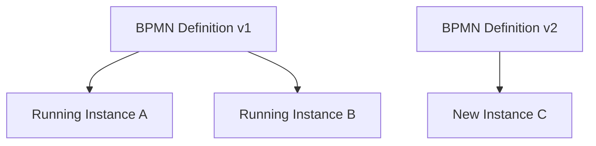
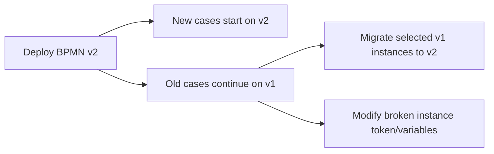
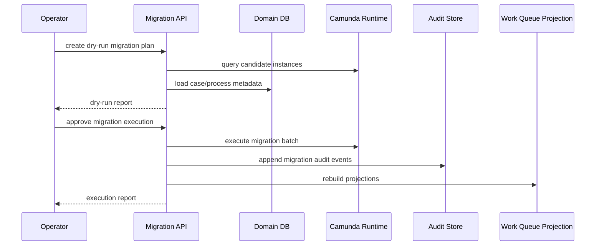
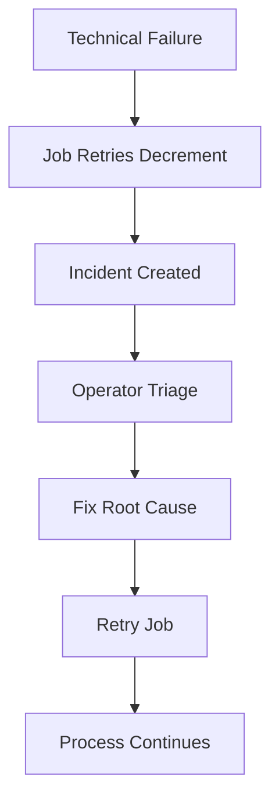
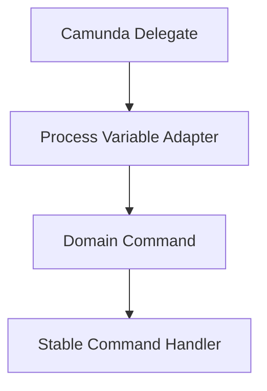
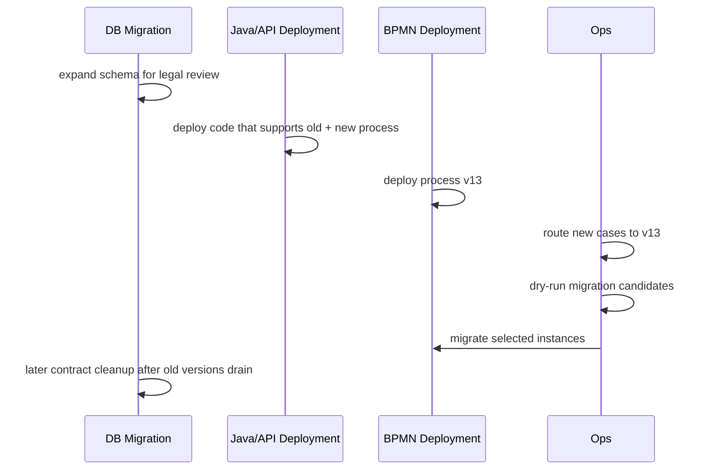
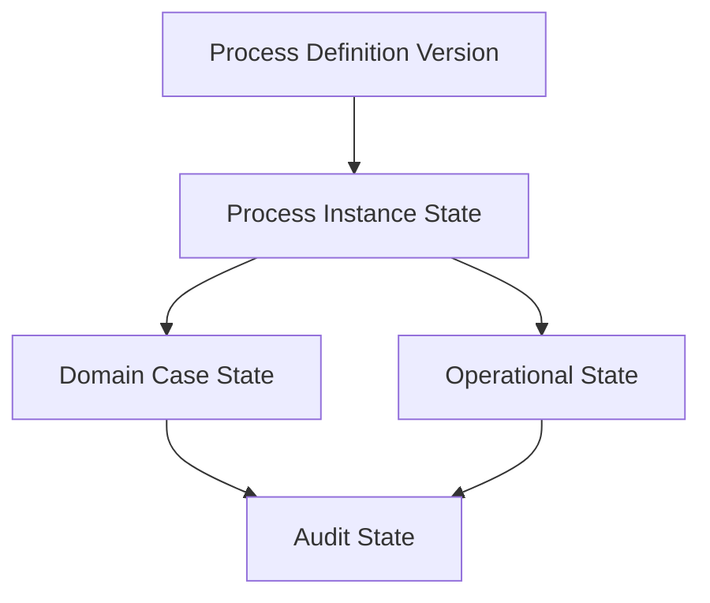

# Part 030 — Camunda Versioning, Migration, and Incident Ops

A process model is code.

A running process instance is production state.

Changing a BPMN file is therefore not like changing a diagram. It is closer to changing database schema while transactions are still open.

In Camunda 7, process versioning, instance migration, failed job retry, incidents, history cleanup, and operational repair are not secondary topics. They are the difference between a workflow demo and a durable case-management platform.

This part is about how to operate Camunda 7 when there are thousands or millions of active process instances, long-running cases, human tasks, timers, service calls, Kafka correlations, and legal deadlines.

---

## 1. The Production Problem

In a regulatory enforcement platform, a case may run for months or years.

During that period:

- law may change
- SLA policy may change
- user task assignment policy may change
- process path may change
- subprocess may be split
- service task may be replaced
- Kafka event contract may evolve
- database schema may migrate
- bugs may be discovered in running process instances
- incidents may accumulate after an outage
- history tables may grow until performance degrades

The naive question is:

> “How do we deploy the new BPMN?”

The real question is:

> “What happens to every running process instance, every pending timer, every active task, every failed job, every historical audit record, and every downstream consumer when this process changes?”

That is the level this part targets.

---

## 2. Mental Model: Process Definition vs Process Instance

Camunda 7 separates process definitions from process instances.



Deploying a new process definition version does not automatically rewrite all running instances. Existing instances usually continue on the version they started with unless migrated or modified.

This is good. It prevents accidental mutation of in-flight legal work.

It is also dangerous. You may end up with many versions running at once.

Therefore, every BPMN change needs a versioning decision.

---

## 3. Four Types of BPMN Change

Not all BPMN changes are equal.

| Change Type | Example | Migration Risk | Typical Strategy |
|---|---|---:|---|
| Cosmetic | task label wording, diagram layout | Low | deploy new version, no migration |
| Additive inactive path | add future task after current wait state | Medium | deploy + optional migration |
| Behavioral change | different gateway condition, changed retry, new escalation | High | versioned rollout + explicit migration plan |
| Destructive structural change | remove active task, rename task id, delete subprocess | Very high | avoid, or migrate with controlled mapping |

The most dangerous changes are not visual. They are semantic.

Examples:

- changing a task definition key
- changing variable names used by gateways
- changing message correlation names
- changing business key assumptions
- changing timer duration expression
- changing async boundaries
- changing error boundary behavior
- changing delegate expression target
- changing retry cycle
- deleting a wait state where instances currently sit

Process versioning is contract evolution.

---

## 4. Stable BPMN IDs Are a Contract

In BPMN, element IDs are not just internal XML details. They are operational handles.

Bad habit:

```xml
<bpmn:userTask id="Activity_1x2y3z" name="Supervisor Approval" />
```

Better:

```xml
<bpmn:userTask id="supervisorApproval" name="Supervisor Approval" />
```

A stable ID supports:

- task definition key lookup
- migration mapping
- incident triage
- audit interpretation
- dashboard grouping
- code references
- process tests

Rules:

1. Never allow random modeler-generated IDs to remain in production BPMN.
2. Use meaningful stable IDs.
3. Treat IDs as part of the contract.
4. Do not rename IDs casually.
5. Document every ID rename as a breaking change.

---

## 5. Process Definition Versioning Policy

Adopt a policy similar to API versioning.

| Version Change | Meaning | Example |
|---|---|---|
| Patch | no semantic change for running instances | label fix, documentation, non-executed extension property |
| Minor | backward-compatible new path | add optional review after current task |
| Major | behavior may change for active instances | changed decision logic, removed task, changed message contract |

Camunda itself increments process definition versions on deployment. Your platform should also track semantic release metadata.

Example table:

```sql
create table process_ops.process_release (
    release_id uuid primary key,
    process_key text not null,
    camunda_definition_id text not null,
    camunda_version integer not null,
    semantic_version text not null,
    release_type text not null,
    deployed_at timestamptz not null,
    deployed_by text not null,
    migration_required boolean not null,
    migration_plan_id uuid,
    notes text not null
);
```

This gives operators a business-facing view of process releases.

---

## 6. Deployment Is Not Migration

A deployment introduces a new process definition version.

A migration moves existing process instances from one definition version to another.

A modification changes token positions or variables within instances.

Do not mix these concepts.



A safe release may deploy v2 but not migrate any existing instance.

That is often the right choice.

---

## 7. Migration Decision Matrix

Before migrating, classify active instances.

| Instance Position | Should Migrate? | Why |
|---|---|---|
| Not yet reached changed area | Usually yes | safer to move before hitting old behavior |
| Sitting at unchanged user task | Maybe | depends on task key compatibility |
| Sitting at removed user task | High risk | requires mapping or manual completion |
| Sitting at service task incident | Usually no until repaired | migration may hide root cause |
| Waiting at message event with changed name | High risk | correlation contract changed |
| Waiting at timer event with changed duration | Policy decision | legal deadline implications |
| Completed process | No | history only |
| Suspended instance | Usually no until reviewed | suspension reason matters |

Migration should be data-driven, not global by default.

---

## 8. Migration Plan as Artifact

A migration plan should be a reviewed artifact.

It should answer:

1. Source process definition version.
2. Target process definition version.
3. Which instances are eligible.
4. Which instances are excluded.
5. Activity mappings.
6. Variable transformations.
7. Task projection impact.
8. SLA obligation impact.
9. Audit event to append.
10. Rollback/compensation plan.
11. Operator approval.
12. Monitoring after migration.

Example:

```yaml
migrationPlanId: MP-2026-07-CASE-REVIEW-V3
processKey: enforcementCaseLifecycle
sourceVersion: 12
targetVersion: 13
reason: Add mandatory legal review for high-risk penalty recommendation
eligible:
  - currentActivity in [investigationReview, supervisorApproval]
  - riskBand = HIGH
excluded:
  - hasActiveIncident = true
  - caseStatus in [CLOSED, CANCELLED]
activityMappings:
  investigationReview: investigationReview
  supervisorApproval: supervisorApproval
variableTransformations:
  legalReviewRequired: true
projectionRepair: rebuildWorkQueueForMigratedInstances
auditEvent: PROCESS_INSTANCE_MIGRATED
approvalRequiredFrom:
  - workflow-platform-owner
  - enforcement-policy-owner
```

A migration is not merely a technical command. It is a change to active work.

---

## 9. Process Instance Migration Flow



Always support dry-run.

Dry-run should report:

- candidate count
- excluded count by reason
- current activities
- incident count
- active task count
- SLA impact count
- process variable compatibility warnings
- estimated batch size
- expected lock/DB pressure

---

## 10. Variable Migration

BPMN migration maps activities. It does not magically fix your variable contract.

If a gateway changes from:

```text
${approved == true}
```

to:

```text
${supervisorDecision == 'APPROVED'}
```

then existing instances may not have `supervisorDecision`.

You need variable transformation.

```java
if (Boolean.TRUE.equals(vars.get("approved"))) {
    runtimeService.setVariable(processInstanceId, "supervisorDecision", "APPROVED");
} else if (Boolean.FALSE.equals(vars.get("approved"))) {
    runtimeService.setVariable(processInstanceId, "supervisorDecision", "RETURNED");
}
```

But do not scatter transformations in random scripts.

Make variable migration explicit, tested, and auditable.

---

## 11. Active Task Migration

Human task migration is sensitive.

If an instance is sitting at `supervisorApproval`, and v2 still has `supervisorApproval`, migration may be straightforward.

If v2 splits that task into:

- `legalSufficiencyReview`
- `supervisorApproval`

then the current task cannot simply become both.

Options:

1. Let existing instances finish old path.
2. Migrate only instances before the split point.
3. Complete old task then start new subprocess for legal review.
4. Modify token position manually with explicit audit.
5. Cancel old task and create new task projection after migration.

For regulatory work, option 1 is often safest unless policy requires immediate change.

---

## 12. Message Correlation Compatibility

Message names and correlation keys are contracts.

Bad change:

```xml
<bpmn:message id="Message_EvidenceReceived" name="EvidenceReceived" />
```

changed to:

```xml
<bpmn:message id="Message_DocumentReceived" name="DocumentReceived" />
```

without compatibility bridge.

Consequence:

- old instances wait for `EvidenceReceived`
- new event publisher sends `DocumentReceived`
- old instances never wake

Compatibility strategies:

- publish both old and new messages during transition
- keep message name stable and evolve payload
- correlate through adapter that knows process version
- migrate waiting instances before changing publisher
- store waiting subscription metadata for monitoring

Never change message correlation casually.

---

## 13. Timer Compatibility

Timer changes can have legal consequences.

Changing `PT3D` to `PT5D` is not just a technical change. It changes deadline behavior.

Questions before timer migration:

1. Does the new timer apply to existing cases?
2. Does law or policy allow recalculation?
3. Should already-created timer jobs be replaced?
4. Should existing SLA obligations be recalculated?
5. How is the reason audited?
6. Who approves deadline changes?

In many systems, Camunda timer controls workflow wake-up, while the domain SLA table controls legal deadline. If so, update SLA first, then align timer behavior.

---

## 14. Incident Model

A Camunda incident means the engine could not proceed automatically and needs attention.

Typical causes:

- service task exception exhausted retries
- failed async continuation
- external system outage
- database timeout/deadlock
- expression error
- missing delegate bean
- invalid variable type
- message correlation mismatch
- history cleanup job failure
- serialization/deserialization failure

An incident is not the root cause. It is a symptom with a process position.



Your runbook should classify incidents by type and recovery action.

---

## 15. Failed Job Retry Semantics

Async service tasks and timers are executed by jobs. If a job fails, retries decrease. When retries reach zero, an incident is created.

Design retry policy intentionally.

| Failure Type | Retry? | Example |
|---|---|---|
| transient HTTP timeout | yes | downstream service slow |
| Kafka broker temporarily unavailable | yes | producer cannot publish |
| optimistic locking | yes, short retry | concurrent engine update |
| validation error | no | invalid command payload |
| missing delegate bean | no until deployment fixed | bad release |
| SQL syntax error | no until code fixed | mapper bug |
| authorization denied | no | policy failure |
| external 409 conflict | depends | idempotency conflict |

Do not retry non-retryable failures for hours. That hides bugs and creates noise.

---

## 16. Retry Cycle Design

Retry cycle should reflect dependency behavior.

Example BPMN extension:

```xml
<camunda:failedJobRetryTimeCycle>R5/PT10M</camunda:failedJobRetryTimeCycle>
```

Meaning: retry five times, ten minutes apart.

But do not apply one retry policy everywhere.

| Task | Suggested Policy | Reason |
|---|---|---|
| call internal idempotent service | `R5/PT2M` | likely transient |
| publish outbox signal | `R10/PT1M` | should recover quickly |
| call external regulator registry | `R8/PT15M` | external outage possible |
| validate immutable input | no async retry | deterministic failure |
| send non-critical notification | worker-level retry + DLQ | do not block legal process |

A retry policy is part of the process contract.

---

## 17. Incident Triage Matrix

| Incident Class | Signal | First Action | Recovery |
|---|---|---|---|
| Dependency outage | many incidents same activity | check dependency health | fix dependency, bulk retry |
| Deployment bug | incidents after release | inspect logs, missing bean/class | rollback/fix deploy, retry |
| Data bug | few incidents with bad variables | inspect variables/domain data | repair data, retry |
| Model bug | gateway expression failure | inspect BPMN version | deploy fixed version, migrate/modify |
| Lock contention | optimistic locking/deadlock | inspect DB metrics | tune concurrency, retry |
| Poison instance | same instance repeatedly fails | isolate case | manual repair or business cancellation |
| History cleanup | cleanup incident | inspect TTL/window/table bloat | adjust cleanup config, retry cleanup |

Good operations begin with classification.

---

## 18. Operator Runbook: Dependency Outage Incident Storm

Scenario: external registry service is down for 40 minutes. Hundreds of service task jobs fail and become incidents.

Runbook:

1. Confirm incident spike by activity id and process definition version.
2. Confirm dependency outage from service metrics/logs.
3. Stop manual retries while dependency is still down.
4. Confirm no irreversible partial side effects occurred.
5. Restore dependency or switch to fallback.
6. Run a small retry sample.
7. If sample succeeds, bulk retry by process/activity/incident reason.
8. Monitor job executor load and DB pressure.
9. Verify process catch-up rate.
10. Append operational incident report.

Bad recovery is clicking retry repeatedly without fixing root cause.

---

## 19. Operator Runbook: Bad Deployment

Scenario: new service version deploys without a delegate bean required by BPMN.

Symptoms:

- incidents start immediately after deployment
- same activity id
- exception mentions missing bean/class/delegate expression

Runbook:

1. Freeze further process deployments.
2. Identify affected process definition version.
3. Confirm whether old running instances or only new instances are affected.
4. Roll back app image or deploy hotfix with missing bean.
5. Do not migrate instances yet.
6. Retry a single failed job.
7. Retry remaining jobs in controlled batches.
8. Create postmortem action: deployment smoke test must instantiate delegate expressions.

---

## 20. Operator Runbook: Bad Process Variable

Scenario: a gateway expression expects `supervisorDecision`, but instance has `approved`.

Runbook:

1. Query incidents by activity id and exception message.
2. Sample variables from affected instances.
3. Confirm variable migration rule.
4. Write tested repair script/API operation.
5. Dry-run affected instances.
6. Set missing variables with audit event.
7. Retry jobs.
8. Add compatibility test to process suite.

The repair should be traceable. A random database update is not acceptable.

---

## 21. Do Not Repair Camunda Runtime Tables Directly

Direct updates to Camunda runtime tables are tempting under pressure.

Avoid them.

Use Camunda APIs for:

- setting variables
- retrying jobs
- migrating instances
- modifying process instances
- suspending/resuming
- deleting/canceling when appropriate

Direct table mutation can bypass caches, history, incident handlers, authorization, and engine invariants.

If a vendor/support-approved database operation is unavoidable, treat it as an emergency procedure with backup, approval, and post-repair consistency checks.

---

## 22. Suspension Strategy

Suspension can be useful during incidents or policy holds.

You may suspend:

- process definition
- process instance
- job definition

But suspension is not a generic pause button.

Questions:

1. Are timers supposed to stop?
2. Should users still complete active tasks?
3. Should Kafka correlations be rejected or stored?
4. Should SLA continue or pause?
5. Is suspension legal/business approved?
6. How will resumption be audited?

For regulatory cases, domain case hold and process suspension must be aligned. Suspending Camunda but leaving domain SLA active may create false breaches. Pausing SLA without suspending process may allow illegal progress.

---

## 23. History Cleanup and Retention

Camunda history tables can grow heavily in long-running platforms.

History is useful for:

- debugging
- audit support
- process analytics
- incident investigation
- migration verification

But unlimited history growth affects:

- storage
- index bloat
- query latency
- backup/restore time
- cleanup job pressure

Retention design must distinguish:

| Data | Source | Retention Logic |
|---|---|---|
| Process execution history | Camunda history | engine cleanup policy |
| Legal audit | domain audit tables | legal/regulatory retention |
| Case facts | domain tables | case retention policy |
| Operational logs | logging platform | observability retention |
| Kafka events | Kafka topic retention/compaction | event contract policy |

Do not assume Camunda history is your legal audit store.

---

## 24. History Time To Live Discipline

Each deployed process should have a history time-to-live policy.

Questions:

1. How long after process completion is engine history needed?
2. Which audit facts are preserved elsewhere?
3. Does deletion affect legal defensibility?
4. Are batch operations also retained appropriately?
5. Is cleanup window scheduled during low load?
6. Is cleanup failure monitored?

Production checklist:

- set TTL intentionally
- avoid null TTL in regulated systems unless explicitly justified
- configure cleanup batch window
- monitor cleanup duration
- monitor history table growth
- test cleanup in staging with realistic volume

---

## 25. Process Instance Modification

Modification changes the token state of a running process instance.

It is powerful and dangerous.

Use cases:

- skip a broken automated step after side effect already happened
- move token from obsolete task to replacement task
- cancel a stuck path
- re-enter a failed subprocess

Risks:

- bypasses domain validation
- bypasses task completion audit
- causes inconsistent projections
- invalidates SLA assumptions
- surprises downstream systems

Rules:

1. Prefer normal business commands.
2. Prefer migration over ad-hoc modification when changing versions.
3. Use modification only with operator approval.
4. Append domain audit event.
5. Reconcile work queue and SLA after modification.
6. Document reason and before/after token state.

---

## 26. Process Cancellation and Restart

Cancellation is a business action, not just an engine delete.

For an enforcement case, cancellation may mean:

- duplicate complaint
- outside jurisdiction
- withdrawn complaint
- legal invalidity
- merged case
- administrative error

The domain case should move to a meaningful terminal or merged state. Camunda cancellation should follow domain decision.

Restart is equally sensitive.

Questions before restart:

1. Are prior side effects idempotent?
2. Will duplicate notifications be sent?
3. Will Kafka events be republished?
4. Will tasks be duplicated?
5. Is old audit preserved?
6. Does new process use same business key?

A restart is not a rollback. It is a new execution attempt with history.

---

## 27. Version-Aware Code

Your Java delegates/workers must be version-aware without becoming messy.

Avoid this:

```java
if (processVersion == 7) {
   // old behavior
} else if (processVersion == 8) {
   // new behavior
} else if (processVersion == 9) {
   // another behavior
}
```

Prefer stable command handlers and versioned adapters:



The delegate reads process variables and converts them into a domain command. If variable contract changes, version the adapter, not the domain service.

Example:

```java
interface SupervisorApprovalVariableAdapter {
    ApproveRecommendationCommand toCommand(DelegateExecution execution);
}

final class SupervisorApprovalV12Adapter implements SupervisorApprovalVariableAdapter { }
final class SupervisorApprovalV13Adapter implements SupervisorApprovalVariableAdapter { }
```

Keep version complexity near the boundary.

---

## 28. Process Testing Before Deployment

Every BPMN version should pass tests before deployment.

Test categories:

| Test | Purpose |
|---|---|
| parse/deploy test | BPMN is deployable |
| delegate wiring test | delegate expressions resolve |
| happy path test | main lifecycle completes |
| gateway matrix test | each condition path tested |
| timer test | timer path behaves as expected |
| message correlation test | external event wakes process |
| incident test | technical error creates retry/incident |
| migration dry-run test | old version maps to new version |
| variable compatibility test | old variables still route safely |
| history TTL test | process has cleanup metadata |

A workflow release without process tests is a blind release.

---

## 29. Release Choreography with BPMN, Java, DB, and Kafka

Process changes often require coordinated release.

Example: add legal review step after supervisor approval for high-risk cases.

Changes:

- BPMN adds `legalReview` user task
- Java adds command handler for legal review completion
- OpenAPI adds legal review endpoint
- DB adds legal review decision table
- work queue projection supports new task type
- authorization adds legal reviewer permission
- SLA policy adds legal review deadline
- Kafka emits `LegalReviewRequested`

Safe sequence:



Do not deploy BPMN that calls Java code not deployed yet.

Do not remove DB columns used by old process versions.

Do not remove Kafka event handlers used by old instances.

---

## 30. Blue-Green and Canary for Process Releases

For application code, blue-green/canary is common.

For process definitions, canary means controlling which new process instances use the new definition.

Strategies:

1. Start only internal test cases on new process version.
2. Route low-risk jurisdiction to new version.
3. Route small percentage of new cases.
4. Keep old version for existing cases.
5. Monitor incident rate and task completion rate.
6. Gradually increase routing.

You need a process start policy:

```sql
create table process_ops.process_start_policy (
    policy_id uuid primary key,
    process_key text not null,
    target_definition_version integer not null,
    jurisdiction_code text,
    risk_band text,
    percentage integer not null default 100,
    enabled boolean not null,
    created_at timestamptz not null
);
```

Starting a process by key always selecting latest may be too blunt for production.

---

## 31. Monitoring Camunda Operations

Monitor at least:

### Engine health

- job executor active
- acquired jobs per minute
- failed jobs
- incidents by process/activity
- job backlog
- due timers count
- deployment count

### Process health

- active instances by version
- instances by current activity
- task age distribution
- SLA warning/breach count
- stuck wait states
- message correlation failures

### Database health

- Camunda DB CPU/IO
- lock waits
- slow queries
- history table growth
- index bloat
- connection pool saturation

### Release health

- incidents after deployment
- new version adoption
- migration success/failure
- old version drain rate
- rollback/hotfix count

### Operator health

- incident time to acknowledge
- incident time to resolve
- repeated incident classes
- manual modifications count
- unauthorized repair attempts

---

## 32. Incident Dashboards

Group incidents by operational meaning.

Useful dashboard dimensions:

- process definition key
- process definition version
- activity id
- incident type
- exception class/message fingerprint
- tenant/jurisdiction
- first occurrence
- latest occurrence
- affected case count
- retry count
- deployment version

A dashboard showing only total incident count is almost useless.

A dashboard showing “83 incidents at `registryValidationTask` after deployment `case-api:2026.07.03-2`” is actionable.

---

## 33. Incident Fingerprinting

Store incident fingerprints to support grouping.

```sql
create table process_ops.incident_fingerprint (
    fingerprint_id uuid primary key,
    process_key text not null,
    process_version integer not null,
    activity_id text not null,
    exception_class text,
    message_hash text not null,
    first_seen_at timestamptz not null,
    last_seen_at timestamptz not null,
    occurrence_count bigint not null,
    status text not null,
    owner_team text
);
```

Fingerprint should ignore volatile values like UUIDs and timestamps.

This helps answer:

- Is this a known problem?
- Did it start after a release?
- Which team owns it?
- Is retry safe?
- Was there a previous runbook?

---

## 34. Bulk Retry Safety

Bulk retry is powerful.

Before bulk retry, verify:

- root cause is fixed
- operation is idempotent
- downstream dependency can handle catch-up load
- Kafka/outbox side effects are duplicate-safe
- DB locks will not spike
- job executor thread count is appropriate
- retry batch can be stopped
- monitoring is active

Use staged retry:

1. retry 1 instance
2. retry 10 instances
3. retry 100 instances
4. retry remaining in batches

Never bulk retry a poison incident class blindly.

---

## 35. Migration and Incident Interaction

Do not migrate incidented instances casually.

If an instance has a failed service task incident, migrating it can:

- move it away from the failing activity
- hide the root cause
- break compensation assumptions
- leave domain side effects half-applied
- make retry impossible or confusing

Recommended policy:

| Incident Status | Migration Policy |
|---|---|
| no incident | eligible if mapping valid |
| transient dependency incident | fix and retry before migration |
| data bug incident | repair data then retry/migrate |
| model bug incident | may need migration/modification |
| unknown incident | exclude from migration |

Migration should reduce risk, not bury evidence.

---

## 36. Audit for Migration and Ops

Every operational intervention should be auditable.

Events:

| Event | Meaning |
|---|---|
| `PROCESS_DEFINITION_DEPLOYED` | new BPMN version deployed |
| `PROCESS_INSTANCE_MIGRATION_DRY_RUN` | dry-run generated |
| `PROCESS_INSTANCE_MIGRATION_APPROVED` | human approved migration |
| `PROCESS_INSTANCE_MIGRATED` | instance migrated |
| `PROCESS_INSTANCE_MODIFIED` | token/variable modified |
| `JOB_RETRIED` | operator retried failed job |
| `INCIDENT_CLASSIFIED` | incident assigned class/owner |
| `INCIDENT_RESOLVED` | root cause and repair recorded |
| `PROCESS_INSTANCE_SUSPENDED` | instance suspended |
| `PROCESS_INSTANCE_RESUMED` | instance resumed |

Operational audit should include:

- actor
- reason
- affected instances
- old definition/version
- new definition/version
- activity mappings
- variable changes
- approval reference
- timestamp
- correlation id

---

## 37. Camunda 7 Lifecycle Risk

Camunda 7 is still encountered widely in production, but new platform design must acknowledge lifecycle risk.

Practical implications:

1. Wrap Camunda-specific APIs behind internal gateways.
2. Keep BPMN model portable where possible.
3. Avoid spreading Camunda variable assumptions across domain services.
4. Keep task projection and SLA outside engine internals.
5. Keep domain audit independent from Camunda history.
6. Document process semantics separately from Camunda implementation.
7. Prepare future migration strategy without prematurely rebuilding everything.

The right stance is not panic. It is containment.

Treat Camunda 7 as a powerful stateful engine behind a boundary.

---

## 38. Operational Database Discipline

Camunda 7 uses a relational database heavily. Operational behavior depends on database health.

Watch for:

- slow history queries
- job acquisition contention
- high lock wait
- large runtime tables
- huge historic variable tables
- long-running transactions
- missing cleanup windows
- excessive serialized variables
- oversized process variables

General rules:

1. Keep variables small.
2. Avoid large object serialization in process variables.
3. Use domain DB for domain facts.
4. Tune history level intentionally.
5. Configure cleanup.
6. Separate reporting workloads from engine runtime queries when needed.
7. Do not let ad-hoc Cockpit queries become production reporting APIs.

---

## 39. End-to-End Failure Drill

Drill: bad BPMN release introduces gateway expression error.

### Setup

- deploy process v15
- new gateway uses `${legalReviewRequired}`
- variable missing for some migrated instances

### Expected system behavior

1. Process tests should catch missing variable path before deployment.
2. If missed, incidents appear at gateway activity.
3. Incident fingerprint groups failures.
4. Alert routes to workflow platform owner.
5. Operator freezes migration.
6. Dry-run identifies affected instances.
7. Variable repair script is prepared and tested.
8. Variables are set through API/RuntimeService with audit.
9. Jobs retried in small batch.
10. Process version test suite updated.
11. Postmortem updates release checklist.

This is the production loop: detect, classify, repair, audit, prevent recurrence.

---

## 40. Production Checklist

Before releasing BPMN changes:

- [ ] BPMN element IDs are stable and meaningful.
- [ ] Process version release note exists.
- [ ] Semantic change type is classified.
- [ ] Java delegates/workers are deployed before BPMN uses them.
- [ ] DB expand migration is deployed before process needs new tables/columns.
- [ ] OpenAPI/API endpoints exist for new human tasks.
- [ ] Authorization rules exist for new task commands.
- [ ] Work queue projection supports new task type.
- [ ] SLA policy supports new path.
- [ ] Kafka event contracts are compatible.
- [ ] Process tests pass.
- [ ] Migration dry-run exists if needed.
- [ ] Active instances are classified by current activity.
- [ ] Incidents are excluded or handled deliberately.
- [ ] Rollback/forward-fix plan exists.
- [ ] Monitoring dashboard is ready.
- [ ] Operator runbook is updated.
- [ ] History TTL/cleanup implications are reviewed.

Before resolving incidents:

- [ ] Incident class is identified.
- [ ] Root cause is fixed or isolated.
- [ ] Retry safety is confirmed.
- [ ] Side effects are idempotent.
- [ ] Small retry sample succeeds.
- [ ] Bulk retry is throttled.
- [ ] Audit event is recorded.
- [ ] Dashboard confirms recovery.

Before modifying/migrating process instances:

- [ ] Business owner approval exists.
- [ ] Candidate instances are listed.
- [ ] Exclusion criteria are explicit.
- [ ] Activity mapping is reviewed.
- [ ] Variable transformation is tested.
- [ ] Work queue/SLA projection repair is planned.
- [ ] Audit event captures before/after.
- [ ] Reconciliation runs after execution.

---

## 41. Anti-Patterns

### Anti-pattern 1 — always migrate everything to latest

Consequence:

- unnecessary risk
- legal behavior changes for active cases
- hidden data incompatibility

Better:

- new instances use new version
- old instances finish old version unless migration is justified

### Anti-pattern 2 — random BPMN IDs

Consequence:

- migration mapping painful
- incident triage unreadable
- tests brittle

Better:

- stable semantic IDs

### Anti-pattern 3 — process variables as hidden database

Consequence:

- huge runtime/history tables
- poor reporting
- fragile migration

Better:

- variables for routing, domain DB for facts

### Anti-pattern 4 — retry everything

Consequence:

- repeated side effects
- dependency overload
- hidden bugs

Better:

- classify retryability
- fix root cause
- retry safely

### Anti-pattern 5 — direct runtime table repair

Consequence:

- corrupted engine state
- bypassed history/incident logic
- unsupported recovery

Better:

- use engine APIs and audited repair operations

### Anti-pattern 6 — Camunda history as legal audit

Consequence:

- cleanup conflicts with retention
- audit semantics tied to engine internals

Better:

- separate domain audit store

---

## 42. Final Mental Model

Camunda 7 operations require three separations:



Do not confuse them.

- A new process definition is not a migrated instance.
- A migrated instance is not a domain decision.
- A retried job is not a fixed root cause.
- A resolved incident is not erased history.
- A cleaned history table is not a deleted legal audit.

The production-grade stance is simple:

> Treat BPMN as executable code, process instances as durable state, incidents as operational signals, and every operator intervention as an auditable business event.

That mindset is what lets a workflow platform survive real regulatory work.

