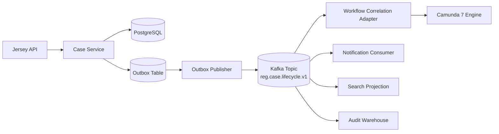
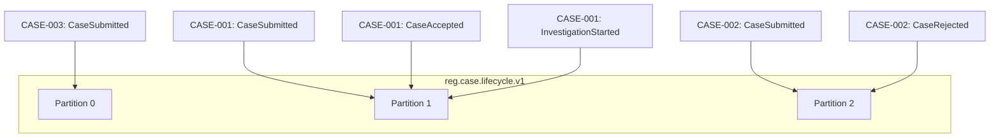

# Part 031 — Kafka Topic and Event Modeling

Kita sudah membangun kontrak HTTP, kontrak database, kontrak BPMN, dan boundary Java. Sekarang kita masuk ke Kafka.

Masalah utama di sini bukan “cara send message ke Kafka”. Itu terlalu kecil.

Masalah produksi yang sebenarnya adalah:

> Bagaimana mendesain event stream yang tetap benar ketika service di-deploy ulang, consumer tertinggal, event di-replay, schema berubah, topic bertambah, incident terjadi, dan beberapa workflow Camunda menunggu event yang sama?

Kafka bukan queue biasa. Kafka adalah distributed log. Topic, partition, key, offset, retention, dan consumer group bukan detail teknis pinggiran. Itu adalah bagian dari kontrak sistem.

Di part ini kita akan membangun event model untuk **Regulatory Enforcement Case Platform**.

---

## 1. Target Mental Model

Setelah bagian ini, kamu harus bisa membedakan lima hal berikut dengan tegas:

| Konsep | Pertanyaan yang dijawab |
|---|---|
| Event | Fakta apa yang sudah terjadi? |
| Topic | Stream fakta ini milik kontrak siapa? |
| Key | Urutan lokal harus dijaga berdasarkan apa? |
| Partition | Parallelism dan ordering dibatasi di mana? |
| Consumer group | Siapa yang membaca stream ini sebagai satu logical application? |

Kesalahan paling mahal biasanya muncul ketika tim menganggap Kafka sebagai “HTTP async”. Akibatnya event menjadi command terselubung, topic menjadi endpoint, consumer menjadi controller, dan retry berubah menjadi duplicate side-effect.

Kita akan pakai aturan sederhana:

> Kafka event adalah fakta yang sudah commit secara domain, bukan permintaan agar service lain melakukan sesuatu.

Command boleh ada, tetapi command topic harus diberi kontrak berbeda. Jangan menyamarkan command sebagai event.

---

## 2. Apa yang Tidak Akan Diulang

Materi ini tidak akan mengulang basic seperti:

- cara install Kafka;
- apa itu producer/consumer secara umum;
- cara membuat topic demo;
- tutorial `kafka-console-producer`;
- definisi dangkal publish-subscribe.

Kita akan fokus pada keputusan desain yang menentukan apakah sistem event-driven bisa bertahan di produksi.

---

## 3. Domain Event untuk Case Platform

Studi kasus kita adalah platform enforcement case. Sistem menerima laporan, melakukan triage, menjalankan workflow investigasi, mengelola human task, mengambil keputusan, membuka appeal window, dan menutup case.

Contoh fakta domain:

```text
CaseSubmitted
CaseAccepted
CaseRejected
CaseAssigned
InvestigationStarted
EvidenceRequested
EvidenceReceived
SlaBreached
CaseEscalated
DecisionProposed
DecisionApproved
DecisionIssued
AppealWindowOpened
CaseClosed
```

Perhatikan bentuk katanya: **past tense**. Event bukan `SubmitCase`, bukan `AssignCase`, bukan `ProcessDecision`. Itu command. Event adalah `CaseSubmitted`, `CaseAssigned`, `DecisionIssued`.

### Rule

```text
Command = intention
Event   = fact
```

Jika event consumer gagal, fakta historisnya tidak berubah. Consumer hanya gagal memproyeksikan, mengirim notifikasi, mengkorelasi process, atau memperbarui read model.

---

## 4. Event Taxonomy

Tidak semua event sama. Untuk sistem production-grade, kita butuh taxonomy eksplisit.

| Jenis | Contoh | Producer | Consumer | Retention | Karakter |
|---|---|---|---|---|---|
| Domain event | `CaseAccepted` | Case service | Workflow, notification, analytics | panjang | fakta domain utama |
| Integration event | `CaseAcceptedForExternalAgency` | Integration service | external gateway | medium/panjang | fakta yang sudah distabilkan untuk luar boundary |
| Process event | `InvestigationTimerExpired` | Camunda bridge | case service, ops | medium | fakta workflow/runtime |
| Audit event | `CaseViewed`, `EvidenceDownloaded` | API/audit service | audit warehouse | panjang | bukti akses dan tindakan |
| Projection event | `CaseSearchProjectionUpdated` | projection service | cache/search | pendek/compacted | event teknis untuk read model |
| Command message | `StartInvestigationCommand` | case service | workflow bridge | pendek | instruksi async, bukan fakta |
| Dead letter event | `CaseEventProcessingFailed` | consumer infrastructure | ops tooling | medium | bukti kegagalan processing |

Taxonomy ini mencegah satu topic “serbaguna” seperti `case-events` berisi semua hal: domain facts, commands, audit logs, retries, dan internal projection noise.

---

## 5. Topic Naming Convention

Kita gunakan format topic yang cukup stabil tetapi tidak terlalu panjang:

```text
<org>.<domain>.<stream>.<version>
```

Untuk studi kasus:

```text
reg.case.lifecycle.v1
reg.case.audit.v1
reg.case.assignment.v1
reg.case.sla.v1
reg.case.decision.v1
reg.case.integration.v1
reg.workflow.case-correlation.v1
reg.ops.dead-letter.v1
```

### Kenapa version di topic?

Karena perubahan breaking pada event stream tidak selalu bisa diselesaikan hanya lewat schema evolution. Kadang semantic stream berubah.

Contoh:

- `CaseClosed` lama berarti selesai final.
- `CaseClosed` baru berarti selesai sementara dan masih bisa reopened.

Itu bukan sekadar perubahan field. Itu perubahan makna. Jika makna stream berubah, buat stream baru atau event type baru. Jangan diam-diam mengubah semantic lama.

### Anti-pattern: topic by consumer

Buruk:

```text
notification-case-events
analytics-case-events
camunda-case-events
```

Kenapa buruk?

Karena producer harus tahu consumer. Topic menjadi coupling dari producer ke consumer. Ketika consumer baru muncul, producer harus berubah. Itu membunuh prinsip event-driven.

Lebih baik:

```text
reg.case.lifecycle.v1
```

Consumer yang butuh lifecycle case membaca topic yang sama dengan consumer group masing-masing.

---

## 6. Event Type Naming

Gunakan event type sebagai semantic contract.

```text
CaseSubmitted
CaseAccepted
CaseRejected
CaseAssigned
CaseEscalated
DecisionIssued
CaseClosed
```

Hindari event type yang terlalu generic:

```text
CaseUpdated
StatusChanged
DataChanged
WorkflowChanged
ActionPerformed
```

Event generic membuat consumer harus reverse-engineer payload.

Buruk:

```json
{
  "eventType": "CaseUpdated",
  "oldStatus": "UNDER_REVIEW",
  "newStatus": "INVESTIGATION",
  "changedFields": ["status", "assigned_team"]
}
```

Lebih baik:

```json
{
  "eventType": "InvestigationStarted",
  "caseId": "CASE-2026-000193",
  "assignedTeam": "FIELD_INVESTIGATION",
  "startedAt": "2026-07-03T02:20:13Z"
}
```

Kenapa?

Karena consumer tidak perlu menebak apakah perubahan status itu berarti investigasi, escalation, reopen, atau correction.

---

## 7. Topic Boundary untuk Case Platform

Blueprint topic awal:

| Topic | Isi | Key | Consumer utama |
|---|---|---|---|
| `reg.case.lifecycle.v1` | event lifecycle case utama | `caseId` | workflow bridge, notification, search projection |
| `reg.case.assignment.v1` | assignment/reassignment facts | `caseId` atau `assigneeId` | workload projection, SLA monitor |
| `reg.case.sla.v1` | SLA obligation/breach facts | `caseId` | escalation service, reporting |
| `reg.case.decision.v1` | proposed/approved/issued decision | `caseId` | document service, external publication |
| `reg.case.audit.v1` | access/action audit | `caseId` atau `actorId` | audit warehouse |
| `reg.workflow.case-correlation.v1` | process correlation events | `caseId` | Camunda correlation adapter |
| `reg.ops.dead-letter.v1` | failed consumer processing evidence | `eventId` | ops console |

Topic boundary harus mengikuti **stream contract**, bukan tabel database.

Jangan membuat topic seperti:

```text
case_core.case
case_core.case_party
case_core.case_evidence
```

Itu CDC table stream, bukan domain event stream. CDC bisa berguna, tetapi contract-nya berbeda. Domain consumer biasanya tidak boleh dipaksa memahami bentuk tabel internal.

---

## 8. Partition Key: Kontrak Ordering Lokal

Kafka memberi ordering di dalam partition. Kalau dua event harus diproses berurutan, mereka harus masuk ke partition yang sama. Cara umum mencapainya adalah memakai key yang sama.

Untuk case platform, default key adalah:

```text
caseId
```

Karena lifecycle case harus terurut per case.

Contoh:

```text
CASE-001: CaseSubmitted
CASE-001: CaseAccepted
CASE-001: InvestigationStarted
CASE-001: DecisionIssued
CASE-001: CaseClosed
```

Semua event `CASE-001` harus memakai key `CASE-001`.

### Decision table untuk partition key

| Event family | Candidate key | Pilihan | Alasan |
|---|---:|---:|---|
| Case lifecycle | `caseId` | yes | ordering lifecycle per case wajib |
| Assignment workload | `caseId` | usually | assignment adalah bagian dari lifecycle case |
| Assignee workload snapshot | `assigneeId` | sometimes | berguna jika stream memang untuk workload per assignee |
| Audit access | `actorId` atau `caseId` | depends | pilih berdasarkan query/replay utama |
| External agency integration | `externalAgencyId` atau `caseId` | depends | jika ordering per agency penting, pakai agency; jika per case, pakai case |
| SLA obligation | `caseId` | yes | SLA state melekat pada case |
| Dead letter | `eventId` | yes | tidak perlu ordering per case; perlu distribusi merata |

### Rule

> Pilih key berdasarkan ordering invariant, bukan berdasarkan distribusi traffic saja.

Distribusi memang penting. Tetapi memilih random key demi throughput dapat menghancurkan ordering domain.

Jika satu case bisa memiliki traffic sangat besar, pecahkan event family dengan hati-hati. Jangan langsung mengganti key menjadi random. Tanyakan dulu: apakah event-event itu memang perlu saling terurut?

---

## 9. Ordering Contract

Ordering yang realistis:

```text
Kafka topic global order      : no
Kafka partition order         : yes
Per key order with stable key : yes, practically, if key maps to same partition
Cross-topic order             : no
Cross-service commit order    : no
Database commit + Kafka order : not automatic
```

Ini berarti consumer tidak boleh berasumsi bahwa `DecisionIssued` di topic A akan terlihat sebelum `NotificationRequested` di topic B.

Jika consumer membutuhkan state lengkap, desain salah satu dari tiga pola:

1. konsumsi dari satu stream canonical;
2. gunakan event version/sequence per aggregate;
3. baca source of truth dari API/database owner setelah menerima event tipis.

### Aggregate sequence

Tambahkan sequence per aggregate untuk mendeteksi gap/out-of-order secara eksplisit:

```json
{
  "eventId": "evt-01J0...",
  "eventType": "DecisionIssued",
  "aggregateType": "Case",
  "aggregateId": "CASE-2026-000193",
  "aggregateVersion": 17,
  "occurredAt": "2026-07-03T02:20:13Z"
}
```

`aggregateVersion` bukan offset Kafka. Offset adalah posisi log. Aggregate version adalah versi domain entity.

Gunanya:

- consumer bisa mendeteksi duplicate version;
- consumer bisa mendeteksi missing version;
- replay bisa diverifikasi;
- projection bisa idempotent.

---

## 10. Event Envelope

Gunakan envelope yang stabil. Payload boleh berubah mengikuti event type, tetapi metadata harus konsisten.

```json
{
  "eventId": "evt-01J0W7F2Z3M8Q6M4K9Z0C7R9RA",
  "eventType": "CaseAccepted",
  "eventVersion": 1,
  "schemaRef": "reg.case.lifecycle.CaseAccepted.v1",
  "aggregateType": "Case",
  "aggregateId": "CASE-2026-000193",
  "aggregateVersion": 4,
  "tenantId": "REG-ID",
  "correlationId": "corr-01J0W7EZS3A6A8EZ7PBG0K7P2V",
  "causationId": "cmd-01J0W7EVV4ZTXZKAR7P0CJ5J4N",
  "producer": "case-service",
  "occurredAt": "2026-07-03T02:20:13Z",
  "publishedAt": "2026-07-03T02:20:14Z",
  "payload": {
    "caseId": "CASE-2026-000193",
    "acceptedBy": "user-48291",
    "acceptedReasonCode": "VALID_JURISDICTION",
    "initialPriority": "HIGH"
  }
}
```

### Field rules

| Field | Rule |
|---|---|
| `eventId` | globally unique, stable, used for dedupe |
| `eventType` | semantic event name, past tense |
| `eventVersion` | version of event payload semantics |
| `schemaRef` | link to contract identity, not necessarily URL |
| `aggregateType` | logical aggregate owner |
| `aggregateId` | Kafka key candidate |
| `aggregateVersion` | domain sequence per aggregate |
| `tenantId` | required if multi-tenant/security filtering exists |
| `correlationId` | traces a business request across services |
| `causationId` | points to command/request/event that caused this event |
| `producer` | service identity |
| `occurredAt` | when fact happened in domain transaction |
| `publishedAt` | when event entered Kafka |
| `payload` | event-specific contract |

Jangan menaruh semua field di payload. Metadata harus queryable dan inspectable tanpa memahami setiap event schema.

---

## 11. Payload Design: Fat vs Thin Event

Ada dua gaya umum.

### Thin event

```json
{
  "eventType": "CaseAccepted",
  "payload": {
    "caseId": "CASE-2026-000193"
  }
}
```

Consumer membaca detail dari API/source-of-truth.

Bagus untuk:

- data sensitif;
- payload besar;
- consumer yang butuh state terbaru;
- kontrak yang ingin stabil.

Risiko:

- replay bergantung pada API owner;
- consumer tidak bisa membangun historical projection murni dari log;
- API owner menjadi bottleneck.

### Fat event

```json
{
  "eventType": "CaseAccepted",
  "payload": {
    "caseId": "CASE-2026-000193",
    "caseType": "PUBLIC_COMPLAINT",
    "priority": "HIGH",
    "jurisdictionCode": "JKT-SOUTH",
    "acceptedBy": "user-48291",
    "acceptedAt": "2026-07-03T02:20:13Z"
  }
}
```

Bagus untuk:

- analytics;
- projection;
- replay;
- downstream autonomy.

Risiko:

- PII leakage;
- contract churn;
- stale semantics jika consumer menganggap snapshot sebagai source-of-truth.

### Rekomendasi untuk seri ini

Gunakan **selective fat event**:

- event membawa field yang dibutuhkan mayoritas consumer;
- field sensitif tidak dikirim kecuali memang bagian kontrak;
- payload tidak berisi seluruh aggregate database;
- event tetap punya `aggregateId` dan `aggregateVersion`.

---

## 12. AsyncAPI Contract Skeleton

Kontrak event harus machine-readable. Untuk Kafka topic, AsyncAPI cocok sebagai contract document.

```yaml
asyncapi: '3.0.0'
info:
  title: Regulatory Case Lifecycle Events
  version: '1.0.0'
channels:
  reg.case.lifecycle.v1:
    address: reg.case.lifecycle.v1
    messages:
      CaseAccepted:
        $ref: '#/components/messages/CaseAccepted'
operations:
  publishCaseLifecycleEvent:
    action: send
    channel:
      $ref: '#/channels/reg.case.lifecycle.v1'
components:
  messages:
    CaseAccepted:
      name: CaseAccepted
      title: Case accepted event
      contentType: application/json
      headers:
        type: object
        required:
          - eventId
          - correlationId
        properties:
          eventId:
            type: string
          correlationId:
            type: string
      payload:
        $ref: '#/components/schemas/CaseAcceptedEnvelope'
  schemas:
    CaseAcceptedEnvelope:
      type: object
      required:
        - eventId
        - eventType
        - aggregateId
        - aggregateVersion
        - occurredAt
        - payload
      properties:
        eventId:
          type: string
        eventType:
          const: CaseAccepted
        eventVersion:
          type: integer
          const: 1
        aggregateType:
          type: string
          const: Case
        aggregateId:
          type: string
        aggregateVersion:
          type: integer
        occurredAt:
          type: string
          format: date-time
        payload:
          type: object
          required:
            - caseId
            - acceptedReasonCode
          properties:
            caseId:
              type: string
            acceptedReasonCode:
              type: string
```

Kontrak ini bukan dokumentasi tempelan. Ini harus masuk build pipeline:

```text
AsyncAPI contract -> schema validation -> generated test fixture -> producer test -> consumer compatibility test
```

---

## 13. Topic Configuration Strategy

Topic config bukan urusan ops saja. Ia bagian dari event contract.

Contoh baseline untuk lifecycle event:

```properties
cleanup.policy=delete
retention.ms=7776000000       # 90 hari contoh, sesuaikan compliance
min.insync.replicas=2
```

Untuk snapshot/projection compacted topic:

```properties
cleanup.policy=compact
delete.retention.ms=86400000
min.cleanable.dirty.ratio=0.5
```

Untuk audit event, retention mungkin sangat panjang atau dialirkan ke storage compliance. Jangan hanya mengikuti default cluster.

### Decision table

| Topic | cleanup policy | Retention | Kenapa |
|---|---|---:|---|
| `reg.case.lifecycle.v1` | delete | panjang | event historis penting untuk replay terbatas dan audit teknis |
| `reg.case.audit.v1` | delete | sangat panjang / archive | compliance dan investigasi internal |
| `reg.case.current-state.v1` | compact | indefinite logical latest state | rebuild cache/search current state |
| `reg.ops.dead-letter.v1` | delete | medium | incident triage, bukan source-of-truth abadi |
| `reg.workflow.case-correlation.v1` | delete | medium | process correlation window |

### Tombstone

Pada compacted topic, record dengan key dan null payload bisa dipakai sebagai tombstone. Jangan pakai tombstone pada event historis biasa kecuali semantic delete memang bagian dari stream contract.

---

## 14. Producer Contract

Producer wajib menjamin:

1. event hanya diproduksi setelah domain state commit;
2. event key sesuai ordering contract;
3. eventId stabil dan unik;
4. event schema valid;
5. event tidak mengandung field sensitif di luar kontrak;
6. retry producer tidak menyebabkan duplicate semantic yang tidak bisa ditangani;
7. metrics publication tersedia.

Untuk part ini, kita belum mengimplementasikan outbox detail. Itu ada di Part 032. Tetapi keputusan pentingnya sudah jelas:

> Jangan publish langsung ke Kafka dari request transaction handler sebagai satu-satunya mekanisme integrasi.

Kenapa?

Karena database commit dan Kafka publish bukan satu transaksi tunggal. Direct dual-write menciptakan celah:

```text
DB commit sukses, Kafka publish gagal  -> state berubah, event hilang
Kafka publish sukses, DB rollback      -> event palsu
Kafka publish timeout, sebenarnya sukses -> producer retry, consumer melihat duplicate
```

Solusi yang akan kita pakai: **transactional outbox**.

---

## 15. Consumer Contract

Consumer tidak boleh hanya “consume lalu proses”. Consumer wajib punya kontrak:

| Concern | Rule |
|---|---|
| Duplicate | dedupe pakai `eventId` atau aggregate version |
| Ordering | jangan klaim butuh global order; nyatakan key/order yang dibutuhkan |
| Retry | retry hanya untuk transient failure |
| Poison message | quarantine/DLQ dengan reason eksplisit |
| Schema unknown | fail closed atau skip dengan alert sesuai criticality |
| Offset commit | commit setelah side-effect aman |
| Replay | handler harus idempotent |
| Authorization | jangan percaya event tenant/user tanpa validasi boundary |
| Observability | log `eventId`, `aggregateId`, `correlationId`, `consumerGroup` |

### Consumer pseudo-flow

```text
receive record
  -> parse envelope
  -> validate schemaRef/eventType/eventVersion
  -> check dedupe table by eventId
  -> process side effect transactionally
  -> record inbox success
  -> commit offset
```

Kalau consumer menulis ke PostgreSQL, gunakan inbox table di Part 033. Jangan mengandalkan Kafka offset sebagai satu-satunya dedupe mechanism.

---

## 16. Event Stream Diagram



Perhatikan: API tidak memanggil semua consumer. API hanya mengubah state domain. Event mengalir setelah commit.

---

## 17. Kafka Key Diagram



`CASE-001` harus konsisten ke partition yang sama. Event antar case bisa diproses paralel.

---

## 18. Event Compatibility Rules

Perubahan aman:

- tambah optional field;
- tambah enum value hanya jika consumer siap unknown value;
- tambah event type baru;
- tambah header optional;
- perluas documentation tanpa mengubah semantic.

Perubahan berbahaya:

- rename field;
- hapus field;
- ubah meaning field;
- ubah key;
- ubah event type meaning;
- ubah timestamp semantics;
- ubah required field;
- ubah topic retention tanpa menilai replay/lag consumer.

Perubahan breaking harus menghasilkan salah satu:

1. event version baru;
2. topic version baru;
3. migration window dengan dual publish;
4. consumer compatibility release lebih dulu.

---

## 19. Event Type Registry

Buat registry sederhana di repository contract.

```yaml
stream: reg.case.lifecycle.v1
owner: case-service
key: aggregateId
ordering: per caseId
retention: 90d
messages:
  - eventType: CaseSubmitted
    eventVersion: 1
    schemaRef: reg.case.lifecycle.CaseSubmitted.v1
    compatibility: backward
  - eventType: CaseAccepted
    eventVersion: 1
    schemaRef: reg.case.lifecycle.CaseAccepted.v1
    compatibility: backward
  - eventType: InvestigationStarted
    eventVersion: 1
    schemaRef: reg.case.lifecycle.InvestigationStarted.v1
    compatibility: backward
consumers:
  - name: workflow-correlation-adapter
    criticality: high
    maxLag: PT5M
  - name: case-search-projection
    criticality: medium
    maxLag: PT30M
  - name: notification-service
    criticality: medium
    maxLag: PT10M
```

Registry ini membantu change review. Ketika event berubah, tim tahu siapa yang terdampak.

---

## 20. Java Event Model

Domain event jangan langsung sama dengan Kafka DTO. Kita pisahkan:

```text
DomainEvent -> EventEnvelope -> KafkaRecord
```

Contoh Java 17 sealed type:

```java
public sealed interface CaseDomainEvent permits CaseAccepted, DecisionIssued {
    String caseId();
    long aggregateVersion();
    Instant occurredAt();
}

public record CaseAccepted(
        String caseId,
        long aggregateVersion,
        String acceptedBy,
        String acceptedReasonCode,
        Instant occurredAt
) implements CaseDomainEvent {}

public record EventEnvelope<T>(
        String eventId,
        String eventType,
        int eventVersion,
        String aggregateType,
        String aggregateId,
        long aggregateVersion,
        String tenantId,
        String correlationId,
        String causationId,
        String producer,
        Instant occurredAt,
        Instant publishedAt,
        T payload
) {}
```

Mapping:

```java
public final class CaseEventEnvelopeFactory {
    public EventEnvelope<CaseAcceptedPayload> from(
            CaseAccepted event,
            RequestContext ctx,
            String eventId
    ) {
        return new EventEnvelope<>(
                eventId,
                "CaseAccepted",
                1,
                "Case",
                event.caseId(),
                event.aggregateVersion(),
                ctx.tenantId(),
                ctx.correlationId(),
                ctx.requestId(),
                "case-service",
                event.occurredAt(),
                null,
                new CaseAcceptedPayload(
                        event.caseId(),
                        event.acceptedBy(),
                        event.acceptedReasonCode()
                )
        );
    }
}
```

`publishedAt` diisi oleh publisher ketika record benar-benar dipublish, bukan oleh domain service saat event dibuat.

---

## 21. SQL Projection Implication

Jika event punya `aggregateVersion`, projection bisa idempotent:

```sql
create table projection.case_search_state (
    case_id text primary key,
    aggregate_version bigint not null,
    status text not null,
    priority text not null,
    updated_at timestamptz not null
);
```

Apply event:

```sql
update projection.case_search_state
set status = :status,
    priority = :priority,
    aggregate_version = :aggregateVersion,
    updated_at = now()
where case_id = :caseId
  and aggregate_version < :aggregateVersion;
```

Jika duplicate event datang dengan version sama, update tidak terjadi. Jika event lama datang setelah event baru, update tidak terjadi. Ini bukan pengganti design ordering, tetapi pagar tambahan yang sangat berguna.

---

## 22. Event Privacy and Regulatory Defensibility

Dalam regulatory system, event bisa berisi data sensitif. Jangan menganggap Kafka topic internal selalu aman.

Checklist:

- Apakah payload mengandung PII?
- Apakah payload mengandung evidence detail?
- Apakah consumer semua berhak membaca field itu?
- Apakah event masuk data lake?
- Apakah retention sesuai policy?
- Apakah topic terenkripsi at rest/in transit?
- Apakah audit access terhadap topic tersedia?
- Apakah field perlu tokenization/redaction?

Rule praktis:

> Jika hanya satu consumer yang butuh field sensitif, jangan masukkan field itu ke domain event umum.

Buat event khusus atau consumer mengambil detail dari API dengan authorization check.

---

## 23. Failure Model

| Failure | Penyebab | Dampak | Desain mitigasi |
|---|---|---|---|
| Event duplicate | producer retry, publisher crash, consumer retry | side-effect dobel | `eventId`, inbox table, aggregate version |
| Event missing | direct dual-write, outbox bug | projection/workflow tidak jalan | outbox, reconciliation, lag monitor |
| Event out of order | key salah, multi-topic dependency | state projection salah | stable key, aggregateVersion guard |
| Consumer lag | downstream lambat | SLA/notification delay | lag alert, backpressure, scale consumer |
| Schema mismatch | producer deploy lebih dulu | consumer fail | compatibility gate, schema versioning |
| Poison event | payload valid tapi semantic tak bisa diproses | partition stuck | quarantine/DLQ, manual repair |
| Sensitive data leak | payload terlalu fat | compliance incident | payload review, topic ACL, redaction |
| Compaction surprise | consumer berharap semua history | data hilang untuk replay | cleanup policy documented per topic |
| Topic semantic drift | event meaning berubah diam-diam | wrong decisions | event registry, topic versioning |

---

## 24. Production Checklist

Sebelum topic dianggap production-ready:

- [ ] Topic owner jelas.
- [ ] Topic name mengikuti convention.
- [ ] Event type registry ada.
- [ ] Key strategy ditulis eksplisit.
- [ ] Ordering contract ditulis eksplisit.
- [ ] Retention/compaction policy diset eksplisit.
- [ ] Event envelope disepakati.
- [ ] Schema contract ada di repository.
- [ ] Producer contract test ada.
- [ ] Consumer compatibility test ada.
- [ ] Sensitive field review selesai.
- [ ] DLQ/quarantine strategy ada.
- [ ] Metrics: produce rate, error rate, consumer lag, DLQ count.
- [ ] Replay procedure didokumentasikan.
- [ ] Runbook untuk poison event tersedia.

---

## 25. Anti-Patterns

### 25.1 One topic for everything

```text
events
```

Akibatnya tidak ada ownership, tidak ada retention yang benar, tidak ada schema boundary, dan consumer harus filter sendiri.

### 25.2 Event as database row dump

```json
{
  "eventType": "CaseTableUpdated",
  "row": {
    "id": "...",
    "status_cd": "A",
    "x1": "..."
  }
}
```

Ini membocorkan schema internal dan membuat database migration menjadi breaking event migration.

### 25.3 Random key for throughput

Random key bisa menaikkan distribusi, tetapi menghancurkan ordering per case.

### 25.4 Consumer assumes exactly-once side effect

Kafka bisa membantu delivery semantics di dalam Kafka ecosystem, tetapi side-effect ke PostgreSQL, HTTP external system, email, dan Camunda correlation tetap butuh idempotency.

### 25.5 Generic event type

`CaseUpdated` membuat semua consumer menjadi domain detective.

### 25.6 No replay contract

Jika consumer tidak bisa replay event tanpa merusak state, consumer belum production-grade.

---

## 26. Mini Exercise

Ambil event berikut:

```text
Officer changes case priority from MEDIUM to HIGH because a regulated entity failed to provide evidence before deadline.
```

Jangan langsung membuat `CaseUpdated`.

Pecah menjadi pertanyaan:

1. Fakta domain apa yang terjadi?
2. Apakah ini lifecycle event, SLA event, audit event, atau assignment event?
3. Key-nya apa?
4. Consumer mana yang perlu tahu?
5. Apakah reason code sensitif?
6. Apakah event ini harus memicu Camunda message correlation?

Kemungkinan desain:

```text
Event type : CasePriorityRaised
Topic      : reg.case.lifecycle.v1
Key        : caseId
Payload    : caseId, previousPriority, newPriority, reasonCode, raisedBy, raisedAt
```

Jika penyebabnya SLA breach, mungkin juga ada event terpisah:

```text
SlaBreached
```

Jangan memasukkan semua semantic ke satu event jika itu mewakili dua fakta domain berbeda.

---

## 27. Ringkasan

Kafka topic dan event model adalah kontrak produksi.

Desain yang benar bukan dimulai dari producer API, tetapi dari invariant:

- fakta apa yang perlu disebarkan;
- ordering apa yang wajib dijaga;
- consumer apa yang boleh bergantung pada stream;
- retention apa yang dibutuhkan;
- schema apa yang bisa berevolusi;
- bagaimana duplicate, replay, dan poison message ditangani.

Keputusan terpenting part ini:

```text
Topic follows stream ownership.
Event type follows domain fact.
Key follows ordering invariant.
Envelope follows operational traceability.
Consumer follows idempotency contract.
```

Di part berikutnya, kita akan menjawab pertanyaan paling praktis:

> Bagaimana memastikan event hanya keluar setelah database transaction commit, tanpa kehilangan event ketika Kafka atau service gagal?

Jawabannya: **Producer Outbox Pattern**.
